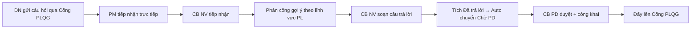
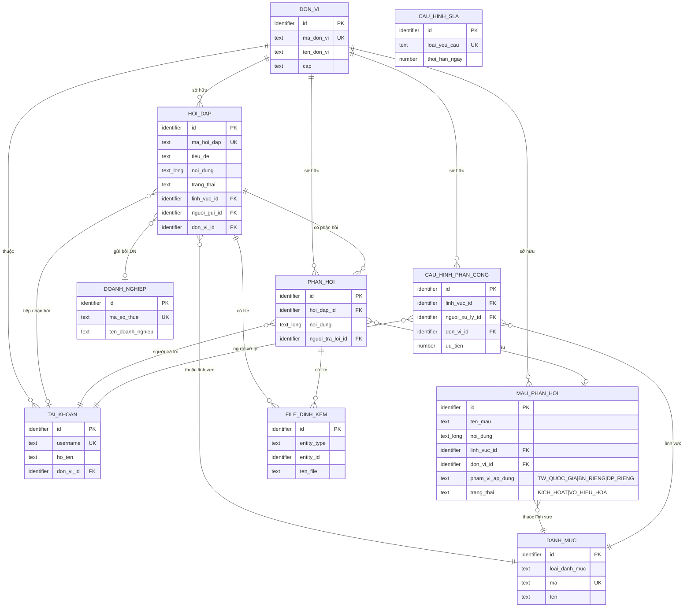
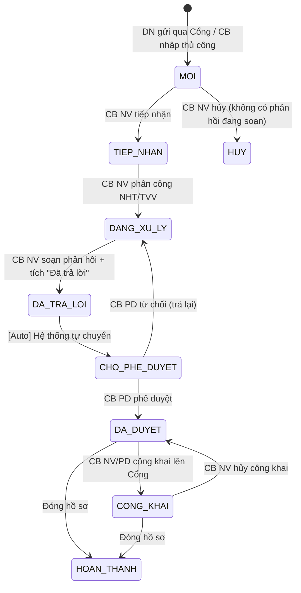

# SRS — Section 3.2.4: Quản lý Hỏi đáp, Vướng mắc Pháp luật

**Dự án:** Phần mềm hỗ trợ pháp lý doanh nghiệp
**Phiên bản SRS:** 3.0
**Nhóm:** II — Quản lý Hỏi đáp, Vướng mắc Pháp luật
**UC range:** UC 10 – UC 19
**Số FR:** 13 (FR-II-01 đến FR-II-10, FR-II-NEW-01, FR-II-NEW-02, FR-II-CROSS-01)
**File chính:** `srs-v3.md` Section 3.2

---

## Lịch sử thay đổi

| Ngày | Tác giả | Mô tả thay đổi |
|------|---------|-----------------|
| 2026-04-03 | SRS Agent (Claude) | Tạo mới từ `srs-v3.md` theo Template v3.0 |
| 2026-04-16 | BA | Áp dụng CR đối tác: CR-01, CR-06, CR-II-01, CR-II-02, CR-II-03, CR-II-06, CR-II-07 |
| 2026-05-02 | SRS Agent | Apply per-module review fix (9 finding 🔴+🟠+🟡 + meta-review điều chỉnh): F-FR02-01 (sửa cite NĐ55 Đ.9 SAI → Đ.8 K.1 + thêm `muc_do_phuc_tap` 2-tier SLA 15/30 ngày LV); F-FR02-02 (FR-II-06 thêm `loai_doi_tuong_xu_ly` + `to_chuc_tu_van_id` cho TC TV theo NĐ77/2008 + NĐ55/2019 Đ.9); F-FR02-04 (bỏ PHAN_HOI.trang_thai dead column theo CSV check); F-FR02-03 (cross-ref retention master); F-FR02-05 (Inputs đầy đủ FR-II-04 + FR-II-09); F-FR02-06 (Error Handling 4 FR thiếu); F-FR02-07 (Tác nhân 6 FR); F-FR02-08 (TVN_BRIDGE enum + tu_van_nhanh_goc_id); F-FR02-09 (định nghĩa ERR-PD-05). Master srs-v3.md: sửa cite Đ.9→Đ.8 K.1 cho HOI_DAP SLA + cite Đ.10→Đ.9 cho TO_CHUC_TU_VAN mạng lưới TVV + 4 vị trí cite Đ.9 SAI cho VU_VIEC/CHI_TRA mark "🟡 cần CĐT xác nhận". Đã verify pháp luật web 3 lượt (luatvietnam.vn, vanban.chinhphu.vn, thuvienphapluat.vn). |
| 2026-05-03 | SRS Agent | Apply screen coverage review (23 finding qua 10 dimensions A1-A6 + B1/B2/B4/B5): F-01 deprecate `trang_thai_luan_chuyen` dead field (không có CSV transaction); F-02 nút "Đổi mức độ phức tạp" SCR-II-02; F-03 tiêu đề + label "Đang phân công cho" khi phân công lại SCR-II-03; F-04 Form Thêm mới thêm radio `muc_do_phuc_tap`; F-05 cột "Mức độ" + filter trong bảng SCR-II-01; F-06 filter + badge cột Kênh thêm TVN_BRIDGE; F-07 Errors FR-II-04 chi tiết (ERR-TH-01/02/03); F-08 Errors FR-II-06 chi tiết (ERR-PC-04/05/06); F-09 cấp lẫn lộn cho batch Công khai; F-10 loading skeleton SCR-II-01; F-11 loading + 403 + 404 SCR-II-02; F-12 loading bảng gợi ý SCR-II-03; F-13 hiển thị "(Đã xóa)" khi FK trỏ record vô hiệu; F-14/15 counter `{n}/1000` cho ly_do_huy + ghi_chu_tiep_nhan; F-16 emoji strip ten_nguoi_gui; F-17 dropdown form handle FK đã vô hiệu; F-18 counter mo_ta_cong_khai sau XSS sanitize; F-19 session expired modal + auto-save draft localStorage; F-20 user mất quyền giữa chừng (toast + giữ data + sao chép); F-21 Lưu nháp auto-save 60s + optimistic locking PHAN_HOI; F-22 batch optimistic locking + báo cáo per-record; F-23 aria-label icon-only buttons (WCAG 4.1.2). Skip F-24 (INFO + cross-file). |
| 2026-05-03 | SRS Agent | Apply deep review screen coverage (5 gap → fix 5/5): G-DR-01 thêm 3 row định nghĩa ERR-DELETE-STATE/AUTH-DEL/BATCH-CONFLICT vào FR-II-01 Error Handling; G-DR-02 thêm BR-CALC-04 chính thức rule "đổi muc_do_phuc_tap khi TIEP_NHAN/DANG_XU_LY"; G-DR-03 convention `PHAN_HOI.ngay_tra_loi IS NULL = draft` thay cho cột trang_thai đã bỏ; G-DR-04 thêm SEC-07 + EC-SEC-07a vào srs-v3.md §3.5.1 (lifecycle policy localStorage draft: AES-256-GCM, auto-clear logout/24h); G-DR-05 thêm UI nút "Escalate sang Nhom II" vào FR-13 SCR-X2-03 (cột Hành động + mode trả lời) + modal xác nhận. |
| 2026-05-03 | SRS Agent | Đồng bộ UI string literals với prototype theo phản hồi BA "Tiếng Việt thuần, không jargon kỹ thuật" (6 vị trí): dòng 15a + 22a + 44b bỏ "SLA" và viết tắt "ngày LV" → "ngày làm việc" trong tooltip + radio đầy đủ; dòng 13a bỏ "deadline" + "CAU_HINH_SLA" → "hạn xử lý" + "mức độ phức tạp"; dòng 4a empty state PhanCong Cá nhân bỏ "dropdown" + "MH-10.7" → "ô Người xử lý bên dưới"; dòng 4b empty state PhanCong Tổ chức bỏ "TC TV" + "kiểm tra cấu hình mạng lưới" → đơn giản "Chưa có Tổ chức tư vấn nào khớp lĩnh vực"; dòng 4c bỏ viết tắt "TVV" + "TC" → "Tư vấn viên" + "Tổ chức" đầy đủ + bỏ "liên hệ TC để bổ sung TVV" (không actionable từ UI). Giữ nguyên các tham chiếu kỹ thuật (BR-XXX, F-NN, ERR-XXX) trong phần spec dev — chỉ sửa text hiển thị cho cán bộ. |
| 2026-05-03 | SRS Agent | Lượt 3: tiếp tục đồng bộ Tiếng Việt thuần sau feedback BA test prototype (3 ảnh): (1) Dòng 35 bulk Công khai report — bỏ ERR codes trực tiếp trong toast hiển thị, chuyển sang nhãn tiếng Việt "Cổng Pháp luật Quốc gia không phản hồi" / "Khác cấp đơn vị" / "Cán bộ khác đã sửa giữa chừng" / "Đang khóa bản ghi"; (2) Dòng E8 (ERR-PD-05) toast "Batch tối đa 100..." → "Mỗi lần phê duyệt tối đa 100 bản ghi. Vui lòng chọn ít hơn."; (3) SCR-II-03 dòng 2 "tên TC TV" + "CAU_HINH_SLA" → "tên Tổ chức tư vấn" + "cấu hình thời hạn"; (4) Sweep 10 lần "in-app" trong toàn SRS → "trong hệ thống" (spec text describing notification channels). Phần tham chiếu kỹ thuật BR/F/ERR trong description column dev-spec giữ nguyên. |

---

## Mục lục file này

- [1. Tổng quan nhóm](#1-tổng-quan-nhóm)
- [2. Yêu cầu chức năng chi tiết](#2-yêu-cầu-chức-năng-chi-tiết)
- [3. Màn hình chức năng](#3-màn-hình-chức-năng)
- [4. Entity liên quan](#4-entity-liên-quan)
- [5. State Machine liên quan](#5-state-machine-liên-quan)
- [6. Business Rules liên quan](#6-business-rules-liên-quan)

---

## 1. Tổng quan nhóm

**Mục đích:** Tiếp nhận, xử lý, kiểm duyệt và công khai câu hỏi/phản hồi pháp luật từ doanh nghiệp.

**Quy trình nghiệp vụ tổng quan:**



**Máy trạng thái SM-HOIDAP:**
```
MOI → TIEP_NHAN → DANG_XU_LY → DA_TRA_LOI (thoáng qua) → CHO_PHE_DUYET → DA_DUYET → CONG_KHAI → HOAN_THANH
CHO_PHE_DUYET → DANG_XU_LY (từ chối, trả lại CB NV)
DA_DUYET → CONG_KHAI (công khai lên Cổng PLQG)
CONG_KHAI → DA_DUYET (hủy công khai)
DA_DUYET / CONG_KHAI → HOAN_THANH (đóng hồ sơ)
MOI → HUY (hủy yêu cầu)
```

**Entity chính:** HOI_DAP, PHAN_HOI, CAU_HINH_PHAN_CONG, MAU_PHAN_HOI, AUDIT_LOG, THONG_BAO

**Tác nhân chính:** Cán bộ Nghiệp vụ (TW/BN/ĐP), Cán bộ Phê duyệt (TW/BN/ĐP), QTHT

---

## 2. Yêu cầu chức năng chi tiết

### FR-II-01: Quản lý thông tin hỏi đáp, vướng mắc pháp luật (UC10)

**UC Reference:** UC 10
**Source:** CĐT xác nhận
**Priority:** Essential
**Stability:** High
**Màn hình:** SCR-II-01 — [Danh sách Hỏi đáp](#scr-ii-01-danh-sách-hỏi-đáp)

**Mô tả:** Quản lý toàn bộ danh sách hỏi đáp pháp luật: xem, thêm mới, sửa, xóa, xuất Excel, làm mới dữ liệu.

**Tác nhân:** Cán bộ Nghiệp vụ (TW/BN/ĐP)

**Preconditions:**
- User đã đăng nhập (BR-AUTH-01)
- User có quyền "Quản lý hỏi đáp" (UC115)
- Phạm vi phân quyền theo đơn vị áp dụng

**Inputs:**

| # | Tên field | Kiểu logic | Bắt buộc | Ràng buộc | Mặc định | Nguồn |
|---|----------|-----------|----------|-----------|----------|-------|
| 1 | ma_hoi_dap | text | Y (auto) | Auto-gen: HD-YYYYMMDD-SEQ | — | system |
| 2 | noi_dung | text (long) | Y | Max 5000 ký tự | — | user input |
| 3 | linh_vuc_id | identifier | Y | Lĩnh vực PL (từ UC99) | — | user input |
| 4 | ten_nguoi_gui | text | N | Max 100 ký tự | — | user input |
| 5 | email_nguoi_gui | text | N | Max 100 ký tự; định dạng email RFC 5322 | — | user input |
| 6 | sdt_nguoi_gui | text | N | Chỉ chữ số (có thể có "+" đầu), min 10, max 11 ký tự | — | user input |
| 7 | doanh_nghiep_id | identifier | N | DN liên kết | — | user input |
| 8 | kenh_tiep_nhan | text | Y | DVC / CONG_PLQG / TRUC_TIEP / HE_THONG_KHAC / TVN_BRIDGE (TVN_BRIDGE: auto-set khi escalate từ Tư vấn nhanh — FR-13; CB không nhập tay được) | — | user input / system (TVN_BRIDGE) |
| 9 | file_dinh_kem | binary[] | N | File đính kèm. Tối đa 10 file/upload, tổng max 100MB, mỗi file max 20MB. Định dạng: doc/docx/xls/xlsx/pdf. Filename UTF-8 (VN có dấu OK, strip emoji), max 255 ký tự. Trùng tên: auto-rename `{name}_1.{ext}`. Quét virus ClamAV bắt buộc (virus/timeout → reject). Reject file 0 byte. | — | user upload |
| 10 | don_vi_id | identifier | Y | FK → DON_VI. DN chọn cơ quan tiếp nhận. Mặc định: Sở TP tỉnh/TP nơi DN đăng ký. Dropdown: tất cả DON_VI (TW+BN+ĐP) `[CR-06][Q-04]` | Sở TP tỉnh DN | user input / system default |
| 11 | muc_do_phuc_tap | text (enum) | Y | CHECK IN ('THUONG','PHUC_TAP'). Mặc định 'THUONG'. CB NV phân loại khi tiếp nhận theo NĐ55/2019 Đ.8 K.1: THUONG = vướng mắc thường (SLA 15 ngày LV); PHUC_TAP = vướng mắc phức tạp hoặc liên quan nhiều ngành/lĩnh vực/địa phương (SLA 30 ngày LV). | THUONG | user input |

**Processing — Thêm mới:**

| Bước | Mô tả xử lý | BR áp dụng |
|------|-------------|-----------|
| 1 | Kiểm tra quyền | BR-AUTH-01 |
| 2 | Tự sinh mã hỏi đáp: HD-{YYYYMMDD}-{SEQ} | BR-DATA-04 |
| 3 | Kiểm tra dữ liệu: nội dung không trống, <= 5000 ký tự | — |
| 4 | Kiểm tra lĩnh vực tồn tại | — |
| 5 | Đặt trạng thái = MOI | SM-HOIDAP |
| 5a | Nếu nguồn Cổng PLQG: don_vi_id = DN chọn (mặc định Sở TP tỉnh DN). Nếu CB nhập tay: don_vi_id = đơn vị CB đang đăng nhập `[CR-06][Q-04][Q-05]` | — |
| 6 | Nếu nguồn từ Cổng PLQG: ghi nhận từ API inbound | — |
| 7 | Tạo bản ghi HOI_DAP | BR-DATA-03 |
| 8 | Nếu có file: tạo bản ghi FILE_DINH_KEM | — |
| 9 | Tính deadline SLA từ cấu hình SLA (loại = 'HOI_DAP') | BR-CALC-03 |
| 10 | Ghi nhật ký thao tác | BR-DATA-05 |

**Processing — Chỉnh sửa:**

| Bước | Mô tả xử lý | BR áp dụng |
|------|-------------|-----------|
| 1 | Kiểm tra trạng thái không phải DA_DUYET hoặc HOAN_THANH | BR-FLOW-03 |
| 2 | Kiểm tra dữ liệu đầu vào | — |
| 3 | Cập nhật bản ghi HOI_DAP | — |
| 4 | Ghi nhật ký thao tác (giá trị cũ → mới) | BR-DATA-05 |

**Processing — Xóa (soft delete):**

| Bước | Mô tả xử lý | BR áp dụng |
|------|-------------|-----------|
| 1 | Kiểm tra trạng thái NOT IN (DA_DUYET, CONG_KHAI, HOAN_THANH). Nếu vi phạm → ERR-HD-04. Đặc biệt: state CONG_KHAI phải được Hủy công khai (về DA_DUYET) trước khi xóa — tránh xóa record trong DB nhưng vẫn còn trên Cổng PLQG. Ref F-19. | BR-FLOW-03 |
| 2 | Đánh dấu bản ghi là đã xóa | BR-DATA-01 |
| 3 | Ghi nhật ký thao tác | BR-DATA-05 |

**Processing — Xuất Excel:**

| Bước | Mô tả xử lý | BR áp dụng |
|------|-------------|-----------|
| 1 | Truy vấn danh sách theo bộ lọc hiện tại, tối đa 10.000 dòng | BR-DATA-06 |
| 2 | Tạo file Excel (.xlsx) theo cấu trúc chi tiết dưới (F-13) | — |
| 3 | Trả về file tải về. Tên file: `HoiDap_{YYYYMMDD_HHmm}.xlsx` | — |

**Cấu trúc file Excel xuất** (ref F-13):

- **Columns theo thứ tự (UI-visible column headers):** Số thứ tự · Mã hỏi đáp · Tiêu đề · Nội dung đầy đủ (không truncate) · Lĩnh vực pháp luật · Người gửi · Email · Số điện thoại · Doanh nghiệp · Kênh tiếp nhận · Trạng thái (tiếng Việt, không dùng mã) · Đơn vị tiếp nhận · Ngày tạo · Ngày tiếp nhận · Hạn xử lý · Mức thời hạn xử lý (Bình thường/Sắp hết hạn/Quá hạn/Quá hạn nghiêm trọng) · Người xử lý · Người duyệt · Ngày duyệt.
- **Format:**
  - Header row: in đậm, background xám nhạt, freeze row 1.
  - Column width: auto-fit với max 50 ký tự (content dài hơn wrap text).
  - Datetime: `dd/mm/yyyy HH:mm` (24h).
  - Date: `dd/mm/yyyy`.
  - Enum trạng thái: hiển thị tiếng Việt đã mapping (VD `CONG_KHAI` → "Công khai").
- **Footer (row cuối sau data):**
  - `Xuất lúc: {dd/mm/yyyy HH:mm}`
  - `Bởi: {ho_ten} ({username}) — Đơn vị: {ten_don_vi}`
  - `Bộ lọc áp dụng: {filter_summary}` (liệt kê các filter đang apply, VD "Lĩnh vực: Đất đai; Trạng thái: Đang xử lý; Từ ngày: 01/01/2026")
  - `Tổng số bản ghi: {N}`
- **Cảnh báo truncate:** nếu `total_count > 10.000` → popup WRN-HD-01 trước khi tải; file xuất đầu tiên là 10.000 record đầu theo order mặc định (`ngay_tao DESC`) + footer cảnh báo "Đã truncate. Thu hẹp bộ lọc để xuất đầy đủ".

**Outputs:**

| # | Tên | Kiểu logic | Điều kiện | Format |
|---|-----|-----------|-----------|--------|
| 1 | id | identifier | — | — |
| 2 | ma_hoi_dap | text | — | HD-YYYYMMDD-SEQ |
| 3 | noi_dung | text (long) | truncate 200 ký tự | — |
| 4 | ten_linh_vuc | text | — | — |
| 5 | ten_nguoi_gui | text | — | — |
| 6 | kenh_tiep_nhan | text | — | — |
| 7 | trang_thai | text | — | SM-HOIDAP |
| 8 | ngay_tao | datetime | — | dd/mm/yyyy HH:mm |
| 9 | deadline_sla | date | — | dd/mm/yyyy |
| 10 | muc_canh_bao_sla | text | — | BINH_THUONG / SAP_HET / QUA_HAN |
| 11 | total_count | number | — | — |

**Error Handling:**

| # | Điều kiện lỗi | Mã lỗi | Phản hồi hệ thống | Severity |
|---|--------------|--------|-------------------|----------|
| E1 | Nội dung câu hỏi trống | ERR-HD-01 | "Nội dung câu hỏi là bắt buộc" | ERROR |
| E2 | Nội dung vượt 5000 ký tự | ERR-HD-02 | "Nội dung câu hỏi tối đa 5000 ký tự" | ERROR |
| E3 | Lĩnh vực không tồn tại | ERR-HD-03 | "Lĩnh vực pháp luật không tồn tại" | ERROR |
| E4 | Sửa/xóa bản ghi đã duyệt | ERR-HD-04 | "Không thể sửa/xóa bản ghi đã phê duyệt" | ERROR |
| E5 | Export vượt 10.000 rows | WRN-HD-01 | "Hệ thống sẽ xuất 10.000 dòng đầu tiên" | WARNING |
| E6 | Batch xóa: bản ghi ở state cấm xóa (DA_DUYET/CONG_KHAI/HOAN_THANH) | ERR-DELETE-STATE | "Bản ghi #{ma_hoi_dap} ở trạng thái '{tt}' không thể xóa (đã duyệt/công khai/hoàn thành)" | ERROR (per-record trong batch) |
| E7 | Batch xóa: user không có quyền xóa bản ghi (khác đơn vị) | ERR-AUTH-DEL | "Không có quyền xóa bản ghi #{ma_hoi_dap} (thuộc đơn vị khác)" | ERROR (per-record trong batch) |
| E8 | Batch (xóa/duyệt/công khai): conflict optimistic locking — bản ghi đã bị user khác cập nhật giữa chừng | ERR-BATCH-CONFLICT | "Bản ghi #{ma_hoi_dap} đã được {user_khac} cập nhật lúc {time}, đã skip trong batch. Vui lòng tải lại danh sách và thử lại" | ERROR (per-record trong batch, skip + báo cáo) |

**Postconditions:**
- Bản ghi HOI_DAP được tạo/cập nhật/xóa mềm
- Nhật ký thao tác ghi nhận
- Deadline SLA được tính tự động khi tạo mới

**Acceptance Criteria:**
- **Given** CB NV đăng nhập **When** truy cập "Quản lý hỏi đáp" **Then** hiển thị danh sách thuộc đơn vị, phân trang
- **Given** CB NV xem chi tiết **When** chọn hỏi đáp **Then** hiển thị đầy đủ: nội dung, người gửi, lĩnh vực, thời gian, trạng thái, mức độ phức tạp
- **Given** CB NV thêm mới **When** nhập đủ trường bắt buộc + Lưu **Then** validate và lưu (mặc định `muc_do_phuc_tap=THUONG`)
- **Given** CB NV chọn `muc_do_phuc_tap=PHUC_TAP` khi tạo mới hoặc tiếp nhận **When** Lưu **Then** deadline tính theo CAU_HINH_SLA[HOI_DAP_PHUC_TAP] (30 ngày LV) — NĐ55/2019 Đ.8 K.1
- **Given** CB NV chỉnh sửa **When** cập nhật và nhấn Lưu **Then** validate và lưu thay đổi
- **Given** CB NV xóa **When** xác nhận **Then** soft delete
- **Given** CB NV xuất danh sách **When** nhấn "Xuất Excel" **Then** tạo file Excel theo filter hiện tại
- **Given** CB NV nhấn "Làm mới" **When** xử lý **Then** reload dữ liệu mới nhất (AJAX, giữ filter/scroll)

---

### FR-II-02: Tìm kiếm hỏi đáp tổng hợp (UC11)

**UC Reference:** UC 11
**Priority:** Essential | **Stability:** High
**Màn hình:** SCR-II-01

**Tác nhân:** Cán bộ Nghiệp vụ (TW/BN/ĐP)

**Inputs:**

| # | Tên field | Kiểu logic | Bắt buộc | Ràng buộc | Mặc định | Nguồn |
|---|----------|-----------|----------|-----------|----------|-------|
| 1 | keyword | text | N | Full-text search trên nội dung | — | user input |
| 2 | linh_vuc_id | identifier | N | — | — | user input |
| 3 | tu_ngay | date | N | — | — | user input |
| 4 | den_ngay | date | N | — | — | user input |
| 5 | trang_thai | text | N | — | — | user input |
| 6 | kenh_tiep_nhan | text | N | — | — | user input |

**Processing:**

| Bước | Mô tả xử lý | BR áp dụng |
|------|-------------|-----------|
| 1 | Kiểm tra quyền + phạm vi phân quyền | BR-AUTH-01 |
| 2 | Nếu keyword: tìm kiếm toàn văn trên nội dung | BR-DATA-08 |
| 3 | Áp dụng tất cả bộ lọc (AND logic) | — |
| 4 | Phân trang + trả về | BR-DATA-07 |

**Outputs:**

| # | Tên | Kiểu logic | Điều kiện | Format |
|---|-----|-----------|-----------|--------|
| 1 | id | identifier | — | — |
| 2 | ma_hoi_dap | text | — | HD-YYYYMMDD-SEQ |
| 3 | noi_dung | text (long) | truncate 200 ký tự | — |
| 4 | ten_linh_vuc | text | — | — |
| 5 | ten_nguoi_gui | text | — | — |
| 6 | kenh_tiep_nhan | text | — | — |
| 7 | trang_thai | text | — | SM-HOIDAP |
| 8 | ngay_tao | datetime | — | dd/mm/yyyy HH:mm |
| 9 | deadline_sla | date | — | dd/mm/yyyy |
| 10 | muc_canh_bao_sla | text | — | BINH_THUONG / SAP_HET / QUA_HAN |
| 11 | total_count | number | — | — |

**Postconditions:** Read-only, không thay đổi dữ liệu.

**Error Handling:**

| # | Điều kiện lỗi | Mã lỗi | Phản hồi hệ thống | Severity |
|---|--------------|--------|-------------------|----------|
| E1 | Không có kết quả | INF-HD-TK-01 | "Không tìm thấy hỏi đáp phù hợp" | INFO |
| E2 | tu_ngay > den_ngay | ERR-HD-TK-01 | "Ngày bắt đầu phải trước ngày kết thúc" | ERROR |

**Acceptance Criteria:**
- **Given** CB NV nhập từ khóa **When** tìm kiếm **Then** kết quả matching, phân trang
- **Given** CB NV lọc theo thời gian + lĩnh vực **When** áp dụng **Then** kết quả lọc theo cả 2 điều kiện
- **Given** CB NV kết hợp nhiều điều kiện **When** tìm kiếm **Then** kết quả AND logic
- **Given** không có kết quả **When** tìm kiếm **Then** hiển thị "Không tìm thấy"

---

### FR-II-03: Tiếp nhận xử lý hỏi đáp (UC12)

**UC Reference:** UC 12
**Priority:** Essential | **Stability:** High
**Màn hình:** SCR-II-02 — [Chi tiết & Soạn Phản hồi](#scr-ii-02-chi-tiết--soạn-phản-hồi)

**Tác nhân:** Cán bộ Nghiệp vụ (TW/BN/ĐP)

**Preconditions:**
- User đã đăng nhập, có quyền
- HOI_DAP.trang_thai = MOI

**Inputs:**

| # | Tên field | Kiểu logic | Bắt buộc | Ràng buộc | Mặc định | Nguồn |
|---|----------|-----------|----------|-----------|----------|-------|
| 1 | hoi_dap_id | identifier | Y | ID hỏi đáp | — | system |
| 2 | ghi_chu_tiep_nhan | text | N | — | — | user input |

**Processing:**

| Bước | Mô tả xử lý | BR áp dụng |
|------|-------------|-----------|
| 1 | Kiểm tra quyền + phạm vi phân quyền | BR-AUTH-01 |
| 2 | Kiểm tra trạng thái = MOI | SM-HOIDAP |
| 3 | Cập nhật trạng thái = TIEP_NHAN, người tiếp nhận = user hiện tại | — |
| 4 | Tính deadline SLA (nếu chưa tính): ngày tiếp nhận + N ngày làm việc. **N = 15 nếu `muc_do_phuc_tap=THUONG`, N = 30 nếu `muc_do_phuc_tap=PHUC_TAP`** (lấy từ CAU_HINH_SLA loại='HOI_DAP_THUONG' / 'HOI_DAP_PHUC_TAP'). Theo NĐ55/2019 Đ.8 K.1 | BR-CALC-03, BR-SLA-01 |
| 5 | Ghi nhật ký thao tác (hành động = 'TIEP_NHAN') | BR-DATA-05 |

**Error Handling:**

| # | Điều kiện lỗi | Mã lỗi | Phản hồi hệ thống | Severity |
|---|--------------|--------|-------------------|----------|
| E1 | Trạng thái không phải MOI | ERR-TN-01 | "Hỏi đáp đã được tiếp nhận bởi {người khác}" | ERROR |
| E2 | Bản ghi không tồn tại | ERR-TN-02 | "Hỏi đáp không tồn tại hoặc đã bị xóa" | ERROR |

**Outputs:**

| # | Tên | Kiểu logic | Điều kiện | Format |
|---|-----|-----------|-----------|--------|
| 1 | hoi_dap_id | identifier | — | — |
| 2 | trang_thai | text | — | 'TIEP_NHAN' |
| 3 | nguoi_tiep_nhan | text | — | Tên CB tiếp nhận |
| 4 | deadline_sla | date | — | dd/mm/yyyy |

**Postconditions:**
- Trạng thái chuyển từ MOI → TIEP_NHAN
- SLA deadline được tính
- Nhật ký thao tác ghi nhận

**Acceptance Criteria:**
- **Given** có yêu cầu mới **When** CB NV xem danh sách tiếp nhận **Then** hiển thị danh sách chờ tiếp nhận
- **Given** CB NV tiếp nhận với `muc_do_phuc_tap=THUONG` **When** nhấn Tiếp nhận **Then** trạng thái → TIEP_NHAN, deadline = ngày tiếp nhận + **15 ngày làm việc** (CAU_HINH_SLA[HOI_DAP_THUONG]), ghi audit
- **Given** CB NV tiếp nhận với `muc_do_phuc_tap=PHUC_TAP` **When** nhấn Tiếp nhận **Then** trạng thái → TIEP_NHAN, deadline = ngày tiếp nhận + **30 ngày làm việc** (CAU_HINH_SLA[HOI_DAP_PHUC_TAP]) — NĐ55/2019 Đ.8 K.1, ghi audit

**Edge Cases:**

| EC | Điều kiện | Xử lý |
|----|-----------|-------|
| EC-01 | 2 CB NV tiếp nhận cùng HOI_DAP đồng thời | Dùng khóa bản ghi để tránh xung đột. Người thứ 2 nhận ERR-TN-03 'Bản ghi đã được tiếp nhận bởi người khác' |
| EC-02 | Xóa mềm HOI_DAP có PHAN_HOI con | Xóa mềm đồng thời các PHAN_HOI liên kết |
| EC-03 | Excel export đúng 10.000 dòng | 10.000 → xuất tất cả. 10.001 → xuất 10.000 + cảnh báo |

---

### FR-II-04: Quản lý thông tin tiếp nhận xử lý (UC13)

**UC Reference:** UC 13
**Priority:** Essential | **Stability:** High
**Màn hình:** SCR-II-02

**Tác nhân:** Cán bộ Nghiệp vụ (TW/BN/ĐP)

**Mô tả:** Xem danh sách hỏi đáp đang xử lý, cập nhật thời hạn, xem lịch sử phân công/trạng thái/thời hạn, xem kết quả xử lý.

**Inputs (Filter danh sách):**

| # | Tên field | Kiểu logic | Bắt buộc | Ràng buộc | Mặc định | Nguồn |
|---|----------|-----------|----------|-----------|----------|-------|
| 1 | trang_thai_filter | text (auto) | Y | Cố định: IN ('TIEP_NHAN','DANG_XU_LY') | hard-coded | system |
| 2 | keyword | text | N | Full-text search trên noi_dung; max 200 ký tự | — | user input |
| 3 | linh_vuc_id | identifier | N | FK → DANH_MUC | — | user input |
| 4 | tu_ngay | date | N | dd/mm/yyyy | — | user input |
| 5 | den_ngay | date | N | dd/mm/yyyy; den_ngay >= tu_ngay | — | user input |
| 6 | page | number | N | >= 1 | 1 | user input |
| 7 | page_size | number | N | IN (10, 20, 50, 100) | 20 | user input |

**Inputs (Cập nhật thời hạn xử lý):**

| # | Tên field | Kiểu logic | Bắt buộc | Ràng buộc | Mặc định | Nguồn |
|---|----------|-----------|----------|-----------|----------|-------|
| 1 | hoi_dap_id | identifier | Y | FK → HOI_DAP | — | system |
| 2 | thoi_han_moi | date | Y | dd/mm/yyyy; > ngày hiện tại | — | user input |
| 3 | ly_do_thay_doi | text | Y | Min 10 ký tự, max 500 ký tự | — | user input |
| 4 | version | number | Y | Optimistic locking — hidden field | system | system |

**Processing — Cập nhật thời hạn xử lý:**

| Bước | Mô tả xử lý | BR áp dụng |
|------|-------------|-----------|
| 1 | Kiểm tra quyền + trạng thái hợp lệ | BR-AUTH-01 |
| 2 | Form load: lấy `version` hiện tại của HOI_DAP kèm thời hạn cũ. Hidden field `version` trong form. | Section 5 optimistic locking |
| 3 | CB NV nhập thời hạn mới + lý do thay đổi | — |
| 4 | Submit → server kiểm tra `version`. Nếu mismatch (đã bị user khác cập nhật) → HTTP 409 với `ERR-TH-CONFLICT`, trả về `current_version`, `current_thoi_han`, `updated_by_user`, `updated_at`. UI hiển thị toast persistent "Thời hạn đã bị thay đổi bởi {tên_user} lúc {time} thành {new_deadline}" + 2 nút: "Tải lại" (reload form, discard user changes) / "Ghi đè" (force overwrite, audit log ghi rõ hành động force). KHÔNG silent last-write-wins. Ref F-40. | Section 5 optimistic locking, F-40 |
| 5 | Nếu version OK: cập nhật thời hạn, tăng `version` | — |
| 6 | Ghi nhật ký thao tác (thời hạn cũ → mới, lý do, force_overwrite flag nếu có) | BR-DATA-05 |
| 7 | Thông báo người được phân công nếu có | — |

**Processing — Xem lịch sử:**

| Bước | Mô tả xử lý | BR áp dụng |
|------|-------------|-----------|
| 1 | Kiểm tra quyền | BR-AUTH-01 |
| 2 | Truy vấn nhật ký thao tác theo hỏi đáp | — |
| 3 | Trả về timeline: thời gian, người, hành động, giá trị cũ→mới | — |

**Outputs:**

| # | Tên | Kiểu logic | Điều kiện | Format |
|---|-----|-----------|-----------|--------|
| 1 | id | identifier | — | — |
| 2 | ma_hoi_dap | text | — | HD-YYYYMMDD-SEQ |
| 3 | noi_dung | text (long) | truncate 200 ký tự | — |
| 4 | ten_linh_vuc | text | — | — |
| 5 | trang_thai | text | — | SM-HOIDAP |
| 6 | ngay_tao | datetime | — | dd/mm/yyyy HH:mm |
| 7 | deadline_sla | date | — | dd/mm/yyyy |
| 8 | muc_canh_bao_sla | text | — | BINH_THUONG / SAP_HET / QUA_HAN |
| 9 | nguoi_phan_cong | text | — | Tên người được phân công |
| 10 | thoi_han | date | — | Thời hạn xử lý |
| 11 | total_count | number | — | — |

**Postconditions:**
- Thời hạn xử lý được cập nhật (nếu thay đổi)
- Nhật ký thao tác ghi nhận (giá trị cũ → mới, lý do)

**Error Handling:**

| # | Điều kiện lỗi | Mã lỗi | Phản hồi hệ thống | Severity |
|---|--------------|--------|-------------------|----------|
| E1 | tu_ngay > den_ngay | ERR-DXL-01 | "Ngày bắt đầu phải trước ngày kết thúc" | ERROR |
| E2 | Không có kết quả | INF-DXL-01 | "Không có hỏi đáp đang xử lý phù hợp" | INFO |
| E3 | Không có quyền truy cập đơn vị | ERR-AUTH-DXL-01 | "Bạn không có quyền xem danh sách đơn vị này" | ERROR |
| E4 | Cập nhật thời hạn — version mismatch (optimistic locking) | ERR-TH-CONFLICT | "Thời hạn đã bị thay đổi bởi {user} lúc {time} thành {new_deadline}. Vui lòng Tải lại hoặc Ghi đè" | ERROR (HTTP 409) |
| E5 | Cập nhật thời hạn — thoi_han_moi <= ngày hiện tại | ERR-TH-01 | "Thời hạn mới phải sau ngày hiện tại" | ERROR |
| E6 | Cập nhật thời hạn — ly_do_thay_doi < 10 ký tự hoặc > 500 ký tự | ERR-TH-02 | "Lý do thay đổi phải từ 10 đến 500 ký tự" | ERROR |
| E7 | Cập nhật thời hạn — bản ghi NOT IN (TIEP_NHAN, DANG_XU_LY) | ERR-TH-03 | "Không thể cập nhật thời hạn cho bản ghi ở trạng thái '{tt}'" | ERROR |

**Acceptance Criteria:**
- **Given** CB NV truy cập danh sách đang xử lý **When** hiển thị **Then** gồm: người phân công, thời hạn, trạng thái luân chuyển
- **Given** CB NV chọn "Cập nhật thời hạn" **When** nhập thời hạn mới + lý do **Then** cập nhật, ghi audit
- **Given** CB NV chọn "Xem lịch sử" **When** hiển thị **Then** timeline đầy đủ: phân công, trạng thái, thời hạn
- **Given** CB NV chọn "Xem kết quả xử lý" **When** hiển thị **Then** trạng thái, người xử lý, phản hồi, thời gian

---

### FR-II-05: Tìm kiếm hỏi đáp đã tiếp nhận (UC14)

**UC Reference:** UC 14
**Priority:** Essential | **Stability:** High
**Màn hình:** SCR-II-01 (tab "Đang xử lý" — filter bar rows 12-18, filter cứng trang_thai IN (TIEP_NHAN, DANG_XU_LY)). Ref F-01 (mapping trước đây sai → SCR-II-02 là màn chi tiết 1 record, không phải danh sách tìm kiếm).

**Tác nhân:** Cán bộ Nghiệp vụ (TW/BN/ĐP), Cán bộ Phê duyệt (TW/BN/ĐP)

**Inputs:** Giống FR-II-02 + filter cứng: trang_thai IN (TIEP_NHAN, DANG_XU_LY).

**Outputs:**

| # | Tên | Kiểu logic | Điều kiện | Format |
|---|-----|-----------|-----------|--------|
| 1 | id | identifier | — | — |
| 2 | ma_hoi_dap | text | — | HD-YYYYMMDD-SEQ |
| 3 | noi_dung | text (long) | truncate 200 ký tự | — |
| 4 | ten_linh_vuc | text | — | — |
| 5 | nguoi_phan_cong | text | — | Người được phân công |
| 6 | trang_thai | text | — | SM-HOIDAP |
| 7 | ngay_tao | datetime | — | dd/mm/yyyy HH:mm |
| 8 | deadline_sla | date | — | dd/mm/yyyy |
| 9 | total_count | number | — | — |

**Postconditions:** Read-only.

**Error Handling:**

| # | Điều kiện lỗi | Mã lỗi | Phản hồi hệ thống | Severity |
|---|--------------|--------|-------------------|----------|
| E1 | Không có kết quả | INF-HD-TK-02 | "Không tìm thấy hỏi đáp đã tiếp nhận phù hợp" | INFO |

**Acceptance Criteria:**
- **Given** CB nhập từ khóa/lọc thời gian/lĩnh vực **When** tìm kiếm **Then** kết quả matching, phân trang
- **Given** CB kết hợp nhiều điều kiện **When** tìm kiếm **Then** kết quả AND logic

---

### FR-II-06: Phân công xử lý câu hỏi (UC15)

**UC Reference:** UC 15
**Source:** CĐT xác nhận
**Priority:** Essential
**Stability:** High
**Màn hình:** SCR-II-03 — [Phân công xử lý](#scr-ii-03-phân-công-xử-lý)

**Mô tả:** Phân công câu hỏi cho **cá nhân** (CB Nghiệp vụ / TVV / NHT) hoặc **Tổ chức tư vấn** (theo NĐ77/2008 + NĐ55/2019 Đ.9 — mạng lưới tư vấn pháp luật gồm cá nhân + tổ chức hành nghề luật sư + trung tâm TVPL). Gợi ý tự động theo cấu hình lĩnh vực ↔ CB/TC, hiển thị workload hiện tại. Đáp ứng CSV UC15 "gán/chuyển yêu cầu hỏi đáp đến Người hỗ trợ/Tổ chức tư vấn phù hợp".

**Tác nhân:** Cán bộ Nghiệp vụ (TW/BN/ĐP)

**Preconditions:**
- User đã đăng nhập, có quyền "Phân công"
- HOI_DAP.trang_thai IN (TIEP_NHAN, DANG_XU_LY)
- Cấu hình lĩnh vực ↔ CB đã thiết lập (FR-II-NEW-01)

**Inputs:**

| # | Tên field | Kiểu logic | Bắt buộc | Ràng buộc | Mặc định | Nguồn |
|---|----------|-----------|----------|-----------|----------|-------|
| 1 | hoi_dap_id | identifier | Y | — | — | system |
| 2 | loai_doi_tuong_xu_ly | text (enum) | Y | CHECK IN ('CA_NHAN','TO_CHUC') | 'CA_NHAN' | user input |
| 3 | to_chuc_tu_van_id | identifier | Y nếu loai='TO_CHUC' | FK → TO_CHUC_TU_VAN (theo NĐ77/2008 + NĐ55/2019 Đ.9). Áp dụng cho Cty Luật / VP Luật sư / Trung tâm TVPL trong mạng lưới HTPL DN | — | user input |
| 4 | nguoi_xu_ly_id | identifier | Y (cả 2 loại) | FK → TAI_KHOAN. **Nếu loai='CA_NHAN':** CB/TVV/NHT bất kỳ trạng thái HOAT_DONG. **Nếu loai='TO_CHUC':** PHẢI là TVV thuộc TC TV vừa chọn (`TU_VAN_VIEN.to_chuc_chinh_id = to_chuc_tu_van_id`) | — | user input |
| 5 | ghi_chu | text | N | — | — | user input |
| 6 | thoi_han | date | N | Nếu khác SLA mặc định | deadline SLA | user input |

**Processing:**

| Bước | Mô tả xử lý | BR áp dụng |
|------|-------------|-----------|
| 1 | Kiểm tra quyền + phạm vi phân quyền | BR-AUTH-01 |
| 2 | Kiểm tra trạng thái hợp lệ | SM-HOIDAP |
| 3 | Validate input theo loai: nếu `loai='CA_NHAN'` phải có `nguoi_xu_ly_id`, `to_chuc_tu_van_id` phải NULL. Nếu `loai='TO_CHUC'` phải có CẢ `to_chuc_tu_van_id` AND `nguoi_xu_ly_id` (TVV cụ thể) | — |
| 4 | Nếu `loai='TO_CHUC'`: validate `TU_VAN_VIEN[nguoi_xu_ly_id].to_chuc_chinh_id = to_chuc_tu_van_id` (TVV được chọn phải thuộc TC TV được chọn). Nếu fail → ERR-PC-05 | — |
| 5 | Tải danh sách gợi ý phân công: cá nhân (CB/TVV) tự do hoặc tổ chức (TO_CHUC_TU_VAN) đã cấu hình khớp lĩnh vực câu hỏi. Nếu user chọn tổ chức → load danh sách TVV thuộc tổ chức đó để chọn người cụ thể | — |
| 6 | Kiểm tra đối tượng được chọn có trạng thái hoạt động: cá nhân → `TAI_KHOAN.trang_thai='HOAT_DONG'`; tổ chức → `TO_CHUC_TU_VAN.trang_thai='HOAT_DONG'` AND TVV được chọn `TU_VAN_VIEN.trang_thai` hợp lệ | — |
| 7 | Tính workload hiện tại: đếm số hỏi đáp đang xử lý của cá nhân được chọn (đối với TO_CHUC: workload của TVV được cử) | — |
| 8 | Nếu workload vượt ngưỡng → hiển thị cảnh báo (không block) | — |
| 9 | Cập nhật HOI_DAP: SET `loai_doi_tuong_xu_ly` (input) + `nguoi_phan_cong_id = nguoi_xu_ly_id` (input, REQUIRED cả 2 loại) + nếu TO_CHUC: `to_chuc_tu_van_id` (input) else NULL. SET `trang_thai = DANG_XU_LY` | SM-HOIDAP |
| 10 | Gửi thông báo (trong hệ thống + email) cho cá nhân được phân công (TVV cụ thể, cả 2 loại); nếu loai='TO_CHUC' kèm CC email cho điểm liên hệ chính của tổ chức (TO_CHUC_TU_VAN.email_lien_he) | — |
| 11 | Ghi nhật ký thao tác (hành động = 'PHAN_CONG', kèm loai_doi_tuong_xu_ly + to_chuc_tu_van_id nếu có) | BR-DATA-05 |

**Error Handling:**

| # | Điều kiện lỗi | Mã lỗi | Phản hồi hệ thống | Severity |
|---|--------------|--------|-------------------|----------|
| E1 | NHT/TVV cá nhân không còn hoạt động | ERR-PC-01 | "Người được chọn đã bị vô hiệu hóa" | ERROR |
| E2 | Khối lượng công việc vượt ngưỡng | WRN-PC-01 | "Cán bộ {tên} đang xử lý {N} yêu cầu. Xác nhận phân công?" | WARNING |
| E3 | Trạng thái HOI_DAP không hợp lệ | ERR-PC-02 | "Hỏi đáp ở trạng thái '{tt}' không thể phân công" | ERROR |
| E4 | Tổ chức tư vấn không còn hoạt động | ERR-PC-03 | "Tổ chức tư vấn '{ten}' đã bị vô hiệu hóa hoặc tạm dừng hoạt động" | ERROR |
| E5 | Loai='TO_CHUC' nhưng thiếu to_chuc_tu_van_id hoặc nguoi_xu_ly_id (cần cả 2) | ERR-PC-04 | "Phân công cho Tổ chức tư vấn phải chọn đủ 2 thông tin: Tổ chức + Tư vấn viên thuộc tổ chức" | ERROR |
| E6 | Loai='TO_CHUC' nhưng `TU_VAN_VIEN[nguoi_xu_ly_id].to_chuc_chinh_id` ≠ `to_chuc_tu_van_id` (TVV không thuộc TC được chọn) | ERR-PC-05 | "Tư vấn viên '{ten_tvv}' không thuộc Tổ chức '{ten_tc}'. Vui lòng chọn lại" | ERROR |
| E7 | Loai='CA_NHAN' nhưng có truyền to_chuc_tu_van_id | ERR-PC-06 | "Phân công cá nhân không cần chọn Tổ chức tư vấn" | ERROR |

**Outputs:**

| # | Tên | Kiểu logic | Điều kiện | Format |
|---|-----|-----------|-----------|--------|
| 1 | hoi_dap_id | identifier | — | — |
| 2 | loai_doi_tuong_xu_ly | text | — | 'CA_NHAN' / 'TO_CHUC' |
| 3 | ten_nguoi_phan_cong | text | — | Tên cá nhân được phân công (TAI_KHOAN.ho_ten) — luôn có cho cả 2 loại |
| 4 | ten_to_chuc_tu_van | text | Khi loai='TO_CHUC' | Tên tổ chức (TO_CHUC_TU_VAN.ten_to_chuc) |
| 5 | trang_thai | text | — | 'DANG_XU_LY' |
| 6 | goi_y_list | structured | — | Cá nhân: [{id, ho_ten, linh_vuc, workload}]; Tổ chức: [{tc_id, ten_tc, [{tvv_id, ho_ten, workload}]}] |

**Postconditions:**
- HOI_DAP.trang_thai = 'DANG_XU_LY'
- HOI_DAP.loai_doi_tuong_xu_ly + HOI_DAP.nguoi_phan_cong_id được cập nhật (cả 2 loại đều có cá nhân chịu trách nhiệm)
- Nếu loai='TO_CHUC': HOI_DAP.to_chuc_tu_van_id được cập nhật + đảm bảo TU_VAN_VIEN[nguoi_phan_cong_id].to_chuc_chinh_id = to_chuc_tu_van_id
- Thông báo gửi cá nhân (TVV được phân công); nếu TO_CHUC kèm CC email TO_CHUC_TU_VAN.email_lien_he

**Acceptance Criteria:**
- **Given** CB NV chọn phân công **When** hiển thị **Then** 2 tabs "Cá nhân / Tổ chức tư vấn" + danh sách gợi ý theo lĩnh vực PL (gợi ý từ cấu hình mapping)
- **Given** CB NV chọn cá nhân (CB/TVV/NHT tự do) ở tab "Cá nhân" **When** xác nhận **Then** SET `loai_doi_tuong_xu_ly=CA_NHAN`, `nguoi_phan_cong_id=<id>`, `to_chuc_tu_van_id=NULL`, trạng thái → DANG_XU_LY, gửi thông báo cá nhân
- **Given** CB NV chọn Tổ chức tư vấn ở tab "Tổ chức" **When** dropdown TVV xuất hiện **Then** chỉ hiển thị TVV thuộc tổ chức đó (`TU_VAN_VIEN.to_chuc_chinh_id = to_chuc_tu_van_id`)
- **Given** CB NV chọn TC TV + TVV thuộc tổ chức **When** xác nhận **Then** SET `loai_doi_tuong_xu_ly=TO_CHUC`, `to_chuc_tu_van_id=<tc_id>`, `nguoi_phan_cong_id=<tvv_id>`, trạng thái → DANG_XU_LY, gửi thông báo TVV được cử + CC email TC TV (theo NĐ77/2008 + NĐ55/2019 Đ.9)
- **Given** Loai='TO_CHUC' nhưng API client gửi nguoi_xu_ly_id là TVV KHÔNG thuộc TC được chọn (vượt UI validation) **When** server validate **Then** trả ERR-PC-05
- **Given** Loai='TO_CHUC' nhưng thiếu to_chuc_tu_van_id hoặc nguoi_xu_ly_id **When** server validate **Then** trả ERR-PC-04 ("phải chọn đủ 2 thông tin")
- **Given** Loai='CA_NHAN' nhưng có truyền to_chuc_tu_van_id **When** server validate **Then** trả ERR-PC-06
- NHT/TVV cá nhân không còn hoạt động → ERR-PC-01, không cho phép chọn
- Tổ chức tư vấn bị vô hiệu hóa → ERR-PC-03, không cho phép chọn
- Vượt workload → WRN-PC-01 cảnh báo (không block)

---

### FR-II-07: Phản hồi câu hỏi (UC16)

**UC Reference:** UC 16
**Source:** CĐT xác nhận
**Priority:** Essential
**Stability:** High
**Màn hình:** SCR-II-02 — [Chi tiết & Soạn Phản hồi](#scr-ii-02-chi-tiết--soạn-phản-hồi)

**Mô tả:** CB NV hoặc Người hỗ trợ (NHT) được phân công soạn phản hồi cho câu hỏi. Tích "Đã trả lời" → tự động chuyển trạng thái sang CHO_PHE_DUYET.

**Tác nhân:** Cán bộ Nghiệp vụ (TW/BN/ĐP), Người hỗ trợ (NHT) được phân công

**Preconditions:**
- User đã đăng nhập, là người được phân công (CB NV hoặc NHT) hoặc CB NV cùng đơn vị
- Nếu là NHT: `HOI_DAP.nguoi_phan_cong_id = user.id` (xem HOI_DAP_READ_ASSIGNED §3.4.2)
- HOI_DAP.trang_thai IN (DANG_XU_LY)

**Inputs:**

| # | Tên field | Kiểu logic | Bắt buộc | Ràng buộc | Mặc định | Nguồn |
|---|----------|-----------|----------|-----------|----------|-------|
| 1 | hoi_dap_id | identifier | Y | — | — | system |
| 2 | noi_dung_phan_hoi | text (long) | Y | Nội dung phản hồi | — | user input |
| 3 | van_ban_phap_luat | text | N | Trích dẫn VBPL liên quan | — | user input |
| 4 | goi_y | text | N | Gợi ý cho DN | — | user input |
| 5 | da_tra_loi | boolean | N | 1 = tích "Đã trả lời" → trigger auto-transition | false | user input |
| 6 | mau_phan_hoi_id | identifier | N | ID mẫu phản hồi (nếu chèn từ mẫu) | — | user input |
| 7 | file_dinh_kem | binary[] | N | File đính kèm | — | user upload |

**Processing:**

| Bước | Mô tả xử lý | BR áp dụng |
|------|-------------|-----------|
| 1 | Kiểm tra quyền + phạm vi phân quyền | BR-AUTH-01 |
| 2 | Kiểm tra trạng thái hợp lệ | SM-HOIDAP |
| 3 | Nếu có mẫu: tải nội dung mẫu → điền sẵn form | — |
| 4 | Kiểm tra dữ liệu: nội dung phản hồi không trống | — |
| 5 | **Lưu nháp (auto-save 60s hoặc click "Lưu nháp"):** UPSERT PHAN_HOI WHERE `hoi_dap_id={id} AND ngay_tra_loi IS NULL` (chỉ 1 draft active per HOI_DAP). SET `noi_dung`, `nguoi_tra_loi_id=@user`. KHÔNG SET `ngay_tra_loi`. Optimistic locking on PHAN_HOI.version | BR-DATA-03 |
| 6 | **Gửi phản hồi (click "Gửi phản hồi"):** UPDATE draft PHAN_HOI hiện tại SET `ngay_tra_loi = NOW()` (đánh dấu "đã gửi"). Nếu chưa có draft → INSERT mới với `ngay_tra_loi = NOW()` | BR-DATA-03 |
| 7 | Nếu có file: tạo bản ghi FILE_DINH_KEM | — |
| 8 | Cập nhật HOI_DAP.trạng thái = DANG_XU_LY (nếu chưa) | SM-HOIDAP |
| 9 | **Nếu da_tra_loi = 1 (đã tích "Đã trả lời"):** TỰ ĐỘNG cập nhật HOI_DAP.trạng thái = CHO_PHE_DUYET | **BR-FLOW-01** |
| 10 | Nếu bước 9: gửi thông báo cho CB PD cùng cấp | BR-AUTH-05 |
| 11 | Ghi nhật ký thao tác | BR-DATA-05 |

**Error Handling:**

| # | Điều kiện lỗi | Mã lỗi | Phản hồi hệ thống | Severity |
|---|--------------|--------|-------------------|----------|
| E1 | Nội dung phản hồi trống | ERR-PH-01 | "Nội dung phản hồi là bắt buộc" | ERROR |
| E2 | Trạng thái không cho phản hồi | ERR-PH-02 | "Hỏi đáp ở trạng thái '{tt}' không thể phản hồi" | ERROR |
| E3 | Không phải người được phân công | WRN-PH-01 | "Bạn không phải người được phân công. Vẫn muốn phản hồi?" | WARNING |

**Outputs:**

| # | Tên | Kiểu logic | Điều kiện | Format |
|---|-----|-----------|-----------|--------|
| 1 | phan_hoi_id | identifier | — | — |
| 2 | hoi_dap_id | identifier | — | — |
| 3 | trang_thai_hoi_dap | text | — | Trạng thái sau cập nhật |
| 4 | noi_dung_phan_hoi | text (long) | — | — |

**Postconditions:**
- Phản hồi được lưu
- Nếu "Đã trả lời": trạng thái TỰ ĐỘNG chuyển CHO_PHE_DUYET (BR-FLOW-01)
- CB PD cùng cấp nhận thông báo

**Acceptance Criteria:**
- **Given** CB NV chọn phản hồi **When** hiển thị **Then** form phản hồi kèm thông tin câu hỏi gốc
- **Given** CB NV nhập phản hồi + click "Lưu nháp" (hoặc auto-save sau 60s) **When** validate **Then** UPSERT PHAN_HOI với `ngay_tra_loi=NULL` (đánh dấu draft); KHÔNG trigger BR-FLOW-01
- **Given** CB NV click "Gửi phản hồi" **When** validate noi_dung not blank **Then** SET PHAN_HOI.ngay_tra_loi=NOW() (đánh dấu đã gửi); HOI_DAP → DA_TRA_LOI
- **Given** PHAN_HOI có `ngay_tra_loi IS NULL` (draft) **When** CB NV mở lại SCR-II-02 **Then** load draft vào form editor (auto-recovery)
- **Given** CB NV tích "Đã trả lời" + Gửi phản hồi **When** xác nhận **Then** SET ngay_tra_loi + auto-transition DA_TRA_LOI → CHO_PHE_DUYET (BR-FLOW-01)

---

### FR-II-08: Quản lý công khai phản hồi (UC17)

**UC Reference:** UC 17
**Source:** CĐT xác nhận
**Priority:** Essential
**Stability:** High
**Màn hình:** SCR-II-01 (tab "Chờ phê duyệt" — batch approve) + SCR-II-02 (nút Phê duyệt/Từ chối/Công khai/Hủy CK/Đóng hồ sơ)

**Mô tả:** CB Phê duyệt duyệt/từ chối phản hồi, hỗ trợ batch approve, công khai lên Cổng PLQG.

**Tác nhân:** Cán bộ Phê duyệt (TW/BN/ĐP)

**Preconditions:**
- User đã đăng nhập, vai trò CB Phê duyệt
- HOI_DAP.trang_thai = CHO_PHE_DUYET
- CB PD cùng cấp với đơn vị tạo HOI_DAP (BR-AUTH-05)

**Processing — Phê duyệt:**

| Bước | Mô tả xử lý | BR áp dụng |
|------|-------------|-----------|
| 1 | Kiểm tra quyền CB PD + phạm vi phân quyền | BR-AUTH-01, BR-AUTH-05 |
| 2 | Kiểm tra trạng thái = CHO_PHE_DUYET | SM-HOIDAP |
| 3 | Kiểm tra CB PD cùng cấp với đơn vị tạo | BR-AUTH-05 |
| 4 | Cập nhật trạng thái = DA_DUYET, người duyệt, ngày duyệt | — |
| 5 | Ghi nhật ký thao tác | BR-DATA-05 |

**Processing — Công khai:**

**Inputs — Công khai** (ref F-08, HOI_DAP [CR-01] fields):

| # | Tên field | Kiểu logic | Bắt buộc | Ràng buộc | Mặc định |
|---|----------|-----------|----------|-----------|----------|
| 1 | hoi_dap_id | identifier | Y | ID bản ghi đang ở state DA_DUYET | — |
| 2 | anh_dai_dien | file (structured) | N | Upload 1 file, jpg/png/gif, max 5MB. Preview trong modal. Nút "Dùng ảnh hệ thống mặc định" để dùng ảnh default. | Ảnh hệ thống |
| 3 | mo_ta_cong_khai | text (long) | N | Max 2000 ký tự, có counter `{n}/2000`. Placeholder "Mô tả ngắn gọn hiển thị trên Cổng Pháp luật Quốc gia...". Plain text hoặc HTML sanitized (ref F-38 XSS policy). | — |
| 4 | file_dinh_kem_cong_khai | file[] | N | Multiple, PDF/DOC/DOCX/XLS/XLSX, max 20MB/file, tối đa 10 file. Quét virus ClamAV. | — |

**Xử lý — Công khai:**

| Bước | Mô tả xử lý | BR áp dụng |
|------|-------------|-----------|
| 1 | Kiểm tra quyền: CB PD cùng cấp với đơn vị sở hữu record (không cho CB NV công khai) | BR-AUTH-05, BR-FLOW-05, F-20 |
| 2 | Kiểm tra trạng thái = DA_DUYET | SM-HOIDAP |
| 3 | Lock record với TTL 30s + set `api_in_progress=true` (để chặn Hủy công khai concurrent — F-42). Nếu record đang lock bởi thao tác gọi API khác → trả ERR-PD-07 "Đang có thao tác khác đang xử lý trên bản ghi này, vui lòng thử lại sau" + nút Thử lại | F-42 |
| 4 | Validate + sanitize dữ liệu input: `mo_ta_cong_khai` chạy XSS sanitize (whitelist tags, ref F-38); file upload đã qua ClamAV | F-38 |
| 5 | Lưu tạm các field công khai (`anh_dai_dien`, `mo_ta_cong_khai`, `file_dinh_kem_cong_khai`) nhưng CHƯA set `cong_khai=1` và `trang_thai=CONG_KHAI` | EC-04 |
| 6 | Gọi API trực tiếp → Cổng PLQG: đẩy hỏi đáp + phản hồi + ảnh + mô tả + file đính kèm. Sử dụng idempotency key để tránh duplicate nếu retry. | BR-FLOW-05 |
| 7 | Nếu API thành công: cập nhật `trang_thai=CONG_KHAI`, `cong_khai=1`, `thoi_gian_dang_tai=NOW()`, `nguoi_cong_khai_id=@user`. Release lock. | — |
| 8 | Nếu API fail: KHÔNG set CONG_KHAI, giữ DA_DUYET, release lock, trả ERR-PD-04 với message phân biệt (network timeout / server 5xx / business error). Log full request/response vào AUDIT_LOG. | EC-04 |
| 9 | Ghi nhật ký thao tác (hành động = 'CONG_KHAI', trạng thái API, input fields) | BR-DATA-05 |

**Processing — Từ chối:**

**Inputs — Từ chối** (ref F-07):

| # | Tên field | Kiểu logic | Bắt buộc | Ràng buộc | Mặc định |
|---|----------|-----------|----------|-----------|----------|
| 1 | hoi_dap_id | identifier | Y | ID bản ghi đang ở state CHO_PHE_DUYET | — |
| 2 | ly_do_tu_choi | text (long) | Y | Min 10 ký tự, max 1000 ký tự; không trống; plain text (hiển thị cho CB NV tạo ban đầu theo BR-FLOW-04). ERR-PD-02 nếu vi phạm. | — |

**Xử lý — Từ chối:**

| Bước | Mô tả xử lý | BR áp dụng |
|------|-------------|-----------|
| 1 | Kiểm tra quyền: CB PD cùng cấp | BR-AUTH-05 |
| 2 | Kiểm tra dữ liệu: lý do từ chối không trống, ≥10 ký tự, ≤1000 ký tự | BR-FLOW-04, F-07 |
| 3 | Cập nhật trạng thái = DANG_XU_LY (trả lại CB NV), lưu `ly_do_tu_choi` vào PHAN_HOI | SM-HOIDAP |
| 4 | Gửi thông báo (trong hệ thống + email) cho CB NV tạo phản hồi kèm lý do | — |
| 5 | Ghi nhật ký thao tác (hành động = 'TU_CHOI', ly_do_tu_choi) | BR-DATA-05 |

**Processing — Hủy công khai:** [GAP-II-01]

| Bước | Mô tả xử lý | BR áp dụng |
|------|-------------|-----------|
| 1 | Kiểm tra quyền: CB PD cùng cấp với đơn vị sở hữu record | BR-AUTH-01, BR-AUTH-05, F-20 |
| 2 | Kiểm tra trạng thái = CONG_KHAI | SM-HOIDAP |
| 3 | Lock record với TTL 30s + set `api_in_progress=true` (để chặn Công khai concurrent — F-42). Nếu record đang lock bởi thao tác gọi API khác → trả ERR-PD-07 "Đang có thao tác khác đang xử lý trên bản ghi này, vui lòng thử lại sau" + nút Thử lại | F-42 |
| 4 | Gọi API → Cổng PLQG: yêu cầu gỡ hỏi đáp + phản hồi. Sử dụng idempotency key. | BR-FLOW-05 |
| 5 | Nếu API thành công: cập nhật trạng thái = DA_DUYET, `cong_khai=0`, clear `thoi_gian_dang_tai`. Release lock. | — |
| 6 | Nếu API fail: giữ CONG_KHAI, release lock, trả lỗi ERR-PD-06 với message phân biệt loại lỗi. Log full request/response vào AUDIT_LOG. | — |
| 7 | Ghi nhật ký thao tác (hành động = 'HUY_CONG_KHAI', trạng thái API) | BR-DATA-05 |

**Processing — Đóng hồ sơ:** [GAP-II-02]

| Bước | Mô tả xử lý | BR áp dụng |
|------|-------------|-----------|
| 1 | Kiểm tra quyền: CB NV cùng đơn vị (`don_vi_id = user.don_vi_id`) HOẶC CB PD cùng cấp (`cap = record.don_vi.cap`) — ref F-20, BR-AUTH-05 | BR-AUTH-01, BR-AUTH-05, F-20 |
| 2 | Kiểm tra trạng thái IN (DA_DUYET, CONG_KHAI) | SM-HOIDAP |
| 3 | Cập nhật trạng thái = HOAN_THANH, ngày hoàn thành = hiện tại | — |
| 4 | Ghi nhật ký thao tác (hành động = 'DONG_HO_SO') | BR-DATA-05 |

**Processing — Phê duyệt hàng loạt:**

| Bước | Mô tả xử lý | BR áp dụng |
|------|-------------|-----------|
| 1 | Với mỗi hoi_dap_id: thực hiện quy trình phê duyệt đơn | BR-FLOW-02 |
| 2 | Nếu lỗi 1 bản ghi: ghi lỗi, tiếp tục các bản ghi khác | — |
| 3 | Trả về kết quả tổng hợp | — |

**Error Handling:**

| # | Điều kiện lỗi | Mã lỗi | Phản hồi hệ thống | Severity |
|---|--------------|--------|-------------------|----------|
| E1 | CB PD khác cấp | ERR-PD-01 | "Bạn không có quyền phê duyệt bản ghi thuộc đơn vị khác cấp" | ERROR |
| E2 | Từ chối thiếu lý do | ERR-PD-02 | "Vui lòng nhập lý do từ chối" | ERROR |
| E3 | Trạng thái không hợp lệ | ERR-PD-03 | "Hỏi đáp không ở trạng thái chờ phê duyệt" | ERROR |
| E4 | API Cổng PLQG lỗi | ERR-PD-04 | "Lỗi kết nối Cổng Pháp luật Quốc gia. Vui lòng thử công khai lại" | ERROR |
| E5 | Batch: 1+ lỗi | WRN-PD-01 | "Duyệt thành công {N} bản ghi, {M} lỗi" | WARNING |
| E6 | API Cổng PLQG lỗi khi hủy | ERR-PD-06 | "Lỗi kết nối Cổng Pháp luật Quốc gia khi hủy. Vui lòng thử lại" | ERROR | [GAP-II-01]
| E7 | Record đang có thao tác outbound in-progress (lock) | ERR-PD-07 | "Đang có thao tác Công khai/Hủy công khai khác đang xử lý trên bản ghi này bởi {user}. Vui lòng thử lại sau {n}s" | ERROR | [F-42]
| E8 | Batch vượt 100 bản ghi | ERR-PD-05 | "Mỗi lần phê duyệt tối đa 100 bản ghi. Vui lòng chọn ít hơn." | ERROR | [BR-EC-19]

**Outputs:**

| # | Tên | Kiểu logic | Điều kiện | Format |
|---|-----|-----------|-----------|--------|
| 1 | hoi_dap_id | identifier | — | — |
| 2 | trang_thai | text | — | Trạng thái mới |
| 3 | nguoi_duyet | text | — | Tên CB PD |
| 4 | ngay_duyet | datetime | — | dd/mm/yyyy HH:mm |
| 5 | batch_result | structured | Khi batch | [{id, thanh_cong, ly_do_loi}] |

**Postconditions:**
- Phê duyệt: trạng thái → DA_DUYET
- Công khai: trạng thái → CONG_KHAI, phản hồi đẩy lên Cổng PLQG
- Từ chối: trạng thái quay về DANG_XU_LY, CB NV nhận lý do
- Hủy công khai: trạng thái → DA_DUYET, gỡ khỏi Cổng

**Acceptance Criteria:**
- **Given** có phản hồi trạng thái "Chờ phê duyệt" **When** CB PD xem danh sách **Then** hiển thị danh sách chờ duyệt
- **Given** CB PD phê duyệt **When** xác nhận **Then** trạng thái → DA_DUYET
- **Given** CB PD công khai **When** xác nhận **Then** phản hồi gửi qua API lên Cổng PLQG
- **Given** CB PD hủy công khai **When** xác nhận **Then** phản hồi bị gỡ khỏi Cổng
- **Given** CB PD chọn nhiều bản ghi **When** phê duyệt hàng loạt **Then** tất cả được duyệt
- **Given** CB PD từ chối **When** nhập lý do **Then** trả lại CB NV kèm lý do
- **Given** CB PD đã duyệt phản hồi **When** nhấn "Đóng hồ sơ" **Then** trạng thái → HOAN_THANH [GAP-II-02]

**Edge Cases:**

| EC | Điều kiện | Xử lý |
|----|-----------|-------|
| EC-01 | CHO_PHE_DUYET quá N ngày không xử lý | Tự động nhắc nhở CB PD + escalate lên cấp trên (N cấu hình, mặc định 3 ngày LV) |
| EC-02 | Batch approve: mảng hoi_dap_ids quá lớn | Tối đa 100 bản ghi/batch (BR-EC-19). ERR-PD-05 nếu vượt |
| EC-03 | Batch approve: một số thành công, một số lỗi | Xử lý per-record (không all-or-nothing). Trả batch_result chi tiết |
| EC-04 | Công khai: API Cổng PLQG fail nhưng DB đã cập nhật | KHÔNG set CONG_KHAI trước khi API thành công. Giữ DA_DUYET nếu API fail. Tương tự với Hủy công khai: giữ CONG_KHAI nếu API fail |
| EC-05 | Race condition: 2 user cùng click Công khai và Hủy công khai trên cùng record đồng thời | DB lock record với TTL 30s + flag `api_in_progress=true` khi bắt đầu API outbound. User thứ hai nhận ERR-PD-07 + nút Retry. UI disable button action trong khi lock + polling 5s để auto-refresh state. Release lock khi API response hoặc TTL hết. Ref F-42 |

---

### FR-II-09: Quản lý câu hỏi đã xử lý (UC18)

**UC Reference:** UC 18
**Priority:** Essential | **Stability:** High
**Màn hình:** SCR-II-01 (tab "Hoàn thành") + SCR-II-02 (Timeline lịch sử)

**Tác nhân:** Cán bộ Nghiệp vụ (TW/BN/ĐP)

**Mô tả:** Danh sách hỏi đáp đã hoàn tất quy trình, kèm lịch sử xử lý đầy đủ. UC18 "Quản lý" theo CSV → trên thực tế chỉ thực thi tra cứu/xem lịch sử do BR-FLOW-03 cấm sửa/xóa hồ sơ ở DA_DUYET/CONG_KHAI/HOAN_THANH.

**Inputs (Filter danh sách):**

| # | Tên field | Kiểu logic | Bắt buộc | Ràng buộc | Mặc định | Nguồn |
|---|----------|-----------|----------|-----------|----------|-------|
| 1 | trang_thai_filter | text (auto) | Y | Cố định: IN ('DA_DUYET','CONG_KHAI','HOAN_THANH') | hard-coded | system |
| 2 | keyword | text | N | Full-text search trên noi_dung; max 200 ký tự | — | user input |
| 3 | linh_vuc_id | identifier | N | FK → DANH_MUC | — | user input |
| 4 | tu_ngay | date | N | dd/mm/yyyy | — | user input |
| 5 | den_ngay | date | N | dd/mm/yyyy; den_ngay >= tu_ngay | — | user input |
| 6 | page | number | N | >= 1 | 1 | user input |
| 7 | page_size | number | N | IN (10, 20, 50, 100) | 20 | user input |

**Processing:**

| Bước | Mô tả xử lý | BR áp dụng |
|------|-------------|-----------|
| 1 | Truy vấn HOI_DAP theo trạng thái đã hoàn tất + phạm vi phân quyền | BR-AUTH-08 |
| 2 | Kết hợp thông tin PHAN_HOI để lấy lịch sử phản hồi | — |
| 3 | Phân trang | BR-DATA-07 |

**Outputs:**

| # | Tên | Kiểu logic | Điều kiện | Format |
|---|-----|-----------|-----------|--------|
| 1 | id | identifier | — | — |
| 2 | ma_hoi_dap | text | — | HD-YYYYMMDD-SEQ |
| 3 | noi_dung | text (long) | truncate 200 ký tự | — |
| 4 | ten_linh_vuc | text | — | — |
| 5 | trang_thai | text | — | SM-HOIDAP |
| 6 | noi_dung_phan_hoi | text (long) | — | Nội dung phản hồi cuối |
| 7 | nguoi_duyet | text | — | Tên CB duyệt |
| 8 | ngay_duyet | datetime | — | dd/mm/yyyy HH:mm |
| 9 | lich_su | structured | — | Lịch sử xử lý (timeline) |

**Postconditions:** Read-only.

**Error Handling:**

| # | Điều kiện lỗi | Mã lỗi | Phản hồi hệ thống | Severity |
|---|--------------|--------|-------------------|----------|
| E1 | Không có kết quả | INF-DAXL-01 | "Chưa có hỏi đáp nào đã xử lý" | INFO |
| E2 | Không có quyền truy cập đơn vị | ERR-AUTH-DAXL-01 | "Bạn không có quyền xem dữ liệu đơn vị này" | ERROR |
| E3 | Bản ghi không tồn tại khi xem chi tiết | ERR-DAXL-01 | "Hỏi đáp không tồn tại hoặc đã bị xóa" | ERROR |

**Acceptance Criteria:**
- **Given** CB NV truy cập "Đã xử lý" **When** hiển thị **Then** danh sách hỏi đáp hoàn thành, phân trang
- **Given** CB NV xem chi tiết **When** chọn bản ghi **Then** hiển thị toàn bộ lịch sử xử lý
- **Given** CB NV xem danh sách **When** chọn phân trang **Then** hiển thị trang tương ứng [GAP-II-04]
- **Given** CB NV nhấn "Làm mới" **When** xử lý **Then** reload dữ liệu mới nhất [GAP-II-04]

---

### FR-II-10: Tìm kiếm câu hỏi đã xử lý (UC19)

**UC Reference:** UC 19
**Priority:** Essential | **Stability:** High
**Màn hình:** SCR-II-01 (tab "Hoàn thành")

**Tác nhân:** Cán bộ Nghiệp vụ (TW/BN/ĐP), Cán bộ Phê duyệt (TW/BN/ĐP)

**Inputs:** Giống FR-II-02 + filter cứng: trang_thai IN (DA_DUYET, CONG_KHAI, HOAN_THANH).

**Outputs:**

| # | Tên | Kiểu logic | Điều kiện | Format |
|---|-----|-----------|-----------|--------|
| 1 | id | identifier | — | — |
| 2 | ma_hoi_dap | text | — | HD-YYYYMMDD-SEQ |
| 3 | noi_dung | text (long) | truncate 200 ký tự | — |
| 4 | ten_linh_vuc | text | — | — |
| 5 | trang_thai | text | — | SM-HOIDAP |
| 6 | nguoi_duyet | text | — | Tên CB duyệt |
| 7 | ngay_duyet | datetime | — | dd/mm/yyyy HH:mm |
| 8 | total_count | number | — | — |

**Postconditions:** Read-only.

**Error Handling:**

| # | Điều kiện lỗi | Mã lỗi | Phản hồi hệ thống | Severity |
|---|--------------|--------|-------------------|----------|
| E1 | Không có kết quả | INF-HD-TK-03 | "Không tìm thấy hỏi đáp đã xử lý phù hợp" | INFO |
| E2 | tu_ngay > den_ngay | ERR-HD-TK-02 | "Ngày bắt đầu phải trước ngày kết thúc" | ERROR |
| E3 | Không có quyền truy cập đơn vị | ERR-AUTH-TK-01 | "Bạn không có quyền tìm kiếm trong đơn vị này" | ERROR |

**Acceptance Criteria:**
- **Given** CB nhập từ khóa/lọc **When** tìm kiếm **Then** kết quả matching trong kho đã xử lý, phân trang
- **Given** CB NV lọc theo thời gian **When** chọn khoảng ngày **Then** kết quả lọc theo thời gian [GAP-II-03]
- **Given** CB NV lọc theo lĩnh vực **When** chọn lĩnh vực **Then** kết quả lọc theo lĩnh vực [GAP-II-03]
- **Given** không có kết quả **When** tìm kiếm **Then** hiển thị "Không tìm thấy" [GAP-II-03]

---

### FR-II-NEW-01: Cấu hình lĩnh vực ↔ phân công xử lý (UC mới)

**UC Reference:** UC mới — CĐT feedback Q46
**Source:** CĐT xác nhận (Team chủ động thiết kế)
**Priority:** Essential
**Stability:** High
**Màn hình:** ~~SCR-II-06~~ → Chuyển sang Quản trị hệ thống MH-10.7 (Cấu hình hệ thống > Tab "Phân công mặc định")

**Mô tả:** Cấu hình mapping giữa lĩnh vực PL và CB/TVV phụ trách. Khi phân công (FR-II-06), hệ thống gợi ý CB/TVV đã map.

**Tác nhân:** QTHT / Cán bộ Nghiệp vụ TW/BN/ĐP

**Preconditions:**
- User đã đăng nhập, vai trò QTHT hoặc CB NV
- Lĩnh vực PL đã tồn tại (UC99)
- CB/TVV đã có tài khoản (UC113)

**Inputs:**

| # | Tên field | Kiểu logic | Bắt buộc | Ràng buộc | Mặc định | Nguồn |
|---|----------|-----------|----------|-----------|----------|-------|
| 1 | linh_vuc_id | identifier | Y | Lĩnh vực PL | — | user input |
| 2 | nguoi_xu_ly_id | identifier | Y | CB/TVV phụ trách | — | user input |
| 3 | don_vi_id | identifier | Y theo đơn vị | Đơn vị áp dụng | auto-fill | system |
| 4 | uu_tien | number | N | 1 = cao nhất | 99 | user input |

**Processing:**

| Bước | Mô tả xử lý | BR áp dụng |
|------|-------------|-----------|
| 1 | Kiểm tra quyền | BR-AUTH-01 |
| 2 | Kiểm tra lĩnh vực + người xử lý tồn tại | — |
| 3 | Kiểm tra mapping chưa tồn tại (UNIQUE: linh_vuc_id + nguoi_xu_ly_id + don_vi_id) | — |
| 4 | Tạo bản ghi CAU_HINH_PHAN_CONG | BR-DATA-03 |
| 5 | Ghi nhật ký thao tác | BR-DATA-05 |

**Error Handling:**

| # | Điều kiện lỗi | Mã lỗi | Phản hồi hệ thống | Severity |
|---|--------------|--------|-------------------|----------|
| E1 | Mapping đã tồn tại | ERR-CH-01 | "Cấu hình lĩnh vực '{lv}' ↔ Cán bộ '{cb}' đã tồn tại" | ERROR |
| E2 | Cán bộ/Tư vấn viên không hoạt động | ERR-CH-02 | "Cán bộ/Tư vấn viên đã bị vô hiệu hóa" | ERROR |

**Outputs:**

| # | Tên | Kiểu logic | Điều kiện | Format |
|---|-----|-----------|-----------|--------|
| 1 | id | identifier | — | — |
| 2 | ten_linh_vuc | text | — | — |
| 3 | ten_nguoi_xu_ly | text | — | — |
| 4 | uu_tien | number | — | — |

**Postconditions:**
- Mapping lĩnh vực <-> CB/TVV được lưu
- Khi phân công (FR-II-06): hệ thống gợi ý CB/TVV đã map với lĩnh vực tương ứng

**Acceptance Criteria:**
- **Given** QTHT truy cập cấu hình **When** chọn lĩnh vực PL **Then** hiển thị danh sách CB/TVV đã map
- **Given** QTHT thêm mapping **When** chọn lĩnh vực + CB/TVV **Then** lưu mapping mới
- **Given** CB NV phân công câu hỏi lĩnh vực X **When** gợi ý **Then** ưu tiên CB/TVV đã map

---

### FR-II-NEW-02: Quản lý mẫu phản hồi (UC mới)

**UC Reference:** UC mới — CĐT feedback Q48
**Source:** Đề xuất
**Priority:** Conditional
**Stability:** Medium
**Màn hình:** ~~SCR-II-07~~ → Chuyển sang Quản trị hệ thống MH-10.7 (Cấu hình hệ thống > Tab "Mẫu phản hồi")

**Mô tả:** Quản lý kho mẫu phản hồi theo lĩnh vực, áp dụng **Mô hình B Hybrid 2 tầng** (CĐT chốt 2026-05-02): TW soạn mẫu khung quốc gia dùng chung cho 63 ĐP; mỗi BN soạn mẫu chuyên ngành riêng; mỗi ĐP có thể tạo thêm mẫu địa phương riêng. Khi soạn phản hồi (FR-II-07), CB NV chọn mẫu → nội dung chèn vào editor (chỉ thấy mẫu trong phạm vi quyền MPH_READ — xem §3.4.2 srs-v3.md).

**Tác nhân:**
- Cán bộ Nghiệp vụ TW (tạo mẫu khung quốc gia — `pham_vi = TW_QUOC_GIA`)
- Cán bộ Nghiệp vụ BN (tạo mẫu chuyên ngành Bộ ngành — `pham_vi = BN_RIENG`)
- Cán bộ Nghiệp vụ ĐP (tạo mẫu địa phương — `pham_vi = DP_RIENG`)

**Inputs:**

| # | Tên field | Kiểu logic | Bắt buộc | Ràng buộc | Mặc định | Nguồn |
|---|----------|-----------|----------|-----------|----------|-------|
| 1 | ten_mau | text | Y | Không trống | — | user input |
| 2 | linh_vuc_id | identifier | Y | FK → DANH_MUC; lĩnh vực áp dụng | — | user input |
| 3 | noi_dung | text (long) | Y | Không trống; sanitize XSS theo F-38 | — | user input |
| 4 | mo_ta | text | N | Mô tả ngắn mục đích sử dụng | — | user input |
| 5 | tu_khoa | text | N | Từ khóa giúp tìm mẫu nhanh | — | user input |
| 6 | trang_thai | text | Y | CHECK IN ('KICH_HOAT','VO_HIEU_HOA') | 'KICH_HOAT' | user input |
| 7 | pham_vi_ap_dung | text | Y (auto) | CHECK IN ('TW_QUOC_GIA','BN_RIENG','DP_RIENG'); **auto-fill theo `user.don_vi.cap`**; **read-only ở UI**; **immutable sau khi tạo** | Auto: TW→'TW_QUOC_GIA', BN→'BN_RIENG', DP→'DP_RIENG' | system |
| 8 | don_vi_id | identifier | Y (auto) | FK → DON_VI; auto = `user.don_vi_id` | Auto | system |

**Processing:**

| Bước | Mô tả xử lý | BR áp dụng |
|------|-------------|-----------|
| 1 | Kiểm tra quyền theo bảng action-level: MPH_CREATE_TW / MPH_CREATE_BN / MPH_CREATE_DP dựa trên `user.don_vi.cap` (srs-v3.md §3.4.2) | BR-AUTH-01, BR-AUTH-08 (exception MAU_PHAN_HOI) |
| 2 | Validate dữ liệu: `ten_mau` không trống, `noi_dung` không trống, `linh_vuc_id` tồn tại trong DANH_MUC | — |
| 3 | Auto-fill `pham_vi_ap_dung` theo `user.don_vi.cap` (TW/BN/DP); auto-fill `don_vi_id` = `user.don_vi_id`. **KHÔNG cho user override** | Mô hình B |
| 4 | Sanitize `noi_dung` theo XSS policy F-38 (DOMPurify client + server-side sanitizer) | — |
| 5 | Tạo bản ghi MAU_PHAN_HOI; gán `created_at`, `created_by`, `so_lan_su_dung = 0`, `is_deleted = 0` | BR-DATA-03 |
| 6 | Ghi AUDIT_LOG (action=CREATE, entity=MAU_PHAN_HOI, lưu `pham_vi_ap_dung` để truy vết) | BR-DATA-05 |

**Error Handling:**

| # | Điều kiện lỗi | Mã lỗi | Phản hồi hệ thống | Severity |
|---|--------------|--------|-------------------|----------|
| E1 | Tên mẫu trống | ERR-MPH-01 | "Tên mẫu là bắt buộc" | ERROR |
| E2 | Nội dung trống | ERR-MPH-02 | "Nội dung mẫu là bắt buộc" | ERROR |
| E3 | Lĩnh vực không tồn tại | ERR-MPH-03 | "Lĩnh vực pháp luật không hợp lệ" | ERROR |
| E4 | User cấp BN/ĐP cố tạo mẫu `pham_vi = TW_QUOC_GIA` (gọi API trực tiếp, vượt UI auto-fill) | ERR-MPH-04 | "Bạn không có quyền tạo mẫu khung quốc gia. Chỉ Cán bộ Nghiệp vụ Trung ương được phép" | ERROR (403) |
| E5 | User cố sửa `pham_vi_ap_dung` của bản ghi đã có | ERR-MPH-05 | "Phạm vi áp dụng không thể thay đổi sau khi tạo" | ERROR |
| E6 | User cố sửa/xóa mẫu của đơn vị khác | ERR-MPH-06 | "Bạn chỉ được sửa/xóa mẫu thuộc đơn vị mình" | ERROR (403) |

**Outputs:**

| # | Tên | Kiểu logic | Điều kiện | Format |
|---|-----|-----------|-----------|--------|
| 1 | id | identifier | — | — |
| 2 | ten_mau | text | — | — |
| 3 | ten_linh_vuc | text | — | resolve từ linh_vuc_id |
| 4 | noi_dung | text (long) | truncate ở danh sách | — |
| 5 | pham_vi_ap_dung | text | — | TW_QUOC_GIA / BN_RIENG / DP_RIENG |
| 6 | ten_don_vi | text | — | resolve từ don_vi_id (tên đơn vị tác giả) |
| 7 | trang_thai | text | — | KICH_HOAT / VO_HIEU_HOA |
| 8 | so_lan_su_dung | number | — | — |

**Postconditions:**
- Mẫu tạo bởi TW (`pham_vi = TW_QUOC_GIA`): khả dụng cho 63 ĐP đọc và sử dụng (insert vào dropdown chèn mẫu của CB ĐP). KHÔNG khả dụng cho BN (BN có chuyên ngành riêng).
- Mẫu tạo bởi BN (`pham_vi = BN_RIENG`): khả dụng cho CB cùng BN đó. KHÔNG hiện ở ĐP hoặc BN khác.
- Mẫu tạo bởi ĐP (`pham_vi = DP_RIENG`): khả dụng cho CB cùng ĐP đó. KHÔNG hiện ở ĐP khác hoặc BN.
- Khi soạn phản hồi (FR-II-07): dropdown chèn mẫu hiển thị mẫu theo phạm vi MPH_READ, nhóm 2 nhóm: "Mẫu khung quốc gia (TW)" + "Mẫu của đơn vị bạn".

**Acceptance Criteria:**
- **Given** CB NV TW tạo mẫu mới **When** Lưu **Then** bản ghi có `pham_vi_ap_dung = 'TW_QUOC_GIA'` (auto-fill) AND khả dụng trong dropdown chèn mẫu của 63 ĐP.
- **Given** CB NV BN (Bộ Tài chính) tạo mẫu **When** Lưu **Then** bản ghi có `pham_vi_ap_dung = 'BN_RIENG'` AND chỉ CB Bộ Tài chính thấy AND không hiện ở ĐP hay BN khác.
- **Given** CB NV ĐP (Sở TP Hà Nội) tạo mẫu **When** Lưu **Then** bản ghi có `pham_vi_ap_dung = 'DP_RIENG'` AND chỉ CB Sở TP Hà Nội thấy AND không hiện ở ĐP khác hay BN.
- **Given** CB NV ĐP (Sở TP Hà Nội) mở dropdown chèn mẫu khi soạn phản hồi (FR-II-07) **When** dropdown hiển thị **Then** thấy 2 nhóm: "Mẫu khung quốc gia (TW)" (toàn bộ mẫu `TW_QUOC_GIA`) + "Mẫu của Sở TP Hà Nội" (mẫu `DP_RIENG` của Sở mình). KHÔNG thấy mẫu Sở TP HCM, không thấy mẫu BN.
- **Given** CB NV BN gọi API tạo mẫu với payload `pham_vi_ap_dung = 'TW_QUOC_GIA'` (vượt UI) **When** backend xử lý **Then** trả ERR-MPH-04 (403) — backend kiểm MPH_CREATE_TW chỉ cho CB_NV_TW.
- **Given** CB NV ĐP cố sửa mẫu của TW **When** gọi API **Then** trả ERR-MPH-06 (403) — không phải chủ sở hữu.
- **Given** CB NV ĐP soạn mẫu mới với `noi_dung` chứa `<script>` **When** Lưu **Then** sanitize loại bỏ `<script>` trước khi save (phòng XSS).

---

### FR-II-CROSS-01: Cấu hình SLA thời gian xử lý hỏi đáp

**UC Reference:** FR-VIII-10 (UC108) → áp dụng cho nhóm II
**Priority:** Essential | **Stability:** High
**Màn hình:** Không có màn hình riêng (tác vụ nền)

**Tác nhân:** Hệ thống (tác vụ tự động — scheduled job 30 phút/lần)

**Mô tả:** Tính năng cross-cutting áp dụng SLA từ UC108 cho quy trình hỏi đáp. Tác vụ tự động chạy mỗi 30 phút kiểm tra mức cảnh báo SLA.

**Processing (tác vụ tự động):**

| Bước | Mô tả xử lý | BR áp dụng |
|------|-------------|-----------|
| 1 | Tác vụ tự động chạy mỗi 30 phút | — |
| 2 | Truy vấn tất cả HOI_DAP đang xử lý (trạng thái: TIEP_NHAN, DANG_XU_LY) | — |
| 3 | Tính % thời gian đã dùng: (thời điểm hiện tại − ngày tiếp nhận) / deadline × 100 | BR-CALC-03, BR-SLA-04 |
| 4 | So sánh với cấu hình mức cảnh báo (từ CAU_HINH_SLA) | BR-SLA-02 |
| 5 | Nếu chuyển mức: cập nhật mức cảnh báo trên HOI_DAP | — |
| 6 | Nếu cấu hình gửi email: gửi email cho CB NV + CB PD | BR-SLA-03 |
| 7 | Nếu cấu hình gửi thông báo app: tạo thông báo trong hệ thống | BR-SLA-03 |

**4 mức cảnh báo (BR-SLA-02):**

| Mức | Điều kiện | Màu | Hành động |
|-----|----------|-----|----------|
| BINH_THUONG | > 50% thời hạn còn lại | Xanh | Không |
| SAP_HET_HAN | <= 50% còn lại | Vàng | Thông báo CB NV |
| QUA_HAN | > 100% thời hạn | Đỏ | Thông báo CB NV + CB PD |
| QUA_HAN_NGHIEM_TRONG | > 200% thời hạn | Đen | Thông báo CB NV + CB PD + escalate |

**Error Handling:**

| # | Điều kiện lỗi | Mã lỗi | Phản hồi hệ thống | Severity |
|---|--------------|--------|-------------------|----------|
| E1 | Mất kết nối DB khi quét SLA | ERR-SLA-DB-01 | Log lỗi + retry sau 5 phút (tối đa 3 lần). Sau đó alert QTHT qua email | ERROR |
| E2 | Gửi email cảnh báo fail | ERR-SLA-MAIL-01 | Log lỗi + retry sau 10 phút. Sau 3 lần fail → mark thông báo `email_failed=true` + alert QTHT | WARNING |
| E3 | Cấu hình SLA không tồn tại cho loại HOI_DAP | ERR-SLA-CFG-01 | Log lỗi + skip bản ghi (không tính cảnh báo). Alert QTHT cấu hình lại | ERROR |
| E4 | CAU_HINH_SLA có giá trị âm hoặc quá lớn (>365 ngày) | ERR-SLA-CFG-02 | Log lỗi + dùng giá trị mặc định (15 ngày THUONG / 30 ngày PHUC_TAP) + alert QTHT | WARNING |

**Acceptance Criteria:**
- **Given** QTHT cấu hình SLA cho "Hỏi đáp" = N ngày **When** CB NV tiếp nhận câu hỏi **Then** deadline = ngày tiếp nhận + N ngày làm việc
- **Given** deadline sắp hết **When** đạt ngưỡng **Then** gửi cảnh báo trong hệ thống + email

---

---

## 3. Màn hình chức năng

> **v2.1 Consolidation:** Nhóm II gộp từ 7 xuống 3 màn hình chính. MH-02.4 (Phê duyệt) → gộp vào MH-02.1 tabs + MH-02.2 action buttons. MH-02.5 (Đã xử lý) → gộp vào MH-02.1 tab "Hoàn thành". MH-02.6 (Cấu hình Phân công) → chuyển sang MH-10.7 Quản trị hệ thống. MH-02.7 (Mẫu phản hồi) → chuyển sang MH-10.7 Quản trị hệ thống.

### SCR-II-01: Danh sách Hỏi đáp

**Loại màn hình:** Danh sách đa tab + Form thêm mới (Drawer/Modal) + Hành động hàng loạt (phê duyệt, công khai, xóa)
**FR sử dụng:** FR-II-01, FR-II-02, FR-II-05 (tìm kiếm đang xử lý — tab "Đang xử lý", ref F-01), FR-II-08 (phê duyệt/công khai hàng loạt — gộp MH-02.4), FR-II-09, FR-II-10 (đã xử lý — gộp MH-02.5)
**Mô tả:** Màn hình chính quản lý toàn bộ câu hỏi hỏi đáp pháp lý. Hiển thị danh sách với 7 tab phân loại theo trạng thái (Tất cả / Mới / Đang xử lý / Chờ phê duyệt / Đã duyệt / Công khai / Hoàn thành), cho phép thêm mới, tìm kiếm tổng hợp, lọc đa điều kiện, xuất Excel (≤10.000 dòng), xem/sửa/xóa, phê duyệt/công khai hàng loạt. Form "Thêm mới/Chỉnh sửa" tích hợp dạng drawer phải (560px) hoặc modal (720px).
**URL pattern:** `/hoi-dap/danh-sach`
**Quyền truy cập:** Cán bộ Nghiệp vụ (CB_NV_TW/BN/DP) có quyền `HOI_DAP_CREATE`, `HOI_DAP_UPDATE`, `HOI_DAP_DELETE` trên dữ liệu cùng đơn vị. Cán bộ Phê duyệt (CB_PD_TW/BN/DP) có quyền `HOI_DAP_APPROVE`, `HOI_DAP_PUBLISH` trên dữ liệu cùng cấp (BR-AUTH-05). Phân quyền dữ liệu theo đơn vị tự động (BR-AUTH-08).

#### Thành phần màn hình

| # | Vùng | Thành phần | Loại | Dữ liệu / Nội dung | Hành vi | Điều kiện hiển thị |
|---|------|-----------|------|--------------------| --------|-------------------|
| 1 | toolbar | Breadcrumb | breadcrumb | "Trang chủ > Hỏi đáp > Quản lý hỏi đáp" | navigate | luôn hiển thị |
| 2 | toolbar | Nút Thêm mới | button | "+ Thêm mới" — mở drawer/modal (Thành phần 6) | click → mở drawer bên phải hoặc modal | có quyền tạo |
| 3 | toolbar | Nút Xuất Excel | button | "Xuất Excel" (tối đa 10.000 dòng, WRN-HD-01) | click → tải file .xlsx theo bộ lọc hiện tại | luôn hiển thị |
| 4 | toolbar | Nút Làm mới | button | "Làm mới" — tải lại dữ liệu (AJAX), giữ bộ lọc/scroll/trang hiện tại | click → tải lại dữ liệu | luôn hiển thị |
| 5 | content | Tab "Tất cả" | tab | Toàn bộ HOI_DAP (is_deleted=0, phân quyền). Hiển thị số đếm "(N)". Mặc định active | click → filter | luôn hiển thị |
| 6 | content | Tab "Mới" | tab | trang_thai = 'MOI'. Badge đỏ nếu có yêu cầu mới trong 24 giờ | click → filter | luôn hiển thị |
| 7 | content | Tab "Đang xử lý" | tab | trang_thai IN ('TIEP_NHAN','DANG_XU_LY') | click → filter | luôn hiển thị |
| 8 | content | Tab "Chờ phê duyệt" | tab | trang_thai = 'CHO_PHE_DUYET'. Cán bộ Phê duyệt thao tác chính: duyệt đơn/hàng loạt, từ chối. Badge đỏ = số bản ghi chờ duyệt | click → filter | luôn hiển thị |
| 9 | content | Tab "Đã duyệt" | tab | trang_thai = 'DA_DUYET'. Sẵn sàng công khai. Nút "Công khai" đơn/hàng loạt | click → filter | luôn hiển thị |
| 10 | content | Tab "Công khai" | tab | trang_thai = 'CONG_KHAI'. Đã đẩy lên Cổng Pháp luật Quốc gia. Nút "Hủy công khai" | click → filter | luôn hiển thị |
| 11 | content | Tab "Hoàn thành" | tab | trang_thai IN ('HOAN_THANH','HUY'). Chỉ đọc, tra cứu lịch sử (gộp MH-02.5) | click → filter | luôn hiển thị |
| 12 | filter-bar | Ô tìm kiếm từ khóa | search-box | Tìm kiếm toàn văn (tsvector) trên noi_dung, ma_hoi_dap, nguoi_gui | enter/click → search | luôn hiển thị |
| 13 | filter-bar | Lọc Lĩnh vực pháp luật | select (searchable) | Danh mục Lĩnh vực pháp luật (UC99) | change → filter | luôn hiển thị |
| 14 | filter-bar | Lọc Trạng thái | select | Options hiển thị: "Tất cả" + 8 trạng thái có thể lọc (DA_TRA_LOI loại khỏi dropdown vì thoáng qua — auto-transition → CHO_PHE_DUYET theo BR-FLOW-01, user không bao giờ thấy). Cặp (mã DB → nhãn hiển thị): `MOI` → "Mới", `TIEP_NHAN` → "Tiếp nhận", `DANG_XU_LY` → "Đang xử lý", `CHO_PHE_DUYET` → "Chờ phê duyệt", `DA_DUYET` → "Đã duyệt", `CONG_KHAI` → "Công khai", `HOAN_THANH` → "Hoàn thành", `HUY` → "Đã hủy". Nhãn hiển thị tiếng Việt có dấu + badge màu theo SM-HOIDAP. Ref F-35. | change → filter | luôn hiển thị |
| 15 | filter-bar | Lọc Kênh tiếp nhận | select | Options hiển thị (mã DB → nhãn): `DVC` → "Dịch vụ công", `CONG_PLQG` → "Cổng Pháp luật Quốc gia", `TRUC_TIEP` → "Trực tiếp", `HE_THONG_KHAC` → "Hệ thống khác", `TVN_BRIDGE` → "Từ Tư vấn nhanh" | change → filter | luôn hiển thị |
| 15a | filter-bar | Lọc Mức độ phức tạp | select | Options: "Tất cả", `THUONG` → "Thường (15 ngày làm việc)", `PHUC_TAP` → "Phức tạp (30 ngày làm việc)" | change → filter | luôn hiển thị |
| 16 | filter-bar | DatePicker Từ/Đến ngày | date-picker | dd/mm/yyyy. Validation: tu_ngay <= den_ngay | change → filter | luôn hiển thị |
| 17 | filter-bar | Nút Tìm kiếm | button | "Tìm kiếm" — AND logic, đồng bộ URL | click → query | luôn hiển thị |
| 18 | filter-bar | Nút Xóa bộ lọc | button | "Xóa bộ lọc" — reset tất cả | click → reset | luôn hiển thị |
| 19 | content | Checkbox chọn dòng | checkbox | Chọn nhiều dòng → kích hoạt thanh hành động hàng loạt | — | luôn hiển thị |
| 20 | content | Cột Mã hỏi đáp | table-column | ma_hoi_dap (link). Click → SCR-II-02 chi tiết | click → navigate | luôn hiển thị |
| 21 | content | Cột Nội dung | table-column | Truncate 200 ký tự + "…". Hover → tooltip (500 ký tự) | hover → tooltip | luôn hiển thị |
| 22 | content | Cột Lĩnh vực | table-column | Tên lĩnh vực (tra cứu từ Danh mục). Nếu FK trỏ record đã vô hiệu (`is_deleted=1`): hiển thị "{tên cũ} (Đã xóa)" tooltip "Lĩnh vực này đã bị vô hiệu hóa, dữ liệu cũ vẫn lưu để tra cứu" | — | luôn hiển thị |
| 22a | content | Cột Mức độ | badge | `THUONG` → "Thường" (xám), `PHUC_TAP` → "Phức tạp" (cam). Tooltip "Thời hạn xử lý 15 ngày làm việc (Thường) hoặc 30 ngày làm việc (Phức tạp) theo NĐ55/2019 Đ.8 K.1" | — | luôn hiển thị |
| 23 | content | Cột Người gửi | table-column | ten_nguoi_gui. Nếu NULL → "—". Nếu doanh_nghiep_id trỏ record đã vô hiệu: hiển thị "{tên cũ} (DN đã vô hiệu)" tooltip tương tự | — | luôn hiển thị |
| 24 | content | Cột Kênh tiếp nhận | badge | Nhãn hiển thị + màu (mã DB → nhãn badge): `DVC` → "Dịch vụ công" (xanh), `CONG_PLQG` → "Cổng Pháp luật Quốc gia" (tím), `TRUC_TIEP` → "Trực tiếp" (cam), `HE_THONG_KHAC` → "Hệ thống khác" (xám), `TVN_BRIDGE` → "Từ Tư vấn nhanh" (xanh dương). Click TVN_BRIDGE → tooltip "Escalate từ phiên Tư vấn nhanh #{tu_van_nhanh_goc_id}" | click TVN_BRIDGE → tooltip | luôn hiển thị |
| 25 | content | Cột Trạng thái | badge | Badge màu theo SM-HOIDAP. Nhãn hiển thị theo mapping dòng 14 | — | luôn hiển thị |
| 26 | content | Cột Thời hạn xử lý | badge | 4 mức cảnh báo thời hạn (mã DB → nhãn hiển thị): `BINH_THUONG` → "Bình thường", `SAP_HET_HAN` → "Sắp hết hạn", `QUA_HAN` → "Quá hạn", `QUA_HAN_NGHIEM_TRONG` → "Quá hạn nghiêm trọng" | — | khi có thời hạn xử lý |
| 27 | content | Cột Ngày tạo | table-column | dd/mm/yyyy HH:mm. Sortable, mặc định DESC | — | luôn hiển thị |
| 28 | content | Cột Hạn xử lý | table-column | dd/mm/yyyy. Nếu NULL → "—" | — | luôn hiển thị |
| 29 | content | Cột Hành động | icon-buttons | Xem (→ SCR-II-02) / Sửa (chỉ khi trang_thai NOT IN (DA_DUYET, CONG_KHAI, HOAN_THANH)) / Xóa (soft delete, chỉ khi trang_thai NOT IN (DA_DUYET, CONG_KHAI, HOAN_THANH) — đồng bộ BR-FLOW-03 mở rộng, ref F-19. Bản ghi CONG_KHAI phải Hủy công khai về DA_DUYET trước, vẫn không xóa được, cấm xóa bản ghi đã từng đăng công khai lên Cổng Pháp luật Quốc gia). Khi state không cho phép: nút Xóa disabled + tooltip "Không thể xóa: bản ghi đã duyệt/công khai/hoàn thành. Cần Hủy công khai (nếu đang ở trạng thái Công khai) rồi đóng hồ sơ". **Accessibility (WCAG 4.1.2):** mỗi icon button có `aria-label` cụ thể: "Xem chi tiết hỏi đáp {ma_hoi_dap}", "Sửa hỏi đáp {ma_hoi_dap}", "Xóa hỏi đáp {ma_hoi_dap}". Tooltip dùng cùng text. | click → hành động | luôn hiển thị |
| 29a | content | Loading skeleton | skeleton | Khi đang fetch dữ liệu (initial load / tab change / filter apply / Làm mới): hiển thị 5-8 hàng skeleton (gray placeholder mô phỏng layout bảng — block xám với chiều cao mỗi hàng = chiều cao hàng dữ liệu). Khi nút Làm mới (dòng 4) đang chạy AJAX (giữ data cũ): badge nhỏ "Đang tải..." bên cạnh nút + spinner trên nút. Bảng dữ liệu cũ giữ nguyên (stale state), không clear, để user không mất context cuộn. | — | khi đang fetch (initial / tab / filter / refresh) |
| 30 | content | Trạng thái trống (context-aware, 5 variants — ref F-27) | label | Variant theo tab + quyền + filter: (1) Tab "Tất cả" + không có dữ liệu + có quyền tạo: "Chưa có hỏi đáp nào. [+ Thêm mới]"; (2) Tab "Tất cả" + không có dữ liệu + không có quyền tạo (VD: Cán bộ Phê duyệt thuần túy): "Chưa có hỏi đáp nào"; (3) Tab Mới/Đang xử lý/Chờ phê duyệt/Đã duyệt/Công khai/Hoàn thành + không có dữ liệu: "Chưa có hỏi đáp ở trạng thái {tên_tab}"; (4) Tìm kiếm/bộ lọc không khớp: "Không tìm thấy hỏi đáp phù hợp với bộ lọc. [Xóa bộ lọc]" (nút reset); (5) User không có quyền truy cập dữ liệu theo đơn vị: "Bạn không có dữ liệu hỏi đáp trong phạm vi phân quyền". | click reset (variant 4) → clear filter | khi không có dữ liệu VÀ API fetch thành công (phân biệt với error state dòng 30a) |
| 30a | content | Trạng thái lỗi (API fail) | error-block | Icon ⚠️ + tiêu đề "Không tải được danh sách hỏi đáp" + mô tả cụ thể loại lỗi (mạng timeout / HTTP 5xx / không đủ quyền truy cập / lỗi máy chủ) + 2 nút: "Thử lại" (gọi lại API) + "Về trang chủ" (navigate /). Phân biệt với trạng thái trống (dòng 30): error state hiện khi API fetch fail; empty state hiện khi API thành công nhưng không có dữ liệu. Ref F-30. | click "Thử lại" → gọi lại API | khi API fetch fail (mạng lỗi / HTTP 5xx / timeout) |
| 31 | action-bar | Checkbox Chọn tất cả | checkbox | Chọn/bỏ chọn tất cả dòng trang hiện tại | — | luôn hiển thị |
| 32 | action-bar | Nhãn đã chọn | text | "Đã chọn N bản ghi" | — | khi N >= 1 |
| 33 | action-bar | Nút Xóa hàng loạt | button (danger) | Tab: Tất cả, Mới, Đang xử lý. Soft delete chỉ bản ghi NOT IN (DA_DUYET, CONG_KHAI, HOAN_THANH) — đồng bộ với dòng 29 và BR-FLOW-03 mở rộng (ref F-19). Per-record với optimistic locking. Báo cáo cuối: modal "Đã xử lý {N} bản ghi: thành công {S}, lỗi {E}" với chi tiết: state cấm (`ERR-DELETE-STATE`), conflict version (`ERR-BATCH-CONFLICT` — bị user khác sửa giữa chừng), không quyền (`ERR-AUTH-DEL`). | click → xác nhận | khi chọn >= 1, tab tương ứng |
| 34 | action-bar | Nút Phê duyệt hàng loạt | button (primary) | Tab: Chờ phê duyệt. Quyền: Cán bộ Phê duyệt cùng cấp. Tối đa 100 bản ghi/lần (BR-EC-19, ERR-PD-05 nếu vượt). Per-record với optimistic locking. Báo cáo cuối: modal tổng hợp "Duyệt thành công {S}, lỗi {E}" với chi tiết per-record (ERR-PD-01 khác cấp, ERR-BATCH-CONFLICT version mismatch, ERR-PD-03 state đã đổi). Trigger thông báo trong hệ thống cho Cán bộ Nghiệp vụ. | click → xác nhận | khi chọn >= 1, tab Chờ phê duyệt |
| 35 | action-bar | Nút Công khai hàng loạt | button (primary) | Tab: Đã duyệt. Gọi API trực tiếp per-record. KHÔNG set CONG_KHAI trước khi API thành công (EC-04). **Cấp lẫn lộn:** nếu các bản ghi chọn thuộc nhiều cấp đơn vị khác nhau → tooltip "Chỉ có thể công khai bản ghi cùng cấp với quyền của bạn"; submit vẫn cho phép nhưng filter per-record (skip các bản ghi khác cấp + báo `ERR-PD-01` trong báo cáo cuối). Báo cáo người dùng nhìn thấy: modal "Đã công khai {S} bản ghi thành công, {E} bản ghi lỗi" với cột chi tiết hiển thị nhãn tiếng Việt: "Cổng Pháp luật Quốc gia không phản hồi" (ERR-PD-04 nội bộ), "Khác cấp đơn vị" (ERR-PD-01), "Cán bộ khác đã sửa giữa chừng" (ERR-BATCH-CONFLICT), "Đang khóa bản ghi" (ERR-PD-07). | click → xác nhận | khi chọn >= 1, tab Đã duyệt |
| 36 | content | Phân trang | pagination | 20 mục/trang. "Hiển thị 1-20 / {total_count} kết quả" | — | luôn hiển thị |

#### Form Thêm mới / Chỉnh sửa (Drawer/Modal — Thành phần 6)

| # | Vùng | Thành phần | Loại | Dữ liệu / Nội dung | Hành vi | Điều kiện hiển thị |
|---|------|-----------|------|--------------------| --------|-------------------|
| 37 | form | Mã hỏi đáp | text-input (readonly) | Auto-gen HD-{YYYYMMDD}-{SEQ}. Chỉ đọc | — | luôn hiển thị |
| 38 | form | Nội dung câu hỏi * | textarea | Bắt buộc, tối đa 5.000 ký tự, counter "{n}/5000". ERR-HD-01, ERR-HD-02 | — | luôn hiển thị |
| 39 | form | Lĩnh vực pháp luật * | select (searchable) | Bắt buộc, chọn từ Danh mục Lĩnh vực pháp luật (chỉ hiển thị `is_deleted=0`). ERR-HD-03. **Edit record cũ:** nếu FK hiện tại trỏ Lĩnh vực đã vô hiệu hóa → hiển thị tên cũ với tag (Đã vô hiệu) ở dropdown + cảnh báo "Lĩnh vực này đã bị vô hiệu hóa, vui lòng chọn lại trước khi lưu". Submit với FK cũ → ERR-HD-03. | — | luôn hiển thị |
| 40 | form | Tên người gửi | text-input | Không bắt buộc. Tối đa 100 ký tự, counter `{n}/100` khi nhập. Cho phép tiếng Việt có dấu, **loại bỏ emoji + control chars + zero-width chars trước khi save** (silent strip, không cảnh báo). Sau strip nếu rỗng → coi là null. Ref F-33 | — | luôn hiển thị |
| 41 | form | Email người gửi | text-input (email) | Không bắt buộc. Tối đa 100 ký tự, validation định dạng email RFC 5322. Lỗi inline "Email không đúng định dạng" khi invalid. Ref F-33 | — | luôn hiển thị |
| 42 | form | Số điện thoại người gửi | text-input | Không bắt buộc. Chỉ chữ số (có thể có "+" đầu). Tối thiểu 10, tối đa 11 ký tự. Lỗi inline "Số điện thoại phải có 10-11 chữ số" khi invalid. Ref F-33 | — | luôn hiển thị |
| 43 | form | Doanh nghiệp | select (searchable) | Không bắt buộc, tìm theo tên/mã số thuế. FK DOANH_NGHIEP (chỉ hiển thị `is_deleted=0`). **Edit record cũ:** nếu FK trỏ DN đã vô hiệu → hiển thị tên cũ tag (DN đã vô hiệu) + cảnh báo "Doanh nghiệp này đã bị vô hiệu hóa". | — | luôn hiển thị |
| 44 | form | Kênh tiếp nhận * | select | Bắt buộc. Options hiển thị (mã DB → nhãn): `DVC` → "Dịch vụ công", `CONG_PLQG` → "Cổng Pháp luật Quốc gia", `TRUC_TIEP` → "Trực tiếp", `HE_THONG_KHAC` → "Hệ thống khác". `TVN_BRIDGE` KHÔNG hiển thị trong form (auto-set bởi hệ thống khi escalate từ FR-13 — không cho user nhập tay). Auto-fill nếu từ API. | — | luôn hiển thị |
| 44b | form | Mức độ phức tạp * | radio-group | Bắt buộc. Options: `THUONG` → "Thường" (mặc định, 15 ngày làm việc) / `PHUC_TAP` → "Phức tạp" (30 ngày làm việc). Tooltip "Theo NĐ55/2019 Đ.8 K.1 — vướng mắc phức tạp hoặc liên quan nhiều ngành/lĩnh vực/địa phương đáng được 30 ngày làm việc". Ref BR-CALC-03 + Input FR-II-01 #11 | change → cập nhật `muc_do_phuc_tap` + tính lại hạn xử lý | luôn hiển thị |
| 44a | form | Cơ quan tiếp nhận * (ref F-05) | select (searchable, cascading) | Bắt buộc. FK → DON_VI. Options: toàn bộ DON_VI (Trung ương + Bộ ngành + Địa phương), gom nhóm theo cấp và trực thuộc. Điều kiện: (a) Nếu kênh tiếp nhận = `CONG_PLQG` → auto-fill từ Doanh nghiệp chọn lúc gửi + CHỈ ĐỌC (không cho cán bộ sửa); (b) Nếu kênh khác (cán bộ nhập tay): mặc định = đơn vị của cán bộ đang đăng nhập, cho phép cán bộ chọn lại; (c) Đối với Doanh nghiệp nhập từ Cổng Pháp luật Quốc gia: mặc định = Sở Tư pháp tỉnh/thành phố nơi Doanh nghiệp đăng ký theo [CR-06][Q-04]. Validation: required. Giữ nhất quán với FR-II-01 Input #10 và BR-AUTH-08 (phân quyền theo đơn vị). | change → cập nhật don_vi_id và scope permission | luôn hiển thị |
| 45 | form | File đính kèm | file-upload | Ref F-36: Tối đa 10 file/lần, tổng tối đa 100MB, mỗi file tối đa 20MB. Định dạng: doc/docx/xls/xlsx/pdf. Drag & drop + nút "Chọn file". Mỗi file hiển thị thẻ: icon theo loại + tên + dung lượng + nút X xóa + thanh tiến trình khi tải lên. Tổng dung lượng hiển thị "{total} / 100MB". Filename UTF-8 (tiếng Việt có dấu OK, loại bỏ emoji, tối đa 255 ký tự). Trùng tên: tự động đổi tên `{name}_1.{ext}`. Quét virus ClamAV bắt buộc với spinner indicator mỗi file; virus/timeout → từ chối file + toast "Tệp '{name}' chứa mã độc hoặc không quét được, đã bị từ chối"; file 0 byte → từ chối + toast "Tệp '{name}' trống, không hợp lệ". Preview: PDF hiển thị trực tiếp; DOC/XLS hiện icon + "Tải về để xem". | — | luôn hiển thị |
| 46 | form | Nút Hủy | button (secondary) | Đóng drawer/modal. Xác nhận nếu có thay đổi chưa lưu | — | luôn hiển thị |
| 47 | form | Nút Lưu | button (primary) | Thêm mới: INSERT, SET MOI, tính thời hạn xử lý theo cấu hình SLA. Sửa: UPDATE (chỉ khi trang_thai NOT IN (DA_DUYET, CONG_KHAI, HOAN_THANH) — đồng bộ BR-FLOW-03 mở rộng, ref F-19) | click → xử lý | luôn hiển thị |

#### Quy tắc tương tác
- Tab "Chờ phê duyệt" mặc định active cho vai trò Cán bộ Phê duyệt (gộp MH-02.4).
- Tab "Hoàn thành" hiển thị dữ liệu chỉ đọc với bộ lọc cố định trang_thai IN (HOAN_THANH, HUY) (gộp MH-02.5).
- Xóa là soft delete (UPDATE is_deleted=1, BR-DATA-01). Nhật ký thao tác ghi nhận (BR-DATA-05). Xóa chỉ được thực hiện khi state NOT IN (DA_DUYET, CONG_KHAI, HOAN_THANH) — đồng bộ BR-FLOW-03 mở rộng (ref F-19).
- Phân quyền dữ liệu theo đơn vị tự động theo đơn vị đăng nhập (BR-AUTH-08).
- Nút "Làm mới": tải lại dữ liệu (AJAX) không reload trang, giữ nguyên scroll/filter/trang.
- Phê duyệt hàng loạt: mỗi bản ghi trigger thông báo riêng. Không hỗ trợ "Từ chối hàng loạt" — chỉ từ chối từng bản ghi.
- Công khai: KHÔNG set CONG_KHAI trước khi API Cổng Pháp luật Quốc gia thành công (EC-04, BR-EC-20). Áp dụng khóa DB TTL 30 giây để chống race (ref F-42).
- **Ma trận phân quyền chuẩn (ref F-21)** — các điều kiện quyền trong bảng component dùng expression:
  - "Có quyền tạo" / "Cán bộ Nghiệp vụ cùng đơn vị" → `user.role IN (CB_NV_TW, CB_NV_BN, CB_NV_DP) AND user.don_vi_id = record.don_vi_id`
  - "Cán bộ Phê duyệt cùng cấp" → `user.role IN (CB_PD_TW, CB_PD_BN, CB_PD_DP) AND user.don_vi.cap = record.don_vi.cap` (BR-AUTH-05)
  - Nút Công khai hàng loạt (dòng 35): chỉ CB_PD_{cap} cùng cấp với bản ghi chọn (tất cả bản ghi phải cùng cấp) (ref F-20).
  - Cross-file: srs-v3.md §3.4.2 ma trận phân quyền SHALL định nghĩa 7 role IDs (CB_NV_TW/BN/DP, CB_PD_TW/BN/DP, QTHT) + permission codes cho mỗi action (VD HOI_DAP_CREATE, HOI_DAP_APPROVE, HOI_DAP_PUBLISH, HOI_DAP_UNPUBLISH). SCR tham chiếu role qua code thay vì mô tả từ ngữ.

---

### SCR-II-02: Chi tiết & Soạn Phản hồi

**Loại màn hình:** Chi tiết + Form soạn phản hồi + Nút hành động phê duyệt/công khai/đóng hồ sơ (gộp MH-02.2 + MH-02.4 actions + MH-02.5 timeline)
**FR sử dụng:** FR-II-03, FR-II-04, FR-II-07, FR-II-08 (nút Phê duyệt/Từ chối/Công khai/Hủy công khai/Đóng hồ sơ — gộp MH-02.4), FR-II-09/10 (Lịch sử xử lý — gộp MH-02.5)
**Mô tả:** Màn hình chi tiết 1 bản ghi hỏi đáp, kết hợp toàn bộ workflow trên 1 trang: (1) khối thông tin câu hỏi (Accordion), (2) khối thông tin xử lý & phê duyệt với Common Approval Fields §3.2.0.8, (3) thanh hành động theo trạng thái (Tiếp nhận → Phân công → Soạn phản hồi → Phê duyệt → Công khai → Đóng hồ sơ), (4) form soạn phản hồi với Rich Text Editor + chèn mẫu MAU_PHAN_HOI, (5) lịch sử xử lý từ AUDIT_LOG (Accordion), (6) danh sách phản hồi cũ nếu có nhiều lần soạn lại do bị từ chối. Trạng thái HUY hiển thị banner "🚫 Đã hủy" full-width (ref F-24) thay cho stepper bình thường.
**URL pattern:** `/hoi-dap/:id`
**Quyền truy cập:** Cán bộ Nghiệp vụ (CB_NV_{cap}) cùng đơn vị bản ghi (`user.don_vi_id = record.don_vi_id`) cho thao tác Tiếp nhận/Phân công/Soạn phản hồi/Cập nhật thời hạn/Hủy yêu cầu/Đóng hồ sơ. Cán bộ Phê duyệt (CB_PD_{cap}) cùng cấp (`user.don_vi.cap = record.don_vi.cap`, BR-AUTH-05) cho thao tác Phê duyệt/Từ chối/Công khai/Hủy công khai/Đóng hồ sơ. Đọc bản ghi: tất cả role có quyền truy cập + phân quyền dữ liệu theo đơn vị (BR-AUTH-08).

#### Thành phần màn hình

| # | Vùng | Thành phần | Loại | Dữ liệu / Nội dung | Hành vi | Điều kiện hiển thị |
|---|------|-----------|------|--------------------| --------|-------------------|
| 1 | toolbar | Breadcrumb | breadcrumb | "Trang chủ > Hỏi đáp > Quản lý hỏi đáp > Chi tiết #{ma_hoi_dap}" | navigate | luôn hiển thị |
| 2 | toolbar | Nút Quay lại | button (ghost) | "← Quay lại danh sách" — giữ nguyên bộ lọc trước đó | click → navigate SCR-II-01 | luôn hiển thị |
| 3 | toolbar | Tiêu đề | label | "Chi tiết Hỏi đáp #{ma_hoi_dap}" | — | luôn hiển thị |
| 4 | toolbar | Badge trạng thái | badge | Trạng thái hiện tại theo SM-HOIDAP, đặt bên phải tiêu đề | — | luôn hiển thị |
| 5 | toolbar | Nhãn Thời hạn xử lý | badge | Nhãn cảnh báo thời hạn xử lý bên cạnh badge trạng thái | — | khi có thời hạn xử lý |
| 6 | content | Stepper vòng đời | stepper | **Trạng thái bình thường:** 6 bước: Mới → Tiếp nhận → Đang xử lý → Chờ phê duyệt → Đã duyệt → Công khai/Hoàn thành. DA_TRA_LOI không hiển thị (thoáng qua). **Trạng thái HUY (ref F-24):** Ẩn hoàn toàn stepper bình thường, thay bằng banner full-width màu xám/đỏ "🚫 Đã hủy" với các thông tin: thời gian hủy (`thoi_gian_huy` từ AUDIT_LOG), người hủy (họ tên + đơn vị), lý do hủy (nếu có). Thanh hành động các nút dòng 9-18 ẩn hết (chỉ đọc). Lịch sử xử lý (dòng 27) vẫn hiển thị đầy đủ đến thời điểm hủy. | — | luôn hiển thị |
| 7 | content | Khối thông tin câu hỏi (Accordion) | accordion | Mã hỏi đáp, nội dung đầy đủ, lĩnh vực, người gửi (tên/email/số điện thoại), doanh nghiệp, kênh tiếp nhận, ngày tạo, file đính kèm | — | mặc định mở |
| 8 | content | Khối thông tin phê duyệt chung (Accordion) | accordion | Ngày/người tiếp nhận, người phân công, hạn xử lý (thời hạn xử lý + C07), người/ngày duyệt, người/ngày từ chối, lý do từ chối (highlight đỏ), thời gian hủy | — | mặc định mở |
| 9 | action-bar | Nút "Tiếp nhận" | button (primary) | Click → mở modal xác nhận nhỏ (ref F-06): Tiêu đề "Tiếp nhận Hỏi đáp #{ma_hoi_dap}", textarea không bắt buộc "Ghi chú tiếp nhận" với **counter `{n}/1000` góc dưới phải, đỏ + block submit khi vượt** (FR-II-03 Input #2 `ghi_chu_tiep_nhan`), 2 nút "Hủy" + "Xác nhận tiếp nhận". Submit → SET TIEP_NHAN, nguoi_tiep_nhan=@user, tính thời hạn xử lý theo `muc_do_phuc_tap` (15/30 ngày LV — BR-CALC-03), lưu `ghi_chu_tiep_nhan` vào AUDIT_LOG. Concurrency: optimistic locking → ERR-TN-01 nếu version mismatch. **ERR-TN-02 feedback (ref F-14):** nếu bản ghi đã bị xóa mềm bởi user khác giữa chừng, server trả ERR-TN-02 → đóng modal, mở modal lỗi "Hỏi đáp này không còn tồn tại (đã bị xóa hoặc không có quyền truy cập)" + nút "Về danh sách" → navigate SCR-II-01. | click → mở modal | chỉ khi trang_thai = MOI, user = CB_NV_{cap} AND don_vi_id = record.don_vi_id |
| 10 | action-bar | Nút "Phân công" | button (primary) | → Mở modal phân công (SCR-II-03). SCR-II-03 khi mở sẽ re-fetch state → nếu state đã đổi (VD: user B đã tích "Đã trả lời" → CHO_PHE_DUYET) → đóng modal + toast ERR-PC-02 "Hỏi đáp ở trạng thái '{tt_moi}' không thể phân công" + reload SCR-II-02. Ref F-15. | click → mở modal | khi TIEP_NHAN/DANG_XU_LY, user = CB_NV_{cap} AND don_vi_id = record.don_vi_id |
| 11 | action-bar | Nút "Soạn phản hồi" | button (primary) | → Cuộn đến form phản hồi. WRN-PH-01 nếu không phải người được phân công | click → scroll | khi DANG_XU_LY |
| 12 | action-bar | Nút "Hủy yêu cầu" | button (danger) | → SET HUY, thoi_gian_huy=NOW(). C12 xác nhận. Textarea không bắt buộc "Lý do hủy" với **counter `{n}/1000` góc dưới phải, đỏ + block submit khi vượt** → lưu `ly_do_huy` vào AUDIT_LOG để banner trạng thái Đã hủy (dòng 6) hiển thị. | click → xác nhận | khi MOI, không có PHAN_HOI còn, user = CB_NV_{cap} AND don_vi_id = record.don_vi_id |
| 13 | action-bar | Nút "Cập nhật thời hạn" | button (secondary) | → Modal: date-picker thời hạn mới + textarea lý do (counter `{n}/500`, min 10 ký tự). Lưu → UPDATE + ghi AUDIT_LOG. **Optimistic locking (F-40):** hidden `version` field; submit → server check, mismatch → HTTP 409 ERR-TH-CONFLICT → toast persistent "Thời hạn đã bị thay đổi bởi {user} lúc {time} thành {new_deadline}" + nút "Tải lại" (nạp lại form, hủy thay đổi) / "Ghi đè" (ghi đè bắt buộc, audit log flag `force=true`). **Validation feedback:** ERR-TH-01 (thoi_han_moi <= ngày hiện tại) inline đỏ dưới date-picker; ERR-TH-02 (lý do < 10 ký tự hoặc > 500) inline dưới textarea; ERR-TH-03 (state đã đổi không còn TIEP_NHAN/DANG_XU_LY) → đóng modal + toast "Hỏi đáp đã chuyển trạng thái '{tt}', không thể cập nhật thời hạn" + reload SCR-II-02. | click → mở modal | khi TIEP_NHAN/DANG_XU_LY, user = CB_NV_{cap} AND don_vi_id = record.don_vi_id |
| 13a | action-bar | Nút "Đổi mức độ phức tạp" | button (secondary) | Click → modal: radio-group `muc_do_phuc_tap` (THUONG/PHUC_TAP) + textarea lý do bắt buộc (counter `{n}/500`, min 10 ký tự) + warning "Đổi mức độ sẽ tính lại hạn xử lý theo mức độ phức tạp mới". Submit → UPDATE HOI_DAP.muc_do_phuc_tap + tính lại hạn xử lý + ghi audit. Optimistic locking. Theo **BR-CALC-04** + BR-CALC-03 + NĐ55/2019 Đ.8 K.1. | click → mở modal | khi TIEP_NHAN/DANG_XU_LY, user = CB_NV_{cap} AND don_vi_id = record.don_vi_id (BR-CALC-04) |
| 14 | action-bar | Nút "Phê duyệt" | button (success) | → C12 xác nhận → SET DA_DUYET, nguoi_duyet=@user, ngay_duyet=NOW(). Gửi thông báo trong hệ thống cho Cán bộ Nghiệp vụ. Khác cấp → ERR-PD-01 | click → xác nhận | khi CHO_PHE_DUYET, user = CB_PD_{cap} AND cap = record.don_vi.cap (BR-AUTH-05) |
| 15 | action-bar | Nút "Từ chối" | button (danger) | → Modal từ chối: textarea `ly_do_tu_choi` bắt buộc, tối thiểu 10 ký tự, tối đa 1000 ký tự, counter `{n}/1000` (ref FR-II-08 Input "Từ chối" — F-07). Submit validate: trống hoặc <10 ký tự → ERR-PD-02 inline. Thành công → SET DANG_XU_LY, gửi thông báo trong hệ thống + email Cán bộ Nghiệp vụ kèm lý do. | click → mở modal | khi CHO_PHE_DUYET, user = CB_PD_{cap} AND cap = record.don_vi.cap |
| 16 | action-bar | Nút "Công khai" | button (primary) | Click → mở modal "Công khai lên Cổng Pháp luật Quốc gia" (ref F-08, FR-II-08 Input "Công khai"): (a) Tải lên ảnh đại diện (jpg/png/gif, tối đa 5MB) + nút "Dùng ảnh hệ thống mặc định" + preview; (b) Textarea "Mô tả công khai" (tối đa 2000 ký tự **đếm theo plain text sau XSS sanitize loại bỏ HTML tags** — counter hiển thị "{N}/2000 ký tự văn bản"; nếu user paste HTML, counter chỉ đếm phần text còn lại sau sanitize), plain text hoặc HTML đã sanitize qua whitelist policy F-38; (c) file-upload cho file đính kèm công khai (PDF/DOC/DOCX/XLS/XLSX, tối đa 20MB/file, tối đa 10 file, quét ClamAV); (d) Panel preview bên phải hiển thị cách render trên Cổng Pháp luật Quốc gia; (e) Nút "Hủy" + "Xác nhận công khai". Submit → **khóa bản ghi TTL 30 giây (F-42)** → gọi API Cổng Pháp luật Quốc gia → API OK: SET CONG_KHAI + `cong_khai=1` + `thoi_gian_dang_tai=NOW()` + giải phóng khóa; API fail: giữ DA_DUYET + giải phóng khóa + toast persistent với thông báo phân biệt (timeout/5xx/business) + nút "Thử lại" (EC-04). Nếu lock conflict (user khác đang Công khai/Hủy công khai cùng bản ghi) → ERR-PD-07 + tooltip "Đang có thao tác bởi {user}, thử lại sau {n}s". | click → mở modal | khi DA_DUYET, user = CB_PD_{cap} AND cap = record.don_vi.cap (ref F-20 + BR-FLOW-05 + BR-AUTH-05) |
| 17 | action-bar | Nút "Hủy công khai" | button (warning) | → C12 "Gỡ khỏi Cổng Pháp luật Quốc gia? Hành động ảnh hưởng hiển thị công khai." → **khóa bản ghi TTL 30 giây (F-42)** → Gọi API gỡ → OK: SET DA_DUYET + `cong_khai=0` + clear `thoi_gian_dang_tai` + giải phóng khóa; fail: giữ CONG_KHAI + giải phóng khóa + toast persistent + nút "Thử lại" (ERR-PD-06). Lock conflict → ERR-PD-07. | click → xác nhận | khi CONG_KHAI, user = CB_PD_{cap} AND cap = record.don_vi.cap (ref F-20) |
| 18 | action-bar | Nút "Đóng hồ sơ" | button (secondary) | → C12 "Đóng hồ sơ? Hồ sơ sẽ không thể chỉnh sửa." → SET HOAN_THANH, `ngay_hoan_thanh = NOW()` | click → xác nhận | khi DA_DUYET/CONG_KHAI, user = (CB_NV_{cap} AND don_vi_id = record.don_vi_id) OR (CB_PD_{cap} AND cap = record.don_vi.cap) — ref F-20 |
| 19 | content | Dropdown chèn mẫu | select (searchable, grouped) | MAU_PHAN_HOI WHERE `linh_vuc_id` = câu hỏi đang xử lý AND `trang_thai = 'KICH_HOAT'` AND scope theo MPH_READ (Mô hình B): **TW user** thấy tất cả; **BN user** thấy mẫu `pham_vi=TW_QUOC_GIA` + mẫu `pham_vi=BN_RIENG AND don_vi_id=user.don_vi_id`; **ĐP user** thấy mẫu `pham_vi=TW_QUOC_GIA` + mẫu `pham_vi=DP_RIENG AND don_vi_id=user.don_vi_id`. **Hiển thị nhóm 2 nhóm trong dropdown:** (a) "Mẫu khung quốc gia (TW)" — gom mẫu `pham_vi=TW_QUOC_GIA`, có badge 🟦; (b) "Mẫu của đơn vị bạn" — gom mẫu của đơn vị user, badge theo cấp (🟩 BN / 🟨 ĐP). Chọn → điền sẵn `noi_dung` vào editor + tăng counter `MAU_PHAN_HOI.so_lan_su_dung += 1`. | change → điền sẵn + tăng counter | khi soạn phản hồi, DANG_XU_LY |
| 20 | content | Nội dung phản hồi * | rich-text-editor | Bắt buộc khi gửi. WYSIWYG, tối đa 5.000 ký tự (đếm plain text, loại bỏ HTML khi đếm). ERR-PH-01 nếu trống. **XSS sanitization policy (ref F-38, BẮT BUỘC):** (a) Danh sách thẻ cho phép: `<p>, <br>, <b>, <strong>, <i>, <em>, <u>, <ul>, <ol>, <li>, <a>, <h3>, <h4>, <blockquote>, <code>`. (b) Danh sách thuộc tính cho phép: `<a href>` chỉ cho phép `http://` hoặc `https://` (loại bỏ `javascript:`, `data:`, `file:`); `<p style>` chỉ cho `text-align`; loại bỏ mọi thuộc tính khác. (c) LOẠI BỎ: `<script>, <style>, <iframe>, <object>, <embed>, <form>, <input>, <button>, event handlers (onclick, onerror, onload, onmouseover, ...)`, CSS expressions. (d) **Phòng thủ nhiều lớp:** sanitize phía client (DOMPurify) + sanitize phía server trước khi save vào PHAN_HOI.noi_dung + sanitize lần thứ 3 trước khi đẩy lên API Cổng Pháp luật Quốc gia (OWASP Java HTML Sanitizer / Python Bleach). (e) Nếu phát hiện thẻ ngoài danh sách cho phép → từ chối với lỗi inline "Nội dung chứa HTML không được phép. Vui lòng chỉ dùng định dạng cơ bản (đậm, nghiêng, danh sách, liên kết)" + highlight phần vi phạm. Ref OWASP XSS Prevention Cheat Sheet. Quan trọng vì nội dung đăng công khai lên Cổng Pháp luật Quốc gia (external) → stored XSS nghiêm trọng. | — | khi soạn phản hồi |
| 21 | content | Văn bản pháp luật | textarea | Trích dẫn văn bản pháp luật liên quan. Không bắt buộc | — | khi soạn phản hồi |
| 22 | content | Gợi ý cho doanh nghiệp | textarea | Gợi ý cho doanh nghiệp. Không bắt buộc | — | khi soạn phản hồi |
| 23 | content | File đính kèm phản hồi | file-upload | Ref F-36 (đồng bộ với SCR-II-01 dòng 45): Tối đa 10 file/lần, tổng tối đa 100MB, mỗi file tối đa 20MB. doc/docx/xls/xlsx/pdf. Drag & drop + nút "Chọn file". Thẻ preview với thanh tiến trình, spinner ClamAV. Filename UTF-8 OK, loại bỏ emoji, tối đa 255 ký tự. Trùng tên tự động đổi tên. Virus/timeout/file 0 byte → từ chối + toast cụ thể. | — | khi soạn phản hồi |
| 24 | content | Checkbox "Đã trả lời" | checkbox | Click tích → **mở modal xác nhận trước khi tích thực sự (ref F-18, hành động không thể hoàn tác):** Tiêu đề "Xác nhận đã trả lời?"; Nội dung "Tích 'Đã trả lời' sẽ **tự động chuyển hỏi đáp sang Chờ phê duyệt** (BR-FLOW-01). Bạn sẽ KHÔNG thể sửa phản hồi sau khi chuyển (BR-FLOW-03). Hãy chắc chắn nội dung phản hồi đã hoàn chỉnh."; 2 nút: "Quay lại tiếp tục sửa" (bỏ tích, không tích) + "Xác nhận đã trả lời" (tích và tiếp tục auto-transition). Nếu user hủy → bỏ tích checkbox. Nếu xác nhận → auto-transition DA_TRA_LOI → CHO_PHE_DUYET. | click → mở modal → tích + auto | khi soạn phản hồi, DANG_XU_LY |
| 25 | content | Nút Lưu nháp + Auto-save | button (secondary) + indicator | **Auto-save mỗi 60 giây** nếu có thay đổi (silent save, không toast — chỉ đổi indicator "Đã lưu lúc {HH:mm:ss}" góc dưới editor). Manual click "Lưu nháp" → toast "Đã lưu lúc {HH:mm:ss}". Cả 2 cùng INSERT/UPDATE PHAN_HOI giữ HOI_DAP.trang_thai=DANG_XU_LY (không trigger auto-transition CHO_PHE_DUYET). Lưu nháp dùng optimistic locking trên PHAN_HOI: nếu 2 user cùng nguoi_phan_cong_id (hiếm — phân công lại giữa chừng) sửa đồng thời → conflict → toast "Bản nháp đã được {user} cập nhật lúc {time}" + nút "Tải lại" (nạp nội dung mới, hủy thay đổi local) / "Ghi đè". | click → lưu manual; auto 60s | khi soạn phản hồi |
| 26 | content | Nút Gửi phản hồi | button (primary) | Validate noi_dung not blank → INSERT PHAN_HOI. Nếu "Đã trả lời" = true: AUTO SET CHO_PHE_DUYET + gửi thông báo cho Cán bộ Phê duyệt | click → gửi | khi soạn phản hồi |
| 27 | content | Lịch sử xử lý (Accordion) | accordion | Mặc định thu gọn. Dòng thời gian đọc từ AUDIT_LOG: thời gian, người, hành động, giá trị cũ→mới. Tự cuộn đến entry mới nhất | — | luôn hiển thị |
| 28 | content | Danh sách phản hồi cũ | card-list | Nếu có nhiều PHAN_HOI (do bị từ chối và soạn lại): hiển thị tất cả, đánh số thứ tự. Mới nhất trên cùng | — | khi có nhiều phản hồi |
| 29 | global | Loading skeleton (mở chi tiết) | skeleton | Khi đang fetch record `/hoi-dap/:id`: hiển thị toolbar skeleton + 2 accordion skeleton (mỗi cái 4-5 hàng grey block) + action-bar disabled. Sau khi load xong: replace bằng nội dung thật. | — | khi đang fetch initial |
| 30 | global | Trạng thái 404 (record không tồn tại) | error-block | Icon ⚠️ + "Hỏi đáp #{id} không tồn tại hoặc đã bị xóa" + 2 nút "← Về danh sách" (→ SCR-II-01) / "Tìm kiếm hỏi đáp khác" (→ SCR-II-01 với search bar focus). | click → navigate | khi API trả 404 |
| 31 | global | Trạng thái 403 (không quyền xem) | error-block | Icon 🔒 + "Bạn không có quyền xem hỏi đáp này" + mô tả "Bản ghi thuộc đơn vị khác hoặc bạn không được gán quyền truy cập" + nút "Về danh sách" (→ SCR-II-01) | click → navigate | khi API trả 403 |
| 32 | global | Trạng thái session expired | modal (block) | Modal full-screen overlay khi nhận HTTP 401 từ bất kỳ action nào: tiêu đề "Phiên đăng nhập đã hết hạn" + mô tả "Vui lòng đăng nhập lại để tiếp tục. Nội dung bạn đang soạn đã được lưu cục bộ tạm thời (trên trình duyệt, mã hóa AES-256-GCM theo SEC-07) — sẽ khôi phục sau khi đăng nhập lại trong vòng 24h." + nút "Đăng nhập lại" (mở /login trong tab mới giữ nguyên SCR-II-02) + nút "Sao chép nội dung" (copy noi_dung_phan_hoi vào clipboard để user paste). Sau khi user login lại + reload SCR-II-02 → prompt "Khôi phục bản nháp đã soạn lúc {time}?" nếu localStorage có draft (key=`hoi-dap-draft-{id}`). **Lifecycle policy:** xem srs-v3.md §3.5.1 EC-SEC-07a (mã hóa AES-256-GCM với key dẫn xuất từ session token; auto-clear khi logout / session token đổi / sau 24h từ thời điểm expired). | click → action | khi HTTP 401 |
| 33 | global | Trạng thái user mất quyền giữa chừng (HTTP 403 trên action) | toast (persistent) + UI freeze | Khi action submit nhận HTTP 403 (admin revoke quyền giữa chừng): toast persistent "Bạn vừa bị thu hồi quyền cho thao tác này" (KHÔNG dismiss tự động) + disable toàn bộ action-bar (dòng 9-18) + giữ data trên client (không clear form) + thêm nút floating "Sao chép nội dung" để user lưu lại nội dung trước khi rời trang. KHÔNG mất data. | click sao chép → clipboard | khi HTTP 403 trên action submit |

#### Quy tắc tương tác
- Toàn bộ workflow trên 1 trang: tiếp nhận → phân công → soạn phản hồi → phê duyệt → công khai → đóng hồ sơ.
- Tất cả chuyển trạng thái sử dụng optimistic locking (kiểm tra version). Conflict → toast persistent + nút "Tải lại".
- Concurrency: 2 Cán bộ Nghiệp vụ tiếp nhận cùng lúc → khóa bản ghi (optimistic locking), người thứ 2 nhận ERR-TN-03.
- API outbound (Công khai/Hủy công khai): áp dụng khóa DB TTL 30 giây + flag `api_in_progress=true` → chặn thao tác outbound khác concurrent trên cùng bản ghi, trả ERR-PD-07 (ref F-42).
- **Ma trận phân quyền chuẩn (ref F-21)** — các "Điều kiện hiển thị" dùng expression cụ thể thay vì mô tả chung:
  - "Cán bộ Nghiệp vụ cùng đơn vị" → `user.role = CB_NV_{cap} AND user.don_vi_id = record.don_vi_id`
  - "Cán bộ Phê duyệt cùng cấp" → `user.role = CB_PD_{cap} AND user.don_vi.cap = record.don_vi.cap` (BR-AUTH-05)
  - "Cán bộ Phê duyệt cùng cấp/đơn vị" → `user.role = CB_PD_{cap} AND (user.don_vi_id = record.don_vi_id OR user.don_vi.cap = record.don_vi.cap)`
  - Role IDs: CB_NV_TW, CB_NV_BN, CB_NV_DP, CB_PD_TW, CB_PD_BN, CB_PD_DP, QTHT (đồng bộ với srs-v3.md §3.4.2 ma trận phân quyền). Cross-file alignment: srs-v3.md §3.4.2 SHALL liệt kê 7 roles trên + permission codes cho mỗi action.
- Cán bộ Phê duyệt chỉ được duyệt/công khai/hủy công khai bản ghi cùng cấp (BR-AUTH-05 + F-20). Khác cấp → ERR-PD-01.
- Công khai: KHÔNG set CONG_KHAI trước khi API Cổng Pháp luật Quốc gia thành công (EC-04, BR-EC-20).
- **XSS sanitization (ref F-38)** áp dụng cho mọi rich-text/HTML-accepting field: dòng 20 (nội dung phản hồi) + dòng 22 gợi ý cho doanh nghiệp (nếu hỗ trợ HTML) + `mo_ta_cong_khai` modal Công khai. DOMPurify phía client + server sanitize + server sanitize lần nữa trước khi gọi API Cổng Pháp luật Quốc gia. OWASP XSS Prevention Cheat Sheet. Nếu chưa có section Security/NFR tổng thể trong srs-v3.md → khuyến nghị cross-file thêm section "NFR Security Rules" có whitelist chung cho toàn hệ thống.

#### Chuyển trạng thái

Toàn bộ workflow chuyển trạng thái HOI_DAP thực hiện trên màn hình này. Định nghĩa đầy đủ (Trigger / Guard / Action / FR Ref / BR Ref) tại §5 SM-HOIDAP "Bảng chuyển trạng thái". Tóm tắt UI tương ứng nút hành động:

| Từ → Đến | Nút trên SCR-II-02 | Vai trò thực hiện |
|----------|-------------------|------------------|
| MOI → TIEP_NHAN | "Tiếp nhận" (dòng 9) | CB NV cùng đơn vị |
| MOI → HUY | "Hủy yêu cầu" (dòng 12) | CB NV cùng đơn vị (chưa có PHAN_HOI) |
| TIEP_NHAN → DANG_XU_LY | "Phân công" → modal SCR-II-03 (dòng 10) | CB NV cùng đơn vị |
| DANG_XU_LY → DA_TRA_LOI | Tích "Đã trả lời" + Gửi phản hồi (dòng 24, 26) | CB NV được phân công |
| DA_TRA_LOI → CHO_PHE_DUYET | Auto-transition (BR-FLOW-01) | Hệ thống |
| CHO_PHE_DUYET → DA_DUYET | "Phê duyệt" (dòng 14) | CB PD cùng cấp |
| CHO_PHE_DUYET → DANG_XU_LY | "Từ chối" + lý do (dòng 15) | CB PD cùng cấp |
| DA_DUYET → CONG_KHAI | "Công khai" (dòng 16) | CB PD cùng cấp + API Cổng PLQG OK |
| CONG_KHAI → DA_DUYET | "Hủy công khai" (dòng 17) | CB PD cùng cấp + API gỡ OK |
| DA_DUYET / CONG_KHAI → HOAN_THANH | "Đóng hồ sơ" (dòng 18) | CB NV cùng đơn vị HOẶC CB PD cùng cấp |

#### Thông báo trigger

Mỗi chuyển trạng thái phát sinh thông báo (trong hệ thống + email theo cấu hình). Bảng tổng hợp:

| Sự kiện | Kênh | Người nhận | SLA / Ghi chú |
|---------|------|-----------|---------------|
| Tiếp nhận (MOI → TIEP_NHAN) | AUDIT_LOG | — | Tính thời hạn xử lý theo CAU_HINH_SLA (BR-CALC-03) |
| Phân công (TIEP_NHAN → DANG_XU_LY) | In-app + email | Người được phân công | — |
| Gửi phản hồi + tích "Đã trả lời" (→ CHO_PHE_DUYET) | In-app + email | CB PD cùng cấp (BR-AUTH-05) | SLA email ≤ 5 phút |
| Phê duyệt (→ DA_DUYET) | In-app | CB NV soạn phản hồi | — |
| Từ chối (→ DANG_XU_LY) | In-app + email | CB NV soạn phản hồi | Kèm `ly_do_tu_choi` |
| Công khai (→ CONG_KHAI) | API outbound + AUDIT_LOG | Cổng Pháp luật Quốc gia | Không thông báo người dùng |
| Hủy công khai (→ DA_DUYET) | API outbound + AUDIT_LOG | Cổng Pháp luật Quốc gia | Không thông báo người dùng |
| Hủy yêu cầu (→ HUY) | AUDIT_LOG | — | Lưu `thoi_gian_huy`, `nguoi_huy_id`, `ly_do_huy` |
| Auto-escalate (CHO_PHE_DUYET > 3 ngày làm việc) | In-app + email + escalate | CB PD cấp trên | EC-01, scheduled job |
| Cảnh báo SLA (4 mức) | In-app + email | CB NV + CB PD theo mức | BR-SLA-02, BR-SLA-03, FR-II-CROSS-01 |

---

### SCR-II-03: Phân công xử lý

**Loại màn hình:** Modal overlay trên SCR-II-02
**FR sử dụng:** FR-II-06, FR-II-NEW-01 (gợi ý từ CAU_HINH_PHAN_CONG)
**Mô tả:** Modal overlay cho phép Cán bộ Nghiệp vụ phân công câu hỏi cho cán bộ phụ trách / tư vấn viên. Hệ thống gợi ý tự động dựa trên `CAU_HINH_PHAN_CONG` (lĩnh vực ↔ cán bộ + mức ưu tiên), hiển thị workload hiện tại và cảnh báo quá tải (WRN-PC-01, không chặn). Mở từ nút "Phân công" trên SCR-II-02; khi mở re-fetch state, nếu state đã đổi (VD: user khác đã tích "Đã trả lời" → CHO_PHE_DUYET) → đóng modal + toast ERR-PC-02 (ref F-15).
**URL pattern:** Modal overlay trên `/hoi-dap/:id` (không có URL riêng)
**Quyền truy cập:** Cán bộ Nghiệp vụ (CB_NV_{cap}) cùng đơn vị bản ghi (`user.don_vi_id = record.don_vi_id`) có quyền `HOI_DAP_ASSIGN`. Hiển thị nút "Phân công" trên SCR-II-02 chỉ khi `trang_thai IN ('TIEP_NHAN', 'DANG_XU_LY')`.

#### Thành phần màn hình

| # | Vùng | Thành phần | Loại | Dữ liệu / Nội dung | Hành vi | Điều kiện hiển thị |
|---|------|-----------|------|--------------------| --------|-------------------|
| 1 | modal | Tiêu đề modal | text (H2) | Khi `trang_thai=TIEP_NHAN` (lần đầu phân công): "Phân công xử lý — #{ma_hoi_dap}". Khi `trang_thai=DANG_XU_LY` (phân công lại): "Phân công lại — #{ma_hoi_dap}" | — | luôn hiển thị |
| 2 | modal | Thông tin tóm tắt + Người được phân công hiện tại | label (read-only) | Lĩnh vực pháp luật, nội dung (100 ký tự), trạng thái hiện tại, mức độ phức tạp (badge), hạn xử lý theo cấu hình thời hạn (15/30 ngày làm việc theo mức độ phức tạp). **Khi DANG_XU_LY (phân công lại):** thêm dòng "Đang phân công cho: {ten_nguoi_phan_cong} ({tên Tổ chức tư vấn nếu có})" để cán bộ biết ai đang xử lý hiện tại. | — | luôn hiển thị |
| 3 | modal | Nút đóng | icon-button | Icon X góc trên phải → đóng modal | click → đóng | luôn hiển thị |
| 4 | modal | Tabs "Cá nhân tự do / Tổ chức tư vấn" | tabs | Tab 1 "Cá nhân tự do": CB/TVV/NHT cá nhân (FK TAI_KHOAN). Tab 2 "Tổ chức tư vấn": Cty Luật / VP LS / TT TVPL (FK TO_CHUC_TU_VAN, theo NĐ77/2008 + NĐ55/2019 Đ.9) — sau khi chọn TC sẽ hiển thị danh sách TVV thuộc TC để chọn người cụ thể. Mặc định active: Tab "Cá nhân tự do" | click → đổi tab + reset selection (set loai_doi_tuong_xu_ly tương ứng) | luôn hiển thị |
| 4a | modal | Bảng gợi ý — Tab Cá nhân | table (compact) | Hiển thị khi tab "Cá nhân tự do": Radio chọn, Họ tên, Đơn vị, Lĩnh vực chuyên môn, Khối lượng, Mức ưu tiên. Sắp xếp: uu_tien ASC → khối lượng ASC. Loại bỏ TVV đã có `to_chuc_chinh_id` không NULL (đó là TVV thuộc tổ chức, chỉ chọn qua tab Tổ chức). **Loading state:** spinner trong header bảng + disable các radio khi đang tải. **Empty state:** "Chưa có cá nhân nào khớp lĩnh vực. Bạn có thể chọn cán bộ khác ở ô Người xử lý bên dưới." | click radio → tự động điền ô Người xử lý | khi tab Cá nhân active |
| 4b | modal | Bảng gợi ý — Tab Tổ chức (cấp 1: chọn Tổ chức) | table (compact) | Hiển thị khi tab "Tổ chức tư vấn": Radio chọn, Tên tổ chức, Loại (Cty Luật / VP LS / TT TVPL), Lĩnh vực chuyên môn, Số Tư vấn viên thuộc tổ chức, Khối lượng tổng hợp, Mức ưu tiên. Sắp xếp: uu_tien ASC → khối lượng ASC. **Loading state:** spinner header + disable radio. **Empty state:** "Chưa có Tổ chức tư vấn nào khớp lĩnh vực." | click radio → tải bảng gợi ý cấp 2 (Tư vấn viên thuộc tổ chức vừa chọn) | khi tab Tổ chức active |
| 4c | modal | Bảng gợi ý — Tab Tổ chức (cấp 2: chọn Tư vấn viên thuộc tổ chức) | table (compact) | Hiển thị sau khi đã chọn tổ chức ở Bảng 4b. Filter: `TU_VAN_VIEN.to_chuc_chinh_id = to_chuc_tu_van_id` (vừa chọn) AND `trang_thai='HOAT_DONG'`. Cột: Radio chọn, Họ tên Tư vấn viên, Lĩnh vực chuyên môn, Khối lượng cá nhân, Số thẻ hành nghề. **Loading state:** skeleton 3 hàng khi đang tải. **Empty state:** "Tổ chức '{ten_tc}' chưa có Tư vấn viên nào ở trạng thái Hoạt động. Vui lòng chọn tổ chức khác." | click radio → tự động điền ô Người xử lý (nguoi_xu_ly_id = Tư vấn viên này) | khi đã chọn tổ chức ở 4b |
| 5 | modal | Nhãn cảnh báo quá tải | badge (đỏ) | "Quá tải ({N} yêu cầu)" — KHÔNG chặn phân công (WRN-PC-01, chỉ cảnh báo) | — | khi khối lượng công việc vượt ngưỡng |
| 6 | modal | Hàng tài khoản/tổ chức bị vô hiệu | text (mờ) | Dòng mờ, disabled, tooltip "Đã bị vô hiệu hóa" (ERR-PC-01 cá nhân hoặc ERR-PC-03 tổ chức) | — | khi trang_thai != HOAT_DONG |
| 7 | modal | Dropdown Tổ chức tư vấn * (chỉ tab Tổ chức) | select (searchable) | Bắt buộc khi tab Tổ chức. to_chuc_tu_van_id FK TO_CHUC_TU_VAN. Tìm theo tên. Auto-fill khi chọn từ Bảng 4b. Validation: TO_CHUC_TU_VAN.trang_thai='HOAT_DONG' | change → reload Bảng 4c (TVV thuộc TC) | khi tab Tổ chức active |
| 8 | modal | Dropdown Người xử lý * (cả 2 tab) | select (searchable) | Bắt buộc cả 2 loại. nguoi_xu_ly_id FK TAI_KHOAN. **Tab Cá nhân:** tìm theo tên trong tất cả CB/TVV tự do. **Tab Tổ chức:** chỉ TVV thuộc TC TV vừa chọn (`TU_VAN_VIEN.to_chuc_chinh_id = to_chuc_tu_van_id`). Auto-fill khi chọn từ bảng gợi ý. Validation: trang_thai='HOAT_DONG' | — | luôn hiển thị |
| 9 | modal | Ghi chú phân công | textarea | Không bắt buộc. Placeholder "Ghi chú cho người được phân công..." | — | luôn hiển thị |
| 10 | modal | Thời hạn xử lý | date-picker | Không bắt buộc. Mặc định: hạn xử lý của HOI_DAP (theo cấu hình SLA + muc_do_phuc_tap). Cho phép ghi đè | — | luôn hiển thị |
| 11 | modal | Nút Hủy | button (secondary) | Đóng modal, không thay đổi dữ liệu | click → đóng | luôn hiển thị |
| 12 | modal | Nút Phân công | button (primary) | Validate (theo Processing FR-II-06): cả 2 loại đều cần `nguoi_xu_ly_id`; loai='TO_CHUC' cần thêm `to_chuc_tu_van_id` AND TVV phải thuộc TC. → UPDATE HOI_DAP SET loai_doi_tuong_xu_ly + nguoi_phan_cong_id (+ to_chuc_tu_van_id nếu loai='TO_CHUC') + trang_thai=DANG_XU_LY. Nếu workload vượt ngưỡng → C12 xác nhận. Thành công → toast + đóng modal + refresh SCR-II-02. **Error feedback:** ERR-PC-02 (state đã đổi giữa chừng) → đóng modal + toast + reload SCR-II-02; ERR-PC-04 (loai='TO_CHUC' nhưng thiếu to_chuc_tu_van_id hoặc nguoi_xu_ly_id) → giữ modal mở + highlight field thiếu (border đỏ) + toast inline "Phân công cho Tổ chức tư vấn phải chọn đủ 2 thông tin: Tổ chức + Tư vấn viên thuộc tổ chức"; ERR-PC-05 (TVV không thuộc TC — vượt UI bypass) → giữ modal + toast "Tư vấn viên '{ten_tvv}' không thuộc Tổ chức '{ten_tc}'. Vui lòng chọn lại"; ERR-PC-06 (loai='CA_NHAN' có truyền to_chuc_tu_van_id thừa) → ngăn từ UI bằng cách ẩn dropdown TC TV ở tab Cá nhân; nếu vẫn nhận từ API → toast "Không hợp lệ" + hủy submit. | click → xử lý | luôn hiển thị |

#### Quy tắc tương tác
- Chuyển trạng thái: TIEP_NHAN → DANG_XU_LY (khi phân công). Nếu đã DANG_XU_LY: giữ DANG_XU_LY, chỉ đổi nguoi_xu_ly_id.
- **State re-fetch khi mở modal (ref F-15, prevention pattern):** ngay khi user click nút "Phân công" trên SCR-II-02 dòng 10 → trước khi render modal, re-fetch state hiện tại từ server. Nếu state KHÔNG thuộc {TIEP_NHAN, DANG_XU_LY} → KHÔNG mở modal, thay bằng toast ERR-PC-02 "Hỏi đáp ở trạng thái '{tt_moi}' không thể phân công" + reload SCR-II-02 để user thấy state mới. Chỉ khi state hợp lệ mới render modal. Phòng tránh user mất thời gian điền form rồi submit lỗi.
- Gợi ý phân công chỉ hoạt động khi đã có cấu hình lĩnh vực ↔ cán bộ (FR-II-NEW-01, MH-10.7). Nếu chưa cấu hình → bảng gợi ý trống, chỉ dùng dropdown.
- Cho phép phân công lại khi đang ở DANG_XU_LY.
- Phân công thành công → Gửi THONG_BAO trong hệ thống + email cho người được phân công + ghi AUDIT_LOG.
- Vai trò chuẩn (ref F-21): user = CB_NV_{cap} AND don_vi_id = record.don_vi_id (Cán bộ Nghiệp vụ cùng đơn vị với bản ghi).

---

## 4. Entity liên quan

> **Source of truth:** `srs-v3.md` Section 3.4. Nội dung dưới đây được trích để agent có đủ context.

### Tổng quan entity

| # | Entity | Vai trò | Mô tả |
|---|--------|---------|-------|
| 1 | HOI_DAP | owned | Câu hỏi/vướng mắc pháp luật |
| 2 | PHAN_HOI | owned | Phản hồi câu hỏi |
| 3 | MAU_PHAN_HOI | owned | Mẫu phản hồi template |
| 4 | CAU_HINH_PHAN_CONG | owned | Cấu hình phân công lĩnh vực ↔ CB |
| 5 | TAI_KHOAN | referenced | Tài khoản người dùng |
| 6 | DON_VI | referenced | Đơn vị theo đơn vị |
| 7 | DANH_MUC | referenced | Danh mục dùng chung (lĩnh vực PL) |
| 8 | CAU_HINH_SLA | referenced | Cấu hình SLA |
| 9 | DOANH_NGHIEP | referenced | Doanh nghiệp gửi câu hỏi |
| 10 | FILE_DINH_KEM | referenced | File đính kèm (shared) |

### ERD nhóm (subset)



### HOI_DAP (owned)

**Mô tả:** Lưu trữ yêu cầu hỏi đáp/vướng mắc pháp luật từ doanh nghiệp. Entity trung tâm của Nhóm II.
**Tham chiếu FR:** FR-II-01 đến FR-II-10, FR-II-NEW-01/02, FR-II-CROSS-01

| Attribute | Kiểu logic | Bắt buộc | Ràng buộc nghiệp vụ | Mặc định | Mô tả |
|-----------|-----------|----------|------------|---------|-------|
| ma_hoi_dap | text | Y | UNIQUE | Auto-gen | Mã hỏi đáp (format: HD-YYYYMMDD-SEQ) |
| tieu_de | text | Y | | | Tiêu đề câu hỏi |
| noi_dung | text (long) | Y | | | Nội dung câu hỏi (max 5000 ký tự logic) |
| linh_vuc_id | identifier | Y | FK → DANH_MUC(id) | | Lĩnh vực pháp luật (UC99) |
| nguoi_gui_id | identifier | N | FK → DOANH_NGHIEP(id) | | DN gửi câu hỏi (NULL nếu ẩn danh) |
| ten_nguoi_gui | text | N | | | Tên người gửi (nếu không có TK) |
| email_nguoi_gui | text | N | | | Email người gửi |
| sdt_nguoi_gui | text | N | | | SĐT người gửi |
| trang_thai | text | Y | CHECK IN ('MOI','TIEP_NHAN','DANG_XU_LY','DA_TRA_LOI','CHO_PHE_DUYET','DA_DUYET','CONG_KHAI','HOAN_THANH','HUY') | 'MOI' | Trạng thái lifecycle (SM-HOIDAP: 9 states, bổ sung HUY) |
| muc_do_phuc_tap | text | Y | CHECK IN ('THUONG','PHUC_TAP') | 'THUONG' | Phân loại độ phức tạp vướng mắc pháp lý theo NĐ55/2019 Đ.8 K.1: THUONG = vướng mắc thường (SLA 15 ngày LV); PHUC_TAP = vướng mắc phức tạp hoặc liên quan nhiều ngành/lĩnh vực/địa phương (SLA 30 ngày LV). CB NV chọn khi tiếp nhận; có thể đổi trong DANG_XU_LY (audit log). Ref BR-CALC-03 |
| kenh_tiep_nhan | text | Y | CHECK IN ('DVC','HE_THONG_KHAC','TRUC_TIEP','CONG_PLQG','TVN_BRIDGE') | | Kênh tiếp nhận yêu cầu. 5 kênh: DVC, HE_THONG_KHAC, TRUC_TIEP, CONG_PLQG (4 kênh ngoài) + TVN_BRIDGE (escalate từ Tư vấn nhanh — ref FR-13 workflow "TV Thủ công → Chuyển Nhóm II UC12") |
| tu_van_nhanh_goc_id | identifier | N | FK → TU_VAN_NHANH(id); chỉ điền khi kenh_tiep_nhan='TVN_BRIDGE' | | Liên kết phiên Tư vấn nhanh gốc khi escalate (ref FR-13 + L0 H-25) |
| nguoi_tiep_nhan_id | identifier | N | FK → TAI_KHOAN(id) | | CB nghiệp vụ tiếp nhận |
| ngay_tiep_nhan | datetime | N | | | Ngày tiếp nhận xử lý |
| loai_doi_tuong_xu_ly | text | N | CHECK IN ('CA_NHAN','TO_CHUC') | 'CA_NHAN' | Loại đối tượng được phân công xử lý: CA_NHAN (CB/TVV/NHT cá nhân tự do) hoặc TO_CHUC (Tổ chức tư vấn — Cty Luật / VP LS / TT TVPL theo NĐ77/2008 + NĐ55/2019 Đ.9; tổ chức cử TVV thuộc tổ chức xử lý cụ thể). Ref FR-II-06 |
| nguoi_phan_cong_id | identifier | N | FK → TAI_KHOAN(id); REQUIRED khi đã phân công (cả 2 loại) — vì TC TV không có TAI_KHOAN trực tiếp, phải chỉ định TVV thuộc tổ chức xử lý cụ thể | | Cá nhân được phân công xử lý: CA_NHAN = CB/TVV/NHT tự do; TO_CHUC = TVV thuộc TC TV (pattern tương đồng HOP_DONG_TU_VAN case 2 — CR-02) |
| to_chuc_tu_van_id | identifier | N | FK → TO_CHUC_TU_VAN(id); REQUIRED khi loai_doi_tuong_xu_ly='TO_CHUC'; NULL khi loai='CA_NHAN'. **Validation:** Nếu có `to_chuc_tu_van_id`, thì `TU_VAN_VIEN[nguoi_phan_cong_id].to_chuc_chinh_id` PHẢI = `to_chuc_tu_van_id` (TVV được chọn phải thuộc TC TV được chọn) | | Tổ chức tư vấn được phân công (theo NĐ77/2008 + NĐ55/2019 Đ.9 — mạng lưới TV pháp luật) |
| deadline | datetime | N | | | Hạn xử lý (= ngay_tiep_nhan + SLA ngày LV) |
| muc_do_canh_bao | text | N | CHECK IN ('BINH_THUONG','SAP_HET','QUA_HAN','QUA_HAN_NGHIEM_TRONG') | 'BINH_THUONG' | Mức cảnh báo SLA |
| cong_khai | boolean | N | | 0 | Switch Công khai/Hủy công khai `[CR-01]` |
| anh_dai_dien | structured | N | Upload ảnh (jpg/png/gif, max 5MB) | Ảnh hệ thống | Upload ảnh đại diện. Mặc định ảnh hệ thống `[CR-01]` |
| thoi_gian_dang_tai | datetime | N | | | Auto fill khi cong_khai=1. Clear khi cong_khai=0 `[CR-01]` |
| mo_ta_cong_khai | text (long) | N | | | Mô tả hiển thị trên chuyên trang `[CR-01]` |
| file_dinh_kem_cong_khai | file[] | N | PDF/DOC/DOCX/XLS/XLSX, max 20MB/file | | File đính kèm công khai `[CR-01]` |
| ghi_chu | text | N | | | Ghi chú nội bộ |
| thoi_gian_huy | datetime | N | | | Thời điểm hủy (ghi khi chuyển → HUY) |
| nguoi_huy_id | identifier | N | FK → TAI_KHOAN(id) | | Người thực hiện hủy yêu cầu |
| ly_do_huy | text | N | Max 1000 ký tự | | Lý do hủy (optional, hiển thị trên banner HUY state theo F-24) |
| api_in_progress | boolean | N | | 0 | Flag lock outbound API (Công khai/Hủy CK) để chống race condition theo F-42. Server set khi bắt đầu API call, clear khi response/timeout TTL 30s |

**Relationships:**

| Quan hệ | Entity đích | Cardinality | FK Column | Mô tả |
|---------|-------------|-------------|-----------|-------|
| thuộc lĩnh vực | DANH_MUC | N:1 | linh_vuc_id | Lĩnh vực PL (UC99) |
| gửi bởi DN | DOANH_NGHIEP | N:1 | nguoi_gui_id | DN gửi câu hỏi |
| tiếp nhận bởi | TAI_KHOAN | N:1 | nguoi_tiep_nhan_id | CB tiếp nhận |
| phân công cho | TAI_KHOAN | N:1 | nguoi_phan_cong_id | NHT/TVV xử lý |
| có phản hồi | PHAN_HOI | 1:N | PHAN_HOI.hoi_dap_id | Các câu trả lời |
| có file đính kèm | FILE_DINH_KEM | 1:N | FILE_DINH_KEM.entity_id (type='HOI_DAP') | Tệp đính kèm |
| thuộc đơn vị | DON_VI | N:1 | don_vi_id | Cơ quan tiếp nhận (= đơn vị sở hữu dữ liệu). DN chọn khi gửi từ Cổng (Q-04). Multi-tenant scope áp dụng (Q-05) `[CR-06]` |

**Volume & Growth:** ~10,000 records/năm. Tăng trưởng 15-20%/năm.

**Chính sách lưu trữ:** Tham chiếu bảng retention master `srs-v3.md` §"Quản lý lifecycle dữ liệu" — HOI_DAP, PHAN_HOI: Active 5 năm / Archive 5-10 năm (read-only) / Purge >10 năm. Căn cứ pháp lý: Luật Lưu trữ.

### PHAN_HOI (owned)

**Mô tả:** Lưu trữ các câu trả lời/phản hồi cho từng yêu cầu hỏi đáp. Một hỏi đáp có thể có nhiều phản hồi (bổ sung, chỉnh sửa).

| # | Tên | Kiểu logic | Bắt buộc | Ràng buộc nghiệp vụ | Mặc định | Mô tả |
|---|-----|-----------|----------|-----------|----------|-------|
| 1 | id | identifier | Y | PK, SEQ | — | Khóa chính |
| 2 | hoi_dap_id | identifier | Y | FK → HOI_DAP(id) | — | Câu hỏi được phản hồi |
| 3 | noi_dung | text (long) | Y | | — | Nội dung phản hồi (max 5000 ký tự logic) |
| 4 | nguoi_tra_loi_id | identifier | Y | FK → TAI_KHOAN(id) | — | CB/NHT/TVV trả lời |
| 5 | ngay_tra_loi | datetime | N | | — | Thời điểm trả lời chính thức (click "Gửi phản hồi"). **Convention phân biệt draft vs đã gửi sau khi bỏ cột `trang_thai` (F-FR02-04 lượt trước):** `ngay_tra_loi IS NULL` ↔ bản nháp (Lưu nháp / Auto-save 60s — chưa tích "Đã trả lời"); `ngay_tra_loi IS NOT NULL` ↔ đã gửi (CB NV click "Gửi phản hồi", trigger SM-HOIDAP transition DANG_XU_LY → DA_TRA_LOI). Mỗi `hoi_dap_id` chỉ active 1 PHAN_HOI có `ngay_tra_loi IS NULL` (draft mới nhất); các PHAN_HOI cũ có `ngay_tra_loi IS NOT NULL` lưu lịch sử. |
| 6 | nguoi_phe_duyet_id | identifier | N | FK → TAI_KHOAN(id) | — | CB phê duyệt phản hồi |
| 7 | cong_khai | boolean | N | | 0 | Switch Công khai/Hủy công khai `[CR-01]` |
| 7a | anh_dai_dien | structured | N | Upload ảnh (jpg/png/gif, max 5MB) | Ảnh hệ thống | Upload ảnh đại diện. Mặc định ảnh hệ thống `[CR-01]` |
| 7b | thoi_gian_dang_tai | datetime | N | | — | Auto fill khi cong_khai=1. Clear khi cong_khai=0 `[CR-01]` |
| 7c | mo_ta_cong_khai | text (long) | N | | — | Mô tả hiển thị trên chuyên trang `[CR-01]` |
| 7d | file_dinh_kem_cong_khai | file[] | N | PDF/DOC/DOCX/XLS/XLSX, max 20MB/file | — | File đính kèm công khai `[CR-01]` |
| 8 | su_dung_mau | boolean | N | | 0 | Có sử dụng mẫu phản hồi? |
| 9 | mau_phan_hoi_id | identifier | N | FK → MAU_PHAN_HOI(id) | — | Mẫu phản hồi áp dụng |
| 10 | ly_do_tu_choi | text | N | | — | Lý do từ chối (nếu có) |
| 11 | don_vi_id | identifier | Y | FK → DON_VI(id) | — | Đơn vị sở hữu theo đơn vị |

**Volume:** ~20,000 records/năm | **Growth:** 15-20%/năm

### MAU_PHAN_HOI (owned)

**Mô tả:** Kho mẫu phản hồi để cán bộ tái sử dụng khi trả lời hỏi đáp. Phân loại theo lĩnh vực pháp luật. Áp dụng **Mô hình B Hybrid 2 tầng** (CĐT chốt 2026-05-02): TW soạn mẫu khung quốc gia dùng chung 63 ĐP; mỗi BN/ĐP có kho riêng. Chi tiết phân quyền: §3.4.2 srs-v3.md (bảng action-level MAU_PHAN_HOI).

> **Đồng bộ với entity master:** §3.4.3.18 srs-v3.md là nguồn chuẩn. Bảng dưới đây tóm tắt đầy đủ.

| # | Tên | Kiểu logic | Bắt buộc | Ràng buộc nghiệp vụ | Mặc định | Mô tả |
|---|-----|-----------|----------|-----------|----------|-------|
| 1 | id | identifier | Y | PK, SEQ | — | Khóa chính |
| 2 | ten_mau | text | Y | Không trống | — | Tên mẫu phản hồi |
| 3 | noi_dung | text (long) | Y | Không trống; sanitize XSS | — | Nội dung mẫu phản hồi |
| 4 | linh_vuc_id | identifier | Y | FK → DANH_MUC(id) | — | Lĩnh vực pháp lý (UC99) |
| 5 | trang_thai | text | Y | CHECK IN ('KICH_HOAT','VO_HIEU_HOA') | 'KICH_HOAT' | Trạng thái mẫu |
| 6 | so_lan_su_dung | number | N | | 0 | Counter số lần sử dụng |
| 7 | mo_ta | text | N | | — | Mô tả ngắn mục đích sử dụng |
| 8 | tu_khoa | text | N | | — | Từ khóa giúp tìm mẫu nhanh |
| 9 | don_vi_id | identifier | Y | FK → DON_VI(id) | — | Đơn vị tác giả/sở hữu (kết hợp với `pham_vi_ap_dung` cho phân quyền) |
| 10 | pham_vi_ap_dung | text | Y | CHECK IN ('TW_QUOC_GIA','BN_RIENG','DP_RIENG'); auto-fill theo `cap` của user tạo; **immutable** sau khi tạo | — | Phạm vi áp dụng mẫu (Mô hình B Hybrid 2 tầng) |
| 11 | created_at | datetime | Y | DEFAULT NOW() | NOW() | Ngày tạo |
| 12 | updated_at | datetime | Y | DEFAULT NOW() | NOW() | Ngày cập nhật |
| 13 | created_by | identifier | N | FK → TAI_KHOAN(id) | — | Người tạo |
| 14 | updated_by | identifier | N | FK → TAI_KHOAN(id) | — | Người cập nhật |
| 15 | is_deleted | boolean | Y | | 0 | Soft delete flag |

**Quy tắc auto-fill `pham_vi_ap_dung`** (giống §3.4.3.18 srs-v3.md):
- User cấp TW tạo → `pham_vi_ap_dung = 'TW_QUOC_GIA'`
- User cấp BN tạo → `pham_vi_ap_dung = 'BN_RIENG'`
- User cấp ĐP tạo → `pham_vi_ap_dung = 'DP_RIENG'`

**Volume:** ~500 records/năm | **Growth:** 10%/năm

### CAU_HINH_PHAN_CONG (owned)

**Mô tả:** Mapping lĩnh vực PL <-> CB/TVV xử lý. Gợi ý phân công tự động.

| # | Tên | Kiểu logic | Bắt buộc | Ràng buộc nghiệp vụ | Mặc định | Mô tả |
|---|-----|-----------|----------|-----------|----------|-------|
| 1 | id | identifier | Y | PK, SEQ | — | Khóa chính |
| 2 | linh_vuc_id | identifier | Y | FK → DANH_MUC(id) | — | Lĩnh vực PL |
| 3 | nguoi_xu_ly_id | identifier | Y | FK → TAI_KHOAN(id) | — | CB/TVV xử lý |
| 4 | loai_yeu_cau | text | N | CHECK IN ('HOI_DAP','VU_VIEC','TU_VAN_CS','TAT_CA') | 'TAT_CA' | Loại YC áp dụng |
| 5 | uu_tien | number | N | | 1 | Mức ưu tiên |
| 6 | trang_thai | text | Y | CHECK IN ('KICH_HOAT','VO_HIEU_HOA') | 'KICH_HOAT' | Trạng thái |
| 7 | don_vi_id | identifier | Y | FK → DON_VI(id) | — | Đơn vị sở hữu theo đơn vị |

**Volume:** ~500 records | **Growth:** 5%/năm

### TAI_KHOAN (referenced)

**Mô tả:** Tài khoản đăng nhập hệ thống CMS. Entity trung tâm Nhóm VIII.

| Attribute | Kiểu logic | Bắt buộc | Ràng buộc nghiệp vụ | Mặc định | Mô tả |
|-----------|-----------|----------|------------|---------|-------|
| username | text | Y | UNIQUE | | Tên đăng nhập |
| email | text | Y | UNIQUE | | Email |
| ho_ten | text | Y | | | Họ tên đầy đủ |
| trang_thai | text | Y | CHECK IN ('CHO_KICH_HOAT','HOAT_DONG','TAM_KHOA','VO_HIEU_HOA') | 'CHO_KICH_HOAT' | Trạng thái TK |

### DON_VI (referenced)

**Mô tả:** Cơ quan/đơn vị tham gia hệ thống (cấu trúc 2 tầng: TW cấp 1; BN và ĐP cấp 2 ngang cấp song song — BR-AUTH-02).

| Attribute | Kiểu logic | Bắt buộc | Ràng buộc nghiệp vụ | Mặc định | Mô tả |
|-----------|-----------|----------|------------|---------|-------|
| ma_don_vi | text | Y | UNIQUE | | Mã cơ quan |
| ten_don_vi | text | Y | | | Tên đầy đủ |
| cap | text | Y | CHECK IN ('TW','BN','DP') | | Cấp: TW / BN / ĐP |
| don_vi_cha_id | identifier | N | FK → DON_VI(id); NULL khi cap=TW; = TW khi cap=BN hoặc cap=DP (2-tier, BR-AUTH-02) | | Đơn vị cha: NULL cho TW; TW cho BN và DP (không qua BN) |

### DANH_MUC (referenced)

**Mô tả:** Bảng danh mục dùng chung (key-value) cho lĩnh vực PL, loại hình HT, loại DN...

| Attribute | Kiểu logic | Bắt buộc | Ràng buộc nghiệp vụ | Mặc định | Mô tả |
|-----------|-----------|----------|------------|---------|-------|
| loai_danh_muc | text | Y | | | Loại DM (LINH_VUC_PL, LOAI_DN...) |
| ma | text | Y | UNIQUE per loai_danh_muc | | Mã danh mục |
| ten | text | Y | | | Tên hiển thị |

---

## 5. State Machine liên quan

> **Source of truth:** `srs-v3.md` Phụ lục C.

### SM-HOIDAP: Vòng đời Hỏi đáp

**Entity:** HOI_DAP
**Tham chiếu FR:** FR-II-01 đến FR-II-10



**Bảng trạng thái:**

| Trạng thái | Mã | Mô tả | Màu hiển thị |
|-----------|-----|-------|-------------|
| Mới | MOI | Yêu cầu mới tiếp nhận từ Cổng/DVC/nhập tay | Xanh dương |
| Tiếp nhận | TIEP_NHAN | CB NV đã tiếp nhận, chưa phân công | Xanh lá |
| Đang xử lý | DANG_XU_LY | Đã phân công, đang soạn phản hồi | Vàng |
| Đã trả lời | DA_TRA_LOI | CB NV tích hoàn thành (thoáng qua) | — |
| Chờ phê duyệt | CHO_PHE_DUYET | Auto-transition, chờ CB PD duyệt | Cam |
| Đã duyệt | DA_DUYET | CB PD đã duyệt, sẵn sàng công khai | Xanh lá đậm |
| Công khai | CONG_KHAI | Đã đẩy lên Cổng PLQG | Tím |
| Hoàn thành | HOAN_THANH | Đóng hồ sơ | Xám |

**Bảng chuyển trạng thái:**

| Từ | Đến | Trigger | Guard | Action | FR Ref | BR Ref |
|----|-----|---------|-------|--------|--------|--------|
| [*] | MOI | DN gửi qua Cổng/DVC, CB nhập trực tiếp, hoặc escalate từ Tư vấn nhanh (FR-13 "TV Thủ công → Chuyển Nhóm II UC12") | Nếu nguồn TVN: SET `kenh_tiep_nhan='TVN_BRIDGE'` + `tu_van_nhanh_goc_id=<id>`; nếu khác: SET kenh tương ứng (DVC/CONG_PLQG/TRUC_TIEP/HE_THONG_KHAC) | Tạo bản ghi, sinh mã HD-xxx, mặc định `muc_do_phuc_tap=THUONG` | FR-II-01, FR-13 (escalate) | BR-DATA-04 |
| MOI | TIEP_NHAN | CB NV nhấn "Tiếp nhận" | CB NV cùng đơn vị | Ghi audit, tính deadline SLA | FR-II-03 | BR-SLA-01 |
| TIEP_NHAN | DANG_XU_LY | CB NV phân công NHT/TVV | NHT/TVV đang hoạt động | Gửi thông báo NHT/TVV | FR-II-06 | BR-FLOW-01 |
| DANG_XU_LY | DA_TRA_LOI | CB NV tích "Đã trả lời" | Phản hồi không rỗng | Lưu phản hồi | FR-II-07 | — |
| DA_TRA_LOI | CHO_PHE_DUYET | Auto | — | Gửi thông báo CB PD | FR-II-07 | BR-FLOW-01 |
| CHO_PHE_DUYET | DA_DUYET | CB PD phê duyệt | CB PD cùng cấp | Ghi audit | FR-II-08 | BR-AUTH-05 |
| CHO_PHE_DUYET | DANG_XU_LY | CB PD từ chối | Có lý do từ chối | Gửi thông báo CB NV | FR-II-08 | BR-FLOW-04 |
| DA_DUYET | CONG_KHAI | CB PD cùng cấp nhấn "Công khai" | CB_PD_{cap} AND cap = record.don_vi.cap; không có API outbound đang in-progress trên record này (F-42) | Lock record (TTL 30s) → Gửi API trực tiếp lên Cổng PLQG → release lock | FR-II-08 | BR-FLOW-05, BR-AUTH-05, F-20, F-42 |
| CONG_KHAI | DA_DUYET | CB PD cùng cấp nhấn "Hủy công khai" | CB_PD_{cap} AND cap = record.don_vi.cap; không có API outbound đang in-progress trên record này (F-42) | Lock record (TTL 30s) → Gỡ khỏi Cổng qua API → release lock | FR-II-08 | BR-FLOW-05, BR-AUTH-05, F-20, F-42 |
| MOI | HUY | CB NV cùng đơn vị hủy yêu cầu | Không có phản hồi đang soạn; CB_NV_{cap} AND don_vi_id = record.don_vi_id | Soft delete, ghi audit (lưu `thoi_gian_huy`, `nguoi_huy_id`, `ly_do_huy` nếu có) | FR-II-01 (nút Hủy trên SCR-II-02 row 12) | BR-DATA-01, BR-DATA-05 |
| DA_DUYET | HOAN_THANH | CB NV hoặc CB PD cùng cấp/đơn vị đóng hồ sơ | (CB_NV_{cap} AND don_vi_id=record.don_vi_id) OR (CB_PD_{cap} AND cap=record.don_vi.cap) | Ghi audit | FR-II-08 | BR-AUTH-05, F-20 |
| CONG_KHAI | HOAN_THANH | CB NV hoặc CB PD cùng cấp/đơn vị đóng hồ sơ | (CB_NV_{cap} AND don_vi_id=record.don_vi_id) OR (CB_PD_{cap} AND cap=record.don_vi.cap) | Ghi audit | FR-II-08 | BR-AUTH-05, F-20 |

> **Lưu ý:**
> - Tất cả chuyển trạng thái SHALL sử dụng optimistic locking (kiểm tra version).
> - Crash recovery: scheduled job mỗi 5 phút detect bản ghi ở trạng thái trung gian > 5 phút và retry auto-transition.
> - **Trạng thái HUY render UI:** khi `trang_thai = HUY`, stepper bình thường (MOI → ... → HOAN_THANH) **ẩn**; thay bằng banner lớn "🚫 Đã hủy" với thời điểm hủy (`thoi_gian_huy` từ AUDIT_LOG), người hủy, lý do hủy. Mọi action-bar button ẩn (read-only view). Timeline (Lịch sử xử lý) vẫn hiển thị đầy đủ đến thời điểm hủy. Ref F-24.
> - **Các transition có gọi API outbound (Công khai/Hủy công khai):** phải apply cơ chế DB lock (TTL 30s, flag `api_in_progress=true`). User thứ hai click action trên cùng record trong khi đang lock → UI disable button + tooltip "Đang xử lý bởi {user}, vui lòng đợi"; server trả HTTP 409 `ERR-PD-07` "Đang có thao tác outbound khác trên bản ghi này, vui lòng thử lại sau {n}s". Release lock khi API response (thành công/thất bại) hoặc khi TTL hết. Ref F-42.

---

## 6. Business Rules liên quan

> **Source of truth:** `srs-v3.md` Phụ lục B.

### Tổng quan BR sử dụng

| BR ID | Tên | FR áp dụng (trong nhóm này) |
|-------|-----|---------------------------|
| BR-AUTH-01 | Xác thực bắt buộc | FR-II-01 đến FR-II-10, FR-II-NEW-01/02, FR-II-CROSS-01 |
| BR-AUTH-05 | Phê duyệt cùng cấp | FR-II-07, FR-II-08 |
| BR-AUTH-08 | phân quyền dữ liệu theo đơn vị | FR-II-01, FR-II-09 |
| BR-DATA-01 | Soft delete | FR-II-01 |
| BR-DATA-03 | Common fields | FR-II-01, FR-II-07, FR-II-NEW-01, FR-II-NEW-02 |
| BR-DATA-04 | Auto-gen mã | FR-II-01 |
| BR-DATA-05 | Audit trail | FR-II-01 đến FR-II-08, FR-II-NEW-01/02 |
| BR-DATA-06 | Export Excel | FR-II-01 |
| BR-DATA-07 | Pagination | FR-II-02, FR-II-09 |
| BR-DATA-08 | Full-text search | FR-II-02 |
| BR-FLOW-01 | Auto-transition Đã trả lời → Chờ PD | FR-II-07 |
| BR-FLOW-02 | Phê duyệt hàng loạt | FR-II-08 |
| BR-FLOW-03 | Không sửa/xóa sau phê duyệt | FR-II-01 |
| BR-FLOW-04 | Từ chối yêu cầu lý do | FR-II-08 |
| BR-FLOW-05 | Công khai qua API Cổng PLQG | FR-II-08 |
| BR-CALC-03 | Deadline ngày làm việc (2 mức theo muc_do_phuc_tap) | FR-II-01, FR-II-03, FR-II-CROSS-01 |
| BR-CALC-04 | Đổi mức độ phức tạp sau khi tiếp nhận | FR-II-04 (action SCR-II-02 dòng 13a) |
| BR-SLA-01 | SLA mặc định | FR-II-03 |
| BR-SLA-02 | 4 mức cảnh báo | FR-II-CROSS-01 |
| BR-SLA-03 | Thông báo cảnh báo SLA | FR-II-CROSS-01 |
| BR-SLA-04 | Ngày làm việc | FR-II-CROSS-01 |

### BR-AUTH-01: Xác thực bắt buộc

| ID | Phát biểu quy tắc | Nguồn | Áp dụng FR (nhóm II) | Ngoại lệ | Kiểm chứng |
|----|-------------------|-------|---------------------|---------|------------|
| BR-AUTH-01 | Mọi user phải xác thực trước khi truy cập hệ thống. Tier 1 (MVP): Username/password + TOTP 2FA qua email. | PRD A6, FR-VIII-20 | Toàn bộ FR nhóm II | API outbound không yêu cầu session | Test đăng nhập Tier 1 + TOTP |

### BR-AUTH-05: Phê duyệt cùng cấp

| ID | Phát biểu quy tắc | Nguồn | Áp dụng FR (nhóm II) | Ngoại lệ | Kiểm chứng |
|----|-------------------|-------|---------------------|---------|------------|
| BR-AUTH-05 | CB NV cấp nào tạo → CB PD cùng cấp duyệt. KHÔNG xuyên cấp phê duyệt | PRD A4 | FR-II-07, FR-II-08 | — | Test CB_PD_TW không duyệt được bản ghi ĐP |

### BR-DATA-01: Soft delete

| ID | Phát biểu quy tắc | Nguồn | Áp dụng FR (nhóm II) | Ngoại lệ | Kiểm chứng |
|----|-------------------|-------|---------------------|---------|------------|
| BR-DATA-01 | Mọi thao tác xóa đều là soft delete (set `is_deleted = 1`). Không xóa vật lý | PRD FR-II-01 | FR-II-01 | AUDIT_LOG: không xóa | Verify DELETE = UPDATE is_deleted |

### BR-DATA-04: Auto-gen mã

| ID | Phát biểu quy tắc | Nguồn | Áp dụng FR (nhóm II) | Ngoại lệ | Kiểm chứng |
|----|-------------------|-------|---------------------|---------|------------|
| BR-DATA-04 | Các entity nghiệp vụ có mã tự sinh theo format `PREFIX-YYYYMMDD-SEQ` (VD: HD-20260325-001) | Team design | FR-II-01 | — | Verify uniqueness + format |

### BR-DATA-05: Audit trail

| ID | Phát biểu quy tắc | Nguồn | Áp dụng FR (nhóm II) | Ngoại lệ | Kiểm chứng |
|----|-------------------|-------|---------------------|---------|------------|
| BR-DATA-05 | Mọi thao tác CUD + phê duyệt + đăng nhập/xuất đều ghi vào AUDIT_LOG. Log là immutable, không sửa/xóa | NFR-06 | Toàn bộ FR nhóm II | — | Verify INSERT-only trên AUDIT_LOG |

### BR-FLOW-01: Auto-transition Đã trả lời → Chờ PD

| ID | Phát biểu quy tắc | Nguồn | Áp dụng FR (nhóm II) | Ngoại lệ | Kiểm chứng |
|----|-------------------|-------|---------------------|---------|------------|
| BR-FLOW-01 | Khi CB NV tích "Đã trả lời" trên hỏi đáp, hệ thống TỰ ĐỘNG chuyển trạng thái sang "Chờ phê duyệt" (KHÔNG cần bước "Trình") | PRD FR-II-07, biên bản b3 | FR-II-07 | — | Test state auto-transition |

### BR-FLOW-02: Phê duyệt hàng loạt

| ID | Phát biểu quy tắc | Nguồn | Áp dụng FR (nhóm II) | Ngoại lệ | Kiểm chứng |
|----|-------------------|-------|---------------------|---------|------------|
| BR-FLOW-02 | CB PD có thể chọn nhiều bản ghi và phê duyệt hàng loạt (batch approve) | PRD FR-II-08 | FR-II-08 | Từ chối phải từng bản ghi (yêu cầu lý do) | Test batch approve N records |

### BR-FLOW-03: Không sửa/xóa sau phê duyệt

| ID | Phát biểu quy tắc | Nguồn | Áp dụng FR (nhóm II) | Ngoại lệ | Kiểm chứng |
|----|-------------------|-------|---------------------|---------|------------|
| BR-FLOW-03 | Bản ghi đã ở trạng thái "Đã duyệt", "Công khai" hoặc "Hoàn thành" không thể chỉnh sửa hoặc xóa. Bản ghi "Công khai" phải được Hủy công khai (gỡ khỏi Cổng PLQG) trước, sau đó mới có thể xóa khi đã về trạng thái "Đã duyệt" — thực tế chỉ xóa được khi trạng thái ∈ {MOI, TIEP_NHAN, DANG_XU_LY, CHO_PHE_DUYET} (mở rộng theo [F-19 screen-coverage-02]). **Rationale:** đảm bảo retention 5 năm theo Luật Lưu trữ (xem bảng retention master `srs-v3.md`); bản ghi đã công khai là tài sản công, cần truy vết. Archive thực hiện qua scheduled job (tham chiếu master). | Pattern IP-02, F-19, Luật Lưu trữ | FR-II-01 | QTHT có thể force-edit (audit đặc biệt) | Test UPDATE/DELETE on {DA_DUYET, CONG_KHAI, HOAN_THANH} = error |

### BR-FLOW-04: Từ chối yêu cầu lý do

| ID | Phát biểu quy tắc | Nguồn | Áp dụng FR (nhóm II) | Ngoại lệ | Kiểm chứng |
|----|-------------------|-------|---------------------|---------|------------|
| BR-FLOW-04 | Mọi hành động "Từ chối" phải nhập lý do. Lý do hiển thị cho người tạo ban đầu | Pattern IP-02 | FR-II-08 | — | Test reject without reason = validation error |

### BR-FLOW-05: Công khai qua API Cổng PLQG

| ID | Phát biểu quy tắc | Nguồn | Áp dụng FR (nhóm II) | Ngoại lệ | Kiểm chứng |
|----|-------------------|-------|---------------------|---------|------------|
| BR-FLOW-05 | Chỉ bản ghi đã duyệt mới được công khai lên Cổng PLQG (REST trực tiếp, không qua LGSP). Hủy công khai gỡ khỏi Cổng. **Role:** (a) Công khai và Hủy công khai **chỉ CB PD cùng cấp với đơn vị sở hữu bản ghi** (vì ảnh hưởng hiển thị public lên Cổng, yêu cầu thẩm quyền duyệt — BR-AUTH-05); (b) Đóng hồ sơ: CB NV hoặc CB PD cùng cấp với đơn vị sở hữu (hành động archival, ít impact public). **Concurrency:** gọi API outbound phải khóa DB record với TTL 30s + flag `api_in_progress=true` để tránh race giữa Công khai và Hủy công khai (F-42). | Pattern IP-03, F-20, F-42 | FR-II-08 | — | Test publish undrafted = error; test role matrix: CB_NV_{cap} bị chặn Công khai/Hủy CK; test race condition: 2 user concurrent → người thứ 2 bị block bởi lock |

### BR-CALC-03: Deadline ngày làm việc

| ID | Phát biểu quy tắc | Nguồn | Áp dụng FR (nhóm II) | Ngoại lệ | Kiểm chứng |
|----|-------------------|-------|---------------------|---------|------------|
| BR-CALC-03 | Deadline = ngày tiếp nhận + N ngày làm việc. **2 mức theo `HOI_DAP.muc_do_phuc_tap`:** N = 15 ngày làm việc nếu `THUONG`, N = 30 ngày làm việc nếu `PHUC_TAP`. Lấy từ CAU_HINH_SLA 2 dòng riêng (loại='HOI_DAP_THUONG' và 'HOI_DAP_PHUC_TAP'). Ngày làm việc: Thứ 2-6, trừ ngày lễ | FR-VIII-10, **NĐ55/2019 Điều 8 Khoản 1** (15/30 ngày làm việc trả lời vướng mắc pháp lý DNNVV) | FR-II-01, FR-II-03, FR-II-CROSS-01 | — | Test deadline tính đúng 15 ngày LV cho THUONG; 30 ngày LV cho PHUC_TAP |
| BR-CALC-04 | **Đổi mức độ phức tạp sau khi tiếp nhận:** CB NV cùng đơn vị (BR-AUTH-08) được đổi `HOI_DAP.muc_do_phuc_tap` khi `trang_thai ∈ {TIEP_NHAN, DANG_XU_LY}`. Yêu cầu: ly_do bắt buộc (min 10, max 500 ký tự) ghi vào AUDIT_LOG. Hệ thống tự tính lại `deadline = ngày_tiếp_nhận + N_mới` (BR-CALC-03). Optimistic locking. KHÔNG cho phép đổi khi state ∈ {MOI, DA_TRA_LOI, CHO_PHE_DUYET, DA_DUYET, CONG_KHAI, HOAN_THANH, HUY} (đã chuyển sang luồng phê duyệt hoặc đã đóng — đổi mức độ vô nghĩa) | NĐ55/2019 Đ.8 K.1 (cho phép đánh giá lại độ phức tạp khi xử lý), F-02 screen coverage | FR-II-04 (action 13a SCR-II-02) | — | Test: state ngoài {TIEP_NHAN, DANG_XU_LY} → button disabled; ly_do < 10 ký tự → ERR; đổi thành công → deadline tính lại + audit ghi lý do |

### BR-SLA-02: 4 mức cảnh báo

| ID | Phát biểu quy tắc | Nguồn | Áp dụng FR (nhóm II) | Ngoại lệ | Kiểm chứng |
|----|-------------------|-------|---------------------|---------|------------|
| BR-SLA-02 | 4 mức: (1) Bình thường (>50% còn lại), (2) Sắp hết hạn (<50%, vàng), (3) Quá hạn (>100%, đỏ), (4) Quá hạn nghiêm trọng (>2x, đen). QTHT cấu hình được qua UC108 | PRD FR-VIII-10 | FR-II-CROSS-01 | — | Test 4 mức trên dữ liệu mock |

### BR-SLA-03: Thông báo cảnh báo SLA

| ID | Phát biểu quy tắc | Nguồn | Áp dụng FR (nhóm II) | Ngoại lệ | Kiểm chứng |
|----|-------------------|-------|---------------------|---------|------------|
| BR-SLA-03 | Khi chuyển mức cảnh báo, gửi thông báo trong hệ thống + email cho CB NV xử lý + CB PD quản lý | FR-VIII-10, NFR-10 | FR-II-CROSS-01 | Chỉ gửi khi BẬT cấu hình | Test notification trigger |

---

**--- Hết file FR Group: Quản lý Hỏi đáp, Vướng mắc Pháp luật ---**
