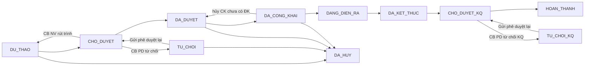
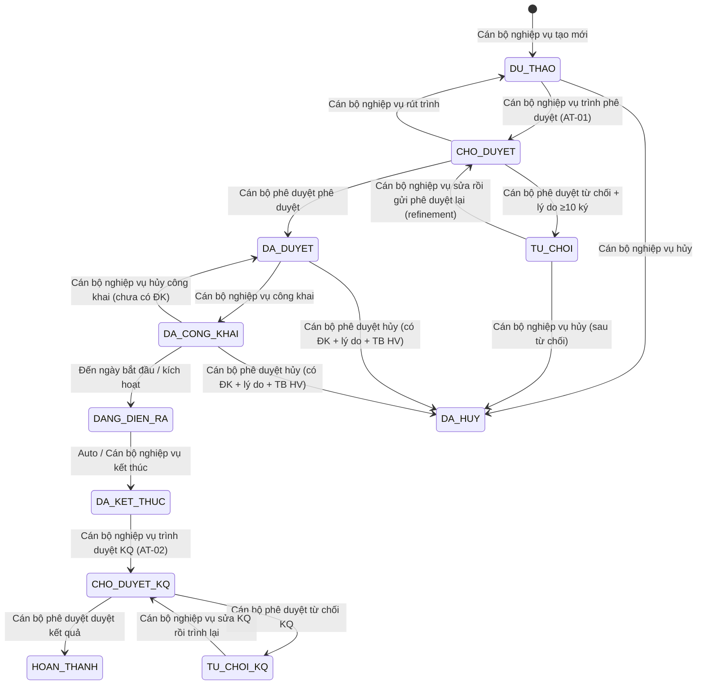
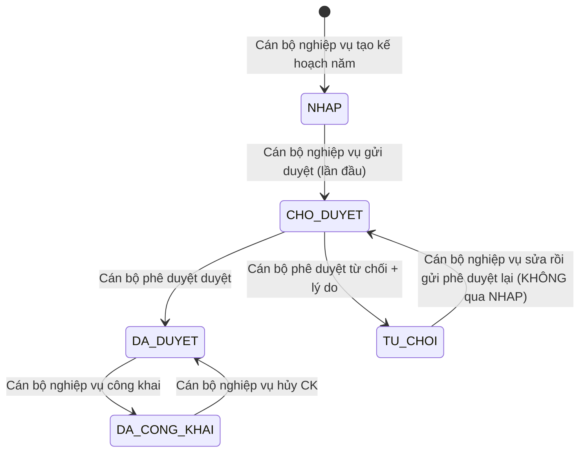
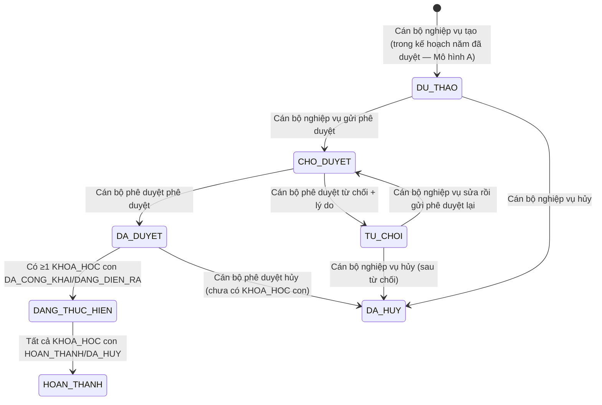

# SRS — Section 3.2.6: Quản lý Đào tạo, Tập huấn

**Dự án:** Phần mềm hỗ trợ pháp lý doanh nghiệp
**Phiên bản SRS:** 3.1 (deep review per-module 2026-05-03)
**Nhóm:** III — Quản lý Đào tạo, Tập huấn
**UC range:** UC 20 – UC 38 + UC mới
**Số FR:** 25 (FR-III-01 đến FR-III-22 + FR-III-NEW-01/02/03; FR-III-19 viết lại theo Hướng B 2026-05-03 — chỉ công bố KQ vào TK học viên + chuyên trang, KHÔNG cấp chứng nhận PDF)
**File chính:** `srs-v3.md` Section 3.2

---

## Lịch sử thay đổi

| Ngày | Tác giả | Mô tả thay đổi |
|------|---------|-----------------|
| 2026-04-03 | SRS Agent (Claude) | Tạo mới từ `srs-v3.md` theo Template v3.0 |
| 2026-04-16 | BA | Áp dụng CR đối tác: CR-01, CR-07, CR-III-01, CR-III-02, CR-III-03, CR-III-04, CR-III-05 |
| 2026-05-03 | BA + SRS Reviewer | Deep review per-module FR-03: (1) Cite NĐ55/2019 đào tạo PL = Đ.10 K.2 (sửa cite-sai Đ.6 lan rộng); (2) Cấu trúc 3 cấp Mô hình A (KE_HOACH_DAO_TAO 1:N CHUONG_TRINH_DAO_TAO 1:N KHOA_HOC); (3) SM-KHOAHOC 9→11 trạng thái thêm `TU_CHOI`+`TU_CHOI_KQ` (Cách 2 + refinement); (4) SM-KH-DAO-TAO refinement TU_CHOI→CHO_DUYET; (5) SM-CTDT mới (CTDT có quy trình phê duyệt — Câu 4 Cách 2); (6) Điểm danh boolean→enum 3-value `CO_MAT/VANG_PHEP/VANG_KHONG_PHEP` + `lich_hoc_id` per-buổi; (7) HOC_VIEN entity riêng (FK trong KET_QUA, DANG_KY) + `tai_khoan_id` link TK; (8) FR-III-19 viết lại Hướng B (bỏ cấp chứng nhận PDF, chỉ công bố KQ vào TK học viên + chuyên trang); (9) Bổ sung Processing thiếu transactions: UC23 hủy đăng ký, UC33 CRUD KHDT, UC38 hủy công bố; (10) BR-NOTIF-01 đã được định nghĩa tại Phụ lục B Section B.6b master; (11) §7 Permission codes nhóm III mới |

---

## Mục lục file này

- [1. Tổng quan nhóm](#1-tổng-quan-nhóm)
- [2. Yêu cầu chức năng chi tiết](#2-yêu-cầu-chức-năng-chi-tiết)
- [3. Màn hình chức năng](#3-màn-hình-chức-năng)
- [4. Entity liên quan](#4-entity-liên-quan)
- [5. State Machine liên quan](#5-state-machine-liên-quan)
- [6. Business Rules liên quan](#6-business-rules-liên-quan)
- [7. Action-level Permission Codes (mới 2026-05-03)](#7-action-level-permission-codes)

---

## 1. Tổng quan nhóm

**Mục đích:** Quản lý THÔNG TIN chương trình đào tạo, tập huấn bồi dưỡng kiến thức pháp luật cho DNNVV — KHÔNG phải LMS đầy đủ (Out-of-Scope OS-04).

**Cơ sở pháp lý:** NĐ55/2019/NĐ-CP **Điều 10 Khoản 2** — hoạt động bồi dưỡng kiến thức pháp luật (cho DNNVV + người làm công tác HTPL + mạng lưới TVV). Verify chinhphu.vn + luatvietnam.vn 2026-05-03 (sửa cite-sai Đ.6 cũ — Đ.6 thực ra về CSDL vụ việc, không liên quan đào tạo).

**Entity chính:** KE_HOACH_DAO_TAO (KH năm), CHUONG_TRINH_DAO_TAO (CTDT), KHOA_HOC, LICH_HOC, BAI_GIANG, NGAN_HANG_CAU_HOI, DE_KIEM_TRA, GIANG_VIEN, HOC_VIEN, DANG_KY_DAO_TAO, KET_QUA_DAO_TAO, DE_XUAT_DAO_TAO + junction KHOA_HOC_GIANG_VIEN.

**Tác nhân chính:** CB NV, CB PD, DN (chuyên trang), NHT (chuyên trang)

**Cấu trúc 3 cấp (Mô hình A — F-12 chốt round-6):**
```
Kế hoạch đào tạo năm (KE_HOACH_DAO_TAO) — quy trình phê duyệt SM-KH-DAO-TAO
└── Chương trình đào tạo (CHUONG_TRINH_DAO_TAO) — quy trình phê duyệt SM-CTDT
    └── Khóa học cụ thể (KHOA_HOC) — quy trình phê duyệt SM-KHOAHOC
        ├── Lịch học (LICH_HOC, per-buổi)
        ├── Bài giảng (N-N qua KHOA_HOC_GIANG_VIEN)
        ├── Danh sách học viên (HOC_VIEN qua DANG_KY_DAO_TAO)
        ├── Điểm danh per-buổi (KET_QUA_DAO_TAO + lich_hoc_id, enum CO_MAT/VANG_PHEP/VANG_KHONG_PHEP)
        └── Kết quả kiểm tra cuối khóa (KET_QUA_DAO_TAO + de_kiem_tra_id)
```

**Quy tắc 3 cấp:** CTDT chỉ tạo được khi kế hoạch năm cha đã DA_DUYET/DA_CONG_KHAI. Khóa học chỉ tạo được khi CTDT cha đã DA_DUYET. Mỗi cấp có quy trình phê duyệt riêng.

**2 hình thức:** Trực tuyến và Trực tiếp — tương đương nhau về quy trình.

**Luồng phê duyệt (cùng pattern 3 SM):** Cán bộ nghiệp vụ cùng cấp tạo → trình → Cán bộ phê duyệt cùng cấp duyệt/từ chối (BR-AUTH-05, BR-FLOW-03/04). **Refinement Cách 2:** Khi Cán bộ phê duyệt từ chối → entity chuyển vào trạng thái `TU_CHOI` (riêng) + ghi lý do; Cán bộ nghiệp vụ sửa rồi gửi phê duyệt lại → trạng thái về `CHO_DUYET` trực tiếp (KHÔNG qua nháp).

**State Machine — SM-KHOAHOC (11 trạng thái):**



**Auto-transition:**
- AT-01: Cán bộ nghiệp vụ nhấn "Gửi phê duyệt" → DU_THAO/TU_CHOI → CHO_DUYET (đủ guard ≥1 giảng viên + ≥1 LICH_HOC)
- AT-02: Cán bộ nghiệp vụ nhấn "Trình duyệt kết quả" → DA_KET_THUC/TU_CHOI_KQ → CHO_DUYET_KQ

**Ghi chú transition đặc biệt:**
- **TU_CHOI vs DU_THAO:** TU_CHOI = đã trình + bị Cán bộ phê duyệt từ chối + ghi lý do. DU_THAO = chưa trình hoặc Cán bộ nghiệp vụ rút trình. Cả 2 đều cho Cán bộ nghiệp vụ edit content; chỉ khác history workflow.
- **Refinement TU_CHOI → CHO_DUYET:** không qua DU_THAO. Cán bộ nghiệp vụ sửa khóa rồi bấm "Gửi phê duyệt lại" — guard giống AT-01.
- **TU_CHOI_KQ tương tự:** Cán bộ nghiệp vụ sửa KET_QUA_DAO_TAO rồi bấm "Trình duyệt KQ lại" → CHO_DUYET_KQ.
- DA_CONG_KHAI → DA_DUYET: chỉ thực hiện khi chưa có đăng ký.
- DA_DUYET/DA_CONG_KHAI → DA_HUY: nếu đã có đăng ký, bắt buộc nhập lý do + thông báo học viên (BR-NOTIF-01).

---

## 2. Yêu cầu chức năng chi tiết

---

### FR-III-01: Quản lý Chương trình đào tạo (UC20)

**UC Reference:** UC 20 | **Priority:** Essential | **Stability:** High
**Màn hình:** SCR-III-01

**Mô tả:** CRUD chương trình đào tạo (entity cha). Bao gồm quản lý khóa học (entity con) với đầy đủ trạng thái SM-KHOAHOC.

**Tác nhân:** Cán bộ nghiệp vụ (TW/BN/ĐP)

**Preconditions:**

| # | Điều kiện |
|---|----------|
| PRE-01 | User đã đăng nhập (BR-AUTH-01) |
| PRE-02 | User có permission code `CTDT_*` / `KHOA_HOC_*` theo action (xem §7) |
| PRE-03 | Phân quyền theo đơn vị theo đơn vị |

**Inputs — CTDT:**

| # | Tên field | Kiểu logic | Bắt buộc | Ràng buộc | Mặc định |
|---|----------|-----------|----------|-----------|----------|
| 1 | ma_ctdt | text | Y (auto) | CTDT-{DON_VI}-{YYYY}-{SEQ} | — |
| 2 | ten_chuong_trinh | text | Y | Không rỗng | — |
| 3 | mo_ta | text (long) | N | — | — |
| 4 | linh_vuc_id | identifier | Y | FK → DANH_MUC | — |
| 5 | ngan_sach_du_kien | money | N | ≥ 0 | — |
| 6 | so_luong_khoa | number | N | ≥ 0 | — |
| 7 | muc_tieu | text (long) | N | — | — |
| 8 | file_dinh_kem | structured | N | Upload nhiều file | — |
| 9 | cong_khai | boolean | N | Switch Công khai/Hủy công khai lên chuyên trang `[CR-01]` | 0 |
| 10 | anh_dai_dien | structured | N | jpg/png/gif, max 5MB `[CR-01]` | Ảnh mặc định HT |
| 11 | thoi_gian_dang_tai | datetime | N | Auto fill khi cong_khai=1; clear khi cong_khai=0 `[CR-01]` | — |
| 12 | mo_ta_cong_khai | text (long) | N | Mô tả hiển thị trên chuyên trang `[CR-01]` | — |
| 13 | file_dinh_kem_cong_khai | file[] | N | PDF/DOC/DOCX/XLS/XLSX, max 20MB/file `[CR-01]` | — |

**Inputs — Khóa học (entity con):**

| # | Tên field | Kiểu logic | Bắt buộc | Ràng buộc | Mặc định |
|---|----------|-----------|----------|-----------|----------|
| 1 | ma_khoa_hoc | text | Y (auto) | KH-{YYYYMMDD}-{SEQ} | — |
| 2 | ten_khoa_hoc | text | Y | — | — |
| 3 | ctdt_id | identifier | Y | FK → CTDT | — |
| 4 | hinh_thuc | text | Y | TRUC_TUYEN / TRUC_TIEP | TRUC_TUYEN |
| 5 | ngay_bat_dau | date | Y | — | — |
| 6 | ngay_ket_thuc | date | Y | > ngay_bat_dau | — |
| 7 | doi_tuong | text | N | — | — |
| 8 | dia_diem | text | N | — | — |
| 9 | so_luong_toi_da | number | N | ≥ 1 | — |
| 10 | bai_giang_ids | identifier[] | N | FK → BAI_GIANG (N-N) | — |
| 11 | giang_vien_ids | identifier[] | Y | FK → GIANG_VIEN (N-N), multi-select DANG_GIANG_DAY, tối thiểu 1 giảng viên | — |

**Processing — Xem danh sách:**

| Bước | Mô tả xử lý | BR áp dụng |
|------|-------------|-----------|
| 1 | Kiểm tra quyền và phân quyền theo đơn vị | BR-AUTH-01, BR-AUTH-08 |
| 2 | Lấy danh sách CHUONG_TRINH_DAO_TAO chưa xóa, trong phạm vi đơn vị | BR-DATA-02 |
| 3 | Phân trang (mặc định 20/trang) | BR-DATA-07 |

**Processing — Thêm mới CTDT:**

| Bước | Mô tả xử lý | BR áp dụng |
|------|-------------|-----------|
| 1 | Kiểm tra quyền | BR-AUTH-01 |
| 2 | Tự động sinh mã CTDT | BR-DATA-04 |
| 3 | Xác nhận tên chương trình không rỗng | — |
| 4 | Đặt trạng thái = NHAP | — |
| 5 | Tạo bản ghi CHUONG_TRINH_DAO_TAO | BR-DATA-03 |
| 6 | Ghi nhật ký thao tác | BR-DATA-05 |

**Processing — Chỉnh sửa:**

| Bước | Mô tả xử lý | BR áp dụng |
|------|-------------|-----------|
| 1 | Kiểm tra trạng thái = NHAP (chỉ sửa khi chưa duyệt) | — |
| 2 | Xác nhận dữ liệu đầu vào | — |
| 3 | Cập nhật CHUONG_TRINH_DAO_TAO | — |
| 4 | Ghi nhật ký thao tác (giá trị cũ → mới) | BR-DATA-05 |

**Processing — Gửi phê duyệt khóa học (AT-01)** `[GAP-III-08 F-06]`:

| Bước | Mô tả xử lý | BR áp dụng |
|------|-------------|-----------|
| 1 | Kiểm tra quyền Cán bộ nghiệp vụ (tạo khóa) | BR-AUTH-01 |
| 2 | Kiểm tra trạng thái khóa học = DU_THAO | SM-KHOAHOC |
| 3 | Validate đủ trường bắt buộc: ten_khoa_hoc, ngay_bat_dau, ngay_ket_thuc, giang_vien_ids (≥1), ≥1 lịch học (LICH_HOC) | — |
| 4 | Cập nhật trạng thái = CHO_DUYET | — |
| 5 | Gửi thông báo Cán bộ phê duyệt cùng cấp | BR-NOTIF-01 |
| 6 | Ghi nhật ký (DU_THAO → CHO_DUYET) | BR-DATA-05 |

**Processing — Rút trình duyệt khóa học** `[GAP-III-08 F-12a]`:

> Ngữ nghĩa: Cán bộ nghiệp vụ rút trình để chỉnh sửa (không phải hủy). Khóa quay về DU_THAO, giữ nguyên dữ liệu để sửa đổi và trình lại.

| Bước | Mô tả xử lý | BR áp dụng |
|------|-------------|-----------|
| 1 | Kiểm tra quyền Cán bộ nghiệp vụ (là người tạo khóa) | BR-AUTH-01 |
| 2 | Kiểm tra trạng thái khóa học = CHO_DUYET | SM-KHOAHOC |
| 3 | Kiểm tra Cán bộ phê duyệt chưa bắt đầu phê duyệt (trạng thái vẫn CHO_DUYET) | — |
| 4 | Cập nhật trạng thái = DU_THAO | — |
| 5 | Gửi thông báo Cán bộ phê duyệt (khóa đã được rút khỏi hàng chờ duyệt) | BR-NOTIF-01 |
| 6 | Ghi nhật ký (CHO_DUYET → DU_THAO, lý do = "Rút trình duyệt") | BR-DATA-05 |

**Processing — Xóa (xóa mềm):**

| Bước | Mô tả xử lý | BR áp dụng |
|------|-------------|-----------|
| 1 | Kiểm tra CTDT không có khóa học liên kết | — |
| 2 | Nếu có khóa học: từ chối xóa + cảnh báo | — |
| 3 | Đánh dấu xóa mềm | BR-DATA-01 |
| 4 | Ghi nhật ký thao tác | BR-DATA-05 |

**Processing — Xuất Excel:**

| Bước | Mô tả xử lý | BR áp dụng |
|------|-------------|-----------|
| 1 | Lấy danh sách theo filter, tối đa 10.000 dòng | BR-DATA-06 |
| 2 | Tạo file Excel + trả về download | — |

**Processing — Kích hoạt khóa học** `[GAP-III-01]`:

| Bước | Mô tả xử lý | BR áp dụng |
|------|-------------|-----------|
| 1 | Kiểm tra quyền Cán bộ nghiệp vụ | BR-AUTH-01 |
| 2 | Kiểm tra trạng thái = DA_CONG_KHAI | SM-KHOAHOC |
| 3 | Kiểm tra: đã có lịch học, giảng viên, học viên đăng ký | — |
| 4 | Cập nhật trạng thái = DANG_DIEN_RA | — |
| 5 | Gửi thông báo học viên + giảng viên | BR-NOTIF-01 |
| 6 | Ghi nhật ký | BR-DATA-05 |

**Processing — Kết thúc khóa học** `[GAP-III-01]`:

| Bước | Mô tả xử lý | BR áp dụng |
|------|-------------|-----------|
| 1 | Kiểm tra trạng thái = DANG_DIEN_RA | SM-KHOAHOC |
| 2 | Kiểm tra: tất cả buổi học đã diễn ra (hoặc ngày kết thúc đã qua) | — |
| 3 | Cập nhật trạng thái = DA_KET_THUC | — |
| 4 | Ghi nhật ký | BR-DATA-05 |

**Processing — Hủy khóa học** `[GAP-III-01]`:

> Phân biệt với "Rút trình duyệt": Hủy = xóa mềm entity, không quay lại sửa. Rút trình = quay DU_THAO để sửa.

| Bước | Mô tả xử lý | BR áp dụng |
|------|-------------|-----------|
| 1 | Kiểm tra quyền Cán bộ nghiệp vụ (DU_THAO) hoặc Cán bộ phê duyệt (DA_DUYET/DA_CONG_KHAI) | BR-AUTH-01 |
| 2 | Kiểm tra trạng thái IN (DU_THAO, DA_DUYET, DA_CONG_KHAI) | SM-KHOAHOC |
| 3 | Nếu DA_DUYET/DA_CONG_KHAI + có học viên đăng ký: yêu cầu xác nhận + lý do (bắt buộc) | BR-FLOW-04 |
| 4 | Nếu DA_CONG_KHAI: gọi API Cổng Pháp luật Quốc gia gỡ khỏi chuyên trang | BR-FLOW-05 |
| 5 | Cập nhật trạng thái = DA_HUY, lý do hủy | — |
| 6 | Thông báo các bên liên quan (nếu có đăng ký) | BR-NOTIF-01 |
| 7 | Ghi nhật ký | BR-DATA-05 |

> **Lưu ý:** CHO_DUYET **KHÔNG** có action "Hủy". Cán bộ nghiệp vụ muốn hủy khóa đang chờ duyệt phải "Rút trình duyệt" (CHO_DUYET → DU_THAO) trước, sau đó mới "Hủy" (DU_THAO → DA_HUY).

**Outputs — Danh sách:**

| # | Tên field | Kiểu logic | Mô tả |
|---|----------|-----------|-------|
| 1 | id | identifier | ID chương trình đào tạo |
| 2 | ma_ctdt | text | Mã chương trình đào tạo |
| 3 | ten_chuong_trinh | text | Tên |
| 4 | hinh_thuc | text | Hình thức |
| 5 | linh_vuc | text | Lĩnh vực |
| 6 | ngay_bat_dau | date | Ngày bắt đầu |
| 7 | ngay_ket_thuc | date | Ngày kết thúc |
| 8 | so_khoa_hoc | number | Số khóa học con |
| 9 | trang_thai | text | Trạng thái |
| 10 | total_count | number | Tổng bản ghi |

**Outputs — Chi tiết khóa học (Common Approval Fields theo A.3 v2)** `[GAP-III-08 F-13a]`:

| # | Tên field | Kiểu logic | Mô tả |
|---|----------|-----------|-------|
| 1 | id, ma_khoa_hoc, ten_khoa_hoc, ... | — | Các field định danh khóa học |
| 2 | trang_thai | text | Trạng thái hiện tại (SM-KHOAHOC) |
| 3 | giang_vien_ids | identifier[] | Danh sách giảng viên gắn với khóa |
| 4 | ngay_tiep_nhan | datetime | Thời điểm Cán bộ phê duyệt tiếp nhận hồ sơ duyệt (auto khi chuyển CHO_DUYET) |
| 5 | nguoi_tiep_nhan | identifier | FK → TAI_KHOAN (CB PD được gán duyệt) |
| 6 | thoi_gian_duyet | datetime | Thời điểm phê duyệt thành công (auto khi CHO_DUYET → DA_DUYET) |
| 7 | nguoi_duyet | identifier | FK → TAI_KHOAN (CB PD phê duyệt) |
| 8 | thoi_gian_tu_choi | datetime | Thời điểm từ chối (auto khi CHO_DUYET → DU_THAO do Cán bộ phê duyệt từ chối) |
| 9 | nguoi_tu_choi | identifier | FK → TAI_KHOAN (CB PD từ chối) |
| 10 | ly_do_tu_choi | text (long) | Lý do từ chối (bắt buộc nếu từ chối, BR-FLOW-04) |
| 11 | thoi_gian_duyet_kq | datetime | Thời điểm duyệt KQ (auto khi CHO_DUYET_KQ → HOAN_THANH) — FR-III-18 |
| 12 | nguoi_duyet_kq | identifier | FK → TAI_KHOAN (CB PD duyệt KQ) — FR-III-18 |
| 13 | thoi_gian_cong_khai | datetime | Thời điểm công khai (auto khi DA_DUYET → DA_CONG_KHAI) |
| 14 | thoi_gian_huy | datetime | Thời điểm hủy (auto khi chuyển DA_HUY) |
| 15 | ly_do_huy | text (long) | Lý do hủy (bắt buộc nếu hủy khi có đăng ký) |

> **Cross-ref:** Entity KHOA_HOC trong `srs-v3.md` Section 3.4 cần verify chứa đủ 15 field trên. Flag cross-file concern nếu thiếu.

**Postconditions:**
- Bản ghi CHUONG_TRINH_DAO_TAO được tạo/cập nhật/xóa mềm
- AUDIT_LOG ghi nhận thao tác
- Common Approval Fields được auto-fill theo transition SM-KHOAHOC

**Error Handling:**

| # | Điều kiện lỗi | Mã lỗi | Phản hồi hệ thống | Severity |
|---|--------------|--------|-------------------|----------|
| E1 | Tên chương trình trống | ERR-CTDT-01 | "Tên chương trình là bắt buộc" | ERROR |
| E2 | Ngày kết thúc ≤ ngày bắt đầu | ERR-CTDT-02 | "Ngày kết thúc phải sau ngày bắt đầu" | ERROR |
| E3 | Xóa CTDT có khóa học | ERR-CTDT-03 | "Không thể xóa chương trình đã có khóa học" | ERROR |
| E4 | Sửa CTDT đã duyệt | ERR-CTDT-04 | "Không thể sửa chương trình đã được duyệt" | ERROR |

**Acceptance Criteria:**
- **Given** Cán bộ nghiệp vụ truy cập CTDT **When** hiển thị **Then** danh sách CTDT thuộc đơn vị, phân trang
- **Given** Cán bộ nghiệp vụ thêm mới **When** nhập đủ trường **Then** lưu CTDT mới
- **Given** Cán bộ nghiệp vụ TW **When** xem danh sách **Then** chỉ thấy CTDT thuộc TW
- **Given** Cán bộ nghiệp vụ xóa CTDT có khóa học **When** xác nhận **Then** từ chối + cảnh báo
- **Given** Cán bộ nghiệp vụ kích hoạt khóa đã công khai **When** đã có lịch + giảng viên + học viên **Then** khóa → DANG_DIEN_RA + thông báo `[GAP-III-01]`
- **Given** khóa học đang diễn ra **When** hết thời gian hoặc Cán bộ nghiệp vụ kết thúc **Then** khóa → DA_KET_THUC `[GAP-III-01]`
- **Given** Cán bộ nghiệp vụ trình phê duyệt (AT-01) **When** khóa ở DU_THAO + đủ lịch học + ≥1 giảng viên **Then** khóa → CHO_DUYET, thông báo Cán bộ phê duyệt `[GAP-III-08]`
- **Given** Cán bộ nghiệp vụ rút trình duyệt **When** khóa ở CHO_DUYET **Then** khóa → DU_THAO (giữ data để sửa), thông báo Cán bộ phê duyệt `[GAP-III-08]`
- **Given** Cán bộ nghiệp vụ hủy khóa DU_THAO **When** xác nhận **Then** khóa → DA_HUY `[GAP-III-01]`
- **Given** Cán bộ phê duyệt hủy khóa DA_DUYET/DA_CONG_KHAI có đăng ký **When** xác nhận + nhập lý do **Then** khóa → DA_HUY + thông báo học viên `[GAP-III-01]`
- **Given** Cán bộ nghiệp vụ công khai khóa DA_DUYET **When** xác nhận **Then** khóa → DA_CONG_KHAI, đẩy lên chuyên trang
- **Given** Cán bộ nghiệp vụ hủy công khai khóa DA_CONG_KHAI **When** chưa có đăng ký **Then** khóa → DA_DUYET, gỡ khỏi chuyên trang

**Cross-ref:** BR-DATA-01 đến BR-DATA-08, Entity CHUONG_TRINH_DAO_TAO, KHOA_HOC

---

### FR-III-02: Tìm kiếm CTDT (UC21)

**UC Reference:** UC 21 | **Priority:** Essential | **Stability:** High
**Màn hình:** SCR-III-01

**Mô tả:** Tìm kiếm CTDT theo từ khóa, lĩnh vực, hình thức, thời gian, trạng thái.

**Tác nhân:** Cán bộ nghiệp vụ / Cán bộ phê duyệt / DN / NHT

**Preconditions:**

| # | Điều kiện |
|---|----------|
| PRE-01 | User đã đăng nhập |

**Inputs — Bộ lọc:**

| # | Tên field | Kiểu logic | Bắt buộc | Ràng buộc |
|---|----------|-----------|----------|-----------|
| 1 | tu_khoa | text | N | Tìm theo tên/mã CTDT |
| 2 | linh_vuc_id | identifier | N | Lĩnh vực PL |
| 3 | hinh_thuc | text | N | TRUC_TUYEN / TRUC_TIEP |
| 4 | tu_ngay | date | N | Từ ngày |
| 5 | den_ngay | date | N | Đến ngày |
| 6 | trang_thai | text | N | Trạng thái |

**Processing:**

| Bước | Mô tả xử lý | BR áp dụng |
|------|-------------|-----------|
| 1 | Kiểm tra quyền và phân quyền | BR-AUTH-01, BR-AUTH-08 |
| 2 | Kết hợp tất cả điều kiện lọc (AND) | — |
| 3 | Phân trang (20/trang) | BR-DATA-07 |

**Outputs — Danh sách phân trang:**

| # | Tên field | Kiểu logic | Mô tả |
|---|----------|-----------|-------|
| 1 | id | identifier | ID chương trình đào tạo |
| 2 | ma_ctdt | text | Mã chương trình đào tạo |
| 3 | ten_chuong_trinh | text | Tên |
| 4 | hinh_thuc | text | Hình thức |
| 5 | linh_vuc | text | Lĩnh vực |
| 6 | ngay_bat_dau | date | Ngày bắt đầu |
| 7 | ngay_ket_thuc | date | Ngày kết thúc |
| 8 | so_khoa_hoc | number | Số khóa học con |
| 9 | trang_thai | text | Trạng thái |
| 10 | total_count | number | Tổng bản ghi |

**Postconditions:** Không thay đổi dữ liệu (read-only).

**Error Handling:**

| # | Điều kiện lỗi | Mã lỗi | Phản hồi hệ thống | Severity |
|---|--------------|--------|-------------------|----------|
| E1 | Không có kết quả | INF-CTDT-01 | "Không tìm thấy chương trình phù hợp" | INFO |

**Acceptance Criteria:**
- **Given** user nhập từ khóa **When** tìm kiếm **Then** hiển thị CTDT phù hợp, phân trang
- **Given** user lọc theo thời gian **When** chọn khoảng ngày **Then** hiển thị CTDT trong khoảng
- **Given** user lọc theo lĩnh vực **When** chọn lĩnh vực **Then** hiển thị CTDT thuộc lĩnh vực
- **Given** user kết hợp nhiều điều kiện **When** tìm kiếm **Then** áp dụng AND

**Cross-ref:** BR-AUTH-01, BR-DATA-07, Entity CHUONG_TRINH_DAO_TAO

---

### FR-III-03: Quản lý đăng ký đào tạo (UC22)

**UC Reference:** UC 22 | **Priority:** Essential | **Stability:** High
**Màn hình:** SCR-III-01

**Mô tả:** Cán bộ nghiệp vụ xem và duyệt/từ chối đăng ký tham gia khóa học.

**Tác nhân:** Cán bộ nghiệp vụ / CB PD

**Preconditions:**

| # | Điều kiện |
|---|----------|
| PRE-01 | User đã đăng nhập, có permission code `DANG_KY_READ` / `DANG_KY_APPROVE` / `DANG_KY_REJECT` (xem §7.5) |
| PRE-02 | Khóa học tồn tại, đang mở đăng ký |

**Inputs — Xem/Duyệt đăng ký:**

| # | Tên field | Kiểu logic | Bắt buộc | Ràng buộc |
|---|----------|-----------|----------|-----------|
| 1 | khoa_hoc_id | identifier | Y | Khóa học lọc |
| 2 | quyet_dinh | text | Y | DUYET / TU_CHOI |
| 3 | ly_do_tu_choi | text | Cond | Bắt buộc nếu TU_CHOI |

**Processing:**

| Bước | Mô tả xử lý | BR áp dụng |
|------|-------------|-----------|
| 1 | Kiểm tra quyền và phân quyền | BR-AUTH-01, BR-AUTH-08 |
| 2 | Lấy danh sách DANG_KY_DAO_TAO theo khóa học | — |
| 3 | Hiển thị: tên, đơn vị, khóa học, ngày đăng ký, trạng thái | — |
| 4 | Duyệt: cập nhật trạng thái = DA_DUYET, ghi nhật ký | — |
| 5 | Từ chối: cập nhật trạng thái = TU_CHOI + lý do, ghi nhật ký | — |
| 6 | Gửi thông báo người đăng ký | — |

**Outputs:**

| # | Tên field | Kiểu logic | Mô tả |
|---|----------|-----------|-------|
| 1 | id | identifier | ID đăng ký |
| 2 | ten_hoc_vien | text | Tên người đăng ký |
| 3 | don_vi | text | Đơn vị |
| 4 | khoa_hoc | text | Tên khóa học |
| 5 | ngay_dang_ky | datetime | Ngày đăng ký |
| 6 | trang_thai | text | CHO_DUYET / DA_DUYET / TU_CHOI |

**Postconditions:**
- Đăng ký được duyệt/từ chối
- Người đăng ký nhận thông báo
- Nhật ký thao tác ghi nhận

**Error Handling:**

| # | Điều kiện lỗi | Mã lỗi | Phản hồi hệ thống | Severity |
|---|--------------|--------|-------------------|----------|
| E1 | Khóa học đã đóng đăng ký | ERR-DKDT-01 | "Khóa học đã đóng đăng ký" | ERROR |
| E2 | Từ chối không có lý do | ERR-DKDT-02 | "Lý do từ chối là bắt buộc" | ERROR |

**Acceptance Criteria:**
- **Given** Cán bộ nghiệp vụ truy cập "Đăng ký Đào tạo" **When** hiển thị **Then** danh sách người đăng ký thuộc đơn vị, phân trang
- **Given** Cán bộ nghiệp vụ phê duyệt đăng ký **When** xác nhận **Then** trạng thái → DA_DUYET, ghi nhật ký
- **Given** Cán bộ nghiệp vụ từ chối **When** nhập lý do **Then** trạng thái → TU_CHOI

**Cross-ref:** BR-FLOW-03, Entity DANG_KY_DAO_TAO, KHOA_HOC

---

### FR-III-04: Đăng ký tham gia học tập (UC23)

**UC Reference:** UC 23 | **Priority:** Essential | **Stability:** High
**Màn hình:** (chuyên trang)

**Mô tả:** Doanh nghiệp / Người hỗ trợ đăng ký tham gia khóa học qua chuyên trang. 3 cách: chuyên trang, nhập tay, import Excel.

**Tác nhân:** DN / NHT

**Preconditions:**

| # | Điều kiện |
|---|----------|
| PRE-01 | Doanh nghiệp / Người hỗ trợ đã đăng nhập trên chuyên trang |
| PRE-02 | Khóa học đang mở đăng ký (trạng thái DA_CONG_KHAI) |

**Inputs:**

| # | Tên field | Kiểu logic | Bắt buộc | Ràng buộc |
|---|----------|-----------|----------|-----------|
| 1 | khoa_hoc_id | identifier | Y | Khóa học đăng ký |
| 2 | ho_ten | text | Y | Họ tên |
| 3 | don_vi | text | N | Đơn vị công tác |
| 4 | email | text | Y | Email |
| 5 | so_dien_thoai | text | Y | SĐT |
| 6 | ghi_chu | text | N | Ghi chú |
| 7 | nguon_dang_ky | text | Y | CHUYEN_TRANG / NHAP_TAY / IMPORT_EXCEL |

**Processing:**

| Bước | Mô tả xử lý | BR áp dụng |
|------|-------------|-----------|
| 1 | Kiểm tra khóa học đang mở (DA_CONG_KHAI) | SM-KHOAHOC |
| 2 | Kiểm tra chưa đăng ký trùng | — |
| 3 | Xác nhận dữ liệu đầu vào | — |
| 4 | Tạo bản ghi DANG_KY_DAO_TAO, trạng thái = CHO_DUYET | — |
| 5 | Gửi thông báo Cán bộ nghiệp vụ đơn vị quản lý khóa học | — |
| 6 | Nếu import Excel: validate template, import từng dòng, báo cáo KQ | — |

**Outputs:**

| # | Tên field | Kiểu logic | Mô tả |
|---|----------|-----------|-------|
| 1 | id | identifier | ID đăng ký |
| 2 | ho_ten | text | Họ tên |
| 3 | khoa_hoc | text | Tên khóa học |
| 4 | ngay_dang_ky | datetime | Ngày đăng ký |
| 5 | trang_thai | text | CHO_DUYET |
| 6 | ket_qua_import | structured | Số thành công / lỗi (nếu import Excel) |

**Postconditions:**
- Đăng ký được tạo, chờ Cán bộ nghiệp vụ duyệt
- Cán bộ nghiệp vụ nhận thông báo

**Processing — Hủy đăng ký (Doanh nghiệp / Người hỗ trợ) `[F-FR03-10 mới]`:**

| Bước | Mô tả xử lý | BR áp dụng |
|------|-------------|-----------|
| 1 | Kiểm tra `nguoi_dang_ky_id = current_user.id` (Doanh nghiệp / Người hỗ trợ chỉ hủy đăng ký của mình) | BR-AUTH-01 |
| 2 | Kiểm tra `DANG_KY_DAO_TAO.trang_thai IN ('CHO_DUYET', 'DA_DUYET')` | — |
| 3 | Kiểm tra `KHOA_HOC.trang_thai NOT IN ('DANG_DIEN_RA', 'DA_KET_THUC', 'HOAN_THANH', 'DA_HUY')` — không cho hủy khi khóa đã bắt đầu | SM-KHOAHOC |
| 4 | Cập nhật `trang_thai = DA_HUY` + ghi `ngay_huy = NOW()` | — |
| 5 | Gửi thông báo Cán bộ nghiệp vụ đơn vị quản lý khóa | BR-NOTIF-01 |
| 6 | Ghi nhật ký | BR-DATA-05 |

**Error Handling:**

| # | Điều kiện lỗi | Mã lỗi | Phản hồi hệ thống | Severity |
|---|--------------|--------|-------------------|----------|
| E1a | Khóa học chưa mở đăng ký | ERR-DK-DT-01a | "Khóa học chưa mở đăng ký" | ERROR |
| E1b | Khóa học đã đóng đăng ký | ERR-DK-DT-01b | "Khóa học đã đóng đăng ký" | ERROR |
| E2 | Đã đăng ký | ERR-DK-DT-02 | "Bạn đã đăng ký khóa học này" | ERROR |
| E3 | Lớp đầy | ERR-DK-DT-03 | "Lớp đã đủ số lượng" | ERROR |
| E4 | Hủy đăng ký khóa đang/đã diễn ra | ERR-DK-DT-04 | "Khóa học đang/đã diễn ra, không thể hủy đăng ký" | ERROR |
| E5 | Hủy đăng ký không phải của mình | ERR-DK-DT-05 | "Bạn chỉ được hủy đăng ký do chính mình tạo" | ERROR |

**Acceptance Criteria:**
- **Given** Doanh nghiệp / Người hỗ trợ xem khóa học đang mở **When** chọn đăng ký **Then** hiển thị form đăng ký
- **Given** Doanh nghiệp / Người hỗ trợ nhập đủ thông tin **When** gửi **Then** đăng ký thành công, chờ duyệt
- **Given** Doanh nghiệp / Người hỗ trợ đã đăng ký **When** đăng ký lại **Then** hệ thống từ chối
- **Given** Doanh nghiệp / Người hỗ trợ đã đăng ký khóa chưa diễn ra **When** chọn "Hủy đăng ký" **Then** đăng ký → DA_HUY + Cán bộ nghiệp vụ nhận thông báo
- **Given** Doanh nghiệp / Người hỗ trợ cố hủy đăng ký khóa đang diễn ra **Then** hệ thống từ chối + ERR-DK-DT-04

**Edge Cases:**

| EC | Điều kiện | Xử lý |
|----|-----------|-------|
| EC-01 | Đăng ký vượt sức chứa lớp học | Kiểm tra số đăng ký (trừ từ chối) < số lượng tối đa. Nếu đầy → ERR-DK-DT-03 |
| EC-02 | Hủy khóa học (do CB NV/PD) → thông báo học viên đã đăng ký | Khi hủy khóa học, bắt buộc gửi thông báo cho tất cả học viên đã duyệt (BR-NOTIF-01) — xem FR-III-01 Processing Hủy |
| EC-03 | Import kết quả đào tạo đồng thời bởi 2 Cán bộ nghiệp vụ (concurrent lock — `[F-FR03-NEW-04]` đổi mã từ ERR-DK-DT-04 cũ → mã mới để tránh trùng với hủy đăng ký) | Sử dụng khóa hàng trên KHOA_HOC. CB thứ 2 nhận **ERR-LOCK-KQ-01** "Khóa học đang được cập nhật bởi người khác, vui lòng thử lại sau 5 giây" — xem FR-III-05 |

> **Lưu ý 2026-05-03:** Bỏ EC-04 cũ "CTDT bị từ chối nhưng không cho sửa lại" — không thuộc FR-III-04 (Đăng ký HV); đã chuyển sang quản lý ở SM-CTDT (refinement Cách 2: TU_CHOI cho phép sửa lại).

**Cross-ref:** SM-KHOAHOC §C.2 master, Entity DANG_KY_DAO_TAO §3.4.3.26 master, KHOA_HOC §3.4.3.6 master, BR-NOTIF-01.

---

### FR-III-05: Quản lý kiểm tra, đánh giá kết quả (UC24)

**UC Reference:** UC 24 | **Priority:** Essential | **Stability:** High
**Màn hình:** SCR-III-02 (chi tiet Khoa hoc — Tab 3 "Lịch học & Điểm danh" + Tab 4 "Kết quả kiểm tra")

**Mô tả:** Nhập kết quả đào tạo (điểm danh + kiểm tra). 2 tab: Điểm danh và Kiểm tra. Hỗ trợ nhập thủ công + import Excel.

**Tác nhân:** Cán bộ nghiệp vụ / CB PD

**Preconditions:**

| # | Điều kiện |
|---|----------|
| PRE-01 | User đã đăng nhập, có permission code `KET_QUA_READ` / `KET_QUA_CREATE` / `KET_QUA_UPDATE` (xem §7.6) |
| PRE-02 | Khóa học tồn tại |

**Inputs — Nhập kết quả (2 tabs: Điểm danh + Kiểm tra):**

| # | Tên field | Kiểu logic | Bắt buộc | Ràng buộc |
|---|----------|-----------|----------|-----------|
| 1 | khoa_hoc_id | identifier | Y | Khóa học |
| 2 | hoc_vien_id | identifier | Y | Học viên |
| 3 | lich_hoc_id | identifier | Y | Buổi học cụ thể (FK → LICH_HOC) `[GAP-III-08 F-16]` |
| 4 | diem_danh | enum | Y | CO_MAT / VANG_PHEP / VANG_KHONG_PHEP `[GAP-III-08 F-16]` |
| 5 | ngay_diem_danh | date | Y | Ngày điểm danh (derived từ lich_hoc_id) |
| 6 | diem_kiem_tra | number | N | 0-10 |
| 7 | ghi_chu | text | N | Ghi chú |

> **Lý do đổi diem_danh boolean → enum 3-value** `[F-16]`: Nghiệp vụ VN phân biệt "vắng có phép" (nghỉ hợp lệ, không trừ xếp loại) vs "vắng không phép" (trừ xếp loại chuyên cần). Boolean mất ngữ nghĩa này.

**Processing — Nhập thủ công:**

| Bước | Mô tả xử lý | BR áp dụng |
|------|-------------|-----------|
| 1 | Kiểm tra quyền | BR-AUTH-01 |
| 2 | Xác nhận điểm kiểm tra 0-10 | — |
| 3 | Tạo/cập nhật KET_QUA_HOC_TAP | — |
| 4 | Ghi nhật ký thao tác | BR-DATA-05 |

**Processing — Import Excel:**

| Bước | Mô tả xử lý | BR áp dụng |
|------|-------------|-----------|
| 1 | Upload file Excel (.xlsx) | — |
| 2 | Xác nhận format: cột bắt buộc | — |
| 3 | Xác nhận dữ liệu từng dòng | — |
| 4 | Hiển thị bản review (thành công / lỗi) | — |
| 5 | Nếu xác nhận: merge kết quả | — |
| 6 | Trả về báo cáo import | — |

**Processing — Xuất Excel:**

| Bước | Mô tả xử lý | BR áp dụng |
|------|-------------|-----------|
| 1 | Lấy KET_QUA_HOC_TAP theo khóa học | — |
| 2 | Tạo file Excel (.xlsx) + download | — |

**Outputs:**

| # | Tên field | Kiểu logic | Mô tả |
|---|----------|-----------|-------|
| 1 | hoc_vien_id | identifier | ID học viên |
| 2 | ho_ten | text | Họ tên |
| 3 | email | text | Email học viên (join HOC_VIEN) `[CMT-4][CMT-5]` |
| 4 | so_dien_thoai | text | SĐT học viên (join HOC_VIEN) `[CMT-4][CMT-5]` |
| 5 | don_vi | text | Đơn vị công tác (join HOC_VIEN) `[CMT-4][CMT-5]` |
| 6 | so_buoi_co_mat | number | Số buổi có mặt (CO_MAT) |
| 7 | so_buoi_vang_phep | number | Số buổi vắng có phép (VANG_PHEP) `[GAP-III-08 F-16]` |
| 8 | so_buoi_vang_khong_phep | number | Số buổi vắng không phép (VANG_KHONG_PHEP) `[GAP-III-08 F-16]` |
| 9 | tong_buoi | number | Tổng số buổi |
| 10 | ty_le_chuyen_can | number | % chuyên cần = (so_buoi_co_mat + so_buoi_vang_phep) / tong_buoi × 100 `[GAP-III-08 F-16]` |
| 11 | diem_kiem_tra | number | Điểm kiểm tra |
| 12 | ket_qua | text | DAT / KHONG_DAT |

**Postconditions:**
- Kết quả học tập được ghi nhận
- Nhật ký thao tác ghi nhận

**Error Handling:**

| # | Điều kiện lỗi | Mã lỗi | Phản hồi hệ thống | Severity |
|---|--------------|--------|-------------------|----------|
| E1 | Điểm ngoài 0-10 | ERR-KQ-01 | "Điểm kiểm tra phải từ 0 đến 10" | ERROR |
| E2 | File format lỗi | ERR-KQ-02 | "File không đúng định dạng mẫu" | ERROR |
| E3 | Mã học viên không tồn tại | ERR-KQ-03 | "Mã học viên dòng {N} không tồn tại" | ERROR |
| E4 | Import đồng thời (concurrent update) | ERR-DK-DT-04 | "Khóa học đang được cập nhật bởi người khác, vui lòng thử lại sau 5 giây" | ERROR |
| E5 | diem_danh không thuộc enum (CO_MAT/VANG_PHEP/VANG_KHONG_PHEP) | ERR-KQ-04 | "Giá trị điểm danh không hợp lệ" | ERROR |

**Acceptance Criteria:**
- **Given** Cán bộ nghiệp vụ truy cập "Kết quả" **When** chọn khóa học **Then** hiển thị danh sách học viên + kết quả
- **Given** Cán bộ nghiệp vụ nhập kết quả thủ công **When** lưu **Then** validate + ghi nhận
- **Given** Cán bộ nghiệp vụ import Excel **When** upload file **Then** validate + import + báo cáo lỗi
- **Given** Cán bộ nghiệp vụ xuất kết quả **When** nhấn "Xuất Excel" **Then** tải file Excel

**Cross-ref:** Entity KET_QUA_HOC_TAP, KHOA_HOC, HOC_VIEN

---

### FR-III-06: Tìm kiếm kết quả (UC25)

**UC Reference:** UC 25 | **Priority:** Essential | **Stability:** High
**Màn hình:** SCR-III-02 (chi tiet Khoa hoc — Tab 3 "Lịch học & Điểm danh" + Tab 4 "Kết quả kiểm tra")

**Mô tả:** Tìm kiếm kết quả đào tạo theo tên học viên, khóa học, kết quả.

**Tác nhân:** Cán bộ nghiệp vụ / CB PD

**Preconditions:**

| # | Điều kiện |
|---|----------|
| PRE-01 | User đã đăng nhập |

**Inputs — Bộ lọc:**

| # | Tên field | Kiểu logic | Bắt buộc | Ràng buộc |
|---|----------|-----------|----------|-----------|
| 1 | tu_khoa | text | N | Tìm theo tên học viên |
| 2 | khoa_hoc_id | identifier | N | Khóa học |
| 3 | ket_qua | text | N | DAT / KHONG_DAT |

**Processing:**

| Bước | Mô tả xử lý | BR áp dụng |
|------|-------------|-----------|
| 1 | Kiểm tra quyền | BR-AUTH-01, BR-AUTH-08 |
| 2 | Lấy KET_QUA_HOC_TAP kết hợp HOC_VIEN, KHOA_HOC theo điều kiện | — |
| 3 | Phân trang | BR-DATA-07 |

**Outputs — Danh sách phân trang:**

| # | Tên field | Kiểu logic | Mô tả |
|---|----------|-----------|-------|
| 1 | hoc_vien_id | identifier | ID học viên |
| 2 | ho_ten | text | Họ tên |
| 3 | ten_khoa_hoc | text | Tên khóa học |
| 4 | so_buoi_co_mat | number | Số buổi có mặt |
| 5 | tong_buoi | number | Tổng số buổi |
| 6 | ty_le_chuyen_can | number | % chuyên cần |
| 7 | diem_kiem_tra | number | Điểm kiểm tra |
| 8 | ket_qua | text | DAT / KHONG_DAT |
| 9 | total_count | number | Tổng bản ghi |

**Postconditions:** Không thay đổi dữ liệu (read-only).

**Acceptance Criteria:**
- **Given** Cán bộ nghiệp vụ nhập từ khóa **When** tìm kiếm **Then** hiển thị kết quả phù hợp, phân trang
- **Given** Cán bộ nghiệp vụ lọc theo học viên **When** chọn **Then** hiển thị tất cả kết quả của học viên
- **Given** Cán bộ nghiệp vụ lọc theo khóa học **When** chọn **Then** hiển thị kết quả khóa đó

**Cross-ref:** Entity KET_QUA_HOC_TAP, HOC_VIEN, KHOA_HOC

---

### FR-III-07: Quản lý kho tài liệu, bài giảng (UC26)

**UC Reference:** UC 26 | **Priority:** Essential | **Stability:** High
**Màn hình:** SCR-III-03

**Mô tả:** Quản lý tài liệu/bài giảng dùng chung. 3 loại: Slide (PPTX), PDF, Video (YouTube embed). Preview inline. Switch công khai lên chuyên trang.

**Tác nhân:** Cán bộ nghiệp vụ / CB PD

**Preconditions:**

| # | Điều kiện |
|---|----------|
| PRE-01 | User đã đăng nhập, có permission code `BAI_GIANG_*` theo action (xem §7.6) |

**Inputs:**

| # | Tên field | Kiểu logic | Bắt buộc | Ràng buộc |
|---|----------|-----------|----------|-----------|
| 1 | ten_bai_giang | text | Y | — |
| 2 | mo_ta | text (long) | Y | — |
| 3 | loai_tai_lieu | text | Y | SLIDE / PDF / VIDEO |
| 4 | file_bai_giang | structured | Cond | Max 20MB, .pptx/.pdf (bắt buộc nếu SLIDE/PDF) |
| 5 | url_youtube | text | Cond | URL YouTube (bắt buộc nếu VIDEO) |
| 6 | linh_vuc_ids | identifier[] | N | Chọn nhiều lĩnh vực |
| 7 | anh_dai_dien | structured | N | Ảnh đại diện |
| 8 | cong_khai | boolean | N | Công khai lên chuyên trang | N (mặc định off) |

**Processing — Thêm mới:**

| Bước | Mô tả xử lý | BR áp dụng |
|------|-------------|-----------|
| 1 | Kiểm tra quyền | BR-AUTH-01 |
| 2 | Xác nhận tên bài giảng không rỗng | — |
| 3 | Nếu Slide/PDF: kiểm tra file ≤ 20MB, đúng định dạng | — |
| 4 | Nếu VIDEO: kiểm tra URL YouTube hợp lệ | — |
| 5 | Tạo bản ghi BAI_GIANG | BR-DATA-03 |
| 6 | Upload file → storage | — |
| 7 | Ghi nhật ký thao tác | BR-DATA-05 |

**Outputs:**

| # | Tên field | Kiểu logic | Mô tả |
|---|----------|-----------|-------|
| 1 | id | identifier | ID bài giảng |
| 2 | ten_bai_giang | text | Tên |
| 3 | loai_tai_lieu | text | Slide / PDF / VIDEO |
| 4 | khoa_hoc | text | Khóa học liên kết |
| 5 | file_url | text | URL file/YouTube |
| 6 | dung_luong | number | Dung lượng file (bytes) |
| 7 | ngay_tao | datetime | Ngày tạo |

**Postconditions:**
- Tài liệu/bài giảng được lưu trữ
- File Slide/PDF được upload vào storage

**Error Handling:**

| # | Điều kiện lỗi | Mã lỗi | Phản hồi hệ thống | Severity |
|---|--------------|--------|-------------------|----------|
| E1 | File vượt 20MB | ERR-BG-01 | "File tối đa 20MB" | ERROR |
| E2 | File sai định dạng | ERR-BG-02 | "Chỉ chấp nhận file Slide hoặc PDF" | ERROR |
| E3 | URL YouTube không hợp lệ | ERR-BG-03 | "URL YouTube không hợp lệ" | ERROR |

**Acceptance Criteria:**
- **Given** Cán bộ nghiệp vụ truy cập "Kho tài liệu" **When** hiển thị **Then** danh sách tài liệu, phân trang
- **Given** Cán bộ nghiệp vụ thêm bài giảng Slide/PDF **When** upload file ≤ 20MB **Then** lưu thành công + preview được
- **Given** Cán bộ nghiệp vụ thêm video **When** nhập URL YouTube **Then** embed + lưu thành công
- **Given** Cán bộ nghiệp vụ xem file **When** chọn preview **Then** hiển thị nội dung trên trình duyệt

**Cross-ref:** Entity BAI_GIANG, KHOA_HOC

---

### FR-III-08: Tìm kiếm tài liệu (UC27)

**UC Reference:** UC 27 | **Priority:** Essential | **Stability:** High
**Màn hình:** SCR-III-03

**Mô tả:** Tìm kiếm tài liệu/bài giảng theo từ khóa, loại, khoảng ngày.

**Tác nhân:** Cán bộ nghiệp vụ / CB PD

**Preconditions:**

| # | Điều kiện |
|---|----------|
| PRE-01 | User đã đăng nhập |

**Inputs — Bộ lọc:**

| # | Tên field | Kiểu logic | Bắt buộc | Ràng buộc |
|---|----------|-----------|----------|-----------|
| 1 | tu_khoa | text | N | Tìm theo tên |
| 2 | loai_tai_lieu | text | N | PDF / VIDEO |
| 3 | tu_ngay | date | N | Từ ngày tạo |
| 4 | den_ngay | date | N | Đến ngày tạo |

**Processing:**

| Bước | Mô tả xử lý | BR áp dụng |
|------|-------------|-----------|
| 1 | Kiểm tra quyền | BR-AUTH-01, BR-AUTH-08 |
| 2 | Lấy BAI_GIANG theo điều kiện lọc | — |
| 3 | Phân trang | BR-DATA-07 |

**Outputs — Danh sách phân trang:**

| # | Tên field | Kiểu logic | Mô tả |
|---|----------|-----------|-------|
| 1 | id | identifier | ID tài liệu |
| 2 | ten_bai_giang | text | Tên bài giảng |
| 3 | loai_tai_lieu | text | SLIDE / PDF / VIDEO |
| 4 | ten_khoa_hoc | text | Khóa học liên kết |
| 5 | kich_thuoc | number | Kích thước file (bytes) |
| 6 | ngay_tao | datetime | Ngày tạo |
| 7 | total_count | number | Tổng bản ghi |

**Postconditions:** Không thay đổi dữ liệu (read-only).

**Acceptance Criteria:**
- **Given** Cán bộ nghiệp vụ nhập từ khóa **When** tìm kiếm **Then** hiển thị tài liệu phù hợp, phân trang
- **Given** Cán bộ nghiệp vụ lọc theo loại (PDF/Video) **When** chọn **Then** hiển thị tương ứng
- **Given** Cán bộ nghiệp vụ kết hợp nhiều điều kiện **When** tìm kiếm **Then** áp dụng AND

**Cross-ref:** Entity BAI_GIANG

---

### FR-III-09: Quản lý ngân hàng câu hỏi (UC28)

**UC Reference:** UC 28 | **Priority:** Essential | **Stability:** High
**Màn hình:** SCR-III-04

**Mô tả:** CRUD câu hỏi trắc nghiệm/tự luận. 3 loại: TRAC_NGHIEM_MOT, TRAC_NGHIEM_NHIEU, TU_LUAN.

**Tác nhân:** Cán bộ nghiệp vụ / CB PD

**Preconditions:**

| # | Điều kiện |
|---|----------|
| PRE-01 | User đã đăng nhập, có permission code `NGAN_HANG_CAU_HOI_*` theo action (xem §7.6) |

**Inputs:**

| # | Tên field | Kiểu logic | Bắt buộc | Ràng buộc |
|---|----------|-----------|----------|-----------|
| 1 | noi_dung | text (long) | Y | Rich text |
| 2 | linh_vuc_id | identifier | Y | — |
| 3 | muc_do | text | Y | DE / TRUNG_BINH / KHO |
| 4 | loai_cau_hoi | text | Y | TRAC_NGHIEM_MOT / TRAC_NGHIEM_NHIEU / TU_LUAN |
| 5 | cac_lua_chon | structured | Cond | ≥ 2 lựa chọn (nếu trắc nghiệm) |
| 6 | dap_an_dung | text | Cond | 1 giá trị (SINGLE) hoặc array ≥ 2 (MULTI) |
| 7 | trang_thai | text | Y | NHAP / CONG_KHAI / AN |

**Processing:**

| Bước | Mô tả xử lý | BR áp dụng |
|------|-------------|-----------|
| 1 | Kiểm tra quyền | BR-AUTH-01 |
| 2 | Xác nhận dữ liệu | — |
| 3 | Nếu trắc nghiệm: kiểm tra ≥ 2 lựa chọn, đáp án đúng hợp lệ | — |
| 4 | Tạo/cập nhật NGAN_HANG_CAU_HOI | BR-DATA-03 |
| 5 | Ghi nhật ký thao tác | BR-DATA-05 |

**Processing — Xóa:**

| Bước | Mô tả xử lý | BR áp dụng |
|------|-------------|-----------|
| 1 | Kiểm tra câu hỏi có đang dùng trong đề kiểm tra | — |
| 2 | Nếu đang dùng: cảnh báo liên kết, xác nhận | — |
| 3 | Xóa mềm | BR-DATA-01 |

**Outputs:**

| # | Tên field | Kiểu logic | Mô tả |
|---|----------|-----------|-------|
| 1 | id | identifier | ID câu hỏi |
| 2 | noi_dung | text | Nội dung tóm tắt (200 ký tự) |
| 3 | linh_vuc | text | Lĩnh vực |
| 4 | muc_do | text | Mức độ khó |
| 5 | loai_cau_hoi | text | Loại |
| 6 | so_de_su_dung | number | Số đề đang sử dụng |

**Postconditions:**
- Câu hỏi được tạo/cập nhật/xóa mềm
- Nhật ký thao tác ghi nhận

**Error Handling:**

| # | Điều kiện lỗi | Mã lỗi | Phản hồi hệ thống | Severity |
|---|--------------|--------|-------------------|----------|
| E1 | Nội dung trống | ERR-NHCH-01 | "Nội dung câu hỏi là bắt buộc" | ERROR |
| E2 | < 2 lựa chọn | ERR-NHCH-02 | "Câu trắc nghiệm phải có ≥ 2 lựa chọn" | ERROR |
| E3 | Xóa câu hỏi đang dùng | WRN-NHCH-01 | "Câu hỏi đang dùng trong {N} đề kiểm tra" | WARNING |

**Acceptance Criteria:**
- **Given** Cán bộ nghiệp vụ truy cập "Ngân hàng câu hỏi" **When** hiển thị **Then** danh sách câu hỏi, phân trang
- **Given** Cán bộ nghiệp vụ thêm mới **When** nhập nội dung + phân loại **Then** validate + lưu
- **Given** Cán bộ nghiệp vụ xóa câu hỏi đang dùng **When** xác nhận **Then** cảnh báo liên kết

**Cross-ref:** Entity NGAN_HANG_CAU_HOI, DE_KIEM_TRA

---

### FR-III-10: Tìm kiếm ngân hàng câu hỏi (UC29)

**UC Reference:** UC 29 | **Priority:** Essential | **Stability:** High
**Màn hình:** SCR-III-04

**Mô tả:** Tìm kiếm câu hỏi theo từ khóa, lĩnh vực, mức độ, loại.

**Tác nhân:** Cán bộ nghiệp vụ / CB PD

**Preconditions:**

| # | Điều kiện |
|---|----------|
| PRE-01 | User đã đăng nhập |

**Inputs — Bộ lọc:**

| # | Tên field | Kiểu logic | Bắt buộc | Ràng buộc |
|---|----------|-----------|----------|-----------|
| 1 | tu_khoa | text | N | Từ khóa |
| 2 | linh_vuc_id | identifier | N | Lĩnh vực PL |
| 3 | muc_do | text | N | DE / TRUNG_BINH / KHO |
| 4 | loai_cau_hoi | text | N | TRAC_NGHIEM / TU_LUAN |

**Processing:**

| Bước | Mô tả xử lý | BR áp dụng |
|------|-------------|-----------|
| 1 | Kiểm tra quyền | BR-AUTH-01 |
| 2 | Lấy NGAN_HANG_CAU_HOI theo điều kiện lọc | — |
| 3 | Phân trang | BR-DATA-07 |

**Outputs — Danh sách phân trang:**

| # | Tên field | Kiểu logic | Mô tả |
|---|----------|-----------|-------|
| 1 | id | identifier | ID câu hỏi |
| 2 | noi_dung | text | Nội dung tóm tắt |
| 3 | linh_vuc | text | Lĩnh vực |
| 4 | muc_do | text | Mức độ |
| 5 | loai_cau_hoi | text | Loại |
| 6 | total_count | number | Tổng bản ghi |

**Postconditions:** Không thay đổi dữ liệu (read-only).

**Acceptance Criteria:**
- **Given** Cán bộ nghiệp vụ nhập từ khóa **When** tìm kiếm **Then** hiển thị câu hỏi phù hợp
- **Given** Cán bộ nghiệp vụ lọc theo lĩnh vực **When** chọn **Then** hiển thị câu hỏi thuộc lĩnh vực
- **Given** Cán bộ nghiệp vụ lọc theo mức độ khó **When** chọn **Then** hiển thị tương ứng

**Cross-ref:** Entity NGAN_HANG_CAU_HOI

---

### FR-III-11: Quản lý giảng viên, trợ giảng (UC30) `[F-FR03-23 refactor 2026-05-03]`

**UC Reference:** UC 30 | **Priority:** Essential | **Stability:** High
**Màn hình:** SCR-III-05

**Mô tả:** CRUD giảng viên/trợ giảng. Chi tiết 2 tab: Thông tin + Lịch sử giảng dạy.

**Tác nhân:** Cán bộ nghiệp vụ (CRUD) / Cán bộ phê duyệt (xem)

**Preconditions:**

| # | Điều kiện |
|---|----------|
| PRE-01 | User đã đăng nhập, có quyền `GIANG_VIEN_*` theo action |
| PRE-02 | Phân quyền theo đơn vị (BR-AUTH-08) |

**Inputs — Tạo/Sửa GV:**

| # | Tên field | Kiểu logic | Bắt buộc | Ràng buộc |
|---|----------|-----------|----------|-----------|
| 1 | ho_ten | text | Y | Không rỗng |
| 2 | loai | text | Y | CHECK IN ('GIANG_VIEN','TRO_GIANG') |
| 3 | chuyen_nganh | text | N | — |
| 4 | trinh_do | text | N | Trình độ học vấn |
| 5 | to_chuc | text | N | Tổ chức/đơn vị công tác |
| 6 | dien_thoai | text | N | — |
| 7 | email | text | N | Format email |
| 8 | linh_vuc_ids | identifier[] | Y | FK → DANH_MUC, multi-select |
| 9 | nang_luc | text (long) | N | Mô tả năng lực |
| 10 | trang_thai | text | Y | CHECK IN ('DANG_HOAT_DONG','TAM_DUNG','VO_HIEU_HOA') (sync master §3.4.3.25 — F-FR03-05) |
| 11 | tai_khoan_id | identifier | N | FK → TAI_KHOAN, link TK đăng nhập nếu giảng viên nội bộ |
| 12 | file_dinh_kem | structured | N | CV, bằng cấp |

**Processing — CRUD:**

| Bước | Mô tả xử lý | BR áp dụng |
|------|-------------|-----------|
| 1 | Kiểm tra quyền + đơn vị | BR-AUTH-01, BR-AUTH-08 |
| 2 | Validate dữ liệu | — |
| 3 | Tạo/cập nhật GIANG_VIEN | BR-DATA-03 |
| 4 | Xóa: kiểm tra giảng viên chưa được phân công cho khóa đang/đã diễn ra (`COUNT(KHOA_HOC_GIANG_VIEN JOIN KHOA_HOC WHERE trang_thai IN ('DANG_DIEN_RA','DA_KET_THUC','HOAN_THANH','DA_CONG_KHAI')) = 0`) | — |
| 5 | Nếu đang dạy: cảnh báo (WARNING WRN-GV-01) | — |
| 6 | Xóa mềm | BR-DATA-01 |
| 7 | Ghi nhật ký | BR-DATA-05 |

**Outputs — Danh sách:**

| # | Tên field | Kiểu logic | Mô tả |
|---|----------|-----------|-------|
| 1 | id | identifier | ID giảng viên |
| 2 | ho_ten | text | Họ tên |
| 3 | loai | text | GIANG_VIEN / TRO_GIANG |
| 4 | chuyen_nganh | text | Chuyên ngành |
| 5 | linh_vuc | text[] | Tags lĩnh vực |
| 6 | so_khoa_da_day | number | Counter |
| 7 | trang_thai | text | DANG_HOAT_DONG / TAM_DUNG / VO_HIEU_HOA |

**Outputs — Tab Lịch sử giảng dạy:**

| # | Tên field | Kiểu logic | Mô tả |
|---|----------|-----------|-------|
| 1 | khoa_hoc_id | identifier | ID khóa |
| 2 | ten_khoa_hoc | text | Tên khóa |
| 3 | thoi_gian | text | dd/mm – dd/mm/yyyy |
| 4 | loai (GV/Trợ giảng) | text | Vai trò giảng viên trong khóa (từ junction KHOA_HOC_GIANG_VIEN) |
| 5 | trang_thai_khoa | text | SM-KHOAHOC |

**Postconditions:** giảng viên được tạo/cập nhật/xóa mềm. Nhật ký ghi nhận.

**Error Handling:**

| # | Điều kiện lỗi | Mã lỗi | Phản hồi hệ thống | Severity |
|---|--------------|--------|-------------------|----------|
| E1 | Họ tên trống | ERR-GV-01 | "Họ tên là bắt buộc" | ERROR |
| E2 | Xóa giảng viên đang dạy ≥1 khóa | WRN-GV-01 | "Giảng viên đang được phân công dạy {N} khóa. Vui lòng kết thúc khóa trước khi xóa hoặc chuyển sang TAM_DUNG/VO_HIEU_HOA" | WARNING |
| E3 | Vô hiệu hóa giảng viên đang có khóa DA_CONG_KHAI/DANG_DIEN_RA | ERR-GV-02 | "Không thể vô hiệu hóa giảng viên đang có khóa hoạt động" | ERROR |

**Acceptance Criteria:**
- **Given** Cán bộ nghiệp vụ truy cập "Giảng viên" **When** hiển thị **Then** danh sách giảng viên thuộc đơn vị, phân trang
- **Given** Cán bộ nghiệp vụ xem chi tiết **When** chọn tab "Lịch sử giảng dạy" **Then** hiển thị DS khóa đã dạy + vai trò
- **Given** Cán bộ nghiệp vụ xóa giảng viên chưa dạy khóa nào **Then** xóa mềm thành công
- **Given** Cán bộ nghiệp vụ xóa giảng viên đang dạy **Then** cảnh báo + đề xuất chuyển TAM_DUNG

---

### FR-III-12: Tìm kiếm giảng viên (UC31) `[F-FR03-16 add Errors 2026-05-03]`

**UC Reference:** UC 31 | **Priority:** Essential | **Stability:** High
**Màn hình:** SCR-III-05

**Mô tả:** Tìm kiếm giảng viên theo từ khóa, lĩnh vực, trạng thái.

**Tác nhân:** Cán bộ nghiệp vụ / CB PD

**Preconditions:**

| # | Điều kiện |
|---|----------|
| PRE-01 | User đã đăng nhập, có quyền `GIANG_VIEN_READ` |

**Inputs — Bộ lọc:**

| # | Tên field | Kiểu logic | Bắt buộc | Ràng buộc |
|---|----------|-----------|----------|-----------|
| 1 | tu_khoa | text | N | Max 200 ký tự (BR-EC-13), tìm theo ho_ten |
| 2 | linh_vuc_id | identifier | N | FK → DANH_MUC |
| 3 | loai | text | N | GIANG_VIEN / TRO_GIANG |
| 4 | trang_thai | text | N | DANG_HOAT_DONG / TAM_DUNG / VO_HIEU_HOA |

**Processing:**

| Bước | Mô tả xử lý | BR áp dụng |
|------|-------------|-----------|
| 1 | Kiểm tra quyền | BR-AUTH-01 |
| 2 | Validate tu_khoa ≤200 ký, sanitize | BR-EC-13 |
| 3 | Lấy GIANG_VIEN theo điều kiện AND | — |
| 4 | Phân trang | BR-DATA-07 |

**Outputs:** id, ho_ten, chuyen_nganh, linh_vuc, loai, trang_thai, so_khoa_da_day, total_count.

**Postconditions:** Read-only.

**Error Handling:**

| # | Điều kiện lỗi | Mã lỗi | Phản hồi hệ thống | Severity |
|---|--------------|--------|-------------------|----------|
| E1 | Không có kết quả | INF-GV-S-01 | "Không tìm thấy giảng viên phù hợp" | INFO |
| E2 | tu_khoa > 200 ký | ERR-GV-S-01 | "Từ khóa tối đa 200 ký tự" | ERROR |
| E3 | page vượt phạm vi (BR-EC-12) | ERR-PARAM-01 | "Trang yêu cầu không tồn tại" | ERROR |

**Acceptance Criteria:**
- **Given** Cán bộ nghiệp vụ nhập từ khóa **When** tìm kiếm **Then** hiển thị giảng viên phù hợp, phân trang
- **Given** Cán bộ nghiệp vụ lọc theo lĩnh vực **When** chọn **Then** hiển thị giảng viên thuộc lĩnh vực
- **Given** Cán bộ nghiệp vụ không tìm thấy giảng viên **Then** hiển thị thông điệp INF-GV-S-01

---

### FR-III-13: Quản lý đề xuất đào tạo (UC32)

**UC Reference:** UC 32 | **Priority:** Essential | **Stability:** High
**Màn hình:** SCR-III-01 (tab "Đề xuất")

**Mô tả:** Doanh nghiệp / Người hỗ trợ gửi đề xuất nhu cầu đào tạo. Cán bộ nghiệp vụ tiếp nhận → có thể tạo CTDT từ đề xuất. Sửa/xóa khi chưa tiếp nhận.

**Tác nhân:** Doanh nghiệp / Người hỗ trợ (tạo + sửa + xóa) · Cán bộ nghiệp vụ (tiếp nhận + xử lý + từ chối)

**Preconditions:**

| # | Điều kiện |
|---|----------|
| PRE-01 | Doanh nghiệp / Người hỗ trợ đã đăng nhập (cho tạo/sửa/xóa) HOẶC Cán bộ nghiệp vụ đã đăng nhập (cho tiếp nhận/xử lý) |
| PRE-02 | Doanh nghiệp / Người hỗ trợ chỉ thấy/sửa/xóa đề xuất do mình tạo (`nguoi_de_xuat_id = current_user.id`) |

**Inputs — Tạo/Sửa (Doanh nghiệp / Người hỗ trợ):**

| # | Tên field | Kiểu logic | Bắt buộc | Ràng buộc |
|---|----------|-----------|----------|-----------|
| 1 | linh_vuc_id | identifier | Y | FK → DANH_MUC |
| 2 | noi_dung | text (long) | Y | Nội dung cần đào tạo |
| 3 | thoi_gian_mong_muon | text | N | Thời gian mong muốn |
| 4 | dia_diem_mong_muon | text | N | Địa điểm mong muốn |
| 5 | so_luong_du_kien | number | N | ≥ 1 |

**Inputs — Tiếp nhận (CB NV):**

| # | Tên field | Kiểu logic | Bắt buộc | Ràng buộc |
|---|----------|-----------|----------|-----------|
| 1 | de_xuat_id | identifier | Y | FK → DE_XUAT_DAO_TAO |
| 2 | phan_hoi | text | N | Phản hồi sơ bộ cho Doanh nghiệp / Người hỗ trợ |

**Processing — Tạo mới (Doanh nghiệp / Người hỗ trợ):**

| Bước | Mô tả xử lý | BR áp dụng |
|------|-------------|-----------|
| 1 | Validate nội dung không rỗng | — |
| 2 | Tạo bản ghi DE_XUAT_DAO_TAO, trạng thái = MOI | BR-DATA-03 |
| 3 | Gán `don_vi_id` = đơn vị quản lý Doanh nghiệp / Người hỗ trợ theo NĐ77/2008 | BR-AUTH-08 |
| 4 | Gửi thông báo Cán bộ nghiệp vụ đơn vị quản lý | BR-NOTIF-01 |
| 5 | Ghi nhật ký thao tác | BR-DATA-05 |

**Processing — Sửa/Xóa (Doanh nghiệp / Người hỗ trợ, chỉ khi MOI):**

| Bước | Mô tả xử lý | BR áp dụng |
|------|-------------|-----------|
| 1 | Kiểm tra `nguoi_de_xuat_id = current_user.id` AND `trang_thai = 'MOI'` | — |
| 2 | Sửa: cập nhật nội dung; Xóa: xóa mềm | BR-DATA-01 |
| 3 | Ghi nhật ký | BR-DATA-05 |

**Processing — Tiếp nhận (CB NV) `[F-FR03-NEW-05 mới]`:**

| Bước | Mô tả xử lý | BR áp dụng |
|------|-------------|-----------|
| 1 | Kiểm tra quyền Cán bộ nghiệp vụ + thuộc đơn vị `de_xuat.don_vi_id` | BR-AUTH-01, BR-AUTH-08 |
| 2 | Kiểm tra trạng thái = MOI | — |
| 3 | Cập nhật trạng thái = DA_TIEP_NHAN, ghi `nguoi_tiep_nhan_id = current_user.id` + `ngay_tiep_nhan = NOW()` | — |
| 4 | Ghi `phan_hoi` (nếu có) | — |
| 5 | Gửi thông báo Doanh nghiệp / Người hỗ trợ đề xuất đã được tiếp nhận | BR-NOTIF-01 |
| 6 | Ghi nhật ký (MOI → DA_TIEP_NHAN) | BR-DATA-05 |

**Processing — Bắt đầu xử lý / Thực hiện / Từ chối (CB NV):**

| Bước | Mô tả xử lý | BR áp dụng |
|------|-------------|-----------|
| 1 | Kiểm tra quyền + đơn vị | BR-AUTH-01, BR-AUTH-08 |
| 2 | DA_TIEP_NHAN → DANG_XU_LY: Cán bộ nghiệp vụ bắt đầu xử lý | — |
| 3 | DANG_XU_LY → DA_THUC_HIEN: đã tạo CTDT từ đề xuất hoặc xác nhận sẽ thực hiện | — |
| 4 | DA_TIEP_NHAN/DANG_XU_LY → TU_CHOI: từ chối + ghi `ly_do_tu_choi` (BR-FLOW-04) | BR-FLOW-04 |
| 5 | Gửi thông báo Doanh nghiệp / Người hỗ trợ | BR-NOTIF-01 |
| 6 | Ghi nhật ký | BR-DATA-05 |

**Outputs:** id, linh_vuc, noi_dung (truncate 150), nguoi_de_xuat (ho_ten Doanh nghiệp / Người hỗ trợ), trang_thai (MOI / DA_TIEP_NHAN / DANG_XU_LY / DA_THUC_HIEN / TU_CHOI), ngay_tao, ngay_tiep_nhan.

**Postconditions:**
- Đề xuất được tạo/cập nhật/xóa mềm/chuyển trạng thái workflow
- Cán bộ nghiệp vụ nhận thông báo (khi Doanh nghiệp / Người hỗ trợ tạo) HOẶC Doanh nghiệp / Người hỗ trợ nhận thông báo (khi Cán bộ nghiệp vụ xử lý)
- Audit log ghi nhận

**Error Handling:**

| # | Điều kiện lỗi | Mã lỗi | Phản hồi hệ thống | Severity |
|---|--------------|--------|-------------------|----------|
| E1 | Nội dung trống | ERR-DX-01 | "Nội dung đề xuất là bắt buộc" | ERROR |
| E2 | Sửa đề xuất đã tiếp nhận | ERR-DX-02 | "Không thể sửa đề xuất đã tiếp nhận" | ERROR |
| E3 | Xóa đề xuất đã tiếp nhận | ERR-DX-03 | "Đề xuất đã tiếp nhận không thể xóa" | ERROR |
| E4 | Cán bộ nghiệp vụ tiếp nhận đề xuất khác đơn vị | ERR-DX-04 | "Đề xuất không thuộc đơn vị quản lý của bạn" | ERROR |
| E5 | Từ chối không nhập lý do | ERR-DX-05 | "Lý do từ chối là bắt buộc, ≥10 ký tự" | ERROR |
| E6 | Đã đến trạng thái cuối (DA_THUC_HIEN/TU_CHOI), không sửa được | ERR-DX-06 | "Đề xuất đã ở trạng thái cuối" | ERROR |

**Acceptance Criteria:**
- **Given** Doanh nghiệp / Người hỗ trợ thêm mới **When** nhập nội dung + lĩnh vực **Then** đề xuất tạo (MOI) + Cán bộ nghiệp vụ nhận thông báo
- **Given** Cán bộ nghiệp vụ xem đề xuất MOI **When** tương tác "Tiếp nhận" **Then** đề xuất → DA_TIEP_NHAN + Doanh nghiệp / Người hỗ trợ nhận thông báo
- **Given** Cán bộ nghiệp vụ bắt đầu xử lý **When** tương tác "Bắt đầu xử lý" **Then** đề xuất → DANG_XU_LY
- **Given** Cán bộ nghiệp vụ đã tạo CTDT từ đề xuất **When** tương tác "Đánh dấu đã thực hiện" **Then** đề xuất → DA_THUC_HIEN
- **Given** Cán bộ nghiệp vụ từ chối **When** nhập lý do ≥10 ký **Then** đề xuất → TU_CHOI + Doanh nghiệp / Người hỗ trợ nhận thông báo
- **Given** Doanh nghiệp / Người hỗ trợ xóa đề xuất **When** đề xuất chưa tiếp nhận **Then** xóa mềm

**Cross-ref:** Entity DE_XUAT_DAO_TAO §3.4.3.27 master, BR-AUTH-08 (đơn vị), BR-FLOW-04 (từ chối lý do), BR-NOTIF-01.

---

### FR-III-14: Lập kế hoạch đào tạo năm (UC33) `[F-FR03-11 expand 2026-05-03]`

**UC Reference:** UC 33 | **Priority:** Essential | **Stability:** High
**Màn hình:** SCR-III-01 (workflow actions)

**Mô tả:** Lập kế hoạch đào tạo năm (KH năm — entity cha trong cấu trúc 3 cấp Mô hình A). 1 kế hoạch năm chứa N CTDT. CRUD đầy đủ + quy trình phê duyệt + công khai (SM-KH-DAO-TAO).

**Tác nhân:** Cán bộ nghiệp vụ (CRUD + gửi duyệt + công khai) · Cán bộ phê duyệt (xem)

**Preconditions:**

| # | Điều kiện |
|---|----------|
| PRE-01 | User đã đăng nhập |
| PRE-02 | Có quyền `KE_HOACH_DAO_TAO_*` theo action (xem §7) |
| PRE-03 | Phân quyền theo đơn vị (BR-AUTH-08) |

**Inputs — Tạo/Sửa kế hoạch năm:**

| # | Tên field | Kiểu logic | Bắt buộc | Ràng buộc | Mặc định |
|---|----------|-----------|----------|-----------|----------|
| 1 | ten_ke_hoach | text | Y | Không rỗng | — |
| 2 | nam | number | Y | YYYY | năm hiện tại |
| 3 | thoi_gian_bat_dau | date | Y | — | 01/01/{nam} |
| 4 | thoi_gian_ket_thuc | date | Y | > thoi_gian_bat_dau | 31/12/{nam} |
| 5 | ngan_sach_du_kien | money | N | ≥ 0 | — |
| 6 | noi_dung | text (long) | N | — | — |
| 7 | nguon_luc | text (long) | N | Mô tả nhân sự, cơ sở vật chất | — |
| 8 | ghi_chu | text (long) | N | — | — |
| 9 | file_dinh_kem | structured | N | PDF/DOC/DOCX/XLS/XLSX, max 20MB/file `[CR-07]` | — |

> **Lưu ý Mô hình A:** kế hoạch năm KHÔNG có FK `ctdt_id` (đảo chiều — F-12 round-6 chốt). Quan hệ KE_HOACH_DAO_TAO 1:N CHUONG_TRINH_DAO_TAO; FK `ke_hoach_id` nằm phía CTDT (FR-III-01).

**Processing — Xem danh sách kế hoạch năm:**

| Bước | Mô tả xử lý | BR áp dụng |
|------|-------------|-----------|
| 1 | Kiểm tra quyền `KE_HOACH_DAO_TAO_READ` + phân quyền theo đơn vị | BR-AUTH-01, BR-AUTH-08 |
| 2 | Lấy danh sách KE_HOACH_DAO_TAO chưa xóa thuộc đơn vị | BR-DATA-02 |
| 3 | Phân trang (mặc định 20/trang) | BR-DATA-07 |

**Processing — Xem chi tiết:**

| Bước | Mô tả xử lý | BR áp dụng |
|------|-------------|-----------|
| 1 | Kiểm tra quyền + đơn vị | BR-AUTH-01, BR-AUTH-08 |
| 2 | Lấy KE_HOACH_DAO_TAO + COUNT CTDT con | — |
| 3 | Trả full fields + danh sách CTDT thuộc kế hoạch năm này | — |

**Processing — Thêm mới:**

| Bước | Mô tả xử lý | BR áp dụng |
|------|-------------|-----------|
| 1 | Kiểm tra quyền `KE_HOACH_DAO_TAO_CREATE` | BR-AUTH-01 |
| 2 | Validate đủ trường bắt buộc | — |
| 3 | Đặt trạng thái = NHAP | — |
| 4 | Tạo bản ghi KE_HOACH_DAO_TAO + Common Fields | BR-DATA-03 |
| 5 | Ghi nhật ký | BR-DATA-05 |

**Processing — Chỉnh sửa:**

| Bước | Mô tả xử lý | BR áp dụng |
|------|-------------|-----------|
| 1 | Kiểm tra quyền `KE_HOACH_DAO_TAO_UPDATE` + đơn vị | BR-AUTH-01, BR-AUTH-08 |
| 2 | Kiểm tra trạng thái IN ('NHAP', 'TU_CHOI') (BR-FLOW-03 mở rộng — TU_CHOI cũng cho sửa theo refinement Cách 2) | BR-FLOW-03 |
| 3 | Validate dữ liệu | — |
| 4 | Cập nhật KE_HOACH_DAO_TAO | — |
| 5 | Ghi nhật ký (giá trị cũ → mới) | BR-DATA-05 |

**Processing — Xóa (xóa mềm):**

| Bước | Mô tả xử lý | BR áp dụng |
|------|-------------|-----------|
| 1 | Kiểm tra quyền `KE_HOACH_DAO_TAO_DELETE` | BR-AUTH-01 |
| 2 | Kiểm tra trạng thái = NHAP (chỉ xóa khi chưa trình) | — |
| 3 | Kiểm tra kế hoạch năm chưa có CTDT con (`COUNT(CHUONG_TRINH_DAO_TAO WHERE ke_hoach_id = id) = 0`) | — |
| 4 | Đánh dấu xóa mềm | BR-DATA-01 |
| 5 | Ghi nhật ký | BR-DATA-05 |

**Processing — Xuất Excel:**

| Bước | Mô tả xử lý | BR áp dụng |
|------|-------------|-----------|
| 1 | Kiểm tra quyền `KE_HOACH_DAO_TAO_EXPORT` | BR-AUTH-01 |
| 2 | Lấy danh sách theo filter, tối đa 10.000 dòng | BR-DATA-06 |
| 3 | Tạo file Excel + trả về download | — |

**Processing — Gửi phê duyệt:**

| Bước | Mô tả xử lý | BR áp dụng |
|------|-------------|-----------|
| 1 | Kiểm tra quyền `KE_HOACH_DAO_TAO_SUBMIT_APPROVE` | BR-AUTH-01 |
| 2 | Kiểm tra trạng thái IN ('NHAP', 'TU_CHOI') | SM-KH-DAO-TAO |
| 3 | Validate đủ trường bắt buộc | — |
| 4 | Cập nhật trạng thái = CHO_DUYET; nếu từ TU_CHOI → clear `ly_do_tu_choi` + `thoi_gian_tu_choi` | SM-KH-DAO-TAO |
| 5 | Gửi thông báo Cán bộ phê duyệt cùng cấp | BR-NOTIF-01 |
| 6 | Ghi nhật ký (NHAP|TU_CHOI → CHO_DUYET) | BR-DATA-05 |

**Outputs — Danh sách:**

| # | Tên field | Kiểu logic | Mô tả |
|---|----------|-----------|-------|
| 1 | id | identifier | ID kế hoạch năm |
| 2 | ten_ke_hoach | text | Tên |
| 3 | nam | number | Năm |
| 4 | thoi_gian | text | dd/mm/yyyy – dd/mm/yyyy |
| 5 | ngan_sach_du_kien | money | Format dấu chấm |
| 6 | so_ctdt | number | COUNT CTDT thuộc kế hoạch năm |
| 7 | trang_thai | text | NHAP / CHO_DUYET / TU_CHOI / DA_DUYET / DA_CONG_KHAI |
| 8 | total_count | number | Tổng bản ghi |

**Postconditions:**
- Bản ghi KE_HOACH_DAO_TAO được tạo/cập nhật/xóa mềm/chuyển trạng thái
- AUDIT_LOG ghi nhận thao tác
- Common Approval Fields được auto-fill theo SM-KH-DAO-TAO

**Error Handling:**

| # | Điều kiện lỗi | Mã lỗi | Phản hồi hệ thống | Severity |
|---|--------------|--------|-------------------|----------|
| E1 | Tên kế hoạch trống | ERR-KH-01 | "Tên kế hoạch là bắt buộc" | ERROR |
| E2 | Sửa kế hoạch đã duyệt | ERR-KH-02 | "Không thể sửa kế hoạch đã duyệt" | ERROR |
| E3 | Kế hoạch đã ở trạng thái chờ duyệt | ERR-KH-03 | "Kế hoạch đang chờ phê duyệt, không sửa được" | ERROR |
| E4 | thoi_gian_ket_thuc ≤ thoi_gian_bat_dau | ERR-KH-04 | "Ngày kết thúc phải sau ngày bắt đầu" | ERROR |
| E5 | Xóa kế hoạch năm có CTDT con | ERR-KH-05 | "Không thể xóa kế hoạch đã có chương trình đào tạo" | ERROR |
| E6 | Xuất Excel vượt 10.000 dòng | ERR-KH-06 | "Vượt giới hạn 10.000 dòng, vui lòng lọc nhỏ hơn" | ERROR |

**Acceptance Criteria:**
- **Given** Cán bộ nghiệp vụ xem danh sách kế hoạch năm **Then** chỉ thấy KH thuộc đơn vị mình, phân trang 20/trang
- **Given** Cán bộ nghiệp vụ thêm mới **When** nhập đủ trường **Then** lưu kế hoạch năm trạng thái = NHAP
- **Given** Cán bộ nghiệp vụ chỉnh sửa kế hoạch năm trạng thái NHAP **When** lưu **Then** cập nhật thành công
- **Given** Cán bộ nghiệp vụ chỉnh sửa kế hoạch năm trạng thái TU_CHOI **When** lưu **Then** cập nhật thành công (refinement Cách 2)
- **Given** Cán bộ nghiệp vụ xóa kế hoạch năm có CTDT con **Then** hệ thống từ chối + cảnh báo
- **Given** Cán bộ nghiệp vụ nhấn "Xuất Excel" **Then** tải file ≤ 10.000 dòng
- **Given** Cán bộ nghiệp vụ nhấn "Gửi phê duyệt" + kế hoạch năm đầy đủ **Then** KH → CHO_DUYET + Cán bộ phê duyệt nhận thông báo

**Cross-ref:** Entity KE_HOACH_DAO_TAO §3.4.3.52 master, SM-KH-DAO-TAO §C.9 master, BR-AUTH-05/08, BR-FLOW-03/04, BR-DATA-01..07, BR-NOTIF-01.

---

### FR-III-15: Phê duyệt kế hoạch (UC34)

**UC Reference:** UC 34 | **Priority:** Essential | **Stability:** High
**Màn hình:** SCR-III-01 (workflow actions)

**Mô tả:** Cán bộ phê duyệt phê duyệt hoặc từ chối kế hoạch đào tạo.

**Tác nhân:** Cán bộ phê duyệt (cùng cấp, BR-FLOW-03)

**Preconditions:** Cán bộ phê duyệt đã đăng nhập, KH ở CHO_DUYET, Cán bộ phê duyệt cùng cấp.

**Inputs** `[GAP-III-05]`:

| # | Tên field | Kiểu logic | Bắt buộc | Ràng buộc |
|---|----------|-----------|----------|-----------|
| 1 | ke_hoach_id | identifier | Y | FK → KE_HOACH_DAO_TAO |
| 2 | quyet_dinh | text | Y | PHE_DUYET / TU_CHOI |
| 3 | ly_do | text | Cond | Bắt buộc nếu TU_CHOI |

**Processing** `[GAP-III-05]`:

| Bước | Mô tả xử lý | BR áp dụng |
|------|-------------|-----------|
| 1 | Kiểm tra quyền Cán bộ phê duyệt + cùng cấp | BR-AUTH-01, BR-FLOW-03 |
| 2 | Kiểm tra KH ở trạng thái CHO_DUYET | — |
| 3 | Nếu PHE_DUYET: cập nhật trạng thái = DA_DUYET | — |
| 4 | Nếu TU_CHOI: cập nhật trạng thái = TU_CHOI, ghi lý do | — |
| 5 | Gửi thông báo Cán bộ nghiệp vụ | BR-NOTIF-01 |
| 6 | Ghi nhật ký | BR-DATA-05 |

**Outputs** `[GAP-III-05]`:

| # | Tên field | Kiểu logic | Mô tả |
|---|----------|-----------|-------|
| 1 | ke_hoach_id | identifier | ID kế hoạch |
| 2 | trang_thai | text | DA_DUYET hoặc TU_CHOI |
| 3 | ly_do | text | Lý do (nếu từ chối) |

**Postconditions:** KH được duyệt/từ chối. Cán bộ nghiệp vụ nhận thông báo.

**Acceptance Criteria:**
- **Given** Cán bộ phê duyệt phê duyệt **When** xác nhận **Then** trạng thái → DA_DUYET
- **Given** Cán bộ phê duyệt từ chối **When** nhập lý do **Then** trạng thái → TU_CHOI

**Error Handling** `[GAP-III-04]`:

| # | Điều kiện lỗi | Mã lỗi | Phản hồi hệ thống | Severity |
|---|--------------|--------|-------------------|----------|
| E1 | Cán bộ phê duyệt khác cấp phê duyệt | ERR-DT-PD-01 | "Không có quyền phê duyệt kế hoạch này" | ERROR |
| E2 | KH không ở trạng thái CHO_DUYET | ERR-DT-PD-02 | "Kế hoạch không ở trạng thái chờ phê duyệt" | ERROR |
| E3 | Từ chối không nhập lý do | ERR-DT-PD-03 | "Lý do từ chối là bắt buộc" | ERROR |

---

### FR-III-16: Công khai kế hoạch (UC35)

**UC Reference:** UC 35 | **Priority:** Essential | **Stability:** High
**Màn hình:** SCR-III-01 (workflow actions)

**Mô tả:** Công khai/hủy công khai kế hoạch đào tạo lên Cổng Pháp luật Quốc gia qua API trực tiếp.

**Tác nhân:** CB NV

**Preconditions:** User đã đăng nhập. KH ở DA_DUYET hoặc DA_CONG_KHAI.

**Inputs:** ke_hoach_id (identifier, Y), hanh_dong (text, Y: CONG_KHAI/HUY_CONG_KHAI).

**Processing:** Kiểm tra trạng thái → Gọi API Cổng Pháp luật Quốc gia → Cập nhật trạng thái → Ghi nhật ký.

**Outputs:** ke_hoach_id, trang_thai (DA_CONG_KHAI/DA_DUYET), api_response.

**Postconditions:** KH được công khai/gỡ khỏi Cổng Pháp luật Quốc gia.

**Acceptance Criteria:**
- **Given** Cán bộ nghiệp vụ chọn KH đã duyệt **When** nhấn "Công khai" **Then** trạng thái → DA_CONG_KHAI
- **Given** Cán bộ nghiệp vụ chọn KH đã công khai **When** nhấn "Hủy công khai" **Then** gỡ khỏi chuyên trang

**Error Handling** `[GAP-III-04]`:

| # | Điều kiện lỗi | Mã lỗi | Phản hồi hệ thống | Severity |
|---|--------------|--------|-------------------|----------|
| E1 | API Cổng Pháp luật Quốc gia lỗi kết nối | ERR-DT-CK-01 | "Lỗi kết nối Cổng Pháp luật Quốc gia, vui lòng thử lại" | ERROR |
| E2 | KH không ở trạng thái hợp lệ | ERR-DT-CK-02 | "Kế hoạch không ở trạng thái cho phép công khai/hủy công khai" | ERROR |

---

### FR-III-17: Ghi nhận kết quả (UC36)

**UC Reference:** UC 36 | **Priority:** Essential | **Stability:** High
**Màn hình:** SCR-III-02 (Tab Kết quả)

**Mô tả:** Cán bộ nghiệp vụ ghi nhận kết quả đào tạo cho khóa học đã kết thúc. Trình duyệt kết quả (AT-02).

**Tác nhân:** CB NV

**Preconditions:** User đã đăng nhập. Khóa học ở DA_KET_THUC.

**Inputs:** khoa_hoc_id (identifier, Y), ket_qua_data (structured, Y: array kết quả từng HV).

**Processing:** Kiểm tra khóa học DA_KET_THUC → Validate → Merge KET_QUA_HOC_TAP → Chuyển CHO_DUYET_KQ → Ghi nhật ký.

**Outputs:** khoa_hoc_id, trang_thai (CHO_DUYET_KQ), so_hv_da_nhap.

**Postconditions:** Kết quả ghi nhận. Khóa học → CHO_DUYET_KQ. Cán bộ phê duyệt nhận thông báo.

**Acceptance Criteria:**
- **Given** Cán bộ nghiệp vụ chọn khóa đã kết thúc **When** nhập kết quả **Then** validate + ghi nhận, khóa → CHO_DUYET_KQ
- **Given** Cán bộ nghiệp vụ import KQ từ Excel **When** dữ liệu hợp lệ **Then** ghi nhận KQ cho từng học viên `[GAP-III-06]`
- **Given** Cán bộ nghiệp vụ thuộc ĐP **When** ghi nhận KQ **Then** chỉ ghi được KQ của ĐP đó `[GAP-III-06]`

---

### FR-III-18: Phê duyệt kết quả (UC37)

**UC Reference:** UC 37 | **Priority:** Essential | **Stability:** High
**Màn hình:** SCR-III-02 (Tab Kết quả — action buttons)

**Mô tả:** Cán bộ phê duyệt phê duyệt kết quả đào tạo. Nếu từ chối → khóa học quay lại DA_KET_THUC.

**Tác nhân:** Cán bộ phê duyệt (cùng cấp, BR-FLOW-03)

**Preconditions:** Cán bộ phê duyệt đã đăng nhập. Khóa học ở CHO_DUYET_KQ. Cán bộ phê duyệt cùng cấp.

**Inputs** `[GAP-III-05]`:

| # | Tên field | Kiểu logic | Bắt buộc | Ràng buộc |
|---|----------|-----------|----------|-----------|
| 1 | khoa_hoc_id | identifier | Y | FK → KHOA_HOC |
| 2 | quyet_dinh | text | Y | PHE_DUYET / TU_CHOI |
| 3 | ly_do | text | Cond | Bắt buộc nếu TU_CHOI |

**Processing** `[GAP-III-05]`:

| Bước | Mô tả xử lý | BR áp dụng |
|------|-------------|-----------|
| 1 | Kiểm tra quyền Cán bộ phê duyệt + cùng cấp | BR-AUTH-01, BR-FLOW-03 |
| 2 | Kiểm tra khóa học ở trạng thái CHO_DUYET_KQ | SM-KHOAHOC |
| 3 | Kiểm tra đã có dữ liệu kết quả đào tạo | — |
| 4 | Nếu PHE_DUYET: cập nhật trạng thái = HOAN_THANH, ghi `thoi_gian_duyet_kq` + `nguoi_duyet_kq` | — |
| 5 | Nếu TU_CHOI: cập nhật trạng thái = **TU_CHOI_KQ**, ghi `thoi_gian_tu_choi_kq` + `nguoi_tu_choi_kq` + `ly_do_tu_choi_kq` (refinement Cách 2 — KHÔNG quay DA_KET_THUC) | BR-FLOW-04 |
| 6 | Gửi thông báo Cán bộ nghiệp vụ | BR-NOTIF-01 |
| 7 | Ghi nhật ký | BR-DATA-05 |

> **Refinement Cách 2 (chốt 2026-05-03):** Cán bộ nghiệp vụ xem TU_CHOI_KQ → sửa KET_QUA_DAO_TAO → bấm "Trình duyệt KQ lại" (FR-III-17) → khóa quay CHO_DUYET_KQ trực tiếp, KHÔNG qua DA_KET_THUC.

**Outputs** `[GAP-III-05]`:

| # | Tên field | Kiểu logic | Mô tả |
|---|----------|-----------|-------|
| 1 | khoa_hoc_id | identifier | ID khóa học |
| 2 | trang_thai | text | HOAN_THANH hoặc TU_CHOI_KQ |
| 3 | ly_do | text | Lý do (nếu từ chối) — ghi vào `ly_do_tu_choi_kq` |

**Postconditions:** Khóa học HOAN_THANH (duyệt) hoặc DA_KET_THUC (từ chối). Cán bộ nghiệp vụ nhận thông báo.

**Acceptance Criteria:**
- **Given** Cán bộ phê duyệt phê duyệt **When** xác nhận **Then** khóa học → HOAN_THANH
- **Given** Cán bộ phê duyệt từ chối **When** nhập lý do **Then** khóa học → DA_KET_THUC

**Error Handling** `[GAP-III-04]`:

| # | Điều kiện lỗi | Mã lỗi | Phản hồi hệ thống | Severity |
|---|--------------|--------|-------------------|----------|
| E1 | Chưa có dữ liệu kết quả đào tạo | ERR-DT-KQ-01 | "Chưa có kết quả đào tạo để phê duyệt" | ERROR |
| E2 | Khóa học không ở CHO_DUYET_KQ | ERR-DT-KQ-02 | "Khóa học không ở trạng thái chờ phê duyệt kết quả" | ERROR |
| E3 | Cán bộ phê duyệt khác cấp | ERR-DT-KQ-03 | "Không có quyền phê duyệt kết quả khóa học này" | ERROR |

---

### FR-III-19: Công bố kết quả đào tạo (UC38) `[F-FR03-12 Hướng B]`

**UC Reference:** UC 38 | **Priority:** Essential | **Stability:** Medium
**Màn hình:** SCR-III-02 (Tab "Kết quả công bố")

**Mô tả:** Công bố kết quả đào tạo lên tài khoản học viên + đẩy lên chuyên trang Cổng Pháp luật Quốc gia để HV/DN xem. **Hướng B — KHÔNG cấp chứng nhận PDF, KHÔNG sinh entity CHUNG_NHAN.** Phần mềm chỉ thực hiện đúng scope CSV UC38: "công bố kết quả, cập nhật vào tài khoản học viên".

**Tác nhân:** CB NV

**Preconditions:**

| # | Điều kiện |
|---|----------|
| PRE-01 | User đã đăng nhập, có quyền `KHOA_HOC_PUBLISH_RESULT` |
| PRE-02 | Khóa học ở HOAN_THANH (kết quả đã được Cán bộ phê duyệt duyệt — FR-III-18) |
| PRE-03 | Có ≥1 KET_QUA_DAO_TAO trạng thái DA_DUYET |

**Inputs — Công bố kết quả:**

| # | Tên field | Kiểu logic | Bắt buộc | Ràng buộc |
|---|----------|-----------|----------|-----------|
| 1 | khoa_hoc_id | identifier | Y | FK → KHOA_HOC, trạng thái HOAN_THANH |
| 2 | hoc_vien_ids | identifier[] | N | FK → HOC_VIEN, mặc định = tất cả học viên có KQ DA_DUYET trong khóa |
| 3 | day_chuyen_trang | boolean | N | Đẩy KQ lên chuyên trang Cổng Pháp luật Quốc gia | true |

**Inputs — Hủy công bố `[F-FR03-09]`:**

| # | Tên field | Kiểu logic | Bắt buộc | Ràng buộc |
|---|----------|-----------|----------|-----------|
| 1 | khoa_hoc_id | identifier | Y | FK → KHOA_HOC |
| 2 | hoc_vien_ids | identifier[] | N | Mặc định = tất cả học viên đã được công bố |
| 3 | ly_do | text | Y | ≥10 ký tự (BR-FLOW-04) — bắt buộc nếu hủy hàng loạt sau khi đã công bố |

**Processing — Công bố KQ:**

| Bước | Mô tả xử lý | BR áp dụng |
|------|-------------|-----------|
| 1 | Kiểm tra quyền + trạng thái khóa = HOAN_THANH | BR-AUTH-01, SM-KHOAHOC |
| 2 | Lọc học viên có KET_QUA_DAO_TAO trạng thái DA_DUYET | — |
| 3 | Cập nhật KET_QUA_DAO_TAO field `cong_bo = true` + `thoi_gian_cong_bo = NOW()` cho từng học viên | — |
| 4 | Nếu `day_chuyen_trang = true`: gọi API Cổng Pháp luật Quốc gia (REST trực tiếp) đẩy KQ với pattern lock + idempotency (BR-INTG-05) | BR-FLOW-05 |
| 5 | Tạo notification "KQ đào tạo đã có" cho từng học viên (in-app + email theo TAI_KHOAN của học viên nếu link) | BR-NOTIF-01 |
| 6 | Ghi nhật ký công bố (KHOA_HOC + danh sách HV) | BR-DATA-05 |

**Processing — Hủy công bố KQ `[F-FR03-09]`:**

| Bước | Mô tả xử lý | BR áp dụng |
|------|-------------|-----------|
| 1 | Kiểm tra quyền + lý do ≥10 ký | BR-AUTH-01, BR-FLOW-04 |
| 2 | Cập nhật KET_QUA_DAO_TAO field `cong_bo = false` + `ly_do_huy_cong_bo = ly_do` | — |
| 3 | Nếu đã đẩy chuyên trang: gọi API Cổng Pháp luật Quốc gia gỡ KQ (BR-FLOW-05) | BR-FLOW-05 |
| 4 | Tạo notification "KQ đào tạo đã được điều chỉnh" cho từng học viên bị ảnh hưởng | BR-NOTIF-01 |
| 5 | Ghi nhật ký hủy công bố | BR-DATA-05 |

**Outputs — Công bố:**

| # | Tên field | Kiểu logic | Mô tả |
|---|----------|-----------|-------|
| 1 | khoa_hoc_id | identifier | ID khóa |
| 2 | so_hv_cong_bo | number | Số học viên đã công bố |
| 3 | so_hv_loi | number | Số học viên bị lỗi (nếu có) |
| 4 | thoi_gian_cong_bo | datetime | Timestamp |
| 5 | api_response | structured | Kết quả gọi API chuyên trang (status, message) |

**Postconditions:**
- Mỗi KET_QUA_DAO_TAO của học viên được duyệt có `cong_bo = true` + `thoi_gian_cong_bo` set
- học viên thấy KQ trên TK chuyên trang (qua TAI_KHOAN.id)
- Chuyên trang Cổng Pháp luật Quốc gia hiển thị KQ (nếu day_chuyen_trang = true)
- AUDIT_LOG ghi nhận
- học viên nhận thông báo

**Error Handling:**

| # | Điều kiện lỗi | Mã lỗi | Phản hồi hệ thống | Severity |
|---|--------------|--------|-------------------|----------|
| E1 | Khóa không ở HOAN_THANH | ERR-CB-KQ-01 | "Chỉ công bố KQ khi khóa đã HOAN_THANH" | ERROR |
| E2 | Không có học viên nào có KQ DA_DUYET | ERR-CB-KQ-02 | "Chưa có kết quả đã được phê duyệt" | ERROR |
| E3 | API Cổng Pháp luật Quốc gia lỗi | ERR-CB-KQ-03 | "Lỗi đẩy KQ lên chuyên trang, vui lòng thử lại" — retry tự động (BR-INTG-05) | ERROR |
| E4 | Hủy công bố không nhập lý do hoặc <10 ký | ERR-CB-KQ-04 | "Lý do hủy bắt buộc, ≥10 ký tự" | ERROR |
| E5 | Hủy công bố nhưng chưa từng công bố | ERR-CB-KQ-05 | "Chưa có kết quả công bố để hủy" | ERROR |

**Acceptance Criteria:**
- **Given** Cán bộ nghiệp vụ chọn khóa HOAN_THANH có ≥1 KQ DA_DUYET **When** nhấn "Công bố KQ" **Then** tất cả học viên đạt KQ DA_DUYET có `cong_bo = true` + nhận thông báo
- **Given** Cán bộ nghiệp vụ bật day_chuyen_trang **When** công bố **Then** KQ được đẩy lên Cổng Pháp luật Quốc gia (sau khi xử lý lock + idempotency)
- **Given** Cán bộ nghiệp vụ nhấn "Hủy công bố" + nhập lý do **Then** KQ được gỡ khỏi TK học viên + chuyên trang + học viên nhận thông báo điều chỉnh
- **Given** API Cổng Pháp luật Quốc gia fail **When** retry 3 lần (BR-INTG-05) **Then** alert QTHT nếu fail tiếp

**Lưu ý mở rộng (ngoài scope v3.1):**
> Nếu sau này có quy chế nội bộ Bộ Tư pháp về cấp chứng nhận đào tạo PL DNNVV (chưa có pháp lý theo NĐ55/2019 hiện tại) → tách thành UC38b mới + báo CĐT bổ sung CSV. **Phần mềm v3.1 KHÔNG cấp chứng nhận PDF.**

**Cross-ref:** Entity KET_QUA_DAO_TAO §3.4.3.23 master (cần thêm field `cong_bo`, `thoi_gian_cong_bo`, `ly_do_huy_cong_bo` — apply trong sprint dev khi triển khai), SM-KHOAHOC §C.2 (chỉ thao tác khi HOAN_THANH), BR-FLOW-04/05, BR-INTG-05 (retry), BR-NOTIF-01.

---

### FR-III-20: Xuất file docx/PDF ký số cho CTDT (UC mới)

**UC Reference:** UC mới | **Priority:** Essential | **Stability:** Medium

**Mô tả:** Xuất thông tin CTDT ra file docx hoặc PDF cho mục đích in/phê duyệt.

**Tác nhân:** CB NV

**Preconditions:** User đã đăng nhập. CTDT ở DA_DUYET/DA_CONG_KHAI/HOAN_THANH.

**Inputs:** ctdt_id (identifier, Y), dinh_dang (text, Y: DOCX/PDF).

**Processing:** Chọn CTDT → Chọn định dạng → Sinh file từ template → Trả file download.

**Outputs:** File .docx hoặc .pdf.

**Postconditions:** File được sinh ra thành công.

**Acceptance Criteria:**
- **Given** Cán bộ nghiệp vụ chọn CTDT đã duyệt **When** nhấn "Xuất docx" **Then** tạo file docx đầy đủ
- **Given** Cán bộ nghiệp vụ chọn "Xuất PDF" **When** xử lý **Then** tạo file PDF sẵn sàng in/ký

---

### FR-III-NEW-01: Tạo đề kiểm tra (UC mới)

**UC Reference:** UC mới | **Priority:** Essential | **Stability:** High
**Màn hình:** SCR-III-04 (tab "Đề kiểm tra")

**Mô tả:** Tạo đề kiểm tra từ ngân hàng câu hỏi. 2 phương thức: ngẫu nhiên theo quy tắc, chọn thủ công.

**Tác nhân:** CB NV

**Preconditions:** User đã đăng nhập, có permission code `DE_KIEM_TRA_CREATE` (xem §7.6). Ngân hàng câu hỏi có đủ câu hỏi.

**Inputs:** ten_de (text, Y), khoa_hoc_id (identifier, N), cach_tao (text, Y: NGAU_NHIEN/THU_CONG), so_cau_hoi (number, Cond), cau_hoi_ids (identifier[], Cond), random_config (structured, Cond), thoi_gian_lam_bai (number, N), diem_dat (number, N, default 5).

**Processing:** Kiểm tra quyền → Ngẫu nhiên: random từ ngân hàng / Thủ công: validate DS câu hỏi → Tạo DE_KIEM_TRA (NHAP) → Tạo DE_CAU_HOI → Ghi nhật ký.

**Outputs:** de_kiem_tra_id, ten_de, so_cau_hoi, trang_thai (NHAP).

**Postconditions:** Đề kiểm tra được tạo. Liên kết đề-câu hỏi thiết lập.

**Acceptance Criteria:**
- **Given** Cán bộ nghiệp vụ chọn "Ngẫu nhiên" **When** nhập số lượng + điều kiện **Then** hệ thống random đủ câu hỏi
- **Given** Cán bộ nghiệp vụ chọn "Thủ công" **When** chọn từng câu hỏi **Then** thêm vào đề

---

### FR-III-NEW-02: Quản lý đề kiểm tra (UC mới) `[F-FR03-15 expand 2026-05-03]`

**UC Reference:** UC mới | **Priority:** Essential | **Stability:** High
**Màn hình:** SCR-III-04 (tab "Đề kiểm tra")

**Mô tả:** Xem, chỉnh sửa (chỉ khi NHAP), xóa (chỉ khi chưa sử dụng) đề kiểm tra.

**Tác nhân:** Cán bộ nghiệp vụ (CRUD) / Cán bộ phê duyệt (xem)

**Preconditions:**

| # | Điều kiện |
|---|----------|
| PRE-01 | User đã đăng nhập, có quyền `DE_KIEM_TRA_*` theo action |

**Inputs — Sửa đề:**

| # | Tên field | Kiểu logic | Bắt buộc | Ràng buộc |
|---|----------|-----------|----------|-----------|
| 1 | de_kiem_tra_id | identifier | Y | FK → DE_KIEM_TRA, trạng thái NHAP |
| 2 | ten_de | text | N | Tên đề |
| 3 | thoi_gian_lam_bai | number | N | Phút |
| 4 | diem_dat | number | N | 0-10 |
| 5 | cau_hoi_ids | identifier[] | N | Danh sách câu hỏi mới (replace), nếu provide |
| 6 | ghi_chu | text (long) | N | — |

**Processing — Xem danh sách + chi tiết:**

| Bước | Mô tả xử lý | BR áp dụng |
|------|-------------|-----------|
| 1 | Kiểm tra quyền `DE_KIEM_TRA_READ` | BR-AUTH-01 |
| 2 | Lấy DE_KIEM_TRA chưa xóa, JOIN COUNT(DE_CAU_HOI) | — |
| 3 | Phân trang | BR-DATA-07 |

**Processing — Chỉnh sửa:**

| Bước | Mô tả xử lý | BR áp dụng |
|------|-------------|-----------|
| 1 | Kiểm tra quyền `DE_KIEM_TRA_UPDATE` | BR-AUTH-01 |
| 2 | Kiểm tra trạng thái = NHAP | — |
| 3 | Cập nhật DE_KIEM_TRA + DE_CAU_HOI (nếu cau_hoi_ids provide → replace) | — |
| 4 | Ghi nhật ký | BR-DATA-05 |

**Processing — Xóa:**

| Bước | Mô tả xử lý | BR áp dụng |
|------|-------------|-----------|
| 1 | Kiểm tra quyền `DE_KIEM_TRA_DELETE` | BR-AUTH-01 |
| 2 | Kiểm tra trạng thái = NHAP AND chưa được phân phối (`COUNT(KHOA_HOC_DE_KIEM_TRA WHERE de_kiem_tra_id = id) = 0`) | — |
| 3 | Xóa mềm | BR-DATA-01 |
| 4 | Ghi nhật ký | BR-DATA-05 |

**Outputs:** de_kiem_tra_id, ten_de, so_cau, khoa_hoc (nếu đã phân phối), thoi_gian_lam_bai, diem_dat, trang_thai (NHAP/DA_PHAN_PHOI/HOAN_THANH/HUY), ngay_tao, total_count.

**Postconditions:** Đề được cập nhật/xóa mềm khi đủ điều kiện.

**Error Handling:**

| # | Điều kiện lỗi | Mã lỗi | Phản hồi hệ thống | Severity |
|---|--------------|--------|-------------------|----------|
| E1 | Sửa đề đã phân phối | ERR-DKT-01 | "Đề đã phân phối, không sửa được. Vui lòng thu hồi trước khi sửa" | ERROR |
| E2 | Xóa đề đang sử dụng cho khóa đang/đã diễn ra | ERR-DKT-02 | "Đề đang sử dụng cho khóa học, không xóa được" | ERROR |
| E3 | cau_hoi_ids rỗng khi sửa | ERR-DKT-03 | "Đề kiểm tra phải có ≥1 câu hỏi" | ERROR |

**Acceptance Criteria:**
- **Given** Cán bộ nghiệp vụ xem danh sách đề **Then** hiển thị danh sách + số câu + trạng thái + khóa đã gán
- **Given** Cán bộ nghiệp vụ chỉnh sửa đề chưa phân phối **When** thay đổi nội dung **Then** validate + lưu
- **Given** Cán bộ nghiệp vụ xóa đề chưa sử dụng **When** xác nhận **Then** xóa mềm
- **Given** Cán bộ nghiệp vụ cố sửa đề đã phân phối **Then** hệ thống từ chối + ERR-DKT-01
- **Given** Cán bộ nghiệp vụ cố xóa đề đang dùng **Then** hệ thống từ chối + ERR-DKT-02

---

### FR-III-NEW-03: Phân phối đề + map bài giảng (UC mới) `[F-FR03-15 expand 2026-05-03]`

**UC Reference:** UC mới | **Priority:** Essential | **Stability:** High
**Màn hình:** SCR-III-04 (tab "Đề kiểm tra")

**Mô tả:** Gán đề kiểm tra cho khóa học và mapping bài giảng.

**Tác nhân:** Cán bộ nghiệp vụ (phân phối) · Cán bộ phê duyệt (xem)

**Preconditions:**

| # | Điều kiện |
|---|----------|
| PRE-01 | User đã đăng nhập, có quyền `DE_KIEM_TRA_DISTRIBUTE` |
| PRE-02 | Đề kiểm tra ở NHAP |
| PRE-03 | Khóa học tồn tại, trạng thái IN ('DU_THAO', 'CHO_DUYET', 'DA_DUYET', 'DA_CONG_KHAI') — không phân phối khi khóa đã DANG_DIEN_RA |

**Inputs:**

| # | Tên field | Kiểu logic | Bắt buộc | Ràng buộc |
|---|----------|-----------|----------|-----------|
| 1 | de_kiem_tra_id | identifier | Y | FK → DE_KIEM_TRA, trạng thái NHAP |
| 2 | khoa_hoc_id | identifier | Y | FK → KHOA_HOC |
| 3 | bai_giang_ids | identifier[] | N | FK → BAI_GIANG, optional mapping |

**Processing:**

| Bước | Mô tả xử lý | BR áp dụng |
|------|-------------|-----------|
| 1 | Kiểm tra quyền `DE_KIEM_TRA_DISTRIBUTE` + đơn vị | BR-AUTH-01, BR-AUTH-08 |
| 2 | Kiểm tra đề ở NHAP + khóa cho phép phân phối | — |
| 3 | Kiểm tra khóa CHƯA có đề khác phân phối (nếu có → cảnh báo overwrite) | — |
| 4 | Tạo bản ghi KHOA_HOC_DE_KIEM_TRA (junction) | — |
| 5 | Nếu bai_giang_ids: validate mọi bai_giang thuộc khóa, tạo DE_BAI_GIANG (junction) | — |
| 6 | Cập nhật `DE_KIEM_TRA.trang_thai = DA_PHAN_PHOI` | — |
| 7 | Ghi nhật ký | BR-DATA-05 |

**Outputs:** de_kiem_tra_id, khoa_hoc_id, so_bai_giang_mapped, trang_thai (DA_PHAN_PHOI).

**Postconditions:** Đề được gán cho khóa học. Liên kết đề-bài giảng thiết lập (nếu có). Đề → DA_PHAN_PHOI.

**Error Handling:**

| # | Điều kiện lỗi | Mã lỗi | Phản hồi hệ thống | Severity |
|---|--------------|--------|-------------------|----------|
| E1 | Khóa đã có đề khác phân phối | ERR-DKT-04 | "Khóa học đã có đề kiểm tra '{ten_de_cu}'. Bạn có muốn thay thế?" (modal confirm) | WARNING |
| E2 | Bài giảng không thuộc khóa được phân phối | ERR-DKT-05 | "Bài giảng '{ten}' không thuộc khóa học, không thể mapping" | ERROR |
| E3 | Khóa đã DANG_DIEN_RA hoặc DA_KET_THUC | ERR-DKT-06 | "Khóa học đã/đang diễn ra, không phân phối được đề" | ERROR |
| E4 | Đề không ở NHAP | ERR-DKT-07 | "Chỉ phân phối đề ở trạng thái nháp" | ERROR |

**Acceptance Criteria:**
- **Given** Cán bộ nghiệp vụ chọn đề NHAP **When** nhấn "Phân phối" + chọn khóa hợp lệ **Then** đề được gán + DA_PHAN_PHOI
- **Given** Cán bộ nghiệp vụ chọn bài giảng để map **When** bài giảng thuộc khóa **Then** mapping được tạo
- **Given** khóa đã có đề khác **When** phân phối **Then** modal cảnh báo replace
- **Given** khóa DANG_DIEN_RA **When** phân phối **Then** hệ thống từ chối

---

### FR-III-21: Phê duyệt khóa học (UC mới) `[GAP-III-08 F-05]`

**UC Reference:** UC mới | **Priority:** Essential | **Stability:** High
**Màn hình:** SCR-III-02 (chi tiết khóa học — action buttons cho CB PD)

**Mô tả:** Cán bộ phê duyệt phê duyệt hoặc từ chối khóa học ở trạng thái CHO_DUYET. Phân biệt với FR-III-18 (phê duyệt **kết quả** khóa học ở CHO_DUYET_KQ). Đây là phê duyệt **bản thân khóa học** để chuyển DU_THAO → CHO_DUYET → DA_DUYET.

**Tác nhân:** Cán bộ phê duyệt (cùng cấp với đơn vị tạo khóa, BR-AUTH-05)

**Preconditions:**

| # | Điều kiện |
|---|----------|
| PRE-01 | Cán bộ phê duyệt đã đăng nhập, có permission code `KHOA_HOC_APPROVE` / `KHOA_HOC_REJECT` (xem §7.3) |
| PRE-02 | Khóa học ở trạng thái CHO_DUYET |
| PRE-03 | Cán bộ phê duyệt cùng cấp với đơn vị tạo khóa (BR-AUTH-05) |

**Inputs:**

| # | Tên field | Kiểu logic | Bắt buộc | Ràng buộc |
|---|----------|-----------|----------|-----------|
| 1 | khoa_hoc_id | identifier | Y | FK → KHOA_HOC |
| 2 | quyet_dinh | text | Y | PHE_DUYET / TU_CHOI |
| 3 | ly_do | text (long) | Cond | Bắt buộc nếu TU_CHOI, ≥10 ký tự (BR-FLOW-04) |

**Processing:**

| Bước | Mô tả xử lý | BR áp dụng |
|------|-------------|-----------|
| 1 | Kiểm tra quyền Cán bộ phê duyệt + cùng cấp | BR-AUTH-01, BR-AUTH-05 |
| 2 | Kiểm tra khóa học ở trạng thái CHO_DUYET | SM-KHOAHOC |
| 3 | Nếu PHE_DUYET: cập nhật trạng thái = DA_DUYET, ghi thoi_gian_duyet + nguoi_duyet | BR-FLOW-03 |
| 4 | Nếu TU_CHOI: cập nhật trạng thái = **TU_CHOI**, ghi thoi_gian_tu_choi + nguoi_tu_choi + ly_do_tu_choi (refinement Cách 2 — KHÔNG quay DU_THAO) | BR-FLOW-04 |
| 5 | Gửi thông báo Cán bộ nghiệp vụ (người tạo khóa) | BR-NOTIF-01 |
| 6 | Ghi nhật ký (CHO_DUYET → DA_DUYET hoặc CHO_DUYET → TU_CHOI) | BR-DATA-05 |

> **Refinement Cách 2 (chốt 2026-05-03):** Cán bộ nghiệp vụ xem TU_CHOI → sửa khóa → bấm "Gửi phê duyệt lại" (FR-III-01) → khóa quay CHO_DUYET trực tiếp, KHÔNG qua DU_THAO. Phân biệt: DU_THAO = chưa từng trình hoặc Cán bộ nghiệp vụ chủ động rút; TU_CHOI = đã trình + bị Cán bộ phê duyệt từ chối.

**Outputs:**

| # | Tên field | Kiểu logic | Mô tả |
|---|----------|-----------|-------|
| 1 | khoa_hoc_id | identifier | ID khóa học |
| 2 | trang_thai | text | DA_DUYET hoặc DU_THAO |
| 3 | thoi_gian_duyet / thoi_gian_tu_choi | datetime | Timestamp thao tác |
| 4 | nguoi_duyet / nguoi_tu_choi | identifier | FK → TAI_KHOAN |
| 5 | ly_do_tu_choi | text (long) | Lý do (nếu từ chối) |

**Postconditions:** Khóa học DA_DUYET (duyệt) hoặc DU_THAO (từ chối, giữ data để Cán bộ nghiệp vụ sửa). Cán bộ nghiệp vụ nhận thông báo.

**Acceptance Criteria:**
- **Given** Cán bộ phê duyệt phê duyệt khóa học **When** xác nhận **Then** trạng thái → DA_DUYET, ghi Common Approval Fields
- **Given** Cán bộ phê duyệt từ chối khóa học **When** nhập lý do ≥10 ký tự **Then** trạng thái → DU_THAO + Cán bộ nghiệp vụ nhận thông báo
- **Given** Cán bộ phê duyệt khác cấp **When** phê duyệt **Then** hệ thống từ chối (ERR-KH-PD-01)

**Error Handling:**

| # | Điều kiện lỗi | Mã lỗi | Phản hồi hệ thống | Severity |
|---|--------------|--------|-------------------|----------|
| E1 | Cán bộ phê duyệt khác cấp | ERR-KH-PD-01 | "Không có quyền phê duyệt khóa học của đơn vị khác" | ERROR |
| E2 | Khóa học không ở CHO_DUYET | ERR-KH-PD-02 | "Khóa học không ở trạng thái chờ phê duyệt" | ERROR |
| E3 | Từ chối không nhập lý do / lý do < 10 ký tự | ERR-KH-PD-03 | "Lý do từ chối là bắt buộc và tối thiểu 10 ký tự" | ERROR |
| E4 | 2 Cán bộ phê duyệt cùng cấp duyệt đồng thời | ERR-KH-PD-04 | "Khóa học đã được duyệt/từ chối bởi {nguoi_duyet} lúc {thoi_gian}. Vui lòng tải lại trang" | ERROR |

**Cross-ref:** SM-KHOAHOC, BR-AUTH-05, BR-FLOW-03/04, FR-III-15 (pattern tương tự cho KE_HOACH_DAO_TAO)

---

### FR-III-22: Quản lý Lịch học buổi dạy (UC mới) `[GAP-III-08 F-07]`

**UC Reference:** UC mới | **Priority:** Essential | **Stability:** High
**Màn hình:** SCR-III-02 (Tab 3 "Lịch học & Điểm danh")

**Mô tả:** CRUD các buổi dạy thuộc khóa học. FR này là prerequisite cho FR-III-05 "Điểm danh" — điểm danh phải gắn với một buổi cụ thể (`lich_hoc_id`).

**Tác nhân:** Cán bộ nghiệp vụ (người quản lý khóa học)

**Preconditions:**

| # | Điều kiện |
|---|----------|
| PRE-01 | User đã đăng nhập, có permission code `LICH_HOC_*` theo action (xem §7.4) |
| PRE-02 | Khóa học tồn tại, ở trạng thái IN (DU_THAO, CHO_DUYET, DA_DUYET, DA_CONG_KHAI, DANG_DIEN_RA) |

**Inputs:**

| # | Tên field | Kiểu logic | Bắt buộc | Ràng buộc |
|---|----------|-----------|----------|-----------|
| 1 | khoa_hoc_id | identifier | Y | FK → KHOA_HOC |
| 2 | ngay_hoc | date | Y | Trong khoảng [ngay_bat_dau, ngay_ket_thuc] của khóa học |
| 3 | gio_bat_dau | time | Y | HH:mm |
| 4 | gio_ket_thuc | time | Y | > gio_bat_dau |
| 5 | hinh_thuc_buoi | enum | Y | TRUC_TIEP / TRUC_TUYEN (kế thừa từ khóa nếu khóa 1 loại; có thể override per buổi nếu khóa HYBRID) |
| 6 | dia_diem | text | Cond | Bắt buộc nếu TRUC_TIEP |
| 7 | link_zoom | text | Cond | URL hợp lệ, bắt buộc nếu TRUC_TUYEN |
| 8 | noi_dung | text | N | Nội dung buổi dạy |
| 9 | ghi_chu | text (long) | N | Ghi chú, max 2000 ký tự |

> **Lưu ý:** giảng viên không gắn cấp buổi — giảng viên kế thừa từ KHOA_HOC.giang_vien_ids (theo quyết định: giảng viên gắn cấp Khóa, không per buổi).

**Processing — Thêm mới buổi:**

| Bước | Mô tả xử lý | BR áp dụng |
|------|-------------|-----------|
| 1 | Kiểm tra quyền Cán bộ nghiệp vụ + thuộc đơn vị khóa | BR-AUTH-01, BR-AUTH-08 |
| 2 | Validate ngay_hoc trong [ngay_bat_dau, ngay_ket_thuc] khóa | — |
| 3 | Validate gio_ket_thuc > gio_bat_dau | — |
| 4 | Validate link_zoom / dia_diem theo hinh_thuc_buoi | — |
| 5 | Tạo bản ghi LICH_HOC | BR-DATA-03 |
| 6 | Ghi nhật ký | BR-DATA-05 |

**Processing — Chỉnh sửa:**

| Bước | Mô tả xử lý | BR áp dụng |
|------|-------------|-----------|
| 1 | Kiểm tra quyền + trạng thái khóa cho phép sửa | BR-AUTH-01 |
| 2 | Không cho sửa buổi đã diễn ra (ngay_hoc < hôm nay + đã điểm danh) | — |
| 3 | Cập nhật LICH_HOC, ghi audit | BR-DATA-05 |

**Processing — Xóa buổi:**

| Bước | Mô tả xử lý | BR áp dụng |
|------|-------------|-----------|
| 1 | Kiểm tra buổi chưa có dữ liệu điểm danh | — |
| 2 | Nếu có điểm danh: từ chối xóa + cảnh báo | — |
| 3 | Xóa mềm LICH_HOC | BR-DATA-01 |

**Outputs — Danh sách buổi theo khóa:**

| # | Tên field | Kiểu logic | Mô tả |
|---|----------|-----------|-------|
| 1 | id | identifier | ID buổi |
| 2 | ngay_hoc | date | Ngày diễn ra |
| 3 | gio_bat_dau, gio_ket_thuc | time | Khung giờ |
| 4 | hinh_thuc_buoi | text | TRUC_TIEP / TRUC_TUYEN |
| 5 | dia_diem / link_zoom | text | Theo hình thức |
| 6 | noi_dung | text | Nội dung |
| 7 | so_hv_diem_danh | number | Số học viên đã điểm danh cho buổi |
| 8 | trang_thai_buoi | enum | CHUA_DIEN_RA / DANG_DIEN_RA / DA_DIEN_RA (derived từ ngay_hoc + giờ) |

**Postconditions:** LICH_HOC được tạo/cập nhật/xóa mềm. Khóa học có ≥1 buổi thì mới có thể "Gửi phê duyệt" (FR-III-01 guard).

**Acceptance Criteria:**
- **Given** Cán bộ nghiệp vụ thêm buổi **When** nhập trong khoảng ngày khóa **Then** buổi được tạo
- **Given** Cán bộ nghiệp vụ sửa buổi đã điểm danh **When** thay đổi **Then** hệ thống từ chối
- **Given** Cán bộ nghiệp vụ xóa buổi đã có điểm danh **When** xác nhận **Then** hệ thống từ chối + cảnh báo
- **Given** Cán bộ nghiệp vụ sửa gio_ket_thuc ≤ gio_bat_dau **When** lưu **Then** lỗi validation

**Error Handling:**

| # | Điều kiện lỗi | Mã lỗi | Phản hồi hệ thống | Severity |
|---|--------------|--------|-------------------|----------|
| E1 | ngay_hoc ngoài khoảng khóa | ERR-LH-01 | "Ngày học phải trong khoảng {ngay_bat_dau} đến {ngay_ket_thuc}" | ERROR |
| E2 | gio_ket_thuc ≤ gio_bat_dau | ERR-LH-02 | "Giờ kết thúc phải sau giờ bắt đầu" | ERROR |
| E3 | TRUC_TUYEN thiếu link_zoom | ERR-LH-03 | "Link học trực tuyến là bắt buộc" | ERROR |
| E4 | TRUC_TIEP thiếu địa điểm | ERR-LH-04 | "Địa điểm là bắt buộc cho buổi trực tiếp" | ERROR |
| E5 | Xóa buổi đã có điểm danh | ERR-LH-05 | "Không thể xóa buổi đã có dữ liệu điểm danh" | ERROR |

**Cross-ref:** FR-III-01 (Gửi phê duyệt guard ≥1 lịch), FR-III-05 (Điểm danh gắn lich_hoc_id), Entity LICH_HOC mới

---

**--- Hết Section 2: Yêu cầu chức năng chi tiết ---**

## 3. Màn hình chức năng

Module Quản lý Đào tạo, Tập huấn gồm **5 mục menu** theo cấp từ tổng quan đến chi tiết:

1. **Kế hoạch đào tạo** — kế hoạch năm của đơn vị
2. **Chương trình đào tạo** — chủ đề đào tạo thuộc kế hoạch năm
3. **Khóa học** — buổi đào tạo cụ thể
4. **Ngân hàng câu hỏi** — kho câu hỏi và đề kiểm tra
5. **Giảng viên / Trợ giảng** — hồ sơ giảng viên

Mọi nhãn, thông điệp và lựa chọn trên giao diện đều dùng tiếng Việt theo Bảng nhãn §3.0 dưới đây.

---

## 3.0 Bảng nhãn hiển thị

### 3.0.1 Nhãn trạng thái

| Đối tượng | Các trạng thái |
|-----------|-----------------|
| Kế hoạch đào tạo năm | Bản nháp · Chờ duyệt · Bị từ chối · Đã duyệt · Đã công khai |
| Chương trình đào tạo | Bản nháp · Chờ duyệt · Bị từ chối · Đã duyệt · Đang thực hiện · Hoàn thành · Đã hủy |
| Khóa học | Bản nháp · Chờ duyệt · Bị từ chối · Đã duyệt · Đã công khai · Đang diễn ra · Đã kết thúc · Chờ duyệt kết quả · Kết quả bị từ chối · Hoàn thành · Đã hủy |
| Đăng ký học viên | Chờ duyệt · Đã duyệt · Bị từ chối · Đã hủy |
| Đề xuất đào tạo | Mới · Đã tiếp nhận · Đang xử lý · Đã thực hiện · Đã từ chối |
| Đề kiểm tra | Bản nháp · Đã phân phối · Hoàn thành · Đã hủy |
| Câu hỏi | Bản nháp · Công khai · Ẩn |
| Giảng viên | Đang hoạt động · Tạm dừng · Vô hiệu hóa |
| Trạng thái học viên trong khóa | Đã đăng ký · Đang tham gia · Đã hoàn thành · Đã hủy |

### 3.0.2 Nhãn loại, hình thức, mức độ

| Đối tượng | Các giá trị |
|-----------|--------------|
| Hình thức khóa học | Trực tuyến · Trực tiếp · Kết hợp |
| Loại giảng viên | Giảng viên · Trợ giảng |
| Loại bài giảng | Slide · PDF · Video |
| Loại câu hỏi | Trắc nghiệm 1 đáp án · Trắc nghiệm nhiều đáp án · Tự luận |
| Mức độ câu hỏi | Dễ · Trung bình · Khó |
| Phương thức tạo đề | Ngẫu nhiên · Thủ công |
| Nguồn đăng ký học viên | Chuyên trang · Nhập tay · Nhập từ Excel |
| Quyết định phê duyệt | Phê duyệt · Từ chối |
| Hành động công khai | Công khai · Hủy công khai |

### 3.0.3 Nhãn điểm danh và kết quả

| Đối tượng | Các giá trị |
|-----------|--------------|
| Điểm danh buổi học | Có mặt · Vắng có phép · Vắng không phép |
| Kết quả học tập | Đạt · Không đạt · Giỏi · Khá · Trung bình |

---

### SCR-III-00: Kế hoạch Đào tạo năm (sub-menu 1)

**Loại màn hình:** Danh sách + Form lập / chỉnh sửa + Workflow phê duyệt + Công khai

**Mô tả:** Quản lý kế hoạch đào tạo năm — cấp 1 trong cấu trúc 3 cấp (1 kế hoạch năm chứa nhiều chương trình đào tạo). Cán bộ Nghiệp vụ lập kế hoạch năm cho đơn vị, gửi Cán bộ Phê duyệt cùng cấp duyệt; sau khi duyệt có thể công khai lên Cổng Pháp luật Quốc gia. Khi bị từ chối, KH chuyển trạng thái "Bị từ chối" + ghi lý do; cán bộ sửa rồi gửi phê duyệt lại trực tiếp (không cần đưa về bản nháp).

#### Thành phần 1: Đường dẫn điều hướng

| Phần tử | Loại | Mô tả |
|---------|------|-------|
| Đường dẫn | đường dẫn | "Trang chủ › Đào tạo, tập huấn › Kế hoạch đào tạo" |

#### Thành phần 2: Tiêu đề + Hành động chính

| Phần tử | Loại | Mô tả |
|---------|------|-------|
| Tiêu đề trang | chữ tiêu đề | "Kế hoạch đào tạo năm" |
| Nút "+ Thêm mới" | nút chính | Form lập kế hoạch năm mới. Chỉ hiển thị khi user có quyền tạo. |
| Nút "Xuất Excel" | nút phụ | Xuất danh sách kế hoạch theo bộ lọc hiện tại, tối đa 10.000 dòng |
| Nút "Làm mới" | nút mờ | Tải lại danh sách + xóa bộ lọc |

#### Thành phần 3: Thanh lọc và tìm kiếm

| Phần tử | Loại | Mô tả |
|---------|------|-------|
| Ô từ khóa | ô nhập | Placeholder "Tìm theo tên kế hoạch". Tìm khi nhấn Enter hoặc nút Tìm kiếm |
| Năm | hộp chọn | Lọc theo năm kế hoạch. Mặc định "Tất cả" |
| Trạng thái | hộp chọn | 5 nhãn theo §3.0.1: Bản nháp · Chờ duyệt · Bị từ chối · Đã duyệt · Đã công khai. Mặc định "Tất cả" |
| Đơn vị | hộp chọn có tìm kiếm | Chỉ TW có quyền lọc đa đơn vị; BN/ĐP mặc định khóa = đơn vị mình |
| Nút "Tìm kiếm" | nút chính | Áp dụng tất cả điều kiện đã chọn |
| Nút "Xóa bộ lọc" | nút mờ | Đặt lại bộ lọc về mặc định |

#### Thành phần 4: Bảng kế hoạch

| Cột | Mô tả nội dung hiển thị |
|-----|--------------------------|
| Chọn dòng | hộp tích để chọn nhiều bản ghi |
| Tên kế hoạch | liên kết đến chi tiết / sửa |
| Năm | Năm kế hoạch (vd 2026) |
| Thời gian | Định dạng `dd/mm/yyyy – dd/mm/yyyy` |
| Ngân sách dự kiến | Định dạng tiếng Việt (vd `500.000.000 đ`); rỗng → "—" |
| Số chương trình | Số chương trình đào tạo thuộc kế hoạch năm |
| Trạng thái | Badge màu: Bản nháp (xám) · Chờ duyệt (vàng) · Bị từ chối (đỏ nhạt) · Đã duyệt (xanh lá) · Đã công khai (xanh dương) |
| Người tạo | Họ tên cán bộ tạo |
| Ngày tạo | Định dạng `dd/mm/yyyy`. Sắp xếp được, mặc định mới nhất trước |
| Hành động | Icon Xem · Sửa (chỉ Bản nháp / Bị từ chối) · Xóa (chỉ Bản nháp + chưa có chương trình đào tạo con) · Gửi phê duyệt (Bản nháp / Bị từ chối) · Phê duyệt + Từ chối (Chờ duyệt, Cán bộ phê duyệt) · Công khai (Đã duyệt) · Hủy công khai (Đã công khai) |

#### Thành phần 5: Phân trang

Mặc định 20 dòng/trang. Cho phép chọn 10 / 20 / 50 / 100. Hiển thị "Hiển thị 1–20 trên tổng số {tổng} bản ghi".

#### Thành phần 6: Form lập / chỉnh sửa kế hoạch năm

| Phần tử | Loại | Mô tả |
|---------|------|-------|
| Mã kế hoạch | Trường chỉ đọc | Tự sinh sau khi lưu. UI hiển thị mã thực đã sinh (ví dụ `KHDT-2026-001`); chỉ hiện khi sửa |
| Tên kế hoạch | ô nhập | Bắt buộc. Tối đa 500 ký tự |
| Năm | ô nhập số | Bắt buộc. Định dạng YYYY (4 số). Mặc định năm hiện tại |
| Thời gian bắt đầu | bộ chọn ngày | Bắt buộc. Mặc định 01/01/{năm} |
| Thời gian kết thúc | bộ chọn ngày | Bắt buộc. Phải sau thời gian bắt đầu. Mặc định 31/12/{năm} |
| Ngân sách dự kiến | ô nhập số | Tùy chọn. Đơn vị VNĐ, định dạng dấu chấm khi blur |
| Nội dung | vùng nhập văn bản dài | Tùy chọn. Mô tả nội dung kế hoạch năm |
| Nguồn lực triển khai | vùng nhập văn bản dài | Tùy chọn. Mô tả nhân sự, cơ sở vật chất |
| Ghi chú | vùng nhập văn bản dài | Tùy chọn |
| File đính kèm | tải tệp lên | Tùy chọn. Multi-file, mỗi file ≤ 20MB. Định dạng PDF/DOC/DOCX/XLS/XLSX |
| Thanh hành động | nhóm nút | [Hủy] (xác nhận nếu có thay đổi) [Lưu] (lưu nháp) [Lưu và gửi phê duyệt] (lưu xong chuyển luôn sang trạng thái Chờ duyệt + thông báo Cán bộ phê duyệt) |

**Khi kế hoạch ở trạng thái "Bị từ chối":** Form hiển thị banner đỏ ở đầu — `"Đã bị từ chối lúc dd/mm/yyyy bởi {tên Cán bộ phê duyệt}. Lý do: {lý do}"`. Cán bộ Nghiệp vụ chỉnh sửa bình thường rồi nhấn nút "Gửi phê duyệt lại" → kế hoạch trở lại trạng thái Chờ duyệt (không cần đưa về Bản nháp).

#### Thành phần 7: Hộp thoại công khai

Hiển thị khi cán bộ nhấn nút "Công khai" trên kế hoạch ở trạng thái "Đã duyệt".

| Phần tử | Loại | Mô tả |
|---------|------|-------|
| Mô tả công khai | vùng nhập văn bản dài | Nội dung hiển thị trên chuyên trang Cổng Pháp luật Quốc gia |
| Ảnh đại diện | tải ảnh lên | Tùy chọn. Mặc định dùng ảnh hệ thống. JPG/PNG/GIF, ≤ 5MB |
| File đính kèm công khai | tải tệp lên | Tùy chọn. PDF/DOC/DOCX/XLS/XLSX, ≤ 20MB/file |
| Nút "Công khai" | nút chính | Đẩy lên Cổng Pháp luật Quốc gia (gọi API trực tiếp); chuyển sang trạng thái Đã công khai. Toast: "Đã công khai kế hoạch lên Cổng Pháp luật Quốc gia" |
| Nút "Hủy" | nút mờ | Đóng hộp thoại |

#### Thông báo

- **Khi gửi phê duyệt:** Cán bộ Phê duyệt cùng cấp nhận thông báo trong-ứng-dụng + email
- **Khi phê duyệt / từ chối:** Cán bộ Nghiệp vụ tạo nhận thông báo (kèm lý do nếu từ chối)
- **Khi gửi phê duyệt lại sau từ chối:** Cán bộ Phê duyệt nhận thông báo (kèm so sánh nội dung mới vs cũ)

---

### SCR-III-01: Chương trình Đào tạo (sub-menu 2)

**Loại màn hình:** Danh sách có thể mở rộng + Form lập / chỉnh sửa + Workflow phê duyệt + Tab Đề xuất

**Mô tả:** Quản lý chương trình đào tạo — cấp 2 trong cấu trúc 3 cấp (Kế hoạch năm → Chương trình đào tạo → Khóa học). Mỗi chương trình đào tạo bắt buộc thuộc một kế hoạch năm đã được duyệt. Mỗi dòng có thể mở rộng để xem nhanh các khóa học con thuộc chương trình đào tạo; tên khóa học là liên kết đến trang chi tiết khóa học.

Trang gồm 2 tab: **(1) Tab "Chương trình"** quản lý danh sách chương trình đào tạo với quy trình phê duyệt đầy đủ (lập → trình duyệt → phê duyệt → công khai); **(2) Tab "Đề xuất"** tiếp nhận đề xuất nhu cầu đào tạo từ Doanh nghiệp / Người hỗ trợ — Cán bộ Nghiệp vụ có thể chuyển đề xuất thành chương trình đào tạo.

#### Thành phần 1: Đường dẫn điều hướng

| Phần tử | Loại | Mô tả |
|---------|------|-------|
| Đường dẫn | đường dẫn | "Trang chủ › Đào tạo, tập huấn › Chương trình đào tạo" |

#### Thành phần 2: Tiêu đề + Hành động chính

| Phần tử | Loại | Mô tả |
|---------|------|-------|
| Tiêu đề trang | chữ tiêu đề | "Chương trình đào tạo" |
| Nút "+ Thêm mới" | nút chính | Form lập chương trình đào tạo mới. Chỉ hiển thị khi user có quyền tạo |
| Nút "Xuất Excel" | nút phụ | Xuất danh sách chương trình đào tạo theo bộ lọc hiện tại, tối đa 10.000 dòng |
| Nút "Làm mới" | nút mờ | Tải lại danh sách + xóa bộ lọc |

#### Thành phần 3: Thanh lọc và tìm kiếm

| Phần tử | Loại | Mô tả |
|---------|------|-------|
| Ô từ khóa | ô nhập | Placeholder "Tìm theo tên hoặc mã chương trình". Tìm khi nhấn Enter hoặc nút Tìm kiếm |
| Lĩnh vực | hộp chọn | Lĩnh vực pháp luật áp dụng. Mặc định "Tất cả lĩnh vực" |
| Kế hoạch năm | hộp chọn có tìm kiếm | Lọc chương trình đào tạo thuộc kế hoạch năm cụ thể. Mặc định "Tất cả" |
| Trạng thái | hộp chọn | Tùy chọn: Tất cả · Bản nháp · Chờ duyệt · Bị từ chối · Đã duyệt · Đang thực hiện · Hoàn thành · Đã hủy (theo §3.0.1) |
| Từ ngày | bộ chọn ngày | Lọc chương trình đào tạo có ngày bắt đầu ≥ giá trị này. Định dạng dd/mm/yyyy |
| Đến ngày | bộ chọn ngày | Lọc chương trình đào tạo có ngày kết thúc ≤ giá trị này. Phải sau "Từ ngày" |
| Nút "Tìm kiếm" | nút chính | Áp dụng tất cả điều kiện đã chọn |
| Nút "Xóa bộ lọc" | nút mờ | Đặt lại bộ lọc về mặc định |

#### Thành phần 4: Bảng chương trình đào tạo (mở rộng được)

| Cột | Mô tả nội dung hiển thị |
|-----|--------------------------|
| Mở rộng | Mũi tên ▶ / ▼. liên kết đến rộng dòng, hiển thị bảng phụ chứa các khóa học con thuộc chương trình đào tạo đó |
| Chọn dòng | hộp tích để chọn nhiều bản ghi |
| Mã chương trình đào tạo | Mã tự sinh dạng `CT-{tỉnh}-{năm}-{số thứ tự}` (ví dụ `CT-HCM-2026-001`). Không sửa được |
| Tên chương trình | liên kết đến chi tiết / sửa. Cắt sau 80 ký tự + dấu "..." |
| Lĩnh vực | Tên lĩnh vực pháp luật áp dụng |
| Kế hoạch năm | Tên kế hoạch năm cha |
| Số khóa học | Đếm số khóa học con thuộc chương trình đào tạo (hiển thị badge số) |
| Ngân sách dự kiến | Định dạng tiếng Việt (vd `50.000.000 đ`); rỗng → "—" |
| Trạng thái | Badge màu theo §3.0.1: Bản nháp (xám) · Chờ duyệt (vàng) · Bị từ chối (đỏ nhạt) · Đã duyệt (xanh lá) · Đang thực hiện (xanh dương) · Hoàn thành (xanh lá đậm) · Đã hủy (đỏ) |
| Ngày tạo | Định dạng dd/mm/yyyy. Sắp xếp được, mặc định mới nhất trước |
| Hành động | Icon Xem · Sửa (chỉ Bản nháp / Bị từ chối) · Xóa (chỉ Bản nháp + chưa có khóa học con) · Gửi phê duyệt (Bản nháp / Bị từ chối) · Phê duyệt + Từ chối (Chờ duyệt, Cán bộ phê duyệt) · Công khai (Đã duyệt) · Hủy chương trình đào tạo (Bản nháp / Bị từ chối / Đã duyệt khi chưa có khóa học con) |

**Bảng phụ — Khóa học con (khi mở rộng dòng chương trình đào tạo):**

| Cột | Mô tả |
|-----|-------|
| Mã khóa | Mã khóa học tự sinh |
| Tên khóa | liên kết đến trang chi tiết khóa học |
| Hình thức | Badge "Trực tuyến" (xanh dương) · "Trực tiếp" (xanh lá) · "Kết hợp" (tím) — theo §3.0.2 |
| Thời gian | Định dạng dd/mm/yyyy – dd/mm/yyyy |
| Số học viên | Hiển thị "{đã duyệt} / {tối đa}" — vd "15 / 30" |
| Trạng thái | Badge 11 trạng thái khóa học theo §3.0.1 |
| Hành động | Icon Xem · Sửa → mở trang chi tiết khóa học |

#### Thành phần 5: Phân trang

Mặc định 20 dòng/trang. Cho phép chọn 10 / 20 / 50 / 100. Hiển thị "Hiển thị 1–20 trên tổng số {tổng} bản ghi".

#### Thành phần 6: Form lập / chỉnh sửa chương trình đào tạo

| Phần tử | Loại | Mô tả |
|---------|------|-------|
| Mã chương trình đào tạo | Trường chỉ đọc | Tự sinh sau khi lưu (ví dụ `CT-HCM-2026-001`). Chỉ hiển thị khi chỉnh sửa |
| Tên chương trình | ô nhập | Bắt buộc. Tối đa 500 ký tự |
| Kế hoạch năm | hộp chọn có tìm kiếm | Bắt buộc. Chỉ hiển thị các kế hoạch năm ở trạng thái "Đã duyệt" hoặc "Đã công khai" thuộc đơn vị user |
| Mô tả chi tiết | vùng nhập văn bản dài | Tùy chọn. Tối đa 5000 ký tự |
| Mục tiêu đào tạo | vùng nhập văn bản dài | Tùy chọn. Tối đa 2000 ký tự |
| Lĩnh vực pháp lý | hộp chọn có tìm kiếm | Bắt buộc |
| Ngân sách dự kiến | ô nhập số | Tùy chọn. Đơn vị VNĐ; định dạng dấu chấm khi blur. Tối thiểu 0 |
| Số khóa học dự kiến | ô nhập số | Tùy chọn. Số nguyên ≥ 0 |
| File đính kèm | tải tệp lên | Tùy chọn. Multi-file, mỗi file ≤ 20MB. Định dạng PDF/DOC/DOCX/XLS/XLSX |
| Ghi chú | vùng nhập văn bản dài | Tùy chọn. Tối đa 2000 ký tự |
| Thanh hành động | nhóm nút | [Hủy] (xác nhận nếu có thay đổi) [Lưu] (lưu nháp) [Lưu và gửi phê duyệt] (lưu xong chuyển sang Chờ duyệt + thông báo Cán bộ phê duyệt) |

**Khi chương trình đào tạo ở trạng thái "Bị từ chối":** Form hiển thị banner đỏ — `"Đã bị từ chối lúc dd/mm/yyyy bởi {tên Cán bộ phê duyệt}. Lý do: {lý do}"`. Cán bộ Nghiệp vụ chỉnh sửa rồi nhấn "Gửi phê duyệt lại" → chuyển trực tiếp về Chờ duyệt (không qua Bản nháp).

**Quy tắc nghiệp vụ:**
- Chỉ sửa được khi trạng thái là "Bản nháp" hoặc "Bị từ chối"
- Chỉ xóa được khi "Bản nháp" + chưa có khóa học con
- Xuất Excel tối đa 10.000 dòng theo bộ lọc hiện tại

#### Tab Đề xuất đào tạo

> Tab "Đề xuất" hiển thị danh sách đề xuất nhu cầu đào tạo từ Doanh nghiệp / Người hỗ trợ. Cán bộ Nghiệp vụ tiếp nhận đề xuất, có thể chuyển thành chương trình đào tạo.

**Bảng đề xuất:**

| Cột | Mô tả |
|-----|-------|
| Lĩnh vực | Tag lĩnh vực pháp luật |
| Nội dung | Cắt sau 150 ký tự + dấu "..." |
| Người đề xuất | Họ tên + đơn vị (Doanh nghiệp / Người hỗ trợ) |
| Trạng thái | Badge 5 nhãn theo §3.0.1: Mới (xanh dương) · Đã tiếp nhận (vàng) · Đang xử lý (xanh dương đậm) · Đã thực hiện (xanh lá) · Đã từ chối (đỏ nhạt) |
| Ngày tạo | Định dạng dd/mm/yyyy |
| Hành động | Icon Xem · Tiếp nhận (chỉ "Mới") · Bắt đầu xử lý (chỉ "Đã tiếp nhận") · Đánh dấu thực hiện (chỉ "Đang xử lý") · Từ chối (yêu cầu lý do ≥10 ký) |

**Hộp thoại thêm đề xuất (Doanh nghiệp / Người hỗ trợ thêm từ chuyên trang):**

| Phần tử | Loại | Mô tả |
|---------|------|-------|
| Lĩnh vực pháp lý | hộp chọn | Bắt buộc |
| Nội dung đề xuất | vùng nhập văn bản dài | Bắt buộc. Tối đa 5000 ký tự |
| Thời gian mong muốn | ô nhập | Tùy chọn |
| Địa điểm mong muốn | ô nhập | Tùy chọn |
| Số học viên dự kiến | ô nhập số | Tùy chọn. Tối thiểu 1 |
| Nút "Gửi" | nút chính | Tạo đề xuất ở trạng thái "Mới"; thông báo Cán bộ nghiệp vụ đơn vị quản lý |

---

### SCR-III-02: Khóa học (sub-menu 3)

**Loại màn hình:** Danh sách + Trang chi tiết 7 tabs

**Mô tả:** Quản lý khóa học — cấp 3 trong cấu trúc 3 cấp. Mỗi khóa thuộc một chương trình đào tạo đã được duyệt. Khóa học có vòng đời 11 trạng thái với 2 điểm phê duyệt: phê duyệt khóa học (Chờ duyệt → Đã duyệt) và phê duyệt kết quả (Chờ duyệt kết quả → Hoàn thành). Khi bị từ chối, khóa hoặc kết quả chuyển vào trạng thái "Bị từ chối" / "Kết quả bị từ chối" kèm lý do; cán bộ sửa rồi gửi phê duyệt lại trực tiếp về trạng thái Chờ duyệt tương ứng (không cần đưa về bản nháp hoặc đã kết thúc).

Trang chi tiết khóa gồm 7 tab:

- **Tab 1 — Thông tin:** thông tin cơ bản của khóa (chương trình ĐT cha, hình thức, thời gian, đối tượng, địa điểm, số học viên tối đa, ghi chú). Khi khóa ở "Bị từ chối" — banner đỏ hiển thị lý do từ chối và lưu trên đầu form, kèm nút "Gửi phê duyệt lại"
- **Tab 2 — Lịch học:** danh sách buổi dạy thuộc khóa. Thêm/sửa/xóa buổi. Giảng viên gắn cấp khóa, không gắn theo từng buổi
- **Tab 3 — Học viên:** danh sách đăng ký từ 3 nguồn (chuyên trang Cổng Pháp luật Quốc gia / Cán bộ nghiệp vụ nhập tay / Import Excel). Cán bộ duyệt hoặc từ chối từng đăng ký
- **Tab 4 — Điểm danh:** bảng nhập điểm danh per-buổi với 3 trạng thái (Có mặt · Vắng có phép · Vắng không phép — theo §3.0.3). Hỗ trợ Import Excel hàng loạt
- **Tab 5 — Kết quả kiểm tra:** bảng nhập điểm cuối khóa. Nút "Trình duyệt kết quả" cho cán bộ Nghiệp vụ. Cán bộ Phê duyệt: nút duyệt/từ chối kết quả. Khi kết quả ở "Kết quả bị từ chối" — banner đỏ hiển thị lý do, cho cán bộ sửa, kèm nút "Trình duyệt kết quả lại"
- **Tab 6 — Bài giảng:** quản lý bài giảng gắn với khóa (3 loại: Slide · PDF · Video). Có nút "Thêm từ bài giảng có sẵn" để dùng lại bài giảng từ khóa khác
- **Tab 7 — Công bố kết quả:** công bố kết quả vào tài khoản học viên + đẩy lên chuyên trang Cổng Pháp luật Quốc gia. **Phần mềm KHÔNG cấp chứng nhận PDF — chỉ công bố kết quả lên tài khoản học viên và chuyên trang**

Cán bộ Phê duyệt thực hiện cả 2 lượt phê duyệt (khóa học + kết quả) trực tiếp trên trang chi tiết khóa.

#### Thành phần 1: Đường dẫn điều hướng

| Phần tử | Loại | Mô tả |
|---------|------|-------|
| Đường dẫn | đường dẫn | "Trang chủ › Đào tạo, tập huấn › Khóa học" |

#### Thành phần 2: Tiêu đề + Hành động chính

| Phần tử | Loại | Mô tả |
|---------|------|-------|
| Tiêu đề trang | chữ tiêu đề | "Quản lý khóa học" |
| Nút "+ Thêm mới" | nút chính | Trang lập khóa học mới |
| Nút "Xuất Excel" | nút phụ | Xuất danh sách khóa học theo bộ lọc, tối đa 10.000 dòng |

#### Thành phần 3: Thanh lọc và tìm kiếm

| Phần tử | Loại | Mô tả |
|---------|------|-------|
| Ô từ khóa | ô nhập | Placeholder "Tìm theo tên hoặc mã khóa học" |
| Chương trình đào tạo | hộp chọn có tìm kiếm | Lọc khóa thuộc chương trình đào tạo cụ thể. Mặc định "Tất cả" |
| Hình thức | hộp chọn | Tùy chọn: Tất cả · Trực tuyến · Trực tiếp · Kết hợp (theo §3.0.2). Mặc định "Tất cả" |
| Trạng thái | hộp chọn | 11 nhãn theo §3.0.1 — Tất cả · Bản nháp · Chờ duyệt · Bị từ chối · Đã duyệt · Đã công khai · Đang diễn ra · Đã kết thúc · Chờ duyệt kết quả · Kết quả bị từ chối · Hoàn thành · Đã hủy. Mặc định "Tất cả" |
| Giảng viên | hộp chọn có tìm kiếm | Lọc khóa có giảng viên cụ thể. Mặc định "Tất cả" |
| Từ ngày | bộ chọn ngày | Lọc khóa có ngày bắt đầu ≥ giá trị |
| Đến ngày | bộ chọn ngày | Lọc khóa có ngày kết thúc ≤ giá trị. Phải sau "Từ ngày" |
| Nút "Tìm kiếm" | nút chính | Áp dụng bộ lọc |
| Nút "Xóa bộ lọc" | nút mờ | Đặt lại bộ lọc về mặc định |

#### Thành phần 4: Bảng khóa học

| Cột | Mô tả nội dung hiển thị |
|-----|--------------------------|
| Chọn dòng | hộp tích để chọn nhiều bản ghi |
| Mã khóa | Mã tự sinh (ví dụ `KH-20260315-001`) |
| Tên khóa | liên kết đến trang chi tiết khóa. Cắt 100 ký tự + dấu "..." nếu vượt |
| Chương trình ĐT | Tên chương trình đào tạo cha |
| Hình thức | Badge "Trực tuyến" (xanh dương) · "Trực tiếp" (xanh lá) · "Kết hợp" (tím) — theo §3.0.2 kèm icon |
| Giảng viên | Tên giảng viên chính; nếu nhiều giảng viên hiển thị "{tên GV1} +N" |
| Thời gian | Định dạng dd/mm – dd/mm/yyyy |
| Số học viên | Hiển thị "{đã duyệt} / {tối đa}" — vd "15 / 30" |
| Trạng thái | Badge màu 11 nhãn theo §3.0.1: Bản nháp (xám) · Chờ duyệt (vàng) · Bị từ chối (đỏ nhạt) · Đã duyệt (xanh lá) · Đã công khai (xanh dương) · Đang diễn ra (xanh dương đậm) · Đã kết thúc (cam) · Chờ duyệt kết quả (vàng) · Kết quả bị từ chối (đỏ nhạt) · Hoàn thành (xanh lá đậm) · Đã hủy (đỏ) |
| Hành động | Icon (mỗi icon chỉ hiển thị khi điều kiện trạng thái thỏa): Xem · Sửa (Bản nháp / Bị từ chối) · Xóa (Bản nháp / Bị từ chối → Đã hủy) · Gửi phê duyệt (Bản nháp / Bị từ chối — Bị từ chối quay về Chờ duyệt trực tiếp) · Rút trình (chỉ Chờ duyệt khi Cán bộ phê duyệt chưa duyệt) · Phê duyệt + Từ chối (chỉ Chờ duyệt, Cán bộ phê duyệt; Từ chối yêu cầu lý do ≥10 ký) · Công khai (chỉ Đã duyệt) · Hủy công khai (chỉ Đã công khai khi chưa có đăng ký). Tab Kết quả: Trình duyệt KQ (Đã kết thúc / Kết quả bị từ chối) · Duyệt KQ + Từ chối KQ (chỉ Chờ duyệt KQ, Cán bộ phê duyệt) |

#### Thành phần 5: Phân trang

Mặc định 20 dòng/trang. Cho phép chọn 10 / 20 / 50 / 100. Hiển thị "Hiển thị 1–20 trên tổng số {tổng} bản ghi".

#### Thành phần 6: Form lập / chỉnh sửa khóa học (trang chi tiết)

| Phần tử | Loại | Mô tả |
|---------|------|-------|
| Mã khóa | Trường chỉ đọc | Tự sinh sau khi lưu (vd `KH-20260315-001`). Chỉ hiển thị khi sửa |
| Tên khóa học | ô nhập | Bắt buộc. Tối đa 500 ký tự |
| Chương trình đào tạo | hộp chọn có tìm kiếm | Bắt buộc. Hiển thị các chương trình đào tạo đã được duyệt thuộc đơn vị user |
| Hình thức | hộp chọn | Bắt buộc. Tùy chọn: Trực tuyến · Trực tiếp · Kết hợp (theo §3.0.2). Mặc định "Trực tuyến" |
| Ngày bắt đầu | bộ chọn ngày | Bắt buộc |
| Ngày kết thúc | bộ chọn ngày | Bắt buộc. Phải sau Ngày bắt đầu |
| Đối tượng tham gia | ô nhập | Tùy chọn. Tối đa 500 ký tự. Mô tả nhóm đối tượng (vd "Doanh nghiệp vừa và nhỏ ngành xây dựng") |
| Địa điểm tổ chức | ô nhập | Tùy chọn. Áp dụng khi hình thức là Trực tiếp hoặc Kết hợp |
| Số học viên tối đa | ô nhập số | Tùy chọn. Tối thiểu 1 |
| Giảng viên | hộp chọn nhiều có tìm kiếm | Bắt buộc, tối thiểu 1 giảng viên. Chỉ hiển thị giảng viên ở trạng thái "Đang hoạt động" (theo §3.0.1). Giảng viên gắn cấp Khóa, không gắn theo từng buổi |
| Bài giảng | hộp chọn nhiều có tìm kiếm | Tùy chọn. Có nút "Chọn từ thư viện" → hộp thoại duyệt bài giảng có sẵn (1 bài giảng có thể dùng cho nhiều khóa) |
| Mô tả | vùng nhập văn bản dài | Tùy chọn. Tối đa 5000 ký tự |
| Thanh hành động | nhóm nút | [Hủy] [Lưu nháp] (lưu vào trạng thái Bản nháp) [Lưu và Gửi phê duyệt] (kiểm tra đủ trường bắt buộc + ≥1 giảng viên + ≥1 buổi học → chuyển trạng thái Chờ duyệt + thông báo Cán bộ Phê duyệt) |

**Chuyển trạng thái khóa học (11 trạng thái — tham chiếu §3.0.1):**

- **Tạo mới** → "Bản nháp"
- **"Gửi phê duyệt"** (Bản nháp / Bị từ chối → Chờ duyệt) — yêu cầu đủ trường bắt buộc + tối thiểu 1 giảng viên + tối thiểu 1 buổi học. Thông báo Cán bộ Phê duyệt cùng cấp qua trong-ứng-dụng + email.
- **"Rút trình"** (Chờ duyệt → Bản nháp) — Cán bộ Nghiệp vụ chủ động rút khi muốn chỉnh sửa, không yêu cầu lý do. Chỉ thực hiện được khi Cán bộ Phê duyệt chưa bắt đầu duyệt.
- **"Phê duyệt"** (Chờ duyệt → Đã duyệt) — Cán bộ Phê duyệt cùng cấp duyệt; hệ thống ghi thời gian + người duyệt.
- **"Từ chối"** (Chờ duyệt → Bị từ chối) — Cán bộ Phê duyệt nhập lý do tối thiểu 10 ký tự; hệ thống ghi lý do + thời gian + người từ chối. **Khóa giữ ở trạng thái "Bị từ chối" cho đến khi Cán bộ Nghiệp vụ chỉnh sửa và gửi phê duyệt lại.**
- **"Gửi phê duyệt lại"** (Bị từ chối → Chờ duyệt) — Cán bộ Nghiệp vụ nhấn sau khi đã chỉnh sửa; banner đỏ trên form hiển thị lý do từ chối cũ. Trạng thái trở lại Chờ duyệt **trực tiếp**, không cần đưa về Bản nháp.
- **"Công khai"** (Đã duyệt → Đã công khai) — đẩy lên Cổng Pháp luật Quốc gia qua API trực tiếp.
- **"Hủy công khai"** (Đã công khai → Đã duyệt) — chỉ thực hiện được khi khóa chưa có đăng ký.
- **Tự động** (Đã công khai → Đang diễn ra) — đến ngày bắt đầu khóa hoặc Cán bộ Nghiệp vụ kích hoạt thủ công.
- **Tự động** (Đang diễn ra → Đã kết thúc) — đến ngày kết thúc khóa hoặc tất cả buổi đã diễn ra.
- **"Trình duyệt kết quả"** (Đã kết thúc / Kết quả bị từ chối → Chờ duyệt kết quả) — yêu cầu đã nhập kết quả cho tất cả học viên.
- **"Phê duyệt kết quả"** (Chờ duyệt kết quả → Hoàn thành) — Cán bộ Phê duyệt cùng cấp duyệt.
- **"Từ chối kết quả"** (Chờ duyệt kết quả → Kết quả bị từ chối) — kèm lý do; Cán bộ Nghiệp vụ sửa kết quả rồi trình lại trực tiếp về Chờ duyệt kết quả.
- **"Hủy khóa"** (Bản nháp / Bị từ chối → Đã hủy bởi Cán bộ Nghiệp vụ; Đã duyệt / Đã công khai → Đã hủy bởi Cán bộ Phê duyệt) — Cán bộ Phê duyệt hủy khi khóa đã có đăng ký phải nhập lý do và thông báo học viên. Trạng thái Chờ duyệt KHÔNG có hành động "Hủy" — phải "Rút trình" trước rồi mới hủy.

**Thông báo gửi tự động:**

- **Khi gửi phê duyệt** — Cán bộ Phê duyệt cùng cấp nhận thông báo trong-ứng-dụng + email
- **Khi rút trình** — Cán bộ Phê duyệt nhận thông báo "Khóa học đã rút khỏi hàng chờ duyệt"
- **Khi phê duyệt / từ chối / từ chối kết quả** — Cán bộ Nghiệp vụ tạo khóa nhận thông báo (kèm lý do nếu từ chối)
- **Khi gửi phê duyệt lại sau từ chối** — Cán bộ Phê duyệt nhận thông báo
- **Khi khóa chuyển sang "Đang diễn ra"** — học viên đã đăng ký + giảng viên nhận thông báo
- **Khi hủy khóa có đăng ký** — toàn bộ học viên đã đăng ký nhận thông báo kèm lý do hủy

**Ghi chú nghiệp vụ:**

- Chỉnh sửa được khi khóa ở "Bản nháp" hoặc "Bị từ chối" (banner đỏ hiển thị lý do từ chối trên form sửa)
- Bài giảng có thể dùng cho nhiều khóa khác nhau (1 bài giảng → N khóa)
- Một khóa học có thể có nhiều giảng viên; một giảng viên có thể dạy nhiều khóa (giảng viên gắn cấp Khóa, không gắn theo từng buổi)
- Khi 2 cán bộ cùng nhập kết quả đồng thời, hệ thống khóa hàng tránh xung đột; cán bộ thứ hai nhận thông báo "Khóa học đang được cập nhật bởi người khác, vui lòng thử lại sau 5 giây"

#### Bảng cột hiển thị mỗi thẻ tab

- **Tab Học viên:** STT · Họ tên · Email · Số điện thoại · Đơn vị · Trạng thái đăng ký · Ngày đăng ký · Hành động (Duyệt · Từ chối · Hủy đăng ký)
- **Tab Điểm danh:** STT · Họ tên · Email · Số điện thoại · Đơn vị · Buổi học · Trạng thái điểm danh (Có mặt · Vắng có phép · Vắng không phép — theo §3.0.3) · Ghi chú
- **Tab Kết quả kiểm tra:** STT · Họ tên · Email · Số điện thoại · Đơn vị · Đề kiểm tra · Điểm · Kết quả (Đạt · Không đạt · Giỏi · Khá · Trung bình — theo §3.0.3) · Ghi chú

#### Tab 6 — Bài giảng

> Quản lý bài giảng gắn với khóa. 3 loại: Slide · PDF · Video (theo §3.0.2). Bật công tắc công khai để hiển thị bài giảng trên chuyên trang. Một bài giảng có thể dùng cho nhiều khóa — nút "Thêm từ bài giảng có sẵn" để chọn bài giảng đã tạo ở khóa khác.

| Phần tử | Loại | Mô tả |
|---------|------|-------|
| Cột ảnh đại diện | thumbnail | Ảnh 48×48 — mặc định icon theo loại file |
| Cột tên bài giảng | text liên kết | liên kết đến khung xem trực tuyến |
| Cột loại | nhãn trạng thái | "Slide" (xanh dương) · "PDF" (đỏ) · "Video" (tím) — kèm icon (theo §3.0.2) |
| Cột lĩnh vực | tags | Hiển thị các lĩnh vực pháp luật áp dụng cho bài giảng |
| Cột kích thước | text | Hiển thị KB/MB; bài giảng dạng Video hiển thị "—" |
| Cột công khai | công tắc | Bật/tắt công khai lên chuyên trang. Mọi thay đổi được ghi nhật ký hệ thống |
| Cột người tạo | text | Họ tên cán bộ tạo bài giảng |
| Cột ngày tạo | date | Định dạng dd/mm/yyyy. Sắp xếp được, mặc định mới nhất trước |
| Cột hành động | biểu tượng | Xem trực tuyến · Tải về · Sửa · Xóa |
| Khung xem trực tuyến PDF/Slide | khung xem | File PDF/Slide xem trực tiếp trong khung trình duyệt |
| Khung xem trực tuyến Video | khung nhúng | Video YouTube nhúng tỉ lệ 16:9 |
| Thông báo không hỗ trợ xem | info | Khi file không hỗ trợ xem trực tuyến: "Không thể xem trực tuyến. Vui lòng tải về" |
| Bảng thông tin chi tiết | sidebar | Tên · Mô tả · Loại · Kích thước · Ngày tạo · Người tạo · Lĩnh vực · Trạng thái công khai |
| Tên bài giảng | ô nhập | Bắt buộc. Tối đa 300 ký tự |
| Mô tả | vùng nhập văn bản dài | Bắt buộc. Tối đa 5000 ký tự |
| Loại tài liệu | hộp chọn | Bắt buộc. Tùy chọn: Slide · PDF · Video (theo §3.0.2). Đổi loại → hiển thị/ẩn ô upload hoặc URL tương ứng |
| File bài giảng | tải tệp lên | Hiển thị khi chọn loại Slide hoặc PDF. Tối đa 20MB. Định dạng PPTX/PDF. Hệ thống báo lỗi nếu vượt 20MB hoặc sai định dạng |
| URL YouTube | ô nhập đường dẫn | Hiển thị khi chọn loại Video. Hệ thống kiểm tra link YouTube hợp lệ |
| Lĩnh vực | hộp chọn nhiều | Chọn nhiều lĩnh vực pháp luật áp dụng cho bài giảng |
| Ảnh đại diện | tải ảnh lên | Tùy chọn. Tối đa 5MB. Định dạng JPG/PNG. Mặc định dùng ảnh hệ thống |
| Công khai | công tắc | Mặc định tắt. Bật để hiển thị trên chuyên trang |
| Nút "Thêm từ bài giảng có sẵn" | nút phụ | Hộp thoại duyệt thư viện bài giảng đã tạo (1 bài giảng có thể dùng cho nhiều khóa) |

**Ghi chú:** Khi xóa bài giảng đang được dùng ở khóa khác → hiển thị cảnh báo "Bài giảng đang được sử dụng trong {số} khóa học".

---

#### Tab 7 — Công bố kết quả

> Tab 7 cho phép Cán bộ Nghiệp vụ công bố kết quả khóa học vào tài khoản học viên + đẩy lên chuyên trang Cổng Pháp luật Quốc gia. Chỉ hiển thị khi khóa ở trạng thái "Hoàn thành".

**Thanh hành động chính:**

| Phần tử | Loại | Mô tả |
|---------|------|-------|
| Nút "Công bố tất cả" | nút chính | Công bố kết quả của toàn bộ học viên có kết quả "Đã duyệt" |
| Công tắc "Đẩy lên Cổng Pháp luật Quốc gia" | công tắc | Mặc định bật. Khi tắt: chỉ công bố vào tài khoản học viên, không đẩy chuyên trang |
| Nút "Hủy công bố tất cả" | nút phụ | Hủy công bố kết quả của tất cả học viên đã công bố — yêu cầu nhập lý do |

**Bảng học viên có kết quả:**

| Cột | Mô tả |
|-----|-------|
| Chọn dòng | Hộp tích chọn học viên để công bố/hủy hàng loạt |
| Họ tên | Họ tên học viên |
| Email | Email học viên |
| Số điện thoại | Số điện thoại |
| Đơn vị | Đơn vị công tác |
| Đề kiểm tra | Tên đề học viên đã làm |
| Điểm | Điểm kiểm tra (0-10) |
| Kết quả | "Đạt" hoặc "Không đạt" (theo §3.0.3) |
| Trạng thái công bố | "Đã công bố" (xanh lá) · "Chưa công bố" (xám) · "Đã đẩy chuyên trang" (xanh dương) |
| Thời điểm công bố | Định dạng `dd/mm/yyyy HH:mm` — rỗng nếu chưa công bố |
| Hành động | Icon Công bố (cá nhân) · Hủy công bố (cá nhân) — chỉ hiển thị tương ứng với trạng thái |

**Hộp thoại xác nhận hủy công bố:**

| Phần tử | Loại | Mô tả |
|---------|------|-------|
| Tiêu đề hộp thoại | text | "Xác nhận hủy công bố kết quả" |
| Số học viên bị ảnh hưởng | text | "Hành động này sẽ hủy công bố kết quả của {số} học viên" |
| Lý do hủy | vùng nhập văn bản dài | Bắt buộc, tối thiểu 10 ký tự |
| Ô xác nhận | hộp tích | "Tôi xác nhận đã thông báo trước cho học viên về việc hủy công bố" |
| Nút "Hủy công bố" | nút cảnh báo | Chỉ kích hoạt khi đã nhập lý do và tick xác nhận |
| Nút "Đóng" | nút mờ | Đóng hộp thoại không thay đổi |

**Thông báo:**
- Khi công bố kết quả: học viên nhận thông báo "Kết quả khóa học {tên khóa} đã có. Vui lòng xem trên tài khoản"
- Khi hủy công bố: học viên nhận thông báo "Kết quả khóa học {tên khóa} đã được điều chỉnh. Lý do: {lý do}"
- Khi gọi API Cổng Pháp luật Quốc gia thất bại 3 lần: cảnh báo Quản trị hệ thống qua thông báo trong-ứng-dụng


---

### SCR-III-04: Ngân hàng Câu hỏi & Đề Kiểm tra (sub-menu 4)

**Loại màn hình:** 2 tab — Tab 1 quản lý câu hỏi · Tab 2 quản lý đề kiểm tra

**Mô tả:** Quản lý 2 đối tượng độc lập nhưng liên quan: ngân hàng câu hỏi (kho câu hỏi trắc nghiệm/tự luận phân theo lĩnh vực + mức độ) và đề kiểm tra (tổng hợp câu hỏi từ ngân hàng — ngẫu nhiên hoặc thủ công, sau đó gán cho khóa học cụ thể).

#### Thành phần 1: Đường dẫn điều hướng + Tiêu đề

| Phần tử | Loại | Mô tả |
|---------|------|-------|
| Đường dẫn | đường dẫn | "Trang chủ › Đào tạo, tập huấn › Ngân hàng câu hỏi" |
| Tiêu đề trang | chữ tiêu đề | "Ngân hàng câu hỏi kiểm tra" |
| Nút "+ Thêm mới" | nút chính | Form tạo câu hỏi (Tab 1) hoặc đề kiểm tra (Tab 2) tùy tab đang mở |
| Nút "Xuất Excel" | nút phụ | Xuất danh sách theo bộ lọc, tối đa 10.000 dòng |

#### Thành phần 2: Thanh lọc Tab 1 — Câu hỏi

| Phần tử | Loại | Mô tả |
|---------|------|-------|
| Ô từ khóa | ô nhập | Placeholder "Tìm theo nội dung câu hỏi" |
| Lĩnh vực pháp luật | bộ lọc dạng thẻ | Hiển thị các lĩnh vực dạng tag ngang. Tương tác để chọn/bỏ. Chọn nhiều tag cùng nhóm = HOẶC; chọn khác nhóm = VÀ |
| Mức độ khó | bộ lọc dạng thẻ | 3 tag: Dễ (xanh lá) · Trung bình (vàng) · Khó (đỏ) — theo §3.0.2 |
| Loại câu hỏi | hộp chọn | Tùy chọn: Tất cả · Trắc nghiệm 1 đáp án · Trắc nghiệm nhiều đáp án · Tự luận (theo §3.0.2) |
| Trạng thái | hộp chọn | Tùy chọn: Tất cả · Bản nháp · Công khai · Ẩn (theo §3.0.1). Mặc định "Tất cả" |
| Nút "Tìm kiếm" | nút chính | Áp dụng bộ lọc |
| Nút "Xóa bộ lọc" | nút mờ | Đặt lại bộ lọc về mặc định |

#### Thành phần 3: Bảng câu hỏi

| Cột | Mô tả |
|-----|-------|
| Chọn dòng | Hộp tích chọn nhiều câu hỏi (dùng khi tạo đề thủ công) |
| Nội dung | Cắt 200 ký tự đầu. liên kết đến rộng hoặc mở chi tiết |
| Lĩnh vực | Tag lĩnh vực pháp luật |
| Mức độ | Badge "Dễ" (xanh lá) · "Trung bình" (vàng) · "Khó" (đỏ) — theo §3.0.2 |
| Loại | "Trắc nghiệm 1 đáp án" · "Trắc nghiệm nhiều đáp án" · "Tự luận" |
| Số đề đang dùng | Số đề kiểm tra hiện đang chứa câu hỏi này |
| Cột trạng thái | nhãn trạng thái | "Bản nháp" (xám) · "Công khai" (xanh lá) · "Ẩn" (xám đậm) — theo §3.0.1 |
| Cột ngày tạo | date | Định dạng dd/mm/yyyy |
| Cột hành động | biểu tượng | Xem · Sửa · Xóa (cảnh báo nếu đang dùng trong đề kiểm tra) |

#### Thành phần phân trang (Tab 1 + Tab 2)

| Phần tử | Loại | Mô tả |
|---------|------|-------|
| Phân trang | phân trang | Mặc định 20 dòng/trang. Cho phép chọn 10 / 20 / 50 / 100. Hiển thị "Hiển thị 1–20 trên tổng số {tổng} bản ghi" |

#### Thành phần 4: Form lập / chỉnh sửa câu hỏi

| Phần tử | Loại | Mô tả chi tiết |
|---------|------|----------------|
| Nội dung câu hỏi | trình soạn thảo văn bản | Bắt buộc. Hỗ trợ định dạng, bảng, chèn hình ảnh |
| Lĩnh vực pháp lý | hộp chọn | Bắt buộc |
| Mức độ khó | hộp chọn | Bắt buộc. Tùy chọn: Dễ · Trung bình · Khó (theo §3.0.2) |
| Loại câu hỏi | nhóm nút chọn một | Bắt buộc. 3 lựa chọn theo §3.0.2: Trắc nghiệm 1 đáp án · Trắc nghiệm nhiều đáp án · Tự luận. Đổi loại → hiển thị/ẩn phần đáp án tương ứng. |
| Các lựa chọn | List động | Chỉ hiển thị khi chọn 1 trong 2 loại trắc nghiệm. Đánh số A, B, C, D... với nút "+ Thêm lựa chọn". Tối thiểu 2 lựa chọn. Mỗi lựa chọn gồm ô nhập text + checkbox "Đáp án đúng". Trắc nghiệm 1 đáp án: chỉ chọn 1 checkbox; Trắc nghiệm nhiều đáp án: chọn được nhiều, tối thiểu 2 đáp án đúng. |
| Đáp án gợi ý | vùng nhập văn bản dài | Hiển thị khi chọn loại "Tự luận". Tùy chọn |
| Giải thích đáp án | vùng nhập văn bản dài | Tùy chọn. Tối đa 2000 ký tự |
| Trạng thái | hộp chọn | Tùy chọn: Bản nháp · Công khai · Ẩn (theo §3.0.1). Mặc định "Bản nháp" |
| Thanh hành động | nhóm nút | [Hủy] [Lưu] |

**Ghi chú nghiệp vụ:**
- "Trắc nghiệm 1 đáp án": chỉ có 1 đáp án đúng
- "Trắc nghiệm nhiều đáp án": phải có tối thiểu 2 đáp án đúng
- Khi xóa câu hỏi đang được dùng trong đề kiểm tra: hệ thống cảnh báo và yêu cầu xác nhận


#### Tab 2 — Đề kiểm tra

**Quyền truy cập:** Cán bộ Nghiệp vụ (CRUD), Cán bộ Phê duyệt (xem)

**Thanh lọc Tab 2:**

| Phần tử | Loại | Mô tả |
|---------|------|-------|
| Ô từ khóa | ô nhập | Placeholder "Tìm theo tên đề kiểm tra" |
| Lọc khóa học gán | hộp chọn có tìm kiếm | Tùy chọn "Tất cả" + danh sách khóa học. Có lựa chọn "Chưa phân phối" |
| Lọc trạng thái | hộp chọn | Tùy chọn: Tất cả · Bản nháp · Đã phân phối · Hoàn thành · Đã hủy (theo §3.0.1) |
| Nút "Tìm kiếm" | nút chính | Áp dụng bộ lọc |
| Nút "Xóa bộ lọc" | nút mờ | Đặt lại bộ lọc |

**Bảng đề kiểm tra:**

| Cột | Mô tả |
|-----|-------|
| Tên đề | text liên kết, tương tác mở chi tiết |
| Số câu | Tổng số câu hỏi trong đề |
| Khóa học gán | Tên khóa học đã gán, hoặc "Chưa phân phối" nếu chưa gán |
| Thời gian làm bài | Phút; rỗng → "Không giới hạn" |
| Điểm đạt | Mặc định 5 |
| Trạng thái | "Bản nháp" (xám) · "Đã phân phối" (xanh dương) · "Hoàn thành" (xanh lá) · "Đã hủy" (đỏ) — theo §3.0.1 |
| Ngày tạo | Định dạng dd/mm/yyyy |
| Hành động | Icon Xem · Sửa (chỉ "Bản nháp") · Xóa (chỉ "Bản nháp" + chưa dùng) · Phân phối (hộp thoại gán khóa) |

**Luồng tạo đề (3 bước, trang riêng):**

| Phần tử | Loại | Mô tả chi tiết |
|---------|------|----------------|
| step_1_info | Form | Tên đề * (input text), Thời gian làm bài (number, phút), Điểm đạt (number, mặc định 5), Ghi chú (textarea). |
| step_2_method | nhóm nút chọn một | "Phương thức tạo đề": (1) Ngẫu nhiên theo quy tắc / (2) Tự chọn thủ công. |
| Bước 2a — Ngẫu nhiên | Form | Số câu hỏi (bắt buộc) · Lĩnh vực (chọn nhiều) · Mức độ (Dễ · Trung bình · Khó · Hỗn hợp). Nút "Tạo đề ngẫu nhiên" → hệ thống chọn ngẫu nhiên từ ngân hàng câu hỏi theo điều kiện đã chọn |
| Bước 2b — Thủ công | Bảng chọn | Bảng câu hỏi (lọc giống Tab 1). hộp tích chọn câu hỏi. Bên phải hiển thị panel "Đề hiện tại" + nút xóa khỏi đề |
| Bước 3 — Xem trước | Preview | Xem trước đề: danh sách câu đã chọn, số lượng theo lĩnh vực và mức độ, tổng câu. Cho phép kéo-thả đổi thứ tự câu hỏi |
| Thanh hành động | nhóm nút | [Hủy] [Lưu nháp] [Tạo đề] (lưu đề vào hệ thống) |

**Hộp thoại phân phối đề:**

| Phần tử | Loại | Mô tả |
|---------|------|-------|
| Chọn khóa học | hộp chọn có tìm kiếm | Bắt buộc. Hiển thị các khóa học đang hoạt động (chưa hủy/hoàn thành) |
| Liên kết bài giảng | hộp chọn nhiều | Tùy chọn — gán đề kiểm tra với bài giảng cụ thể |
| Nút "Phân phối" | nút chính | Lưu phân phối + chuyển trạng thái sang "Đã phân phối" |
| Nút "Hủy" | nút mờ | Đóng hộp thoại |

**Ghi chú nghiệp vụ:**
- Chỉ sửa/xóa đề khi trạng thái là "Bản nháp"
- Khi tạo đề ngẫu nhiên mà ngân hàng không đủ câu hỏi → cảnh báo "Chỉ tìm được {tìm được}/{cần} câu hỏi phù hợp"

---

### SCR-III-05: Giảng viên / Trợ giảng (sub-menu 5)

**Loại màn hình:** Danh sách + Khung chi tiết bên phải 2 tab (Thông tin · Lịch sử giảng dạy)

**Mô tả:** Quản lý hồ sơ giảng viên và trợ giảng tham gia các khóa đào tạo. Một giảng viên có thể được phân làm vai trò "Giảng viên" hoặc "Trợ giảng" tùy theo từng khóa, từng buổi (vai trò không cố định trong hồ sơ — gắn theo Lịch học).

#### Thành phần 1: Đường dẫn điều hướng + Tiêu đề

| Phần tử | Loại | Mô tả |
|---------|------|-------|
| Đường dẫn | đường dẫn | "Trang chủ › Đào tạo, tập huấn › Giảng viên / Trợ giảng" |
| Tiêu đề trang | chữ tiêu đề | "Quản lý giảng viên / trợ giảng" |
| Nút "+ Thêm mới" | nút chính | Form lập hồ sơ giảng viên mới |
| Nút "Xuất Excel" | nút phụ | Xuất danh sách giảng viên theo bộ lọc |

#### Thành phần 2: Thanh lọc

| Phần tử | Loại | Mô tả |
|---------|------|-------|
| Ô từ khóa | ô nhập | Placeholder "Tìm theo họ tên giảng viên" |
| Loại | hộp chọn | Tùy chọn: Tất cả · Giảng viên · Trợ giảng (theo §3.0.2) |
| Lĩnh vực chuyên môn | hộp chọn | Lĩnh vực pháp luật chuyên môn của giảng viên |
| Trạng thái | hộp chọn | Tùy chọn: Tất cả · Đang hoạt động · Tạm dừng · Vô hiệu hóa (theo §3.0.1) |
| Nút "Tìm kiếm" | nút chính | Áp dụng bộ lọc |
| Nút "Xóa bộ lọc" | nút mờ | Đặt lại bộ lọc về mặc định |

#### Thành phần 3: Bảng giảng viên

| Phần tử | Loại | Mô tả chi tiết |
|---------|------|----------------|
| Họ tên | text liên kết | liên kết đến chi tiết 2 tab (Thông tin + Lịch sử giảng dạy) |
| Chuyên ngành | text | Chuyên ngành đào tạo của giảng viên |
| Đơn vị | text | Đơn vị công tác |
| Lĩnh vực | tags | Các lĩnh vực pháp luật giảng viên có thể đảm nhiệm |
| Số khóa đã dạy | số | Số khóa học giảng viên đã từng tham gia giảng dạy |
| Trạng thái | nhãn trạng thái | 3 nhãn theo §3.0.1 với màu: Đang hoạt động (xanh lá) · Tạm dừng (vàng) · Vô hiệu hóa (xám đậm) |
| Hành động | biểu tượng | Xem · Sửa · Xóa (cảnh báo nếu giảng viên đang được phân công cho khóa hoạt động) |

#### Thành phần 4: Chi tiết giảng viên (2 tab)

**Tab 1 — Thông tin:**

| Phần tử | Loại | Mô tả chi tiết |
|---------|------|----------------|
| Họ tên | text | Họ tên đầy đủ |
| Chuyên ngành | text | Chuyên ngành đào tạo |
| Trình độ học vấn | text | Bằng cấp cao nhất |
| Đơn vị công tác | text | Tổ chức / cơ quan giảng viên đang công tác |
| Email | text | Địa chỉ email liên hệ |
| Số điện thoại | text | Số điện thoại liên hệ |
| Mô tả năng lực | vùng nhập văn bản dài | Mô tả chi tiết năng lực, kinh nghiệm |
| Ghi chú | vùng nhập văn bản dài | Tùy chọn |
| Tài liệu đính kèm | tải tệp lên | CV, bằng cấp, chứng chỉ |

**Tab 2 — Lịch sử giảng dạy:**

| Cột | Mô tả |
|-----|-------|
| Khóa học | Tên khóa học. liên kết đến trang chi tiết khóa |
| Thời gian | Định dạng "Từ dd/mm/yyyy – Đến dd/mm/yyyy" |
| Vai trò | Badge "Giảng viên" (xanh dương) · "Trợ giảng" (xanh lá) — vai trò gắn theo từng khóa, không cố định trong hồ sơ (theo §3.0.2) |
| Trạng thái khóa | Badge 11 trạng thái khóa học theo §3.0.1 |

---

## 4. Entity liên quan

> **Source of truth:** `srs-v3.md` Section 3.4. Chi tiet cac entity — xem file goc hoac `srs-v3.md`.

### Tổng quan entity

| # | Entity | Vai trò | Mô tả |
|---|--------|---------|-------|
| 1 | KE_HOACH_DAO_TAO | owned | Kế hoạch đào tạo năm — entity cha cấp 1 |
| 2 | CHUONG_TRINH_DAO_TAO | owned | Chương trình đào tạo — entity cấp 2, FK `ke_hoach_id` → KE_HOACH_DAO_TAO |
| 3 | KHOA_HOC | owned | Khóa đào tạo/tập huấn — entity cấp 3, FK `ctdt_id` → CHUONG_TRINH_DAO_TAO |
| 4 | LICH_HOC | owned | Buổi dạy thuộc khóa học (FR-III-22) `[GAP-III-08]` |
| 5 | BAI_GIANG | owned | Tài liệu/bài giảng |
| 6 | NGAN_HANG_CAU_HOI | owned | Ngân hàng câu hỏi kiểm tra |
| 7 | DE_KIEM_TRA | owned | Đề kiểm tra |
| 8 | KET_QUA_DAO_TAO | owned | Kết quả đào tạo (điểm danh per-buổi với `lich_hoc_id` + điểm KT cuối khóa) — F-FR03-03 |
| 9 | GIANG_VIEN | owned | Giảng viên/trợ giảng |
| 10 | HOC_VIEN | owned | Học viên tham gia khóa học (entity nhân vật, có `tai_khoan_id` link TK nếu có) — F-FR03-04 |
| 11 | DANG_KY_DAO_TAO | owned | Đăng ký tham gia khóa học (FK trỏ về HOC_VIEN sau khi duyệt) |
| 12 | DE_XUAT_DAO_TAO | owned | Đề xuất đào tạo từ Doanh nghiệp / Người hỗ trợ |
| 13 | KHOA_HOC_GIANG_VIEN | owned | Junction N-N KHOA_HOC ↔ GIANG_VIEN |
| 14 | TAI_KHOAN | referenced | Tài khoản người dùng |
| 15 | DON_VI | referenced | Đơn vị quản lý |
| 16 | DANH_MUC | referenced | Danh mục dùng chung (lĩnh vực PL) |

> **Đã bỏ entity CHUNG_NHAN** (Hướng B F-FR03-12 — phần mềm không cấp chứng nhận PDF, chỉ công bố KQ; xem FR-III-19 viết lại).

### Common Public Fields — Nhóm III `[CR-01]`

> Các entity sau cần bổ sung 5 Common Public Fields (xem srs-v3.md Phụ lục B — BR-PUBLIC-01/02/03).
> Entity definitions đầy đủ nằm trong `srs-v3.md` Section 3.4.

| Entity | CPF cần thêm | Ghi chú |
|--------|-------------|---------|
| CHUONG_TRINH_DAO_TAO | +5 CPF (cong_khai, anh_dai_dien, thoi_gian_dang_tai, mo_ta_cong_khai, file_dinh_kem_cong_khai) | Chưa có cong_khai |
| KHOA_HOC | +5 CPF (tách `cong_khai` portal khỏi DA_CONG_KHAI mở đăng ký) | DA_CONG_KHAI trong SM-KHOAHOC = mở đăng ký, KHÁC cong_khai portal |
| BAI_GIANG | +4 CPF (đã có `anh_dai_dien`, thêm cong_khai, thoi_gian_dang_tai, mo_ta_cong_khai, file_dinh_kem_cong_khai) | Giữ anh_dai_dien hiện có |
| KE_HOACH_DAO_TAO | +5 CPF (đã include explicit trong entity table bên dưới) | Tách cong_khai khỏi trang_thai DA_CONG_KHAI |

### KE_HOACH_DAO_TAO `[GAP-III-03]` — `[F-FR03-01 sync master 2026-05-03][F-12 Mô hình A]`

> **Đã sync master srs-v3.md §3.4.3.52** (đầy đủ 25 cột). **Đã BỎ field `ctdt_id`** theo Mô hình A — kế hoạch năm là parent của CTDT, không trỏ về CTDT (FK `ke_hoach_id` nằm phía CHUONG_TRINH_DAO_TAO §3.4.3.19).

| # | Field | Type | Required | Description | Constraint |
|---|-------|------|----------|-------------|------------|
| 1 | id | identifier | Y | ID kế hoạch | PK, auto |
| 2 | ten_ke_hoach | text | Y | Tên kế hoạch đào tạo | Không rỗng |
| 3 | nam | number | Y | Năm kế hoạch | YYYY |
| 4 | thoi_gian_bat_dau | date | Y | Ngày bắt đầu triển khai | — |
| 5 | thoi_gian_ket_thuc | date | Y | Ngày kết thúc triển khai | > thoi_gian_bat_dau |
| 6 | ngan_sach_du_kien | money | N | Ngân sách dự kiến (VND) | ≥ 0 |
| 7 | noi_dung | text (long) | N | Nội dung chi tiết KH | — |
| 8 | nguon_luc | text (long) | N | Nguồn lực triển khai | — |
| 9 | ghi_chu | text (long) | N | Ghi chú | — |
| 10 | file_dinh_kem | structured | N | File đính kèm KH | PDF/DOC/DOCX/XLS/XLSX, max 20MB/file `[CR-07]` |
| 11 | trang_thai | text | Y | Trạng thái KH (SM-KH-DAO-TAO 5 states) | CHECK IN ('NHAP','CHO_DUYET','TU_CHOI','DA_DUYET','DA_CONG_KHAI') |
| 12 | ly_do_tu_choi | text (long) | N | Lý do từ chối khi TU_CHOI | ≥10 ký (BR-FLOW-04) |
| 13 | thoi_gian_tu_choi | datetime | N | Auto fill khi TU_CHOI | Common Approval Field |
| 14 | nguoi_tu_choi | identifier | N | Cán bộ phê duyệt từ chối | FK → TAI_KHOAN |
| 15 | thoi_gian_duyet | datetime | N | Auto fill khi DA_DUYET | Common Approval Field |
| 16 | nguoi_duyet | identifier | N | Cán bộ phê duyệt phê duyệt | FK → TAI_KHOAN |
| 17 | cong_khai | boolean | N | Switch CPF — tách khỏi trạng thái DA_CONG_KHAI | Default 0. `[CR-01]` |
| 18 | anh_dai_dien | structured | N | CPF | jpg/png/gif, max 5MB. `[CR-01]` |
| 19 | thoi_gian_dang_tai | datetime | N | CPF — auto fill khi cong_khai=1 | `[CR-01]` |
| 20 | mo_ta_cong_khai | text (long) | N | CPF — Mô tả trên chuyên trang | `[CR-01]` |
| 21 | file_dinh_kem_cong_khai | structured | N | CPF | PDF/DOC/DOCX/XLS/XLSX, max 20MB/file. `[CR-01]` |
| 22 | don_vi_id | identifier | Y | Đơn vị tạo KH | FK → DON_VI |
| 23 | nguoi_tao_id | identifier | Y | Người tạo | FK → TAI_KHOAN |
| 24 | ngay_tao | datetime | Y | Ngày tạo | NOW() |
| 25 | ngay_cap_nhat | datetime | Y | Ngày cập nhật | NOW() |

**Quan hệ:** 1:N với CHUONG_TRINH_DAO_TAO (qua `CHUONG_TRINH_DAO_TAO.ke_hoach_id`).

### HOC_VIEN `[GAP-III-03]`

| Field | Type | Required | Description | Constraint |
|-------|------|----------|-------------|------------|
| id | identifier | Y | ID học viên | PK, auto |
| ho_ten | text | Y | Họ tên học viên | Không rỗng |
| don_vi | text | N | Đơn vị công tác | — |
| chuc_vu | text | N | Chức vụ | — |
| email | text | N | Email | Format email |
| so_dien_thoai | text | N | Số điện thoại | — |
| khoa_hoc_id | identifier | Y | Khóa học tham gia | FK → KHOA_HOC |
| trang_thai_tham_gia | text | Y | Trạng thái tham gia | DANG_KY, THAM_GIA, HOAN_THANH, HUY |
| ket_qua | text | N | Kết quả | DAT, KHONG_DAT |
| ngay_dang_ky | datetime | Y | Ngày đăng ký | Auto |

### LICH_HOC `[GAP-III-08]`

| Field | Type | Required | Description | Constraint |
|-------|------|----------|-------------|------------|
| id | identifier | Y | ID buổi dạy | PK, auto |
| khoa_hoc_id | identifier | Y | Khóa học cha | FK → KHOA_HOC |
| ngay_hoc | date | Y | Ngày diễn ra | Trong khoảng khóa học |
| gio_bat_dau | time | Y | Giờ bắt đầu | HH:mm |
| gio_ket_thuc | time | Y | Giờ kết thúc | > gio_bat_dau |
| hinh_thuc_buoi | text | Y | Hình thức | TRUC_TIEP / TRUC_TUYEN |
| dia_diem | text | Cond | Địa điểm | Bắt buộc nếu TRUC_TIEP |
| link_zoom | text | Cond | Link trực tuyến | Bắt buộc nếu TRUC_TUYEN |
| noi_dung | text | N | Nội dung buổi | — |
| ghi_chu | text (long) | N | Ghi chú | Max 2000 |
| Common Fields (7) | | | | created_at, updated_at, created_by, updated_by, is_deleted, nguoi_tao_id, nguoi_cap_nhat_id |

> **Lưu ý:** giảng viên không gắn cấp buổi — derive từ KHOA_HOC.giang_vien_ids.

---

## 5. State Machine liên quan

> **Source of truth:** `srs-v3.md` Phụ lục C (đã sync 2026-05-03 — Cách 2 + refinement). 3 SM thuộc nhóm III: SM-KHOAHOC (11 trạng thái — thêm TU_CHOI + TU_CHOI_KQ), SM-KH-DAO-TAO (5 trạng thái — refinement TU_CHOI→CHO_DUYET), SM-CTDT (mới — 7 trạng thái Câu 4 Cách 2).

### SM-KHOAHOC: Khóa đào tạo `[2026-05-03 update Cách 2 + refinement]`

**Entity:** KHOA_HOC
**Tham chiếu FR:** FR-III-01 đến FR-III-22
**Trạng thái:** 11 (DU_THAO, CHO_DUYET, **TU_CHOI**, DA_DUYET, DA_CONG_KHAI, DANG_DIEN_RA, DA_KET_THUC, CHO_DUYET_KQ, **TU_CHOI_KQ**, HOAN_THANH, DA_HUY)



**Bảng chuyển trạng thái (chi tiết tại srs-v3.md §C.2):**

| Từ | Đến | Trigger | Guard | FR Ref |
|----|-----|---------|-------|--------|
| [*] | DU_THAO | Cán bộ nghiệp vụ tạo | Có CTDT cha | FR-III-01 |
| DU_THAO | CHO_DUYET | Cán bộ nghiệp vụ trình (AT-01) | ≥1 giảng viên + ≥1 LICH_HOC | FR-III-01 |
| CHO_DUYET | DA_DUYET | Cán bộ phê duyệt phê duyệt | Cùng cấp (BR-AUTH-05) | FR-III-21 |
| CHO_DUYET | **TU_CHOI** | **CB PD từ chối** | **Lý do ≥10 ký (BR-FLOW-04)** | **FR-III-21** |
| **TU_CHOI** | **CHO_DUYET** | **CB NV trình lại** | **Đã sửa (updated_at > thoi_gian_tu_choi)** | **FR-III-01** |
| CHO_DUYET | DU_THAO | Cán bộ nghiệp vụ rút trình | Cán bộ phê duyệt chưa bắt đầu duyệt | FR-III-01 |
| DA_DUYET | DA_CONG_KHAI | Cán bộ nghiệp vụ công khai | — | FR-III-01 |
| DA_CONG_KHAI | DA_DUYET | Cán bộ nghiệp vụ hủy CK | Chưa có ĐK | FR-III-01 |
| DA_CONG_KHAI | DANG_DIEN_RA | Đến ngày BĐ / kích hoạt | Có lịch + giảng viên + ĐK | FR-III-01 |
| DANG_DIEN_RA | DA_KET_THUC | Auto / kết thúc | Tất cả buổi đã diễn ra | FR-III-01 |
| DA_KET_THUC | CHO_DUYET_KQ | Cán bộ nghiệp vụ trình KQ (AT-02) | Đã nhập KQ tất cả học viên | FR-III-17 |
| CHO_DUYET_KQ | HOAN_THANH | Cán bộ phê duyệt duyệt KQ | Cùng cấp | FR-III-18 |
| CHO_DUYET_KQ | **TU_CHOI_KQ** | **CB PD từ chối KQ** | **Có lý do** | **FR-III-18** |
| **TU_CHOI_KQ** | **CHO_DUYET_KQ** | **CB NV trình lại KQ** | **Đã sửa KQ** | **FR-III-17** |
| DU_THAO/TU_CHOI | DA_HUY | Cán bộ nghiệp vụ hủy | — | FR-III-01 |
| DA_DUYET/DA_CONG_KHAI | DA_HUY | Cán bộ phê duyệt hủy | Có lý do + TB học viên nếu có ĐK | FR-III-01 |

### SM-KH-DAO-TAO: Kế hoạch đào tạo năm `[2026-05-03 refinement Cách 2]`

**Entity:** KE_HOACH_DAO_TAO
**Tham chiếu FR:** FR-III-14, FR-III-15, FR-III-16
**Trạng thái:** 5 (NHAP, CHO_DUYET, TU_CHOI, DA_DUYET, DA_CONG_KHAI). Refinement Cách 2: TU_CHOI → CHO_DUYET trực tiếp khi gửi phê duyệt lại (không qua NHAP).



**Bảng chuyển trạng thái (chi tiết tại srs-v3.md §C.9):**

| Từ | Đến | Trigger | FR Ref |
|----|-----|---------|--------|
| [*] | NHAP | Cán bộ nghiệp vụ tạo kế hoạch năm | FR-III-14 |
| NHAP | CHO_DUYET | Cán bộ nghiệp vụ gửi duyệt lần đầu | FR-III-14 |
| CHO_DUYET | DA_DUYET | Cán bộ phê duyệt duyệt | FR-III-15 |
| CHO_DUYET | **TU_CHOI** | **CB PD từ chối + lý do** | **FR-III-15** |
| **TU_CHOI** | **CHO_DUYET** | **CB NV gửi duyệt lại** | **FR-III-14** |
| DA_DUYET | DA_CONG_KHAI | Cán bộ nghiệp vụ công khai | FR-III-16 |
| DA_CONG_KHAI | DA_DUYET | Cán bộ nghiệp vụ hủy CK | FR-III-16 |

### SM-CTDT: Chương trình đào tạo `[2026-05-03 mới — Câu 4 Cách 2]`

**Entity:** CHUONG_TRINH_DAO_TAO
**Tham chiếu FR:** FR-III-01, FR-III-02
**Trạng thái:** 7 (DU_THAO, CHO_DUYET, TU_CHOI, DA_DUYET, DANG_THUC_HIEN, HOAN_THANH, DA_HUY). CTDT có quy trình phê duyệt riêng — Câu 4 Cách 2.



**Bảng chuyển trạng thái (chi tiết tại srs-v3.md §C.10):**

| Từ | Đến | Trigger | Guard | FR Ref |
|----|-----|---------|-------|--------|
| [*] | DU_THAO | Cán bộ nghiệp vụ tạo CTDT | kế hoạch năm cha (`ke_hoach_id`) DA_DUYET/DA_CONG_KHAI | FR-III-01 |
| DU_THAO | CHO_DUYET | Cán bộ nghiệp vụ gửi phê duyệt | Đủ trường | FR-III-01 |
| CHO_DUYET | DA_DUYET | Cán bộ phê duyệt phê duyệt | Cùng cấp (BR-AUTH-05) | FR-III-01 |
| CHO_DUYET | TU_CHOI | Cán bộ phê duyệt từ chối | Có lý do ≥10 ký | FR-III-01 |
| TU_CHOI | CHO_DUYET | Cán bộ nghiệp vụ gửi duyệt lại | Đã sửa | FR-III-01 |
| DA_DUYET | DANG_THUC_HIEN | Auto khi có ≥1 KHOA_HOC con DA_CONG_KHAI/DANG_DIEN_RA | — | (auto) |
| DANG_THUC_HIEN | HOAN_THANH | Auto khi tất cả KHOA_HOC con HOAN_THANH/DA_HUY | — | (auto) |
| DU_THAO/TU_CHOI/DA_DUYET | DA_HUY | CB NV/PD hủy | Phụ thuộc state nguồn | FR-III-01 |

---

## 6. Business Rules liên quan

> **Source of truth:** `srs-v3.md` Phụ lục B (đã update 2026-05-03 — bổ sung B.6b BR-NOTIF section).

### Tổng quan BR sử dụng

| BR ID | Tên | FR áp dụng (trong nhóm này) |
|-------|-----|---------------------------|
| BR-AUTH-01 | Xác thực bắt buộc | Toàn bộ FR nhóm III |
| BR-AUTH-05 | Phê duyệt cùng cấp | FR-III-01 (CTDT phê duyệt), FR-III-15, FR-III-18, FR-III-21 |
| BR-AUTH-08 | Phân quyền dữ liệu theo đơn vị | FR-III-01, FR-III-02, FR-III-04, FR-III-06, FR-III-13, FR-III-14, FR-III-22 |
| BR-DATA-01 | Soft delete | FR-III-01, FR-III-09, FR-III-13, FR-III-14, FR-III-22, FR-III-NEW-02 |
| BR-DATA-02 | Multi-tenant scoping | FR-III-01, FR-III-14 |
| BR-DATA-03 | Common fields | FR-III-01, FR-III-07, FR-III-09, FR-III-14, FR-III-22 |
| BR-DATA-04 | Auto-gen mã | FR-III-01, FR-III-14 |
| BR-DATA-05 | Audit trail | Toàn bộ FR nhóm III (CUD) |
| BR-DATA-06 | Export Excel | FR-III-01, FR-III-14 |
| BR-DATA-07 | Pagination | FR-III-01, FR-III-02, FR-III-06, FR-III-14 |
| BR-EC-12 | Pagination guard | FR-III-12 (search GV) |
| BR-EC-13 | Search sanitize (≤200 ký) | FR-III-12 |
| BR-FLOW-03 | Không sửa/xóa sau phê duyệt | FR-III-01, FR-III-14, FR-III-15, FR-III-18, FR-III-21 (mở rộng cho CTDT) |
| BR-FLOW-04 | Từ chối yêu cầu lý do (refinement Cách 2) | FR-III-01 (CTDT), FR-III-13 (đề xuất), FR-III-15, FR-III-18, FR-III-19 (hủy công bố), FR-III-21 |
| BR-FLOW-05 | Công khai qua API Cổng Pháp luật Quốc gia | FR-III-16, FR-III-19 (đẩy KQ chuyên trang), FR-III-01 (hủy khóa DA_CONG_KHAI) |
| BR-INTG-05 | Retry policy 3 lần backoff | FR-III-16, FR-III-19 (lock + idempotency push API) |
| BR-LEGAL-02 | NĐ55/2019/NĐ-CP **Điều 10 Khoản 2** (đào tạo PL DNNVV) — đã sửa cite-sai Đ.6 cũ | Toàn bộ FR nhóm III |
| BR-NOTIF-01 | Thông báo phê duyệt + sự kiện workflow (định nghĩa đầy đủ tại Phụ lục B B.6b — F-FR03-14) | FR-III-01, FR-III-04 (hủy đăng ký TB CB NV), FR-III-13 (TB Doanh nghiệp / Người hỗ trợ), FR-III-14, FR-III-15, FR-III-17, FR-III-18, FR-III-19 (TB HV), FR-III-21 |
| BR-PUBLIC-01..03 | CPF công khai chuyên trang | FR-III-01 (CTDT), FR-III-07 (BAI_GIANG), FR-III-14 (KH năm), FR-III-16 (công khai kế hoạch năm) |

---

## 7. Action-level Permission Codes `[2026-05-03 mới — F-FR03-18 Câu 5 Cách 1]`

> **Pattern:** Theo srs-v3.md §3.4.2 (HOI_DAP có sẵn), permission code dạng `{ENTITY}_{ACTION}` với scope constraint expression. SCR và FR PRE block dùng permission code thay vì text mô tả.

### 7.1 KE_HOACH_DAO_TAO permissions

| Permission code | Action | Role | Scope constraint | FR ref |
|-----------------|--------|------|-------------------|--------|
| KE_HOACH_DAO_TAO_READ | Xem danh sách + chi tiết kế hoạch năm | CB_NV_{cap}, CB_PD_{cap} | `user.don_vi_id = record.don_vi_id` (BR-AUTH-08) | FR-III-14 |
| KE_HOACH_DAO_TAO_CREATE | Tạo kế hoạch năm | CB_NV_{cap} | `user.don_vi_id = target.don_vi_id` | FR-III-14 |
| KE_HOACH_DAO_TAO_UPDATE | Sửa kế hoạch năm | CB_NV_{cap} (chủ sở hữu) | `user.don_vi_id = record.don_vi_id` AND `record.trang_thai IN ('NHAP','TU_CHOI')` (refinement) | FR-III-14 |
| KE_HOACH_DAO_TAO_DELETE | Xóa mềm kế hoạch năm | CB_NV_{cap} | `record.trang_thai = 'NHAP'` AND `COUNT(CTDT con) = 0` | FR-III-14 |
| KE_HOACH_DAO_TAO_EXPORT | Xuất Excel | CB_NV_{cap}, CB_PD_{cap} | BR-DATA-06 max 10K rows | FR-III-14 |
| KE_HOACH_DAO_TAO_SUBMIT_APPROVE | Gửi phê duyệt | CB_NV_{cap} | `record.trang_thai IN ('NHAP','TU_CHOI')` | FR-III-14 |
| KE_HOACH_DAO_TAO_APPROVE | Phê duyệt | CB_PD_{cap} | Cùng cấp (BR-AUTH-05); `record.trang_thai = 'CHO_DUYET'` | FR-III-15 |
| KE_HOACH_DAO_TAO_REJECT | Từ chối | CB_PD_{cap} | Cùng cấp; `record.trang_thai = 'CHO_DUYET'`; ly_do ≥10 ký (BR-FLOW-04) | FR-III-15 |
| KE_HOACH_DAO_TAO_PUBLISH | Công khai lên Cổng Pháp luật Quốc gia | CB_NV_{cap} | `record.trang_thai = 'DA_DUYET'` | FR-III-16 |
| KE_HOACH_DAO_TAO_UNPUBLISH | Hủy công khai | CB_NV_{cap} | `record.trang_thai = 'DA_CONG_KHAI'` | FR-III-16 |

### 7.2 CHUONG_TRINH_DAO_TAO (CTDT) permissions

| Permission code | Action | Role | Scope constraint | FR ref |
|-----------------|--------|------|-------------------|--------|
| CTDT_READ | Xem danh sách + chi tiết | CB_NV_{cap}, CB_PD_{cap}, DN, NHT (chuyên trang khi DA_CONG_KHAI) | BR-AUTH-08 + BR-AUTH-11 (DN qua API chuyên trang) | FR-III-01, FR-III-02 |
| CTDT_CREATE | Tạo CTDT | CB_NV_{cap} | kế hoạch năm cha DA_DUYET/DA_CONG_KHAI; `user.don_vi_id = ke_hoach.don_vi_id` | FR-III-01 |
| CTDT_UPDATE | Sửa CTDT | CB_NV_{cap} | `record.trang_thai IN ('DU_THAO','TU_CHOI')` | FR-III-01 |
| CTDT_DELETE | Xóa mềm CTDT | CB_NV_{cap} | `record.trang_thai = 'DU_THAO'` AND `COUNT(KHOA_HOC con) = 0` | FR-III-01 |
| CTDT_EXPORT | Xuất Excel/docx/PDF | CB_NV_{cap}, CB_PD_{cap} | — | FR-III-01, FR-III-20 |
| CTDT_SUBMIT_APPROVE | Gửi phê duyệt CTDT | CB_NV_{cap} | `record.trang_thai IN ('DU_THAO','TU_CHOI')` | FR-III-01 |
| CTDT_APPROVE | Phê duyệt CTDT | CB_PD_{cap} | Cùng cấp; `record.trang_thai = 'CHO_DUYET'` | FR-III-01 |
| CTDT_REJECT | Từ chối CTDT | CB_PD_{cap} | Cùng cấp; lý do ≥10 ký | FR-III-01 |
| CTDT_PUBLISH | Công khai CTDT lên chuyên trang | CB_NV_{cap} | `record.trang_thai = 'DA_DUYET'` | FR-III-01 |
| CTDT_CANCEL | Hủy CTDT | CB_NV_{cap} (DU_THAO/TU_CHOI), CB_PD_{cap} (DA_DUYET — guard chưa có KHOA_HOC con) | Chưa có KHOA_HOC con đang chạy | FR-III-01 |

### 7.3 KHOA_HOC permissions

| Permission code | Action | Role | Scope constraint | FR ref |
|-----------------|--------|------|-------------------|--------|
| KHOA_HOC_READ | Xem danh sách + chi tiết | CB_NV_{cap}, CB_PD_{cap}, DN, NHT (chuyên trang khi DA_CONG_KHAI) | BR-AUTH-08 + BR-AUTH-11 | FR-III-01, FR-III-22 |
| KHOA_HOC_CREATE | Tạo khóa học | CB_NV_{cap} | CTDT cha DA_DUYET; `user.don_vi_id = ctdt.don_vi_id` | FR-III-01 |
| KHOA_HOC_UPDATE | Sửa khóa học | CB_NV_{cap} | `record.trang_thai IN ('DU_THAO','TU_CHOI')` (refinement) | FR-III-01 |
| KHOA_HOC_DELETE | Xóa mềm khóa | CB_NV_{cap} | `record.trang_thai = 'DU_THAO'` AND chưa có DANG_KY | FR-III-01 |
| KHOA_HOC_SUBMIT_APPROVE | Trình phê duyệt (AT-01) | CB_NV_{cap} | ≥1 giảng viên + ≥1 LICH_HOC | FR-III-01 |
| KHOA_HOC_WITHDRAW | Rút trình duyệt | CB_NV_{cap} | `record.trang_thai = 'CHO_DUYET'` AND Cán bộ phê duyệt chưa duyệt | FR-III-01 |
| KHOA_HOC_APPROVE | Phê duyệt khóa | CB_PD_{cap} | Cùng cấp; `record.trang_thai = 'CHO_DUYET'` | FR-III-21 |
| KHOA_HOC_REJECT | Từ chối khóa | CB_PD_{cap} | Cùng cấp; lý do ≥10 ký | FR-III-21 |
| KHOA_HOC_PUBLISH | Công khai khóa lên Cổng | CB_NV_{cap} | `record.trang_thai = 'DA_DUYET'` | FR-III-01 |
| KHOA_HOC_UNPUBLISH | Hủy công khai | CB_NV_{cap} | `record.trang_thai = 'DA_CONG_KHAI'` AND chưa có DANG_KY | FR-III-01 |
| KHOA_HOC_ACTIVATE | Kích hoạt khóa | CB_NV_{cap} | `record.trang_thai = 'DA_CONG_KHAI'` AND có lịch + giảng viên + ĐK | FR-III-01 |
| KHOA_HOC_COMPLETE | Kết thúc khóa | CB_NV_{cap} | `record.trang_thai = 'DANG_DIEN_RA'` | FR-III-01 |
| KHOA_HOC_CANCEL | Hủy khóa | CB_NV_{cap} (DU_THAO/TU_CHOI), CB_PD_{cap} (DA_DUYET/DA_CONG_KHAI) | Có lý do; thông báo học viên nếu có ĐK | FR-III-01 |
| KHOA_HOC_RESULT_SUBMIT | Trình duyệt KQ (AT-02) | CB_NV_{cap} | `record.trang_thai = 'DA_KET_THUC'` AND đủ KQ | FR-III-17 |
| KHOA_HOC_RESULT_APPROVE | Phê duyệt KQ | CB_PD_{cap} | Cùng cấp; `record.trang_thai = 'CHO_DUYET_KQ'` | FR-III-18 |
| KHOA_HOC_RESULT_REJECT | Từ chối KQ | CB_PD_{cap} | Cùng cấp; lý do ≥10 ký | FR-III-18 |
| KHOA_HOC_PUBLISH_RESULT | Công bố KQ vào TK học viên + chuyên trang (Hướng B) | CB_NV_{cap} | `record.trang_thai = 'HOAN_THANH'` | FR-III-19 |
| KHOA_HOC_UNPUBLISH_RESULT | Hủy công bố KQ | CB_NV_{cap} | Có lý do ≥10 ký | FR-III-19 |

### 7.4 LICH_HOC permissions

| Permission code | Action | Role | Scope constraint | FR ref |
|-----------------|--------|------|-------------------|--------|
| LICH_HOC_READ | Xem lịch học | CB_NV_{cap}, CB_PD_{cap}, giảng viên phụ trách | BR-AUTH-08 | FR-III-22 |
| LICH_HOC_CREATE | Thêm buổi dạy | CB_NV_{cap} | Khóa IN (DU_THAO, CHO_DUYET, DA_DUYET, DA_CONG_KHAI, DANG_DIEN_RA) | FR-III-22 |
| LICH_HOC_UPDATE | Sửa buổi dạy | CB_NV_{cap} | Buổi chưa diễn ra HOẶC chưa có điểm danh | FR-III-22 |
| LICH_HOC_DELETE | Xóa buổi dạy | CB_NV_{cap} | Chưa có điểm danh | FR-III-22 |

### 7.5 DANG_KY_DAO_TAO permissions

| Permission code | Action | Role | Scope constraint | FR ref |
|-----------------|--------|------|-------------------|--------|
| DANG_KY_READ | Xem đăng ký | CB_NV_{cap}, CB_PD_{cap}, Doanh nghiệp / Người hỗ trợ (chính họ) | BR-AUTH-08 | FR-III-03 |
| DANG_KY_CREATE | Đăng ký tham gia | DN, NHT | `khoa_hoc.trang_thai = 'DA_CONG_KHAI'` AND chưa đăng ký trùng | FR-III-04 |
| DANG_KY_APPROVE | Duyệt đăng ký | CB_NV_{cap}, CB_PD_{cap} | `user.don_vi_id = khoa_hoc.don_vi_id` | FR-III-03 |
| DANG_KY_REJECT | Từ chối đăng ký | CB_NV_{cap}, CB_PD_{cap} | Có lý do | FR-III-03 |
| DANG_KY_CANCEL_OWN | Hủy đăng ký của mình | DN, NHT | `record.nguoi_dang_ky_id = user.id` AND khóa chưa diễn ra | FR-III-04 |

### 7.6 GIANG_VIEN, BAI_GIANG, NGAN_HANG_CAU_HOI, DE_KIEM_TRA, DE_XUAT_DAO_TAO permissions

| Permission code | Action | Role | Scope constraint | FR ref |
|-----------------|--------|------|-------------------|--------|
| GIANG_VIEN_READ / CREATE / UPDATE / DELETE | CRUD giảng viên | CB_NV_{cap} (CRUD), CB_PD_{cap} (R) | BR-AUTH-08; DELETE chỉ khi chưa dạy khóa hoạt động | FR-III-11, FR-III-12 |
| BAI_GIANG_READ / CREATE / UPDATE / DELETE / PUBLISH | CRUD bài giảng | CB_NV_{cap} (CRUD), CB_PD_{cap} (R) | BR-AUTH-08 | FR-III-07, FR-III-08 |
| NGAN_HANG_CAU_HOI_READ / CREATE / UPDATE / DELETE | CRUD câu hỏi | CB_NV_{cap} (CRUD), CB_PD_{cap} (R) | DELETE: cảnh báo nếu đang dùng | FR-III-09, FR-III-10 |
| DE_KIEM_TRA_READ / CREATE / UPDATE / DELETE / DISTRIBUTE | CRUD đề + phân phối | CB_NV_{cap} (CRUD), CB_PD_{cap} (R) | UPDATE/DELETE chỉ khi NHAP; DISTRIBUTE chỉ khi NHAP + khóa hợp lệ | FR-III-NEW-01/02/03 |
| DE_XUAT_READ / CREATE_OWN / UPDATE_OWN / DELETE_OWN | CRUD đề xuất bởi chủ sở hữu | DN, NHT | `record.nguoi_de_xuat_id = user.id` AND `trang_thai = 'MOI'` cho UPDATE/DELETE | FR-III-13 |
| DE_XUAT_RECEIVE / PROCESS / FULFILL / REJECT | Workflow đề xuất | CB_NV_{cap} | BR-AUTH-08; transitions theo SM-DXDT | FR-III-13 |
| KET_QUA_READ / CREATE / UPDATE / SUBMIT / APPROVE / REJECT | Workflow KQ | CB_NV_{cap} (nhập), CB_PD_{cap} (duyệt) | Cùng cấp khóa | FR-III-05, FR-III-17, FR-III-18 |

> **Lưu ý cập nhật cuối:** PRE block của các FR-III-XX nên được dev/QA tham chiếu permission code thay vì text mô tả "có quyền 'Quản lý đào tạo'". Permission codes này được sync vào srs-v3.md §3.4.2 ở Phase tiếp.

---

**--- Hết file FR Group: Quản lý Đào tạo, Tập huấn (deep review 2026-05-03) ---**

