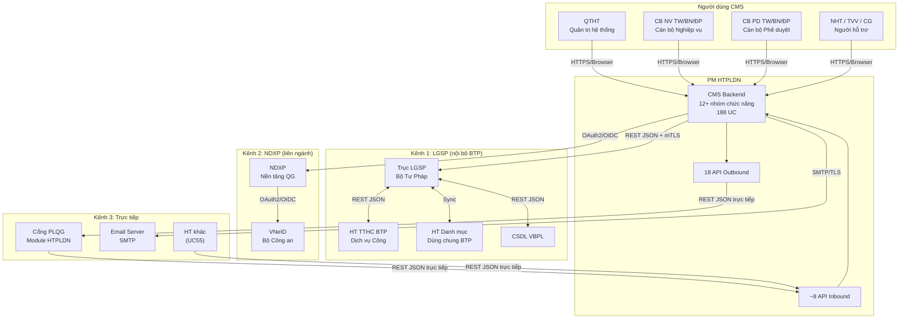

# 2.1 Bối cảnh sản phẩm

## 2.1.1 Vị trí trong hệ sinh thái

PM HTPLDN là thành phần **Backend CMS + API** hoạt động độc lập trong tổng thể dự án Cổng Pháp luật Quốc gia. PM không có giao diện hiển thị trực tiếp cho người dùng cuối (DN/Người dân) — thay vào đó, PM quản trị dữ liệu và chia sẻ 18 API trực tiếp với Cổng PLQG (REST JSON, không qua LGSP — xem C-08a) để gói thầu khác hiển thị trên "Chuyên trang HTPLDN".

**Kiến trúc:** Monolithic web application, 5 lớp logic (Người dùng -> Kênh giao tiếp -> Nghiệp vụ -> Ứng dụng -> Dữ liệu), triển khai on-premise tại Data Center BTP.

> **Tham chiếu:** PRD Section 1-2, Architecture Analysis Section 1-2

## 2.1.2 Sơ đồ ngữ cảnh (Context Diagram)

> **Ghi chú v1.6:** Context Diagram cập nhật theo mô hình hybrid 3 kênh (C-08a). Cổng PLQG kết nối trực tiếp (không qua LGSP). VNeID qua NDXP. HT khác (UC55) kết nối trực tiếp thay kênh Email cũ.

## 2.1.3 Tổng quan hệ thống bên ngoài

| # | Hệ thống bên ngoài | Mục đích tích hợp | Dữ liệu trao đổi (tổng quan) | Chiều |
|---|--------------------|--------------------|------------------------------|-------|
| 1 | Trục LGSP Bộ Tư Pháp | Middleware cho HT nội bộ BTP (DVC, VBPL, Danh mục) | Hồ sơ TTHC, VBPL, danh mục dùng chung | ↔ |
| 2 | VNeID (qua NDXP) | Xác thực danh tính điện tử (mô hình 2-tier: Tier 1 nội bộ / Tier 2 Internet = VNeID) | Thông tin xác thực (CCCD, họ tên, ngày sinh) | ← |
| 3 | HT TTHC BTP (DVC) | Tiếp nhận hồ sơ yêu cầu HTPL + hồ sơ chi phí | Hồ sơ TTHC, trạng thái xử lý, kết quả | ↔ |
| 4 | Cổng PLQG (Module HTPLDN) | Consumer chính 18 API — hiển thị HTPLDN cho DN/Người dân | 9 cặp API (chia sẻ + tìm kiếm): Hỏi đáp, ĐT, TVV, VV, Đánh giá, Biểu mẫu, TVCS, CT HTPLDN, HS PL DN | ↔ |
| 5 | HT Danh mục Dùng chung BTP | Đồng bộ danh mục chuẩn (lĩnh vực PL, đơn vị HC) | Danh mục lĩnh vực PL, đơn vị HC, loại hình HT | ← |
| 6 | Email Server (SMTP) | Gửi thông báo (phê duyệt, SLA, kích hoạt TK) | Email thông báo (HTML) | → |
| 7 | HT khác (UC55) | Tiếp nhận thông tin từ hệ thống bên ngoài | Dữ liệu vụ việc (REST JSON) | ← |

> **Chi tiết kỹ thuật (protocol, authentication, error handling):** Xem Architecture Design Document.
