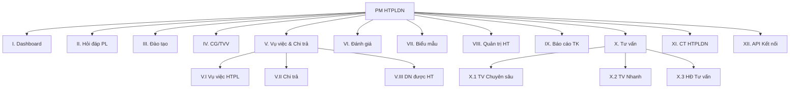

# 2.2 Chức năng sản phẩm (Product Functions)

## Danh sách nhóm chức năng

| # | Nhóm chức năng | Mã nhóm | Số UC | Mô tả ngắn | FR Section |
|---|---------------|---------|-------|------------|------------|
| 1 | Dashboard | I | 9 | 9 chỉ số tổng quan hoạt động HTPLDN | 3.2.1 |
| 2 | Quản lý hỏi đáp pháp luật | II | 12 (10 gốc + 2 mới) | Tiếp nhận, xử lý, kiểm duyệt, công khai Q&A | 3.2.2 |
| 3 | Quản lý đào tạo, tập huấn | III | 22 (19 gốc + 3 mới) | Chương trình đào tạo, khóa học, tài liệu, đề kiểm tra, kết quả | 3.2.3 |
| 4 | Quản lý Mạng lưới Tư vấn viên | IV | 13 (12 gốc + 1 cross) | Cá nhân tư vấn + Tổ chức tư vấn — đăng ký, thẩm định, phê duyệt, đánh giá | 3.2.4 |
| 5 | Quản lý vụ việc hỗ trợ pháp lý | V.I | 18 (17 gốc + 1 mới) | Tiếp nhận, kiểm tra, phân công, xử lý, đánh giá vụ việc | 3.2.5 |
| 6 | Quản lý chi trả chi phí | V.II | 13 | Đề nghị, đánh giá, thẩm định, phê duyệt chi phí tư vấn | 3.2.6 |
| 7 | Quản lý doanh nghiệp được hỗ trợ | V.III | 3 (2 gốc + 1 mới) | Hồ sơ doanh nghiệp nhỏ và vừa đã/đang được hỗ trợ | 3.2.7 |
| 8 | Theo dõi đánh giá hiệu quả hỗ trợ pháp lý | VI | 9 | Lập đợt, phân công, nhập điểm, báo cáo đánh giá | 3.2.8 |
| 9 | Quản lý thư viện biểu mẫu | VII | 7 | Kho biểu mẫu cho doanh nghiệp nhỏ và vừa. Hợp đồng tư vấn KHÔNG thuộc menu — xem Nhóm X.3 | 3.2.9 |
| 10 | Quản trị hệ thống | VIII | 21 | Danh mục, tài khoản, phân quyền, đăng nhập | 3.2.10 |
| 11 | Báo cáo thống kê | IX | 23 | 23 báo cáo gom thành 6 sub-menu theo chủ đề | 3.2.11 |
| 12 | Quản lý Tư vấn pháp luật chuyên sâu | X.1 | 15 | Tư vấn 1-1 giữa chuyên gia/tư vấn viên và doanh nghiệp | 3.2.12 |
| 13 | Tư vấn nhanh | X.2 | 5 | Tra cứu hỏi đáp pháp lý theo từ khóa | 3.2.13 |
| 14 | Hợp đồng tư vấn | X.3 | 1 | Quản lý hợp đồng tư vấn — KHÔNG có menu, truy cập qua chi tiết vụ việc và chi tiết tư vấn viên | 3.2.14 |
| 15 | Quản lý kế hoạch thực hiện chương trình hỗ trợ pháp lý doanh nghiệp | XI | 9 | Kế hoạch, thực hiện, báo cáo chương trình hỗ trợ pháp lý doanh nghiệp | 3.2.15 |
| 16 | API kết nối chia sẻ dữ liệu | XII | 18 | 18 giao tiếp dữ liệu hướng ra (trực tiếp với Cổng Pháp luật quốc gia, 9 cặp chia sẻ + tìm kiếm, UC171-188) | 3.2.16 |
| | **Tổng** | | **188** | | |

> **Tham chiếu:** PRD Section 6 (Functional Requirements)
