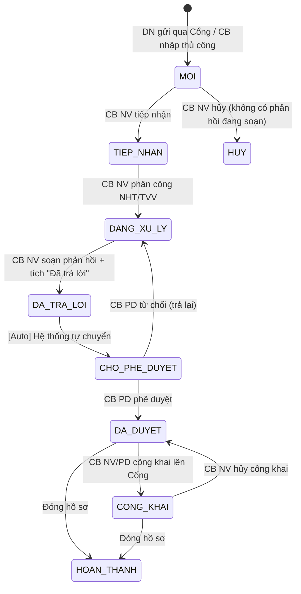

# C.1 SM-HOIDAP: Câu hỏi/Vướng mắc Pháp luật

**Entity:** HOI_DAP
**Tham chiếu FR:** FR-II-01 đến FR-II-10

**Bảng trạng thái:**

| Trạng thái | Mã | Mô tả | Màu hiển thị |
|-----------|-----|-------|-------------|
| Mới | MOI | Yêu cầu mới tiếp nhận từ Cổng/DVC/nhập tay | Xanh dương |
| Tiếp nhận | TIEP_NHAN | CB NV đã tiếp nhận, chưa phân công | Xanh lá |
| Đang xử lý | DANG_XU_LY | Đã phân công, đang soạn phản hồi | Vàng |
| Đã trả lời | DA_TRA_LOI | CB NV tích hoàn thành (thoáng qua) | — |
| Chờ phê duyệt | CHO_PHE_DUYET | Auto-transition, chờ CB PD duyệt | Cam |
| Đã duyệt | DA_DUYET | CB PD đã duyệt, sẵn sàng công khai | Xanh lá đậm |
| Công khai | CONG_KHAI | Đã đẩy lên Cổng PLQG | Tím |
| Hoàn thành | HOAN_THANH | Đóng hồ sơ | Xám |

**Bảng chuyển trạng thái:**

| Từ | Đến | Trigger | Guard | Action | FR Ref | BR Ref |
|----|-----|---------|-------|--------|--------|--------|
| [*] | MOI | DN gửi qua Cổng/DVC | — | Tạo bản ghi, sinh mã HD-xxx | FR-II-01 | BR-DATA-04 |
| MOI | TIEP_NHAN | CB NV nhấn "Tiếp nhận" | CB NV cùng đơn vị | Ghi audit, tính deadline SLA | FR-II-03 | BR-SLA-01 |
| TIEP_NHAN | DANG_XU_LY | CB NV phân công NHT/TVV | NHT/TVV đang hoạt động | Gửi thông báo NHT/TVV | FR-II-06 | BR-FLOW-01 |
| DANG_XU_LY | DA_TRA_LOI | CB NV tích "Đã trả lời" | Phản hồi không rỗng | Lưu phản hồi | FR-II-07 | — |
| DA_TRA_LOI | CHO_PHE_DUYET | Auto | — | Gửi thông báo CB PD | FR-II-07 | BR-FLOW-01 |
| CHO_PHE_DUYET | DA_DUYET | CB PD phê duyệt | CB PD cùng cấp | Ghi audit | FR-II-08 | BR-AUTH-05 |
| CHO_PHE_DUYET | DANG_XU_LY | CB PD từ chối | Có lý do từ chối | Gửi thông báo CB NV | FR-II-08 | BR-FLOW-04 |
| DA_DUYET | CONG_KHAI | CB nhấn "Công khai" | — | Gửi API trực tiếp lên Cổng PLQG | FR-II-08 | BR-FLOW-05 |
| CONG_KHAI | DA_DUYET | CB nhấn "Hủy công khai" | — | Gỡ khỏi Cổng qua API | FR-II-08 | BR-FLOW-05 |
| MOI | HUY | CB NV hủy yêu cầu | Không có phản hồi đang soạn | Soft delete, ghi audit | FR-II-08 | — | <!-- [Sync GAP-II-01/02] -->
| DA_DUYET | HOAN_THANH | CB NV đóng hồ sơ | — | Ghi audit | FR-II-08 | — | <!-- [Sync GAP-II-01/02] -->
| CONG_KHAI | HOAN_THANH | CB NV đóng hồ sơ | — | Ghi audit | FR-II-08 | — | <!-- [Sync GAP-II-01/02] -->

> **Lưu ý:** Tất cả chuyển trạng thái SHALL sử dụng optimistic locking (kiểm tra version). Crash recovery: scheduled job mỗi 5 phút detect bản ghi ở trạng thái trung gian > 5 phút và retry auto-transition.

**Trạng thái:** ✅ CĐT xác nhận

---
