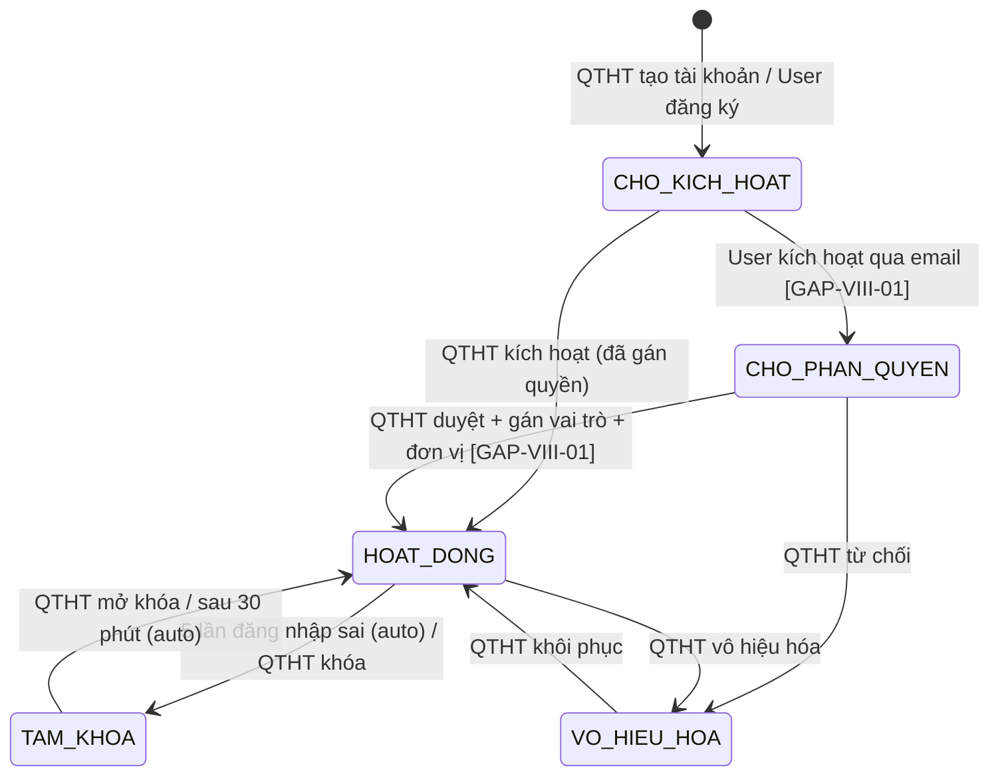

# C.10 SM-TAIKHOAN: Vòng đời Tài khoản

<!-- [Sync GAP-VIII-01] Đồng bộ diagram + transition table: bổ sung "User đăng ký", cập nhật FR refs (FR-VIII-22 cho self-registration), thêm [GAP-VIII-01] tags, cập nhật tham chiếu FR range. -->

**Entity:** TAI_KHOAN
**Tham chiếu FR:** FR-VIII-18 đến FR-VIII-22

**Bảng trạng thái:**

| Trạng thái | Mã | Mô tả |
|-----------|-----|-------|
| CHO_KICH_HOAT | pending | Tài khoản mới tạo, chưa kích hoạt |
| CHO_PHAN_QUYEN | awaiting_role | Đã kích hoạt email, chờ QTHT gán vai trò + đơn vị `[GAP-VIII-01]` |
| HOAT_DONG | active | Tài khoản đang hoạt động bình thường |
| TAM_KHOA | locked | Tài khoản bị khóa tạm thời (5 lần sai mật khẩu hoặc QTHT khóa) |
| VO_HIEU_HOA | disabled | Tài khoản bị vô hiệu hóa bởi QTHT |

**Bảng chuyển trạng thái:**

| Từ | Đến | Trigger | Guard | Action | FR Ref | BR Ref |
|----|-----|---------|-------|--------|--------|--------|
| [*] | CHO_KICH_HOAT | QTHT tạo tài khoản / User đăng ký | — | Gửi email kích hoạt | FR-VIII-18, FR-VIII-22 | — | <!-- [Sync GAP-VIII-01] -->
| CHO_KICH_HOAT | CHO_PHAN_QUYEN | User kích hoạt qua email (self-registration) | Token hợp lệ | Thông báo QTHT gán quyền `[GAP-VIII-01]` | FR-VIII-22 | — | <!-- [Sync GAP-VIII-01] -->
| CHO_PHAN_QUYEN | HOAT_DONG | QTHT duyệt + gán vai trò + đơn vị | vai_tro + don_vi đã gán | Cho phép đăng nhập `[GAP-VIII-01]` | FR-VIII-22 | — | <!-- [Sync GAP-VIII-01] -->
| CHO_KICH_HOAT | HOAT_DONG | QTHT kích hoạt (đã gán quyền trực tiếp) | Token hợp lệ | Cho phép đăng nhập | FR-VIII-18 | — | <!-- [Sync GAP-VIII-01] -->
| CHO_PHAN_QUYEN | VO_HIEU_HOA | QTHT từ chối | — | Ghi AUDIT_LOG, TB user | FR-VIII-19 | BR-AUTH-12 |
| HOAT_DONG | TAM_KHOA | 5 lần đăng nhập sai (auto) | so_lan_sai >= 5 | Ghi AUDIT_LOG, TB QTHT | FR-VIII-20 | BR-AUTH-07 |
| HOAT_DONG | TAM_KHOA | QTHT khóa thủ công | — | Ghi AUDIT_LOG | FR-VIII-19 | — |
| TAM_KHOA | HOAT_DONG | QTHT mở khóa | — | Reset so_lan_sai = 0 | FR-VIII-19 | BR-AUTH-07 |
| TAM_KHOA | HOAT_DONG | Sau 30 phút (auto) | elapsed >= 30 phút | Reset so_lan_sai = 0 | FR-VIII-20 | BR-AUTH-07 |
| HOAT_DONG | VO_HIEU_HOA | QTHT vô hiệu hóa | — | Invalidate session, ghi AUDIT_LOG | FR-VIII-19 | — |
| VO_HIEU_HOA | HOAT_DONG | QTHT khôi phục | — | Cho phép đăng nhập lại | FR-VIII-19 | — |
| CHO_KICH_HOAT | VO_HIEU_HOA | Auto: quá 7 ngày | activation_token_expired | Ghi audit, TB QTHT | — | — |

> **Lưu ý:** BR-AUTH-07 được cập nhật: 'Khóa tài khoản sau 5 lần sai mật khẩu. Tự mở khóa sau 30 phút HOẶC QTHT mở khóa thủ công qua UC113. Cả hai cơ chế đều hợp lệ.'

---

## SM-KH-DAO-TAO: Kế hoạch đào tạo `[SRS-FIX][CMT-3]`

**Entity:** KE_HOACH_DAO_TAO
**Tham chiếu FR:** FR-III-14, FR-III-15, FR-III-16

| Từ | Đến | Trigger | Guard | Action | FR Ref |
|----|-----|---------|-------|--------|--------|
| [*] | NHAP | CB NV tạo KH | — | Tạo bản ghi | FR-III-14 |
| NHAP | CHO_DUYET | CB NV gửi duyệt | Đủ trường bắt buộc | Thông báo CB PD | FR-III-14 |
| CHO_DUYET | DA_DUYET | CB PD duyệt | Cùng cấp (BR-AUTH-05) | Audit | FR-III-15 |
| CHO_DUYET | TU_CHOI | CB PD từ chối | Có lý do (BR-FLOW-04) | Thông báo CB NV | FR-III-15 |
| TU_CHOI | NHAP | CB NV chỉnh sửa | — | — | FR-III-14 |
| DA_DUYET | DA_CONG_KHAI | CB NV công khai | — | Set cong_khai=1, fill thoi_gian_dang_tai | FR-III-16 |
| DA_CONG_KHAI | DA_DUYET | CB NV hủy CK | — | Set cong_khai=0, clear thoi_gian_dang_tai | FR-III-16 |

---
