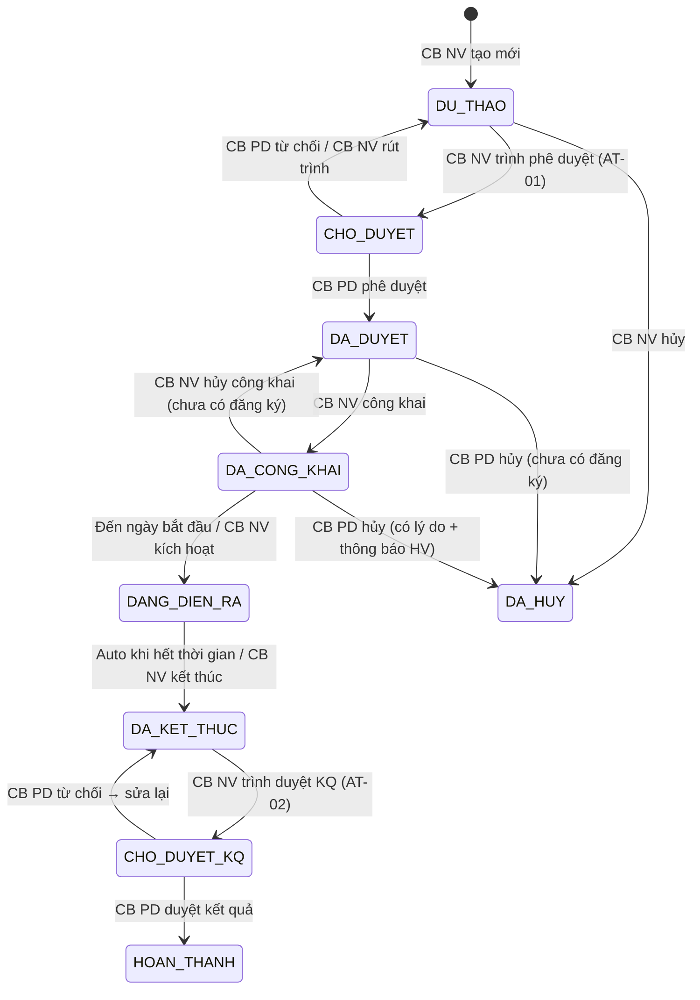

# C.2 SM-KHOAHOC: Khóa đào tạo

**Entity:** KHOA_HOC
**Tham chiếu FR:** FR-III-01 đến FR-III-22 `[GAP-III-08]`

**Bảng chuyển trạng thái:**

| Từ | Đến | Trigger | Guard | Action | FR Ref | BR Ref |
|----|-----|---------|-------|--------|--------|--------|
| [*] | DU_THAO | CB NV tạo khóa học | Có CTĐT cha | Tạo bản ghi KHOA_HOC | FR-III-01 | — |
| DU_THAO | CHO_DUYET | CB NV trình phê duyệt (AT-01) | Đủ field bắt buộc + ≥1 bản ghi KHOA_HOC_GIANG_VIEN + ≥1 LICH_HOC | Thông báo CB PD, ghi ngay_tiep_nhan | FR-III-01 | BR-NOTIF-01 |
| CHO_DUYET | DA_DUYET | CB PD phê duyệt | Cùng cấp (BR-AUTH-05) | Ghi thoi_gian_duyet + nguoi_duyet, audit | FR-III-21 `[GAP-III-08]` | BR-AUTH-05, BR-FLOW-03 |
| CHO_DUYET | DU_THAO | CB PD từ chối | Có lý do ≥10 ký tự | Ghi thoi_gian_tu_choi + nguoi_tu_choi + ly_do_tu_choi, thông báo CB NV | FR-III-21 `[GAP-III-08]` | BR-FLOW-04 |
| CHO_DUYET | DU_THAO | CB NV rút trình duyệt `[GAP-III-08 F-12a]` | CB NV tạo khóa + trạng thái chưa có CB PD bắt đầu duyệt | Thông báo CB PD, giữ data để sửa | FR-III-01 | — |
| DA_DUYET | DA_CONG_KHAI | CB NV công khai | — | Set thoi_gian_cong_khai, đẩy lên chuyên trang | FR-III-01 | BR-FLOW-05 |
| DA_CONG_KHAI | DA_DUYET | CB NV hủy công khai | Chưa có đăng ký | Gỡ khỏi chuyên trang | FR-III-01 | BR-FLOW-05 |
| DA_CONG_KHAI | DANG_DIEN_RA | Ngày BĐ hoặc CB kích hoạt | ngay_bat_dau <= NOW() AND có lịch + GV + đăng ký | Thông báo HV + GV | FR-III-01 | BR-NOTIF-01 |
| DANG_DIEN_RA | DA_KET_THUC | Auto khi hết thời gian / CB NV kết thúc | Tất cả buổi đã diễn ra HOẶC override thủ công có lý do | Đóng điểm danh | FR-III-01 | — |
| DA_KET_THUC | CHO_DUYET_KQ | CB NV trình duyệt KQ (AT-02) | Có KQ đầy đủ tất cả HV | TB CB PD | FR-III-17 | BR-AUTH-05 |
| CHO_DUYET_KQ | HOAN_THANH | CB PD duyệt kết quả | Cùng cấp | Ghi thoi_gian_duyet_kq + nguoi_duyet_kq, audit, cho phép cấp chứng nhận | FR-III-18 | BR-AUTH-05 |
| CHO_DUYET_KQ | DA_KET_THUC | CB PD từ chối KQ | Có lý do | TB CB NV sửa lại | FR-III-18 | BR-FLOW-04 |
| DU_THAO | DA_HUY | CB NV hủy | — | Soft cancel, audit | FR-III-01 | BR-DATA-01 |
| DA_DUYET | DA_HUY | CB PD hủy | Chưa có đăng ký / có lý do + thông báo HV nếu có | Ghi thoi_gian_huy + ly_do_huy, audit | FR-III-01 | BR-NOTIF-01 |
| DA_CONG_KHAI | DA_HUY | CB PD hủy | Có lý do + thông báo HV đã đăng ký (BR-NOTIF-01) | Gỡ khỏi chuyên trang, ghi thoi_gian_huy + ly_do_huy | FR-III-01 | BR-FLOW-05, BR-NOTIF-01 |

> **Guard bổ sung DANG_DIEN_RA → DA_KET_THUC:** Tất cả buổi đã diễn ra (ngay_hoc <= NOW) HOẶC CB NV override thủ công với lý do.

> **Lưu ý DA_HUY:** Khi chuyển DA_HUY từ DA_DUYET/DA_CONG_KHAI có đăng ký: thông báo tất cả HV qua email + in-app, cập nhật DANG_KY_DAO_TAO.trang_thai = 'HUY', giải phóng tài nguyên. Lý do hủy bắt buộc (BR-FLOW-04).

> **Lưu ý "Rút trình duyệt" vs "Hủy"** `[GAP-III-08 F-12a]`:
> - **Rút trình (CHO_DUYET → DU_THAO):** CB NV rút để **chỉnh sửa**, giữ nguyên dữ liệu, không yêu cầu lý do.
> - **Hủy (→ DA_HUY):** Xóa mềm entity. CHO_DUYET KHÔNG có action hủy — CB NV phải rút trình trước, rồi mới hủy (DU_THAO → DA_HUY).

> **Naming đổi:** HUY → DA_HUY (align UX Spec v2, C06 Badge) `[GAP-III-08 F-38]`.

**Trạng thái:** ✅ CĐT xác nhận

---
