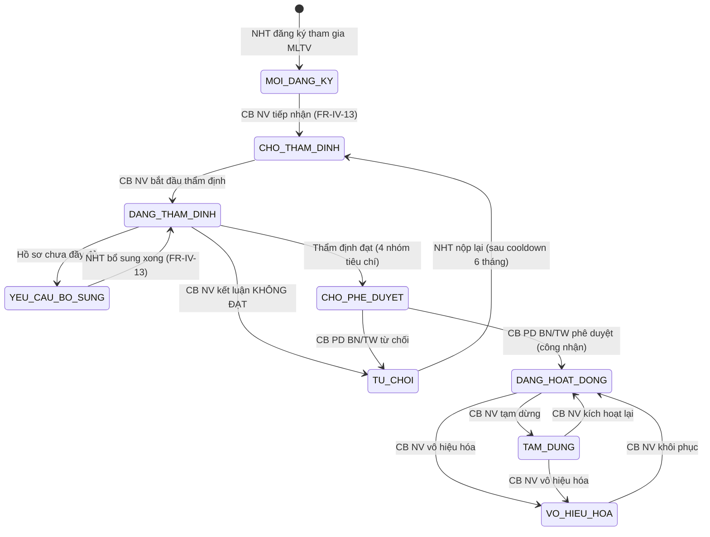

# C.3 SM-TVV: Tư vấn viên

**Entity:** TU_VAN_VIEN
**Tham chiếu FR:** FR-IV-01 đến FR-IV-13, FR-IV-NEW-01, FR-IV-NEW-02

**Bảng chuyển trạng thái:**

| Từ | Đến | Trigger | Guard | Action | FR Ref | BR Ref |
|----|-----|---------|-------|--------|--------|--------|
| [*] | MOI_DANG_KY | NHT đăng ký MLTV | — | Tạo hồ sơ TVV | FR-IV-03 | — |
| MOI_DANG_KY | CHO_THAM_DINH | CB NV tiếp nhận | Hồ sơ đủ giấy tờ, CB NV cùng đơn vị | Ghi `ngay_tiep_nhan`, `nguoi_tiep_nhan`, thông báo NHT | FR-IV-13 | BR-AUTH-08 |
| CHO_THAM_DINH | DANG_THAM_DINH | CB NV bắt đầu thẩm định | — | Ghi thời điểm bắt đầu | FR-IV-06 | — |
| DANG_THAM_DINH | YEU_CAU_BO_SUNG | Hồ sơ chưa đầy đủ | CB NV xác nhận thiếu, có `ly_do` | Thông báo NHT | FR-IV-06 | — |
| YEU_CAU_BO_SUNG | DANG_THAM_DINH | NHT bổ sung xong | Có tài liệu bổ sung (auto trigger từ FR-IV-04) | Thông báo CB NV | FR-IV-13 | — |
| DANG_THAM_DINH | CHO_PHE_DUYET | Thẩm định đạt (trình duyệt) | ket_luan = DAT AND nhom1_ket_qua = true | Ghi kết quả thẩm định, nếu CB_NV thuộc ĐP → escalate lên BN/TW | FR-IV-06 | BR-LEGAL-04, BR-AUTH-05 |
| DANG_THAM_DINH | TU_CHOI | CB NV kết luận KHÔNG ĐẠT | ket_luan = KHONG_DAT, có `ly_do` | Thông báo NHT + ghi lý do | FR-IV-06 | BR-FLOW-04 |
| CHO_PHE_DUYET | DANG_HOAT_DONG | CB PD duyệt | **`user.don_vi.cap IN ('BN','TW')`** + cùng cấp thẩm định (BR-AUTH-05) + có `so_quyet_dinh` + optimistic lock | Audit, `ngay_cong_nhan`, `thoi_gian_duyet`, `nguoi_duyet`, `so_quyet_dinh_cong_nhan`. **CB_PD_ĐP KHÔNG được phép** (NĐ 55/2019 Điều 9 + NĐ 121/2025 Điều 24) | FR-IV-07 | BR-AUTH-05 (exception) |
| CHO_PHE_DUYET | TU_CHOI | CB PD từ chối | Cấp BN/TW + có lý do ≥ 10 ký | `thoi_gian_tu_choi`, `nguoi_tu_choi`, `ly_do_tu_choi`, thông báo CB NV + NHT | FR-IV-07 | BR-FLOW-04 |
| TU_CHOI | CHO_THAM_DINH | NHT nộp lại hồ sơ | Đã quá cooldown 6 tháng kể từ `thoi_gian_tu_choi` | Reset kết quả thẩm định cũ, thông báo CB NV | FR-IV-13 | — |
| DANG_HOAT_DONG | TAM_DUNG | CB NV tạm dừng | Có lý do ≥ 10 ký | Audit log | FR-IV-12 | — |
| TAM_DUNG | DANG_HOAT_DONG | CB NV kích hoạt lại | — | Audit log | FR-IV-12 | — |
| DANG_HOAT_DONG | VO_HIEU_HOA | CB NV vô hiệu hóa | KHÔNG có VU_VIEC AND HOI_DAP đang xử lý | Gỡ khỏi Cổng PLQG, audit | FR-IV-12 | — |
| TAM_DUNG | VO_HIEU_HOA | CB NV vô hiệu hóa | KHÔNG có VU_VIEC AND HOI_DAP đang xử lý | Gỡ khỏi Cổng PLQG, audit | FR-IV-12 | — |
| VO_HIEU_HOA | DANG_HOAT_DONG | CB NV khôi phục | Quyết định từng trường hợp | Audit log | FR-IV-12 | — |

> **Guard chung VO_HIEU_HOA (từ DANG_HOAT_DONG/TAM_DUNG):** Kiểm tra KHÔNG có VU_VIEC **và** HOI_DAP đang xử lý (trang_thai IN ('DANG_XU_LY','CHO_PHE_DUYET')).
>
> **Exception BR-AUTH-05 cho FR-IV-07:** Công nhận TVV vào mạng lưới quốc gia CHỈ thuộc cấp BN/TW theo NĐ 55/2019 Điều 9 + NĐ 121/2025 Điều 24. CB_NV_ĐP thẩm định → tự động escalate lên BN/TW để phê duyệt.

**Trạng thái:** ✅ CĐT xác nhận

---
