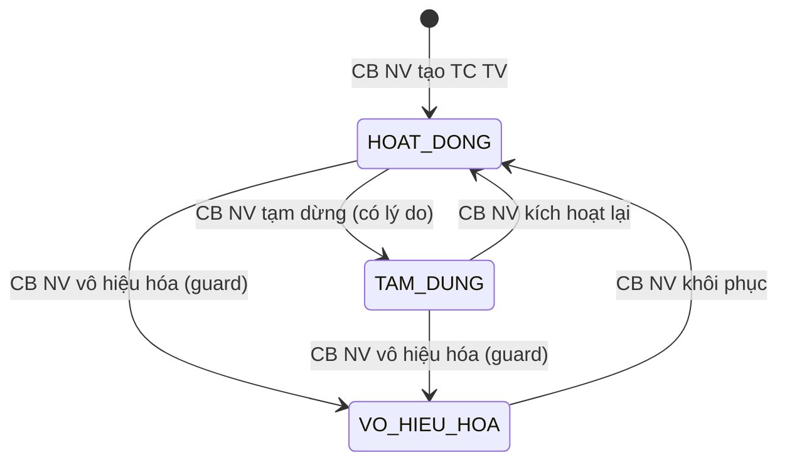

# C.3a SM-TCTV: Tổ chức Tư vấn `[GAP-IV-09]`

**Entity:** TO_CHUC_TU_VAN
**Tham chiếu FR:** FR-IV-NEW-01, FR-IV-NEW-02

**Bảng trạng thái:**

| Trạng thái | Mã | Mô tả | Màu hiển thị |
|-----------|-----|-------|-------------|
| Đang hoạt động | HOAT_DONG | TC TV đang hoạt động trong mạng lưới | Xanh lá |
| Tạm dừng | TAM_DUNG | CB NV tạm dừng hoạt động | Vàng đậm |
| Vô hiệu hóa | VO_HIEU_HOA | TC TV bị vô hiệu hóa | Đỏ đậm |

**Bảng chuyển trạng thái:**

| Từ | Đến | Trigger | Guard | Action | FR Ref |
|----|-----|---------|-------|--------|--------|
| [*] | HOAT_DONG | CB NV tạo TC TV | — | Tạo bản ghi TO_CHUC_TU_VAN | FR-IV-NEW-01 |
| HOAT_DONG | TAM_DUNG | CB NV tạm dừng | Có lý do ≥ 10 ký | Audit log | FR-IV-NEW-02 |
| TAM_DUNG | HOAT_DONG | CB NV kích hoạt lại | — | Audit log | FR-IV-NEW-02 |
| HOAT_DONG | VO_HIEU_HOA | CB NV vô hiệu hóa | KHÔNG có TVV đang liên kết hoạt động (`COUNT(TVV_TO_CHUC WHERE to_chuc_id=@id AND TVV.trang_thai='DANG_HOAT_DONG') = 0`) | Gỡ khỏi Cổng PLQG nếu đã công khai, audit | FR-IV-NEW-02 |
| TAM_DUNG | VO_HIEU_HOA | CB NV vô hiệu hóa | Same guard | Gỡ khỏi Cổng PLQG, audit | FR-IV-NEW-02 |
| VO_HIEU_HOA | HOAT_DONG | CB NV khôi phục | Quyết định từng trường hợp | Audit log | FR-IV-NEW-02 |

**Trạng thái:** 🟡 Mới thêm v3.1 (review 2026-04-19)

---
