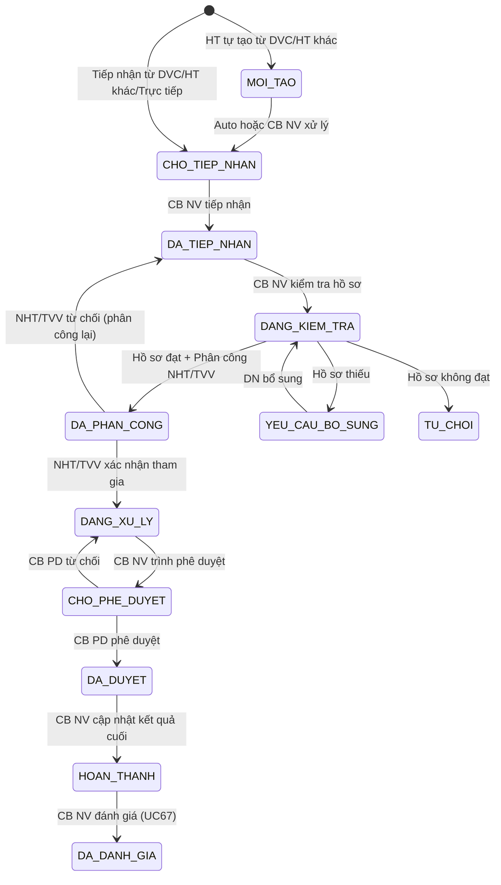

# C.4 SM-VUVIEC: Vụ việc HTPL

**Entity:** VU_VIEC
**Tham chiếu FR:** FR-V.I-01 đến FR-V.I-17

**Bảng chuyển trạng thái:**

| Từ | Đến | Trigger | Guard | Action | FR Ref | BR Ref |
|----|-----|---------|-------|--------|--------|--------|
| [*] | MOI_TAO | HT tự tạo từ DVC/HT khác | — | Tạo VV, sinh mã | FR-V.I-03/04/05 | — |
| MOI_TAO | CHO_TIEP_NHAN | Auto hoặc CB NV xử lý | — | Tính deadline, audit | FR-V.I-03/04/05 | BR-SLA-01 |
| [*] | CHO_TIEP_NHAN | DVC/HT khác/Trực tiếp | — | Tạo VV, sinh mã, tính deadline | FR-V.I-03/04/05 | BR-SLA-01 |
| CHO_TIEP_NHAN | DA_TIEP_NHAN | CB NV tiếp nhận | CB NV cùng đơn vị | Audit, gửi TB DN (nếu DVC) | FR-V.I-01 | — |
| DA_TIEP_NHAN | DANG_KIEM_TRA | CB NV kiểm tra | — | Đối chiếu checklist UC106 | FR-V.I-06 | BR-LEGAL-02 |
| DANG_KIEM_TRA | DA_PHAN_CONG | Đạt + chọn NHT | NHT đang hoạt động | Gửi TB NHT | FR-V.I-09 | BR-CALC-05 |
| DANG_KIEM_TRA | YEU_CAU_BO_SUNG | Thiếu HS | — | TB DN bổ sung | FR-V.I-06 | — |
| DANG_KIEM_TRA | TU_CHOI | Không đạt | — | TB DN kết quả | FR-V.I-12 | — |
| DA_PHAN_CONG | DANG_XU_LY | NHT xác nhận | — | Audit | FR-V.I-10 | — |
| DA_PHAN_CONG | DA_TIEP_NHAN | NHT từ chối | Có lý do | Quay lại chọn NHT khác | FR-V.I-10 | — |
| DANG_XU_LY | CHO_PHE_DUYET | CB NV trình | NHT đã cập nhật KQ | TB CB PD | FR-V.I-11 | BR-AUTH-05 |
| CHO_PHE_DUYET | DA_DUYET | CB PD duyệt | Cùng cấp | Audit | FR-V.I-13 | BR-AUTH-05 |
| CHO_PHE_DUYET | DANG_XU_LY | CB PD từ chối | Có lý do | TB CB NV | FR-V.I-13 | BR-FLOW-04 |
| DA_DUYET | HOAN_THANH | CB NV cập nhật KQ cuối | — | Audit, TB DN | FR-V.I-16 | — |
| HOAN_THANH | DA_DANH_GIA | CB NV đánh giá (UC67) | VV đã hoàn thành | Lưu đánh giá, audit | FR-V.I-17 | — |
| TU_CHOI | DA_TIEP_NHAN | QTHT/CB NV mở lại | Admin override hoặc DN khiếu nại | Audit log, ghi lý do | FR-V.I-xx | — |
| YEU_CAU_BO_SUNG | TU_CHOI | Auto: quá N ngày LV | elapsed > cau_hinh_sla.bo_sung_timeout | TB DN, ghi audit | BR-EC-16 | — |

> **Lưu ý:** Tối đa 3 lần bổ sung (BR-EC-15). Sau lần thứ 3 nếu vẫn KHONG_DAT → tự động TU_CHOI.

**Trạng thái:** ✅ CĐT xác nhận

---
