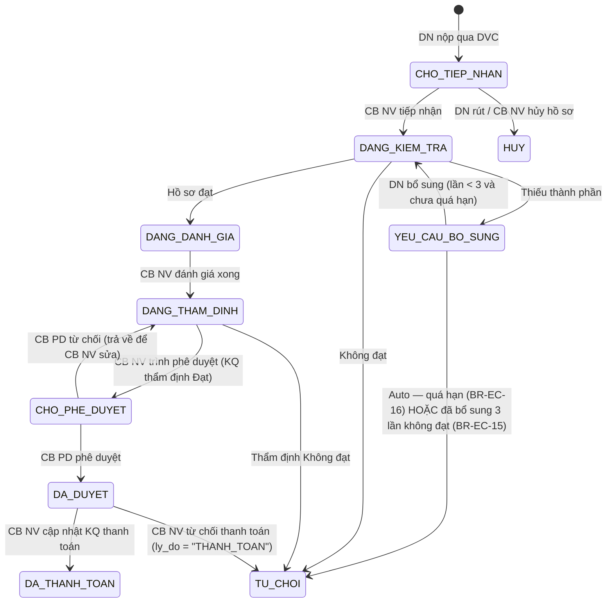

# C.5 SM-CHITRA: Chi trả Chi phí

**Entity:** HO_SO_CHI_TRA
**Tham chiếu FR:** FR-V.II-01 → FR-V.II-14, FR-V.II-CROSS-01
**Nguồn chi tiết:** `srs-fr-06-chi-tra.md` Section 5 (authoritative, đồng bộ 2026-04-20)

**Bảng chuyển trạng thái:**

| Từ | Đến | Trigger | Guard | Action | FR Ref | BR Ref |
|----|-----|---------|-------|--------|--------|--------|
| [*] | CHO_TIEP_NHAN | DN nộp qua DVC | — | Tạo HS, validate Mẫu 01 (18 trường), tính deadline, `muc_do_canh_bao = 'BINH_THUONG'` | FR-V.II-01 | BR-LEGAL-02, BR-CALC-03 |
| CHO_TIEP_NHAN | DANG_KIEM_TRA | CB NV tiếp nhận | — | Ghi `ngay_tiep_nhan`, `nguoi_tiep_nhan_id`, audit | FR-V.II-02 | — |
| DANG_KIEM_TRA | DANG_DANH_GIA | Kiểm tra Đạt | Checklist đủ | TB DVC kết quả | FR-V.II-03/04 | — |
| DANG_KIEM_TRA | YEU_CAU_BO_SUNG | Kiểm tra cần bổ sung | — | Tăng `bo_sung_count`, ghi `ngay_yeu_cau_bo_sung`, TB DN qua DVC | FR-V.II-03 | BR-EC-15 |
| DANG_KIEM_TRA | TU_CHOI | CB NV kiểm tra không đạt | Có lý do | Ghi `ly_do_tu_choi`, `thoi_gian_tu_choi`, `nguoi_tu_choi_id` | FR-V.II-03 | BR-FLOW-04 |
| DANG_DANH_GIA | DANG_THAM_DINH | CB NV đánh giá xong | Tính mức HT theo quy mô DN | Áp dụng BR-CALC-01/02 | FR-V.II-05 | BR-CALC-01/02 |
| DANG_THAM_DINH | CHO_PHE_DUYET | CB NV Trình phê duyệt | `ket_qua_tham_dinh = DAT` | TB CB PD cùng cấp | FR-V.II-11 | BR-AUTH-05 |
| DANG_THAM_DINH | TU_CHOI | Thẩm định Không đạt | Có nhận xét | Ghi `ly_do_tu_choi = "THAM_DINH: " + nhan_xet` | FR-V.II-09 | BR-FLOW-04 |
| CHO_PHE_DUYET | DA_DUYET | CB PD phê duyệt | Cùng cấp (BR-AUTH-05) | Ghi `nguoi_phe_duyet_id`, `ngay_phe_duyet`, tạo PHE_DUYET_CHI_TRA | FR-V.II-12 | BR-AUTH-05 |
| CHO_PHE_DUYET | DANG_THAM_DINH | CB PD từ chối (trả về) | Có lý do ≥ 10 ký tự | Ghi `ly_do_tu_choi`, tạo PHE_DUYET_CHI_TRA (`quyet_dinh = TU_CHOI`), TB CB NV | FR-V.II-12 | BR-FLOW-04 |
| DA_DUYET | DA_THANH_TOAN | CB NV cập nhật TT | — | Ghi `so_tien_thuc_tra`, `ngay_thanh_toan` | FR-V.II-13 | — |
| DA_DUYET | TU_CHOI | CB NV từ chối thanh toán | Có lý do | Ghi `ly_do_tu_choi = "THANH_TOAN: " + ly_do` | FR-V.II-13 | BR-FLOW-04 |
| YEU_CAU_BO_SUNG | DANG_KIEM_TRA | DN bổ sung | File hợp lệ, chưa quá hạn, `bo_sung_count < 3` | Lưu file, TB CB NV | FR-V.II-14 | BR-DATA-03 |
| YEU_CAU_BO_SUNG | TU_CHOI | Auto: quá N ngày LV | `elapsed(ngay_yeu_cau_bo_sung) > CAU_HINH_SLA[HO_SO_CHI_TRA_BO_SUNG].thoi_han_ngay` | TB DN qua DVC, `nguoi_tu_choi_id = SYSTEM` | FR-V.II-CROSS-01 | BR-EC-16 |
| YEU_CAU_BO_SUNG | TU_CHOI | Auto: 3 lần không đạt | `bo_sung_count ≥ 3` AND `ket_qua ≠ DAT` | TB DN, `ly_do = "Đã bổ sung 3 lần không đạt"` | FR-V.II-03 | BR-EC-15 |
| CHO_TIEP_NHAN | HUY | DN rút / CB NV hủy | Trạng thái chưa qua DANG_DANH_GIA | Ghi `ly_do_huy`, TB DVC, audit | FR-V.II-02 | — |

**Trạng thái:** ✅ CĐT xác nhận | 🟡 Mức hỗ trợ NĐ18/2026
**Thay đổi 2026-04-20:** Bỏ trạng thái `DA_THAM_DINH` (không có thực trong enum); "CB PD từ chối" chính thức là trả về `DANG_THAM_DINH` (không phải TU_CHOI cuối); thêm 3 transition auto (BR-EC-15/16, thẩm định Không đạt, từ chối thanh toán); thêm DA_DUYET → TU_CHOI.

---
