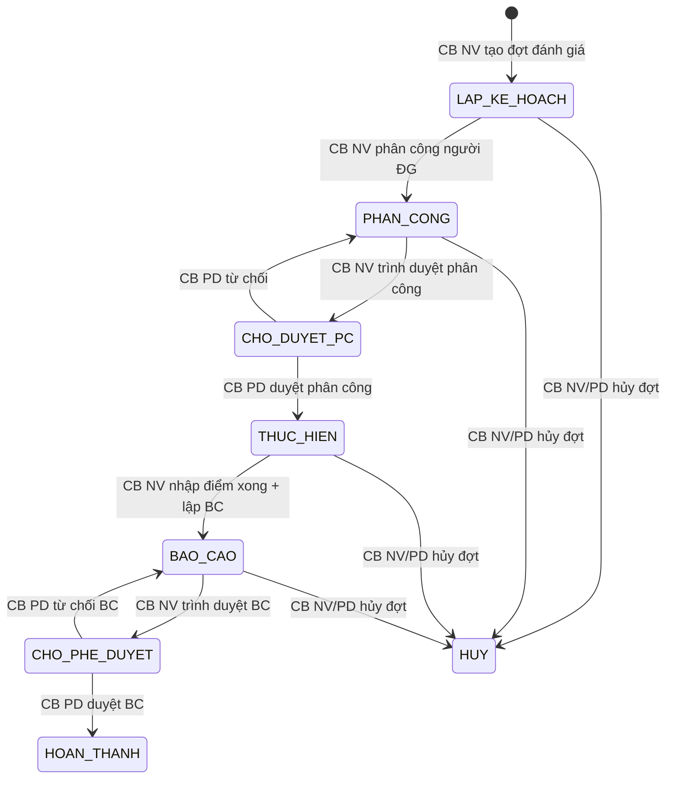

# C.6 SM-DANHGIA: Đánh giá Hiệu quả

**Entity:** KE_HOACH_DANH_GIA (+ KET_QUA_DANH_GIA + BAO_CAO_DANH_GIA)
**Tham chiếu FR:** FR-VI-01 đến FR-VI-09

<!-- [Sync GAP-VI-01] Bổ sung state HUY + 4 transitions hủy từ các trạng thái chưa hoàn thành. Thêm bảng trạng thái + màu hiển thị. -->

**Bảng trạng thái:**

| Trạng thái | Mã | Mô tả | Màu hiển thị |
|-----------|-----|-------|-------------|
| Lập kế hoạch | LAP_KE_HOACH | CB NV đang lập kế hoạch đợt đánh giá | Xám |
| Phân công | PHAN_CONG | CB NV đang phân công người đánh giá | Xanh dương |
| Chờ duyệt phân công | CHO_DUYET_PC | CB NV trình, chờ CB PD duyệt phân công | Cam |
| Thực hiện | THUC_HIEN | CB PD đã duyệt, đang chấm điểm vụ việc | Vàng |
| Báo cáo | BAO_CAO | CB NV nhập điểm xong, đang lập báo cáo | Xanh dương đậm |
| Chờ phê duyệt | CHO_PHE_DUYET | CB NV trình báo cáo, chờ CB PD duyệt | Cam đậm |
| Hoàn thành | HOAN_THANH | CB PD đã duyệt báo cáo, đóng đợt đánh giá | Xanh lá |
| Hủy | HUY | Đợt đánh giá bị hủy | Đỏ | <!-- [Sync GAP-VI-01] -->

**Bảng chuyển trạng thái:**

| Từ | Đến | Trigger | Guard | Action | FR Ref | BR Ref |
|----|-----|---------|-------|--------|--------|--------|
| [*] | LAP_KE_HOACH | CB NV tạo đợt | Tần suất: 6 tháng/năm | Tạo KH | FR-VI-01 | BR-LEGAL-08 |
| LAP_KE_HOACH | PHAN_CONG | CB NV phân công | Có KH | Gán CB/CG | FR-VI-03 | — |
| PHAN_CONG | CHO_DUYET_PC | CB NV trình | Có danh sách PC | TB CB PD | FR-VI-03 | BR-AUTH-05 |
| CHO_DUYET_PC | THUC_HIEN | CB PD duyệt | Cùng cấp | Audit, chọn VV | FR-VI-04/05 | — |
| CHO_DUYET_PC | PHAN_CONG | CB PD từ chối | Có lý do | TB CB NV | FR-VI-04 | BR-FLOW-04 | <!-- [Sync GAP-VI-01] -->
| THUC_HIEN | BAO_CAO | Nhập điểm xong | Tất cả VV đã ĐG | Sinh BC TT17 | FR-VI-06/07 | BR-CALC-04 |
| BAO_CAO | CHO_PHE_DUYET | CB NV trình | BC đủ dữ liệu | TB CB PD | FR-VI-08 | — |
| CHO_PHE_DUYET | HOAN_THANH | CB PD duyệt | Cùng cấp | Audit | FR-VI-09 | BR-AUTH-05 |
| CHO_PHE_DUYET | BAO_CAO | CB PD từ chối | Có lý do | TB CB NV | FR-VI-09 | BR-FLOW-04 |
| LAP_KE_HOACH/PHAN_CONG/THUC_HIEN/BAO_CAO | HUY | CB NV/PD hủy đợt | Có lý do, chưa HOAN_THANH | Audit, soft-delete | — | — | <!-- [Sync GAP-VI-01] -->

**Trạng thái:** ✅ CĐT xác nhận

---
