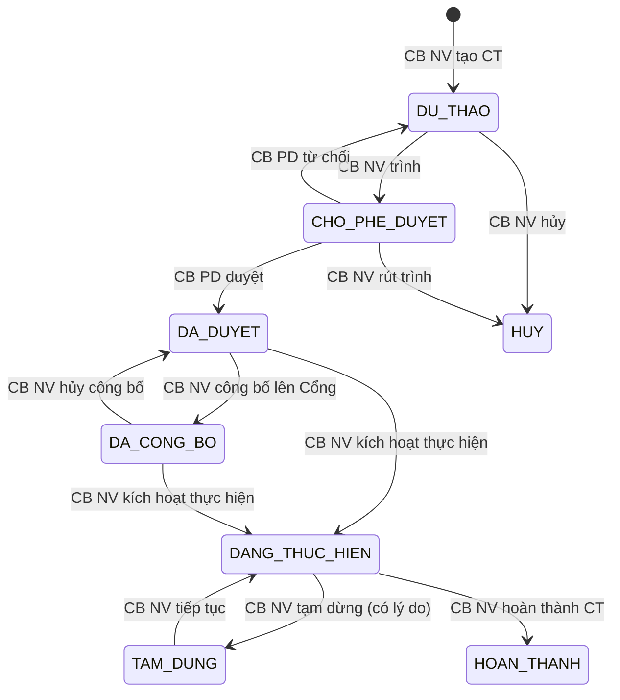

# C.7 SM-KH-CTHTPL: Kế hoạch CT HTPLDN

> **V2.1 (C3-19):** Tách từ SM-CTHTPL cũ thành 2 SM: SM-KH-CTHTPL (kế hoạch) + SM-DOT-BC (đợt BC).

**Entity:** CHUONG_TRINH_HTPL
**Tham chiếu FR:** FR-XI-01 đến FR-XI-05

**Bảng chuyển trạng thái:**

| Từ | Đến | Trigger | Guard | Action | FR Ref | BR Ref |
|----|-----|---------|-------|--------|--------|--------|
| [*] | DU_THAO | CB NV tạo CT | — | Tạo bản ghi | FR-XI-01 | — |
| DU_THAO | CHO_PHE_DUYET | CB NV trình | Đủ thông tin | TB CB PD | FR-XI-03 | BR-AUTH-05 |
| CHO_PHE_DUYET | DA_DUYET | CB PD duyệt | Cùng cấp | Audit | FR-XI-04 | BR-AUTH-05 |
| CHO_PHE_DUYET | DU_THAO | CB PD từ chối | Có lý do | TB CB NV | FR-XI-04 | BR-FLOW-04 |
| DA_DUYET | DA_CONG_BO | CB NV công bố | — | API trực tiếp lên Cổng PLQG | FR-XI-05 | BR-FLOW-05 |
| DA_CONG_BO | DA_DUYET | CB NV hủy công bố | — | Gỡ khỏi Cổng | FR-XI-05 | BR-FLOW-05 |
| DA_DUYET | DANG_THUC_HIEN | CB NV kích hoạt | — | — | FR-XI-01 | — |
| DA_CONG_BO | DANG_THUC_HIEN | CB NV kích hoạt | — | — | FR-XI-01 | — |
| DANG_THUC_HIEN | HOAN_THANH | CB NV hoàn thành | — | Ghi audit | FR-XI-01 | — |
| DANG_THUC_HIEN | TAM_DUNG | CB NV tạm dừng CT | Có lý do | Ghi audit | — | — |
| TAM_DUNG | DANG_THUC_HIEN | CB NV tiếp tục | — | Ghi audit | — | — |
| DU_THAO | HUY | CB NV hủy | — | Ghi audit | — | — |
| CHO_PHE_DUYET | HUY | CB NV rút trình | CB NV tạo ban đầu | Ghi audit, TB CB PD | — | — |

**Trạng thái:** ✅ CĐT xác nhận

---
