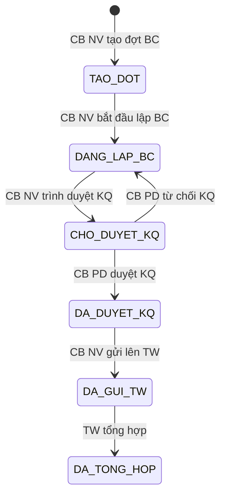

# C.7a SM-DOT-BC: Đợt báo cáo CT HTPLDN

> **Mới v2.1 (C1-8, C1-9, C3-19).** Quản lý vòng đời đợt báo cáo riêng biệt với kế hoạch CT.

**Entity:** DOT_BAO_CAO
**Tham chiếu FR:** FR-XI-05a, FR-XI-06, FR-XI-07, FR-XI-07a, FR-XI-08, FR-XI-09

**Bảng chuyển trạng thái:**

| Từ | Đến | Trigger | Guard | Action | FR Ref | BR Ref |
|----|-----|---------|-------|--------|--------|--------|
| [*] | TAO_DOT | CB NV tạo đợt | CT ở DANG_THUC_HIEN/HOAN_THANH | Auto-gen mã đợt | FR-XI-05a | — |
| TAO_DOT | DANG_LAP_BC | CB NV bắt đầu lập BC | Đợt đã hoàn chỉnh thông tin | Tạo BAO_CAO_CT_HTPL record | FR-XI-06 | — |
| DANG_LAP_BC | CHO_DUYET_KQ | CB NV trình duyệt KQ | BC đầy đủ số liệu | TB CB PD | FR-XI-07 | BR-AUTH-05 |
| CHO_DUYET_KQ | DA_DUYET_KQ | CB PD duyệt KQ | Cùng cấp | Audit, TB CB NV | FR-XI-07a | BR-AUTH-05 |
| CHO_DUYET_KQ | DANG_LAP_BC | CB PD từ chối KQ | Có lý do | TB CB NV kèm lý do | FR-XI-07a | BR-FLOW-04 |
| DA_DUYET_KQ | DA_GUI_TW | CB NV BN/ĐP gửi TW | Chỉ BN/ĐP | TB CB NV TW | FR-XI-08 | — |
| DA_GUI_TW | DA_TONG_HOP | TW tổng hợp | CB NV TW xác nhận | Tạo BC tổng hợp | FR-XI-09 | — |

**Trạng thái:** ✅ CĐT xác nhận (CSV STT 165, 168)

---
