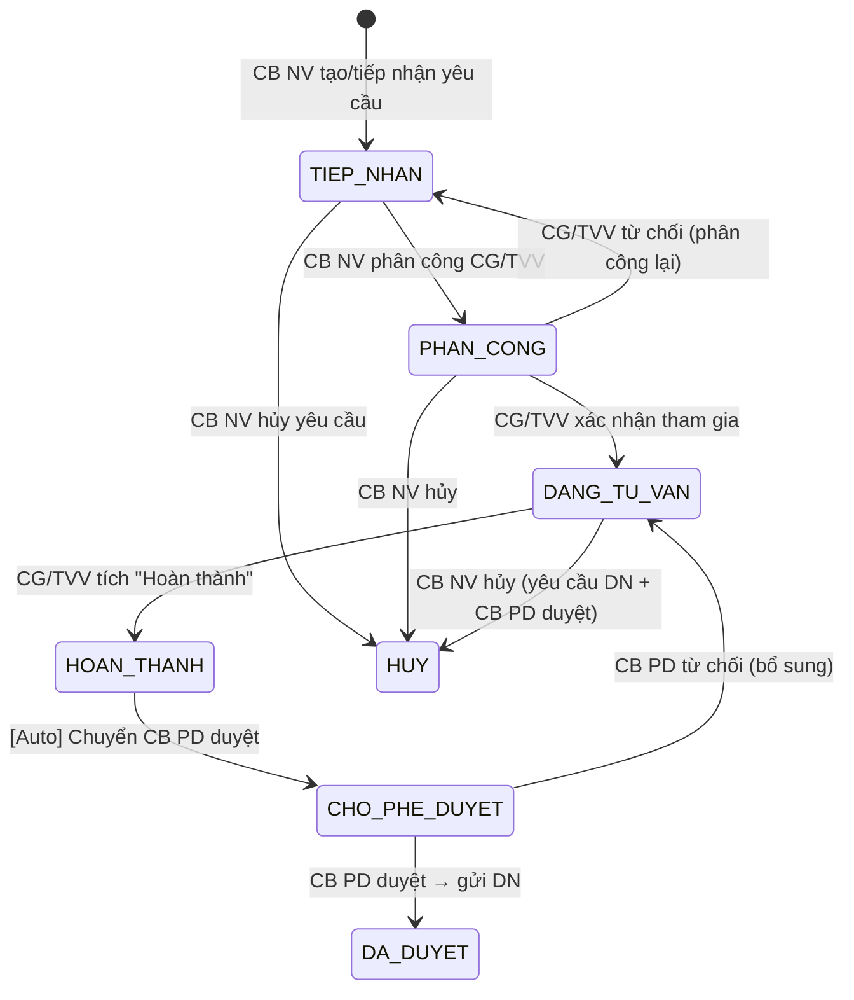

# C.8 SM-TVCS: Tư vấn Chuyên sâu

<!-- [Sync GAP-X.1-01] Cập nhật FR refs (FR-X.1-01 thay cho FR-X.1-10/11/14 đã LOẠI BỎ), thêm bảng trạng thái, thêm TIEP_NHAN→HUY vào transition table. -->

**Entity:** TU_VAN_CHUYEN_SAU
**Tham chiếu FR:** FR-X.1-01 đến FR-X.1-07

> **V2.1 (C3-14):** 5 UC LOẠI BỎ (UC147/148/154/155/156) + UC151 đã xóa. SM-TVCS giữ nguyên vì luồng chính không thay đổi.
> **SM-TVNHANH** (Nhóm X.2 Tư vấn Nhanh): Khai báo tại §3.2.13, 7 trạng thái (MOI → DANG_TIM_KIEM → DA_GOI_Y → CB_TRA_LOI → HOAN_THANH / HET_HAN). Không tạo appendix riêng vì SM đơn giản, đã mô tả đầy đủ tại §3.2.13.0.

**Bảng trạng thái:**

| Trạng thái | Mã | Mô tả |
|-----------|-----|-------|
| TIEP_NHAN | received | Yêu cầu TV mới tạo/tiếp nhận từ Cổng |
| PHAN_CONG | assigned | Đã phân công CG/TVV, chờ xác nhận |
| DANG_TU_VAN | in_progress | CG/TVV đang tư vấn |
| HOAN_THANH | completed | CG/TVV hoàn thành, chờ phê duyệt |
| CHO_PHE_DUYET | pending_approval | Chờ CB PD duyệt |
| DA_DUYET | approved | Đã duyệt, gửi kết quả cho DN |
| HUY | cancelled | Hủy yêu cầu |

**Bảng chuyển trạng thái:**

| Từ | Đến | Trigger | Guard | Action | FR Ref | BR Ref |
|----|-----|---------|-------|--------|--------|--------|
| [*] | TIEP_NHAN | CB NV tạo YC TV | — | Tạo bản ghi | FR-X.1-01/03 | — |
| TIEP_NHAN | PHAN_CONG | CB NV phân công | Có CG/TVV phù hợp | TB CG/TVV | FR-X.1-01 | — | <!-- [Sync GAP-X.1-01] -->
| PHAN_CONG | DANG_TU_VAN | CG xác nhận | — | Tạo phiên TV, TB DN | FR-X.1-01 | — | <!-- [Sync GAP-X.1-01] -->
| PHAN_CONG | TIEP_NHAN | CG từ chối | Có lý do | Quay lại chọn CG khác | FR-X.1-01 | — | <!-- [Sync GAP-X.1-01] -->
| DANG_TU_VAN | HOAN_THANH | CG tích "Hoàn thành" | Có VB TVPL | — | FR-X.1-01 | — | <!-- [Sync GAP-X.1-01] -->
| HOAN_THANH | CHO_PHE_DUYET | Auto | — | TB CB PD | FR-X.1-01 | BR-FLOW-01 | <!-- [Sync GAP-X.1-01] -->
| CHO_PHE_DUYET | DA_DUYET | CB PD duyệt | Cùng cấp | Gửi KQ cho DN, TB đánh giá | FR-X.1-01 | BR-AUTH-05 | <!-- [Sync GAP-X.1-01] -->
| CHO_PHE_DUYET | DANG_TU_VAN | CB PD từ chối | Có lý do | TB CG bổ sung | FR-X.1-01 | BR-FLOW-04 | <!-- [Sync GAP-X.1-01] -->
| TIEP_NHAN | HUY | CB NV hủy | — | Ghi audit | — | — | <!-- [Sync GAP-X.1-01] -->
| PHAN_CONG | HUY | CB NV hủy | CG chưa xác nhận | Ghi audit, TB CG | — | — |
| DANG_TU_VAN | HUY | CB NV hủy | DN yêu cầu hủy + CB PD duyệt | Ghi audit, TB CG + DN | — | — |

> **Lưu ý timeout phân công CG:** CG SHALL xác nhận/từ chối trong 2 ngày LV (cấu hình qua CAU_HINH_SLA). Sau timeout → auto-reject, trả về TIEP_NHAN để phân công lại.

> **Lưu ý auto-save draft:** Khi CG soạn trả lời, auto-save mỗi 30s vào TRAO_DOI_NHAP (trang_thai=DRAFT). Nếu session hết hạn, khôi phục DRAFT khi CG đăng nhập lại.

**Trạng thái:** 🟡 Đề xuất — Chờ CĐT xác nhận nhóm X.1

---
