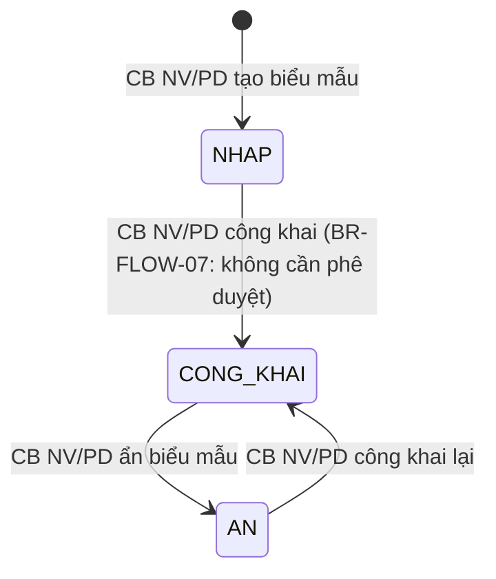

# C.9 SM-BIEUMAU: Vòng đời Biểu mẫu

**Entity:** BIEU_MAU
**Tham chiếu FR:** FR-VII-01 đến FR-VII-07

**Bảng trạng thái:**

| Trạng thái | Mã | Mô tả |
|-----------|-----|-------|
| NHAP | draft | Biểu mẫu mới tạo, chưa công khai |
| CONG_KHAI | published | Biểu mẫu đã công khai, DN có thể xem/tải |
| AN | hidden | Biểu mẫu bị ẩn, không hiển thị trên chuyên trang |

**Bảng chuyển trạng thái:**

| Từ | Đến | Trigger | Guard | Action | FR Ref | BR Ref |
|----|-----|---------|-------|--------|--------|--------|
| [*] | NHAP | CB NV/PD tạo biểu mẫu | — | Tạo bản ghi | FR-VII-01 | — |
| NHAP | CONG_KHAI | CB NV/PD công khai | — | Hiển thị trên chuyên trang | FR-VII-02 | BR-FLOW-07 |
| CONG_KHAI | AN | CB NV/PD ẩn | — | Ẩn khỏi chuyên trang | FR-VII-03 | — |
| AN | CONG_KHAI | CB NV/PD công khai lại | — | Hiển thị lại trên chuyên trang | FR-VII-03 | BR-FLOW-07 |
| NHAP | XOA | CB NV xóa | Chưa công khai | Soft-delete, ghi audit | — | — |
| AN | XOA | CB NV xóa | — | Soft-delete, ghi audit | — | — |

> **Lưu ý:** XOA là trạng thái kết thúc [*] (archived). Biểu mẫu có thể được khôi phục bởi QTHT.

---
