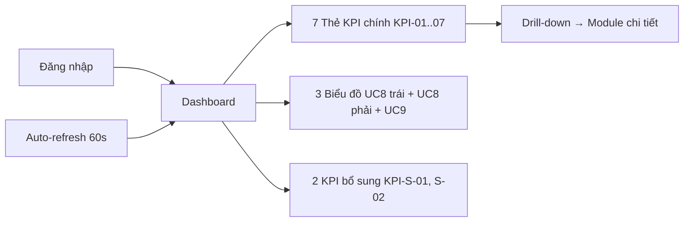
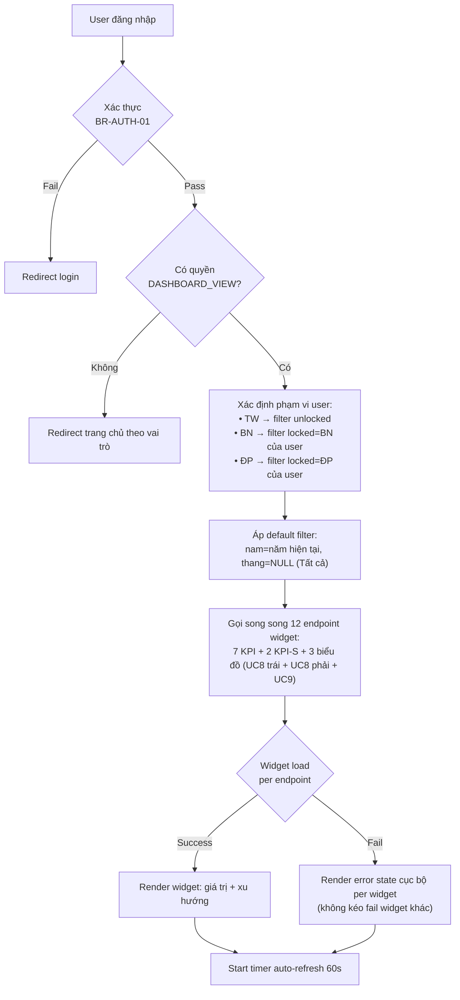
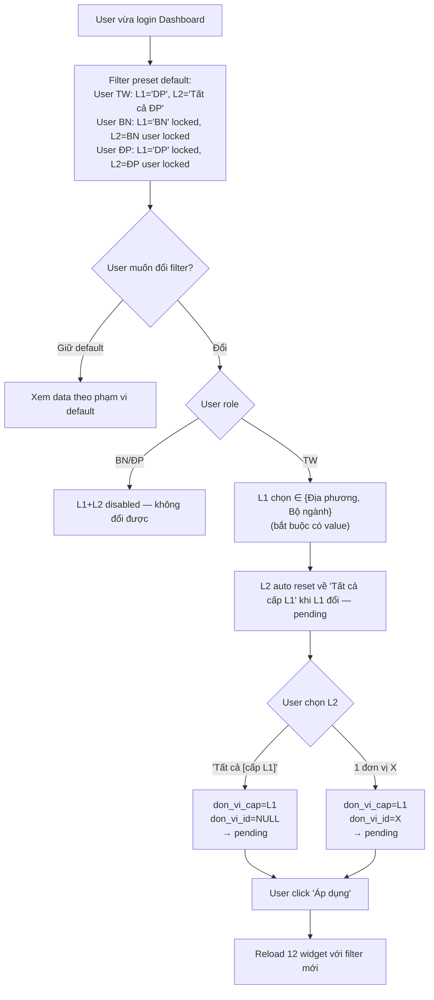
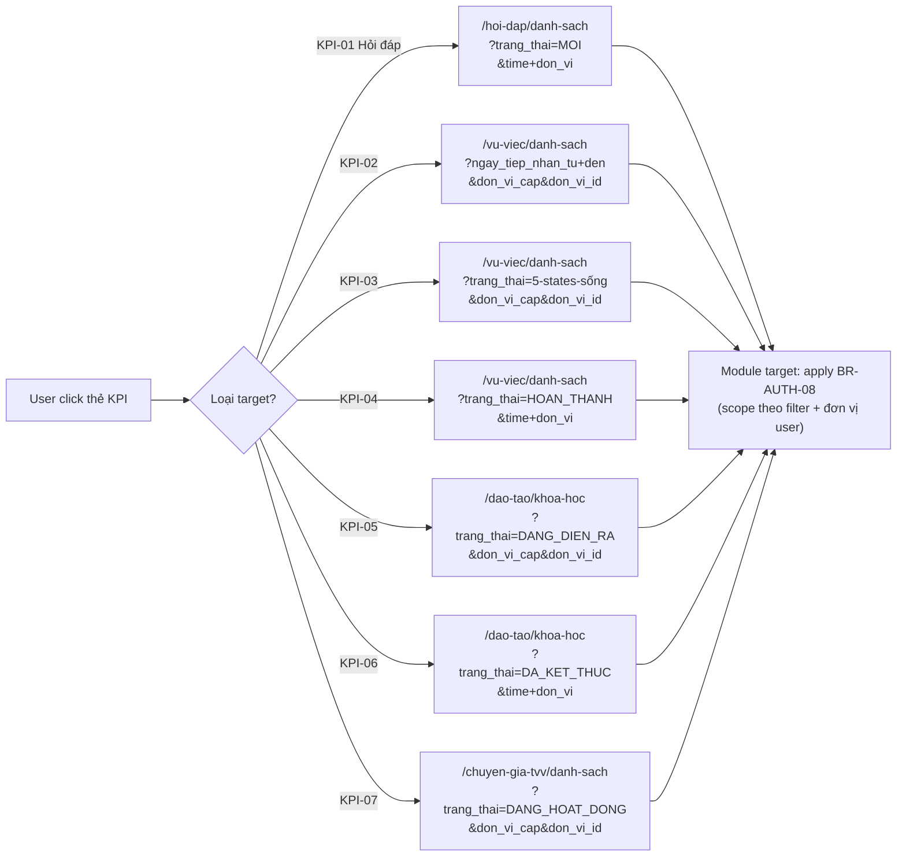
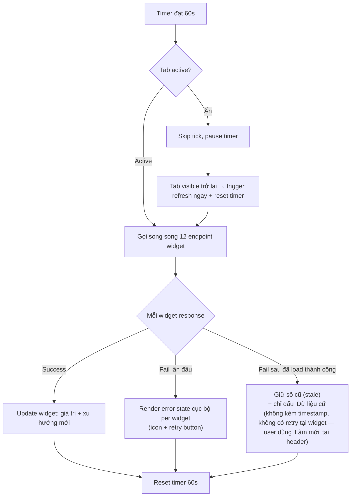
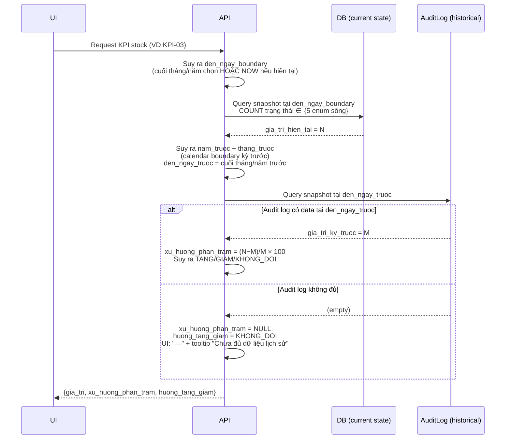
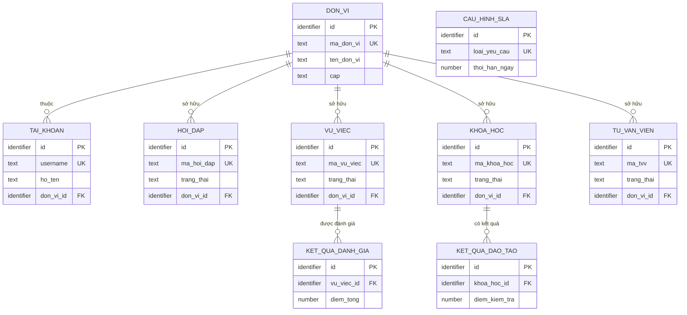

# SRS — Section 3.2.3: Dashboard (variant: no-screen for Claude Design)

> **⚠️ Variant status:** File này là bản duplicate của `srs-v3/srs-fr-01-dashboard.md` dùng làm input cho Claude Design. Section 3 "Màn hình chức năng" **mô tả cấu trúc chức năng + hành vi + semantic states** nhưng **KHÔNG quy định design system** (màu sắc, font, icon cụ thể, border, spacing, animation). Những yếu tố đó do design system quyết định khi build prototype.
>
> **SRS Section 3 spec:** WHAT (dữ liệu gì hiển thị) / WHEN (điều kiện hiển thị) / BEHAVIOR (hành vi khi tương tác) / SEMANTIC STATES (trạng thái nghiệp vụ: tăng/giảm/đạt/không đạt/đang tải/stale/lỗi/...).
>
> **SRS Section 3 KHÔNG spec:** màu cụ thể / font size / weight / icon cụ thể / border / shadow / spacing / animation style / component styling.
>
> **Bản gốc:** `srs-v3/srs-fr-01-dashboard.md` (bản đầy đủ, có màu sắc và chi tiết thiết kế cho team dev).
>
> **Sync rule:** Logic nghiệp vụ thay đổi ở bản gốc → đồng bộ sang đây. Claude Design tạo prototype → KHÔNG update ngược về bản gốc (bản gốc là snapshot).

**Dự án:** Phần mềm hỗ trợ pháp lý doanh nghiệp
**Phiên bản SRS:** 3.0 (variant: no-screen)
**Nhóm:** I — Dashboard
**UC range:** UC 1 – UC 9
**Số FR:** 11 (FR-I-01 đến FR-I-09, KPI bổ sung, Auto-refresh)
**File chính:** `srs-v3.md` Section 3.2

---

## Lịch sử thay đổi

| Ngày | Tác giả | Mô tả thay đổi |
|------|---------|-----------------|
| 2026-04-03 | SRS Agent (Claude) | Tạo mới từ `srs-v3.md` theo Template v3.0 |
| 2026-04-16 | BA | Áp dụng CR đối tác: CR-I-01 |
| 2026-04-23 | BA + SRS Agent | **Cross-check vs CSV Danh sách transaction v1.1 (UC1-9):** (C1) FR-I-03 mở rộng enum KPI-03 từ 3 → 5 trạng thái (thêm `DANG_KIEM_TRA`, `YEU_CAU_BO_SUNG`) theo SM-VUVIEC — vụ chờ bổ sung không phải phân công lại nên count. (C2) FR-I-05 thêm mini-list 5 khóa sắp kết thúc trước để cover yêu cầu CSV "số lượng và danh sách". (C3) FR-I-06 thêm mini-list 5 khóa mới kết thúc gần nhất. (C4) FR-I-07 bổ sung clarify ngữ nghĩa "đang hoạt động ≠ đã từng công nhận". (C5) KPI-S-01/02 + FR-I-CROSS-02 thêm trường `Source` giải thích lý do ngoài CSV. Screen table row 13/15/16/17 cập nhật đồng bộ. |
| 2026-04-23 | BA + SRS Agent | **Deep review fix (HIGH/MEDIUM):** (F-R1) FR-I-03 AC: "đang xử lý" → "đang hỗ trợ" đồng bộ với naming mới. (F-R2) FR-I-03 AC: thêm 6 test case positive/negative cho 5 trạng thái count + 3 trạng thái không count, để QA verify enum mở rộng đúng. (F-R3) FR-I-05 + FR-I-06 thêm Error Handling đặc thù E4 (WARN-DASH-MINILIST-01) + 2 AC tương ứng — mini-list fail không làm fail count (partial display). |
| 2026-04-23 | BA + SRS Agent | **Internal consistency fix (13 items):** (C1) TPL-DASH-KPI bước 5 phân tách Flow vs Stock xu hướng — Stock so sánh 2 snapshot tại thời điểm cách nhau `do_dai_ky`. (C3) Simplify: giữ enum 3 giá trị TANG/GIAM/KHONG_DOI, fix case (0 → N) từ KHONG_DOI → TANG + xu_huong_phan_tram=NULL. (C4 + filter restructure) **Đổi hoàn toàn filter đơn vị:** L1 "Cấp đơn vị" chỉ 2 option {Địa phương, Bộ ngành} (bỏ "Tất cả"+"Trung ương"); L2 có "Tất cả [cấp]" + danh sách đơn vị cấu hình được. User TW default "Tất cả đơn vị", BN/ĐP locked. TPL-DASH-KPI Inputs split thành `don_vi_cap` + `don_vi_id`. FR-I-08 chart redesign theo filter mới (1 đơn vị → time series; Tất cả → compare units). Screen rows 4b, 8, 20 sync. (C5) BR-SLA-05 cập nhật công thức: mẫu số = hoàn thành + đang xử lý quá hạn, tránh SLA ảo. (C6) FR-I-01/02/04 drill-down URL thêm time filter (Screen rows 11/12/14 sync). (C7) Refactor KPI-S-01/02 theo pattern chuẩn (Mô tả/Inputs/Processing/Outputs/AC). (C8) Xóa HO_SO_CHI_TRA khỏi Entity list (false reference). (C9) Section 1 Entity nguồn thêm DON_VI + TAI_KHOAN; Section 4 xóa DOANH_NGHIEP + HO_SO_CHI_TRA + ERD tương ứng. (C2) TPL bước 3 clarify Flow vs Stock filter thời gian. (C10) FR-I-07 AC clarify timing 60s (không real-time). (C11) FR-I-CROSS-02 cross-ref per-widget rule tại Screen. (C13) FR-I-05/06 thêm note mapping `drill_down_url` vs `detail_url`. FR-I-08/09 Inputs cập nhật dùng filter structure mới. |
| 2026-04-23 | BA + SRS Agent | **F0 Systemic fix — Auth 3-tier → 2-tier (cross-file):** BR-AUTH-01 refactor theo memory `project_auth_no_vnpt_ekyc`: **bỏ Tier VNPT eKYC**, đổi từ mô hình 3-tier (local/VNPT eKYC/VNeID) sang 2-tier (Tier 1 nội bộ qua mạng kín = user/pass+TOTP; Tier 2 Internet-facing = SSO VNeID). Phân loại theo **kênh truy cập**, không theo role đơn thuần. Cập nhật **10 vị trí xuyên 7 file:** srs-v3.md (A-06, BR-AUTH-01, BR-INTG-06, INT-02), srs-fr-01-dashboard.md (BR-AUTH-01), srs-fr-05-vu-viec.md (BR-AUTH-01), srs-fr-09-bieu-mau.md (BR-AUTH-01), srs-fr-10-quan-tri.md (BR-AUTH-01, BR-INTG-06, FR-VIII-20/21 Mô tả/AC/Error/Precondition, Screen row), srs-fr-12-tv-chuyen-sau.md (BR-AUTH-01), srs-fr-13-tv-nhanh.md (BR-AUTH-01). Grep stale "VNPT eKYC" / "Tier 3" trong spec body = 0 hit. |
| 2026-04-23 | BA + SRS Agent | **Self-review sweep — 4 gap mới phát hiện sau consistency fix:** (G1) FR-I-08 AC expand từ 2 → 11 AC cover full matrix filter (cap NULL / DP Tất cả / DP specific / BN Tất cả / BN specific + user BN/ĐP locked + tháng/quý + no-data + update filter). (G2) FR-I-09 AC expand từ 2 → 8 AC tương tự (donut single-value nên không có cột-per-unit, nhưng cover aggregate vs single scope). (G3) Cleanup tag `[GAP-I-02]` đã resolved qua C7 refactor KPI-S. (G4) FR-I-07 AC thêm 5 test case BN/ĐP filter + user BN/ĐP locked scope (F-R5 resolved). |
| 2026-04-23 | SRS Agent | **[VARIANT CREATION]** File này được tạo từ bản gốc `srs-v3/srs-fr-01-dashboard.md` để làm input cho Claude Design. Section 3 "Màn hình chức năng" strip: layout tổng quan (5 vùng), bảng 23 thành phần màn hình, 5/6 quy tắc tương tác UI (URL sync, đồng bộ Năm↔DatePicker, responsive, xu hướng color convention, UI specifics của per-widget error). Giữ: loại màn hình, FR sử dụng, quyền truy cập, 2 yêu cầu kiến trúc nghiệp vụ (per-widget fail isolation + auto-refresh 60s). Các section 1, 2, 4, 5, 6 + drill-down URLs + mini-list specs giữ nguyên. |
| 2026-04-23 | BA + SRS Agent | **Bổ sung ma trận phân quyền + flowchart nghiệp vụ chi tiết (đồng bộ với bản gốc):** Section 3 SCR-I-01 thêm bảng ma trận phân quyền 8 action × 11 vai trò (VIEW_DASHBOARD, FILTER_TIME_RANGE, FILTER_CHANGE_SCOPE, MANUAL_REFRESH, 4 DRILL_DOWN). Section 1 Tổng quan thêm subsection "Quy trình nghiệp vụ chi tiết" — 5 flowchart mermaid: F1 Login→Dashboard, F2 Filter đơn vị, F3 Drill-down, F4 Auto-refresh 60s, F5 Stock KPI xu hướng. |
| 2026-04-24 | DA + SRS Agent | **Redesign UC8 + UC9 + default filter clean-up (đồng bộ với bản gốc):** UC9 refactor Donut (2 slice Đạt/Không đạt + center label Điểm TB + N + trend, Outputs 3→8 field). UC8 rule chia kỳ 3-tier mới (≤31 ngày→ngày / 32-365→tháng / >365→quý) + 11 AC + 4 edge cases. Filter Approach Y: L1 bắt buộc có value (bỏ state cross-cấp), default user TW = L1='DP' + L2='Tất cả ĐP'. TPL-DASH-KPI Inputs + Processing, F2 flowchart, FR-I-07/08/09 AC đồng bộ. |
| 2026-04-24 | BA + SRS Agent | **Revert UC5/UC6 mini-list + drill-down giữ filter đơn vị (đồng bộ với bản gốc):** FR-I-05 + FR-I-06 revert về pattern KPI đơn giản (bỏ mini-list / Outputs bổ sung / Drill-down 2 endpoint / Error E4). 7 KPI drill-down URL thêm `&don_vi_cap&don_vi_id`. F3 flowchart update URL. |
| 2026-04-24 | DA + SRS Agent | **Fix miss — UC8 chart type redesign (đổi từ dual-axis combo → 2 bar chart small multiples, đồng bộ với bản gốc):** Mô tả, Outputs (tách chart_data → chart_data_hai_long + chart_data_sla, thêm 3 field), Processing bước 4 wording. Fix dual-axis trap theo DA best practice. |
| 2026-04-24 | UX + SRS Agent | **Regenerate Section 3 với screen description đầy đủ** (chỉ variant, bản gốc giữ nguyên): Thêm Nguyên tắc UX, Bố cục 5 vùng, Thành phần chi tiết 4 vùng + Trạng thái đặc biệt + Quy tắc tương tác + Responsive + Accessibility. **Thêm A1 — Preset thời gian nhanh** (6 options: 7 ngày qua, 30 ngày qua, Tháng này, Quý này, Năm nay, Tùy chỉnh) với đồng bộ 3 chiều Preset ↔ Năm ↔ DatePicker. **Strip toàn bộ quy định design system** (màu / font / icon cụ thể / spacing / animation) — SRS chỉ spec WHAT / WHEN / BEHAVIOR / SEMANTIC STATES. Ma trận phân quyền + Yêu cầu kiến trúc nghiệp vụ giữ nguyên. |
| 2026-04-24 | PM + BA + SRS Agent | **CR filter consolidation (sau UX deep review prototype `prototype-htpldn`):** §3 Vùng 2 refactor từ 8 components (Preset buttons hàng riêng #6 + Năm dropdown #7 + Date Range Picker #8 + L1 #9 + L2 #10 + Áp dụng #11 + Trở về mặc định #12) xuống **5 components** (Kỳ thời gian RangePicker có preset gợi ý tích hợp #6 + L1 #7 + L2 #8 + Áp dụng #9 + Trở về mặc định #10). **Bỏ Năm dropdown** (redundant với preset "Năm nay" + preset "Năm trước"). **Di chuyển preset buttons** từ "visible row trên primary filter" sang **INSIDE RangePicker popover** (shortcut helper đúng ngữ cảnh — Fitts' law + hierarchy primary/secondary). **Thêm 2 preset mới** "Quý trước" + "Năm trước" (total 7 preset) để support task tra cứu kỳ cũ thường gặp. Quy tắc tương tác #5 đổi từ "đồng bộ 3 chiều Preset ↔ Năm ↔ DatePicker" → "đồng bộ 2 chiều preset (trong popover) ↔ Date Range Picker". Bố cục tổng quan row Vùng 2 cập nhật text tương ứng. Inputs chung TPL-DASH-KPI `tu_ngay/den_ngay/don_vi_cap/don_vi_id` KHÔNG đổi. BR-AUTH-01/03/04/08 không đổi. Component #11-13 cũ vacated (total component count 30 → 27; Vùng 3+ giữ nguyên số #14-30 để tránh churn cross-reference). |

---

## Mục lục file này

- [1. Tổng quan nhóm](#1-tổng-quan-nhóm)
- [2. Yêu cầu chức năng chi tiết](#2-yêu-cầu-chức-năng-chi-tiết)
- [3. Màn hình chức năng](#3-màn-hình-chức-năng)
- [4. Entity liên quan](#4-entity-liên-quan)
- [5. State Machine liên quan](#5-state-machine-liên-quan)
- [6. Business Rules liên quan](#6-business-rules-liên-quan)

---

## 1. Tổng quan nhóm

**Mục đích:** Hiển thị 9 chỉ số tổng quan (KPI) hoạt động HTPLDN trên trang chủ CMS.

**Quy trình nghiệp vụ tổng quan:**

Nhóm I là trang chủ sau đăng nhập. Chỉ read-only, không có thao tác CUD. Dữ liệu tự lọc theo đơn vị đăng nhập (phân quyền theo đơn vị). Tự động làm mới mỗi 60 giây. Click vào thẻ KPI → drill-down đến danh sách chi tiết module tương ứng.

### Quy trình nghiệp vụ chi tiết (5 kịch bản)

#### F1 — Login → View Dashboard (happy path)

#### F2 — User thay đổi filter đơn vị (L1 + L2)

#### F3 — Click drill-down KPI → module chi tiết

#### F4 — Auto-refresh 60s tick + per-widget fail handling

#### F5 — Stock KPI xu hướng calculation (KPI-03/05/07)

**Đặc thù:**
- Read-only — không có thao tác CUD
- Scoped by đơn vị (phân quyền theo đơn vị)
- Auto-refresh mỗi 60 giây
- Click → drill-down đến danh sách chi tiết nhóm tương ứng
- Bộ lọc: Năm (bắt buộc, từ năm bắt đầu sử dụng phần mềm đến năm hiện tại) + Tháng (có "Tất cả" + 12 tháng cụ thể) + Cấp đơn vị + Đơn vị

**Entity nguồn:** HOI_DAP, VU_VIEC, KHOA_HOC, TU_VAN_VIEN, KET_QUA_DANH_GIA, KET_QUA_DAO_TAO, CAU_HINH_SLA, DON_VI (phạm vi phân quyền), TAI_KHOAN (xác thực + đơn vị user)

**Tác nhân:** Cán bộ Nghiệp vụ (TW/BN/ĐP), Cán bộ Phê duyệt (TW/BN/ĐP), QTHT (mọi cấp)

---

## 2. Yêu cầu chức năng chi tiết

### SHARED TEMPLATE — Dashboard KPI Widget (TPL-DASH-KPI)

> Áp dụng cho FR-I-01 đến FR-I-07 (7 UC KPI đơn giản)

**Preconditions chung:**
- User đã đăng nhập (BR-AUTH-01)
- User có quyền truy cập Dashboard

**Inputs chung:**

| # | Tên field | Kiểu logic | Bắt buộc | Ràng buộc | Mặc định | Nguồn |
|---|----------|-----------|----------|-----------|----------|-------|
| 1 | nam | integer | **Y** | ∈ [năm bắt đầu sử dụng phần mềm, năm hiện tại]. Min năm động — query `MIN(YEAR(ngay_tao))` từ entity nguồn HOI_DAP/VU_VIEC qua API config. KHÔNG có option "Tất cả" | **Năm hiện tại** | filter "Năm" (dropdown) |
| 2 | thang | integer | N | ∈ [1..12] HOẶC NULL (NULL = "Tất cả tháng" của năm). Khi `nam` = năm hiện tại: ràng buộc thêm `thang ≤ tháng hiện tại` (tháng tương lai disabled tại UI) | **NULL** ("Tất cả") | filter "Tháng" (dropdown) |
| 3 | don_vi_cap | enum | **Y** | ∈ {'DP', 'BN'} — L1 **bắt buộc** chọn, không được để trống. User TW: chọn được (đổi giữa ĐP/BN); User BN: locked = 'BN'; User ĐP: locked = 'DP' | **User TW: 'DP' (default = Địa phương)**; User BN: 'BN'; User ĐP: 'DP' | filter L1 "Cấp đơn vị" |
| 4 | don_vi_id | identifier | N | FK → DON_VI(id) khi chọn đơn vị cụ thể; NULL = "Tất cả [cấp L1]" (toàn bộ đơn vị cấp L1 đã chọn). User TW: chọn được; User BN/ĐP: locked = id của đơn vị user | **User TW: NULL (default = Tất cả [cấp L1])**; User BN/ĐP: id của đơn vị user | filter L2 "Đơn vị cụ thể" |

> **Ghi chú CR 2026-04-26:** Inputs refactor — `tu_ngay`/`den_ngay` (date range) → `nam` (required) + `thang` (nullable, NULL = "Tất cả"). Lý do: thay Date Range Picker + 7 preset bằng 2 dropdown Năm + Tháng đơn giản hơn, calendar-aligned, match nhịp báo cáo nhà nước theo tháng/năm. Boundary thời gian được suy ra từ Năm + Tháng theo bảng mapping tại Section 3 Vùng 2. Compare kỳ trước = tháng/năm calendar liền trước (handle cross-year cho tháng 1 → tháng 12 năm trước). KPI-03/05/07 (Stock) đổi semantic sang **snapshot tại cuối scope đã chọn** (PA-Z) — không còn Stock NOW không phụ thuộc filter.

**Processing chung:**

| Bước | Mô tả xử lý | BR áp dụng |
|------|-------------|-----------|
| 1 | Kiểm tra quyền + phạm vi phân quyền theo đơn vị | BR-AUTH-01, BR-AUTH-08 |
| 2 | **Xác định phạm vi đơn vị dựa trên `don_vi_cap` + `don_vi_id`:** • `don_vi_id` ≠ NULL → scope = 1 đơn vị đó (`WHERE don_vi_id = :don_vi_id`) • `don_vi_id` = NULL → scope = tất cả đơn vị cấp `don_vi_cap` (`WHERE don_vi_id IN (SELECT id FROM DON_VI WHERE cap = :don_vi_cap AND is_active = true)`). Danh sách đơn vị **cấu hình được** qua Nhóm VIII (quản trị).  **Lưu ý:** `don_vi_cap` luôn có giá trị ∈ {'DP', 'BN'} (L1 bắt buộc). **Không có state cross-cấp** ĐP+BN cùng lúc trong 1 chart — user TW muốn xem cả 2 cấp phải đổi L1.  Phân quyền: User TW đổi được L1+L2 tự do; User BN/ĐP filter locked tại đơn vị của user. | BR-AUTH-03, BR-AUTH-04, BR-AUTH-08 |
| 3 | **Suy ra boundary thời gian từ `nam` + `thang`:** • `tu_ngay_boundary` = 01/{thang OR 01}/{nam} 00:00:00 • `den_ngay_boundary` = cuối tháng `thang` của `nam` 23:59:59 (nếu `thang` không NULL); HOẶC 31/12/{nam} 23:59:59 (nếu `thang = NULL`); **HOẶC NOW** nếu `nam` = năm hiện tại VÀ `thang` ∈ {NULL, tháng hiện tại} • `is_qua_khu_dong` = TRUE nếu (`nam` < năm hiện tại) HOẶC (`nam` = năm hiện tại AND `thang` không NULL AND `thang` < tháng hiện tại) — dùng để pause auto-refresh tại Section 3  **Áp dụng bộ lọc theo loại KPI:** • **Flow KPI** (KPI-01/02/04/06, KPI-S-01, KPI-S-02): `WHERE date_field BETWEEN tu_ngay_boundary AND den_ngay_boundary` • **Stock KPI (PA-Z snapshot cuối scope)** (KPI-03/05/07): COUNT trạng thái sống tại thời điểm `den_ngay_boundary` (cuối tháng/năm chọn HOẶC NOW nếu là tháng/năm hiện tại). KHÔNG dùng range filter | — |
| 4 | Thực hiện truy vấn tổng hợp (đếm/tổng/trung bình) cho kỳ hiện tại | — |
| 5 | **Tính xu hướng — kỳ trước theo calendar boundary:**  **Suy ra `nam_truoc` + `thang_truoc`:** • Nếu `thang` = NULL ("Tất cả năm"): `nam_truoc = nam − 1`, `thang_truoc = NULL` • Nếu `thang` > 1: `nam_truoc = nam`, `thang_truoc = thang − 1` • Nếu `thang` = 1: `nam_truoc = nam − 1`, `thang_truoc = 12` (cross-year)  **Boundary kỳ trước:** Suy ra `tu_ngay_truoc` + `den_ngay_truoc` từ `nam_truoc` + `thang_truoc` theo cùng logic bước 3. Lưu ý: `den_ngay_truoc` luôn là cuối tháng/năm trước (không phải NOW vì kỳ trước luôn đã đóng).  **Flow KPI:** Chạy lại cùng truy vấn đếm với boundary kỳ trước → `gia_tri_ky_truoc`.  **Stock KPI (PA-Z):** Snapshot tại `den_ngay_truoc` (cuối tháng/năm trước). Yêu cầu hệ thống có historical state log (audit log per change). Nếu audit log không đủ tại `den_ngay_truoc` → `gia_tri_ky_truoc = NULL` → `xu_huong_phan_tram = NULL` → UI hiển thị "—" + tooltip "Chưa đủ dữ liệu lịch sử để so sánh".  **Công thức:** `xu_huong_phan_tram = (gia_tri_hien_tai − gia_tri_ky_truoc) / gia_tri_ky_truoc × 100`  **Suy ra `huong_tang_giam`** (enum 3 giá trị: TANG / GIAM / KHONG_DOI): • `gia_tri_ky_truoc > 0` AND `gia_tri_hien_tai > 0`: TANG (% > 0) / GIAM (% < 0) / KHONG_DOI (% = 0) • `gia_tri_ky_truoc = 0` AND `gia_tri_hien_tai > 0`: TANG, `xu_huong_phan_tram = NULL` → UI hiển thị "—" (không có nhãn "Mới" — đã bỏ theo CR 2026-04-26) • `gia_tri_ky_truoc > 0` AND `gia_tri_hien_tai = 0`: GIAM, `xu_huong_phan_tram = -100` • `gia_tri_ky_truoc = 0` AND `gia_tri_hien_tai = 0`: KHONG_DOI, `xu_huong_phan_tram = NULL` → UI: "—" • Audit log không đủ cho `den_ngay_truoc`: `xu_huong_phan_tram = NULL` → UI: "—" + tooltip "Chưa đủ dữ liệu lịch sử để so sánh" | — |
| 6 | Trả về giá trị KPI + xu hướng | — |

**Outputs chung:**

| # | Tên | Kiểu logic | Điều kiện | Format |
|---|-----|-----------|-----------|--------|
| 1 | gia_tri | number | — | số |
| 2 | nhan | text | — | — |
| 3 | don_vi_tinh | text | — | VD: "yêu cầu", "vụ việc" |
| 4 | drill_down_url | text | — | URL |
| 5 | nam | integer | — | VD: 2026 |
| 6 | thang | integer | nullable | 1-12 hoặc NULL ("Tất cả") |
| 7 | scope_label | text | — | UI text hiển thị scope. VD: "Năm 2026", "Tháng 4/2026", "Năm 2025" |
| 8 | tu_ngay_boundary | datetime | — | Boundary đầu kỳ (suy ra từ nam + thang) |
| 9 | den_ngay_boundary | datetime | — | Boundary cuối kỳ (cuối tháng/năm chọn HOẶC NOW nếu là tháng/năm hiện tại) |
| 10 | is_qua_khu_dong | boolean | — | TRUE nếu scope đã đóng (Section 3 dùng để pause auto-refresh) |
| 11 | xu_huong_phan_tram | number | nullable | % chênh lệch so kỳ trước (calendar). VD: +12,5 hoặc −3,2. NULL khi kỳ trước không có dữ liệu hoặc audit log không đủ |
| 12 | huong_tang_giam | enum | — | TANG / GIAM / KHONG_DOI |

**Postconditions chung:** Không thay đổi dữ liệu (read-only)

**Error Handling chung:**

| # | Điều kiện lỗi | Mã lỗi | Phản hồi hệ thống | Severity |
|---|--------------|--------|-------------------|----------|
| E1 | Không có dữ liệu | INFO-DASH-01 | Hiển thị "0" cho KPI + "Chưa có dữ liệu trong kỳ" | INFO |
| E2 | Audit log không đủ cho thời điểm so sánh kỳ trước | INFO-DASH-04 | xu_huong_phan_tram = NULL → UI hiển thị "—" + tooltip "Chưa đủ dữ liệu lịch sử để so sánh" | INFO |
| E3 | Lỗi truy vấn (DB / API 5xx) | ERR-DASH-02 | Trigger Trạng thái 28 widget — text "Không tải được dữ liệu" + nút "Thử lại". KHÔNG hiển thị toast/modal toàn trang. | ERROR |

---

### FR-I-01: Hiển thị tổng hợp hỏi đáp, vướng mắc (UC1)

**UC Reference:** UC 1
**Source:** CĐT xác nhận
**Priority:** Essential
**Stability:** High
**Màn hình:** SCR-I-01 — [Dashboard](#scr-i-01-tổng-quan-hệ-thống-dashboard)

**Mô tả:** Hiển thị tổng số hỏi đáp mới trong kỳ trên thẻ KPI.

**Tác nhân:** CB Nghiệp vụ (TW/BN/ĐP), CB Phê duyệt (TW/BN/ĐP), QTHT (mọi cấp)
**Template:** TPL-DASH-KPI

**Processing đặc thù:**

| Bước | Mô tả xử lý | BR áp dụng |
|------|-------------|-----------|
| 4 | Đếm số bản ghi HOI_DAP chưa xóa, trong phạm vi đơn vị, tạo trong khoảng thời gian lọc | — |

**Drill-down:** Click → chuyển đến FR-II-01 danh sách hỏi đáp, giữ filter Năm + Tháng + đơn vị từ Dashboard (`/hoi-dap/danh-sach?trang_thai=MOI&nam={nam}&thang={thang}&don_vi_cap={don_vi_cap}&don_vi_id={don_vi_id}`). Module target tự suy ra boundary thời gian từ `nam` + `thang` theo cùng logic TPL-DASH-KPI bước 3. Filter bắt buộc kèm để số click xuống khớp số đếm Dashboard.
**Nguồn dữ liệu:** Entity HOI_DAP (Nhóm II)

**Acceptance Criteria:**
- **Given** CB đăng nhập thành công **When** truy cập Dashboard **Then** hiển thị số liệu tổng hợp hỏi đáp theo phạm vi đơn vị
- **Given** CB thuộc ĐP **When** xem dashboard **Then** chỉ hiển thị dữ liệu của ĐP đó
- **Given** CB thuộc TW **When** xem dashboard **Then** hiển thị dữ liệu toàn quốc
- **Given** CB chọn bộ lọc thời gian **When** áp dụng **Then** dữ liệu cập nhật theo khoảng thời gian đã chọn

---

### FR-I-02: Tổng hợp vụ việc đã tiếp nhận (UC2)

**UC Reference:** UC 2
**Priority:** Essential | **Stability:** High
**Màn hình:** SCR-I-01
**Template:** TPL-DASH-KPI

**Processing đặc thù:**

| Bước | Mô tả xử lý | BR áp dụng |
|------|-------------|-----------|
| 4 | Đếm số bản ghi VU_VIEC chưa xóa, trong phạm vi đơn vị, ngày tiếp nhận trong khoảng thời gian lọc | — |

**Drill-down:** Click → chuyển đến Nhóm V.I danh sách vụ việc, giữ filter Năm + Tháng + đơn vị từ Dashboard (`/vu-viec/danh-sach?date_field=ngay_tiep_nhan&nam={nam}&thang={thang}&don_vi_cap={don_vi_cap}&don_vi_id={don_vi_id}`). Module target tự suy ra boundary thời gian từ `nam` + `thang` áp lên `ngay_tiep_nhan`. Filter bắt buộc kèm để số click xuống khớp số đếm Dashboard.

**Acceptance Criteria:**
- **Given** CB đăng nhập **When** xem Dashboard **Then** hiển thị tổng số vụ việc đã tiếp nhận theo đơn vị
- **Given** CB thuộc ĐP **When** xem dashboard **Then** chỉ hiển thị dữ liệu của ĐP đó  [GAP-I-01]
- **Given** CB thuộc TW **When** xem dashboard **Then** hiển thị dữ liệu toàn quốc  [GAP-I-01]
- **Given** CB chọn bộ lọc thời gian **When** áp dụng **Then** dữ liệu cập nhật theo khoảng thời gian  [GAP-I-01]

---

### FR-I-03: Tổng hợp vụ việc đang hỗ trợ (UC3)

**UC Reference:** UC 3
**Priority:** Essential | **Stability:** High
**Màn hình:** SCR-I-01
**Template:** TPL-DASH-KPI

**Processing đặc thù:**

| Bước | Mô tả xử lý | BR áp dụng |
|------|-------------|-----------|
| 4 | Đếm số bản ghi VU_VIEC chưa xóa, trong phạm vi đơn vị, `trang_thai ∈ {DA_TIEP_NHAN, DANG_KIEM_TRA, YEU_CAU_BO_SUNG, DA_PHAN_CONG, DANG_XU_LY}` theo SM-VUVIEC (Phụ lục C `srs-v3.md`). Định nghĩa "đang hỗ trợ" = vụ đã tiếp nhận và đang trong quy trình sống, chưa chuyển phê duyệt/hoàn thành/từ chối. Bao gồm cả giai đoạn kiểm tra hồ sơ và chờ DN bổ sung (vì theo SM-VUVIEC, `YEU_CAU_BO_SUNG` quay về `DANG_KIEM_TRA` sau khi DN bổ sung — **không phải phân công lại**, chỉ là tiếp tục flow trước giai đoạn phân công). KHÔNG bao gồm `MOI_TAO`, `CHO_TIEP_NHAN`, `TU_CHOI`, `CHO_PHE_DUYET`, `DA_DUYET`, `HOAN_THANH`, `DA_DANH_GIA` | — |

**Drill-down:** Click → chuyển đến Nhóm V.I (`/vu-viec/danh-sach?trang_thai=DA_TIEP_NHAN,DANG_KIEM_TRA,YEU_CAU_BO_SUNG,DA_PHAN_CONG,DANG_XU_LY&don_vi_cap={don_vi_cap}&don_vi_id={don_vi_id}` — đồng bộ enum với KPI-03 ở bước 4, kèm filter đơn vị từ Dashboard)

**Acceptance Criteria:**
- **Given** CB đăng nhập **When** xem Dashboard **Then** hiển thị số vụ việc đang hỗ trợ theo đơn vị
- **Given** 1 vụ việc đang ở trạng thái `DA_TIEP_NHAN` **When** xem Dashboard **Then** KPI-03 count bao gồm vụ này
- **Given** 1 vụ việc đang ở trạng thái `DANG_KIEM_TRA` **When** xem Dashboard **Then** KPI-03 count bao gồm vụ này (CB NV đang kiểm tra hồ sơ, chưa phân công — vẫn là quy trình sống)
- **Given** 1 vụ việc đang ở trạng thái `YEU_CAU_BO_SUNG` **When** xem Dashboard **Then** KPI-03 count bao gồm vụ này (chờ DN bổ sung, sau bổ sung quay về `DANG_KIEM_TRA` — không phân công lại)
- **Given** 1 vụ việc đang ở trạng thái `DA_PHAN_CONG` hoặc `DANG_XU_LY` **When** xem Dashboard **Then** KPI-03 count bao gồm vụ này
- **Given** 1 vụ việc đang ở trạng thái `CHO_PHE_DUYET` **When** xem Dashboard **Then** KPI-03 KHÔNG count vụ này (đã rời giai đoạn xử lý, vào giai đoạn phê duyệt)
- **Given** 1 vụ việc đang ở trạng thái `HOAN_THANH`, `TU_CHOI`, hoặc `DA_DANH_GIA` **When** xem Dashboard **Then** KPI-03 KHÔNG count vụ này (vụ đã đóng)
- **Given** CB thuộc ĐP **When** xem dashboard **Then** chỉ hiển thị dữ liệu của ĐP đó  [GAP-I-01]
- **Given** CB thuộc TW **When** xem dashboard **Then** hiển thị dữ liệu toàn quốc  [GAP-I-01]
- **Given** CB chọn bộ lọc thời gian **When** áp dụng **Then** dữ liệu cập nhật theo khoảng thời gian  [GAP-I-01]

---

### FR-I-04: Tổng hợp vụ việc đã hoàn thành (UC4)

**UC Reference:** UC 4
**Priority:** Essential | **Stability:** High
**Màn hình:** SCR-I-01
**Template:** TPL-DASH-KPI

**Processing đặc thù:**

| Bước | Mô tả xử lý | BR áp dụng |
|------|-------------|-----------|
| 4 | Đếm số bản ghi VU_VIEC chưa xóa, trong phạm vi đơn vị, trạng thái = HOAN_THANH, ngày hoàn thành trong khoảng thời gian lọc | — |

**Drill-down:** Click → chuyển đến Nhóm V.I danh sách vụ việc hoàn thành, giữ filter Năm + Tháng + đơn vị từ Dashboard (`/vu-viec/danh-sach?trang_thai=HOAN_THANH&date_field=ngay_hoan_thanh&nam={nam}&thang={thang}&don_vi_cap={don_vi_cap}&don_vi_id={don_vi_id}`). Module target tự suy ra boundary thời gian từ `nam` + `thang` áp lên `ngay_hoan_thanh`. Filter bắt buộc kèm để số click xuống khớp số đếm Dashboard.

**Acceptance Criteria:**
- **Given** CB đăng nhập **When** xem Dashboard **Then** hiển thị tổng vụ việc trạng thái "Hoàn thành"
- **Given** CB lọc theo thời gian **When** áp dụng **Then** chỉ tính vụ việc hoàn thành trong khoảng thời gian

---

### FR-I-05: Tổng hợp khóa học đang diễn ra (UC5)

**UC Reference:** UC 5
**Priority:** Essential | **Stability:** High
**Màn hình:** SCR-I-01
**Template:** TPL-DASH-KPI

**Processing đặc thù:**

| Bước | Mô tả xử lý | BR áp dụng |
|------|-------------|-----------|
| 4 | Đếm số bản ghi KHOA_HOC chưa xóa, kết hợp thông tin chương trình đào tạo, đơn vị trong phạm vi phân quyền, `trang_thai = DANG_DIEN_RA` (theo SM-KHOAHOC — Phụ lục C `srs-v3.md`) | — |

**Drill-down:** Click → chuyển đến Nhóm III danh sách khóa học đang diễn ra, giữ filter đơn vị từ Dashboard (`/dao-tao/khoa-hoc?trang_thai=DANG_DIEN_RA&don_vi_cap={don_vi_cap}&don_vi_id={don_vi_id}`). Filter đơn vị bắt buộc kèm để scope khớp Dashboard.

**Acceptance Criteria:**
- **Given** CB đăng nhập **When** xem Dashboard **Then** hiển thị số khóa học "Đang diễn ra" thuộc phạm vi đơn vị
- **Given** CB thuộc BN/ĐP **When** xem Dashboard **Then** chỉ đếm khóa thuộc đơn vị user (BR-AUTH-08)
- **Given** user TW đổi filter đơn vị **When** xem Dashboard **Then** đếm cập nhật theo filter
- **Given** CB click thẻ KPI **When** hệ thống xử lý **Then** điều hướng đến danh sách khóa học đang diễn ra (Nhóm III) với filter đơn vị kèm

---

### FR-I-06: Tổng hợp khóa học đã kết thúc (UC6)

**UC Reference:** UC 6
**Priority:** Essential | **Stability:** High
**Màn hình:** SCR-I-01
**Template:** TPL-DASH-KPI

**Processing đặc thù:**

| Bước | Mô tả xử lý | BR áp dụng |
|------|-------------|-----------|
| 4 | Đếm số bản ghi KHOA_HOC chưa xóa, kết hợp thông tin chương trình đào tạo, đơn vị trong phạm vi phân quyền, `trang_thai = DA_KET_THUC` (theo SM-KHOAHOC — Phụ lục C `srs-v3.md`), `ngay_ket_thuc` trong khoảng thời gian lọc | — |

**Drill-down:** Click → chuyển đến Nhóm III danh sách khóa học đã kết thúc trong kỳ, giữ filter Năm + Tháng + đơn vị từ Dashboard (`/dao-tao/khoa-hoc?trang_thai=DA_KET_THUC&date_field=ngay_ket_thuc&nam={nam}&thang={thang}&don_vi_cap={don_vi_cap}&don_vi_id={don_vi_id}`). Module target tự suy ra boundary thời gian từ `nam` + `thang` áp lên `ngay_ket_thuc`. Filter bắt buộc kèm để số click xuống khớp Dashboard.

**Acceptance Criteria:**
- **Given** CB đăng nhập **When** xem Dashboard **Then** hiển thị số khóa học "Đã hoàn thành" trong kỳ theo phạm vi đơn vị
- **Given** CB thuộc BN/ĐP **When** xem Dashboard **Then** chỉ đếm khóa thuộc đơn vị user (BR-AUTH-08)
- **Given** user TW đổi filter đơn vị **When** xem Dashboard **Then** đếm cập nhật theo filter
- **Given** CB chọn bộ lọc thời gian **When** áp dụng **Then** dữ liệu cập nhật theo khoảng thời gian
- **Given** CB click thẻ KPI **When** hệ thống xử lý **Then** điều hướng đến danh sách khóa học đã kết thúc (Nhóm III) với time + đơn vị filter kèm

---

### FR-I-07: Tổng số chuyên gia/TVV (UC7)

**UC Reference:** UC 7
**Priority:** Essential | **Stability:** High
**Màn hình:** SCR-I-01
**Template:** TPL-DASH-KPI

**Mô tả:** Đếm số chuyên gia / tư vấn viên / người hỗ trợ **đang có khả năng nhận công việc** (trạng thái = DANG_HOAT_DONG). Đây là chỉ số **hoạt động hiện tại**, không phải tổng số TVV đã từng được thẩm định công nhận trong lịch sử — loại trừ `TAM_DUNG` và `VO_HIEU_HOA`. Để xem tổng TVV đã qua quá trình thẩm định công nhận (bao gồm cả tạm dừng), tham khảo Báo cáo Nhóm IX.

**Processing đặc thù:**

| Bước | Mô tả xử lý | BR áp dụng |
|------|-------------|-----------|
| 4 | Đếm số bản ghi TU_VAN_VIEN chưa xóa, trong phạm vi đơn vị, `trang_thai = DANG_HOAT_DONG` theo SM-TVV (Phụ lục C `srs-v3.md`). KHÔNG bao gồm `MOI_DANG_KY`, `CHO_THAM_DINH`, `DANG_THAM_DINH`, `YEU_CAU_BO_SUNG`, `CHO_PHE_DUYET`, `TU_CHOI`, `TAM_DUNG`, `VO_HIEU_HOA` | — |

**Drill-down:** Click → chuyển đến Nhóm IV, danh sách TVV đang hoạt động, giữ filter đơn vị từ Dashboard (`/chuyen-gia-tvv/danh-sach?trang_thai=DANG_HOAT_DONG&don_vi_cap={don_vi_cap}&don_vi_id={don_vi_id}`)

**Acceptance Criteria:**
- **Given** CB đăng nhập **When** xem Dashboard **Then** hiển thị tổng số chuyên gia / tư vấn viên / người hỗ trợ đang hoạt động thuộc phạm vi
- **Given** TVV chuyển từ DANG_HOAT_DONG sang TAM_DUNG **When** Dashboard auto-refresh tick tiếp theo (60s, theo FR-I-CROSS-02) hoặc user click "Làm mới" **Then** số đếm giảm tương ứng (do không còn trong tập DANG_HOAT_DONG). **Không phải real-time**
- **Given** user TW vừa login (default L1='DP', L2='Tất cả ĐP') **When** xem Dashboard **Then** chỉ đếm TVV DANG_HOAT_DONG thuộc các ĐP (default view)
- **Given** user TW chọn L1 = "Địa phương" + L2 = "Tất cả" **When** xem Dashboard **Then** chỉ đếm TVV DANG_HOAT_DONG thuộc các ĐP
- **Given** user TW chọn L1 = "Bộ ngành" + L2 = "Tất cả" **When** xem Dashboard **Then** chỉ đếm TVV DANG_HOAT_DONG thuộc các BN
- **Given** user TW chọn 1 đơn vị cụ thể (L2 = 1 ĐP hoặc 1 BN) **When** xem Dashboard **Then** chỉ đếm TVV DANG_HOAT_DONG thuộc đơn vị đó
- **Given** user BN đăng nhập (filter locked = BN của user) **When** xem Dashboard **Then** chỉ đếm TVV DANG_HOAT_DONG thuộc BN đó (BR-AUTH-08)
- **Given** user ĐP đăng nhập (filter locked = ĐP của user) **When** xem Dashboard **Then** chỉ đếm TVV DANG_HOAT_DONG thuộc ĐP đó (BR-AUTH-08)

---

### FR-I-08: Biểu đồ đánh giá hiệu quả hỗ trợ (UC8)

**UC Reference:** UC 8
**Source:** Đề xuất — công thức tính chờ CĐT review
**Priority:** Essential
**Stability:** Medium
**Màn hình:** SCR-I-01 — [Dashboard](#scr-i-01-tổng-quan-hệ-thống-dashboard)

**Mô tả:** **2 bar chart small multiples (side-by-side), mỗi chart 1 metric đơn**:
- **Chart trái — Điểm đánh giá hiệu quả hỗ trợ pháp lý** (bar chart, thang 0-100 theo `KET_QUA_DANH_GIA.diem_tong`)
- **Chart phải — Tỷ lệ tuân thủ thời hạn xử lý** (bar chart, %)

Mỗi chart có sample size caption + trend so kỳ trước riêng. **Tách 2 chart thay vì dual-axis combo** để tránh rủi ro gây hiểu nhầm correlation giữa 2 scale khác nhau (best practice DA review — Stephen Few, Tufte).

**Tác nhân:** CB Nghiệp vụ (TW/BN/ĐP), CB Phê duyệt (TW/BN/ĐP), QTHT (mọi cấp)

**Preconditions:**
- User đã đăng nhập, có quyền Dashboard
- Có dữ liệu đánh giá trong kỳ (Nhóm VI)

**Inputs:** (dùng cùng filter structure với TPL-DASH-KPI — xem Inputs chung)

| # | Tên field | Kiểu logic | Bắt buộc | Ràng buộc | Mặc định | Nguồn |
|---|----------|-----------|----------|-----------|----------|-------|
| 1 | nam | integer | **Y** | Như TPL-DASH-KPI Inputs row 1 (∈ [năm bắt đầu sử dụng phần mềm, năm hiện tại], không có "Tất cả") | **Năm hiện tại** | filter "Năm" (dropdown) |
| 2 | thang | integer | N | Như TPL-DASH-KPI Inputs row 2 (∈ [1..12] hoặc NULL = "Tất cả") | **NULL** ("Tất cả") | filter "Tháng" (dropdown) |
| 3 | don_vi_cap | enum | **Y** | ∈ {'DP', 'BN'} — L1 **bắt buộc** chọn. Phân quyền như TPL-DASH-KPI | Như TPL | filter L1 |
| 4 | don_vi_id | identifier | N | FK → DON_VI(id) khi chọn đơn vị cụ thể; NULL = "Tất cả [cấp L1]". Phân quyền như TPL-DASH-KPI | Như TPL | filter L2 |

**Processing:**

| Bước | Mô tả xử lý | BR áp dụng |
|------|-------------|-----------|
| 1 | Kiểm tra quyền + xác định phạm vi đơn vị (theo Processing chung bước 1-2 của TPL-DASH-KPI — dùng `don_vi_cap` + `don_vi_id`) | BR-AUTH-01, BR-AUTH-03/04/08 |
| 2 | Tính điểm đánh giá hiệu quả hỗ trợ pháp lý trung bình từ kết quả đánh giá thuộc phạm vi | — |
| 3 | Tính tỷ lệ tuân thủ thời hạn xử lý (theo BR-SLA-05 mới): `COUNT(hoan_thanh_dung_han) / (COUNT(hoan_thanh) + COUNT(dang_xu_ly_qua_han)) × 100%`. Mẫu số bao gồm cả vụ đang xử lý đã quá hạn để tránh SLA ảo khi có backlog trễ | BR-SLA-05 |
| 4 | **Định dạng dữ liệu cho 2 bar chart small multiples (chart trái = điểm đánh giá hiệu quả hỗ trợ pháp lý, chart phải = tỷ lệ SLA).**  **Nguyên tắc (áp cho cả 2 chart):** • `don_vi_id` ≠ NULL (1 đơn vị cụ thể) → trục X = các kỳ của đơn vị đó (time series, chronological) • `don_vi_id` = NULL (L2 = "Tất cả [cấp L1]") → trục X = các đơn vị cấp L1 có dữ liệu, mỗi đơn vị 1 bar (compare units, sort value DESC per chart độc lập)  **Rule chia kỳ (sau CR 2026-04-26 filter Năm+Tháng) — áp khi trục X là các kỳ:** • `thang` ≠ NULL (1 tháng cụ thể) → chia theo **ngày** (max 31 bar) • `thang` = NULL ("Tất cả tháng" của 1 năm) → chia theo **tháng** (max 12 bar) • Tier ">365 ngày → quý" cũ đã obsolete vì max scope filter mới = 1 năm calendar  **Kịch bản chi tiết:** • `don_vi_cap`='DP', `don_vi_id`=NULL → compare tất cả ĐP có dữ liệu • `don_vi_cap`='DP', `don_vi_id`=X → time series của ĐP X • `don_vi_cap`='BN', `don_vi_id`=NULL → compare tất cả BN có dữ liệu • `don_vi_cap`='BN', `don_vi_id`=X → time series của BN X • User BN/ĐP (filter locked) → `don_vi_cap`=cấp user, `don_vi_id`=đơn vị user → time series của đơn vị đó  **Tính giá trị mỗi điểm (khi trục X là nhiều đơn vị):** Mỗi đơn vị độc lập: • Điểm đánh giá hiệu quả hỗ trợ pháp lý TB = `AVG(KET_QUA_DANH_GIA.diem_tong)` các đánh giá thuộc đơn vị đó trong kỳ (simple avg, không weighted cross đơn vị) • Tỷ lệ tuân thủ = áp BR-SLA-05 cho vụ thuộc đơn vị đó trong kỳ  **Edge cases data:** • Không có data → chart trống + "Chưa có dữ liệu trong kỳ" (E1) • 1 đơn vị có data khi scope = nhiều → 1 bar, không alert • Mẫu N < 10 cho 1 đơn vị/kỳ → bar vẫn show + asterisk `*` + tooltip dùng dạng **generic đồng nhất**: **"Lưu ý: mẫu nhỏ (< 10 {sample_label}) — kết quả tham khảo"** (vd: "Lưu ý: mẫu nhỏ (< 10 đánh giá) — kết quả tham khảo" cho chart trái; "Lưu ý: mẫu nhỏ (< 10 vụ việc) — kết quả tham khảo" cho chart phải). KHÔNG hiển thị số N cụ thể trong tooltip label — đảm bảo đồng nhất giữa các chart kể cả chart không có sample size per bar. Số N nếu có vẫn hiển thị tại value row dạng `(N={n})` ngay sau giá trị (vd "Điểm đánh giá: 68.9/100 * (N=8)"). Mục đích: user hiểu rõ cảnh báo "mẫu nhỏ" liên quan đến đối tượng gì, đồng thời format label nhất quán. • Ngày không có data (trục X = ngày) → skip ngày đó, không render bar • Khi tổng chiều rộng các cột vượt chiều rộng container hiển thị → kích hoạt scroll ngang, trục Y cố định bên trái. Mỗi cột giữ chiều rộng tối thiểu đủ để hiển thị tên đơn vị + giá trị (reference: ~50-60px/cột, cần test prototype để chốt) | BR-AUTH-04, BR-SLA-05 |
| 5 | Trả về dữ liệu biểu đồ | — |

**Outputs:**

| # | Tên | Kiểu logic | Điều kiện | Format |
|---|-----|-----------|-----------|--------|
| 1 | diem_hai_long_tb | number | — | thang **0-100** (aligned với `KET_QUA_DANH_GIA.diem_tong` CHECK BETWEEN 0 AND 100) |
| 2 | ty_le_tuan_thu_sla | number | — | % (nhãn UI: "Tỷ lệ tuân thủ thời hạn xử lý") |
| 3 | so_luong_danh_gia | number | — | tổng số đánh giá trong kỳ + phạm vi filter (sample size caption) |
| 4 | so_luong_vu_viec_sla | number | — | tổng cơ sở tính SLA = `COUNT(hoan_thanh) + COUNT(dang_xu_ly_qua_han)` (sample size chart phải) |
| 5 | chart_data_hai_long | structured | — | **Chart trái:** labels (đơn vị hoặc kỳ) + values (điểm đánh giá hiệu quả hỗ trợ pháp lý TB per label) |
| 6 | chart_data_sla | structured | — | **Chart phải:** labels (đơn vị hoặc kỳ) + values (% tuân thủ per label) |
| 7 | diem_hai_long_xu_huong | enum | — | TANG / GIAM / KHONG_DOI so kỳ trước (header chart trái) |
| 8 | ty_le_sla_xu_huong | enum | — | TANG / GIAM / KHONG_DOI so kỳ trước (header chart phải) |

> **Lưu ý:** `ty_le_vu_viec_bo_sung` (KPI-S-01) và `thoi_gian_xu_ly_tb` (KPI-S-02) đã được tách về section [KPI bổ sung Dashboard](#kpi-bổ-sung-dashboard-s3-3), không thuộc UC 8.

**Error Handling:**

| # | Điều kiện lỗi | Mã lỗi | Phản hồi hệ thống | Severity |
|---|--------------|--------|-------------------|----------|
| E1 | Không có dữ liệu đánh giá | INFO-DASH-02 | Biểu đồ trống + "Chưa có dữ liệu trong kỳ" | INFO |

**Rule table — cách hiển thị theo filter state:**

| User + Filter state | Trục X | Sort |
|---|---|---|
| User TW default (vừa login, L1='DP', L2='Tất cả ĐP') | Tất cả ĐP có data | value DESC |
| User TW, L1='DP', L2=1 ĐP | Các kỳ của ĐP đó | chronological |
| User TW, L1='BN', L2='Tất cả BN' | Tất cả BN có data | value DESC |
| User TW, L1='BN', L2=1 BN | Các kỳ của BN đó | chronological |
| User BN (locked) | Các kỳ của BN user | chronological |
| User ĐP (locked) | Các kỳ của ĐP user | chronological |

**Rule chia kỳ (áp khi trục X là các kỳ — sau CR 2026-04-26 filter Năm+Tháng):** `thang` ≠ NULL → chia theo **ngày** (max 31 bar) | `thang` = NULL → chia theo **tháng** (max 12 bar). Tier "quý" cũ obsolete.

**Acceptance Criteria:**
- **Given** user TW vừa login (filter preset L1='DP', L2='Tất cả ĐP') **When** xem Dashboard **Then** cả 2 biểu đồ (điểm đánh giá hiệu quả hỗ trợ pháp lý + tỷ lệ tuân thủ thời hạn) có trục X = tất cả đơn vị cấp ĐP có dữ liệu đánh giá trong kỳ, mỗi ĐP 1 bar per biểu đồ, sort giá trị DESC theo từng biểu đồ độc lập
- **Given** user TW đổi filter sang L1='BN' + L2='Tất cả BN' **When** xem Dashboard **Then** trục X = tất cả BN có data, sort giá trị DESC
- **Given** user TW chọn 1 đơn vị + Tháng cụ thể (vd Năm 2026, Tháng 4) **When** xem Dashboard **Then** trục X = các bar ngày trong tháng đó của đơn vị (chia theo ngày — `thang` ≠ NULL)
- **Given** user TW chọn 1 đơn vị + Tháng "Tất cả" (vd Năm 2026, "Tất cả tháng") **When** xem Dashboard **Then** trục X = 12 bar tháng (T1..T12) của đơn vị đó (chia theo tháng — `thang` = NULL)
- **Given** user BN/ĐP đăng nhập (filter locked) **When** xem Dashboard **Then** trục X = các kỳ của đơn vị user theo rule chia kỳ (`thang` ≠ NULL → ngày, `thang` = NULL → tháng) (BR-AUTH-08)
- **Given** không có dữ liệu đánh giá trong kỳ + phạm vi filter **When** xem Dashboard **Then** biểu đồ trống + "Chưa có dữ liệu trong kỳ" (E1 INFO-DASH-02)
- **Given** 1 đơn vị có mẫu N < 10 đánh giá **When** xem Dashboard **Then** bar hiển thị kèm asterisk `*` + tooltip label "Lưu ý: mẫu nhỏ (< 10 đánh giá) — kết quả tham khảo" (format generic đồng nhất giữa các chart); value row hiển thị số N cụ thể dạng `(N={n})` nếu data có
- **Given** ngày cụ thể không có data (trục X = ngày) **When** xem Dashboard **Then** ngày đó không render bar (skip)
- **Given** có dữ liệu đánh giá **When** tính tỷ lệ tuân thủ thời hạn **Then** áp BR-SLA-05 (mẫu số bao gồm vụ đang xử lý quá hạn)
- **Given** CB thay đổi filter **When** nhấn "Áp dụng" **Then** biểu đồ cập nhật với logic trên

---

### FR-I-09: Biểu đồ chất lượng đào tạo, bồi dưỡng pháp lý (UC9)

**UC Reference:** UC 9
**Source:** Đề xuất — công thức tính chờ CĐT review
**Priority:** Essential
**Stability:** Medium
**Màn hình:** SCR-I-01 — [Dashboard](#scr-i-01-tổng-quan-hệ-thống-dashboard)

**Mô tả:** Donut chart 2 slice (Đạt / Không đạt) + center label hiển thị Điểm TB + sample size N. Cả 2 chỉ số (tỷ lệ đạt, điểm TB) có trend so kỳ trước.

**Tác nhân:** CB Nghiệp vụ (TW/BN/ĐP), CB Phê duyệt (TW/BN/ĐP), QTHT (mọi cấp)

**Preconditions:**
- User đã đăng nhập, có quyền Dashboard
- Có dữ liệu đào tạo trong kỳ (Nhóm III)

**Inputs:** dùng cùng filter structure với TPL-DASH-KPI (`nam`, `thang`, `don_vi_cap`, `don_vi_id`).

**Processing:**

| Bước | Mô tả xử lý | BR áp dụng |
|------|-------------|-----------|
| 1 | Kiểm tra quyền + xác định phạm vi đơn vị theo TPL-DASH-KPI Processing bước 1-2 (dùng `don_vi_cap` + `don_vi_id`). Suy ra boundary thời gian từ `nam` + `thang` theo TPL bước 3. | BR-AUTH-01, BR-AUTH-03/04/08 |
| 2 | Tính tỷ lệ đạt chứng nhận kỳ hiện tại: `ty_le_dat = COUNT(xep_loai ∈ {DAT, GIOI, KHA, TRUNG_BINH}) / COUNT(*) × 100` từ `KET_QUA_DAO_TAO` trong phạm vi đơn vị + kỳ hiện tại | — |
| 3 | Tính điểm TB kỳ hiện tại: `diem_tb = AVG(diem_kiem_tra)` từ `KET_QUA_DAO_TAO` trong phạm vi + kỳ hiện tại, làm tròn 1 chữ số thập phân | — |
| 4 | Tính `sample_size` = tổng số học viên có `diem_kiem_tra` ≠ NULL trong phạm vi + kỳ hiện tại | — |
| 5 | Tính giá trị kỳ trước: chạy lại bước 2+3 với filter kỳ trước (cùng độ dài, liền trước kỳ hiện tại) → `ty_le_dat_ky_truoc`, `diem_tb_ky_truoc`. Suy ra xu hướng theo TPL-DASH-KPI Processing bước 5 | — |
| 6 | Định dạng biểu đồ vành: • 2 phần semantic: "Đạt" (value = `ty_le_dat`%), "Không đạt" (value = `100 - ty_le_dat`%) — design system quyết định cách phân biệt visual • Nhãn trung tâm: "Điểm trung bình: {diem_tb}/10" • Phụ đề: "Dựa trên {sample_size} học viên" • Xu hướng: chỉ dấu + delta cho cả 2 metric | — |
| 7 | Trả về | — |

**Outputs:**

| # | Tên | Kiểu logic | Điều kiện | Format |
|---|-----|-----------|-----------|--------|
| 1 | ty_le_dat | number | — | % (0-100) |
| 2 | ty_le_dat_xu_huong | enum | — | TANG / GIAM / KHONG_DOI |
| 3 | ty_le_dat_phan_tram_change | number | nullable | % chênh so kỳ trước (VD +3, -2) |
| 4 | diem_tb | number | — | thang 0-10, 1 chữ số thập phân |
| 5 | diem_tb_xu_huong | enum | — | TANG / GIAM / KHONG_DOI |
| 6 | diem_tb_delta | number | nullable | điểm chênh so kỳ trước (VD +0.3, -0.2) |
| 7 | sample_size | number | — | số học viên có điểm trong kỳ + phạm vi |
| 8 | chart_data | structured | — | donut: labels=["Đạt","Không đạt"], values=[ty_le_dat, 100-ty_le_dat] |

**Error Handling:**

| # | Điều kiện lỗi | Mã lỗi | Phản hồi hệ thống | Severity |
|---|--------------|--------|-------------------|----------|
| E1 | Không có dữ liệu đào tạo trong kỳ | INFO-DASH-03 | Donut trống + "Chưa có dữ liệu trong kỳ" | INFO |

**Acceptance Criteria:**
- **Given** user TW vừa login (default L1='DP', L2='Tất cả ĐP') **When** xem Dashboard **Then** donut hiển thị tỷ lệ đạt của tất cả học viên thuộc các ĐP, center label "Điểm trung bình: X.X/10", caption "Dựa trên Y học viên"
- **Given** user TW chọn 1 đơn vị cụ thể **When** xem Dashboard **Then** tỷ lệ đạt + điểm TB tính riêng cho đơn vị đó
- **Given** user TW chọn L1='BN', L2='Tất cả BN' **When** xem Dashboard **Then** aggregate tỷ lệ đạt + điểm TB của tất cả BN (gộp toàn bộ học viên của các BN)
- **Given** user BN/ĐP đăng nhập (filter locked) **When** xem Dashboard **Then** tỷ lệ đạt + điểm TB riêng cho đơn vị user (BR-AUTH-08)
- **Given** donut rendered **Then** 2 slice (Đạt xanh / Không đạt xám), center label "Điểm trung bình: {X.X}/10", caption sample size N
- **Given** có dữ liệu kỳ trước **When** xem Dashboard **Then** mỗi metric hiển thị trend arrow (↑/↓/—) + delta (VD ↑ +3% cho tỷ lệ đạt, ↓ -0.2 cho điểm TB)
- **Given** không có dữ liệu kỳ trước **When** xem Dashboard **Then** trend hiển thị "—" (theo quy ước TPL-DASH-KPI bước 5)
- **Given** không có dữ liệu đào tạo trong kỳ + phạm vi filter **When** xem Dashboard **Then** donut trống + "Chưa có dữ liệu trong kỳ" (E1 INFO-DASH-03)
- **Given** CB thay đổi filter **When** nhấn "Áp dụng" **Then** donut cập nhật theo filter mới

---

### KPI bổ sung Dashboard (S3-3)

**UC Reference:** UC1-9 (bổ sung)
**Source:** Đề xuất BA — **ngoài phạm vi CSV Danh sách UC/Transaction v1.1**. Giữ theo quyết định PM 2026-04-23: chỉ số vận hành bổ sung (đo chất lượng quy trình xuyên UC). Khi CĐT review: có thể đề nghị bổ sung UC mới vào CSV hoặc chuyển sang Báo cáo Nhóm IX.
**Priority:** Essential | **Stability:** Medium
**Màn hình:** SCR-I-01

> **Naming:** Tiền tố `KPI-S-` (S = Supplementary / bổ sung) để phân biệt với `KPI-01..KPI-07` (1-to-1 với UC1-UC7). KPI bổ sung không gắn 1 UC mà tổng hợp xuyên UC.

---

#### KPI-S-01: Tỷ lệ vụ việc phải bổ sung

**Mô tả:** Đo chất lượng hồ sơ đầu vào — tỷ lệ vụ việc đã từng bị yêu cầu bổ sung ít nhất 1 lần (trên tổng vụ hoàn thành trong kỳ).

**Tác nhân:** CB Nghiệp vụ (TW/BN/ĐP), CB Phê duyệt (TW/BN/ĐP), QTHT (mọi cấp)
**Template:** TPL-DASH-KPI (áp cho phần giá trị + xu hướng)

**Inputs:** dùng cùng filter structure với TPL-DASH-KPI (`nam`, `thang`, `don_vi_cap`, `don_vi_id`).

**Processing đặc thù:**

| Bước | Mô tả xử lý | BR áp dụng |
|------|-------------|-----------|
| 4 | Suy ra boundary thời gian từ `nam` + `thang` theo TPL bước 3. Tập mẫu số = COUNT vụ việc `trang_thai = HOAN_THANH`, `ngay_hoan_thanh` BETWEEN `tu_ngay_boundary` AND `den_ngay_boundary`, trong phạm vi đơn vị. Tập tử số = COUNT DISTINCT vụ việc trong mẫu số mà đã từng qua trạng thái `YEU_CAU_BO_SUNG` (1 vụ bổ sung N lần vẫn đếm 1 — DISTINCT). Giá trị = tử số / mẫu số × 100%. Nếu mẫu số = 0 → giá trị = NULL (UI hiển thị "—", không tính xu hướng) | — |

**Outputs bổ sung (ngoài TPL-DASH-KPI):** không (dùng field `gia_tri` từ TPL với `don_vi_tinh = "%"`).

**Error Handling:** theo TPL-DASH-KPI.

**Drill-down:** không có (chỉ số tổng hợp, không có danh sách chi tiết tương ứng).

**Acceptance Criteria:**
- **Given** trong kỳ có 100 vụ hoàn thành, 30 vụ từng qua YEU_CAU_BO_SUNG **When** xem Dashboard **Then** KPI-S-01 = 30%
- **Given** 1 vụ bổ sung 3 lần trước khi hoàn thành **When** xem Dashboard **Then** vụ đó vẫn đếm 1 lần ở tử số (DISTINCT)
- **Given** trong kỳ không có vụ hoàn thành **When** xem Dashboard **Then** hiển thị "—" (không tính được %)
- **Given** CB thuộc BN/ĐP **When** xem Dashboard **Then** chỉ tính vụ thuộc đơn vị user

---

#### KPI-S-02: Thời gian xử lý trung bình

**Mô tả:** Đo hiệu suất xử lý — trung bình ngày làm việc từ tiếp nhận đến hoàn thành cho vụ đóng trong kỳ.

**Tác nhân:** CB Nghiệp vụ (TW/BN/ĐP), CB Phê duyệt (TW/BN/ĐP), QTHT (mọi cấp)
**Template:** TPL-DASH-KPI

**Inputs:** dùng cùng filter structure với TPL-DASH-KPI.

**Processing đặc thù:**

| Bước | Mô tả xử lý | BR áp dụng |
|------|-------------|-----------|
| 4 | Lấy tập vụ việc `trang_thai = HOAN_THANH`, `ngay_hoan_thanh` trong kỳ, trong phạm vi đơn vị. Với mỗi vụ, tính `so_ngay_lam_viec = working_days(ngay_tiep_nhan, ngay_hoan_thanh)` (chỉ đếm Thứ 2-6, trừ ngày lễ cấu hình). Giá trị = `AVG(so_ngay_lam_viec)`, làm tròn 1 chữ số thập phân. Nếu tập rỗng → giá trị = NULL | BR-CALC-03 |

**Outputs bổ sung:** không (dùng field `gia_tri` từ TPL với `don_vi_tinh = "ngày làm việc"`).

**Error Handling:** theo TPL-DASH-KPI.

**Drill-down:** không có.

**Acceptance Criteria:**
- **Given** 1 vụ tiếp nhận Thứ 2 (2026-01-05), hoàn thành Thứ 2 tuần sau (2026-01-12), không có lễ **When** xem Dashboard **Then** vụ đó đóng góp 5 ngày làm việc vào trung bình
- **Given** giữa 2 ngày có 1 ngày lễ **When** xem Dashboard **Then** vụ đó đóng góp 4 ngày làm việc
- **Given** trong kỳ không có vụ hoàn thành **When** xem Dashboard **Then** hiển thị "—"
- **Given** CB thuộc BN/ĐP **When** xem Dashboard **Then** chỉ tính vụ thuộc đơn vị user

---

**Tóm tắt bảng (để reference nhanh):**

| KPI | Tên | Công thức (tóm tắt) | Đơn vị tính | Drill-down |
|-----|-----|-----------|---------|---|
| KPI-S-01 | Tỷ lệ vụ việc phải bổ sung | `COUNT DISTINCT vụ từng YEU_CAU_BO_SUNG trong tập hoàn thành kỳ / COUNT vụ hoàn thành kỳ × 100%` | % | không |
| KPI-S-02 | Thời gian xử lý trung bình | `AVG(working_days(ngay_tiep_nhan, ngay_hoan_thanh))` cho vụ hoàn thành kỳ | ngày làm việc | không |

---

### FR-I-CROSS-02: Auto-refresh Dashboard

**UC Reference:** UC1-9 (cross-cutting)
**Source:** NFR — yêu cầu độ tươi dữ liệu (freshness), **không gắn UC cụ thể trong CSV**. Bản chất là yêu cầu phi chức năng, không phải giao dịch nghiệp vụ. Không mâu thuẫn với CSV vì CSV chỉ mô tả giao dịch nghiệp vụ, không bao phủ NFR.
**Priority:** Medium | **Stability:** High
**Màn hình:** SCR-I-01

**Mô tả:** Dashboard tự động làm mới dữ liệu KPI mỗi 60 giây.

> **Cross-ref:** Nguyên tắc per-widget fail isolation (fail 1 card không kéo theo fail toàn Dashboard) nằm tại SCR-I-01 "Yêu cầu kiến trúc nghiệp vụ cho màn hình" (Section 3). FR này chỉ spec behavior auto-refresh; nguyên tắc resilience widget-level xem Section 3.

**Processing:**

| Bước | Mô tả xử lý | BR áp dụng |
|------|-------------|-----------|
| 1 | **Khởi tạo timer 60 giây.** Mỗi tick: gọi **song song 12 endpoint riêng** cho 12 widget (9 KPI + 3 biểu đồ) — không batch all-or-nothing (tuân theo per-widget fail isolation tại SCR-I-01). **Tick KHÔNG override pending filter changes** — pending Năm/Tháng/L1/L2 giữ nguyên trong UI; chỉ data refresh theo filter đã applied hiện tại. | — |
| 2 | **Page Visibility API:** Tab ẩn → pause timer. Tab active trở lại → refresh ngay với filter applied + giữ pending intact + reset timer. | — |
| 3 | **Pause auto-refresh khi scope = quá khứ đóng** (`is_qua_khu_dong = TRUE` từ TPL-DASH-KPI bước 3 — vd user chọn Năm 2024, Tháng 6): data không thay đổi theo thời gian thực → pause timer để tiết kiệm tài nguyên. **ẨN HOÀN TOÀN cả nút "Làm mới" lẫn nhãn timestamp "Cập nhật lúc HH:mm" tại header** (CR 2026-04-26 — không thay text "Đã tạm dừng cập nhật" như trước; user đã chủ động chọn kỳ đóng nên tự hiểu data không cập nhật, không cần state-message thừa chiếm chỗ). Khi user đổi filter sang scope hiện tại (`is_qua_khu_dong = FALSE`) → cả nút "Làm mới" lẫn nhãn timestamp hiển thị lại + resume timer. | — |
| 4 | **Per-call timeout 30 giây (silent — không thông báo cho user):** Mỗi widget API có timeout 30s. Quá timeout → trigger error state per widget (Trạng thái 28/29) — không kéo timeout toàn dashboard. KHÔNG hiển thị toast/modal cấp trang; chỉ widget bị timeout chuyển state 28/29. | — |
| 5 | **403 quyền thay đổi (silent — không thông báo cho user):** API trả **403** (role/quyền thay đổi mid-session) → silent invalidate dashboard (system tự handle redirect login qua middleware/router level, KHÔNG hiển thị modal/toast tại Dashboard). Session timeout (401) KHÔNG spec tại Dashboard — backend/middleware handle ở tầng auth chung. | BR-AUTH-01 |
| 6 | **Dropdown đơn vị reload (silent fallback):** Mỗi tick reload song song danh sách đơn vị (DON_VI `is_active=true`). Nếu `don_vi_id` đang chọn không còn trong danh sách (đã deactivate) → silently fallback về "Tất cả [cấp L1]" tương ứng (KHÔNG hiển thị thông báo). | — |
| 7 | **Per-widget fail handling:** Widget call fail → render error state cục bộ (Trạng thái 28/29). Nếu ≥ 50% widget fail cùng chu kỳ → banner Trạng thái 30. **Sau N=3 chu kỳ liên tiếp banner xuất hiện không cải thiện** → banner kèm dòng phụ "Đã thử lại {N} lần không thành công. Liên hệ quản trị viên nếu vấn đề tiếp diễn." Timer không dừng (trừ trường hợp scope quá khứ đóng tại bước 3). | — |
| 8 | **Debounce nút "Làm mới":** Khi user nhấn → button disabled + chỉ dấu loading. Re-enable khi load xong (success hoặc fail). Chống double-click trigger 2 request chồng. | — |

**Acceptance Criteria:**
- **Given** CB đang xem Dashboard với scope hiện tại (năm/tháng hiện tại) **When** 60 giây trôi qua **Then** dữ liệu tự động cập nhật
- **Given** CB chuyển sang tab khác **When** Dashboard bị ẩn **Then** tạm dừng auto-refresh
- **Given** CB quay lại tab Dashboard **When** tab active **Then** refresh ngay lập tức + giữ pending filter changes nguyên vẹn
- **Given** CB chọn scope quá khứ đóng (vd Năm 2024, Tháng 6) **When** xem Dashboard **Then** auto-refresh paused (data không tự cập nhật); cả nút "Làm mới" lẫn nhãn timestamp "Cập nhật lúc HH:mm" tại header **đều ẩn hoàn toàn**
- **Given** CB đang ở scope quá khứ đóng **When** đổi filter về scope hiện tại + nhấn Áp dụng **Then** cả nút "Làm mới" lẫn nhãn timestamp hiển thị lại + auto-refresh resume
- **Given** CB đang chỉnh filter pending (chưa nhấn Áp dụng) **When** auto-refresh tick xảy ra **Then** data refresh theo filter applied trước đó; pending changes giữ nguyên trong UI
- **Given** widget API trả 403 (role/quyền thay đổi) **When** auto-refresh tick **Then** silent invalidate dashboard + system tự handle redirect login qua middleware (KHÔNG modal/toast tại Dashboard). 401 (session timeout) KHÔNG spec tại Dashboard — handle tầng auth chung.
- **Given** widget API timeout > 30 giây **When** đang load **Then** silent trigger error state cục bộ widget đó (Trạng thái 28/29) — KHÔNG hiển thị toast/modal cấp trang
- **Given** đơn vị đang chọn (`don_vi_id`) bị deactivate giữa session **When** tick reload dropdown **Then** silent fallback về "Tất cả [cấp L1]" — KHÔNG hiển thị thông báo
- **Given** ≥ 50% widget fail trong N=3 chu kỳ liên tiếp **When** chu kỳ thứ 4 **Then** banner kèm dòng phụ "Đã thử lại {N} lần không thành công. Liên hệ quản trị viên nếu vấn đề tiếp diễn."
- **Given** user nhấn "Làm mới" **When** đang load **Then** button disabled + chỉ dấu loading; re-enable khi load xong

---

## 3. Màn hình chức năng (đặc tả chức năng + nguyên tắc UX)

### SCR-I-01: Tổng quan hệ thống (Dashboard)

**Mục đích:** CB Nghiệp vụ / CB Phê duyệt / QTHT xem tổng quan hoạt động HTPLDN trong khoảng 10 giây. Chỉ đọc, tự động làm mới 60 giây, tự lọc theo đơn vị user đăng nhập.

**Loại màn hình:** Dashboard — read-only, nhiều KPI widget + 2 khu vực biểu đồ phân tích, có bộ lọc thời gian (Năm + Tháng calendar-aligned) + đơn vị (theo filter structure tại TPL-DASH-KPI Inputs `nam`, `thang`, `don_vi_cap`, `don_vi_id`).

**FR sử dụng:** FR-I-01 đến FR-I-09, FR-I-CROSS-02, KPI-S-01, KPI-S-02

**Quyền truy cập màn hình:** yêu cầu quyền `DASHBOARD_VIEW`.
- **Vai trò có quyền (mặc định):** CB Nghiệp vụ (TW/BN/ĐP), CB Phê duyệt (TW/BN/ĐP), QTHT (mọi cấp).
- **Vai trò KHÔNG có quyền:** Doanh nghiệp (sử dụng Cổng DN riêng — Nhóm VII), Tư vấn viên/Chuyên gia (có view riêng cho vụ việc được phân công — Nhóm IV/V), tài khoản chưa đăng nhập.
- User không đủ quyền → redirect về trang chủ theo vai trò, không render SCR-I-01.
- Cross-ref CRUD entity permissions: `srs-v3.md` Section 3.4.2 + BR-AUTH-01/03/04/08.

#### Nguyên tắc UX cho cán bộ nghiệp vụ operational

1. **Quét nhanh** — giá trị chính của mỗi KPI nổi bật, dễ đọc, user nắm tình hình tổng quan trong ~10 giây
2. **Xu hướng trực quan bằng semantic state** — mỗi KPI có chỉ dấu xu hướng so kỳ trước (tăng / giảm / không đổi / mới) — không dựa vào màu đơn thuần
3. **1-2 thao tác** — mọi action chính (đổi bộ lọc, mở màn hình chi tiết) chỉ cần 1-2 lần nhấn
4. **Bộ lọc an toàn** — user BN/ĐP bộ lọc đơn vị bị khóa (tránh nhầm lẫn phạm vi); user TW có default hợp lý
5. **Lỗi cục bộ** — 1 widget hỏng không kéo fail toàn trang; các widget khác vẫn hoạt động bình thường
6. **Cỡ mẫu rõ ràng** — mỗi biểu đồ có "N = ..." để user biết độ tin cậy dữ liệu

#### Bố cục tổng quan (5 vùng dọc, semantic)

| Vùng | Nội dung | Thành phần chính |
|---|---|---|
| 1 | Tiêu đề & công cụ | Breadcrumb, tiêu đề, nút làm mới, thời gian cập nhật, chip phạm vi |
| 2 | Bộ lọc | Năm + Tháng + Cấp đơn vị + Đơn vị + Nút Áp dụng + Nút Trở về mặc định |
| 3 | 4 thẻ chỉ số về Vụ việc & Hỏi đáp | KPI-01, KPI-02, KPI-03, KPI-04 |
| 4 | 5 thẻ chỉ số về Chất lượng vụ việc, Tư vấn viên & Đào tạo | KPI-S-01, KPI-S-02, KPI-07, KPI-05, KPI-06 (theo flow nghiệp vụ: chất lượng vụ việc → người xử lý → đào tạo người xử lý) |
| 5 | Khu biểu đồ phân tích | UC8 (2 biểu đồ cột song song) + UC9 (biểu đồ vành) |

Design system quyết định grid layout cụ thể (số cột, khoảng cách, thứ tự).

#### Thành phần Vùng 1 — Tiêu đề & công cụ

| # | Thành phần | Loại (semantic) | Nội dung | Hành vi |
|---|---|---|---|---|
| 1 | Breadcrumb | điều hướng | "Trang chủ > Tổng quan" | — |
| 2 | Tiêu đề trang | văn bản | "Tổng quan hệ thống" | — |
| 3 | Nút Làm mới | nút hành động | Nhãn "Làm mới" + chỉ dấu trạng thái | Nhấn → tải lại toàn bộ 12 widget (9 thẻ KPI + 3 biểu đồ: UC8 trái, UC8 phải, UC9). Khi đang tải: disabled + chỉ dấu loading. **ẨN HOÀN TOÀN** khi `is_qua_khu_dong = TRUE` (scope quá khứ đóng — retry vô nghĩa). |
| 4 | Nhãn thời gian cập nhật | văn bản | "Cập nhật lúc HH:mm" | Tự cập nhật sau mỗi lần tải xong. **ẨN HOÀN TOÀN** khi `is_qua_khu_dong = TRUE` (không có gì để timestamp — auto-refresh đã pause; user đã chủ động chọn kỳ đóng nên không cần state-message thừa). |
| 5 | Chip phạm vi dữ liệu | nhãn phạm vi | "Phạm vi: {tên}" theo bảng dưới | Tự cập nhật khi bộ lọc đổi. **Khi text > 25 ký tự → truncate với ellipsis "..." + tooltip hiển thị full name khi hover.** |

**Giá trị chip phạm vi:**

| State bộ lọc | Text chip |
|---|---|
| `don_vi_cap='DP'`, `don_vi_id=NULL` | "Phạm vi: Tất cả địa phương" |
| `don_vi_cap='DP'`, `don_vi_id=X` | "Phạm vi: {tên ĐP}" |
| `don_vi_cap='BN'`, `don_vi_id=NULL` | "Phạm vi: Tất cả bộ ngành" |
| `don_vi_cap='BN'`, `don_vi_id=X` | "Phạm vi: {tên BN}" |
| User BN/ĐP (bị khóa) | "Phạm vi: {tên đơn vị của user}" |
| User QTHT | Hành vi giống user TW — không khóa, có thể đổi L1/L2 tự do. Chip hiển thị theo state L1/L2 hiện tại (4 dòng trên). Default sau login: "Phạm vi: Tất cả địa phương". |

#### Thành phần Vùng 2 — Bộ lọc

> **Nguyên tắc chung (đồng bộ với các màn lọc khác trong hệ thống):**
> - **Mặc định:** các thay đổi bộ lọc ở trạng thái **pending** → user nhấn nút **"Áp dụng"** để commit toàn bộ cùng lúc.
> - **Không có auto-apply** — mọi thay đổi (Năm / Tháng / L1 / L2) đều phải qua nút "Áp dụng" để commit.

> **Ghi chú đánh số (CR 2026-04-26):** Vùng 2 sau refactor có **6 components #6-11** (Năm + Tháng + L1 + L2 + Áp dụng + Trở về mặc định). Lịch sử: trước CR 2026-04-24 có 8 components #6-13; CR 2026-04-24 consolidation còn 5 components #6-10 với Date Range Picker; **CR 2026-04-26 thay Date Range Picker + 7 preset bằng 2 dropdown Năm + Tháng** (đơn giản hóa, calendar-aligned, match nhịp báo cáo nhà nước theo tháng/năm). Vùng 3+4+5 + Trạng thái giữ nguyên số #14-30 để tránh churn cross-reference (AC test case, inventory prototype).

| # | Thành phần | Options / Default | Hành vi |
|---|---|---|---|
| 6 | Dropdown "Năm" | Options: từ **năm bắt đầu sử dụng phần mềm** (động — query `MIN(YEAR(ngay_tao))` từ entity nguồn HOI_DAP/VU_VIEC qua API config) đến **năm hiện tại**. **Bắt buộc có value** (không có option "Tất cả"). Default: **năm hiện tại**. | Đổi Năm → pending. Chờ user nhấn "Áp dụng". Khi Năm chọn = năm hiện tại VÀ Tháng pending > tháng hiện tại (state cross-year cũ) → tự reset Tháng về "Tất cả" (tránh state vô lý "tháng tương lai"). |
| 7 | Dropdown "Tháng" | Options: **"Tất cả"** + 12 tháng cụ thể (1-12). Default: **"Tất cả"**. Khi Năm chọn = năm hiện tại: chỉ enable các tháng ≤ tháng hiện tại (tháng tương lai disabled). Khi Năm = năm quá khứ: tất cả 12 tháng enable. | Đổi Tháng → pending. Chờ user nhấn "Áp dụng". |
| 8 | Dropdown Cấp đơn vị (L1) | {Địa phương, Bộ ngành}. **Bắt buộc có value** (không được để trống). Default user TW: "Địa phương". User BN/ĐP: **khóa** = cấp của user | Đổi L1 → L2 tự reset về tùy chọn "Tất cả [cấp L1]" tương ứng (pending). **Chờ user nhấn "Áp dụng"**. |
| 9 | Dropdown Đơn vị (L2) | Tùy chọn đầu tiên: **"Tất cả địa phương"** (khi L1 = Địa phương) hoặc **"Tất cả bộ ngành"** (khi L1 = Bộ ngành). Tiếp theo: danh sách đơn vị thuộc cấp L1 (query `DON_VI` với `cap = L1 AND is_active = true`, **cấu hình được** qua QTHT Nhóm VIII). Default: tùy chọn "Tất cả …" tương ứng. User BN/ĐP: **khóa** = đơn vị của user | Đổi đơn vị → **Pending**, chờ user nhấn "Áp dụng". |
| 10 | Nút Áp dụng | — | Nhấn → commit tất cả pending changes (Năm + Tháng + L1 + L2) và reload 12 widget. Disabled khi không có pending change. |
| 11 | Nút Trở về mặc định | — | Nhấn → reset tất cả bộ lọc về default (Năm = năm hiện tại, Tháng = "Tất cả", L1 theo role user TW = "Địa phương", L2 = "Tất cả địa phương") + **auto-apply ngay** (không cần bấm thêm "Áp dụng"). |

**Cách hệ thống suy ra scope thời gian từ Năm + Tháng đã chọn:**

| Năm chọn | Tháng chọn | Scope thời gian (boundary) |
|---|---|---|
| Năm quá khứ (đã đóng) | Tháng cụ thể N | Từ 01/N/Năm 00:00 đến cuối tháng N/Năm 23:59 |
| Năm quá khứ (đã đóng) | "Tất cả" | Từ 01/01/Năm 00:00 đến 31/12/Năm 23:59 |
| Năm hiện tại | Tháng cụ thể N (< tháng hiện tại) | Từ 01/N/Năm 00:00 đến cuối tháng N 23:59 |
| Năm hiện tại | Tháng cụ thể N (= tháng hiện tại) | Từ 01/N/Năm 00:00 đến **NOW** |
| Năm hiện tại | "Tất cả" | Từ 01/01/Năm 00:00 đến **NOW** |

**Compare kỳ trước (dùng cho chỉ dấu xu hướng KPI):**

| Scope hiện tại | Kỳ trước được tính |
|---|---|
| Năm Y, Tháng N (N > 1) | Năm Y, Tháng N-1 |
| Năm Y, Tháng 1 | Năm Y-1, Tháng 12 (cross-year) |
| Năm Y, Tháng "Tất cả" | Năm Y-1, Tháng "Tất cả" |

**Validation:**
- Năm bắt buộc có value. Min năm = năm bắt đầu sử dụng phần mềm (động). Max năm = năm hiện tại.
- Tháng = "Tất cả" hoặc 1-12. Khi Năm = năm hiện tại: chỉ ≤ tháng hiện tại (tháng tương lai disabled tại UI).
- URL params với Năm/Tháng không hợp lệ → silently fallback về default (Năm hiện tại + "Tất cả") — không hiển thị thông báo.

**Locked filter cho user BN/ĐP — silent (CR 2026-04-26):** Khi user BN/ĐP đăng nhập, filter L1 + L2 đã `disabled` tại giá trị đơn vị của user (theo Options/Default column row 8/9). UI **CHỈ disable dropdown** — KHÔNG hiển thị annotation text/badge phụ kèm dạng "(khoá theo đơn vị bạn)" hay tương tự. User tự nhận biết qua state disabled (greyed out) + chip phạm vi ở Vùng 1.

> **Auto-refresh paused khi scope = quá khứ đóng:** Khi user chọn Năm/Tháng đã đóng (không phải năm/tháng hiện tại), data không thay đổi theo thời gian thực → hệ thống pause auto-refresh 60s + **ẨN HOÀN TOÀN cả nút "Làm mới" lẫn nhãn timestamp "Cập nhật lúc HH:mm" tại header** (CR 2026-04-26 — không thay text "Đã tạm dừng cập nhật" như phiên bản trước; user đã chủ động chọn kỳ đóng nên tự hiểu, không cần state-message thừa). Khi user đổi sang scope hiện tại → cả 2 hiển thị lại + resume timer. Chi tiết logic xem FR-I-CROSS-02.

#### Thành phần Vùng 3 + 4 — 9 thẻ chỉ số

**Cấu trúc chung mỗi thẻ (semantic):**
- Tiêu đề thẻ (tên KPI)
- Giá trị số chính (nổi bật để quét nhanh)
  - **Format số:** N < 1.000 → hiển thị nguyên (vd: "156"); 1.000 ≤ N < 1.000.000 → dấu chấm ngăn cách hàng ngàn (vd: "12.345"); N ≥ 1.000.000 → rút gọn "1,2M" / "12,5M" + tooltip giá trị đầy đủ. Tỷ lệ %: 1 chữ số thập phân (vd: "18,2%"). Điểm thang 0-100: 1 chữ số thập phân.
- Chỉ dấu xu hướng so kỳ trước — bảng quy ước hiển thị bắt buộc (đồng bộ giữa các thẻ):

  | Trường hợp dữ liệu | `huong_tang_giam` | `xu_huong_phan_tram` | Icon | Text | Màu |
  |---|---|---|---|---|---|
  | Tăng so kỳ trước | TANG | > 0 | ↑ | "+X.X%" | xanh (đỏ với KPI invert: KPI-S-01/02) |
  | Giảm so kỳ trước | GIAM | < 0 | ↓ | "−X.X%" | đỏ (xanh với KPI invert: KPI-S-01/02) |
  | Bằng kỳ trước (cả 2 kỳ > 0) | KHONG_DOI | = 0 | **=** | "0.0%" | xám trung tính |
  | Không tính được — kỳ trước = 0, hoặc mẫu = 0, hoặc audit log thiếu, hoặc cả 2 kỳ = 0 | KHONG_DOI / TANG (case 0→N) | NULL | *(không icon)* | **"—"** (chỉ dấu gạch, KHÔNG kèm %) | xám trung tính |

  **Tooltip case NULL:** "Chưa đủ dữ liệu lịch sử để so sánh" (audit log thiếu) hoặc "Không có dữ liệu kỳ trước để so sánh" (mẫu = 0). Suffix text "so kỳ trước" chỉ hiển thị khi có giá trị xu hướng (case TANG/GIAM/KHONG_DOI = 0); ẨN khi NULL.
  **Quy ước icon — quan trọng:** KHÔNG dùng dấu gạch ngang `—` làm icon cho `KHONG_DOI` (vì trùng hình với placeholder NULL → user đọc nhầm "— 0.0%" thành 2 chỉ dấu mâu thuẫn). Dùng glyph `=` (equals) hoặc tương đương rõ semantic "bằng nhau".
- Đơn vị tính (phụ đề)
- **Nhãn semantic Stock vs Flow (subtitle):**
  - KPI-03/05/07 (Stock — PA-Z snapshot tại `den_ngay_boundary`): subtitle bắt buộc theo format **"Tính đến DD/MM/YYYY"** — quy về 1 mốc ngày cụ thể, tránh user nhầm với khoảng thời gian. Quy ước:
    - Scope = tháng/năm hiện tại → "Tính đến hôm nay (DD/MM/YYYY)" (DD = ngày hôm nay)
    - Scope = Năm Y + Tháng N (đã đóng) → "Tính đến {ngày cuối tháng N}/{N}/Y" (vd "Tính đến 31/01/2026")
    - Scope = Năm Y + Tháng = NULL ("Tất cả") đã đóng → "Tính đến 31/12/Y"
  - Flow KPI (KPI-01/02/04/06, KPI-S-01, KPI-S-02): KHÔNG có subtitle — toàn bộ data trong scope đã chọn.
- Tương tác: nhấn để xem chi tiết (nếu áp dụng)

**Danh sách 9 thẻ:**

| # | Mã | Tiêu đề | Đơn vị tính | Xem chi tiết |
|---|---|---|---|---|
| 14 | KPI-01 | Hỏi đáp / vướng mắc mới | yêu cầu | ✅ (xem FR-I-01) |
| 15 | KPI-02 | Vụ việc đã tiếp nhận | vụ việc | ✅ (xem FR-I-02) |
| 16 | KPI-03 | Vụ việc đang hỗ trợ | vụ việc | ✅ (xem FR-I-03) |
| 17 | KPI-04 | Vụ việc đã hoàn thành | vụ việc | ✅ (xem FR-I-04) |
| 18 | KPI-S-01 | Tỷ lệ vụ việc phải bổ sung | % | ❌ (chỉ số tổng hợp) |
| 19 | KPI-S-02 | Thời gian xử lý trung bình | ngày làm việc | ❌ (chỉ số tổng hợp) |
| 20 | KPI-07 | Chuyên gia / Tư vấn viên đang hoạt động | người | ✅ (xem FR-I-07) |
| 21 | KPI-05 | Khóa đào tạo / tập huấn đang diễn ra | khóa | ✅ (xem FR-I-05) |
| 22 | KPI-06 | Khóa đào tạo / tập huấn đã hoàn thành | khóa | ✅ (xem FR-I-06) |

Design system quyết định icon + màu + style cụ thể cho chỉ dấu xu hướng.

#### Thành phần Vùng 5 — Biểu đồ phân tích

**Biểu đồ UC8 (FR-I-08) — Đánh giá hiệu quả hỗ trợ (2 biểu đồ cột song song):**

| # | Thành phần | Mô tả |
|---|---|---|
| 23 | Biểu đồ trái — Điểm đánh giá hiệu quả hỗ trợ pháp lý | Domain Y: 0-100. **Thang Y hiển thị có thể zoom (yMin tùy chọn ≥ 0) để làm nổi chênh lệch giữa các đơn vị/kỳ — design system quyết định yMin theo data range thực tế (vd: 50-100 khi data tập trung 70-90).** Trục X theo FR-I-08 Processing bước 4 (đơn vị hoặc kỳ theo filter). Header: tổng TB + chỉ dấu xu hướng + delta so kỳ trước. Caption: "Dựa trên {so_luong_danh_gia} đánh giá" (số sample size in đậm). |
| 24 | Biểu đồ phải — Tỷ lệ tuân thủ thời hạn | Domain Y: 0-100%. **Thang Y hiển thị có thể zoom (yMin tùy chọn ≥ 0) để làm nổi chênh lệch — design system quyết định yMin theo data range thực tế (vd: 65-100% khi data tập trung 75-95%).** Trục X tương tự. Header: tổng % + chỉ dấu xu hướng + delta. Caption: "Tính trên {so_luong_vu_viec_sla} vụ việc" (số sample size in đậm). |

**Lưu ý quan trọng:** 2 biểu đồ **độc lập**. KHÔNG dùng 2 trục Y trên 1 biểu đồ (tránh rủi ro gây hiểu nhầm correlation giữa 2 metric khác scale).

Hover vào cột → gợi ý chi tiết (tên đơn vị/kỳ + giá trị chính xác).

**Biểu đồ UC9 (FR-I-09) — Chất lượng đào tạo, bồi dưỡng pháp lý (biểu đồ vành):**

| # | Thành phần | Mô tả |
|---|---|---|
| 25 | Biểu đồ vành | 2 phần semantic: "Đạt" + "Không đạt" (design system quyết định cách phân biệt visual). Nhãn trung tâm: "Điểm trung bình: {diem_tb}/10". **Layout (CR 2026-04-26):** card stretch full width của row (không max-width 860px), bố cục 3 cột — donut (cố định) + block "Tỷ lệ đạt chứng nhận" (kèm legend Đạt/Không đạt + xu hướng) + block "Điểm kiểm tra trung bình" (kèm xu hướng). Footer span full row: "Dựa trên {sample_size} học viên". Mục đích: tận dụng chiều ngang trang, tránh trống nửa phải khi UC9 đứng 1 mình ở row riêng. |

#### Trạng thái đặc biệt (áp mọi widget)

| # | Trạng thái | Semantic hiển thị |
|---|---|---|
| 26 | Đang tải | Trạng thái tải (design system quyết định indicator — skeleton / spinner / progress) |
| 27 | Không có dữ liệu | Text "Chưa có dữ liệu trong kỳ" + trạng thái trống |
| 28 | Widget hỏng lần đầu | Text "Không tải được dữ liệu" + nút "Thử lại" (chỉ reload widget đó, không ảnh hưởng widget khác) |
| 29 | Widget hỏng sau khi đã tải thành công | Giữ giá trị cũ + chỉ dấu "Dữ liệu cũ" (semantic stale, không kèm timestamp, không có nút retry — user dùng "Làm mới" tại header) |
| 30 | Nhiều widget cùng hỏng (toàn hệ thống) | Khi **≥ 50% widget** (tức từ 6/12 trở lên) fail đồng thời trong cùng 1 chu kỳ tải → hiển thị **banner cảnh báo cấp trang** trên đầu Dashboard với text "**Không tải được dữ liệu**" + nút "**Tải lại**" (reload lại đồng loạt 12 widget). Các widget bị hỏng vẫn giữ state 28/29 bên trong; banner chỉ là chỉ dấu tổng. **Sau N=3 chu kỳ liên tiếp banner xuất hiện không cải thiện → banner kèm dòng phụ "Đã thử lại {N} lần không thành công. Liên hệ quản trị viên nếu vấn đề tiếp diễn."** Ẩn banner ngay khi có ≥ 1 lần tải thành công toàn bộ widget sau đó. |

#### Quy tắc tương tác tổng thể

1. **Tự động làm mới 60 giây** cho toàn bộ 12 widget. Pause khi tab bị ẩn; refresh ngay khi tab active trở lại (chi tiết xem FR-I-CROSS-02).
2. **Nhấn thẻ KPI có xem chi tiết** → chuyển đến module chi tiết với bộ lọc hiện tại (Năm + Tháng + đơn vị) được truyền qua URL params (chi tiết URL tại Drill-down trong Processing của mỗi FR).
3. **Hover vào cột/phần biểu đồ** → gợi ý chi tiết (tên + giá trị + N).
4. **Xử lý lỗi cục bộ per-widget** (chi tiết xem "Yêu cầu kiến trúc nghiệp vụ" bên dưới).
5. **Bộ lọc thời gian Năm + Tháng** (sau CR 2026-04-26 refactor): 2 dropdown rời, calendar-aligned. Năm bắt buộc chọn 1 giá trị (từ năm bắt đầu sử dụng phần mềm đến năm hiện tại); Tháng có option "Tất cả" + 12 tháng cụ thể. Không có auto-apply — user nhấn "Áp dụng" để commit. Chi tiết hành vi xem mục 6-7 của bảng bộ lọc.
6. **Bộ lọc đồng bộ URL** — user share link giữ nguyên state bộ lọc hiện tại. Khi load với URL params không hợp lệ (`nam` ngoài range hoặc `don_vi_id` không tồn tại / `is_active=false` / cấp mismatched) → silently fallback về default (Năm hiện tại + Tháng "Tất cả" + đơn vị mặc định theo role) — không hiển thị thông báo.
7. **Tab độc lập:** Mỗi browser tab giữ filter state (Năm + Tháng + L1 + L2) riêng, KHÔNG sync cross-tab. Mở Dashboard ở 2 tab với 2 filter khác nhau là use case hợp lệ.

#### Responsive (semantic, không spec breakpoint cụ thể)

- **Màn hình rộng:** 5 vùng đầy đủ, thẻ và biểu đồ xếp theo lưới đa cột
- **Màn hình vừa:** thẻ dồn cột ít hơn; biểu đồ UC8 có thể xếp theo cột tùy không gian
- **Màn hình hẹp:** stack dọc toàn bộ, 1 thẻ/hàng

Design system quyết định breakpoint + số cột + thứ tự hiển thị cụ thể.

#### Khả năng truy cập (Accessibility)

- Điều hướng bằng phím Tab theo thứ tự hợp lý (toolbar → bộ lọc → các thẻ trên-dưới-trái-phải → các biểu đồ)
- **Không** chỉ dựa vào màu để truyền tải thông tin semantic — luôn kèm text hoặc ký hiệu
- Trình đọc màn hình đọc được label và giá trị của mỗi widget (mỗi widget có nhãn mô tả đầy đủ cho trình đọc)
- Tương phản tuân thủ tiêu chuẩn WCAG AA (design system đảm bảo)

#### Ma trận phân quyền cấp màn hình (tất cả action)

**Ký hiệu:** ✓ = có quyền | ✗ = không có quyền | `locked=X` = có quyền nhưng filter bị khóa ở giá trị X | `✓*` = có quyền, data scoped theo đơn vị user (theo BR-AUTH-08) | `—` = không áp (do không có quyền VIEW)

| # | Quyền / Action | QTHT | CB_NV_TW | CB_NV_BN | CB_NV_ĐP | CB_PD_TW | CB_PD_BN | CB_PD_ĐP | DN | NHT | TVV | CG |
|---|---|---|---|---|---|---|---|---|---|---|---|---|
| P1 | VIEW_DASHBOARD (vào SCR-I-01) | ✓ | ✓ | ✓ | ✓ | ✓ | ✓ | ✓ | ✗ | ✗ | ✗ | ✗ |
| P2 | FILTER_TIME (chọn Năm + Tháng qua dropdown) | ✓ | ✓ | ✓ | ✓ | ✓ | ✓ | ✓ | — | — | — | — |
| P3 | FILTER_CHANGE_SCOPE (L1 cấp + L2 đơn vị) | ✓ | ✓ | locked=BN user | locked=ĐP user | ✓ | locked=BN user | locked=ĐP user | — | — | — | — |
| P4 | MANUAL_REFRESH (nút "Làm mới") | ✓ | ✓ | ✓ | ✓ | ✓ | ✓ | ✓ | — | — | — | — |
| P5 | DRILL_DOWN_HOIDAP (click KPI-01 → module II) | ✓ | ✓ | ✓* | ✓* | ✓ | ✓* | ✓* | — | — | — | — |
| P6 | DRILL_DOWN_VUVIEC (click KPI-02/03/04 → module V.I) | ✓ | ✓ | ✓* | ✓* | ✓ | ✓* | ✓* | — | — | — | — |
| P7 | DRILL_DOWN_KHOAHOC (click KPI-05/06 → module III) | ✓ | ✓ | ✓* | ✓* | ✓ | ✓* | ✓* | — | — | — | — |
| P8 | DRILL_DOWN_TVV (click KPI-07 → module IV) | ✓ | ✓ | ✓* | ✓* | ✓ | ✓* | ✓* | — | — | — | — |

**Ghi chú:**
- Hàng P1 = ✗ cho DN/NHT/TVV/CG → các hàng P2-P8 đương nhiên `—` (không áp vì không vào được dashboard).
- P3 `locked=X`: user BN/ĐP có thể *thấy* filter để biết phạm vi, nhưng KHÔNG đổi được (disabled). QTHT ngoại lệ — có thể xem tất cả cấp không giới hạn.
- P5-P8 `✓*`: navigation đến module target được phép. Tại module target, data thấy được áp BR-AUTH-08 (scope theo đơn vị user) — QTHT/TW thấy full, BN/ĐP chỉ thấy data thuộc đơn vị mình.
- Cross-ref CRUD entity-level permissions tại `srs-v3.md` Section 3.4.2 (HOI_DAP, VU_VIEC, KHOA_HOC, TU_VAN_VIEN, KET_QUA_DANH_GIA, KET_QUA_DAO_TAO, DON_VI, TAI_KHOAN).

#### Yêu cầu kiến trúc nghiệp vụ cho màn hình

> Phần này liệt kê các yêu cầu **nghiệp vụ cấp màn hình** — không phải UI. Claude Design phải đảm bảo thiết kế UI mới vẫn respect các yêu cầu này.

- **Per-widget fail isolation (resilience architecture):** Mỗi KPI card / biểu đồ phải load và fail **độc lập**. 1 widget fail KHÔNG được kéo theo fail toàn Dashboard. API backend phải expose endpoint riêng per widget (không batch all-or-nothing). Khi auto-refresh tick sau khi widget đã load thành công mà fail → widget đó phải giữ được dữ liệu cũ (stale) để user vẫn đọc được. Claude Design thiết kế error state + stale indicator + retry action phù hợp với nguyên tắc này.

- **Global fail detection & banner (toàn hệ thống):** Khi ≥ 50% widget (tức từ 6/12 trở lên) fail đồng thời trong cùng 1 chu kỳ tải → hệ thống hiểu là lỗi hạ tầng chứ không phải lỗi widget đơn lẻ. Dashboard phải hiển thị **banner cảnh báo cấp trang** kèm action "Tải lại" để user không phải nhấn "Thử lại" từng widget một. Ngưỡng 50% cấu hình được qua QTHT Nhóm VIII (nếu cần điều chỉnh theo môi trường). Chi tiết UX state tại Trạng thái đặc biệt row 30.

- **Auto-refresh độ tươi dữ liệu 60 giây:** (nghiệp vụ, chi tiết xem FR-I-CROSS-02) — Dashboard phải tự cập nhật mỗi 60 giây. Khi tab ẩn → tạm dừng để tiết kiệm tài nguyên; tab active lại → refresh ngay. Claude Design cần tính đến pattern này khi thiết kế loading/refresh indicator.

---

## 4. Entity liên quan

> **Source of truth:** `srs-v3.md` Section 3.4. Nội dung dưới đây được trích để agent có đủ context.

### Tổng quan entity

| # | Entity | Vai trò | Mô tả |
|---|--------|---------|-------|
| 1 | HOI_DAP | referenced | Câu hỏi/vướng mắc pháp luật — nguồn dữ liệu KPI-01 |
| 2 | VU_VIEC | referenced | Vụ việc trợ giúp pháp lý — nguồn dữ liệu KPI-02/03/04 |
| 3 | KHOA_HOC | referenced | Khóa đào tạo — nguồn dữ liệu KPI-05/06 |
| 4 | TU_VAN_VIEN | referenced | Tư vấn viên/chuyên gia — nguồn dữ liệu KPI-07 |
| 5 | KET_QUA_DANH_GIA | referenced | Kết quả đánh giá — nguồn biểu đồ UC8 |
| 6 | KET_QUA_DAO_TAO | referenced | Kết quả đào tạo — nguồn biểu đồ UC9 |
| 7 | CAU_HINH_SLA | referenced | Cấu hình thời hạn xử lý — tính tỷ lệ tuân thủ |
| 8 | DON_VI | referenced | Đơn vị — phân quyền theo đơn vị |
| 9 | TAI_KHOAN | referenced | Tài khoản — xác thực người dùng, lấy `don_vi_id` để prefill filter cho user BN/ĐP |

### ERD nhóm (subset)

### HOI_DAP (referenced)

**Mô tả:** Lưu trữ yêu cầu hỏi đáp/vướng mắc pháp luật từ doanh nghiệp. Entity trung tâm của Nhóm II.
**Tham chiếu FR:** FR-II-01 đến FR-II-10, FR-II-NEW-01/02, FR-II-CROSS-01

| Attribute | Kiểu logic | Bắt buộc | Ràng buộc nghiệp vụ | Mặc định | Mô tả |
|-----------|-----------|----------|------------|---------|-------|
| ma_hoi_dap | text | Y | UNIQUE | Auto-gen | Mã hỏi đáp (format: HD-YYYYMMDD-SEQ) |
| tieu_de | text | Y | | | Tiêu đề câu hỏi |
| noi_dung | text (long) | Y | | | Nội dung câu hỏi (max 5000 ký tự logic) |
| linh_vuc_id | identifier | Y | FK → DANH_MUC(id) | | Lĩnh vực pháp luật (UC99) |
| trang_thai | text | Y | CHECK IN ('MOI','TIEP_NHAN','DANG_XU_LY','DA_TRA_LOI','CHO_PHE_DUYET','DA_DUYET','CONG_KHAI','HOAN_THANH','HUY') | 'MOI' | Trạng thái lifecycle (SM-HOIDAP) |
| don_vi_id | identifier | Y | FK → DON_VI(id) | | Đơn vị sở hữu theo đơn vị |

**Dashboard sử dụng:** COUNT(*) WHERE trang_thai = 'MOI' AND is_deleted = 0 → KPI-01

**Volume & Growth:** ~10,000 records/năm.

### VU_VIEC (referenced)

**Mô tả:** Quản lý vụ việc HTPL cho DNNVV theo NĐ55/2019. Entity trung tâm của Nhóm V.I.

| Attribute | Kiểu logic | Bắt buộc | Ràng buộc nghiệp vụ | Mặc định | Mô tả |
|-----------|-----------|----------|------------|---------|-------|
| ma_vu_viec | text | Y | UNIQUE | Auto-gen | Mã vụ việc (format: VV-{TINH}-YYYYMMDD-SEQ) |
| trang_thai | text | Y | CHECK IN ('MOI_TAO','CHO_TIEP_NHAN','DA_TIEP_NHAN',...,'HOAN_THANH','DA_DANH_GIA') | 'CHO_TIEP_NHAN' | Trạng thái lifecycle (SM-VUVIEC) |
| ngay_tiep_nhan | datetime | N | | | Ngày tiếp nhận |
| ngay_hoan_thanh | datetime | N | | | Ngày hoàn thành xử lý |
| don_vi_id | identifier | Y | FK → DON_VI(id) | | Đơn vị sở hữu theo đơn vị |

**Dashboard sử dụng:** COUNT(*) theo trang_thai → KPI-02/03/04; AVG(ngay_hoan_thanh - ngay_tiep_nhan) → KPI-S-02 (thời gian xử lý trung bình)

**Volume & Growth:** ~5,000 records/năm.

### KHOA_HOC (referenced)

**Mô tả:** Khóa học thuộc chương trình đào tạo. Entity trung tâm Nhóm III.

| Attribute | Kiểu logic | Bắt buộc | Ràng buộc nghiệp vụ | Mặc định | Mô tả |
|-----------|-----------|----------|------------|---------|-------|
| ma_khoa_hoc | text | Y | UNIQUE | Auto-gen | Mã khóa học |
| ten_khoa_hoc | text | Y | | | Tên khóa học |
| trang_thai | text | Y | CHECK IN ('DU_THAO','CHO_DUYET','DA_DUYET','DANG_DIEN_RA','DA_KET_THUC','CHO_DUYET_KQ','DA_CONG_KHAI','HOAN_THANH','HUY') | 'DU_THAO' | Trạng thái lifecycle (SM-KHOAHOC) |
| don_vi_id | identifier | Y | FK → DON_VI(id) | | Đơn vị sở hữu theo đơn vị |

**Dashboard sử dụng:** COUNT(*) WHERE trang_thai = 'DANG_DIEN_RA' → KPI-05; COUNT(*) WHERE trang_thai = 'DA_KET_THUC' → KPI-06

**Volume & Growth:** ~500 records/năm.

### TU_VAN_VIEN (referenced)

**Mô tả:** Thông tin TVV/CG/NHT trong mạng lưới tư vấn. Entity trung tâm Nhóm IV.

| Attribute | Kiểu logic | Bắt buộc | Ràng buộc nghiệp vụ | Mặc định | Mô tả |
|-----------|-----------|----------|------------|---------|-------|
| ma_tvv | text | Y | UNIQUE | Auto-gen | Mã TVV |
| ho_ten | text | Y | | | Họ tên đầy đủ |
| trang_thai | text | Y | CHECK IN ('MOI_DANG_KY',...,'DANG_HOAT_DONG','TAM_DUNG','VO_HIEU_HOA') | 'MOI_DANG_KY' | Trạng thái lifecycle (SM-TVV) |
| don_vi_id | identifier | Y | FK → DON_VI(id) | | Đơn vị sở hữu theo đơn vị |

**Dashboard sử dụng:** COUNT(*) WHERE trang_thai = 'DANG_HOAT_DONG' → KPI-07

**Volume & Growth:** ~2,000 records/năm.

### KET_QUA_DANH_GIA (referenced)

**Mô tả:** Kết quả đánh giá chi tiết từng vụ việc trong đợt đánh giá. Nhóm VI.

| Attribute | Kiểu logic | Bắt buộc | Ràng buộc nghiệp vụ | Mặc định | Mô tả |
|-----------|-----------|----------|------------|---------|-------|
| ke_hoach_id | identifier | Y | FK → KE_HOACH_DANH_GIA(id) | | Đợt đánh giá |
| vu_viec_id | identifier | Y | FK → VU_VIEC(id) | | Vụ việc được đánh giá |
| diem_tong | number | N | CHECK BETWEEN 0 AND 100 | | Điểm tổng |
| don_vi_id | identifier | Y | FK → DON_VI(id) | | Đơn vị sở hữu theo đơn vị |

**Dashboard sử dụng:** AVG(diem_tong) → biểu đồ UC8 (điểm đánh giá hiệu quả hỗ trợ pháp lý trung bình)

### KET_QUA_DAO_TAO (referenced)

**Mô tả:** Kết quả học tập (điểm danh, điểm kiểm tra, xếp loại) của từng học viên. Nhóm III.

| Attribute | Kiểu logic | Bắt buộc | Ràng buộc nghiệp vụ | Mặc định | Mô tả |
|-----------|-----------|----------|------------|---------|-------|
| khoa_hoc_id | identifier | Y | FK → KHOA_HOC(id) | | Khóa học |
| hoc_vien_id | identifier | Y | FK → TAI_KHOAN(id) | | Học viên |
| diem_kiem_tra | number | N | CHECK BETWEEN 0 AND 10 | | Điểm kiểm tra |
| xep_loai | text | N | CHECK IN ('DAT','KHONG_DAT','GIOI','KHA','TRUNG_BINH') | | Xếp loại |

**Dashboard sử dụng:** COUNT(xep_loai='DAT') / COUNT(*) → biểu đồ UC9 (tỷ lệ đạt); AVG(diem_kiem_tra) → điểm trung bình

### CAU_HINH_SLA (referenced)

**Mô tả:** Cấu hình thời hạn xử lý + 4 mức cảnh báo cho từng loại yêu cầu.

| Attribute | Kiểu logic | Bắt buộc | Ràng buộc nghiệp vụ | Mặc định | Mô tả |
|-----------|-----------|----------|------------|---------|-------|
| loai_yeu_cau | text | Y | UNIQUE | | Loại YC: HOI_DAP, VU_VIEC, HO_SO_CHI_TRA... |
| thoi_han_ngay | number | Y | CHECK > 0 | | Thời hạn xử lý (ngày làm việc) |
| canh_bao_1_phan_tram | number | Y | CHECK BETWEEN 0 AND 100 | 50 | % thời hạn → cảnh báo mức 1 |
| canh_bao_2_phan_tram | number | Y | CHECK BETWEEN 0 AND 100 | 90 | % thời hạn → cảnh báo mức 2 |

**Dashboard sử dụng:** Tính tỷ lệ tuân thủ thời hạn xử lý cho biểu đồ UC8

---

## 5. State Machine liên quan

> **Source of truth:** `srs-v3.md` Phụ lục C.

Dashboard là module read-only, không thực hiện chuyển trạng thái. Tuy nhiên, dashboard đọc và tổng hợp dữ liệu từ các entity có state machine sau:

- **SM-HOIDAP** (HOI_DAP): 9 trạng thái — đếm theo trạng thái cho KPI-01
- **SM-VUVIEC** (VU_VIEC): 12 trạng thái — đếm theo nhóm trạng thái cho KPI-02/03/04
- **SM-KHOAHOC** (KHOA_HOC): 9 trạng thái — đếm DANG_DIEN_RA, DA_KET_THUC cho KPI-05/06
- **SM-TVV** (TU_VAN_VIEN): 9 trạng thái — đếm DANG_HOAT_DONG cho KPI-07

Không có state machine owned bởi nhóm I.

---

## 6. Business Rules liên quan

> **Source of truth:** `srs-v3.md` Phụ lục B.

### Tổng quan BR sử dụng

| BR ID | Tên | FR áp dụng (trong nhóm này) |
|-------|-----|---------------------------|
| BR-AUTH-01 | Xác thực bắt buộc | FR-I-01 đến FR-I-09, FR-I-CROSS-02 |
| BR-AUTH-03 | Ngang cấp không thấy nhau | FR-I-01 đến FR-I-09 |
| BR-AUTH-04 | Cấp cha thấy cấp con | FR-I-01 đến FR-I-09 |
| BR-AUTH-08 | phân quyền dữ liệu theo đơn vị | FR-I-01 đến FR-I-09 |
| BR-SLA-05 | Dashboard hiển thị tỷ lệ tuân thủ thời hạn xử lý | FR-I-08 |
| BR-CALC-03 | Deadline ngày làm việc | KPI-S-02 |

### BR-AUTH-01: Xác thực bắt buộc

| ID | Phát biểu quy tắc | Nguồn | Áp dụng FR (nhóm I) | Ngoại lệ | Kiểm chứng |
|----|-------------------|-------|---------------------|---------|------------|
| BR-AUTH-01 | Mọi user phải xác thực trước khi truy cập hệ thống. **Mô hình 2-tier:** Tier 1 (nội bộ qua mạng kín) = Username/password + TOTP 2FA qua email, áp cho cán bộ nội bộ (QTHT, CB NV, CB PD). Tier 2 (Internet-facing) = SSO VNeID qua OIDC Authorization Code flow (NĐ69/2024/NĐ-CP), áp cho tác nhân bên ngoài (DN, TVV, CG, NHT). **Không có VNPT eKYC.** Phân loại theo kênh truy cập, không theo role đơn thuần. | PRD A6, FR-VIII-20, NĐ69/2024 | FR-I-01 đến FR-I-09 | API outbound không yêu cầu session | Test đăng nhập Tier 1 + TOTP, test SSO VNeID Tier 2 |

### BR-AUTH-03: Ngang cấp không thấy nhau

| ID | Phát biểu quy tắc | Nguồn | Áp dụng FR (nhóm I) | Ngoại lệ | Kiểm chứng |
|----|-------------------|-------|---------------------|---------|------------|
| BR-AUTH-03 | BN chỉ thấy dữ liệu BN mình. ĐP chỉ thấy dữ liệu ĐP mình. BN không thấy ĐP và ngược lại | PRD A3, CĐT xác nhận | FR-I-01 đến FR-I-09 | QTHT thấy tất cả | Test cross-unit query = 0 rows |

### BR-AUTH-04: Cấp cha thấy cấp con

| ID | Phát biểu quy tắc | Nguồn | Áp dụng FR (nhóm I) | Ngoại lệ | Kiểm chứng |
|----|-------------------|-------|---------------------|---------|------------|
| BR-AUTH-04 | **Chỉ TW thấy cấp con.** TW thấy toàn bộ dữ liệu TW + BN + ĐP. BN không có cấp con trực thuộc (mô hình 2-tier — BN và ĐP ngang cấp song song) | PRD A3, CĐT xác nhận 2026-04-18 | FR-I-01 đến FR-I-09 | — | Verify chính sách phân quyền |

### BR-AUTH-08: phân quyền dữ liệu theo đơn vị

| ID | Phát biểu quy tắc | Nguồn | Áp dụng FR (nhóm I) | Ngoại lệ | Kiểm chứng |
|----|-------------------|-------|---------------------|---------|------------|
| BR-AUTH-08 | Chính sách phân quyền dữ liệu áp dụng cho MỌI bảng có cột `don_vi_id`. Không có exception ngoại trừ QTHT | Architecture AD-07 | FR-I-01 đến FR-I-09 | AUDIT_LOG không có phân quyền | Verify phân quyền |

### BR-SLA-05: Dashboard hiển thị tỷ lệ tuân thủ thời hạn xử lý

| ID | Phát biểu quy tắc | Nguồn | Áp dụng FR (nhóm I) | Ngoại lệ | Kiểm chứng |
|----|-------------------|-------|---------------------|---------|------------|
| BR-SLA-05 | **Tỷ lệ tuân thủ thời hạn xử lý** = `COUNT(hoan_thanh_dung_han) / (COUNT(hoan_thanh) + COUNT(dang_xu_ly_qua_han)) × 100%`  **Định nghĩa tập hợp:** • `hoan_thanh` = VU_VIEC `trang_thai = HOAN_THANH`, `ngay_hoan_thanh` trong kỳ • `hoan_thanh_dung_han` = subset của `hoan_thanh` với `ngay_hoan_thanh ≤ deadline` (deadline tính theo BR-CALC-03) • `dang_xu_ly_qua_han` = VU_VIEC `trang_thai ∈ {DA_TIEP_NHAN, DANG_KIEM_TRA, YEU_CAU_BO_SUNG, DA_PHAN_CONG, DANG_XU_LY}` (enum của KPI-03) AND `elapsed(ngay_tiep_nhan) > thoi_han_ngay` theo BR-CALC-03 tại thời điểm truy vấn  **Lý do bao gồm `dang_xu_ly_qua_han` ở mẫu số:** tránh SLA ảo khi backlog vụ trễ chưa đóng. Nếu chỉ tính `hoan_thanh` ở mẫu số → dashboard có thể hiện SLA = 100% trong khi backlog lớn các vụ đã quá hạn nhưng chưa xử lý xong. | FR-I-08 | FR-I-08 | — | Test SLA với 3 kịch bản: (1) chỉ có vụ hoàn thành đúng hạn → 100%; (2) có vụ hoàn thành trễ → giảm; (3) có vụ đang xử lý đã quá hạn → cũng giảm (dù chưa đóng) |

### BR-CALC-03: Deadline ngày làm việc

| ID | Phát biểu quy tắc | Nguồn | Áp dụng FR (nhóm I) | Ngoại lệ | Kiểm chứng |
|----|-------------------|-------|---------------------|---------|------------|
| BR-CALC-03 | Deadline = ngày tiếp nhận + N ngày làm việc. N lấy từ CAU_HINH_SLA. Ngày làm việc: Thứ 2-6, trừ ngày lễ (cấu hình) | FR-VIII-10, NĐ55 Điều 9 | KPI-S-02 (thời gian xử lý trung bình) | — | Test deadline tính đúng ngày làm việc |

---

**--- Het file FR Group: Dashboard ---**
