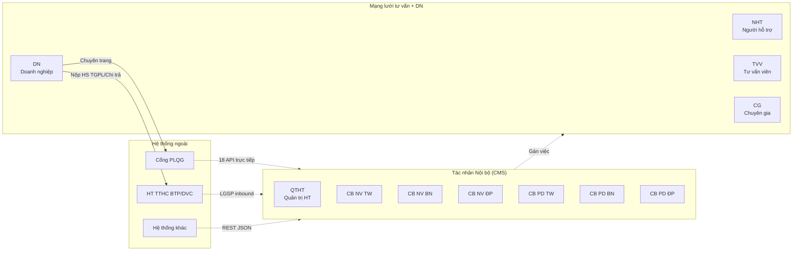
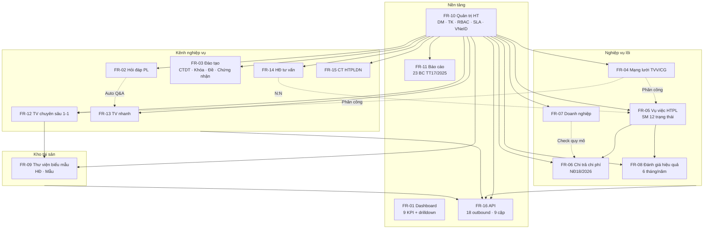

# 00 · Tổng quan Nghiệp vụ HTPLDN

> Tài liệu gốc: `docs/requirements/srs-v3-master.md` + 16 file `fr-XX-*.md` (đã trích xuất từ NotebookLM `only-srs-v3`).
> Mục tiêu: Cho BA/DEV/QA nắm được toàn cảnh hệ thống trước khi đi vào chi tiết từng phân hệ.

---

## 1. Bối cảnh & Mục tiêu

Phần mềm Hỗ trợ Pháp lý Doanh nghiệp (PM HTPLDN) là nền tảng quản lý hoạt động hỗ trợ pháp lý cho Doanh nghiệp nhỏ và vừa (DNNVV) do **Cục Bổ trợ Tư pháp - Bộ Tư pháp** chủ quản. Hệ thống:

- Thực thi quy định của **NĐ55/2019** (HTPL cho DNNVV), **NĐ18/2026** (điều chỉnh mức hỗ trợ chi phí), **TT17/2025** (mẫu báo cáo đánh giá), **NĐ77/2008** (quản lý TVV).
- Phục vụ **3 cấp tổ chức**: Trung ương (TW - Cục BLDS&KT) · Bộ ngành (BN) · Địa phương (ĐP - 63 Sở Tư pháp).
- Kết nối **Cổng Pháp luật Quốc gia** (Cổng PLQG) làm "chuyên trang" cho Doanh nghiệp; đồng bộ với **Cổng DVC BTP** qua LGSP cho thủ tục hành chính.

---

## 2. Danh sách Actor (14 tác nhân)



### Ma trận phạm vi dữ liệu

| Actor | Role | Phạm vi đọc | Phân quyền đặc biệt |
|---|---|---|---|
| **QTHT** | Quản trị | **Toàn hệ thống** (không bị chặn `don_vi_id`) | Quản lý danh mục, TK, vai trò, SLA, cấu hình phân công. |
| **CB NV TW** | Nghiệp vụ | Toàn quốc (TW + BN + ĐP) — BR-AUTH-04 | Tổng hợp báo cáo, chia sẻ dữ liệu Cổng PLQG. |
| **CB NV BN** | Nghiệp vụ | Chỉ dữ liệu Bộ/ngành mình — BR-AUTH-03 | Không thấy ĐP trực thuộc. |
| **CB NV ĐP** | Nghiệp vụ | Chỉ dữ liệu 1 Sở TP — BR-AUTH-03 | Xử lý VV/Chi trả thực tế. |
| **CB PD TW/BN/ĐP** | Phê duyệt | Cùng phạm vi CB NV | **Phê duyệt cùng cấp** (BR-AUTH-05). |
| **NHT / TVV** | Mạng lưới | Sở TP trực thuộc + **chỉ VV/YC được phân công** (BR-AUTH-10, "lọc kép") | — |
| **CG** | Chuyên gia | **Chỉ YC TVCS được phân công** — BR-AUTH-10 | — |
| **DN** | Doanh nghiệp | **Chỉ hồ sơ của chính mình** (API lọc theo `doanh_nghiep_id`) — BR-AUTH-11 | Không đăng nhập CMS; tương tác qua Cổng PLQG. |

---

## 3. Module Map (16 phân hệ)



### Bảng tóm tắt 16 phân hệ

| FR | Tên | Vai trò chính | UC range |
|---|---|---|---|
| FR-01 | **Dashboard** | KPI điều hành + drill-down | UC1-UC9 |
| FR-02 | **Hỏi đáp, vướng mắc PL** | Tiếp nhận câu hỏi DN → phản hồi → công khai | UC10-UC19 |
| FR-03 | **Đào tạo, tập huấn** | CTDT/Khóa/Bài giảng/Đề/Chứng nhận | UC20-UC38 |
| FR-04 | **Chuyên gia & TVV** | Đăng ký → thẩm định 4 nhóm → công khai MLTV | UC39-UC50 |
| FR-05 | **Vụ việc HTPL** | Vòng đời 12 trạng thái, đa kênh tiếp nhận | UC51-UC67 |
| FR-06 | **Chi trả chi phí TV** | Tính mức HT theo quy mô DN, phê duyệt & thanh toán | UC68-UC80 |
| FR-07 | **Doanh nghiệp** | CRUD DNNVV, phân quy mô NĐ39/2018, lịch sử HT | UC81-UC82 |
| FR-08 | **Đánh giá hiệu quả** | Đợt ĐG 6 tháng/năm theo mẫu 21a/21b TT17/2025 | UC83-UC91 |
| FR-09 | **Biểu mẫu & HĐ** | Thư mục + file, công khai trực tiếp không duyệt | UC92-UC98 |
| FR-10 | **Quản trị hệ thống** | 15 danh mục, TK, RBAC/RLS, SLA, SSO VNeID | UC99-UC123 |
| FR-11 | **Báo cáo** | 23 báo cáo TT17/2025 | UC124-UC146 |
| FR-12 | **Tư vấn chuyên sâu** | Inbound Cổng PLQG → gán CG, lưu HSPL & tư liệu | UC147-UC153 |
| FR-13 | **Tư vấn nhanh** | Full-text search TOP-5 câu trả lời từ kho Q&A | UC154-UC158 |
| FR-14 | **Hợp đồng TV** | HĐ với TVV/tổ chức, mốc tiến độ & thanh toán giai đoạn | UC159-UC159e |
| FR-15 | **CT HTPLDN** | KH CT + đợt BC ĐP/BN → TW tổng hợp TT17 | UC160-UC170 |
| FR-16 | **API kết nối** | 18 API outbound (9 cặp read+search) cho Cổng PLQG | UC171-UC188 |

---

## 4. Vòng đời End-to-End của 1 Doanh nghiệp

```mermaid
flowchart TB
    START([DN có nhu cầu HTPL])

    subgraph B1["Bước 1 · Tiếp nhận yêu cầu"]
        direction LR
        B1a[DVC/LGSP<br/>HT TTHC BTP]:::ch
        B1b[Chuyên trang<br/>Cổng PLQG]:::ch
        B1c[Trực tiếp/ĐT<br/>CB NV tự nhập]:::ch
        B1d[HT khác<br/>REST JSON]:::ch
    end

    subgraph B2["Bước 2 · Kiểm tra hồ sơ (FR-05)"]
        K[CB NV kiểm tra 6 hạng mục Mẫu 01 NĐ55<br/>Tính SLA 10 ngày LV]
    end

    D1{Kết quả KT?}

    subgraph B3["Bước 3 · Phân công NHT/TVV (FR-05 ↔ FR-04)"]
        P1[Hệ thống tính điểm ưu tiên<br/>BR-CALC-04: nữ chủ +3, LĐ nữ +2, KT +2, FIFO +1]
        P2[Gợi ý TVV theo lĩnh vực + địa bàn + workload]
        P3[CB NV chốt phân công<br/>NHT xác nhận tham gia]
    end

    subgraph B4["Bước 4 · Xử lý & Tư vấn"]
        X1[NHT/CG tư vấn VB/trực tiếp/video<br/>FR-05 UC65 hoặc FR-12 UC147]
        X2[Upload VB tư vấn pháp luật<br/>CB NV tổng hợp kết quả]
        X3[CB PD cùng cấp duyệt<br/>BR-AUTH-05]
    end

    subgraph B5["Bước 5 · Chi trả chi phí (FR-06)"]
        C1[DN nộp HS thanh toán qua DVC<br/>LGSP inbound]
        C2[Check quy mô DN qua FR-07<br/>Tính % hỗ trợ: 100% siêu nhỏ, 30% nhỏ, 10% vừa]
        C3[Check trần chi phí năm<br/>BR-CALC-02: MIN của 3 điều kiện]
        C4[CB NV thẩm định → CB PD duyệt chi]
        C5[Cập nhật thanh toán<br/>Cập nhật tiến độ FR-14 nếu có HĐ]
    end

    subgraph B6["Bước 6 · Đánh giá chất lượng"]
        E1[DN/CB NV chấm VV 0-10<br/>3 tiêu chí: Chuyên môn · Thái độ · Đúng hạn]
        E2[Điểm TB cập nhật profile TVV<br/>FR-04 BR-CALC-06]
        E3[Đợt ĐG 6 tháng/năm FR-08<br/>Chọn VV làm mẫu → tính điểm trọng số 100%<br/>Sinh BC TT17/2025]
    end

    subgraph B7["Bước 7 · Công khai & Chia sẻ"]
        S1[Dữ liệu đã duyệt<br/>đẩy qua 18 API FR-16 lên Cổng PLQG]
        S2[Loại trừ thông tin nhạy cảm BR-SEC-01<br/>CCCD, MST, địa chỉ cá nhân]
    end

    END([Hoàn thành &<br/>ghi nhận AUDIT_LOG])

    START --> B1
    B1 --> B2
    B2 --> D1
    D1 -- ĐẠT --> B3
    D1 -- CAN BỔ SUNG --> B2
    D1 -- KHÔNG ĐẠT --> END
    B3 --> B4
    B4 --> B5
    B5 --> B6
    B6 --> B7
    B7 --> END

    classDef ch fill:#e3f2fd,stroke:#1976d2;
```



---

## 5. Kiến trúc kênh tích hợp (Hybrid 3 kênh - BR-INTG-01)

```mermaid
flowchart LR
    subgraph PM["PM HTPLDN"]
        CMS[CMS Nội bộ]
        API[API Gateway<br/>mTLS + JWT RS256]
    end
    subgraph LGSP["Kênh 1 · LGSP nội bộ BTP"]
        DVC[DVC<br/>HT TTHC BTP]
    end
    subgraph NDXP["Kênh 2 · NDXP liên ngành"]
        VNEID[VNeID<br/>SSO Tier 3]
    end
    subgraph DIRECT["Kênh 3 · Kết nối trực tiếp"]
        CPLQG[Cổng PLQG<br/>Chuyên trang DN]
        EMAIL[SMTP/Email<br/>Thông báo]
        HTK[HT khác<br/>REST JSON]
    end

    DVC <-->|HS yêu cầu TGPL<br/>HS thanh toán<br/>Thông báo KQ| API
    VNEID -->|OIDC Authorization Code| API
    CPLQG <-->|Chia sẻ/tìm kiếm 18 API<br/>Inbound TVCS/HSPL/Đánh giá| API
    EMAIL <-- API
    HTK -->|Tạo VV| API
    API <--> CMS
```

**Ghi chú**:
- LGSP dùng cho **HT nội bộ BTP** (DVC nộp HS, trả KQ).
- NDXP dùng cho **liên ngành** (VNeID cho Tier 3).
- **Cổng PLQG đi TRỰC TIẾP**, không qua LGSP (theo BR-INTG-01).
- **Graceful Degradation** (AVL-05): LGSP/NDXP chết → CMS vẫn chạy, queue API outbound.

---

## 6. Điểm tích hợp giữa các phân hệ

| # | Tích hợp | Mô tả | BR liên quan |
|---|---|---|---|
| 1 | **FR-05 → FR-04** (Phân công) | Khi CB NV phân công NHT/TVV, hệ thống lấy danh sách từ FR-04, tính workload + điểm ưu tiên DN. | BR-CALC-04 |
| 2 | **FR-05 → FR-04** (Đánh giá) | Điểm chất lượng VV được AVG vào `diem_danh_gia_tb` trên profile TVV. | BR-CALC-06 |
| 3 | **FR-06 → FR-07** (Quy mô DN) | Duyệt chi: hệ thống tra cứu quy mô DN (siêu nhỏ/nhỏ/vừa) → chọn mức 100%/30%/10%. | BR-CALC-01 |
| 4 | **FR-06 → FR-07** (Trần năm) | Check tổng đã chi trong năm có vượt trần không (3/5/10 triệu). | BR-CALC-02 |
| 5 | **FR-06 ↔ FR-14** (HĐ TV) | Cập nhật tiến độ thanh toán của "Hợp đồng tư vấn". | UC-80 |
| 6 | **FR-05 → FR-08** (Đánh giá đợt) | VV có trạng thái `HOAN_THANH` mới đủ điều kiện bốc vào đợt đánh giá 6 tháng/năm. | UC-87 |
| 7 | **FR-02 → FR-13** (Kho Q&A) | Hỏi đáp trạng thái `DA_DUYET` tự động bổ sung vào kho tư vấn nhanh (nguồn = TU_DONG). | BR-FLOW-10 |
| 8 | **FR-12 → FR-09** (Tư liệu VV) | TVCS lưu tư liệu pháp lý VV → có thể công khai trực tiếp lên Cổng PLQG. | BR-FLOW-07 |
| 9 | **CORE → FR-16** (API outbound) | Sau khi bản ghi duyệt → đẩy qua 18 API (đã lọc thông tin nhạy cảm) lên Cổng PLQG. | BR-INTG-07, BR-SEC-01 |
| 10 | **FR-10 → ALL** (RBAC + RLS) | Cấu hình vai trò + phân quyền dữ liệu theo đơn vị áp dụng mọi entity có `don_vi_id`. | BR-AUTH-08 |
| 11 | **FR-10 → FR-05/FR-02/FR-06** (SLA) | Cấu hình SLA trung tâm, background job 30ph cập nhật mức cảnh báo 4 mức. | BR-SLA-02, BR-SLA-03 |
| 12 | **ALL → AUDIT_LOG** | Mọi CUD + phê duyệt + login/export ghi audit (immutable). | BR-DATA-05 |
| 13 | **FR-15 ↗ (ĐP/BN → TW)** | BC CT HTPLDN được ĐP/BN gửi lên → TW tổng hợp toàn quốc. | BR-FLOW-08 |

---

## 7. Cross-cutting Business Rules (áp dụng toàn hệ thống)

### Nhóm BR-AUTH (Xác thực & Phân quyền)

| BR | Nội dung cốt lõi |
|---|---|
| BR-AUTH-01 | Xác thực bắt buộc. Tier 1 (MVP): user/pass + TOTP 2FA email. Tier 2: VNPT eKYC. Tier 3: VNeID OIDC. API: JWT. |
| BR-AUTH-02 | Cấu trúc 3 tầng: TW → BN / ĐP. |
| BR-AUTH-03 | Ngang cấp KHÔNG thấy nhau (BN ≠ ĐP ≠ BN khác). |
| BR-AUTH-04 | Cấp cha thấy cấp con: TW thấy toàn bộ; BN KHÔNG thấy ĐP trực thuộc BN. |
| BR-AUTH-05 | Phê duyệt cùng cấp (CB NV cấp nào → CB PD cùng cấp). |
| BR-AUTH-06 | Session CMS: 30 phút idle · JWT: 15 phút · Refresh: 24 giờ. |
| BR-AUTH-07 | Khóa TK sau 5 lần sai; auto mở sau 30 phút hoặc QTHT mở. |
| BR-AUTH-08 | Phân quyền dữ liệu theo `don_vi_id` cho MỌI bảng (trừ AUDIT_LOG). |
| BR-AUTH-10 | "Lọc kép" cho NHT/TVV/CG: đơn vị + được phân công. |
| BR-AUTH-11 | DN lọc API theo `doanh_nghiep_id` + Sở TP quản lý. |

### Nhóm BR-DATA (Dữ liệu & toàn vẹn)

| BR | Nội dung cốt lõi |
|---|---|
| BR-DATA-01 | Soft delete (`is_deleted=1`), không xóa vật lý. |
| BR-DATA-02 | Multi-tenant: `don_vi_id` NOT NULL (trừ danh mục dùng chung). |
| BR-DATA-03 | 7 common fields: id · created_at · updated_at · created_by · updated_by · is_deleted · don_vi_id. |
| BR-DATA-04 | Auto-gen mã `PREFIX-YYYYMMDD-SEQ` (VD `VV-HCM-20260325-001`). |
| BR-DATA-05 | AUDIT_LOG immutable cho CUD + phê duyệt + login/export. |
| BR-DATA-06 | Export Excel tối đa 10.000 dòng; báo cáo 50.000. |
| BR-DATA-07 | Pagination mặc định 20/trang, max 100/trang. |
| BR-DATA-08 | Full-text search tiếng Việt (unaccent). |

### Nhóm BR-FLOW (Luồng nghiệp vụ)

| BR | Nội dung cốt lõi |
|---|---|
| BR-FLOW-03 | Đã duyệt/Hoàn thành → KHÔNG sửa/xóa (trừ QTHT force-edit). |
| BR-FLOW-04 | "Từ chối" phải nhập lý do (≥10 ký tự). |
| BR-FLOW-05 | Công khai Cổng PLQG: chỉ bản ghi DA_DUYET, qua API trực tiếp. |
| BR-FLOW-07 | Biểu mẫu/tư liệu VII & X.1: công khai trực tiếp, KHÔNG cần phê duyệt. |
| BR-FLOW-08 | BC CT HTPLDN: ĐP/BN gửi lên → TW tổng hợp mẫu TT17. |
| BR-FLOW-10 | Kho Q&A TV nhanh: 3 nguồn (Auto từ HĐ duyệt · Thủ công chờ duyệt · Import chờ duyệt). |

### Nhóm BR-SLA (4 mức cảnh báo)

| Mức | Ngưỡng | Màu |
|---|---|---|
| BÌNH_THƯỜNG | `> 50%` thời gian còn lại | Xanh |
| SẮP_HẾT | `≤ 50%` thời gian | Vàng |
| QUÁ_HẠN | `> 100%` | Đỏ |
| QUÁ_HẠN_NGHIÊM_TRỌNG | `> 2x` | Đen |

Background job chạy mỗi 30 phút (BR-SLA-03) để cập nhật mức cảnh báo + gửi email + in-app.

### Nhóm BR-INTG (Tích hợp)

| BR | Nội dung |
|---|---|
| BR-INTG-01 | Hybrid 3 kênh: LGSP · NDXP · Trực tiếp. |
| BR-INTG-02 | API: mTLS + JWT Bearer RS256. |
| BR-INTG-03 | Rate limit 100 req/phút/consumer. |
| BR-INTG-04 | Response time API < 3s. |
| BR-INTG-05 | Retry tối đa 3 lần (1s/2s/4s exponential backoff). |
| BR-INTG-07 | Chỉ share dữ liệu đã duyệt qua API outbound. |

---

## 8. NFR cốt lõi

| Hạng mục | Ngưỡng |
|---|---|
| **Hiệu năng** | CMS P95 < 3s, P99 < 5s (500 CCU). Tải list: < 2s (≤ 100K bản ghi). Export Excel: < 10s (≤ 10K dòng). |
| **Bảo mật** | TLS 1.2+ · TDE + AES-256 at-rest · RBAC + RLS · SQL Injection/XSS/CSP. |
| **Khả dụng** | Uptime ≥ 99.5% · RPO ≤ 4h · RTO ≤ 4h · Active-Passive failover · Graceful Degradation. |
| **Lưu trữ** | Nghiệp vụ cốt lõi: 5 năm active / 5-10 năm archive / purge > 10 năm. AUDIT_LOG: 5 năm. |
| **File** | Upload ≤ 20MB/file · Hạn mức 10GB/đơn vị · Antivirus scan 30s/file. |
| **Session** | 30 phút idle · JWT 15 phút · Refresh 24h · Tối đa 3 session đồng thời (QTHT 1). |

---

## 9. Các State Machine chính (11 SM)

| SM | Module | Số trạng thái | Đường đi tắt |
|---|---|---|---|
| SM-HOIDAP | FR-02 | 8 | MỚI → TIẾP_NHẬN → DA_PHAN_CONG → DANG_XU_LY → CHO_PHE_DUYET → DA_DUYET → CONG_KHAI → HOAN_THANH |
| SM-KHOAHOC | FR-03 | 8 | NHAP → CHO_DUYET → DA_DUYET → DA_CONG_KHAI → DA_KET_THUC → CHO_DUYET_KQ → HOAN_THANH |
| SM-TVV | FR-04 | 9 | MỚI_ĐĂNG_KÝ → CHO_THAM_DINH → DANG_THAM_DINH → CHO_PHE_DUYET → DANG_HOAT_DONG |
| SM-VUVIEC | FR-05 | 12 | CHO_TIEP_NHAN → DA_TIEP_NHAN → DANG_KIEM_TRA → DA_PHAN_CONG → DANG_XU_LY → CHO_PHE_DUYET → DA_DUYET → HOAN_THANH → DA_DANH_GIA |
| SM-CHITRA | FR-06 | 10 | CHO_TIEP_NHAN → DANG_KIEM_TRA → DANG_DANH_GIA → DANG_THAM_DINH → CHO_PHE_DUYET → DA_DUYET → DA_THANH_TOAN |
| SM-DANHGIA | FR-08 | 9 | LAP_KH → PC → CHO_DUYET_PC → THUC_HIEN → DANG_DG → DA_DG → BAO_CAO → CHO_DUYET_BC → HOAN_THANH |
| SM-BIEUMAU | FR-09 | 4 | NHAP → CONG_KHAI ↔ AN → XOA |
| SM-TAIKHOAN | FR-10 | 4 | CHO_KICH_HOAT → HOAT_DONG ↔ TAM_KHOA → VO_HIEU_HOA |
| SM-TVCS | FR-12 | 7 | TIEP_NHAN → PHAN_CONG → DANG_TU_VAN → HOAN_THANH → CHO_PHE_DUYET → DA_DUYET |
| SM-TVNHANH | FR-13 | 5 | MOI → DANG_TIM_KIEM → DA_GOI_Y / CB_TRA_LOI → HOAN_THANH |
| SM-KH-CTHTPL + SM-DOT-BC | FR-15 | 9 + 7 | DU_THAO → CHO_PHE_DUYET → DA_DUYET → DA_CONG_BO → DANG_THUC_HIEN → HOAN_THANH |

---

## 10. Đọc tiếp

Đi vào chi tiết từng phân hệ ở các file `01-fr-01-*.md` đến `16-fr-16-*.md` trong cùng thư mục. Thứ tự khuyến nghị xem `README.md`.
