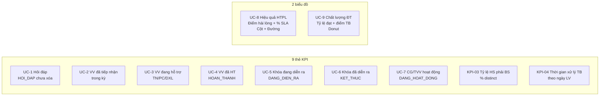
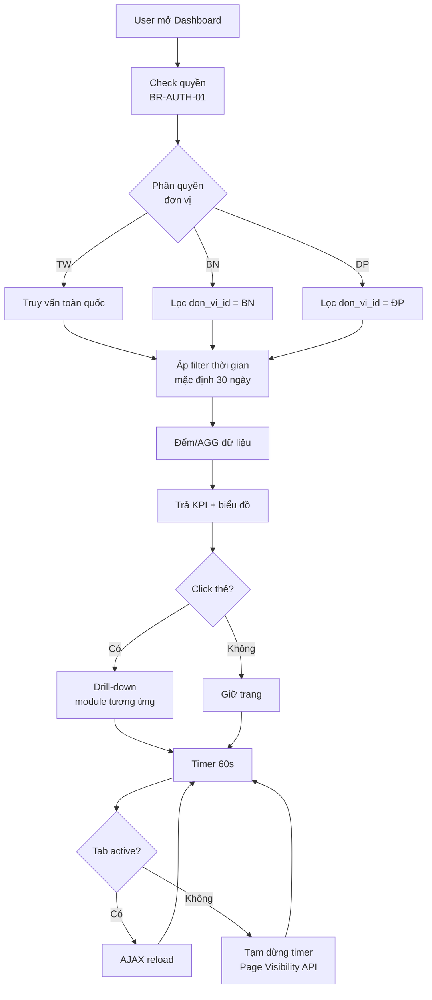
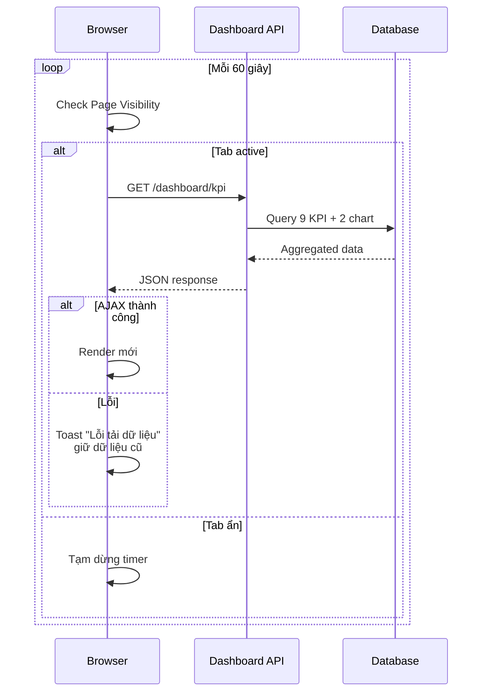

# 01 · FR-01 Dashboard

> **Tài liệu gốc**: `docs/requirements/fr-01-dashboard.md` · **UC range**: UC1-UC9 + 2 KPI + 1 Cross-cutting.
> **Vai trò**: Module read-only hiển thị KPI + biểu đồ điều hành, hỗ trợ drill-down xuống module nghiệp vụ.

---

## 1. Actors & Pre-condition

| Actor | Quyền | Phạm vi data |
|---|---|---|
| CB NV TW/BN/ĐP | Xem Dashboard | Theo phân quyền đơn vị (BR-AUTH-03, BR-AUTH-04) |
| CB PD TW/BN/ĐP | Xem Dashboard | Theo phân quyền đơn vị |
| QTHT | Xem toàn quốc | Không giới hạn |

Pre-condition chung: User đã đăng nhập (BR-AUTH-01) + có quyền Dashboard.

---

## 2. 9 KPI + 2 Biểu đồ

---

## 3. Luồng xử lý chung (Main flow)

---

## 4. Drill-down Map

| Click thẻ | Điều hướng |
|---|---|
| UC-1 Hỏi đáp | `/hoi-dap/danh-sach?trang_thai=MOI` (FR-02) |
| UC-2 VV tiếp nhận | `/vu-viec/danh-sach?trang_thai=DA_TIEP_NHAN` (FR-05) |
| UC-3 VV đang hỗ trợ | `/vu-viec/danh-sach?trang_thai=DANG_XU_LY` (FR-05) |
| UC-4 VV hoàn thành | `/vu-viec/danh-sach?trang_thai=HOAN_THANH` (FR-05) |
| UC-5/UC-6 Khóa học | `/dao-tao/khoa-hoc` (FR-03) |
| UC-7 TVV | `/mang-luoi-tvv` (FR-04) |

---

## 5. Auto-refresh (UC-CROSS-02)

---

## 6. Công thức tính

| KPI | Công thức | BR |
|---|---|---|
| UC-8 Tỷ lệ SLA | `COUNT(hoan_thanh_dung_han) / COUNT(hoan_thanh) * 100` | BR-SLA-05 |
| UC-9 Tỷ lệ đạt ĐT | `SUM(hoc_vien_dat) / SUM(total) * 100` | — |
| KPI-03 Tỷ lệ HS BS | `COUNT(DISTINCT VV đã qua YEU_CAU_BO_SUNG) / COUNT(HT) * 100` | — |
| KPI-04 Thời gian XL TB | `AVG(ngay_hoan_thanh - ngay_tiep_nhan)` theo ngày LV | BR-CALC-03 |

---

## 7. Error & Info codes

| Mã | Mô tả |
|---|---|
| INFO-DASH-01 | "0" + "Chưa có dữ liệu" |
| ERR-DASH-01 | Ngày bắt đầu > ngày kết thúc |
| ERR-DASH-02 | Lỗi tải dữ liệu, vui lòng thử lại |
| INFO-DASH-02 | "Chưa có dữ liệu đánh giá trong kỳ" (UC-8) |

---

## 8. State machine

Không có — module read-only thuần.
