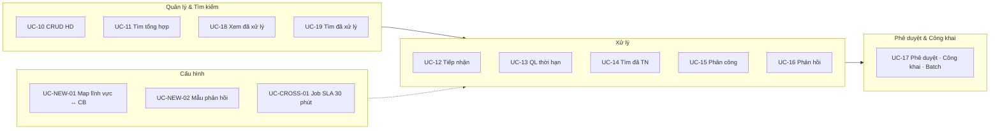
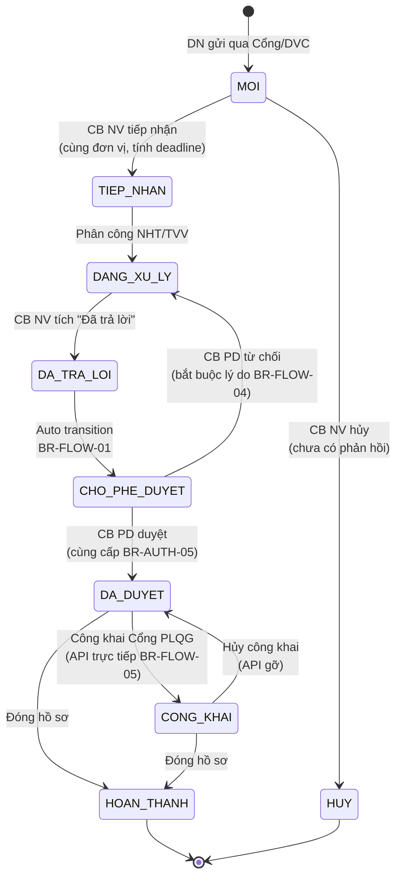
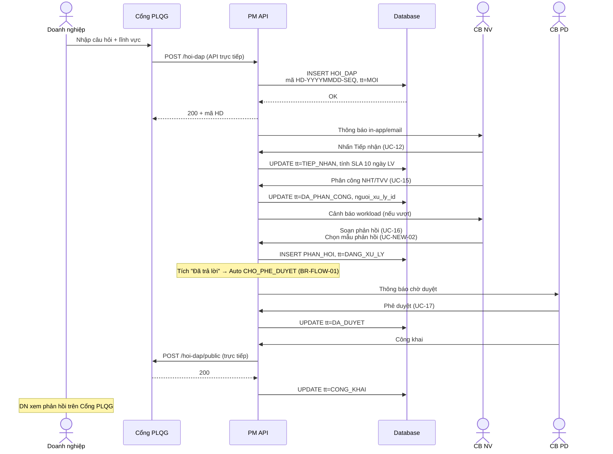
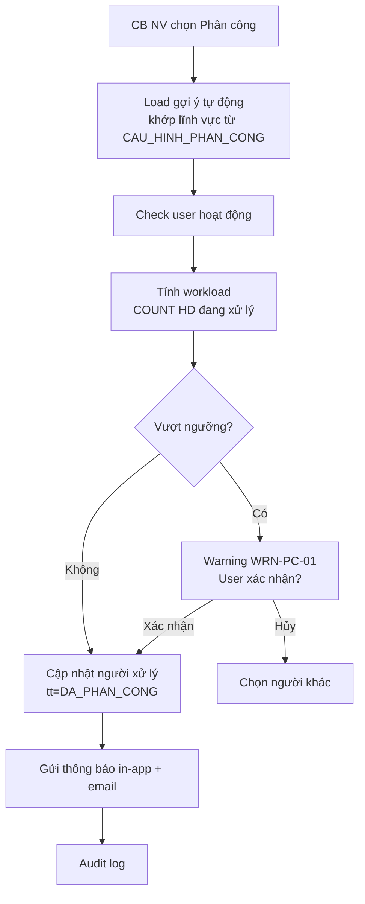
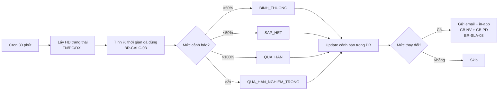

# 02 · FR-02 Hỏi đáp, Vướng mắc Pháp lý

> **Tài liệu gốc**: `docs/requirements/fr-02-hoi-dap.md` · **UC range**: UC10-UC19 + 2 mới + 1 cross-cutting SLA.
> **Vai trò**: Quản lý vòng đời câu hỏi pháp lý của DN — tiếp nhận, phân công, phản hồi, phê duyệt, công khai lên Cổng PLQG.

---

## 1. Actors

| Actor | Thao tác chính |
|---|---|
| DN | Gửi câu hỏi qua Cổng PLQG (API inbound) |
| CB NV TW/BN/ĐP | Tiếp nhận · Phân công · Soạn phản hồi · Quản lý mẫu phản hồi |
| CB PD TW/BN/ĐP | Phê duyệt · Công khai · Phê duyệt hàng loạt |
| QTHT | Cấu hình lĩnh vực ↔ CB |
| Hệ thống | Background job SLA 30 phút |

---

## 2. Use-case Map

---

## 3. State Machine SM-HOIDAP

---

## 4. Sequence: DN → PM → Cổng PLQG (vòng đời đầy đủ)

---

## 5. Phân công & Workload (UC-15)

---

## 6. Cross-cutting: Background Job SLA (UC-CROSS-01)

---

## 7. Batch phê duyệt (UC-17 alt flow)

- Max 100 bản ghi/request (BR-EC-19 / ERR-PD-05).
- Lỗi từng bản ghi → ghi nhận, tiếp tục; kết quả WRN-PD-01 `{N} duyệt, {M} lỗi`.
- **Từ chối bắt buộc từng bản ghi** (để nhập lý do khác nhau).

---

## 8. Error codes quan trọng

| Mã | Mô tả | UC |
|---|---|---|
| ERR-HD-04 | Không sửa/xóa bản ghi đã duyệt (BR-FLOW-03) | UC-10 |
| ERR-TN-03 | Xung đột: đã được người khác tiếp nhận (EC-01) | UC-12 |
| ERR-PD-01 | Không được duyệt khác cấp (BR-AUTH-05) | UC-17 |
| ERR-PD-04 | Lỗi API Cổng PLQG | UC-17 |
| ERR-PD-05 | Batch > 100 bản ghi | UC-17 |

---

## 9. Tích hợp với phân hệ khác

| Tích hợp | Chi tiết |
|---|---|
| **FR-13 Tư vấn nhanh** | HD `DA_DUYET` auto bổ sung vào kho Q&A TV nhanh (nguồn = TU_DONG, BR-FLOW-10). |
| **FR-16 API outbound** | UC-171 `API Chia sẻ hỏi đáp` · UC-172 `API Tìm kiếm hỏi đáp` đều lọc `DA_DUYET`. |
| **FR-10 SLA config** | UC-108 cấu hình thời hạn xử lý mặc định (10 ngày LV). |
| **FR-10 Danh mục** | UC-99 Lĩnh vực PL · UC-NEW-01 mapping lĩnh vực ↔ CB. |
