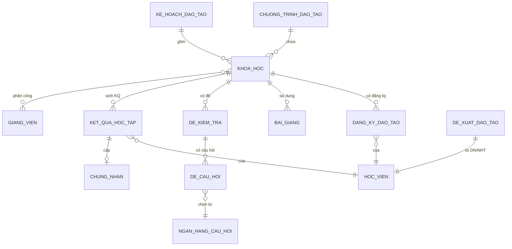
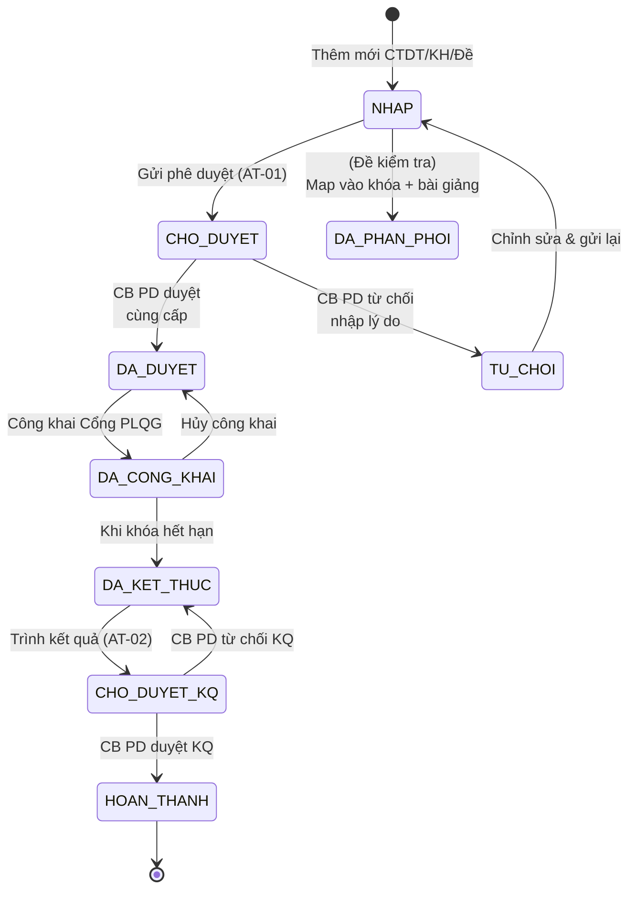
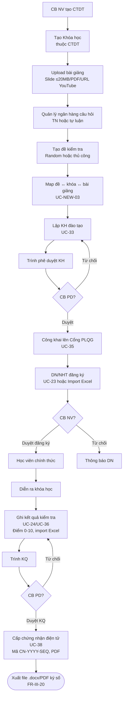
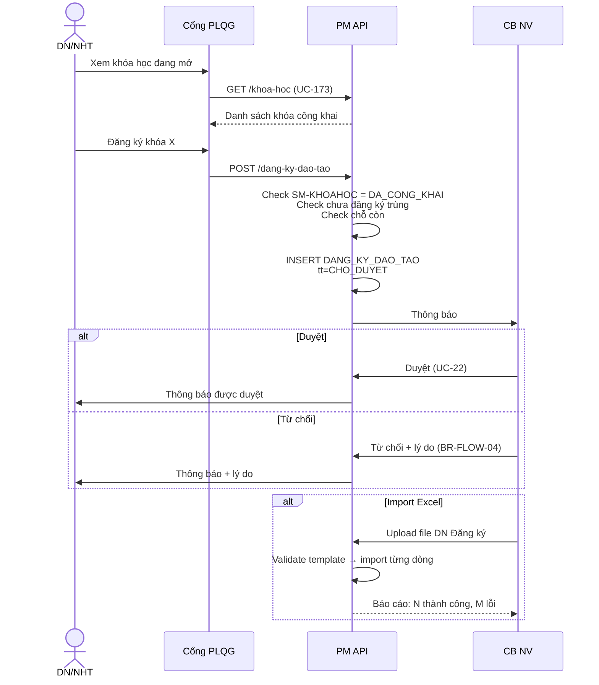
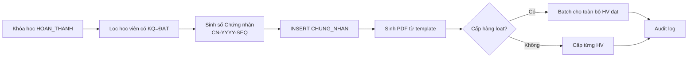

# 03 · FR-03 Đào tạo, Tập huấn

> **Tài liệu gốc**: `docs/requirements/fr-03-dao-tao.md` · **UC range**: UC20-UC38 + 4 mới.
> **Vai trò**: Quản lý Chương trình đào tạo (CTDT) · Khóa học · Bài giảng · Ngân hàng câu hỏi · Đề kiểm tra · Đăng ký · Kết quả · Chứng nhận điện tử.

---

## 1. Actors

| Actor | Thao tác |
|---|---|
| CB NV TW/BN/ĐP | CRUD CTDT/Khóa/Bài giảng/Đề, lập KH đào tạo, công khai, ghi kết quả, cấp chứng nhận |
| CB PD TW/BN/ĐP | Phê duyệt KH đào tạo (cùng cấp), phê duyệt kết quả đào tạo |
| DN | Đăng ký tham gia, gửi đề xuất đào tạo, tải bài giảng công khai |
| NHT | Đăng ký tham gia, gửi đề xuất |
| Giảng viên / Trợ giảng | Dạy, chấm kết quả (được cấu hình) |

---

## 2. Entity Map

---

## 3. State Machine SM-KHOAHOC / SM-KHDT / SM-DE

---

## 4. Luồng nghiệp vụ chính: Tổ chức khóa đào tạo

---

## 5. Đăng ký khóa học (UC-23)

---

## 6. Cấp chứng nhận (UC-38)

---

## 7. Error codes quan trọng

| Mã | Mô tả | UC |
|---|---|---|
| ERR-CTDT-03 | Không xóa CTDT đã có khóa | UC-20 |
| ERR-DK-DT-03 | Lớp đủ số lượng | UC-23 |
| ERR-KQ-01 | Điểm phải 0-10 | UC-24 |
| ERR-BG-01 | File >20MB | UC-26 |
| WRN-NHCH-01 | Câu hỏi đang dùng trong {N} đề | UC-28 |

---

## 8. Tích hợp

| Tích hợp | Chi tiết |
|---|---|
| **FR-09** | CTDT có thể xuất file docx/PDF ký số từ thư viện biểu mẫu (FR-III-20). |
| **FR-16** | UC-173 API Chia sẻ đào tạo · UC-174 API Tìm kiếm. Chỉ share khóa ở DA_CONG_KHAI (BR-INTG-07). |
| **FR-10** | Danh mục loại hình đào tạo · UC-108 SLA đào tạo. |
