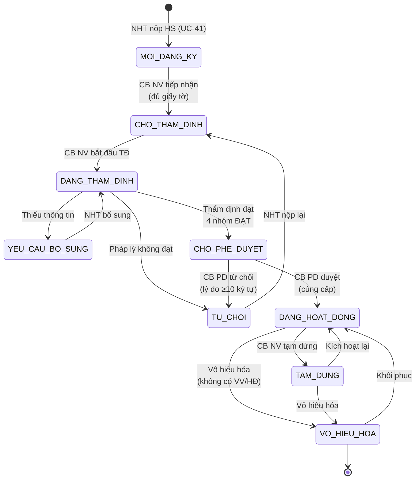
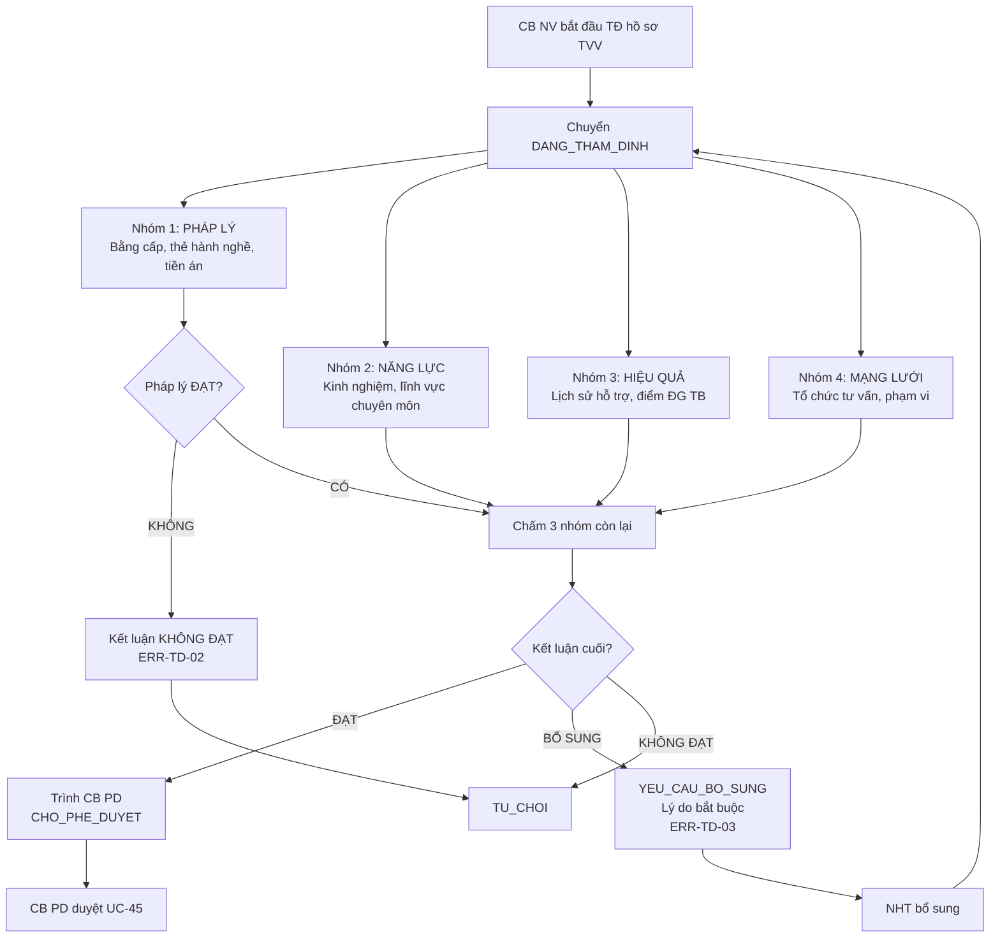
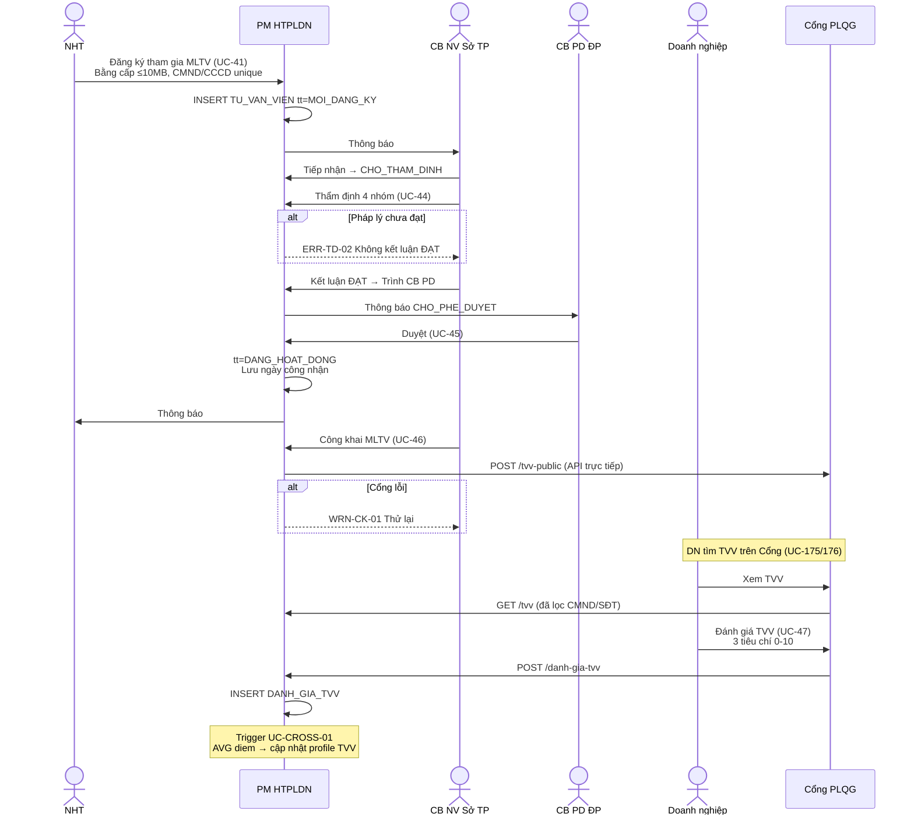
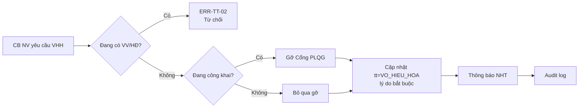

# 04 · FR-04 Quản lý Chuyên gia, Tư vấn viên

> **Tài liệu gốc**: `docs/requirements/fr-04-chuyen-gia-tvv.md` · **UC range**: UC39-UC50 + 1 trigger.
> **Vai trò**: Quản lý toàn bộ mạng lưới nhân sự tư vấn pháp luật (NHT, TVV, Chuyên gia) — đăng ký, thẩm định 4 nhóm tiêu chí, phê duyệt, công khai MLTV, đánh giá, xử lý trạng thái.
> **Nền tảng pháp lý**: NĐ77/2008/NĐ-CP — Quản lý tư vấn pháp luật.

---

## 1. Actors & phạm vi

| Actor | Quyền | Phạm vi |
|---|---|---|
| NHT | Đăng ký tham gia, cập nhật hồ sơ cá nhân | Chỉ hồ sơ của mình |
| TVV / CG | Xem hồ sơ, đánh giá | Chỉ dữ liệu được phân công |
| CB NV TW/BN/ĐP | Quản lý MLTV, thẩm định, công khai | Theo đơn vị |
| CB PD TW/BN/ĐP | Phê duyệt TVV | Cùng cấp (BR-AUTH-05) |
| DN | Đánh giá TVV qua Cổng PLQG | Chỉ TVV đã hỗ trợ mình |
| Hệ thống | Trigger tính điểm đánh giá TB | — |

---

## 2. State Machine SM-TVV

---

## 3. Thẩm định 4 nhóm tiêu chí (UC-44)

---

## 4. Sequence: Đăng ký NHT → Hoạt động

---

## 5. Điểm đánh giá TVV (BR-CALC-06)

- 3 tiêu chí mỗi đánh giá: **Chuyên môn · Thái độ · Đúng hạn** (0-10).
- Điểm tổng mỗi đánh giá = `AVG(3 điểm)`.
- Điểm TB TVV = `AVG(diem_tong)` over toàn bộ DANH_GIA_TVV → cập nhật `TU_VAN_VIEN.diem_danh_gia_tb` qua trigger UC-CROSS-01.

---

## 6. Chi tiết hồ sơ TVV (UC-43) — 4 Tab

| Tab | Nội dung |
|---|---|
| **Hồ sơ** | Thông tin cá nhân, CMND/CCCD, tổ chức chính + đối tác, bằng cấp |
| **Năng lực** | Lĩnh vực chuyên môn, kinh nghiệm (TVV_LINH_VUC) |
| **Lịch sử hỗ trợ** | VU_VIEC linked qua PHAN_CONG_VV: tổng, hoàn thành, điểm TB |
| **Đánh giá** | DANH_GIA_TVV: điểm từng tiêu chí + trung bình |

---

## 7. Vô hiệu hóa TVV (UC-50)

---

## 8. Error codes

| Mã | Mô tả |
|---|---|
| ERR-TVV-02 | CMND/CCCD đã tồn tại |
| ERR-TVV-05 | TVV đang có VV chưa hoàn thành |
| ERR-TD-02 | Không kết luận ĐẠT khi Pháp lý chưa đạt |
| ERR-PD-03 | Lý do từ chối ≥10 ký tự |
| ERR-CK-01 | Chỉ TVV đang hoạt động mới được công khai |

---

## 9. Tích hợp

| Tích hợp | Chi tiết |
|---|---|
| **FR-05 Vụ việc** | UC-59 Phân công NHT dựa vào danh sách DANG_HOAT_DONG + lĩnh vực + workload. |
| **FR-05 Đánh giá VV** | UC-67 cập nhật điểm VV → Trigger UC-CROSS-01 update TB. |
| **FR-12 TVCS** | Gán Chuyên gia vào phiên tư vấn chuyên sâu. |
| **FR-16** | UC-175/176 Share+Search TVV (ẩn CMND/CCCD/SĐT - BR-SEC-01). |
| **FR-10** | UC-104 Tổ chức tư vấn · UC-99 Lĩnh vực PL. |
