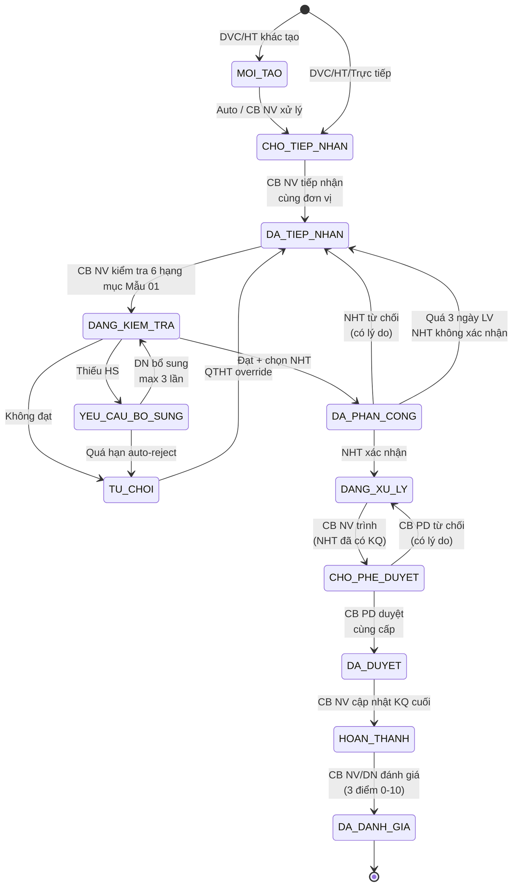
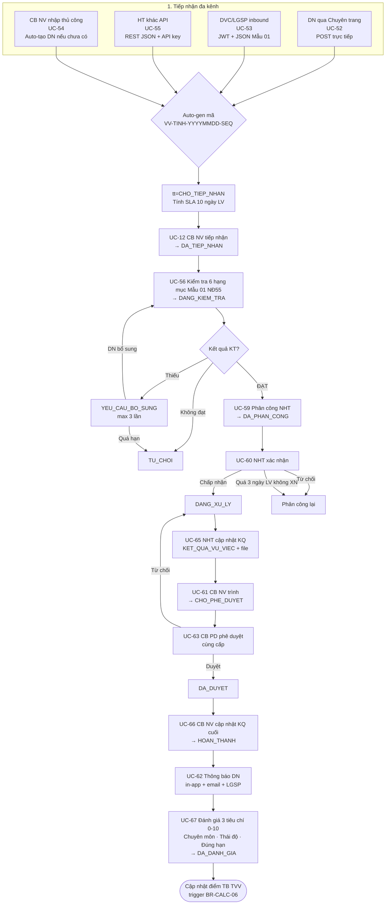
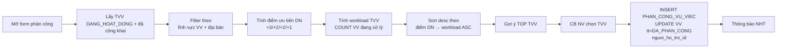
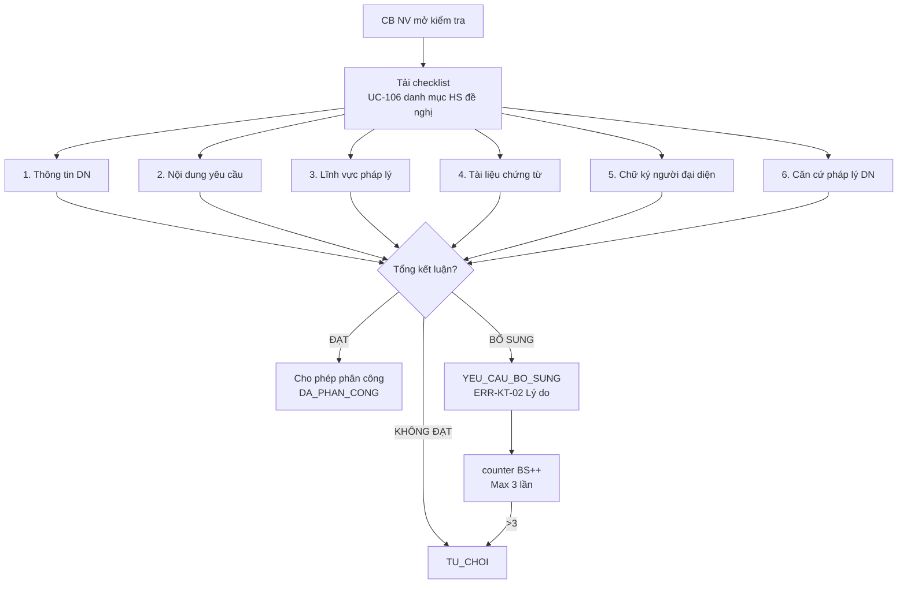
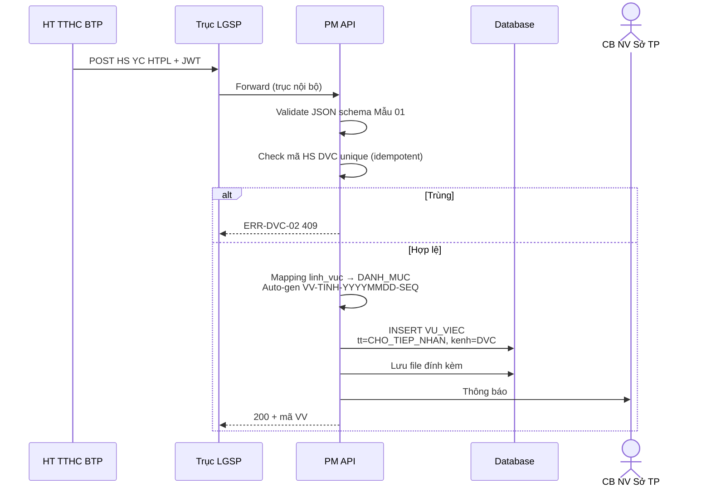
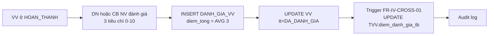

# 05 · FR-05 Quản lý Vụ việc Trợ giúp Pháp lý (VV HTPL)

> **Tài liệu gốc**: `docs/requirements/fr-05-vu-viec.md` · **UC range**: UC51-UC67 + 1 new + 1 cross-cutting.
> **Vai trò**: TRUNG TÂM NGHIỆP VỤ — xử lý vụ việc TGPL từ tiếp nhận đa kênh → phân công → tư vấn → phê duyệt → hoàn thành → đánh giá.
> **Nền tảng pháp lý**: NĐ55/2019 Điều 9 (SLA 10 ngày LV) · Điều 4 (ưu tiên phân công).

---

## 1. Actors

| Actor | Vai trò |
|---|---|
| DN | Gửi HS YC HTPL qua Cổng PLQG / Chuyên trang |
| Hệ thống DVC (LGSP) | Inbound HS qua LGSP |
| Hệ thống khác | Inbound HS qua REST JSON |
| CB NV TW/BN/ĐP | Tiếp nhận · Kiểm tra · Phân công · Trình duyệt · Cập nhật KQ · Đánh giá |
| NHT | Xác nhận tham gia · Cập nhật KQ hỗ trợ |
| CB PD TW/BN/ĐP | Phê duyệt hồ sơ (cùng cấp BR-AUTH-05) |
| QTHT | Cấu hình quy trình, SLA |
| Hệ thống (Cron) | Cập nhật mức cảnh báo SLA 30 phút |

---

## 2. State Machine SM-VUVIEC (12 trạng thái)

---

## 3. Luồng End-to-End: Từ DN gửi YC → Hoàn thành → Đánh giá

---

## 4. Phân công với điểm ưu tiên (UC-59)

### Công thức điểm ưu tiên DN (BR-CALC-04, NĐ55/2019 Điều 4)

| Tiêu chí | Điểm |
|---|---|
| DN do phụ nữ làm chủ | +3 |
| DN có nhiều LĐ nữ | +2 |
| DN có ≥30% LĐ khuyết tật | +2 |
| FIFO (ngày tiếp nhận sớm hơn) | +1 |

---

## 5. Kiểm tra 6 hạng mục Mẫu 01 NĐ55 (UC-56)

---

## 6. Sequence: Tiếp nhận DVC (UC-53)

---

## 7. SLA & Background Job (UC-CROSS-01)

- Default SLA: **10 ngày làm việc** (BR-SLA-01, NĐ55/2019 Điều 9).
- Job chạy mỗi 30 phút: tính % thời gian đã dùng → cập nhật cảnh báo 4 mức:

| Mức | Ngưỡng | Thông báo |
|---|---|---|
| BINH_THUONG | >50% còn lại | — |
| SAP_HET | ≤50% | Vàng + email CB NV |
| QUA_HAN | >100% | Đỏ + email CB NV + CB PD |
| QUA_HAN_NGHIEM_TRONG | >2x deadline | Đen + escalate |

---

## 8. Đánh giá VV (UC-67) → cập nhật TVV

---

## 9. Quy trình cấu hình (UC-NEW-01)

QTHT định nghĩa quy trình:
- Bước (tên, thứ tự, SLA, điều kiện chuyển bước).
- **Versioning**: VV mới áp QT mới; VV đang chạy giữ QT cũ (không break hồ sơ đang chạy).

---

## 10. Error codes

| Mã | Mô tả |
|---|---|
| ERR-DVC-02 | HS đã tiếp nhận (409 idempotent) |
| ERR-INTG-02 | HS tồn tại (HT khác) |
| ERR-KT-02 | Lý do bổ sung bắt buộc |
| ERR-PC-02 | TVV đã vô hiệu hóa |
| ERR-XN-01 | NHT không được phân công |
| ERR-PD-03 | Lý do từ chối bắt buộc |

---

## 11. Tích hợp

| Tích hợp | Chi tiết |
|---|---|
| **FR-04 TVV** | UC-59 lấy danh sách TVV để phân công + update điểm đánh giá. |
| **FR-06 Chi trả** | Sau HOAN_THANH, DN có thể nộp HS thanh toán (DVC → FR-06). |
| **FR-07 DN** | UC-54 auto tạo DN nếu MST chưa có; UC-53/55 upsert DN. |
| **FR-08 Đánh giá** | VV HOAN_THANH → eligible cho đợt đánh giá 6 tháng/năm. |
| **FR-14 HĐ TV** | VV liên kết N:N với HĐ tư vấn (UC-159). |
| **FR-16** | UC-177/178 Share+Search VV (ẩn MST, địa chỉ chi tiết). |
| **FR-10 SLA** | UC-108 config SLA theo loại yêu cầu. |
