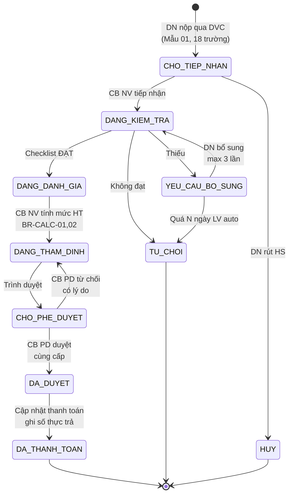
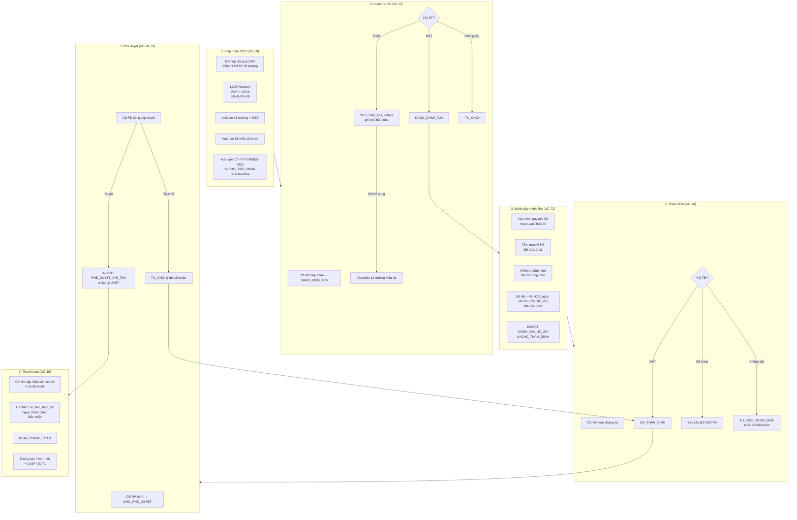
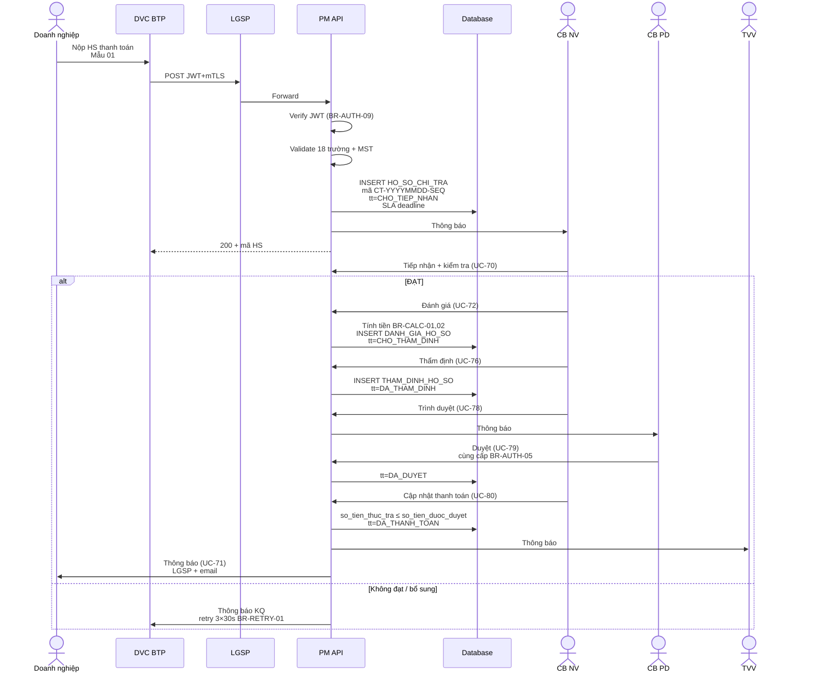

# 06 · FR-06 Chi trả Chi phí Tư vấn

> **Tài liệu gốc**: `docs/requirements/fr-06-chi-tra.md` · **UC range**: UC68-UC80.
> **Vai trò**: Xử lý hồ sơ đề nghị thanh toán chi phí HTPL — tiếp nhận DVC, tự động tính mức hỗ trợ theo quy mô DN, thẩm định, phê duyệt, thanh toán.
> **Nền tảng pháp lý**: NĐ18/2026 (mức hỗ trợ chi phí) · Mẫu 01 NĐ55/2019.

---

## 1. Actors

| Actor | Vai trò |
|---|---|
| DN | Nộp HS đề nghị thanh toán qua DVC |
| HT TTHC BTP (DVC/LGSP) | Inbound qua JWT + mTLS |
| CB NV TW/BN/ĐP | Kiểm tra, đánh giá, thẩm định, trình duyệt, cập nhật thanh toán |
| CB PD TW/BN/ĐP | Phê duyệt hồ sơ (cùng cấp) |
| TVV | Nhận thông báo KQ phê duyệt & thanh toán |

---

## 2. State Machine SM-CHITRA (10 trạng thái)



---

## 3. Luồng nghiệp vụ End-to-End



---

## 4. Công thức tính (BR-CALC-01, BR-CALC-02)

### BR-CALC-01: Mức hỗ trợ theo quy mô DN (NĐ18/2026)

| Quy mô DN (NĐ39/2018) | Mức hỗ trợ | Trần chi phí/năm |
|---|---|---|
| **Siêu nhỏ** | 100% | 3.000.000 VNĐ |
| **Nhỏ** | 30% (tối đa) | 5.000.000 VNĐ |
| **Vừa** | 10% (tối đa) | 10.000.000 VNĐ |

> **Lưu ý**: Địa phương có thể quyết định trần riêng (cấu hình ở UC-10_).

### BR-CALC-02: Công thức tiền được duyệt

```
so_tien_duoc_duyet = MIN(
    so_tien_de_nghi,
    phi_tu_van × muc_ho_tro_%,
    tran_ho_tro_nam − da_chi_trong_nam
)
```

**Edge cases**:
- `phi_tu_van = 0` → `so_tien_duoc_ho_tro = 0` (vẫn cho duyệt).
- Hết trần năm → cảnh báo + cho xử lý tiếp (duyệt = phần còn lại).

---

## 5. Sequence: DVC inbound → thanh toán



---

## 6. Notify DN qua LGSP (UC-71)

```mermaid
flowchart LR
    A[Sau UC-70] --> B[Build payload<br/>mã HS DVC + kết quả + ghi chú]
    B --> C[POST LGSP<br/>→ HT TTHC BTP]
    C --> D{Success?}
    D -->|OK| E[Mark "Đã thông báo"]
    D -->|Timeout| F[Retry 3 lần × 30s<br/>BR-RETRY-01]
    F --> G{Vẫn fail?}
    G -->|Có| H[Log + cảnh báo CB NV<br/>ERR-CT-LGSP-01]
    G -->|OK| E
```

---

## 7. Edge cases & Auto-reject (BR-EC-16)

- **Quá hạn bổ sung**: Cron job — `elapsed > cau_hinh_sla.bo_sung_timeout` → tt=TU_CHOI.
- **Max 3 lần bổ sung**: Đếm `counter_yeu_cau_bs`, ≥3 → TU_CHOI auto.
- **Số thực trả > duyệt**: ERR-CT-TT-02 (chặn validator).

---

## 8. Error codes

| Mã | Mô tả |
|---|---|
| ERR-CT-AUTH-01 | JWT không hợp lệ (401) |
| ERR-CT-02 | Trùng mã HS DVC (409) |
| ERR-CT-DG-02 | Quy mô DN không hợp lệ |
| ERR-CT-PD-03 | Số tiền duyệt bắt buộc |
| ERR-CT-TT-02 | Số tiền thực trả > duyệt |

---

## 9. Tích hợp

| Tích hợp | Chi tiết |
|---|---|
| **FR-07 DN** | Tra quy mô DN (siêu nhỏ/nhỏ/vừa) để áp mức % và trần năm. |
| **FR-05 VV** | HS Chi trả liên kết `vu_viec_id` (VV phải HOAN_THANH mới thanh toán). |
| **FR-14 HĐ TV** | Số thực trả cập nhật tiến độ thanh toán của HĐ tư vấn. |
| **FR-10** | UC-107 danh mục HS đề nghị thanh toán. |
| **FR-11** | UC-138/139/140/141/142 báo cáo chi phí theo chiều. |
