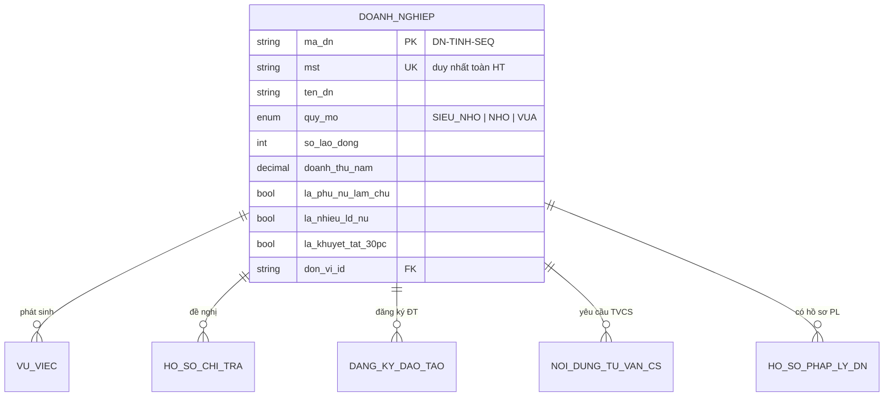
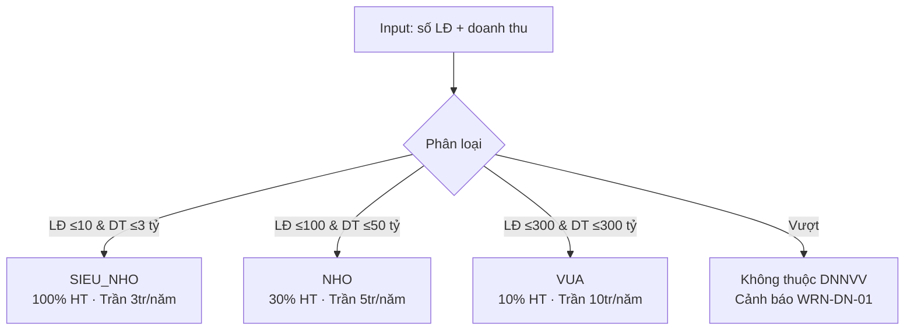
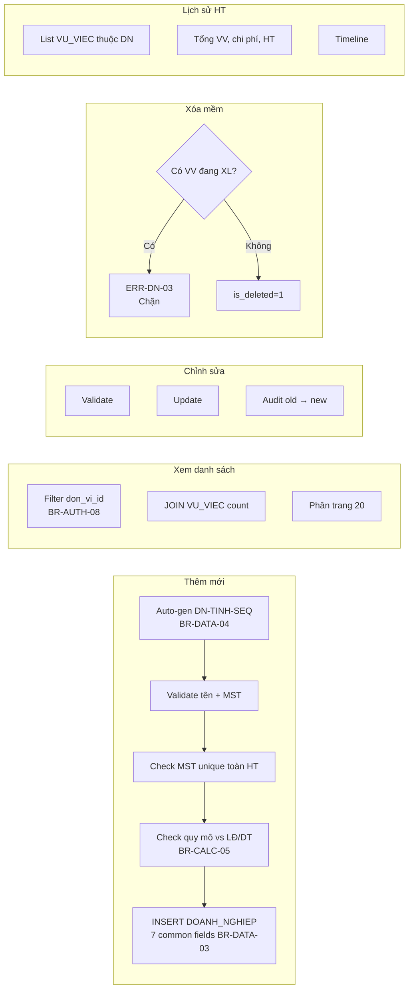
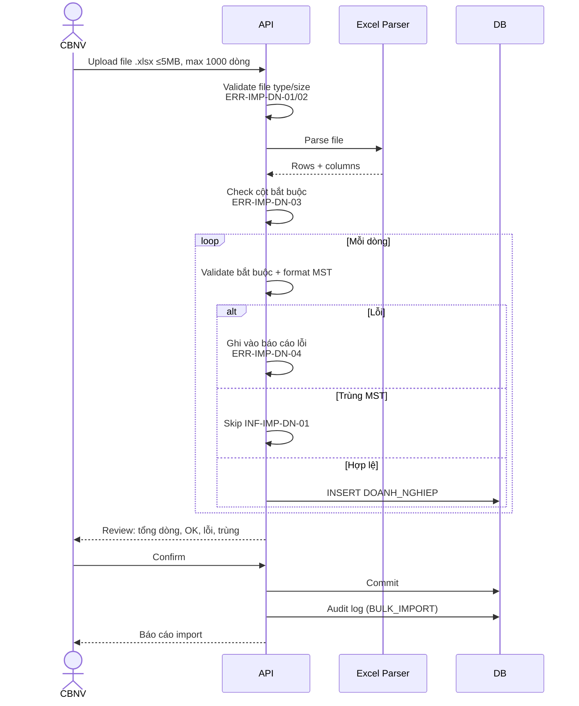

# 07 · FR-07 Quản lý Doanh nghiệp được Hỗ trợ

> **Tài liệu gốc**: `docs/requirements/fr-07-doanh-nghiep.md` · **UC range**: UC81-UC82 + 1 mới (Import Excel).
> **Vai trò**: Lưu trữ hồ sơ DNNVV thụ hưởng chính sách — CRUD, import hàng loạt, phân quy mô NĐ39/2018, xem lịch sử hỗ trợ.

---

## 1. Actors

| Actor | Vai trò |
|---|---|
| CB NV TW/BN/ĐP | CRUD, import, xem lịch sử |
| CB PD TW/BN/ĐP | Xem |
| Hệ thống | Auto-tạo DN (qua UC-53, UC-55, UC-68, UC-74, UC-149, UC-151 upsert theo MST) |

---

## 2. Mô hình dữ liệu

---

## 3. Quy mô DN (BR-CALC-05, NĐ39/2018)

---

## 4. Luồng CRUD (UC-81)

---

## 5. Import Excel (UC-NEW-01)

---

## 6. Tìm kiếm (UC-82)

- Logic **AND** cho các filter: keyword (tên + MST), loại hình, quy mô, đơn vị, khoảng ngày.
- Phân trang 20 (BR-DATA-07) · Full-text search cho tên + MST.

---

## 7. Error codes

| Mã | Mô tả |
|---|---|
| ERR-DN-02 | MST đã tồn tại |
| WRN-DN-01 | Quy mô không khớp LĐ/DT (cảnh báo, không chặn) |
| ERR-DN-03 | Không xóa DN đang có VV xử lý |
| ERR-IMP-DN-02 | File >5MB |

---

## 8. Tích hợp

| Tích hợp | Chi tiết |
|---|---|
| **FR-05 VV** | UC-54 tự động tạo DN nếu MST chưa có khi CB NV nhập thủ công. |
| **FR-06 Chi trả** | UC-72 tra quy mô để áp mức hỗ trợ 100%/30%/10%. |
| **FR-08 Đánh giá** | Lịch sử VV của DN tham gia đợt ĐG. |
| **FR-12 TVCS** | DN upsert theo MST khi inbound TVCS (UC-149). |
| **FR-16** | UC-187/188 Share+Search hồ sơ PL DN (đã ẩn nhạy cảm). |
