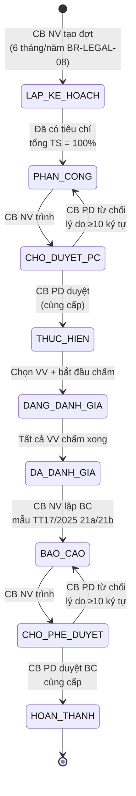
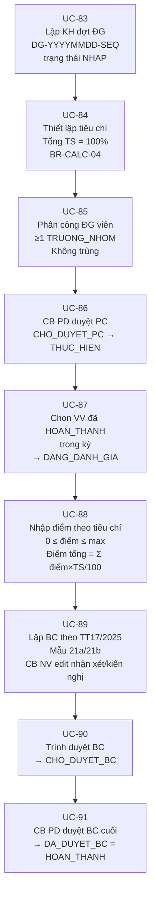
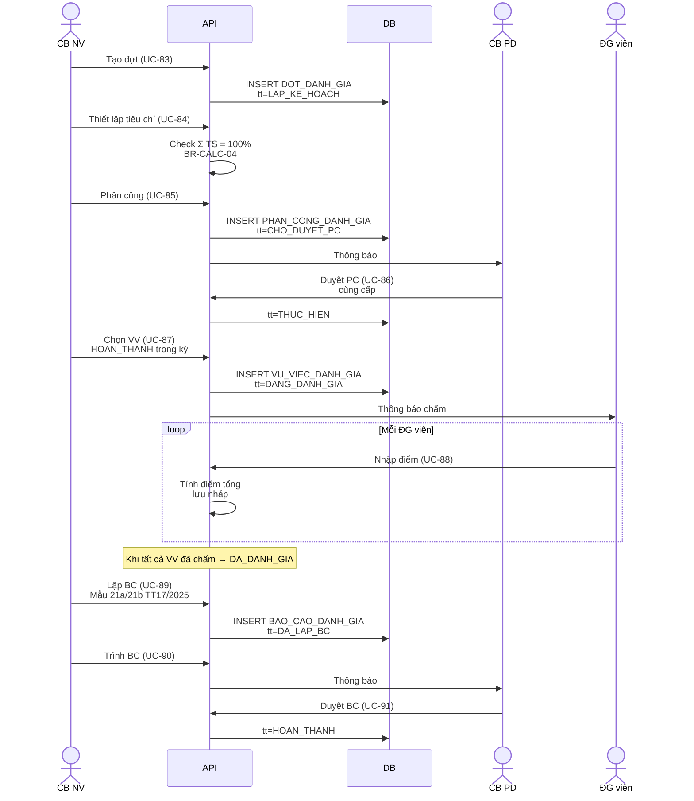

# 08 · FR-08 Đánh giá Hiệu quả Hỗ trợ

> **Tài liệu gốc**: `docs/requirements/fr-08-danh-gia.md` · **UC range**: UC83-UC91.
> **Vai trò**: Đánh giá tổng thể hiệu quả HTPLDN định kỳ (6 tháng/năm), chấm điểm vụ việc theo bộ tiêu chí trọng số 100%, sinh báo cáo TT17/2025 (mẫu 21a/21b).
> **Nền tảng**: TT17/2025 · BR-LEGAL-08 (Sơ bộ 6 tháng + tròn năm, không đột xuất).

---

## 1. Actors

| Actor | Vai trò |
|---|---|
| CB NV TW/BN/ĐP | Lập KH, tiêu chí, chọn VV, phân công ĐG, nhập điểm, lập BC, trình |
| CB PD TW/BN/ĐP | Duyệt phân công, duyệt BC cuối (cùng cấp) |
| Người được phân công (CB NV/CG) | Nhập điểm từng VV, vai trò TRUONG_NHOM hoặc DANH_GIA_VIEN |

---

## 2. State Machine SM-DANHGIA



---

## 3. Luồng 9 bước end-to-end



---

## 4. Công thức điểm (BR-CALC-04)

```
điểm_tổng_VV = Σ (điểm_tiêu_chí_i × trọng_số_i / 100)
```

Ràng buộc:
- `0 ≤ điểm_i ≤ thang_diem_max` của tiêu chí
- Tổng trọng số ALL tiêu chí = 100% (cảnh báo nếu khác; cho phép lưu nháp)

---

## 5. Sequence đầy đủ



---

## 6. Quy tắc quan trọng

- **Không có đánh giá đột xuất** — BR-LEGAL-08, chỉ 6 tháng + năm.
- **Cùng cấp duyệt** — UC-86, UC-91 (BR-AUTH-05).
- **Tổng trọng số 100%** — cảnh báo WRN-DG-TC-01 nếu khác; hard-block khi chấm điểm ERR-DG-TC-01.
- **VV thuộc đợt khác** — cảnh báo WRN-DG-VV-01 nhưng vẫn cho chọn.

---

## 7. Error codes

| Mã | Mô tả |
|---|---|
| ERR-DG-TC-01 | Tổng trọng số != 100% (UC-84, UC-88) |
| ERR-DG-PC-02 | Cần ≥1 TRUONG_NHOM |
| ERR-DG-PD-02 | Lý do từ chối ≥10 ký tự |
| WRN-DG-VV-01 | Không có VV HOAN_THANH trong kỳ |

---

## 8. Tích hợp

| Tích hợp | Chi tiết |
|---|---|
| **FR-05 VV** | VV HOAN_THANH trong kỳ → eligible cho đợt ĐG. |
| **FR-10** | UC-109 danh mục tiêu chí đánh giá (trọng số). |
| **FR-11** | UC-132 Báo cáo đánh giá hiệu quả HTPL (dùng lại đợt ĐG). |
| **FR-16** | UC-179/180 Share+Search DOT_DANH_GIA (chỉ DA_DUYET_BC). |
| **Dashboard FR-01** | UC-8 biểu đồ kết hợp cột + đường hiệu quả HTPL. |
