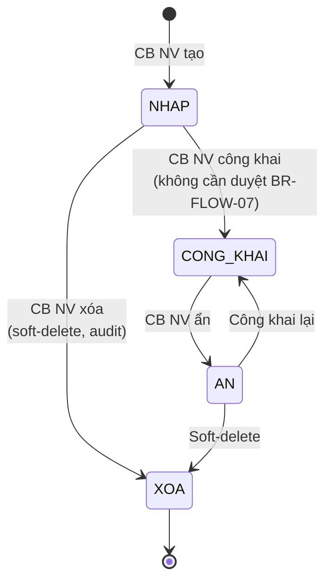
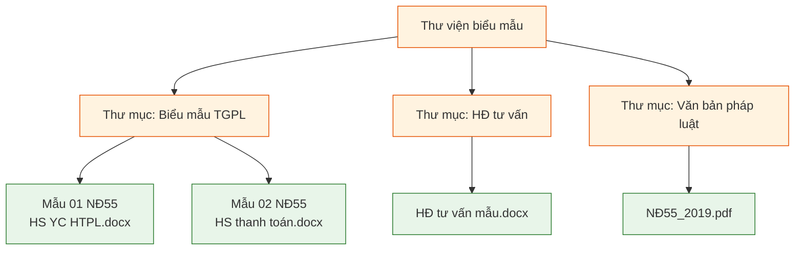
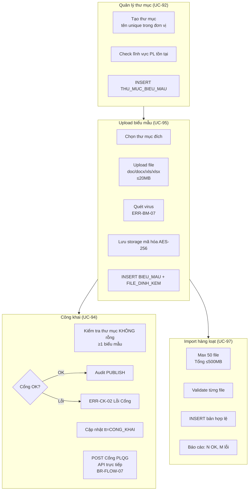
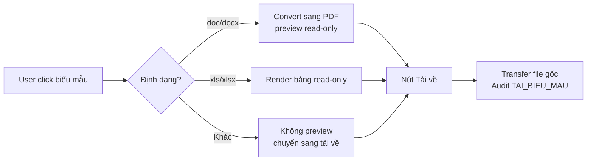
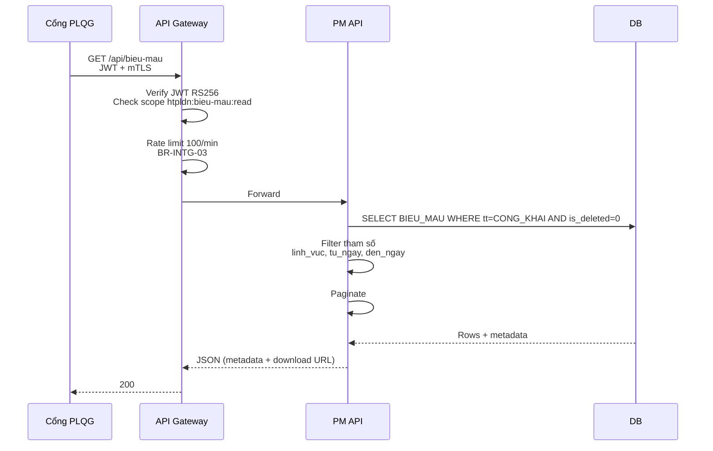

# 09 · FR-09 Thư viện Biểu mẫu & Hợp đồng

> **Tài liệu gốc**: `docs/requirements/fr-09-bieu-mau.md` · **UC range**: UC92-UC98.
> **Vai trò**: Kho tài liệu mẫu (thư mục cây) — biểu mẫu TGPL, HĐ tư vấn mẫu. Công khai TRỰC TIẾP lên Cổng PLQG **không cần phê duyệt** (CB NV tự chịu trách nhiệm — BR-FLOW-07).

---

## 1. Actors

| Actor | Vai trò |
|---|---|
| CB NV TW/BN/ĐP | CRUD thư mục/biểu mẫu, import hàng loạt, công khai/ẩn, upload file |
| CB PD TW/BN/ĐP | Xem (không phê duyệt tư liệu) |
| DN / NHT | Xem + tải về qua Cổng |
| Cổng PLQG | Pull 18 API chia sẻ biểu mẫu (UC-181/182) |

---

## 2. State Machine SM-BIEUMAU

---

## 3. Sơ đồ thư mục cây (Hierarchical)

---

## 4. Luồng nghiệp vụ chính

---

## 5. Preview & Download (UC-95 alt)

---

## 6. Sequence: Cổng PLQG pull biểu mẫu (UC-98)

---

## 7. Error codes

| Mã | Mô tả |
|---|---|
| ERR-TM-02 | Thư mục chứa N biểu mẫu, không thể xóa |
| ERR-CK-01 | Thư mục rỗng không thể công khai |
| ERR-BM-01 | Chỉ chấp nhận doc/docx/xls/xlsx |
| ERR-BM-07 | Nhiễm virus mã độc |
| ERR-IMP-02 | Tối đa 50 file/lần |

---

## 8. Tích hợp

| Tích hợp | Chi tiết |
|---|---|
| **FR-16** | UC-181/182 API Share+Search biểu mẫu. Chỉ trả về CONG_KHAI. |
| **FR-12 TVCS** | Tư liệu pháp lý VV có cùng pattern: công khai trực tiếp (BR-FLOW-07). |
| **FR-03** | FR-III-20 xuất docx/PDF ký số cho CTDT dùng template từ thư viện. |
| **FR-10** | UC-99 Lĩnh vực PL. |
