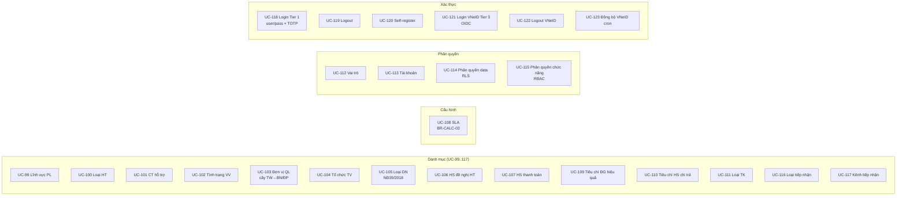
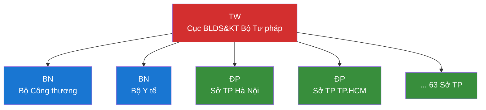
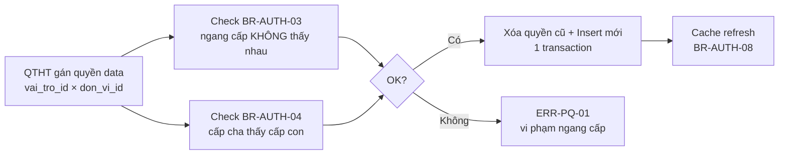
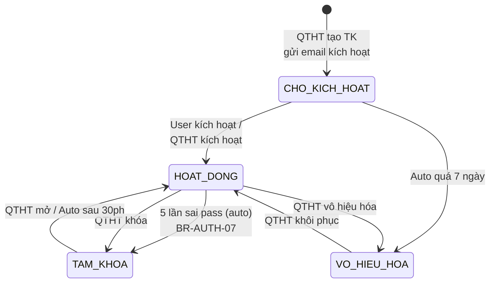
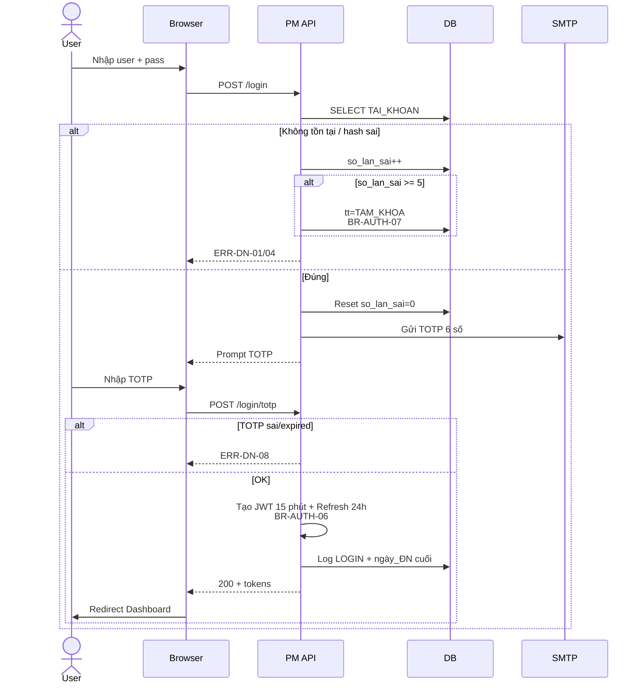
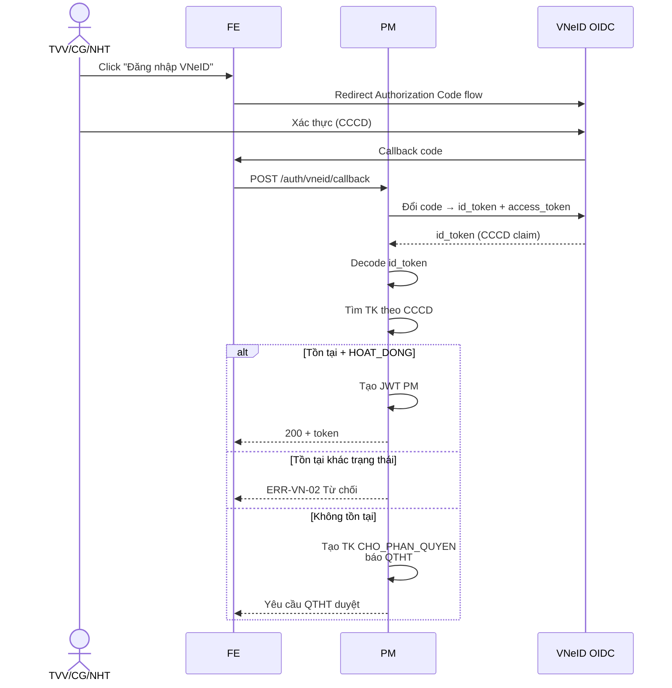
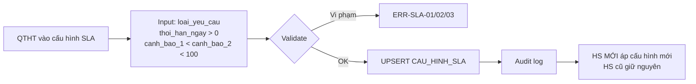
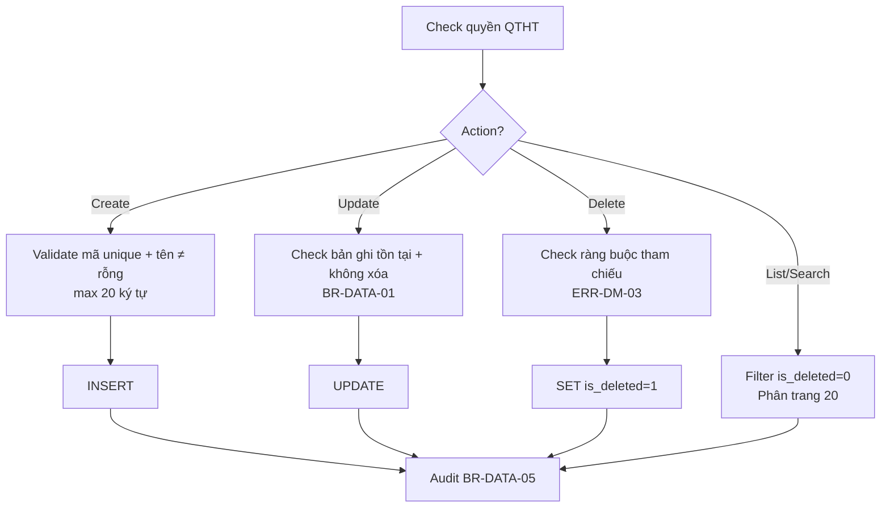

# 10 · FR-10 Quản trị Hệ thống

> **Tài liệu gốc**: `docs/requirements/fr-10-quan-tri.md` · **UC range**: UC99-UC123.
> **Vai trò**: Nền tảng cấu hình — 15 loại danh mục · tài khoản/vai trò/phân quyền (RBAC + RLS) · SLA · SSO VNeID (3 Tier) · AUDIT_LOG.

---

## 1. Actors

| Actor | Quyền |
|---|---|
| QTHT | TOÀN BỘ: CRUD danh mục, TK, vai trò, phân quyền, SLA, VNeID |
| Mọi user | UC-118 Đăng nhập · UC-119 Đăng xuất |
| User chưa có TK | UC-120 Self-register (NHT/TVV/CG) |
| TVV/CG/NHT | UC-121 Đăng nhập VNeID · UC-122 Đăng xuất VNeID |
| Hệ thống (Cron) | UC-123 Đồng bộ TK VNeID |

---

## 2. Nhóm chức năng (25 UC)

---

## 3. Cây đơn vị phân cấp (UC-103, BR-AUTH-02)

Ràng buộc (ERR-DV-05): KHÔNG tạo vòng lặp trong cây.

---

## 4. Phân quyền dữ liệu RLS (UC-114)

---

## 5. State Machine SM-TAIKHOAN

---

## 6. Sequence: Đăng nhập Tier 1 (UC-118)

---

## 7. Sequence: Đăng nhập VNeID Tier 3 (UC-121)

---

## 8. Cấu hình SLA (UC-108, BR-SLA-01/02)

4 mức cảnh báo (BR-SLA-02):
- `> 50%` = BINH_THUONG (Xanh)
- `≤ 50%` = SAP_HET (Vàng)
- `> 100%` = QUA_HAN (Đỏ)
- `> 2x` = QUA_HAN_NGHIEM_TRONG (Đen)

---

## 9. Tổng hợp các Template CRUD (TPL-DM-CRUD)

Tất cả 14 danh mục (UC-99..107, UC-109..111, UC-116, UC-117) tuân theo cùng 1 template:

---

## 10. Error codes quan trọng

| Mã | Mô tả |
|---|---|
| ERR-AUTH-01 | Không có quyền (403) |
| ERR-DM-03 | Đang được tham chiếu, không xóa |
| ERR-DV-05 | Vòng lặp cây đơn vị |
| ERR-DN-04 | TK bị khóa do sai >5 lần |
| ERR-PQ-01 | Vi phạm ngang cấp |
| ERR-VN-02 | CCCD không có TK |

---

## 11. Tích hợp

| Tích hợp | Chi tiết |
|---|---|
| **ALL modules** | Danh mục dùng chung (lĩnh vực, tình trạng, loại...). |
| **FR-05, FR-06, FR-02** | UC-108 cấu hình SLA trung tâm. |
| **FR-16** | JWT issuer `htpldn.moj.gov.vn` tạo ở UC-118/UC-121. |
