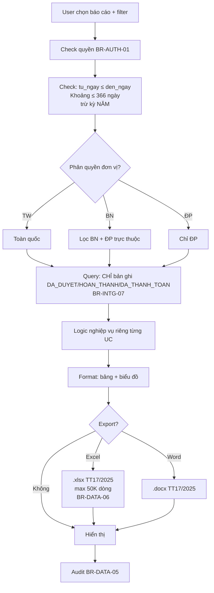
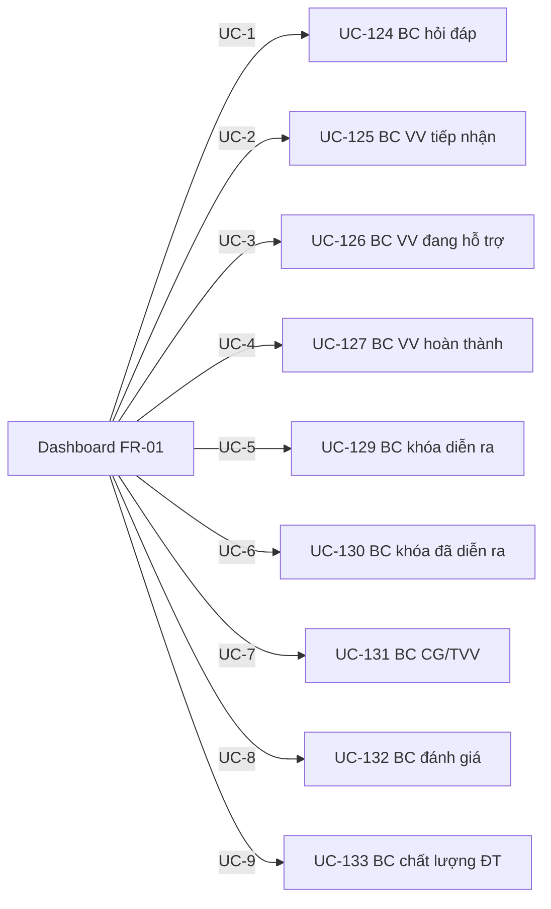

# 11 · FR-11 Báo cáo Thống kê

> **Tài liệu gốc**: `docs/requirements/fr-11-bao-cao.md` · **UC range**: UC124-UC146.
> **Vai trò**: 23 báo cáo điều hành theo TT17/2025 — theo thời gian/lĩnh vực/đơn vị/loại DN. Tất cả kế thừa template **TPL-REPORT-FULL**.

---

## 1. Ma trận 23 báo cáo

| # | UC | Tên báo cáo | Entity | Định dạng biểu đồ |
|---|---|---|---|---|
| 1 | UC-124 | Số lượng hỏi đáp/vướng mắc | HOI_DAP | Donut + Trend |
| 2 | UC-125 | VV đã tiếp nhận | VU_VIEC | Bar + Trend |
| 3 | UC-126 | VV đang hỗ trợ (snapshot) | VU_VIEC | Bar snapshot |
| 4 | UC-127 | VV hoàn thành | VU_VIEC | Bar + Donut |
| 5 | UC-128 | VV theo thời gian | VU_VIEC | Line chart |
| 6 | UC-129 | Lớp đào tạo đang diễn ra | KHOA_HOC | Snapshot |
| 7 | UC-130 | Lớp ĐT đã diễn ra | KHOA_HOC | Bar |
| 8 | UC-131 | Số lượng CG/TVV | TU_VAN_VIEN | Snapshot |
| 9 | UC-132 | Đánh giá hiệu quả HTPL | DOT_DANH_GIA | Weighted |
| 10 | UC-133 | Chất lượng đào tạo | KET_QUA_HOC_TAP | Tỷ lệ + TB |
| 11 | UC-134 | VV theo đơn vị | VV × DV | Stacked bar |
| 12 | UC-135 | VV theo lĩnh vực | VV × Lĩnh vực | Cross-tab |
| 13 | UC-136 | VV theo loại DN | VV × DN.quy_mo | Cross-tab |
| 14 | UC-137 | VV theo thời gian chi tiết | VV × Kỳ × Trạng thái | Stacked bar trend |
| 15 | UC-138 | Chi phí chi trả | HO_SO_CHI_TRA | Tổng tiền |
| 16 | UC-139 | Chi phí theo đơn vị | CP × DV | Cross-tab |
| 17 | UC-140 | Chi phí theo lĩnh vực | CP × Lĩnh vực | Bar |
| 18 | UC-141 | Chi phí theo loại DN | CP × Quy mô | Compare trần NĐ55 |
| 19 | UC-142 | Chi phí theo thời gian | CP × Kỳ | Line chart |
| 20 | UC-143 | Số lượng CT hỗ trợ | CHUONG_TRINH_HTPL | Bar |
| 21 | UC-144 | CT theo đơn vị | CT × DV | Cross-tab + Ngân sách |
| 22 | UC-145 | CT theo lĩnh vực | CT × Lĩnh vực + DN | Bar |
| 23 | UC-146 | CT theo thời gian | CT × Kỳ | Line chart |

---

## 2. Template luồng chung TPL-REPORT-FULL

---

## 3. Quy tắc dữ liệu

- **Chỉ đếm bản ghi đã duyệt** — trạng thái cuối cùng (DA_DUYET / HOAN_THANH / DA_THANH_TOAN / DA_CONG_KHAI).
- **Phân quyền đơn vị**: TW thấy toàn quốc · BN thấy BN + ĐP trực thuộc · ĐP chỉ thấy ĐP.
- **Giới hạn khoảng thời gian**: ≤ 366 ngày (trừ kỳ NĂM).
- **Export tối đa**: 50.000 dòng. Vượt → cắt + WRN-RPT-01.

---

## 4. Error codes chung

| Mã | Mô tả |
|---|---|
| ERR-RPT-01 | Ngày bắt đầu > ngày kết thúc |
| ERR-RPT-02 | Khoảng > 1 năm (trừ kỳ NĂM) |
| ERR-RPT-03 | Query timeout |
| ERR-RPT-05 | Không có quyền xem BC |
| WRN-RPT-01 | Vượt 50K dòng, cắt |
| INF-RPT-01 | Không có dữ liệu kỳ |

---

## 5. Tích hợp

| Tích hợp | Chi tiết |
|---|---|
| **ALL modules nghiệp vụ** | Nguồn dữ liệu từ 15+ entity chính. |
| **FR-01 Dashboard** | Drill-down từ KPI (9 thẻ + 2 biểu đồ) dẫn tới BC chi tiết tương ứng. |
| **FR-08 Đánh giá** | UC-132 dùng kết quả đợt đánh giá. |
| **FR-15 CT HTPLDN** | UC-143..146 dùng BC CT. |

---

## 6. Sơ đồ drill-down từ Dashboard

