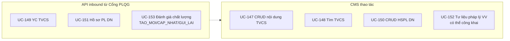
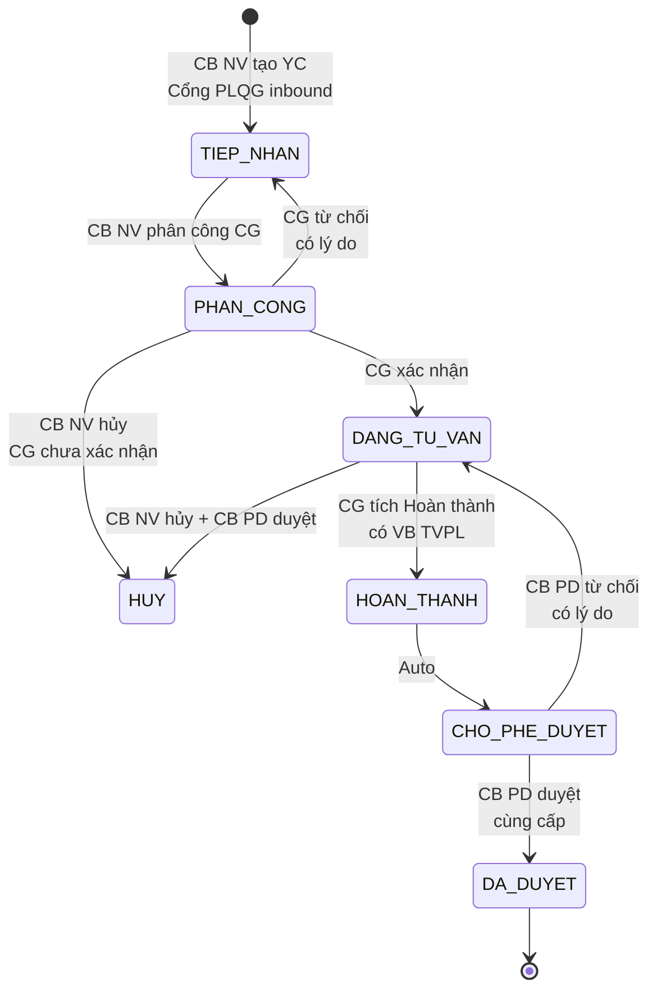
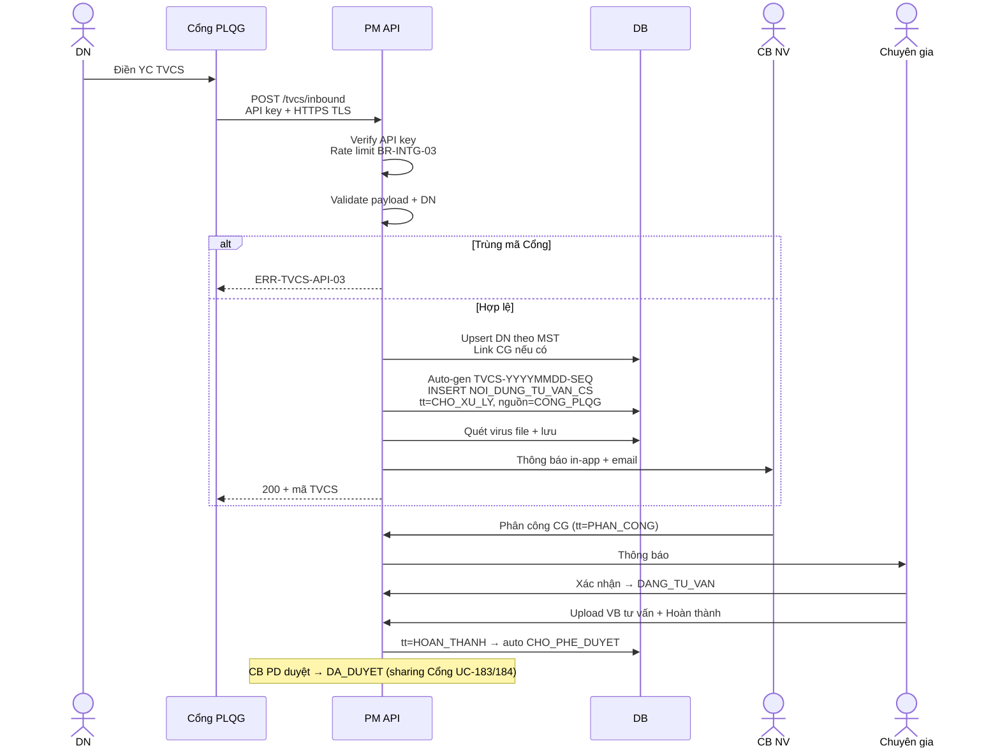
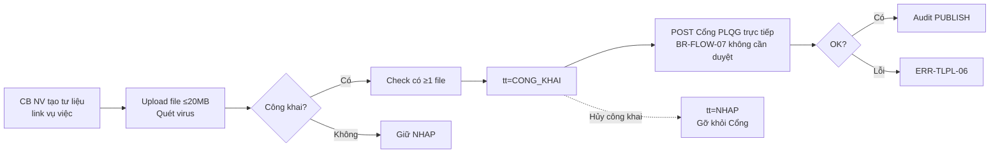
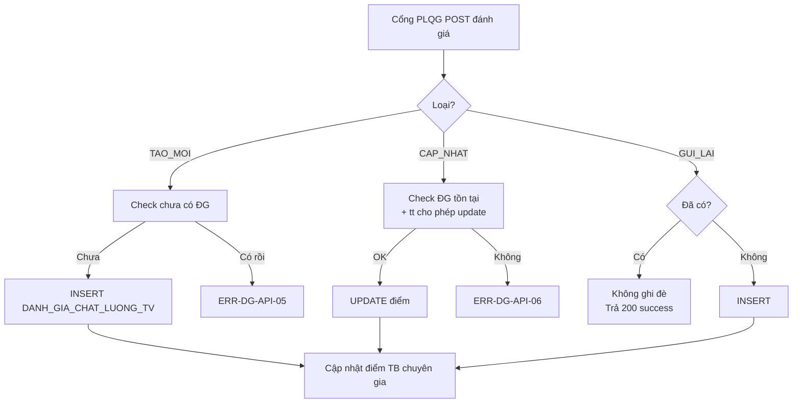
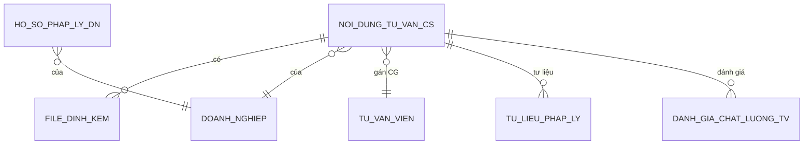

# 12 · FR-12 Tư vấn Chuyên sâu (TVCS)

> **Tài liệu gốc**: `docs/requirements/fr-12-tv-chuyen-sau.md` · **UC range**: UC147-UC153.
> **Vai trò**: Quản lý phiên tư vấn chuyên sâu 1-1 với chuyên gia, tiếp nhận inbound từ Cổng PLQG, lưu trữ hồ sơ pháp lý DN + kho tư liệu pháp lý vụ việc, nhận đánh giá chất lượng.

---

## 1. Actors

| Actor | Vai trò |
|---|---|
| CB NV TW/BN/ĐP | CRUD nội dung TVCS, gán chuyên gia, công khai tư liệu |
| CB PD TW/BN/ĐP | Phê duyệt (khi cần) |
| NHT | Xem + cập nhật tư liệu pháp lý |
| CG (Chuyên gia) | Xác nhận phân công, tư vấn, upload VB tư vấn |
| DN | Xem qua Cổng (không đăng nhập CMS) |
| Cổng PLQG (inbound) | 3 API inbound: yêu cầu TVCS, hồ sơ PL DN, đánh giá chất lượng |

---

## 2. Use-case Map

---

## 3. State Machine SM-TVCS

---

## 4. Sequence: Inbound YC TVCS (UC-149)

---

## 5. Quản lý tư liệu pháp lý VV (UC-152)

---

## 6. Idempotency đánh giá (UC-153)

---

## 7. Entity chính

---

## 8. Error codes

| Mã | Mô tả |
|---|---|
| ERR-TVCS-API-03 | Mã Cổng trùng |
| ERR-TVCS-04 | Chuyển trạng thái không hợp lệ |
| ERR-DG-API-03 | Điểm ngoài 1-5 |
| ERR-TLPL-05 | Công khai tư liệu thiếu file |

---

## 9. Tích hợp

| Tích hợp | Chi tiết |
|---|---|
| **FR-04 CG** | Gán chuyên gia. Cập nhật điểm TB CG sau ĐG. |
| **FR-07 DN** | Upsert DN theo MST khi inbound. |
| **FR-09** | Cùng pattern công khai trực tiếp BR-FLOW-07. |
| **FR-16** | UC-183/184 Share+Search TVCS (chỉ metadata, không VB tư vấn chi tiết). |
