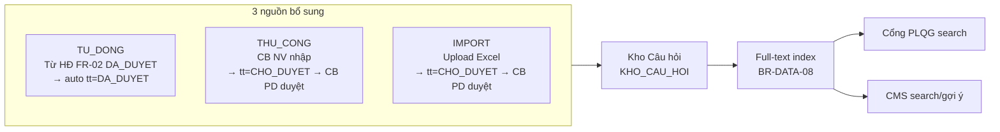
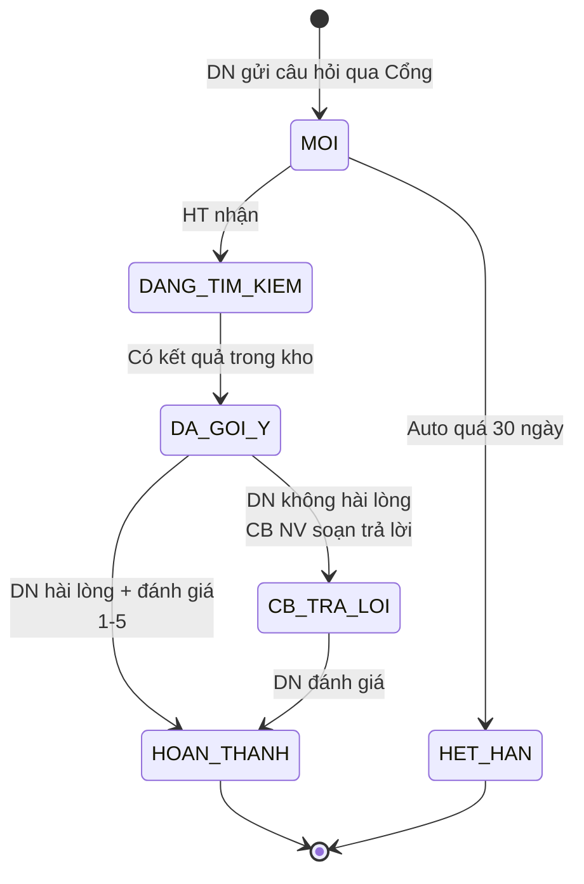
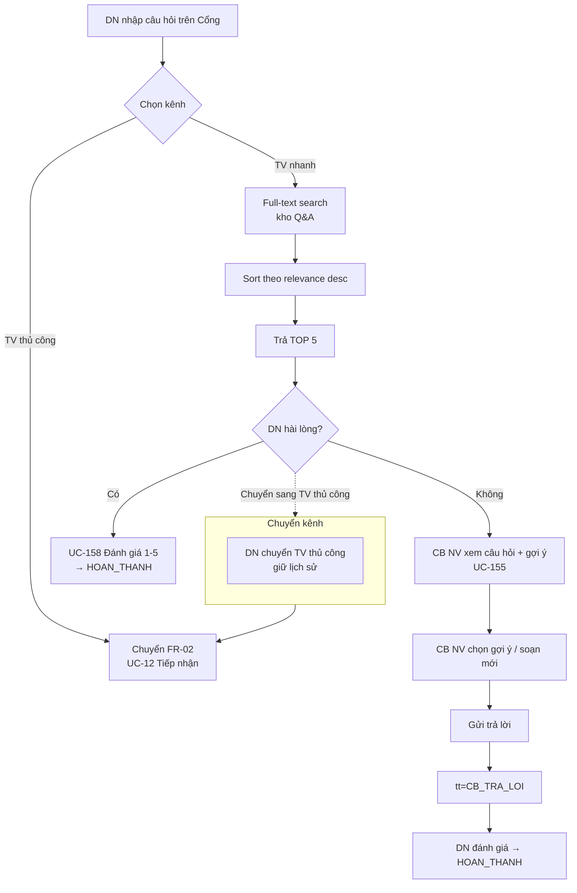
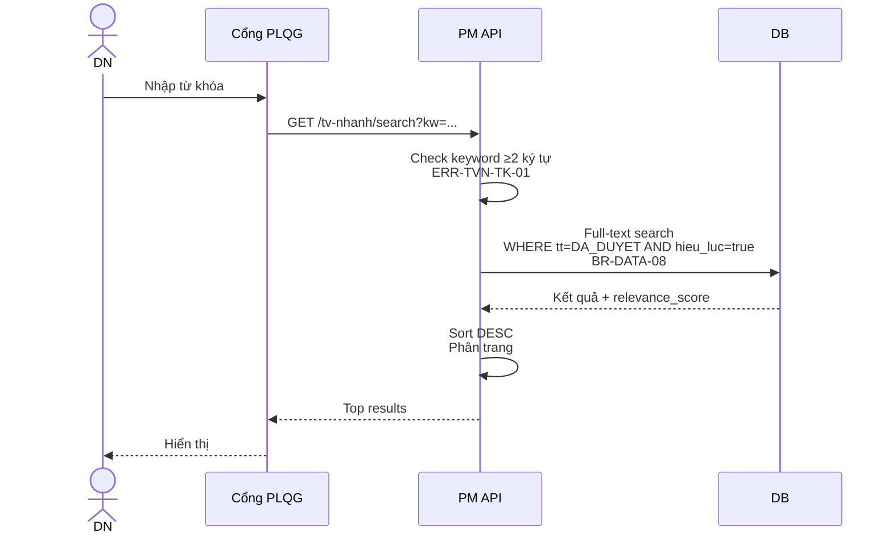
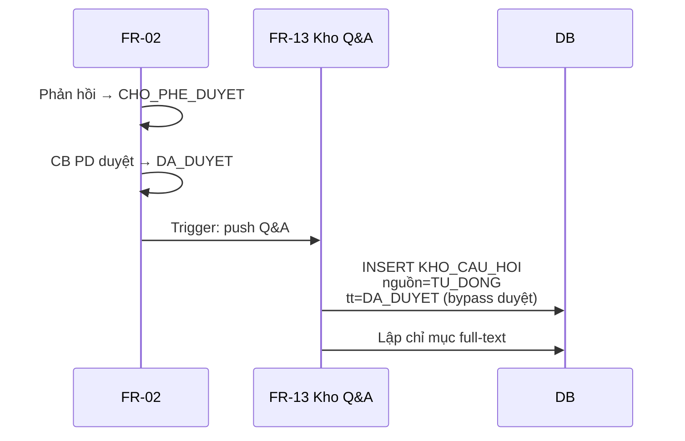

# 13 · FR-13 Tư vấn Nhanh

> **Tài liệu gốc**: `docs/requirements/fr-13-tv-nhanh.md` · **UC range**: UC154-UC158.
> **Vai trò**: Tra cứu nhanh pháp luật — kho câu hỏi-đáp (Q&A) + Full-text search (top-5 câu trả lời) + đánh giá chất lượng từ DN.

---

## 1. Actors

| Actor | Vai trò |
|---|---|
| CB NV TW/BN/ĐP | CRUD kho Q&A, soạn trả lời |
| CB PD TW/BN/ĐP | Phê duyệt Q&A nguồn thủ công/import |
| DN | Gửi câu hỏi, tìm kiếm, đánh giá qua Cổng PLQG |
| Hệ thống | Bổ sung kho Q&A tự động từ FR-02 (hỏi đáp đã duyệt) |

---

## 2. Kho Q&A — 3 nguồn bổ sung (BR-FLOW-10)

---

## 3. State Machine SM-TVNHANH (phiên tư vấn)

---

## 4. Luồng chính: DN tìm/hỏi (UC-155, UC-156)

---

## 5. Sequence: DN tìm kiếm (UC-157)

---

## 6. Bổ sung kho TỰ ĐỘNG từ FR-02

---

## 7. Error codes

| Mã | Mô tả |
|---|---|
| ERR-KHO-01 | Câu hỏi bắt buộc |
| ERR-TVN-01 | Kho Q&A rỗng |
| ERR-TVN-TK-01 | Từ khóa < 2 ký tự |
| ERR-DG-TVN-01 | Điểm ngoài 1-5 |

---

## 8. Tích hợp

| Tích hợp | Chi tiết |
|---|---|
| **FR-02** | HĐ DA_DUYET → auto bổ sung Q&A (BR-FLOW-10). |
| **FR-16** | Có thể expose search qua API trực tiếp cho consumer khác. |
| **FR-10** | UC-99 lĩnh vực PL để tag câu hỏi. |
