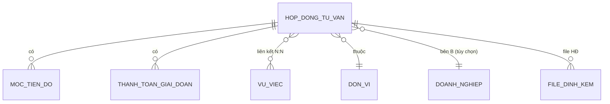
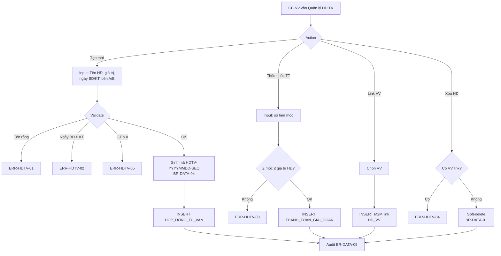
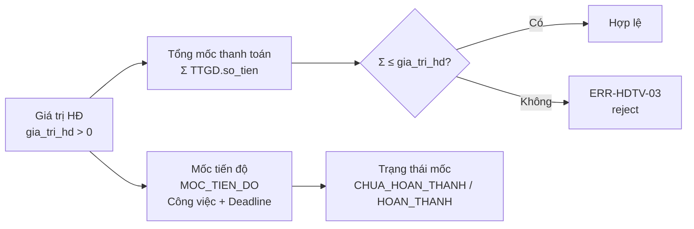
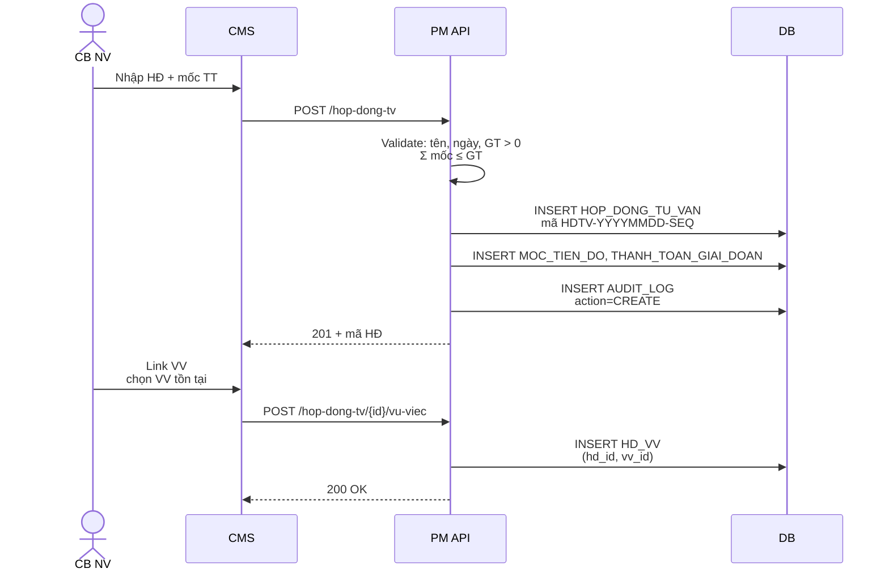
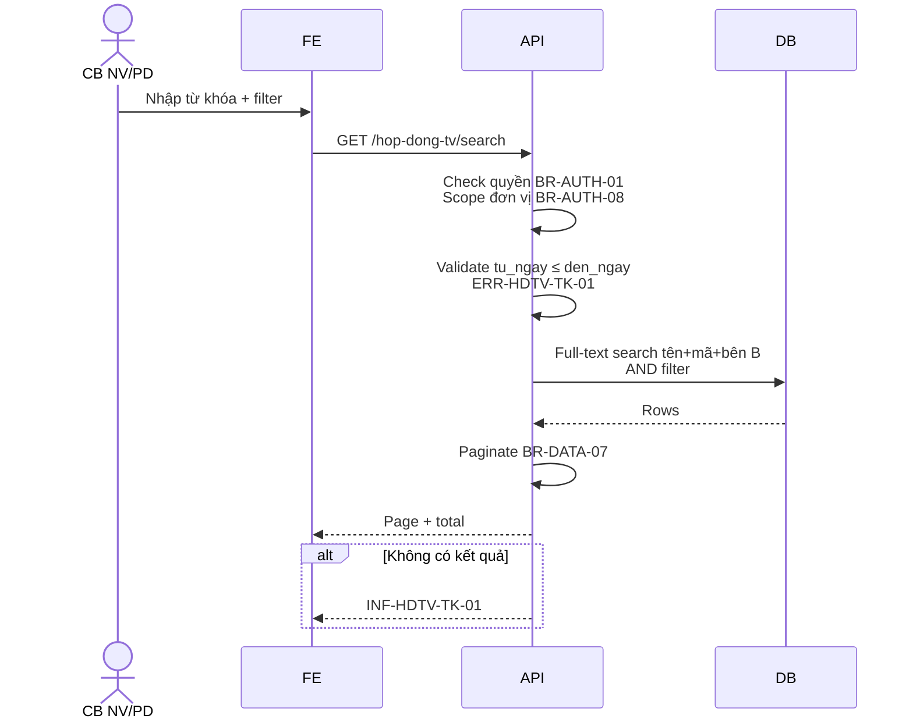

# 14 · FR-14 Hợp đồng Tư vấn (HĐ TV)

> **Tài liệu gốc**: `docs/requirements/fr-14-hop-dong-tv.md` · **UC range**: UC159, UC159e.
> **Vai trò**: Quản lý hợp đồng tư vấn pháp lý giữa cơ quan QLNN/tổ chức TV và DN — có N:N liên kết Vụ việc, có mốc tiến độ và thanh toán giai đoạn. **Không có vòng đời phê duyệt** (CRUD thuần).

---

## 1. Actors

| Actor | Vai trò |
|---|---|
| CB NV TW/BN/ĐP | CRUD HĐ tư vấn, thêm mốc tiến độ, mốc thanh toán, gán VV |
| CB PD TW/BN/ĐP | Xem & tìm kiếm (không phê duyệt — HĐ không có duyệt) |

---

## 2. Entity chính

---

## 3. Luồng nghiệp vụ chính (UC-159)

---

## 4. Ràng buộc tiền tệ (BR-DATA — HĐ)

---

## 5. Sequence: Tạo HĐ + Link VV

---

## 6. Sequence: Tìm kiếm HĐ (UC-159e)

---

## 7. Error codes

| Mã | Mô tả |
|---|---|
| ERR-HDTV-01 | Tên HĐ bắt buộc |
| ERR-HDTV-02 | Ngày BD > KT |
| ERR-HDTV-03 | Σ thanh toán > giá trị HĐ |
| ERR-HDTV-04 | Không xóa HĐ có VV liên kết |
| ERR-HDTV-05 | Giá trị HĐ ≤ 0 |
| ERR-HDTV-TK-01 | Ngày BD > KT khi tìm |
| INF-HDTV-TK-01 | Không tìm thấy HĐ |

---

## 8. Tích hợp

| Tích hợp | Chi tiết |
|---|---|
| **FR-05 VV** | N:N — 1 HĐ có nhiều VV, 1 VV có nhiều HĐ. |
| **FR-07 DN** | Bên B (tùy chọn) là DOANH_NGHIEP. |
| **FR-10** | UC-103 ĐƠN VỊ quản lý. |
| **FR-11** | UC-138..142 BC chi phí sử dụng HĐ để gộp tổng. |

---

## 9. Ghi chú

- **KHÔNG có state machine**: HĐ TV chỉ có các status field đơn giản (DANG_THUC_HIEN, HOAN_THANH, THANH_LY), không có flow CHO_PHE_DUYET → DA_DUYET.
- **Không chia sẻ qua Cổng PLQG**: HĐ TV không nằm trong 18 API FR-16 (dữ liệu riêng tư pháp lý).
- **Xóa chặn bởi ràng buộc**: Xóa HĐ không thành công nếu còn VV liên kết (ERR-HDTV-04) — nguyên tắc bảo toàn dữ liệu trace.
