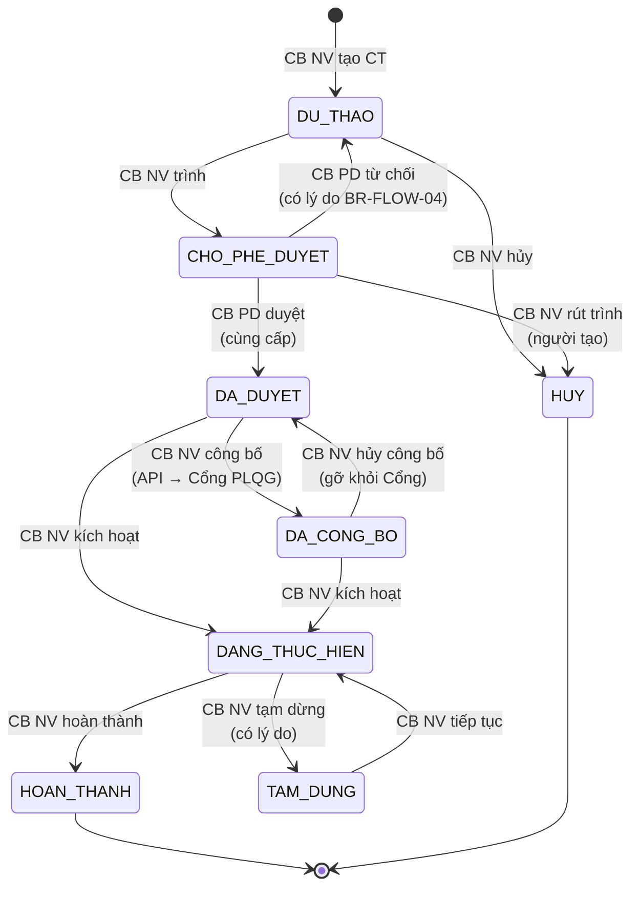
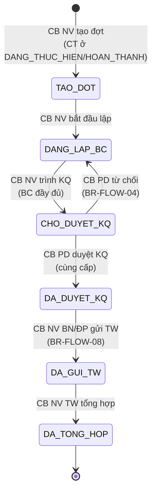
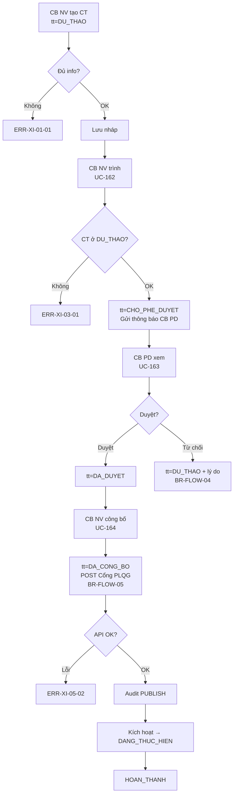
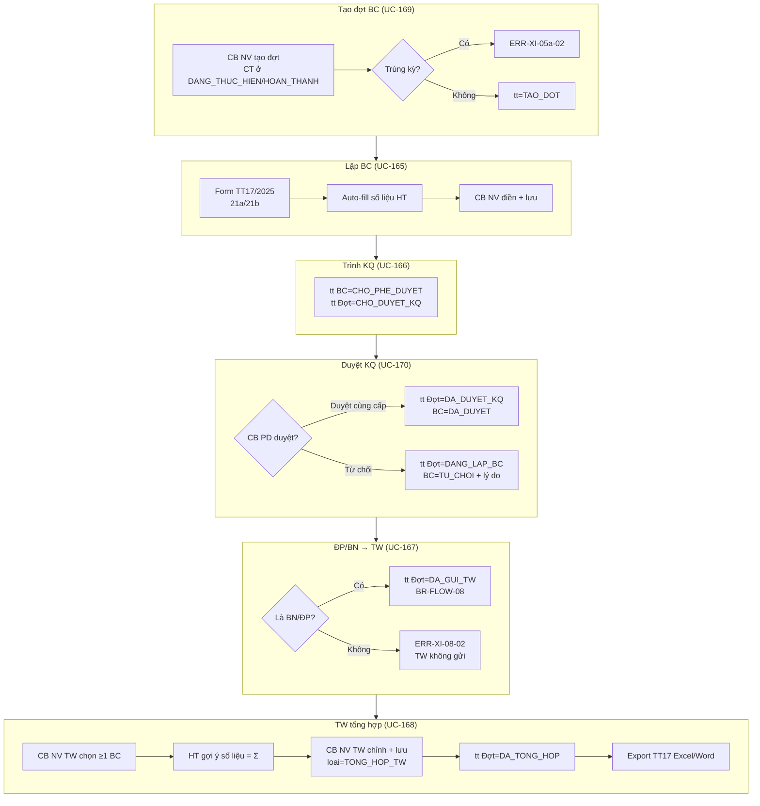
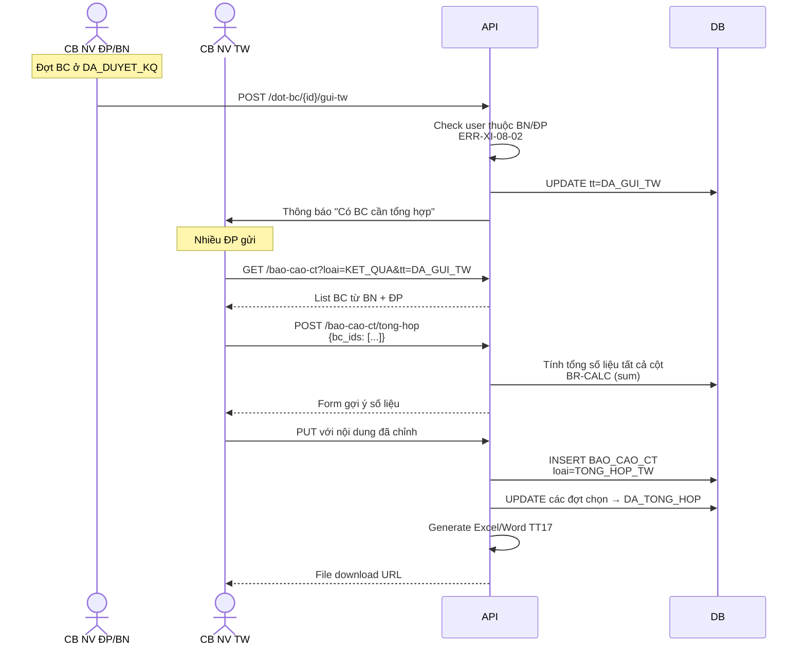
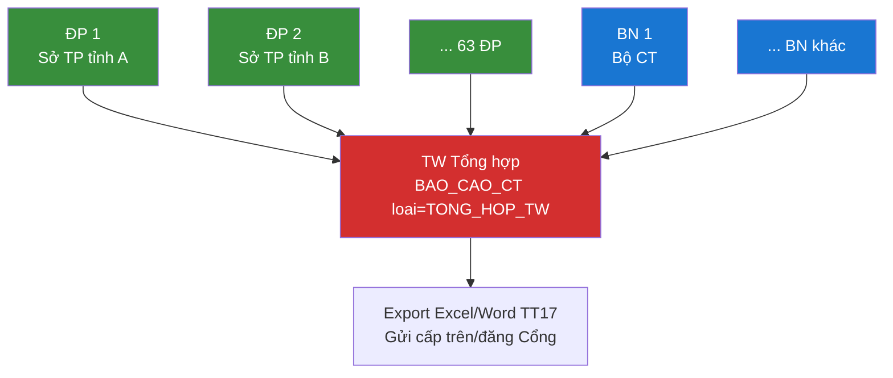

# 15 · FR-15 Chương trình HTPLDN

> **Tài liệu gốc**: `docs/requirements/fr-15-ct-htpldn.md` · **UC range**: UC160-UC170.
> **Vai trò**: Quản lý toàn vòng đời CT hỗ trợ pháp lý — kế hoạch → phê duyệt → công bố → thực hiện → báo cáo kết quả theo kỳ → ĐP/BN gửi TW tổng hợp (BR-FLOW-08). Hai state machine: **SM-KH-CTHTPL** (kế hoạch) và **SM-DOT-BC** (đợt báo cáo).

---

## 1. Actors

| Actor | Vai trò |
|---|---|
| CB NV TW/BN/ĐP | Tạo CT, trình duyệt, công bố, lập BC, gửi TW tổng hợp |
| CB PD TW/BN/ĐP | Phê duyệt CT, phê duyệt BC KQ (cùng cấp BR-AUTH-05) |
| CB NV TW | Tổng hợp BC từ BN + ĐP (UC-168) |
| Cổng PLQG | Nhận API `POST /ct-htpl` công bố/hủy (BR-FLOW-05) |

---

## 2. State Machine SM-KH-CTHTPL (Kế hoạch CT)

---

## 3. State Machine SM-DOT-BC (Đợt báo cáo CT)

---

## 4. Luồng chính: CT kế hoạch → công bố

---

## 5. Luồng báo cáo theo kỳ (UC-165..170)

---

## 6. Sequence: ĐP gửi BC lên TW tổng hợp (BR-FLOW-08)

---

## 7. BR-FLOW-08 — Phân cấp BC

---

## 8. Error codes

| Mã | Mô tả |
|---|---|
| ERR-XI-01-01 | Thiếu trường bắt buộc |
| ERR-XI-01-02 | Sửa CT không ở DU_THAO |
| ERR-XI-04-03 | CB PD khác cấp |
| ERR-XI-05-02 | Lỗi API Cổng PLQG |
| ERR-XI-05a-02 | Đợt BC trùng kỳ |
| ERR-XI-07a-03 | CB PD khác cấp (BC) |
| ERR-XI-08-02 | Chỉ BN/ĐP gửi TW |
| ERR-XI-09-02 | Chỉ TW tổng hợp |
| WRN-XI-09-01 | BC schema cũ cần convert |

---

## 9. Tích hợp

| Tích hợp | Chi tiết |
|---|---|
| **FR-16** | UC-185/186 Share+Search CT chỉ trả CT ở `DA_CONG_BO`. |
| **FR-11** | UC-143..146 báo cáo theo CT/đơn vị/lĩnh vực dùng chung data CHUONG_TRINH_HTPL. |
| **FR-10** | UC-101 danh mục loại CT hỗ trợ · UC-103 cây đơn vị cho BR-FLOW-08. |
| **FR-01** | Dashboard theo dõi CT đang thực hiện. |
