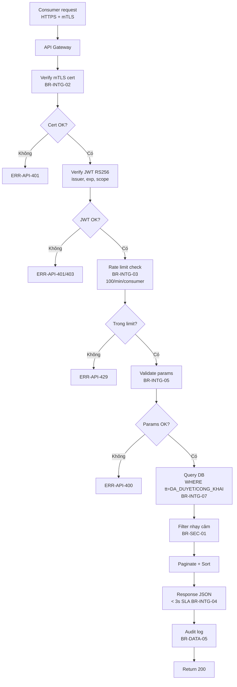
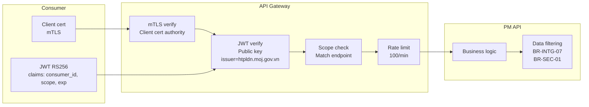
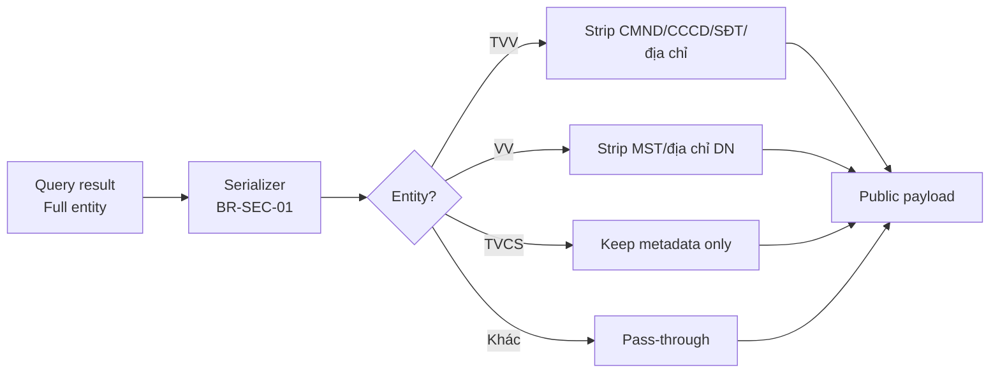
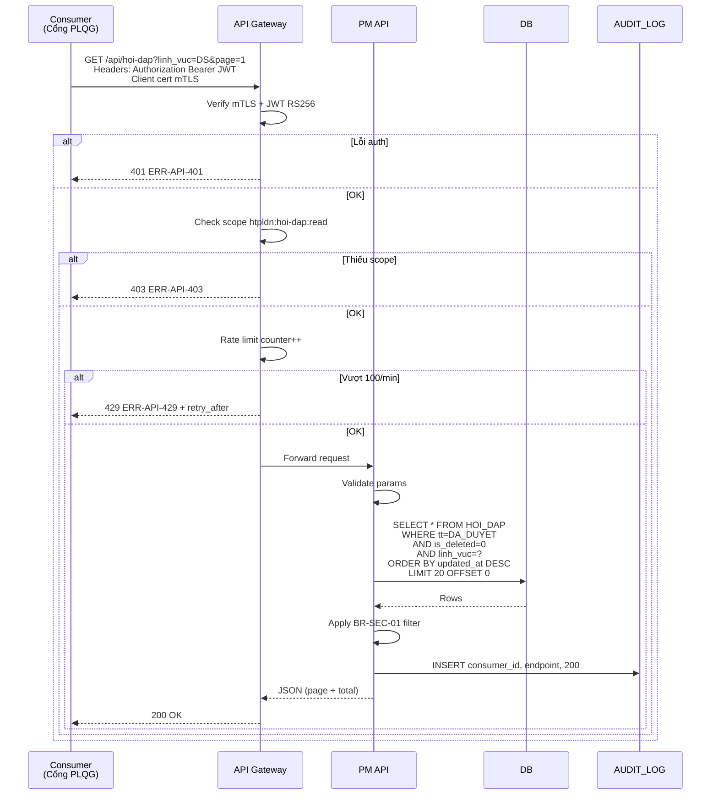
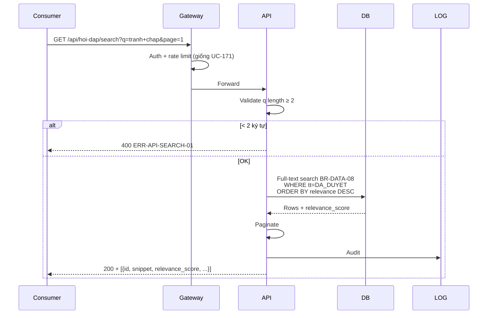

# 16 · FR-16 API Kết nối Chia sẻ Dữ liệu

> **Tài liệu gốc**: `docs/requirements/fr-16-api.md` · **UC range**: UC171-UC188.
> **Vai trò**: 18 API outbound (9 domain × 2 = Share + Search) cung cấp dữ liệu cho Cổng PLQG và consumer khác. Read-only, không state machine. Bảo mật mTLS + JWT RS256 (BR-INTG-02), rate limit 100 req/phút (BR-INTG-03), SLA < 3s (BR-INTG-04), chỉ dữ liệu đã duyệt (BR-INTG-07), lọc thông tin nhạy cảm (BR-SEC-01).

---

## 1. Actors

| Actor | Vai trò |
|---|---|
| Cổng PLQG | Consumer chính của 18 API (mTLS + JWT) |
| Consumer khác | Hệ thống khác được đăng ký kết nối |
| QTHT | Cấp phát/thu hồi JWT, scope, quản lý consumer |

---

## 2. Ma trận 18 API (9 domain × 2)

| # Share | UC | Scope | # Search | UC | Scope | Entity |
|---|---|---|---|---|---|---|
| 01 | UC-171 | `htpldn:hoi-dap:read` | 02 | UC-172 | `htpldn:hoi-dap:search` | HOI_DAP |
| 03 | UC-173 | `htpldn:dao-tao:read` | 04 | UC-174 | `htpldn:dao-tao:search` | KHOA_HOC |
| 05 | UC-175 | `htpldn:tvv:read` | 06 | UC-176 | `htpldn:tvv:search` | TU_VAN_VIEN |
| 07 | UC-177 | `htpldn:vu-viec:read` | 08 | UC-178 | `htpldn:vu-viec:search` | VU_VIEC |
| 09 | UC-179 | `htpldn:danh-gia:read` | 10 | UC-180 | `htpldn:danh-gia:search` | DOT_DANH_GIA |
| 11 | UC-181 | `htpldn:bieu-mau:read` | 12 | UC-182 | `htpldn:bieu-mau:search` | BIEU_MAU |
| 13 | UC-183 | `htpldn:tvcs:read` | 14 | UC-184 | `htpldn:tvcs:search` | NOI_DUNG_TU_VAN_CS |
| 15 | UC-185 | `htpldn:ct-htpl:read` | 16 | UC-186 | `htpldn:ct-htpl:search` | CHUONG_TRINH_HTPL |
| 17 | UC-187 | `htpldn:ho-so-pl-dn:read` | 18 | UC-188 | `htpldn:ho-so-pl-dn:search` | HO_SO_PHAP_LY_DN |

---

## 3. Template luồng chung TPL-API-FULL

---

## 4. Bảo mật 2 lớp (BR-INTG-02)

---

## 5. Lọc dữ liệu nhạy cảm (BR-SEC-01)

| Entity | Loại trừ khỏi payload |
|---|---|
| **TU_VAN_VIEN** (UC-175/176) | CMND, CCCD, địa chỉ cá nhân, SĐT cá nhân |
| **VU_VIEC** (UC-177/178) | MST DN, địa chỉ chi tiết DN (chỉ trả mã VV, lĩnh vực, đơn vị) |
| **NOI_DUNG_TU_VAN_CS** (UC-183) | VB tư vấn chi tiết, file đính kèm (chỉ metadata: mã, lĩnh vực, chuyên gia) |

---

## 6. Lọc theo trạng thái duyệt (BR-INTG-07)

```mermaid
flowchart LR
    subgraph SHARED["Chỉ chia sẻ các entity ở trạng thái cuối"]
        E1[HOI_DAP.tt = DA_DUYET]
        E2[KHOA_HOC.tt = DA_CONG_BO]
        E3[TVV.tt = HOAT_DONG]
        E4[VV.tt = DA_DUYET / HOAN_THANH]
        E5[DOT_DANH_GIA.tt = DA_DUYET_BC]
        E6[BIEU_MAU.tt = CONG_KHAI]
        E7[TVCS.tt = DA_DUYET / HOAN_THANH]
        E8[CHUONG_TRINH.tt = DA_CONG_BO]
        E9[DN.tt = CONG_KHAI]
    end
    SHARED -.-> API[API outbound]
    API -.->|KHÔNG trả về| DRAFT[DU_THAO / CHO_PHE_DUYET / HUY]
```

---

## 7. Sequence: Consumer gọi API Share (UC-171 ví dụ)

---

## 8. Sequence: API Search (UC-172 ví dụ)

---

## 9. Error codes (HTTP + nghiệp vụ)

| Mã | HTTP | Mô tả |
|---|---|---|
| ERR-API-400 | 400 | Tham số không hợp lệ |
| ERR-API-401 | 401 | Xác thực thất bại (JWT sai/hết hạn/mTLS fail) |
| ERR-API-403 | 403 | Thiếu scope |
| ERR-API-404 | 404 | Không tìm thấy tài nguyên |
| ERR-API-429 | 429 | Vượt rate limit, retry_after N giây |
| ERR-API-500 | 500 | Lỗi nội bộ |
| ERR-API-503 | 503 | Tạm thời không khả dụng |
| ERR-API-SEARCH-01 | 400 | Từ khóa < 2 ký tự |

---

## 10. Business Rules quan trọng

| BR | Nội dung |
|---|---|
| **BR-INTG-01** | JWT RS256, issuer = `htpldn.moj.gov.vn`, access token 1h, refresh 24h (tạo ở UC-118/UC-121 FR-10). |
| **BR-INTG-02** | Mọi API outbound phải có mTLS + JWT RS256. |
| **BR-INTG-03** | Rate limit 100 req/phút/consumer. |
| **BR-INTG-04** | Response < 3s (trừ BC nặng). |
| **BR-INTG-05** | Validate params (domain range, format). |
| **BR-INTG-07** | Chỉ dữ liệu đã duyệt/công khai lên API. |
| **BR-SEC-01** | Strip CMND/CCCD/SĐT/MST/địa chỉ chi tiết khỏi payload. |
| **BR-DATA-05** | Mọi API call audit: consumer_id, endpoint, timestamp, response_code. |
| **BR-DATA-08** | Full-text search BR-DATA-08 cho 9 UC Search. |

---

## 11. Tích hợp

| Tích hợp | Chi tiết |
|---|---|
| **FR-10** | UC-118/UC-121 tạo JWT. QTHT cấp phát consumer + scope. |
| **FR-02** | UC-171/172 share+search hỏi đáp. |
| **FR-03** | UC-173/174 share+search khóa học. |
| **FR-04** | UC-175/176 share+search TVV/CG (lọc BR-SEC-01). |
| **FR-05** | UC-177/178 share+search VV (lọc BR-SEC-01). |
| **FR-07** | UC-187/188 share+search HSPL DN. |
| **FR-08** | UC-179/180 share+search đợt ĐG. |
| **FR-09** | UC-181/182 share+search biểu mẫu. |
| **FR-12** | UC-183/184 share+search TVCS (metadata only). |
| **FR-15** | UC-185/186 share+search CT HTPLDN. |

---

## 12. Ghi chú

- **Không có state machine**: 18 API là read-only outbound.
- **9 pairs pattern**: Mỗi domain có 1 API Share (liệt kê + filter) và 1 API Search (full-text + relevance sort).
- **Cổng PLQG pull**: Cổng chủ động pull theo lịch hoặc on-demand.
- **Audit immutable**: AUDIT_LOG ghi mọi call, không xóa.
- **Hybrid integration**: Giao tiếp qua 3 kênh — LGSP (nội bộ BTP), NDXP (liên bộ), Direct API (Cổng PLQG), đều thống nhất format JSON.
