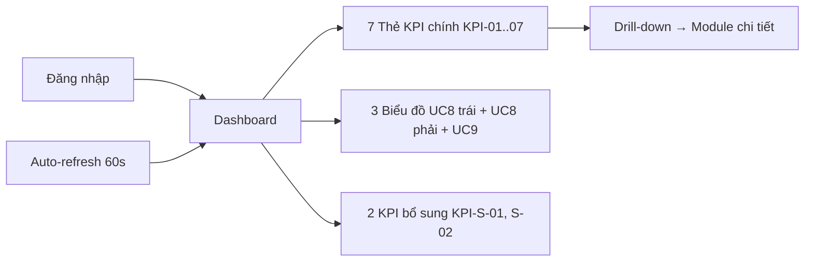
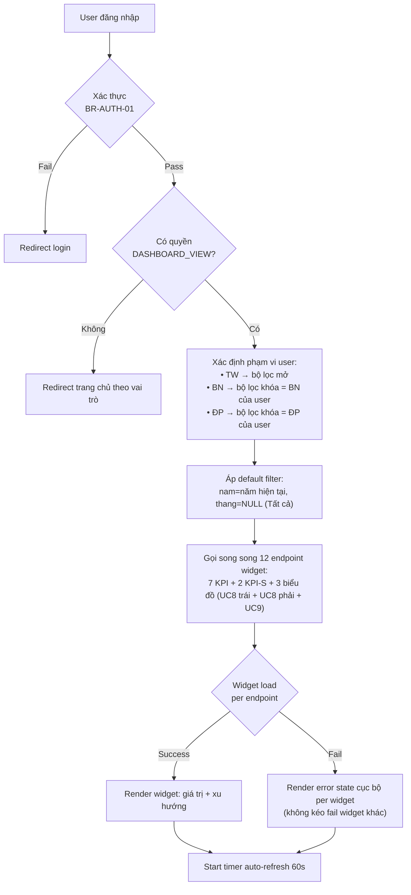
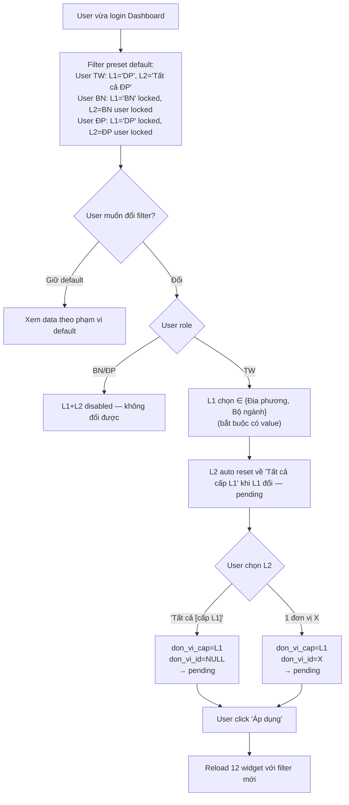
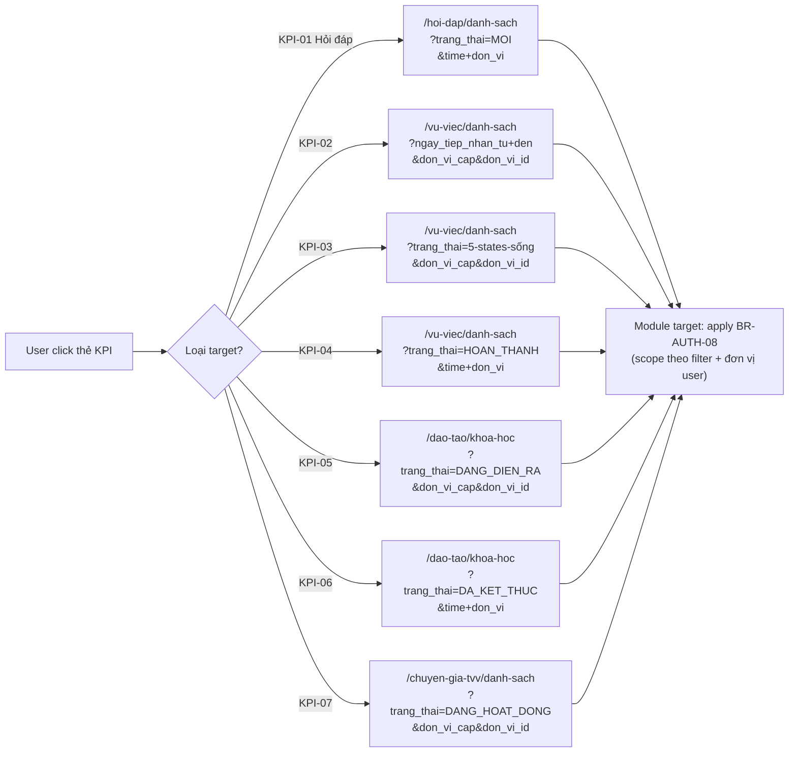
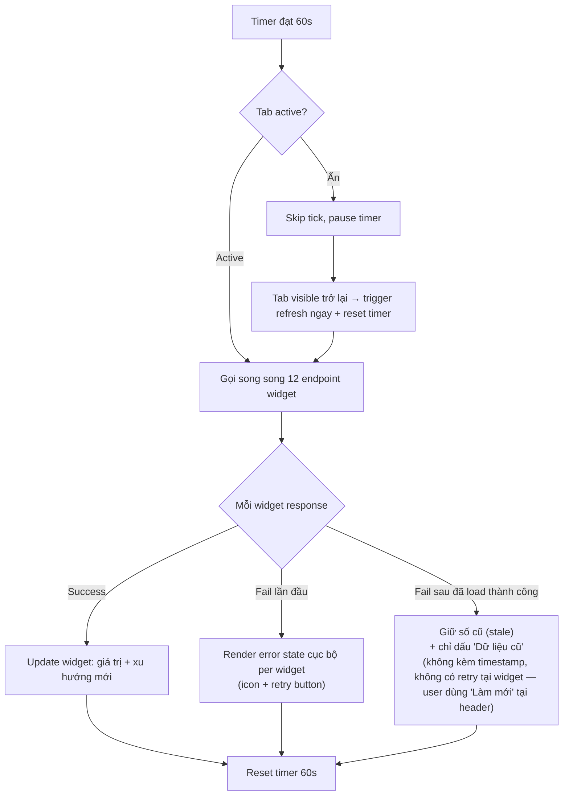
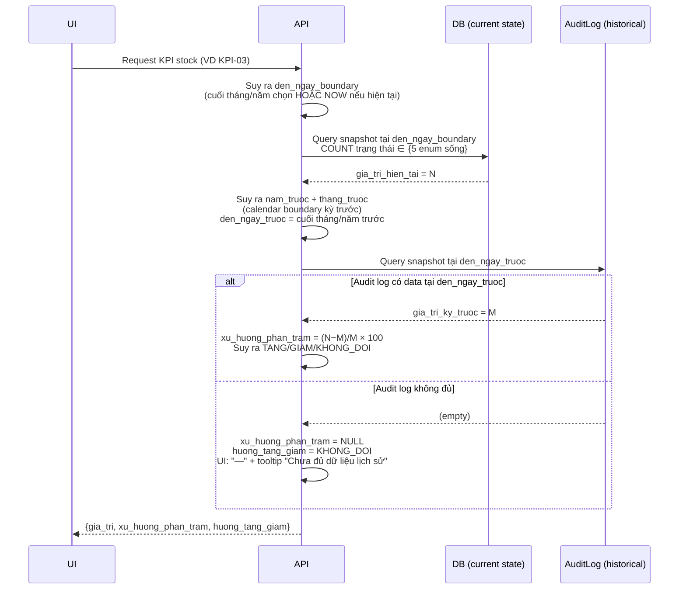
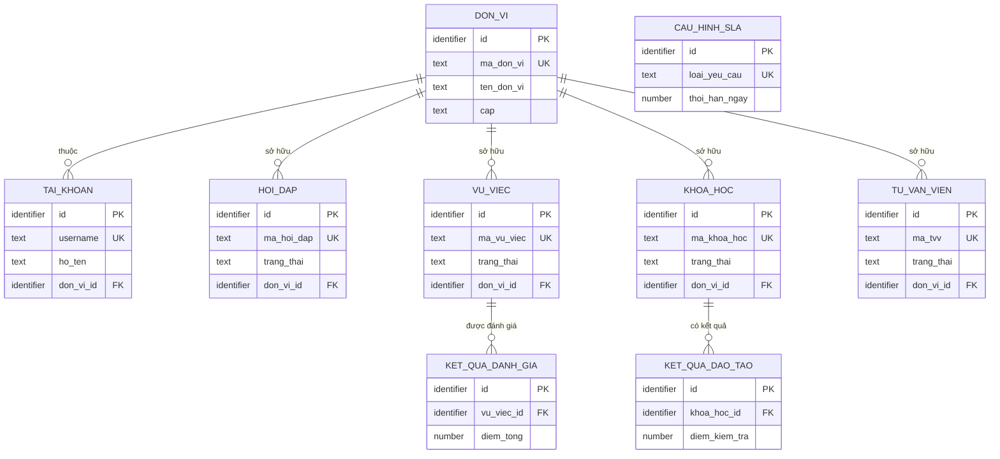

# SRS — Section 3.2.3: Dashboard

**Dự án:** Phần mềm hỗ trợ pháp lý doanh nghiệp
**Phiên bản SRS:** 3.5
**Nhóm:** I — Dashboard
**UC range:** UC 1 – UC 9
**Số FR:** 11 (FR-I-01 đến FR-I-09, KPI bổ sung, Auto-refresh)
**File chính:** `srs-v3.md` Section 3.2

---

## Lịch sử thay đổi

| Ngày | Tác giả | Mô tả thay đổi |
|------|---------|-----------------|
| 2026-04-03 | SRS Agent (Claude) | Tạo mới từ `srs-v3.md` theo Template v3.0 (bản v3 baseline) |
| 2026-05-06 | BA + SRS Agent | **Cập nhật v3 → v3.5** — apply 13 thay đổi nghiệp vụ theo `v3.5-delta-reports/v3.5-delta-fr-01.md` (tất cả mark IN). Phân loại: B1 = 12 thay đổi (sửa lỗi nội bộ SRS), B2d = 1 thay đổi (KPI-03 mở rộng 5 trạng thái sống cho khớp UC3 CSV "đang hỗ trợ"). Không có thay đổi loại A — Yêu cầu thay đổi của đối tác TT CNTT trong CR 16/04/2026 không liệt kê FR-01. Nhóm thay đổi chính: tái cấu trúc bộ lọc thời gian (Năm + Tháng) + bộ lọc đơn vị 2 cấp; phân biệt KPI ảnh chụp vs phát sinh trong kỳ; UC8 thiết kế lại 2 biểu đồ cột song song + thang điểm 0-100; UC9 thiết kế lại biểu đồ vành; tách KPI-S-01/S-02; mở rộng đặc tả tự làm mới với cơ chế chống fail toàn cục per widget; BR-AUTH-01 chuyển 3 lớp xác thực → 2 lớp (bỏ VNPT eKYC); BR-AUTH-04 chốt mô hình BN/ĐP ngang cấp song song; BR-SLA-05 sửa công thức tránh tỷ lệ ảo; xóa entity tham chiếu sai; bổ sung QTHT vào Tác nhân + ma trận phân quyền + 5 sơ đồ luồng nghiệp vụ; drill-down URL kèm filter + sửa naming `KET_THUC` → `DA_KET_THUC`. Chi tiết bằng chứng & lý do từng thay đổi xem `CHANGELOG-v3-to-v3.5.md` mục `srs-fr-01`. |

---

## Mục lục file này

- [1. Tổng quan nhóm](#1-tổng-quan-nhóm)
- [2. Yêu cầu chức năng chi tiết](#2-yêu-cầu-chức-năng-chi-tiết)
- [3. Màn hình chức năng](#3-màn-hình-chức-năng)
- [4. Entity liên quan](#4-entity-liên-quan)
- [5. State Machine liên quan](#5-state-machine-liên-quan)
- [6. Business Rules liên quan](#6-business-rules-liên-quan)

---

## 1. Tổng quan nhóm

**Mục đích:** Hiển thị 9 chỉ số tổng quan (KPI) hoạt động HTPLDN trên trang chủ CMS.

**Quy trình nghiệp vụ tổng quan:**

Nhóm I là trang chủ sau đăng nhập. Chỉ read-only, không có thao tác CUD. Dữ liệu tự lọc theo đơn vị đăng nhập (phân quyền theo đơn vị). Tự động làm mới mỗi 60 giây. Click vào thẻ KPI → drill-down đến danh sách chi tiết module tương ứng.

### Quy trình nghiệp vụ chi tiết (5 kịch bản)

#### F1 — Login → View Dashboard (happy path)

#### F2 — User thay đổi filter đơn vị (L1 + L2)

#### F3 — Click drill-down KPI → module chi tiết

#### F4 — Auto-refresh 60s tick + per-widget fail handling

#### F5 — Stock KPI xu hướng calculation (KPI-03/05/07)

**Đặc thù:**
- Read-only — không có thao tác CUD
- Scoped by đơn vị (phân quyền theo đơn vị)
- Auto-refresh mỗi 60 giây
- Click → drill-down đến danh sách chi tiết nhóm tương ứng
- Bộ lọc: Năm (bắt buộc, từ năm bắt đầu sử dụng phần mềm đến năm hiện tại) + Tháng (có "Tất cả" + 12 tháng cụ thể) + Cấp đơn vị + Đơn vị

**Entity nguồn:** HOI_DAP, VU_VIEC, KHOA_HOC, TU_VAN_VIEN, KET_QUA_DANH_GIA, KET_QUA_DAO_TAO, CAU_HINH_SLA, DON_VI (phạm vi phân quyền), TAI_KHOAN (xác thực + đơn vị user)

**Tác nhân:** Cán bộ Nghiệp vụ (TW/BN/ĐP), Cán bộ Phê duyệt (TW/BN/ĐP), QTHT (mọi cấp)

---

## 2. Yêu cầu chức năng chi tiết

### SHARED TEMPLATE — Dashboard KPI Widget (TPL-DASH-KPI)

> Áp dụng cho FR-I-01 đến FR-I-07 (7 UC KPI đơn giản)

**Preconditions chung:**
- User đã đăng nhập (BR-AUTH-01)
- User có quyền truy cập Dashboard

**Inputs chung:**

| # | Tên field | Kiểu logic | Bắt buộc | Ràng buộc | Mặc định | Nguồn |
|---|----------|-----------|----------|-----------|----------|-------|
| 1 | nam | integer | **Y** | ∈ [năm bắt đầu sử dụng phần mềm, năm hiện tại]. Năm nhỏ nhất xác định động theo năm tạo bản ghi sớm nhất trong các nhóm dữ liệu nguồn (Hỏi đáp, Vụ việc) qua cấu hình hệ thống. KHÔNG có tùy chọn "Tất cả" | **Năm hiện tại** | bộ lọc "Năm" (dropdown) |
| 2 | thang | integer | N | ∈ [1..12] HOẶC NULL (NULL = "Tất cả tháng" của năm). Khi `nam` = năm hiện tại: ràng buộc thêm `thang ≤ tháng hiện tại` (tháng tương lai disabled tại UI) | **NULL** ("Tất cả") | filter "Tháng" (dropdown) |
| 3 | don_vi_cap | enum | **Y** | ∈ {'DP', 'BN'} — L1 **bắt buộc** chọn, không được để trống. User TW: chọn được (đổi giữa ĐP/BN); User BN: locked = 'BN'; User ĐP: locked = 'DP' | **User TW: 'DP' (default = Địa phương)**; User BN: 'BN'; User ĐP: 'DP' | filter L1 "Cấp đơn vị" |
| 4 | don_vi_id | identifier | N | FK → DON_VI(id) khi chọn đơn vị cụ thể; NULL = "Tất cả [cấp L1]" (toàn bộ đơn vị cấp L1 đã chọn). User TW: chọn được; User BN/ĐP: locked = id của đơn vị user | **User TW: NULL (default = Tất cả [cấp L1])**; User BN/ĐP: id của đơn vị user | filter L2 "Đơn vị cụ thể" |

> **Ghi chú nguyên tắc bộ lọc:** Bộ lọc thời gian dùng 2 ô Năm (bắt buộc) + Tháng (có "Tất cả"). Khoảng đầu kỳ–cuối kỳ được suy ra từ Năm + Tháng theo bảng quy ước tại Section 3 Vùng 2. So sánh kỳ trước = tháng hoặc năm liền trước theo lịch (xử lý chéo năm cho trường hợp chọn tháng 1 → so với tháng 12 năm trước). Các chỉ số "ảnh chụp tại thời điểm" (KPI-03/05/07) tính tại mốc cuối kỳ đã chọn — không còn ảnh chụp tại thời điểm hiện tại không phụ thuộc bộ lọc.

**Processing chung:**

| Bước | Mô tả xử lý | BR áp dụng |
|------|-------------|-----------|
| 1 | Kiểm tra quyền + phạm vi phân quyền theo đơn vị | BR-AUTH-01, BR-AUTH-08 |
| 2 | **Xác định phạm vi đơn vị theo `don_vi_cap` + `don_vi_id`:** • `don_vi_id` có giá trị → phạm vi = 1 đơn vị đó. • `don_vi_id` = NULL → phạm vi = toàn bộ đơn vị đang hoạt động ở cấp `don_vi_cap`. Danh sách đơn vị **cấu hình được** qua Nhóm VIII (Quản trị).  **Lưu ý:** `don_vi_cap` luôn có giá trị thuộc {Địa phương, Bộ ngành} (L1 bắt buộc). **Không có trạng thái trộn cấp** Địa phương + Bộ ngành cùng lúc trong 1 biểu đồ — user Trung ương muốn xem cả 2 cấp phải đổi L1.  Phân quyền: User Trung ương đổi được L1+L2 tự do; User Bộ ngành / Địa phương bộ lọc khóa tại đơn vị của user. | BR-AUTH-03, BR-AUTH-04, BR-AUTH-08 |
| 3 | **Suy ra mốc thời gian đầu kỳ + cuối kỳ từ `nam` + `thang`:** • Mốc đầu kỳ = đầu tháng đã chọn (nếu chọn 1 tháng cụ thể) hoặc đầu năm đã chọn (nếu Tháng = "Tất cả"). • Mốc cuối kỳ = cuối tháng đã chọn / cuối năm đã chọn; **HOẶC thời điểm hiện tại** nếu năm đã chọn là năm hiện tại VÀ tháng đã chọn là "Tất cả" hoặc tháng hiện tại. • Cờ `is_qua_khu_dong` = đúng khi năm đã chọn nhỏ hơn năm hiện tại, HOẶC năm đã chọn = năm hiện tại nhưng tháng đã chọn nhỏ hơn tháng hiện tại — dùng để tạm dừng tự làm mới ở Section 3.  **Áp dụng bộ lọc theo loại KPI:** • **KPI phát sinh trong kỳ** (KPI-01/02/04/06, KPI-S-01, KPI-S-02): đếm bản ghi có trường ngày tương ứng nằm trong khoảng đầu kỳ–cuối kỳ. • **KPI ảnh chụp tại cuối kỳ** (KPI-03/05/07): đếm bản ghi đang ở trạng thái sống tại đúng thời điểm cuối kỳ (cuối tháng/năm đã chọn HOẶC thời điểm hiện tại nếu là tháng/năm hiện tại). KHÔNG dùng khoảng thời gian. | — |
| 4 | Thực hiện tổng hợp (đếm / tổng / trung bình) cho kỳ hiện tại theo loại KPI ở bước 3. | — |
| 5 | **Tính xu hướng so kỳ trước theo lịch hành chính:**  **Suy ra kỳ trước:** • Nếu Tháng = "Tất cả" → kỳ trước là cả năm liền trước (Tháng cũng "Tất cả"). • Nếu Tháng > 1 → kỳ trước là cùng năm, tháng trừ 1. • Nếu Tháng = 1 → kỳ trước là tháng 12 năm liền trước (chéo năm).  **Mốc thời gian kỳ trước:** suy ra theo cùng quy tắc bước 3. Lưu ý: cuối kỳ trước luôn là cuối tháng/năm trước (không phải thời điểm hiện tại vì kỳ trước luôn đã đóng).  **KPI phát sinh trong kỳ:** chạy lại cùng phép đếm với mốc kỳ trước → giá trị kỳ trước.  **KPI ảnh chụp:** lấy ảnh chụp tại cuối kỳ trước. Yêu cầu hệ thống có nhật ký lịch sử trạng thái (ghi nhận mỗi lần thay đổi). Nếu nhật ký không đủ tại mốc cuối kỳ trước → giá trị kỳ trước = trống → tỷ lệ chênh = trống → UI hiển thị "—" + chú giải "Chưa đủ dữ liệu lịch sử để so sánh".  **Công thức tỷ lệ chênh:** (giá trị kỳ này − giá trị kỳ trước) ÷ giá trị kỳ trước × 100.  **Suy ra hướng tăng giảm** (3 giá trị: Tăng / Giảm / Không đổi): • Cả 2 kỳ > 0: Tăng (chênh > 0) / Giảm (chênh < 0) / Không đổi (chênh = 0). • Kỳ trước = 0 và kỳ này > 0: Tăng, tỷ lệ chênh = trống → UI: "—". • Kỳ trước > 0 và kỳ này = 0: Giảm, tỷ lệ chênh = −100%. • Cả 2 kỳ = 0: Không đổi, tỷ lệ chênh = trống → UI: "—". • Nhật ký lịch sử không đủ cho mốc kỳ trước: tỷ lệ chênh = trống → UI: "—" + chú giải "Chưa đủ dữ liệu lịch sử để so sánh". | — |
| 6 | Trả về giá trị KPI + xu hướng | — |

**Outputs chung:**

| # | Tên | Kiểu logic | Điều kiện | Format |
|---|-----|-----------|-----------|--------|
| 1 | gia_tri | number | — | số |
| 2 | nhan | text | — | — |
| 3 | don_vi_tinh | text | — | VD: "yêu cầu", "vụ việc" |
| 4 | drill_down_url | text | — | URL |
| 5 | nam | integer | — | VD: 2026 |
| 6 | thang | integer | nullable | 1-12 hoặc NULL ("Tất cả") |
| 7 | scope_label | text | — | UI text hiển thị scope. VD: "Năm 2026", "Tháng 4/2026", "Năm 2025" |
| 8 | tu_ngay_boundary | datetime | — | Boundary đầu kỳ (suy ra từ nam + thang) |
| 9 | den_ngay_boundary | datetime | — | Boundary cuối kỳ (cuối tháng/năm chọn HOẶC NOW nếu là tháng/năm hiện tại) |
| 10 | is_qua_khu_dong | boolean | — | TRUE nếu scope đã đóng (Section 3 dùng để pause auto-refresh) |
| 11 | xu_huong_phan_tram | number | có thể trống | % chênh lệch so kỳ trước (theo lịch). VD: +12,5 hoặc −3,2. Trống khi kỳ trước không có dữ liệu hoặc nhật ký lịch sử không đủ |
| 12 | huong_tang_giam | enum | — | `TANG` (nhãn UI: "Tăng") / `GIAM` (nhãn UI: "Giảm") / `KHONG_DOI` (nhãn UI: "Không đổi") |

**Postconditions chung:** Không thay đổi dữ liệu (read-only)

**Error Handling chung:**

| # | Điều kiện lỗi | Mã lỗi | Phản hồi hệ thống | Severity |
|---|--------------|--------|-------------------|----------|
| E1 | Không có dữ liệu | INFO-DASH-01 | Hiển thị "0" cho KPI + "Chưa có dữ liệu trong kỳ" | INFO |
| E2 | Audit log không đủ cho thời điểm so sánh kỳ trước | INFO-DASH-04 | xu_huong_phan_tram = NULL → UI hiển thị "—" + tooltip "Chưa đủ dữ liệu lịch sử để so sánh" | INFO |
| E3 | Lỗi truy vấn (DB / API 5xx) | ERR-DASH-02 | Trigger Trạng thái 28 widget — text "Không tải được dữ liệu" + nút "Thử lại". KHÔNG hiển thị toast/modal toàn trang. | ERROR |

---

### FR-I-01: Hiển thị tổng hợp hỏi đáp, vướng mắc (UC1)

**UC Reference:** UC 1
**Source:** CĐT xác nhận
**Priority:** Essential
**Stability:** High
**Màn hình:** SCR-I-01 — [Dashboard](#scr-i-01-tổng-quan-hệ-thống-dashboard)

**Mô tả:** Hiển thị tổng số hỏi đáp mới trong kỳ trên thẻ KPI.

**Tác nhân:** CB Nghiệp vụ (TW/BN/ĐP), CB Phê duyệt (TW/BN/ĐP), QTHT (mọi cấp)
**Template:** TPL-DASH-KPI

**Processing đặc thù:**

| Bước | Mô tả xử lý | BR áp dụng |
|------|-------------|-----------|
| 4 | Đếm số bản ghi HOI_DAP chưa xóa, trong phạm vi đơn vị, tạo trong khoảng thời gian lọc | — |

**Drill-down:** Click → chuyển đến FR-II-01 danh sách hỏi đáp, giữ filter Năm + Tháng + đơn vị từ Dashboard (`/hoi-dap/danh-sach?trang_thai=MOI&nam={nam}&thang={thang}&don_vi_cap={don_vi_cap}&don_vi_id={don_vi_id}`). Module target tự suy ra boundary thời gian từ `nam` + `thang` theo cùng logic TPL-DASH-KPI bước 3. Filter bắt buộc kèm để số click xuống khớp số đếm Dashboard.
**Nguồn dữ liệu:** Entity HOI_DAP (Nhóm II)

**Acceptance Criteria:**
- **Given** CB đăng nhập thành công **When** truy cập Dashboard **Then** hiển thị số liệu tổng hợp hỏi đáp theo phạm vi đơn vị
- **Given** CB thuộc ĐP **When** xem dashboard **Then** chỉ hiển thị dữ liệu của ĐP đó
- **Given** CB thuộc TW **When** xem dashboard **Then** hiển thị dữ liệu toàn quốc
- **Given** CB chọn bộ lọc thời gian **When** áp dụng **Then** dữ liệu cập nhật theo khoảng thời gian đã chọn

---

### FR-I-02: Tổng hợp vụ việc đã tiếp nhận (UC2)

**UC Reference:** UC 2
**Priority:** Essential | **Stability:** High
**Màn hình:** SCR-I-01
**Template:** TPL-DASH-KPI

**Processing đặc thù:**

| Bước | Mô tả xử lý | BR áp dụng |
|------|-------------|-----------|
| 4 | Đếm số bản ghi VU_VIEC chưa xóa, trong phạm vi đơn vị, ngày tiếp nhận trong khoảng thời gian lọc | — |

**Drill-down:** Click → chuyển đến Nhóm V.I danh sách vụ việc, giữ filter Năm + Tháng + đơn vị từ Dashboard (`/vu-viec/danh-sach?date_field=ngay_tiep_nhan&nam={nam}&thang={thang}&don_vi_cap={don_vi_cap}&don_vi_id={don_vi_id}`). Module target tự suy ra boundary thời gian từ `nam` + `thang` áp lên `ngay_tiep_nhan`. Filter bắt buộc kèm để số click xuống khớp số đếm Dashboard.

**Acceptance Criteria:**
- **Given** Cán bộ đăng nhập **When** xem Dashboard **Then** hiển thị tổng số vụ việc đã tiếp nhận theo đơn vị
- **Given** Cán bộ thuộc Địa phương **When** xem Dashboard **Then** chỉ hiển thị dữ liệu của Địa phương đó
- **Given** Cán bộ thuộc Trung ương **When** xem Dashboard **Then** hiển thị dữ liệu toàn quốc
- **Given** Cán bộ chọn bộ lọc thời gian **When** áp dụng **Then** dữ liệu cập nhật theo khoảng thời gian

---

### FR-I-03: Tổng hợp vụ việc đang hỗ trợ (UC3)

**UC Reference:** UC 3
**Priority:** Essential | **Stability:** High
**Màn hình:** SCR-I-01
**Template:** TPL-DASH-KPI

**Processing đặc thù:**

| Bước | Mô tả xử lý | BR áp dụng |
|------|-------------|-----------|
| 4 | Đếm số vụ việc chưa xóa, trong phạm vi đơn vị, ở 1 trong 5 trạng thái sống: "Đã tiếp nhận" (`DA_TIEP_NHAN`), "Đang kiểm tra" (`DANG_KIEM_TRA`), "Yêu cầu bổ sung" (`YEU_CAU_BO_SUNG`), "Đã phân công" (`DA_PHAN_CONG`), "Đang xử lý" (`DANG_XU_LY`) — theo SM-VUVIEC (Phụ lục C `srs-v3.md`). Định nghĩa nghiệp vụ "đang hỗ trợ" = vụ đã tiếp nhận và đang trong quy trình sống, chưa chuyển sang phê duyệt / hoàn thành / từ chối. Bao gồm cả giai đoạn kiểm tra hồ sơ và chờ doanh nghiệp bổ sung (vì sau khi DN bổ sung, vụ quay về "Đang kiểm tra" — **không phải phân công lại**, chỉ là tiếp tục luồng trước bước phân công). KHÔNG bao gồm các trạng thái: "Mới tạo", "Chờ tiếp nhận", "Từ chối", "Chờ phê duyệt", "Đã duyệt", "Hoàn thành", "Đã đánh giá" | — |

**Drill-down:** Click → chuyển đến Nhóm V.I (`/vu-viec/danh-sach?trang_thai=DA_TIEP_NHAN,DANG_KIEM_TRA,YEU_CAU_BO_SUNG,DA_PHAN_CONG,DANG_XU_LY&don_vi_cap={don_vi_cap}&don_vi_id={don_vi_id}` — đồng bộ enum với KPI-03 ở bước 4, kèm filter đơn vị từ Dashboard)

**Acceptance Criteria:**
- **Given** Cán bộ đăng nhập **When** xem Dashboard **Then** hiển thị số vụ việc đang hỗ trợ theo đơn vị
- **Given** 1 vụ việc đang ở trạng thái "Đã tiếp nhận" **When** xem Dashboard **Then** KPI-03 đếm vụ này
- **Given** 1 vụ việc đang ở trạng thái "Đang kiểm tra" **When** xem Dashboard **Then** KPI-03 đếm vụ này (Cán bộ nghiệp vụ đang rà soát hồ sơ, chưa phân công — vẫn thuộc quy trình sống)
- **Given** 1 vụ việc đang ở trạng thái "Yêu cầu bổ sung" **When** xem Dashboard **Then** KPI-03 đếm vụ này (chờ doanh nghiệp bổ sung; sau khi bổ sung, vụ quay về "Đang kiểm tra" — không phân công lại)
- **Given** 1 vụ việc đang ở trạng thái "Đã phân công" hoặc "Đang xử lý" **When** xem Dashboard **Then** KPI-03 đếm vụ này
- **Given** 1 vụ việc đang ở trạng thái "Chờ phê duyệt" **When** xem Dashboard **Then** KPI-03 KHÔNG đếm vụ này (đã rời giai đoạn xử lý, vào giai đoạn phê duyệt)
- **Given** 1 vụ việc đang ở trạng thái "Hoàn thành", "Từ chối", hoặc "Đã đánh giá" **When** xem Dashboard **Then** KPI-03 KHÔNG đếm vụ này (vụ đã đóng)
- **Given** Cán bộ thuộc Địa phương **When** xem Dashboard **Then** chỉ hiển thị dữ liệu của Địa phương đó
- **Given** Cán bộ thuộc Trung ương **When** xem Dashboard **Then** hiển thị dữ liệu toàn quốc
- **Given** Cán bộ chọn bộ lọc thời gian **When** áp dụng **Then** dữ liệu cập nhật theo khoảng thời gian

---

### FR-I-04: Tổng hợp vụ việc đã hoàn thành (UC4)

**UC Reference:** UC 4
**Priority:** Essential | **Stability:** High
**Màn hình:** SCR-I-01
**Template:** TPL-DASH-KPI

**Processing đặc thù:**

| Bước | Mô tả xử lý | BR áp dụng |
|------|-------------|-----------|
| 4 | Đếm số vụ việc chưa xóa, trong phạm vi đơn vị, trạng thái "Hoàn thành" (`HOAN_THANH`), ngày hoàn thành nằm trong khoảng đầu kỳ–cuối kỳ | — |

**Drill-down:** Click → chuyển đến Nhóm V.I danh sách vụ việc hoàn thành, giữ filter Năm + Tháng + đơn vị từ Dashboard (`/vu-viec/danh-sach?trang_thai=HOAN_THANH&date_field=ngay_hoan_thanh&nam={nam}&thang={thang}&don_vi_cap={don_vi_cap}&don_vi_id={don_vi_id}`). Module target tự suy ra boundary thời gian từ `nam` + `thang` áp lên `ngay_hoan_thanh`. Filter bắt buộc kèm để số click xuống khớp số đếm Dashboard.

**Acceptance Criteria:**
- **Given** CB đăng nhập **When** xem Dashboard **Then** hiển thị tổng vụ việc trạng thái "Hoàn thành"
- **Given** CB lọc theo thời gian **When** áp dụng **Then** chỉ tính vụ việc hoàn thành trong khoảng thời gian

---

### FR-I-05: Tổng hợp khóa học đang diễn ra (UC5)

**UC Reference:** UC 5
**Priority:** Essential | **Stability:** High
**Màn hình:** SCR-I-01
**Template:** TPL-DASH-KPI

**Processing đặc thù:**

| Bước | Mô tả xử lý | BR áp dụng |
|------|-------------|-----------|
| 4 | Đếm số khóa học chưa xóa, kết hợp thông tin chương trình đào tạo, đơn vị trong phạm vi phân quyền, ở trạng thái "Đang diễn ra" (`DANG_DIEN_RA`) theo SM-KHOAHOC (Phụ lục C `srs-v3.md`) | — |

**Drill-down:** Click → chuyển đến Nhóm III danh sách khóa học đang diễn ra, giữ filter đơn vị từ Dashboard (`/dao-tao/khoa-hoc?trang_thai=DANG_DIEN_RA&don_vi_cap={don_vi_cap}&don_vi_id={don_vi_id}`). Filter đơn vị bắt buộc kèm để scope khớp Dashboard.

**Acceptance Criteria:**
- **Given** CB đăng nhập **When** xem Dashboard **Then** hiển thị số khóa học "Đang diễn ra" thuộc phạm vi đơn vị
- **Given** CB thuộc BN/ĐP **When** xem Dashboard **Then** chỉ đếm khóa thuộc đơn vị user (BR-AUTH-08)
- **Given** user TW đổi filter đơn vị **When** xem Dashboard **Then** đếm cập nhật theo filter
- **Given** CB click thẻ KPI **When** hệ thống xử lý **Then** điều hướng đến danh sách khóa học đang diễn ra (Nhóm III) với filter đơn vị kèm

---

### FR-I-06: Tổng hợp khóa học đã kết thúc (UC6)

**UC Reference:** UC 6
**Priority:** Essential | **Stability:** High
**Màn hình:** SCR-I-01
**Template:** TPL-DASH-KPI

**Processing đặc thù:**

| Bước | Mô tả xử lý | BR áp dụng |
|------|-------------|-----------|
| 4 | Đếm số khóa học chưa xóa, kết hợp thông tin chương trình đào tạo, đơn vị trong phạm vi phân quyền, ở trạng thái "Đã kết thúc" (`DA_KET_THUC`) theo SM-KHOAHOC (Phụ lục C `srs-v3.md`), ngày kết thúc nằm trong khoảng đầu kỳ–cuối kỳ | — |

**Drill-down:** Click → chuyển đến Nhóm III danh sách khóa học đã kết thúc trong kỳ, giữ filter Năm + Tháng + đơn vị từ Dashboard (`/dao-tao/khoa-hoc?trang_thai=DA_KET_THUC&date_field=ngay_ket_thuc&nam={nam}&thang={thang}&don_vi_cap={don_vi_cap}&don_vi_id={don_vi_id}`). Module target tự suy ra boundary thời gian từ `nam` + `thang` áp lên `ngay_ket_thuc`. Filter bắt buộc kèm để số click xuống khớp Dashboard.

**Acceptance Criteria:**
- **Given** CB đăng nhập **When** xem Dashboard **Then** hiển thị số khóa học "Đã hoàn thành" trong kỳ theo phạm vi đơn vị
- **Given** CB thuộc BN/ĐP **When** xem Dashboard **Then** chỉ đếm khóa thuộc đơn vị user (BR-AUTH-08)
- **Given** user TW đổi filter đơn vị **When** xem Dashboard **Then** đếm cập nhật theo filter
- **Given** CB chọn bộ lọc thời gian **When** áp dụng **Then** dữ liệu cập nhật theo khoảng thời gian
- **Given** CB click thẻ KPI **When** hệ thống xử lý **Then** điều hướng đến danh sách khóa học đã kết thúc (Nhóm III) với time + đơn vị filter kèm

---

### FR-I-07: Tổng số chuyên gia/TVV (UC7)

**UC Reference:** UC 7
**Priority:** Essential | **Stability:** High
**Màn hình:** SCR-I-01
**Template:** TPL-DASH-KPI

**Mô tả:** Đếm số chuyên gia / tư vấn viên / người hỗ trợ **đang có khả năng nhận công việc** (trạng thái "Đang hoạt động"). Đây là chỉ số **hoạt động hiện tại**, không phải tổng số tư vấn viên đã từng được thẩm định công nhận trong lịch sử — loại trừ "Tạm dừng" và "Vô hiệu hóa". Để xem tổng tư vấn viên đã qua thẩm định công nhận (bao gồm cả tạm dừng), tham khảo Báo cáo Nhóm IX.

**Processing đặc thù:**

| Bước | Mô tả xử lý | BR áp dụng |
|------|-------------|-----------|
| 4 | Đếm số tư vấn viên chưa xóa, trong phạm vi đơn vị, ở trạng thái "Đang hoạt động" (`DANG_HOAT_DONG`) theo SM-TVV (Phụ lục C `srs-v3.md`). KHÔNG bao gồm các trạng thái: "Mới đăng ký", "Chờ thẩm định", "Đang thẩm định", "Yêu cầu bổ sung", "Chờ phê duyệt", "Từ chối", "Tạm dừng", "Vô hiệu hóa" | — |

**Drill-down:** Click → chuyển đến Nhóm IV, danh sách TVV đang hoạt động, giữ filter đơn vị từ Dashboard (`/chuyen-gia-tvv/danh-sach?trang_thai=DANG_HOAT_DONG&don_vi_cap={don_vi_cap}&don_vi_id={don_vi_id}`)

**Acceptance Criteria:**
- **Given** Cán bộ đăng nhập **When** xem Dashboard **Then** hiển thị tổng số chuyên gia / tư vấn viên / người hỗ trợ "Đang hoạt động" thuộc phạm vi
- **Given** Tư vấn viên chuyển từ "Đang hoạt động" sang "Tạm dừng" **When** Dashboard tự làm mới ở chu kỳ tiếp theo (60 giây, theo FR-I-CROSS-02) hoặc user nhấn "Làm mới" **Then** số đếm giảm tương ứng (do không còn trong tập "Đang hoạt động"). **Không cập nhật theo thời gian thực**
- **Given** User Trung ương vừa đăng nhập (mặc định L1 = "Địa phương", L2 = "Tất cả Địa phương") **When** xem Dashboard **Then** chỉ đếm tư vấn viên "Đang hoạt động" thuộc các Địa phương (chế độ mặc định)
- **Given** User Trung ương chọn L1 = "Địa phương" + L2 = "Tất cả" **When** xem Dashboard **Then** chỉ đếm tư vấn viên "Đang hoạt động" thuộc các Địa phương
- **Given** User Trung ương chọn L1 = "Bộ ngành" + L2 = "Tất cả" **When** xem Dashboard **Then** chỉ đếm tư vấn viên "Đang hoạt động" thuộc các Bộ ngành
- **Given** User Trung ương chọn 1 đơn vị cụ thể (L2 = 1 Địa phương hoặc 1 Bộ ngành) **When** xem Dashboard **Then** chỉ đếm tư vấn viên "Đang hoạt động" thuộc đơn vị đó
- **Given** User Bộ ngành đăng nhập (bộ lọc khóa = Bộ ngành của user) **When** xem Dashboard **Then** chỉ đếm tư vấn viên "Đang hoạt động" thuộc Bộ ngành đó (BR-AUTH-08)
- **Given** User Địa phương đăng nhập (bộ lọc khóa = Địa phương của user) **When** xem Dashboard **Then** chỉ đếm tư vấn viên "Đang hoạt động" thuộc Địa phương đó (BR-AUTH-08)

---

### FR-I-08: Biểu đồ đánh giá hiệu quả hỗ trợ (UC8)

**UC Reference:** UC 8
**Source:** Đề xuất — công thức tính chờ CĐT review
**Priority:** Essential
**Stability:** Medium
**Màn hình:** SCR-I-01 — [Dashboard](#scr-i-01-tổng-quan-hệ-thống-dashboard)

**Mô tả:** **2 biểu đồ cột song song (đặt cạnh nhau), mỗi biểu đồ 1 chỉ số đơn**:
- **Biểu đồ trái — Điểm đánh giá hiệu quả hỗ trợ pháp lý** (biểu đồ cột, thang 0-100 theo điểm tổng đánh giá `KET_QUA_DANH_GIA.diem_tong` — ràng buộc 0-100).
- **Biểu đồ phải — Tỷ lệ tuân thủ thời hạn xử lý** (biểu đồ cột, %).

Mỗi biểu đồ có chú thích cỡ mẫu + xu hướng so kỳ trước riêng. **Tách 2 biểu đồ thay vì dùng biểu đồ kết hợp 2 trục Y** để tránh user hiểu nhầm 2 chỉ số có tương quan với nhau (thực tế là 2 chỉ số độc lập, đặt cùng 1 biểu đồ với 2 thang đo khác nhau dễ gây sai diễn giải).

**Tác nhân:** CB Nghiệp vụ (TW/BN/ĐP), CB Phê duyệt (TW/BN/ĐP), QTHT (mọi cấp)

**Preconditions:**
- User đã đăng nhập, có quyền Dashboard
- Có dữ liệu đánh giá trong kỳ (Nhóm VI)

**Inputs:** (dùng cùng filter structure với TPL-DASH-KPI — xem Inputs chung)

| # | Tên field | Kiểu logic | Bắt buộc | Ràng buộc | Mặc định | Nguồn |
|---|----------|-----------|----------|-----------|----------|-------|
| 1 | nam | integer | **Y** | Như TPL-DASH-KPI Inputs row 1 (∈ [năm bắt đầu sử dụng phần mềm, năm hiện tại], không có "Tất cả") | **Năm hiện tại** | filter "Năm" (dropdown) |
| 2 | thang | integer | N | Như TPL-DASH-KPI Inputs row 2 (∈ [1..12] hoặc NULL = "Tất cả") | **NULL** ("Tất cả") | filter "Tháng" (dropdown) |
| 3 | don_vi_cap | enum | **Y** | ∈ {'DP', 'BN'} — L1 **bắt buộc** chọn. Phân quyền như TPL-DASH-KPI | Như TPL | filter L1 |
| 4 | don_vi_id | identifier | N | FK → DON_VI(id) khi chọn đơn vị cụ thể; NULL = "Tất cả [cấp L1]". Phân quyền như TPL-DASH-KPI | Như TPL | filter L2 |

**Processing:**

| Bước | Mô tả xử lý | BR áp dụng |
|------|-------------|-----------|
| 1 | Kiểm tra quyền + xác định phạm vi đơn vị (theo Processing chung bước 1-2 của TPL-DASH-KPI — dùng `don_vi_cap` + `don_vi_id`) | BR-AUTH-01, BR-AUTH-03/04/08 |
| 2 | Tính điểm đánh giá hiệu quả hỗ trợ pháp lý trung bình từ kết quả đánh giá thuộc phạm vi | — |
| 3 | Tính tỷ lệ tuân thủ thời hạn xử lý theo BR-SLA-05: tử số là số vụ hoàn thành đúng hạn; mẫu số bao gồm cả số vụ đã hoàn thành lẫn số vụ đang xử lý nhưng đã quá hạn — để tránh tỷ lệ ảo khi đơn vị có nhiều vụ tồn đọng quá hạn chưa đóng | BR-SLA-05 |
| 4 | **Định dạng dữ liệu cho 2 biểu đồ cột song song (biểu đồ trái = điểm đánh giá hiệu quả hỗ trợ pháp lý, biểu đồ phải = tỷ lệ tuân thủ thời hạn xử lý).**  **Nguyên tắc (áp cho cả 2 biểu đồ):** • Khi `don_vi_id` có giá trị (1 đơn vị cụ thể) → trục X = các kỳ thời gian của đơn vị đó (chuỗi thời gian, theo thứ tự niên đại). • Khi `don_vi_id` = NULL (L2 = "Tất cả [cấp L1]") → trục X = các đơn vị cấp L1 có dữ liệu, mỗi đơn vị 1 cột (so sánh đơn vị, sắp xếp theo giá trị giảm dần — mỗi biểu đồ sắp xếp độc lập).  **Quy tắc chia kỳ (áp khi trục X là các kỳ):** • Khi Tháng có giá trị (1 tháng cụ thể) → chia theo **ngày** (tối đa 31 cột). • Khi Tháng = "Tất cả" (cả năm) → chia theo **tháng** (tối đa 12 cột).  **Kịch bản chi tiết:** • Cấp đơn vị = "Địa phương", L2 = "Tất cả" → so sánh tất cả Địa phương có dữ liệu. • Cấp đơn vị = "Địa phương", L2 = 1 Địa phương cụ thể → chuỗi thời gian của Địa phương đó. • Cấp đơn vị = "Bộ ngành", L2 = "Tất cả" → so sánh tất cả Bộ ngành có dữ liệu. • Cấp đơn vị = "Bộ ngành", L2 = 1 Bộ ngành cụ thể → chuỗi thời gian của Bộ ngành đó. • User Bộ ngành / Địa phương (bộ lọc khóa) → chuỗi thời gian của đơn vị user.  **Tính giá trị mỗi điểm (khi trục X là nhiều đơn vị):** Mỗi đơn vị tính độc lập: • Điểm đánh giá hiệu quả hỗ trợ pháp lý trung bình = trung bình điểm tổng các đánh giá thuộc đơn vị đó trong kỳ (trung bình đơn giản, không tính trọng số chéo đơn vị). • Tỷ lệ tuân thủ thời hạn xử lý = áp BR-SLA-05 cho vụ thuộc đơn vị đó trong kỳ.  **Trường hợp biên dữ liệu:** • Không có dữ liệu → biểu đồ trống + "Chưa có dữ liệu trong kỳ" (E1). • 1 đơn vị có dữ liệu khi phạm vi = nhiều → vẫn hiển thị 1 cột, không cảnh báo. • Cỡ mẫu N < 10 cho 1 đơn vị / kỳ → cột vẫn hiển thị kèm dấu `*` + chú giải đồng nhất: **"Lưu ý: mẫu nhỏ (< 10 {tên đối tượng}) — kết quả tham khảo"** (ví dụ: "Lưu ý: mẫu nhỏ (< 10 đánh giá) — kết quả tham khảo" cho biểu đồ trái; "Lưu ý: mẫu nhỏ (< 10 vụ việc) — kết quả tham khảo" cho biểu đồ phải). KHÔNG đưa số N cụ thể vào nhãn chú giải — đảm bảo nhất quán giữa các biểu đồ. Số N (nếu có) hiển thị ngay sau giá trị tại hàng giá trị, dạng `(N={n})` (ví dụ "Điểm đánh giá: 68,9/100 * (N=8)"). • Ngày không có dữ liệu (khi trục X chia theo ngày) → bỏ qua ngày đó, không vẽ cột. • Khi tổng chiều rộng các cột vượt chiều rộng vùng hiển thị → cuộn ngang, trục Y cố định bên trái. Đội thiết kế UI quyết định chiều rộng tối thiểu mỗi cột đủ để hiển thị tên đơn vị + giá trị. | BR-AUTH-04, BR-SLA-05 |
| 5 | Trả về dữ liệu biểu đồ | — |

**Outputs:**

| # | Tên | Kiểu logic | Điều kiện | Format |
|---|-----|-----------|-----------|--------|
| 1 | diem_hai_long_tb | number | — | thang **0-100** (đồng bộ với ràng buộc nghiệp vụ "điểm tổng từ 0 đến 100" của nhóm dữ liệu Kết quả đánh giá) |
| 2 | ty_le_tuan_thu_sla | number | — | % (nhãn UI: "Tỷ lệ tuân thủ thời hạn xử lý") |
| 3 | so_luong_danh_gia | number | — | tổng số đánh giá trong kỳ + phạm vi đã lọc (cỡ mẫu hiển thị ở chú thích chân biểu đồ) |
| 4 | so_luong_vu_viec_sla | number | — | tổng cơ sở tính tỷ lệ tuân thủ thời hạn = số vụ hoàn thành + số vụ đang xử lý đã quá hạn (cỡ mẫu cho biểu đồ phải) |
| 5 | chart_data_hai_long | có cấu trúc | — | **Biểu đồ trái:** nhãn (tên đơn vị hoặc tên kỳ) + giá trị (điểm đánh giá hiệu quả hỗ trợ pháp lý trung bình mỗi nhãn) |
| 6 | chart_data_sla | có cấu trúc | — | **Biểu đồ phải:** nhãn (tên đơn vị hoặc tên kỳ) + giá trị (% tuân thủ thời hạn mỗi nhãn) |
| 7 | diem_hai_long_xu_huong | enum | — | `TANG` / `GIAM` / `KHONG_DOI` (nhãn UI: "Tăng" / "Giảm" / "Không đổi") so kỳ trước — đặt ở phần đầu biểu đồ trái |
| 8 | ty_le_sla_xu_huong | enum | — | `TANG` / `GIAM` / `KHONG_DOI` (nhãn UI: "Tăng" / "Giảm" / "Không đổi") so kỳ trước — đặt ở phần đầu biểu đồ phải |

> **Lưu ý:** `ty_le_vu_viec_bo_sung` (KPI-S-01) và `thoi_gian_xu_ly_tb` (KPI-S-02) đã được tách về section [KPI bổ sung Dashboard](#kpi-bổ-sung-dashboard-s3-3), không thuộc UC 8.

**Error Handling:**

| # | Điều kiện lỗi | Mã lỗi | Phản hồi hệ thống | Severity |
|---|--------------|--------|-------------------|----------|
| E1 | Không có dữ liệu đánh giá | INFO-DASH-02 | Biểu đồ trống + "Chưa có dữ liệu trong kỳ" | INFO |

**Rule table — cách hiển thị theo filter state:**

| User + Filter state | Trục X | Sort |
|---|---|---|
| User Trung ương mặc định (vừa đăng nhập, L1 = "Địa phương", L2 = "Tất cả Địa phương") | Tất cả Địa phương có dữ liệu | giá trị giảm dần |
| User Trung ương, L1 = "Địa phương", L2 = 1 Địa phương cụ thể | Các kỳ của Địa phương đó | theo thứ tự thời gian |
| User Trung ương, L1 = "Bộ ngành", L2 = "Tất cả Bộ ngành" | Tất cả Bộ ngành có dữ liệu | giá trị giảm dần |
| User Trung ương, L1 = "Bộ ngành", L2 = 1 Bộ ngành cụ thể | Các kỳ của Bộ ngành đó | theo thứ tự thời gian |
| User Bộ ngành (bộ lọc khóa) | Các kỳ của Bộ ngành user | theo thứ tự thời gian |
| User Địa phương (bộ lọc khóa) | Các kỳ của Địa phương user | theo thứ tự thời gian |

**Quy tắc chia kỳ (áp khi trục X là các kỳ):** `thang` ≠ NULL → chia theo **ngày** (tối đa 31 cột) | `thang` = NULL → chia theo **tháng** (tối đa 12 cột).

**Acceptance Criteria:**
- **Given** user TW vừa login (filter preset L1='DP', L2='Tất cả ĐP') **When** xem Dashboard **Then** cả 2 biểu đồ (điểm đánh giá hiệu quả hỗ trợ pháp lý + tỷ lệ tuân thủ thời hạn) có trục X = tất cả đơn vị cấp ĐP có dữ liệu đánh giá trong kỳ, mỗi ĐP 1 bar per biểu đồ, sort giá trị DESC theo từng biểu đồ độc lập
- **Given** user TW đổi filter sang L1='BN' + L2='Tất cả BN' **When** xem Dashboard **Then** trục X = tất cả BN có data, sort giá trị DESC
- **Given** user TW chọn 1 đơn vị + Tháng cụ thể (vd Năm 2026, Tháng 4) **When** xem Dashboard **Then** trục X = các bar ngày trong tháng đó của đơn vị (chia theo ngày — `thang` ≠ NULL)
- **Given** user TW chọn 1 đơn vị + Tháng "Tất cả" (vd Năm 2026, "Tất cả tháng") **When** xem Dashboard **Then** trục X = 12 bar tháng (T1..T12) của đơn vị đó (chia theo tháng — `thang` = NULL)
- **Given** User Bộ ngành / Địa phương đăng nhập (bộ lọc khóa) **When** xem Dashboard **Then** trục X = các kỳ của đơn vị user theo quy tắc chia kỳ (Tháng có giá trị → ngày, Tháng "Tất cả" → tháng) (BR-AUTH-08)
- **Given** không có dữ liệu đánh giá trong kỳ + phạm vi filter **When** xem Dashboard **Then** biểu đồ trống + "Chưa có dữ liệu trong kỳ" (E1 INFO-DASH-02)
- **Given** 1 đơn vị có mẫu N < 10 đánh giá **When** xem Dashboard **Then** bar hiển thị kèm asterisk `*` + tooltip label "Lưu ý: mẫu nhỏ (< 10 đánh giá) — kết quả tham khảo" (format generic đồng nhất giữa các chart); value row hiển thị số N cụ thể dạng `(N={n})` nếu data có
- **Given** ngày cụ thể không có data (trục X = ngày) **When** xem Dashboard **Then** ngày đó không render bar (skip)
- **Given** có dữ liệu đánh giá **When** tính tỷ lệ tuân thủ thời hạn **Then** áp BR-SLA-05 (mẫu số bao gồm vụ đang xử lý quá hạn)
- **Given** CB thay đổi filter **When** nhấn "Áp dụng" **Then** biểu đồ cập nhật với logic trên

---

### FR-I-09: Biểu đồ chất lượng đào tạo, bồi dưỡng pháp lý (UC9)

**UC Reference:** UC 9
**Source:** Đề xuất — công thức tính chờ CĐT review
**Priority:** Essential
**Stability:** Medium
**Màn hình:** SCR-I-01 — [Dashboard](#scr-i-01-tổng-quan-hệ-thống-dashboard)

**Mô tả:** Biểu đồ vành 2 phần ("Đạt" / "Không đạt") + nhãn trung tâm hiển thị Điểm trung bình + cỡ mẫu N. Cả 2 chỉ số (tỷ lệ đạt, điểm trung bình) có xu hướng so kỳ trước.

**Tác nhân:** CB Nghiệp vụ (TW/BN/ĐP), CB Phê duyệt (TW/BN/ĐP), QTHT (mọi cấp)

**Preconditions:**
- User đã đăng nhập, có quyền Dashboard
- Có dữ liệu đào tạo trong kỳ (Nhóm III)

**Inputs:** dùng cùng filter structure với TPL-DASH-KPI (`nam`, `thang`, `don_vi_cap`, `don_vi_id`).

**Processing:**

| Bước | Mô tả xử lý | BR áp dụng |
|------|-------------|-----------|
| 1 | Kiểm tra quyền + xác định phạm vi đơn vị theo TPL-DASH-KPI Processing bước 1-2 (dùng `don_vi_cap` + `don_vi_id`). Suy ra boundary thời gian từ `nam` + `thang` theo TPL bước 3. | BR-AUTH-01, BR-AUTH-03/04/08 |
| 2 | Tính tỷ lệ đạt chứng nhận kỳ hiện tại: tỷ lệ đạt = số học viên có xếp loại "Đạt" / "Giỏi" / "Khá" / "Trung bình" chia tổng số học viên trong phạm vi đơn vị + kỳ hiện tại, nhân 100 | — |
| 3 | Tính điểm trung bình kỳ hiện tại: trung bình điểm kiểm tra của các học viên trong phạm vi + kỳ hiện tại, làm tròn 1 chữ số thập phân | — |
| 4 | Tính cỡ mẫu = tổng số học viên có điểm kiểm tra trong phạm vi + kỳ hiện tại | — |
| 5 | Tính giá trị kỳ trước: chạy lại bước 2+3 với bộ lọc kỳ trước (cùng độ dài, liền trước kỳ hiện tại) → tỷ lệ đạt kỳ trước, điểm trung bình kỳ trước. Suy ra xu hướng theo TPL-DASH-KPI Processing bước 5 | — |
| 6 | Định dạng biểu đồ vành: • 2 phần: "Đạt" (giá trị = tỷ lệ đạt %), "Không đạt" (giá trị = 100% trừ tỷ lệ đạt) — đội thiết kế UI quyết định cách phân biệt thị giác • Nhãn trung tâm: "Điểm trung bình: {điểm trung bình}/10" • Chú thích: "Dựa trên {cỡ mẫu} học viên" • Xu hướng: chỉ dấu + chênh lệch cho cả 2 chỉ số | — |
| 7 | Trả về | — |

**Outputs:**

| # | Tên | Kiểu logic | Điều kiện | Format |
|---|-----|-----------|-----------|--------|
| 1 | ty_le_dat | number | — | % (0-100) |
| 2 | ty_le_dat_xu_huong | enum | — | `TANG` / `GIAM` / `KHONG_DOI` (nhãn UI: "Tăng" / "Giảm" / "Không đổi") |
| 3 | ty_le_dat_phan_tram_change | number | có thể trống | % chênh so kỳ trước (VD +3, -2) |
| 4 | diem_tb | number | — | thang 0-10, 1 chữ số thập phân |
| 5 | diem_tb_xu_huong | enum | — | `TANG` / `GIAM` / `KHONG_DOI` (nhãn UI: "Tăng" / "Giảm" / "Không đổi") |
| 6 | diem_tb_delta | number | có thể trống | điểm chênh so kỳ trước (VD +0,3 / −0,2) |
| 7 | sample_size | number | — | số học viên có điểm trong kỳ + phạm vi |
| 8 | chart_data | có cấu trúc | — | Biểu đồ vành 2 phần: phần 1 nhãn "Đạt" mang giá trị = tỷ lệ đạt; phần 2 nhãn "Không đạt" mang giá trị = phần còn lại (100% trừ tỷ lệ đạt) |

**Error Handling:**

| # | Điều kiện lỗi | Mã lỗi | Phản hồi hệ thống | Severity |
|---|--------------|--------|-------------------|----------|
| E1 | Không có dữ liệu đào tạo trong kỳ | INFO-DASH-03 | Donut trống + "Chưa có dữ liệu trong kỳ" | INFO |

**Acceptance Criteria:**
- **Given** user TW vừa login (default L1='DP', L2='Tất cả ĐP') **When** xem Dashboard **Then** donut hiển thị tỷ lệ đạt của tất cả học viên thuộc các ĐP, center label "Điểm trung bình: X.X/10", caption "Dựa trên Y học viên"
- **Given** user TW chọn 1 đơn vị cụ thể **When** xem Dashboard **Then** tỷ lệ đạt + điểm TB tính riêng cho đơn vị đó
- **Given** user TW chọn L1='BN', L2='Tất cả BN' **When** xem Dashboard **Then** aggregate tỷ lệ đạt + điểm TB của tất cả BN (gộp toàn bộ học viên của các BN)
- **Given** User Bộ ngành / Địa phương đăng nhập (bộ lọc khóa) **When** xem Dashboard **Then** tỷ lệ đạt + điểm trung bình tính riêng cho đơn vị user (BR-AUTH-08)
- **Given** Biểu đồ vành đã hiển thị **Then** có 2 phần ("Đạt" + "Không đạt", đội thiết kế UI quyết phối màu — gợi ý xanh / xám), nhãn trung tâm "Điểm trung bình: {X,X}/10", chú thích chân biểu đồ kèm cỡ mẫu N
- **Given** Có dữ liệu kỳ trước **When** xem Dashboard **Then** mỗi chỉ số hiển thị biểu tượng xu hướng (↑ / ↓ / —) + chênh lệch (ví dụ ↑ +3% cho tỷ lệ đạt, ↓ −0,2 cho điểm trung bình)
- **Given** không có dữ liệu kỳ trước **When** xem Dashboard **Then** trend hiển thị "—" (theo quy ước TPL-DASH-KPI bước 5)
- **Given** không có dữ liệu đào tạo trong kỳ + phạm vi filter **When** xem Dashboard **Then** donut trống + "Chưa có dữ liệu trong kỳ" (E1 INFO-DASH-03)
- **Given** CB thay đổi filter **When** nhấn "Áp dụng" **Then** donut cập nhật theo filter mới

---

### KPI bổ sung Dashboard (S3-3)

**UC Reference:** UC1-9 (bổ sung)
**Source:** Đề xuất BA — **ngoài phạm vi CSV Danh sách UC/Transaction v1.1**. Giữ theo quyết định PM 2026-04-23: chỉ số vận hành bổ sung (đo chất lượng quy trình xuyên UC). Khi CĐT review: có thể đề nghị bổ sung UC mới vào CSV hoặc chuyển sang Báo cáo Nhóm IX.
**Priority:** Essential | **Stability:** Medium
**Màn hình:** SCR-I-01

> **Naming:** Tiền tố `KPI-S-` (S = Supplementary / bổ sung) để phân biệt với `KPI-01..KPI-07` (1-to-1 với UC1-UC7). KPI bổ sung không gắn 1 UC mà tổng hợp xuyên UC.

---

#### KPI-S-01: Tỷ lệ vụ việc phải bổ sung

**Mô tả:** Đo chất lượng hồ sơ đầu vào — tỷ lệ vụ việc đã từng bị yêu cầu bổ sung ít nhất 1 lần (trên tổng vụ hoàn thành trong kỳ).

**Tác nhân:** CB Nghiệp vụ (TW/BN/ĐP), CB Phê duyệt (TW/BN/ĐP), QTHT (mọi cấp)
**Template:** TPL-DASH-KPI (áp cho phần giá trị + xu hướng)

**Inputs:** dùng cùng filter structure với TPL-DASH-KPI (`nam`, `thang`, `don_vi_cap`, `don_vi_id`).

**Processing đặc thù:**

| Bước | Mô tả xử lý | BR áp dụng |
|------|-------------|-----------|
| 4 | Suy ra mốc đầu kỳ + cuối kỳ từ `nam` + `thang` theo TPL bước 3. Tập mẫu số = số vụ việc trạng thái "Hoàn thành" có ngày hoàn thành nằm trong khoảng đầu kỳ–cuối kỳ, thuộc phạm vi đơn vị. Tập tử số = số vụ việc trong mẫu số đã từng đi qua trạng thái "Yêu cầu bổ sung" ít nhất 1 lần (1 vụ bổ sung nhiều lần vẫn chỉ đếm 1 — không đếm lặp). Giá trị = tử số / mẫu số × 100. Nếu mẫu số = 0 → giá trị trống (UI hiển thị "—", không tính xu hướng) | — |

**Outputs bổ sung (ngoài TPL-DASH-KPI):** không (dùng field `gia_tri` từ TPL với `don_vi_tinh = "%"`).

**Error Handling:** theo TPL-DASH-KPI.

**Drill-down:** không có (chỉ số tổng hợp, không có danh sách chi tiết tương ứng).

**Acceptance Criteria:**
- **Given** trong kỳ có 100 vụ hoàn thành, 30 vụ từng qua trạng thái "Yêu cầu bổ sung" **When** xem Dashboard **Then** KPI-S-01 = 30%
- **Given** 1 vụ qua trạng thái "Yêu cầu bổ sung" 3 lần trước khi hoàn thành **When** xem Dashboard **Then** vụ đó vẫn chỉ đếm 1 lần ở tử số (không đếm lặp)
- **Given** trong kỳ không có vụ hoàn thành **When** xem Dashboard **Then** hiển thị "—" (không tính được %)
- **Given** Cán bộ thuộc Bộ ngành / Địa phương **When** xem Dashboard **Then** chỉ tính vụ thuộc đơn vị user

---

#### KPI-S-02: Thời gian xử lý trung bình

**Mô tả:** Đo hiệu suất xử lý — trung bình ngày làm việc từ tiếp nhận đến hoàn thành cho vụ đóng trong kỳ.

**Tác nhân:** CB Nghiệp vụ (TW/BN/ĐP), CB Phê duyệt (TW/BN/ĐP), QTHT (mọi cấp)
**Template:** TPL-DASH-KPI

**Inputs:** dùng cùng filter structure với TPL-DASH-KPI.

**Processing đặc thù:**

| Bước | Mô tả xử lý | BR áp dụng |
|------|-------------|-----------|
| 4 | Lấy tập vụ việc trạng thái "Hoàn thành" có ngày hoàn thành trong kỳ, thuộc phạm vi đơn vị. Với mỗi vụ, tính số ngày làm việc giữa ngày tiếp nhận và ngày hoàn thành (chỉ đếm Thứ 2 đến Thứ 6, trừ ngày lễ theo cấu hình). Giá trị = trung bình số ngày làm việc của tập vụ trên, làm tròn 1 chữ số thập phân. Nếu tập rỗng → giá trị trống | BR-CALC-03 |

**Outputs bổ sung:** không (dùng field `gia_tri` từ TPL với `don_vi_tinh = "ngày làm việc"`).

**Error Handling:** theo TPL-DASH-KPI.

**Drill-down:** không có.

**Acceptance Criteria:**
- **Given** 1 vụ tiếp nhận Thứ 2 (05/01/2026), hoàn thành Thứ 2 tuần sau (12/01/2026), không có lễ **When** xem Dashboard **Then** vụ đó đóng góp 5 ngày làm việc vào trung bình
- **Given** giữa 2 ngày có 1 ngày lễ **When** xem Dashboard **Then** vụ đó đóng góp 4 ngày làm việc
- **Given** trong kỳ không có vụ hoàn thành **When** xem Dashboard **Then** hiển thị "—"
- **Given** Cán bộ thuộc Bộ ngành / Địa phương **When** xem Dashboard **Then** chỉ tính vụ thuộc đơn vị user

---

**Tóm tắt bảng (để reference nhanh):**

| KPI | Tên | Công thức (tóm tắt) | Đơn vị tính | Xem chi tiết |
|-----|-----|-----------|---------|---|
| KPI-S-01 | Tỷ lệ vụ việc phải bổ sung | Số vụ từng qua "Yêu cầu bổ sung" (đếm 1 lần / vụ) trong tập hoàn thành kỳ ÷ Tổng vụ hoàn thành kỳ × 100 | % | không |
| KPI-S-02 | Thời gian xử lý trung bình | Trung bình số ngày làm việc giữa ngày tiếp nhận và ngày hoàn thành (cho vụ hoàn thành trong kỳ) | ngày làm việc | không |

---

### FR-I-CROSS-02: Auto-refresh Dashboard

**UC Reference:** UC1-9 (cross-cutting)
**Source:** NFR — yêu cầu độ tươi dữ liệu (freshness), **không gắn UC cụ thể trong CSV**. Bản chất là yêu cầu phi chức năng, không phải giao dịch nghiệp vụ. Không mâu thuẫn với CSV vì CSV chỉ mô tả giao dịch nghiệp vụ, không bao phủ NFR.
**Priority:** Medium | **Stability:** High
**Màn hình:** SCR-I-01

**Mô tả:** Dashboard tự động làm mới dữ liệu KPI mỗi 60 giây.

> **Cross-ref:** Nguyên tắc per-widget fail isolation (fail 1 card không kéo theo fail toàn Dashboard) nằm tại SCR-I-01 "Yêu cầu kiến trúc nghiệp vụ cho màn hình" (Section 3). FR này chỉ spec behavior auto-refresh; nguyên tắc resilience widget-level xem Section 3.

**Processing:**

| Bước | Mô tả xử lý | BR áp dụng |
|------|-------------|-----------|
| 1 | **Khởi tạo bộ đếm 60 giây.** Mỗi chu kỳ: gọi **song song 12 nguồn dữ liệu riêng** cho 12 widget (9 thẻ KPI + 3 biểu đồ) — không gom chung tất-cả-hoặc-không-có-gì (tuân thủ nguyên tắc tách lỗi cục bộ per widget tại SCR-I-01). **Chu kỳ KHÔNG ghi đè thay đổi bộ lọc đang chờ áp dụng** — các giá trị Năm / Tháng / L1 / L2 đang chờ giữ nguyên trong giao diện; chỉ dữ liệu được làm mới theo bộ lọc đã áp dụng. | — |
| 2 | **Tạm dừng khi tab ẩn:** Khi user chuyển sang tab khác → tạm dừng bộ đếm. Khi user quay lại tab Dashboard → tải lại ngay theo bộ lọc đã áp dụng + giữ thay đổi đang chờ + đặt lại bộ đếm. | — |
| 3 | **Tạm dừng tự làm mới khi chọn kỳ đã đóng** (cờ `is_qua_khu_dong` = đúng từ TPL-DASH-KPI bước 3 — ví dụ user chọn Năm 2024, Tháng 6): dữ liệu không thay đổi theo thời gian thực → tạm dừng bộ đếm để tiết kiệm tài nguyên. **ẨN HOÀN TOÀN cả nút "Làm mới" lẫn nhãn thời gian cập nhật "Cập nhật lúc HH:mm" tại header** — user đã chủ động chọn kỳ đóng nên tự hiểu dữ liệu không cập nhật, không cần thông báo trạng thái thừa chiếm chỗ. Khi user đổi bộ lọc sang kỳ hiện tại (cờ `is_qua_khu_dong` = sai) → cả nút "Làm mới" lẫn nhãn thời gian cập nhật hiển thị lại + bộ đếm chạy lại. | — |
| 4 | **Hết thời gian chờ 30 giây cho mỗi nguồn dữ liệu (xử lý ngầm — không thông báo cho user):** Mỗi nguồn dữ liệu widget có thời gian chờ 30 giây. Quá thời gian → kích hoạt trạng thái lỗi cục bộ widget đó (Trạng thái 28/29) — không kéo theo toàn dashboard. KHÔNG hiển thị thông báo nổi / hộp thoại cấp trang; chỉ widget bị quá thời gian chuyển sang Trạng thái 28/29. | — |
| 5 | **Khi quyền user thay đổi giữa phiên (xử lý ngầm — không thông báo cho user):** Nếu hệ thống phát hiện quyền truy cập của user đã bị thu hồi (vai trò/quyền thay đổi giữa phiên) → tự vô hiệu Dashboard và chuyển hướng về trang đăng nhập qua tầng xác thực chung của hệ thống, KHÔNG hiển thị hộp thoại / thông báo nổi tại Dashboard. Trường hợp phiên hết hạn KHÔNG đặc tả tại Dashboard — xử lý ở tầng xác thực chung. | BR-AUTH-01 |
| 6 | **Tải lại dropdown đơn vị (xử lý ngầm):** Mỗi chu kỳ tải lại song song danh sách đơn vị đang hoạt động. Nếu đơn vị đang chọn không còn trong danh sách (đã vô hiệu hóa) → tự đổi lựa chọn về "Tất cả [cấp L1]" tương ứng (KHÔNG hiển thị thông báo). | — |
| 7 | **Xử lý lỗi cục bộ per widget:** Widget gọi không thành công → hiển thị trạng thái lỗi cục bộ (Trạng thái 28/29). Nếu ≥ 50% widget lỗi cùng chu kỳ → banner Trạng thái 30. **Sau 3 chu kỳ liên tiếp banner vẫn xuất hiện** → banner kèm dòng phụ "Đã thử lại 3 lần không thành công. Liên hệ quản trị viên nếu vấn đề tiếp diễn." Bộ đếm không dừng (trừ trường hợp đang chọn kỳ đóng tại bước 3). | — |
| 8 | **Chặn nhấn liên tục nút "Làm mới":** Khi user nhấn → nút bị làm mờ + chỉ dấu đang tải. Bật lại khi tải xong (thành công hoặc lỗi). Tránh user nhấp nhanh 2 lần làm gọi 2 lần dữ liệu chồng nhau. | — |

**Acceptance Criteria:**
- **Given** Cán bộ đang xem Dashboard với kỳ hiện tại (năm/tháng hiện tại) **When** 60 giây trôi qua **Then** dữ liệu tự động cập nhật
- **Given** Cán bộ chuyển sang tab khác **When** Dashboard bị ẩn **Then** tạm dừng tự làm mới
- **Given** Cán bộ quay lại tab Dashboard **When** tab hiện trở lại **Then** tải lại ngay lập tức + giữ thay đổi bộ lọc đang chờ nguyên vẹn
- **Given** Cán bộ chọn kỳ đã đóng (ví dụ Năm 2024, Tháng 6) **When** xem Dashboard **Then** tự làm mới tạm dừng (dữ liệu không tự cập nhật); cả nút "Làm mới" lẫn nhãn thời gian cập nhật "Cập nhật lúc HH:mm" tại header **đều ẩn hoàn toàn**
- **Given** Cán bộ đang ở kỳ đã đóng **When** đổi bộ lọc về kỳ hiện tại + nhấn "Áp dụng" **Then** cả nút "Làm mới" lẫn nhãn thời gian hiển thị lại + tự làm mới chạy lại
- **Given** Cán bộ đang chỉnh bộ lọc đang chờ (chưa nhấn "Áp dụng") **When** chu kỳ tự làm mới đến **Then** dữ liệu làm mới theo bộ lọc đã áp dụng trước đó; thay đổi đang chờ giữ nguyên trong giao diện
- **Given** Hệ thống phát hiện quyền user đã bị thu hồi giữa phiên **When** đến chu kỳ tự làm mới **Then** Dashboard tự vô hiệu + tầng xác thực chung tự chuyển hướng về trang đăng nhập (KHÔNG hộp thoại / thông báo nổi tại Dashboard). Trường hợp phiên hết hạn xử lý ở tầng xác thực chung, không đặc tả tại Dashboard.
- **Given** Một widget tải quá 30 giây **When** đang tải **Then** kích hoạt ngầm trạng thái lỗi cục bộ widget đó (Trạng thái 28/29) — KHÔNG hiển thị thông báo nổi / hộp thoại cấp trang
- **Given** Đơn vị đang chọn bị vô hiệu hóa giữa phiên **When** chu kỳ tải lại dropdown **Then** tự đổi lựa chọn về "Tất cả [cấp L1]" — KHÔNG hiển thị thông báo
- **Given** ≥ 50% widget lỗi trong 3 chu kỳ liên tiếp **When** đến chu kỳ thứ 4 **Then** banner kèm dòng phụ "Đã thử lại 3 lần không thành công. Liên hệ quản trị viên nếu vấn đề tiếp diễn."
- **Given** User nhấn "Làm mới" **When** đang tải **Then** nút bị làm mờ + chỉ dấu đang tải; bật lại khi tải xong

---

## 3. Màn hình chức năng (đặc tả chức năng + nguyên tắc UX)

### SCR-I-01: Tổng quan hệ thống (Dashboard)

**Mục đích:** CB Nghiệp vụ / CB Phê duyệt / QTHT xem tổng quan hoạt động HTPLDN trong khoảng 10 giây. Chỉ đọc, tự động làm mới 60 giây, tự lọc theo đơn vị user đăng nhập.

**Loại màn hình:** Dashboard — read-only, nhiều KPI widget + 2 khu vực biểu đồ phân tích, có bộ lọc thời gian (Năm + Tháng calendar-aligned) + đơn vị (theo filter structure tại TPL-DASH-KPI Inputs `nam`, `thang`, `don_vi_cap`, `don_vi_id`).

**FR sử dụng:** FR-I-01 đến FR-I-09, FR-I-CROSS-02, KPI-S-01, KPI-S-02

**Quyền truy cập màn hình:** yêu cầu quyền `DASHBOARD_VIEW`.
- **Vai trò có quyền (mặc định):** CB Nghiệp vụ (TW/BN/ĐP), CB Phê duyệt (TW/BN/ĐP), QTHT (mọi cấp).
- **Vai trò KHÔNG có quyền:** Doanh nghiệp (sử dụng Cổng DN riêng — Nhóm VII), Tư vấn viên/Chuyên gia (có view riêng cho vụ việc được phân công — Nhóm IV/V), tài khoản chưa đăng nhập.
- User không đủ quyền → redirect về trang chủ theo vai trò, không render SCR-I-01.
- Cross-ref CRUD entity permissions: `srs-v3.md` Section 3.4.2 + BR-AUTH-01/03/04/08.

#### Nguyên tắc UX cho cán bộ nghiệp vụ operational

1. **Quét nhanh** — giá trị chính của mỗi KPI nổi bật, dễ đọc, user nắm tình hình tổng quan trong ~10 giây
2. **Xu hướng trực quan bằng semantic state** — mỗi KPI có chỉ dấu xu hướng so kỳ trước (tăng / giảm / không đổi / mới) — không dựa vào màu đơn thuần
3. **1-2 thao tác** — mọi action chính (đổi bộ lọc, mở màn hình chi tiết) chỉ cần 1-2 lần nhấn
4. **Bộ lọc an toàn** — user BN/ĐP bộ lọc đơn vị bị khóa (tránh nhầm lẫn phạm vi); user TW có default hợp lý
5. **Lỗi cục bộ** — 1 widget hỏng không kéo fail toàn trang; các widget khác vẫn hoạt động bình thường
6. **Cỡ mẫu rõ ràng** — mỗi biểu đồ có "N = ..." để user biết độ tin cậy dữ liệu

#### Bố cục tổng quan (5 vùng dọc, semantic)

| Vùng | Nội dung | Thành phần chính |
|---|---|---|
| 1 | Tiêu đề & công cụ | Breadcrumb, tiêu đề, nút làm mới, thời gian cập nhật, chip phạm vi |
| 2 | Bộ lọc | Năm + Tháng + Cấp đơn vị + Đơn vị + Nút Áp dụng + Nút Trở về mặc định |
| 3 | 4 thẻ chỉ số về Vụ việc & Hỏi đáp | KPI-01, KPI-02, KPI-03, KPI-04 |
| 4 | 5 thẻ chỉ số về Chất lượng vụ việc, Tư vấn viên & Đào tạo | KPI-S-01, KPI-S-02, KPI-07, KPI-05, KPI-06 (theo flow nghiệp vụ: chất lượng vụ việc → người xử lý → đào tạo người xử lý) |
| 5 | Khu biểu đồ phân tích | UC8 (2 biểu đồ cột song song) + UC9 (biểu đồ vành) |

Design system quyết định grid layout cụ thể (số cột, khoảng cách, thứ tự).

#### Thành phần Vùng 1 — Tiêu đề & công cụ

| # | Thành phần | Loại (semantic) | Nội dung | Hành vi |
|---|---|---|---|---|
| 1 | Breadcrumb | điều hướng | "Trang chủ > Tổng quan" | — |
| 2 | Tiêu đề trang | văn bản | "Tổng quan hệ thống" | — |
| 3 | Nút Làm mới | nút hành động | Nhãn "Làm mới" + chỉ dấu trạng thái | Nhấn → tải lại toàn bộ 12 widget (9 thẻ KPI + 3 biểu đồ: UC8 trái, UC8 phải, UC9). Khi đang tải: làm mờ + chỉ dấu đang tải. **ẨN HOÀN TOÀN** khi `is_qua_khu_dong = TRUE` (kỳ đã đóng — thử lại vô nghĩa). |
| 4 | Nhãn thời gian cập nhật | văn bản | "Cập nhật lúc HH:mm" | Tự cập nhật sau mỗi lần tải xong. **ẨN HOÀN TOÀN** khi `is_qua_khu_dong = TRUE` (không có mốc thời gian để hiển thị — tự làm mới đã tạm dừng; user đã chủ động chọn kỳ đóng nên không cần thông báo trạng thái thừa). |
| 5 | Chip phạm vi dữ liệu | nhãn phạm vi | "Phạm vi: {tên}" theo bảng dưới | Tự cập nhật khi bộ lọc đổi. **Khi text > 25 ký tự → truncate với ellipsis "..." + tooltip hiển thị full name khi hover.** |

**Giá trị chip phạm vi:**

| State bộ lọc | Text chip |
|---|---|
| `don_vi_cap='DP'`, `don_vi_id=NULL` | "Phạm vi: Tất cả địa phương" |
| `don_vi_cap='DP'`, `don_vi_id=X` | "Phạm vi: {tên ĐP}" |
| `don_vi_cap='BN'`, `don_vi_id=NULL` | "Phạm vi: Tất cả bộ ngành" |
| `don_vi_cap='BN'`, `don_vi_id=X` | "Phạm vi: {tên BN}" |
| User BN/ĐP (bị khóa) | "Phạm vi: {tên đơn vị của user}" |
| User QTHT | Hành vi giống user TW — không khóa, có thể đổi L1/L2 tự do. Chip hiển thị theo state L1/L2 hiện tại (4 dòng trên). Default sau login: "Phạm vi: Tất cả địa phương". |

#### Thành phần Vùng 2 — Bộ lọc

> **Nguyên tắc chung (đồng bộ với các màn lọc khác trong hệ thống):**
> - **Mặc định:** các thay đổi bộ lọc ở trạng thái **pending** → user nhấn nút **"Áp dụng"** để commit toàn bộ cùng lúc.
> - **Không có auto-apply** — mọi thay đổi (Năm / Tháng / L1 / L2) đều phải qua nút "Áp dụng" để commit.

> **Ghi chú đánh số:** Vùng 2 có 6 thành phần `#6-11` (Năm + Tháng + L1 + L2 + Áp dụng + Trở về mặc định). Vùng 3+4+5 + Trạng thái đặc biệt giữ số `#14-30` để tránh đổi tham chiếu chéo (kiểm thử chấp nhận, kiểm kê nguyên mẫu). Khoảng `#12-13` để trống, không ảnh hưởng đặc tả nghiệp vụ.

| # | Thành phần | Options / Default | Hành vi |
|---|---|---|---|
| 6 | Dropdown "Năm" | Tùy chọn: từ **năm bắt đầu sử dụng phần mềm** (xác định động theo năm nhỏ nhất của ngày tạo bản ghi sớm nhất trong các nhóm dữ liệu nguồn — Hỏi đáp, Vụ việc — qua cấu hình hệ thống) đến **năm hiện tại**. **Bắt buộc có giá trị** (không có tùy chọn "Tất cả"). Mặc định: **năm hiện tại**. | Đổi Năm → trạng thái đang chờ. User nhấn "Áp dụng" mới xác nhận. Khi Năm chọn = năm hiện tại VÀ Tháng đang chờ > tháng hiện tại (do trước đó đang ở năm quá khứ) → tự đặt lại Tháng về "Tất cả" (tránh trạng thái vô lý "tháng tương lai"). |
| 7 | Dropdown "Tháng" | Tùy chọn: **"Tất cả"** + 12 tháng cụ thể (1-12). Mặc định: **"Tất cả"**. Khi Năm chọn = năm hiện tại: chỉ bật các tháng ≤ tháng hiện tại (tháng tương lai làm mờ). Khi Năm chọn = năm quá khứ: bật cả 12 tháng. | Đổi Tháng → trạng thái đang chờ. User nhấn "Áp dụng" mới xác nhận. |
| 8 | Dropdown Cấp đơn vị (L1) | {Địa phương, Bộ ngành}. **Bắt buộc có giá trị** (không được để trống). Mặc định user Trung ương: "Địa phương". User Bộ ngành / Địa phương: **khóa** = cấp của user. | Đổi L1 → L2 tự đặt lại về tùy chọn "Tất cả [cấp L1]" tương ứng (đang chờ). **User nhấn "Áp dụng" mới xác nhận**. |
| 9 | Dropdown Đơn vị (L2) | Tùy chọn đầu tiên: **"Tất cả địa phương"** (khi L1 = Địa phương) hoặc **"Tất cả bộ ngành"** (khi L1 = Bộ ngành). Tiếp theo: danh sách đơn vị thuộc cấp L1 đang hoạt động (**cấu hình được** qua Nhóm VIII Quản trị). Mặc định: tùy chọn "Tất cả …" tương ứng. User Bộ ngành / Địa phương: **khóa** = đơn vị của user. | Đổi đơn vị → **đang chờ**, user nhấn "Áp dụng" mới xác nhận. |
| 10 | Nút Áp dụng | — | Nhấn → xác nhận tất cả thay đổi đang chờ (Năm + Tháng + L1 + L2) và tải lại 12 widget. Làm mờ khi không có thay đổi đang chờ. |
| 11 | Nút Trở về mặc định | — | Nhấn → đặt lại tất cả bộ lọc về mặc định (Năm = năm hiện tại, Tháng = "Tất cả", L1 theo vai trò: user Trung ương = "Địa phương", L2 = "Tất cả địa phương") + **xác nhận ngay** (không cần bấm thêm "Áp dụng"). |

**Cách hệ thống suy ra scope thời gian từ Năm + Tháng đã chọn:**

| Năm chọn | Tháng chọn | Scope thời gian (boundary) |
|---|---|---|
| Năm quá khứ (đã đóng) | Tháng cụ thể N | Từ 01/N/Năm 00:00 đến cuối tháng N/Năm 23:59 |
| Năm quá khứ (đã đóng) | "Tất cả" | Từ 01/01/Năm 00:00 đến 31/12/Năm 23:59 |
| Năm hiện tại | Tháng cụ thể N (< tháng hiện tại) | Từ 01/N/Năm 00:00 đến cuối tháng N 23:59 |
| Năm hiện tại | Tháng cụ thể N (= tháng hiện tại) | Từ 01/N/Năm 00:00 đến **NOW** |
| Năm hiện tại | "Tất cả" | Từ 01/01/Năm 00:00 đến **NOW** |

**Compare kỳ trước (dùng cho chỉ dấu xu hướng KPI):**

| Scope hiện tại | Kỳ trước được tính |
|---|---|
| Năm Y, Tháng N (N > 1) | Năm Y, Tháng N-1 |
| Năm Y, Tháng 1 | Năm Y-1, Tháng 12 (chéo năm) |
| Năm Y, Tháng "Tất cả" | Năm Y-1, Tháng "Tất cả" |

**Quy tắc kiểm tra hợp lệ:**
- Năm bắt buộc có giá trị. Năm nhỏ nhất = năm bắt đầu sử dụng phần mềm (xác định động). Năm lớn nhất = năm hiện tại.
- Tháng = "Tất cả" hoặc 1-12. Khi Năm = năm hiện tại: chỉ ≤ tháng hiện tại (tháng tương lai làm mờ tại giao diện).
- Khi tham số trên đường dẫn URL có Năm / Tháng không hợp lệ → tự đổi ngầm về mặc định (Năm hiện tại + Tháng "Tất cả") — không hiển thị thông báo.

**Khóa bộ lọc cho user Bộ ngành / Địa phương — không hiển thị nhãn phụ:** Khi user Bộ ngành / Địa phương đăng nhập, bộ lọc Cấp đơn vị (L1) + Đơn vị (L2) đã khóa tại giá trị đơn vị của user (theo cột Tùy chọn/Mặc định ô 8/9). UI **chỉ làm mờ dropdown** — KHÔNG hiển thị nhãn phụ kèm dạng "(khoá theo đơn vị bạn)" hay tương tự. User tự nhận biết qua trạng thái dropdown làm mờ + chip phạm vi ở Vùng 1.

> **Tự làm mới tạm dừng khi chọn kỳ đã đóng:** Khi user chọn Năm/Tháng đã đóng (không phải năm/tháng hiện tại), dữ liệu không thay đổi theo thời gian thực → hệ thống tạm dừng tự làm mới 60 giây + **ẨN HOÀN TOÀN cả nút "Làm mới" lẫn nhãn thời gian cập nhật "Cập nhật lúc HH:mm" tại header**. User đã chủ động chọn kỳ đóng nên tự hiểu, không cần thông báo trạng thái thừa. Khi user đổi sang kỳ hiện tại → cả 2 hiển thị lại + tự làm mới chạy lại. Chi tiết hành vi xem FR-I-CROSS-02.

#### Thành phần Vùng 3 + 4 — 9 thẻ chỉ số

**Cấu trúc chung mỗi thẻ:**
- Tiêu đề thẻ (tên KPI).
- Giá trị số chính (nổi bật để quét nhanh).
  - **Định dạng số (đề xuất chuẩn — đội thiết kế UI quyết hiển thị cuối):** Số nhỏ hơn 1.000 → hiển thị nguyên (ví dụ: "156"); từ 1.000 đến dưới 1.000.000 → có dấu chấm ngăn cách hàng nghìn (ví dụ: "12.345"); từ 1.000.000 trở lên → rút gọn (ví dụ: "1,2 triệu" / "12,5 triệu") kèm chú giải hover hiển thị giá trị đầy đủ. Tỷ lệ %: 1 chữ số thập phân (ví dụ: "18,2%"). Điểm thang 0-100: 1 chữ số thập phân.
- Chỉ dấu xu hướng so kỳ trước — bảng quy ước hiển thị bắt buộc (đồng bộ giữa các thẻ):

  | Trường hợp dữ liệu | `huong_tang_giam` (nhãn UI) | `xu_huong_phan_tram` | Biểu tượng | Văn bản | Màu sắc |
  |---|---|---|---|---|---|
  | Tăng so kỳ trước | `TANG` ("Tăng") | > 0 | ↑ | "+X,X%" | xanh (đỏ với KPI ngược chiều: KPI-S-01/02) |
  | Giảm so kỳ trước | `GIAM` ("Giảm") | < 0 | ↓ | "−X,X%" | đỏ (xanh với KPI ngược chiều: KPI-S-01/02) |
  | Bằng kỳ trước (cả 2 kỳ > 0) | `KHONG_DOI` ("Không đổi") | = 0 | **=** | "0,0%" | xám trung tính |
  | Không tính được — kỳ trước = 0, hoặc mẫu = 0, hoặc nhật ký lịch sử không đủ, hoặc cả 2 kỳ = 0 | `KHONG_DOI` / `TANG` (trường hợp 0→N) | trống | *(không biểu tượng)* | **"—"** (chỉ dấu gạch, KHÔNG kèm %) | xám trung tính |

  **Chú giải hover khi giá trị trống:** "Chưa đủ dữ liệu lịch sử để so sánh" (nhật ký lịch sử thiếu) hoặc "Không có dữ liệu kỳ trước để so sánh" (mẫu = 0). Phần đuôi văn bản "so kỳ trước" chỉ hiển thị khi có giá trị xu hướng (trường hợp Tăng / Giảm / Không đổi = 0); ẨN khi giá trị trống.
  **Quy ước biểu tượng — quan trọng:** KHÔNG dùng dấu gạch ngang `—` làm biểu tượng cho "Không đổi" (vì trùng hình với chỗ thay thế khi giá trị trống → user đọc nhầm "— 0,0%" thành 2 chỉ dấu mâu thuẫn). Dùng dấu `=` hoặc tương đương rõ nghĩa "bằng nhau".
- Đơn vị tính (chú thích phụ).
- **Chú thích phụ phân biệt KPI ảnh chụp tại thời điểm vs phát sinh trong kỳ:**
  - KPI-03/05/07 (ảnh chụp tại thời điểm cuối kỳ): chú thích phụ bắt buộc theo định dạng **"Tính đến DD/MM/YYYY"** — quy về 1 mốc ngày cụ thể, tránh user nhầm với khoảng thời gian. Quy ước:
    - Kỳ chọn = tháng / năm hiện tại → "Tính đến hôm nay (DD/MM/YYYY)" (DD = ngày hôm nay).
    - Kỳ chọn = Năm Y + Tháng N (đã đóng) → "Tính đến {ngày cuối tháng N}/{N}/Y" (ví dụ "Tính đến 31/01/2026").
    - Kỳ chọn = Năm Y + Tháng "Tất cả" (đã đóng) → "Tính đến 31/12/Y".
  - KPI phát sinh trong kỳ (KPI-01/02/04/06, KPI-S-01, KPI-S-02): KHÔNG có chú thích phụ — toàn bộ dữ liệu trong kỳ đã chọn.
- Tương tác: nhấn để xem chi tiết (nếu áp dụng).

**Danh sách 9 thẻ:**

| # | Mã | Tiêu đề | Đơn vị tính | Xem chi tiết |
|---|---|---|---|---|
| 14 | KPI-01 | Hỏi đáp / vướng mắc mới | yêu cầu | ✅ (xem FR-I-01) |
| 15 | KPI-02 | Vụ việc đã tiếp nhận | vụ việc | ✅ (xem FR-I-02) |
| 16 | KPI-03 | Vụ việc đang hỗ trợ | vụ việc | ✅ (xem FR-I-03) |
| 17 | KPI-04 | Vụ việc đã hoàn thành | vụ việc | ✅ (xem FR-I-04) |
| 18 | KPI-S-01 | Tỷ lệ vụ việc phải bổ sung | % | ❌ (chỉ số tổng hợp) |
| 19 | KPI-S-02 | Thời gian xử lý trung bình | ngày làm việc | ❌ (chỉ số tổng hợp) |
| 20 | KPI-07 | Chuyên gia / Tư vấn viên đang hoạt động | người | ✅ (xem FR-I-07) |
| 21 | KPI-05 | Khóa đào tạo / tập huấn đang diễn ra | khóa | ✅ (xem FR-I-05) |
| 22 | KPI-06 | Khóa đào tạo / tập huấn đã hoàn thành | khóa | ✅ (xem FR-I-06) |

Design system quyết định icon + màu + style cụ thể cho chỉ dấu xu hướng.

#### Thành phần Vùng 5 — Biểu đồ phân tích

**Biểu đồ UC8 (FR-I-08) — Đánh giá hiệu quả hỗ trợ (2 biểu đồ cột song song):**

| # | Thành phần | Mô tả |
|---|---|---|
| 23 | Biểu đồ trái — Điểm đánh giá hiệu quả hỗ trợ pháp lý | Phạm vi giá trị trục Y: 0-100. **Đội thiết kế UI có thể giới hạn khoảng hiển thị trục Y (cận dưới ≥ 0) để làm nổi chênh lệch giữa các đơn vị / kỳ tùy theo phạm vi dữ liệu thực tế.** Trục X theo FR-I-08 Processing bước 4 (đơn vị hoặc kỳ theo bộ lọc). Phần đầu biểu đồ: tổng trung bình + chỉ dấu xu hướng + chênh lệch so kỳ trước. Chú thích chân biểu đồ: "Dựa trên {so_luong_danh_gia} đánh giá" (cỡ mẫu in đậm). |
| 24 | Biểu đồ phải — Tỷ lệ tuân thủ thời hạn | Phạm vi giá trị trục Y: 0-100%. **Đội thiết kế UI có thể giới hạn khoảng hiển thị trục Y (cận dưới ≥ 0) để làm nổi chênh lệch tùy theo phạm vi dữ liệu thực tế.** Trục X tương tự biểu đồ trái. Phần đầu biểu đồ: tổng % + chỉ dấu xu hướng + chênh lệch. Chú thích chân biểu đồ: "Tính trên {so_luong_vu_viec_sla} vụ việc" (cỡ mẫu in đậm). |

**Lưu ý quan trọng:** 2 biểu đồ **độc lập**. KHÔNG dùng 2 trục Y trên 1 biểu đồ (tránh user hiểu nhầm là 2 chỉ số có tương quan với nhau, dù thực tế 2 chỉ số có thang đo khác nhau và độc lập về bản chất).

Hover vào cột → gợi ý chi tiết (tên đơn vị/kỳ + giá trị chính xác).

**Biểu đồ UC9 (FR-I-09) — Chất lượng đào tạo, bồi dưỡng pháp lý (biểu đồ vành):**

| # | Thành phần | Mô tả |
|---|---|---|
| 25 | Biểu đồ vành | 2 phần: "Đạt" + "Không đạt" (đội thiết kế UI quyết định cách phân biệt thị giác). Nhãn trung tâm: "Điểm trung bình: {diem_tb}/10". **Bố cục:** thẻ trải hết chiều ngang của hàng, chia 3 cột — biểu đồ vành (cố định) + khối "Tỷ lệ đạt chứng nhận" (kèm chú thích Đạt/Không đạt + xu hướng) + khối "Điểm kiểm tra trung bình" (kèm xu hướng). Chân thẻ trải hết hàng: "Dựa trên {sample_size} học viên". Mục đích: tận dụng chiều ngang trang, tránh trống nửa phải khi UC9 đứng riêng một hàng. |

#### Trạng thái đặc biệt (áp mọi widget)

| # | Trạng thái | Semantic hiển thị |
|---|---|---|
| 26 | Đang tải | Trạng thái tải (design system quyết định indicator — skeleton / spinner / progress) |
| 27 | Không có dữ liệu | Text "Chưa có dữ liệu trong kỳ" + trạng thái trống |
| 28 | Widget hỏng lần đầu | Văn bản "Không tải được dữ liệu" + nút "Thử lại" (chỉ tải lại widget đó, không ảnh hưởng widget khác) |
| 29 | Widget hỏng sau khi đã tải thành công | Giữ giá trị cũ + chỉ dấu "Dữ liệu cũ" (không kèm mốc thời gian, không có nút thử lại — user dùng "Làm mới" tại header) |
| 30 | Nhiều widget cùng hỏng (toàn hệ thống) | Khi **≥ 50% widget** (tức từ 6/12 trở lên) cùng lỗi trong 1 chu kỳ tải → hiển thị **banner cảnh báo cấp trang** trên đầu Dashboard với văn bản "**Không tải được dữ liệu**" + nút "**Tải lại**" (tải lại đồng loạt 12 widget). Các widget hỏng vẫn giữ Trạng thái 28/29 bên trong; banner chỉ là chỉ dấu tổng. **Sau 3 chu kỳ liên tiếp banner vẫn xuất hiện → banner kèm dòng phụ "Đã thử lại 3 lần không thành công. Liên hệ quản trị viên nếu vấn đề tiếp diễn."** Ẩn banner ngay khi có ≥ 1 chu kỳ tải thành công toàn bộ widget. |

#### Quy tắc tương tác tổng thể

1. **Tự động làm mới 60 giây** cho toàn bộ 12 widget. Pause khi tab bị ẩn; refresh ngay khi tab active trở lại (chi tiết xem FR-I-CROSS-02).
2. **Nhấn thẻ KPI có xem chi tiết** → chuyển đến module chi tiết với bộ lọc hiện tại (Năm + Tháng + đơn vị) được truyền qua URL params (chi tiết URL tại Drill-down trong Processing của mỗi FR).
3. **Hover vào cột/phần biểu đồ** → gợi ý chi tiết (tên + giá trị + N).
4. **Xử lý lỗi cục bộ per-widget** (chi tiết xem "Yêu cầu kiến trúc nghiệp vụ" bên dưới).
5. **Bộ lọc thời gian Năm + Tháng:** 2 dropdown rời, theo lịch hành chính. Năm bắt buộc chọn 1 giá trị (từ năm bắt đầu sử dụng phần mềm đến năm hiện tại); Tháng có tùy chọn "Tất cả" + 12 tháng cụ thể. Không tự áp dụng — user phải nhấn "Áp dụng" để xác nhận. Chi tiết hành vi xem ô 6-7 của bảng Vùng 2.
6. **Bộ lọc đồng bộ URL** — user share link giữ nguyên state bộ lọc hiện tại. Khi load với URL params không hợp lệ (`nam` ngoài range hoặc `don_vi_id` không tồn tại / `is_active=false` / cấp mismatched) → silently fallback về default (Năm hiện tại + Tháng "Tất cả" + đơn vị mặc định theo role) — không hiển thị thông báo.
7. **Tab độc lập:** Mỗi browser tab giữ filter state (Năm + Tháng + L1 + L2) riêng, KHÔNG sync cross-tab. Mở Dashboard ở 2 tab với 2 filter khác nhau là use case hợp lệ.

#### Responsive (semantic, không spec breakpoint cụ thể)

- **Màn hình rộng:** 5 vùng đầy đủ, thẻ và biểu đồ xếp theo lưới đa cột
- **Màn hình vừa:** thẻ dồn cột ít hơn; biểu đồ UC8 có thể xếp theo cột tùy không gian
- **Màn hình hẹp:** stack dọc toàn bộ, 1 thẻ/hàng

Design system quyết định breakpoint + số cột + thứ tự hiển thị cụ thể.

#### Khả năng truy cập (Accessibility)

- Điều hướng bằng phím Tab theo thứ tự hợp lý (toolbar → bộ lọc → các thẻ trên-dưới-trái-phải → các biểu đồ)
- **Không** chỉ dựa vào màu để truyền tải thông tin semantic — luôn kèm text hoặc ký hiệu
- Trình đọc màn hình đọc được label và giá trị của mỗi widget (mỗi widget có nhãn mô tả đầy đủ cho trình đọc)
- Tương phản tuân thủ tiêu chuẩn WCAG AA (design system đảm bảo)

#### Ma trận phân quyền cấp màn hình (tất cả action)

**Ký hiệu:** ✓ = có quyền | ✗ = không có quyền | `locked=X` = có quyền nhưng filter bị khóa ở giá trị X | `✓*` = có quyền, data scoped theo đơn vị user (theo BR-AUTH-08) | `—` = không áp (do không có quyền VIEW)

| # | Quyền / Action | QTHT | CB_NV_TW | CB_NV_BN | CB_NV_ĐP | CB_PD_TW | CB_PD_BN | CB_PD_ĐP | DN | NHT | TVV | CG |
|---|---|---|---|---|---|---|---|---|---|---|---|---|
| P1 | VIEW_DASHBOARD (vào SCR-I-01) | ✓ | ✓ | ✓ | ✓ | ✓ | ✓ | ✓ | ✗ | ✗ | ✗ | ✗ |
| P2 | FILTER_TIME (chọn Năm + Tháng qua dropdown) | ✓ | ✓ | ✓ | ✓ | ✓ | ✓ | ✓ | — | — | — | — |
| P3 | FILTER_CHANGE_SCOPE (L1 cấp + L2 đơn vị) | ✓ | ✓ | locked=BN user | locked=ĐP user | ✓ | locked=BN user | locked=ĐP user | — | — | — | — |
| P4 | MANUAL_REFRESH (nút "Làm mới") | ✓ | ✓ | ✓ | ✓ | ✓ | ✓ | ✓ | — | — | — | — |
| P5 | DRILL_DOWN_HOIDAP (click KPI-01 → module II) | ✓ | ✓ | ✓* | ✓* | ✓ | ✓* | ✓* | — | — | — | — |
| P6 | DRILL_DOWN_VUVIEC (click KPI-02/03/04 → module V.I) | ✓ | ✓ | ✓* | ✓* | ✓ | ✓* | ✓* | — | — | — | — |
| P7 | DRILL_DOWN_KHOAHOC (click KPI-05/06 → module III) | ✓ | ✓ | ✓* | ✓* | ✓ | ✓* | ✓* | — | — | — | — |
| P8 | DRILL_DOWN_TVV (click KPI-07 → module IV) | ✓ | ✓ | ✓* | ✓* | ✓ | ✓* | ✓* | — | — | — | — |

**Ghi chú:**
- Hàng P1 = ✗ cho DN/NHT/TVV/CG → các hàng P2-P8 đương nhiên `—` (không áp vì không vào được dashboard).
- P3 `locked=X`: user BN/ĐP có thể *thấy* filter để biết phạm vi, nhưng KHÔNG đổi được (disabled). QTHT ngoại lệ — có thể xem tất cả cấp không giới hạn.
- P5-P8 `✓*`: navigation đến module target được phép. Tại module target, data thấy được áp BR-AUTH-08 (scope theo đơn vị user) — QTHT/TW thấy full, BN/ĐP chỉ thấy data thuộc đơn vị mình.
- Cross-ref CRUD entity-level permissions tại `srs-v3.md` Section 3.4.2 (HOI_DAP, VU_VIEC, KHOA_HOC, TU_VAN_VIEN, KET_QUA_DANH_GIA, KET_QUA_DAO_TAO, DON_VI, TAI_KHOAN).

#### Yêu cầu kiến trúc nghiệp vụ cho màn hình

> Phần này liệt kê các yêu cầu **nghiệp vụ cấp màn hình** — không phải UI. Đội thiết kế UI phải đảm bảo thiết kế mới vẫn tôn trọng các yêu cầu này.

- **Tách lỗi cục bộ cho từng widget (kiến trúc chống lỗi diện rộng):** Mỗi thẻ KPI / biểu đồ phải tải và lỗi **độc lập**. 1 widget lỗi KHÔNG được kéo theo lỗi toàn Dashboard. Phần phía sau hệ thống phải có nguồn dữ liệu riêng cho từng widget (không gom chung tất-cả-hoặc-không-có-gì). Khi tự làm mới sau lúc widget đã tải thành công mà gặp lỗi → widget đó phải giữ được dữ liệu cũ (đánh dấu "Dữ liệu cũ") để user vẫn đọc được. Đội thiết kế UI quyết định trạng thái lỗi + chỉ dấu dữ liệu cũ + nút thử lại sao cho phù hợp nguyên tắc này.

- **Phát hiện lỗi diện rộng & banner cấp trang:** Khi ≥ 50% widget (tức từ 6/12 trở lên) cùng lỗi trong 1 chu kỳ tải → hệ thống hiểu là lỗi hạ tầng, không phải lỗi đơn lẻ. Dashboard phải hiển thị **banner cảnh báo cấp trang** kèm nút "Tải lại" để user không phải nhấn "Thử lại" từng widget. Ngưỡng 50% cấu hình được qua Nhóm VIII (Quản trị) nếu cần điều chỉnh theo môi trường. Chi tiết trạng thái xem Trạng thái đặc biệt dòng 30.

- **Tự làm mới 60 giây (độ tươi dữ liệu):** (nghiệp vụ, chi tiết xem FR-I-CROSS-02) — Dashboard phải tự cập nhật mỗi 60 giây. Khi tab ẩn → tạm dừng để tiết kiệm tài nguyên; tab active lại → tải lại ngay. Đội thiết kế UI cần tính tới pattern này khi quyết định trạng thái đang tải / chỉ dấu làm mới.

---

## 4. Entity liên quan

> **Source of truth:** `srs-v3.md` Section 3.4. Nội dung dưới đây được trích để agent có đủ context.

### Tổng quan entity

| # | Entity | Vai trò | Mô tả |
|---|--------|---------|-------|
| 1 | HOI_DAP | referenced | Câu hỏi/vướng mắc pháp luật — nguồn dữ liệu KPI-01 |
| 2 | VU_VIEC | referenced | Vụ việc trợ giúp pháp lý — nguồn dữ liệu KPI-02/03/04 |
| 3 | KHOA_HOC | referenced | Khóa đào tạo — nguồn dữ liệu KPI-05/06 |
| 4 | TU_VAN_VIEN | referenced | Tư vấn viên/chuyên gia — nguồn dữ liệu KPI-07 |
| 5 | KET_QUA_DANH_GIA | referenced | Kết quả đánh giá — nguồn biểu đồ UC8 |
| 6 | KET_QUA_DAO_TAO | referenced | Kết quả đào tạo — nguồn biểu đồ UC9 |
| 7 | CAU_HINH_SLA | referenced | Cấu hình thời hạn xử lý — tính tỷ lệ tuân thủ |
| 8 | DON_VI | referenced | Đơn vị — phân quyền theo đơn vị |
| 9 | TAI_KHOAN | referenced | Tài khoản — xác thực người dùng, lấy `don_vi_id` để prefill filter cho user BN/ĐP |

### ERD nhóm (subset)

### HOI_DAP (referenced)

**Mô tả:** Lưu trữ yêu cầu hỏi đáp/vướng mắc pháp luật từ doanh nghiệp. Entity trung tâm của Nhóm II.
**Tham chiếu FR:** FR-II-01 đến FR-II-10, FR-II-NEW-01/02, FR-II-CROSS-01

| Attribute | Kiểu logic | Bắt buộc | Ràng buộc nghiệp vụ | Mặc định | Mô tả |
|-----------|-----------|----------|------------|---------|-------|
| ma_hoi_dap | text | Y | UNIQUE | Auto-gen | Mã hỏi đáp (format: HD-YYYYMMDD-SEQ) |
| tieu_de | text | Y | | | Tiêu đề câu hỏi |
| noi_dung | text (long) | Y | | | Nội dung câu hỏi (max 5000 ký tự logic) |
| linh_vuc_id | identifier | Y | FK → DANH_MUC(id) | | Lĩnh vực pháp luật (UC99) |
| trang_thai | text | Y | CHECK IN ('MOI','TIEP_NHAN','DANG_XU_LY','DA_TRA_LOI','CHO_PHE_DUYET','DA_DUYET','CONG_KHAI','HOAN_THANH','HUY') | 'MOI' | Trạng thái lifecycle (SM-HOIDAP) |
| don_vi_id | identifier | Y | FK → DON_VI(id) | | Đơn vị sở hữu theo đơn vị |

**Dashboard sử dụng:** Đếm số bản ghi chưa xóa, ở trạng thái "Mới" (`MOI`) → KPI-01.

**Volume & Growth:** ~10,000 records/năm.

### VU_VIEC (referenced)

**Mô tả:** Quản lý vụ việc HTPL cho DNNVV theo NĐ55/2019. Entity trung tâm của Nhóm V.I.

| Attribute | Kiểu logic | Bắt buộc | Ràng buộc nghiệp vụ | Mặc định | Mô tả |
|-----------|-----------|----------|------------|---------|-------|
| ma_vu_viec | text | Y | UNIQUE | Auto-gen | Mã vụ việc (format: VV-{TINH}-YYYYMMDD-SEQ) |
| trang_thai | text | Y | CHECK IN ('MOI_TAO','CHO_TIEP_NHAN','DA_TIEP_NHAN',...,'HOAN_THANH','DA_DANH_GIA') | 'CHO_TIEP_NHAN' | Trạng thái lifecycle (SM-VUVIEC) |
| ngay_tiep_nhan | datetime | N | | | Ngày tiếp nhận |
| ngay_hoan_thanh | datetime | N | | | Ngày hoàn thành xử lý |
| don_vi_id | identifier | Y | FK → DON_VI(id) | | Đơn vị sở hữu theo đơn vị |

**Dashboard sử dụng:** Đếm vụ việc theo nhóm trạng thái → KPI-02 / KPI-03 / KPI-04; trung bình số ngày làm việc giữa ngày tiếp nhận và ngày hoàn thành → KPI-S-02 (thời gian xử lý trung bình).

**Volume & Growth:** ~5,000 records/năm.

### KHOA_HOC (referenced)

**Mô tả:** Khóa học thuộc chương trình đào tạo. Entity trung tâm Nhóm III.

| Attribute | Kiểu logic | Bắt buộc | Ràng buộc nghiệp vụ | Mặc định | Mô tả |
|-----------|-----------|----------|------------|---------|-------|
| ma_khoa_hoc | text | Y | UNIQUE | Auto-gen | Mã khóa học |
| ten_khoa_hoc | text | Y | | | Tên khóa học |
| trang_thai | text | Y | CHECK IN ('DU_THAO','CHO_DUYET','DA_DUYET','DANG_DIEN_RA','DA_KET_THUC','CHO_DUYET_KQ','DA_CONG_KHAI','HOAN_THANH','HUY') | 'DU_THAO' | Trạng thái lifecycle (SM-KHOAHOC) |
| don_vi_id | identifier | Y | FK → DON_VI(id) | | Đơn vị sở hữu theo đơn vị |

**Dashboard sử dụng:** Đếm khóa học ở trạng thái "Đang diễn ra" (`DANG_DIEN_RA`) → KPI-05; đếm khóa học ở trạng thái "Đã kết thúc" (`DA_KET_THUC`) → KPI-06.

**Volume & Growth:** ~500 records/năm.

### TU_VAN_VIEN (referenced)

**Mô tả:** Thông tin TVV/CG/NHT trong mạng lưới tư vấn. Entity trung tâm Nhóm IV.

| Attribute | Kiểu logic | Bắt buộc | Ràng buộc nghiệp vụ | Mặc định | Mô tả |
|-----------|-----------|----------|------------|---------|-------|
| ma_tvv | text | Y | UNIQUE | Auto-gen | Mã TVV |
| ho_ten | text | Y | | | Họ tên đầy đủ |
| trang_thai | text | Y | CHECK IN ('MOI_DANG_KY',...,'DANG_HOAT_DONG','TAM_DUNG','VO_HIEU_HOA') | 'MOI_DANG_KY' | Trạng thái lifecycle (SM-TVV) |
| don_vi_id | identifier | Y | FK → DON_VI(id) | | Đơn vị sở hữu theo đơn vị |

**Dashboard sử dụng:** Đếm tư vấn viên ở trạng thái "Đang hoạt động" (`DANG_HOAT_DONG`) → KPI-07.

**Volume & Growth:** ~2,000 records/năm.

### KET_QUA_DANH_GIA (referenced)

**Mô tả:** Kết quả đánh giá chi tiết từng vụ việc trong đợt đánh giá. Nhóm VI.

| Attribute | Kiểu logic | Bắt buộc | Ràng buộc nghiệp vụ | Mặc định | Mô tả |
|-----------|-----------|----------|------------|---------|-------|
| ke_hoach_id | identifier | Y | FK → KE_HOACH_DANH_GIA(id) | | Đợt đánh giá |
| vu_viec_id | identifier | Y | FK → VU_VIEC(id) | | Vụ việc được đánh giá |
| diem_tong | number | N | CHECK BETWEEN 0 AND 100 | | Điểm tổng |
| don_vi_id | identifier | Y | FK → DON_VI(id) | | Đơn vị sở hữu theo đơn vị |

**Dashboard sử dụng:** Trung bình điểm tổng → biểu đồ UC8 (điểm đánh giá hiệu quả hỗ trợ pháp lý trung bình).

### KET_QUA_DAO_TAO (referenced)

**Mô tả:** Kết quả học tập (điểm danh, điểm kiểm tra, xếp loại) của từng học viên. Nhóm III.

| Attribute | Kiểu logic | Bắt buộc | Ràng buộc nghiệp vụ | Mặc định | Mô tả |
|-----------|-----------|----------|------------|---------|-------|
| khoa_hoc_id | identifier | Y | FK → KHOA_HOC(id) | | Khóa học |
| hoc_vien_id | identifier | Y | FK → TAI_KHOAN(id) | | Học viên |
| diem_kiem_tra | number | N | CHECK BETWEEN 0 AND 10 | | Điểm kiểm tra |
| xep_loai | text | N | CHECK IN ('DAT','KHONG_DAT','GIOI','KHA','TRUNG_BINH') | | Xếp loại |

**Dashboard sử dụng:** Tỷ lệ học viên có xếp loại "Đạt" trên tổng số học viên → biểu đồ UC9 (tỷ lệ đạt); trung bình điểm kiểm tra → điểm trung bình.

### CAU_HINH_SLA (referenced)

**Mô tả:** Cấu hình thời hạn xử lý + 4 mức cảnh báo cho từng loại yêu cầu.

| Attribute | Kiểu logic | Bắt buộc | Ràng buộc nghiệp vụ | Mặc định | Mô tả |
|-----------|-----------|----------|------------|---------|-------|
| loai_yeu_cau | text | Y | UNIQUE | | Loại YC: HOI_DAP, VU_VIEC, HO_SO_CHI_TRA... |
| thoi_han_ngay | number | Y | CHECK > 0 | | Thời hạn xử lý (ngày làm việc) |
| canh_bao_1_phan_tram | number | Y | CHECK BETWEEN 0 AND 100 | 50 | % thời hạn → cảnh báo mức 1 |
| canh_bao_2_phan_tram | number | Y | CHECK BETWEEN 0 AND 100 | 90 | % thời hạn → cảnh báo mức 2 |

**Dashboard sử dụng:** Tính tỷ lệ tuân thủ thời hạn xử lý cho biểu đồ UC8

---

## 5. State Machine liên quan

> **Source of truth:** `srs-v3.md` Phụ lục C.

Dashboard là module read-only, không thực hiện chuyển trạng thái. Tuy nhiên, dashboard đọc và tổng hợp dữ liệu từ các entity có state machine sau:

- **SM-HOIDAP** (HOI_DAP): 9 trạng thái — đếm theo trạng thái cho KPI-01
- **SM-VUVIEC** (VU_VIEC): 12 trạng thái — đếm theo nhóm trạng thái cho KPI-02/03/04
- **SM-KHOAHOC** (KHOA_HOC): 9 trạng thái — đếm DANG_DIEN_RA, DA_KET_THUC cho KPI-05/06
- **SM-TVV** (TU_VAN_VIEN): 9 trạng thái — đếm DANG_HOAT_DONG cho KPI-07

Không có state machine owned bởi nhóm I.

---

## 6. Business Rules liên quan

> **Source of truth:** `srs-v3.md` Phụ lục B.

### Tổng quan BR sử dụng

| BR ID | Tên | FR áp dụng (trong nhóm này) |
|-------|-----|---------------------------|
| BR-AUTH-01 | Xác thực bắt buộc | FR-I-01 đến FR-I-09, FR-I-CROSS-02 |
| BR-AUTH-03 | Ngang cấp không thấy nhau | FR-I-01 đến FR-I-09 |
| BR-AUTH-04 | Cấp cha thấy cấp con | FR-I-01 đến FR-I-09 |
| BR-AUTH-08 | phân quyền dữ liệu theo đơn vị | FR-I-01 đến FR-I-09 |
| BR-SLA-05 | Dashboard hiển thị tỷ lệ tuân thủ thời hạn xử lý | FR-I-08 |
| BR-CALC-03 | Deadline ngày làm việc | KPI-S-02 |

### BR-AUTH-01: Xác thực bắt buộc

| ID | Phát biểu quy tắc | Nguồn | Áp dụng FR (nhóm I) | Ngoại lệ | Kiểm chứng |
|----|-------------------|-------|---------------------|---------|------------|
| BR-AUTH-01 | Mọi user phải xác thực trước khi truy cập hệ thống. **Mô hình 2-tier:** Tier 1 (nội bộ qua mạng kín) = Username/password + TOTP 2FA qua email, áp cho cán bộ nội bộ (QTHT, CB NV, CB PD). Tier 2 (Internet-facing) = SSO VNeID qua OIDC Authorization Code flow (NĐ69/2024/NĐ-CP), áp cho tác nhân bên ngoài (DN, TVV, CG, NHT). **Không có VNPT eKYC.** Phân loại theo kênh truy cập, không theo role đơn thuần. | PRD A6, FR-VIII-20, NĐ69/2024 | FR-I-01 đến FR-I-09 | API outbound không yêu cầu session | Test đăng nhập Tier 1 + TOTP, test SSO VNeID Tier 2 |

### BR-AUTH-03: Ngang cấp không thấy nhau

| ID | Phát biểu quy tắc | Nguồn | Áp dụng FR (nhóm I) | Ngoại lệ | Kiểm chứng |
|----|-------------------|-------|---------------------|---------|------------|
| BR-AUTH-03 | BN chỉ thấy dữ liệu BN mình. ĐP chỉ thấy dữ liệu ĐP mình. BN không thấy ĐP và ngược lại | PRD A3, CĐT xác nhận | FR-I-01 đến FR-I-09 | QTHT thấy tất cả | Test cross-unit query = 0 rows |

### BR-AUTH-04: Cấp cha thấy cấp con

| ID | Phát biểu quy tắc | Nguồn | Áp dụng FR (nhóm I) | Ngoại lệ | Kiểm chứng |
|----|-------------------|-------|---------------------|---------|------------|
| BR-AUTH-04 | **Chỉ TW thấy cấp con.** TW thấy toàn bộ dữ liệu TW + BN + ĐP. BN không có cấp con trực thuộc (mô hình 2-tier — BN và ĐP ngang cấp song song) | PRD A3, CĐT xác nhận 2026-04-18 | FR-I-01 đến FR-I-09 | — | Verify chính sách phân quyền |

### BR-AUTH-08: phân quyền dữ liệu theo đơn vị

| ID | Phát biểu quy tắc | Nguồn | Áp dụng FR (nhóm I) | Ngoại lệ | Kiểm chứng |
|----|-------------------|-------|---------------------|---------|------------|
| BR-AUTH-08 | Chính sách phân quyền dữ liệu áp dụng cho MỌI bảng có cột `don_vi_id`. Không có exception ngoại trừ QTHT | Architecture AD-07 | FR-I-01 đến FR-I-09 | AUDIT_LOG không có phân quyền | Verify phân quyền |

### BR-SLA-05: Dashboard hiển thị tỷ lệ tuân thủ thời hạn xử lý

| ID | Phát biểu quy tắc | Nguồn | Áp dụng FR (nhóm I) | Ngoại lệ | Kiểm chứng |
|----|-------------------|-------|---------------------|---------|------------|
| BR-SLA-05 | **Tỷ lệ tuân thủ thời hạn xử lý** = số vụ "Hoàn thành đúng hạn" chia tổng (số vụ "Hoàn thành" + số vụ "Đang xử lý đã quá hạn"), nhân 100%.  **Định nghĩa các tập hợp:** • Tập "Hoàn thành" = vụ việc đang ở trạng thái "Hoàn thành" có ngày hoàn thành nằm trong kỳ. • Tập "Hoàn thành đúng hạn" = tập con của "Hoàn thành" với điều kiện ngày hoàn thành ≤ thời hạn (thời hạn tính theo BR-CALC-03). • Tập "Đang xử lý đã quá hạn" = vụ việc đang ở 1 trong 5 trạng thái sống của KPI-03 ("Đã tiếp nhận", "Đang kiểm tra", "Yêu cầu bổ sung", "Đã phân công", "Đang xử lý") VÀ thời gian từ ngày tiếp nhận tới thời điểm truy vấn đã vượt thời hạn theo BR-CALC-03.  **Lý do bao gồm "Đang xử lý đã quá hạn" ở mẫu số:** tránh tỷ lệ ảo khi đơn vị có nhiều vụ tồn đọng quá hạn chưa đóng. Nếu chỉ tính "Hoàn thành" ở mẫu số → Dashboard có thể hiển thị tỷ lệ = 100% trong khi đơn vị tồn đọng nhiều vụ đã quá hạn nhưng chưa xử lý xong. | FR-I-08 | FR-I-08 | — | Kiểm thử với 3 kịch bản: (1) chỉ có vụ hoàn thành đúng hạn → 100%; (2) có vụ hoàn thành trễ → giảm; (3) có vụ đang xử lý đã quá hạn → cũng giảm (dù chưa đóng) |

### BR-CALC-03: Deadline ngày làm việc

| ID | Phát biểu quy tắc | Nguồn | Áp dụng FR (nhóm I) | Ngoại lệ | Kiểm chứng |
|----|-------------------|-------|---------------------|---------|------------|
| BR-CALC-03 | Deadline = ngày tiếp nhận + N ngày làm việc. N lấy từ CAU_HINH_SLA. Ngày làm việc: Thứ 2-6, trừ ngày lễ (cấu hình) | FR-VIII-10, NĐ55 Điều 9 | KPI-S-02 (thời gian xử lý trung bình) | — | Test deadline tính đúng ngày làm việc |

---

**--- Het file FR Group: Dashboard ---**
