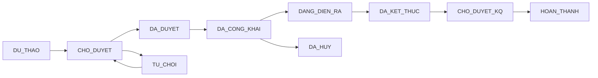
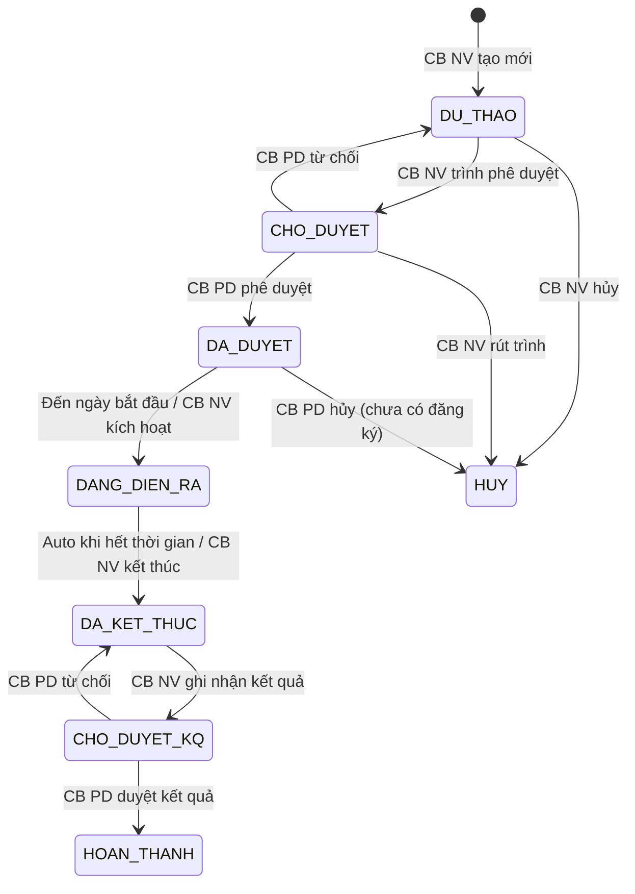
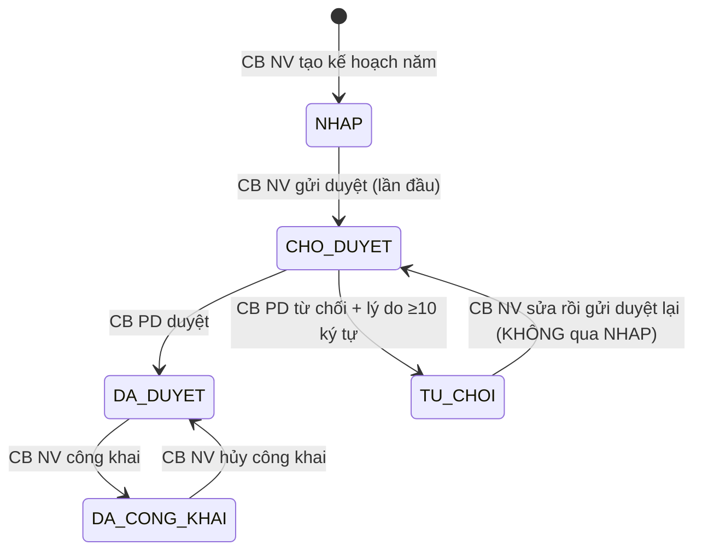
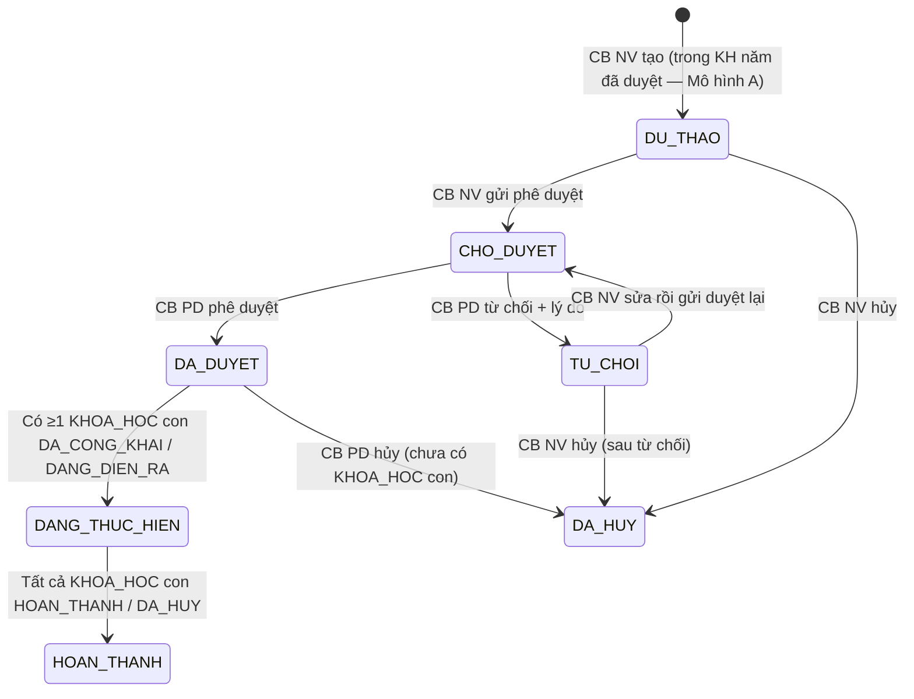

# SRS — Section 3.2.6: Quản lý Đào tạo, Tập huấn

**Dự án:** Phần mềm hỗ trợ pháp lý doanh nghiệp
**Phiên bản SRS:** 3.5 (kế thừa v3 + áp 11 thay đổi nghiệp vụ duyệt 2026-05-06; chi tiết tại `v3.5-delta-reports/v3.5-delta-fr-03.md`)
**Nhóm:** III — Quản lý Đào tạo, Tập huấn
**UC range:** UC 20 – UC 38 + UC mới (FR-III-22 quản lý lịch học buổi dạy)
**Số FR:** 24 (FR-III-01 → FR-III-20 + FR-III-NEW-01/02/03 + FR-III-22)
**File chính:** `srs-v3.md` Section 3.2

---

## Mục lục file này

- [1. Tổng quan nhóm](#1-tổng-quan-nhóm)
- [2. Yêu cầu chức năng chi tiết](#2-yêu-cầu-chức-năng-chi-tiết)
- [3. Màn hình chức năng](#3-màn-hình-chức-năng)
- [4. Entity liên quan](#4-entity-liên-quan)
- [5. State Machine liên quan](#5-state-machine-liên-quan)
- [6. Business Rules liên quan](#6-business-rules-liên-quan)

---

## 1. Tổng quan nhóm

**Mục đích:** Quản lý THÔNG TIN chương trình đào tạo, tập huấn bồi dưỡng kiến thức pháp luật cho DNNVV — KHÔNG phải LMS đầy đủ (Out-of-Scope OS-04).

**Entity chính:** KE_HOACH_DAO_TAO (kế hoạch năm — cấp 1), CHUONG_TRINH_DAO_TAO (CTDT — cấp 2), KHOA_HOC (cấp 3), LICH_HOC (buổi dạy), BAI_GIANG, NGAN_HANG_CAU_HOI, DE_KIEM_TRA, GIANG_VIEN, HOC_VIEN, DANG_KY_DAO_TAO, KET_QUA_DAO_TAO, DE_XUAT_DAO_TAO + junction KHOA_HOC_GIANG_VIEN.

**Tác nhân chính:** CB NV, CB PD, DN (chuyên trang), NHT (chuyên trang)

**Cấu trúc 3 cấp Mô hình A:**
```
Kế hoạch đào tạo năm (KE_HOACH_DAO_TAO) — quy trình phê duyệt SM-KH-DAO-TAO
└── Chương trình đào tạo (CHUONG_TRINH_DAO_TAO) — quy trình phê duyệt SM-CTDT
    └── Khóa học cụ thể (KHOA_HOC) — quy trình phê duyệt SM-KHOAHOC (giữ 9 trạng thái v3)
        ├── Lịch học (LICH_HOC, per-buổi — FR-III-22)
        ├── Bài giảng (N-N qua KHOA_HOC_GIANG_VIEN)
        ├── Danh sách học viên (HOC_VIEN qua DANG_KY_DAO_TAO)
        ├── Điểm danh per-buổi (KET_QUA_DAO_TAO + lich_hoc_id, enum CO_MAT/VANG_PHEP/VANG_KHONG_PHEP)
        └── Kết quả kiểm tra cuối khóa (KET_QUA_DAO_TAO + de_kiem_tra_id)
```

**Quy tắc 3 cấp:** CTDT chỉ tạo được khi kế hoạch năm cha đã DA_DUYET/DA_CONG_KHAI. Khóa học chỉ tạo được khi CTDT cha đã DA_DUYET. Mỗi cấp có quy trình phê duyệt riêng. Kế hoạch năm và CTDT áp dụng refinement Cách 2: TU_CHOI → CHO_DUYET trực tiếp khi gửi phê duyệt lại (không qua nháp). Khóa học giữ nguyên SM-KHOAHOC v3 9 trạng thái (CHO_DUYET → DU_THAO khi từ chối — quyết định BA OUT Thay đổi 3 lượt 2026-05-06).

**2 hình thức:** Trực tuyến và Trực tiếp — tương đương nhau về quy trình.

**Luồng phê duyệt:** CB NV cùng cấp tạo → CB PD cùng cấp duyệt (BR-FLOW-03 + BR-FLOW-04). Áp dụng cho cả 3 cấp (Kế hoạch năm, CTDT, Khóa học).

**State Machine — SM-KHOAHOC:**



**Auto-transition:**
- AT-01: CB NV nhấn "Gửi phê duyệt" → DU_THAO → CHO_DUYET
- AT-02: CB NV nhấn "Trình duyệt KQ" → DA_KET_THUC → CHO_DUYET_KQ

---

## 2. Yêu cầu chức năng chi tiết

---

### FR-III-01: Quản lý Chương trình đào tạo (UC20)

**UC Reference:** UC 20 | **Priority:** Essential | **Stability:** High
**Màn hình:** SCR-III-01

**Mô tả:** CRUD chương trình đào tạo (entity cha). Bao gồm quản lý khóa học (entity con) với đầy đủ trạng thái SM-KHOAHOC.

**Tác nhân:** CB NV (TW/BN/ĐP)

**Preconditions:**

| # | Điều kiện |
|---|----------|
| PRE-01 | User đã đăng nhập (BR-AUTH-01) |
| PRE-02 | User có quyền "Quản lý đào tạo" (UC115) |
| PRE-03 | Phân quyền theo đơn vị theo đơn vị |

**Inputs — CTDT:**

| # | Tên field | Kiểu logic | Bắt buộc | Ràng buộc | Mặc định |
|---|----------|-----------|----------|-----------|----------|
| 1 | ma_ctdt | text | Y (auto) | CTDT-{DON_VI}-{YYYY}-{SEQ} | — |
| 2 | ten_chuong_trinh | text | Y | Không rỗng | — |
| 3 | ke_hoach_id | identifier | Y | FK → KE_HOACH_DAO_TAO; kế hoạch năm cha phải DA_DUYET hoặc DA_CONG_KHAI (Mô hình A đảo chiều — quyết định 2026-05-06) | — |
| 4 | mo_ta | text (long) | N | — | — |
| 5 | linh_vuc_id | identifier | Y | FK → DANH_MUC | — |
| 6 | ngan_sach_du_kien | money | N | ≥ 0 | — |
| 7 | so_luong_khoa | number | N | ≥ 0 | — |
| 8 | muc_tieu | text (long) | N | — | — |
| 9 | file_dinh_kem | structured | N | Upload nhiều file (PDF/DOC/DOCX/XLS/XLSX, max 20MB/file) | — |
| 10 | cong_khai | boolean | N | Switch Công khai / Hủy công khai lên chuyên trang Cổng PLQG (Yêu cầu đối tác mục 01) | 0 |
| 11 | anh_dai_dien | structured | N | jpg/png/gif, max 5MB (Yêu cầu đối tác mục 01) | Ảnh mặc định hệ thống |
| 12 | thoi_gian_dang_tai | datetime | N | Auto fill khi cong_khai=1; clear khi cong_khai=0 (Yêu cầu đối tác mục 01) | — |
| 13 | mo_ta_cong_khai | text (long) | N | Mô tả hiển thị trên chuyên trang (Yêu cầu đối tác mục 01) | — |
| 14 | file_dinh_kem_cong_khai | structured | N | PDF/DOC/DOCX/XLS/XLSX, max 20MB/file (Yêu cầu đối tác mục 01) | — |

**Inputs — Khóa học (entity con):**

| # | Tên field | Kiểu logic | Bắt buộc | Ràng buộc | Mặc định |
|---|----------|-----------|----------|-----------|----------|
| 1 | ma_khoa_hoc | text | Y (auto) | KH-{YYYYMMDD}-{SEQ} | — |
| 2 | ten_khoa_hoc | text | Y | — | — |
| 3 | ctdt_id | identifier | Y | FK → CTDT; CTDT cha phải DA_DUYET | — |
| 4 | hinh_thuc | text | Y | TRUC_TUYEN / TRUC_TIEP | TRUC_TUYEN |
| 5 | ngay_bat_dau | date | Y | — | — |
| 6 | ngay_ket_thuc | date | Y | > ngay_bat_dau | — |
| 7 | doi_tuong | text | N | — | — |
| 8 | dia_diem | text | N | — | — |
| 9 | so_luong_toi_da | number | N | ≥ 1 | — |
| 10 | bai_giang_ids | identifier[] | N | FK → BAI_GIANG (N-N) | — |
| 11 | giang_vien_ids | identifier[] | Y | FK → GIANG_VIEN (N-N qua KHOA_HOC_GIANG_VIEN), tối thiểu 1 giảng viên ở trạng thái DANG_GIANG_DAY | — |
| 12 | ty_le_chuyen_can_toi_thieu | number | Y | 0–100 (đơn vị %); ngưỡng tối thiểu để học viên đạt khóa kết hợp với điểm thi đạt theo BR-KQ-02 | 80 |
| 13 | cong_khai | boolean | N | Switch Công khai / Hủy công khai lên chuyên trang Cổng PLQG — TÁCH khỏi trạng thái DA_CONG_KHAI (mở đăng ký) trong SM-KHOAHOC | 0 |
| 14 | anh_dai_dien | structured | N | jpg/png/gif, max 5MB | Ảnh mặc định hệ thống |
| 15 | thoi_gian_dang_tai | datetime | N | Auto fill khi cong_khai=1; clear khi cong_khai=0 | — |
| 16 | mo_ta_cong_khai | text (long) | N | Mô tả hiển thị trên chuyên trang | — |
| 17 | file_dinh_kem_cong_khai | structured | N | PDF/DOC/DOCX/XLS/XLSX, max 20MB/file | — |

**Processing — Xem danh sách:**

| Bước | Mô tả xử lý | BR áp dụng |
|------|-------------|-----------|
| 1 | Kiểm tra quyền và phân quyền theo đơn vị | BR-AUTH-01, BR-AUTH-08 |
| 2 | Lấy danh sách CHUONG_TRINH_DAO_TAO chưa xóa, trong phạm vi đơn vị | BR-DATA-02 |
| 3 | Phân trang (mặc định 20/trang) | BR-DATA-07 |

**Processing — Thêm mới CTDT:**

| Bước | Mô tả xử lý | BR áp dụng |
|------|-------------|-----------|
| 1 | Kiểm tra quyền | BR-AUTH-01 |
| 2 | Tự động sinh mã CTDT | BR-DATA-04 |
| 3 | Xác nhận tên chương trình không rỗng | — |
| 4 | Đặt trạng thái = NHAP | — |
| 5 | Tạo bản ghi CHUONG_TRINH_DAO_TAO | BR-DATA-03 |
| 6 | Ghi nhật ký thao tác | BR-DATA-05 |

**Processing — Chỉnh sửa:**

| Bước | Mô tả xử lý | BR áp dụng |
|------|-------------|-----------|
| 1 | Kiểm tra trạng thái = NHAP (chỉ sửa khi chưa duyệt) | — |
| 2 | Xác nhận dữ liệu đầu vào | — |
| 3 | Cập nhật CHUONG_TRINH_DAO_TAO | — |
| 4 | Ghi nhật ký thao tác (giá trị cũ → mới) | BR-DATA-05 |

**Processing — Xóa (xóa mềm):**

| Bước | Mô tả xử lý | BR áp dụng |
|------|-------------|-----------|
| 1 | Kiểm tra CTDT không có khóa học liên kết | — |
| 2 | Nếu có khóa học: từ chối xóa + cảnh báo | — |
| 3 | Đánh dấu xóa mềm | BR-DATA-01 |
| 4 | Ghi nhật ký thao tác | BR-DATA-05 |

**Processing — Xuất Excel:**

| Bước | Mô tả xử lý | BR áp dụng |
|------|-------------|-----------|
| 1 | Lấy danh sách theo filter, tối đa 10.000 dòng | BR-DATA-06 |
| 2 | Tạo file Excel + trả về download | — |

**Processing — Gửi phê duyệt CTDT (CTDT có quy trình phê duyệt riêng — SM-CTDT):**

| Bước | Mô tả xử lý | BR áp dụng |
|------|-------------|-----------|
| 1 | Kiểm tra quyền CB NV + CTDT thuộc đơn vị mình quản lý | BR-AUTH-01, BR-AUTH-08 |
| 2 | Kiểm tra trạng thái CTDT IN ('DU_THAO', 'TU_CHOI') — refinement Cách 2 cho phép trình lại sau từ chối | SM-CTDT |
| 3 | Validate đủ trường bắt buộc: ten_chuong_trinh, ke_hoach_id, linh_vuc_id; kiểm tra kế hoạch năm cha DA_DUYET hoặc DA_CONG_KHAI | — |
| 4 | Cập nhật trạng thái CTDT = CHO_DUYET; nếu chuyển từ TU_CHOI → clear ly_do_tu_choi + thoi_gian_tu_choi | SM-CTDT |
| 5 | Gửi thông báo CB PD cùng cấp | BR-NOTIF-01 |
| 6 | Ghi nhật ký (DU_THAO|TU_CHOI → CHO_DUYET) | BR-DATA-05 |

**Processing — Phê duyệt CTDT (CB PD):**

| Bước | Mô tả xử lý | BR áp dụng |
|------|-------------|-----------|
| 1 | Kiểm tra quyền CB PD + cùng cấp với CB NV tạo CTDT | BR-AUTH-01, BR-AUTH-05 |
| 2 | Kiểm tra trạng thái CTDT = CHO_DUYET | SM-CTDT |
| 3 | Cập nhật trạng thái CTDT = DA_DUYET; ghi thoi_gian_duyet + nguoi_duyet | BR-FLOW-03 |
| 4 | Gửi thông báo CB NV (người tạo CTDT) | BR-NOTIF-01 |
| 5 | Ghi nhật ký (CHO_DUYET → DA_DUYET) | BR-DATA-05 |

**Processing — Từ chối CTDT (CB PD):**

| Bước | Mô tả xử lý | BR áp dụng |
|------|-------------|-----------|
| 1 | Kiểm tra quyền CB PD + cùng cấp | BR-AUTH-01, BR-AUTH-05 |
| 2 | Kiểm tra trạng thái CTDT = CHO_DUYET | SM-CTDT |
| 3 | Validate ly_do_tu_choi ≥ 10 ký tự | BR-FLOW-04 |
| 4 | Cập nhật trạng thái CTDT = TU_CHOI (refinement Cách 2 — KHÔNG quay DU_THAO); ghi ly_do_tu_choi + thoi_gian_tu_choi + nguoi_tu_choi | BR-FLOW-04 |
| 5 | Gửi thông báo CB NV (người tạo CTDT) | BR-NOTIF-01 |
| 6 | Ghi nhật ký (CHO_DUYET → TU_CHOI) | BR-DATA-05 |

**Outputs — Danh sách:**

| # | Tên field | Kiểu logic | Mô tả |
|---|----------|-----------|-------|
| 1 | id | identifier | ID CTĐT |
| 2 | ma_ctdt | text | Mã CTĐT |
| 3 | ten_chuong_trinh | text | Tên |
| 4 | hinh_thuc | text | Hình thức |
| 5 | linh_vuc | text | Lĩnh vực |
| 6 | ngay_bat_dau | date | Ngày bắt đầu |
| 7 | ngay_ket_thuc | date | Ngày kết thúc |
| 8 | so_khoa_hoc | number | Số khóa học con |
| 9 | trang_thai | text | Trạng thái |
| 10 | total_count | number | Tổng bản ghi |

**Postconditions:**
- Bản ghi CHUONG_TRINH_DAO_TAO được tạo/cập nhật/xóa mềm
- AUDIT_LOG ghi nhận thao tác

**Error Handling `[v3.5 — Thay đổi 2 cổng duyệt 2026-05-06: thêm 4 mã lỗi cho phê duyệt CTDT]`:**

| # | Điều kiện lỗi | Mã lỗi | Phản hồi hệ thống | Severity |
|---|--------------|--------|-------------------|----------|
| E1 | Tên chương trình trống | ERR-CTDT-01 | "Tên chương trình là bắt buộc" | ERROR |
| E2 | Ngày kết thúc ≤ ngày bắt đầu | ERR-CTDT-02 | "Ngày kết thúc phải sau ngày bắt đầu" | ERROR |
| E3 | Xóa CTDT có khóa học | ERR-CTDT-03 | "Không thể xóa chương trình đã có khóa học" | ERROR |
| E4 | Sửa CTDT đã duyệt | ERR-CTDT-04 | "Không thể sửa chương trình đã được duyệt" | ERROR |
| E5 | Tạo CTDT khi kế hoạch năm cha chưa duyệt | ERR-CTDT-05 | "Kế hoạch năm cha phải ở trạng thái Đã duyệt hoặc Đã công khai mới được tạo CTDT" | ERROR |
| E6 | CB PD phê duyệt CTDT khác cấp | ERR-CTDT-PD-01 | "Không có quyền phê duyệt CTDT của đơn vị khác" | ERROR |
| E7 | CTDT không ở trạng thái Chờ duyệt | ERR-CTDT-PD-02 | "Chương trình đào tạo không ở trạng thái chờ phê duyệt" | ERROR |
| E8 | Từ chối không nhập lý do hoặc lý do < 10 ký tự | ERR-CTDT-PD-03 | "Lý do từ chối là bắt buộc và tối thiểu 10 ký tự" | ERROR |
| E9 | CB NV gửi phê duyệt khi CTDT không ở trạng thái Bản nháp / Bị từ chối | ERR-CTDT-PD-04 | "Chỉ gửi phê duyệt được CTDT ở trạng thái Bản nháp hoặc Bị từ chối" | ERROR |

**Acceptance Criteria `[v3.5 — Thay đổi 2 cổng duyệt 2026-05-06: thêm 4 AC cho phê duyệt CTDT]`:**
- **Given** CB NV truy cập CTDT **When** hiển thị **Then** danh sách CTDT thuộc đơn vị, phân trang
- **Given** CB NV thêm mới **When** nhập đủ trường + chọn kế hoạch năm cha đã duyệt **Then** lưu CTDT mới ở trạng thái Bản nháp
- **Given** CB NV chọn kế hoạch năm cha chưa duyệt **When** lưu CTDT **Then** hệ thống từ chối với ERR-CTDT-05
- **Given** CB NV TW **When** xem danh sách **Then** chỉ thấy CTDT thuộc TW
- **Given** CB NV xóa CTDT có khóa học **When** xác nhận **Then** từ chối + cảnh báo
- **Given** CB NV gửi phê duyệt CTDT đầy đủ **When** xác nhận **Then** CTDT → Chờ duyệt + CB PD cùng cấp nhận thông báo
- **Given** CB PD cùng cấp phê duyệt CTDT **When** xác nhận **Then** CTDT → Đã duyệt, ghi `thoi_gian_duyet` + `nguoi_duyet`; CB NV tạo nhận thông báo
- **Given** CB PD từ chối CTDT **When** nhập lý do ≥10 ký tự **Then** CTDT → Bị từ chối, ghi `ly_do_tu_choi` + `thoi_gian_tu_choi` + `nguoi_tu_choi`; CB NV tạo nhận thông báo
- **Given** CB NV sửa CTDT ở Bị từ chối rồi gửi phê duyệt lại **When** xác nhận **Then** CTDT → Chờ duyệt trực tiếp (KHÔNG qua Bản nháp — refinement Cách 2)
- **Given** CB PD khác cấp cố phê duyệt **Then** hệ thống từ chối với ERR-CTDT-PD-01

**Cross-ref:** BR-DATA-01 đến BR-DATA-08, BR-AUTH-05 (cùng cấp), BR-FLOW-03/04 (mở rộng cho CTDT), BR-NOTIF-01, Entity CHUONG_TRINH_DAO_TAO, KE_HOACH_DAO_TAO (cha), KHOA_HOC (con), SM-CTDT §5

---

### FR-III-02: Tìm kiếm CTDT (UC21)

**UC Reference:** UC 21 | **Priority:** Essential | **Stability:** High
**Màn hình:** SCR-III-01

**Mô tả:** Tìm kiếm CTDT theo từ khóa, lĩnh vực, hình thức, thời gian, trạng thái.

**Tác nhân:** CB NV / CB PD / DN / NHT

**Preconditions:**

| # | Điều kiện |
|---|----------|
| PRE-01 | User đã đăng nhập |

**Inputs — Bộ lọc:**

| # | Tên field | Kiểu logic | Bắt buộc | Ràng buộc |
|---|----------|-----------|----------|-----------|
| 1 | tu_khoa | text | N | Tìm theo tên/mã CTDT |
| 2 | linh_vuc_id | identifier | N | Lĩnh vực PL |
| 3 | hinh_thuc | text | N | TRUC_TUYEN / TRUC_TIEP |
| 4 | tu_ngay | date | N | Từ ngày |
| 5 | den_ngay | date | N | Đến ngày |
| 6 | trang_thai | text | N | Trạng thái |

**Processing:**

| Bước | Mô tả xử lý | BR áp dụng |
|------|-------------|-----------|
| 1 | Kiểm tra quyền và phân quyền | BR-AUTH-01, BR-AUTH-08 |
| 2 | Kết hợp tất cả điều kiện lọc (AND) | — |
| 3 | Phân trang (20/trang) | BR-DATA-07 |

**Outputs — Danh sách phân trang:**

| # | Tên field | Kiểu logic | Mô tả |
|---|----------|-----------|-------|
| 1 | id | identifier | ID CTĐT |
| 2 | ma_ctdt | text | Mã CTĐT |
| 3 | ten_chuong_trinh | text | Tên |
| 4 | hinh_thuc | text | Hình thức |
| 5 | linh_vuc | text | Lĩnh vực |
| 6 | ngay_bat_dau | date | Ngày bắt đầu |
| 7 | ngay_ket_thuc | date | Ngày kết thúc |
| 8 | so_khoa_hoc | number | Số khóa học con |
| 9 | trang_thai | text | Trạng thái |
| 10 | total_count | number | Tổng bản ghi |

**Postconditions:** Không thay đổi dữ liệu (read-only).

**Error Handling:**

| # | Điều kiện lỗi | Mã lỗi | Phản hồi hệ thống | Severity |
|---|--------------|--------|-------------------|----------|
| E1 | Không có kết quả | INF-CTDT-01 | "Không tìm thấy chương trình phù hợp" | INFO |

**Acceptance Criteria:**
- **Given** user nhập từ khóa **When** tìm kiếm **Then** hiển thị CTDT phù hợp, phân trang
- **Given** user lọc theo thời gian **When** chọn khoảng ngày **Then** hiển thị CTDT trong khoảng
- **Given** user lọc theo lĩnh vực **When** chọn lĩnh vực **Then** hiển thị CTDT thuộc lĩnh vực
- **Given** user kết hợp nhiều điều kiện **When** tìm kiếm **Then** áp dụng AND

**Cross-ref:** BR-AUTH-01, BR-DATA-07, Entity CHUONG_TRINH_DAO_TAO

---

### FR-III-03: Quản lý đăng ký đào tạo (UC22)

**UC Reference:** UC 22 | **Priority:** Essential | **Stability:** High
**Màn hình:** SCR-III-01

**Mô tả:** CB NV xem và duyệt/từ chối đăng ký tham gia khóa học.

**Tác nhân:** CB NV / CB PD

**Preconditions:**

| # | Điều kiện |
|---|----------|
| PRE-01 | User đã đăng nhập, có quyền "Quản lý đăng ký ĐT" |
| PRE-02 | Khóa học tồn tại, đang mở đăng ký |

**Inputs — Xem/Duyệt đăng ký:**

| # | Tên field | Kiểu logic | Bắt buộc | Ràng buộc |
|---|----------|-----------|----------|-----------|
| 1 | khoa_hoc_id | identifier | Y | Khóa học lọc |
| 2 | quyet_dinh | text | Y | DUYET / TU_CHOI |
| 3 | ly_do_tu_choi | text | Cond | Bắt buộc nếu TU_CHOI |

**Processing:**

| Bước | Mô tả xử lý | BR áp dụng |
|------|-------------|-----------|
| 1 | Kiểm tra quyền và phân quyền | BR-AUTH-01, BR-AUTH-08 |
| 2 | Lấy danh sách DANG_KY_DAO_TAO theo khóa học | — |
| 3 | Hiển thị: tên, đơn vị, khóa học, ngày đăng ký, trạng thái | — |
| 4 | Duyệt: cập nhật trạng thái = DA_DUYET, ghi nhật ký | — |
| 5 | Từ chối: cập nhật trạng thái = TU_CHOI + lý do, ghi nhật ký | — |
| 6 | Gửi thông báo người đăng ký | — |

**Outputs:**

| # | Tên field | Kiểu logic | Mô tả |
|---|----------|-----------|-------|
| 1 | id | identifier | ID đăng ký |
| 2 | ten_hoc_vien | text | Tên người đăng ký |
| 3 | don_vi | text | Đơn vị |
| 4 | khoa_hoc | text | Tên khóa học |
| 5 | ngay_dang_ky | datetime | Ngày đăng ký |
| 6 | trang_thai | text | CHO_DUYET / DA_DUYET / TU_CHOI |

**Postconditions:**
- Đăng ký được duyệt/từ chối
- Người đăng ký nhận thông báo
- Nhật ký thao tác ghi nhận

**Error Handling:**

| # | Điều kiện lỗi | Mã lỗi | Phản hồi hệ thống | Severity |
|---|--------------|--------|-------------------|----------|
| E1 | Khóa học đã đóng đăng ký | ERR-DKDT-01 | "Khóa học đã đóng đăng ký" | ERROR |
| E2 | Từ chối không có lý do | ERR-DKDT-02 | "Lý do từ chối là bắt buộc" | ERROR |

**Acceptance Criteria:**
- **Given** CB NV truy cập "Đăng ký Đào tạo" **When** hiển thị **Then** danh sách người đăng ký thuộc đơn vị, phân trang
- **Given** CB NV phê duyệt đăng ký **When** xác nhận **Then** trạng thái → DA_DUYET, ghi nhật ký
- **Given** CB NV từ chối **When** nhập lý do **Then** trạng thái → TU_CHOI

**Cross-ref:** BR-FLOW-03, Entity DANG_KY_DAO_TAO, KHOA_HOC

---

### FR-III-04: Đăng ký tham gia học tập (UC23)

**UC Reference:** UC 23 | **Priority:** Essential | **Stability:** High
**Màn hình:** (chuyên trang)

**Mô tả:** DN/NHT đăng ký tham gia khóa học qua chuyên trang. 3 cách: chuyên trang, nhập tay, import Excel.

**Tác nhân:** DN / NHT

**Preconditions:**

| # | Điều kiện |
|---|----------|
| PRE-01 | DN/NHT đã đăng nhập trên chuyên trang |
| PRE-02 | Khóa học đang mở đăng ký (trạng thái DA_CONG_KHAI) |

**Inputs:**

| # | Tên field | Kiểu logic | Bắt buộc | Ràng buộc |
|---|----------|-----------|----------|-----------|
| 1 | khoa_hoc_id | identifier | Y | Khóa học đăng ký |
| 2 | ho_ten | text | Y | Họ tên |
| 3 | don_vi | text | N | Đơn vị công tác |
| 4 | email | text | Y | Email |
| 5 | so_dien_thoai | text | Y | SĐT |
| 6 | ghi_chu | text | N | Ghi chú |
| 7 | nguon_dang_ky | text | Y | CHUYEN_TRANG / NHAP_TAY / IMPORT_EXCEL |

**Processing:**

| Bước | Mô tả xử lý | BR áp dụng |
|------|-------------|-----------|
| 1 | Kiểm tra khóa học đang mở (DA_CONG_KHAI) | SM-KHOAHOC |
| 2 | Kiểm tra chưa đăng ký trùng | — |
| 3 | Xác nhận dữ liệu đầu vào | — |
| 4 | Tạo bản ghi DANG_KY_DAO_TAO, trạng thái = CHO_DUYET | — |
| 5 | Gửi thông báo CB NV đơn vị quản lý khóa học | — |
| 6 | Nếu import Excel: validate template, import từng dòng, báo cáo KQ | — |

**Outputs:**

| # | Tên field | Kiểu logic | Mô tả |
|---|----------|-----------|-------|
| 1 | id | identifier | ID đăng ký |
| 2 | ho_ten | text | Họ tên |
| 3 | khoa_hoc | text | Tên khóa học |
| 4 | ngay_dang_ky | datetime | Ngày đăng ký |
| 5 | trang_thai | text | CHO_DUYET |
| 6 | ket_qua_import | structured | Số thành công / lỗi (nếu import Excel) |

**Postconditions:**
- Đăng ký được tạo, chờ CB NV duyệt
- CB NV nhận thông báo

**Error Handling:**

| # | Điều kiện lỗi | Mã lỗi | Phản hồi hệ thống | Severity |
|---|--------------|--------|-------------------|----------|
| E1 | Khóa học không mở | ERR-DK-DT-01 | "Khóa học chưa/đã đóng đăng ký" | ERROR |
| E2 | Đã đăng ký | ERR-DK-DT-02 | "Bạn đã đăng ký khóa học này" | ERROR |
| E3 | Lớp đầy | ERR-DK-DT-03 | "Lớp đã đủ số lượng" | ERROR |

**Acceptance Criteria:**
- **Given** DN/NHT xem khóa học đang mở **When** chọn đăng ký **Then** hiển thị form đăng ký
- **Given** DN/NHT nhập đủ thông tin **When** gửi **Then** đăng ký thành công, chờ duyệt
- **Given** DN/NHT đã đăng ký **When** đăng ký lại **Then** hệ thống từ chối

**Edge Cases:**

| EC | Điều kiện | Xử lý |
|----|-----------|-------|
| EC-01 | Đăng ký vượt sức chứa lớp học | Kiểm tra số đăng ký (trừ từ chối) < số lượng tối đa. Nếu đầy → ERR-DK-DT-03 |
| EC-02 | Hủy khóa học không thông báo học viên | Khi hủy khóa học, bắt buộc gửi thông báo cho tất cả học viên đã duyệt |
| EC-03 | Import kết quả đào tạo đồng thời bởi 2 CB NV | Sử dụng khóa hàng trên KHOA_HOC. CB thứ 2 nhận ERR-DK-DT-04 "Khóa học đang được cập nhật bởi người khác" |
| EC-04 | CTDT bị từ chối nhưng không cho sửa lại | Khi từ chối → cho phép CB NV chỉnh sửa và gửi lại phê duyệt |

**Cross-ref:** SM-KHOAHOC, Entity DANG_KY_DAO_TAO, KHOA_HOC

---

### FR-III-05: Quản lý kiểm tra, đánh giá kết quả (UC24)

**UC Reference:** UC 24 | **Priority:** Essential | **Stability:** High
**Màn hình:** SCR-III-02 (chi tiet Khoa hoc — Tab 3 "Lich hoc & Diem danh" + Tab 4 "Ket qua kiem tra")

**Mô tả:** Nhập kết quả đào tạo (điểm danh + kiểm tra). 2 tab: Điểm danh và Kiểm tra. Hỗ trợ nhập thủ công + import Excel.

**Tác nhân:** CB NV / CB PD

**Preconditions:**

| # | Điều kiện |
|---|----------|
| PRE-01 | User đã đăng nhập, có quyền "Quản lý kết quả ĐT" |
| PRE-02 | Khóa học tồn tại |

**Inputs — Nhập kết quả (2 tabs: Điểm danh + Kiểm tra) `[v3.5 — Thay đổi 11 cổng duyệt 2026-05-06]`:**

| # | Tên field | Kiểu logic | Bắt buộc | Ràng buộc |
|---|----------|-----------|----------|-----------|
| 1 | khoa_hoc_id | identifier | Y | Khóa học |
| 2 | hoc_vien_id | identifier | Y | Học viên |
| 3 | lich_hoc_id | identifier | Y | Buổi học cụ thể (FK → LICH_HOC, xem FR-III-22) — điểm danh phải gắn với 1 buổi cụ thể |
| 4 | diem_danh | enum | Y | CO_MAT / VANG_PHEP / VANG_KHONG_PHEP — phân biệt vắng có phép vs không phép cho công thức tỷ lệ chuyên cần (BR-KQ-02) |
| 5 | ngay_diem_danh | date | Y | Ngày điểm danh (derived từ lich_hoc_id) |
| 6 | diem_kiem_tra | number | N | 0-10 |
| 7 | ghi_chu | text | N | Ghi chú |

> **Lý do đổi diem_danh từ boolean sang enum 3 giá trị:** Nghiệp vụ Việt Nam phân biệt rõ "vắng có phép" (nghỉ hợp lệ — không trừ chuyên cần) vs "vắng không phép" (trừ chuyên cần). Boolean (Có / Vắng) gộp 2 dạng vắng vào 1 nên học viên xin nghỉ phép hợp lệ vẫn bị trừ chuyên cần — sai nghiệp vụ.

**Processing — Nhập thủ công:**

| Bước | Mô tả xử lý | BR áp dụng |
|------|-------------|-----------|
| 1 | Kiểm tra quyền | BR-AUTH-01 |
| 2 | Xác nhận điểm kiểm tra 0-10 | — |
| 3 | Tạo/cập nhật KET_QUA_HOC_TAP | — |
| 4 | Ghi nhật ký thao tác | BR-DATA-05 |

**Processing — Import Excel:**

| Bước | Mô tả xử lý | BR áp dụng |
|------|-------------|-----------|
| 1 | Upload file Excel (.xlsx) | — |
| 2 | Xác nhận format: cột bắt buộc | — |
| 3 | Xác nhận dữ liệu từng dòng | — |
| 4 | Hiển thị bản review (thành công / lỗi) | — |
| 5 | Nếu xác nhận: merge kết quả | — |
| 6 | Trả về báo cáo import | — |

**Processing — Xuất Excel:**

| Bước | Mô tả xử lý | BR áp dụng |
|------|-------------|-----------|
| 1 | Lấy KET_QUA_HOC_TAP theo khóa học | — |
| 2 | Tạo file Excel (.xlsx) + download | — |

**Outputs `[v3.5 — Thay đổi 7+11 cổng duyệt 2026-05-06]`:**

| # | Tên field | Kiểu logic | Mô tả |
|---|----------|-----------|-------|
| 1 | hoc_vien_id | identifier | ID học viên |
| 2 | ho_ten | text | Họ tên |
| 3 | email | text | Email học viên (join HOC_VIEN — Yêu cầu đối tác mục 05/05b) |
| 4 | so_dien_thoai | text | SĐT học viên (join HOC_VIEN — Yêu cầu đối tác mục 05/05b) |
| 5 | don_vi | text | Đơn vị công tác (join HOC_VIEN — Yêu cầu đối tác mục 05/05b) |
| 6 | so_buoi_co_mat | number | Số buổi có mặt (CO_MAT) |
| 7 | so_buoi_vang_phep | number | Số buổi vắng có phép (VANG_PHEP) |
| 8 | so_buoi_vang_khong_phep | number | Số buổi vắng không phép (VANG_KHONG_PHEP) |
| 9 | tong_buoi | number | Tổng số buổi |
| 10 | ty_le_chuyen_can | number | % chuyên cần = (so_buoi_co_mat + so_buoi_vang_phep) / tong_buoi × 100 |
| 11 | diem_kiem_tra | number | Điểm kiểm tra |
| 12 | xep_loai | text | Giỏi / Khá / Trung bình / Không đạt — auto từ điểm theo BR-KQ-01 |
| 13 | ket_qua | text | DAT / KHONG_DAT — auto theo BR-KQ-02 (chuyên cần ≥ ngưỡng VÀ điểm ≥ điểm đạt) |

**Postconditions:**
- Kết quả học tập được ghi nhận
- Nhật ký thao tác ghi nhận

**Error Handling:**

| # | Điều kiện lỗi | Mã lỗi | Phản hồi hệ thống | Severity |
|---|--------------|--------|-------------------|----------|
| E1 | Điểm ngoài 0-10 | ERR-KQ-01 | "Điểm kiểm tra phải từ 0 đến 10" | ERROR |
| E2 | File format lỗi | ERR-KQ-02 | "File không đúng định dạng mẫu" | ERROR |
| E3 | Mã HV không tồn tại | ERR-KQ-03 | "Mã học viên dòng {N} không tồn tại" | ERROR |
| E4 | diem_danh không thuộc enum (CO_MAT / VANG_PHEP / VANG_KHONG_PHEP) | ERR-KQ-04 | "Giá trị điểm danh không hợp lệ" | ERROR |

**Acceptance Criteria:**
- **Given** CB NV truy cập "Kết quả" **When** chọn khóa học **Then** hiển thị danh sách học viên + kết quả
- **Given** CB NV nhập kết quả thủ công **When** lưu **Then** validate + ghi nhận
- **Given** CB NV import Excel **When** upload file **Then** validate + import + báo cáo lỗi
- **Given** CB NV xuất kết quả **When** nhấn "Xuất Excel" **Then** tải file Excel

**Cross-ref:** Entity KET_QUA_HOC_TAP, KHOA_HOC, HOC_VIEN

---

### FR-III-06: Tìm kiếm kết quả (UC25)

**UC Reference:** UC 25 | **Priority:** Essential | **Stability:** High
**Màn hình:** SCR-III-02 (chi tiet Khoa hoc — Tab 3 "Lich hoc & Diem danh" + Tab 4 "Ket qua kiem tra")

**Mô tả:** Tìm kiếm kết quả đào tạo theo tên học viên, khóa học, kết quả.

**Tác nhân:** CB NV / CB PD

**Preconditions:**

| # | Điều kiện |
|---|----------|
| PRE-01 | User đã đăng nhập |

**Inputs — Bộ lọc:**

| # | Tên field | Kiểu logic | Bắt buộc | Ràng buộc |
|---|----------|-----------|----------|-----------|
| 1 | tu_khoa | text | N | Tìm theo tên học viên |
| 2 | khoa_hoc_id | identifier | N | Khóa học |
| 3 | ket_qua | text | N | DAT / KHONG_DAT |

**Processing:**

| Bước | Mô tả xử lý | BR áp dụng |
|------|-------------|-----------|
| 1 | Kiểm tra quyền | BR-AUTH-01, BR-AUTH-08 |
| 2 | Lấy KET_QUA_HOC_TAP kết hợp HOC_VIEN, KHOA_HOC theo điều kiện | — |
| 3 | Phân trang | BR-DATA-07 |

**Outputs — Danh sách phân trang:**

| # | Tên field | Kiểu logic | Mô tả |
|---|----------|-----------|-------|
| 1 | hoc_vien_id | identifier | ID học viên |
| 2 | ho_ten | text | Họ tên |
| 3 | ten_khoa_hoc | text | Tên khóa học |
| 4 | so_buoi_co_mat | number | Số buổi có mặt |
| 5 | tong_buoi | number | Tổng số buổi |
| 6 | ty_le_chuyen_can | number | % chuyên cần |
| 7 | diem_kiem_tra | number | Điểm kiểm tra |
| 8 | ket_qua | text | DAT / KHONG_DAT |
| 9 | total_count | number | Tổng bản ghi |

**Postconditions:** Không thay đổi dữ liệu (read-only).

**Acceptance Criteria:**
- **Given** CB NV nhập từ khóa **When** tìm kiếm **Then** hiển thị kết quả phù hợp, phân trang
- **Given** CB NV lọc theo học viên **When** chọn **Then** hiển thị tất cả kết quả của học viên
- **Given** CB NV lọc theo khóa học **When** chọn **Then** hiển thị kết quả khóa đó

**Cross-ref:** Entity KET_QUA_HOC_TAP, HOC_VIEN, KHOA_HOC

---

### FR-III-07: Quản lý kho tài liệu, bài giảng (UC26)

**UC Reference:** UC 26 | **Priority:** Essential | **Stability:** High
**Màn hình:** SCR-III-03

**Mô tả:** Quản lý tài liệu/bài giảng dùng chung. 3 loại: Slide (PPTX), PDF, Video (YouTube embed). Preview inline. Switch công khai lên chuyên trang.

**Tác nhân:** CB NV / CB PD

**Preconditions:**

| # | Điều kiện |
|---|----------|
| PRE-01 | User đã đăng nhập, có quyền "Quản lý tài liệu ĐT" |

**Inputs `[v3.5 — Thay đổi 5 cổng duyệt 2026-05-06: thêm 3 trường công khai chung còn thiếu]`:**

| # | Tên field | Kiểu logic | Bắt buộc | Ràng buộc |
|---|----------|-----------|----------|-----------|
| 1 | ten_bai_giang | text | Y | — |
| 2 | mo_ta | text (long) | Y | — |
| 3 | loai_tai_lieu | text | Y | SLIDE / PDF / VIDEO |
| 4 | file_bai_giang | structured | Cond | Max 20MB, .pptx/.pdf (bắt buộc nếu SLIDE/PDF) |
| 5 | url_youtube | text | Cond | URL YouTube (bắt buộc nếu VIDEO) |
| 6 | linh_vuc_ids | identifier[] | N | Chọn nhiều lĩnh vực |
| 7 | anh_dai_dien | structured | N | Ảnh đại diện chuyên trang (đã có v3) — jpg/png/gif, max 5MB |
| 8 | cong_khai | boolean | N | Switch công khai lên chuyên trang Cổng PLQG (đã có v3) — mặc định 0 |
| 9 | thoi_gian_dang_tai | datetime | N | **[v3.5 mới — Yêu cầu đối tác mục 01]** Auto fill khi cong_khai=1; clear khi cong_khai=0 |
| 10 | mo_ta_cong_khai | text (long) | N | **[v3.5 mới — Yêu cầu đối tác mục 01]** Mô tả hiển thị trên chuyên trang (khác `mo_ta` nội bộ ở field 2) |
| 11 | file_dinh_kem_cong_khai | structured | N | **[v3.5 mới — Yêu cầu đối tác mục 01]** PDF/DOC/DOCX/XLS/XLSX, max 20MB/file |

**Processing — Thêm mới:**

| Bước | Mô tả xử lý | BR áp dụng |
|------|-------------|-----------|
| 1 | Kiểm tra quyền | BR-AUTH-01 |
| 2 | Xác nhận tên bài giảng không rỗng | — |
| 3 | Nếu Slide/PDF: kiểm tra file ≤ 20MB, đúng định dạng | — |
| 4 | Nếu VIDEO: kiểm tra URL YouTube hợp lệ | — |
| 5 | Tạo bản ghi BAI_GIANG | BR-DATA-03 |
| 6 | Upload file → storage | — |
| 7 | Ghi nhật ký thao tác | BR-DATA-05 |

**Outputs:**

| # | Tên field | Kiểu logic | Mô tả |
|---|----------|-----------|-------|
| 1 | id | identifier | ID bài giảng |
| 2 | ten_bai_giang | text | Tên |
| 3 | loai_tai_lieu | text | Slide / PDF / VIDEO |
| 4 | khoa_hoc | text | Khóa học liên kết |
| 5 | file_url | text | URL file/YouTube |
| 6 | dung_luong | number | Dung lượng file (bytes) |
| 7 | ngay_tao | datetime | Ngày tạo |

**Postconditions:**
- Tài liệu/bài giảng được lưu trữ
- File Slide/PDF được upload vào storage

**Error Handling:**

| # | Điều kiện lỗi | Mã lỗi | Phản hồi hệ thống | Severity |
|---|--------------|--------|-------------------|----------|
| E1 | File vượt 20MB | ERR-BG-01 | "File tối đa 20MB" | ERROR |
| E2 | File sai định dạng | ERR-BG-02 | "Chỉ chấp nhận file Slide hoặc PDF" | ERROR |
| E3 | URL YouTube không hợp lệ | ERR-BG-03 | "URL YouTube không hợp lệ" | ERROR |

**Acceptance Criteria:**
- **Given** CB NV truy cập "Kho tài liệu" **When** hiển thị **Then** danh sách tài liệu, phân trang
- **Given** CB NV thêm bài giảng Slide/PDF **When** upload file ≤ 20MB **Then** lưu thành công + preview được
- **Given** CB NV thêm video **When** nhập URL YouTube **Then** embed + lưu thành công
- **Given** CB NV xem file **When** chọn preview **Then** hiển thị nội dung trên trình duyệt

**Cross-ref:** Entity BAI_GIANG, KHOA_HOC

---

### FR-III-08: Tìm kiếm tài liệu (UC27)

**UC Reference:** UC 27 | **Priority:** Essential | **Stability:** High
**Màn hình:** SCR-III-03

**Mô tả:** Tìm kiếm tài liệu/bài giảng theo từ khóa, loại, khoảng ngày.

**Tác nhân:** CB NV / CB PD

**Preconditions:**

| # | Điều kiện |
|---|----------|
| PRE-01 | User đã đăng nhập |

**Inputs — Bộ lọc:**

| # | Tên field | Kiểu logic | Bắt buộc | Ràng buộc |
|---|----------|-----------|----------|-----------|
| 1 | tu_khoa | text | N | Tìm theo tên |
| 2 | loai_tai_lieu | text | N | PDF / VIDEO |
| 3 | tu_ngay | date | N | Từ ngày tạo |
| 4 | den_ngay | date | N | Đến ngày tạo |

**Processing:**

| Bước | Mô tả xử lý | BR áp dụng |
|------|-------------|-----------|
| 1 | Kiểm tra quyền | BR-AUTH-01, BR-AUTH-08 |
| 2 | Lấy BAI_GIANG theo điều kiện lọc | — |
| 3 | Phân trang | BR-DATA-07 |

**Outputs — Danh sách phân trang:**

| # | Tên field | Kiểu logic | Mô tả |
|---|----------|-----------|-------|
| 1 | id | identifier | ID tài liệu |
| 2 | ten_bai_giang | text | Tên bài giảng |
| 3 | loai_tai_lieu | text | SLIDE / PDF / VIDEO |
| 4 | ten_khoa_hoc | text | Khóa học liên kết |
| 5 | kich_thuoc | number | Kích thước file (bytes) |
| 6 | ngay_tao | datetime | Ngày tạo |
| 7 | total_count | number | Tổng bản ghi |

**Postconditions:** Không thay đổi dữ liệu (read-only).

**Acceptance Criteria:**
- **Given** CB NV nhập từ khóa **When** tìm kiếm **Then** hiển thị tài liệu phù hợp, phân trang
- **Given** CB NV lọc theo loại (PDF/Video) **When** chọn **Then** hiển thị tương ứng
- **Given** CB NV kết hợp nhiều điều kiện **When** tìm kiếm **Then** áp dụng AND

**Cross-ref:** Entity BAI_GIANG

---

### FR-III-09: Quản lý ngân hàng câu hỏi (UC28)

**UC Reference:** UC 28 | **Priority:** Essential | **Stability:** High
**Màn hình:** SCR-III-04

**Mô tả:** CRUD câu hỏi trắc nghiệm/tự luận. 3 loại: TRAC_NGHIEM_MOT, TRAC_NGHIEM_NHIEU, TU_LUAN.

**Tác nhân:** CB NV / CB PD

**Preconditions:**

| # | Điều kiện |
|---|----------|
| PRE-01 | User đã đăng nhập, có quyền "Quản lý ngân hàng câu hỏi" |

**Inputs:**

| # | Tên field | Kiểu logic | Bắt buộc | Ràng buộc |
|---|----------|-----------|----------|-----------|
| 1 | noi_dung | text (long) | Y | Rich text |
| 2 | linh_vuc_id | identifier | Y | — |
| 3 | muc_do | text | Y | DE / TRUNG_BINH / KHO |
| 4 | loai_cau_hoi | text | Y | TRAC_NGHIEM_MOT / TRAC_NGHIEM_NHIEU / TU_LUAN |
| 5 | cac_lua_chon | structured | Cond | ≥ 2 lựa chọn (nếu trắc nghiệm) |
| 6 | dap_an_dung | text | Cond | 1 giá trị (SINGLE) hoặc array ≥ 2 (MULTI) |
| 7 | trang_thai | text | Y | NHAP / CONG_KHAI / AN |

**Processing:**

| Bước | Mô tả xử lý | BR áp dụng |
|------|-------------|-----------|
| 1 | Kiểm tra quyền | BR-AUTH-01 |
| 2 | Xác nhận dữ liệu | — |
| 3 | Nếu trắc nghiệm: kiểm tra ≥ 2 lựa chọn, đáp án đúng hợp lệ | — |
| 4 | Tạo/cập nhật NGAN_HANG_CAU_HOI | BR-DATA-03 |
| 5 | Ghi nhật ký thao tác | BR-DATA-05 |

**Processing — Xóa:**

| Bước | Mô tả xử lý | BR áp dụng |
|------|-------------|-----------|
| 1 | Kiểm tra câu hỏi có đang dùng trong đề kiểm tra | — |
| 2 | Nếu đang dùng: cảnh báo liên kết, xác nhận | — |
| 3 | Xóa mềm | BR-DATA-01 |

**Outputs:**

| # | Tên field | Kiểu logic | Mô tả |
|---|----------|-----------|-------|
| 1 | id | identifier | ID câu hỏi |
| 2 | noi_dung | text | Nội dung tóm tắt (200 ký tự) |
| 3 | linh_vuc | text | Lĩnh vực |
| 4 | muc_do | text | Mức độ khó |
| 5 | loai_cau_hoi | text | Loại |
| 6 | so_de_su_dung | number | Số đề đang sử dụng |

**Postconditions:**
- Câu hỏi được tạo/cập nhật/xóa mềm
- Nhật ký thao tác ghi nhận

**Error Handling:**

| # | Điều kiện lỗi | Mã lỗi | Phản hồi hệ thống | Severity |
|---|--------------|--------|-------------------|----------|
| E1 | Nội dung trống | ERR-NHCH-01 | "Nội dung câu hỏi là bắt buộc" | ERROR |
| E2 | < 2 lựa chọn | ERR-NHCH-02 | "Câu trắc nghiệm phải có ≥ 2 lựa chọn" | ERROR |
| E3 | Xóa câu hỏi đang dùng | WRN-NHCH-01 | "Câu hỏi đang dùng trong {N} đề kiểm tra" | WARNING |

**Acceptance Criteria:**
- **Given** CB NV truy cập "Ngân hàng câu hỏi" **When** hiển thị **Then** danh sách câu hỏi, phân trang
- **Given** CB NV thêm mới **When** nhập nội dung + phân loại **Then** validate + lưu
- **Given** CB NV xóa câu hỏi đang dùng **When** xác nhận **Then** cảnh báo liên kết

**Cross-ref:** Entity NGAN_HANG_CAU_HOI, DE_KIEM_TRA

---

### FR-III-10: Tìm kiếm ngân hàng câu hỏi (UC29)

**UC Reference:** UC 29 | **Priority:** Essential | **Stability:** High
**Màn hình:** SCR-III-04

**Mô tả:** Tìm kiếm câu hỏi theo từ khóa, lĩnh vực, mức độ, loại.

**Tác nhân:** CB NV / CB PD

**Preconditions:**

| # | Điều kiện |
|---|----------|
| PRE-01 | User đã đăng nhập |

**Inputs — Bộ lọc:**

| # | Tên field | Kiểu logic | Bắt buộc | Ràng buộc |
|---|----------|-----------|----------|-----------|
| 1 | tu_khoa | text | N | Từ khóa |
| 2 | linh_vuc_id | identifier | N | Lĩnh vực PL |
| 3 | muc_do | text | N | DE / TRUNG_BINH / KHO |
| 4 | loai_cau_hoi | text | N | TRAC_NGHIEM / TU_LUAN |

**Processing:**

| Bước | Mô tả xử lý | BR áp dụng |
|------|-------------|-----------|
| 1 | Kiểm tra quyền | BR-AUTH-01 |
| 2 | Lấy NGAN_HANG_CAU_HOI theo điều kiện lọc | — |
| 3 | Phân trang | BR-DATA-07 |

**Outputs — Danh sách phân trang:**

| # | Tên field | Kiểu logic | Mô tả |
|---|----------|-----------|-------|
| 1 | id | identifier | ID câu hỏi |
| 2 | noi_dung | text | Nội dung tóm tắt |
| 3 | linh_vuc | text | Lĩnh vực |
| 4 | muc_do | text | Mức độ |
| 5 | loai_cau_hoi | text | Loại |
| 6 | total_count | number | Tổng bản ghi |

**Postconditions:** Không thay đổi dữ liệu (read-only).

**Acceptance Criteria:**
- **Given** CB NV nhập từ khóa **When** tìm kiếm **Then** hiển thị câu hỏi phù hợp
- **Given** CB NV lọc theo lĩnh vực **When** chọn **Then** hiển thị câu hỏi thuộc lĩnh vực
- **Given** CB NV lọc theo mức độ khó **When** chọn **Then** hiển thị tương ứng

**Cross-ref:** Entity NGAN_HANG_CAU_HOI

---

### FR-III-11: Quản lý giảng viên, trợ giảng (UC30)

**UC Reference:** UC 30 | **Priority:** Essential | **Stability:** High
**Màn hình:** SCR-III-05

**Mô tả:** CRUD giảng viên/trợ giảng. Chi tiết 2 tab: Thông tin + Lịch sử giảng dạy.

**Tác nhân:** CB NV / CB PD

**Preconditions:** User đã đăng nhập, có quyền "Quản lý giảng viên".

**Inputs:** ho_ten (text, Y), chuyen_nganh (text, Y), trinh_do (text, Y), don_vi (text, N), email (text, N), so_dien_thoai (text, N), linh_vuc_ids (identifier[], Y), mo_ta_nang_luc (text long, N), trang_thai (text, Y: DANG_GIANG_DAY / TAM_DUNG), file_dinh_kem (structured, N).

**Processing:** Kiểm tra quyền → Xác nhận dữ liệu → Tạo/cập nhật GIANG_VIEN → Ghi nhật ký. Xóa: kiểm tra phân công → cảnh báo nếu đang dạy → xóa mềm.

**Outputs:** id, ho_ten, chuyen_nganh, vai_tro, so_khoa_da_day, linh_vuc. Tab Lịch sử: khoa_hoc_id, ten_khoa_hoc, thoi_gian, vai_tro (từ KHOA_HOC_GIANG_VIEN — vai trò gắn cấp khóa, override `GIANG_VIEN.loai`; xem Thay đổi 13), trang_thai_khoa.

**Postconditions:** GV được tạo/cập nhật/xóa mềm. Nhật ký ghi nhận.

**Error Handling:** ERR-GV-01 "Họ tên là bắt buộc" (ERROR). WRN-GV-01 "GV đang phân công dạy {N} khóa" (WARNING).

**Acceptance Criteria:**
- **Given** CB NV truy cập "Giảng viên" **When** hiển thị **Then** danh sách GV thuộc đơn vị
- **Given** CB NV xem chi tiết **When** chọn tab "Lịch sử giảng dạy" **Then** hiển thị DS khóa đã dạy, vai trò

---

### FR-III-12: Tìm kiếm giảng viên (UC31)

**UC Reference:** UC 31 | **Priority:** Essential | **Stability:** High
**Màn hình:** SCR-III-05

**Mô tả:** Tìm kiếm GV theo từ khóa, lĩnh vực.

**Tác nhân:** CB NV / CB PD

**Preconditions:** User đã đăng nhập.

**Inputs:** tu_khoa (text, N), linh_vuc_id (identifier, N), vai_tro (text, N: GIANG_VIEN / TRO_GIANG).

**Processing:** Kiểm tra quyền → Lấy GIANG_VIEN theo điều kiện → Phân trang.

**Outputs:** id, ho_ten, chuyen_nganh, linh_vuc, trang_thai, total_count.

**Postconditions:** Read-only.

**Acceptance Criteria:**
- **Given** CB NV nhập từ khóa **When** tìm kiếm **Then** hiển thị GV phù hợp, phân trang
- **Given** CB NV lọc theo lĩnh vực **When** chọn **Then** hiển thị GV thuộc lĩnh vực

---

### FR-III-13: Quản lý đề xuất đào tạo (UC32)

**UC Reference:** UC 32 | **Priority:** Essential | **Stability:** High
**Màn hình:** SCR-III-01 (tab "De xuat")

**Mô tả:** DN/NHT gửi đề xuất đào tạo. CB NV tiếp nhận. Sửa/xóa khi chưa tiếp nhận.

**Tác nhân:** DN / NHT

**Preconditions:** DN/NHT đã đăng nhập.

**Inputs:** linh_vuc_id (identifier, Y), noi_dung (text long, Y), thoi_gian_mong_muon (text, N), dia_diem_mong_muon (text, N), so_luong_du_kien (number, N).

**Processing:** Validate → Tạo DE_XUAT_DAO_TAO (MOI) → Thông báo CB NV → Ghi nhật ký. Sửa: chỉ khi MOI. Xóa: chỉ khi MOI, xóa mềm.

**Outputs:** id, linh_vuc, noi_dung (truncate), trang_thai (MOI/DA_TIEP_NHAN/DA_THUC_HIEN), ngay_tao.

**Postconditions:** Đề xuất được tạo/cập nhật/xóa mềm. CB NV nhận thông báo.

**Error Handling:** ERR-DX-01 "Nội dung đề xuất là bắt buộc". ERR-DX-02 "Không thể sửa đề xuất đã tiếp nhận". ERR-DX-03 "Đề xuất đã tiếp nhận không thể xóa".

**Acceptance Criteria:**
- **Given** DN/NHT thêm mới **When** nhập nội dung + lĩnh vực **Then** gửi cho đơn vị quản lý
- **Given** CB NV xóa đề xuất **When** đề xuất chưa tiếp nhận **Then** xóa mềm

---

### FR-III-14: Lập kế hoạch đào tạo năm (UC33) `[v3.5 — viết lại đầy đủ theo Thay đổi 1+6+8 cổng duyệt 2026-05-06]`

**UC Reference:** UC 33 | **Priority:** Essential | **Stability:** High
**Màn hình:** SCR-III-00 (sub-menu 1 — màn hình riêng cho Kế hoạch đào tạo năm)

**Mô tả:** Lập kế hoạch đào tạo năm — entity cha cấp 1 trong cấu trúc 3 cấp Mô hình A (1 kế hoạch năm chứa N CTDT). CRUD đầy đủ + quy trình phê duyệt SM-KH-DAO-TAO + công khai chuyên trang. Mô hình A đảo chiều: KE_HOACH_DAO_TAO 1:N CHUONG_TRINH_DAO_TAO; FK `ke_hoach_id` nằm phía CTDT.

**Tác nhân:** CB NV (CRUD + gửi phê duyệt + công khai) · CB PD (xem + phê duyệt/từ chối)

**Preconditions:**

| # | Điều kiện |
|---|----------|
| PRE-01 | User đã đăng nhập (BR-AUTH-01) |
| PRE-02 | User có quyền "Quản lý kế hoạch đào tạo năm" theo action |
| PRE-03 | Phân quyền dữ liệu theo đơn vị (BR-AUTH-08) |

**Inputs — Tạo / Sửa kế hoạch năm:**

| # | Tên field | Kiểu logic | Bắt buộc | Ràng buộc | Mặc định |
|---|----------|-----------|----------|-----------|----------|
| 1 | ten_ke_hoach | text | Y | Không rỗng, ≤ 500 ký tự | — |
| 2 | nam | number | Y | YYYY (4 số) | Năm hiện tại |
| 3 | thoi_gian_bat_dau | date | Y | — | 01/01/{nam} |
| 4 | thoi_gian_ket_thuc | date | Y | > thoi_gian_bat_dau | 31/12/{nam} |
| 5 | ngan_sach_du_kien | money | N | ≥ 0, đơn vị VNĐ | — |
| 6 | noi_dung | text (long) | N | Mô tả nội dung kế hoạch | — |
| 7 | nguon_luc | text (long) | N | Mô tả nhân sự, cơ sở vật chất | — |
| 8 | ghi_chu | text (long) | N | — | — |
| 9 | file_dinh_kem | structured | N | Multi-file PDF/DOC/DOCX/XLS/XLSX, max 20MB/file (Yêu cầu đối tác mục 07) | — |

> **Lưu ý Mô hình A:** Kế hoạch năm KHÔNG có FK `ctdt_id` (đảo chiều — Thay đổi 1 cổng duyệt 2026-05-06). Quan hệ KE_HOACH_DAO_TAO 1:N CHUONG_TRINH_DAO_TAO; FK `ke_hoach_id` nằm phía CTDT (xem FR-III-01 Inputs CTDT field 3).

**Processing — Xem danh sách:**

| Bước | Mô tả xử lý | BR áp dụng |
|------|-------------|-----------|
| 1 | Kiểm tra quyền + phân quyền theo đơn vị | BR-AUTH-01, BR-AUTH-08 |
| 2 | Lấy danh sách KE_HOACH_DAO_TAO chưa xóa thuộc đơn vị | BR-DATA-02 |
| 3 | Phân trang (mặc định 20/trang) | BR-DATA-07 |

**Processing — Xem chi tiết:**

| Bước | Mô tả xử lý | BR áp dụng |
|------|-------------|-----------|
| 1 | Kiểm tra quyền + đơn vị | BR-AUTH-01, BR-AUTH-08 |
| 2 | Lấy KE_HOACH_DAO_TAO + COUNT CTDT con | — |
| 3 | Trả full fields + danh sách CTDT thuộc kế hoạch năm này | — |

**Processing — Thêm mới:**

| Bước | Mô tả xử lý | BR áp dụng |
|------|-------------|-----------|
| 1 | Kiểm tra quyền tạo KH năm | BR-AUTH-01 |
| 2 | Validate đủ trường bắt buộc | — |
| 3 | Đặt trạng thái = NHAP | — |
| 4 | Tạo bản ghi KE_HOACH_DAO_TAO + Common Fields | BR-DATA-03 |
| 5 | Ghi nhật ký | BR-DATA-05 |

**Processing — Chỉnh sửa:**

| Bước | Mô tả xử lý | BR áp dụng |
|------|-------------|-----------|
| 1 | Kiểm tra quyền + đơn vị | BR-AUTH-01, BR-AUTH-08 |
| 2 | Kiểm tra trạng thái IN ('NHAP', 'TU_CHOI') (BR-FLOW-03 mở rộng — TU_CHOI cũng cho sửa theo refinement Cách 2) | BR-FLOW-03 |
| 3 | Validate dữ liệu | — |
| 4 | Cập nhật KE_HOACH_DAO_TAO | — |
| 5 | Ghi nhật ký (giá trị cũ → mới) | BR-DATA-05 |

**Processing — Xóa (xóa mềm):**

| Bước | Mô tả xử lý | BR áp dụng |
|------|-------------|-----------|
| 1 | Kiểm tra quyền | BR-AUTH-01 |
| 2 | Kiểm tra trạng thái = NHAP (chỉ xóa khi chưa trình) | — |
| 3 | Kiểm tra kế hoạch năm chưa có CTDT con (`COUNT(CHUONG_TRINH_DAO_TAO WHERE ke_hoach_id = id) = 0`) | — |
| 4 | Đánh dấu xóa mềm | BR-DATA-01 |
| 5 | Ghi nhật ký | BR-DATA-05 |

**Processing — Xuất Excel:**

| Bước | Mô tả xử lý | BR áp dụng |
|------|-------------|-----------|
| 1 | Kiểm tra quyền | BR-AUTH-01 |
| 2 | Lấy danh sách theo filter, tối đa 10.000 dòng | BR-DATA-06 |
| 3 | Tạo file Excel + trả về download | — |

**Processing — Gửi phê duyệt:**

| Bước | Mô tả xử lý | BR áp dụng |
|------|-------------|-----------|
| 1 | Kiểm tra quyền | BR-AUTH-01 |
| 2 | Kiểm tra trạng thái IN ('NHAP', 'TU_CHOI') | SM-KH-DAO-TAO |
| 3 | Validate đủ trường bắt buộc | — |
| 4 | Cập nhật trạng thái = CHO_DUYET; nếu từ TU_CHOI → clear ly_do_tu_choi + thoi_gian_tu_choi | SM-KH-DAO-TAO |
| 5 | Gửi thông báo CB PD cùng cấp | BR-NOTIF-01 |
| 6 | Ghi nhật ký (NHAP|TU_CHOI → CHO_DUYET) | BR-DATA-05 |

**Outputs — Danh sách:**

| # | Tên field | Kiểu logic | Mô tả |
|---|----------|-----------|-------|
| 1 | id | identifier | ID kế hoạch năm |
| 2 | ten_ke_hoach | text | Tên |
| 3 | nam | number | Năm |
| 4 | thoi_gian | text | dd/mm/yyyy – dd/mm/yyyy |
| 5 | ngan_sach_du_kien | money | Format dấu chấm |
| 6 | so_ctdt | number | COUNT CTDT thuộc kế hoạch năm |
| 7 | trang_thai | text | NHAP / CHO_DUYET / TU_CHOI / DA_DUYET / DA_CONG_KHAI |
| 8 | total_count | number | Tổng bản ghi |

**Postconditions:**
- Bản ghi KE_HOACH_DAO_TAO được tạo / cập nhật / xóa mềm / chuyển trạng thái
- AUDIT_LOG ghi nhận thao tác
- Common Approval Fields được auto-fill theo SM-KH-DAO-TAO

**Error Handling:**

| # | Điều kiện lỗi | Mã lỗi | Phản hồi hệ thống | Severity |
|---|--------------|--------|-------------------|----------|
| E1 | Tên kế hoạch trống | ERR-KH-01 | "Tên kế hoạch là bắt buộc" | ERROR |
| E2 | Sửa kế hoạch đã duyệt | ERR-KH-02 | "Không thể sửa kế hoạch đã duyệt" | ERROR |
| E3 | Kế hoạch đã ở trạng thái chờ duyệt | ERR-KH-03 | "Kế hoạch đang chờ phê duyệt, không sửa được" | ERROR |
| E4 | thoi_gian_ket_thuc ≤ thoi_gian_bat_dau | ERR-KH-04 | "Ngày kết thúc phải sau ngày bắt đầu" | ERROR |
| E5 | Xóa kế hoạch năm có CTDT con | ERR-KH-05 | "Không thể xóa kế hoạch đã có chương trình đào tạo" | ERROR |
| E6 | Xuất Excel vượt 10.000 dòng | ERR-KH-06 | "Vượt giới hạn 10.000 dòng, vui lòng lọc nhỏ hơn" | ERROR |

**Acceptance Criteria:**
- **Given** CB NV xem danh sách kế hoạch năm **Then** chỉ thấy KH thuộc đơn vị mình, phân trang 20/trang
- **Given** CB NV thêm mới **When** nhập đủ trường **Then** lưu kế hoạch năm trạng thái = NHAP
- **Given** CB NV chỉnh sửa kế hoạch năm trạng thái NHAP **When** lưu **Then** cập nhật thành công
- **Given** CB NV chỉnh sửa kế hoạch năm trạng thái TU_CHOI **When** lưu **Then** cập nhật thành công (refinement Cách 2)
- **Given** CB NV xóa kế hoạch năm có CTDT con **Then** hệ thống từ chối + cảnh báo
- **Given** CB NV nhấn "Xuất Excel" **Then** tải file ≤ 10.000 dòng
- **Given** CB NV nhấn "Gửi phê duyệt" + kế hoạch năm đầy đủ **Then** KH → CHO_DUYET + CB PD nhận thông báo

**Cross-ref:** Entity KE_HOACH_DAO_TAO §4 master, SM-KH-DAO-TAO §5 master, BR-AUTH-05/08, BR-FLOW-03/04, BR-DATA-01..07, BR-NOTIF-01.

---

### FR-III-15: Phê duyệt kế hoạch (UC34)

**UC Reference:** UC 34 | **Priority:** Essential | **Stability:** High
**Màn hình:** SCR-III-01 (workflow actions)

**Mô tả:** CB PD phê duyệt hoặc từ chối kế hoạch đào tạo.

**Tác nhân:** CB PD (cùng cấp, BR-FLOW-03)

**Preconditions:** CB PD đã đăng nhập, KH ở CHO_DUYET, CB PD cùng cấp.

**Inputs:** ke_hoach_id (identifier, Y), quyet_dinh (text, Y: PHE_DUYET/TU_CHOI), ly_do (text, Cond: bắt buộc nếu TU_CHOI).

**Processing:** Kiểm tra quyền + cùng cấp → Duyệt/Từ chối → Thông báo CB NV → Ghi nhật ký.

**Outputs:** ke_hoach_id, trang_thai (DA_DUYET/TU_CHOI), ly_do.

**Postconditions:** KH được duyệt/từ chối. CB NV nhận thông báo.

**Acceptance Criteria:**
- **Given** CB PD phê duyệt **When** xác nhận **Then** trạng thái → DA_DUYET
- **Given** CB PD từ chối **When** nhập lý do **Then** trạng thái → TU_CHOI

---

### FR-III-16: Công khai kế hoạch (UC35)

**UC Reference:** UC 35 | **Priority:** Essential | **Stability:** High
**Màn hình:** SCR-III-01 (workflow actions)

**Mô tả:** Công khai/hủy công khai kế hoạch đào tạo lên Cổng PLQG qua API trực tiếp.

**Tác nhân:** CB NV

**Preconditions:** User đã đăng nhập. KH ở DA_DUYET hoặc DA_CONG_KHAI.

**Inputs:** ke_hoach_id (identifier, Y), hanh_dong (text, Y: CONG_KHAI/HUY_CONG_KHAI).

**Processing:** Kiểm tra trạng thái → Gọi API Cổng PLQG → Cập nhật trạng thái → Ghi nhật ký.

**Outputs:** ke_hoach_id, trang_thai (DA_CONG_KHAI/DA_DUYET), api_response.

**Postconditions:** KH được công khai/gỡ khỏi Cổng PLQG.

**Acceptance Criteria:**
- **Given** CB NV chọn KH đã duyệt **When** nhấn "Công khai" **Then** trạng thái → DA_CONG_KHAI
- **Given** CB NV chọn KH đã công khai **When** nhấn "Hủy công khai" **Then** gỡ khỏi chuyên trang

---

### FR-III-17: Ghi nhận kết quả (UC36)

**UC Reference:** UC 36 | **Priority:** Essential | **Stability:** High
**Màn hình:** SCR-III-02 (Tab Kết quả)

**Mô tả:** CB NV ghi nhận kết quả đào tạo cho khóa học đã kết thúc. Trình duyệt kết quả (AT-02).

**Tác nhân:** CB NV

**Preconditions:** User đã đăng nhập. Khóa học ở DA_KET_THUC.

**Inputs:** khoa_hoc_id (identifier, Y), ket_qua_data (structured, Y: array kết quả từng HV).

**Processing:** Kiểm tra khóa học DA_KET_THUC → Validate → Merge KET_QUA_HOC_TAP → Chuyển CHO_DUYET_KQ → Ghi nhật ký.

**Outputs:** khoa_hoc_id, trang_thai (CHO_DUYET_KQ), so_hv_da_nhap.

**Postconditions:** Kết quả ghi nhận. Khóa học → CHO_DUYET_KQ. CB PD nhận thông báo.

**Acceptance Criteria:**
- **Given** CB NV chọn khóa đã kết thúc **When** nhập kết quả **Then** validate + ghi nhận, khóa → CHO_DUYET_KQ

---

### FR-III-18: Phê duyệt kết quả (UC37)

**UC Reference:** UC 37 | **Priority:** Essential | **Stability:** High
**Màn hình:** SCR-III-02 (Tab Kết quả — action buttons)

**Mô tả:** CB PD phê duyệt kết quả đào tạo. Nếu từ chối → khóa học quay lại DA_KET_THUC.

**Tác nhân:** CB PD (cùng cấp, BR-FLOW-03)

**Preconditions:** CB PD đã đăng nhập. Khóa học ở CHO_DUYET_KQ. CB PD cùng cấp.

**Inputs:** khoa_hoc_id (identifier, Y), quyet_dinh (text, Y: PHE_DUYET/TU_CHOI), ly_do (text, Cond).

**Processing:** Kiểm tra quyền + cùng cấp → Duyệt: HOAN_THANH / Từ chối: DA_KET_THUC → Thông báo CB NV → Ghi nhật ký.

**Outputs:** khoa_hoc_id, trang_thai (HOAN_THANH/DA_KET_THUC), ly_do.

**Postconditions:** Khóa học HOAN_THANH (duyệt) hoặc DA_KET_THUC (từ chối). CB NV nhận thông báo.

**Acceptance Criteria:**
- **Given** CB PD phê duyệt **When** xác nhận **Then** khóa học → HOAN_THANH
- **Given** CB PD từ chối **When** nhập lý do **Then** khóa học → DA_KET_THUC

---

### FR-III-19: Công bố kết quả đào tạo (UC38) `[v3.5 — Hướng B viết lại theo Thay đổi 9 cổng duyệt 2026-05-06]`

**UC Reference:** UC 38 | **Priority:** Essential | **Stability:** Medium
**Màn hình:** SCR-III-02 (Tab "Công bố kết quả")

**Mô tả:** Công bố kết quả đào tạo lên tài khoản học viên + đẩy lên chuyên trang Cổng Pháp luật Quốc gia để HV / DN xem. **Hướng B — KHÔNG cấp chứng nhận PDF, KHÔNG sinh entity CHUNG_NHAN.** Phần mềm chỉ thực hiện đúng scope CSV UC38: "công bố kết quả, cập nhật vào tài khoản học viên".

> **Cơ sở pháp lý:** NĐ55/2019 không trao thẩm quyền cấp chứng nhận đào tạo PL DNNVV cho phần mềm này. Việc cấp chứng nhận điện tử có giá trị pháp lý phải tuân quy chế nội bộ Bộ Tư pháp riêng (chưa có ở thời điểm 2026). Sinh PDF với số chứng nhận tự sinh có thể gây hiểu nhầm là chứng nhận chính thức — rủi ro pháp lý.

**Tác nhân:** CB NV

**Preconditions:**

| # | Điều kiện |
|---|----------|
| PRE-01 | User đã đăng nhập, có quyền công bố kết quả khóa |
| PRE-02 | Khóa học ở HOAN_THANH (kết quả đã được CB PD duyệt — FR-III-18) |
| PRE-03 | Có ≥1 KET_QUA_DAO_TAO trạng thái DA_DUYET |

**Inputs — Công bố kết quả:**

| # | Tên field | Kiểu logic | Bắt buộc | Ràng buộc |
|---|----------|-----------|----------|-----------|
| 1 | khoa_hoc_id | identifier | Y | FK → KHOA_HOC, trạng thái HOAN_THANH |
| 2 | hoc_vien_ids | identifier[] | N | FK → HOC_VIEN, mặc định = tất cả học viên có KQ DA_DUYET trong khóa |
| 3 | day_chuyen_trang | boolean | N | Đẩy KQ lên chuyên trang Cổng PLQG | true |

**Inputs — Hủy công bố:**

| # | Tên field | Kiểu logic | Bắt buộc | Ràng buộc |
|---|----------|-----------|----------|-----------|
| 1 | khoa_hoc_id | identifier | Y | FK → KHOA_HOC |
| 2 | hoc_vien_ids | identifier[] | N | Mặc định = tất cả HV đã được công bố |
| 3 | ly_do | text | Y | ≥10 ký tự (BR-FLOW-04) |

**Processing — Công bố KQ:**

| Bước | Mô tả xử lý | BR áp dụng |
|------|-------------|-----------|
| 1 | Kiểm tra quyền + trạng thái khóa = HOAN_THANH | BR-AUTH-01, SM-KHOAHOC |
| 2 | Lọc học viên có KET_QUA_DAO_TAO trạng thái DA_DUYET | — |
| 3 | Cập nhật KET_QUA_DAO_TAO field cong_bo = true + thoi_gian_cong_bo = NOW() cho từng học viên | — |
| 4 | Nếu day_chuyen_trang = true: gọi API Cổng PLQG đẩy KQ với pattern lock + idempotency | BR-FLOW-05, BR-INTG-05 |
| 5 | Tạo thông báo "KQ đào tạo đã có" cho từng học viên (in-app + email theo TK doanh nghiệp / NHT đã đăng ký HV) | BR-NOTIF-01 |
| 6 | Ghi nhật ký công bố (KHOA_HOC + danh sách HV) | BR-DATA-05 |

**Processing — Hủy công bố KQ:**

| Bước | Mô tả xử lý | BR áp dụng |
|------|-------------|-----------|
| 1 | Kiểm tra quyền + lý do ≥10 ký tự | BR-AUTH-01, BR-FLOW-04 |
| 2 | Cập nhật KET_QUA_DAO_TAO field cong_bo = false + ly_do_huy_cong_bo = ly_do | — |
| 3 | Nếu đã đẩy chuyên trang: gọi API Cổng PLQG gỡ KQ | BR-FLOW-05 |
| 4 | Tạo thông báo "KQ đào tạo đã được điều chỉnh" cho từng học viên bị ảnh hưởng | BR-NOTIF-01 |
| 5 | Ghi nhật ký hủy công bố | BR-DATA-05 |

**Outputs — Công bố:**

| # | Tên field | Kiểu logic | Mô tả |
|---|----------|-----------|-------|
| 1 | khoa_hoc_id | identifier | ID khóa |
| 2 | so_hv_cong_bo | number | Số học viên đã công bố |
| 3 | so_hv_loi | number | Số học viên bị lỗi (nếu có) |
| 4 | thoi_gian_cong_bo | datetime | Timestamp |
| 5 | api_response | structured | Kết quả gọi API chuyên trang (status, message) |

**Postconditions:**
- Mỗi KET_QUA_DAO_TAO của học viên được duyệt có cong_bo = true + thoi_gian_cong_bo set
- Học viên thấy KQ trên TK chuyên trang (qua TK doanh nghiệp / NHT đã đăng ký HV)
- Chuyên trang Cổng PLQG hiển thị KQ (nếu day_chuyen_trang = true)
- AUDIT_LOG ghi nhận
- Học viên nhận thông báo

**Error Handling:**

| # | Điều kiện lỗi | Mã lỗi | Phản hồi hệ thống | Severity |
|---|--------------|--------|-------------------|----------|
| E1 | Khóa không ở HOAN_THANH | ERR-CB-KQ-01 | "Chỉ công bố KQ khi khóa đã HOAN_THANH" | ERROR |
| E2 | Không có HV nào có KQ DA_DUYET | ERR-CB-KQ-02 | "Chưa có kết quả đã được phê duyệt" | ERROR |
| E3 | API Cổng PLQG lỗi | ERR-CB-KQ-03 | "Lỗi đẩy KQ lên chuyên trang, vui lòng thử lại" — retry tự động (BR-INTG-05) | ERROR |
| E4 | Hủy công bố không nhập lý do hoặc <10 ký tự | ERR-CB-KQ-04 | "Lý do hủy bắt buộc, ≥10 ký tự" | ERROR |
| E5 | Hủy công bố nhưng chưa từng công bố | ERR-CB-KQ-05 | "Chưa có kết quả công bố để hủy" | ERROR |

**Acceptance Criteria:**
- **Given** CB NV chọn khóa HOAN_THANH có ≥1 KQ DA_DUYET **When** nhấn "Công bố KQ" **Then** tất cả HV đạt KQ DA_DUYET có cong_bo = true + nhận thông báo
- **Given** CB NV bật day_chuyen_trang **When** công bố **Then** KQ được đẩy lên Cổng PLQG (sau khi xử lý lock + idempotency)
- **Given** CB NV nhấn "Hủy công bố" + nhập lý do ≥10 ký **Then** KQ được gỡ khỏi TK học viên + chuyên trang + HV nhận thông báo điều chỉnh
- **Given** API Cổng PLQG fail **When** retry 3 lần (BR-INTG-05) **Then** alert QTHT nếu fail tiếp

**Cross-ref:** Entity KET_QUA_DAO_TAO §4 (cần thêm field cong_bo, thoi_gian_cong_bo, ly_do_huy_cong_bo trong sprint dev), SM-KHOAHOC §5, BR-FLOW-04/05, BR-INTG-05, BR-NOTIF-01.

---

### FR-III-20: Xuất file docx/PDF ký số cho CTDT (UC mới)

**UC Reference:** UC mới | **Priority:** Essential | **Stability:** Medium

**Mô tả:** Xuất thông tin CTDT ra file docx hoặc PDF cho mục đích in/phê duyệt.

**Tác nhân:** CB NV

**Preconditions:** User đã đăng nhập. CTDT ở DA_DUYET/DA_CONG_KHAI/HOAN_THANH.

**Inputs:** ctdt_id (identifier, Y), dinh_dang (text, Y: DOCX/PDF).

**Processing:** Chọn CTDT → Chọn định dạng → Sinh file từ template → Trả file download.

**Outputs:** File .docx hoặc .pdf.

**Postconditions:** File được sinh ra thành công.

**Acceptance Criteria:**
- **Given** CB NV chọn CTDT đã duyệt **When** nhấn "Xuất docx" **Then** tạo file docx đầy đủ
- **Given** CB NV chọn "Xuất PDF" **When** xử lý **Then** tạo file PDF sẵn sàng in/ký

---

### FR-III-NEW-01: Tạo đề kiểm tra (UC mới)

**UC Reference:** UC mới | **Priority:** Essential | **Stability:** High
**Màn hình:** SCR-III-04 (tab "De kiem tra")

**Mô tả:** Tạo đề kiểm tra từ ngân hàng câu hỏi. 2 phương thức: ngẫu nhiên theo quy tắc, chọn thủ công.

**Tác nhân:** CB NV

**Preconditions:** User đã đăng nhập, có quyền "Quản lý đề kiểm tra". Ngân hàng câu hỏi có đủ câu hỏi.

**Inputs:** ten_de (text, Y), khoa_hoc_id (identifier, N), cach_tao (text, Y: NGAU_NHIEN/THU_CONG), so_cau_hoi (number, Cond), cau_hoi_ids (identifier[], Cond), random_config (structured, Cond), thoi_gian_lam_bai (number, N), diem_dat (number, N, default 5).

**Processing:** Kiểm tra quyền → Ngẫu nhiên: random từ ngân hàng / Thủ công: validate DS câu hỏi → Tạo DE_KIEM_TRA (NHAP) → Tạo DE_CAU_HOI → Ghi nhật ký.

**Outputs:** de_kiem_tra_id, ten_de, so_cau_hoi, trang_thai (NHAP).

**Postconditions:** Đề kiểm tra được tạo. Liên kết đề-câu hỏi thiết lập.

**Acceptance Criteria:**
- **Given** CB NV chọn "Ngẫu nhiên" **When** nhập số lượng + điều kiện **Then** hệ thống random đủ câu hỏi
- **Given** CB NV chọn "Thủ công" **When** chọn từng câu hỏi **Then** thêm vào đề

---

### FR-III-NEW-02: Quản lý đề kiểm tra (UC mới)

**UC Reference:** UC mới | **Priority:** Essential | **Stability:** High
**Màn hình:** SCR-III-04 (tab "De kiem tra")

**Mô tả:** Xem, chỉnh sửa (chỉ khi NHAP), xóa (chỉ khi chưa sử dụng) đề kiểm tra.

**Tác nhân:** CB NV / CB PD

**Preconditions:** User đã đăng nhập.

**Processing:** Xem danh sách → Xem chi tiết → Chỉnh sửa (NHAP) → Xóa (chưa sử dụng, xóa mềm).

**Outputs:** de_kiem_tra_id, ten_de, so_cau, khoa_hoc, trang_thai.

**Postconditions:** Đề được cập nhật/xóa mềm khi đủ điều kiện.

**Acceptance Criteria:**
- **Given** CB NV chỉnh sửa đề chưa phân phối **When** thay đổi **Then** validate + lưu
- **Given** CB NV xóa đề chưa sử dụng **When** xác nhận **Then** xóa thành công

---

### FR-III-NEW-03: Phân phối đề + map bài giảng (UC mới)

**UC Reference:** UC mới | **Priority:** Essential | **Stability:** High
**Màn hình:** SCR-III-04 (tab "De kiem tra")

**Mô tả:** Gán đề kiểm tra cho khóa học và mapping bài giảng.

**Tác nhân:** CB NV / CB PD

**Preconditions:** User đã đăng nhập. Đề kiểm tra ở NHAP. Khóa học tồn tại.

**Inputs:** de_kiem_tra_id (identifier, Y), khoa_hoc_id (identifier, Y), bai_giang_ids (identifier[], N).

**Processing:** Kiểm tra quyền → Tạo liên kết đề ↔ khóa → Tạo liên kết đề ↔ bài giảng → Đề → DA_PHAN_PHOI → Ghi nhật ký.

**Outputs:** de_kiem_tra_id, khoa_hoc_id, trang_thai (DA_PHAN_PHOI).

**Postconditions:** Đề được gán cho khóa học. Liên kết đề-bài giảng thiết lập. Đề → DA_PHAN_PHOI.

**Acceptance Criteria:**
- **Given** CB NV chọn đề **When** nhấn "Phân phối" + chọn khóa **Then** đề được gán
- **Given** CB NV mapping bài giảng **When** chọn bài giảng **Then** lưu mapping

---

### FR-III-22: Quản lý Lịch học buổi dạy (UC mới) `[v3.5 — Thay đổi 4 cổng duyệt 2026-05-06]`

**UC Reference:** UC mới | **Priority:** Essential | **Stability:** High
**Màn hình:** SCR-III-02 (Tab "Lịch học")

**Mô tả:** CRUD các buổi dạy thuộc khóa học. FR này là prerequisite cho FR-III-05 "Điểm danh" — điểm danh phải gắn với một buổi cụ thể (`lich_hoc_id`).

**Tác nhân:** CB NV (người quản lý khóa học)

**Preconditions:**

| # | Điều kiện |
|---|----------|
| PRE-01 | User đã đăng nhập, có quyền quản lý lịch học |
| PRE-02 | Khóa học tồn tại, ở trạng thái IN (DU_THAO, CHO_DUYET, DA_DUYET, DA_CONG_KHAI, DANG_DIEN_RA) |

**Inputs:**

| # | Tên field | Kiểu logic | Bắt buộc | Ràng buộc |
|---|----------|-----------|----------|-----------|
| 1 | khoa_hoc_id | identifier | Y | FK → KHOA_HOC |
| 2 | ngay_hoc | date | Y | Trong khoảng [ngay_bat_dau, ngay_ket_thuc] của khóa học |
| 3 | gio_bat_dau | time | Y | HH:mm |
| 4 | gio_ket_thuc | time | Y | > gio_bat_dau |
| 5 | hinh_thuc_buoi | enum | Y | TRUC_TIEP / TRUC_TUYEN (kế thừa từ khóa nếu khóa 1 loại; có thể override per buổi nếu khóa kết hợp) |
| 6 | dia_diem | text | Cond | Bắt buộc nếu TRUC_TIEP |
| 7 | link_zoom | text | Cond | URL hợp lệ, bắt buộc nếu TRUC_TUYEN |
| 8 | noi_dung | text | N | Nội dung buổi dạy |
| 9 | ghi_chu | text (long) | N | Ghi chú, max 2000 ký tự |

> **Lưu ý:** Giảng viên KHÔNG gắn cấp buổi — derive từ KHOA_HOC.giang_vien_ids (giảng viên gắn cấp Khóa, không gắn theo từng buổi).

**Processing — Thêm mới buổi:**

| Bước | Mô tả xử lý | BR áp dụng |
|------|-------------|-----------|
| 1 | Kiểm tra quyền CB NV + thuộc đơn vị khóa | BR-AUTH-01, BR-AUTH-08 |
| 2 | Validate ngay_hoc trong [ngay_bat_dau, ngay_ket_thuc] khóa | — |
| 3 | Validate gio_ket_thuc > gio_bat_dau | — |
| 4 | Validate link_zoom / dia_diem theo hinh_thuc_buoi | — |
| 5 | Tạo bản ghi LICH_HOC | BR-DATA-03 |
| 6 | Ghi nhật ký | BR-DATA-05 |

**Processing — Chỉnh sửa:**

| Bước | Mô tả xử lý | BR áp dụng |
|------|-------------|-----------|
| 1 | Kiểm tra quyền + trạng thái khóa cho phép sửa | BR-AUTH-01 |
| 2 | Không cho sửa buổi đã diễn ra (ngay_hoc < hôm nay + đã điểm danh) | — |
| 3 | Cập nhật LICH_HOC, ghi nhật ký | BR-DATA-05 |

**Processing — Xóa buổi:**

| Bước | Mô tả xử lý | BR áp dụng |
|------|-------------|-----------|
| 1 | Kiểm tra buổi chưa có dữ liệu điểm danh | — |
| 2 | Nếu có điểm danh: từ chối xóa + cảnh báo | — |
| 3 | Xóa mềm LICH_HOC | BR-DATA-01 |

**Outputs — Danh sách buổi theo khóa:**

| # | Tên field | Kiểu logic | Mô tả |
|---|----------|-----------|-------|
| 1 | id | identifier | ID buổi |
| 2 | ngay_hoc | date | Ngày diễn ra |
| 3 | gio_bat_dau, gio_ket_thuc | time | Khung giờ |
| 4 | hinh_thuc_buoi | text | TRUC_TIEP / TRUC_TUYEN |
| 5 | dia_diem / link_zoom | text | Theo hình thức |
| 6 | noi_dung | text | Nội dung |
| 7 | so_hv_diem_danh | number | Số HV đã điểm danh cho buổi |
| 8 | trang_thai_buoi | enum | CHUA_DIEN_RA / DANG_DIEN_RA / DA_DIEN_RA (derived từ ngay_hoc + giờ) |

**Postconditions:** LICH_HOC được tạo / cập nhật / xóa mềm. Khóa học có ≥1 buổi thì FR-III-05 điểm danh mới có dữ liệu nguồn.

**Acceptance Criteria:**
- **Given** CB NV thêm buổi **When** nhập trong khoảng ngày khóa **Then** buổi được tạo
- **Given** CB NV sửa buổi đã điểm danh **When** thay đổi **Then** hệ thống từ chối
- **Given** CB NV xóa buổi đã có điểm danh **When** xác nhận **Then** hệ thống từ chối + cảnh báo
- **Given** CB NV sửa gio_ket_thuc ≤ gio_bat_dau **When** lưu **Then** lỗi validation

**Error Handling:**

| # | Điều kiện lỗi | Mã lỗi | Phản hồi hệ thống | Severity |
|---|--------------|--------|-------------------|----------|
| E1 | ngay_hoc ngoài khoảng khóa | ERR-LH-01 | "Ngày học phải trong khoảng {ngay_bat_dau} đến {ngay_ket_thuc}" | ERROR |
| E2 | gio_ket_thuc ≤ gio_bat_dau | ERR-LH-02 | "Giờ kết thúc phải sau giờ bắt đầu" | ERROR |
| E3 | TRUC_TUYEN thiếu link_zoom | ERR-LH-03 | "Link học trực tuyến là bắt buộc" | ERROR |
| E4 | TRUC_TIEP thiếu địa điểm | ERR-LH-04 | "Địa điểm là bắt buộc cho buổi trực tiếp" | ERROR |
| E5 | Xóa buổi đã có điểm danh | ERR-LH-05 | "Không thể xóa buổi đã có dữ liệu điểm danh" | ERROR |

**Cross-ref:** FR-III-05 (Điểm danh gắn lich_hoc_id), Entity LICH_HOC §4 master.

---

**--- Hết Section 2: Yêu cầu chức năng chi tiết ---**

## 3. Màn hình chức năng

> **v3.5 Consolidation:** Nhóm III có **5 màn hình chính** theo cấp độ từ tổng quan đến chi tiết:
> 1. **SCR-III-00 Kế hoạch đào tạo năm** (sub-menu 1 — mới Thay đổi 1) — quản lý KH năm cấp 1
> 2. **SCR-III-01 Chương trình đào tạo** (sub-menu 2) — quản lý CTDT cấp 2 + tab Đề xuất + workflow phê duyệt CTDT (Thay đổi 2)
> 3. **SCR-III-02 Khóa học** (sub-menu 3) — quản lý khóa cấp 3 với 7 tab: Thông tin · Lịch học (Thay đổi 4) · Học viên · Điểm danh · Kết quả kiểm tra · Bài giảng · Công bố kết quả (Thay đổi 9 — thay tab Chứng nhận v3)
> 4. **SCR-III-03 Kho tài liệu / Bài giảng** (sub-menu 4) — quản lý bài giảng dùng chung
> 5. **SCR-III-04 Ngân hàng câu hỏi & Đề kiểm tra** (sub-menu 5) — gộp Câu hỏi + Đề KT
> 6. **SCR-III-05 Giảng viên / Trợ giảng** (sub-menu 6) — quản lý hồ sơ giảng viên
>
> **Bỏ tab Chứng nhận** trong SCR-III-02 (theo Thay đổi 9 Hướng B — phần mềm KHÔNG cấp chứng nhận PDF).

### SCR-III-00: Kế hoạch đào tạo năm (sub-menu 1) `[v3.5 — mới theo Thay đổi 1]`

**Loại màn hình:** Danh sách + Form lập / chỉnh sửa + Workflow phê duyệt + Hộp thoại Công khai
**FR sử dụng:** FR-III-14, FR-III-15, FR-III-16

**Đường dẫn điều hướng:** "Trang chủ › Đào tạo, tập huấn › Kế hoạch đào tạo"

**Thành phần 1 — Tiêu đề + Hành động chính:**
- Tiêu đề trang: "Kế hoạch đào tạo năm"
- Nút "+ Thêm mới" (chính): mở form lập kế hoạch năm
- Nút "Xuất Excel" (phụ): xuất danh sách KH theo bộ lọc, tối đa 10.000 dòng
- Nút "Làm mới" (mờ): tải lại danh sách + xóa bộ lọc

**Thành phần 2 — Thanh lọc và tìm kiếm:**
- Ô từ khóa: "Tìm theo tên kế hoạch"
- Lọc Năm: dropdown năm
- Lọc Trạng thái: 5 nhãn — Bản nháp · Chờ duyệt · Bị từ chối · Đã duyệt · Đã công khai
- Lọc Đơn vị: chỉ TW có quyền lọc đa đơn vị; BN/ĐP mặc định khóa = đơn vị mình

**Thành phần 3 — Bảng kế hoạch:**

| Cột | Mô tả |
|-----|-------|
| Chọn dòng | hộp tích chọn nhiều bản ghi |
| Tên kế hoạch | liên kết đến chi tiết / sửa |
| Năm | YYYY |
| Thời gian | dd/mm/yyyy – dd/mm/yyyy |
| Ngân sách dự kiến | Định dạng dấu chấm (vd "500.000.000 đ"); rỗng → "—" |
| Số chương trình | COUNT CTDT thuộc kế hoạch năm |
| Trạng thái | Badge màu: Bản nháp (xám) · Chờ duyệt (vàng) · Bị từ chối (đỏ nhạt) · Đã duyệt (xanh lá) · Đã công khai (xanh dương) |
| Người tạo | Họ tên cán bộ tạo |
| Ngày tạo | dd/mm/yyyy |
| Hành động | Xem · Sửa (chỉ Bản nháp / Bị từ chối) · Xóa (chỉ Bản nháp + chưa có CTDT con) · Gửi phê duyệt (Bản nháp / Bị từ chối) · Phê duyệt + Từ chối (Chờ duyệt — CB PD) · Công khai (Đã duyệt) · Hủy công khai (Đã công khai) |

**Thành phần 4 — Form lập / chỉnh sửa kế hoạch năm:**

| Phần tử | Mô tả |
|---------|-------|
| Mã kế hoạch | Trường chỉ đọc, tự sinh sau khi lưu (vd "KHDT-2026-001") |
| Tên kế hoạch | Bắt buộc, ≤ 500 ký tự |
| Năm | Bắt buộc, YYYY, mặc định năm hiện tại |
| Thời gian bắt đầu | Bắt buộc, mặc định 01/01/{năm} |
| Thời gian kết thúc | Bắt buộc, > Thời gian bắt đầu, mặc định 31/12/{năm} |
| Ngân sách dự kiến | Tùy chọn, đơn vị VNĐ, định dạng dấu chấm khi blur |
| Nội dung | Tùy chọn, mô tả nội dung kế hoạch |
| Nguồn lực triển khai | Tùy chọn, mô tả nhân sự, cơ sở vật chất |
| Ghi chú | Tùy chọn |
| File đính kèm | Tùy chọn, multi-file PDF/DOC/DOCX/XLS/XLSX, mỗi file ≤ 20MB (Yêu cầu đối tác mục 07) |
| Thanh hành động | [Hủy] [Lưu nháp] [Lưu và Gửi phê duyệt] |

**Khi kế hoạch ở "Bị từ chối":** Form hiển thị banner đỏ — `"Đã bị từ chối lúc dd/mm/yyyy bởi {tên CB PD}. Lý do: {lý do}"` + nút "Gửi phê duyệt lại" → trạng thái về Chờ duyệt trực tiếp (refinement Cách 2).

**Thành phần 5 — Hộp thoại công khai:** Hiển thị khi CB nhấn "Công khai" trên KH ở "Đã duyệt".

| Phần tử | Mô tả |
|---------|-------|
| Mô tả công khai | Vùng nhập văn bản dài, hiển thị trên Cổng PLQG |
| Ảnh đại diện | Tải ảnh, JPG/PNG/GIF ≤ 5MB, mặc định ảnh hệ thống |
| File đính kèm công khai | Tải tệp, PDF/DOC/DOCX/XLS/XLSX ≤ 20MB/file |
| Nút "Công khai" (chính) | Đẩy lên Cổng PLQG; chuyển sang "Đã công khai" |
| Nút "Hủy" (mờ) | Đóng hộp thoại |

**Thông báo:**
- Khi gửi phê duyệt: CB PD cùng cấp nhận thông báo in-app + email
- Khi phê duyệt / từ chối: CB NV tạo nhận thông báo (kèm lý do nếu từ chối)
- Khi gửi phê duyệt lại sau từ chối: CB PD nhận thông báo

**UX-Spec ref:** dac-ta-man-hinh-chuc-nang-v3.5.md — MH-03.0 (mới)

---

### SCR-III-01: Chương trình đào tạo (sub-menu 2) `[v3.5 — sửa theo Thay đổi 2 cổng duyệt 2026-05-06]`

**Loại màn hình:** Danh sách có thể mở rộng + Form lập / chỉnh sửa CTDT + Workflow phê duyệt CTDT (mới — Thay đổi 2) + Tab "Đề xuất" (đề xuất nhu cầu đào tạo từ DN/NHT)
**FR sử dụng:** FR-III-01 (CRUD CTDT + workflow phê duyệt CTDT mới), FR-III-02 (Tìm kiếm), FR-III-03 (Quản lý đăng ký), FR-III-04 (Đăng ký HV), FR-III-13 (Đề xuất — tab phụ)
**UX-Spec ref:** dac-ta-man-hinh-chuc-nang-v3.5.md — MH-03.1

**Thành phần 1 — Đường dẫn điều hướng:** "Trang chủ › Đào tạo, tập huấn › Chương trình đào tạo"

**Thành phần 2 — Tiêu đề + Hành động chính:**
- Tiêu đề trang: "Chương trình đào tạo"
- Nút "+ Thêm mới" (chính): mở form lập CTDT mới
- Nút "Xuất Excel" (phụ): xuất danh sách CTDT theo bộ lọc, tối đa 10.000 dòng
- Nút "Làm mới" (mờ)

**Thành phần 3 — Thanh lọc và tìm kiếm:**
- Ô từ khóa: "Tìm theo tên hoặc mã chương trình"
- Lọc Lĩnh vực pháp luật
- Lọc Kế hoạch năm cha (Mô hình A — chỉ hiển thị CTDT thuộc kế hoạch năm cụ thể)
- Lọc Trạng thái: 7 nhãn theo SM-CTDT — Bản nháp · Chờ duyệt · Bị từ chối · Đã duyệt · Đang thực hiện · Hoàn thành · Đã hủy
- Lọc Từ ngày / Đến ngày
- Nút "Tìm kiếm" (chính) · "Xóa bộ lọc" (mờ)

**Thành phần 4 — Bảng CTDT (mở rộng được):**

| Cột | Mô tả |
|-----|-------|
| Mở rộng | Mũi tên ▶ / ▼ — mở dòng để xem khóa học con thuộc CTDT |
| Chọn dòng | Hộp tích chọn nhiều bản ghi |
| Mã CTDT | Mã tự sinh (vd "CTDT-HCM-2026-001") — không sửa |
| Tên chương trình | Liên kết đến chi tiết / sửa, cắt 80 ký tự + "..." |
| Lĩnh vực | Tên lĩnh vực pháp luật áp dụng |
| Kế hoạch năm | Tên kế hoạch năm cha (Mô hình A) |
| Số khóa học | Đếm khóa học con thuộc CTDT |
| Ngân sách dự kiến | Định dạng dấu chấm (vd "50.000.000 đ"); rỗng → "—" |
| Trạng thái | Badge màu 7 nhãn theo SM-CTDT: Bản nháp (xám) · Chờ duyệt (vàng) · Bị từ chối (đỏ nhạt) · Đã duyệt (xanh lá) · Đang thực hiện (xanh dương) · Hoàn thành (xanh lá đậm) · Đã hủy (đỏ) |
| Ngày tạo | dd/mm/yyyy, sắp xếp được, mặc định mới nhất trước |
| Hành động | Icon Xem · Sửa (chỉ Bản nháp / Bị từ chối) · Xóa (chỉ Bản nháp + chưa có khóa học con) · **Gửi phê duyệt** (Bản nháp / Bị từ chối — Bị từ chối quay về Chờ duyệt trực tiếp theo refinement Cách 2) · **Phê duyệt + Từ chối** (chỉ Chờ duyệt — CB PD; Từ chối yêu cầu lý do ≥10 ký tự) · Hủy (Bản nháp / Bị từ chối / Đã duyệt khi chưa có khóa học con) |

**Bảng phụ — Khóa học con (mở rộng dòng CTDT):** Mã khóa · Tên khóa (liên kết) · Hình thức · Thời gian · Số học viên · Trạng thái khóa · Hành động (Xem · Sửa).

**Thành phần 5 — Phân trang:** Mặc định 20 dòng/trang. Cho phép 10/20/50/100. Hiển thị "Hiển thị 1–20 trên tổng số {tổng} bản ghi".

**Thành phần 6 — Form lập / chỉnh sửa CTDT (9 trường — phối hợp Thay đổi 1 + 5):**

| Phần tử | Loại | Mô tả |
|---------|------|-------|
| Mã CTDT | Trường chỉ đọc | Tự sinh sau khi lưu (vd "CTDT-HCM-2026-001"); chỉ hiển thị khi sửa |
| Tên chương trình | Ô nhập | Bắt buộc, ≤ 500 ký tự |
| Kế hoạch năm cha | Hộp chọn có tìm kiếm | **Bắt buộc — chỉ hiển thị các kế hoạch năm "Đã duyệt" hoặc "Đã công khai" thuộc đơn vị user** (Mô hình A đảo chiều — Thay đổi 1) |
| Lĩnh vực pháp luật | Hộp chọn có tìm kiếm | Bắt buộc |
| Mô tả chi tiết | Vùng nhập văn bản dài | Tùy chọn, ≤ 5000 ký tự |
| Mục tiêu đào tạo | Vùng nhập văn bản dài | Tùy chọn, ≤ 2000 ký tự |
| Ngân sách dự kiến | Ô nhập số | Tùy chọn, đơn vị VNĐ, định dạng dấu chấm khi blur |
| Số khóa học dự kiến | Ô nhập số | Tùy chọn, ≥ 0 |
| File đính kèm | Tải tệp | Tùy chọn, multi-file PDF/DOC/DOCX/XLS/XLSX, ≤ 20MB/file |
| Ghi chú | Vùng nhập văn bản dài | Tùy chọn |
| **Trường công khai chuyên trang (5 CPF)** | nhóm trường | Theo Thay đổi 5 — bật/tắt cong_khai + ảnh đại diện + thời gian đăng tải (auto) + mô tả công khai + file đính kèm công khai |
| Thanh hành động | Nhóm nút | **[Hủy]** (xác nhận nếu có thay đổi) **[Lưu nháp]** (lưu vào Bản nháp) **[Lưu và Gửi phê duyệt]** (lưu xong chuyển sang Chờ duyệt + thông báo CB PD cùng cấp) |

**Thành phần 7 — Banner Bị từ chối:** Khi CTDT ở trạng thái "Bị từ chối", form hiển thị banner đỏ ở đầu — `"Đã bị từ chối lúc dd/mm/yyyy bởi {tên CB PD}. Lý do: {lý do}"` + nút "Gửi phê duyệt lại" → CTDT quay về Chờ duyệt trực tiếp (refinement Cách 2, không cần đưa về Bản nháp).

**Thành phần 8 — Tab "Đề xuất đào tạo":** Tab phụ tiếp nhận đề xuất từ DN/NHT. Bảng cột Lĩnh vực · Nội dung (cắt 150 ký tự) · Người đề xuất · Trạng thái (3 nhãn v3 — giữ nguyên do BA OUT Thay đổi 15) · Ngày tạo · Hành động (Xem · Tiếp nhận · Đánh dấu thực hiện).

**Thông báo:**
- Khi CB NV gửi phê duyệt: CB PD cùng cấp nhận thông báo in-app + email
- Khi CB PD phê duyệt / từ chối: CB NV tạo nhận thông báo (kèm lý do nếu từ chối)
- Khi CB NV gửi phê duyệt lại sau từ chối: CB PD nhận thông báo

**Quy tắc nghiệp vụ:**
- Chỉ sửa được CTDT khi trạng thái "Bản nháp" hoặc "Bị từ chối" (theo BR-FLOW-03 mở rộng cho CTDT)
- Chỉ xóa được khi "Bản nháp" + chưa có khóa học con
- Xuất Excel tối đa 10.000 dòng theo bộ lọc hiện tại

---

### SCR-III-02: Khóa học (sub-menu 3 — drill-down từ SCR-III-01) `[v3.5 — sửa theo Thay đổi 4+7+9]`

**Loại màn hình:** Chi tiết với **7 tabs** (Thay đổi 4 thêm Tab Lịch học; Thay đổi 9 thay Tab Chứng nhận v3 bằng Tab Công bố kết quả):

1. **Tab 1 — Thông tin:** Thông tin cơ bản của khóa (CTDT cha, hình thức, thời gian, đối tượng, địa điểm, số HV tối đa, tỷ lệ chuyên cần tối thiểu — Thay đổi 10, ghi chú)
2. **Tab 2 — Lịch học** `[v3.5 — Thay đổi 4 mới]`: Danh sách buổi dạy thuộc khóa (CRUD qua FR-III-22). Cột: Ngày · Khung giờ · Hình thức · Địa điểm/Đường dẫn · Nội dung · Số HV điểm danh · Trạng thái buổi (Chưa/Đang/Đã diễn ra) · Hành động (Sửa/Xóa). Giảng viên gắn cấp khóa, không gắn theo từng buổi.
3. **Tab 3 — Học viên** `[v3.5 — Thay đổi 7 — bổ sung cột HV cơ bản]`: Cột STT · **Họ tên** · **Email** · **Số điện thoại** · **Đơn vị** · Trạng thái đăng ký · Ngày đăng ký · Hành động (Duyệt/Từ chối/Hủy đăng ký).
4. **Tab 4 — Điểm danh** `[v3.5 — Thay đổi 7+11]`: Cột STT · **Họ tên** · **Email** · **Số điện thoại** · **Đơn vị** · Buổi học (FK lich_hoc_id) · Trạng thái điểm danh (**Có mặt** / **Vắng có phép** / **Vắng không phép** — enum 3 trạng thái) · Ghi chú. Hỗ trợ Import Excel hàng loạt.
5. **Tab 5 — Kết quả kiểm tra** `[v3.5 — Thay đổi 7+10]`: Cột STT · **Họ tên** · **Email** · **Số điện thoại** · **Đơn vị** · Đề kiểm tra · Điểm · Xếp loại (Giỏi/Khá/Trung bình/Không đạt — auto BR-KQ-01) · Kết quả (Đạt/Không đạt — auto BR-KQ-02) · Ghi chú.
6. **Tab 6 — Bài giảng:** Quản lý bài giảng gắn với khóa (3 loại Slide/PDF/Video). Có nút "Thêm từ bài giảng có sẵn" để dùng lại.
7. **Tab 7 — Công bố kết quả** `[v3.5 — Thay đổi 9 — thay Tab Chứng nhận v3]`: Nút "Công bố tất cả" + công tắc "Đẩy lên Cổng PLQG" + nút "Hủy công bố tất cả". Bảng HV có kết quả: Cột Chọn dòng · **Họ tên · Email · Số điện thoại · Đơn vị** · Đề kiểm tra · Điểm · Kết quả · Trạng thái công bố · Thời điểm công bố · Hành động (Công bố/Hủy công bố cá nhân). Hộp thoại xác nhận hủy công bố yêu cầu lý do ≥10 ký tự (BR-FLOW-04). **KHÔNG cấp chứng nhận PDF** theo Hướng B Thay đổi 9.

**FR sử dụng:** FR-III-01, FR-III-05, FR-III-06, FR-III-17, FR-III-18, FR-III-19, FR-III-22
**UX-Spec ref:** dac-ta-man-hinh-chuc-nang-v3.5.md — MH-03.2

**Tab v3 cũ "Chứng nhận" đã LOẠI BỎ:** Thay đổi 9 chuyển sang Hướng B — phần mềm KHÔNG cấp chứng nhận PDF, chỉ công bố KQ vào TK học viên + chuyên trang. Tab Chứng nhận thay bằng Tab 7 Công bố kết quả.

---

### SCR-III-03: Kho Tai lieu / Bai giang (sub-menu 4) `[v3.5 — đẩy số sub-menu do SCR-III-00 thêm mới]`

**Loai man hinh:** Danh sach + Preview panel. 3 loai: Slide (PPTX), PDF, Video (YouTube). Switch cong khai
**FR su dung:** FR-III-07, FR-III-08
**UX-Spec ref:** dac-ta-man-hinh-chuc-nang-v2.md — MH-03.3

---

### SCR-III-04: Ngan hang Cau hoi & De Kiem tra (sub-menu 5) `[v3.5 — đẩy số sub-menu]`

**Loai man hinh:** 2 tabs: Tab 1 — Cau hoi. Tab 2 — De kiem tra
**FR su dung:** FR-III-09, FR-III-10, FR-III-NEW-01, FR-III-NEW-02, FR-III-NEW-03
**UX-Spec ref:** dac-ta-man-hinh-chuc-nang-v2.md — MH-03.4

---

### SCR-III-05: Giang vien / Tro giang (sub-menu 6) `[v3.5 — đẩy số sub-menu]`

**Loai man hinh:** Danh sach + Chi tiet (2 tab: Thong tin + Lich su giang day)
**FR su dung:** FR-III-11, FR-III-12
**UX-Spec ref:** dac-ta-man-hinh-chuc-nang-v2.md — MH-03.6

---

## 4. Entity liên quan

> **Source of truth:** `srs-v3.md` Section 3.4. Chi tiết entity — xem file gốc hoặc `srs-v3.md`. Phần dưới đây liệt kê các entity v3.5 đã thêm / mở rộng so với v3.

### Tổng quan entity `[v3.5 — cập nhật theo Thay đổi 1, 4, 9, 13]`

| # | Entity | Vai trò | Mô tả |
|---|--------|---------|-------|
| 1 | KE_HOACH_DAO_TAO | owned | **[v3.5 — Thay đổi 1+6]** Kế hoạch đào tạo năm — entity cha cấp 1 trong cấu trúc 3 cấp (1:N CTDT). 25 trường đầy đủ. |
| 2 | CHUONG_TRINH_DAO_TAO | owned | Chương trình đào tạo — cấp 2, FK `ke_hoach_id` → KE_HOACH_DAO_TAO (Mô hình A đảo chiều). |
| 3 | KHOA_HOC | owned | Khóa đào tạo / tập huấn — cấp 3, FK `ctdt_id` → CHUONG_TRINH_DAO_TAO. **[v3.5]** Thêm trường `ty_le_chuyen_can_toi_thieu` (BR-KQ-02) + 5 Common Public Fields. |
| 4 | LICH_HOC | owned | **[v3.5 — Thay đổi 4]** Buổi dạy thuộc khóa học, prerequisite cho FR-III-05 điểm danh. |
| 5 | BAI_GIANG | owned | Tài liệu / bài giảng. **[v3.5]** Đã có anh_dai_dien + cong_khai; thêm 3 fields còn thiếu (thoi_gian_dang_tai, mo_ta_cong_khai, file_dinh_kem_cong_khai). |
| 6 | NGAN_HANG_CAU_HOI | owned | Ngân hàng câu hỏi kiểm tra |
| 7 | DE_KIEM_TRA | owned | Đề kiểm tra |
| 8 | KET_QUA_DAO_TAO | owned | **[v3.5 — Thay đổi 9+10+11]** Kết quả đào tạo (điểm danh per-buổi với `lich_hoc_id` + điểm KT cuối khóa + xep_loai + cong_bo + thoi_gian_cong_bo + ly_do_huy_cong_bo). |
| 9 | GIANG_VIEN | owned | Giảng viên / trợ giảng (giữ nguyên v3 — Thay đổi 14 OUT). |
| 10 | HOC_VIEN | owned | Học viên tham gia khóa học (giữ nguyên v3 với 4 trường — Thay đổi 12 OUT). |
| 11 | DANG_KY_DAO_TAO | owned | Đăng ký tham gia khóa học (giữ nguyên v3 — Thay đổi 15 OUT). |
| 12 | DE_XUAT_DAO_TAO | owned | Đề xuất đào tạo từ DN / NHT (giữ workflow 3 trạng thái v3 — Thay đổi 15 OUT). |
| 13 | KHOA_HOC_GIANG_VIEN | owned | **[v3.5 — Thay đổi 13]** Junction N-N KHOA_HOC ↔ GIANG_VIEN, có thuộc tính `vai_tro` per-khóa override `GIANG_VIEN.loai`. |
| 14 | TAI_KHOAN | referenced | Tài khoản người dùng |
| 15 | DON_VI | referenced | Đơn vị quản lý |
| 16 | DANH_MUC | referenced | Danh mục dùng chung (lĩnh vực PL) |

> **Đã bỏ entity CHUNG_NHAN** (Thay đổi 9 Hướng B — phần mềm KHÔNG cấp chứng nhận PDF, chỉ công bố KQ vào TK học viên + chuyên trang).

### Common Public Fields — Nhóm III (5 trường công khai chung) `[v3.5 — Thay đổi 5]`

> 5 trường công khai chuyên trang Cổng PLQG áp dụng cho 4 entity nhóm III. Tham chiếu BR-PUBLIC-01/02/03 trong `srs-v3.md` Phụ lục B.

| Entity | Trạng thái CPF | Ghi chú |
|--------|---------------|---------|
| CHUONG_TRINH_DAO_TAO | ✅ Đủ 5 CPF (cong_khai, anh_dai_dien, thoi_gian_dang_tai, mo_ta_cong_khai, file_dinh_kem_cong_khai) — explicit trong FR-III-01 Inputs (fields 10-14) | Tách cong_khai khỏi trang_thai DA_DUYET |
| KHOA_HOC | ✅ Đủ 5 CPF (FR-III-01 Inputs Khóa học fields 13-17) | Tách `cong_khai` portal khỏi DA_CONG_KHAI mở đăng ký trong SM-KHOAHOC |
| BAI_GIANG | ✅ Đủ 5 CPF (đã có `anh_dai_dien` + `cong_khai`, thêm thoi_gian_dang_tai + mo_ta_cong_khai + file_dinh_kem_cong_khai) | Giữ anh_dai_dien hiện có |
| KE_HOACH_DAO_TAO | ✅ Đủ 5 CPF (entity table bên dưới fields 17-21) | Tách cong_khai khỏi trang_thai DA_CONG_KHAI |

### KE_HOACH_DAO_TAO `[v3.5 — Thay đổi 1+5+6+8 — entity merge 25 trường đầy đủ]`

> **Lý do merge:** v3 hiện tại entity chỉ có 9 trường (3 nhập tay) trong khi FR-III-14 Inputs đòi 7 trường khác — lệch nhau 6 trường. Báo cáo phân tích CR mục 04 yêu cầu hợp nhất thành 25 trường đầy đủ.

| # | Field | Type | Required | Description | Constraint |
|---|-------|------|----------|-------------|------------|
| 1 | id | identifier | Y | ID kế hoạch | PK, auto |
| 2 | ten_ke_hoach | text | Y | Tên kế hoạch đào tạo | Không rỗng, ≤ 500 ký tự |
| 3 | nam | number | Y | Năm kế hoạch | YYYY |
| 4 | thoi_gian_bat_dau | date | Y | Ngày bắt đầu triển khai | — |
| 5 | thoi_gian_ket_thuc | date | Y | Ngày kết thúc triển khai | > thoi_gian_bat_dau |
| 6 | ngan_sach_du_kien | money | N | Ngân sách dự kiến (VNĐ) | ≥ 0 |
| 7 | noi_dung | text (long) | N | Nội dung chi tiết kế hoạch | — |
| 8 | nguon_luc | text (long) | N | Nguồn lực triển khai | — |
| 9 | ghi_chu | text (long) | N | Ghi chú | — |
| 10 | file_dinh_kem | structured | N | File đính kèm kế hoạch (Yêu cầu đối tác mục 07) | PDF/DOC/DOCX/XLS/XLSX, max 20MB/file |
| 11 | trang_thai | text | Y | Trạng thái KH (SM-KH-DAO-TAO 5 trạng thái) | CHECK IN ('NHAP','CHO_DUYET','TU_CHOI','DA_DUYET','DA_CONG_KHAI') |
| 12 | ly_do_tu_choi | text (long) | N | Lý do từ chối khi TU_CHOI | ≥10 ký tự (BR-FLOW-04) |
| 13 | thoi_gian_tu_choi | datetime | N | Auto fill khi TU_CHOI | Common Approval Field |
| 14 | nguoi_tu_choi | identifier | N | CB PD từ chối | FK → TAI_KHOAN |
| 15 | thoi_gian_duyet | datetime | N | Auto fill khi DA_DUYET | Common Approval Field |
| 16 | nguoi_duyet | identifier | N | CB PD phê duyệt | FK → TAI_KHOAN |
| 17 | cong_khai | boolean | N | Switch CPF — tách khỏi trạng thái DA_CONG_KHAI | Default 0 (Yêu cầu đối tác mục 01) |
| 18 | anh_dai_dien | structured | N | CPF | jpg/png/gif, max 5MB |
| 19 | thoi_gian_dang_tai | datetime | N | CPF — auto fill khi cong_khai=1 | — |
| 20 | mo_ta_cong_khai | text (long) | N | CPF — Mô tả trên chuyên trang | — |
| 21 | file_dinh_kem_cong_khai | structured | N | CPF | PDF/DOC/DOCX/XLS/XLSX, max 20MB/file |
| 22 | don_vi_id | identifier | Y | Đơn vị tạo KH | FK → DON_VI |
| 23 | nguoi_tao_id | identifier | Y | Người tạo | FK → TAI_KHOAN |
| 24 | ngay_tao | datetime | Y | Ngày tạo | NOW() |
| 25 | ngay_cap_nhat | datetime | Y | Ngày cập nhật | NOW() |

**Quan hệ:** 1:N với CHUONG_TRINH_DAO_TAO (qua `CHUONG_TRINH_DAO_TAO.ke_hoach_id`).

### LICH_HOC `[v3.5 — Thay đổi 4 — entity mới]`

| Field | Type | Required | Description | Constraint |
|-------|------|----------|-------------|------------|
| id | identifier | Y | ID buổi dạy | PK, auto |
| khoa_hoc_id | identifier | Y | Khóa học cha | FK → KHOA_HOC |
| ngay_hoc | date | Y | Ngày diễn ra | Trong khoảng khóa học |
| gio_bat_dau | time | Y | Giờ bắt đầu | HH:mm |
| gio_ket_thuc | time | Y | Giờ kết thúc | > gio_bat_dau |
| hinh_thuc_buoi | text | Y | Hình thức | TRUC_TIEP / TRUC_TUYEN |
| dia_diem | text | Cond | Địa điểm | Bắt buộc nếu TRUC_TIEP |
| link_zoom | text | Cond | Link trực tuyến | Bắt buộc nếu TRUC_TUYEN |
| noi_dung | text | N | Nội dung buổi | — |
| ghi_chu | text (long) | N | Ghi chú | Max 2000 ký tự |
| Common Fields (7) | | | | created_at, updated_at, created_by, updated_by, is_deleted, nguoi_tao_id, nguoi_cap_nhat_id |

> **Lưu ý:** Giảng viên KHÔNG gắn cấp buổi — derive từ KHOA_HOC.giang_vien_ids qua KHOA_HOC_GIANG_VIEN.

### KHOA_HOC_GIANG_VIEN (junction) `[v3.5 — Thay đổi 13 — schema rõ ràng]`

| Field | Type | Required | Description | Constraint |
|-------|------|----------|-------------|------------|
| khoa_hoc_id | identifier | Y | Khóa học | PK composite, FK → KHOA_HOC |
| giang_vien_id | identifier | Y | Giảng viên / trợ giảng | PK composite, FK → GIANG_VIEN |
| vai_tro | text | Y | Vai trò trong khóa | CHECK IN ('GIANG_VIEN','TRO_GIANG'). **Override `GIANG_VIEN.loai`** — vai trò gắn cấp khóa, không cố định trong hồ sơ. |
| ngay_phan_cong | datetime | N | Ngày phân công | Auto NOW() |
| nguoi_phan_cong_id | identifier | N | CB phân công | FK → TAI_KHOAN |

**Quan hệ:** N-N giữa KHOA_HOC ↔ GIANG_VIEN. Một giảng viên có thể có vai trò khác nhau ở các khóa khác nhau.

**Quy tắc nghiệp vụ:**
- Khi tạo KHOA_HOC + chọn `giang_vien_ids[]`: hệ thống mặc định `vai_tro = GIANG_VIEN` cho người đầu, `vai_tro = TRO_GIANG` cho các người sau (CB có thể chỉnh trước khi lưu).
- Tab "Lịch sử giảng dạy" của hồ sơ Giảng viên (FR-III-11) hiển thị cột "Vai trò" derive từ junction này, KHÔNG từ `GIANG_VIEN.loai`.

---

## 5. State Machine liên quan

> **Source of truth:** `srs-v3.md` Phụ lục C. v3.5 nhóm III có **3 SM**: SM-KHOAHOC (giữ nguyên 9 trạng thái v3 — Thay đổi 3 OUT), SM-KH-DAO-TAO (mới — Thay đổi 1), SM-CTDT (mới — Thay đổi 2).

### SM-KHOAHOC: Khóa đào tạo `[v3.5 — giữ nguyên 9 trạng thái v3, Thay đổi 3 OUT cổng duyệt 2026-05-06]`

**Entity:** KHOA_HOC
**Tham chiếu FR:** FR-III-01 đến FR-III-19, FR-III-22



> **Lưu ý hệ quả Thay đổi 3 OUT:** Máy trạng thái KHÔNG có trạng thái Bị từ chối / Kết quả bị từ chối tách riêng — gộp với DU_THAO / DA_KET_THUC; cán bộ nhìn vào "DU_THAO" không phân biệt được khóa chưa từng trình với khóa đã bị từ chối. KHÔNG có FR riêng cover transition CHO_DUYET → DA_DUYET cho Khóa học (gộp pattern với FR-III-15 phê duyệt KH năm hoặc dev tự xử lý).

### SM-KH-DAO-TAO: Kế hoạch đào tạo năm `[v3.5 — Thay đổi 1 — máy trạng thái mới]`

**Entity:** KE_HOACH_DAO_TAO
**Tham chiếu FR:** FR-III-14, FR-III-15, FR-III-16
**Trạng thái:** 5 (NHAP, CHO_DUYET, TU_CHOI, DA_DUYET, DA_CONG_KHAI). Refinement Cách 2: TU_CHOI → CHO_DUYET trực tiếp khi gửi phê duyệt lại (không qua NHAP).



**Bảng chuyển trạng thái:**

| Từ | Đến | Trigger | FR Ref |
|----|-----|---------|--------|
| [*] | NHAP | CB NV tạo KH năm | FR-III-14 |
| NHAP | CHO_DUYET | CB NV gửi duyệt lần đầu | FR-III-14 |
| CHO_DUYET | DA_DUYET | CB PD duyệt | FR-III-15 |
| CHO_DUYET | TU_CHOI | CB PD từ chối + lý do | FR-III-15 |
| TU_CHOI | CHO_DUYET | CB NV gửi duyệt lại | FR-III-14 |
| DA_DUYET | DA_CONG_KHAI | CB NV công khai | FR-III-16 |
| DA_CONG_KHAI | DA_DUYET | CB NV hủy công khai | FR-III-16 |

### SM-CTDT: Chương trình đào tạo `[v3.5 — Thay đổi 2 — máy trạng thái mới]`

**Entity:** CHUONG_TRINH_DAO_TAO
**Tham chiếu FR:** FR-III-01, FR-III-02
**Trạng thái:** 7 (DU_THAO, CHO_DUYET, TU_CHOI, DA_DUYET, DANG_THUC_HIEN, HOAN_THANH, DA_HUY). Refinement Cách 2: TU_CHOI → CHO_DUYET trực tiếp.



**Bảng chuyển trạng thái:**

| Từ | Đến | Trigger | Guard | FR Ref |
|----|-----|---------|-------|--------|
| [*] | DU_THAO | CB NV tạo CTDT | KH năm cha (`ke_hoach_id`) DA_DUYET / DA_CONG_KHAI | FR-III-01 |
| DU_THAO | CHO_DUYET | CB NV gửi phê duyệt | Đủ trường | FR-III-01 |
| CHO_DUYET | DA_DUYET | CB PD phê duyệt | Cùng cấp (BR-AUTH-05) | FR-III-01 |
| CHO_DUYET | TU_CHOI | CB PD từ chối | Có lý do ≥10 ký tự | FR-III-01 |
| TU_CHOI | CHO_DUYET | CB NV gửi duyệt lại | Đã sửa | FR-III-01 |
| DA_DUYET | DANG_THUC_HIEN | Auto khi có ≥1 KHOA_HOC con DA_CONG_KHAI / DANG_DIEN_RA | — | (auto) |
| DANG_THUC_HIEN | HOAN_THANH | Auto khi tất cả KHOA_HOC con HOAN_THANH / DA_HUY | — | (auto) |
| DU_THAO/TU_CHOI/DA_DUYET | DA_HUY | CB NV/PD hủy | Phụ thuộc state nguồn | FR-III-01 |

---

## 6. Business Rules liên quan

> **Source of truth:** `srs-v3.md` Phụ lục B. v3.5 thêm BR-KQ-01 + BR-KQ-02 (Thay đổi 10) + áp BR-PUBLIC-01/02/03 cho 4 entity nhóm III (Thay đổi 5).

### Tổng quan BR sử dụng `[v3.5 — cập nhật theo Thay đổi 2, 5, 9, 10]`

| BR ID | Tên | FR áp dụng (trong nhóm này) |
|-------|-----|---------------------------|
| BR-AUTH-01 | Xác thực bắt buộc | Toàn bộ FR nhóm III |
| BR-AUTH-05 | Phê duyệt cùng cấp | FR-III-01 (CTDT phê duyệt — Thay đổi 2), FR-III-15, FR-III-18 |
| BR-AUTH-08 | Phân quyền dữ liệu theo đơn vị | FR-III-01, FR-III-02, FR-III-06, FR-III-14, FR-III-22 |
| BR-DATA-01 | Soft delete | FR-III-01, FR-III-09, FR-III-14, FR-III-22, FR-III-NEW-02 |
| BR-DATA-02 | Multi-tenant scoping | FR-III-01, FR-III-14 |
| BR-DATA-03 | Common fields | FR-III-01, FR-III-07, FR-III-09, FR-III-14, FR-III-22 |
| BR-DATA-04 | Auto-gen mã | FR-III-01, FR-III-14, FR-III-19 |
| BR-DATA-05 | Audit trail | Toàn bộ FR nhóm III (CUD) |
| BR-DATA-06 | Export Excel | FR-III-01, FR-III-14 |
| BR-DATA-07 | Pagination | FR-III-01, FR-III-02, FR-III-06, FR-III-14 |
| BR-FLOW-03 | Không sửa / xóa sau phê duyệt | FR-III-01 (CTDT — Thay đổi 2), FR-III-14, FR-III-15, FR-III-18 |
| BR-FLOW-04 | Từ chối yêu cầu lý do (refinement Cách 2) | FR-III-01 (CTDT — Thay đổi 2), FR-III-15, FR-III-18, FR-III-19 (hủy công bố KQ) |
| BR-FLOW-05 | Công khai qua API Cổng PLQG | FR-III-16, FR-III-19 (đẩy KQ chuyên trang) |
| BR-INTG-05 | Retry policy 3 lần backoff | FR-III-16, FR-III-19 (lock + idempotency push API) |
| BR-NOTIF-01 | Thông báo phê duyệt + sự kiện workflow | FR-III-01 (CTDT), FR-III-14, FR-III-15, FR-III-17, FR-III-18, FR-III-19 |
| BR-PUBLIC-01..03 | Trường công khai chuyên trang (5 CPF) | FR-III-01 (CTDT), FR-III-07 (BAI_GIANG), FR-III-14 (KH năm), FR-III-16 (công khai KH năm) |
| BR-KQ-01 | Auto-classify xếp loại từ điểm | FR-III-05, FR-III-17 |
| BR-KQ-02 | Quy tắc đạt khóa học (chuyên cần ≥ ngưỡng VÀ điểm thi ≥ điểm đạt) | FR-III-05, FR-III-17, FR-III-19 |

### BR-KQ-01: Auto-classify xếp loại từ điểm `[v3.5 — Thay đổi 10 — mới]`

Hệ thống tự suy ra `xep_loai` từ trường `diem_kiem_tra` (thang 0-10) theo ngưỡng mặc định:

| Điểm | Xếp loại |
|------|----------|
| ≥ 8.5 | Giỏi |
| ≥ 7.0 và < 8.5 | Khá |
| ≥ `diem_dat` (mặc định 5) và < 7.0 | Trung bình (Đạt) |
| < `diem_dat` | Không đạt |
| Chưa nhập điểm | Chưa chấm |

- CB NV có thể override xếp loại thủ công (ghi nhận `xep_loai_override = true` + lý do).
- Trường `xep_loai` được lưu vào `KET_QUA_DAO_TAO` để báo cáo và công bố kết quả (FR-III-19).
- Ngưỡng mặc định có thể cấu hình ở Quản trị hệ thống → Cấu hình.

### BR-KQ-02: Quy tắc Học viên đạt khóa học `[v3.5 — Thay đổi 10 — mới]`

Hệ thống tự đánh dấu `HOC_VIEN.ket_qua = DAT` khi học viên thỏa **CẢ HAI** điều kiện sau (logic AND cứng):

1. **Tỷ lệ chuyên cần ≥ ngưỡng tối thiểu của khóa**
   - `ty_le_chuyen_can` = (số buổi Có mặt + số buổi Vắng có phép) / tổng số buổi × 100
   - Ngưỡng tối thiểu lưu tại trường `KHOA_HOC.ty_le_chuyen_can_toi_thieu` (mặc định 80%, cấu hình per khóa khi tạo)
2. **Điểm kiểm tra ≥ điểm đạt của đề kiểm tra**
   - `diem_kiem_tra` ≥ `DE_KIEM_TRA.diem_dat` (mặc định 5/10)

Nếu thiếu 1 trong 2 điều kiện → `HOC_VIEN.ket_qua = KHONG_DAT`.

| Trường hợp | Chuyên cần | Điểm thi | Kết quả |
|-----------|-----------|----------|---------|
| Đủ cả 2 | ≥ 80% | ≥ 5 | **Đạt** |
| Đủ chuyên cần, thiếu điểm | ≥ 80% | < 5 | Không đạt |
| Đủ điểm, thiếu chuyên cần | < 80% | ≥ 5 | Không đạt |
| Thiếu cả 2 | < 80% | < 5 | Không đạt |

**Ghi chú:**
- CB NV có thể override `ket_qua` thủ công khi có lý do đặc biệt (vd học viên bất khả kháng vắng quá ngưỡng nhưng đã làm bù bài tập). Ghi nhận `ket_qua_override = true` + lý do.
- Trường `xep_loai` (BR-KQ-01) độc lập với `ket_qua` — `xep_loai` xếp hạng điểm thi (Giỏi/Khá/TB/Không đạt), `ket_qua` chốt đạt / không đạt khóa.
- Ngưỡng `ty_le_chuyen_can_toi_thieu` mặc định 80% theo thông lệ đào tạo cán bộ Việt Nam, có thể điều chỉnh per khóa khi tạo.

---

**--- Het file FR Group: Quan ly Dao tao, Tap huan ---**

