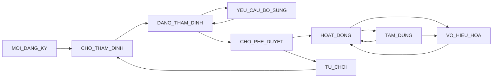
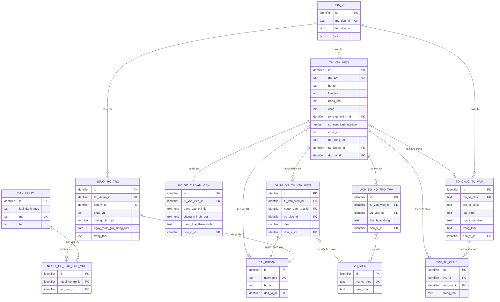
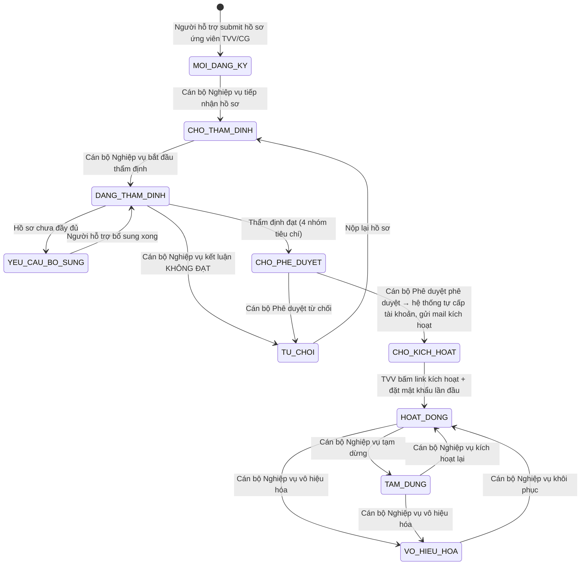
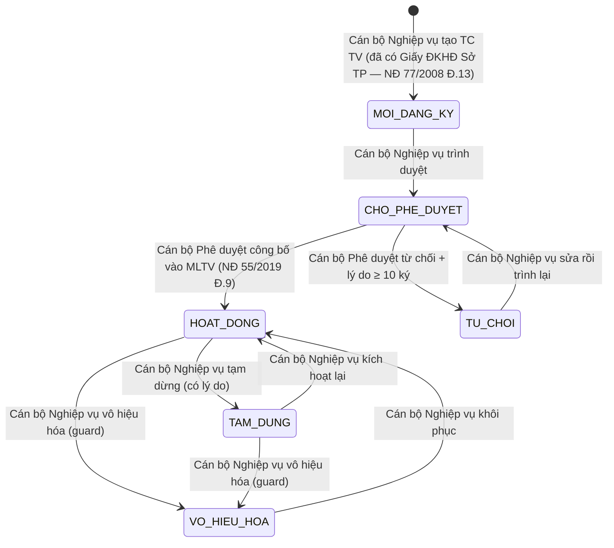
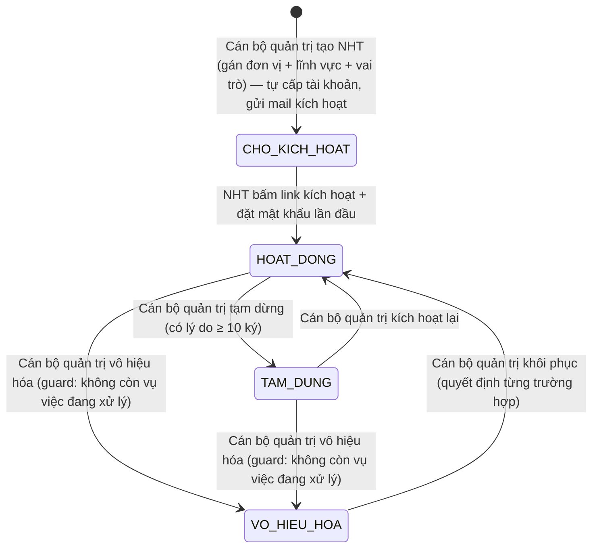

# SRS — Section 3.2.5: Quản lý Mạng lưới Tư vấn viên

**Dự án:** Phần mềm hỗ trợ pháp lý doanh nghiệp
**Phiên bản SRS:** 3.5
**Nhóm:** IV — Quản lý Mạng lưới Tư vấn viên (Tư vấn viên / Chuyên gia + Tổ chức tư vấn + Người hỗ trợ pháp lý)
**UC range:** UC 39 – UC 50
**Số FR:** 19 (12 + FR-IV-NEW-01 + FR-IV-NEW-02 + FR-IV-NEW-04 + FR-IV-NHT-01/02/03) `[CR-02][GAP-IV-09][GAP-IV-10][GAP-IV-11]`
**File chính:** `srs-v3.md` Section 3.2

---

## Lịch sử thay đổi

| Ngày | Tác giả | Mô tả thay đổi |
|------|---------|-----------------|
| 2026-04-03 | SRS Agent (Claude) | Tạo mới từ `srs-v3.md` theo Template v3.0 |
| 2026-04-16 | BA | Áp dụng CR đối tác: CR-01, CR-02, CR-03, CR-07, CR-IV-01, CR-IV-02, CR-IV-03 |
| 2026-05-03 | BA + Claude | Apply 7 fix theo deep review per-module FR-04 v3: F-FR04-01 (tab UX), F-FR04-02 (thang điểm 0-10→1-5), F-FR04-03 (dia_ban_id→don_vi_id), F-FR04-06 (bỏ cooldown 6 tháng), F-FR04-NEW-01 (sửa trích NĐ 121/2025 Đ.24→Đ.39-40 + NĐ 55/2019 Đ.9 ở 7 vị trí), F-FR04-NEW-02 phương án B+ (refactor NHT: bỏ NHT khỏi loai_tvv enum + tạo entity NGUOI_HO_TRO 1:1 với TAI_KHOAN), F-FR04-NEW-03 (bỏ ESCALATE bắt buộc, mỗi cấp tự công bố), F-FR04-05 (mở rộng SM-TCTV theo pattern các FR group khác + thêm FR-IV-NEW-04 phê duyệt TC TV theo NĐ 55/2019 Đ.9) |
| 2026-05-03 | BA + Claude | Apply deep review screen description (Section 3 Màn hình chức năng): 5 Critical + 9 High + 5 Medium fix — thêm 3 SCR-IV-NHT-01/02/03 + 3 FR-IV-NHT cho NGUOI_HO_TRO entity (C-01); tách mã ref SRS khỏi cell UI hiển thị (C-02); thêm § 3.0 bảng ánh xạ enum→label tiếng Việt cho SM-TVV/SM-TCTV/SM-NHT/loai_tvv/loai_hinh (C-03); tách tab "Đang thẩm định" và "Yêu cầu bổ sung" SCR-IV-01 (C-04); đổi menu "Cá nhân tư vấn" → "Tư vấn viên / Chuyên gia" + thêm sub-menu NHT (C-05); bỏ note v2.1 + 9 vị trí "(gộp MH-04.X)" (H-01+H-02); thêm § 3.0b bảng mẫu hộp thoại xác nhận MD-* cho 11 trường hợp (H-03); tách 4 nút action SCR-IV-03 tab Thẩm định (H-04); SCR-IV-NEW-01 tách 4 filter + thêm filter Trạng thái (H-05+H-06); SCR-IV-NEW-03 thêm 3 nút Trình duyệt/Phê duyệt/Từ chối (H-07); SCR-IV-NEW-02 spec dropdown loại hình labels (H-08); SCR-IV-03 tab Lịch sử spec filter trạng thái (H-09); polish UX (button text ngắn, empty state, dropdown "..." cho >3 actions, icon spec) (M-01→M-05) |
| 2026-05-03 | BA + Claude | Tinh chỉnh phạm vi tiếng Việt sau review v3: phân biệt rõ "**technical spec cho dev**" (giữ tiếng Anh chuẩn UI: breadcrumb, dropdown, radio, checkbox, pagination, toggle, tab, accordion + technical attribute names: Placeholder:, tooltip:, on-blur, hover, Click) vs "**text hiển thị user-facing**" (tiếng Việt thuần: tab title, button label, badge text, modal title/body, placeholder text trong ngoặc kép, tooltip text). Cột "Thành phần" = label tiếng Việt cho user-facing meaning (VD "Đường dẫn điều hướng"); cột "Loại UI" = technical type cho dev (VD `breadcrumb`). Mã enum DB chỉ trong § 3.0 bảng ánh xạ; cell Hành vi luôn dùng label tiếng Việt cho enum. Mã reference SRS (BR-XX, ERR-XX, MD-XX) chỉ trong "Quy tắc tương tác → Tham chiếu nội bộ" cho dev tra cứu, KHÔNG hiển thị UI |
| 2026-05-03 | BA + Claude | Deep review v4 — fix 3 vấn đề còn sót: (a) 3 user-facing message/empty state đổi "NHT" → "Người hỗ trợ pháp lý" đầy đủ (line 1817 error message vô hiệu hóa, line 1845 error message vượt quyền, line 1894 empty state); (b) thống nhất 32+ vị trí "CB Nghiệp vụ" → "Cán bộ Nghiệp vụ", 13+ vị trí "CB Phê duyệt" → "Cán bộ Phê duyệt", "CB PD/CB NV" → đầy đủ — Section 3 hiện 100% dùng "Cán bộ Nghiệp vụ" / "Cán bộ Phê duyệt" thống nhất với header; (c) đổi entity raw "TAI_KHOAN" trong cell label hiển thị → "tài khoản" (cell 2.5 SCR-IV-NHT-02). NHT còn lại 2 vị trí là internal reference cho dev: SCR-IV-NHT-* (mã SCR), VAI_TRO 'NHT' (mã database role) — KHÔNG hiển thị user-facing |

---

## Mục lục file này

- [1. Tổng quan nhóm](#1-tổng-quan-nhóm)
- [2. Yêu cầu chức năng chi tiết](#2-yêu-cầu-chức-năng-chi-tiết)
- [3. Màn hình chức năng](#3-màn-hình-chức-năng)
- [4. Entity liên quan](#4-entity-liên-quan)
- [5. State Machine liên quan](#5-state-machine-liên-quan)
- [6. Business Rules liên quan](#6-business-rules-liên-quan)

---

## 1. Tổng quan nhóm

**Mục đích:** Quản lý hồ sơ, thẩm định, phê duyệt và đánh giá chuyên gia / tư vấn viên (TVV) tham gia mạng lưới hỗ trợ pháp lý cho DNNVV.

**Entity chính:** TU_VAN_VIEN (TVV/CG cá nhân ngoài), **NGUOI_HO_TRO + NGUOI_HO_TRO_LINH_VUC (cán bộ HTPL theo NĐ 55/2019 Đ.7 — mới F-FR04-NEW-02)**, TVV_LINH_VUC, TVV_TO_CHUC, HO_SO_TU_VAN_VIEN, DANH_GIA_TU_VAN_VIEN, DANH_GIA_SAU_VU_VIEC, TO_CHUC_TU_VAN `[GAP-IV-02][GAP-IV-05][GAP-IV-10]`

> **Ghi chú v3.1 — bỏ TVV_DIA_BAN:** Theo NĐ 77/2008 Điều 19, Thẻ TVV có hiệu lực **toàn quốc** — pháp luật không giới hạn TVV theo địa bàn. Hệ thống bỏ field `dia_ban_ids[]` và bảng junction TVV_DIA_BAN. Filter "địa bàn" trên SCR-IV-01 lọc theo `don_vi_id` (đơn vị công nhận). TVV đã công khai (cong_khai=1) hiển thị toàn quốc qua Cổng PLQG theo Điều 9 NĐ 55/2019.

**Tác nhân chính:** Cán bộ Nghiệp vụ (CB NV), Cán bộ Phê duyệt (CB PD), Người hỗ trợ (NHT — cán bộ HTPL theo NĐ 55/2019 Đ.7, lưu ở entity NGUOI_HO_TRO), Ứng viên TVV/CG (cá nhân ngoài hành nghề tư vấn theo NĐ 77/2008, lưu ở entity TU_VAN_VIEN), Doanh nghiệp (DN)

**Khung pháp lý:** Luật DNNVV 2017, NĐ 55/2019/NĐ-CP (Đ.7 NHT, Đ.9 mạng lưới TVV, Đ.10), NĐ 77/2008/NĐ-CP (Đ.13 ĐKHĐ, Đ.19 thẻ TVV, Đ.20), **NĐ 121/2025/NĐ-CP (Đ.39-40 phân cấp UBND tỉnh công bố mạng lưới ở địa phương)**, QĐ 1322/QĐ-BTP ngày 01/6/2020 (Phụ lục 1, 2)

**State Machine — SM-TVV:**


> Đồng bộ 10 trạng thái với SM-TVV Section 5. Thêm **CHO_KICH_HOAT** sau phê duyệt (cho phép tự cấp tài khoản TVV trước khi vào HOAT_DONG). State CHO_THAM_DINH, transition TU_CHOI → CHO_THAM_DINH và TAM_DUNG → VO_HIEU_HOA giữ từ v3 — KHÔNG yêu cầu thao tác "Tiếp nhận hồ sơ" riêng (CB NV vào tab Thẩm định bắt đầu chấm = ngầm chuyển trạng thái).

**Tiêu chí thẩm định 4 nhóm:** (1) Pháp lý, (2) Năng lực chuyên môn, (3) Hiệu quả & uy tín, (4) Mạng lưới

**Quy trình nghiệp vụ tổng quan:**

```
Ứng viên TVV/CG đăng ký → CB NV (NHT) thẩm định (4 tiêu chí) → Trình CB PD
→ CB PD phê duyệt → HOAT_DONG → Công khai lên Cổng PLQG
→ Phân công VV → Đánh giá định kỳ → Cập nhật trạng thái
```

**Luồng phê duyệt:** CB NV cùng cấp thẩm định → CB PD cùng cấp phê duyệt (BR-FLOW-03 — KHÔNG xuyên cấp)

**UC Coverage:**

| UC | Tên | FR-ID | Priority |
|----|-----|-------|----------|
| UC39 | Quản lý TVV | FR-IV-01 | Essential |
| UC40 | Tìm kiếm TVV | FR-IV-02 | Essential |
| UC41 | Đăng ký tham gia mạng lưới | FR-IV-03 | Essential |
| UC42 | Cập nhật năng lực | FR-IV-04 | Essential |
| UC43 | Xem chi tiết TVV | FR-IV-05 | Essential |
| UC44 | Thẩm định hồ sơ TVV | FR-IV-06 | Essential |
| UC45 | Phê duyệt TVV | FR-IV-07 | Essential |
| UC46 | Công khai mạng lưới TVV | FR-IV-08 | Essential |
| UC47 | Đánh giá TVV | FR-IV-09 | Essential |
| UC48 | Xem lịch sử hỗ trợ | FR-IV-10 | Essential |
| UC49 | TVV/CG cập nhật hồ sơ cá nhân | FR-IV-11 | Essential |
| UC50 | Cập nhật trạng thái TVV | FR-IV-12 | Essential |
| Cross | Tổng hợp điểm đánh giá | FR-IV-CROSS-01 | Essential |
| [GAP-IV-07] | Quản lý Tổ chức tư vấn | FR-IV-NEW-01 | Essential `[CR-02]` |
| [GAP-IV-09] | Cập nhật trạng thái TC TV | FR-IV-NEW-02 | Essential |
| [GAP-IV-10] | Phê duyệt TC TV (NĐ 55/2019 Đ.9) | FR-IV-NEW-04 | Essential `[BA chốt 2026-05-03]` |
| [GAP-IV-11] | Quản lý Người hỗ trợ pháp lý (NĐ 55/2019 Đ.7) | FR-IV-NHT-01 | Essential `[BA chốt 2026-05-03]` |
| [GAP-IV-11] | Tìm kiếm NHT (phục vụ UC59 phân công vụ việc) | FR-IV-NHT-02 | Essential `[BA chốt 2026-05-03]` |
| [GAP-IV-11] | Xem hồ sơ NHT | FR-IV-NHT-03 | Essential `[BA chốt 2026-05-03]` |

---

## 2. Yêu cầu chức năng chi tiết

---

### FR-IV-01: Quản lý TVV (UC39)

**UC Reference:** UC 39
**Source:** NĐ55/2019, NĐ77/2008
**Priority:** Essential
**Stability:** High
**Màn hình:** SCR-IV-01, SCR-IV-02

**Mô tả:** CRUD tư vấn viên / chuyên gia trong mạng lưới hỗ trợ pháp lý.

**Tác nhân:** Cán bộ Nghiệp vụ (TW/BN/ĐP)

**Preconditions (Điều kiện tiên quyết):**
- User đã đăng nhập, có quyền "Quản lý tư vấn viên"
- Phân quyền theo đơn vị áp dụng

**Inputs (Dữ liệu đầu vào):**

| # | Tên field | Kiểu logic | Bắt buộc | Ràng buộc | Mặc định | Nguồn |
|---|----------|-----------|----------|-----------|----------|-------|
| 1 | ma_tvv | text | Y (auto) | TVV-{DON_VI_CODE}-{SEQ} | — | Hệ thống |
| 1b | loai_tvv | text | Y | CHECK IN ('TVV','CG') — chỉ cá nhân ngoài hành nghề tư vấn theo NĐ 77/2008. NHT (cán bộ HTPL theo NĐ 55/2019 Đ.7) lưu ở entity riêng NGUOI_HO_TRO | 'TVV' | Người dùng (dropdown) |
| 2 | anh_chan_dung | structured | N | Max 5MB, .jpg/.png | Ảnh hệ thống | Người dùng |
| 3 | ho_ten | text | Y | Max 200 ký | — | Người dùng |
| 4 | ngay_sinh | date | Y | ≤ ngày hiện tại | — | Người dùng |
| 5 | gioi_tinh | text | Y | NAM / NU | — | Người dùng |
| 6 | cmnd_cccd | text | Y | Max 12, unique toàn hệ thống | — | Người dùng |
| 7 | email | text | Y | RFC 5322 | — | Người dùng |
| 8 | so_dien_thoai | text | Y | 10-11 chữ số | — | Người dùng |
| 9 | dia_chi | text | Y | — | — | Người dùng |
| 10 | trinh_do | text | Y | Cử nhân/Thạc sĩ/Tiến sĩ/Khác | — | Người dùng |
| 11 | chung_chi | text | N | — | — | Người dùng |
| 12 | so_the | text | N | — | — | Người dùng |
| 13 | so_nam_kinh_nghiem | number | N | >= 0 | — | Người dùng `[CR-03][Q-03]` |
| 14 | chuc_vu | text | N | Max 200 ký | — | Người dùng `[CR-03]` |
| 15 | noi_cong_tac | text | N | Max 500 ký | — | Người dùng `[CR-03]` |
| 16 | to_chuc_chinh_id | identifier | Y | FK → TO_CHUC_TU_VAN | — | Người dùng |
| 17 | to_chuc_doi_tac_ids | identifier[] | N | FK → TO_CHUC_TU_VAN (N:N) | — | Người dùng |
| 18 | linh_vuc_ids | identifier[] | Y | FK → DANH_MUC, ≥ 1 | — | Người dùng |
| 19 | ~~dia_ban_ids~~ | ~~identifier[]~~ | — | **Bỏ field này** — TVV không giới hạn theo địa bàn (NĐ 77/2008 Điều 19: Thẻ TVV hiệu lực toàn quốc). Filter theo `don_vi_id` | — | — |
| 20 | file_bang_cap | structured | Cond | Max 10MB/file, **tổng 50MB**, **max 10 files**, PDF only. Virus scan ClamAV (timeout 30s, reject nếu phát hiện) | — | Người dùng |
| 21 | so_qd_cong_bo | text | N | — | — | Người dùng `[CR-03]` |
| 22 | ngay_qd_cong_bo | date | N | — | — | Người dùng `[CR-03]` |
| 23 | ghi_chu | text (long) | N | Max 5000 ký | — | Người dùng |

**Processing (Xử lý):**

**Thêm mới:**

| Bước | Mô tả xử lý | BR áp dụng |
|------|-------------|-----------|
| 1 | Kiểm tra quyền và phân quyền theo đơn vị | BR-AUTH-01, BR-AUTH-08 |
| 2 | Xác nhận dữ liệu đầu vào theo ràng buộc | — |
| 3 | Kiểm tra CMND/CCCD duy nhất toàn hệ thống | — |
| 4 | Kiểm tra tổ chức tư vấn chính tồn tại | — |
| 5 | Tạo bản ghi TU_VAN_VIEN + TVV_TO_CHUC + TVV_LINH_VUC | BR-DATA-03 |
| 6 | Đặt trạng thái = MOI_DANG_KY | SM-TVV |
| 7 | Ghi nhật ký thao tác | BR-DATA-05 |

**Xóa (xóa mềm):**

| Bước | Mô tả xử lý | BR áp dụng |
|------|-------------|-----------|
| 1 | Kiểm tra TVV không có vụ việc đang xử lý | — |
| 2 | Đánh dấu xóa mềm | BR-DATA-01 |
| 3 | Ghi nhật ký thao tác | BR-DATA-05 |

**Outputs (Dữ liệu đầu ra):**

| # | Tên | Kiểu logic | Điều kiện | Format |
|---|-----|-----------|-----------|--------|
| 1 | id | identifier | Luôn có | — |
| 2 | ma_tvv | text | Luôn có | TVV-{CODE}-{SEQ} |
| 3 | ho_ten | text | Luôn có | — |
| 4 | linh_vuc | text | Luôn có | Tags |
| 5 | trang_thai | text | Luôn có | SM-TVV |
| 6 | diem_danh_gia_tb | number | Khi có đánh giá | 1.0-5.0 (1 chữ số thập phân) |

**Postconditions:** Bản ghi TVV được tạo/cập nhật/xóa mềm, nhật ký ghi nhận.

**Error Handling:**

| # | Điều kiện lỗi | Mã lỗi | Phản hồi hệ thống | Severity |
|---|--------------|--------|-------------------|----------|
| E1 | Họ tên trống | ERR-TVV-01 | "Họ tên là bắt buộc" | ERROR |
| E2 | CMND/CCCD trùng | ERR-TVV-02 | "Số Căn cước công dân đã tồn tại" | ERROR |
| E3 | Email không hợp lệ | ERR-TVV-03 | "Email không hợp lệ" | ERROR |
| E4 | Tổ chức không tồn tại | ERR-TVV-04 | "Tổ chức tư vấn không tồn tại" | ERROR |
| E5 | Xóa TVV có VV đang xử lý | ERR-TVV-05 | "Tư vấn viên đang có vụ việc chưa hoàn thành" | ERROR |
| E6 | File vượt tổng 50MB | ERR-TVV-06 | "Tổng dung lượng file đính kèm tối đa 50MB" | ERROR |
| E7 | Số file vượt 10 | ERR-TVV-07 | "Tối đa 10 file bằng cấp" | ERROR |
| E8 | Virus scan phát hiện | ERR-TVV-08 | "File {ten_file} chứa mã độc, bị từ chối" | ERROR |
| E9 | Loại TVV không hợp lệ | ERR-TVV-09 | "Loại phải là Tư vấn viên/Chuyên gia" | ERROR |

**Acceptance Criteria:**
- **Given** CB NV truy cập "Quản lý tư vấn viên" **When** hiển thị **Then** danh sách TVV thuộc đơn vị, 3 tab trạng thái
- **Given** CB NV thêm TVV **When** nhập đủ trường bắt buộc **Then** tạo TVV mới, trạng thái MOI_DANG_KY
- **Given** CB NV xóa TVV có VV đang xử lý **When** xác nhận **Then** từ chối + cảnh báo

---

### FR-IV-02: Tìm kiếm TVV (UC40)

**UC Reference:** UC 40
**Priority:** Essential | **Stability:** High
**Màn hình:** SCR-IV-01

**Mô tả:** Tìm kiếm TVV theo nhiều tiêu chí: từ khóa, lĩnh vực, địa bàn, tổ chức, trạng thái, ngày công nhận.

**Tác nhân:** CB NV / CB PD

**Preconditions:** User đã đăng nhập.

**Inputs:**

| # | Tên field | Kiểu logic | Bắt buộc | Ràng buộc |
|---|----------|-----------|----------|-----------|
| 1 | tu_khoa | text | N | Tên, mã TVV, CMND/CCCD |
| 2 | linh_vuc_ids | identifier[] | N | Chọn nhiều lĩnh vực |
| 3 | don_vi_id | identifier | N | Đơn vị quản lý/công nhận TVV (Sở TP/Bộ ngành) — TVV không giới hạn theo địa bàn theo NĐ 77/2008 Đ.19 (thẻ TVV hiệu lực toàn quốc) |
| 4 | to_chuc_id | identifier | N | Tổ chức tư vấn |
| 5 | trang_thai | text | N | SM-TVV |
| 6 | tu_ngay / den_ngay | date | N | Ngày công nhận |

**Processing:**

| Bước | Mô tả xử lý | BR áp dụng |
|------|-------------|-----------|
| 1 | Kiểm tra quyền và phân quyền theo đơn vị | BR-AUTH-01, BR-AUTH-08 |
| 2 | Kết hợp tất cả điều kiện lọc có giá trị (AND) | — |
| 3 | Phân trang (mặc định 20/trang) | BR-DATA-07 |
| 4 | Xuất DS TVV theo **Phụ lục 1 — QĐ 1322/QĐ-BTP ngày 01/6/2020** (Danh sách cá nhân tham gia MLTV PL): format Excel (.xlsx), 10 cột cố định theo mẫu Bộ Tư pháp (file tham chiếu: `docs/Input/Danh sách tư vấn viên 1.pdf`). Lọc theo bộ lọc hiện tại + phân quyền đơn vị. Max 10.000 rows (WRN-TVV-01). 10 cột: STT / Họ tên / Năm sinh / Thông tin liên hệ (SĐT, địa chỉ, email) / Chức danh vị trí / Trình độ chuyên môn + số văn bằng / Chứng chỉ (tên + ngày cấp) / Lĩnh vực chuyên ngành / Kinh nghiệm (số năm + mô tả) / Ghi chú | `[CR-03][CMT-7]` |

**Outputs:**

| # | Tên | Kiểu logic | Điều kiện | Format |
|---|-----|-----------|-----------|--------|
| 1 | id | identifier | — | — |
| 2 | ma_tvv | text | — | TVV-{CODE}-{SEQ} |
| 3 | ho_ten | text | — | — |
| 4 | loai | text | — | TVV / CG |
| 5 | ten_to_chuc | text | — | — |
| 6 | linh_vuc_text | text | — | Danh sách lĩnh vực (join) |
| 7 | trang_thai | text | — | SM-TVV |
| 8 | ngay_cong_nhan | date | Khi có | dd/mm/yyyy |
| 9 | diem_danh_gia_tb | number | Khi có đánh giá | 1.0–5.0 (1 chữ số thập phân) |
| 10 | total_count | number | — | — |

**Postconditions:** Read-only, không thay đổi dữ liệu.

**Error Handling:**

| # | Điều kiện lỗi | Mã lỗi | Phản hồi hệ thống | Severity |
|---|--------------|--------|-------------------|----------|
| E1 | Không có kết quả | INF-TVV-01 | "Không tìm thấy tư vấn viên phù hợp" | INFO |

**Acceptance Criteria:**
- **Given** user nhập từ khóa **When** tìm kiếm **Then** hiển thị TVV phù hợp, phân trang
- **Given** user lọc theo lĩnh vực + địa bàn **When** tìm **Then** kết quả AND
- **Given** user lọc theo nhiều điều kiện **When** tìm kiếm **Then** áp dụng AND tất cả

---

### FR-IV-03: Đăng ký tham gia mạng lưới (UC41)

**UC Reference:** UC 41
**Priority:** Essential | **Stability:** High
**Màn hình:** SCR-IV-02 (chức năng quản lý của Người hỗ trợ)

**Mô tả:** Người hỗ trợ pháp lý (NHT — cán bộ HTPL theo NĐ 55/2019 Đ.7) submit hồ sơ ứng viên TVV/CG vào mạng lưới tư vấn viên thuộc đơn vị mình.

**Tác nhân:** Người hỗ trợ pháp lý (NHT) — đã có tài khoản do quản trị/cán bộ cấp; đăng nhập bằng tên đăng nhập + mật khẩu

**Preconditions:** NHT đã đăng nhập, có quyền "Đăng ký TVV vào mạng lưới" theo phân công vai trò + đơn vị.

**Inputs:**

| # | Tên field | Kiểu logic | Bắt buộc | Ràng buộc | Mặc định | Nguồn |
|---|----------|-----------|----------|-----------|----------|-------|
| 0 | loai_tvv | text | Y | CHECK IN ('TVV','CG') | 'TVV' | NHT chọn (radio) |
| 1 | ho_ten | text | Y | Max 200 ký tự | — | NHT nhập |
| 2 | cmnd_cccd | text | Y | Max 12, unique toàn hệ thống | — | NHT nhập |
| 3 | ngay_sinh | date | Y | ≤ hôm nay | — | NHT nhập |
| 4 | gioi_tinh | text | Y | NAM / NU / KHAC | — | NHT chọn |
| 5 | email | text | Y | RFC 5322, unique toàn hệ thống | — | NHT nhập |
| 6 | so_dien_thoai | text | Y | 10-11 chữ số | — | NHT nhập |
| 7 | dia_chi | text | Y | — | — | NHT nhập |
| 8 | chuc_vu | text | N | Max 200 ký tự (chức vụ tại nơi công tác — drive UC46 xuất DS theo Phụ lục 1 QĐ 1322/QĐ-BTP) | — | NHT nhập |
| 9 | noi_cong_tac | text | N | Max 500 ký tự | — | NHT nhập |
| 10 | trinh_do | text | Y | — | — | NHT nhập |
| 11 | chuyen_nganh | text | Y | — | — | NHT nhập |
| 12 | so_nam_kinh_nghiem | number | Y | >= 0 | — | NHT nhập `[CR-03]` |
| 13 | linh_vuc_ids | identifier[] | Y | ≥ 1 lĩnh vực PL đăng ký | — | NHT chọn (multi) |
| 14 | to_chuc_id | identifier | N | FK → TO_CHUC_TU_VAN | — | NHT chọn |
| 15 | don_vi_id | identifier | Y | FK → DON_VI; auto-set theo đơn vị NHT đang đăng nhập (chỉ xem, không sửa) | NHT.don_vi_id | system |
| 16 | anh_dai_dien | binary | N | jpg/png, max 5MB | Ảnh hệ thống | NHT upload (tùy chọn) |
| 17 | file_bang_cap | binary[] | Y | PDF, max 10MB/file | — | NHT upload |
| 18 | file_the_hanh_nghe | binary | N | PDF, max 10MB (bắt buộc nếu loai_tvv='TVV' theo NĐ 77/2008 Đ.20) | — | NHT upload |

**Processing:**

| Bước | Mô tả xử lý | BR áp dụng |
|------|-------------|-----------|
| 1 | Kiểm tra ứng viên chưa có hồ sơ đang chờ xử lý (theo CCCD, trạng thái ∈ {MOI_DANG_KY, CHO_THAM_DINH, DANG_THAM_DINH, YEU_CAU_BO_SUNG, CHO_PHE_DUYET}) | — |
| 2 | Kiểm tra nếu có hồ sơ trước TU_CHOI → cho phép sửa và chuyển lại CHO_THAM_DINH (KHÔNG có cooldown — BA chốt 2026-05-03) | — |
| 3 | Xác nhận dữ liệu đầu vào | — |
| 4 | Kiểm tra CMND/CCCD duy nhất toàn hệ thống | — |
| 5 | Kiểm tra email duy nhất toàn hệ thống | — |
| 6 | Quét virus cho tất cả file upload | — |
| 7 | Tạo bản ghi TU_VAN_VIEN với đầy đủ các trường nhập (loai_tvv, ho_ten, cccd, ngay_sinh, gioi_tinh, email, dien_thoai, dia_chi, chuc_vu, noi_cong_tac, trinh_do, chuyen_nganh, so_nam_kinh_nghiem, linh_vuc_ids, to_chuc_chinh_id, anh_dai_dien, **don_vi_id (auto từ NHT.don_vi_id)**), trạng thái = MOI_DANG_KY | SM-TVV |
| 8 | Gửi thông báo cho Cán bộ Nghiệp vụ cùng đơn vị | — |
| 9 | Ghi nhật ký thao tác | BR-DATA-05 |

**Error Handling:**

| # | Điều kiện lỗi | Mã lỗi | Phản hồi hệ thống | Severity |
|---|--------------|--------|-------------------|----------|
| E1 | Ứng viên đã có hồ sơ đang chờ | ERR-DK-01 | "Ứng viên (theo CCCD) đã có hồ sơ đang chờ xử lý" | ERROR |
| E2 | File vượt 10MB/file | ERR-DK-02 | "File tải lên tối đa 10MB/file" | ERROR |
| E3 | Thiếu file bằng cấp | ERR-DK-03 | "Bằng cấp/chứng chỉ là bắt buộc" | ERROR |
| E4 | CMND/CCCD đã tồn tại | ERR-DK-04 | "Số Căn cước công dân đã đăng ký trong hệ thống" | ERROR |
| E5 | File vượt tổng 50MB | ERR-DK-05 | "Tổng dung lượng file tối đa 50MB" | ERROR |
| E6 | Quét virus phát hiện | ERR-DK-06 | "File {ten_file} chứa mã độc, bị từ chối" | ERROR |
| E7 | Email sai format | ERR-DK-07 | "Email không đúng định dạng" | ERROR |
| E8 | Thiếu lĩnh vực | ERR-DK-08 | "Chọn ít nhất 1 lĩnh vực pháp lý" | ERROR |
| E9 | Email đã tồn tại | ERR-DK-09 | "Email này đã được sử dụng bởi tư vấn viên khác" | ERROR |

**Outputs:**

| # | Tên | Kiểu logic | Điều kiện | Format |
|---|-----|-----------|-----------|--------|
| 1 | ma_tvv | text | — | TVV-{CODE}-{SEQ} (auto-gen) |
| 2 | trang_thai | text | — | MOI_DANG_KY |
| 3 | ngay_dang_ky | datetime | — | dd/mm/yyyy HH:mm |
| 4 | thong_bao | text | — | "Đăng ký thành công, chờ thẩm định" |

**Postconditions:**
- Hồ sơ TVV/CG được tạo với trạng thái MOI_DANG_KY, gắn đơn vị quản lý theo NHT đăng ký
- TVV/CG (chủ hồ sơ) chưa có tài khoản hệ thống. Liên lạc qua email/điện thoại đã khai
- Cán bộ Nghiệp vụ cùng đơn vị nhận thông báo hồ sơ mới
- Khi hồ sơ chuyển CHO_KICH_HOAT (sau khi Cán bộ Phê duyệt duyệt — xem FR-IV-07), hệ thống tự cấp tài khoản + gửi mail kích hoạt cho TVV/CG

**Acceptance Criteria:**
- **Given** NHT đã đăng nhập **When** chọn "Đăng ký TVV vào mạng lưới" **Then** form đăng ký mở với 19 trường, trường "Đơn vị quản lý" hiển thị tên đơn vị NHT (chỉ xem)
- **Given** NHT nhập đủ + upload file **When** gửi **Then** tạo hồ sơ TVV với don_vi_id = NHT.don_vi_id, trạng thái = MOI_DANG_KY, Cán bộ Nghiệp vụ cùng đơn vị nhận thông báo
- **Given** ứng viên (theo CCCD) đã có hồ sơ chờ **When** NHT đăng ký lại **Then** hệ thống từ chối với ERR-DK-01
- **Given** email đã tồn tại trong hệ thống **When** NHT submit **Then** hệ thống từ chối với ERR-DK-09

---

### FR-IV-04: Cập nhật năng lực (UC42)

**UC Reference:** UC 42
**Priority:** Essential | **Stability:** High
**Màn hình:** SCR-IV-03 (Tab Năng lực)

**Mô tả:** Người hỗ trợ pháp lý (NHT — cán bộ HTPL theo NĐ 55/2019 Đ.7) cập nhật thông tin năng lực của TVV/CG thuộc đơn vị mình. TVV/CG có thể đăng nhập chuyên trang xem hồ sơ của mình ở chế độ chỉ đọc, không sửa được. Muốn thay đổi → liên hệ NHT.

**Tác nhân:** Người hỗ trợ pháp lý (NHT)

**Preconditions:** TVV tồn tại; NHT có quyền theo phân công vai trò + đơn vị (TVV cùng đơn vị với NHT).

**Inputs:**

| # | Tên field | Kiểu logic | Bắt buộc | Ràng buộc | Mặc định | Nguồn |
|---|----------|-----------|----------|-----------|----------|-------|
| 1 | trinh_do | text | N | Cử nhân / Thạc sĩ / Tiến sĩ / Khác | — | user input |
| 2 | so_nam_kinh_nghiem | number | N | >= 0 | — | user input `[CR-03][Q-03]` |
| 3 | chuyen_nganh | text | N | — | — | user input |
| 4 | bang_cap_chi_tiet | text (long) | N | JSON array (tên trường, năm tốt nghiệp, chuyên ngành) | — | user input |
| 5 | chung_chi_chi_tiet | text (long) | N | JSON array (tên chứng chỉ, ngày cấp, nơi cấp) | — | user input |
| 6 | chung_chi_moi | binary[] | N | PDF, max 10MB/file, tổng 50MB, max 10 files | — | user upload |
| 7 | so_the_hanh_nghe | text | N | — | — | user input |
| 8 | file_the_hanh_nghe | binary | N | PDF, max 10MB, ClamAV scan | — | user upload |
| 9 | linh_vuc_ids | identifier[] | N | Cập nhật lĩnh vực PL, ≥ 1 nếu thay đổi | — | user input |
| 10 | mo_ta_kinh_nghiem | text (long) | N | Max 5000 ký | — | user input |
| 11 | ghi_chu_cap_nhat | text | N | Max 2000 ký | — | user input |

**Processing:**

| Bước | Mô tả xử lý | BR áp dụng |
|------|-------------|-----------|
| 1 | Kiểm tra quyền NHT theo phân công vai trò + đơn vị (TVV cùng đơn vị với NHT) | BR-AUTH-01 |
| 2 | Xác nhận dữ liệu đầu vào | — |
| 3 | Virus scan ClamAV cho file upload | — |
| 4 | Cập nhật thông tin năng lực trong HO_SO_TU_VAN_VIEN | — |
| 5 | Nếu có file mới: tạo bản ghi FILE_DINH_KEM | — |
| 6 | Nếu thay đổi lĩnh vực: cập nhật TVV_LINH_VUC | — |
| 7 | **Nếu TVV đang ở YEU_CAU_BO_SUNG và có cập nhật hồ sơ** → chuyển trạng thái về DANG_THAM_DINH + thông báo CB NV | SM-TVV |
| 8 | Ghi nhật ký thao tác (giá trị cũ → mới) | BR-DATA-05 |

**Outputs:**

| # | Tên | Kiểu logic | Điều kiện | Format |
|---|-----|-----------|-----------|--------|
| 1 | success | boolean | — | — |
| 2 | updated_at | datetime | — | dd/mm/yyyy HH:mm |
| 3 | tvv_data | object | — | Trả về các field đã cập nhật (để FE refresh UI readonly confirm) |
| 4 | trang_thai_moi | text | Khi có chuyển trạng thái | SM-TVV |

**Postconditions:**
- Hồ sơ năng lực được cập nhật
- Nhật ký thao tác ghi nhận thay đổi

**Error Handling:**

| # | Điều kiện lỗi | Mã lỗi | Phản hồi hệ thống | Severity |
|---|--------------|--------|-------------------|----------|
| E1 | NHT không cùng đơn vị với TVV | ERR-NL-01 | "Bạn không có quyền cập nhật hồ sơ tư vấn viên này (khác đơn vị)" | ERROR |
| E2 | File vượt 10MB/file | ERR-NL-02 | "File tải lên tối đa 10MB/file" | ERROR |
| E3 | File vượt tổng 50MB | ERR-NL-03 | "Tổng dung lượng file tối đa 50MB" | ERROR |
| E4 | Virus scan phát hiện | ERR-NL-04 | "File {ten_file} chứa mã độc, bị từ chối" | ERROR |
| E5 | TVV đã VO_HIEU_HOA | ERR-NL-05 | "Hồ sơ đã bị vô hiệu hóa, không thể chỉnh sửa" | ERROR |

**Acceptance Criteria:**
- **Given** NHT xem chi tiết TVV cùng đơn vị **When** nhấn "Cập nhật năng lực" **Then** form inline edit mở
- **Given** NHT cập nhật thông tin/chứng chỉ + upload file **When** lưu **Then** validate và lưu thành công
- **Given** TVV/CG đăng nhập chuyên trang **When** xem hồ sơ của mình **Then** chỉ xem được, không có nút sửa

---

### FR-IV-05: Xem chi tiết TVV (UC43)

**UC Reference:** UC 43
**Priority:** Essential | **Stability:** High
**Màn hình:** SCR-IV-03

**Mô tả:** Xem chi tiết hồ sơ TVV gồm 4 tab: Hồ sơ, Năng lực, Lịch sử hỗ trợ, Đánh giá.

**Tác nhân:** CB NV (NHT), CB PD, TVV/CG (xem hồ sơ của mình qua chuyên trang)

**Inputs:** `[GAP-IV-03]`

| # | Field | Type | Required | Mô tả |
|---|-------|------|----------|-------|
| 1 | tvv_id | BIGINT | Y | ID tư vấn viên cần xem |

**Processing:**

| Bước | Mô tả xử lý | BR áp dụng |
|------|-------------|-----------|
| 1 | Kiểm tra quyền | BR-AUTH-01 |
| 2 | Lấy thông tin TVV đầy đủ | — |
| 3 | Tab Lịch sử: lấy danh sách VU_VIEC liên kết + thống kê | — |
| 4 | Tab Đánh giá: lấy danh sách DANH_GIA_TVV + tính điểm TB | — |

**Outputs:**

| # | Tên | Kiểu logic | Điều kiện | Format |
|---|-----|-----------|-----------|--------|
| 1 | ho_ten | text | Tab Hồ sơ | — |
| 2 | ngay_sinh | date | Tab Hồ sơ | dd/mm/yyyy |
| 3 | cmnd_cccd | text | Tab Hồ sơ | — |
| 4 | trinh_do | text | Tab Hồ sơ | — |
| 5 | chung_chi | text | Tab Hồ sơ | — |
| 6 | so_the_hanh_nghe | text | Tab Hồ sơ | — |
| 7 | files | binary[] | Tab Hồ sơ | Danh sách file đính kèm |

**Postconditions:** Read-only, không thay đổi dữ liệu.

**Error Handling:**

| # | Điều kiện lỗi | Mã lỗi | Phản hồi hệ thống | Severity |
|---|--------------|--------|-------------------|----------|
| E1 | TVV không tồn tại | ERR-HS-01 | "Hồ sơ tư vấn viên không tồn tại" | ERROR |

**Acceptance Criteria:**
- **Given** user chọn TVV **When** xem chi tiết **Then** hiển thị 4 tab đầy đủ
- **Given** user xem tab Lịch sử **When** có VV **Then** hiển thị danh sách + timeline + thống kê
- **Given** CB NV tìm kiếm **When** nhập từ khóa **Then** hiển thị kết quả phù hợp

---

### FR-IV-06: Thẩm định hồ sơ TVV (UC44)

**UC Reference:** UC 44
**Priority:** Essential | **Stability:** High
**Màn hình:** SCR-IV-03 (tab "Thẩm định")

**Mô tả:** CB NV thẩm định hồ sơ TVV theo 4 nhóm tiêu chí. Kết luận: ĐẠT / KHÔNG ĐẠT / YÊU CẦU BỔ SUNG.

**Tác nhân:** Cán bộ Nghiệp vụ

**Preconditions:** TVV ở trạng thái MOI_DANG_KY hoặc DANG_THAM_DINH.

**Inputs:**

| # | Tên field | Kiểu logic | Bắt buộc | Ràng buộc |
|---|----------|-----------|----------|-----------|
| 1 | nhom1_ket_qua | boolean | Y | Đạt/Không đạt (Pháp lý) |
| 2 | nhom2_diem | number | Y | Thang 1–5 (Năng lực chuyên môn), step 1 |
| 3 | nhom3_diem | number | N | Thang 1–5 (Hiệu quả & uy tín), cho phép NULL nếu TVV mới (N/A) |
| 4 | nhom4_tham_gia | boolean | Y | Có/Không (Mạng lưới) |
| 5 | ket_luan | text | Y | DAT / KHONG_DAT / YEU_CAU_BO_SUNG — CB NV phán xét tổng hợp 4 nhóm (không hard-code ngưỡng điểm, vì nhóm 1,4 là boolean không cộng được với 1–5 và nhóm 3 có thể N/A) |
| 6 | ly_do | text | Cond | Bắt buộc nếu YEU_CAU_BO_SUNG hoặc KHONG_DAT (≥ 10 ký tự) |
| 7 | linh_vuc_ids | identifier[] | N | CB NV sửa lĩnh vực chuyên môn nếu cần (theo tiêu chí "phù hợp lĩnh vực mạng lưới"); ≥ 1 nếu thay đổi |

> **Ghi chú thang điểm:** Pháp luật VN (NĐ 55/2019, NĐ 77/2008, NĐ 121/2025) **không quy định** thang điểm cụ thể cho thẩm định TVV PL mạng lưới HTPL DNNVV. Hệ thống chọn **thang 1–5** cho 2 nhóm định lượng (Năng lực, Hiệu quả) để đồng bộ với thang đánh giá sau vụ việc của DN (DANH_GIA_SAU_VU_VIEC đã khóa `DECIMAL(3,1) CHECK BETWEEN 1 AND 5`). Nhóm Pháp lý và Mạng lưới dùng boolean vì tính chất định tính Đạt/Không đạt.

**Processing:**

| Bước | Mô tả xử lý | BR áp dụng |
|------|-------------|-----------|
| 1 | Chuyển trạng thái TVV sang DANG_THAM_DINH (nếu chưa) | SM-TVV |
| 2 | Xác nhận dữ liệu 4 nhóm tiêu chí | — |
| 3 | Kiểm tra: DAT chỉ khi nhóm Pháp lý = Đạt | — |
| 4 | **Nếu DAT + Trình duyệt:** chuyển trạng thái CHO_PHE_DUYET, gửi thông báo CB_PD **cùng cấp với CB NV thẩm định** (theo phân cấp pháp lý: NĐ 121/2025 Điều 39-40 phân cấp UBND cấp tỉnh công bố mạng lưới ở địa phương; NĐ 55/2019 Điều 9 quy định mỗi bộ/cơ quan ngang bộ tự công bố mạng lưới ngành mình; Bộ TP công bố mạng lưới quốc gia). KHÔNG có ESCALATE bắt buộc — mỗi cấp tự công bố theo phạm vi phân cấp | SM-TVV, BR-AUTH-05 |
| 5 | Nếu YEU_CAU_BO_SUNG: chuyển trạng thái, gửi thông báo TVV/CG (chủ hồ sơ) | SM-TVV |
| 6 | Nếu KHONG_DAT: chuyển trạng thái TU_CHOI, gửi thông báo TVV/CG (chủ hồ sơ) | SM-TVV |
| 7 | Tạo/cập nhật bản ghi HO_SO_TU_VAN_VIEN (kết quả thẩm định) `[GAP-IV-05]` | — |
| 8 | Nếu CB NV sửa lĩnh vực chuyên môn (linh_vuc_ids) → cập nhật junction TVV_LINH_VUC, ghi giá trị cũ → mới vào audit log | — |
| 9 | Ghi nhật ký thao tác | BR-DATA-05 |

**Outputs:** `[GAP-IV-01]`

| # | Field | Type | Mô tả |
|---|-------|------|-------|
| 1 | tvv_id | BIGINT | ID tư vấn viên được thẩm định |
| 2 | ket_qua_tham_dinh | TEXT | DAT / KHONG_DAT / YEU_CAU_BO_SUNG |
| 3 | diem_tong | DECIMAL | Điểm tổng hợp 4 nhóm tiêu chí |
| 4 | nguoi_tham_dinh | BIGINT FK | CB NV thực hiện thẩm định |
| 5 | ngay_tham_dinh | TIMESTAMP | Ngày giờ thẩm định |

**Error Handling:**

| # | Điều kiện lỗi | Mã lỗi | Phản hồi hệ thống | Severity |
|---|--------------|--------|-------------------|----------|
| E1 | Kết luận ĐẠT nhưng nhóm Pháp lý không đạt | ERR-TD-02 | "Không thể kết luận ĐẠT khi nhóm Pháp lý chưa đạt" | ERROR |
| E2 | Thiếu lý do bổ sung | ERR-TD-03 | "Lý do yêu cầu bổ sung là bắt buộc" | ERROR |
| E3 | Trình duyệt khi kết luận khác DAT | ERR-TD-04 | "Chỉ trình duyệt khi kết luận ĐẠT" | ERROR |

**Postconditions:**
- Kết quả thẩm định được ghi nhận
- Trạng thái TVV chuyển theo SM-TVV
- TVV/CG (chủ hồ sơ) nhận thông báo (nếu cần bổ sung hoặc từ chối)

**Acceptance Criteria:**
- **Given** CB NV chọn TVV chờ thẩm định **When** đánh giá 4 nhóm **Then** form thẩm định đầy đủ
- **Given** Nhóm Pháp lý không đạt **When** kết luận ĐẠT **Then** hệ thống từ chối
- **Given** CB NV kết luận ĐẠT **When** nhấn "Trình duyệt" **Then** TVV → CHO_PHE_DUYET, CB PD nhận thông báo
- **Given** hồ sơ chưa đủ **When** CB NV gửi yêu cầu bổ sung **Then** cập nhật trạng thái + thông báo TVV/CG (chủ hồ sơ)

---

### FR-IV-07: Phê duyệt TVV (UC45)

**UC Reference:** UC 45
**Priority:** Essential | **Stability:** High
**Màn hình:** SCR-IV-03 (nút header "Phê duyệt" và "Từ chối")

**Mô tả:** CB PD công bố TVV vào mạng lưới TVV PL theo phạm vi phân cấp: **NĐ 121/2025 Điều 39-40** phân cấp UBND cấp tỉnh (Sở TP) công bố mạng lưới ở địa phương; **NĐ 55/2019 Điều 9** quy định mỗi bộ/cơ quan ngang bộ (cấp BN) tự công bố mạng lưới ngành mình; Bộ Tư pháp (cấp TW) công bố mạng lưới quốc gia.

**Tác nhân:** Cán bộ Phê duyệt **cùng cấp với CB NV đã thẩm định** (BR-AUTH-05) — CB PD cấp ĐP, BN, hoặc TW đều có thẩm quyền công bố trong phạm vi phân cấp tương ứng.

**Preconditions:**
- TVV ở CHO_PHE_DUYET
- `current_user.role = 'CB_PD'`
- CB PD cùng cấp với CB NV thẩm định (BR-AUTH-05):
  - CB_PD_ĐP duyệt hồ sơ do CB_NV_ĐP thẩm định (mạng lưới địa phương — NĐ 121/2025 Đ.39-40)
  - CB_PD_BN duyệt hồ sơ do CB_NV_BN cùng Bộ ngành thẩm định (mạng lưới ngành — NĐ 55/2019 Đ.9)
  - CB_PD_TW duyệt hồ sơ do CB_NV_TW thẩm định (mạng lưới quốc gia)

**Inputs:**

| # | Tên field | Kiểu logic | Bắt buộc | Ràng buộc | Mặc định | Nguồn |
|---|----------|-----------|----------|-----------|----------|-------|
| 1 | tvv_id | identifier | Y | — | — | system |
| 2 | quyet_dinh | text | Y | PHE_DUYET / TU_CHOI | — | user input |
| 3 | ly_do_tu_choi | text | Cond | Bắt buộc nếu TU_CHOI, ≥ 10 ký tự | — | user input |
| 4 | so_quyet_dinh | text | Cond | Bắt buộc nếu PHE_DUYET. Format: QĐ-{số}/QĐ-{đơn_vị}, max 100 ký | — | user input (modal C12) |
| 5 | y_kien_phe_duyet | text (long) | N | Ý kiến của CB PD (tùy chọn), max 2000 ký | — | user input (modal C12) |
| 6 | version | number | Y | Optimistic lock version (ngăn 2 CB PD duyệt cùng lúc) | — | system |

**Processing:**

| Bước | Mô tả xử lý | BR áp dụng |
|------|-------------|-----------|
| 0 | **Optimistic lock**: kiểm tra `TU_VAN_VIEN.version` khớp input. Nếu lệch → reject ERR-PD-04 "Tư vấn viên đã được duyệt bởi {nguoi_duyet} lúc {time}, vui lòng tải lại trang" | — |
| 1 | Kiểm tra quyền + cùng cấp thẩm định (BR-AUTH-05): CB PD cùng cấp với CB NV đã thẩm định | BR-AUTH-01, BR-AUTH-05, BR-FLOW-03 |
| 2 | Nếu PHE_DUYET: chuyển trạng thái **CHO_KICH_HOAT** (chờ TVV bấm link kích hoạt + đặt mật khẩu), set `ngay_cong_nhan = NOW()`, `thoi_gian_duyet = NOW()`, `nguoi_duyet = current_user.id`, `so_quyet_dinh`, tăng `version`. **Đồng thời, hệ thống tự động cấp tài khoản cho TVV (gọi quy trình tạo tài khoản FR-VIII-15 với hệ thống là tác nhân thay Quản trị HT):** sinh tên đăng nhập từ email TVV, tạo TAI_KHOAN ở trạng thái CHO_KICH_HOAT, copy vai trò TVV/CG (từ `loai_tvv` của hồ sơ) + đơn vị (từ `don_vi_id` của hồ sơ), liên kết TAI_KHOAN ↔ TU_VAN_VIEN, gửi mail link kích hoạt vĩnh viễn (1 lần dùng). Tất cả gộp vào hành động duyệt — nếu lỗi 1 bước thì không duyệt, hồ sơ giữ nguyên CHO_PHE_DUYET | SM-TVV, FR-VIII-15 |
| 3 | Nếu TU_CHOI: chuyển trạng thái TU_CHOI, set `thoi_gian_tu_choi`, `nguoi_tu_choi`, `ly_do_tu_choi`, tăng `version` | SM-TVV |
| 4 | Gửi thông báo TVV/CG (chủ hồ sơ) qua email đã khai | — |
| 5 | Ghi nhật ký thao tác | BR-DATA-05 |

**Outputs:** `[GAP-IV-01]`

| # | Field | Type | Mô tả |
|---|-------|------|-------|
| 1 | tvv_id | BIGINT | ID tư vấn viên được phê duyệt |
| 2 | ket_qua_phe_duyet | TEXT | DUYET / TU_CHOI |
| 3 | so_quyet_dinh | TEXT | Số QĐ công nhận (nếu DUYET) |
| 4 | ly_do | TEXT | Lý do (bắt buộc nếu TU_CHOI) |
| 5 | ngay_phe_duyet | TIMESTAMP | Ngày giờ phê duyệt |
| 6 | version_moi | number | Version mới sau khi cập nhật |

**Error Handling:**

| # | Điều kiện lỗi | Mã lỗi | Phản hồi hệ thống | Severity |
|---|--------------|--------|-------------------|----------|
| E1 | CB PD khác cấp | ERR-PD-02 | "Chỉ phê duyệt hồ sơ cùng cấp" | ERROR |
| E2 | Từ chối không có lý do | ERR-PD-03 | "Lý do từ chối là bắt buộc (≥10 ký tự)" | ERROR |
| E3 | Optimistic lock conflict | ERR-PD-04 | "Tư vấn viên đã được duyệt bởi {nguoi_duyet} lúc {time}, vui lòng tải lại trang để xem trạng thái mới" | ERROR |
| E4 | Phê duyệt thiếu số QĐ | ERR-PD-05 | "Số quyết định công nhận là bắt buộc khi phê duyệt" | ERROR |
| W1 | Mail kích hoạt gửi không thành công | WRN-PD-01 | "Hồ sơ đã được duyệt, tài khoản đã tạo ở trạng thái Chờ kích hoạt. Mail kích hoạt gửi không thành công. Tư vấn viên có thể dùng chức năng 'Quên mật khẩu' với email đã đăng ký để nhận lại link" | WARNING (vẫn duyệt) |

**Postconditions:**
- TVV được công nhận hoặc từ chối
- Nếu công nhận: trạng thái TVV = CHO_KICH_HOAT, tài khoản đã được tạo ở trạng thái CHO_KICH_HOAT, mail link kích hoạt đã gửi cho TVV
- TVV bấm link kích hoạt + đặt mật khẩu lần đầu → TVV và tài khoản đồng thời chuyển HOAT_DONG → TVV được phép tham gia hỗ trợ vụ việc
- TVV được công khai trên Cổng pháp luật quốc gia ngay khi ở CHO_KICH_HOAT (không cần đợi HOAT_DONG)

**Acceptance Criteria:**
- **Given** CB PD xem hồ sơ chờ duyệt **When** xem chi tiết **Then** hiển thị kết quả thẩm định 4 nhóm tiêu chí
- **Given** CB PD phê duyệt **When** xác nhận **Then** TVV → CHO_KICH_HOAT, hệ thống tự cấp tài khoản + gửi mail kích hoạt, ghi audit log
- **Given** CB PD phê duyệt nhưng mail kích hoạt lỗi **When** hệ thống xử lý xong **Then** vẫn duyệt thành công, hiển thị WRN-PD-01 cho CB PD biết, TK đã tạo ở CHO_KICH_HOAT chờ TVV dùng "Quên mật khẩu" lấy lại link
- **Given** CB PD từ chối **When** nhập lý do **Then** TVV → TU_CHOI, gửi thông báo TVV/CG (chủ hồ sơ)
- **Given** TVV nhận mail kích hoạt **When** bấm link + đặt mật khẩu **Then** TVV và tài khoản đồng thời chuyển HOAT_DONG, TVV có thể đăng nhập

---

### FR-IV-08: Công khai mạng lưới TVV (UC46)

**UC Reference:** UC 46
**Priority:** Essential | **Stability:** High
**Màn hình:** SCR-IV-01 (thao tác hàng loạt "Công khai") + SCR-IV-03 (nút header "Công khai lên Cổng pháp luật quốc gia")

**Mô tả:** Đẩy/gỡ TVV cá nhân VÀ Tổ chức tư vấn đã duyệt lên Cổng PLQG qua API outbound trực tiếp. `[CR-02]`

**Tác nhân:** CB NV (có quyền "Công khai mạng lưới tư vấn viên")

**Inputs:**

| # | Tên field | Kiểu logic | Bắt buộc | Ràng buộc | Mặc định | Nguồn |
|---|----------|-----------|----------|-----------|----------|-------|
| 1 | ref_id | identifier | Y | ID của TVV hoặc TC TV | — | system |
| 2 | ref_type | text | Y | 'TU_VAN_VIEN' / 'TO_CHUC_TU_VAN' | — | system `[CR-02]` |
| 3 | hanh_dong | text | Y | CONG_KHAI / HUY_CONG_KHAI | — | user input |
| 4 | mo_ta_cong_khai | text (long) | Y (nếu CONG_KHAI) | Max 5000 ký tự — mô tả hiển thị trên Cổng pháp luật quốc gia. Bắt buộc trước khi công khai để tránh TVV công khai không có mô tả | — | CB Nghiệp vụ nhập trong modal MD-CONG-KHAI |
| 5 | file_dinh_kem_cong_khai | binary[] | N | PDF/DOC/DOCX/XLS/XLSX, max 20MB/file — file giới thiệu cá nhân để DN tham khảo | — | CB Nghiệp vụ upload (tùy chọn) trong modal MD-CONG-KHAI |

**Processing:**

| Bước | Mô tả xử lý | BR áp dụng |
|------|-------------|-----------|
| 1 | Kiểm tra đối tượng: TVV ở trạng thái CHO_KICH_HOAT HOẶC HOAT_DONG (TVV được công nhận pháp lý ngay sau Cán bộ Phê duyệt duyệt — chưa cần đợi kích hoạt TK); TC TV ở trạng thái HOAT_DONG | SM-TVV, SM-TCTV `[CR-02]` |
| 2 | Công khai: lưu mo_ta_cong_khai + file_dinh_kem_cong_khai (nếu có), đặt cong_khai = 1, auto fill thoi_gian_dang_tai, gọi API Cổng PLQG | BR-PUBLIC-01 |
| 3 | Hủy công khai: đặt cong_khai = 0, clear thoi_gian_dang_tai, gọi API gỡ khỏi Cổng. **Giữ lại** mo_ta_cong_khai + file_dinh_kem_cong_khai trong DB để CB tái công khai không cần nhập lại | BR-PUBLIC-02 |
| 4 | Hỗ trợ thao tác hàng loạt | — |
| 5 | Ghi nhật ký thao tác | BR-DATA-05 |

**Outputs:** `[GAP-IV-01]`

| # | Field | Type | Mô tả |
|---|-------|------|-------|
| 1 | tvv_id | BIGINT | ID tư vấn viên |
| 2 | trang_thai_moi | TEXT | CONG_KHAI hoặc HUY_CONG_KHAI |
| 3 | thoi_gian_dang_tai | TIMESTAMP | Ngày giờ công khai/hủy công khai `[CR-01]` |

**Error Handling:**

| # | Điều kiện lỗi | Mã lỗi | Phản hồi hệ thống | Severity |
|---|--------------|--------|-------------------|----------|
| E1 | TVV không ở trạng thái CHO_KICH_HOAT/HOAT_DONG (TC TV không HOAT_DONG) | ERR-CK-01 | "Chỉ tư vấn viên đã được công nhận (Chờ kích hoạt hoặc Đang hoạt động) hoặc tổ chức đang hoạt động mới được công khai" | ERROR |
| E2 | Thiếu mô tả công khai khi CONG_KHAI | ERR-CK-02 | "Mô tả công khai là bắt buộc trước khi đẩy lên Cổng pháp luật quốc gia" | ERROR |
| E3 | API Cổng PLQG lỗi | WRN-CK-01 | "Cập nhật Cổng pháp luật quốc gia thất bại, sẽ thử lại" | WARNING |

**Postconditions:**
- TVV hiển thị/ẩn trên Cổng PLQG
- API outbound gửi trạng thái

**Acceptance Criteria:**
- **Given** CB NV chọn TVV đang hoạt động **When** nhấn "Công khai" **Then** đẩy lên Cổng PLQG
- **Given** CB NV hủy công khai **When** xác nhận **Then** TVV bị gỡ khỏi Cổng
- **Given** API lỗi **When** gọi API **Then** retry 3 lần, ghi log, cảnh báo

---

### FR-IV-09: Đánh giá TVV (UC47)

**UC Reference:** UC 47
**Priority:** Essential | **Stability:** High
**Màn hình:** SCR-IV-03 (tab "Đánh giá")

**Mô tả:** Đánh giá TVV theo 3 tiêu chí: Chuyên môn, Thái độ, Đúng hạn (thang 1–5).

**Tác nhân:** CB NV, CB PD, DN

**Inputs:**

| # | Tên field | Kiểu logic | Bắt buộc | Ràng buộc | Mặc định | Nguồn |
|---|----------|-----------|----------|-----------|----------|-------|
| 1 | tvv_id | identifier | Y | — | — | system |
| 2 | vu_viec_id | identifier | N | Vụ việc liên kết | — | user input |
| 3 | diem_chuyen_mon | number | Y | Thang 1–5, DECIMAL(3,1) | — | user input (star-rating 5 sao) |
| 4 | diem_thai_do | number | Y | Thang 1–5, DECIMAL(3,1) | — | user input (star-rating 5 sao) |
| 5 | diem_thoi_gian | number | Y | Thang 1–5, DECIMAL(3,1) | — | user input (star-rating 5 sao) |
| 6 | diem_tong | number | Y (auto) | Trung bình 3 điểm, làm tròn 1 chữ số thập phân (round-half-up), thang 1–5 | — | system |
| 7 | nhan_xet | text (long) | N | Max 5000 ký tự. **Sanitize HTML** (strip `<script>`, `on*`, `javascript:` URI) trước khi lưu (chống XSS) | — | user input |

**Processing:**

| Bước | Mô tả xử lý | BR áp dụng |
|------|-------------|-----------|
| 1 | Kiểm tra quyền | BR-AUTH-01 |
| 2 | Xác nhận điểm trong thang 1–5 cho 3 tiêu chí | — |
| 3 | Sanitize HTML trường `nhan_xet` (chống XSS) | — |
| 4 | Tính điểm tổng = AVG(3 điểm), làm tròn 1 chữ số thập phân (round-half-up) | — |
| 5 | Tạo bản ghi DANH_GIA_SAU_VU_VIEC `[GAP-IV-02]` | — |
| 6 | Cập nhật `diem_danh_gia_tb` của TVV (trigger FR-IV-CROSS-01) | BR-CALC-06 |
| 7 | Ghi nhật ký thao tác | BR-DATA-05 |

**Outputs:**

| # | Tên | Kiểu logic | Điều kiện | Format |
|---|-----|-----------|-----------|--------|
| 1 | id | identifier | — | — |
| 2 | diem_tong | number | — | Thang 1–5, DECIMAL(3,1) |
| 3 | diem_danh_gia_tb | number | — | Điểm TB mới của TVV (thang 1–5) |
| 4 | so_luong_danh_gia | number | — | Tổng số đánh giá |

**Postconditions:**
- Đánh giá được ghi nhận
- Điểm trung bình TVV được cập nhật tự động

**Error Handling:**

| # | Điều kiện lỗi | Mã lỗi | Phản hồi hệ thống | Severity |
|---|--------------|--------|-------------------|----------|
| E1 | Điểm ngoài thang 1–5 | ERR-DG-01 | "Điểm đánh giá phải từ 1 đến 5" | ERROR |
| E2 | TVV không tồn tại | ERR-DG-02 | "Tư vấn viên không tồn tại" | ERROR |
| E3 | Nhận xét vượt 5000 ký tự | ERR-DG-03 | "Nhận xét tối đa 5000 ký tự" | ERROR |

**Acceptance Criteria:**
- **Given** CB/DN chọn đánh giá TVV **When** nhập 3 điểm (thang 1–5) + nhận xét **Then** lưu, cập nhật điểm TB TVV
- **Given** điểm ngoài thang 1–5 **When** lưu **Then** báo lỗi ERR-DG-01
- **Given** nhiều người đánh giá **When** xem tổng hợp **Then** hiển thị điểm trung bình + danh sách đánh giá

---

### FR-IV-10: Xem lịch sử hỗ trợ (UC48)

**UC Reference:** UC 48
**Priority:** Essential | **Stability:** High
**Màn hình:** SCR-IV-03 (Tab Lịch sử)

**Mô tả:** Xem danh sách vụ việc TVV đã tham gia hỗ trợ, kèm thống kê và timeline.

**Tác nhân:** CB NV (NHT), CB PD, TVV/CG (xem lịch sử của mình qua chuyên trang)

**Inputs:**

| # | Tên field | Kiểu logic | Bắt buộc | Ràng buộc | Mặc định | Nguồn |
|---|----------|-----------|----------|-----------|----------|-------|
| 1 | tvv_id | identifier | Y | — | — | system |
| 2 | tu_ngay | date | N | Lọc từ ngày | — | user input |
| 3 | den_ngay | date | N | Lọc đến ngày | — | user input |
| 4 | trang_thai_vv | text | N | Lọc trạng thái vụ việc | — | user input |

**Processing:**

| Bước | Mô tả xử lý | BR áp dụng |
|------|-------------|-----------|
| 1 | Lấy danh sách VU_VIEC liên kết qua PHAN_CONG_VU_VIEC | — |
| 2 | Tính thống kê: tổng VV, hoàn thành, điểm TB | — |
| 3 | Hiển thị timeline tổng hợp | — |
| 4 | Phân trang 20/trang | BR-DATA-07 |

**Outputs:**

| # | Tên | Kiểu logic | Điều kiện | Format |
|---|-----|-----------|-----------|--------|
| 1 | vu_viec_id | identifier | — | — |
| 2 | ma_vu_viec | text | — | — |
| 3 | ten_doanh_nghiep | text | — | — |
| 4 | linh_vuc | text | — | — |
| 5 | trang_thai | text | — | Trạng thái vụ việc |
| 6 | ngay_phan_cong | date | — | dd/mm/yyyy |
| 7 | ngay_hoan_thanh | date | Khi có | dd/mm/yyyy |
| 8 | diem_danh_gia | number | Khi có | 1.0–5.0 (1 chữ số thập phân) |
| 9 | tong_vu_viec | number | — | Thống kê tổng |
| 10 | tong_hoan_thanh | number | — | Thống kê hoàn thành |

**Postconditions:** Read-only, không thay đổi dữ liệu.

**Error Handling:**

| # | Điều kiện lỗi | Mã lỗi | Phản hồi hệ thống | Severity |
|---|--------------|--------|-------------------|----------|
| E1 | TVV không tồn tại | ERR-LS-01 | "Tư vấn viên không tồn tại" | ERROR |

**Acceptance Criteria:**
- **Given** user xem chi tiết TVV **When** chọn tab "Lịch sử" **Then** danh sách VV + thống kê + timeline
- **Given** CB NV xem chi tiết vụ việc **When** chọn vụ việc **Then** hiển thị thông tin + kết quả + đánh giá
- **Given** CB NV tìm kiếm lịch sử **When** lọc thời gian **Then** hiển thị kết quả phù hợp

---

### FR-IV-11: Người hỗ trợ cập nhật thông tin TVV (UC49)

**UC Reference:** UC 49
**Priority:** Essential | **Stability:** High
**Màn hình:** SCR-IV-03 (Tab Hồ sơ — chế độ sửa)

**Mô tả:** Người hỗ trợ pháp lý (NHT) cập nhật thông tin liên hệ của TVV/CG (địa chỉ, số điện thoại, email, lĩnh vực chuyên môn) thuộc đơn vị mình. TVV/CG chỉ xem được hồ sơ của mình ở chế độ chỉ đọc, không sửa được — muốn thay đổi thì liên hệ NHT.

**Tác nhân:** Người hỗ trợ pháp lý (NHT)

**Inputs:**

| # | Tên field | Kiểu logic | Bắt buộc | Ràng buộc | Mặc định | Nguồn |
|---|----------|-----------|----------|-----------|----------|-------|
| 1 | dia_chi | text | N | — | — | user input |
| 2 | so_dien_thoai | text | N | 10-11 chữ số | — | user input |
| 3 | email | text | N | RFC 5322 | — | user input |
| 4 | linh_vuc_ids | identifier[] | N | Lĩnh vực chuyên môn | — | user input |

**Processing:**

| Bước | Mô tả xử lý | BR áp dụng |
|------|-------------|-----------|
| 1 | Kiểm tra quyền NHT theo phân công vai trò + đơn vị (TVV cùng đơn vị với NHT) | BR-AUTH-01 |
| 2 | Kiểm tra trạng thái TVV trước save: nếu `trang_thai = VO_HIEU_HOA` → reject ERR-CN-03 | — |
| 3 | Xác nhận dữ liệu đầu vào (email format, SĐT format) | — |
| 4 | Nếu thay đổi email: kiểm tra email mới duy nhất toàn hệ thống | — |
| 5 | Cập nhật TU_VAN_VIEN | — |
| 6 | Nếu thay đổi lĩnh vực: cập nhật TVV_LINH_VUC | — |
| 7 | Ghi nhật ký thao tác (giá trị cũ → mới) | BR-DATA-05 |

**Outputs:**

| # | Tên | Kiểu logic | Điều kiện | Format |
|---|-----|-----------|-----------|--------|
| 1 | success | boolean | — | — |
| 2 | updated_at | datetime | — | dd/mm/yyyy HH:mm |

**Postconditions:**
- Thông tin TVV được cập nhật
- Nhật ký thao tác ghi nhận

**Error Handling:**

| # | Điều kiện lỗi | Mã lỗi | Phản hồi hệ thống | Severity |
|---|--------------|--------|-------------------|----------|
| E1 | Email không hợp lệ | ERR-CN-01 | "Định dạng email không hợp lệ" | ERROR |
| E2 | NHT không cùng đơn vị với TVV | ERR-CN-02 | "Bạn không có quyền cập nhật hồ sơ tư vấn viên này (khác đơn vị)" | ERROR |
| E3 | TVV đã VO_HIEU_HOA | ERR-CN-03 | "Hồ sơ đã bị vô hiệu hóa, không thể chỉnh sửa" | ERROR |
| E4 | Email mới đã tồn tại | ERR-CN-04 | "Email này đã được sử dụng bởi tư vấn viên khác" | ERROR |

**Acceptance Criteria:**
- **Given** NHT xem chi tiết TVV cùng đơn vị **When** chọn "Cập nhật thông tin" **Then** hiển thị form cập nhật
- **Given** NHT thay đổi thông tin **When** lưu **Then** validate + cập nhật thành công, ghi audit log
- **Given** TVV/CG đăng nhập chuyên trang **When** xem hồ sơ của mình **Then** chỉ xem được, không có nút sửa

---

### FR-IV-12: Cập nhật trạng thái TVV (UC50)

**UC Reference:** UC 50
**Priority:** Essential | **Stability:** High
**Màn hình:** SCR-IV-03 (nút header "Cập nhật trạng thái" — mở hộp thoại)

**Mô tả:** CB NV chuyển trạng thái hoạt động TVV: HOAT_DONG ⟷ TAM_DUNG, HOAT_DONG → VO_HIEU_HOA, VO_HIEU_HOA → HOAT_DONG.

**Tác nhân:** CB NV

**Inputs:**

| # | Tên field | Kiểu logic | Bắt buộc | Ràng buộc |
|---|----------|-----------|----------|-----------|
| 1 | trang_thai_moi | text | Y | Chỉ transition hợp lệ SM-TVV |
| 2 | ly_do | text (long) | Y | Min 10 ký tự |

**Processing:**

| Bước | Mô tả xử lý | BR áp dụng |
|------|-------------|-----------|
| 1 | Kiểm tra transition hợp lệ theo SM-TVV | SM-TVV |
| 2 | Nếu VO_HIEU_HOA: kiểm tra **KHÔNG có VU_VIEC VÀ HOI_DAP đang xử lý** (trang_thai IN ('DANG_XU_LY','CHO_PHE_DUYET')) | — |
| 3 | Cập nhật trạng thái TVV, tăng `version` | — |
| 4 | Nếu VO_HIEU_HOA và đã công khai: tự động gỡ khỏi Cổng PLQG | — |
| 5 | Gửi thông báo TVV/CG (chủ hồ sơ — push realtime nếu TVV/CG đang có session mở form FR-IV-11 trên chuyên trang) | — |
| 6 | Ghi nhật ký thao tác | BR-DATA-05 |

**Outputs:** `[GAP-IV-01]`

| # | Field | Type | Mô tả |
|---|-------|------|-------|
| 1 | tvv_id | BIGINT | ID tư vấn viên |
| 2 | trang_thai_moi | TEXT | Trạng thái sau cập nhật |
| 3 | ly_do | TEXT | Lý do thay đổi trạng thái |
| 4 | ngay_cap_nhat | TIMESTAMP | Ngày giờ cập nhật |

**Error Handling:**

| # | Điều kiện lỗi | Mã lỗi | Phản hồi hệ thống | Severity |
|---|--------------|--------|-------------------|----------|
| E1 | Transition không hợp lệ | ERR-TT-01 | "Không thể chuyển từ {old} sang {new}" | ERROR |
| E2 | Vô hiệu hóa có VV/HĐ đang xử lý | ERR-TT-02 | "Tư vấn viên đang có {N} vụ việc và {M} hỏi đáp chưa hoàn thành, không thể vô hiệu hóa" | ERROR |
| E3 | Thiếu lý do | ERR-TT-03 | "Lý do thay đổi là bắt buộc (≥ 10 ký tự)" | ERROR |

**Postconditions:**
- Trạng thái TVV được cập nhật theo SM-TVV
- TVV bị vô hiệu hóa không thể được phân công vụ việc mới
- Tự động gỡ Cổng PLQG nếu vô hiệu hóa

**Acceptance Criteria:**
- **Given** CB NV chọn cập nhật trạng thái **When** chọn TAM_DUNG + lý do **Then** TVV → TAM_DUNG
- **Given** CB NV chọn VO_HIEU_HOA **When** TVV có VV đang xử lý **Then** từ chối + cảnh báo
- **Given** TVV đã công khai bị vô hiệu hóa **When** xác nhận **Then** tự động gỡ Cổng PLQG
- **Given** CB NV cập nhật thành công **When** hệ thống xử lý xong **Then** hiển thị trạng thái mới (badge + timestamp)

---

### FR-IV-CROSS-01: Tổng hợp điểm đánh giá TVV

**Priority:** Essential | **Stability:** High

**Mô tả:** Cross-cutting — Tự động cập nhật điểm đánh giá trung bình của TVV sau mỗi lần đánh giá mới.

**Processing:**

| Bước | Mô tả xử lý | BR áp dụng |
|------|-------------|-----------|
| 1 | Trigger sau khi tạo **DANH_GIA_SAU_VU_VIEC** mới (nguồn đánh giá DN, đồng bộ BR-CALC-06) | BR-CALC-06 |
| 2 | Tính `diem_danh_gia_tb = AVG(diem_trung_binh)` từ tất cả DANH_GIA_SAU_VU_VIEC của TVV, làm tròn 1 chữ số (round-half-up), thang 1–5 | — |
| 3 | Cập nhật `diem_danh_gia_tb` trong TU_VAN_VIEN | — |

**Error Handling:** `[GAP-IV-06]`

| # | Điều kiện | Mã lỗi | Thông báo | Severity |
|---|-----------|--------|-----------|----------|
| E1 | Chưa có đánh giá nào | INF-TVV-DG-01 | "Chưa có đánh giá" — hiển thị "—/5" thay vì 0 | INFO |

**Acceptance Criteria:**
- **Given** đánh giá mới được ghi nhận **When** xử lý **Then** điểm TB TVV được cập nhật tự động (thang 1–5)
- **Given** TVV chưa có đánh giá **When** hiển thị **Then** "—/5" (không hiển thị 0)

---

### FR-IV-NEW-02: Cập nhật trạng thái Tổ chức tư vấn `[CR-02][GAP-IV-09]`

**UC Reference:** (chưa có trong CSV — cover state management TC TV)
**Priority:** Essential | **Stability:** High
**Màn hình:** SCR-IV-NEW-03 (header action button) + SCR-IV-NEW-01 (col_hanh_dong)

**Mô tả:** CB NV chuyển trạng thái Tổ chức tư vấn theo SM-TCTV: HOAT_DONG ⟷ TAM_DUNG, HOAT_DONG/TAM_DUNG → VO_HIEU_HOA, VO_HIEU_HOA → HOAT_DONG (khôi phục).

**Tác nhân:** CB Nghiệp vụ (có quyền Quản lý TC TV)

**Preconditions:** TC TV tồn tại, CB NV cùng đơn vị.

**Inputs:**

| # | Tên field | Kiểu logic | Bắt buộc | Ràng buộc |
|---|----------|-----------|----------|-----------|
| 1 | to_chuc_id | identifier | Y | — |
| 2 | trang_thai_moi | text | Y | HOAT_DONG / TAM_DUNG / VO_HIEU_HOA (theo SM-TCTV) |
| 3 | ly_do | text (long) | Y | Min 10 ký tự |

**Processing:**

| Bước | Mô tả xử lý | BR áp dụng |
|------|-------------|-----------|
| 1 | Kiểm tra quyền + cùng đơn vị | BR-AUTH-01, BR-AUTH-08 |
| 2 | Kiểm tra transition hợp lệ theo SM-TCTV | SM-TCTV |
| 3 | Nếu VO_HIEU_HOA: kiểm tra **KHÔNG có TVV đang liên kết hoạt động** (TVV_TO_CHUC.trang_thai = 'KICH_HOAT' AND TU_VAN_VIEN.trang_thai = 'HOAT_DONG') | — |
| 4 | Cập nhật `trang_thai` TC TV, tăng `version` | — |
| 5 | Nếu VO_HIEU_HOA và đã công khai: tự động gỡ khỏi Cổng PLQG | — |
| 6 | Ghi nhật ký thao tác | BR-DATA-05 |

**Outputs:**

| # | Tên | Kiểu logic | Điều kiện | Format |
|---|-----|-----------|-----------|--------|
| 1 | to_chuc_id | identifier | — | — |
| 2 | trang_thai_moi | text | — | SM-TCTV |
| 3 | ngay_cap_nhat | datetime | — | dd/mm/yyyy HH:mm |

**Postconditions:**
- Trạng thái TC TV được cập nhật theo SM-TCTV
- TC TV bị vô hiệu hóa không thể nhận phân công mới
- Tự động gỡ Cổng PLQG nếu vô hiệu hóa

**Error Handling:**

| # | Điều kiện lỗi | Mã lỗi | Phản hồi hệ thống | Severity |
|---|--------------|--------|-------------------|----------|
| E1 | Transition không hợp lệ | ERR-TT-TC-01 | "Không thể chuyển từ {old} sang {new}" | ERROR |
| E2 | VO_HIEU_HOA có TVV đang liên kết | ERR-TT-TC-02 | "Tổ chức đang có {N} tư vấn viên đang hoạt động liên kết, không thể vô hiệu hóa" | ERROR |
| E3 | Thiếu lý do | ERR-TT-TC-03 | "Lý do thay đổi là bắt buộc (≥ 10 ký tự)" | ERROR |

**Acceptance Criteria:**
- **Given** CB NV chọn TAM_DUNG TC TV **When** nhập lý do **Then** TC TV → TAM_DUNG
- **Given** CB NV VO_HIEU_HOA TC TV có TVV đang liên kết **When** xác nhận **Then** báo lỗi ERR-TT-TC-02
- **Given** TC TV đã công khai bị vô hiệu hóa **When** xác nhận **Then** tự động gỡ Cổng PLQG

---

---

### FR-IV-NEW-01: Quản lý Tổ chức tư vấn `[CR-02][CMT-1][CMT-2][CMT-6]`

**UC Reference:** (chưa có trong CSV — gắn [GAP-IV-07])
**Source:** NĐ 77/2008/NĐ-CP về Tư vấn pháp luật + NĐ 55/2019/NĐ-CP Điều 10 (mạng lưới TVV PL cho HTPL DN), QĐ 1322/QĐ-BTP (ngày 01/6/2020 — Phụ lục 1 & 2)
**Priority:** Essential
**Stability:** High
**Màn hình:** SCR-IV-NEW-01, SCR-IV-NEW-02, SCR-IV-NEW-03

**Mô tả:** CRUD tổ chức tư vấn pháp luật tham gia mạng lưới hỗ trợ pháp lý. Bao gồm: thêm/sửa/xóa mềm/tìm kiếm/xem chi tiết, luồng phê duyệt trước công khai, xuất DS theo Phụ lục 2 QĐ 1322/QĐ-BTP ngày 01/6/2020.

**Tác nhân:** Cán bộ Nghiệp vụ (TW/BN/ĐP), Cán bộ Phê duyệt

**Preconditions:**
- User đã đăng nhập, có quyền "Quản lý Tổ chức TV"
- Phân quyền theo đơn vị áp dụng

**Inputs (Dữ liệu đầu vào):**

| # | Tên field | Kiểu logic | Bắt buộc | Ràng buộc | Mặc định | Nguồn |
|---|----------|-----------|----------|-----------|----------|-------|
| 1 | ma_to_chuc | text | Y (auto) | TC-{DV}-{SEQ} | — | Hệ thống |
| 2 | ten_to_chuc | text | Y | Max 500 ký | — | Người dùng |
| 3 | loai_hinh | text | Y | CONG_TY_LUAT / VP_LUAT_SU / TT_TVPL / KHAC | — | Người dùng |
| 4 | nguoi_dai_dien | text | Y | Max 200 ký | — | Người dùng |
| 5 | chuc_vu_dai_dien | text | N | — | — | Người dùng |
| 6 | so_giay_dkhd | text | N | — | — | Người dùng |
| 7 | ngay_cap_dkhd | date | N | ≤ ngày hiện tại | — | Người dùng |
| 8 | linh_vuc_ids | identifier[] | Y | FK → DANH_MUC, ≥ 1 | — | Người dùng |
| 9 | so_lao_dong | number | N | >= 0 | — | Người dùng |
| 10 | dia_chi | text | Y | — | — | Người dùng |
| 11 | dien_thoai | text | N | 10-11 chữ số | — | Người dùng |
| 12 | email | text | N | RFC 5322 | — | Người dùng |
| 13 | website | text | N | URL | — | Người dùng |
| 14 | so_qd_cong_bo | text | N | — | — | Người dùng |
| 15 | ngay_qd_cong_bo | date | N | — | — | Người dùng |
| 16 | ghi_chu | text_long | N | Max 5000 ký | — | Người dùng |
| 17 | file_dinh_kem | file[] | N | PDF/DOC/DOCX/XLS/XLSX, max 20MB/file | — | Người dùng `[CR-07]` |

**Processing:**

**Thêm mới:**

| Bước | Mô tả xử lý | BR áp dụng |
|------|-------------|-----------|
| 1 | Kiểm tra quyền và phân quyền theo đơn vị | BR-AUTH-01, BR-AUTH-08 |
| 2 | Xác nhận dữ liệu đầu vào theo ràng buộc | — |
| 3 | Kiểm tra điều kiện hành nghề: TC TV phải có Giấy đăng ký hoạt động Sở TP (`so_giay_dkhd` + `ngay_cap_dkhd` bắt buộc theo NĐ 77/2008 Đ.13) | — |
| 4 | Tạo bản ghi TO_CHUC_TU_VAN + junction N:N lĩnh vực | BR-DATA-03 |
| 5 | Đặt trạng thái = **MOI_DANG_KY** (theo NĐ 55/2019 Đ.9 — TC TV phải qua luồng phê duyệt/công bố trước khi vào MLTV; xem FR-IV-NEW-04) | SM-TCTV |
| 6 | Gửi thông báo CB NV cấp tương ứng để tiếp nhận → trình CB PD công bố | — |
| 7 | Ghi nhật ký thao tác | BR-DATA-05 |

**Xóa (xóa mềm):**

| Bước | Mô tả xử lý | BR áp dụng |
|------|-------------|-----------|
| 1 | Kiểm tra TC TV không có TVV đang liên kết hoạt động | — |
| 2 | Đánh dấu xóa mềm | BR-DATA-01 |
| 3 | Ghi nhật ký thao tác | BR-DATA-05 |

**Công khai lên chuyên trang:**

| Bước | Mô tả xử lý | BR áp dụng |
|------|-------------|-----------|
| 1 | Kiểm tra TC TV ở trạng thái HOAT_DONG | — |
| 2 | Switch Công khai/Hủy công khai (áp dụng Common Public Fields) | BR-PUBLIC-01, BR-PUBLIC-02, BR-PUBLIC-03 |

**Xuất DS theo mẫu BTP:**

| Bước | Mô tả xử lý | BR áp dụng |
|------|-------------|-----------|
| 1 | Xuất DS TC TV theo **Phụ lục 2 — QĐ 1322/QĐ-BTP ngày 01/6/2020** (Danh sách tổ chức tham gia MLTV PL): format Excel (.xlsx), cố định theo mẫu Bộ Tư pháp (file tham chiếu: `docs/Input/Danh sách tổ chức tư vấn.pdf`) | `[CMT-2]` |
| 2 | Lọc theo bộ lọc hiện tại + phân quyền đơn vị. Max 10.000 rows | — |

**Outputs:**

| # | Tên | Kiểu logic | Điều kiện | Format |
|---|-----|-----------|-----------|--------|
| 1 | id | identifier | Luôn có | — |
| 2 | ma_to_chuc | text | Luôn có | TC-{DV}-{SEQ} |
| 3 | ten_to_chuc | text | Luôn có | — |
| 4 | loai_hinh | text | Luôn có | — |
| 5 | nguoi_dai_dien | text | Luôn có | — |
| 6 | trang_thai | text | Luôn có | MOI_DANG_KY/CHO_PHE_DUYET/TU_CHOI/HOAT_DONG/TAM_DUNG/VO_HIEU_HOA (SM-TCTV) |
| 7 | cong_khai | boolean | Luôn có | 0/1 |
| 8 | so_tvv_lien_ket | number | Luôn có | Count TVV thuộc TC |

**Postconditions:** Bản ghi TC TV được tạo/cập nhật/xóa mềm, nhật ký ghi nhận.

**Error Handling:**

| # | Điều kiện lỗi | Mã lỗi | Phản hồi hệ thống | Severity |
|---|--------------|--------|-------------------|----------|
| E1 | Tên tổ chức trống | ERR-TCTV-01 | "Tên tổ chức là bắt buộc" | ERROR |
| E2 | Xóa TC TV có TVV đang hoạt động | ERR-TCTV-02 | "Tổ chức đang có tư vấn viên hoạt động, không thể xóa" | ERROR |
| E3 | Công khai khi trạng thái ≠ HOAT_DONG | ERR-TCTV-03 | "Chỉ tổ chức đang hoạt động mới được công khai" | ERROR |
| E4 | API Cổng PLQG lỗi khi công khai | WRN-TCTV-04 | "Cập nhật Cổng pháp luật quốc gia thất bại, sẽ thử lại" | WARNING |
| E5 | File vượt 20MB/file | ERR-TCTV-05 | "File tối đa 20MB/file" | ERROR |
| E6 | Thiếu lĩnh vực | ERR-TCTV-06 | "Chọn ít nhất 1 lĩnh vực pháp lý" | ERROR |
| E7 | Email sai format | ERR-TCTV-07 | "Email không đúng định dạng" | ERROR |
| E8 | Virus scan phát hiện | ERR-TCTV-08 | "File {ten_file} chứa mã độc, bị từ chối" | ERROR |

**Acceptance Criteria:**
- **Given** CB NV truy cập "Quản lý tổ chức tư vấn" **When** hiển thị **Then** danh sách TC TV thuộc đơn vị, 3 tab trạng thái
- **Given** CB NV thêm TC TV **When** nhập đủ trường bắt buộc + Giấy ĐKHĐ Sở TP **Then** tạo TC TV, trạng thái = **MOI_DANG_KY** (chờ trình CB PD công bố theo NĐ 55/2019 Đ.9)
- **Given** CB NV công khai TC TV **When** trạng thái = HOAT_DONG **Then** set cong_khai = 1, auto fill thoi_gian_dang_tai
- **Given** CB NV xuất DS **When** nhấn "Xuất Excel" **Then** tải file Excel theo Phụ lục 2 — QĐ 1322/QĐ-BTP ngày 01/6/2020

---

### FR-IV-NEW-04: Phê duyệt Tổ chức tư vấn `[BA chốt 2026-05-03 — F-FR04-05 phương án A]`

**UC Reference:** (chưa có trong CSV — gắn [GAP-IV-10])
**Source:** NĐ 55/2019/NĐ-CP Điều 9 (yêu cầu công bố TC TV vào MLTV bởi bộ/cơ quan ngang bộ) + NĐ 121/2025/NĐ-CP Điều 39-40 (phân cấp UBND cấp tỉnh công bố mạng lưới ở địa phương)
**Priority:** Essential | **Stability:** High
**Màn hình:** SCR-IV-NEW-03 (header action buttons "Phê duyệt"/"Từ chối") + SCR-IV-NEW-01 (batch approve tab "Chờ phê duyệt")

**Mô tả:** CB PD công bố Tổ chức tư vấn vào mạng lưới TVV PL theo phạm vi phân cấp (đồng nhất pattern với FR-IV-07 cho TVV cá nhân). TC TV phải qua luồng phê duyệt này theo NĐ 55/2019 Đ.9 — không được tạo trực tiếp HOAT_DONG.

**Tác nhân:** Cán bộ Phê duyệt **cùng cấp với CB NV đã tạo/tiếp nhận TC TV** (BR-AUTH-05) — CB PD cấp ĐP, BN, hoặc TW đều có thẩm quyền công bố trong phạm vi phân cấp tương ứng.

**Preconditions:**
- TC TV ở trạng thái CHO_PHE_DUYET
- `current_user.role = 'CB_PD'`
- CB PD cùng cấp với CB NV đã tạo (BR-AUTH-05)

**Inputs:**

| # | Tên field | Kiểu logic | Bắt buộc | Ràng buộc | Mặc định | Nguồn |
|---|----------|-----------|----------|-----------|----------|-------|
| 1 | to_chuc_id | identifier | Y | — | — | system |
| 2 | quyet_dinh | text | Y | PHE_DUYET / TU_CHOI | — | user input |
| 3 | ly_do_tu_choi | text | Cond | Bắt buộc nếu TU_CHOI, ≥ 10 ký tự | — | user input |
| 4 | so_quyet_dinh | text | Cond | Bắt buộc nếu PHE_DUYET. Format: QĐ-{số}/QĐ-{đơn_vị}, max 100 ký | — | user input (modal C12) |
| 5 | y_kien_phe_duyet | text (long) | N | Ý kiến của CB PD (tùy chọn), max 2000 ký | — | user input (modal C12) |
| 6 | version | number | Y | Optimistic lock version (ngăn 2 CB PD duyệt cùng lúc) | — | system |

**Processing:**

| Bước | Mô tả xử lý | BR áp dụng |
|------|-------------|-----------|
| 0 | **Optimistic lock**: kiểm tra `TO_CHUC_TU_VAN.version` khớp input. Nếu lệch → reject ERR-PD-TC-04 | — |
| 1 | Kiểm tra quyền + cùng cấp tạo TC TV (BR-AUTH-05) | BR-AUTH-01, BR-AUTH-05, BR-FLOW-03 |
| 2 | Nếu PHE_DUYET: chuyển trạng thái HOAT_DONG, set `ngay_cong_nhan = NOW()`, `thoi_gian_duyet = NOW()`, `nguoi_duyet = current_user.id`, `so_quyet_dinh`, tăng `version` | SM-TCTV |
| 3 | Nếu TU_CHOI: chuyển trạng thái TU_CHOI, set `thoi_gian_tu_choi`, `nguoi_tu_choi`, `ly_do_tu_choi`, tăng `version` | SM-TCTV |
| 4 | Gửi thông báo CB NV đã tạo (để thông báo lại TC TV qua kênh ngoài hệ thống) | — |
| 5 | Ghi nhật ký thao tác | BR-DATA-05 |

**Outputs:**

| # | Field | Type | Mô tả |
|---|-------|------|-------|
| 1 | to_chuc_id | BIGINT | ID Tổ chức tư vấn được phê duyệt |
| 2 | ket_qua_phe_duyet | TEXT | DUYET / TU_CHOI |
| 3 | so_quyet_dinh | TEXT | Số QĐ công bố (nếu DUYET) |
| 4 | ly_do | TEXT | Lý do (bắt buộc nếu TU_CHOI) |
| 5 | ngay_phe_duyet | TIMESTAMP | Ngày giờ phê duyệt |
| 6 | version_moi | number | Version mới sau khi cập nhật |

**Error Handling:**

| # | Điều kiện lỗi | Mã lỗi | Phản hồi hệ thống | Severity |
|---|--------------|--------|-------------------|----------|
| E1 | CB PD khác cấp | ERR-PD-TC-02 | "Chỉ phê duyệt Tổ chức tư vấn cùng cấp" | ERROR |
| E2 | Từ chối không có lý do | ERR-PD-TC-03 | "Lý do từ chối là bắt buộc (≥10 ký tự)" | ERROR |
| E3 | Optimistic lock conflict | ERR-PD-TC-04 | "Tổ chức tư vấn đã được duyệt bởi {nguoi_duyet} lúc {time}, vui lòng tải lại trang" | ERROR |
| E4 | Phê duyệt thiếu số QĐ | ERR-PD-TC-05 | "Số quyết định công bố là bắt buộc khi phê duyệt" | ERROR |

**Postconditions:**
- TC TV được công bố vào MLTV (HOAT_DONG) hoặc bị từ chối
- CB NV đã tạo nhận thông báo
- Nếu công bố: TC TV được phép tham gia phân công vụ việc + có thể công khai lên Cổng PLQG (FR-IV-08)

**Acceptance Criteria:**
- **Given** CB PD xem TC TV chờ duyệt **When** xem chi tiết **Then** hiển thị thông tin TC TV + Giấy ĐKHĐ Sở TP
- **Given** CB PD phê duyệt **When** xác nhận **Then** TC TV → HOAT_DONG, ghi audit log, CB NV nhận thông báo
- **Given** CB PD từ chối **When** nhập lý do **Then** TC TV → TU_CHOI, gửi thông báo CB NV

---

### FR-IV-NHT-01: Quản lý Người hỗ trợ pháp lý `[BA chốt 2026-05-03 — F-FR04-NEW-02 phương án B+]`

**UC Reference:** (mới — gắn `[GAP-IV-11]`)
**Source:** NĐ 55/2019/NĐ-CP Điều 7 (bồi dưỡng người làm công tác hỗ trợ pháp lý cho DNNVV)
**Priority:** Essential | **Stability:** High
**Màn hình:** SCR-IV-NHT-01, SCR-IV-NHT-02, SCR-IV-NHT-03

**Mô tả:** Quản trị hệ thống / Cán bộ Nghiệp vụ tạo/sửa/xóa hồ sơ Người hỗ trợ pháp lý (cán bộ HTPL theo NĐ 55/2019 Đ.7) thuộc đơn vị mình. Tạo NHT đồng thời tạo tài khoản đăng nhập + gán vai trò NHT + gửi mail kích hoạt.

**Tác nhân:** Quản trị hệ thống (cấp toàn hệ thống); Cán bộ Nghiệp vụ (quản lý NHT cùng đơn vị)

**Preconditions:**
- User có vai trò "Quản trị hệ thống" hoặc "Cán bộ Nghiệp vụ" với quyền quản lý NHT

**Inputs:**

| # | Tên trường | Kiểu | Bắt buộc | Ràng buộc | Mặc định |
|---|------------|------|----------|-----------|----------|
| 1 | ho_ten | văn bản | Bắt buộc | Tối đa 200 ký tự | — |
| 2 | email | văn bản | Bắt buộc | RFC 5322, unique toàn hệ thống | — |
| 3 | username | văn bản | Bắt buộc | 4-50 ký tự, unique toàn hệ thống | — |
| 4 | don_vi_id | định danh | Bắt buộc | FK → DON_VI; CB Nghiệp vụ mặc định = đơn vị mình (lock); QTHT chọn tự do | Đơn vị của user tạo |
| 5 | linh_vuc_ids | danh sách định danh | Bắt buộc | FK → DANH_MUC, ≥ 1 | — |

**Processing:**

| Bước | Mô tả xử lý | Quy tắc |
|------|-------------|---------|
| 1 | Kiểm tra quyền + phân quyền theo đơn vị | Phân quyền theo đơn vị |
| 2 | Kiểm tra username + email duy nhất toàn hệ thống | — |
| 3 | Tạo bản ghi TAI_KHOAN ở trạng thái CHO_KICH_HOAT (chưa có mật khẩu, chỉ có token kích hoạt) | SM-TAIKHOAN |
| 4 | Tạo bản ghi NGUOI_HO_TRO ở trạng thái CHO_KICH_HOAT + junction NGUOI_HO_TRO_LINH_VUC | SM-NHT |
| 5 | Liên kết NGUOI_HO_TRO ↔ TAI_KHOAN (1:1 qua tai_khoan_id) | — |
| 6 | Gán vai trò "NHT" vào TAI_KHOAN_VAI_TRO | — |
| 7 | Gửi mail kích hoạt cho NHT (link vĩnh viễn, 1 lần dùng) | — |
| 8 | Ghi nhật ký thao tác | Nhật ký kiểm toán |

**Outputs:**

| # | Tên | Kiểu | Mô tả |
|---|-----|------|-------|
| 1 | id | định danh | ID NHT |
| 2 | tai_khoan_id | định danh | TK đăng nhập |
| 3 | don_vi_id | định danh | Đơn vị công tác |
| 4 | trang_thai | văn bản | CHO_KICH_HOAT (mới tạo) / HOAT_DONG (sau khi NHT đặt mật khẩu lần đầu) / TAM_DUNG / VO_HIEU_HOA |

**Postconditions:** Bản ghi NHT được tạo/cập nhật/xóa mềm. NHT mới tạo ở trạng thái CHO_KICH_HOAT, đã có tài khoản nhưng chưa kích hoạt. NHT bấm link kích hoạt + đặt mật khẩu lần đầu (qua FR Quên mật khẩu của srs-fr-10) → NHT và tài khoản đồng thời chuyển HOAT_DONG; lúc này NHT mới xuất hiện trong danh sách phân công vụ việc UC59.

**Error Handling:**

| # | Điều kiện lỗi | Mã lỗi (nội bộ) | Thông báo hiển thị | Mức |
|---|---------------|------------------|--------------------|-----|
| E1 | Email/username TK đã tồn tại | ERR-NHT-01 | "Email hoặc tên đăng nhập đã được sử dụng" | Lỗi |
| E2 | Đơn vị không thuộc phạm vi quản lý | ERR-NHT-02 | "Bạn không có quyền tạo NHT cho đơn vị này" | Lỗi |
| E3 | Thiếu lĩnh vực chuyên môn | ERR-NHT-03 | "Vui lòng chọn ít nhất 1 lĩnh vực chuyên môn" | Lỗi |
| E4 | Vô hiệu hóa NHT đang có vụ việc xử lý | ERR-NHT-04 | "NHT đang được phân công {N} vụ việc, vui lòng phân công lại trước khi vô hiệu hóa" | Lỗi |

**Acceptance Criteria:**
- **Given** Quản trị viên / CB Nghiệp vụ truy cập "Quản lý NHT" **When** thêm NHT mới với 5 trường (họ tên, email, username, đơn vị, lĩnh vực) **Then** tạo NGUOI_HO_TRO ở CHO_KICH_HOAT + tạo TAI_KHOAN ở CHO_KICH_HOAT + gán vai trò NHT + gửi mail kích hoạt
- **Given** NHT nhận mail kích hoạt **When** bấm link + đặt mật khẩu lần đầu **Then** NHT và tài khoản đồng thời chuyển HOAT_DONG, NHT có thể đăng nhập + xuất hiện trong UC59 phân công vụ việc
- **Given** CB Nghiệp vụ chỉnh sửa NHT **When** cập nhật lĩnh vực chuyên môn **Then** lưu junction NGUOI_HO_TRO_LINH_VUC mới
- **Given** Quản trị viên vô hiệu hóa NHT có vụ việc đang xử lý **When** xác nhận **Then** từ chối + cảnh báo

---

### FR-IV-NHT-02: Tìm kiếm Người hỗ trợ pháp lý `[GAP-IV-11]`

**UC Reference:** (mới — phục vụ FR-V.I-13 / UC59 phân công vụ việc)
**Priority:** Essential | **Stability:** High
**Màn hình:** SCR-IV-NHT-01

**Mô tả:** Tìm kiếm danh sách NHT theo từ khóa, lĩnh vực chuyên môn, đơn vị, trạng thái. Phục vụ chức năng "Lựa chọn người hỗ trợ cho vụ việc" (UC59) — CB NV cần tìm NHT phù hợp lĩnh vực vụ việc.

**Tác nhân:** Cán bộ Nghiệp vụ, Cán bộ Phê duyệt, Quản trị viên

**Inputs:**

| # | Tên trường | Kiểu | Bắt buộc | Ràng buộc |
|---|------------|------|----------|-----------|
| 1 | tu_khoa | văn bản | Không | Tìm theo họ tên TK, mã NHT |
| 2 | linh_vuc_ids | danh sách định danh | Không | Lọc theo lĩnh vực chuyên môn (multi) |
| 3 | don_vi_id | định danh | Không | Lọc theo đơn vị công tác |
| 4 | trang_thai | văn bản | Không | HOAT_DONG / TAM_DUNG / VO_HIEU_HOA |

**Processing:** Kiểm tra quyền → kết hợp điều kiện AND → join NGUOI_HO_TRO + TAI_KHOAN + NGUOI_HO_TRO_LINH_VUC → trả về danh sách phân trang 20/trang.

**Outputs:** Danh sách NHT (mã, họ tên, đơn vị, lĩnh vực chuyên môn, trạng thái, số vụ việc đang phụ trách).

**Acceptance Criteria:**
- **Given** CB NV cần phân công vụ việc lĩnh vực "Lao động" **When** tìm NHT theo lĩnh vực này **Then** hiển thị NHT có lĩnh vực Lao động trong chuyên môn
- **Given** CB NV lọc theo đơn vị **When** tìm **Then** chỉ hiển thị NHT thuộc đơn vị

---

### FR-IV-NHT-03: Xem hồ sơ Người hỗ trợ pháp lý `[GAP-IV-11]`

**UC Reference:** (mới)
**Priority:** Essential | **Stability:** High
**Màn hình:** SCR-IV-NHT-03

**Mô tả:** Xem chi tiết hồ sơ NHT bao gồm 3 tab: Thông tin (tài khoản + đơn vị + chức vụ + lĩnh vực chuyên môn), Bồi dưỡng (lịch sử các khóa bồi dưỡng theo NĐ 55/2019 Đ.7), Vụ việc đã hỗ trợ (lịch sử UC60/UC65). NHT tự xem hồ sơ của mình; CB Nghiệp vụ/Cán bộ Phê duyệt xem NHT cùng đơn vị.

**Tác nhân:** NHT (xem hồ sơ của mình); Cán bộ Nghiệp vụ, Cán bộ Phê duyệt, Quản trị viên (xem theo phạm vi quyền)

**Inputs:** `nguoi_ho_tro_id`

**Outputs:** Toàn bộ field NGUOI_HO_TRO + danh sách lĩnh vực + lịch sử bồi dưỡng + danh sách vụ việc đã được phân công.

**Acceptance Criteria:**
- **Given** NHT đăng nhập **When** xem hồ sơ của mình **Then** hiển thị 3 tab: Thông tin / Bồi dưỡng / Vụ việc đã hỗ trợ
- **Given** CB NV xem NHT cùng đơn vị **When** click chi tiết **Then** hiển thị hồ sơ đầy đủ + lịch sử

---

**— Hết file FR Group: Quản lý Mạng lưới Tư vấn viên —**

## 3. Màn hình chức năng

**Cấu trúc menu Nhóm IV:**

```
Menu: Quản lý mạng lưới tư vấn viên
├── Sub-menu: Tư vấn viên / Chuyên gia  → FR-IV-01 đến FR-IV-12 (TU_VAN_VIEN)
│   ├── SCR-IV-01: Danh sách Tư vấn viên
│   ├── SCR-IV-02: Thêm/Sửa Tư vấn viên
│   └── SCR-IV-03: Chi tiết Tư vấn viên
├── Sub-menu: Tổ chức tư vấn  → FR-IV-NEW-01/02/04 (TO_CHUC_TU_VAN)
│   ├── SCR-IV-NEW-01: Danh sách Tổ chức tư vấn
│   ├── SCR-IV-NEW-02: Thêm/Sửa Tổ chức tư vấn
│   └── SCR-IV-NEW-03: Chi tiết Tổ chức tư vấn
└── Sub-menu: Người hỗ trợ pháp lý  → FR-IV-NHT-01/02/03 (NGUOI_HO_TRO)
    ├── SCR-IV-NHT-01: Danh sách Người hỗ trợ
    ├── SCR-IV-NHT-02: Thêm/Sửa Người hỗ trợ
    └── SCR-IV-NHT-03: Chi tiết Người hỗ trợ
```

### 3.0 Bảng ánh xạ trạng thái → label hiển thị

> **Quy ước UI:** Mọi badge/tag trạng thái trong section này phải hiển thị **label tiếng Việt thuần** theo bảng dưới đây. KHÔNG hiển thị mã enum DB cho người dùng cuối.

**SM-TVV (Tư vấn viên / Chuyên gia — 10 trạng thái):**

| Mã enum DB | Label hiển thị | Màu badge |
|-----------|----------------|-----------|
| MOI_DANG_KY | Mới đăng ký | Xanh dương nhạt |
| CHO_THAM_DINH | Chờ thẩm định | Xám |
| DANG_THAM_DINH | Đang thẩm định | Vàng nhạt |
| YEU_CAU_BO_SUNG | Yêu cầu bổ sung | Cam |
| CHO_PHE_DUYET | Chờ phê duyệt | Vàng đậm |
| TU_CHOI | Đã từ chối | Đỏ |
| CHO_KICH_HOAT | Chờ kích hoạt tài khoản | Xanh dương |
| HOAT_DONG | Đang hoạt động | Xanh lá |
| TAM_DUNG | Tạm dừng | Xám đậm |
| VO_HIEU_HOA | Vô hiệu hóa | Đen |

**SM-TCTV (Tổ chức tư vấn — 6 trạng thái):**

| Mã enum DB | Label hiển thị | Màu badge |
|-----------|----------------|-----------|
| MOI_DANG_KY | Mới đăng ký | Xám |
| CHO_PHE_DUYET | Chờ phê duyệt | Vàng đậm |
| TU_CHOI | Đã từ chối | Đỏ |
| HOAT_DONG | Đang hoạt động | Xanh lá |
| TAM_DUNG | Tạm dừng | Xám đậm |
| VO_HIEU_HOA | Vô hiệu hóa | Đen |

**SM-NHT (Người hỗ trợ pháp lý — 4 trạng thái):**

| Mã enum DB | Label hiển thị | Màu badge |
|-----------|----------------|-----------|
| CHO_KICH_HOAT | Chờ kích hoạt tài khoản | Xanh dương |
| HOAT_DONG | Đang hoạt động | Xanh lá |
| TAM_DUNG | Tạm dừng | Xám đậm |
| VO_HIEU_HOA | Vô hiệu hóa | Đen |

**Loại tư vấn viên (loai_tvv):**

| Mã enum DB | Label hiển thị | Màu badge |
|-----------|----------------|-----------|
| TVV | Tư vấn viên | Xanh dương |
| CG | Chuyên gia | Tím |

**Loại hình tổ chức tư vấn (loai_hinh):**

| Mã enum DB | Label hiển thị |
|-----------|----------------|
| CONG_TY_LUAT | Công ty Luật |
| VP_LUAT_SU | Văn phòng Luật sư |
| TT_TVPL | Trung tâm Tư vấn Pháp luật |
| KHAC | Khác |

### 3.0b Bảng mẫu hộp thoại xác nhận (confirm modal)

> **Quy ước UI:** Mọi hộp thoại xác nhận (confirm modal) trong section này dùng template tiêu chuẩn: tiêu đề + nội dung + nút "Xác nhận" (primary) + nút "Hủy" (secondary). Bảng dưới đây liệt kê text mẫu cho các tình huống.

| Mã modal | Tiêu đề | Nội dung hiển thị | Nút primary |
|---------|---------|---------------------|-------------|
| MD-TRINH-DUYET | Xác nhận trình phê duyệt? | Bạn đang trình hồ sơ **{tên}** lên Cán bộ Phê duyệt. Sau khi trình, bạn không thể chỉnh sửa kết quả thẩm định cho đến khi Cán bộ Phê duyệt phản hồi. | Trình duyệt |
| MD-PHE-DUYET | Xác nhận phê duyệt và công bố? | Bạn đang công bố **{tên}** vào mạng lưới tư vấn viên pháp luật. Vui lòng nhập Số quyết định công bố. | Phê duyệt |
| MD-TU-CHOI | Xác nhận từ chối? | Bạn đang từ chối hồ sơ **{tên}**. Vui lòng nhập lý do (tối thiểu 10 ký tự) — lý do sẽ được gửi đến chủ hồ sơ. | Từ chối |
| MD-CONG-KHAI | Công khai lên Cổng pháp luật quốc gia | **Form nhập** trước khi xác nhận: (a) **Mô tả công khai** — text dài, **bắt buộc**, max 5000 ký tự (nội dung hiển thị trên Cổng pháp luật quốc gia); (b) **File đính kèm** — PDF/DOC/DOCX/XLS/XLSX, max 20MB/file, nhiều file, tùy chọn (file giới thiệu cá nhân để DN tham khảo); (c) Cảnh báo: "Sau khi công khai, thông tin **{tên}** sẽ hiển thị toàn quốc trên Cổng pháp luật quốc gia. Bạn có thể hủy công khai bất kỳ lúc nào — mô tả + file vẫn được giữ lại để tái công khai sau." | Công khai |
| MD-HUY-CONG-KHAI | Xác nhận hủy công khai? | Thông tin **{tên}** sẽ bị gỡ khỏi Cổng pháp luật quốc gia. Bạn có thể công khai lại bất kỳ lúc nào. | Hủy công khai |
| MD-TAM-DUNG | Xác nhận tạm dừng? | **{tên}** sẽ bị tạm dừng và không thể nhận phân công vụ việc mới. Bạn có thể kích hoạt lại bất kỳ lúc nào. Vui lòng nhập lý do (tối thiểu 10 ký tự). | Tạm dừng |
| MD-VO-HIEU-HOA | Xác nhận vô hiệu hóa? | **{tên}** sẽ bị vô hiệu hóa và tự động gỡ khỏi Cổng pháp luật quốc gia. Hành động này có thể khôi phục sau. Vui lòng nhập lý do (tối thiểu 10 ký tự). | Vô hiệu hóa |
| MD-XOA | Xác nhận xóa? | **{tên}** sẽ bị xóa khỏi danh sách. Dữ liệu vẫn được lưu trữ phục vụ tra cứu (xóa mềm). | Xóa |
| MD-PHE-DUYET-HANG-LOAT | Xác nhận phê duyệt hàng loạt? | Bạn đang phê duyệt **{N}** hồ sơ. Vui lòng nhập Số quyết định cho từng hồ sơ trong bảng dưới đây. | Phê duyệt {N} hồ sơ |
| MD-CONG-KHAI-PARTIAL-FAIL | Báo cáo kết quả công khai | Đã công khai thành công **{N-K}/{N}** hồ sơ. **{K}** hồ sơ thất bại do lỗi kết nối Cổng pháp luật quốc gia. | Thử lại {K} hồ sơ |

### SCR-IV-01: Danh sách Tư vấn viên (trang chính)

**Loại màn hình:** Danh sách 7 tab + thao tác hàng loạt (công khai/phê duyệt)
**FR sử dụng:** FR-IV-01 (CRUD), FR-IV-02 (tìm kiếm), FR-IV-08 (công khai), FR-IV-12 (cập nhật trạng thái)
**Đường dẫn:** `/chuyen-gia-tvv/danh-sach`
**Quyền truy cập:**
- Cán bộ Nghiệp vụ: thêm/sửa/xóa, xuất Excel, công khai (TVV thuộc đơn vị)
- Cán bộ Phê duyệt: xem + phê duyệt/từ chối tab "Chờ phê duyệt"
- Tư vấn viên / Chuyên gia (chủ hồ sơ): chỉ xem hồ sơ của mình qua chuyên trang công khai

**Mô tả:** Danh sách quản lý tư vấn viên / chuyên gia với 7 tab phân loại theo trạng thái lifecycle, tìm kiếm nâng cao 6 tiêu chí, thao tác hàng loạt (phê duyệt, công khai), xuất Excel theo mẫu Bộ Tư pháp.

#### Thành phần màn hình

| # | Vùng | Thành phần | Loại UI | Label / Dữ liệu hiển thị | Hành vi |
|---|------|-----------|---------|---------------------------|---------|
| 1 | thanh điều hướng | Đường dẫn điều hướng | breadcrumb | "Trang chủ > Tư vấn viên / Chuyên gia > Danh sách" | Click cấp cha → điều hướng |
| 2 | thanh tiêu đề | Tiêu đề + 2 nút | label + 2 nút | "Quản lý Tư vấn viên" / Nút **+ Thêm tư vấn viên** (icon plus) / Nút **Xuất Excel** (icon download, tooltip: "Mẫu Phụ lục 1 — QĐ 1322/QĐ-BTP") | + Thêm → SCR-IV-02; Xuất Excel → tải file (tối đa 10.000 dòng) |
| 3 | tab | Tab "Đang hoạt động" | tab + số đếm | Mặc định kích hoạt | Lọc trạng thái "Đang hoạt động" |
| 4 | tab | Tab "Tạm dừng" | tab + số đếm | — | Lọc trạng thái "Tạm dừng" |
| 5 | tab | Tab "Mới đăng ký / Chờ thẩm định" | tab + số đếm + chấm đỏ nếu >0 | Hồ sơ mới ứng viên đăng ký hoặc chờ chấm điểm — Cán bộ Nghiệp vụ vào tab này để bắt đầu thẩm định | Lọc trạng thái IN ('Mới đăng ký', 'Chờ thẩm định') |
| 7 | tab | Tab "Đang thẩm định" | tab + số đếm | Cán bộ Nghiệp vụ đang thẩm định 4 nhóm tiêu chí | Lọc trạng thái "Đang thẩm định" |
| 8 | tab | Tab "Yêu cầu bổ sung" | tab + số đếm | Đã thẩm định một phần, chờ ứng viên bổ sung hồ sơ — Cán bộ Nghiệp vụ chỉ theo dõi | Lọc trạng thái "Yêu cầu bổ sung" |
| 9 | tab | Tab "Chờ phê duyệt" | tab + số đếm | Hiển thị khi vai trò là Cán bộ Phê duyệt | Lọc trạng thái "Chờ phê duyệt" |
| 10 | bộ lọc | Ô tìm kiếm | ô tìm kiếm | Placeholder: "Tìm theo tên, mã tư vấn viên hoặc Căn cước công dân" | Tìm theo họ tên, mã hoặc Căn cước công dân |
| 11 | bộ lọc | Lĩnh vực | dropdown chọn nhiều | Danh mục Lĩnh vực pháp luật | Lọc theo lĩnh vực |
| 12 | bộ lọc | Đơn vị quản lý | dropdown có tìm kiếm | Danh sách đơn vị có quyền | Lọc theo đơn vị công nhận |
| 13 | bộ lọc | Tổ chức | dropdown có tìm kiếm | Danh sách tổ chức tư vấn đang hoạt động | Lọc theo tổ chức |
| 14 | bộ lọc | Trạng thái | dropdown chọn nhiều | 10 trạng thái theo bảng ánh xạ § 3.0; ẩn khi đang ở tab cụ thể | Lọc theo trạng thái |
| 15 | bộ lọc | Ngày công nhận từ/đến | bộ chọn ngày | — | Lọc theo khoảng ngày |
| 16 | bộ lọc | Nút Tìm kiếm / Nút Xóa bộ lọc | 2 nút | "Tìm kiếm" / "Xóa bộ lọc" | Tìm kiếm: áp dụng tất cả điều kiện (AND); Xóa: reset bộ lọc |
| 17 | bảng | Ô chọn | checkbox | Chọn nhiều dòng cho thao tác hàng loạt | — |
| 18 | bảng | Ảnh đại diện | hình tròn 40x40 | Ảnh chân dung; mặc định ảnh hệ thống | — |
| 19 | bảng | Mã tư vấn viên | cột | Định dạng: TVV-{Mã đơn vị}-{Số thứ tự} | — |
| 20 | bảng | Họ tên | cột (đường liên kết, đậm) | — | Click → SCR-IV-03 chi tiết |
| 21 | bảng | Loại | badge | "Tư vấn viên" (xanh dương) / "Chuyên gia" (tím) — theo bảng ánh xạ § 3.0 | — |
| 22 | bảng | Lĩnh vực | tags | Tối đa 3 thẻ lĩnh vực + "+N" nếu nhiều hơn | — |
| 23 | bảng | Tổ chức | cột | Tên tổ chức tư vấn (cắt sau 30 ký tự, hover xem đầy đủ) | — |
| 24 | bảng | Điểm đánh giá | số + sao | Ví dụ: "4.5/5" + 5 sao. Nếu chưa có đánh giá: hiển thị "—/5" | — |
| 25 | bảng | Trạng thái | badge | Theo bảng ánh xạ § 3.0 | — |
| 26 | bảng | Ngày công nhận | cột (định dạng ngày) | dd/mm/yyyy; nếu chưa có: "—" | — |
| 27 | bảng | Hành động | nhóm icon | Icon Xem (mắt) → SCR-IV-03; Icon Sửa (bút chì) → SCR-IV-02 (ẩn nếu trạng thái Vô hiệu hóa); Icon Xóa (thùng rác) — chỉ khi không có vụ việc đang xử lý, mở MD-XOA xác nhận | — |
| 28 | trạng thái rỗng | Empty state | minh họa + label | Khi tab không có bản ghi: hình ảnh + "Chưa có tư vấn viên nào trong mục này" + nút "+ Thêm tư vấn viên" (chỉ ở tab Mới đăng ký) | Click → SCR-IV-02 |
| 29 | phân trang | Phân trang | pagination | 20 mục/trang; hiển thị tổng mỗi tab | — |

#### Quy tắc tương tác
- **Xuất Excel:** xuất danh sách hiện tại theo bộ lọc, theo mẫu **Phụ lục 1 — QĐ 1322/QĐ-BTP ngày 01/6/2020** (10 cột cố định, file mẫu: `docs/Input/Danh sach tu van vien 1.pdf`). Tối đa 10.000 dòng/lần xuất.
- **Xóa mềm:** chỉ xóa khi không có vụ việc đang xử lý liên quan; nếu có → từ chối với thông báo "Tư vấn viên đang có vụ việc chưa hoàn thành".
- **Phê duyệt hàng loạt** (vai trò Cán bộ Phê duyệt, tab "Chờ phê duyệt"): chọn nhiều dòng → nút "Phê duyệt hàng loạt" → mở MD-PHE-DUYET-HANG-LOAT (bảng nhập Số quyết định cho từng hồ sơ) → áp dụng cho tất cả.
- **Từ chối từng dòng** (KHÔNG có hàng loạt): nút "Từ chối" chỉ ở cột Hành động từng dòng — mỗi hồ sơ nhập lý do riêng qua MD-TU-CHOI.
- **Công khai hàng loạt** (tab "Đang hoạt động"): chọn nhiều dòng → nút "Công khai lên Cổng pháp luật quốc gia" → mở MD-CONG-KHAI → gọi API. Chỉ áp dụng cho dòng có trạng thái Đang hoạt động. Nếu lỗi: thử lại 3 lần; lỗi cục bộ: hiển thị MD-CONG-KHAI-PARTIAL-FAIL với nút thử lại.
- **Hủy công khai hàng loạt** (tab "Đang hoạt động"): chọn dòng đã công khai → nút "Hủy công khai" → MD-HUY-CONG-KHAI → gọi API gỡ.
- **Tham chiếu nội bộ:** vai trò + dữ liệu lọc tuân theo BR-AUTH-08 (phân quyền theo đơn vị) + BR-FLOW-02 (phê duyệt hàng loạt / từ chối từng dòng); mã lỗi WRN-TVV-01 (vượt 10.000 dòng), ERR-TVV-05 (xóa khi có VV), ERR-CK-01 (công khai khi không HOAT_DONG), WRN-CK-01 (API lỗi).

---

### SCR-IV-02: Thêm mới / Chỉnh sửa Tư vấn viên

**Loại màn hình:** Biểu mẫu nhập liệu (5 nhóm thu gọn được)
**FR sử dụng:** FR-IV-03 (Người hỗ trợ submit hồ sơ ứng viên TVV/CG), FR-IV-04 (Người hỗ trợ cập nhật năng lực)
**Đường dẫn:** `/chuyen-gia-tvv/tao-moi` hoặc `/chuyen-gia-tvv/:id/chinh-sua`
**Quyền truy cập:**
- Người hỗ trợ pháp lý (NHT): submit hồ sơ ứng viên TVV/CG vào mạng lưới + cập nhật thông tin TVV/CG cùng đơn vị
- Cán bộ Nghiệp vụ: cập nhật/sửa hồ sơ TVV/CG cùng đơn vị
- Tư vấn viên / Chuyên gia (chủ hồ sơ): chỉ xem hồ sơ của mình ở chế độ chỉ đọc qua chuyên trang — không có nút sửa; muốn thay đổi → liên hệ NHT
- Chỉ cho phép sửa khi trạng thái khác "Vô hiệu hóa"

**Mô tả:** Biểu mẫu chia 5 nhóm thu gọn được: Thông tin cá nhân, Thông tin nghề nghiệp, Tổ chức & Mạng lưới, File đính kèm, Ghi chú. Khi NHT submit hồ sơ ứng viên mới → đặt trạng thái "Mới đăng ký", `don_vi_id` auto-set theo đơn vị NHT đang đăng nhập, gửi thông báo Cán bộ Nghiệp vụ cùng đơn vị.

#### Thành phần màn hình

| # | Vùng | Thành phần | Loại UI | Label / Dữ liệu hiển thị | Hành vi |
|---|------|-----------|---------|---------------------------|---------|
| 1 | thanh điều hướng | Đường dẫn điều hướng | breadcrumb | "Trang chủ > Tư vấn viên / Chuyên gia > Thêm mới" hoặc "... > Chỉnh sửa [Họ tên]" | Click cấp cha → điều hướng |
| 2 | nhóm 1 | Thông tin cá nhân | nhóm thu gọn | Mặc định mở; chứa các trường cá nhân | — |
| 2.1 | nhóm 1 | Mã tư vấn viên | ô văn bản (chỉ đọc) | Tự sinh khi tạo (định dạng TVV-{Mã đơn vị}-{STT}); chỉ hiện khi sửa | — |
| 2.2 | nhóm 1 | Loại * | dropdown 2 lựa chọn | "Tư vấn viên" / "Chuyên gia" — mặc định "Tư vấn viên" | — |
| 2.3 | nhóm 1 | Ảnh chân dung | tải ảnh | Tối đa 5MB, định dạng .jpg / .png; hiển thị xem trước 120x160 | Chọn file → xem trước |
| 2.4 | nhóm 1 | Họ tên * | ô văn bản | Tối đa 200 ký tự | Lỗi rỗng: "Họ tên là bắt buộc" |
| 2.5 | nhóm 1 | Ngày sinh * | bộ chọn ngày | ≤ hôm nay | — |
| 2.6 | nhóm 1 | Giới tính * | radio | "Nam" / "Nữ" | — |
| 2.7 | nhóm 1 | Số Căn cước công dân * | ô văn bản | Tối đa 12 ký tự, duy nhất toàn hệ thống | Lỗi trùng: "Số Căn cước công dân đã tồn tại" |
| 2.8 | nhóm 1 | Email * | ô văn bản | Đúng định dạng email | Lỗi sai: "Email không hợp lệ" |
| 2.9 | nhóm 1 | Số điện thoại * | ô văn bản | 10-11 chữ số | — |
| 2.10 | nhóm 1 | Địa chỉ * | ô văn bản | — | — |
| 2.11 | nhóm 1 | Đơn vị quản lý * | ô văn bản (chỉ đọc) | Hiển thị tên đơn vị của Người hỗ trợ đang đăng nhập (auto-set, không sửa được). Ghi chú: NHT chỉ đăng ký TVV trong phạm vi đơn vị mình theo BR-AUTH-08 | — |
| 3 | nhóm 2 | Thông tin nghề nghiệp | nhóm thu gọn | — | — |
| 3.0a | nhóm 2 | Chức vụ | ô văn bản | Tùy chọn, tối đa 200 ký tự — chức vụ tại nơi công tác. Drive cột "Chức danh vị trí" trong xuất DS Phụ lục 1 QĐ 1322/QĐ-BTP | — |
| 3.0b | nhóm 2 | Nơi công tác | ô văn bản | Tùy chọn, tối đa 500 ký tự — đơn vị nơi đang công tác | — |
| 3.1 | nhóm 2 | Trình độ * | dropdown | "Cử nhân" / "Thạc sĩ" / "Tiến sĩ" / "Khác" | — |
| 3.2 | nhóm 2 | Chứng chỉ hành nghề | ô văn bản | — | — |
| 3.3 | nhóm 2 | Bằng cấp chi tiết | bảng (lặp dòng) | Mỗi dòng: tên trường, năm tốt nghiệp, chuyên ngành | + Thêm dòng / Xóa dòng |
| 3.4 | nhóm 2 | Chứng chỉ chi tiết | bảng (lặp dòng) | Mỗi dòng: tên chứng chỉ, ngày cấp, nơi cấp | + Thêm dòng / Xóa dòng |
| 3.5 | nhóm 2 | Số thẻ hành nghề | ô văn bản | Bắt buộc nếu Loại = Tư vấn viên (theo NĐ 77/2008 Đ.20) | — |
| 3.6 | nhóm 2 | File thẻ hành nghề | tải file | PDF, tối đa 10MB; bắt buộc nếu Loại = Tư vấn viên | Tải lên → quét virus |
| 3.7 | nhóm 2 | Mô tả kinh nghiệm | ô văn bản dài | Tối đa 5000 ký tự | — |
| 4 | nhóm 3 | Tổ chức & Mạng lưới | nhóm thu gọn | — | — |
| 4.1 | nhóm 3 | Tổ chức chính | dropdown có tìm kiếm | Tùy chọn — tư vấn viên tự do để trống | Lỗi nếu chọn tổ chức không tồn tại |
| 4.2 | nhóm 3 | Tổ chức đối tác | dropdown chọn nhiều | Tùy chọn — N:N | — |
| 4.3 | nhóm 3 | Lĩnh vực pháp luật * | dropdown chọn nhiều | Bắt buộc ≥ 1 | Lỗi rỗng: "Vui lòng chọn ít nhất 1 lĩnh vực pháp luật" |
| 5 | nhóm 4 | File đính kèm | nhóm thu gọn | — | — |
| 5.1 | nhóm 4 | Bằng cấp / Chứng chỉ * | tải nhiều file | Bắt buộc khi ứng viên đăng ký mới. Định dạng PDF, tối đa 10MB/file, tổng 50MB, tối đa 10 file. Quét virus 30 giây. | Vượt giới hạn → lỗi cụ thể |
| 5.2 | nhóm 4 | File thẻ hành nghề | tải 1 file | PDF, tối đa 10MB | Quét virus |
| 5.3 | nhóm 4 | Danh sách file đã tải | bảng | Mỗi dòng: tên file + kích thước + nút "Xem" / "Xóa" | Xem: mở hộp xem PDF; Xóa: xác nhận trước khi xóa |
| 6 | nhóm 5 | Ghi chú | ô văn bản dài | Tối đa 5000 ký tự, không bắt buộc | — |
| 7 | thanh hành động | 2 nút Hủy / Lưu | nhóm nút | "Hủy" (phụ) / "Lưu" (chính) | Hủy: nếu có thay đổi chưa lưu → MD-XOA xác nhận. Lưu: tạo mới hoặc cập nhật; nếu tạo mới → đặt trạng thái Mới đăng ký + thông báo Cán bộ Nghiệp vụ cùng đơn vị "Hồ sơ tư vấn viên mới đăng ký: [tên]" |

#### Quy tắc tương tác
- **Chỉ cho sửa** khi trạng thái khác "Vô hiệu hóa" — nếu vi phạm: hiển thị "Hồ sơ đã bị vô hiệu hóa, không thể chỉnh sửa".
- **Kiểm tra Số Căn cước công dân duy nhất** ngay khi rời ô (on-blur) + kiểm lại lần nữa khi gửi.
- **Khi ứng viên đăng ký** (chuyên trang công khai, FR-IV-03): kiểm chưa có hồ sơ đang chờ; kiểm tra Căn cước công dân duy nhất; quét virus file.
- **Khi tự cập nhật** (chuyên trang, FR-IV-04/FR-IV-11): kiểm sở hữu hồ sơ theo Căn cước công dân; kiểm trạng thái không phải Vô hiệu hóa.
- **Tham chiếu nội bộ:** mã lỗi ERR-TVV-01/02/03/04, ERR-DK-01/02/03/04/05/06, ERR-NL-01/02/03/04/05, ERR-CN-01/02/03; quy tắc BR-AUTH-08 (phân quyền theo đơn vị).

---

### SCR-IV-03: Hồ sơ chi tiết Tư vấn viên

**Loại màn hình:** Trang chi tiết 5 tab + 6 nút hành động ở header
**FR sử dụng:** FR-IV-04 (cập nhật năng lực), FR-IV-05 (xem chi tiết), FR-IV-06 (thẩm định), FR-IV-07 (phê duyệt), FR-IV-08 (công khai), FR-IV-09 (đánh giá), FR-IV-10 (lịch sử), FR-IV-12 (cập nhật trạng thái)
**Đường dẫn:** `/chuyen-gia-tvv/:id`
**Quyền truy cập:**
- Cán bộ Nghiệp vụ: xem + thẩm định + cập nhật trạng thái + công khai (TVV cùng đơn vị)
- Cán bộ Phê duyệt cùng cấp: xem + phê duyệt / từ chối (theo phân cấp NĐ 121/2025 Đ.39-40 + NĐ 55/2019 Đ.9)
- Tư vấn viên / Chuyên gia (chủ hồ sơ): xem hồ sơ + năng lực + lịch sử + đánh giá của mình; **tab Thẩm định ẩn hoàn toàn** để bảo mật nhận xét nội bộ

**Mô tả:** Hồ sơ chi tiết tư vấn viên hợp nhất toàn bộ quy trình trên 1 trang: xem hồ sơ → thẩm định 4 nhóm tiêu chí → trình duyệt → phê duyệt / từ chối → công khai → cập nhật trạng thái.

#### Thành phần màn hình — Header + Nút hành động

| # | Vùng | Thành phần | Loại UI | Label / Dữ liệu hiển thị | Hành vi | Điều kiện hiển thị |
|---|------|-----------|---------|---------------------------|---------|---------------------|
| 1 | thanh điều hướng | Đường dẫn điều hướng | breadcrumb | "Trang chủ > Tư vấn viên / Chuyên gia > [Họ tên]" | Click → điều hướng | Luôn |
| 2 | thanh điều hướng | Nút Quay lại | nút phụ | "← Quay lại danh sách" | Click → SCR-IV-01 | Luôn |
| 3 | header | Thẻ thông tin chính | thẻ hiển thị | Ảnh chân dung 80x100 + Họ tên (đậm 20px) + Mã tư vấn viên + Trạng thái (badge lớn theo § 3.0) + Điểm đánh giá trung bình (sao) + Ngày công nhận | — | Luôn |
| 4 | header | Nút **Sửa hồ sơ** | nút phụ | "Sửa hồ sơ" | Click → SCR-IV-02 | Vai trò = Cán bộ Nghiệp vụ HOẶC chủ hồ sơ; trạng thái khác Vô hiệu hóa |
| 6 | header | Nút **Bắt đầu thẩm định** | nút chính | "Bắt đầu thẩm định" | Click → ngầm chuyển trạng thái Mới đăng ký/Chờ thẩm định → Đang thẩm định + chuyển sang tab Thẩm định | Vai trò = Cán bộ Nghiệp vụ cùng đơn vị; trạng thái ∈ {Mới đăng ký, Chờ thẩm định} |
| 7 | header | Nút **Cập nhật trạng thái** | nút phụ | "Cập nhật trạng thái" | Click → mở hộp thoại chọn trạng thái mới (Tạm dừng / Khôi phục / Vô hiệu hóa) + lý do (≥ 10 ký tự) → áp dụng MD-TAM-DUNG hoặc MD-VO-HIEU-HOA. Khi vô hiệu hóa: tự động gỡ khỏi Cổng pháp luật quốc gia | Vai trò = Cán bộ Nghiệp vụ cùng đơn vị; trạng thái ∈ {Đang hoạt động, Tạm dừng, Vô hiệu hóa} |
| 8 | header | Nút **Phê duyệt** | nút chính | "Phê duyệt" | Click → mở MD-PHE-DUYET (form: Số quyết định * + Ý kiến phê duyệt) → đặt trạng thái Đang hoạt động + ghi ngày công nhận, người duyệt. Có khóa lạc quan chống 2 người duyệt cùng lúc | Vai trò = Cán bộ Phê duyệt cùng cấp với Cán bộ Nghiệp vụ thẩm định; trạng thái = Chờ phê duyệt |
| 9 | header | Nút **Từ chối** | nút nguy hiểm (đỏ) | "Từ chối" | Click → mở MD-TU-CHOI (lý do bắt buộc ≥ 10 ký tự) → đặt trạng thái Đã từ chối + ghi người từ chối, lý do | Vai trò = Cán bộ Phê duyệt cùng cấp; trạng thái = Chờ phê duyệt |
| 10 | header | Nút **Công khai lên Cổng pháp luật quốc gia** | nút chính | "Công khai" (tooltip: "Đẩy thông tin lên Cổng pháp luật quốc gia") | Click → MD-CONG-KHAI (form nhập mô tả + file đính kèm) → lưu mo_ta_cong_khai + file_dinh_kem_cong_khai → gọi API Cổng pháp luật quốc gia → đặt cong_khai = 1, ghi thời gian đăng tải | Vai trò = Cán bộ Nghiệp vụ có quyền công khai; trạng thái = Chờ kích hoạt tài khoản HOẶC Đang hoạt động (TVV được công khai ngay sau khi Cán bộ Phê duyệt duyệt — không cần đợi kích hoạt TK) AND chưa công khai |
| 11 | header | Nút **Hủy công khai** | nút phụ (cảnh báo) | "Hủy công khai" | Click → MD-HUY-CONG-KHAI → gọi API gỡ khỏi Cổng pháp luật quốc gia | Vai trò = Cán bộ Nghiệp vụ có quyền công khai; đã công khai (cong_khai = 1) |

#### Thành phần màn hình — 5 Tab

| # | Vùng | Thành phần | Loại UI | Label / Dữ liệu hiển thị | Hành vi | Điều kiện hiển thị |
|---|------|-----------|---------|---------------------------|---------|---------------------|
| 12 | tab 1 | Tab "Hồ sơ" | tab + nội dung | 6 nhóm thu gọn được, chỉ đọc: (a) Thông tin cá nhân (loại + họ tên + ngày sinh + giới tính + Căn cước công dân + email + số điện thoại + địa chỉ + **đơn vị quản lý**); (b) Nghề nghiệp (**chức vụ + nơi công tác** + trình độ, chứng chỉ, số thẻ, kinh nghiệm); (c) Tổ chức (tổ chức chính link hoặc "Tự do", đối tác dạng thẻ); (d) Lĩnh vực (thẻ); (e) File đính kèm (tên + kích thước + nút "Xem" mở hộp xem PDF, "Tải xuống"); (f) **Thông tin công khai** (chỉ hiển thị khi cong_khai=1: mô tả công khai + danh sách file đính kèm công khai + ngày đăng tải) | — | Luôn (chủ hồ sơ chỉ thấy hồ sơ của mình ở chế độ chỉ đọc) |
| 13 | tab 2 | Tab "Thẩm định" | tab | Form chấm điểm 4 nhóm tiêu chí (cell 14-19 dưới đây) | — | **Ẩn hoàn toàn với chủ hồ sơ.** Hiển thị khi: vai trò = Cán bộ Nghiệp vụ HOẶC Cán bộ Phê duyệt cùng đơn vị; trạng thái ∈ {Đang thẩm định, Chờ phê duyệt} |
| 14 | tab 2 | Nhóm 1 — Pháp lý (bắt buộc) | nhóm chấm điểm | Danh sách kiểm tra: ☐ Bằng cấp hợp lệ ☐ Chứng chỉ hành nghề ☐ Thẻ hành nghề còn hiệu lực ☐ Không vi phạm. Kết luận: "Đạt" / "Không đạt" — nếu "Không đạt" thì toàn bộ kết luận = "Không đạt" | — | Tab Thẩm định |
| 15 | tab 2 | Nhóm 2 — Năng lực chuyên môn | nhóm chấm điểm | Chấm điểm thang 1–5 sao + ô nhận xét (tối đa 5000 ký tự) | — | Tab Thẩm định |
| 16 | tab 2 | Nhóm 3 — Hiệu quả & uy tín | nhóm chấm điểm | Chấm điểm thang 1–5 sao + ô nhận xét. Tích hộp "Không áp dụng (tư vấn viên mới)" → bỏ qua nhóm này | — | Tab Thẩm định |
| 17 | tab 2 | Nhóm 4 — Mạng lưới | nhóm chấm điểm | Radio "Có tham gia mạng lưới khác" / "Không" + ghi chú (tùy chọn) | — | Tab Thẩm định |
| 18 | tab 2 | Kết luận thẩm định | radio | "Đạt" / "Không đạt" / "Yêu cầu bổ sung". Quy tắc: "Đạt" chỉ chọn được khi Nhóm 1 = Đạt | Sai quy tắc → "Không thể kết luận Đạt khi Nhóm Pháp lý chưa đạt" | Tab Thẩm định |
| 19 | tab 2 | Lý do yêu cầu bổ sung | ô văn bản dài | Bắt buộc khi kết luận = "Yêu cầu bổ sung", tối thiểu 10 ký tự | — | Hiển thị khi kết luận = "Yêu cầu bổ sung" |
| 20a | tab 2 | Nút **Hủy** | nút phụ | "Hủy" | Nếu có thay đổi chưa lưu → MD-XOA xác nhận; click "Đồng ý" → bỏ thay đổi | Tab Thẩm định |
| 20b | tab 2 | Nút **Lưu nháp** | nút phụ | "Lưu nháp" | Lưu kết quả thẩm định tạm, không chuyển trạng thái | Tab Thẩm định |
| 20c | tab 2 | Nút **Gửi kết quả thẩm định** | nút chính | "Gửi kết quả" | Áp dụng kết quả: nếu "Yêu cầu bổ sung" → đặt trạng thái Yêu cầu bổ sung + thông báo chủ hồ sơ; nếu "Không đạt" → đặt trạng thái Đã từ chối + thông báo chủ hồ sơ | Tab Thẩm định, kết luận đã chọn |
| 20d | tab 2 | Nút **Trình phê duyệt** | nút chính | "Trình phê duyệt" | Click → MD-TRINH-DUYET → đặt trạng thái Chờ phê duyệt + thông báo Cán bộ Phê duyệt cùng cấp | Tab Thẩm định, kết luận = "Đạt" |
| 21 | tab 3 | Tab "Năng lực" | tab + nội dung | Bằng cấp chi tiết, Chứng chỉ chi tiết, Kinh nghiệm chi tiết. Nút "Cập nhật năng lực" → form sửa nhanh | Click "Cập nhật năng lực" → mở form chỉnh sửa | Vai trò = chủ hồ sơ HOẶC Cán bộ Nghiệp vụ |
| 22 | tab 4 | Tab "Lịch sử hỗ trợ" | tab + nội dung | (a) Bộ lọc: Khoảng ngày + Trạng thái vụ việc (chọn nhiều: "Tất cả" / "Đang xử lý" / "Hoàn thành" / "Đã hủy"); (b) Bảng: Mã vụ việc (đường liên kết) + Tên vụ việc + Doanh nghiệp + Lĩnh vực + Vai trò ("Người hỗ trợ" / "Tư vấn viên") + Ngày phân công + Ngày hoàn thành + Kết quả + Đánh giá (sao); (c) Thống kê tóm tắt: "Tổng vụ việc: {N}", "Hoàn thành: {M}", "Điểm trung bình: {X}/5" | — | Luôn |
| 22b | tab 4 | Phân trang | pagination | 20 vụ việc/trang | — | Luôn |
| 22c | tab 4 | Trạng thái rỗng | minh họa + label | Khi chưa có vụ việc: hình ảnh + "Tư vấn viên chưa tham gia hỗ trợ vụ việc nào" | — | Khi rỗng |
| 23 | tab 5 | Tab "Đánh giá" | tab + nội dung | (a) Khối tổng hợp: số lớn "4.5/5" + 5 sao + "({N} đánh giá)"; (b) 3 thanh tiến trình: Chuyên môn, Thái độ, Đúng hạn (trung bình 1–5 mỗi tiêu chí); (c) Danh sách đánh giá: Người đánh giá + Vụ việc + Ngày + 3 điểm thành phần + Nhận xét | — | Luôn |
| 23b | tab 5 | Phân trang | pagination | 10 đánh giá/trang | — | Luôn |
| 23c | tab 5 | Trạng thái rỗng | minh họa + label | Khi chưa có đánh giá: hiển thị "—/5" thay vì "0", ẩn 3 thanh tiến trình + thông báo "Chưa có đánh giá" | — | Khi rỗng |
| 24 | tab 5 | Form đánh giá mới | biểu mẫu | Tư vấn viên * (tự điền), Vụ việc liên kết (chọn), 3 ô chấm sao 1–5: Chuyên môn / Thái độ / Đúng hạn. Điểm tổng = trung bình 3 điểm (tự tính, làm tròn 1 chữ số). Nhận xét (tối đa 5000 ký tự). Nút "Gửi đánh giá" | Click "Gửi đánh giá" → lưu + cập nhật điểm trung bình | Khi vai trò có quyền đánh giá (Cán bộ Nghiệp vụ / Cán bộ Phê duyệt / Doanh nghiệp đã được hỗ trợ) |

#### Quy tắc tương tác

**Quy trình trên 1 trang:** xem hồ sơ → bắt đầu thẩm định → chấm điểm 4 nhóm → trình phê duyệt → phê duyệt / từ chối → công khai → cập nhật trạng thái.

- **Thẩm định** (Chờ thẩm định → Đang thẩm định): Cán bộ Nghiệp vụ click "Bắt đầu thẩm định" → hiển thị form 4 nhóm tiêu chí. Khi gửi kết quả: nếu "Yêu cầu bổ sung" → trạng thái Yêu cầu bổ sung; nếu "Không đạt" → Đã từ chối; nếu "Đạt" → bật nút "Trình phê duyệt".
- **Bổ sung hồ sơ** (Yêu cầu bổ sung → Đang thẩm định): tự động kích hoạt khi chủ hồ sơ lưu thông tin năng lực mới qua chuyên trang.
- **Nộp lại sau từ chối** (Đã từ chối → Chờ thẩm định): chủ hồ sơ tự nộp lại, không yêu cầu thời gian chờ; hệ thống xóa kết quả thẩm định cũ.
- **Phê duyệt** (Chờ phê duyệt → Đang hoạt động): Cán bộ Phê duyệt cùng cấp với Cán bộ Nghiệp vụ đã thẩm định. Bắt buộc nhập Số quyết định khi phê duyệt. Khóa lạc quan chống 2 người cùng duyệt.
- **Cập nhật trạng thái** (sau khi đã Hoạt động): chuyển Tạm dừng / Khôi phục / Vô hiệu hóa. Vô hiệu hóa: kiểm tra không có vụ việc và hỏi đáp đang xử lý; nếu có → từ chối với cảnh báo.
- **Bảo mật tab Thẩm định:** ẩn hoàn toàn với chủ hồ sơ — chống lộ nhận xét nội bộ cán bộ.
- **Sau khi Hoạt động:** tư vấn viên có thể tham gia hỗ trợ vụ việc + được công khai lên Cổng pháp luật quốc gia.
- **An toàn file:** mọi file tải lên đều quét virus (timeout 30 giây), từ chối nếu phát hiện mã độc.
- **An toàn nhận xét:** lọc HTML / mã độc trước khi lưu và hiển thị.

**Tham chiếu nội bộ:**
- Quy tắc nghiệp vụ: BR-AUTH-05 (phê duyệt cùng cấp), BR-AUTH-08 (phân quyền theo đơn vị), BR-FLOW-04 (từ chối yêu cầu lý do).
- Mã lỗi: ERR-PD-03 (thiếu lý do từ chối), ERR-PD-04 (xung đột khóa lạc quan), ERR-PD-05 (thiếu số quyết định khi phê duyệt), ERR-TD-02/03/04 (thẩm định), ERR-TT-02 (vô hiệu hóa khi có vụ việc đang xử lý).
- Cross-FR: FR-IV-CROSS-01 (tự cập nhật điểm đánh giá trung bình sau khi nhận đánh giá mới).

---

### SCR-IV-NEW-01: Danh sách Tổ chức tư vấn

**Loại màn hình:** Danh sách 6 tab + thao tác hàng loạt + nhanh hành động cập nhật trạng thái
**FR sử dụng:** FR-IV-NEW-01 (CRUD + tìm kiếm + công khai), FR-IV-NEW-02 (cập nhật trạng thái), FR-IV-NEW-04 (phê duyệt)
**Đường dẫn:** `/chuyen-gia-tvv/to-chuc`
**Quyền truy cập:**
- Cán bộ Nghiệp vụ: thêm/sửa/xóa, xuất Excel, công khai, cập nhật trạng thái (Tổ chức tư vấn thuộc đơn vị)
- Cán bộ Phê duyệt cùng cấp: xem + phê duyệt/từ chối tab "Chờ phê duyệt"

**Mô tả:** Danh sách quản lý Tổ chức tư vấn pháp luật tham gia mạng lưới HTPL DNNVV (theo NĐ 77/2008 + NĐ 55/2019 Đ.10, mẫu Phụ lục 2 — QĐ 1322/QĐ-BTP). Hiển thị 6 tab phân loại theo trạng thái lifecycle. Tổ chức tư vấn phải qua luồng phê duyệt theo NĐ 55/2019 Đ.9 trước khi vào mạng lưới.

#### Thành phần màn hình

| # | Vùng | Thành phần | Loại UI | Label / Dữ liệu hiển thị | Hành vi |
|---|------|-----------|---------|---------------------------|---------|
| 1 | thanh điều hướng | Đường dẫn điều hướng | breadcrumb | "Trang chủ > Mạng lưới Tư vấn viên > Tổ chức tư vấn" | Click cấp cha → điều hướng |
| 2 | thanh tiêu đề | Tiêu đề + 2 nút | label + 2 nút | "Quản lý Tổ chức tư vấn" / Nút **+ Thêm tổ chức tư vấn** (icon plus) / Nút **Xuất Excel** (icon download, tooltip: "Mẫu Phụ lục 2 — QĐ 1322/QĐ-BTP") | + Thêm → SCR-IV-NEW-02; Xuất Excel → tải file (tối đa 10.000 dòng) |
| 3 | tab | Tab "Đang hoạt động" | tab + số đếm | Mặc định kích hoạt | Lọc trạng thái "Đang hoạt động" |
| 4 | tab | Tab "Tạm dừng" | tab + số đếm | — | Lọc trạng thái "Tạm dừng" |
| 5 | tab | Tab "Mới đăng ký" | tab + số đếm + chấm đỏ nếu >0 | Tổ chức tư vấn mới do Cán bộ Nghiệp vụ tạo, chưa trình phê duyệt | Lọc trạng thái "Mới đăng ký" |
| 6 | tab | Tab "Chờ phê duyệt" | tab + số đếm + chấm đỏ nếu >0 | Hiển thị khi vai trò là Cán bộ Phê duyệt | Lọc trạng thái "Chờ phê duyệt" |
| 7 | tab | Tab "Đã từ chối" | tab + số đếm | Hồ sơ bị Cán bộ Phê duyệt từ chối, chờ Cán bộ Nghiệp vụ sửa và trình lại | Lọc trạng thái "Đã từ chối" |
| 8 | tab | Tab "Vô hiệu hóa" | tab + số đếm | — | Lọc trạng thái "Vô hiệu hóa" |
| 9 | bộ lọc | Ô tìm kiếm | ô tìm kiếm | Placeholder: "Tìm theo mã tổ chức, tên tổ chức hoặc người đại diện" | Tìm theo mã / tên / người đại diện |
| 10 | bộ lọc | Loại hình | dropdown chọn nhiều | 4 lựa chọn theo bảng ánh xạ § 3.0: "Công ty Luật" / "Văn phòng Luật sư" / "Trung tâm Tư vấn Pháp luật" / "Khác" | Lọc theo loại hình |
| 11 | bộ lọc | Lĩnh vực | dropdown chọn nhiều | Danh mục Lĩnh vực pháp luật | Lọc theo lĩnh vực tổ chức |
| 12 | bộ lọc | Đơn vị quản lý | dropdown có tìm kiếm | Danh sách đơn vị có quyền | Lọc theo đơn vị quản lý Tổ chức tư vấn |
| 13 | bộ lọc | Trạng thái | dropdown chọn nhiều | 6 trạng thái theo bảng ánh xạ § 3.0; ẩn khi đang ở tab cụ thể | Lọc theo trạng thái |
| 14 | bộ lọc | Nút Tìm kiếm / Nút Xóa bộ lọc | 2 nút | "Tìm kiếm" / "Xóa bộ lọc" | Tìm kiếm: áp dụng AND; Xóa: reset bộ lọc |
| 15 | bảng | Ô chọn | checkbox | Chọn nhiều dòng cho thao tác hàng loạt | — |
| 16 | bảng | Số thứ tự | cột | Tự động đánh số theo trang | — |
| 17 | bảng | Mã tổ chức | cột | Định dạng: TC-{Mã đơn vị}-{Số thứ tự} | — |
| 18 | bảng | Tên tổ chức | cột (đường liên kết, đậm) | — | Click → SCR-IV-NEW-03 chi tiết |
| 19 | bảng | Loại hình | cột | Hiển thị label tiếng Việt theo bảng ánh xạ § 3.0 | — |
| 20 | bảng | Người đại diện | cột | Họ tên người đại diện | — |
| 21 | bảng | Lĩnh vực | tags | Tối đa 3 thẻ + "+N" nếu nhiều hơn | — |
| 22 | bảng | Trạng thái | badge | Theo bảng ánh xạ § 3.0 | — |
| 23 | bảng | Công khai | toggle | "Đã công khai" (xanh) / "Chưa công khai" (xám) | Click → mở MD-CONG-KHAI hoặc MD-HUY-CONG-KHAI; chỉ bật được khi trạng thái = Đang hoạt động |
| 24 | bảng | Hành động | nhóm icon + dropdown "..." | 2 icon thường: Xem (mắt) → SCR-IV-NEW-03; Sửa (bút chì) → SCR-IV-NEW-02 (ẩn nếu trạng thái Vô hiệu hóa). Dropdown "..." chứa: **"Trình phê duyệt"** (chỉ khi Mới đăng ký hoặc Đã từ chối, có Giấy ĐKHĐ); **"Phê duyệt"** (vai trò Cán bộ Phê duyệt cùng cấp, trạng thái Chờ phê duyệt); **"Từ chối"** (vai trò Cán bộ Phê duyệt cùng cấp, trạng thái Chờ phê duyệt); **"Cập nhật trạng thái"** (Cán bộ Nghiệp vụ cùng đơn vị, trạng thái Đang hoạt động/Tạm dừng/Vô hiệu hóa); **"Xóa"** (chỉ khi không có tư vấn viên liên kết) | Click → tương ứng (mỗi mục mở modal MD-* tương ứng) |
| 25 | thao tác hàng loạt | Nút **Công khai** / **Hủy công khai** (tab "Đang hoạt động") | nhóm nút | Hiển thị khi chọn ≥ 1 dòng | Mở MD-CONG-KHAI hoặc MD-HUY-CONG-KHAI; gọi API Cổng pháp luật quốc gia với cơ chế thử lại |
| 26 | thao tác hàng loạt | Nút **Phê duyệt hàng loạt** (tab "Chờ phê duyệt") | nút | Vai trò Cán bộ Phê duyệt cùng cấp | Mở MD-PHE-DUYET-HANG-LOAT (bảng nhập Số quyết định cho từng Tổ chức tư vấn); Từ chối phải từng dòng theo BR-FLOW-02 |
| 27 | trạng thái rỗng | Empty state | minh họa + label | Khi tab không có bản ghi: hình ảnh + "Chưa có tổ chức tư vấn nào trong mục này" + nút "+ Thêm tổ chức tư vấn" (chỉ ở tab Mới đăng ký) | Click → SCR-IV-NEW-02 |
| 28 | phân trang | Phân trang | pagination | 20 mục/trang; hiển thị tổng mỗi tab | — |

#### Quy tắc tương tác
- **Xuất Excel:** xuất danh sách hiện tại theo bộ lọc, theo mẫu **Phụ lục 2 — QĐ 1322/QĐ-BTP ngày 01/6/2020** (file mẫu: `docs/Input/Danh sach to chuc tu van.pdf`). Tối đa 10.000 dòng/lần xuất.
- **Tổ chức tư vấn phải qua luồng phê duyệt** theo NĐ 55/2019 Đ.9: tạo mới → trạng thái Mới đăng ký → Cán bộ Nghiệp vụ trình → Chờ phê duyệt → Cán bộ Phê duyệt công bố → Đang hoạt động.
- **Xóa mềm:** chỉ xóa khi không có tư vấn viên đang liên kết hoạt động.
- **Phê duyệt hàng loạt** (tab "Chờ phê duyệt"): mở MD-PHE-DUYET-HANG-LOAT (bảng nhập Số quyết định cho từng dòng) → áp dụng tất cả.
- **Từ chối từng dòng** (KHÔNG có hàng loạt): nút "Từ chối" chỉ ở dropdown Hành động từng dòng — mỗi tổ chức nhập lý do riêng qua MD-TU-CHOI.
- **Tham chiếu nội bộ:** quy tắc BR-AUTH-08 (phân quyền theo đơn vị), BR-AUTH-05 (Cán bộ Phê duyệt cùng cấp), BR-FLOW-02 (phê duyệt hàng loạt / từ chối từng dòng), BR-PUBLIC-01/02/03 (công khai); mã lỗi WRN-TCTV-04 (lỗi API Cổng).

---

### SCR-IV-NEW-02: Thêm mới / Chỉnh sửa Tổ chức tư vấn

**Loại màn hình:** Biểu mẫu nhập liệu (6 nhóm)
**FR sử dụng:** FR-IV-NEW-01 (CRUD)
**Đường dẫn:** `/chuyen-gia-tvv/to-chuc/tao-moi` hoặc `/chuyen-gia-tvv/to-chuc/:id/chinh-sua`
**Quyền truy cập:** Cán bộ Nghiệp vụ (tạo/sửa Tổ chức tư vấn thuộc đơn vị mình). Chỉ cho phép sửa khi trạng thái khác "Vô hiệu hóa".

**Mô tả:** Biểu mẫu chia 6 nhóm: Thông tin cơ bản, Lĩnh vực & Nhân sự, Liên hệ, Công bố, File đính kèm, Ghi chú. Khi tạo mới → đặt trạng thái "Mới đăng ký" — phải qua luồng phê duyệt (FR-IV-NEW-04) theo NĐ 55/2019 Đ.9 trước khi vào mạng lưới.

#### Thành phần màn hình

| # | Vùng | Thành phần | Loại UI | Label / Dữ liệu hiển thị | Hành vi |
|---|------|-----------|---------|---------------------------|---------|
| 1 | thanh điều hướng | Đường dẫn điều hướng | breadcrumb | "Trang chủ > Mạng lưới Tư vấn viên > Tổ chức tư vấn > Thêm mới" hoặc "... > Chỉnh sửa [Tên TC]" | Click cấp cha → điều hướng |
| 2 | nhóm 1 | Thông tin cơ bản | nhóm thu gọn | Mặc định mở | — |
| 2.1 | nhóm 1 | Tên tổ chức * | ô văn bản | Tối đa 500 ký tự | Lỗi rỗng: "Tên tổ chức là bắt buộc" |
| 2.2 | nhóm 1 | Loại hình * | dropdown 4 lựa chọn | "Công ty Luật" / "Văn phòng Luật sư" / "Trung tâm Tư vấn Pháp luật" / "Khác" — mặc định "Khác" (theo bảng ánh xạ § 3.0) | — |
| 2.3 | nhóm 1 | Người đại diện * | ô văn bản | Tối đa 200 ký tự | — |
| 2.4 | nhóm 1 | Chức vụ người đại diện | ô văn bản | Tùy chọn | — |
| 2.5 | nhóm 1 | Số Giấy đăng ký hành nghề * | ô văn bản | **Bắt buộc** (theo NĐ 77/2008 Đ.13 — điều kiện hành nghề tổ chức tư vấn pháp luật) | Lỗi rỗng: "Số Giấy đăng ký hành nghề là bắt buộc" |
| 2.6 | nhóm 1 | Ngày cấp Giấy đăng ký hành nghề * | bộ chọn ngày | **Bắt buộc**, ≤ hôm nay | — |
| 3 | nhóm 2 | Lĩnh vực & Nhân sự | nhóm thu gọn | — | — |
| 3.1 | nhóm 2 | Lĩnh vực pháp luật * | dropdown chọn nhiều | Bắt buộc ≥ 1 | Lỗi rỗng: "Vui lòng chọn ít nhất 1 lĩnh vực pháp luật" |
| 3.2 | nhóm 2 | Số lao động | ô số | ≥ 0 | — |
| 4 | nhóm 3 | Liên hệ | nhóm thu gọn | — | — |
| 4.1 | nhóm 3 | Địa chỉ trụ sở * | ô văn bản | — | — |
| 4.2 | nhóm 3 | Số điện thoại | ô văn bản | 10-11 chữ số | — |
| 4.3 | nhóm 3 | Email | ô văn bản | Đúng định dạng email | Lỗi sai: "Email không hợp lệ" |
| 4.4 | nhóm 3 | Website | ô văn bản | Đúng định dạng URL | — |
| 5 | nhóm 4 | Công bố | nhóm thu gọn | — | — |
| 5.1 | nhóm 4 | Số quyết định công bố | ô văn bản | Tùy chọn (sẽ được cập nhật khi Cán bộ Phê duyệt công bố) | — |
| 5.2 | nhóm 4 | Ngày quyết định công bố | bộ chọn ngày | Tùy chọn | — |
| 6 | nhóm 5 | File đính kèm | tải nhiều file | Định dạng PDF/DOC/DOCX/XLS/XLSX, tối đa 20MB/file. Quét virus | Kéo thả hoặc chọn file |
| 7 | nhóm 6 | Ghi chú | ô văn bản dài | Tối đa 5000 ký tự, không bắt buộc | — |
| 8 | thanh hành động | 2 nút Hủy / Lưu | nhóm nút | "Hủy" (phụ) / "Lưu" (chính) | Hủy: nếu có thay đổi chưa lưu → MD-XOA xác nhận. Lưu: tạo mới hoặc cập nhật; nếu tạo mới → đặt trạng thái Mới đăng ký + thông báo Cán bộ Nghiệp vụ cùng đơn vị |

---

### SCR-IV-NEW-03: Chi tiết Tổ chức tư vấn

**Loại màn hình:** Trang chi tiết 3 tab + 6 nút hành động ở header
**FR sử dụng:** FR-IV-NEW-01 (CRUD + trình duyệt), FR-IV-NEW-02 (cập nhật trạng thái), FR-IV-NEW-04 (phê duyệt), FR-IV-08 (công khai)
**Đường dẫn:** `/chuyen-gia-tvv/to-chuc/:id`
**Quyền truy cập:**
- Cán bộ Nghiệp vụ: xem + sửa + trình phê duyệt + cập nhật trạng thái + công khai (Tổ chức tư vấn thuộc đơn vị)
- Cán bộ Phê duyệt cùng cấp: xem + phê duyệt / từ chối

**Mô tả:** Hồ sơ chi tiết Tổ chức tư vấn hợp nhất quy trình trên 1 trang: xem thông tin → trình phê duyệt → phê duyệt / từ chối → công khai → cập nhật trạng thái. Khi vô hiệu hóa, hệ thống tự động gỡ khỏi Cổng pháp luật quốc gia nếu đã công khai.

#### Thành phần màn hình — Header + Nút hành động

| # | Vùng | Thành phần | Loại UI | Label / Dữ liệu hiển thị | Hành vi | Điều kiện hiển thị |
|---|------|-----------|---------|---------------------------|---------|---------------------|
| 1 | thanh điều hướng | Đường dẫn điều hướng | breadcrumb | "Trang chủ > Mạng lưới Tư vấn viên > Tổ chức tư vấn > [Tên tổ chức]" | Click → điều hướng | Luôn |
| 2 | thanh điều hướng | Nút Quay lại | nút phụ | "← Quay lại danh sách" | Click → SCR-IV-NEW-01 | Luôn |
| 3 | header | Thẻ thông tin chính | thẻ | Tên tổ chức (đậm 20px) + Mã tổ chức + Loại hình + Trạng thái (badge lớn theo § 3.0) + Ngày công nhận (nếu đã hoạt động) | — | Luôn |
| 4 | header | Nút **Sửa** | nút phụ | "Sửa" | Click → SCR-IV-NEW-02 | Vai trò = Cán bộ Nghiệp vụ cùng đơn vị; trạng thái khác Vô hiệu hóa |
| 5 | header | Nút **Trình phê duyệt** | nút chính | "Trình phê duyệt" | Click → mở MD-TRINH-DUYET → kiểm điều kiện (đủ field + có Giấy ĐKHĐ Sở TP) → đặt trạng thái Chờ phê duyệt + thông báo Cán bộ Phê duyệt cùng cấp | Vai trò = Cán bộ Nghiệp vụ cùng đơn vị; trạng thái ∈ {Mới đăng ký, Đã từ chối} |
| 6 | header | Nút **Phê duyệt** | nút chính | "Phê duyệt" | Click → mở MD-PHE-DUYET (form: Số quyết định * + Ý kiến phê duyệt) → đặt trạng thái Đang hoạt động + ghi ngày công nhận, người duyệt. Có khóa lạc quan chống 2 người duyệt cùng lúc | Vai trò = Cán bộ Phê duyệt cùng cấp với Cán bộ Nghiệp vụ tạo; trạng thái = Chờ phê duyệt |
| 7 | header | Nút **Từ chối** | nút nguy hiểm (đỏ) | "Từ chối" | Click → mở MD-TU-CHOI (lý do bắt buộc ≥ 10 ký tự) → đặt trạng thái Đã từ chối + ghi người từ chối, lý do + thông báo Cán bộ Nghiệp vụ | Vai trò = Cán bộ Phê duyệt cùng cấp; trạng thái = Chờ phê duyệt |
| 8 | header | Nút **Cập nhật trạng thái** | nút phụ | "Cập nhật trạng thái" | Click → mở hộp thoại chọn trạng thái mới (Tạm dừng / Khôi phục / Vô hiệu hóa) + lý do (≥ 10 ký tự) → áp dụng MD-TAM-DUNG hoặc MD-VO-HIEU-HOA. Vô hiệu hóa: kiểm không có tư vấn viên đang liên kết hoạt động; nếu có → từ chối với cảnh báo "Tổ chức đang có {N} tư vấn viên đang hoạt động liên kết, không thể vô hiệu hóa" | Vai trò = Cán bộ Nghiệp vụ cùng đơn vị; trạng thái ∈ {Đang hoạt động, Tạm dừng, Vô hiệu hóa} |
| 9 | header | Nút **Công khai** / **Hủy công khai** | nút chính / phụ | "Công khai" hoặc "Hủy công khai" tùy trạng thái cong_khai | Click → MD-CONG-KHAI hoặc MD-HUY-CONG-KHAI → gọi API Cổng pháp luật quốc gia (thử lại 3 lần nếu lỗi); thất bại → MD-CONG-KHAI-PARTIAL-FAIL | Vai trò = Cán bộ Nghiệp vụ có quyền công khai; trạng thái = Đang hoạt động |

#### Thành phần màn hình — 3 Tab

| # | Vùng | Thành phần | Loại UI | Label / Dữ liệu hiển thị | Hành vi |
|---|------|-----------|---------|---------------------------|---------|
| 10 | tab 1 | Tab "Thông tin" | tab + nội dung | Hiển thị 6 nhóm thông tin của tổ chức: cơ bản, lĩnh vực & nhân sự, liên hệ, công bố, file đính kèm (mỗi file có nút "Xem" mở hộp xem PDF, "Tải xuống"), ghi chú. Khi trạng thái Vô hiệu hóa: hiển thị badge "Đã vô hiệu hóa" + thời gian + người vô hiệu hóa | — |
| 11 | tab 2 | Tab "Tư vấn viên liên kết" | tab + nội dung | Bảng tư vấn viên thuộc tổ chức (qua liên kết N:N): Số thứ tự + Mã tư vấn viên + Họ tên + Loại (badge "Tư vấn viên"/"Chuyên gia") + Trạng thái tư vấn viên + Ngày tham gia + Trạng thái liên kết ("Đang kích hoạt" / "Đã vô hiệu hóa") | Click họ tên → SCR-IV-03 chi tiết tư vấn viên |
| 11b | tab 2 | Trạng thái rỗng | minh họa + label | Khi chưa có tư vấn viên liên kết: "Chưa có tư vấn viên nào liên kết với tổ chức này" | — |
| 12 | tab 3 | Tab "Lịch sử" | tab + nội dung | Nhật ký thao tác (lọc theo Tổ chức tư vấn): Thời gian + Người thực hiện + Hành động ("Tạo mới" / "Cập nhật" / "Trình phê duyệt" / "Phê duyệt" / "Từ chối" / "Tạm dừng" / "Vô hiệu hóa" / "Khôi phục" / "Công khai" / "Hủy công khai" / "Xóa mềm") + Ghi chú/lý do | — |
| 12b | tab 3 | Phân trang | pagination | 20 mục/trang | — |

#### Quy tắc tương tác

**Quy trình trên 1 trang:** xem thông tin → trình phê duyệt → phê duyệt / từ chối → công khai → cập nhật trạng thái.

- **Trình phê duyệt** (Mới đăng ký / Đã từ chối → Chờ phê duyệt): Cán bộ Nghiệp vụ click "Trình phê duyệt" sau khi đảm bảo đủ field bắt buộc + Giấy đăng ký hành nghề Sở Tư pháp.
- **Phê duyệt** (Chờ phê duyệt → Đang hoạt động): Cán bộ Phê duyệt cùng cấp với Cán bộ Nghiệp vụ tạo. Bắt buộc nhập Số quyết định công bố. Khóa lạc quan chống 2 người cùng duyệt.
- **Từ chối** (Chờ phê duyệt → Đã từ chối): bắt buộc lý do tối thiểu 10 ký tự. Sau từ chối, Cán bộ Nghiệp vụ có thể sửa và trình lại.
- **Cập nhật trạng thái** (sau khi đã Hoạt động): chuyển Tạm dừng / Khôi phục / Vô hiệu hóa. Vô hiệu hóa: kiểm không có tư vấn viên đang liên kết hoạt động.
- **Khi vô hiệu hóa:** tự động gỡ khỏi Cổng pháp luật quốc gia nếu đã công khai.
- **Công khai / Hủy công khai:** gọi API với cơ chế thử lại 3 lần; nếu vẫn thất bại → đưa vào hàng đợi thử lại 5 phút, tối đa 10 lần.

**Tham chiếu nội bộ:**
- Quy tắc nghiệp vụ: BR-AUTH-05 (Cán bộ Phê duyệt cùng cấp), BR-AUTH-08 (phân quyền theo đơn vị), BR-PUBLIC-01/02/03 (công khai và hủy công khai).
- Mã lỗi: ERR-TT-TC-02 (vô hiệu hóa khi có TVV liên kết), ERR-PD-TC-04 (xung đột khóa lạc quan), WRN-TCTV-04 (lỗi API Cổng).

---

### SCR-IV-NHT-01: Danh sách Người hỗ trợ pháp lý

**Loại màn hình:** Danh sách 3 tab + nhanh hành động cập nhật trạng thái
**FR sử dụng:** FR-IV-NHT-01 (CRUD), FR-IV-NHT-02 (tìm kiếm)
**Đường dẫn:** `/chuyen-gia-tvv/nguoi-ho-tro`
**Quyền truy cập:**
- Quản trị hệ thống: thêm/sửa/xóa Người hỗ trợ pháp lý toàn hệ thống, cấp tài khoản
- Cán bộ Nghiệp vụ: xem + sửa + cập nhật trạng thái Người hỗ trợ pháp lý cùng đơn vị

**Mô tả:** Danh sách quản lý Người hỗ trợ pháp lý (cán bộ HTPL theo NĐ 55/2019 Đ.7) — cán bộ ở Sở Tư pháp / Bộ ngành / UBND / tổ chức đại diện DN làm công tác hỗ trợ pháp lý cho DNNVV. Phục vụ Cán bộ Nghiệp vụ phân công vụ việc theo lĩnh vực chuyên môn (UC59).

#### Thành phần màn hình

| # | Vùng | Thành phần | Loại UI | Label / Dữ liệu hiển thị | Hành vi |
|---|------|-----------|---------|---------------------------|---------|
| 1 | thanh điều hướng | Đường dẫn điều hướng | breadcrumb | "Trang chủ > Mạng lưới Tư vấn viên > Người hỗ trợ pháp lý" | Click cấp cha → điều hướng |
| 2 | thanh tiêu đề | Tiêu đề + nút Thêm | label + nút | "Quản lý Người hỗ trợ pháp lý" / Nút **+ Thêm Người hỗ trợ** (icon plus) | Click + Thêm → SCR-IV-NHT-02 |
| 3 | tab | Tab "Đang hoạt động" | tab + số đếm | Mặc định kích hoạt | Lọc trạng thái "Đang hoạt động" |
| 4 | tab | Tab "Tạm dừng" | tab + số đếm | — | Lọc trạng thái "Tạm dừng" |
| 5 | tab | Tab "Vô hiệu hóa" | tab + số đếm | — | Lọc trạng thái "Vô hiệu hóa" |
| 6 | bộ lọc | Ô tìm kiếm | ô tìm kiếm | Placeholder: "Tìm theo họ tên, email hoặc tên đăng nhập" | Tìm theo TAI_KHOAN.ho_ten / email / username |
| 7 | bộ lọc | Đơn vị công tác | dropdown có tìm kiếm | Danh sách đơn vị có quyền | Lọc theo đơn vị công tác của Người hỗ trợ |
| 8 | bộ lọc | Lĩnh vực chuyên môn | dropdown chọn nhiều | Danh mục Lĩnh vực pháp luật | Lọc theo lĩnh vực chuyên môn (cho UC59 phân công vụ việc) |
| 9 | bộ lọc | Trạng thái | dropdown chọn nhiều | 3 trạng thái theo bảng ánh xạ § 3.0; ẩn khi đang ở tab cụ thể | Lọc theo trạng thái |
| 10 | bộ lọc | Nút Tìm kiếm / Nút Xóa bộ lọc | 2 nút | "Tìm kiếm" / "Xóa bộ lọc" | Tìm kiếm: AND tất cả; Xóa: reset |
| 11 | bảng | Số thứ tự | cột | Tự động đánh số theo trang | — |
| 12 | bảng | Họ tên | cột (đường liên kết, đậm) | Lấy từ TAI_KHOAN.ho_ten | Click → SCR-IV-NHT-03 chi tiết |
| 13 | bảng | Tên đăng nhập | cột | Lấy từ TAI_KHOAN.username | — |
| 14 | bảng | Đơn vị công tác | cột | Tên đơn vị (cắt 30 ký tự, hover xem đầy đủ) | — |
| 15 | bảng | Chức vụ | cột | — | — |
| 16 | bảng | Lĩnh vực chuyên môn | tags | Tối đa 3 thẻ + "+N" nếu nhiều hơn | — |
| 17 | bảng | Số vụ việc đang phụ trách | cột (số) | Đếm vụ việc đang xử lý mà Người hỗ trợ pháp lý được phân công | — |
| 18 | bảng | Trạng thái | badge | Theo bảng ánh xạ § 3.0 | — |
| 19 | bảng | Hành động | nhóm icon + dropdown "..." | 2 icon thường: Xem (mắt) → SCR-IV-NHT-03; Sửa (bút chì) → SCR-IV-NHT-02 (ẩn nếu Vô hiệu hóa). Dropdown "..." chứa: **"Cập nhật trạng thái"** (Tạm dừng / Khôi phục / Vô hiệu hóa); **"Xóa"** (chỉ khi không có vụ việc đang phụ trách) | Mở MD-TAM-DUNG hoặc MD-VO-HIEU-HOA hoặc MD-XOA tương ứng |
| 20 | trạng thái rỗng | Empty state | minh họa + label | Khi tab không có bản ghi: hình ảnh + "Chưa có Người hỗ trợ pháp lý nào trong mục này" + nút "+ Thêm Người hỗ trợ" (chỉ ở tab Đang hoạt động) | Click → SCR-IV-NHT-02 |
| 21 | phân trang | Phân trang | pagination | 20 mục/trang; hiển thị tổng mỗi tab | — |

#### Quy tắc tương tác
- **Vô hiệu hóa NHT** đang phụ trách vụ việc: từ chối với cảnh báo "Người hỗ trợ pháp lý đang được phân công {N} vụ việc, vui lòng phân công lại trước khi vô hiệu hóa".
- **Phân công vụ việc theo lĩnh vực chuyên môn** (UC59): chức năng "Lựa chọn Người hỗ trợ cho vụ việc" ở SCR-V-* sẽ truy vấn ngược màn hình này, lọc Người hỗ trợ pháp lý đang hoạt động có lĩnh vực chuyên môn phù hợp với vụ việc.
- **Tham chiếu nội bộ:** quy tắc BR-AUTH-08 (phân quyền theo đơn vị); mã lỗi ERR-NHT-04 (vô hiệu hóa khi có vụ việc).

---

### SCR-IV-NHT-02: Thêm mới / Chỉnh sửa Người hỗ trợ pháp lý

**Loại màn hình:** Biểu mẫu nhập liệu (2 nhóm — đã tinh giản)
**FR sử dụng:** FR-IV-NHT-01 (CRUD)
**Đường dẫn:** `/chuyen-gia-tvv/nguoi-ho-tro/tao-moi` hoặc `/chuyen-gia-tvv/nguoi-ho-tro/:id/chinh-sua`
**Quyền truy cập:**
- Quản trị hệ thống: tạo Người hỗ trợ pháp lý toàn hệ thống (chọn bất kỳ đơn vị)
- Cán bộ Nghiệp vụ: tạo/sửa Người hỗ trợ pháp lý thuộc đơn vị mình

**Mô tả:** Biểu mẫu chia 2 nhóm tinh giản: Tài khoản & Đơn vị, Chuyên môn. Khi lưu, hệ thống đồng thời tạo TAI_KHOAN ở trạng thái Chờ kích hoạt + gán vai trò NHT + gửi mail kích hoạt cho NHT.

#### Thành phần màn hình

| # | Vùng | Thành phần | Loại UI | Label / Dữ liệu hiển thị | Hành vi |
|---|------|-----------|---------|---------------------------|---------|
| 1 | thanh điều hướng | Đường dẫn điều hướng | breadcrumb | "Trang chủ > Mạng lưới Tư vấn viên > Người hỗ trợ pháp lý > Thêm mới" hoặc "... > Chỉnh sửa [Họ tên]" | Click cấp cha → điều hướng |
| 2 | nhóm 1 | Tài khoản & Đơn vị | nhóm thu gọn | Mặc định mở | — |
| 2.1 | nhóm 1 | Họ tên * | ô văn bản | Tối đa 200 ký tự | — |
| 2.2 | nhóm 1 | Email * | ô văn bản | Đúng định dạng email; duy nhất toàn hệ thống | Lỗi trùng: "Email đã được sử dụng" |
| 2.3 | nhóm 1 | Tên đăng nhập * | ô văn bản | 4-50 ký tự, duy nhất toàn hệ thống | Lỗi trùng: "Tên đăng nhập đã được sử dụng" |
| 2.4 | nhóm 1 | Đơn vị công tác * | dropdown có tìm kiếm | Sở Tư pháp / Bộ ngành / UBND / tổ chức đại diện DN; Cán bộ Nghiệp vụ mặc định = đơn vị mình (lock, chỉ xem); Quản trị hệ thống chọn tự do | Lỗi vượt quyền: "Bạn không có quyền tạo Người hỗ trợ pháp lý cho đơn vị này" |
| 3 | nhóm 2 | Chuyên môn | nhóm thu gọn | — | — |
| 3.1 | nhóm 2 | Lĩnh vực chuyên môn pháp luật * | dropdown chọn nhiều | Bắt buộc ≥ 1 (theo Danh mục Lĩnh vực pháp luật) | Lỗi rỗng: "Vui lòng chọn ít nhất 1 lĩnh vực chuyên môn" |
| 4 | thanh hành động | 2 nút Hủy / Lưu | nhóm nút | "Hủy" (phụ) / "Lưu" (chính) | Hủy: nếu có thay đổi chưa lưu → MD-XOA xác nhận. Lưu: tạo mới hoặc cập nhật → đồng thời tạo TAI_KHOAN ở Chờ kích hoạt + gán vai trò NHT + gửi mail kích hoạt |

#### Quy tắc tương tác
- **Khi tạo mới:** hệ thống đồng thời tạo NGUOI_HO_TRO ở Chờ kích hoạt + tạo TAI_KHOAN ở Chờ kích hoạt + liên kết 1:1 + gán vai trò NHT + gửi mail kích hoạt (link vĩnh viễn, 1 lần dùng).
- **Khi NHT bấm link kích hoạt + đặt mật khẩu lần đầu:** NGUOI_HO_TRO và TAI_KHOAN đồng thời chuyển HOAT_DONG; lúc này NHT mới xuất hiện trong UC59 phân công vụ việc.
- **Tham chiếu nội bộ:** mã lỗi ERR-NHT-01 (email/username trùng), ERR-NHT-02 (vượt quyền đơn vị), ERR-NHT-03 (thiếu lĩnh vực).

---

### SCR-IV-NHT-03: Hồ sơ chi tiết Người hỗ trợ pháp lý

**Loại màn hình:** Trang chi tiết 2 tab + 2 nút hành động ở header
**FR sử dụng:** FR-IV-NHT-01 (CRUD), FR-IV-NHT-03 (xem hồ sơ)
**Đường dẫn:** `/chuyen-gia-tvv/nguoi-ho-tro/:id`
**Quyền truy cập:**
- Người hỗ trợ pháp lý (chủ hồ sơ): xem hồ sơ của mình
- Cán bộ Nghiệp vụ: xem + sửa + cập nhật trạng thái Người hỗ trợ pháp lý cùng đơn vị
- Cán bộ Phê duyệt: xem
- Quản trị hệ thống: xem toàn bộ

**Mô tả:** Hồ sơ chi tiết NHT với 2 tab: Thông tin (tài khoản + đơn vị + chuyên môn), Vụ việc đã hỗ trợ (lịch sử vụ việc UC60/UC65 mà Người hỗ trợ pháp lý đã được phân công). Tra cứu kết quả bồi dưỡng cán bộ đã có ở UC25 module Đào tạo, không hiển thị lại ở đây.

#### Thành phần màn hình — Header + Nút hành động

| # | Vùng | Thành phần | Loại UI | Label / Dữ liệu hiển thị | Hành vi | Điều kiện hiển thị |
|---|------|-----------|---------|---------------------------|---------|---------------------|
| 1 | thanh điều hướng | Đường dẫn điều hướng | breadcrumb | "Trang chủ > Mạng lưới Tư vấn viên > Người hỗ trợ pháp lý > [Họ tên]" | Click → điều hướng | Luôn |
| 2 | thanh điều hướng | Nút Quay lại | nút phụ | "← Quay lại danh sách" | Click → SCR-IV-NHT-01 | Luôn |
| 3 | header | Thẻ thông tin chính | thẻ | Họ tên (đậm 20px) + Đơn vị công tác + Chức vụ + Trạng thái (badge lớn theo § 3.0) + Số vụ việc đang phụ trách | — | Luôn |
| 4 | header | Nút **Sửa** | nút phụ | "Sửa hồ sơ" | Click → SCR-IV-NHT-02 | Vai trò = Cán bộ Nghiệp vụ cùng đơn vị HOẶC Quản trị hệ thống; trạng thái khác Vô hiệu hóa |
| 5 | header | Nút **Cập nhật trạng thái** | nút phụ | "Cập nhật trạng thái" | Click → mở hộp thoại chọn trạng thái mới (Tạm dừng / Khôi phục / Vô hiệu hóa) + lý do (≥ 10 ký tự) → áp dụng MD-TAM-DUNG hoặc MD-VO-HIEU-HOA | Vai trò = Cán bộ Nghiệp vụ cùng đơn vị HOẶC Quản trị hệ thống |

#### Thành phần màn hình — 2 Tab

| # | Vùng | Thành phần | Loại UI | Label / Dữ liệu hiển thị | Hành vi |
|---|------|-----------|---------|---------------------------|---------|
| 6 | tab 1 | Tab "Thông tin" | tab + nội dung | 2 nhóm thu gọn được, chỉ đọc: (a) Tài khoản & Đơn vị (Họ tên + Email + Tên đăng nhập + Đơn vị công tác); (b) Chuyên môn (lĩnh vực dạng thẻ) | — |
| 7 | tab 2 | Tab "Vụ việc đã hỗ trợ" | tab + nội dung | (a) Bộ lọc: Khoảng ngày + Trạng thái vụ việc (chọn nhiều: "Tất cả" / "Đang xử lý" / "Hoàn thành" / "Đã hủy"); (b) Bảng: Mã vụ việc (đường liên kết) + Tên vụ việc + Doanh nghiệp + Lĩnh vực + Ngày phân công + Ngày hoàn thành + Kết quả; (c) Thống kê tóm tắt: "Tổng vụ việc: {N}", "Đang xử lý: {M}", "Hoàn thành: {K}" | Click mã vụ việc → SCR-V-* chi tiết vụ việc |
| 7b | tab 2 | Phân trang | pagination | 20 vụ việc/trang | — |
| 7c | tab 2 | Trạng thái rỗng | minh họa + label | Khi chưa có vụ việc: "Người hỗ trợ pháp lý chưa được phân công vụ việc nào" | — |

#### Quy tắc tương tác
- **Tab "Vụ việc đã hỗ trợ"** lấy dữ liệu từ Nhóm V (FR-V), nơi Người hỗ trợ pháp lý làm tác nhân của UC60 (Xác nhận tham gia hỗ trợ vụ việc) và UC65 (Cập nhật kết quả hỗ trợ vụ việc).
- **Cập nhật trạng thái → Vô hiệu hóa** kiểm điều kiện không có vụ việc đang xử lý; nếu có → MD-VO-HIEU-HOA hiển thị thêm thông báo cảnh báo.
- **Tham chiếu nội bộ:** quy tắc BR-AUTH-08 (phân quyền theo đơn vị); mã lỗi ERR-NHT-04 (vô hiệu hóa khi có vụ việc).

---

## 4. Entity liên quan

> **Source of truth:** `srs-v3.md` Section 3.4. Nội dung dưới đây được trích để agent có đủ context.

### Tổng quan entity

| # | Entity | Vai trò | Mô tả |
|---|--------|---------|-------|
| 1 | TU_VAN_VIEN | owned | Thông tin TVV/CG (cá nhân ngoài hành nghề tư vấn theo NĐ 77/2008) trong mạng lưới |
| 1b | NGUOI_HO_TRO | owned (mới) | Thông tin cán bộ HTPL DNNVV (NHT) theo NĐ 55/2019 Đ.7 — 1:1 với TAI_KHOAN |
| 2 | HO_SO_TU_VAN_VIEN | owned | Hồ sơ năng lực chi tiết (1:1 với TVV) |
| 3 | TVV_TO_CHUC | owned | Liên kết TVV ↔ Tổ chức hành nghề (N:N) |
| 4 | DANH_GIA_TU_VAN_VIEN | owned | Đánh giá TVV theo 4 nhóm tiêu chí |
| 5 | LICH_SU_HO_TRO_TVV | owned | Lịch sử tham gia hỗ trợ của TVV |
| 6 | TO_CHUC_TU_VAN | owned | Tổ chức tư vấn PL tham gia MLTV `[CR-02]` |
| 7 | TAI_KHOAN | referenced | Tài khoản người dùng |
| 8 | DON_VI | referenced | Đơn vị theo đơn vị |
| 9 | DANH_MUC | referenced | Danh mục dùng chung (lĩnh vực PL) |
| 10 | VU_VIEC | referenced | Vụ việc liên kết đánh giá/lịch sử |

### ERD nhóm (subset)



### TU_VAN_VIEN (owned)

**Mô tả:** Thông tin TVV (tư vấn viên có thẻ theo NĐ 77/2008 Đ.19) / CG (chuyên gia) — cá nhân ngoài hành nghề tư vấn. Entity trung tâm Nhóm IV. **Lưu ý:** NHT (cán bộ HTPL theo NĐ 55/2019 Đ.7) lưu ở entity riêng NGUOI_HO_TRO, KHÔNG nằm trong TU_VAN_VIEN.
**Tham chiếu FR:** FR-IV-01 đến FR-IV-12

| Attribute | Kiểu logic | Bắt buộc | Ràng buộc nghiệp vụ | Mặc định | Mô tả |
|-----------|-----------|----------|------------|---------|-------|
| ma_tvv | text | Y | UNIQUE | Auto-gen | Mã TVV |
| ho_ten | text | Y | | | Họ tên đầy đủ |
| loai_tvv | text | Y | CHECK IN ('TVV','CG') | | Loại: TVV (có thẻ NĐ 77/2008 Đ.19) / CG (chuyên gia). NHT lưu ở entity riêng NGUOI_HO_TRO |
| cccd | text | N | | | Số Căn cước công dân |
| ngay_sinh | datetime | N | | | Ngày sinh |
| gioi_tinh | text | N | CHECK IN ('NAM','NU','KHAC') | | Giới tính |
| dien_thoai | text | N | | | SĐT |
| email | text | N | | | Email |
| dia_chi | text | N | | | Địa chỉ |
| to_chuc_chinh_id | identifier | N | FK → TO_CHUC_TU_VAN(id) | | Tổ chức hành nghề chính `[CR-02]` |
| chuc_vu | text | N | | | Chức vụ tại nơi công tác `[CR-03]` |
| noi_cong_tac | text | N | | | Đơn vị nơi đang công tác `[CR-03]` |
| so_nam_kinh_nghiem | number | N | >= 0 | | Số năm kinh nghiệm `[CR-03][Q-03]` |
| so_qd_cong_bo | text | N | | | Số QĐ công bố tham gia MLTV `[CR-03]` |
| ngay_qd_cong_bo | date | N | | | Ngày QĐ công bố `[CR-03]` |
| trang_thai | text | Y | CHECK IN ('MOI_DANG_KY','CHO_THAM_DINH','DANG_THAM_DINH','YEU_CAU_BO_SUNG','CHO_PHE_DUYET','TU_CHOI','CHO_KICH_HOAT','HOAT_DONG','TAM_DUNG','VO_HIEU_HOA') | 'MOI_DANG_KY' | Trạng thái lifecycle (SM-TVV — 10 trạng thái) |
| version | number | Y | Auto increment mỗi update | 0 | **Optimistic lock version** — chống 2 Cán bộ Phê duyệt duyệt song song (FR-IV-07, F-48) |
| diem_danh_gia_tb | number | N | DECIMAL(3,1), CHECK BETWEEN 1.0 AND 5.0 | | Điểm đánh giá trung bình (thang 1–5, đồng bộ DANH_GIA_SAU_VU_VIEC) |
| so_vu_viec_da_xu_ly | number | N | | 0 | Counter: số VV đã xử lý |
| so_quyet_dinh_cong_nhan | text | N | Format QĐ-{số}/QĐ-{đơn_vị} | | Số QĐ công nhận (FR-IV-07) |
| ngay_cong_nhan | datetime | N | | | Ngày được công nhận vào mạng lưới |
| thoi_gian_duyet | datetime | N | | | **Common Approval Field** — Thời điểm Cán bộ Phê duyệt duyệt (FR-IV-07) |
| nguoi_duyet | identifier | N | FK → TAI_KHOAN(id) | | **Common Approval Field** — Cán bộ Phê duyệt duyệt |
| thoi_gian_tu_choi | datetime | N | | | **Common Approval Field** — Thời điểm từ chối (FR-IV-06 KHONG_DAT / FR-IV-07 TU_CHOI) |
| nguoi_tu_choi | identifier | N | FK → TAI_KHOAN(id) | | **Common Approval Field** — Người từ chối |
| ly_do_tu_choi | text_long | N | Max 2000 ký | | **Common Approval Field** — Lý do từ chối (≥ 10 ký tự) |
| cong_khai | boolean | N | | 0 | Switch Công khai/Hủy công khai `[CR-01]` |
| anh_dai_dien | structured | N | jpg/png/gif, max 5MB | Ảnh hệ thống | Upload ảnh. Mặc định ảnh hệ thống `[CR-01]` |
| thoi_gian_dang_tai | datetime | N | Auto fill khi cong_khai=1 | | Auto fill. Clear khi cong_khai=0 `[CR-01]` |
| mo_ta_cong_khai | text_long | N | | | Mô tả hiển thị trên chuyên trang `[CR-01]` |
| file_dinh_kem_cong_khai | file[] | N | PDF/DOC/DOCX/XLS/XLSX, max 20MB/file | | File đính kèm công khai `[CR-01]` |
| tai_khoan_id | identifier | N | FK → TAI_KHOAN(id) | | Liên kết TK đăng nhập |
| don_vi_id | identifier | Y | FK → DON_VI(id) | | Đơn vị sở hữu theo đơn vị |

**Volume & Growth:** ~2,000 records/năm. Tăng trưởng 5-10%.

### NGUOI_HO_TRO (owned) `[BA chốt 2026-05-03 — F-FR04-NEW-02 phương án B+]`

**Mô tả:** Cán bộ làm công tác Hỗ trợ pháp lý DNNVV theo **NĐ 55/2019 Điều 7** — cán bộ ở Sở TP/Bộ ngành/UBND/tổ chức đại diện DN. KHÔNG phải cá nhân ngoài hành nghề tư vấn (TVV/CG nằm ở entity riêng TU_VAN_VIEN). NHT có vai trò: (a) tiếp nhận/quản lý hồ sơ ứng viên TVV/CG (UC41-49), (b) trực tiếp xử lý vụ việc HTPL DN (UC60, UC65 — thuộc FR-V).

**Tham chiếu FR:** FR-IV-03 đến FR-IV-12 (NHT làm tác nhân quản lý), FR-V (NHT xử lý vụ việc — UC59/60/65)

**Pháp lý:** NĐ 55/2019/NĐ-CP Điều 7 (bồi dưỡng người làm công tác HTPL DNNVV)

| # | Tên | Kiểu logic | Bắt buộc | Ràng buộc nghiệp vụ | Mặc định | Mô tả |
|---|-----|-----------|----------|-----------|----------|-------|
| 1 | id | identifier | Y | PK, SEQ | — | Khóa chính |
| 2 | tai_khoan_id | identifier | Y | FK → TAI_KHOAN(id), UNIQUE (1:1) | — | Tài khoản đăng nhập của NHT |
| 3 | don_vi_id | identifier | Y | FK → DON_VI(id) | — | Đơn vị công tác (Sở TP/Bộ ngành/UBND/tổ chức đại diện DN) |
| 4 | chuc_vu | text | N | Max 200 ký | — | Chức vụ trong đơn vị (VD: Chuyên viên, Trưởng phòng) |
| 5 | linh_vuc_ids | identifier[] | Y | FK → DANH_MUC, ≥ 1, N:N qua junction NGUOI_HO_TRO_LINH_VUC | — | Lĩnh vực chuyên môn HTPL — dùng cho UC59 (Lựa chọn người hỗ trợ cho vụ việc) phân công theo lĩnh vực |
| 6 | chung_chi_htpl | text (long) | N | JSON array (tên khóa, ngày bồi dưỡng, nơi bồi dưỡng) | — | Lịch sử bồi dưỡng theo NĐ 55/2019 Đ.7 |
| 7 | ngay_tham_gia_mang_luoi | date | N | — | — | Ngày bắt đầu tham gia công tác HTPL |
| 8 | trang_thai | text | Y | CHECK IN ('CHO_KICH_HOAT','HOAT_DONG','TAM_DUNG','VO_HIEU_HOA') | 'CHO_KICH_HOAT' | Trạng thái (SM-NHT — 4 trạng thái). Mới tạo = CHO_KICH_HOAT (chờ NHT bấm link kích hoạt + đặt mật khẩu lần đầu); sau đó chuyển HOAT_DONG. Cán bộ không cần workflow thẩm định 4 tiêu chí như TVV cá nhân |
| 9 | ghi_chu | text (long) | N | Max 5000 ký | — | Ghi chú |
| + | Common Fields (7) | | | | | created_at, updated_at, created_by, updated_by, is_deleted, nguoi_tao_id, nguoi_cap_nhat_id |

**Junction NGUOI_HO_TRO_LINH_VUC:**

| # | Tên | Kiểu logic | Bắt buộc | Ràng buộc | Mô tả |
|---|-----|-----------|----------|-----------|-------|
| 1 | id | identifier | Y | PK, SEQ | Khóa chính |
| 2 | nguoi_ho_tro_id | identifier | Y | FK → NGUOI_HO_TRO(id) | NHT |
| 3 | linh_vuc_id | identifier | Y | FK → DANH_MUC(id) loai_danh_muc='LINH_VUC_PL' | Lĩnh vực PL chuyên môn |

**Volume:** ~500 records ban đầu | **Growth:** 5%/năm

**Phân biệt với TU_VAN_VIEN:**

| Tiêu chí | TU_VAN_VIEN (TVV/CG) | NGUOI_HO_TRO (NHT) |
|----------|----------------------|---------------------|
| Vai trò | Cá nhân ngoài hành nghề tư vấn | Cán bộ HTPL nội bộ |
| Pháp lý | NĐ 77/2008 (Đ.19 thẻ TVV / Đ.20 cộng tác) | NĐ 55/2019 Đ.7 (bồi dưỡng) |
| Thẻ TVV | TVV bắt buộc có (Đ.19) | KHÔNG có |
| Workflow | MOI_DANG_KY → CHO_THAM_DINH → DANG_THAM_DINH → CHO_PHE_DUYET → CHO_KICH_HOAT → HOAT_DONG (10 trạng thái) | CHO_KICH_HOAT → HOAT_DONG → TAM_DUNG → VO_HIEU_HOA (4 trạng thái) |
| Thẩm định 4 tiêu chí | Có (FR-IV-06) | KHÔNG cần |
| Đăng ký qua chuyên trang | Có (FR-IV-03) | KHÔNG (tài khoản nội bộ qua FR-X) |
| Bồi dưỡng | KHÔNG | Có (NĐ 55/2019 Đ.7) — qua FR-III |

### HO_SO_TU_VAN_VIEN (owned)

**Mô tả:** Hồ sơ năng lực chi tiết của TVV (bằng cấp, chứng chỉ, kinh nghiệm). 1:1 với TU_VAN_VIEN.
**Tham chiếu FR:** FR-IV-04, FR-IV-06

| # | Tên | Kiểu logic | Bắt buộc | Ràng buộc nghiệp vụ | Mặc định | Mô tả |
|---|-----|-----------|----------|-----------|----------|-------|
| 1 | id | identifier | Y | PK, SEQ | — | Khóa chính |
| 2 | tu_van_vien_id | identifier | Y | FK → TU_VAN_VIEN(id), UNIQUE | — | TVV sở hữu hồ sơ |
| 3 | bang_cap_chi_tiet | text (long) | N | | — | Bằng cấp chi tiết (JSON array) |
| 4 | chung_chi_chi_tiet | text (long) | N | | — | Chứng chỉ chi tiết (JSON array) |
| 5 | kinh_nghiem_chi_tiet | text (long) | N | | — | Kinh nghiệm (JSON array) |
| 6 | trang_thai_tham_dinh | text | N | CHECK IN ('CHUA_THAM_DINH','DANG_THAM_DINH','DAT','KHONG_DAT') | 'CHUA_THAM_DINH' | Trạng thái thẩm định |
| 7 | ket_qua_tham_dinh | text | N | | — | Kết quả thẩm định 4 nhóm tiêu chí |
| 8 | don_vi_id | identifier | Y | FK → DON_VI(id) | — | Đơn vị sở hữu theo đơn vị |

**Volume:** ~2,000 records (1:1 với TVV) | **Growth:** 5-10%/năm

### TVV_TO_CHUC (owned)

**Mô tả:** Bảng N:N liên kết Tư vấn viên với Tổ chức hành nghề. Một TVV có thể thuộc nhiều tổ chức.
**Tham chiếu FR:** FR-IV-01

| # | Tên | Kiểu logic | Bắt buộc | Ràng buộc nghiệp vụ | Mặc định | Mô tả |
|---|-----|-----------|----------|-----------|----------|-------|
| 1 | id | identifier | Y | PK, SEQ | — | Khóa chính |
| 2 | tvv_id | identifier | Y | FK → TU_VAN_VIEN(id) | — | Tư vấn viên |
| 3 | to_chuc_id | identifier | Y | FK → TO_CHUC_TU_VAN(id) | — | Tổ chức hành nghề `[CR-02]` |
| 4 | ngay_tham_gia | date | N | | — | Ngày tham gia tổ chức |
| 5 | trang_thai | text | Y | CHECK IN ('KICH_HOAT','VO_HIEU_HOA') | 'KICH_HOAT' | Trạng thái |

**Volume:** ~3,000 records/năm | **Growth:** 10%/năm

### DANH_GIA_TU_VAN_VIEN (owned)

**Mô tả:** **Bảng thẩm định nội bộ** Cán bộ Nghiệp vụ theo 4 nhóm tiêu chí (FR-IV-06). KHÔNG dùng tính `diem_danh_gia_tb` (BR-CALC-06 dùng DANH_GIA_SAU_VU_VIEC thay).

**Thang điểm v3.1 (review 2026-04-19):**
- Nhóm 1 Pháp lý: Boolean Đạt/Không đạt
- Nhóm 2 Năng lực: 1–5 DECIMAL(3,1)
- Nhóm 3 Hiệu quả: 1–5 DECIMAL(3,1), NULL nếu N/A
- Nhóm 4 Mạng lưới: Boolean Có/Không

**Tham chiếu FR:** FR-IV-06 (thẩm định), FR-IV-CROSS-01

| # | Tên | Kiểu logic | Bắt buộc | Ràng buộc nghiệp vụ | Mặc định | Mô tả |
|---|-----|-----------|----------|-----------|----------|-------|
| 1 | id | identifier | Y | PK, SEQ | — | Khóa chính |
| 2 | tu_van_vien_id | identifier | Y | FK → TU_VAN_VIEN(id) | — | TVV được thẩm định |
| 3 | nguoi_tham_dinh_id | identifier | Y | FK → TAI_KHOAN(id) | — | Cán bộ Nghiệp vụ thẩm định |
| 4 | ket_qua_phap_ly | boolean | Y | | — | Nhóm 1 — Đạt/Không đạt |
| 5 | diem_nang_luc | number | Y | DECIMAL(3,1), CHECK BETWEEN 1.0 AND 5.0 | — | Nhóm 2 — Năng lực (thang 1–5) |
| 6 | diem_hieu_qua | number | N | DECIMAL(3,1), CHECK BETWEEN 1.0 AND 5.0 (nullable) | — | Nhóm 3 — Hiệu quả (1–5, NULL nếu N/A) |
| 7 | tham_gia_mang_luoi | boolean | Y | | — | Nhóm 4 — Có/Không tham gia mạng lưới khác |
| 8 | diem_tong_tham_dinh | number | N | DECIMAL(3,1), AUTO AVG nhóm 2+3 (bỏ qua NULL), round-half-up 1 chữ số | — | Điểm tổng thẩm định (AVG nhóm 2,3) |
| 9 | ket_luan | text | Y | CHECK IN ('DAT','KHONG_DAT','YEU_CAU_BO_SUNG') | — | Kết luận thẩm định |
| 10 | ly_do | text (long) | Cond | Bắt buộc nếu KHONG_DAT/YEU_CAU_BO_SUNG, ≥ 10 ký | — | Lý do |
| 11 | nhan_xet | text | N | Sanitize HTML (chống XSS) | — | Nhận xét Cán bộ Nghiệp vụ |
| 12 | ngay_danh_gia | datetime | Y | DEFAULT NOW() | NOW() | Ngày thẩm định |
| 13 | don_vi_id | identifier | Y | FK → DON_VI(id) | — | Đơn vị sở hữu theo đơn vị |

**Volume:** ~5,000 records/năm | **Growth:** 15%/năm

### DANH_GIA_SAU_VU_VIEC (owned) `[GAP-IV-02]`

**Mô tả:** Đánh giá TVV sau vụ việc từ DN theo 3 tiêu chí (Chuyên môn, Thái độ, Đúng hạn). Tách riêng khỏi DANH_GIA_TU_VAN_VIEN (4 nhóm tiêu chí thẩm định).
**Tham chiếu FR:** FR-IV-09, FR-IV-CROSS-01

| # | Tên | Kiểu logic | Bắt buộc | Ràng buộc nghiệp vụ | Mặc định | Mô tả |
|---|-----|-----------|----------|-----------|----------|-------|
| 1 | id | BIGINT PK | Y | PK, SEQ | — | Khóa chính |
| 2 | tu_van_vien_id | BIGINT FK | Y | FK → TU_VAN_VIEN(id) | — | TVV được đánh giá |
| 3 | vu_viec_id | BIGINT FK | Y | FK → VU_VIEC(id) | — | Vụ việc liên quan |
| 4 | doanh_nghiep_id | BIGINT FK | Y | FK → DOANH_NGHIEP(id) | — | DN đánh giá |
| 5 | diem_chuyen_mon | DECIMAL(3,1) | Y | CHECK BETWEEN 1 AND 5 | — | Điểm chuyên môn (1-5) |
| 6 | diem_thai_do | DECIMAL(3,1) | Y | CHECK BETWEEN 1 AND 5 | — | Điểm thái độ (1-5) |
| 7 | diem_dung_han | DECIMAL(3,1) | Y | CHECK BETWEEN 1 AND 5 | — | Điểm đúng hạn (1-5) |
| 8 | diem_trung_binh | DECIMAL(3,1) | Y | Auto calc: AVG(3 điểm) | — | TB 3 tiêu chí |
| 9 | nhan_xet | TEXT | N | | — | Nhận xét tự do |
| 10 | ngay_danh_gia | TIMESTAMP | Y | DEFAULT NOW() | NOW() | Ngày đánh giá |
| 11 | don_vi_id | identifier | Y | FK → DON_VI(id) | — | Đơn vị sở hữu theo đơn vị |

**Volume:** ~3,000 records/năm | **Growth:** 15%/năm

### LICH_SU_HO_TRO_TVV (owned)

**Mô tả:** Lịch sử tham gia hỗ trợ của TVV (vụ việc, TV chuyên sâu, đào tạo).
**Tham chiếu FR:** FR-IV-10

| # | Tên | Kiểu logic | Bắt buộc | Ràng buộc nghiệp vụ | Mặc định | Mô tả |
|---|-----|-----------|----------|-----------|----------|-------|
| 1 | id | identifier | Y | PK, SEQ | — | Khóa chính |
| 2 | tu_van_vien_id | identifier | Y | FK → TU_VAN_VIEN(id) | — | TVV |
| 3 | vu_viec_id | identifier | N | FK → VU_VIEC(id) | — | Vụ việc đã tham gia |
| 4 | loai_hoat_dong | text | Y | CHECK IN ('VU_VIEC','TU_VAN_CS','DAO_TAO','KHAC') | — | Loại hoạt động |
| 5 | mo_ta | text | N | | — | Mô tả |
| 6 | ngay_bat_dau | datetime | N | | — | Ngày bắt đầu |
| 7 | ngay_ket_thuc | datetime | N | | — | Ngày kết thúc |
| 8 | diem_danh_gia | number | N | DECIMAL(3,1), CHECK BETWEEN 1.0 AND 5.0 | — | Điểm đánh giá (thang 1–5, đồng bộ DANH_GIA_SAU_VU_VIEC) |
| 9 | don_vi_id | identifier | Y | FK → DON_VI(id) | — | Đơn vị sở hữu theo đơn vị |

**Volume:** ~10,000 records/năm | **Growth:** 15%/năm

### TO_CHUC_TU_VAN (owned) `[CR-02][CMT-1][CMT-6]`

**Mô tả:** Tổ chức tư vấn pháp luật tham gia mạng lưới hỗ trợ pháp lý cho DNNVV. Nâng cấp từ danh mục sang entity riêng theo NĐ 77/2008/NĐ-CP về Tư vấn pháp luật + NĐ 55/2019/NĐ-CP Điều 10 (mạng lưới TVV PL cho HTPL DN bao gồm cá nhân + tổ chức). Mẫu theo QĐ 1322/QĐ-BTP (ngày 01/6/2020 — Phụ lục 1 & 2).
**Tham chiếu FR:** FR-IV-NEW-01, FR-IV-08

| # | Attribute | Kiểu logic | Bắt buộc | Ràng buộc nghiệp vụ | Mặc định | Mô tả | Nguồn mẫu BTP |
|---|-----------|-----------|----------|------------|---------|-------|---------------|
| 1 | id | identifier | Y | PK, SEQ | — | Khóa chính | — |
| 2 | ma_to_chuc | text | Y | UNIQUE | Auto: TC-{DV}-{SEQ} | Mã tổ chức | — |
| 3 | ten_to_chuc | text | Y | | | Tên tổ chức tư vấn | Cột 3 |
| 4 | loai_hinh | text | Y | CHECK IN ('CONG_TY_LUAT','VP_LUAT_SU','TT_TVPL','KHAC') | | Công ty Luật / VP Luật sư / TT TVPL / Khác | Cột 4 |
| 5 | nguoi_dai_dien | text | Y | | | Họ tên người đại diện | Cột 5 |
| 6 | chuc_vu_dai_dien | text | N | | | Chức vụ người đại diện | Cột 5 |
| 7 | so_giay_dkhd | text | **Y** | Bắt buộc theo NĐ 77/2008 Đ.13 (Giấy ĐKHĐ Sở TP — điều kiện hành nghề) | | Số giấy ĐKHĐ | Cột 6 |
| 8 | ngay_cap_dkhd | date | **Y** | Bắt buộc, ≤ ngày hiện tại | | Ngày cấp giấy ĐKHĐ | Cột 6 |
| 9 | so_lao_dong | number | N | >= 0 | | Số lượng lao động | Cột 8 |
| 10 | dia_chi | text | Y | | | Địa chỉ trụ sở | Cột 9 |
| 11 | dien_thoai | text | N | | | Số điện thoại | Cột 10 |
| 12 | email | text | N | RFC 5322 | | Email | Cột 10 |
| 13 | website | text | N | | | Website | Cột 10 |
| 14 | so_qd_cong_bo | text | N | | | Số QĐ công bố | Cột 11 |
| 15 | ngay_qd_cong_bo | date | N | | | Ngày QĐ công bố | Cột 11 |
| 16 | trang_thai | text | Y | CHECK IN ('MOI_DANG_KY','CHO_PHE_DUYET','TU_CHOI','HOAT_DONG','TAM_DUNG','VO_HIEU_HOA') | 'MOI_DANG_KY' | Trạng thái lifecycle (SM-TCTV) — TC TV phải qua luồng phê duyệt theo NĐ 55/2019 Đ.9 | — |
| 16b | version | number | Y | Auto increment mỗi update | 0 | **Optimistic lock version** — chống 2 Cán bộ Phê duyệt duyệt song song (FR-IV-NEW-04) | — |
| 16c | so_quyet_dinh_cong_nhan | text | N | Format QĐ-{số}/QĐ-{đơn_vị} | | Số QĐ công bố vào MLTV (FR-IV-NEW-04) | — |
| 16d | ngay_cong_nhan | datetime | N | | | Ngày được công bố vào mạng lưới | — |
| 16e | thoi_gian_duyet | datetime | N | | | **Common Approval Field** — Thời điểm Cán bộ Phê duyệt duyệt (FR-IV-NEW-04) | — |
| 16f | nguoi_duyet | identifier | N | FK → TAI_KHOAN(id) | | **Common Approval Field** — Cán bộ Phê duyệt duyệt | — |
| 16g | thoi_gian_tu_choi | datetime | N | | | **Common Approval Field** — Thời điểm từ chối (FR-IV-NEW-04) | — |
| 16h | nguoi_tu_choi | identifier | N | FK → TAI_KHOAN(id) | | **Common Approval Field** — Người từ chối | — |
| 16i | ly_do_tu_choi | text_long | N | Max 2000 ký, ≥ 10 ký nếu có | | **Common Approval Field** — Lý do từ chối | — |
| 17 | ghi_chu | text_long | N | | | Ghi chú | Cột 12 |
| 18 | don_vi_id | identifier | Y | FK → DON_VI(id) | | Tỉnh/TP quản lý | Cột 2 |
| + | linh_vuc_ids | identifier[] | Y | FK → DANH_MUC, N:N | | Lĩnh vực tư vấn (qua junction table) | Cột 7 |
| + | cong_khai | boolean | N | | 0 | Switch Công khai/Hủy công khai `[CR-01]` | — |
| + | anh_dai_dien | structured | N | jpg/png/gif, max 5MB | Ảnh hệ thống | Upload ảnh. Mặc định ảnh hệ thống `[CR-01]` | — |
| + | thoi_gian_dang_tai | datetime | N | Auto fill khi cong_khai=1 | | Auto fill. Clear khi cong_khai=0 `[CR-01]` | — |
| + | mo_ta_cong_khai | text_long | N | | | Mô tả hiển thị trên chuyên trang `[CR-01]` | — |
| + | file_dinh_kem_cong_khai | file[] | N | PDF/DOC/DOCX/XLS/XLSX, max 20MB/file | | File đính kèm công khai `[CR-01]` | — |
| + | Common Fields (7) | | | | | created_at, updated_at, created_by, updated_by, is_deleted, nguoi_tao_id, nguoi_cap_nhat_id | — |

**Căn cứ:** NĐ 77/2008/NĐ-CP về Tư vấn pháp luật + NĐ 55/2019/NĐ-CP Điều 10 (mạng lưới TVV PL cho HTPL DN), QĐ 1322/QĐ-BTP (ngày 01/6/2020 — Phụ lục 1 & 2) — Mẫu "Danh sách tổ chức tham gia mạng lưới TVV PL"

**Volume:** ~500 records ban đầu | **Growth:** 10%/năm

### TAI_KHOAN (referenced)

**Mô tả:** Tài khoản đăng nhập hệ thống CMS. Entity trung tâm Nhóm VIII.

| Attribute | Kiểu logic | Bắt buộc | Ràng buộc nghiệp vụ | Mặc định | Mô tả |
|-----------|-----------|----------|------------|---------|-------|
| username | text | Y | UNIQUE | | Tên đăng nhập |
| email | text | Y | UNIQUE | | Email |
| ho_ten | text | Y | | | Họ tên đầy đủ |
| trang_thai | text | Y | CHECK IN ('CHO_KICH_HOAT','HOAT_DONG','TAM_KHOA','VO_HIEU_HOA') | 'CHO_KICH_HOAT' | Trạng thái TK |

### DON_VI (referenced)

**Mô tả:** Cơ quan/đơn vị tham gia hệ thống (cấu trúc 2 tầng: TW cấp 1; BN và ĐP cấp 2 ngang cấp song song — BR-AUTH-02).

| Attribute | Kiểu logic | Bắt buộc | Ràng buộc nghiệp vụ | Mặc định | Mô tả |
|-----------|-----------|----------|------------|---------|-------|
| ma_don_vi | text | Y | UNIQUE | | Mã cơ quan |
| ten_don_vi | text | Y | | | Tên đầy đủ |
| cap | text | Y | CHECK IN ('TW','BN','DP') | | Cấp: TW / BN / ĐP |

### DANH_MUC (referenced)

**Mô tả:** Bảng danh mục dùng chung (key-value) cho lĩnh vực PL, tổ chức hành nghề...

| Attribute | Kiểu logic | Bắt buộc | Ràng buộc nghiệp vụ | Mặc định | Mô tả |
|-----------|-----------|----------|------------|---------|-------|
| loai_danh_muc | text | Y | | | Loại DM (LINH_VUC_PL, TO_CHUC_TV...) |
| ma | text | Y | UNIQUE per loai_danh_muc | | Mã danh mục |
| ten | text | Y | | | Tên hiển thị |

---

## 5. State Machine liên quan

> **Source of truth:** `srs-v3.md` Phụ lục C.

### SM-TVV: Tư vấn viên

**Entity:** TU_VAN_VIEN
**Tham chiếu FR:** FR-IV-01 đến FR-IV-12



**Bảng trạng thái:**

| Trạng thái | Mã | Mô tả | Màu hiển thị |
|-----------|-----|-------|-------------|
| Mới đăng ký | MOI_DANG_KY | Người hỗ trợ vừa submit hồ sơ ứng viên TVV/CG | Xanh dương |
| Chờ thẩm định | CHO_THAM_DINH | Cán bộ Nghiệp vụ tiếp nhận hồ sơ, chưa bắt đầu thẩm định | Xám |
| Đang thẩm định | DANG_THAM_DINH | Cán bộ Nghiệp vụ đang thẩm định 4 nhóm tiêu chí | Vàng |
| Yêu cầu bổ sung | YEU_CAU_BO_SUNG | Hồ sơ thiếu, chờ Người hỗ trợ bổ sung | Cam |
| Chờ phê duyệt | CHO_PHE_DUYET | Thẩm định đạt, chờ Cán bộ Phê duyệt phê duyệt | Cam đậm |
| Từ chối | TU_CHOI | Cán bộ Phê duyệt từ chối công nhận | Đỏ |
| Chờ kích hoạt tài khoản | CHO_KICH_HOAT | TVV được công nhận pháp lý, đã có tài khoản nhưng chưa kích hoạt (chưa đặt mật khẩu lần đầu). Vẫn được công khai trên Cổng pháp luật quốc gia | Xanh dương |
| Đang hoạt động | HOAT_DONG | TVV đã kích hoạt tài khoản và sẵn sàng làm việc | Xanh lá |
| Tạm dừng | TAM_DUNG | Cán bộ Nghiệp vụ tạm dừng hoạt động TVV | Vàng đậm |
| Vô hiệu hóa | VO_HIEU_HOA | TVV bị vô hiệu hóa | Đỏ đậm |

**Bảng chuyển trạng thái:**

| Từ | Đến | Trigger | Guard | Action | FR Ref | BR Ref |
|----|-----|---------|-------|--------|--------|--------|
| [*] | MOI_DANG_KY | Người hỗ trợ submit hồ sơ ứng viên TVV/CG | — | Tạo hồ sơ TVV | FR-IV-03 | — |
| MOI_DANG_KY | CHO_THAM_DINH | Cán bộ Nghiệp vụ vào tab Thẩm định bắt đầu chấm | Hồ sơ đủ giấy tờ | Ngầm chuyển trạng thái + thông báo TVV/CG (chủ hồ sơ) | FR-IV-06 | — |
| CHO_THAM_DINH | DANG_THAM_DINH | Cán bộ Nghiệp vụ bắt đầu thẩm định | — | Ghi thời điểm bắt đầu | FR-IV-06 | — |
| DANG_THAM_DINH | YEU_CAU_BO_SUNG | Hồ sơ chưa đầy đủ | Cán bộ Nghiệp vụ xác nhận thiếu, có `ly_do` | Thông báo TVV/CG (chủ hồ sơ) | FR-IV-06 | — |
| YEU_CAU_BO_SUNG | DANG_THAM_DINH | TVV/CG (chủ hồ sơ) bổ sung xong | Có tài liệu bổ sung (từ FR-IV-04) | Chuyển trạng thái khi FR-IV-04 lưu thành công, thông báo Cán bộ Nghiệp vụ | FR-IV-04 | — |
| DANG_THAM_DINH | CHO_PHE_DUYET | Thẩm định đạt | ket_luan = DAT AND nhom1_ket_qua = true | Ghi kết quả thẩm định, thông báo Cán bộ Phê duyệt | FR-IV-06 | BR-LEGAL-04 |
| DANG_THAM_DINH | TU_CHOI | Cán bộ Nghiệp vụ kết luận KHÔNG ĐẠT | ket_luan = KHONG_DAT, có `ly_do` | Thông báo TVV/CG (chủ hồ sơ) + ghi lý do | FR-IV-06 | BR-FLOW-04 |
| CHO_PHE_DUYET | CHO_KICH_HOAT | Cán bộ Phê duyệt duyệt | Cùng cấp (BR-AUTH-05), có `so_quyet_dinh` | Audit, ngay_cong_nhan, thoi_gian_duyet, nguoi_duyet, **hệ thống tự cấp tài khoản cho TVV (qua FR-VIII-15) + gửi mail kích hoạt** | FR-IV-07 | BR-AUTH-05 |
| CHO_KICH_HOAT | HOAT_DONG | TVV bấm link kích hoạt + đặt mật khẩu lần đầu | Token kích hoạt hợp lệ | Tài khoản chuyển HOAT_DONG, TVV chuyển HOAT_DONG (đồng thời) | FR-VIII-XX (Quên mật khẩu / Kích hoạt lần đầu) | — |
| CHO_PHE_DUYET | TU_CHOI | Cán bộ Phê duyệt từ chối | Có lý do ≥ 10 ký | thoi_gian_tu_choi, nguoi_tu_choi, ly_do_tu_choi, thông báo Cán bộ Nghiệp vụ + TVV/CG (chủ hồ sơ) | FR-IV-07 | BR-FLOW-04 |
| TU_CHOI | CHO_THAM_DINH | TVV/CG (chủ hồ sơ) nộp lại hồ sơ | KHÔNG có cooldown (BA chốt 2026-05-03) | Reset kết quả thẩm định cũ, thông báo Cán bộ Nghiệp vụ | FR-IV-03 | — |
| HOAT_DONG | TAM_DUNG | Cán bộ Nghiệp vụ quyết định | Không theo điều kiện tự động | Audit log | FR-IV-12 | — |
| TAM_DUNG | HOAT_DONG | Cán bộ Nghiệp vụ kích hoạt lại | — | Audit log | FR-IV-12 | — |
| HOAT_DONG | VO_HIEU_HOA | Cán bộ Nghiệp vụ vô hiệu hóa | Không có VU_VIEC AND HOI_DAP đang xử lý | Gỡ khỏi Cổng, audit | FR-IV-12 | — |
| TAM_DUNG | VO_HIEU_HOA | Cán bộ Nghiệp vụ vô hiệu hóa | Không có VU_VIEC AND HOI_DAP đang xử lý | Gỡ khỏi Cổng, audit | FR-IV-12 | — |
| VO_HIEU_HOA | HOAT_DONG | Cán bộ Nghiệp vụ khôi phục | Quyết định từng trường hợp | Audit log | FR-IV-12 | — |

> **Guard TAM_DUNG/HOAT_DONG → VO_HIEU_HOA:** Kiểm tra KHÔNG có VU_VIEC **và** HOI_DAP đang xử lý (trang_thai IN ('DANG_XU_LY','CHO_PHE_DUYET')).

### SM-TCTV: Tổ chức Tư vấn `[BA chốt 2026-05-03 — F-FR04-05 phương án A]`

**Entity:** TO_CHUC_TU_VAN
**Tham chiếu FR:** FR-IV-NEW-01, FR-IV-NEW-02, **FR-IV-NEW-04 (phê duyệt TC TV — mới)**

**Pháp lý:** NĐ 55/2019 Điều 9 — TC TV phải qua luồng "thông báo tham gia + được bộ/cơ quan ngang bộ công bố công khai" trước khi vào MLTV. KHÔNG được tạo trực tiếp HOAT_DONG.



**Bảng trạng thái:**

| Trạng thái | Mã | Mô tả | Màu hiển thị |
|-----------|-----|-------|-------------|
| Mới đăng ký | MOI_DANG_KY | Cán bộ Nghiệp vụ mới tạo TC TV, chưa trình duyệt | Xám |
| Chờ phê duyệt | CHO_PHE_DUYET | Đã trình Cán bộ Phê duyệt, chờ công bố vào MLTV | Cam đậm |
| Từ chối | TU_CHOI | Cán bộ Phê duyệt từ chối công bố | Đỏ |
| Đang hoạt động | HOAT_DONG | TC TV đã được công bố, đang hoạt động trong MLTV | Xanh lá |
| Tạm dừng | TAM_DUNG | Cán bộ Nghiệp vụ tạm dừng hoạt động TC TV | Vàng đậm |
| Vô hiệu hóa | VO_HIEU_HOA | TC TV bị vô hiệu hóa | Đỏ đậm |

**Bảng chuyển trạng thái:**

| Từ | Đến | Trigger | Guard | Action | FR Ref |
|----|-----|---------|-------|--------|--------|
| [*] | MOI_DANG_KY | Cán bộ Nghiệp vụ tạo TC TV | Có Giấy ĐKHĐ Sở TP (NĐ 77/2008 Đ.13) | Tạo bản ghi TO_CHUC_TU_VAN | FR-IV-NEW-01 |
| MOI_DANG_KY | CHO_PHE_DUYET | Cán bộ Nghiệp vụ trình duyệt | Đủ field bắt buộc | Thông báo Cán bộ Phê duyệt cùng cấp | FR-IV-NEW-01 |
| CHO_PHE_DUYET | HOAT_DONG | Cán bộ Phê duyệt công bố | Cùng cấp (BR-AUTH-05), có `so_quyet_dinh` | Set ngay_cong_nhan, thoi_gian_duyet, nguoi_duyet, audit | FR-IV-NEW-04 |
| CHO_PHE_DUYET | TU_CHOI | Cán bộ Phê duyệt từ chối | Có lý do ≥ 10 ký | thoi_gian_tu_choi, nguoi_tu_choi, ly_do_tu_choi, thông báo Cán bộ Nghiệp vụ | FR-IV-NEW-04 |
| TU_CHOI | CHO_PHE_DUYET | Cán bộ Nghiệp vụ sửa rồi trình lại | Đã sửa (updated_at > thoi_gian_tu_choi) | Thông báo Cán bộ Phê duyệt | FR-IV-NEW-01 |
| HOAT_DONG | TAM_DUNG | Cán bộ Nghiệp vụ tạm dừng | Có lý do ≥ 10 ký | Audit log | FR-IV-NEW-02 |
| TAM_DUNG | HOAT_DONG | Cán bộ Nghiệp vụ kích hoạt lại | — | Audit log | FR-IV-NEW-02 |
| HOAT_DONG | VO_HIEU_HOA | Cán bộ Nghiệp vụ vô hiệu hóa | **KHÔNG có TVV đang liên kết hoạt động** (COUNT TVV_TO_CHUC WHERE to_chuc_id=@id AND TVV.trang_thai='HOAT_DONG' = 0) | Gỡ khỏi Cổng nếu đã công khai, audit | FR-IV-NEW-02 |
| TAM_DUNG | VO_HIEU_HOA | Cán bộ Nghiệp vụ vô hiệu hóa | Same guard | Gỡ khỏi Cổng, audit | FR-IV-NEW-02 |
| VO_HIEU_HOA | HOAT_DONG | Cán bộ Nghiệp vụ khôi phục | Quyết định từng trường hợp | Audit log | FR-IV-NEW-02 |

---

### SM-NHT: Người hỗ trợ pháp lý

**Entity:** NGUOI_HO_TRO (1:1 TAI_KHOAN)
**Tham chiếu FR:** FR-IV-NHT-01 (CRUD + cấp tài khoản), FR-IV-NHT-03 (xem hồ sơ); cập nhật trạng thái nằm trong FR-IV-NHT-01

**Pháp lý:** NĐ 55/2019 Điều 7 — Người hỗ trợ pháp lý là cán bộ HTPL nội bộ thuộc bộ/UBND/tổ chức đại diện DN; KHÔNG qua luồng thẩm định 4 nhóm tiêu chí như TVV/CG ngoài (NĐ 77/2008). Vòng đời chỉ gồm cấp tài khoản → kích hoạt → quản lý hoạt động.



**Bảng trạng thái:**

| Trạng thái | Mã | Mô tả | Màu hiển thị |
|-----------|-----|-------|-------------|
| Chờ kích hoạt tài khoản | CHO_KICH_HOAT | NHT đã được tạo, tài khoản đã cấp ở trạng thái chờ kích hoạt; mail link đã gửi nhưng chưa được bấm | Xanh dương |
| Đang hoạt động | HOAT_DONG | NHT đã kích hoạt tài khoản, có thể đăng nhập + nhận phân công vụ việc + quản lý TVV/CG cùng đơn vị | Xanh lá |
| Tạm dừng | TAM_DUNG | NHT bị tạm dừng, không nhận phân công vụ việc mới; vụ việc đang xử lý vẫn có thể tiếp tục | Vàng đậm |
| Vô hiệu hóa | VO_HIEU_HOA | NHT bị vô hiệu hóa hoàn toàn; tài khoản bị khóa; không còn xuất hiện trong dropdown phân công | Đen |

**Bảng chuyển trạng thái:**

| Từ | Đến | Trigger | Guard | Action | FR Ref |
|----|-----|---------|-------|--------|--------|
| [*] | CHO_KICH_HOAT | Cán bộ quản trị tạo NHT | Đủ field bắt buộc (họ tên, đơn vị, lĩnh vực, email, vai trò) | Tạo bản ghi NGUOI_HO_TRO + tạo TAI_KHOAN ở CHO_KICH_HOAT + gán vai trò NHT + gửi mail link kích hoạt | FR-IV-NHT-01, FR-VIII-15 |
| CHO_KICH_HOAT | HOAT_DONG | NHT bấm link kích hoạt + đặt mật khẩu | Link còn hạn (1 lần dùng, không có thời hạn cố định) | NHT và tài khoản đồng thời chuyển HOAT_DONG; cho phép đăng nhập | FR-VIII-15 |
| HOAT_DONG | TAM_DUNG | Cán bộ quản trị tạm dừng | Có lý do ≥ 10 ký | Audit log; ẩn NHT khỏi dropdown phân công vụ việc mới | FR-IV-NHT-01 |
| TAM_DUNG | HOAT_DONG | Cán bộ quản trị kích hoạt lại | — | Audit log; NHT trở lại dropdown phân công | FR-IV-NHT-01 |
| HOAT_DONG | VO_HIEU_HOA | Cán bộ quản trị vô hiệu hóa | **KHÔNG có vụ việc NHT đang xử lý** (COUNT VU_VIEC WHERE nguoi_ho_tro_id=@id AND trang_thai NOT IN ('HOAN_THANH','HUY') = 0) | Khóa tài khoản; gỡ khỏi dropdown; audit log | FR-IV-NHT-01 |
| TAM_DUNG | VO_HIEU_HOA | Cán bộ quản trị vô hiệu hóa | Same guard | Khóa tài khoản; audit log | FR-IV-NHT-01 |
| VO_HIEU_HOA | HOAT_DONG | Cán bộ quản trị khôi phục | Quyết định từng trường hợp | Mở khóa tài khoản; audit log | FR-IV-NHT-01 |

> **Khác biệt cốt lõi với SM-TVV/SM-TCTV:** NHT là cán bộ HTPL nội bộ (NĐ 55/2019 Đ.7), KHÔNG cần qua thẩm định 4 nhóm tiêu chí (NĐ 77/2008) cũng KHÔNG cần phê duyệt từ Cán bộ Phê duyệt. Toàn bộ vòng đời do Cán bộ quản trị quản lý ở mức tài khoản + phân quyền.

---

## 6. Business Rules liên quan

> **Source of truth:** `srs-v3.md` Phụ lục B.

### Tổng quan BR sử dụng

| BR ID | Tên | FR áp dụng (trong nhóm này) |
|-------|-----|---------------------------|
| BR-AUTH-01 | Xác thực bắt buộc | Toàn bộ FR nhóm IV |
| BR-AUTH-05 | Phê duyệt cùng cấp | FR-IV-07, FR-IV-NEW-04 |
| BR-AUTH-08 | Phân quyền dữ liệu theo đơn vị | FR-IV-01, FR-IV-02, FR-IV-06, FR-IV-11, FR-IV-12, FR-IV-NEW-01, FR-IV-NEW-02, FR-IV-NEW-04 |
| BR-DATA-01 | Soft delete | FR-IV-01, FR-IV-NEW-01 |
| BR-DATA-03 | Common fields | FR-IV-01, FR-IV-NEW-01 |
| BR-DATA-05 | Audit trail | Toàn bộ FR nhóm IV (CUD) |
| BR-DATA-07 | Pagination | FR-IV-02, FR-IV-10 |
| BR-FLOW-02 | Phê duyệt hàng loạt / Từ chối từng bản ghi | FR-IV-07, SCR-IV-01 |
| BR-FLOW-03 | Không sửa/xóa sau phê duyệt | FR-IV-06 |
| BR-FLOW-04 | Từ chối yêu cầu lý do | FR-IV-06 (KHONG_DAT), FR-IV-07, FR-IV-12, FR-IV-NEW-02 |
| BR-LEGAL-04 | NĐ77/2008 — Tư vấn pháp luật | FR-IV-01 đến FR-IV-12 |
| BR-LEGAL-09 | NĐ55/2019 Điều 9 — Mạng lưới TVV công khai toàn quốc | FR-IV-08, FR-IV-02 |
| BR-CALC-06 | Điểm đánh giá TB TVV | FR-IV-09, FR-IV-CROSS-01 |
| BR-PUBLIC-01/02/03 | Công khai/Hủy công khai lên Cổng PLQG | FR-IV-08, FR-IV-NEW-01 |

### BR-AUTH-01: Xác thực bắt buộc

| ID | Phát biểu quy tắc | Nguồn | Áp dụng FR (nhóm IV) | Ngoại lệ | Kiểm chứng |
|----|-------------------|-------|---------------------|---------|------------|
| BR-AUTH-01 | Mọi user phải xác thực trước khi truy cập hệ thống. Tier 1 (MVP): Username/password + TOTP 2FA qua email. | PRD A6, FR-VIII-20 | Toàn bộ FR nhóm IV | API outbound không yêu cầu session | Test đăng nhập Tier 1 + TOTP |

### BR-AUTH-05: Phê duyệt cùng cấp

| ID | Phát biểu quy tắc | Nguồn | Áp dụng FR (nhóm IV) | Ngoại lệ | Kiểm chứng |
|----|-------------------|-------|---------------------|---------|------------|
| BR-AUTH-05 | **Nguyên tắc chung:** Cán bộ Nghiệp vụ cấp nào tạo → Cán bộ Phê duyệt cùng cấp duyệt. KHÔNG xuyên cấp phê duyệt. **Áp dụng cho FR-IV-07 (công bố TVV):** mỗi cấp tự công bố mạng lưới TVV theo phạm vi phân cấp pháp lý — **NĐ 121/2025 Điều 39-40** phân cấp UBND cấp tỉnh (Sở TP/CB_PD_ĐP) công bố mạng lưới ở địa phương; **NĐ 55/2019 Điều 9** quy định mỗi bộ/cơ quan ngang bộ (CB_PD_BN) tự công bố mạng lưới ngành mình; Bộ Tư pháp (CB_PD_TW) công bố mạng lưới quốc gia. KHÔNG có ESCALATE bắt buộc — mỗi cấp tự công bố trong phạm vi phân cấp. | PRD A4 + NĐ 55/2019 Điều 9 + NĐ 121/2025 Điều 39-40 | FR-IV-07 | — | Test CB_PD_TW không duyệt được bản ghi BN; CB_PD_ĐP duyệt được hồ sơ do CB_NV_ĐP thẩm định |

### BR-AUTH-08: Phân quyền dữ liệu theo đơn vị

| ID | Phát biểu quy tắc | Nguồn | Áp dụng FR (nhóm IV) | Ngoại lệ | Kiểm chứng |
|----|-------------------|-------|---------------------|---------|------------|
| BR-AUTH-08 | Cán bộ Nghiệp vụ (NHT) / Cán bộ Phê duyệt chỉ CRUD được bản ghi có `don_vi_id = current_user.don_vi_id`. **TVV/CG** (cá nhân ngoài, đăng nhập chuyên trang) chỉ owner của hồ sơ mình theo CCCD. TW xem được toàn bộ. **NHT** (cán bộ HTPL theo NĐ 55/2019 Đ.7) có quyền theo phân công VAI_TRO + đơn vị, KHÔNG sở hữu hồ sơ TVV. | PRD A4 | Toàn bộ FR nhóm IV có CRUD | TVV đã cong_khai=1 hiển thị toàn quốc (read-only cho đơn vị khác) | Test CB_NV_HN không sửa được TVV thuộc Sở TP HP; TVV/CG chỉ thấy hồ sơ của mình qua chuyên trang |

### BR-FLOW-02: Phê duyệt hàng loạt / Từ chối từng bản ghi

| ID | Phát biểu quy tắc | Nguồn | Áp dụng FR (nhóm IV) | Ngoại lệ | Kiểm chứng |
|----|-------------------|-------|---------------------|---------|------------|
| BR-FLOW-02 | Cho phép **Phê duyệt hàng loạt** (nhiều bản ghi cùng lúc). **Từ chối PHẢI từng bản ghi** (mỗi bản ghi có lý do riêng). Không có UI batch reject. | Pattern IP-02 | FR-IV-07, SCR-IV-01 tab "Chờ phê duyệt" | — | Test có button "Phê duyệt hàng loạt" nhưng KHÔNG có "Từ chối hàng loạt" |

### BR-LEGAL-09: NĐ 55/2019 Điều 9 — Mạng lưới TVV công khai toàn quốc

| ID | Phát biểu quy tắc | Nguồn | Áp dụng FR (nhóm IV) | Ngoại lệ | Kiểm chứng |
|----|-------------------|-------|---------------------|---------|------------|
| BR-LEGAL-09 | TVV/TC TV đã công nhận và công khai (cong_khai=1) hiển thị toàn quốc qua Cổng PLQG. Mọi DN, cơ quan đều xem được. Ownership (`don_vi_id`) quyết định quyền CRUD nhưng KHÔNG giới hạn quyền xem. | NĐ 55/2019 Điều 9 | FR-IV-08, FR-IV-NEW-01 (công khai), FR-IV-02 (tìm kiếm) | Dữ liệu nội bộ (đánh giá thẩm định, nhận xét CB) KHÔNG công khai | Test TVV cong_khai=1 của Sở HN hiển thị cho user thuộc Sở HP |

### BR-PUBLIC-01/02/03: Công khai lên Cổng PLQG

| ID | Phát biểu quy tắc | Nguồn | Áp dụng FR (nhóm IV) | Ngoại lệ | Kiểm chứng |
|----|-------------------|-------|---------------------|---------|------------|
| BR-PUBLIC-01 | Chỉ đối tượng ở trạng thái HOAT_DONG mới được công khai (áp dụng đồng nhất cho cả TVV cá nhân và Tổ chức TV) | PRD | FR-IV-08, FR-IV-NEW-01 | — | Test TVV TAM_DUNG không công khai được |
| BR-PUBLIC-02 | Khi hủy công khai hoặc vô hiệu hóa: tự động gỡ khỏi Cổng PLQG qua API outbound | PRD | FR-IV-08, FR-IV-12, FR-IV-NEW-02 | — | Test VO_HIEU_HOA → API gọi gỡ Cổng |
| BR-PUBLIC-03 | API outbound retry 3 lần (backoff 1s/2s/4s), timeout 30s/request. Fail → queue retry 5 phút, max 10 lần, email admin | PRD | FR-IV-08 | — | Test API fail 3 lần → queue |

### BR-DATA-01: Soft delete

| ID | Phát biểu quy tắc | Nguồn | Áp dụng FR (nhóm IV) | Ngoại lệ | Kiểm chứng |
|----|-------------------|-------|---------------------|---------|------------|
| BR-DATA-01 | Mọi thao tác xóa đều là soft delete (set `is_deleted = 1`). Không xóa vật lý | PRD | FR-IV-01 | AUDIT_LOG: không xóa | Verify DELETE = UPDATE is_deleted |

### BR-DATA-05: Audit trail

| ID | Phát biểu quy tắc | Nguồn | Áp dụng FR (nhóm IV) | Ngoại lệ | Kiểm chứng |
|----|-------------------|-------|---------------------|---------|------------|
| BR-DATA-05 | Mọi thao tác CUD + phê duyệt + đăng nhập/xuất đều ghi vào AUDIT_LOG. Log là immutable, không sửa/xóa | NFR-06 | Toàn bộ FR nhóm IV | — | Verify INSERT-only trên AUDIT_LOG |

### BR-FLOW-03: Không sửa/xóa sau phê duyệt

| ID | Phát biểu quy tắc | Nguồn | Áp dụng FR (nhóm IV) | Ngoại lệ | Kiểm chứng |
|----|-------------------|-------|---------------------|---------|------------|
| BR-FLOW-03 | Bản ghi đã ở trạng thái "Đã duyệt" hoặc "Hoàn thành" không thể chỉnh sửa hoặc xóa | Pattern IP-02 | FR-IV-06 | QTHT có thể force-edit | Test UPDATE on approved = error |

### BR-FLOW-04: Từ chối yêu cầu lý do

| ID | Phát biểu quy tắc | Nguồn | Áp dụng FR (nhóm IV) | Ngoại lệ | Kiểm chứng |
|----|-------------------|-------|---------------------|---------|------------|
| BR-FLOW-04 | Mọi hành động "Từ chối" phải nhập lý do. Lý do hiển thị cho người tạo ban đầu | Pattern IP-02 | FR-IV-07 | — | Test reject without reason = validation error |

### BR-LEGAL-04: NĐ77/2008 — Tư vấn pháp luật

| ID | Phát biểu quy tắc | Nguồn | Áp dụng FR (nhóm IV) | Ngoại lệ | Kiểm chứng |
|----|-------------------|-------|---------------------|---------|------------|
| BR-LEGAL-04 | NĐ77/2008/NĐ-CP: Tư vấn pháp luật — quy định về TVV, tổ chức TVPL, mạng lưới. 1 TVV → nhiều tổ chức (chính + cộng tác) | NĐ77/2008 | FR-IV-01 đến FR-IV-12 | — | Verify N:N TVV ↔ tổ chức |

### BR-CALC-06: Điểm đánh giá TB TVV

| ID | Phát biểu quy tắc | Nguồn | Áp dụng FR (nhóm IV) | Ngoại lệ | Kiểm chứng |
|----|-------------------|-------|---------------------|---------|------------|
| BR-CALC-06 | `diem_danh_gia_tb = AVG(diem_trung_binh)` từ tất cả **DANH_GIA_SAU_VU_VIEC** của TVV (nguồn đánh giá từ DN sau vụ việc — phản ánh chất lượng thực tế). Thang **1–5**, làm tròn **1 chữ số thập phân** (round-half-up). Nếu chưa có đánh giá → `NULL`, hiển thị "—/5" (không hiển thị "0"). | FR-IV-09, research 2026-04-19 | FR-IV-09, FR-IV-CROSS-01 | Điểm thẩm định nội bộ (DANH_GIA_TU_VAN_VIEN) **KHÔNG** dùng để tính `diem_danh_gia_tb` | Test AVG từ DANH_GIA_SAU_VU_VIEC, thang 1–5, round-half-up |

---

**--- Hết file FR Group: Quản lý Chuyên gia, Tư vấn viên ---**
