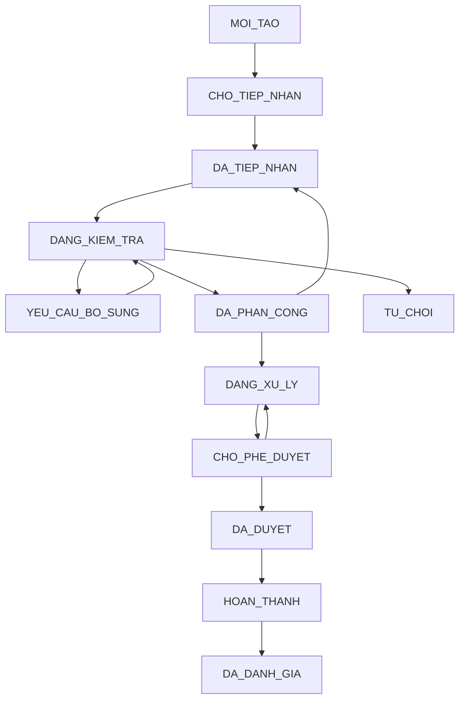
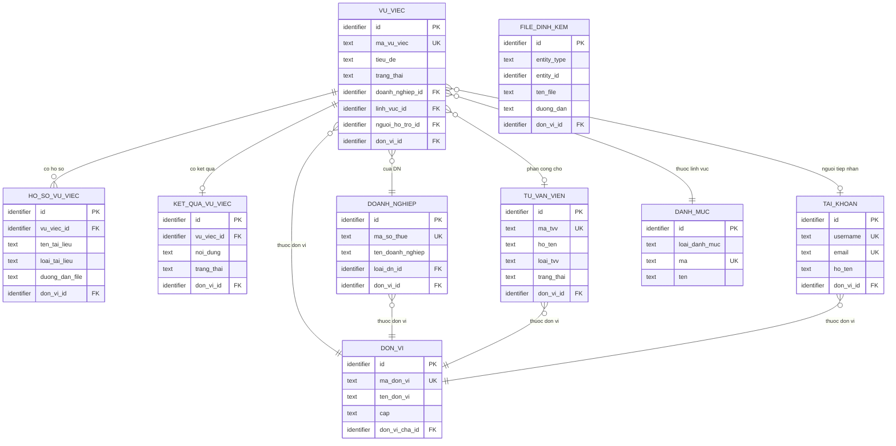
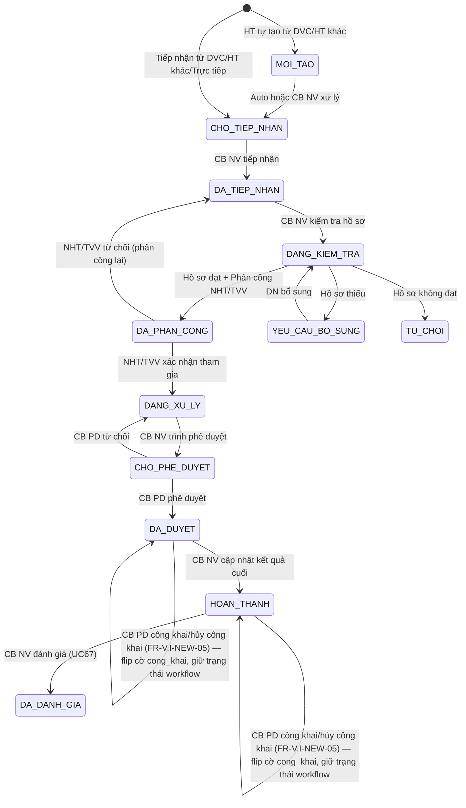

# SRS — Section 3.2.8: Quản lý Vụ việc Trợ giúp Pháp lý

**Dự án:** Phần mềm hỗ trợ pháp lý doanh nghiệp
**Phiên bản SRS:** 3.5
**Nhóm:** V.I — Quản lý Vụ việc Trợ giúp Pháp lý
**UC range:** UC 51 – UC 67 + UC mới
**Số FR:** 21 (17 base + FR-V.I-NEW-01 + FR-V.I-NEW-02 + FR-V.I-NEW-05 + FR-V.I-CROSS-01)
**File chính:** `srs-v3.md` Section 3.2

---

## Lịch sử thay đổi

| Ngày | Tác giả | Mô tả thay đổi |
|------|---------|-----------------|
| 2026-04-03 | SRS Agent | Tạo v3.0 từ `srs-v3.md` Template v3.0 |
| 2026-05-06 | SRS Agent | **v3.5 — apply 14 Thay đổi từ delta `v3.5-delta-fr-05.md`:** (1) SLA 10→15 ngày + cite NĐ55 Đ.8 K.1; (2) Công khai VU_VIEC: 5 cột CR-01 + FR-V.I-NEW-05 + 2 self-loop SM + Badge "Đã công khai" + whitelist BR-PUBLIC-04 (Q-NEW-02); (3) Field `file_dinh_kem` (CR-07) cho VU_VIEC; (4) FR-V.I-NEW-02 DN bổ sung HS; (8) Refactor mô hình phân công 2 thẻ Cá nhân/Tổ chức (cover CSV UC59); (9) Tách NGUOI_HO_TRO + TO_CHUC_TU_VAN reference + bỏ ENUM 'NHT'; (11) CB PD từ chối → DANG_XU_LY; (12) UC67 ENUM CB_NV/DN + duplicate guard + tách thang VV (0-10) vs TVV (1-5); (13) Bỏ TVV địa bàn (NĐ 77/2008 Đ.19) + thang TVV 1-5; (14) BR-AUTH-01 bỏ VNPT eKYC + 2-tier (Tier 1 nội bộ + Tier 2 VNeID); (15) DON_VI 2 tầng; (16) FR-V.I-02/04 auth VNeID + lookup DN + check BR-CALC-04; (17) Spec đầy đủ 3 entity owned (PHAN_CONG_VU_VIEC, DANH_GIA_VU_VIEC, LICH_SU_VU_VIEC) + 8 BR mới; (19) SCR-V.I-03 cleanup + chế độ DN + 2 SCR DN mới (SCR-V.I-04/05). Plus V4-CHƯA-SỬA #1: sửa BR-AUTH-08 thiếu exception TW. **OUT:** Thay đổi 5 (Mở lại HS), 6 (auto 3 lần), 7 (auto-return), 10 (đổi tên FR-V.I-15 + BR-AUTH-10), 18 (SCR-V.I-01 7 tab), 20 (FR-V.I-12 thủ công). Cite NĐ55 Đ.8 K.1 + Đ.4 + NĐ69/2024 PENDING verify lượt sau. |
| 2026-05-06 | SRS Agent | **v3.5 rev. 2 — fix 10 gap UI sau deep review:** (G1) SCR-V.I-03 bảng nút Phân công thành 2 thẻ Cá nhân/Tổ chức; (G2 + G4) SCR-V.I-03 Accordion 5 thêm "Khi loai='TO_CHUC' → hiển thị tên tổ chức" + đổi label "địa bàn" → "đơn vị quản lý" (NĐ 77/2008 Đ.19); (G3) SCR-V.I-01 cột 17 đổi "NHT/TVV" → "Người xử lý / Tổ chức"; (G5) FR-V.I-02 Mô tả thêm "qua PM (auth Tier 2 VNeID)"; (G6) Thêm Mục 3.A-G quy ước UI chung trước SCR-V.I-01 (7 sub-section: Cách đọc bảng / Ánh xạ DB→UI / Cắt nội dung / Trạng thái dữ liệu / Thông báo chung / Responsive / Quy ước viết description); (G7) SCR-V.I-03 Stepper thêm 2 badge phụ "Yêu cầu bổ sung" + "Từ chối"; (G8) Thêm Quy ước hiển thị nút sau bảng nút thao tác; (G9) Thêm sub-section "Thông báo riêng SCR-V.I-03" 11 message; (G10) Cập nhật lịch sử thay đổi này. |

---

## Mục lục file này

- [1. Tổng quan nhóm](#1-tổng-quan-nhóm)
- [2. Yêu cầu chức năng chi tiết](#2-yêu-cầu-chức-năng-chi-tiết)
- [3. Màn hình chức năng](#3-màn-hình-chức-năng)
- [4. Entity liên quan](#4-entity-liên-quan)
- [5. State Machine liên quan](#5-state-machine-liên-quan)
- [6. Business Rules liên quan](#6-business-rules-liên-quan)

---

## 1. Tổng quan nhóm

**Mục đích:** Tiếp nhận, kiểm tra, phân công, xử lý và đánh giá vụ việc hỗ trợ pháp lý cho DNNVV theo NĐ55/2019/NĐ-CP.

**Entity chính:** VU_VIEC, HO_SO_YEU_CAU, TAI_LIEU_VU_VIEC, PHAN_CONG_VU_VIEC, KET_QUA_VU_VIEC, DANH_GIA_VU_VIEC, LICH_SU_VU_VIEC, THONG_BAO

**Tác nhân chính:** CB NV, CB PD, NHT, DN, HT TTHC BTP (Hệ thống)

**Kênh tiếp nhận:** DVC (qua LGSP), Hệ thống khác (REST API trực tiếp), Trực tiếp nhập trên PM

**SLA:** 15 ngày làm việc (NĐ55/2019 Điều 8 Khoản 1 — trả lời vướng mắc pháp lý cho DNNVV) — BR-SLA-01

**State Machine — SM-VUVIEC (12 trạng thái):**

**Tiêu chí phân công NHT/TVV (BR-CALC-04 — NĐ55 Điều 4):**
1. Ưu tiên DN do phụ nữ làm chủ (+3 điểm)
2. Ưu tiên DN sử dụng nhiều lao động nữ (+2 điểm)
3. Ưu tiên DN sử dụng ≥30% lao động khuyết tật (+2 điểm)
4. Ưu tiên FIFO (+1 điểm)
5. Kết hợp: lĩnh vực + địa bàn + workload cân bằng

**Auto-transition AT-03:** CB NV nhấn "Trình phê duyệt" → auto CHO_PHE_DUYET + thông báo CB PD

---

## 2. Yêu cầu chức năng chi tiết

---

### FR-V.I-01: Quản lý hồ sơ yêu cầu HTPL (UC51)

**UC Reference:** UC 51 | **Priority:** Essential | **Stability:** High
**Màn hình:** SCR-V.I-01

**Mô tả:** Quản lý danh sách hồ sơ yêu cầu HTPL. Hỗ trợ tìm kiếm, lọc theo trạng thái, lĩnh vực, kênh tiếp nhận, mức SLA.

**Tác nhân:** CB NV (TW/BN/ĐP)

**Preconditions:**

| # | Điều kiện |
|---|----------|
| PRE-01 | User đã đăng nhập (BR-AUTH-01) |
| PRE-02 | User có quyền "Quản lý vụ việc" (UC115) |
| PRE-03 | phân quyền theo đơn vị áp dụng |

**Inputs:**

| # | Tên field | Kiểu logic | Bắt buộc | Ràng buộc |
|---|----------|-----------|----------|-----------|
| 1 | tu_khoa | text | N | Tìm theo mã HS/tên DN |
| 2 | trang_thai | text | N | Lọc theo trạng thái SM-VUVIEC |
| 3 | linh_vuc_id | identifier | N | Lĩnh vực PL |
| 4 | kenh_tiep_nhan | text | N | DVC / HE_THONG_KHAC / TRUC_TIEP / BUU_CHINH / DIEN_THOAI |
| 5 | tu_ngay | date | N | Từ ngày |
| 6 | den_ngay | date | N | Đến ngày |
| 7 | muc_sla | text | N | BINH_THUONG / SAP_HET / QUA_HAN |

**Processing:**

| Bước | Mô tả xử lý | BR áp dụng |
|------|-------------|-----------|
| 1 | Kiểm tra quyền và phân quyền theo đơn vị | BR-AUTH-01, BR-AUTH-08 |
| 2 | Lấy danh sách VU_VIEC chưa xóa, trong phạm vi đơn vị | BR-DATA-02 |
| 3 | Kết hợp thông tin DOANH_NGHIEP, DANH_MUC | — |
| 4 | Tính mức SLA thời gian thực | BR-SLA-01 |
| 5 | Phân trang (mặc định 20/trang) | BR-DATA-07 |

**Outputs:**

| # | Tên field | Kiểu logic | Mô tả |
|---|----------|-----------|-------|
| 1 | id | identifier | ID vụ việc |
| 2 | ma_vu_viec | text | Mã hồ sơ |
| 3 | ten_doanh_nghiep | text | Tên DN |
| 4 | linh_vuc | text | Lĩnh vực PL |
| 5 | kenh_tiep_nhan | text | Kênh tiếp nhận |
| 6 | trang_thai | text | Trạng thái SM-VUVIEC |
| 7 | nguoi_ho_tro | text | TVV phân công (nếu có) |
| 8 | ngay_tiep_nhan | datetime | Ngày tiếp nhận |
| 9 | deadline_sla | date | Deadline SLA |
| 10 | muc_sla | text | Mức cảnh báo SLA |
| 11 | total_count | number | Tổng bản ghi |

**Postconditions:** Read-only (quản lý danh sách).

**Error Handling:**

| # | Điều kiện lỗi | Mã lỗi | Phản hồi hệ thống | Severity |
|---|--------------|--------|-------------------|----------|
| E1 | Không có kết quả | INF-VV-01 | "Không tìm thấy hồ sơ phù hợp" | INFO |

**Acceptance Criteria:**
- **Given** CB NV truy cập "Hồ sơ yêu cầu HTPL" **When** hiển thị **Then** danh sách HS thuộc đơn vị, phân trang, phân quyền TW/BN/ĐP
- **Given** CB NV xem chi tiết **When** chọn HS **Then** hiển thị đầy đủ + tài liệu đính kèm
- **Given** CB NV lọc theo trạng thái/lĩnh vực/thời gian **When** áp dụng **Then** kết quả AND

**Cross-ref:** SM-VUVIEC, BR-SLA-01, BR-AUTH-01, Entity VU_VIEC, DOANH_NGHIEP

---

### FR-V.I-02: Gửi hồ sơ yêu cầu HTPL (UC52)

**UC Reference:** UC 52 | **Priority:** Essential | **Stability:** High
**Màn hình:** SCR-V.I-02 (form DN gửi HS qua chuyên trang)

**Mô tả:** DN gửi hồ sơ yêu cầu HTPL qua PM (auth Tier 2 VNeID).

**Tác nhân:** Doanh nghiệp

**Preconditions:**

| # | Điều kiện |
|---|----------|
| PRE-01 | DN đã đăng nhập PM qua Tier 2 VNeID (Internet) |

**Inputs:**

| # | Tên field | Kiểu logic | Bắt buộc | Ràng buộc |
|---|----------|-----------|----------|-----------|
| 1 | doanh_nghiep_id | identifier | Y | FK → DOANH_NGHIEP(id); lấy từ session DN đã auth VNeID (không nhập thủ công) |
| 2 | tieu_de | text | Y | Tiêu đề/tóm tắt vụ việc, max 500 ký tự |
| 3 | loai_hinh_ht_id | identifier | Y | FK → DANH_MUC (loai='LOAI_HINH_HT'): Tư vấn / Đại diện / Hỗ trợ khác |
| 4 | linh_vuc_id | identifier | Y | FK → DANH_MUC (loai='LINH_VUC_PHAP_LY') |
| 5 | noi_dung_yeu_cau | text (long) | Y | Nội dung yêu cầu HTPL, max 10.000 ký tự |
| 6 | vu_viec_vuong_mac | text (long) | N | Mô tả chi tiết vướng mắc, max 10.000 ký tự |
| 7 | file_dinh_kem | FILE[] | N | PDF/DOC/DOCX/XLS/XLSX, max 20MB/file, tổng 100MB, max 10 file (quét virus) |

> **Ghi chú Inputs DN:** Thông tin DN (ten_doanh_nghiep, ma_so_thue, dia_chi, nguoi_dai_dien, tinh_thanh_id, loai_dn_id, quy_mo, nganh_nghe, so_lao_dong, doanh_thu_nam, chuc_vu_dd, email, so_dien_thoai, **la_nu_lam_chu, so_lao_dong_nu, so_lao_dong_khuyet_tat**) được đọc từ DOANH_NGHIEP theo `doanh_nghiep_id`. Các field đậm là **input bắt buộc của BR-CALC-04** (ưu tiên phân công). Nếu DN thiếu các field này, Processing bước 2 sẽ trả lỗi yêu cầu DN cập nhật thông tin DN trước khi tạo VV.

**Processing:**

| Bước | Mô tả xử lý | BR áp dụng |
|------|-------------|-----------|
| 1 | Xác nhận dữ liệu đầu vào | — |
| 2 | Lookup DOANH_NGHIEP theo `doanh_nghiep_id` từ session; nếu thiếu field BR-CALC-04 (la_nu_lam_chu, so_lao_dong_nu, so_lao_dong_khuyet_tat, quy_mo, nganh_nghe, so_lao_dong, doanh_thu_nam) → trả lỗi `ERR-GHS-03`, yêu cầu DN cập nhật DN trước | BR-CALC-04 |
| 3 | Tự động sinh mã: VV-{TINH}-{YYYYMMDD}-{SEQ} | BR-DATA-04 |
| 4 | Auto-calc `uu_tien` theo BR-CALC-04 (điểm ưu tiên DN) | BR-CALC-04 |
| 5 | Tạo bản ghi VU_VIEC, trạng thái = MOI_TAO | SM-VUVIEC |
| 6 | Lưu tài liệu đính kèm | — |
| 7 | Ghi LICH_SU_VU_VIEC: hanh_dong='TAO_VV', vai_tro='DN' | BR-DATA-05 |
| 8 | Gửi thông báo cho CB NV đơn vị theo tinh_thanh_id của DN | BR-NOTIF-01 |

**Outputs:** Không có output trực tiếp (xác nhận gửi thành công).

**Postconditions:**
- Hồ sơ yêu cầu được tạo, chờ tiếp nhận
- CB NV nhận thông báo

**Error Handling:**

| # | Điều kiện lỗi | Mã lỗi | Phản hồi hệ thống | Severity |
|---|--------------|--------|-------------------|----------|
| E1 | Nội dung yêu cầu trống | ERR-GHS-01 | "Nội dung yêu cầu là bắt buộc" | ERROR |
| E2 | MST không hợp lệ | ERR-GHS-02 | "Mã số thuế không hợp lệ" | ERROR |
| E3 | DN thiếu thông tin BR-CALC-04 | ERR-GHS-03 | "Vui lòng cập nhật thông tin DN (lao động, doanh thu, ngành nghề, quy mô) trước khi gửi yêu cầu" | ERROR |
| E4 | File vi phạm constraint | ERR-GHS-04 | "File vượt quá dung lượng/số lượng cho phép hoặc sai định dạng" | ERROR |

**Acceptance Criteria:**
- **Given** DN truy cập PM (auth VNeID Tier 2) **When** chọn "Gửi yêu cầu HTPL" **Then** form nhập
- **Given** DN nhập đủ + upload tài liệu **When** gửi **Then** tạo HS mới + thông báo thành công

**Cross-ref:** SM-VUVIEC, Entity VU_VIEC, HO_SO_VU_VIEC

---

### FR-V.I-03: Tiếp nhận hồ sơ qua DVC (UC53)

**UC Reference:** UC 53 | **Priority:** Essential | **Stability:** Medium

**Mô tả:** Tiếp nhận HS từ HT TTHC BTP qua LGSP. Tự động tạo VU_VIEC.

**Tác nhân:** Hệ thống TTHC BTP (qua LGSP)

**Preconditions:**

| # | Điều kiện |
|---|----------|
| PRE-01 | API inbound từ HT TTHC BTP hoạt động |
| PRE-02 | Kết nối LGSP sẵn sàng |

**Inputs:**

| # | Tên field | Kiểu logic | Bắt buộc | Ràng buộc |
|---|----------|-----------|----------|-----------|
| 1 | ma_ho_so_dvc | text | Y | Mã hồ sơ từ DVC |
| 2 | ten_doanh_nghiep | text | Y | Tên DN |
| 3 | ma_so_thue | text | Y | MST |
| 4 | dia_chi | text | Y | Địa chỉ |
| 5 | nguoi_dai_dien | text | Y | Người đại diện |
| 6 | noi_dung | text (long) | Y | Nội dung yêu cầu |
| 7 | linh_vuc | text | Y | Mã lĩnh vực |
| 8 | tai_lieu | FILE[] | N | Danh sách file (base64 hoặc URL) |

**Processing:**

| Bước | Mô tả xử lý | BR áp dụng |
|------|-------------|-----------|
| 1 | Nhận request qua API LGSP | — |
| 2 | Xác nhận cấu trúc JSON | — |
| 3 | Kiểm tra mã hồ sơ DVC chưa tồn tại (idempotent) | — |
| 4 | Mapping lĩnh vực → danh mục hệ thống | — |
| 5 | Tự động sinh mã vụ việc | BR-DATA-04 |
| 6 | Tạo VU_VIEC, trạng thái = CHO_TIEP_NHAN, kênh = DVC | SM-VUVIEC |
| 7 | Lưu tài liệu đính kèm | — |
| 8 | Phản hồi về HT TTHC BTP | — |
| 9 | Gửi thông báo CB NV | — |
| 10 | Ghi nhật ký thao tác | BR-DATA-05 |

**Outputs:**

| # | Tên field | Kiểu logic | Mô tả |
|---|----------|-----------|-------|
| 1 | success | boolean | true/false |
| 2 | ma_vu_viec | text | Mã VV trong PM |
| 3 | trang_thai | text | CHO_TIEP_NHAN |
| 4 | error_code | text | Mã lỗi (nếu failed) |
| 5 | error_message | text | Mô tả lỗi |

**Postconditions:**
- Hồ sơ từ DVC được tạo tự động
- CB NV nhận thông báo
- Trạng thái phản hồi về HT TTHC BTP

**Error Handling:**

| # | Điều kiện lỗi | Mã lỗi | Phản hồi hệ thống | Severity |
|---|--------------|--------|-------------------|----------|
| E1 | JSON không hợp lệ | ERR-DVC-01 | "Cấu trúc dữ liệu không hợp lệ" | ERROR |
| E2 | Mã HS DVC trùng | ERR-DVC-02 | "Hồ sơ đã tiếp nhận trước đó" | ERROR |
| E3 | Lĩnh vực không mapping | ERR-DVC-03 | "Mã lĩnh vực không tồn tại" | ERROR |

**Acceptance Criteria:**
- **Given** HT TTHC BTP gửi HS qua LGSP **When** PM nhận **Then** kiểm tra cấu trúc, tạo HS mới, sinh mã
- **Given** tiếp nhận thành công **When** xử lý **Then** phản hồi trạng thái về HT TTHC BTP
- **Given** dữ liệu không hợp lệ **When** validate **Then** trả mã lỗi + mô tả

**Cross-ref:** API LGSP inbound, SM-VUVIEC, Entity VU_VIEC

---

### FR-V.I-04: Nhập hồ sơ yêu cầu thủ công (UC54)

**UC Reference:** UC 54 | **Priority:** Essential | **Stability:** High
**Màn hình:** SCR-V.I-02

**Mô tả:** CB NV nhập hồ sơ thủ công (trực tiếp/điện thoại). Trạng thái bắt đầu = DA_TIEP_NHAN (bỏ qua MOI_TAO, CHO_TIEP_NHAN).

**Preconditions:**

| # | Điều kiện |
|---|----------|
| PRE-01 | User đã đăng nhập, có quyền "Nhập hồ sơ VV" |

**Inputs:**

| # | Tên field | Kiểu logic | Bắt buộc | Ràng buộc |
|---|----------|-----------|----------|-----------|
| 1 | ma_so_thue | text | Y | Lookup DOANH_NGHIEP; nếu chưa có → mở modal tạo DN mới với đủ field BR-CALC-04 |
| 2 | doanh_nghiep_id | identifier | Y | FK → DOANH_NGHIEP(id); set sau khi lookup/tạo ở field 1 |
| 3 | tieu_de | text | Y | max 500 ký tự — tiêu đề/tóm tắt VV |
| 4 | loai_hinh_ht_id | identifier | Y | FK → DANH_MUC (loai='LOAI_HINH_HT') |
| 5 | linh_vuc_id | identifier | Y | FK → DANH_MUC (loai='LINH_VUC_PHAP_LY') |
| 6 | noi_dung_yeu_cau | text (long) | Y | max 10.000 ký tự |
| 7 | vu_viec_vuong_mac | text (long) | N | max 10.000 ký tự, mô tả chi tiết vướng mắc |
| 8 | kenh_tiep_nhan | text | Y | CHECK IN ('TRUC_TIEP','DIEN_THOAI','BUU_CHINH') |
| 9 | file_scan | FILE[] | N | PDF/DOC/DOCX/JPG/PNG, max 20MB/file, tổng 100MB, max 10 file (quét virus) |
| 10 | uu_tien | number | N | BETWEEN 1 AND 5; mặc định auto-calc BR-CALC-04, CB NV có thể override |
| 11 | ly_do_uu_tien | text | N | Bắt buộc khi `uu_tien` được override khác giá trị BR-CALC-04; max 500 ký tự |

> **Ghi chú Inputs DN:** Các field DN (tinh_thanh_id, loai_dn_id, quy_mo, nganh_nghe, so_lao_dong, doanh_thu_nam, chuc_vu_dd, email, so_dien_thoai, **la_nu_lam_chu, so_lao_dong_nu, so_lao_dong_khuyet_tat**) quản lý bởi DOANH_NGHIEP (Nhóm V.III). Modal tạo DN mới (khi MST chưa có) BẮT BUỘC nhập đủ các field đậm để BR-CALC-04 hoạt động.

**Processing:**

| Bước | Mô tả xử lý | BR áp dụng |
|------|-------------|-----------|
| 1 | Kiểm tra quyền | BR-AUTH-01 |
| 2 | Xác nhận dữ liệu đầu vào | — |
| 3 | Lookup DOANH_NGHIEP theo `ma_so_thue`; nếu chưa có → mở modal tạo DN mới (cross-ref Nhóm V.III) với đủ field BR-CALC-04 | — |
| 4 | Verify DOANH_NGHIEP đủ field BR-CALC-04 (la_nu_lam_chu, so_lao_dong_nu, so_lao_dong_khuyet_tat, quy_mo, nganh_nghe, so_lao_dong, doanh_thu_nam); nếu thiếu → ERR-NH-04 | BR-CALC-04 |
| 5 | Tự động sinh mã vụ việc | BR-DATA-04 |
| 6 | Auto-calc `uu_tien` theo BR-CALC-04; nếu CB NV override phải có `ly_do_uu_tien` | BR-CALC-04 |
| 7 | Tạo VU_VIEC, trạng thái = DA_TIEP_NHAN | SM-VUVIEC |
| 8 | Tính deadline SLA: ngày tiếp nhận + 15 ngày làm việc (NĐ55/2019 Điều 8 Khoản 1) | BR-SLA-01 |
| 9 | Lưu tài liệu đính kèm | — |
| 10 | Ghi LICH_SU_VU_VIEC: hanh_dong='TAO_VV', vai_tro='CB_NV' | BR-DATA-05 |

**Outputs:** Không có output trực tiếp (xác nhận lưu thành công, redirect chi tiết VV).

**Postconditions:**
- Hồ sơ được tạo với trạng thái DA_TIEP_NHAN
- Deadline SLA được tính tự động
- DN mới được tạo nếu chưa tồn tại

**Error Handling:**

| # | Điều kiện lỗi | Mã lỗi | Phản hồi hệ thống | Severity |
|---|--------------|--------|-------------------|----------|
| E1 | Nội dung trống | ERR-NH-01 | "Nội dung yêu cầu là bắt buộc" | ERROR |
| E2 | MST format lỗi | ERR-NH-02 | "Mã số thuế không hợp lệ" | ERROR |
| E3 | File vi phạm constraint | ERR-NH-03 | "File vượt quá dung lượng/số lượng cho phép hoặc sai định dạng" | ERROR |
| E4 | DN thiếu thông tin BR-CALC-04 | ERR-NH-04 | "DN thiếu thông tin bắt buộc (lao động/doanh thu/ngành nghề/quy mô). Cập nhật DN trước" | ERROR |
| E5 | `uu_tien` override thiếu `ly_do_uu_tien` | ERR-NH-05 | "Phải nhập lý do ưu tiên khi override giá trị hệ thống" | ERROR |

**Acceptance Criteria:**
- **Given** CB NV chọn "Nhập hồ sơ thủ công" **When** form hiển thị **Then** nhập thông tin DN + nội dung
- **Given** CB NV nhập đủ **When** lưu **Then** tạo HS + sinh mã + ghi nguồn "Trực tiếp/Điện thoại"

**Cross-ref:** SM-VUVIEC, BR-SLA-01, Entity VU_VIEC, DOANH_NGHIEP

---

### FR-V.I-05: Tiếp nhận hồ sơ từ hệ thống khác (UC55)

**UC Reference:** UC 55 | **Priority:** Essential | **Stability:** High

**Mô tả:** Tiếp nhận HS từ hệ thống bên ngoài qua REST API trực tiếp (không qua LGSP). CB NV quản lý danh sách, chi tiết, tìm kiếm, xóa.

**Tác nhân:** Hệ thống bên ngoài (API Inbound), CB NV (CMS)

**Preconditions:**

| # | Điều kiện |
|---|----------|
| PRE-01 | (API Inbound) Hệ thống nguồn đã đăng ký, có API key hợp lệ (kết nối REST trực tiếp, không qua LGSP/NDXP) |
| PRE-02 | (CMS) User đã đăng nhập, có quyền "Quản lý hồ sơ VV" |

**Inputs (API Inbound):**

| # | Tên field | Kiểu logic | Bắt buộc | Ràng buộc |
|---|----------|-----------|----------|-----------|
| 1 | he_thong_nguon | text | Y | Mã định danh hệ thống gửi (đã đăng ký trực tiếp với PM) |
| 2 | ma_ho_so_nguon | text | Y | Mã hồ sơ trên hệ thống nguồn (dùng để check trùng + đối chiếu) |
| 3 | thong_tin_dn | text (JSON) | Y | Thông tin DN: {ten, ma_so_thue, dia_chi, nguoi_dai_dien, sdt, email} |
| 4 | noi_dung_yeu_cau | text (long) | Y | Nội dung yêu cầu hỗ trợ pháp lý |
| 5 | linh_vuc_id | identifier | N | FK → DANH_MUC (lĩnh vực PL), nếu HT nguồn cung cấp |
| 6 | file_dinh_kem | FILE[] | N | Danh sách tệp đính kèm (base64) |

**Inputs (CMS):**

| # | Tên field | Kiểu logic | Bắt buộc | Ràng buộc |
|---|----------|-----------|----------|-----------|
| 1 | keyword | text | N | Từ khóa tìm kiếm (mã hồ sơ, tên DN, HT nguồn) |
| 2 | he_thong_nguon_filter | text | N | Lọc theo hệ thống nguồn |
| 3 | tu_ngay / den_ngay | date | N | Lọc theo khoảng thời gian tiếp nhận |
| 4 | page / page_size | number | N | Phân trang (default 1/20) |

**Processing (API Inbound):**

| Bước | Mô tả xử lý | BR áp dụng |
|------|-------------|-----------|
| 1 | Xác thực API key + HTTPS TLS 1.2+ (kết nối trực tiếp) | BR-AUTH-01 |
| 2 | Xác nhận JSON schema: kiểm tra trường bắt buộc, format | — |
| 3 | Kiểm tra hệ thống nguồn đã đăng ký trong DANH_MUC (loai = 'HE_THONG_NGUON', trang_thai = 1) | — |
| 4 | Kiểm tra trùng: đếm số VV có cùng hệ thống nguồn + mã hồ sơ nguồn + chưa xóa | — |
| 5 | Tạo/liên kết DOANH_NGHIEP theo mã số thuế (UPSERT) | BR-DATA-03 |
| 6 | Tạo VU_VIEC: kênh = HE_THONG_KHAC, trạng thái = CHO_TIEP_NHAN | SM-VUVIEC |
| 7 | Lưu file đính kèm (decode base64, quét virus) | BR-DATA-06 |
| 8 | Ghi nhật ký thao tác (action = 'TIEP_NHAN_TU_HT_KHAC') | BR-DATA-05 |
| 9 | Gửi thông báo CB NV phụ trách (in-app + email) | BR-NOTIF-01 |
| 10 | Trả response: {ma_vu_viec, trang_thai, ngay_tiep_nhan} | — |

**Processing (CMS):**

| Bước | Mô tả xử lý | BR áp dụng |
|------|-------------|-----------|
| 1 | Kiểm tra quyền + phân quyền theo đơn vị | BR-AUTH-01, BR-AUTH-08 |
| 2 | Xem danh sách: lấy VV kênh HE_THONG_KHAC chưa xóa, áp dụng filter + phân trang | BR-DATA-07 |
| 3 | Xem chi tiết: lấy VV kèm thông tin DN + file đính kèm | — |
| 4 | Tìm kiếm theo keyword (mã hồ sơ, tên DN, HT nguồn) + bộ lọc thời gian | — |
| 5 | Xóa mềm VV chưa tiếp nhận (chỉ trạng thái CHO_TIEP_NHAN) | BR-DATA-01 |
| 6 | Ghi nhật ký thao tác cho mọi thao tác | BR-DATA-05 |

**Outputs (API Inbound):**

| # | Tên field | Kiểu logic | Mô tả |
|---|----------|-----------|-------|
| 1 | ma_vu_viec | text | Mã vụ việc (auto-gen: VV-{TINH}-YYYYMMDD-SEQ) |
| 2 | trang_thai | text | 'CHO_TIEP_NHAN' |
| 3 | ngay_tiep_nhan | datetime | Thời điểm hệ thống ghi nhận |

**Outputs (CMS — Danh sách):**

| # | Tên field | Kiểu logic | Mô tả |
|---|----------|-----------|-------|
| 1 | id | identifier | ID bản ghi |
| 2 | ma_vu_viec | text | Mã vụ việc |
| 3 | he_thong_nguon | text | Tên hệ thống gửi |
| 4 | ma_ho_so_nguon | text | Mã hồ sơ trên HT nguồn |
| 5 | ten_doanh_nghiep | text | Tên DN |
| 6 | noi_dung_yeu_cau | text (long) | Nội dung yêu cầu (rút gọn) |
| 7 | trang_thai | text | Trạng thái vụ việc |
| 8 | ngay_tiep_nhan | datetime | Ngày tiếp nhận |
| 9 | total_count | number | Tổng số bản ghi (phân trang) |

**Postconditions:**

| Thao tác | Postcondition |
|----------|--------------|
| API Inbound | VU_VIEC mới với trang_thai = 'CHO_TIEP_NHAN', AUDIT_LOG ghi nhận, THONG_BAO gửi CB NV |
| CMS Xóa | VU_VIEC.is_deleted = 1 (chỉ khi trang_thai = 'CHO_TIEP_NHAN'), AUDIT_LOG ghi nhận |

**Error Handling:**

| # | Điều kiện lỗi | Mã lỗi | Phản hồi hệ thống | Severity |
|---|--------------|--------|-------------------|----------|
| E1 | HT nguồn chưa đăng ký | ERR-INTG-01 | "Hệ thống chưa được đăng ký" | ERROR |
| E2 | Hồ sơ trùng (ma_ho_so_nguon + he_thong_nguon) | ERR-INTG-02 | "Hồ sơ đã tồn tại" | ERROR |
| E3 | JSON schema không hợp lệ | ERR-INTG-03 | "Dữ liệu không hợp lệ" | ERROR |
| E4 | File đính kèm vượt 20MB | ERR-FILE-01 | "Tệp vượt quá 20MB" | ERROR |
| E5 | File chứa mã độc | ERR-FILE-02 | "Tệp chứa mã độc, không thể tiếp nhận" | ERROR |
| E6 | User không có quyền (CMS) | ERR-AUTH-01 | "Bạn không có quyền thực hiện chức năng này" | ERROR |
| E7 | Xóa hồ sơ đã tiếp nhận | ERR-VV-01 | "Không thể xóa hồ sơ đã được tiếp nhận" | ERROR |

**Edge Cases:**

| EC | Điều kiện | Xử lý |
|----|-----------|-------|
| EC-V.I-05-01 | thong_tin_dn nested fields validation | ma_so_thue: REGEX ^[0-9]{10,13}$; ten: max 500 chars; email: RFC 5322; sdt: max 15 digits. Trả ERR-INTG-03 với chi tiết trường lỗi |
| EC-V.I-05-02 | noi_dung_yeu_cau TEXT unbounded | Max 50KB (51200 bytes). Vượt quá → ERR-INTG-05 |
| EC-V.I-05-03 | Concurrent DOANH_NGHIEP UPSERT on same ma_so_thue | Tạo hoặc cập nhật nguyên tử (nếu đã tồn tại thì cập nhật). Đảm bảo tuần tự cho thao tác này |
| EC-V.I-05-04 | Idempotency on retry | Nếu ma_ho_so_nguon + he_thong_nguon đã tồn tại → trả HTTP 200 với bản ghi hiện có (KHÔNG trả error). Chỉ trả ERR-INTG-02 nếu dữ liệu khác nhau |
| EC-V.I-05-05 | Rate limiting inbound API | 50 req/min/he_thong_nguon (sliding window). Vượt quá → HTTP 429 + Retry-After |
| EC-V.I-05-06 | File count + total size | Max 10 files/request, max 100MB tổng. Vượt quá → ERR-FILE-03 |
| EC-V.I-05-07 | HTTP request body size | Max 150MB (bao gồm base64 overhead). Server reject trước JSON parse → HTTP 413 |
| EC-V.I-05-08 | don_vi_id assignment | Resolve don_vi_id từ DANH_MUC 'HE_THONG_NGUON'.don_vi_mac_dinh_id. Nếu không có mapping → gán don_vi_id = TW + cảnh báo QTHT |
| EC-V.I-05-09 | SLA clock start | deadline tính từ thời điểm CB NV chuyển CHO_TIEP_NHAN → DA_TIEP_NHAN (KHÔNG từ API receipt) |
| EC-V.I-05-10 | IP whitelist cho HT khác | Mỗi he_thong_nguon có trường ip_whitelist. Request từ IP ngoài whitelist → ERR-AUTH-11 |
| EC-V.I-05-11 | Partial failure on virus scan | Transaction scope: steps 5-7 trong cùng DB transaction. Nếu bất kỳ file nào fail virus scan → rollback toàn bộ |
| EC-V.I-05-12 | Invalid linh_vuc_id FK | Nếu linh_vuc_id provided và không tồn tại trong DANH_MUC → ERR-INTG-04 |
| EC-V.I-05-13 | phân quyền theo đơn vị on CMS DELETE | Xóa mềm phải kiểm tra phân quyền dữ liệu cho mọi thao tác CMS, không chỉ LIST |

**Acceptance Criteria:**
- **Given** HT bên ngoài gửi hồ sơ qua API trực tiếp (REST JSON, HTTPS) **When** dữ liệu hợp lệ **Then** tạo VU_VIEC + thông báo CB NV
- **Given** HT bên ngoài gửi hồ sơ trùng **When** kiểm tra ma_ho_so_nguon **Then** trả lỗi ERR-INTG-02
- **Given** CB NV mở danh sách hồ sơ từ HT khác **When** có dữ liệu **Then** hiển thị danh sách + lọc + phân trang
- **Given** CB NV tìm kiếm **When** nhập keyword **Then** hiển thị kết quả theo mã hồ sơ, tên DN, HT nguồn

**Cross-ref:** SM-VUVIEC, BR-SLA-01, Entity VU_VIEC, DOANH_NGHIEP, FILE_DINH_KEM

---

### FR-V.I-06: Kiểm tra hồ sơ yêu cầu (UC56)

**UC Reference:** UC 56 | **Priority:** Essential | **Stability:** High
**Màn hình:** SCR-V.I-03 (Accordion 4 — Kết quả Kiểm tra)

**Mô tả:** CB NV kiểm tra tính đầy đủ và hợp lệ của HS theo checklist UC106 (6 hạng mục Mẫu 01 NĐ55).

**Preconditions:**

| # | Điều kiện |
|---|----------|
| PRE-01 | User đã đăng nhập |
| PRE-02 | VV ở trạng thái DA_TIEP_NHAN hoặc DANG_KIEM_TRA |

**Inputs:**

| # | Tên field | Kiểu logic | Bắt buộc | Ràng buộc |
|---|----------|-----------|----------|-----------|
| 1 | vu_viec_id | identifier | Y | Vụ việc kiểm tra |
| 2 | checklist | text (JSON) | Y | Array: [{hang_muc_id, dat: 0/1, ghi_chu}] |
| 3 | ket_luan | text | Y | DAT / KHONG_DAT / YEU_CAU_BO_SUNG |
| 4 | ly_do | text | Cond | Bắt buộc nếu KHONG_DAT hoặc YEU_CAU_BO_SUNG |

**Hạng mục kiểm tra (UC106):**
1. Văn bản đề nghị hỗ trợ (Mẫu 01 NĐ55)
2. Bản chụp Giấy CNĐKKD
3. Tờ khai xác định quy mô DN (NĐ39/2018)
4. Hợp đồng dịch vụ TVPL
5. Văn bản TVPL (bản đầy đủ)
6. Văn bản TVPL (bản loại bỏ bí mật KD)

**Processing:**

| Bước | Mô tả xử lý | BR áp dụng |
|------|-------------|-----------|
| 1 | Kiểm tra quyền + phân quyền theo đơn vị | BR-AUTH-01 |
| 2 | Chuyển trạng thái DANG_KIEM_TRA (nếu chưa) | SM-VUVIEC |
| 3 | Tải checklist từ cấu hình UC106 | — |
| 4 | CB NV đánh dấu từng hạng mục | — |
| 5 | Nếu DAT: chuyển trạng thái DA_PHAN_CONG | SM-VUVIEC |
| 6 | Nếu YEU_CAU_BO_SUNG: chuyển trạng thái, gửi thông báo DN | SM-VUVIEC |
| 7 | Nếu KHONG_DAT: chuyển trạng thái TU_CHOI, gửi thông báo DN | SM-VUVIEC |
| 8 | Ghi lịch sử xử lý | — |
| 9 | Ghi nhật ký thao tác | BR-DATA-05 |

**Outputs:** Không có output riêng (trạng thái VV được cập nhật, thông báo gửi nếu cần).

**Postconditions:**
- Kết quả kiểm tra được ghi nhận
- Trạng thái VV chuyển theo SM-VUVIEC
- DN nhận thông báo nếu cần bổ sung hoặc từ chối

**Error Handling:**

| # | Điều kiện lỗi | Mã lỗi | Phản hồi hệ thống | Severity |
|---|--------------|--------|-------------------|----------|
| E1 | VV không ở trạng thái hợp lệ | ERR-KT-01 | "Vụ việc không ở trạng thái cho phép kiểm tra" | ERROR |
| E2 | Thiếu lý do bổ sung/từ chối | ERR-KT-02 | "Lý do là bắt buộc" | ERROR |

**Acceptance Criteria:**
- **Given** CB NV xem HS chờ kiểm tra **When** đánh giá **Then** checklist theo UC106
- **Given** HS chưa đủ **When** CB NV gửi yêu cầu bổ sung **Then** trạng thái → YEU_CAU_BO_SUNG + thông báo DN
- **Given** CB NV kiểm tra xong **When** kết luận Đạt **Then** trạng thái → DA_PHAN_CONG

**Cross-ref:** SM-VUVIEC, UC106, Entity VU_VIEC, LICH_SU_VU_VIEC

---

### FR-V.I-07: Quản lý hồ sơ vụ việc (UC57)

**UC Reference:** UC 57 | **Priority:** Essential | **Stability:** High
**Màn hình:** SCR-V.I-03

**Mô tả:** Xem chi tiết, chỉnh sửa, upload tài liệu bổ sung cho vụ việc.

**Preconditions:**

| # | Điều kiện |
|---|----------|
| PRE-01 | User đã đăng nhập |
| PRE-02 | VV tồn tại trong hệ thống |

**Inputs:**

| # | Tên field | Kiểu logic | Bắt buộc | Ràng buộc |
|---|----------|-----------|----------|-----------|
| 1 | vu_viec_id | identifier | Y | VV cần chỉnh sửa |
| 2 | noi_dung_yeu_cau | text (long) | N | Cập nhật nội dung |
| 3 | file_bo_sung | FILE[] | N | Upload tài liệu bổ sung |
| 4 | ghi_chu | text (long) | N | Ghi chú |

**Processing:**

| Bước | Mô tả xử lý | BR áp dụng |
|------|-------------|-----------|
| 1 | Kiểm tra quyền + phân quyền theo đơn vị | BR-AUTH-01 |
| 2 | Kiểm tra trạng thái cho phép sửa (NOT HOAN_THANH, DA_DANH_GIA) | SM-VUVIEC |
| 3 | Cập nhật VU_VIEC | — |
| 4 | Lưu tài liệu bổ sung | — |
| 5 | Ghi lịch sử thay đổi | — |
| 6 | Ghi nhật ký thao tác | BR-DATA-05 |

**Outputs:**

| # | Tên field | Kiểu logic | Mô tả |
|---|----------|-----------|-------|
| 1 | ma_vu_viec | text | Mã VV |
| 2 | ten_doanh_nghiep | text | Tên DN |
| 3 | noi_dung_yeu_cau | text (long) | Nội dung |
| 4 | linh_vuc | text | Lĩnh vực |
| 5 | trang_thai | text | Trạng thái hiện tại |
| 6 | nguoi_ho_tro | text | TVV phân công |
| 7 | lich_su | text (JSON) | Danh sách lịch sử xử lý |
| 8 | tai_lieu | FILE[] | Danh sách tài liệu |

**Postconditions:**
- VV được cập nhật thành công
- Lịch sử thay đổi được ghi nhận

**Error Handling:**

| # | Điều kiện lỗi | Mã lỗi | Phản hồi hệ thống | Severity |
|---|--------------|--------|-------------------|----------|
| E1 | VV ở trạng thái không cho phép sửa | ERR-VV-02 | "Không thể chỉnh sửa vụ việc đã hoàn thành" | ERROR |

**Acceptance Criteria:**
- **Given** CB NV truy cập "Hồ sơ vụ việc" **When** hiển thị **Then** danh sách VV thuộc đơn vị
- **Given** CB NV xem chi tiết **When** chọn VV **Then** hiển thị thông tin + trạng thái + lịch sử xử lý
- **Given** CB NV chỉnh sửa **When** upload tài liệu bổ sung **Then** validate + lưu, ghi audit

**Cross-ref:** SM-VUVIEC, Entity VU_VIEC, TAI_LIEU_VU_VIEC, LICH_SU_VU_VIEC

---

### FR-V.I-08: Tìm kiếm hồ sơ (UC58)

**UC Reference:** UC 58 | **Priority:** Essential | **Stability:** High
**Màn hình:** SCR-V.I-01

**Mô tả:** Tìm kiếm VV theo từ khóa, lĩnh vực, trạng thái, kênh tiếp nhận, thời gian.

**Preconditions:**

| # | Điều kiện |
|---|----------|
| PRE-01 | User đã đăng nhập |

**Inputs:**

| # | Tên field | Kiểu logic | Bắt buộc | Ràng buộc |
|---|----------|-----------|----------|-----------|
| 1 | tu_khoa | text | N | Tìm theo mã VV/tên DN |
| 2 | linh_vuc_id | identifier | N | Lĩnh vực PL |
| 3 | trang_thai | text | N | Trạng thái vụ việc |
| 4 | kenh_tiep_nhan | text | N | DVC / HE_THONG_KHAC / TRUC_TIEP / BUU_CHINH / DIEN_THOAI |
| 5 | tu_ngay | date | N | Từ ngày tiếp nhận |
| 6 | den_ngay | date | N | Đến ngày |

**Processing:**

| Bước | Mô tả xử lý | BR áp dụng |
|------|-------------|-----------|
| 1 | Kiểm tra quyền và phân quyền | BR-AUTH-01, BR-AUTH-08 |
| 2 | Kết hợp tất cả điều kiện lọc (AND) | — |
| 3 | Tìm từ khóa trên mã VV, tên DN | — |
| 4 | Phân trang (20/trang) | BR-DATA-07 |

**Outputs:**

| # | Tên field | Kiểu logic | Mô tả |
|---|----------|-----------|-------|
| 1 | id | identifier | ID vụ việc |
| 2 | ma_vu_viec | text | Mã vụ việc |
| 3 | ten_doanh_nghiep | text | Tên DN |
| 4 | ten_linh_vuc | text | Lĩnh vực PL |
| 5 | kenh_tiep_nhan | text | Kênh tiếp nhận |
| 6 | trang_thai | text | Trạng thái |
| 7 | ngay_tiep_nhan | date | Ngày tiếp nhận |
| 8 | deadline_sla | date | Deadline SLA |
| 9 | nguoi_ho_tro | text | Tên NHT (nếu đã phân công) |
| 10 | total_count | number | Tổng bản ghi |

**Postconditions:** Read-only.

**Error Handling:**

| # | Điều kiện lỗi | Mã lỗi | Phản hồi hệ thống | Severity |
|---|--------------|--------|-------------------|----------|
| E1 | Không có kết quả | INF-VV-TK-01 | "Không tìm thấy hồ sơ phù hợp" | INFO |
| E2 | tu_ngay > den_ngay | ERR-VV-TK-01 | "Ngày bắt đầu phải trước ngày kết thúc" | ERROR |

**Acceptance Criteria:**
- **Given** CB NV nhập từ khóa (mã HS/tên DN) **When** tìm kiếm **Then** hiển thị kết quả, phân trang
- **Given** CB NV lọc theo lĩnh vực/trạng thái/thời gian **When** áp dụng **Then** kết quả lọc
- **Given** CB NV kết hợp nhiều điều kiện **When** tìm kiếm **Then** áp dụng AND

**Cross-ref:** Entity VU_VIEC, DOANH_NGHIEP

---

### FR-V.I-09: Lựa chọn người hỗ trợ (UC59)

**UC Reference:** UC 59 | **Priority:** Essential | **Stability:** Medium
**Màn hình:** SCR-V.I-03 (Modal Phân công NHT/TVV)

**Mô tả:** CB NV phân công xử lý vụ việc cho **cá nhân** (TVV/CG cá nhân ngoài hoặc Người hỗ trợ — cán bộ HTPL) hoặc **Tổ chức tư vấn** (Cty Luật / VP Luật sư / Trung tâm TVPL — tổ chức cử TVV cụ thể xử lý). Gợi ý tự động theo tiêu chí ưu tiên NĐ55 Điều 4 + lĩnh vực + khối lượng. Đáp ứng CSV UC59 "chọn Tư vấn viên hoặc Tổ chức tư vấn phù hợp cho vụ việc".

**Preconditions:**

| # | Điều kiện |
|---|----------|
| PRE-01 | User đã đăng nhập, role='CB_NV', có quyền "Phân công VV" |
| PRE-02 | VV ở trạng thái DANG_KIEM_TRA (đạt) hoặc DA_TIEP_NHAN (sau khi NHT từ chối phân công cũ) |
| PRE-03 | User.don_vi_id = VU_VIEC.don_vi_id (BR-AUTH-03/04) |

**Inputs:**

| # | Tên field | Kiểu logic | Bắt buộc | Ràng buộc |
|---|----------|-----------|----------|-----------|
| 1 | vu_viec_id | identifier | Y | Vụ việc cần phân công |
| 2 | loai_doi_tuong_xu_ly | text (enum) | Y | CHECK IN ('CA_NHAN','TO_CHUC') |
| 3 | nguoi_xu_ly_id | identifier | Y (cả 2 loại) | FK → TAI_KHOAN. Nếu `loai='CA_NHAN'`: TAI_KHOAN của TVV/CG (qua `TU_VAN_VIEN.tai_khoan_id`) hoặc của Người hỗ trợ (qua `NGUOI_HO_TRO.tai_khoan_id`), trạng thái HOAT_DONG. Nếu `loai='TO_CHUC'`: PHẢI là TAI_KHOAN của TVV thuộc TC TV vừa chọn (`TU_VAN_VIEN.tai_khoan_id` với `to_chuc_chinh_id = to_chuc_tu_van_id`) |
| 4 | to_chuc_tu_van_id | identifier | Y nếu `loai='TO_CHUC'` | FK → TO_CHUC_TU_VAN(id) |
| 5 | ghi_chu_phan_cong | text | N | max 1000 ký tự, lưu vào PHAN_CONG_VU_VIEC.ghi_chu |

**Processing (Gợi ý người xử lý — BR-CALC-04):**

| Bước | Mô tả xử lý | BR áp dụng |
|------|-------------|-----------|
| 1 | **Nhánh `'CA_NHAN'`:** lấy TAI_KHOAN có vai trò TVV/CG (qua `TU_VAN_VIEN.tai_khoan_id`, trạng thái HOAT_DONG, đã công khai) HOẶC vai trò Người hỗ trợ (qua `NGUOI_HO_TRO.tai_khoan_id`, trạng thái HOAT_DONG). **Nhánh `'TO_CHUC'`:** lấy TO_CHUC_TU_VAN trạng thái HOAT_DONG; sau khi user chọn tổ chức → load danh sách TVV thuộc tổ chức đó để chọn người cụ thể | SM-TVV |
| 2 | Lọc theo lĩnh vực phù hợp với VV: TVV/CG dùng `TU_VAN_VIEN.linh_vuc_chuyen_mon`; Người hỗ trợ dùng `NGUOI_HO_TRO.linh_vuc_ids[]`; Tổ chức TV dùng lĩnh vực đăng ký của tổ chức | — |
| 3 | Tính điểm ưu tiên DN: +3 phụ nữ làm chủ, +2 nhiều LĐ nữ, +2 ≥30% LĐ KT, +1 FIFO | BR-CALC-04 |
| 4 | Tính workload: số VV/HOI_DAP đang xử lý của cá nhân (đối với TO_CHUC: workload của TVV được cử) | — |
| 5 | Sắp xếp: ưu tiên DN giảm dần, workload tăng dần, điểm ĐG giảm dần | — |
| 6 | Hiển thị danh sách gợi ý theo nhánh đã chọn | — |

**Processing (Phân công):**

| Bước | Mô tả xử lý | BR áp dụng |
|------|-------------|-----------|
| 1 | Kiểm tra quyền + scope đơn vị | BR-AUTH-01, BR-AUTH-03/04 |
| 2 | Validate input theo `loai_doi_tuong_xu_ly`: nếu `'CA_NHAN'` phải có `nguoi_xu_ly_id`, `to_chuc_tu_van_id` phải NULL. Nếu `'TO_CHUC'` phải có CẢ `to_chuc_tu_van_id` AND `nguoi_xu_ly_id` (TVV cụ thể) | — |
| 3 | Nếu `loai='TO_CHUC'`: validate `TU_VAN_VIEN[nguoi_xu_ly_id].to_chuc_chinh_id = to_chuc_tu_van_id` (TVV được chọn phải thuộc TC TV được chọn). Nếu fail → ERR-PC-06 | — |
| 4 | Kiểm tra đối tượng được chọn có trạng thái hoạt động: cá nhân → `TAI_KHOAN.trang_thai='HOAT_DONG'`; tổ chức → `TO_CHUC_TU_VAN.trang_thai='HOAT_DONG'` AND TVV được chọn `TU_VAN_VIEN.trang_thai='HOAT_DONG'` | — |
| 5 | Tạo bản ghi PHAN_CONG_VU_VIEC: `loai_doi_tuong_xu_ly` (input), `nguoi_xu_ly_id` (input), `to_chuc_tu_van_id` (input nếu 'TO_CHUC'), `trang_thai='CHO_XAC_NHAN'`, `ghi_chu`, `nguoi_phan_cong_id` | — |
| 6 | Cập nhật VV: `trang_thai = DA_PHAN_CONG`, `loai_doi_tuong_xu_ly` (input), `nguoi_xu_ly_id` (input), nếu `'TO_CHUC'`: `to_chuc_tu_van_id` (input) else NULL, `ngay_phan_cong = NOW()` | SM-VUVIEC |
| 7 | Gửi thông báo trong hệ thống + email cho cá nhân được phân công (TVV cụ thể, cả 2 loại); nếu `loai='TO_CHUC'` kèm CC email cho điểm liên hệ chính của tổ chức | BR-NOTIF-01 |
| 8 | Ghi LICH_SU_VU_VIEC: hanh_dong='PHAN_CONG', vai_tro='CB_NV', noi_dung chứa loai_doi_tuong_xu_ly + nguoi_xu_ly_id + to_chuc_tu_van_id (nếu có) + ghi_chu | BR-DATA-05 |

**Outputs:**

| # | Tên field | Kiểu logic | Mô tả |
|---|----------|-----------|-------|
| 1 | nguoi_xu_ly_id | identifier | ID TAI_KHOAN của cá nhân được phân công |
| 2 | loai_doi_tuong_xu_ly | text | 'CA_NHAN' / 'TO_CHUC' |
| 3 | ho_ten_nguoi_xu_ly | text | Họ tên cá nhân (TAI_KHOAN.ho_ten) — luôn có cho cả 2 loại |
| 4 | ten_to_chuc_tu_van | text | Tên tổ chức (TO_CHUC_TU_VAN.ten_to_chuc) — chỉ khi `loai='TO_CHUC'` |
| 5 | linh_vuc | text | Lĩnh vực chuyên môn |
| 6 | don_vi_quan_ly | text | Đơn vị quản lý (Sở TP/Bộ ngành công nhận) — KHÔNG dùng "địa bàn" do Thẻ TVV PL có hiệu lực toàn quốc theo NĐ 77/2008 Điều 19 |
| 7 | workload | number | Số VV đang xử lý |
| 8 | diem_danh_gia | number | Điểm đánh giá TB (thang 1.0–5.0) |
| 9 | diem_uu_tien | number | Điểm ưu tiên tính toán |

**Postconditions:**
- VU_VIEC.loai_doi_tuong_xu_ly + VU_VIEC.nguoi_xu_ly_id được cập nhật (cả 2 loại đều có cá nhân chịu trách nhiệm)
- Nếu `loai='TO_CHUC'`: VU_VIEC.to_chuc_tu_van_id được cập nhật + đảm bảo TVV được chọn thuộc tổ chức
- Cá nhân được phân công nhận thông báo; nếu TO_CHUC kèm CC email tổ chức
- VV chuyển trạng thái DA_PHAN_CONG

**Error Handling:**

| # | Điều kiện lỗi | Mã lỗi | Phản hồi hệ thống | Severity |
|---|--------------|--------|-------------------|----------|
| E1 | VV không ở trạng thái hợp lệ | ERR-PC-01 | "Vụ việc không ở trạng thái cho phép phân công" | ERROR |
| E2 | Cá nhân/Tổ chức bị vô hiệu hóa | ERR-PC-02 | "Đối tượng được chọn đã bị vô hiệu hóa" | ERROR |
| E3 | Không có đối tượng phù hợp | WRN-PC-01 | "Không tìm thấy đối tượng phù hợp lĩnh vực" | WARNING |
| E4 | VV không thuộc đơn vị user | ERR-PC-05 | "Bạn không có quyền phân công VV của đơn vị khác" | ERROR |
| E5 | `loai='TO_CHUC'` nhưng `TU_VAN_VIEN[nguoi_xu_ly_id].to_chuc_chinh_id` ≠ `to_chuc_tu_van_id` | ERR-PC-06 | "Tư vấn viên '{ten_tvv}' không thuộc Tổ chức '{ten_tc}'. Vui lòng chọn lại" | ERROR |
| E6 | `loai='CA_NHAN'` nhưng có truyền `to_chuc_tu_van_id` | ERR-PC-07 | "Phân công cá nhân không cần chọn Tổ chức tư vấn" | ERROR |

**Acceptance Criteria:**
- **Given** CB NV chọn cá nhân (TVV/CG hoặc Người hỗ trợ) ở thẻ "Cá nhân" **When** xác nhận **Then** SET `loai_doi_tuong_xu_ly='CA_NHAN'`, `nguoi_xu_ly_id=<id>`, `to_chuc_tu_van_id=NULL`, trạng thái → DA_PHAN_CONG, gửi thông báo cá nhân
- **Given** CB NV chọn Tổ chức tư vấn ở thẻ "Tổ chức" **When** dropdown TVV xuất hiện **Then** chỉ hiển thị TVV thuộc tổ chức đó
- **Given** CB NV chọn TC TV + TVV thuộc tổ chức **When** xác nhận **Then** SET `loai_doi_tuong_xu_ly='TO_CHUC'`, `to_chuc_tu_van_id=<tc_id>`, `nguoi_xu_ly_id=<tvv_tai_khoan_id>`, trạng thái → DA_PHAN_CONG, gửi thông báo TVV được cử + CC email TC TV
- **Given** `loai='TO_CHUC'` nhưng TVV được chọn KHÔNG thuộc TC được chọn **When** server validate **Then** trả ERR-PC-06
- **Given** không có đối tượng phù hợp **When** hiển thị **Then** cảnh báo + cho phép tìm thủ công

**Cross-ref:** SM-VUVIEC, BR-CALC-04, NĐ55/2019 Điều 4, Entity VU_VIEC, TU_VAN_VIEN, NGUOI_HO_TRO, TO_CHUC_TU_VAN, TAI_KHOAN, PHAN_CONG_VU_VIEC

---

### FR-V.I-10: Xác nhận tham gia hỗ trợ (UC60)

**UC Reference:** UC 60 | **Priority:** Essential | **Stability:** High
**Màn hình:** SCR-V.I-03 (Action Xác nhận tham gia)

**Mô tả:** NHT xác nhận hoặc từ chối tham gia hỗ trợ VV.

**Preconditions:**

| # | Điều kiện |
|---|----------|
| PRE-01 | NHT đã đăng nhập |
| PRE-02 | VV ở trạng thái DA_PHAN_CONG, NHT được phân công |

**Inputs:**

| # | Tên field | Kiểu logic | Bắt buộc | Ràng buộc |
|---|----------|-----------|----------|-----------|
| 1 | vu_viec_id | identifier | Y | Vụ việc |
| 2 | quyet_dinh | text | Y | CHAP_NHAN / TU_CHOI |
| 3 | ly_do_tu_choi | text | Cond | Bắt buộc nếu TU_CHOI |

**Processing:**

| Bước | Mô tả xử lý | BR áp dụng |
|------|-------------|-----------|
| 1 | Kiểm tra NHT là người được phân công | BR-AUTH-01 |
| 2 | Nếu CHAP_NHAN: chuyển VV → DANG_XU_LY | SM-VUVIEC |
| 3 | Nếu TU_CHOI: chuyển VV → DA_TIEP_NHAN (phân công lại) | SM-VUVIEC |
| 4 | Cập nhật PHAN_CONG_VU_VIEC | — |
| 5 | Gửi thông báo CB NV | — |
| 6 | Ghi lịch sử | — |
| 7 | Ghi nhật ký thao tác | BR-DATA-05 |

**Outputs:** Không có output riêng (trạng thái VV được cập nhật).

**Postconditions:**
- Nếu chấp nhận: VV chuyển sang DANG_XU_LY
- Nếu từ chối: VV quay lại DA_TIEP_NHAN để chọn NHT khác
- CB NV nhận thông báo

**Error Handling:**

| # | Điều kiện lỗi | Mã lỗi | Phản hồi hệ thống | Severity |
|---|--------------|--------|-------------------|----------|
| E1 | NHT không phải người được phân công | ERR-XN-01 | "Bạn không được phân công cho vụ việc này" | ERROR |
| E2 | VV không ở trạng thái DA_PHAN_CONG | ERR-XN-02 | "Vụ việc không ở trạng thái chờ xác nhận" | ERROR |

**Acceptance Criteria:**
- **Given** NHT nhận thông báo phân công **When** xem chi tiết **Then** hiển thị thông tin VV + DN
- **Given** NHT xác nhận **When** chấp nhận **Then** VV → DANG_XU_LY
- **Given** NHT từ chối **When** nhập lý do **Then** VV quay lại DA_TIEP_NHAN để chọn NHT khác

**Cross-ref:** SM-VUVIEC, Entity VU_VIEC, PHAN_CONG_VU_VIEC

---

### FR-V.I-11: Trình phê duyệt (UC61)

**UC Reference:** UC 61 | **Priority:** Essential | **Stability:** High

**Mô tả:** CB NV trình VV cho CB PD phê duyệt. AT-03 auto-transition.

**Preconditions:**

| # | Điều kiện |
|---|----------|
| PRE-01 | User đã đăng nhập |
| PRE-02 | VV đã kiểm tra đạt + đã phân công NHT |

**Inputs:**

| # | Tên field | Kiểu logic | Bắt buộc | Ràng buộc |
|---|----------|-----------|----------|-----------|
| 1 | vu_viec_id | identifier | Y | VV cần trình duyệt |
| 2 | ghi_chu_trinh | text | N | Ghi chú khi trình |

**Processing:**

| Bước | Mô tả xử lý | BR áp dụng |
|------|-------------|-----------|
| 1 | Kiểm tra VV đủ điều kiện: đã kiểm tra + đã phân công | — |
| 2 | Chuyển VV → CHO_PHE_DUYET | SM-VUVIEC |
| 3 | Gửi thông báo CB PD cùng cấp | BR-FLOW-03 |
| 4 | Ghi lịch sử | — |
| 5 | Ghi nhật ký thao tác | BR-DATA-05 |

**Outputs:** Không có output riêng (trạng thái VV được cập nhật, thông báo gửi CB PD).

**Postconditions:**
- VV chuyển trạng thái CHO_PHE_DUYET
- CB PD cùng cấp nhận thông báo

**Error Handling:**

| # | Điều kiện lỗi | Mã lỗi | Phản hồi hệ thống | Severity |
|---|--------------|--------|-------------------|----------|
| E1 | VV chưa kiểm tra | ERR-TR-01 | "Hồ sơ chưa kiểm tra đạt" | ERROR |
| E2 | Chưa phân công NHT | ERR-TR-02 | "Chưa phân công người hỗ trợ" | ERROR |

**Acceptance Criteria:**
- **Given** CB NV chọn VV đã kiểm tra + phân công **When** nhấn "Trình Phê duyệt" **Then** VV → CHO_PHE_DUYET
- **Given** VV chưa đủ điều kiện **When** nhấn trình **Then** hệ thống cảnh báo

**Cross-ref:** SM-VUVIEC, BR-FLOW-03, Entity VU_VIEC

---

### FR-V.I-12: Thông báo kết quả tiếp nhận (UC62)

**UC Reference:** UC 62 | **Priority:** Essential | **Stability:** High
**Màn hình:** SCR-V.I-03 (Auto action — Thông báo KQ)

**Mô tả:** Gửi thông báo kết quả cho DN (in-app + email). Nếu HS qua DVC → đồng thời gửi trạng thái về HT TTHC BTP qua LGSP.

**Preconditions:**

| # | Điều kiện |
|---|----------|
| PRE-01 | User đã đăng nhập |
| PRE-02 | VV đã hoàn tất kiểm tra (DA_PHAN_CONG hoặc TU_CHOI) |

**Inputs:**

| # | Tên field | Kiểu logic | Bắt buộc | Ràng buộc |
|---|----------|-----------|----------|-----------|
| 1 | vu_viec_id | identifier | Y | Vụ việc |
| 2 | noi_dung_thong_bao | text (long) | Y | Nội dung thông báo cho DN |

**Processing:**

| Bước | Mô tả xử lý | BR áp dụng |
|------|-------------|-----------|
| 1 | Tạo thông báo in-app cho DN | — |
| 2 | Gửi email thông báo | — |
| 3 | Nếu HS qua DVC: gửi trạng thái về LGSP | — |
| 4 | Ghi lịch sử | — |
| 5 | Ghi nhật ký thao tác | BR-DATA-05 |

**Outputs:** Không có output riêng (thông báo được gửi, trạng thái đồng bộ nếu DVC).

**Postconditions:**
- DN nhận thông báo in-app + email
- Nếu kênh DVC: trạng thái phản hồi về HT TTHC BTP qua LGSP

**Error Handling:**

| # | Điều kiện lỗi | Mã lỗi | Phản hồi hệ thống | Severity |
|---|--------------|--------|-------------------|----------|
| E1 | Gửi email thất bại | WRN-TB-01 | "Gửi email thất bại, thử lại sau" | WARNING |
| E2 | LGSP không phản hồi | WRN-TB-02 | "Không thể đồng bộ với HT TTHC BTP" | WARNING |

**Acceptance Criteria:**
- **Given** CB NV hoàn tất kiểm tra **When** nhấn "Gửi Thông báo" **Then** gửi kết quả (Đạt/Không đạt) qua in-app + email
- **Given** HS qua DVC **When** gửi **Then** đồng thời gửi trạng thái về HT TTHC BTP qua LGSP

**Cross-ref:** API LGSP outbound, Entity THONG_BAO, VU_VIEC

---

### FR-V.I-13: Phê duyệt hồ sơ vụ việc (UC63)

**UC Reference:** UC 63 | **Priority:** Essential | **Stability:** High
**Màn hình:** SCR-V.I-03 (Action Phê duyệt) + SCR-V.I-01 (Batch PD)

**Mô tả:** CB PD phê duyệt hoặc từ chối VV. Hỗ trợ phê duyệt hàng loạt.

**Tác nhân:** CB PD (cùng cấp, BR-FLOW-03)

**Preconditions:**

| # | Điều kiện |
|---|----------|
| PRE-01 | CB PD đã đăng nhập |
| PRE-02 | VV ở trạng thái CHO_PHE_DUYET |
| PRE-03 | CB PD cùng cấp (BR-FLOW-03) |

**Inputs:**

| # | Tên field | Kiểu logic | Bắt buộc | Ràng buộc |
|---|----------|-----------|----------|-----------|
| 1 | vu_viec_id | identifier | Y | VV cần duyệt |
| 2 | quyet_dinh | text | Y | PHE_DUYET / TU_CHOI |
| 3 | ly_do | text | Cond | Bắt buộc nếu TU_CHOI |

**Processing:**

| Bước | Mô tả xử lý | BR áp dụng |
|------|-------------|-----------|
| 1 | Kiểm tra quyền + cùng cấp | BR-AUTH-01, BR-AUTH-05, BR-FLOW-03 |
| 2 | Nếu PHE_DUYET: chuyển trạng thái DA_DUYET, set `nguoi_phe_duyet_id`, `ngay_phe_duyet` | SM-VUVIEC |
| 3 | Nếu TU_CHOI: chuyển trạng thái DANG_XU_LY (quay lại NHT sửa kết quả theo BR-FLOW-04); ghi `ly_do` vào LICH_SU_VU_VIEC | SM-VUVIEC, BR-FLOW-04 |
| 4 | Gửi thông báo CB NV phụ trách + NHT (nếu từ chối) | BR-NOTIF-01 |
| 5 | Ghi lịch sử | — |
| 6 | Ghi nhật ký thao tác | BR-DATA-05 |

**Outputs:** Không có output riêng (trạng thái VV được cập nhật).

**Postconditions:**
- Nếu phê duyệt: VV chuyển DA_DUYET
- Nếu từ chối: VV chuyển DANG_XU_LY (quay về NHT sửa kết quả theo BR-FLOW-04)
- CB NV phụ trách + NHT (nếu từ chối) nhận thông báo kết quả

**Error Handling:**

| # | Điều kiện lỗi | Mã lỗi | Phản hồi hệ thống | Severity |
|---|--------------|--------|-------------------|----------|
| E1 | VV không ở CHO_PHE_DUYET | ERR-PD-01 | "Vụ việc không ở trạng thái chờ phê duyệt" | ERROR |
| E2 | CB PD không cùng cấp | ERR-PD-02 | "Bạn không có quyền phê duyệt vụ việc này" | ERROR |
| E3 | Thiếu lý do từ chối | ERR-PD-03 | "Lý do từ chối là bắt buộc" | ERROR |

**Acceptance Criteria:**
- **Given** CB PD xem HS chờ duyệt **When** xem chi tiết **Then** hiển thị đầy đủ + kết quả kiểm tra + NHT
- **Given** CB PD phê duyệt **When** xác nhận **Then** trạng thái → DA_DUYET, ghi audit log
- **Given** CB PD từ chối **When** nhập lý do (≥ 10 ký tự) **Then** trạng thái → DANG_XU_LY (quay về NHT sửa kết quả theo BR-FLOW-04), thông báo CB NV + NHT

**Cross-ref:** SM-VUVIEC, BR-FLOW-03, Entity VU_VIEC

---

### FR-V.I-14: DN nhận thông báo (UC64)

**UC Reference:** UC 64 | **Priority:** Essential | **Stability:** High

**Mô tả:** DN xem danh sách thông báo trên chuyên trang.

**Preconditions:**

| # | Điều kiện |
|---|----------|
| PRE-01 | DN đã đăng nhập PM qua Tier 2 VNeID (Internet) |

**Inputs:** Không có input (tự động lấy theo DN đăng nhập).

**Processing:**

| Bước | Mô tả xử lý | BR áp dụng |
|------|-------------|-----------|
| 1 | Lấy danh sách THONG_BAO của DN | — |
| 2 | Phân trang, sắp xếp mới nhất trước | — |
| 3 | DN xem chi tiết → đánh dấu đã đọc | — |

**Outputs:**

| # | Tên field | Kiểu logic | Mô tả |
|---|----------|-----------|-------|
| 1 | id | identifier | ID thông báo |
| 2 | tieu_de | text | Tiêu đề thông báo |
| 3 | noi_dung | text (long) | Nội dung thông báo |
| 4 | ngay_tao | datetime | Ngày tạo |
| 5 | da_doc | boolean | Trạng thái đã đọc |
| 6 | loai_thong_bao | text | Loại thông báo |

**Postconditions:**
- Thông báo được đánh dấu đã đọc khi DN xem chi tiết

**Error Handling:**

| # | Điều kiện lỗi | Mã lỗi | Phản hồi hệ thống | Severity |
|---|--------------|--------|-------------------|----------|
| E1 | Không có thông báo | INF-TB-01 | "Không có thông báo mới" | INFO |

**Acceptance Criteria:**
- **Given** DN truy cập chuyên trang **When** xem "Thông báo" **Then** danh sách thông báo, phân trang
- **Given** DN chọn thông báo **When** xem chi tiết **Then** hiển thị kết quả + hướng dẫn tiếp theo

**Cross-ref:** Entity THONG_BAO

---

### FR-V.I-15: NHT cập nhật kết quả hỗ trợ (UC65)

**UC Reference:** UC 65 | **Priority:** Essential | **Stability:** High
**Màn hình:** SCR-V.I-03 (Accordion 6 — Kết quả Hỗ trợ, phần NHT)

**Mô tả:** NHT cập nhật kết quả hỗ trợ: nội dung kết quả, file văn bản tư vấn, báo cáo.

**Preconditions:**

| # | Điều kiện |
|---|----------|
| PRE-01 | NHT đã đăng nhập |
| PRE-02 | VV ở trạng thái DANG_XU_LY, NHT được phân công |

**Inputs:**

| # | Tên field | Kiểu logic | Bắt buộc | Ràng buộc |
|---|----------|-----------|----------|-----------|
| 1 | vu_viec_id | identifier | Y | Vụ việc |
| 2 | noi_dung_ket_qua | text (long) | Y | Nội dung kết quả hỗ trợ |
| 3 | file_ket_qua | FILE[] | N | Tài liệu kết quả (văn bản TV, báo cáo) |
| 4 | ghi_chu | text (long) | N | Ghi chú |

**Processing:**

| Bước | Mô tả xử lý | BR áp dụng |
|------|-------------|-----------|
| 1 | Kiểm tra NHT là người được phân công | BR-AUTH-01 |
| 2 | Xác nhận dữ liệu đầu vào | — |
| 3 | Tạo/cập nhật KET_QUA_VU_VIEC | — |
| 4 | Lưu tài liệu kết quả | — |
| 5 | Gửi thông báo CB NV | — |
| 6 | Ghi lịch sử | — |
| 7 | Ghi nhật ký thao tác | BR-DATA-05 |

**Outputs:** Không có output riêng (KET_QUA_VU_VIEC được cập nhật, thông báo gửi CB NV).

**Postconditions:**
- Kết quả hỗ trợ được ghi nhận
- CB NV nhận thông báo để review

**Error Handling:**

| # | Điều kiện lỗi | Mã lỗi | Phản hồi hệ thống | Severity |
|---|--------------|--------|-------------------|----------|
| E1 | NHT không phải người được phân công | ERR-KQ-01 | "Bạn không được phân công cho vụ việc này" | ERROR |
| E2 | VV không ở trạng thái DANG_XU_LY | ERR-KQ-02 | "Vụ việc không ở trạng thái đang xử lý" | ERROR |

**Acceptance Criteria:**
- **Given** NHT chọn VV đang hỗ trợ **When** nhấn "Cập nhật kết quả" **Then** form nhập
- **Given** NHT nhập nội dung + upload tài liệu **When** lưu **Then** cập nhật, thông báo CB NV

**Cross-ref:** SM-VUVIEC, Entity KET_QUA_VU_VIEC, TAI_LIEU_VU_VIEC

---

### FR-V.I-16: CB NV cập nhật kết quả VV (UC66)

**UC Reference:** UC 66 | **Priority:** Essential | **Stability:** High
**Màn hình:** SCR-V.I-03 (Accordion 6 — Kết quả Hỗ trợ, phần CB NV)

**Mô tả:** CB NV cập nhật kết luận cuối cùng, hoàn thành VV.

**Preconditions:**

| # | Điều kiện |
|---|----------|
| PRE-01 | User đã đăng nhập |
| PRE-02 | VV có kết quả từ NHT (UC65) |

**Inputs:**

| # | Tên field | Kiểu logic | Bắt buộc | Ràng buộc |
|---|----------|-----------|----------|-----------|
| 1 | vu_viec_id | identifier | Y | Vụ việc |
| 2 | ket_luan_cuoi | text (long) | Y | Kết luận cuối cùng |
| 3 | trang_thai_moi | text | Y | HOAN_THANH |

**Processing:**

| Bước | Mô tả xử lý | BR áp dụng |
|------|-------------|-----------|
| 1 | Kiểm tra quyền + phân quyền theo đơn vị | BR-AUTH-01 |
| 2 | Chuyển VV → HOAN_THANH, ghi ngày hoàn thành | SM-VUVIEC |
| 3 | Gửi thông báo DN | — |
| 4 | Ghi lịch sử | — |
| 5 | Ghi nhật ký thao tác | BR-DATA-05 |

**Outputs:** Không có output riêng (trạng thái VV được cập nhật, thông báo gửi DN).

**Postconditions:**
- VV chuyển trạng thái HOAN_THANH
- Ngày hoàn thành được ghi nhận
- DN nhận thông báo kết quả

**Error Handling:**

| # | Điều kiện lỗi | Mã lỗi | Phản hồi hệ thống | Severity |
|---|--------------|--------|-------------------|----------|
| E1 | VV chưa có kết quả NHT | ERR-KQ-03 | "Vụ việc chưa có kết quả hỗ trợ từ NHT" | ERROR |
| E2 | VV không ở trạng thái hợp lệ | ERR-KQ-04 | "Vụ việc không ở trạng thái cho phép cập nhật" | ERROR |

**Acceptance Criteria:**
- **Given** CB NV chọn VV có kết quả NHT **When** nhấn "Cập nhật kết quả cuối" **Then** VV → HOAN_THANH
- **Given** VV hoàn thành **When** xử lý **Then** ghi audit + thông báo DN

**Cross-ref:** SM-VUVIEC, Entity VU_VIEC, LICH_SU_VU_VIEC

---

### FR-V.I-17: Đánh giá kết quả hỗ trợ vụ việc (UC67)

**UC Reference:** UC 67 | **Priority:** Essential | **Stability:** High
**Màn hình:** SCR-V.I-03 (Accordion 8 — Đánh giá)

**Mô tả:** CB NV hoặc DN đánh giá chất lượng hỗ trợ VV theo 3 tiêu chí thang 0-10 (theo CSV UC67). Mỗi loại người đánh giá chỉ chấm 1 lần/vụ việc.

**Preconditions:**

| # | Điều kiện |
|---|----------|
| PRE-01 | User đã đăng nhập |
| PRE-02 | VV ở trạng thái HOAN_THANH hoặc DA_DANH_GIA |
| PRE-03 | Role ∈ {CB_NV, DN} (theo CSV UC67) |

**Inputs:**

| # | Tên field | Kiểu logic | Bắt buộc | Ràng buộc |
|---|----------|-----------|----------|-----------|
| 1 | vu_viec_id | identifier | Y | Vụ việc được đánh giá (FK → VU_VIEC) |
| 2 | diem_chat_luong | number | Y | 0-10 |
| 3 | diem_thoi_gian | number | Y | 0-10 |
| 4 | diem_thai_do | number | Y | 0-10 |
| 5 | diem_tong | number | Y (auto) | AVG(3 điểm) |
| 6 | nhan_xet | text (long) | N | — |

**Processing:**

| Bước | Mô tả xử lý | BR áp dụng |
|------|-------------|-----------|
| 1 | Kiểm tra quyền: role ∈ {CB_NV, DN} | BR-AUTH-01 |
| 2 | Validate scope theo role: nếu role='DN' → `VU_VIEC.doanh_nghiep_id = current_user.doanh_nghiep_id`; nếu role='CB_NV' → `VU_VIEC.don_vi_id = current_user.don_vi_id` | BR-AUTH-03/04, BR-AUTH-08 |
| 3 | Xác định `loai_nguoi_danh_gia`: role='CB_NV' → 'CB_NV'; role='DN' → 'DN' | — |
| 4 | Kiểm tra VV ở HOAN_THANH hoặc DA_DANH_GIA | SM-VUVIEC |
| 5 | Check duplicate: nếu đã tồn tại bản ghi DANH_GIA_VU_VIEC cho cùng VV và cùng loại người đánh giá → ERR-DG-VV-03 | — |
| 6 | Xác nhận điểm 0-10; tính điểm tổng = trung bình 3 điểm | — |
| 7 | Tạo bản ghi DANH_GIA_VU_VIEC | — |
| 8 | Chuyển VV → DA_DANH_GIA (chỉ lần đánh giá đầu tiên; nếu VV đã DA_DANH_GIA thì giữ nguyên) | SM-VUVIEC |
| 9 | Tham chiếu FR-IV-CROSS-01 thực hiện cập nhật `TU_VAN_VIEN.diem_danh_gia_tb` theo BR-CALC-06 — nguồn dữ liệu là DANH_GIA_SAU_VU_VIEC (đối tượng do FR-IV quản lý), không phải DANH_GIA_VU_VIEC. UC67 chỉ tạo DANH_GIA_VU_VIEC; trigger cập nhật điểm TVV nằm ở module FR-IV | BR-CALC-06 |
| 10 | Ghi LICH_SU_VU_VIEC: hanh_dong='DANH_GIA', vai_tro=role | BR-DATA-05 |

> UC67 đánh giá từng VV cụ thể, KHÔNG tự tổng hợp lên nhóm VI.

**Outputs:** Không có output riêng (đánh giá được lưu, trạng thái VV cập nhật).

**Postconditions:**
- Đánh giá VV được ghi nhận
- VV chuyển trạng thái DA_DANH_GIA
- Điểm TVV được cập nhật

**Error Handling:**

| # | Điều kiện lỗi | Mã lỗi | Phản hồi hệ thống | Severity |
|---|--------------|--------|-------------------|----------|
| E1 | VV chưa hoàn thành | ERR-DG-VV-01 | "Vụ việc chưa hoàn thành" | ERROR |
| E2 | Điểm ngoài khoảng | ERR-DG-VV-02 | "Điểm phải từ 0 đến 10" | ERROR |
| E3 | Đã đánh giá | ERR-DG-VV-03 | "Bạn đã đánh giá vụ việc này rồi" | ERROR |
| E4 | Không có quyền đánh giá VV | ERR-DG-VV-04 | "Bạn không có quyền đánh giá vụ việc này (DN khác/đơn vị khác)" | ERROR |

**Acceptance Criteria:**
- **Given** CB NV/DN đánh giá VV **When** nhập điểm + nhận xét **Then** lưu đánh giá, VV → DA_DANH_GIA
- **Given** UC67 **When** xem kết quả **Then** chỉ đánh giá từng VV, KHÔNG tổng hợp lên nhóm VI

**Cross-ref:** SM-VUVIEC, Entity DANH_GIA_VU_VIEC, VU_VIEC, TU_VAN_VIEN

---

### FR-V.I-NEW-01: Thiết lập quy trình hỗ trợ TVPLDN (UC mới)

**UC Reference:** UC mới | **Priority:** Essential | **Stability:** High

**Mô tả:** QTHT cấu hình các bước quy trình hỗ trợ TVPLDN. HS mới áp dụng quy trình mới, HS cũ giữ quy trình cũ (versioning).

**Tác nhân:** Quản trị hệ thống (QTHT)

**Preconditions:**

| # | Điều kiện |
|---|----------|
| PRE-01 | QTHT đã đăng nhập |
| PRE-02 | User có quyền QTHT |

**Inputs:**

| # | Tên field | Kiểu logic | Bắt buộc | Ràng buộc |
|---|----------|-----------|----------|-----------|
| 1 | ten_buoc | text | Y | Tên bước quy trình |
| 2 | thu_tu | number | Y | Thứ tự bước |
| 3 | sla_ngay | number | N | SLA (ngày làm việc) |
| 4 | dieu_kien_chuyen | text (long) | N | Điều kiện chuyển trạng thái |
| 5 | mo_ta | text (long) | N | Mô tả bước |

**Processing:**

| Bước | Mô tả xử lý | BR áp dụng |
|------|-------------|-----------|
| 1 | Kiểm tra quyền QTHT | BR-AUTH-01 |
| 2 | CRUD bước quy trình: tên, thứ tự, SLA, điều kiện chuyển | — |
| 3 | Hồ sơ mới: áp dụng quy trình mới | — |
| 4 | Hồ sơ cũ: giữ quy trình cũ (versioning) | — |
| 5 | Ghi nhật ký thao tác | BR-DATA-05 |

**Outputs:** Không có output riêng (cấu hình quy trình được cập nhật).

**Postconditions:**
- Quy trình mới được lưu
- HS mới áp dụng quy trình mới, HS cũ giữ nguyên

**Error Handling:**

| # | Điều kiện lỗi | Mã lỗi | Phản hồi hệ thống | Severity |
|---|--------------|--------|-------------------|----------|
| E1 | Thứ tự trùng lặp | ERR-QT-01 | "Thứ tự bước đã tồn tại" | ERROR |
| E2 | Tên bước trống | ERR-QT-02 | "Tên bước quy trình là bắt buộc" | ERROR |

**Acceptance Criteria:**
- **Given** QTHT truy cập "Cấu hình quy trình" **When** hiển thị **Then** danh sách bước quy trình hiện tại
- **Given** QTHT thêm/sửa bước **When** nhập thông tin **Then** validate + lưu
- **Given** quy trình thay đổi **When** áp dụng **Then** HS mới theo quy trình mới, HS cũ giữ quy trình cũ

**Cross-ref:** SM-VUVIEC, Entity CAU_HINH_QUY_TRINH

---

### FR-V.I-NEW-02: DN bổ sung hồ sơ vụ việc

**UC Reference:** — (lấp gap transition `YEU_CAU_BO_SUNG → DANG_KIEM_TRA` trong SM-VUVIEC) | **Priority:** Essential | **Stability:** High
**Màn hình:** SCR-V.I-03 chế độ doanh nghiệp (action [Bổ sung hồ sơ] khi state = "Yêu cầu bổ sung")

**Mô tả:** DN upload tài liệu bổ sung theo yêu cầu của CB NV. Hệ thống chuyển trạng thái VV từ YEU_CAU_BO_SUNG → DANG_KIEM_TRA để CB NV kiểm tra lại.

**Tác nhân:** Doanh nghiệp (xác thực Tier 2 VNeID qua chuyên trang DN)

**Preconditions:**

| # | Điều kiện |
|---|----------|
| PRE-01 | DN đã đăng nhập PM qua Tier 2 VNeID (Internet) |
| PRE-02 | VU_VIEC.trang_thai = YEU_CAU_BO_SUNG |
| PRE-03 | DN truy cập là chủ sở hữu của VU_VIEC (`VU_VIEC.doanh_nghiep_id = current_user.doanh_nghiep_id`) |

**Inputs:**

| # | Tên field | Kiểu logic | Bắt buộc | Ràng buộc |
|---|----------|-----------|----------|-----------|
| 1 | vu_viec_id | identifier | Y | Vụ việc cần bổ sung |
| 2 | file_bo_sung | FILE[] | Y | PDF/DOC/DOCX/XLS/XLSX/JPG/PNG, max 20MB/file, tổng 100MB, max 10 file (quét virus) |
| 3 | ghi_chu | text (long) | N | max 5000 ký tự |

**Processing:**

| Bước | Mô tả xử lý | BR áp dụng |
|------|-------------|-----------|
| 1 | Kiểm tra trạng thái VU_VIEC = YEU_CAU_BO_SUNG | SM-VUVIEC |
| 2 | Kiểm tra DN truy cập là chủ sở hữu của VU_VIEC | BR-AUTH-01 |
| 3 | Kiểm tra chưa quá hạn bổ sung: `(NOW() - ngay_yeu_cau_bo_sung) ≤ cau_hinh_sla.bo_sung_timeout` ngày làm việc; nếu vượt → ERR-VV-BS-03 | BR-EC-16 |
| 4 | Validate file: định dạng, dung lượng, số lượng | BR-DATA-03 |
| 5 | Lưu file bổ sung vào HO_SO_VU_VIEC, gắn vu_viec_id | BR-DATA-03 |
| 6 | Cập nhật trạng thái VU_VIEC = DANG_KIEM_TRA | SM-VUVIEC |
| 7 | Gửi thông báo CB NV phụ trách: "DN đã bổ sung hồ sơ, vui lòng kiểm tra lại" | BR-NOTIF-01 |
| 8 | Ghi LICH_SU_VU_VIEC: hanh_dong='BO_SUNG_HS', vai_tro='DN' | BR-DATA-05 |

**Outputs:**

| # | Tên field | Kiểu logic | Mô tả |
|---|----------|-----------|-------|
| 1 | vu_viec_id | identifier | Mã vụ việc |
| 2 | trang_thai_moi | text | DANG_KIEM_TRA |
| 3 | danh_sach_file_bo_sung | FILE[] | Danh sách file đã upload |
| 4 | ngay_bo_sung | datetime | Ngày giờ bổ sung |

**Postconditions:**
- VU_VIEC.trang_thai = DANG_KIEM_TRA
- CB NV nhận thông báo kiểm tra lại hồ sơ

**Error Handling:**

| # | Điều kiện lỗi | Mã lỗi | Phản hồi hệ thống | Severity |
|---|--------------|--------|-------------------|----------|
| E1 | Trạng thái ≠ YEU_CAU_BO_SUNG | ERR-VV-BS-01 | "Hồ sơ không ở trạng thái yêu cầu bổ sung" | ERROR |
| E2 | File vi phạm constraint | ERR-VV-BS-02 | "File không hợp lệ. Chấp nhận PDF/DOC/DOCX/XLS/XLSX/JPG/PNG, max 20MB/file, tổng 100MB, max 10 file" | ERROR |
| E3 | Quá hạn bổ sung | ERR-VV-BS-03 | "Đã quá thời hạn bổ sung hồ sơ ({cau_hinh_sla.bo_sung_timeout} ngày làm việc theo cấu hình nội bộ)" | ERROR |
| E4 | DN truy cập không phải chủ sở hữu VV | ERR-VV-BS-04 | "Bạn không có quyền bổ sung hồ sơ vụ việc này" | ERROR |

**Acceptance Criteria:**
- **Given** DN nhận yêu cầu bổ sung **When** upload tài liệu hợp lệ trong hạn **Then** trạng thái → DANG_KIEM_TRA + CB NV nhận thông báo
- **Given** DN bổ sung quá hạn (> `cau_hinh_sla.bo_sung_timeout` ngày làm việc) **When** upload **Then** ERR-VV-BS-03 (song song CROSS-01 scheduled job cũng auto-reject VV này)
- **Given** file vi phạm constraint **When** upload **Then** ERR-VV-BS-02, không chuyển trạng thái

**Cross-ref:** SM-VUVIEC, BR-DATA-03, BR-DATA-05, BR-EC-16, BR-NOTIF-01, Entity VU_VIEC, HO_SO_VU_VIEC

---

### FR-V.I-NEW-05: Quản lý công khai vụ việc HTPL

**UC Reference:** — (CR-01 + Q-NEW-02 chốt 2026-04-16) | **Priority:** Essential | **Stability:** High
**Màn hình:** SCR-V.I-03 (action bar — nút [Công khai] / [Hủy công khai] context theo trạng thái)

**Mô tả:** CB Phê duyệt cùng cấp đẩy vụ việc đã duyệt lên Cổng Pháp luật Quốc gia hoặc gỡ vụ việc đã công khai. Áp danh sách trắng cột BR-PUBLIC-04 trước khi gửi để tránh rò rỉ dữ liệu cá nhân DN (NĐ13/2023).

**Tác nhân:** Cán bộ Phê duyệt cùng cấp đơn vị với bản ghi (BR-AUTH-05).

**Preconditions:**

| # | Điều kiện |
|---|----------|
| PRE-01 | User đã đăng nhập, vai trò CB Phê duyệt |
| PRE-02 | Hành động Công khai: VU_VIEC.trang_thai ∈ {DA_DUYET, HOAN_THANH} AND `cong_khai = 0` |
| PRE-03 | Hành động Hủy công khai: VU_VIEC.cong_khai = 1 |
| PRE-04 | CB PD cùng cấp đơn vị với bản ghi (BR-AUTH-05) |

**Inputs — Công khai:**

| # | Tên field | Kiểu logic | Bắt buộc | Ràng buộc |
|---|----------|-----------|----------|-----------|
| 1 | vu_viec_id | identifier | Y | ID bản ghi đang ở DA_DUYET hoặc HOAN_THANH |
| 2 | anh_dai_dien | file (structured) | N | jpg/png/gif, max 5MB. Có nút "Dùng ảnh hệ thống mặc định" |
| 3 | mo_ta_cong_khai | text (long) | Y | max 2000 ký tự (đếm theo plain text sau XSS sanitize) |
| 4 | file_dinh_kem_cong_khai | FILE[] | N | PDF/DOC/DOCX/XLS/XLSX, max 20MB/file, max 10 file (quét virus) |

**Inputs — Hủy công khai:**

| # | Tên field | Kiểu logic | Bắt buộc | Ràng buộc |
|---|----------|-----------|----------|-----------|
| 1 | vu_viec_id | identifier | Y | ID bản ghi đang `cong_khai = 1` |
| 2 | ly_do_huy | text | Y | min 20 ký tự, max 1000 ký tự |

**Processing — Công khai:**

| Bước | Mô tả xử lý | BR áp dụng |
|------|-------------|-----------|
| 1 | Kiểm tra quyền: CB PD cùng cấp với đơn vị sở hữu bản ghi (chặn CB NV và CB PD khác cấp) | BR-AUTH-05 |
| 2 | Kiểm tra trạng thái: `trang_thai ∈ {DA_DUYET, HOAN_THANH}` AND `cong_khai = 0` | SM-VUVIEC, BR-PUBLIC-01 |
| 3 | Validate + sanitize: `mo_ta_cong_khai` chạy XSS sanitize whitelist; ảnh + file đã quét virus | — |
| 4 | Áp **whitelist BR-PUBLIC-04 (Q-NEW-02)**: chỉ gửi 9 fields whitelist (linh_vuc_phap_luat, loai_hinh_ho_tro, mo_ta_cong_khai, thoi_gian_xu_ly, don_vi, ket_qua, thoi_gian_dang_tai, anh_dai_dien, file_dinh_kem_cong_khai). KHÔNG gửi 6 fields nhạy cảm (tên DN, người đại diện, CCCD/MST, mo_ta nội bộ, file_dinh_kem nghiệp vụ, noi_dung_tu_van, SĐT/email/địa chỉ DN) — tuân NĐ13/2023 BVDLCN | BR-PUBLIC-04 |
| 5 | Lưu tạm các field công khai (`anh_dai_dien`, `mo_ta_cong_khai`, `file_dinh_kem_cong_khai`) nhưng CHƯA set `cong_khai = 1` | BR-EC-20 |
| 6 | Gọi API trực tiếp Cổng PLQG: đẩy payload đã whitelist | BR-PUBLIC-04 |
| 7 | API thành công → SET `cong_khai = 1`, `thoi_gian_dang_tai = NOW()` | BR-EC-20 |
| 8 | API fail → KHÔNG set, giữ trạng thái cũ, trả ERR-CK-VV-07 (timeout/5xx) hoặc ERR-CK-VV-08 (4xx). Toast persistent + nút "Thử lại" | BR-EC-20 |
| 9 | Ghi LICH_SU_VU_VIEC: hanh_dong='CONG_KHAI', vai_tro='CB_PD' | BR-DATA-05 |
| 10 | Gửi thông báo DN: "Vụ việc {ma_vu_viec} đã được công khai trên Cổng Pháp luật Quốc gia" | BR-NOTIF-01 |

**Processing — Hủy công khai:**

| Bước | Mô tả xử lý | BR áp dụng |
|------|-------------|-----------|
| 1 | Kiểm tra quyền: CB PD cùng cấp | BR-AUTH-05 |
| 2 | Kiểm tra: `cong_khai = 1` | — |
| 3 | Validate `ly_do_huy` (min 20, max 1000 ký tự) | BR-FLOW-04 |
| 4 | Gọi API Cổng PLQG: yêu cầu gỡ bản ghi | — |
| 5 | API thành công → SET `cong_khai = 0`, clear `mo_ta_cong_khai` + `anh_dai_dien` + `file_dinh_kem_cong_khai` + `thoi_gian_dang_tai` | BR-EC-20 |
| 6 | API fail → giữ `cong_khai = 1`, trả ERR-CK-VV-07/08. Toast persistent + nút "Thử lại" | BR-EC-20 |
| 7 | Ghi LICH_SU_VU_VIEC: hanh_dong='HUY_CONG_KHAI', vai_tro='CB_PD', noi_dung chứa `ly_do_huy` | BR-DATA-05 |
| 8 | Gửi thông báo DN: "Vụ việc {ma_vu_viec} đã bị gỡ khỏi Cổng PLQG. Lý do: {ly_do_huy}" | BR-NOTIF-01 |

**Outputs:**

| # | Tên field | Kiểu logic | Mô tả |
|---|----------|-----------|-------|
| 1 | vu_viec_id | identifier | Mã vụ việc |
| 2 | cong_khai_moi | boolean | true/false sau xử lý |
| 3 | thoi_gian_dang_tai | datetime | Khi Công khai thành công |
| 4 | url_cong_khai | text | URL trên Cổng PLQG (khi Công khai thành công) |

**Error Handling:**

| # | Điều kiện lỗi | Mã lỗi | Phản hồi hệ thống | Severity |
|---|--------------|--------|-------------------|----------|
| E1 | VV không ở trạng thái cho phép công khai | ERR-CK-VV-01 | "Vụ việc phải ở trạng thái Đã duyệt hoặc Hoàn thành mới có thể công khai" | ERROR |
| E2 | CB PD khác cấp | ERR-CK-VV-02 | "Bạn không có quyền công khai vụ việc thuộc đơn vị khác cấp" | ERROR |
| E3 | mo_ta_cong_khai chứa thẻ HTML ngoài whitelist | ERR-CK-VV-03 | "Mô tả công khai chứa định dạng không cho phép" | ERROR |
| E4 | Ảnh đại diện vượt 5MB hoặc sai định dạng | ERR-CK-VV-04 | "Ảnh đại diện không vượt 5MB và chỉ chấp nhận jpg/png/gif" | ERROR |
| E5 | File đính kèm vượt giới hạn hoặc nhiễm virus | ERR-CK-VV-05 | "Tệp '{name}' [vượt dung lượng / sai định dạng / chứa mã độc], đã bị từ chối" | ERROR |
| E6 | API Cổng PLQG timeout/5xx/network fail | ERR-CK-VV-07 | "Cổng Pháp luật Quốc gia tạm thời không phản hồi. Vụ việc giữ ở trạng thái cũ. Vui lòng thử lại sau ít phút" + nút "Thử lại" | ERROR |
| E7 | API Cổng PLQG trả lỗi nghiệp vụ (4xx) | ERR-CK-VV-08 | "Cổng Pháp luật Quốc gia từ chối yêu cầu: {api_message}" | ERROR |
| E8 | Hủy công khai khi cong_khai = 0 | ERR-CK-VV-09 | "Vụ việc chưa được công khai, không thể hủy công khai" | ERROR |
| E9 | ly_do_huy < 20 ký tự | ERR-CK-VV-10 | "Lý do hủy công khai phải tối thiểu 20 ký tự" | ERROR |

**Postconditions:**
- Công khai thành công: `cong_khai = 1`, `thoi_gian_dang_tai = NOW()`, vụ việc hiển thị trên Cổng PLQG
- Hủy công khai thành công: `cong_khai = 0`, các cột công khai được clear, vụ việc gỡ khỏi Cổng PLQG
- LICH_SU_VU_VIEC có entry mới
- DN nhận thông báo qua in-app + email

**Acceptance Criteria:**
- **Given** CB PD cùng cấp xem VV ở DA_DUYET **When** click "Công khai" **Then** mở modal Công khai với form ảnh + mô tả + file
- **Given** form hợp lệ **When** xác nhận **Then** gọi API Cổng PLQG. Nếu OK → SET cong_khai=1 + thoi_gian_dang_tai + thông báo DN
- **Given** API Cổng PLQG fail (timeout/5xx) **When** thực hiện **Then** giữ nguyên trạng thái + toast persistent với nút "Thử lại"
- **Given** VV đang công khai **When** CB PD click "Hủy công khai" + nhập lý do ≥ 20 ký tự **Then** API gỡ thành công → SET cong_khai=0 + clear cột công khai + thông báo DN

**Pháp luật:** NĐ13/2023/NĐ-CP về bảo vệ dữ liệu cá nhân — bắt buộc whitelist BR-PUBLIC-04 trước khi gửi ra Cổng PLQG để tránh rò rỉ thông tin DN/người đại diện.

**Cross-ref:** SM-VUVIEC, BR-AUTH-05, BR-PUBLIC-01, BR-PUBLIC-04, BR-EC-20, BR-NOTIF-01, BR-DATA-05, Entity VU_VIEC (5 cột CR-01), LICH_SU_VU_VIEC

---

### FR-V.I-CROSS-01: Cấu hình SLA vụ việc

**Mô tả:** Cross-cutting — SLA 15 ngày làm việc (NĐ55/2019 Điều 8 Khoản 1). Scheduled job chạy mỗi 30 phút kiểm tra và cập nhật mức cảnh báo.

**Tác nhân:** QTHT (cấu hình) + Hệ thống (tự động kiểm tra)

**Inputs:** Không có input trực tiếp (scheduled job tự động).

**Processing:**

| Bước | Mô tả xử lý | BR áp dụng |
|------|-------------|-----------|
| 1 | Scheduled job chạy mỗi 30 phút | — |
| 2 | Lấy danh sách VV đang hoạt động (DA_TIEP_NHAN, DANG_KIEM_TRA, DA_PHAN_CONG, DANG_XU_LY, CHO_PHE_DUYET) | — |
| 3 | Tính % thời gian đã dùng: (thời điểm hiện tại - ngày tiếp nhận) / deadline * 100 | BR-CALC-03, BR-SLA-01 |
| 4 | So sánh với mức cảnh báo (từ CAU_HINH_SLA) | BR-SLA-02 |
| 5 | Nếu chuyển mức: cập nhật mức cảnh báo VV | — |
| 6 | Gửi email + in-app nếu cấu hình | BR-SLA-03 |

**Outputs:** Không có output riêng (mức cảnh báo VV được cập nhật, thông báo gửi nếu cần).

**4 mức cảnh báo (BR-SLA-02):**

| Mức | Điều kiện | Hành động |
|-----|----------|----------|
| BINH_THUONG | > 50% thời hạn còn lại | Không |
| SAP_HET_HAN | ≤ 50% còn lại | Thông báo CB NV |
| QUA_HAN | > 100% thời hạn | Thông báo CB NV + CB PD |
| QUA_HAN_NGHIEM_TRONG | > 200% thời hạn | Thông báo + escalate |

**Postconditions:**
- Mức cảnh báo SLA của các VV được cập nhật realtime
- Thông báo gửi theo mức cảnh báo

**Error Handling:**

| # | Điều kiện lỗi | Mã lỗi | Phản hồi hệ thống | Severity |
|---|--------------|--------|-------------------|----------|
| E1 | Job thất bại | ERR-SLA-01 | Ghi log lỗi, retry lần chạy tiếp theo | ERROR |

**Acceptance Criteria:**
- **Given** QTHT cấu hình SLA = 15 ngày LV (mặc định, có thể override qua UC108) **When** VV được tiếp nhận **Then** hệ thống tính deadline
- **Given** deadline sắp hết **When** ngưỡng cảnh báo **Then** gửi cảnh báo in-app + email

**Cross-ref:** BR-SLA-01 đến BR-SLA-05, NĐ55/2019 Điều 8 Khoản 1, FR-VIII-10, Entity CAU_HINH_SLA, VU_VIEC, THONG_BAO

---

## 3. Màn hình chức năng

**Phạm vi:** 5 màn hình chính cho 2 phía:
- **Phía cán bộ (CMS):** SCR-V.I-01 (danh sách), SCR-V.I-02 (thêm mới/nhập thủ công), SCR-V.I-03 (chi tiết)
- **Phía doanh nghiệp:** SCR-V.I-03 ở chế độ doanh nghiệp, SCR-V.I-04 (danh sách vụ việc của tôi), SCR-V.I-05 (thông báo của tôi)

### Quy ước chung khi đọc Mục 3

#### A. Cách đọc bảng "Thành phần màn hình"

| Cột | Nội dung |
|-----|----------|
| **Vùng** | Vị trí trên màn hình (breadcrumb / header / toolbar / filter-bar / table / sidebar / action-bar / pagination) |
| **Thành phần** | Tên thành phần (đặt theo nhãn hiển thị thực tế, không dùng mã DB hay viết tắt nội bộ) |
| **Loại** | Mã component design system (C01-C27) — chi tiết tại tài liệu Component Library |
| **Dữ liệu / Nội dung** | Chữ chính xác user nhìn thấy trên màn hình + tooltip (nếu có) + ràng buộc validation |
| **Hành vi** | Sự kiện khi user thao tác |
| **Điều kiện hiển thị** | Khi nào thành phần xuất hiện (theo vai trò, trạng thái, dữ liệu) |

#### B. Bảng ánh xạ mã DB → nhãn hiển thị tiếng Việt

Khi render UI, dev **phải dịch** mã DB (snake_case enum) sang nhãn tiếng Việt theo bảng dưới. Mã DB **không bao giờ** xuất hiện trên giao diện người dùng.

**Trạng thái vụ việc (`VU_VIEC.trang_thai`):**

| Mã DB | Nhãn UI | Màu badge |
|-------|---------|-----------|
| `MOI_TAO` | Mới tạo | Xám nhạt |
| `CHO_TIEP_NHAN` | Chờ tiếp nhận | Xanh dương |
| `DA_TIEP_NHAN` | Đã tiếp nhận | Xanh lá |
| `DANG_KIEM_TRA` | Đang kiểm tra | Vàng |
| `YEU_CAU_BO_SUNG` | Yêu cầu bổ sung | Cam |
| `DA_PHAN_CONG` | Đã phân công | Xanh dương đậm |
| `DANG_XU_LY` | Đang xử lý | Vàng đậm |
| `CHO_PHE_DUYET` | Chờ phê duyệt | Cam đậm |
| `DA_DUYET` | Đã duyệt | Xanh lá đậm |
| `HOAN_THANH` | Hoàn thành | Xám |
| `DA_DANH_GIA` | Đã đánh giá | Tím |
| `TU_CHOI` | Từ chối | Đỏ |

**Mức cảnh báo thời hạn (`VU_VIEC.muc_do_canh_bao`):**

| Mã DB | Nhãn UI | Màu |
|-------|---------|-----|
| `BINH_THUONG` | Bình thường | Xanh lá |
| `SAP_HET` | Sắp hết hạn | Vàng |
| `QUA_HAN` | Quá hạn | Đỏ |
| `QUA_HAN_NGHIEM_TRONG` | Quá hạn nghiêm trọng | Đen |

**Kênh tiếp nhận (`VU_VIEC.kenh_tiep_nhan`):**

| Mã DB | Nhãn UI |
|-------|---------|
| `DVC` | Dịch vụ công |
| `HE_THONG_KHAC` | Hệ thống khác |
| `TRUC_TIEP` | Trực tiếp |
| `BUU_CHINH` | Bưu chính |
| `DIEN_THOAI` | Điện thoại |

**Quy mô doanh nghiệp (`DOANH_NGHIEP.quy_mo`):**

| Mã DB | Nhãn UI |
|-------|---------|
| `SIEU_NHO` | Siêu nhỏ |
| `NHO` | Nhỏ |
| `VUA` | Vừa |

**Loại đối tượng phân công (`VU_VIEC.loai_doi_tuong_xu_ly`):**

| Mã DB | Nhãn UI |
|-------|---------|
| `CA_NHAN` | Cá nhân |
| `TO_CHUC` | Tổ chức tư vấn |

**Loại tài liệu (`HO_SO_VU_VIEC.loai_tai_lieu`):**

| Mã DB | Nhãn UI |
|-------|---------|
| `MAU_01` | Văn bản đề nghị (Mẫu 01) |
| `CNDKKD` | Giấy chứng nhận đăng ký kinh doanh |
| `TO_KHAI_QUY_MO` | Tờ khai quy mô doanh nghiệp |
| `HD_TVPL` | Hợp đồng tư vấn pháp luật |
| `VB_TVPL` | Văn bản tư vấn pháp luật |
| `KHAC` | Khác |

#### C. Quy ước cắt nội dung dài

Áp dụng cho mọi cột text trong bảng:
- Cột tên / tiêu đề > 30 ký tự: cắt + dấu `...` cuối + tooltip hover hiển thị nội dung đầy đủ
- Cột mô tả ngắn > 50 ký tự: cắt + tooltip
- Áp dụng nhất quán cho 5 SCR — không spec lại trong từng cột

#### D. Trạng thái dữ liệu chung (áp dụng mọi danh sách)

| Trạng thái | UI hiển thị |
|-----------|-------------|
| Đang tải | Skeleton loading 5 dòng giả + spinner ở header bảng |
| Rỗng (cán bộ CMS) | Icon thư mục trống + chữ "Không có vụ việc nào trong phạm vi quản lý" |
| Rỗng (doanh nghiệp) | Icon + "Bạn chưa có vụ việc nào" + nút [Gửi yêu cầu mới] |
| Rỗng (thông báo) | Icon chuông + "Bạn chưa có thông báo" |
| Lỗi tải dữ liệu | Icon cảnh báo + "Không tải được dữ liệu. Vui lòng thử lại sau ít phút." + nút [Thử lại] |
| Mất kết nối mạng | Toast persistent: "Mất kết nối mạng. Đang thử kết nối lại..." (auto retry mỗi 10 giây) |

#### E. Thông báo người dùng (toast/confirm/error chung)

| Tình huống | Loại | Nội dung tiếng Việt |
|-----------|------|---------------------|
| Lưu thành công | Toast success | "Đã lưu thành công" |
| Lưu thất bại do lỗi mạng | Toast error | "Lưu thất bại. Vui lòng kiểm tra kết nối và thử lại." + nút [Thử lại] |
| Cập nhật thành công | Toast success | "Đã cập nhật thông tin vụ việc" |
| Hết phiên làm việc | Modal | "Phiên làm việc đã hết hạn. Vui lòng đăng nhập lại." + nút [Đăng nhập] |
| Không có quyền truy cập | Toast error | "Bạn không có quyền thực hiện thao tác này" |
| Xóa hồ sơ | Confirm modal | Tiêu đề: "Xác nhận xóa vụ việc". Nội dung: "Bạn có chắc chắn xóa vụ việc {ma_vu_viec}? Hồ sơ sẽ được lưu trong thùng rác và quản trị viên có thể khôi phục." Nút: [Xóa] / [Hủy] |
| Xóa hàng loạt | Confirm modal | "Bạn sắp xóa {N} vụ việc. Tiếp tục?" |
| Phê duyệt hàng loạt có lỗi | Toast warning | "Đã phê duyệt {M}/{N} vụ việc. {N-M} vụ việc gặp lỗi (nhấn để xem chi tiết)." |
| Xung đột optimistic lock | Modal | "Vụ việc đã được {ho_ten} cập nhật lúc {dd/mm HH:mm}. Vui lòng tải lại để xem thông tin mới nhất." + nút [Tải lại] |

Chi tiết message riêng cho từng SCR ghi tại mục "Thông báo riêng" cuối mỗi SCR.

#### F. Thiết kế responsive

- **Phía cán bộ (CMS) — SCR-V.I-01, -02, -03 ở chế độ CMS:** tối thiểu hỗ trợ máy tính bảng 1024×768. Không bắt buộc mobile.
- **Phía doanh nghiệp — SCR-V.I-03 chế độ DN, SCR-V.I-04, SCR-V.I-05:** thiết kế ưu tiên di động (mobile-first). Bảng dài auto chuyển sang dạng card khi màn hình < 768px.

#### G. Quy ước viết description SCR

Mỗi SCR chứa các phần sau (theo thứ tự):
1. **Loại màn hình** — danh sách / form / chi tiết
2. **Mô tả ngắn** (1-2 câu) — chức năng chính từ góc nhìn người dùng
3. **URL** — đường dẫn truy cập (nếu có)
4. **Quyền truy cập** — vai trò + scope
5. **FR sử dụng** — cross-ref FR trong nhóm
6. **Thành phần màn hình** — bảng spec cụ thể
7. **Quy tắc tương tác** — bullet list các quy tắc
8. **Thông báo riêng** (nếu có) — UI message đặc thù SCR
9. **Lưu ý dev** (nếu có) — chú thích kỹ thuật

**KHÔNG đưa vào description:**
- Lịch sử thiết kế ("v2.1 gộp từ MH-x")
- Chú thích "implementation prototype"
- Mã DB / mã enum trong nhãn UI

---

### SCR-V.I-01: Danh sách Hồ sơ Vụ việc

**Loại màn hình:** Danh sách (6 tab trạng thái + batch actions)
**FR sử dụng:** FR-V.I-01, FR-V.I-08, FR-V.I-13 (batch PD)
**UX-Spec ref:** dac-ta-man-hinh-chuc-nang-v2.md — MH-05.1

#### Thành phần màn hình

| # | Vùng | Thành phần | Loại | Dữ liệu / Nội dung | Hành vi | Điều kiện hiển thị |
|---|------|-----------|------|---------------------|---------|-------------------|
| 1 | breadcrumb | Breadcrumb | C01 | "Trang chủ > Vụ việc > Danh sách hồ sơ" | navigate | Luôn |
| 2 | toolbar | Tiêu đề trang | C02 | "Quản lý Vụ việc HTPL" + [+ Thêm mới] [+ Nhập thủ công] [Xuất Excel] [Làm mới] | click → MH-05.2 / export / reload | Luôn |
| 3 | tab | 6 tab phân loại trạng thái | C19 | Tất cả / Chờ tiếp nhận (CHO_TIEP_NHAN) / Đang xử lý (DA_TIEP_NHAN → DANG_XU_LY) / Chờ PD (CHO_PHE_DUYET) / Hoàn thành (DA_DUYET + HOAN_THANH + DA_DANH_GIA) / Từ chối (TU_CHOI). Mỗi tab hiển thị số đếm realtime | click → filter | Luôn |
| 4 | filter-bar | Ô tìm kiếm | C09 | Từ khóa (mã VV / tên DN) | change → filter | Luôn |
| 5 | filter-bar | Lĩnh vực PL | C10 dropdown | FK → DANH_MUC | change → filter | Luôn |
| 6 | filter-bar | Trạng thái | C10 dropdown | 12 trạng thái SM-VUVIEC | change → filter | Luôn |
| 7 | filter-bar | Kênh tiếp nhận | C10 dropdown | DVC / HE_THONG_KHAC / TRUC_TIEP / BUU_CHINH / DIEN_THOAI | change → filter | Luôn |
| 8 | filter-bar | Mức SLA | C10 dropdown | BINH_THUONG / SAP_HET / QUA_HAN / QUA_HAN_NGHIEM_TRONG | change → filter | Luôn |
| 9 | filter-bar | Bộ chọn ngày | C11 range | Từ ngày – đến ngày | change → filter | Luôn |
| 10 | filter-bar | Nút Tìm kiếm / Xóa bộ lọc | C08 | — | click → query / reset | Luôn |
| 11 | table | Checkbox | checkbox | Chọn dòng | click → select | Luôn |
| 12 | table | Mã VV | text (link) | VV-{TINH}-YYYYMMDD-SEQ (160px) | click → MH-05.3 | Luôn |
| 13 | table | Tên DN | text | ten_doanh_nghiep (200px, cắt 40 ký tự) | — | Luôn |
| 14 | table | Lĩnh vực PL | text | Tên lĩnh vực (tra cứu từ Danh mục) (150px) | — | Luôn |
| 15 | table | Kênh tiếp nhận | badge | DVC / HE_THONG_KHAC / TRUC_TIEP / BUU_CHINH / DIEN_THOAI (120px) | — | Luôn |
| 16 | table | Trạng thái | C06 badge | 12 trạng thái SM-VUVIEC với màu tương ứng (140px) | — | Luôn |
| 17 | table | Người xử lý / Tổ chức | text | Họ tên cá nhân được phân công (TVV/CG/NHT), hoặc tên tổ chức tư vấn (khi `loai_doi_tuong_xu_ly='TO_CHUC'`), hoặc "—" nếu chưa phân công (150px) | — | Luôn |
| 18 | table | Ngày tiếp nhận | date | dd/mm/yyyy (110px) | — | Luôn |
| 19 | table | Deadline SLA | date | dd/mm/yyyy (110px) | — | Luôn |
| 20 | table | Cảnh báo SLA | C07 | 4 mức màu: 🟢 BINH_THUONG / 🟡 SAP_HET / 🔴 QUA_HAN / ⚫ QUA_HAN_NGHIEM_TRONG (80px) | — | Luôn |
| 21 | table | Hành động | icon buttons | 👁 Xem → MH-05.3 / ✏ Sửa → MH-05.2 / 🗑 Xóa (C12 confirm) (100px) | click → tương ứng | Luôn |
| 22 | action-bar | Thanh hành động hàng loạt | buttons | ☐ Chọn tất cả + [Trình PD hàng loạt] [Xóa hàng loạt]. Trình PD chỉ áp dụng VV ở DANG_XU_LY | click → batch | Khi >= 1 checkbox |
| 23 | pagination | Phân trang | C05 | "Hiển thị 1-20 / N kết quả". Mặc định 20/trang | click → chuyển trang | Luôn |

#### Quy tắc tương tác

- Phân quyền theo cấp (BR-AUTH-03/04 — kiến trúc 2 tầng BR-AUTH-02): Cán bộ TW xem toàn quốc; cán bộ BN/ĐP chỉ thấy vụ việc của đơn vị mình. BN và ĐP ngang cấp **không thấy nhau** (không có quan hệ cha-con)
- SLA cảnh báo tính realtime: >50% thời hạn còn lại = 🟢, ≤50% = 🟡, >100% quá hạn = 🔴, >200% = ⚫. Ngưỡng cấu hình qua MH-10.7 tab SLA (UC108)
- Sắp xếp mặc định: ngày cập nhật DESC. Hỗ trợ sort theo từng cột
- Nút [+ Thêm mới] → MH-05.2 (UC52). Nút [+ Nhập thủ công] → MH-05.2 chế độ nhập thủ công (UC54)

---

### SCR-V.I-02: Thêm mới / Nhập thủ công Hồ sơ

**Loại màn hình:** Form (4 Accordion nhóm)
**FR sử dụng:** FR-V.I-02, FR-V.I-04
**UX-Spec ref:** dac-ta-man-hinh-chuc-nang-v2.md — MH-05.2

#### Thành phần màn hình

| # | Vùng | Thành phần | Loại | Dữ liệu / Nội dung | Hành vi | Điều kiện hiển thị |
|---|------|-----------|------|---------------------|---------|-------------------|
| 1 | breadcrumb | Breadcrumb | C01 | "Trang chủ > Vụ việc > Thêm mới hồ sơ" | navigate | Luôn |
| 2 | header | Tiêu đề trang | C02 | "Thêm mới Hồ sơ Vụ việc" | — | Luôn |
| 3 | accordion-1 | Thông tin Doanh nghiệp | C23 | Mở rộng mặc định | — | Luôn |
| 4 | accordion-1 | Nút [Tìm DN] | C08 Secondary | Mở modal tìm DN theo MST/tên. Nếu DN đã tồn tại → auto-fill các trường bên dưới | click → modal search | Luôn |
| 5 | accordion-1 | ten_doanh_nghiep | C09 Text | Bắt buộc | — | Luôn |
| 6 | accordion-1 | ma_so_thue | C09 Text | Bắt buộc. Validate format (10 hoặc 13 ký số). Kiểm tra unique | — | Luôn |
| 7 | accordion-1 | dia_chi | C09 Text | Bắt buộc | — | Luôn |
| 8 | accordion-1 | tinh_thanh_id | C10 Dropdown | Bắt buộc. FK → DON_VI. Auto-filter theo phân quyền | — | Luôn |
| 9 | accordion-1 | loai_doanh_nghiep_id | C10 Dropdown | Bắt buộc. FK → DANH_MUC (UC105) | — | Luôn |
| 10 | accordion-1 | quy_mo | C10 Dropdown | Bắt buộc. SIEU_NHO / NHO / VUA. Auto-suggest theo NĐ39/2018 | — | Luôn |
| 11 | accordion-1 | nganh_nghe | C10 Dropdown | Bắt buộc. NONG_LAM / CONG_NGHIEP / THUONG_MAI | — | Luôn |
| 12 | accordion-1 | so_lao_dong | C09 Number | Không bắt buộc. Kiểm tra quy_mo phù hợp | — | Luôn |
| 13 | accordion-1 | doanh_thu_nam | C09 Number | Không bắt buộc. Dấu chấm phân cách hàng nghìn | — | Luôn |
| 14 | accordion-1 | nguoi_dai_dien | C09 Text | Bắt buộc | — | Luôn |
| 15 | accordion-1 | chuc_vu_dd, email, so_dien_thoai | C09 Text/Email | Không bắt buộc | — | Luôn |
| 16 | accordion-1 | la_nu_lam_chu | Checkbox | Không bắt buộc. DN do phụ nữ làm chủ (NĐ55 Điều 4 ưu tiên) | — | Luôn |
| 17 | accordion-1 | so_lao_dong_nu, so_lao_dong_khuyet_tat | C09 Number | Không bắt buộc. NĐ55 Điều 4 ưu tiên | — | Luôn |
| 18 | accordion-2 | Nội dung Yêu cầu | C23 | Mở rộng mặc định | — | Luôn |
| 19 | accordion-2 | tieu_de | C09 Text | Bắt buộc. Tiêu đề/tóm tắt vụ việc | — | Luôn |
| 20 | accordion-2 | noi_dung_yeu_cau | C16 Rich Text | Bắt buộc. Tối đa 10.000 ký tự | — | Luôn |
| 21 | accordion-2 | linh_vuc_id | C10 Dropdown | Bắt buộc. FK → DANH_MUC (UC105) | — | Luôn |
| 22 | accordion-2 | loai_hinh_ht_id | C10 Dropdown | Bắt buộc. Tư vấn / Đại diện / Hỗ trợ khác (UC100) | — | Luôn |
| 23 | accordion-2 | vu_viec_vuong_mac | C16 Rich Text | Không bắt buộc | — | Luôn |
| 24 | accordion-2 | ghi_chu | C09 Textarea | Không bắt buộc | — | Luôn |
| 25 | accordion-3 | Tài liệu Đính kèm | C23 | Mở rộng mặc định | — | Luôn |
| 26 | accordion-3 | file_dinh_kem | C15 File Upload | Kéo thả hoặc click chọn. Tối đa 20MB/file. doc/docx/xls/xlsx/pdf. Nhiều file | upload + quét virus ClamAV | Luôn |
| 27 | accordion-3 | Danh sách file đã upload | Table nhỏ | Tên file, Kích thước, Ngày upload, Nút [Xóa] | — | Khi có file |
| 28 | accordion-4 | Thông tin Tiếp nhận | C23 | Mở rộng mặc định | — | Luôn |
| 29 | accordion-4 | kenh_tiep_nhan | C10 Dropdown | Bắt buộc. DVC / HE_THONG_KHAC / TRUC_TIEP / BUU_CHINH / DIEN_THOAI. Mặc định: TRUC_TIEP | — | Luôn |
| 30 | accordion-4 | ngay_tiep_nhan | C11 DatePicker | Bắt buộc. Mặc định: ngày hiện tại. Common Approval Fields §3.2.0.8 | — | Luôn |
| 31 | accordion-4 | nguoi_tiep_nhan | Text (auto) | Bắt buộc. Auto-fill theo user đang nhập. Common Approval Fields §3.2.0.8 | — | Luôn |
| 32 | accordion-4 | ma_ho_so_dvc | C09 Text | Bắt buộc nếu kênh = DVC. Mã hồ sơ phía DVC | — | Khi kênh = DVC |
| 33 | accordion-4 | he_thong_nguon | C10 Dropdown | Bắt buộc nếu kênh = HE_THONG_KHAC | — | Khi kênh = HE_THONG_KHAC |
| 34 | action-bar | Thanh hành động cố định | C22 | [Hủy] [Lưu nháp] (→ MOI_TAO) [Lưu & Gửi duyệt] (→ CHO_TIEP_NHAN) | click → tương ứng | Luôn |

#### Quy tắc tương tác

- Mã VV auto-gen: VV-{TINH}-{YYYYMMDD}-{SEQ} (BR-DATA-04)
- Nhập thủ công (UC54): trang_thai mặc định = DA_TIEP_NHAN (bỏ qua MOI_TAO và CHO_TIEP_NHAN)
- Từ chuyên trang (UC52): trang_thai = MOI_TAO
- Validate quy_mo DN: warning WRN-DN-01 nếu quy_mo không khớp so_lao_dong/doanh_thu (NĐ39/2018). Vẫn cho phép lưu
- Nút [Tìm DN] mở modal: nhập MST hoặc tên DN → kết quả từ DOANH_NGHIEP. Chọn → auto-fill. Không tìm thấy → nhập mới

---

### SCR-V.I-03: Chi tiết Vụ việc

**Loại màn hình:** Chi tiết (Stepper + 8 Accordion + Timeline + Action buttons context-sensitive). Hỗ trợ 2 chế độ: cán bộ (đầy đủ) và doanh nghiệp (chỉ xem + bổ sung + đánh giá — xem mục "SCR-V.I-03 — Chế độ doanh nghiệp" bên dưới).
**FR sử dụng:** FR-V.I-06, FR-V.I-07, FR-V.I-09, FR-V.I-10, FR-V.I-13, FR-V.I-15, FR-V.I-16, FR-V.I-17, FR-V.I-NEW-02 (chế độ DN), FR-V.I-NEW-05

#### Thành phần màn hình

| # | Vùng | Thành phần | Loại | Dữ liệu / Nội dung | Hành vi | Điều kiện hiển thị |
|---|------|-----------|------|---------------------|---------|-------------------|
| 1 | breadcrumb | Breadcrumb | C01 | "Trang chủ > Vụ việc > Chi tiết > {ma_vu_viec}" | navigate | Luôn |
| 2 | header | Tiêu đề trang | C02 | "{ma_vu_viec} — {tieu_de}" + Badge trạng thái (C06) + Badge SLA (C07) + Badge "Đã công khai" (xanh dương + tooltip "Đã công khai trên Cổng Pháp luật Quốc gia ngày dd/mm/yyyy") | — | Luôn. Badge "Đã công khai" chỉ hiển thị khi `cong_khai=1` |
| 3 | header | Thanh tiến trình (Stepper) | C17 | 10 bước chính SM-VUVIEC: Mới tạo → Chờ tiếp nhận → Đã tiếp nhận → Đang kiểm tra → Đã phân công → Đang xử lý → Chờ phê duyệt → Đã duyệt → Hoàn thành → Đã đánh giá. Bước hiện tại nổi bật, hoàn thành có dấu ✓. **2 trạng thái phụ hiển thị badge cạnh thanh tiến trình:** "Yêu cầu bổ sung" (badge cam, kèm "Lần bổ sung: {n}/3") + "Từ chối" (badge đỏ). Khi vụ việc ở Yêu cầu bổ sung, thanh tiến trình vẫn highlight bước "Đang kiểm tra" + thêm badge phụ; khi DN bổ sung xong, badge tự ẩn | — | Luôn |
| 4 | content | Accordion 1 — Thông tin DN | C23 (read-only) | ten_doanh_nghiep, ma_so_thue, dia_chi, tinh_thanh, loai_dn, quy_mo, nguoi_dai_dien, email, SDT. Link sang chi tiết DN (MH-07.2) | — | Luôn |
| 5 | content | Accordion 2 — Nội dung Yêu cầu | C23 | Mở rộng mặc định. tieu_de, noi_dung_yeu_cau, linh_vuc, loai_hinh_ho_tro, vu_viec_vuong_mac, ghi_chu | — | Luôn |
| 6 | content | Accordion 3 — Tài liệu Đính kèm | C23 | Danh sách file: tên file, loại, kích thước, ngày upload, nút [Xem] [Tải]. Nút [+ Thêm tài liệu] | — | Luôn. [+ Thêm] chỉ khi trạng thái cho phép sửa |
| 7 | content | Accordion 4 — Kết quả Kiểm tra (gộp MH-05.4) | C23 | Checklist 6 hạng mục (ĐẠT/KHÔNG_ĐẠT) từ UC106 + kết luận + lý do + người kiểm tra + ngày. "Lần bổ sung: {n}/3" (highlight đỏ khi n>=2) | CB NV nhập trực tiếp khi kiểm tra | Khi VV đã qua DANG_KIEM_TRA |
| 8 | content | Accordion 5 — Phân công xử lý (gộp MH-05.5) | C23 | Họ tên cá nhân được phân công (TVV/CG/Người hỗ trợ), lĩnh vực chuyên môn, **đơn vị quản lý** (Sở TP/Bộ ngành công nhận — KHÔNG dùng "địa bàn" do Thẻ TVV PL có hiệu lực toàn quốc theo NĐ 77/2008 Điều 19), ngày phân công, trạng thái xác nhận. **Khi `loai_doi_tuong_xu_ly='TO_CHUC'` → hiển thị thêm tên tổ chức tư vấn (TO_CHUC_TU_VAN.ten_to_chuc).** Cảnh báo "Sắp hết hạn xác nhận" khi gần hết hạn 3 ngày làm việc | — | Khi VV đã qua DA_PHAN_CONG |
| 9 | content | Accordion 6 — Kết quả Hỗ trợ (gộp MH-05.7) | C23 | noi_dung_ket_qua (NHT), file_ket_qua, ket_luan_cuoi (CB NV), ngay_hoan_thanh | NHT/CB NV cập nhật trực tiếp | Khi VV đã qua DANG_XU_LY |
| 10 | content | Accordion 7 — Phê duyệt (gộp MH-05.8) | C23 | Common Approval Fields: thoi_gian_duyet, nguoi_duyet, quyết định (PHE_DUYET/TU_CHOI), ly_do_tu_choi | — | Khi VV đã qua CHO_PHE_DUYET |
| 11 | content | Accordion 8 — Đánh giá (gộp MH-05.9) | C23 | diem_chat_luong (0-10), diem_thoi_gian (0-10), diem_thai_do (0-10), diem_tong (AVG auto), nhan_xet | CB NV/DN nhập trực tiếp | Khi VV ở HOAN_THANH hoặc DA_DANH_GIA |
| 12 | sidebar | Dòng thời gian (Timeline) | C18 | Lịch sử xử lý từ LICH_SU_VU_VIEC: "dd/mm HH:mm — {ho_ten} {hanh_dong}". Tự động cuộn đến mục mới nhất | — | Luôn |
| 13 | action-bar | Thanh hành động cố định (context-sensitive) | C22 | Hiển thị nút theo trạng thái hiện tại — xem bảng bên dưới | click → tương ứng | Theo trạng thái + vai trò |

**Bảng nút hành động theo trạng thái (#13):**

| Trạng thái hiện tại | Nút hiển thị | Tác nhân | Hành động |
|---------------------|-------------|----------|-----------|
| CHO_TIEP_NHAN | [Tiếp nhận] | CB NV | → DA_TIEP_NHAN. Auto-fill ngay_tiep_nhan, nguoi_tiep_nhan |
| DA_TIEP_NHAN | [Kiểm tra Hồ sơ] | CB NV | → DANG_KIEM_TRA. Mở Accordion 4 |
| DANG_KIEM_TRA | [Hoàn tất Kiểm tra] | CB NV | Kết luận: Đạt → DA_PHAN_CONG / YCBS → YEU_CAU_BO_SUNG (counter++) / Không đạt → TU_CHOI |
| DA_PHAN_CONG | [Phân công] (modal 2 thẻ, gộp MH-05.5) | CB NV | Mở hộp thoại phân công với 2 thẻ: "Cá nhân" (TVV/CG cá nhân ngoài hoặc Người hỗ trợ) hoặc "Tổ chức tư vấn" (Cty Luật / VP Luật sư / Trung tâm TVPL — sau khi chọn tổ chức → load danh sách TVV thuộc tổ chức để chọn người cụ thể). Hệ thống tự gợi ý theo tiêu chí ưu tiên NĐ55 Điều 4 + lĩnh vực + khối lượng. Khi xác nhận: gửi thông báo cá nhân được phân công + nếu `loai='TO_CHUC'` kèm CC email tổ chức |
| DA_PHAN_CONG | [Chấp nhận] [Từ chối] (gộp MH-05.6) | NHT | Chấp nhận → DANG_XU_LY / Từ chối → DA_TIEP_NHAN (phân công lại) |
| DANG_XU_LY | [Cập nhật Kết quả] | NHT/CB NV | Mở Accordion 6 để cập nhật |
| DANG_XU_LY | [Trình Phê duyệt] | CB NV | → CHO_PHE_DUYET (AT-03 auto-transition) |
| CHO_PHE_DUYET | [Phê duyệt] [Từ chối] (gộp MH-05.8) | CB PD | Phê duyệt → DA_DUYET. Từ chối → DANG_XU_LY (quay về NHT sửa kết quả theo BR-FLOW-04 — KHÔNG đóng VV; modal lý do bắt buộc ≥ 10 ký tự) |
| DA_DUYET | [Cập nhật KQ cuối] | CB NV | → HOAN_THANH + ngay_hoan_thanh |
| HOAN_THANH | [Đánh giá] (gộp MH-05.9) | CB NV/DN | Mở Accordion 8. Gửi → DA_DANH_GIA |
| DA_DUYET / HOAN_THANH (cong_khai=0) | [Công khai] | CB Phê duyệt cùng cấp | Mở modal Công khai (form ảnh đại diện + mô tả công khai + file đính kèm). Khi xác nhận: hệ thống đẩy vụ việc lên Cổng Pháp luật Quốc gia (FR-V.I-NEW-05). Nếu API OK → SET cong_khai=1, thoi_gian_dang_tai=NOW() |
| DA_DUYET / HOAN_THANH (cong_khai=1) | [Hủy công khai] | CB Phê duyệt cùng cấp | Mở modal nhập lý do (≥ 20 ký tự). Khi xác nhận: hệ thống gỡ vụ việc khỏi Cổng PLQG (FR-V.I-NEW-05). Nếu API OK → SET cong_khai=0 + clear cột công khai |
| TU_CHOI | [Mở lại hồ sơ] | QTHT/CB NV | → DA_TIEP_NHAN. Bắt buộc lý do. Ghi AUDIT_LOG action='MO_LAI'. (FR formal hoá ở lượt review tiếp theo — hiện giữ placeholder FR-V.I-xx) |

**Quy ước hiển thị nút thao tác:**

- Nếu user **không thuộc vai trò yêu cầu** → nút **không hiển thị** (không phải mờ đi)
- Nếu vai trò đúng nhưng **trạng thái / phạm vi không khớp** → nút **hiển thị nhưng mờ đi + tooltip** giải thích điều kiện chưa đạt (ví dụ: "Cần ở trạng thái 'Đã duyệt' để công khai")
- Nút context-sensitive theo bảng trên — KHÔNG hiển thị tất cả nút cùng lúc

**Quy tắc nghiệp vụ bổ sung (v2.1):**

| Quy tắc | Mô tả |
|---------|-------|
| Bổ sung tối đa 3 lần (D2) | Counter bo_sung_count. Khi counter = 3 và vẫn không đạt → tự động TU_CHOI + gửi TB DN |
| Auto-return NHT không phản hồi (D3) | VV ở DA_PHAN_CONG > 3 ngày LV mà NHT chưa xác nhận → tự động hoàn trả (DA_TIEP_NHAN) + gửi TB CB NV |
| Quá hạn bổ sung auto-reject (A.7) | VV ở YEU_CAU_BO_SUNG quá N ngày LV (cấu hình SLA) → tự động TU_CHOI + gửi TB DN |
| Thông báo KQ tự động (gộp MH-05.10) | Thông báo kết quả = auto trigger khi chuyển trạng thái. Gửi tự động qua Cổng PLQG + in-app. Nếu kênh = DVC → đồng thời gửi trạng thái về HT TTHC BTP qua LGSP |

#### Thông báo riêng SCR-V.I-03

| Tình huống | Loại | Nội dung |
|-----------|------|----------|
| Hoàn tất kiểm tra — kết luận "Yêu cầu bổ sung" | Confirm | "Yêu cầu doanh nghiệp bổ sung hồ sơ. Vui lòng nhập danh sách tài liệu cần bổ sung." (textarea) |
| Phân công thành công | Toast success | "Đã phân công vụ việc cho {tên người được phân công}. Hệ thống đã gửi thông báo." |
| Phân công khi người được chọn không hoạt động | Toast error | "{Tên} hiện không hoạt động trong mạng lưới. Vui lòng chọn người khác." |
| Người được phân công từ chối — thiếu lý do | Inline error | "Vui lòng nhập lý do từ chối (tối thiểu 10 ký tự)" |
| Trình phê duyệt — chưa cập nhật kết quả | Toast error | "Vụ việc chưa có kết quả từ người được phân công, không thể trình phê duyệt." |
| Phê duyệt thành công | Toast success | "Đã phê duyệt vụ việc {mã}" |
| CB PD từ chối phê duyệt | Toast info | "Đã từ chối phê duyệt vụ việc {mã}. Vụ việc quay về trạng thái 'Đang xử lý' để cán bộ Nghiệp vụ điều chỉnh kết quả (BR-FLOW-04)." |
| Cập nhật kết quả cuối → Hoàn thành | Toast success | "Vụ việc {mã} đã hoàn thành. Doanh nghiệp đã nhận thông báo." |
| Công khai — Cổng Pháp luật Quốc gia không phản hồi | Toast persistent | "Cổng Pháp luật Quốc gia tạm thời không phản hồi. Vụ việc giữ nguyên trạng thái. Vui lòng thử lại sau ít phút." + nút [Thử lại] |
| Hai cán bộ thao tác cùng lúc trên 1 vụ việc | Toast error | "Vụ việc đang được {tên cán bộ khác} thao tác. Vui lòng thử lại sau {n} giây." |
| Mở lại hồ sơ — thiếu lý do | Inline error | "Lý do mở lại phải có ít nhất 20 ký tự" |

---

### SCR-V.I-03 — Chế độ doanh nghiệp

**Mô tả:** SCR-V.I-03 có 2 chế độ — chế độ cán bộ (đầy đủ tính năng, mô tả ở mục trên) và chế độ doanh nghiệp (chỉ xem + bổ sung HS + đánh giá). Hai chế độ dùng chung khung giao diện, chế độ DN ẩn các nhóm thông tin nội bộ và giới hạn thao tác.
**URL:** `/ho-so-cua-toi/vu-viec/{id}` (backend tự định tuyến theo phiên)
**Quyền truy cập:** DN chỉ thấy vụ việc của DN mình (backend tự kiểm tra; truy cập trái phép → trả lỗi 403 + chuyển về SCR-V.I-04).

**Quy tắc chế độ doanh nghiệp:**

| Thành phần | Hành vi ở chế độ DN |
|------------|---------------------|
| Đường dẫn | "Trang chủ > Hồ sơ của tôi > Chi tiết vụ việc" |
| Header | Chỉ đọc (không có nút [Sửa]). Hiển thị Badge "Đã công khai" khi `cong_khai=1` — DN có quyền biết VV của mình đã đăng trên Cổng PLQG |
| Thanh tiến trình | Chỉ đọc, hiển thị đủ trạng thái như chế độ cán bộ |
| Nhóm 1 — Thông tin DN | Chỉ đọc |
| Nhóm 2 — Nội dung yêu cầu | Chỉ đọc |
| Nhóm 3 — Tài liệu | Chỉ đọc + nút [Tải về] cho từng tệp |
| Nhóm 4 — Kết quả kiểm tra | **Ẩn hoàn toàn** (thông tin nội bộ) |
| Nhóm 5 — Phân công xử lý | **Ẩn hoàn toàn** (thông tin nội bộ — bảo mật cán bộ theo NĐ 13/2023). DN chỉ thấy "Đơn vị xử lý: {tên đơn vị}" trong Nhóm 1 (nếu có nhu cầu liên hệ) |
| Nhóm 6 — Kết quả hỗ trợ | Chỉ đọc. Chỉ hiển thị khi vụ việc ở "Đã duyệt" / "Hoàn thành" / "Đã đánh giá" |
| Nhóm 7 — Phê duyệt | **Ẩn hoàn toàn** (thông tin nội bộ) |
| Nhóm 8 — Đánh giá | Cho phép nhập khi vụ việc ở "Hoàn thành" / "Đã đánh giá" + DN chưa đánh giá. Sau khi đánh giá → chuyển sang chế độ chỉ đọc |
| Dòng thời gian | Chỉ hiển thị các sự kiện liên quan đến DN: tiếp nhận, kết luận kiểm tra, kết quả phê duyệt, hoàn thành, từ chối, công khai/hủy công khai. Ẩn sự kiện nội bộ (phân công, trao đổi giữa cán bộ) |
| Thanh thao tác | Chỉ 2 nút DN được phép: **[Bổ sung hồ sơ]** (khi trạng thái = "Yêu cầu bổ sung" — gọi FR-V.I-NEW-02); **[Đánh giá]** (khi trạng thái = "Hoàn thành" / "Đã đánh giá" + chưa đánh giá). Ẩn toàn bộ nút nội bộ |

---

### SCR-V.I-04: Danh sách Vụ việc của tôi (doanh nghiệp)

**Loại màn hình:** Danh sách dành riêng cho DN.
**Mô tả:** DN xem danh sách vụ việc HTPL mà mình đã gửi, theo dõi tình trạng xử lý, và gửi yêu cầu mới.
**URL:** `/ho-so-cua-toi/vu-viec`
**Xác thực:** VNeID (Tier 2 — Internet)
**Quyền truy cập:** DN đã đăng nhập qua chuyên trang. Cán bộ nội bộ không truy cập — dùng SCR-V.I-01.
**FR sử dụng:** FR-V.I-01 (chế độ DN)

#### Thành phần màn hình

| # | Vùng | Thành phần | Loại | Dữ liệu / Nội dung | Hành vi | Điều kiện hiển thị |
|---|------|-----------|------|---------------------|---------|-------------------|
| 1 | breadcrumb | Đường dẫn | C01 | "Trang chủ > Hồ sơ của tôi > Vụ việc" | navigate | Luôn |
| 2 | toolbar | Tiêu đề + nút gửi yêu cầu | C02 | "Vụ việc của tôi" + nút [+ Gửi yêu cầu mới] (mở SCR-V.I-02 ở chuyên trang DN) | click | Luôn |
| 3 | tab | 3 tab trạng thái | C19 | "Tất cả" / "Đang xử lý" (chưa hoàn thành) / "Đã kết thúc" (đã hoàn thành / đã đánh giá / bị từ chối). Mỗi tab có badge số đếm | click → lọc | Luôn |
| 4 | filter-bar | Ô tìm kiếm | C09 | Placeholder: "Tìm theo mã vụ việc hoặc tiêu đề" | gõ → lọc tự động | Luôn |
| 5 | filter-bar | Lĩnh vực pháp luật | C10 dropdown | Danh sách lĩnh vực | chọn → lọc | Luôn |
| 6 | filter-bar | Khoảng ngày tiếp nhận | C11 range | Từ – đến (dd/mm/yyyy) | chọn → lọc | Luôn |
| 7 | table | Mã vụ việc | text (link) | VV-{Tỉnh}-YYYYMMDD-{số thứ tự}, độ rộng 160px | click → mở chi tiết (chế độ DN) | Luôn |
| 8 | table | Tiêu đề | text | Tiêu đề vụ việc, độ rộng 200px | — | Luôn |
| 9 | table | Lĩnh vực | text | Tên lĩnh vực, độ rộng 150px | — | Luôn |
| 10 | table | Trạng thái | C06 badge | Nhãn + màu theo trạng thái VV | — | Luôn |
| 11 | table | Đơn vị xử lý | text | Tên đơn vị (Sở Tư pháp / Bộ ngành / TW) đang xử lý vụ việc, ví dụ "Sở Tư pháp Hà Nội". Nếu chưa phân công → "—". **KHÔNG hiển thị tên cá nhân cán bộ** (bảo mật theo NĐ 13/2023). DN liên hệ qua tổng đài đơn vị | — | Luôn |
| 12 | table | Ngày tiếp nhận | date | dd/mm/yyyy | — | Luôn |
| 13 | table | Công khai | C06 badge | Badge xanh dương "Đã công khai" + tooltip "Đã công khai trên Cổng PLQG ngày dd/mm/yyyy"; cột trống nếu chưa công khai. Độ rộng 100px | hover → tooltip | Luôn (chỉ hiện badge khi `cong_khai=1`) |
| 14 | table | Hành động | icon | 👁 **Xem** (mở chi tiết — luôn hiển thị); ⚠ Badge "Cần bổ sung" (hiển thị khi VV đang ở "Yêu cầu bổ sung") | click | Luôn |
| 15 | pagination | Phân trang | C05 | 20/trang | click → chuyển trang | Luôn |

#### Quy tắc tương tác

- Phạm vi truy cập: backend cố định lọc theo DN đăng nhập — DN không thể xem vụ việc của DN khác kể cả khi sửa URL
- Ẩn cột nội bộ: kênh tiếp nhận, mức cảnh báo SLA, hạn xử lý — đây là thông tin quản lý nội bộ
- Không có thao tác hàng loạt: DN chỉ thao tác từng vụ việc
- Bảo mật cán bộ: cột "Đơn vị xử lý" hiển thị tên đơn vị, không hiển thị tên cá nhân cán bộ (theo NĐ 13/2023)
- Thiết kế responsive: ưu tiên di động (mobile-first), bảng dài auto chuyển dạng card khi < 768px

---

### SCR-V.I-05: Danh sách Thông báo của tôi (doanh nghiệp)

**Loại màn hình:** Danh sách dành riêng cho DN.
**Mô tả:** DN xem các thông báo nhận được từ hệ thống về vụ việc của mình (tiếp nhận, kết quả kiểm tra, phê duyệt, hoàn thành, yêu cầu bổ sung, công khai). Click thông báo chưa đọc → tự đánh dấu đã đọc; thông báo có liên kết vụ việc → tự mở chi tiết vụ việc.
**URL:** `/ho-so-cua-toi/thong-bao`
**Xác thực:** VNeID (Tier 2 — Internet)
**Quyền truy cập:** DN đã đăng nhập qua chuyên trang.
**FR sử dụng:** FR-V.I-14

#### Thành phần màn hình

| # | Vùng | Thành phần | Loại | Dữ liệu / Nội dung | Hành vi | Điều kiện hiển thị |
|---|------|-----------|------|---------------------|---------|-------------------|
| 1 | breadcrumb | Đường dẫn | C01 | "Trang chủ > Thông báo" | click | Luôn |
| 2 | toolbar | Tiêu đề + nút | C02 | "Thông báo của tôi" + nút [Đánh dấu tất cả đã đọc] | click | Luôn |
| 3 | filter-bar | Lọc trạng thái đọc | C10 | 3 lựa chọn: "Tất cả" / "Chưa đọc" / "Đã đọc" | chọn → lọc | Luôn |
| 4 | filter-bar | Lọc loại thông báo | C10 | 6 lựa chọn: "Tiếp nhận" / "Kiểm tra" / "Phê duyệt" / "Hoàn thành" / "Từ chối" / "Yêu cầu bổ sung" | chọn → lọc | Luôn |
| 5 | filter-bar | Khoảng ngày | C11 range | Từ – đến (dd/mm/yyyy) | chọn → lọc | Luôn |
| 6 | list | Card thông báo | C27 | Mỗi card: icon loại + tiêu đề + đoạn trích nội dung (150 ký tự đầu) + thời gian + badge "Mới" (nếu chưa đọc) | click → mở chi tiết (mở chi tiết vụ việc nếu thông báo liên kết VV; nếu không → mở hộp thoại hiển thị nội dung đầy đủ) | Luôn |
| 7 | pagination | Phân trang | C05 | 20/trang | click | Luôn |

#### Quy tắc tương tác

- Phạm vi truy cập: backend cố định lọc theo DN đăng nhập
- Click thông báo chưa đọc → tự động đánh dấu đã đọc + ghi nhận thời điểm đọc
- Thông báo liên kết vụ việc → click mở chi tiết vụ việc; thông báo chung → mở hộp thoại hiển thị nội dung đầy đủ
- Cập nhật theo thời gian thực: mặc định polling 30 giây
- Thiết kế responsive: ưu tiên di động

---

## 4. Entity liên quan

> **Source of truth:** `srs-v3.md` Section 3.4.3

### Tổng quan entity

| # | Entity | Vai trò | Mô tả |
|---|--------|---------|-------|
| 1 | VU_VIEC | owned | Vụ việc Trợ giúp Pháp lý — entity trung tâm nhóm V.I |
| 2 | HO_SO_VU_VIEC | owned | Tài liệu đính kèm vụ việc (Mẫu 01 NĐ55, CNĐKKD...) |
| 3 | KET_QUA_VU_VIEC | owned | Kết quả xử lý vụ việc (VB tư vấn, kết luận). 1:1 với VU_VIEC |
| 4 | PHAN_CONG_VU_VIEC | owned | Bản ghi phân công xử lý VV cho cá nhân (TVV/CG/NHT) hoặc Tổ chức tư vấn (FR-V.I-09/10) |
| 5 | DANH_GIA_VU_VIEC | owned | Đánh giá chất lượng hỗ trợ VV (FR-V.I-17). 1:1 với VU_VIEC per loại người đánh giá |
| 6 | LICH_SU_VU_VIEC | owned | Nhật ký/audit trail toàn bộ thao tác VV (cross-FR) |
| 7 | DOANH_NGHIEP | referenced | DN nhỏ và vừa đã/đang được hỗ trợ pháp lý |
| 8 | TU_VAN_VIEN | referenced | Tư vấn viên / Chuyên gia cá nhân ngoài hành nghề tư vấn pháp luật theo NĐ77/2008 (`loai_tvv ∈ ('TVV','CG')`). Liên kết qua `TU_VAN_VIEN.tai_khoan_id` |
| 9 | TO_CHUC_TU_VAN | referenced | Tổ chức tư vấn pháp luật (Cty Luật / VP Luật sư / Trung tâm TVPL) ký hợp đồng tập thể với Sở TP. Liên kết qua `to_chuc_tu_van_id` khi `loai_doi_tuong_xu_ly='TO_CHUC'` |
| 10 | NGUOI_HO_TRO | referenced | Cán bộ làm công tác hỗ trợ pháp lý cho DNNVV (cán bộ Sở Tư pháp / Bộ ngành / UBND / tổ chức đại diện DN). Liên kết qua `NGUOI_HO_TRO.tai_khoan_id` |
| 11 | TAI_KHOAN | referenced | Tài khoản đăng nhập hệ thống — đối tượng đích chung cho `nguoi_xu_ly_id` |
| 12 | DON_VI | referenced | Cơ quan/đơn vị (2 tầng: TW cấp 1; BN và ĐP cấp 2 ngang cấp song song — BR-AUTH-02) |
| 13 | DANH_MUC | referenced | Danh mục dùng chung (lĩnh vực PL, loại hình HT...) |
| 14 | FILE_DINH_KEM | referenced | File đính kèm dùng chung (polymorphic) |
| 15 | CAU_HINH_SLA | referenced | Cấu hình SLA per entity (deadline xử lý, timeout xác nhận, timeout bổ sung). QTHT điều chỉnh qua UC108. Tham chiếu trong FR-V.I-CROSS-01 |
| 16 | CAU_HINH_QUY_TRINH | referenced | Cấu hình bước quy trình hỗ trợ TVPLDN. Tham chiếu trong FR-V.I-NEW-01 |
| 17 | THONG_BAO | referenced | Thông báo trong hệ thống cho người dùng (DN/CB NV/CB PD/người được phân công). Polymorphic qua `ref_entity` + `ref_id`. Tham chiếu trong FR-V.I-12, FR-V.I-14 |

### ERD nhóm (subset)

### VU_VIEC (owned)

**Mô tả:** Quản lý vụ việc HTPL cho DNNVV theo NĐ55/2019. Entity trung tâm của Nhóm V.I.
**Tham chiếu FR:** FR-V.I-01 đến FR-V.I-17, FR-V.I-NEW-01

| Attribute | Kiểu logic | Bắt buộc | Ràng buộc nghiệp vụ | Mặc định | Mô tả |
|-----------|-----------|----------|------------|---------|-------|
| ma_vu_viec | text | Y | UNIQUE | Auto-gen | Mã vụ việc (format: VV-{TINH}-YYYYMMDD-SEQ) |
| tieu_de | text | Y | | | Tên/tiêu đề vụ việc |
| mo_ta | text (long) | Y | | | Mô tả chi tiết vụ việc |
| doanh_nghiep_id | identifier | Y | FK → DOANH_NGHIEP(id) | | DN yêu cầu hỗ trợ |
| linh_vuc_id | identifier | Y | FK → DANH_MUC(id) | | Lĩnh vực PL |
| loai_hinh_ht_id | identifier | Y | FK → DANH_MUC(id) | | Loại hình hỗ trợ (UC100) |
| trang_thai | text | Y | CHECK IN ('MOI_TAO','CHO_TIEP_NHAN','DA_TIEP_NHAN','DANG_KIEM_TRA','YEU_CAU_BO_SUNG','TU_CHOI','DA_PHAN_CONG','DANG_XU_LY','CHO_PHE_DUYET','DA_DUYET','HOAN_THANH','DA_DANH_GIA') | 'CHO_TIEP_NHAN' | Trạng thái lifecycle — SM-VUVIEC |
| kenh_tiep_nhan | text | Y | CHECK IN ('DVC','HE_THONG_KHAC','TRUC_TIEP','BUU_CHINH','DIEN_THOAI') | | Kênh tiếp nhận |
| ma_ho_so_dvc | text | N | | | Mã hồ sơ từ HT TTHC BTP (kênh DVC) |
| he_thong_nguon | text | N | FK → DANH_MUC(ma) WHERE loai='HE_THONG_NGUON' | | Mã HT gửi hồ sơ (kênh HE_THONG_KHAC) |
| ma_ho_so_nguon | text | N | UNIQUE cùng he_thong_nguon | | Mã hồ sơ trên HT nguồn |
| nguoi_tiep_nhan_id | identifier | N | FK → TAI_KHOAN(id) | | CB NV tiếp nhận |
| ngay_tiep_nhan | datetime | N | | | Ngày tiếp nhận |
| loai_doi_tuong_xu_ly | text | N | CHECK IN ('CA_NHAN','TO_CHUC') | 'CA_NHAN' | Loại đối tượng được phân công xử lý vụ việc. `'CA_NHAN'`: cá nhân (TVV/CG cá nhân ngoài qua `TU_VAN_VIEN.tai_khoan_id`, hoặc Người hỗ trợ qua `NGUOI_HO_TRO.tai_khoan_id`); `'TO_CHUC'`: Tổ chức tư vấn (Cty Luật / VP LS / TT TVPL) — tổ chức cử TVV cụ thể xử lý. Ref FR-V.I-09 |
| nguoi_xu_ly_id | identifier | N | FK → TAI_KHOAN(id); REQUIRED khi đã phân công (cả 2 loại) | | Cá nhân được phân công xử lý vụ việc: `'CA_NHAN'` = TVV/CG/Người hỗ trợ; `'TO_CHUC'` = TVV thuộc TC TV cụ thể |
| to_chuc_tu_van_id | identifier | N | FK → TO_CHUC_TU_VAN(id); REQUIRED khi `loai_doi_tuong_xu_ly='TO_CHUC'`; NULL khi `'CA_NHAN'`. Validation: nếu có `to_chuc_tu_van_id`, thì `TU_VAN_VIEN[nguoi_xu_ly_id].to_chuc_chinh_id` PHẢI = `to_chuc_tu_van_id` | | Tổ chức tư vấn được phân công |
| ngay_phan_cong | datetime | N | | | Ngày phân công người xử lý |
| nguoi_phe_duyet_id | identifier | N | FK → TAI_KHOAN(id) | | CB PD phê duyệt |
| ngay_phe_duyet | datetime | N | | | Ngày phê duyệt |
| deadline | datetime | N | | | Hạn xử lý (SLA: 15 ngày LV theo NĐ55/2019 Điều 8 Khoản 1) |
| muc_do_canh_bao | text | N | CHECK IN ('BINH_THUONG','SAP_HET','QUA_HAN','QUA_HAN_NGHIEM_TRONG') | 'BINH_THUONG' | Mức cảnh báo SLA |
| ngay_yeu_cau_bo_sung | datetime | N | | | Thời điểm chuyển YEU_CAU_BO_SUNG lần gần nhất. Dùng tính quá hạn bổ sung (FR-V.I-NEW-02 + CROSS-01) |
| ngay_hoan_thanh | datetime | N | | | Ngày hoàn thành xử lý |
| ket_qua_tom_tat | text | N | | | Tóm tắt kết quả |
| diem_danh_gia | number | N | CHECK BETWEEN 0 AND 10 | | Điểm đánh giá **chất lượng vụ việc** (thang 0–10 — KHÁC với thang đánh giá TVV 1–5). Điểm chất lượng xử lý VV, không feed vào `TU_VAN_VIEN.diem_danh_gia_tb` (xem BR-CALC-06) |
| hop_dong_tv_id | identifier | N | FK → HOP_DONG_TU_VAN(id) | | HĐ tư vấn liên quan |
| uu_tien | number | N | CHECK BETWEEN 1 AND 5 | 3 | Mức ưu tiên (NĐ55 Đ4) |
| ly_do_uu_tien | text | N | | | Lý do ưu tiên |
| file_dinh_kem | file[] | N | PDF/DOC/DOCX/XLS/XLSX, max 20MB/file | — | File đính kèm vụ việc (CR-07) |
| cong_khai | boolean | N | | 0 | Công khai/Hủy công khai vụ việc lên Cổng PLQG (CR-01). Cờ overlay — không phải trạng thái workflow |
| anh_dai_dien | structured | N | jpg/png/gif, max 5MB | — | Ảnh đại diện cho công khai (CR-01). Mặc định ảnh hệ thống |
| thoi_gian_dang_tai | datetime | N | | — | Auto fill khi cong_khai=1. Clear khi cong_khai=0 (CR-01) |
| mo_ta_cong_khai | text (long) | N | max 2000 ký tự | — | Mô tả hiển thị trên chuyên trang Cổng PLQG. Khác `mo_ta` nội bộ — CB PD soạn riêng để anonymize DN (Q-NEW-02) (CR-01) |
| file_dinh_kem_cong_khai | file[] | N | PDF/DOC/DOCX/XLS/XLSX, max 20MB/file, max 10 file | — | File đính kèm công khai — CB PD chọn file đã review phù hợp công khai (CR-01) |

**Volume & Growth:** ~5,000 records/năm. Tăng trưởng 10-15%/năm.

### HO_SO_VU_VIEC (owned)

**Mô tả:** Tài liệu đính kèm vụ việc HTPL (Mẫu 01 NĐ55, CNĐKKD, HĐ TVPL, VB TVPL...).
**Module:** Nhóm V.I — Vụ việc

| # | Tên | Kiểu logic | Bắt buộc | Ràng buộc nghiệp vụ | Mặc định | Mô tả |
|---|-----|-----------|----------|-----------|----------|-------|
| 1 | id | identifier | Y | PK, SEQ | — | Khóa chính |
| 2 | vu_viec_id | identifier | Y | FK → VU_VIEC(id) | — | Vụ việc chứa hồ sơ |
| 3 | ten_tai_lieu | text | Y | | — | Tên tài liệu |
| 4 | loai_tai_lieu | text | Y | CHECK IN ('MAU_01','CNDKKD','TO_KHAI_QUY_MO','HD_TVPL','VB_TVPL','KHAC') | — | Loại tài liệu (NĐ55) |
| 5 | duong_dan_file | text | Y | | — | Đường dẫn file |
| 6 | kich_thuoc | identifier | N | | — | Kích thước (bytes) |
| 7 | dinh_dang | text | N | | — | Định dạng file |
| 8 | trang_thai | text | Y | CHECK IN ('KICH_HOAT','VO_HIEU_HOA') | 'KICH_HOAT' | Trạng thái |
| 9 | don_vi_id | identifier | Y | FK → DON_VI(id) | — | Đơn vị sở hữu theo đơn vị |

**Volume:** ~20,000 records/năm | **Growth:** 15%/năm

### KET_QUA_VU_VIEC (owned)

**Mô tả:** Kết quả xử lý vụ việc HTPL (VB tư vấn, kết luận, đánh giá). 1:1 với VU_VIEC.
**Module:** Nhóm V.I — Vụ việc

| # | Tên | Kiểu logic | Bắt buộc | Ràng buộc nghiệp vụ | Mặc định | Mô tả |
|---|-----|-----------|----------|-----------|----------|-------|
| 1 | id | identifier | Y | PK, SEQ | — | Khóa chính |
| 2 | vu_viec_id | identifier | Y | FK → VU_VIEC(id), UNIQUE | — | Vụ việc (1:1) |
| 3 | noi_dung | text (long) | Y | | — | Nội dung kết quả/VB tư vấn PL |
| 4 | ket_luan | text | N | | — | Kết luận tóm tắt |
| 5 | diem_danh_gia | number | N | CHECK BETWEEN 0 AND 10 | — | Điểm đánh giá **chất lượng kết quả VV** (thang 0–10 — CB NV/CB PD chấm, KHÁC thang TVV 1–5) |
| 6 | trang_thai | text | Y | CHECK IN ('DU_THAO','CHO_DUYET','DA_DUYET','TU_CHOI') | 'DU_THAO' | Trạng thái |
| 7 | don_vi_id | identifier | Y | FK → DON_VI(id) | — | Đơn vị sở hữu theo đơn vị |

**Volume:** ~5,000 records/năm | **Growth:** 15%/năm

### PHAN_CONG_VU_VIEC (owned)

**Mô tả:** Bản ghi phân công xử lý VV cho cá nhân (TVV/CG/Người hỗ trợ) hoặc Tổ chức tư vấn. Một VV có thể có nhiều bản ghi phân công (qua các lần từ chối/phân công lại).
**Tham chiếu FR:** FR-V.I-09, FR-V.I-10

| # | Tên | Kiểu logic | Bắt buộc | Ràng buộc nghiệp vụ | Mặc định | Mô tả |
|---|-----|-----------|----------|-----------|----------|-------|
| 1 | id | identifier | Y | PK, SEQ | — | Khóa chính |
| 2 | vu_viec_id | identifier | Y | FK → VU_VIEC(id) | — | VV được phân công |
| 3 | loai_doi_tuong_xu_ly | text | Y | CHECK IN ('CA_NHAN','TO_CHUC') | 'CA_NHAN' | Loại đối tượng được phân công — đồng bộ với `VU_VIEC.loai_doi_tuong_xu_ly` |
| 4 | nguoi_xu_ly_id | identifier | Y | FK → TAI_KHOAN(id) | — | TAI_KHOAN của cá nhân nhận phân công (cả 2 loại). `'CA_NHAN'`: TVV/CG (qua `TU_VAN_VIEN.tai_khoan_id`) hoặc Người hỗ trợ (qua `NGUOI_HO_TRO.tai_khoan_id`). `'TO_CHUC'`: TVV thuộc tổ chức được cử |
| 5 | to_chuc_tu_van_id | identifier | N | FK → TO_CHUC_TU_VAN(id); REQUIRED khi `loai_doi_tuong_xu_ly='TO_CHUC'`; NULL khi `'CA_NHAN'`. Validation: `TU_VAN_VIEN[nguoi_xu_ly_id].to_chuc_chinh_id` PHẢI = `to_chuc_tu_van_id` | — | Tổ chức tư vấn được phân công |
| 6 | trang_thai | text | Y | CHECK IN ('CHO_XAC_NHAN','CHAP_NHAN','TU_CHOI') | 'CHO_XAC_NHAN' | Trạng thái phân công |
| 7 | ly_do_tu_choi | text | N | Bắt buộc khi trang_thai='TU_CHOI' | — | Lý do cá nhân được phân công từ chối |
| 8 | nguoi_phan_cong_id | identifier | Y | FK → TAI_KHOAN(id) | — | CB NV thực hiện phân công |
| 9 | ngay_phan_cong | datetime | Y | DEFAULT NOW() | — | Thời điểm phân công |
| 10 | ngay_xac_nhan | datetime | N | | — | Thời điểm cá nhân được phân công xác nhận/từ chối |
| 11 | ghi_chu | text | N | max 1000 | — | Ghi chú khi phân công |
| 12 | don_vi_id | identifier | Y | FK → DON_VI(id) | — | Đơn vị sở hữu |

**Volume:** ~6,000 records/năm | **Growth:** 15%/năm

### DANH_GIA_VU_VIEC (owned)

**Mô tả:** Đánh giá chất lượng hỗ trợ VV. Mỗi VV có tối đa 1 đánh giá từ CB NV và 1 từ DN — UNIQUE (vu_viec_id, loai_nguoi_danh_gia).
**Tham chiếu FR:** FR-V.I-17

| # | Tên | Kiểu logic | Bắt buộc | Ràng buộc nghiệp vụ | Mặc định | Mô tả |
|---|-----|-----------|----------|-----------|----------|-------|
| 1 | id | identifier | Y | PK, SEQ | — | Khóa chính |
| 2 | vu_viec_id | identifier | Y | FK → VU_VIEC(id); UNIQUE(vu_viec_id, loai_nguoi_danh_gia) | — | VV được đánh giá |
| 3 | nguoi_danh_gia_id | identifier | Y | FK → TAI_KHOAN(id) | — | Người thực hiện đánh giá |
| 4 | loai_nguoi_danh_gia | text | Y | CHECK IN ('CB_NV','DN') | — | Loại người đánh giá (theo CSV UC67: chỉ CB Nghiệp vụ và Doanh nghiệp) |
| 5 | diem_chat_luong | number | Y | CHECK BETWEEN 0 AND 10 | — | Điểm chất lượng tư vấn |
| 6 | diem_thoi_gian | number | Y | CHECK BETWEEN 0 AND 10 | — | Điểm đúng thời hạn |
| 7 | diem_thai_do | number | Y | CHECK BETWEEN 0 AND 10 | — | Điểm thái độ phục vụ |
| 8 | diem_tong | number | Y | Auto = AVG(diem_chat_luong, diem_thoi_gian, diem_thai_do) | — | Điểm tổng hợp |
| 9 | nhan_xet | text | N | max 2000 | — | Nhận xét chi tiết |
| 10 | ngay_danh_gia | datetime | Y | DEFAULT NOW() | — | Thời điểm đánh giá |
| 11 | don_vi_id | identifier | Y | FK → DON_VI(id) | — | Đơn vị sở hữu |

**Volume:** ~8,000 records/năm | **Growth:** 15%/năm

### LICH_SU_VU_VIEC (owned)

**Mô tả:** Nhật ký toàn bộ thao tác trên VV — audit trail + nguồn hiển thị Timeline (SCR-V.I-03).
**Tham chiếu FR:** FR-V.I-06, FR-V.I-07, FR-V.I-10, FR-V.I-11, FR-V.I-13, FR-V.I-15, FR-V.I-16, FR-V.I-17, FR-V.I-CROSS-01

| # | Tên | Kiểu logic | Bắt buộc | Ràng buộc nghiệp vụ | Mặc định | Mô tả |
|---|-----|-----------|----------|-----------|----------|-------|
| 1 | id | identifier | Y | PK, SEQ | — | Khóa chính |
| 2 | vu_viec_id | identifier | Y | FK → VU_VIEC(id) | — | VV phát sinh sự kiện |
| 3 | hanh_dong | text | Y | CHECK IN ('TAO_VV','TIEP_NHAN','KIEM_TRA','YEU_CAU_BO_SUNG','BO_SUNG_HS','PHAN_CONG','XAC_NHAN_PHAN_CONG','TU_CHOI_PHAN_CONG','CAP_NHAT_KQ','TRINH_PD','PHE_DUYET','TU_CHOI_PD','HOAN_THANH','DANH_GIA','MO_LAI','TU_CHOI_AUTO_QUA_HAN','CONG_KHAI','HUY_CONG_KHAI') | — | Loại hành động (tên neutral cover được mọi loại cá nhân được phân công TVV/CG/NHT) |
| 4 | trang_thai_truoc | text | N | | — | Trạng thái VV trước sự kiện |
| 5 | trang_thai_sau | text | N | | — | Trạng thái VV sau sự kiện |
| 6 | nguoi_thuc_hien_id | identifier | N | FK → TAI_KHOAN(id); NULL khi vai_tro='HE_THONG' | — | Người thực hiện (NULL nếu auto) |
| 7 | vai_tro | text | Y | CHECK IN ('CB_NV','CB_PD','NHT','DN','HE_THONG') | — | Vai trò của người thực hiện |
| 8 | noi_dung | text (long) | N | max 5000 | — | Mô tả chi tiết thao tác |
| 9 | ly_do | text | N | Bắt buộc khi hanh_dong ∈ ('YEU_CAU_BO_SUNG','MO_LAI','TU_CHOI_PHAN_CONG','TU_CHOI_PD','HUY_CONG_KHAI') | — | Lý do |
| 10 | ngay_thuc_hien | datetime | Y | DEFAULT NOW() | — | Thời điểm phát sinh |
| 11 | don_vi_id | identifier | Y | FK → DON_VI(id) | — | Đơn vị sở hữu |

**Volume:** ~50,000 records/năm | **Growth:** 15%/năm

### DOANH_NGHIEP (referenced)

**Mô tả:** Hồ sơ DNNVV đã/đang được hỗ trợ pháp lý. Entity trung tâm của Nhóm V.III.

| Attribute | Kiểu logic | Bắt buộc | Ràng buộc nghiệp vụ | Mặc định | Mô tả |
|-----------|-----------|----------|------------|---------|-------|
| ten_doanh_nghiep | text | Y | | | Tên đầy đủ DN |
| ma_so_thue | text | Y | UNIQUE | | Mã số thuế / Mã số DN |
| loai_dn_id | identifier | Y | FK → DANH_MUC(id) | | Loại DN (UC105) |
| dia_chi | text | Y | | | Địa chỉ trụ sở |
| nguoi_dai_dien | text | N | | | Người đại diện pháp luật |
| la_nu_lam_chu | boolean | N | | 0 | DN do phụ nữ làm chủ (NĐ55 Đ4) |
| so_lao_dong_nu | number | N | | | Số LĐ nữ (NĐ55 Đ4 ưu tiên) |
| so_lao_dong_khuyet_tat | number | N | | | Số LĐ khuyết tật (NĐ55 Đ4 ưu tiên) |

**Volume & Growth:** ~10,000 records/năm.

### TU_VAN_VIEN (referenced)

**Mô tả:** Thông tin Tư vấn viên / Chuyên gia cá nhân ngoài trong mạng lưới tư vấn pháp luật theo NĐ77/2008. Entity trung tâm Nhóm IV (source of truth: `srs-fr-04-chuyen-gia-tvv.md` § 4). Người hỗ trợ (cán bộ HTPL DN) lưu ở entity riêng NGUOI_HO_TRO — xem srs-fr-04.

| Attribute | Kiểu logic | Bắt buộc | Ràng buộc nghiệp vụ | Mặc định | Mô tả |
|-----------|-----------|----------|------------|---------|-------|
| ma_tvv | text | Y | UNIQUE | Auto-gen | Mã TVV |
| ho_ten | text | Y | | | Họ tên đầy đủ |
| loai_tvv | text | Y | CHECK IN ('TVV','CG') | | Loại: TVV (có Thẻ tư vấn viên pháp luật theo NĐ 77/2008 Điều 19) / CG (chuyên gia) |
| trang_thai | text | Y | CHECK IN (9 states SM-TVV) | 'MOI_DANG_KY' | Trạng thái lifecycle |
| linh_vuc_chuyen_mon | text | N | | | Lĩnh vực chuyên môn |
| diem_danh_gia_tb | number | N | DECIMAL(3,1), CHECK BETWEEN 1.0 AND 5.0 | | Điểm đánh giá TB của TVV (thang 1–5, đồng bộ DANH_GIA_SAU_VU_VIEC, BR-CALC-06) |

**Volume & Growth:** ~2,000 records/năm.

### TAI_KHOAN (referenced)

**Mô tả:** Tài khoản đăng nhập hệ thống CMS. Entity trung tâm Nhóm VIII.

| Attribute | Kiểu logic | Bắt buộc | Ràng buộc nghiệp vụ | Mặc định | Mô tả |
|-----------|-----------|----------|------------|---------|-------|
| username | text | Y | UNIQUE | | Tên đăng nhập |
| email | text | Y | UNIQUE | | Email |
| ho_ten | text | Y | | | Họ tên đầy đủ |
| loai_tai_khoan_id | identifier | Y | FK → DANH_MUC(id) | | Loại TK |
| trang_thai | text | Y | CHECK IN ('CHO_KICH_HOAT','HOAT_DONG','TAM_KHOA','VO_HIEU_HOA') | 'CHO_KICH_HOAT' | Trạng thái |

### DON_VI (referenced)

**Mô tả:** Cơ quan/đơn vị tham gia hệ thống (cấu trúc 2 tầng: TW cấp 1; BN và ĐP cấp 2 ngang cấp song song — BR-AUTH-02).

| Attribute | Kiểu logic | Bắt buộc | Ràng buộc nghiệp vụ | Mặc định | Mô tả |
|-----------|-----------|----------|------------|---------|-------|
| ma_don_vi | text | Y | UNIQUE | | Mã cơ quan |
| ten_don_vi | text | Y | | | Tên đầy đủ |
| cap | text | Y | CHECK IN ('TW','BN','DP') | | Cấp |
| don_vi_cha_id | identifier | N | FK → DON_VI(id); NULL khi cap=TW; = TW khi cap=BN hoặc cap=DP (2-tier, BR-AUTH-02) | | Đơn vị cha: NULL cho TW; TW cho BN và DP (không qua BN) |

### DANH_MUC (referenced)

**Mô tả:** Bảng danh mục dùng chung (key-value) cho lĩnh vực PL, loại hình HT, loại DN, tổ chức TV, kênh tiếp nhận.

| # | Tên | Kiểu logic | Bắt buộc | Ràng buộc nghiệp vụ | Mặc định | Mô tả |
|---|-----|-----------|----------|-----------|----------|-------|
| 1 | id | identifier | Y | PK, SEQ | — | Khóa chính |
| 2 | loai_danh_muc | text | Y | | — | Loại DM |
| 3 | ma | text | Y | UNIQUE per loai_danh_muc | — | Mã danh mục |
| 4 | ten | text | Y | | — | Tên hiển thị |

### FILE_DINH_KEM (referenced)

**Mô tả:** File đính kèm dùng chung (polymorphic: entity_type + entity_id). Hỗ trợ HOI_DAP, PHAN_HOI, VU_VIEC, HO_SO_TVV, LICH_SU_TRAO_DOI.

| # | Tên | Kiểu logic | Bắt buộc | Ràng buộc nghiệp vụ | Mặc định | Mô tả |
|---|-----|-----------|----------|-----------|----------|-------|
| 1 | id | identifier | Y | PK, SEQ | — | Khóa chính |
| 2 | entity_type | text | Y | | — | Entity cha (VU_VIEC...) |
| 3 | entity_id | identifier | Y | | — | ID bản ghi cha |
| 4 | ten_file | text | Y | | — | Tên file gốc |
| 5 | duong_dan | text | Y | | — | Đường dẫn trên storage |
| 6 | kich_thuoc | identifier | N | CHECK <= 20971520 | — | Kích thước (max 20MB) |

---

## 5. State Machine liên quan

> **Source of truth:** `srs-v3.md` Phụ lục C.

### SM-VUVIEC: Vụ việc HTPL

**Entity:** VU_VIEC
**Tham chiếu FR:** FR-V.I-01 đến FR-V.I-17

> **Lưu ý CONG_KHAI:** Việc công khai/hủy công khai vụ việc lên Cổng PLQG (FR-V.I-NEW-05) là **cờ overlay** (`VU_VIEC.cong_khai` 0/1) chứ không phải trạng thái workflow. Trạng thái chính (DA_DUYET hoặc HOAN_THANH) giữ nguyên; UI hiển thị badge phụ "Đã công khai" cạnh badge trạng thái chính.

**Bảng trạng thái:**

| Trạng thái | Mã | Mô tả | Màu hiển thị |
|-----------|-----|-------|-------------|
| Mới tạo | MOI_TAO | HT tự tạo từ DVC/HT khác (trạng thái thoáng qua) | Xám nhạt |
| Chờ tiếp nhận | CHO_TIEP_NHAN | Vụ việc chờ CB NV tiếp nhận | Xanh dương |
| Đã tiếp nhận | DA_TIEP_NHAN | CB NV đã tiếp nhận, chưa kiểm tra | Xanh lá |
| Đang kiểm tra | DANG_KIEM_TRA | CB NV đang kiểm tra hồ sơ | Vàng |
| Yêu cầu bổ sung | YEU_CAU_BO_SUNG | Hồ sơ thiếu, chờ DN bổ sung | Cam |
| Từ chối | TU_CHOI | Hồ sơ không đạt điều kiện | Đỏ |
| Đã phân công | DA_PHAN_CONG | Đã phân công NHT/TVV, chờ xác nhận | Xanh dương đậm |
| Đang xử lý | DANG_XU_LY | NHT/TVV đang tư vấn, xử lý vụ việc | Vàng đậm |
| Chờ phê duyệt | CHO_PHE_DUYET | CB NV trình kết quả, chờ CB PD duyệt | Cam đậm |
| Đã duyệt | DA_DUYET | CB PD đã phê duyệt kết quả | Xanh lá đậm |
| Hoàn thành | HOAN_THANH | Vụ việc hoàn thành, đóng hồ sơ | Xám |
| Đã đánh giá | DA_DANH_GIA | CB NV đã đánh giá chất lượng HTPL | Tím |

**Bảng chuyển trạng thái:**

| Từ | Đến | Trigger | Guard | Action | FR Ref | BR Ref |
|----|-----|---------|-------|--------|--------|--------|
| [*] | MOI_TAO | HT tự tạo từ DVC/HT khác | — | Tạo VV, sinh mã | FR-V.I-03/04/05 | — |
| MOI_TAO | CHO_TIEP_NHAN | Auto hoặc CB NV xử lý | — | Tính deadline, audit | FR-V.I-03/04/05 | BR-SLA-01 |
| [*] | CHO_TIEP_NHAN | DVC/HT khác/Trực tiếp | — | Tạo VV, sinh mã, tính deadline | FR-V.I-03/04/05 | BR-SLA-01 |
| CHO_TIEP_NHAN | DA_TIEP_NHAN | CB NV tiếp nhận | CB NV cùng đơn vị | Audit, gửi TB DN (nếu DVC) | FR-V.I-01 | — |
| DA_TIEP_NHAN | DANG_KIEM_TRA | CB NV kiểm tra | — | Đối chiếu checklist UC106 | FR-V.I-06 | BR-LEGAL-02 |
| DANG_KIEM_TRA | DA_PHAN_CONG | Đạt + chọn NHT | NHT đang hoạt động | Gửi TB NHT | FR-V.I-09 | BR-CALC-05 |
| DANG_KIEM_TRA | YEU_CAU_BO_SUNG | Thiếu HS | — | TB DN bổ sung | FR-V.I-06 | — |
| DANG_KIEM_TRA | TU_CHOI | Không đạt | — | TB DN kết quả | FR-V.I-12 | — |
| DA_PHAN_CONG | DANG_XU_LY | NHT xác nhận | — | Audit | FR-V.I-10 | — |
| DA_PHAN_CONG | DA_TIEP_NHAN | NHT từ chối | Có lý do | Quay lại chọn NHT khác | FR-V.I-10 | — |
| DANG_XU_LY | CHO_PHE_DUYET | CB NV trình | NHT đã cập nhật KQ | TB CB PD | FR-V.I-11 | BR-AUTH-05 |
| CHO_PHE_DUYET | DA_DUYET | CB PD duyệt | Cùng cấp | Audit | FR-V.I-13 | BR-AUTH-05 |
| CHO_PHE_DUYET | DANG_XU_LY | CB PD từ chối | Có lý do | TB CB NV | FR-V.I-13 | BR-FLOW-04 |
| DA_DUYET | HOAN_THANH | CB NV cập nhật KQ cuối | — | Audit, TB DN | FR-V.I-16 | — |
| HOAN_THANH | DA_DANH_GIA | CB NV đánh giá (UC67) | VV đã hoàn thành | Lưu đánh giá, audit | FR-V.I-17 | — |
| YEU_CAU_BO_SUNG | DANG_KIEM_TRA | DN bổ sung hồ sơ | DN upload đủ tài liệu, chưa quá hạn bổ sung | Lưu file vào HO_SO_VU_VIEC, TB CB NV, audit | FR-V.I-NEW-02 | BR-EC-16 |
| TU_CHOI | DA_TIEP_NHAN | QTHT/CB NV mở lại | Admin override | Audit log, ghi lý do | FR-V.I-xx | — |
| YEU_CAU_BO_SUNG | TU_CHOI | Auto: quá N ngày LV | elapsed > cau_hinh_sla.bo_sung_timeout | TB DN, ghi audit | BR-EC-16 | — |
| DA_DUYET | DA_DUYET (cong_khai 0→1) | CB PD công khai + API OK | CB PD cùng cấp + API success | SET cong_khai=1, thoi_gian_dang_tai=NOW(), TB DN | FR-V.I-NEW-05 | BR-PUBLIC-01, BR-EC-20 |
| HOAN_THANH | HOAN_THANH (cong_khai 0→1) | CB PD công khai + API OK | Tương tự | Tương tự (giữ trạng thái workflow, chỉ flip cờ cong_khai) | FR-V.I-NEW-05 | BR-PUBLIC-01 |
| DA_DUYET / HOAN_THANH (cong_khai 1→0) | (giữ trạng thái) | CB PD hủy công khai + API OK | CB PD cùng cấp + ly_do_huy ≥ 20 ký tự + API success | SET cong_khai=0, clear cột công khai, TB DN | FR-V.I-NEW-05 | — |

> **Lưu ý:** Tối đa 3 lần bổ sung (BR-EC-15). Sau lần thứ 3 nếu vẫn KHONG_DAT → tự động TU_CHOI. Tất cả chuyển trạng thái SHALL sử dụng optimistic locking.

---

## 6. Business Rules liên quan

> **Source of truth:** `srs-v3.md` Phụ lục B.

### Tổng quan BR sử dụng

| BR ID | Tên | FR áp dụng (trong nhóm này) |
|-------|-----|----------------------------|
| BR-AUTH-01 | Xác thực truy cập | FR-V.I-01, 04, 05, 06, 07, 08, 09, 10, 11, 13, 15, 16, NEW-01, NEW-02 |
| BR-AUTH-03/04 | Phân quyền dữ liệu BN/ĐP | FR-V.I-04, 06, 09, 13, 16, 17 |
| BR-AUTH-05 | Phê duyệt cùng cấp | FR-V.I-11, 13 |
| BR-AUTH-08 | Phân quyền theo đơn vị | FR-V.I-01, 08, 17 |
| BR-DATA-01 | Soft delete | FR-V.I-05 |
| BR-DATA-02 | Multi-tenant scoping | FR-V.I-01 |
| BR-DATA-03 | Common fields | FR-V.I-05, NEW-02 |
| BR-DATA-04 | Auto-gen mã | FR-V.I-02, 03, 04, 05 |
| BR-DATA-05 | Audit trail | FR-V.I-02, 04, 09, 10, 11, 12, 13, 15, 16, 17, NEW-01, NEW-02, CROSS-01 |
| BR-DATA-07 | Pagination | FR-V.I-01, 05, 08 |
| BR-FLOW-03 | Không sửa/xóa sau PD | FR-V.I-11, 15 |
| BR-FLOW-04 | Từ chối yêu cầu lý do | FR-V.I-13 |
| BR-CALC-03 | Tính % thời gian SLA | FR-V.I-CROSS-01 |
| BR-CALC-04 | Ưu tiên phân công NĐ55 Điều 4 | FR-V.I-02, 04, 09 |
| BR-CALC-06 | Cập nhật điểm TVV TB | FR-V.I-17 (tham chiếu sang FR-IV-CROSS-01) |
| BR-EC-15 | YCBS tối đa 3 lần | FR-V.I-06 |
| BR-EC-16 | Quá hạn bổ sung auto-reject | FR-V.I-NEW-02, CROSS-01 |
| BR-EC-20 | KHÔNG set CONG_KHAI trước khi API thành công | FR-V.I-NEW-05 |
| BR-PUBLIC-01 | Điều kiện công khai (chỉ bản ghi hoàn thành) | FR-V.I-NEW-05 |
| BR-PUBLIC-04 | Whitelist 9 fields công khai VU_VIEC (Q-NEW-02) | FR-V.I-NEW-05 |
| BR-NOTIF-01 | Quy tắc gửi thông báo | FR-V.I-04, 09, 10, 12, 13, 15, 16, NEW-02, NEW-05, CROSS-01 |
| BR-SLA-01 | SLA 15 ngày làm việc (NĐ55/2019 Điều 8 Khoản 1) | FR-V.I-01, 04, CROSS-01 |
| BR-SLA-02 | 4 mức cảnh báo SLA | FR-V.I-CROSS-01 |
| BR-SLA-03 | Cảnh báo SLA gửi thông báo theo mức | FR-V.I-CROSS-01 |

### BR-AUTH-01: Xác thực truy cập

Mọi user phải xác thực trước khi truy cập hệ thống. **Mô hình 2-tier:**
- **Tier 1 (nội bộ qua mạng kín):** Username/password + TOTP 2FA qua email. Áp cho cán bộ nội bộ (CB NV, CB PD, NHT, QTHT).
- **Tier 2 (Internet-facing):** SSO VNeID qua OIDC Authorization Code flow. Áp cho tác nhân bên ngoài (DN, TVV, CG).

**Applied in (nhóm V.I):** FR-V.I-01, FR-V.I-04, FR-V.I-05, FR-V.I-06, FR-V.I-07, FR-V.I-08, FR-V.I-09, FR-V.I-10, FR-V.I-11, FR-V.I-13, FR-V.I-15, FR-V.I-16, FR-V.I-NEW-01, FR-V.I-NEW-02

### BR-AUTH-05: Phê duyệt cùng cấp

CB NV cấp nào tạo → CB PD cùng cấp duyệt. KHÔNG xuyên cấp phê duyệt.

**Applied in (nhóm V.I):** FR-V.I-11, FR-V.I-13

### BR-AUTH-08: Phân quyền theo đơn vị

Chính sách phân quyền dữ liệu áp dụng cho MỌI bảng có cột `don_vi_id`. Không có exception ngoại trừ QTHT và Cán bộ Trung ương (TW xem toàn quốc theo BR-AUTH-03/04 — kiến trúc 2 tầng BR-AUTH-02).

**Applied in (nhóm V.I):** FR-V.I-01, FR-V.I-08, FR-V.I-17

### BR-DATA-01: Soft delete

Mọi thao tác xóa đều là soft delete (set `is_deleted = 1`). Không xóa vật lý ngoại trừ purge theo policy retention.

**Applied in (nhóm V.I):** FR-V.I-05

### BR-DATA-02: Multi-tenant scoping

Mọi bản ghi nghiệp vụ PHẢI có `don_vi_id` NOT NULL. Query phải filter theo phân quyền đơn vị.

**Applied in (nhóm V.I):** FR-V.I-01

### BR-DATA-03: Common fields

Mọi entity đều có 7 common fields (id, created_at, updated_at, created_by, updated_by, is_deleted, don_vi_id).

**Applied in (nhóm V.I):** FR-V.I-05

### BR-DATA-04: Auto-gen mã

Các entity nghiệp vụ có mã tự sinh theo format `PREFIX-YYYYMMDD-SEQ` (VD: VV-HCM-20260325-001).

**Applied in (nhóm V.I):** FR-V.I-02, FR-V.I-03, FR-V.I-04, FR-V.I-05

### BR-DATA-05: Audit trail

Mọi thao tác CUD + phê duyệt + đăng nhập/xuất đều ghi vào AUDIT_LOG. Log là immutable, không sửa/xóa.

**Applied in (nhóm V.I):** FR-V.I-02, FR-V.I-04, FR-V.I-NEW-01

### BR-DATA-07: Pagination

Mọi danh sách sử dụng phân trang. Default: 20 rows/page, max: 100 rows/page.

**Applied in (nhóm V.I):** FR-V.I-01, FR-V.I-05, FR-V.I-08

### BR-FLOW-03: Không sửa/xóa sau phê duyệt

Bản ghi đã ở trạng thái "Đã duyệt" hoặc "Hoàn thành" không thể chỉnh sửa hoặc xóa. QTHT có thể force-edit (audit đặc biệt).

**Applied in (nhóm V.I):** FR-V.I-11

### BR-FLOW-04: Từ chối yêu cầu lý do

Mọi hành động "Từ chối" phải nhập lý do. Lý do hiển thị cho người tạo ban đầu.

**Applied in (nhóm V.I):** FR-V.I-13

### BR-CALC-04: Ưu tiên phân công (NĐ55 Điều 4)

(1) DN phụ nữ làm chủ +3, (2) DN nhiều LĐ nữ +2, (3) DN ≥30% LĐ khuyết tật +2, (4) FIFO +1. CB NV có quyền override gợi ý.

**Applied in (nhóm V.I):** FR-V.I-09

### BR-SLA-01: SLA mặc định vụ việc HTPL

SLA mặc định = 15 ngày làm việc (NĐ55/2019 Điều 8 Khoản 1 — trả lời vướng mắc pháp lý cho DNNVV). Có thể cấu hình khác tại UC108.

**Applied in (nhóm V.I):** FR-V.I-01, FR-V.I-04, FR-V.I-CROSS-01

### BR-SLA-02: 4 mức cảnh báo

(1) Bình thường (>50% thời hạn còn lại), (2) Sắp hết hạn (<50%), (3) Quá hạn (>100%), (4) Quá hạn nghiêm trọng (>2x thời hạn).

**Applied in (nhóm V.I):** FR-V.I-CROSS-01

### BR-SLA-03: Cảnh báo SLA gửi thông báo theo mức

Khi VU_VIEC chuyển mức cảnh báo (BR-SLA-02), hệ thống gửi thông báo theo mức: SAP_HET_HAN → CB NV phụ trách; QUA_HAN → CB NV + CB PD cùng cấp; QUA_HAN_NGHIEM_TRONG → CB NV + CB PD + escalate cấp trên. Kênh: in-app + email theo cấu hình.

**Applied in (nhóm V.I):** FR-V.I-CROSS-01

### BR-AUTH-03/04: Phân quyền dữ liệu BN/ĐP

Cán bộ TW xem được toàn bộ dữ liệu. Cán bộ BN/ĐP chỉ xem dữ liệu thuộc đơn vị mình (`vu_viec.don_vi_id = user.don_vi_id`). BN và ĐP ngang cấp KHÔNG thấy nhau (BR-AUTH-02 — kiến trúc 2 tầng).

**Applied in (nhóm V.I):** FR-V.I-04, FR-V.I-06, FR-V.I-09, FR-V.I-13, FR-V.I-16, FR-V.I-17

### BR-CALC-03: Tính % thời gian SLA

Mức cảnh báo tính theo công thức `(NOW() - ngay_tiep_nhan) / deadline * 100`. Scheduled job CROSS-01 chạy mỗi 30 phút để cập nhật mức cảnh báo VU_VIEC theo BR-SLA-02.

**Applied in (nhóm V.I):** FR-V.I-CROSS-01

### BR-CALC-06: Cập nhật điểm TVV trung bình

Trigger cập nhật `TU_VAN_VIEN.diem_danh_gia_tb = AVG(diem_trung_binh)` từ DANH_GIA_SAU_VU_VIEC (đối tượng do FR-IV quản lý). Thang điểm 1–5, làm tròn 1 chữ số thập phân (round-half-up). UC67 chỉ tạo DANH_GIA_VU_VIEC (thang 0–10), trigger cập nhật điểm TVV nằm ở **FR-IV-CROSS-01**.

**Applied in (nhóm V.I):** FR-V.I-17 (tham chiếu sang FR-IV-CROSS-01)

### BR-EC-15: YCBS tối đa 3 lần

`VU_VIEC.bo_sung_count` tăng mỗi khi DANG_KIEM_TRA → YEU_CAU_BO_SUNG. Khi `bo_sung_count >= 3` AND kết luận = KHONG_DAT → tự động chuyển TU_CHOI với lý do "Đã bổ sung 3 lần không đạt". Quy tắc UI hiển thị "Lần bổ sung: {n}/3" trên SCR-V.I-03 Accordion 4 (highlight đỏ khi n ≥ 2).

**Applied in (nhóm V.I):** FR-V.I-06

### BR-EC-16: Quá hạn bổ sung auto-reject

Khi `(NOW() - ngay_yeu_cau_bo_sung) > cau_hinh_sla.bo_sung_timeout` (mặc định 5 ngày làm việc — cấu hình nội bộ qua UC108) → scheduled job auto-set TU_CHOI + thông báo DN. NĐ55/2019 không quy định thời hạn bổ sung; đây là cấu hình nội bộ.

**Applied in (nhóm V.I):** FR-V.I-NEW-02, FR-V.I-CROSS-01

### BR-NOTIF-01: Quy tắc gửi thông báo

Mọi sự kiện workflow (phân công, xác nhận, từ chối, phê duyệt, hoàn thành, công khai, bổ sung hồ sơ, cảnh báo SLA) đều gửi thông báo cho người liên quan qua 2 kênh: in-app (THONG_BAO) + email. Người nhận xác định theo loại sự kiện. Khi `loai_doi_tuong_xu_ly='TO_CHUC'`: kèm CC email tới điểm liên hệ tổ chức (`TO_CHUC_TU_VAN.email_lien_he`).

**Applied in (nhóm V.I):** FR-V.I-04, FR-V.I-09, FR-V.I-10, FR-V.I-12, FR-V.I-13, FR-V.I-15, FR-V.I-16, FR-V.I-NEW-02, FR-V.I-NEW-05, FR-V.I-CROSS-01

### BR-EC-20: KHÔNG set CONG_KHAI trước khi API thành công

Khi gọi API outbound Cổng Pháp luật Quốc gia để công khai hoặc hủy công khai vụ việc: KHÔNG cập nhật `cong_khai = 1` (hoặc `0`) trong DB cho đến khi API trả thành công. Nếu API fail → giữ nguyên trạng thái cũ + toast persistent với nút "Thử lại". Đảm bảo state DB và Cổng PLQG luôn đồng bộ.

**Applied in (nhóm V.I):** FR-V.I-NEW-05

### BR-PUBLIC-01: Điều kiện công khai

Entity có quy trình (SM): chỉ bản ghi ở trạng thái cuối (Đã duyệt / Hoàn thành / Đã đánh giá) mới được set `cong_khai = 1`. Bản ghi bị Từ chối/Hủy: KHÔNG được công khai. Hủy công khai: SET cong_khai = 0, clear thoi_gian_dang_tai = NULL, gỡ khỏi chuyên trang API. Thời gian đăng tải: auto fill = thời điểm cuối cùng set cong_khai = 1, không cho phép sửa tay.

**Applied in (nhóm V.I):** FR-V.I-NEW-05

### BR-PUBLIC-04: Whitelist 9 fields công khai VU_VIEC (Q-NEW-02)

Khi gửi VU_VIEC ra Cổng PLQG, chỉ gửi 9 fields whitelist: linh_vuc_phap_luat, loai_hinh_ho_tro, mo_ta_cong_khai, thoi_gian_xu_ly (tính từ ngay_tiep_nhan đến ngay_hoan_thanh), don_vi (tên Sở TP), ket_qua, thoi_gian_dang_tai, anh_dai_dien, file_dinh_kem_cong_khai. KHÔNG gửi 6 fields nhạy cảm: tên DN/người đại diện (anonymize theo NQ 03/2017 pattern), CCCD/MST, mo_ta nội bộ, file_dinh_kem nghiệp vụ, noi_dung_tu_van, SĐT/email/địa chỉ DN. CB Phê duyệt soạn `mo_ta_cong_khai` riêng (không auto-extract từ `mo_ta` nội bộ) — chỉ nội dung đã review mới lên chuyên trang.

**Pháp luật:** NĐ 13/2023/NĐ-CP về bảo vệ dữ liệu cá nhân; NQ 03/2017/NQ-HĐTP pattern mã hoá danh tính khi công bố bản án.

**Applied in (nhóm V.I):** FR-V.I-NEW-05

---

**— Hết file FR Group: Quản lý Vụ việc Trợ giúp Pháp lý —**
