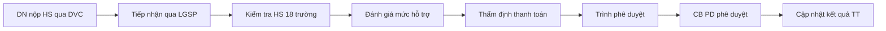
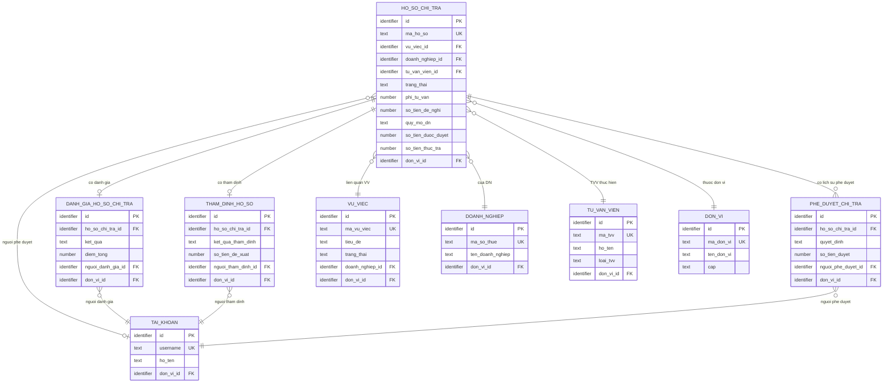
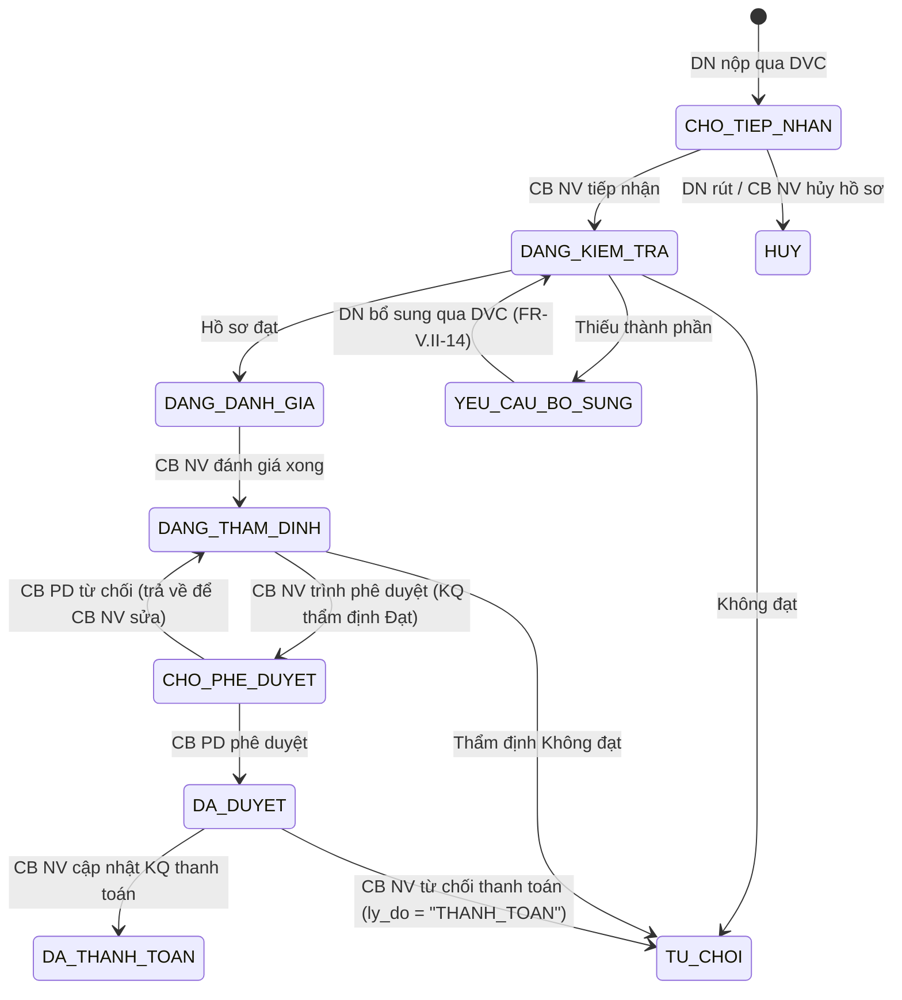

# SRS — Section 3.2.9: Chi trả Chi phí Tư vấn

**Dự án:** Phần mềm hỗ trợ pháp lý doanh nghiệp
**Phiên bản SRS:** 3.0
**Nhóm:** V.II — Chi trả Chi phí Tư vấn
**UC range:** UC 68 – UC 80
**Số FR:** 14
**File chính:** `srs-v3.md` Section 3.2

---

## Mục lục file này

- [1. Tổng quan nhóm](#1-tổng-quan-nhóm)
- [2. Yêu cầu chức năng chi tiết](#2-yêu-cầu-chức-năng-chi-tiết)
- [3. Màn hình chức năng](#3-màn-hình-chức-năng)
- [4. Entity liên quan](#4-entity-liên-quan)
- [5. State Machine liên quan](#5-state-machine-liên-quan)
- [6. Business Rules liên quan](#6-business-rules-liên-quan)

---

## 1. Tổng quan nhóm

**Mục đích:** Quản lý quy trình đề nghị, đánh giá, thẩm định, phê duyệt chi phí tư vấn HTPL cho DNNVV theo NĐ55/2019, NĐ18/2026, TT64/2021/TT-BTC.

**Entity chính:** HO_SO_CHI_TRA, DANH_GIA_HO_SO, THAM_DINH_HO_SO, PHE_DUYET_CHI_TRA, THONG_BAO, AUDIT_LOG

**Tác nhân chính:** HT TTHC BTP (DVC), CB NV (TW/BN/ĐP), CB PD (TW/BN/ĐP), Doanh nghiệp, Tư vấn viên

**Kênh tiếp nhận:** Chỉ qua DVC (HT TTHC BTP qua LGSP).

**Mức hỗ trợ (BR-CALC-01 — NĐ18/2026):**

| Quy mô DN | Mức hỗ trợ | Trần/năm (VNĐ) |
|-----------|-----------|----------------|
| Siêu nhỏ | 100% chi phí | 3.000.000 |
| Nhỏ | Tối đa 30% | 5.000.000 |
| Vừa | Tối đa 10% | 10.000.000 |

**Quy trình nghiệp vụ tổng quan:**



**State Machine — SM-CHITRA (10 trạng thái — đồng bộ Entity enum + Section 5):**

```
[CHO_TIEP_NHAN] → CB NV tiếp nhận → [DANG_KIEM_TRA]
[DANG_KIEM_TRA] → kiểm tra Đạt → [DANG_DANH_GIA]
[DANG_KIEM_TRA] → cần bổ sung → [YEU_CAU_BO_SUNG]
[DANG_KIEM_TRA] → không đạt → [TU_CHOI]
[YEU_CAU_BO_SUNG] → DN bổ sung → [DANG_KIEM_TRA]
[DANG_DANH_GIA] → đánh giá xong → [DANG_THAM_DINH]
[DANG_THAM_DINH] → thẩm định Đạt + CB NV Trình PD → [CHO_PHE_DUYET]
[DANG_THAM_DINH] → thẩm định Không đạt → [TU_CHOI]
[CHO_PHE_DUYET] → CB PD duyệt → [DA_DUYET]
[CHO_PHE_DUYET] → CB PD từ chối (trả về để CB NV sửa) → [DANG_THAM_DINH]
[DA_DUYET] → cập nhật kết quả thanh toán → [DA_THANH_TOAN] HOẶC [TU_CHOI] (ly_do = "THANH_TOAN")
[CHO_TIEP_NHAN] → DN rút / CB NV hủy → [HUY]
```

---

## 2. Yêu cầu chức năng chi tiết

---

### FR-V.II-01: Tiếp nhận hồ sơ từ DVC (UC68)

**UC Reference:** UC 68
**Priority:** Essential | **Stability:** High
**Màn hình:** (API inbound — không có màn hình trực tiếp)

**Mô tả:** Tiếp nhận hồ sơ đề nghị hỗ trợ chi phí tư vấn từ HT TTHC BTP qua LGSP.

**Tác nhân:** Hệ thống TTHC Bộ Tư pháp (DVC)

**Preconditions:** API LGSP hoạt động, JWT hợp lệ, payload đúng schema Mẫu 01 NĐ55.

**Inputs:**

| # | Tên field | Kiểu logic | Bắt buộc | Ràng buộc |
|---|----------|-----------|----------|-----------|
| 1 | ma_ho_so_dvc | text | Y | Mã hồ sơ phía DVC |
| 2 | ho_so_json | text (long) | Y | 18 trường Mẫu 01 NĐ55 |
| 3 | file_dinh_kem | structured | Y | Giấy CNĐKKD, HĐ TVPL, VB TVPL |
| 4 | ngay_nop | datetime | Y | Ngày nộp trên DVC |

**Processing:**

| Bước | Mô tả xử lý | BR áp dụng |
|------|-------------|-----------|
| 1 | Xác thực JWT + chứng chỉ mTLS | BR-AUTH-09 |
| 2 | Phân tích và xác nhận 18 trường Mẫu 01 NĐ55 | — |
| 3 | Kiểm tra mã số DN: nếu chưa có → tự động tạo | — |
| 4 | Kiểm tra quy mô DN hợp lệ | BR-CALC-01 |
| 5 | Tự động sinh mã hồ sơ: CT-{YYYYMMDD}-{SEQ} | BR-DATA-04 |
| 6 | Tạo bản ghi HO_SO_CHI_TRA, trạng thái = CHO_TIEP_NHAN | SM-CHITRA |
| 7 | Tính deadline SLA | BR-CALC-03 |
| 8 | Phản hồi HTTP 200 + mã HS về DVC | — |
| 9 | Ghi nhật ký thao tác | BR-DATA-05 |

**Outputs (Response về DVC):**

| # | Tên field | Kiểu logic | Mô tả |
|---|----------|-----------|-------|
| 1 | success | boolean | true/false |
| 2 | ma_ho_so_pm | text | Mã hồ sơ bên PM |
| 3 | trang_thai | text | CHO_TIEP_NHAN |
| 4 | message | text | Thông báo kết quả |

**Postconditions:**
- Bản ghi HO_SO_CHI_TRA được tạo với trạng thái CHO_TIEP_NHAN
- Mã hồ sơ PM được sinh tự động
- Deadline SLA được tính
- AUDIT_LOG ghi nhận

**Error Handling:**

| # | Điều kiện lỗi | Mã lỗi | Phản hồi hệ thống | Severity |
|---|--------------|--------|-------------------|----------|
| E1 | JWT không hợp lệ | ERR-CT-AUTH-01 | HTTP 401 | ERROR |
| E2 | Thiếu trường bắt buộc | ERR-CT-01 | HTTP 400 + danh sách trường thiếu | ERROR |
| E3 | Trùng mã hồ sơ DVC | ERR-CT-02 | HTTP 409 "Hồ sơ đã tồn tại" | ERROR |
| E4 | LGSP timeout | ERR-CT-03 | Retry 3 lần, interval 30s | ERROR |

**Acceptance Criteria:**
- **Given** HT TTHC BTP gửi HS qua LGSP **When** dữ liệu hợp lệ **Then** tạo HS mới, sinh mã CT-{date}-{seq}
- **Given** tiếp nhận thành công **When** phản hồi **Then** trả HTTP 200 + mã HS + trạng thái
- **Given** dữ liệu không hợp lệ **When** validate fail **Then** trả HTTP 400 + chi tiết lỗi

---

### FR-V.II-02: Quản lý hồ sơ đề nghị hỗ trợ chi phí (UC69)

**UC Reference:** UC 69
**Priority:** Essential | **Stability:** High
**Màn hình:** SCR-V.II-01

**Mô tả:** Xem danh sách, chi tiết hồ sơ đề nghị hỗ trợ chi phí tư vấn. Hiển thị Mẫu 01 NĐ55 (3 phần: DN, VV+TVV, cam kết).

**Tác nhân:** CB NV (TW/BN/ĐP)

**Preconditions:**

| # | Điều kiện |
|---|----------|
| PRE-01 | User đã đăng nhập (BR-AUTH-01) |
| PRE-02 | User có quyền "Quản lý hồ sơ chi trả" |
| PRE-03 | phân quyền dữ liệu theo đơn vị |

**Inputs — Tìm kiếm/Lọc:**

| # | Tên field | Kiểu logic | Bắt buộc | Ràng buộc |
|---|----------|-----------|----------|-----------|
| 1 | keyword | text | N | Từ khóa (tên DN, mã HS) |
| 2 | trang_thai | text | N | Lọc trạng thái SM-CHITRA |
| 3 | tu_ngay | date | N | Từ ngày nộp |
| 4 | den_ngay | date | N | Đến ngày nộp |
| 5 | quy_mo_dn | text | N | SIEU_NHO / NHO / VUA |

**Processing:**

| Bước | Mô tả xử lý | BR áp dụng |
|------|-------------|-----------|
| 1 | Kiểm tra quyền và phân quyền theo đơn vị | BR-AUTH-01, BR-AUTH-08 |
| 2 | Lấy danh sách HO_SO_CHI_TRA chưa xóa, trong phạm vi đơn vị | BR-DATA-02 |
| 3 | Kết hợp thông tin DOANH_NGHIEP | — |
| 4 | Phân trang (mặc định 20/trang) | BR-DATA-07 |

**Outputs — Danh sách:**

| # | Tên field | Kiểu logic | Mô tả |
|---|----------|-----------|-------|
| 1 | id | identifier | ID hồ sơ |
| 2 | ma_ho_so | text | Mã hồ sơ CT-{date}-{seq} |
| 3 | ten_doanh_nghiep | text | Tên DN |
| 4 | quy_mo_dn | text | Siêu nhỏ/Nhỏ/Vừa |
| 5 | so_tien_de_nghi | money | Số tiền đề nghị |
| 6 | trang_thai | text | Trạng thái SM-CHITRA |
| 7 | ngay_nop | datetime | Ngày nộp |
| 8 | deadline_sla | date | Deadline SLA |
| 9 | total_count | number | Tổng bản ghi |

**Postconditions:** Không thay đổi dữ liệu (read-only) — trừ khi thực hiện thao tác Tiếp nhận hoặc DN rút hồ sơ.

**Processing — Tiếp nhận hồ sơ** `[GAP-V.II-02]`

| Bước | Mô tả xử lý | BR áp dụng |
|------|-------------|-----------|
| 1 | Kiểm tra quyền CB NV + phạm vi phân quyền | BR-AUTH-01 |
| 2 | Kiểm tra trạng thái = CHO_TIEP_NHAN | SM-CHITRA |
| 3 | Cập nhật trạng thái = DANG_KIEM_TRA, ghi `ngay_tiep_nhan = NOW()`, `nguoi_tiep_nhan_id = current_user.id` | SM-CHITRA |
| 4 | Gán CB NV phụ trách (nếu chưa gán) | — |
| 5 | Ghi nhật ký thao tác (hành động = 'TIEP_NHAN') | BR-DATA-05 |

**Processing — DN rút hồ sơ** `[GAP-V.II-03]`

| Bước | Mô tả xử lý | BR áp dụng |
|------|-------------|-----------|
| 1 | Kiểm tra trạng thái = CHO_TIEP_NHAN (chỉ rút khi chưa tiếp nhận) | SM-CHITRA |
| 2 | Xác nhận rút: yêu cầu DN xác nhận lại hành động | — |
| 3 | Cập nhật trạng thái = HUY, ghi `ly_do_huy = 'DN_RUT_HO_SO'` | SM-CHITRA |
| 4 | Gửi thông báo CB NV (nếu đã gán): "Doanh nghiệp đã rút hồ sơ" | BR-NOTIF-01 |
| 5 | Ghi nhật ký thao tác (hành động = 'RUT_HO_SO') | BR-DATA-05 |

**Error Handling:**

| # | Điều kiện lỗi | Mã lỗi | Phản hồi hệ thống | Severity |
|---|--------------|--------|-------------------|----------|
| E1 | Không có kết quả | INF-CT-01 | "Không tìm thấy hồ sơ phù hợp" | INFO |
| E2 | HS không ở CHO_TIEP_NHAN khi tiếp nhận | ERR-CT-TN-01 | "Hồ sơ không ở trạng thái chờ tiếp nhận" `[GAP-V.II-02]` | ERROR |
| E3 | HS không ở CHO_TIEP_NHAN khi rút | ERR-CT-RUT-01 | "Chỉ được rút hồ sơ khi chưa tiếp nhận" `[GAP-V.II-03]` | ERROR |

**Acceptance Criteria:**
- **Given** CB NV truy cập danh sách **When** hiển thị **Then** HS thuộc đơn vị, phân trang
- **Given** CB NV xem chi tiết **When** chọn HS **Then** hiển thị Mẫu 01 NĐ55 (Phần I: DN, Phần II: VV+TVV, Phần III: cam kết)
- **Given** CB NV tìm kiếm **When** nhập từ khóa/lọc **Then** kết quả AND logic
- **Given** CB NV xem HS CHO_TIEP_NHAN **When** nhấn Tiếp nhận **Then** trạng thái → DANG_KIEM_TRA `[GAP-V.II-02]`
- **Given** DN xem HS CHO_TIEP_NHAN **When** nhấn Rút hồ sơ + xác nhận **Then** trạng thái → HUY `[GAP-V.II-03]`

---

### FR-V.II-03: Kiểm tra hồ sơ đề nghị (UC70)

**UC Reference:** UC 70
**Priority:** Essential | **Stability:** High
**Màn hình:** SCR-V.II-02 (Section 3 — Kiểm tra Hồ sơ)

**Mô tả:** CB NV kiểm tra tính đầy đủ và hợp lệ của HS theo 18 trường Mẫu 01 NĐ55.

**Tác nhân:** CB NV

**Preconditions:**

| # | Điều kiện |
|---|----------|
| PRE-01 | User đã đăng nhập, có quyền |
| PRE-02 | Hồ sơ ở trạng thái DANG_KIEM_TRA |

**Inputs:**

| # | Tên field | Kiểu logic | Bắt buộc | Ràng buộc |
|---|----------|-----------|----------|-----------|
| 1 | ho_so_id | identifier | Y | HS cần kiểm tra |
| 2 | checklist_items | structured | Y | 18 trường: {field, status: DAY_DU/THIEU/KHONG_HOP_LE} |
| 3 | ket_qua | text | Y | DAT / KHONG_DAT / CAN_BO_SUNG |
| 4 | ghi_chu | text (long) | N | — |

**Processing:**

| Bước | Mô tả xử lý | BR áp dụng |
|------|-------------|-----------|
| 1 | Kiểm tra quyền và phân quyền | BR-AUTH-01 |
| 2 | Xác nhận HS ở trạng thái DANG_KIEM_TRA | SM-CHITRA |
| 3 | Hiển thị checklist 18 trường + trạng thái | — |
| 4 | Nếu DAT → chuyển trạng thái DANG_DANH_GIA | SM-CHITRA |
| 5 | Nếu CAN_BO_SUNG → chuyển trạng thái YEU_CAU_BO_SUNG, cập nhật `ngay_yeu_cau_bo_sung = NOW()`, tăng `bo_sung_count += 1` | SM-CHITRA |
| 6 | Nếu KHONG_DAT → chuyển trạng thái TU_CHOI, ghi `ly_do_tu_choi`, `thoi_gian_tu_choi = NOW()`, `nguoi_tu_choi_id` | SM-CHITRA |
| 7 | Ghi lịch sử xử lý | — |
| 8 | Ghi nhật ký thao tác | BR-DATA-05 |

**Outputs:**

| # | Tên field | Kiểu logic | Mô tả |
|---|----------|-----------|-------|
| 1 | ho_so_id | identifier | ID hồ sơ |
| 2 | checklist_items | structured | 18 trường + trạng thái kiểm tra |
| 3 | ket_qua | text | DAT / KHONG_DAT / CAN_BO_SUNG |
| 4 | trang_thai_moi | text | Trạng thái sau kiểm tra |

**Postconditions:**
- Hồ sơ chuyển trạng thái theo kết quả kiểm tra
- Lịch sử xử lý được ghi nhận
- Nhật ký thao tác ghi nhận

**Error Handling:**

| # | Điều kiện lỗi | Mã lỗi | Phản hồi hệ thống | Severity |
|---|--------------|--------|-------------------|----------|
| E1 | HS không ở trạng thái cho phép kiểm tra | ERR-CT-KT-01 | "Hồ sơ không ở trạng thái đang kiểm tra" | ERROR |
| E2 | Yêu cầu bổ sung không có ghi chú | ERR-CT-KT-02 | "Ghi chú là bắt buộc khi yêu cầu bổ sung" | ERROR |

**Acceptance Criteria:**
- **Given** CB NV chọn HS **When** mở chi tiết **Then** hiển thị checklist 18 trường Mẫu 01
- **Given** HS thiếu thành phần **When** nhấn "Yêu cầu bổ sung" **Then** gửi thông báo DN qua DVC
- **Given** CB NV kiểm tra xong **When** nhập kết quả Đạt/Không đạt **Then** cập nhật trạng thái, ghi nhật ký

---

### FR-V.II-04: Thông báo kết quả kiểm tra qua DVC (UC71)

**UC Reference:** UC 71
**Priority:** Essential | **Stability:** High

**Mô tả:** Tự động gửi kết quả kiểm tra về HT TTHC BTP qua LGSP.

**Tác nhân:** Hệ thống (tự động trigger sau UC70)

**Preconditions:**

| # | Điều kiện |
|---|----------|
| PRE-01 | CB NV đã hoàn tất kiểm tra HS (UC70) |
| PRE-02 | Kết nối LGSP → HT TTHC BTP sẵn sàng |

**Processing:**

| Bước | Mô tả xử lý | BR áp dụng |
|------|-------------|-----------|
| 1 | Trigger sau khi kiểm tra hoàn tất | — |
| 2 | Tạo payload: mã hồ sơ DVC, kết quả, ghi chú, trường thiếu | — |
| 3 | Gửi qua LGSP → HT TTHC BTP | — |
| 4 | Nếu thành công → ghi nhận "Đã thông báo" | — |
| 5 | Nếu lỗi → retry 3 lần, interval 30s | BR-RETRY-01 |
| 6 | Sau 3 lần thất bại → ghi log + cảnh báo CB NV | — |

**Outputs:**

| # | Tên field | Kiểu logic | Mô tả |
|---|----------|-----------|-------|
| 1 | da_thong_bao | boolean | Đã gửi thành công hay chưa |
| 2 | so_lan_retry | number | Số lần retry đã thực hiện |

**Postconditions:**
- Kết quả kiểm tra được gửi về DVC qua LGSP
- Trạng thái "Đã thông báo" được ghi nhận

**Error Handling:**

| # | Điều kiện lỗi | Mã lỗi | Phản hồi hệ thống | Severity |
|---|--------------|--------|-------------------|----------|
| E1 | LGSP timeout | ERR-CT-LGSP-01 | Retry 3 lần | WARNING |
| E2 | LGSP reject | ERR-CT-LGSP-02 | Log + cảnh báo CB NV | ERROR |

**Acceptance Criteria:**
- **Given** kiểm tra hoàn tất **When** hệ thống gửi **Then** thông báo kết quả → DVC qua LGSP
- **Given** gửi thành công **When** DVC phản hồi 200 **Then** ghi nhận "Đã thông báo"
- **Given** gửi thất bại **When** LGSP lỗi **Then** retry 3 lần + log lỗi

---

### FR-V.II-05: Đánh giá hồ sơ theo tiêu chí (UC72)

**UC Reference:** UC 72
**Priority:** Essential | **Stability:** Medium
**Màn hình:** SCR-V.II-02 (Section 4 — Đánh giá Tiêu chí)

**Mô tả:** CB NV đánh giá HS, tính mức hỗ trợ tự động theo BR-CALC-01.

**Tác nhân:** CB NV

**Preconditions:**

| # | Điều kiện |
|---|----------|
| PRE-01 | User đã đăng nhập, có quyền |
| PRE-02 | Hồ sơ ở trạng thái DANG_DANH_GIA |

**Inputs:**

| # | Tên field | Kiểu logic | Bắt buộc | Ràng buộc |
|---|----------|-----------|----------|-----------|
| 1 | ho_so_id | identifier | Y | — |
| 2 | phi_tu_van_thuc_te | money | Y | Phí TV sau xác minh |
| 3 | quy_mo_dn | text | Y | SIEU_NHO / NHO / VUA |
| 4 | so_tien_da_ho_tro_nam | money | Y (auto) | Tổng đã hỗ trợ trong năm |
| 5 | ghi_chu_danh_gia | text (long) | N | — |

**Processing:**

| Bước | Mô tả xử lý | BR áp dụng |
|------|-------------|-----------|
| 1 | Kiểm tra quyền | BR-AUTH-01 |
| 2 | Xác nhận HS ở DANG_DANH_GIA | SM-CHITRA |
| 3 | Xác minh quy mô DN theo Luật DNNVV | — |
| 4 | Tính mức hỗ trợ theo quy mô: Siêu nhỏ 100%, Nhỏ 30%, Vừa 10% | BR-CALC-01 |
| 5 | Kiểm tra trần năm: tính tổng đã hỗ trợ trong năm hiện tại | BR-CALC-01 |
| 6 | Tính số tiền được hỗ trợ = MIN(so_tien_de_nghi, phi_tu_van × muc_ho_tro_phan_tram / 100, tran_ho_tro_nam - da_chi_trong_nam) | BR-CALC-02 |
| 7 | Tạo bản ghi DANH_GIA_HO_SO | — |
| 8 | Chuyển trạng thái DANG_THAM_DINH | SM-CHITRA |
| 9 | Ghi nhật ký thao tác | BR-DATA-05 |

**Outputs:**

| # | Tên field | Kiểu logic | Mô tả |
|---|----------|-----------|-------|
| 1 | muc_ho_tro_phan_tram | number | % hỗ trợ áp dụng |
| 2 | tran_ho_tro_nam | money | Trần hỗ trợ/năm |
| 3 | so_tien_da_ho_tro_nam | money | Tổng đã hỗ trợ trong năm |
| 4 | so_tien_duoc_ho_tro | money | Số tiền được hỗ trợ (auto-calc) |

**Postconditions:**
- Bản ghi DANH_GIA_HO_SO được tạo
- HS chuyển trạng thái DANG_THAM_DINH
- Nhật ký thao tác ghi nhận

**Error Handling:**

| # | Điều kiện lỗi | Mã lỗi | Phản hồi hệ thống | Severity |
|---|--------------|--------|-------------------|----------|
| E1 | HS không ở trạng thái DANG_DANH_GIA | ERR-CT-DG-01 | "Hồ sơ không ở trạng thái cho phép đánh giá" | ERROR |
| E2 | Quy mô DN không hợp lệ | ERR-CT-DG-02 | "Quy mô DN không hợp lệ" | ERROR |

**Business Rules áp dụng:**
- **BR-CALC-01**: Công thức tính mức hỗ trợ theo NĐ18/2026

**Acceptance Criteria:**
- **Given** DN siêu nhỏ, phí TV 2.5M **When** tính **Then** hỗ trợ 2.5M (100%, trong trần 3M)
- **Given** DN nhỏ, phí TV 10M, đã hỗ trợ 3M trong năm **When** tính **Then** hỗ trợ MIN(3M, 5M-3M) = 2M
- **Given** DN đã hết trần năm **When** tính **Then** số tiền = 0, hiển thị cảnh báo

**Edge Cases:**

| EC | Điều kiện | Xử lý |
|----|-----------|-------|
| EC-01 | phi_tu_van = 0 | Cho phép. so_tien_duoc_ho_tro = 0. Ghi nhận hồ sơ nhưng không phát sinh thanh toán |
| EC-02 | Thanh toán vượt mức đã duyệt | so_tien_thuc_tra KHÔNG được > so_tien_duoc_ho_tro. Validate tại bước phê duyệt |
| EC-03 | LGSP retransmit trùng | Kiểm tra ma_ho_so_dvc unique. Nếu trùng → trả HTTP 409 |
| EC-04 | DN đổi quy mô giữa năm | Áp dụng quy mô tại thời điểm nộp hồ sơ (snapshot) |
| EC-05 | Số tiền được hỗ trợ = 0 do hết trần năm | Cho phép tiếp tục quy trình, hiển thị cảnh báo |

---

### FR-V.II-06: Quản lý hồ sơ đề nghị thanh toán (UC73)

**UC Reference:** UC 73
**Priority:** Essential | **Stability:** High
**Màn hình:** SCR-V.II-01

**Mô tả:** Xem, tìm kiếm HS đề nghị thanh toán (sau giai đoạn đánh giá).

**Tác nhân:** CB NV

**Preconditions:**

| # | Điều kiện |
|---|----------|
| PRE-01 | User đã đăng nhập, có quyền |
| PRE-02 | phân quyền dữ liệu theo đơn vị |

**Processing:** Tương tự FR-V.II-02, filter bổ sung: trạng thái từ DANG_THAM_DINH trở đi.

**Outputs bổ sung:**

| # | Tên field | Kiểu logic | Mô tả |
|---|----------|-----------|-------|
| 1 | so_tien_duoc_ho_tro | money | Số tiền được hỗ trợ (từ đánh giá) |
| 2 | ket_qua_danh_gia | text | Kết quả đánh giá |

**Postconditions:** Không thay đổi dữ liệu (read-only).

**Acceptance Criteria:**
- **Given** CB NV truy cập "HS đề nghị thanh toán" **When** hiển thị **Then** danh sách HS đã qua đánh giá
- **Given** CB NV xem chi tiết **When** chọn HS **Then** hiển thị thông tin chi phí + kết quả đánh giá

---

### FR-V.II-07: Gửi hồ sơ đề nghị thanh toán (UC74)

**UC Reference:** UC 74
**Priority:** Essential | **Stability:** High

**Mô tả:** DN gửi HS đề nghị thanh toán qua DVC/Chuyên trang. PM chỉ tiếp nhận qua API inbound.

**Tác nhân:** Doanh nghiệp (qua DVC/Chuyên trang)

**Preconditions:**

| # | Điều kiện |
|---|----------|
| PRE-01 | HS đã qua giai đoạn đánh giá |
| PRE-02 | API LGSP hoạt động |

**Processing:**

| Bước | Mô tả xử lý | BR áp dụng |
|------|-------------|-----------|
| 1 | DN nhập nội dung đề nghị thanh toán trên DVC | — |
| 2 | Upload file chứng minh chi phí | — |
| 3 | DVC gửi qua LGSP → PM tiếp nhận (tương tự UC68) | — |
| 4 | PM bổ sung chứng từ vào HO_SO_CHI_TRA | — |

**Outputs:**

| # | Tên field | Kiểu logic | Mô tả |
|---|----------|-----------|-------|
| 1 | success | boolean | Kết quả tiếp nhận |
| 2 | message | text | Thông báo |

**Postconditions:**
- Chứng từ thanh toán được bổ sung vào hồ sơ

**Acceptance Criteria:**
- **Given** DN gửi đề nghị TT **When** DVC chuyển PM qua LGSP **Then** bổ sung chứng từ vào HS
- **Given** PM tiếp nhận thành công **When** xử lý **Then** bổ sung chứng từ vào HS

---

### FR-V.II-08: Nhận thông báo kết quả thanh toán (UC75)

**UC Reference:** UC 75
**Priority:** Essential | **Stability:** High

**Mô tả:** TVV nhận thông báo kết quả thanh toán.

**Tác nhân:** Tư vấn viên (TVV)

**Preconditions:**

| # | Điều kiện |
|---|----------|
| PRE-01 | TVV đã đăng nhập |
| PRE-02 | Có hồ sơ liên quan đến TVV đã được xử lý |

**Processing:**

| Bước | Mô tả xử lý | BR áp dụng |
|------|-------------|-----------|
| 1 | Kiểm tra quyền TVV | BR-AUTH-01 |
| 2 | Lấy danh sách thông báo kết quả thanh toán của TVV | — |
| 3 | Phân trang, sắp xếp mới nhất trước | BR-DATA-07 |

**Outputs:**

| # | Tên field | Kiểu logic | Mô tả |
|---|----------|-----------|-------|
| 1 | id | identifier | ID thông báo |
| 2 | tieu_de | text | Tiêu đề thông báo |
| 3 | noi_dung | text (long) | Nội dung kết quả |
| 4 | ngay_gui | datetime | Ngày gửi |
| 5 | da_doc | boolean | Đã đọc |
| 6 | file_dinh_kem | structured | QĐ phê duyệt, biên nhận |

**Postconditions:** Không thay đổi dữ liệu (read-only).

**Acceptance Criteria:**
- **Given** TVV truy cập "Thông báo" **When** hiển thị **Then** danh sách thông báo KQ thanh toán, phân trang
- **Given** TVV xem chi tiết **When** chọn thông báo **Then** hiển thị nội dung + file đính kèm (QĐ, biên nhận)

---

### FR-V.II-09: Thẩm định hồ sơ đề nghị thanh toán (UC76)

**UC Reference:** UC 76
**Priority:** Essential | **Stability:** High
**Màn hình:** SCR-V.II-02 (Section 5 — Thẩm định)

**Mô tả:** CB NV thẩm định HS thanh toán, xem xét chứng từ và đề xuất số tiền.

**Tác nhân:** CB NV

**Preconditions:**

| # | Điều kiện |
|---|----------|
| PRE-01 | User đã đăng nhập, có quyền |
| PRE-02 | Hồ sơ ở trạng thái DANG_THAM_DINH |

**Inputs:**

| # | Tên field | Kiểu logic | Bắt buộc | Ràng buộc |
|---|----------|-----------|----------|-----------|
| 1 | ho_so_id | identifier | Y | ID hồ sơ |
| 2 | ket_qua_tham_dinh | text | Y | DAT / KHONG_DAT / CAN_BO_SUNG |
| 3 | nhan_xet | text (long) | Cond | Bắt buộc nếu KHONG_DAT |
| 4 | so_tien_de_xuat | money | Y | Số tiền đề xuất phê duyệt |

**Processing:**

| Bước | Mô tả xử lý | BR áp dụng |
|------|-------------|-----------|
| 1 | Kiểm tra quyền | BR-AUTH-01 |
| 2 | Xác nhận HS ở DANG_THAM_DINH | SM-CHITRA |
| 3 | Xem toàn bộ thông tin HS + chứng từ + kết quả đánh giá | — |
| 4 | Nếu DAT → giữ nguyên DANG_THAM_DINH, ghi `ket_qua_tham_dinh = DAT` (mở nút "Trình phê duyệt" — FR-V.II-11) | SM-CHITRA |
| 5 | Nếu CAN_BO_SUNG → giữ nguyên DANG_THAM_DINH, gửi thông báo DN/TVV bổ sung tài liệu (không chuyển state) | — |
| 6 | Nếu KHONG_DAT → chuyển trạng thái TU_CHOI (`ly_do_tu_choi = "THAM_DINH: " + nhan_xet`, `thoi_gian_tu_choi = NOW()`, `nguoi_tu_choi_id`) | SM-CHITRA |
| 7 | Tạo bản ghi THAM_DINH_HO_SO | — |
| 8 | Ghi nhật ký thao tác | BR-DATA-05 |

**Outputs:**

| # | Tên field | Kiểu logic | Mô tả |
|---|----------|-----------|-------|
| 1 | ho_so_id | identifier | ID hồ sơ |
| 2 | ket_qua_tham_dinh | text | DAT / KHONG_DAT / CAN_BO_SUNG |
| 3 | trang_thai_moi | text | Trạng thái sau thẩm định |
| 4 | so_tien_de_xuat | money | Số tiền đề xuất |

**Postconditions:**
- Bản ghi THAM_DINH_HO_SO được tạo
- HS chuyển trạng thái theo kết quả thẩm định
- Nhật ký thao tác ghi nhận

**Error Handling:**

| # | Điều kiện lỗi | Mã lỗi | Phản hồi hệ thống | Severity |
|---|--------------|--------|-------------------|----------|
| E1 | HS không ở DANG_THAM_DINH | ERR-CT-TD-01 | "Hồ sơ không ở trạng thái chờ thẩm định" | ERROR |
| E2 | Không đạt mà không có nhận xét | ERR-CT-TD-02 | "Nhận xét là bắt buộc khi không đạt" | ERROR |

**Acceptance Criteria:**
- **Given** CB NV xem HS chờ thẩm định **When** xem chứng từ **Then** đánh giá + đề xuất số tiền
- **Given** HS thiếu chứng minh **When** yêu cầu bổ sung **Then** gửi thông báo DN/TVV
- **Given** CB NV nhập kết quả **When** lưu **Then** cập nhật trạng thái, ghi nhật ký

---

### FR-V.II-10: Thông báo kết quả thẩm định (UC77)

**UC Reference:** UC 77
**Priority:** Essential | **Stability:** High

**Mô tả:** Gửi kết quả thẩm định cho TVV qua in-app + email.

**Tác nhân:** Hệ thống (trigger sau UC76)

**Preconditions:**

| # | Điều kiện |
|---|----------|
| PRE-01 | CB NV đã hoàn tất thẩm định (UC76) |

**Processing:**

| Bước | Mô tả xử lý | BR áp dụng |
|------|-------------|-----------|
| 1 | Trigger sau UC76 hoàn tất | — |
| 2 | Gửi kết quả cho TVV (in-app + email) | — |
| 3 | Nếu "Không đạt" → kèm lý do chi tiết | — |
| 4 | Tạo bản ghi THONG_BAO | — |
| 5 | Ghi nhật ký thao tác | BR-DATA-05 |

**Outputs:**

| # | Tên field | Kiểu logic | Mô tả |
|---|----------|-----------|-------|
| 1 | thong_bao_id | identifier | ID thông báo |
| 2 | da_gui | boolean | Đã gửi thành công |

**Postconditions:**
- Bản ghi THONG_BAO được tạo
- TVV nhận thông báo qua in-app + email

**Acceptance Criteria:**
- **Given** thẩm định hoàn tất **When** gửi thông báo **Then** TVV nhận kết quả (in-app + email)
- **Given** kết quả "Không đạt" **When** gửi **Then** kèm lý do từ chối chi tiết

---

### FR-V.II-11: Trình phê duyệt hồ sơ thanh toán (UC78)

**UC Reference:** UC 78
**Priority:** Essential | **Stability:** High
**Màn hình:** SCR-V.II-02 (Section 5 — Trình PD)

**Mô tả:** CB NV trình HS đã thẩm định đạt cho CB PD phê duyệt.

**Tác nhân:** CB NV

**Preconditions:**

| # | Điều kiện |
|---|----------|
| PRE-01 | User đã đăng nhập, có quyền |
| PRE-02 | Hồ sơ ở trạng thái DANG_THAM_DINH VÀ `ket_qua_tham_dinh = DAT` (đã thẩm định đạt qua FR-V.II-09) |

**Processing:**

| Bước | Mô tả xử lý | BR áp dụng |
|------|-------------|-----------|
| 1 | Kiểm tra quyền | BR-AUTH-01 |
| 2 | Xác nhận HS ở DANG_THAM_DINH VÀ `ket_qua_tham_dinh = DAT` | SM-CHITRA |
| 3 | Chuyển trạng thái CHO_PHE_DUYET | SM-CHITRA |
| 4 | Gửi thông báo CB PD cùng cấp | BR-AUTH-05 |
| 5 | Ghi nhật ký thao tác | BR-DATA-05 |

**Outputs:**

| # | Tên field | Kiểu logic | Mô tả |
|---|----------|-----------|-------|
| 1 | ho_so_id | identifier | ID hồ sơ |
| 2 | trang_thai | text | CHO_PHE_DUYET |

**Postconditions:**
- HS chuyển trạng thái CHO_PHE_DUYET
- CB PD nhận thông báo

**Error Handling:**

| # | Điều kiện lỗi | Mã lỗi | Phản hồi hệ thống | Severity |
|---|--------------|--------|-------------------|----------|
| E1 | HS chưa thẩm định xong hoặc `ket_qua_tham_dinh ≠ DAT` | ERR-CT-TRINH-01 | "Hồ sơ chưa đủ điều kiện trình phê duyệt" | ERROR |

**Acceptance Criteria:**
- **Given** CB NV chọn HS ở DANG_THAM_DINH với KQ thẩm định Đạt **When** nhấn "Trình phê duyệt" **Then** HS → CHO_PHE_DUYET, CB PD cùng cấp nhận thông báo
- **Given** HS ở DANG_THAM_DINH nhưng chưa có KQ thẩm định **When** nhấn "Trình phê duyệt" **Then** hệ thống từ chối với ERR-CT-TRINH-01

---

### FR-V.II-12: Phê duyệt hồ sơ thanh toán (UC79)

**UC Reference:** UC 79
**Priority:** Essential | **Stability:** High
**Màn hình:** SCR-V.II-02 (Section 6 — Phê duyệt)

**Mô tả:** CB PD phê duyệt hoặc từ chối HS thanh toán.

**Tác nhân:** CB PD

**Inputs:**

| # | Tên field | Kiểu logic | Bắt buộc | Ràng buộc |
|---|----------|-----------|----------|-----------|
| 1 | ho_so_id | identifier | Y | — |
| 2 | quyet_dinh | text | Y | DUYET / TU_CHOI |
| 3 | ly_do_tu_choi | text (long) | Cond | Bắt buộc nếu TU_CHOI |
| 4 | so_tien_duyet | money | Cond | Bắt buộc nếu DUYET |

**Processing:**

| Bước | Mô tả xử lý | BR áp dụng |
|------|-------------|-----------|
| 1 | Kiểm tra quyền CB PD cùng cấp (`user.don_vi_id = hs.don_vi_id`) | BR-AUTH-01, BR-AUTH-05 |
| 2 | Xác nhận HS ở CHO_PHE_DUYET | SM-CHITRA |
| 3 | Nếu DUYET → chuyển trạng thái DA_DUYET, ghi `nguoi_phe_duyet_id`, `ngay_phe_duyet = NOW()` | SM-CHITRA |
| 4 | Nếu TU_CHOI → **chuyển trạng thái DANG_THAM_DINH (trả về để CB NV điều chỉnh)**, ghi `ly_do_tu_choi` vào HO_SO_CHI_TRA (KHÔNG ghi `thoi_gian_tu_choi` vì đây là trả về, không phải từ chối cuối) | SM-CHITRA, BR-FLOW-04 |
| 5 | Tạo bản ghi PHE_DUYET_CHI_TRA (lưu lịch sử quyết định phê duyệt: DUYET hoặc TU_CHOI) | — |
| 6 | Gửi thông báo CB NV (cả 2 trường hợp) + TVV + DN (chỉ khi DUYET) | — |
| 7 | Ghi nhật ký thao tác | BR-DATA-05 |

**Outputs:**

| # | Tên field | Kiểu logic | Mô tả |
|---|----------|-----------|-------|
| 1 | ho_so_id | identifier | ID hồ sơ |
| 2 | quyet_dinh | text | DUYET / TU_CHOI |
| 3 | trang_thai_moi | text | DA_DUYET (khi DUYET) / DANG_THAM_DINH (khi TU_CHOI — trả về CB NV) |
| 4 | so_tien_duyet | money | Số tiền phê duyệt (nếu duyệt) |

**Postconditions:**
- Bản ghi PHE_DUYET_CHI_TRA được tạo (lưu lịch sử, gồm cả DUYET và TU_CHOI)
- HS chuyển trạng thái theo quyết định (DUYET → DA_DUYET; TU_CHOI → DANG_THAM_DINH trả về)
- CB NV nhận thông báo (cả 2 trường hợp); TVV + DN nhận thông báo khi DUYET

**Error Handling:**

| # | Điều kiện lỗi | Mã lỗi | Phản hồi hệ thống | Severity |
|---|--------------|--------|-------------------|----------|
| E1 | HS không ở CHO_PHE_DUYET | ERR-CT-PD-01 | "Hồ sơ không ở trạng thái chờ phê duyệt" | ERROR |
| E2 | Từ chối không có lý do | ERR-CT-PD-02 | "Lý do từ chối là bắt buộc" | ERROR |
| E3 | Duyệt không có số tiền | ERR-CT-PD-03 | "Số tiền phê duyệt là bắt buộc" | ERROR |

**Acceptance Criteria:**
- **Given** CB PD phê duyệt **When** xác nhận + số tiền **Then** HS → DA_DUYET + CB NV/TVV/DN nhận thông báo
- **Given** CB PD từ chối **When** nhập lý do ≥ 10 ký tự **Then** HS **trả về DANG_THAM_DINH** + CB NV nhận thông báo "CB PD từ chối, yêu cầu điều chỉnh" (KHÔNG gửi TVV/DN)
- **Given** CB PD xem HS chờ duyệt **When** xem chi tiết **Then** hiển thị toàn bộ HS + kết quả thẩm định
- **Given** CB PD khác đơn vị **When** thao tác duyệt **Then** hệ thống từ chối (BR-AUTH-05)

---

### FR-V.II-13: Cập nhật kết quả xử lý hồ sơ (UC80)

**UC Reference:** UC 80
**Priority:** Essential | **Stability:** High
**Màn hình:** SCR-V.II-02 (Section 7 — Cập nhật Thanh toán)

**Mô tả:** CB NV cập nhật kết quả thanh toán cuối cùng (DA_DUYET → DA_THANH_TOAN). PM dừng ở mức cập nhật thông tin — KHÔNG giao tiếp Kho bạc.

**Tác nhân:** CB NV

**Inputs:**

| # | Tên field | Kiểu logic | Bắt buộc | Ràng buộc |
|---|----------|-----------|----------|-----------|
| 1 | ho_so_id | identifier | Y | — |
| 2 | ket_qua_cuoi | text | Y | DA_THANH_TOAN / TU_CHOI (ly_do = "THANH_TOAN") |
| 3 | ngay_thanh_toan | date | Cond | Bắt buộc nếu DA_THANH_TOAN |
| 4 | so_tien_thuc_tra | money | Cond | Bắt buộc nếu DA_THANH_TOAN, ≤ số tiền được duyệt |
| 5 | so_bien_nhan | text | N | — |

**Processing:**

| Bước | Mô tả xử lý | BR áp dụng |
|------|-------------|-----------|
| 1 | Kiểm tra quyền | BR-AUTH-01 |
| 2 | Xác nhận HS ở DA_DUYET | SM-CHITRA |
| 3 | Kiểm tra số tiền thực trả không vượt số tiền được duyệt | — |
| 4 | Cập nhật HO_SO_CHI_TRA: số tiền thực trả, ngày thanh toán, biên nhận | — |
| 5 | Chuyển trạng thái theo kết quả cuối | SM-CHITRA |
| 6 | Gửi thông báo TVV + DN | — |
| 7 | Ghi nhật ký thao tác | BR-DATA-05 |

**Outputs:**

| # | Tên field | Kiểu logic | Mô tả |
|---|----------|-----------|-------|
| 1 | ho_so_id | identifier | ID hồ sơ |
| 2 | ket_qua_cuoi | text | DA_THANH_TOAN / TU_CHOI (ly_do = "THANH_TOAN") |
| 3 | so_tien_thuc_tra | money | Số tiền thực trả |
| 4 | ngay_thanh_toan | date | Ngày thanh toán |

**Postconditions:**
- HO_SO_CHI_TRA được cập nhật số tiền thực trả, ngày thanh toán
- HS chuyển trạng thái cuối (DA_THANH_TOAN / TU_CHOI; ly_do ghi rõ loại từ chối)
- TVV + DN nhận thông báo

**Error Handling:**

| # | Điều kiện lỗi | Mã lỗi | Phản hồi hệ thống | Severity |
|---|--------------|--------|-------------------|----------|
| E1 | HS không ở DA_DUYET | ERR-CT-TT-01 | "Hồ sơ không ở trạng thái đã duyệt" | ERROR |
| E2 | Số tiền thực trả > số tiền duyệt | ERR-CT-TT-02 | "Số tiền thực trả không được vượt số tiền được duyệt" | ERROR |
| E3 | Thiếu ngày thanh toán | ERR-CT-TT-03 | "Ngày thanh toán là bắt buộc" | ERROR |

**Acceptance Criteria:**
- **Given** CB NV chọn HS đã duyệt **When** cập nhật DA_THANH_TOAN **Then** ghi nhận + thông báo TVV/DN
- **Given** số tiền thực trả > số tiền duyệt **When** lưu **Then** hệ thống từ chối
- **Given** CB NV nhập biên nhận **When** lưu **Then** ghi nhận ngày thanh toán + số tiền thực trả

---

### FR-V.II-14: DN bổ sung hồ sơ chi trả (GAP-V.II-01) `[GAP-V.II-01]`

**UC Reference:** —
**Priority:** Essential | **Stability:** High
**Màn hình:** Cổng DVC / Cổng PLQG (giao diện DN) hoặc SCR-V.II-02 (CB NV thao tác thủ công)

**Mô tả:** DN upload tài liệu bổ sung khi hồ sơ chi trả bị yêu cầu bổ sung. Sau khi bổ sung, hồ sơ chuyển lại trạng thái DANG_KIEM_TRA để CB NV kiểm tra lại.

**Tác nhân:** Doanh nghiệp (qua DVC/Cổng PLQG) hoặc CB NV (thủ công)

**Preconditions:**

| # | Điều kiện |
|---|----------|
| PRE-01 | HO_SO_CHI_TRA.trang_thai = YEU_CAU_BO_SUNG |
| PRE-02 | Chưa quá hạn bổ sung (≤ 5 ngày LV kể từ ngày yêu cầu) |

**Inputs:**

| # | Tên field | Kiểu logic | Bắt buộc | Ràng buộc |
|---|----------|-----------|----------|-----------|
| 1 | ho_so_chi_tra_id | identifier | Y | HS cần bổ sung |
| 2 | file_bo_sung[] | file upload | Y | PDF/DOC/DOCX/JPG/PNG, ≤ 10MB/file |
| 3 | ghi_chu | text | N | Ghi chú bổ sung |

**Processing:**

| Bước | Mô tả xử lý | BR áp dụng |
|------|-------------|-----------|
| 1 | Kiểm tra trạng thái = YEU_CAU_BO_SUNG | SM-CHITRA |
| 2 | Validate file: định dạng (PDF/DOC/DOCX/JPG/PNG), dung lượng ≤ 10MB/file | BR-DATA-03 |
| 3 | Lưu file bổ sung vào FILE_DINH_KEM, gắn ho_so_chi_tra_id | BR-DATA-03 |
| 4 | Cập nhật trạng thái HO_SO_CHI_TRA = DANG_KIEM_TRA | SM-CHITRA |
| 5 | Gửi thông báo CB NV phụ trách: "DN đã bổ sung hồ sơ chi trả, vui lòng kiểm tra lại" | BR-NOTIF-01 |
| 6 | Ghi nhật ký thao tác (hành động = 'BO_SUNG_HO_SO_CT') | BR-DATA-05 |

**Outputs:**

| # | Tên field | Kiểu logic | Mô tả |
|---|----------|-----------|-------|
| 1 | ho_so_chi_tra_id | identifier | ID hồ sơ |
| 2 | trang_thai_moi | text | DANG_KIEM_TRA |
| 3 | danh_sach_file_bo_sung | list | Danh sách file đã upload |
| 4 | ngay_bo_sung | datetime | Ngày bổ sung |

**Error Handling:**

| # | Điều kiện lỗi | Mã lỗi | Phản hồi hệ thống | Severity |
|---|--------------|--------|-------------------|----------|
| E1 | Trạng thái ≠ YEU_CAU_BO_SUNG | ERR-CT-BS-01 | "Hồ sơ không ở trạng thái yêu cầu bổ sung" | ERROR |
| E2 | File quá lớn hoặc sai định dạng | ERR-CT-BS-02 | "File không hợp lệ" | WARNING |
| E3 | Quá hạn bổ sung (>5 ngày LV) | ERR-CT-BS-03 | "Đã quá thời hạn bổ sung" | ERROR |

**Acceptance Criteria:**
- **Given** DN nhận yêu cầu bổ sung **When** upload tài liệu hợp lệ **Then** trạng thái → DANG_KIEM_TRA + CB NV nhận thông báo
- **Given** quá hạn 5 ngày LV **When** upload **Then** hệ thống từ chối với ERR-CT-BS-03

**Pháp luật:** NĐ 55/2019, Điều 9

---

## 3. Màn hình chức năng

> **Ghi chú v2.1:** Consolidated từ 6 màn hình (MH-06.1 ~ MH-06.6) xuống 2 trang + 1 MÀN HÌNH MỚI. MH-06.2 (Kiểm tra) → section trong chi tiết. MH-06.3 (Đánh giá tiêu chí) → section trong chi tiết. MH-06.4 (Thẩm định) → section trong chi tiết. MH-06.5 (Phê duyệt) → action buttons trong chi tiết. MH-06.6 (Cập nhật KQ TT) → section trong chi tiết. **MH-06.1a là MÀN HÌNH MỚI v2.1** — chi tiết hồ sơ chi trả với 6-step stepper workflow.

### SCR-V.II-01: Danh sách Hồ sơ Chi trả

**Loại màn hình:** Danh sách (5 tab trạng thái)
**FR sử dụng:** FR-V.II-02, FR-V.II-06
**Mô tả:** Hiển thị danh sách hồ sơ đề nghị hỗ trợ chi phí tư vấn pháp luật theo trạng thái SM-CHITRA. Hỗ trợ phân tab theo nhóm trạng thái, tìm kiếm theo từ khóa và lọc nhiều chiều (trạng thái, quy mô doanh nghiệp, khoảng ngày nộp). Cán bộ nghiệp vụ và cán bộ phê duyệt vào danh sách này để chọn hồ sơ tiếp theo cần xử lý.
**URL pattern:** /chi-tra/danh-sach
**Quyền truy cập:** CB NV (TW/BN/ĐP), CB PD (TW/BN/ĐP). Phân quyền theo phạm vi đơn vị (TW → toàn quốc, BN → chỉ BN, ĐP → chỉ ĐP).
**UX-Spec ref:** dac-ta-man-hinh-chuc-nang-v2.md — MH-06.1

#### Thành phần màn hình

| # | Vùng | Thành phần | Loại | Dữ liệu / Nội dung | Hành vi | Điều kiện hiển thị |
|---|------|-----------|------|---------------------|---------|-------------------|
| 1 | breadcrumb | Breadcrumb | C01 | "Trang chủ > Chi trả > Danh sách hồ sơ" | navigate | Luôn |
| 2 | toolbar | Tiêu đề trang | C02 | "Hồ sơ Đề nghị Hỗ trợ Chi phí" + [Xuất Excel] [Làm mới] | click → export / reload | Luôn |
| 3 | tab | 5 tab phân loại trạng thái | C19 | Tất cả / Chờ xử lý (CHO_TIEP_NHAN + DANG_KIEM_TRA + YEU_CAU_BO_SUNG) / Đang đánh giá (DANG_DANH_GIA + DANG_THAM_DINH) / Chờ PD (CHO_PHE_DUYET) / Đã xử lý (DA_DUYET + DA_THANH_TOAN + TU_CHOI + HUY). Số đếm trên mỗi tab | click → filter | Luôn |
| 4 | filter-bar | Ô tìm kiếm | C09 | Từ khóa (tên DN, mã HS) | change → filter | Luôn |
| 5 | filter-bar | Trạng thái | C10 dropdown | 10 trạng thái SM-CHITRA | change → filter | Luôn |
| 6 | filter-bar | Quy mô DN | C10 dropdown | Lựa chọn hiển thị: "Siêu nhỏ" / "Nhỏ" / "Vừa" (giá trị nội bộ: SIEU_NHO / NHO / VUA) | change → filter | Luôn |
| 7 | filter-bar | Bộ chọn ngày | C11 range | Từ ngày – đến ngày nộp | change → filter | Luôn |
| 8 | filter-bar | Nút Tìm kiếm / Xóa bộ lọc | C08 | — | click → query / reset | Luôn |
| 9 | table | Checkbox | checkbox | Chọn dòng (40px) | click → select | Luôn |
| 10 | table | Mã HS | text (link) | CT-{YYYYMMDD}-{SEQ} (160px) | click → SCR-V.II-02 (chi tiết) | Luôn |
| 11 | table | Tên DN | text | ten_doanh_nghiep (200px) | — | Luôn |
| 12 | table | Quy mô DN | badge | Nhãn hiển thị: "Siêu nhỏ" / "Nhỏ" / "Vừa" (map từ enum `quy_mo_dn` — 80px) | — | Luôn |
| 13 | table | Số tiền đề nghị | number | Giá trị `so_tien_de_nghi` (định dạng VNĐ, dấu chấm hàng nghìn, hậu tố "đ") (130px) | — | Luôn |
| 14 | table | Số tiền được duyệt | number | Giá trị `so_tien_duoc_duyet` (VNĐ). "—" nếu chưa duyệt (130px) | — | Luôn |
| 15 | table | Trạng thái | C06 badge | 10 trạng thái SM-CHITRA với màu tương ứng (140px) | — | Luôn |
| 16 | table | SLA | C07 | 4 mức cảnh báo (80px) | — | Luôn |
| 17 | table | Ngày nộp | date | dd/mm/yyyy (110px) | — | Luôn |
| 18 | table | Hành động | buttons | Tùy theo trạng thái: [Kiểm tra] / [Đánh giá] / [Thẩm định] / [Trình PD] / [Phê duyệt] / [Cập nhật TT] (100px) | click → SCR-V.II-02 tại section tương ứng | Luôn |
| 19 | pagination | Phân trang | C05 | 20 mục/trang | click → chuyển trang | Luôn |

**Bảng nhãn trạng thái SM-CHITRA:**

| Trạng thái | Nhãn hiển thị | Màu badge |
|-----------|--------------|-----------|
| CHO_TIEP_NHAN | Chờ tiếp nhận | 🟢 Xanh lá |
| DANG_KIEM_TRA | Đang kiểm tra | 🟡 Vàng |
| YEU_CAU_BO_SUNG | Yêu cầu bổ sung | 🟠 Cam |
| DANG_DANH_GIA | Đang đánh giá | 🟡 Vàng |
| DANG_THAM_DINH | Đang thẩm định | 🟡 Vàng đậm |
| CHO_PHE_DUYET | Chờ phê duyệt | 🟡 Vàng đậm |
| DA_DUYET | Đã duyệt | 🟢 Xanh lá |
| DA_THANH_TOAN | Đã thanh toán | 🟢 Xanh lá đậm |
| TU_CHOI | Từ chối | 🔴 Đỏ |
| HUY | Hủy | ⚫ Xám |

#### Quy tắc tương tác

- Phân quyền: TW → toàn quốc, BN → chỉ BN, ĐP → chỉ ĐP
- Sắp xếp mặc định: ngày cập nhật DESC
- Nguồn duy nhất: DVC qua LGSP — CB NV KHÔNG nhập tay hồ sơ chi trả

---

### SCR-V.II-02: Chi tiết Hồ sơ Chi trả (MÀN HÌNH MỚI v2.1)

**Loại màn hình:** Chi tiết (6-step Stepper + 8 Sections + auto-calc formulas)
**FR sử dụng:** FR-V.II-02, FR-V.II-03, FR-V.II-05, FR-V.II-09, FR-V.II-11, FR-V.II-12, FR-V.II-13
**Mô tả:** Trang chi tiết một hồ sơ chi trả. Tập trung **toàn bộ workflow** trên cùng một trang: tiếp nhận → kiểm tra Mẫu 01 NĐ55 → đánh giá theo tiêu chí (auto-calc Số tiền được duyệt) → thẩm định → phê duyệt → cập nhật kết quả thanh toán. Các section workflow hiển thị **conditional theo trạng thái SM-CHITRA**, nút hành động context-sensitive theo trạng thái và vai trò người dùng. Stepper 6 bước hiển thị tiến độ. Toàn bộ thông tin doanh nghiệp + thông tin tư vấn tự động lấy từ DVC qua LGSP (chỉ đọc).
**UX-Spec ref:** dac-ta-man-hinh-chuc-nang-v2.md — MH-06.1a
**Gộp từ:** MH-06.2 (Kiểm tra) + MH-06.3 (Đánh giá tiêu chí) + MH-06.4 (Thẩm định) + MH-06.5 (Phê duyệt) + MH-06.6 (Cập nhật KQ TT)
**URL pattern:** /chi-tra/:id
**Quyền truy cập:** CB NV cùng cấp đơn vị quản lý hồ sơ (kiểm tra, đánh giá, thẩm định, trình phê duyệt, cập nhật thanh toán); CB PD cùng cấp (phê duyệt/từ chối — trả về). Nguồn dữ liệu duy nhất là DVC qua LGSP — CB NV KHÔNG nhập tay hồ sơ chi trả.

#### Thành phần màn hình

| # | Vùng | Thành phần | Loại | Dữ liệu / Nội dung | Hành vi | Điều kiện hiển thị |
|---|------|-----------|------|---------------------|---------|-------------------|
| 1 | header | Breadcrumb | C01 | "Trang chủ > Chi trả chi phí > Chi tiết #{ma_ho_so}" | navigate | Luôn |
| 2 | header | Nút quay lại | C08 Ghost | "← Quay lại danh sách" → /chi-tra/danh-sach | click → navigate | Luôn |
| 3 | header | Header info | Card | "Mã hồ sơ": CT-{YYYYMMDD}-{SEQ}, "Tên doanh nghiệp", "Quy mô doanh nghiệp" (badge: "Siêu nhỏ" / "Nhỏ" / "Vừa"), "Trạng thái" (C06 badge lớn với nhãn Việt theo bảng dưới), "SLA" (C07 — 4 mức cảnh báo) | — | Luôn |
| 4 | header | Stepper | C17 | 6 bước hiển thị nhãn tiếng Việt: [Tiếp nhận] → [Kiểm tra] → [Đánh giá] → [Thẩm định] → [Phê duyệt] → [Thanh toán]. Bước hiện tại nổi bật | — | Luôn |
| 5 | section-1 | Accordion I — Thông tin doanh nghiệp (chỉ đọc) | C23 | Các trường hiển thị với nhãn tiếng Việt: "Tên doanh nghiệp", "Địa chỉ", "Số điện thoại / Fax / Email", "Mã số doanh nghiệp", "Giấy chứng nhận đăng ký kinh doanh", "Ngành nghề", "Người đại diện", "Loại hình doanh nghiệp", "Quy mô doanh nghiệp" (badge: "Siêu nhỏ" / "Nhỏ" / "Vừa" — quyết định mức hỗ trợ). Tất cả tự động lấy từ DVC | — | Luôn |
| 6 | section-2 | Accordion II — Thông tin tư vấn (chỉ đọc) | C23 | Các trường hiển thị với nhãn tiếng Việt: "Vụ việc vướng mắc", "Thời điểm phát sinh", "Tên tư vấn viên", "Tổ chức hành nghề", "Địa chỉ tư vấn viên", "Số điện thoại tư vấn viên", "Số ngày hợp đồng tư vấn pháp luật", **"Phí tư vấn"** (VNĐ, > 0), **"Số tiền đề nghị hỗ trợ"** (VNĐ, > 0). Tự động lấy từ DVC | — | Luôn |
| 7 | section-3 | Section Kiểm tra hồ sơ | form | — | — | Khi trạng thái = "Đang kiểm tra" |
| 8 | section-3 | Danh mục thành phần hồ sơ | Checkbox list | Checklist từ Danh mục UC106, hiển thị nhãn đầy đủ tiếng Việt: ☐ "Mẫu 01 Nghị định 55/2019", ☐ "Giấy chứng nhận đăng ký kinh doanh", ☐ "Tờ khai", ☐ "Hợp đồng tư vấn pháp luật", ☐ "Văn bản tư vấn pháp luật" | tick từng mục | Khi trạng thái = "Đang kiểm tra" |
| 9 | section-3 | Kết quả kiểm tra | Radio group | Nhãn 3 lựa chọn tiếng Việt: **"Đạt"** (chuyển sang "Đang đánh giá") / **"Yêu cầu bổ sung"** (chuyển sang "Yêu cầu bổ sung", tăng counter bổ sung) / **"Không đạt"** (chuyển sang "Từ chối") | — | Khi trạng thái = "Đang kiểm tra" |
| 10 | section-3 | Lý do | C09 Textarea | Nhãn: "Lý do" (nội dung cần bổ sung hoặc nguyên nhân không đạt). Bắt buộc khi kết quả = "Yêu cầu bổ sung" hoặc "Không đạt" | — | Khi kết quả ≠ "Đạt" |
| 11 | section-3 | Đếm lần bổ sung | Info text | Nhãn: "Lần bổ sung: {n}/3" (theo PRE-02 FR-V.II-14 + Processing FR-V.II-03 Bước 5). Highlight đỏ khi n ≥ 2 | — | Khi trạng thái = "Đang kiểm tra" |
| 12 | section-3 | Nút "Xác nhận kiểm tra" | C08 Primary | Nhãn: "Xác nhận kiểm tra" → chuyển trạng thái theo kết quả | click → chuyển trạng thái | Khi trạng thái = "Đang kiểm tra" |
| 13 | section-4 | Section Đánh giá tiêu chí | form | — | — | Khi trạng thái = "Đang đánh giá" |
| 14 | section-4 | Mức hỗ trợ (%) | Auto-calc readonly | Nhãn: "Mức hỗ trợ (%)". Giá trị tự động: "Siêu nhỏ" → 100%, "Nhỏ" → tối đa 30%, "Vừa" → tối đa 10% (NĐ18/2026) | — | Khi trạng thái = "Đang đánh giá" |
| 15 | section-4 | Trần hỗ trợ/năm | Auto-calc readonly | Nhãn: "Trần hỗ trợ/năm (VNĐ)". Giá trị tự động: "Siêu nhỏ": 3.000.000 đ, "Nhỏ": 5.000.000 đ, "Vừa": 10.000.000 đ | — | Khi trạng thái = "Đang đánh giá" |
| 16 | section-4 | Đã chi trả trong năm | Auto-calc readonly | Nhãn: "Đã chi trả trong năm (VNĐ)". Tổng số tiền đã chi trả cho DN trong năm hiện tại. Reset 1/1 hàng năm | — | Khi trạng thái = "Đang đánh giá" |
| 17 | section-4 | **Số tiền được duyệt** | Auto-calc readonly | Nhãn: **"Số tiền được duyệt (VNĐ)"**. Công thức: `MIN(Số tiền đề nghị, Phí tư vấn × Mức hỗ trợ %, Trần hỗ trợ/năm − Đã chi trả trong năm)`. Hiển thị rõ 3 thành phần + kết quả MIN | — | Khi trạng thái = "Đang đánh giá" |
| 18 | section-4 | Ghi chú đánh giá | C09 Textarea | Nhãn: "Ghi chú đánh giá" | — | Khi trạng thái = "Đang đánh giá" |
| 19 | section-4 | Nút "Xác nhận đánh giá" | C08 Primary | Nhãn: "Xác nhận đánh giá" → chuyển sang "Đang thẩm định" | click → chuyển trạng thái | Khi trạng thái = "Đang đánh giá" |
| 20 | section-5 | Section Thẩm định | form | — | — | Khi trạng thái = "Đang thẩm định" |
| 21 | section-5 | Đối chiếu | Checklist | Nhãn: "Đối chiếu thẩm định". Các mục: ☐ "Số liệu khớp Mẫu 01", ☐ "Phí tư vấn hợp lý", ☐ "Quy mô doanh nghiệp đúng", ☐ "Chưa vượt trần năm" | tick | Khi trạng thái = "Đang thẩm định" |
| 22 | section-5 | Kết quả thẩm định | Radio | Nhãn 2 lựa chọn: "Đạt" / "Không đạt" | — | Khi trạng thái = "Đang thẩm định" |
| 23 | section-5 | Lý do không đạt | C09 Textarea | Nhãn: "Lý do không đạt". Bắt buộc khi kết quả = "Không đạt" | — | Khi kết quả = "Không đạt" |
| 24 | section-5 | Nút "Trình phê duyệt" | C08 Primary | Nhãn: "Trình phê duyệt" → chuyển sang trạng thái "Chờ phê duyệt" + gửi thông báo CB PD cùng cấp. Chỉ hiện khi kết quả thẩm định = "Đạt" | click → chuyển trạng thái | Khi trạng thái = "Đang thẩm định" và KQ = "Đạt" |
| 25 | section-6 | Section Phê duyệt | info + actions | — | — | Khi trạng thái = "Chờ phê duyệt" |
| 26 | section-6 | Thông tin tóm tắt | Info card | Hiển thị nhãn tiếng Việt: "Doanh nghiệp", "Quy mô doanh nghiệp", "Phí tư vấn", "Số tiền đề nghị", "Số tiền được duyệt" (tự động tính), "Mức hỗ trợ (%)" | — | Khi trạng thái = "Chờ phê duyệt" |
| 27 | section-6 | Nút "Phê duyệt" | C08 Primary | **Quyền: CB PD cùng cấp** (BR-AUTH-05). Nhãn: "Phê duyệt" → hộp thoại xác nhận (C12) → chuyển "Đã duyệt" + tự động ghi `ngay_phe_duyet`, `nguoi_phe_duyet_id` | click → phê duyệt | Khi trạng thái = "Chờ phê duyệt", vai trò CB PD |
| 28 | section-6 | Nút "Từ chối — trả về thẩm định" | C08 Danger | Nhãn hiển thị: "Từ chối — trả về thẩm định". Nhấn → modal nhập lý do ≥ 10 ký tự → chuyển hồ sơ về trạng thái "Đang thẩm định" để CB NV điều chỉnh (KHÔNG phải từ chối cuối) | click → trả về | Khi trạng thái = "Chờ phê duyệt", vai trò CB PD |
| 29 | section-7 | Section Cập nhật Thanh toán (gộp MH-06.6) | form | — | — | Khi trạng thái = "Đã duyệt" |
| 30 | section-7 | Số tiền thực trả | C09 Number | Nhãn: "Số tiền thực trả". **Bắt buộc.** Đơn vị VNĐ. Validate: > 0 AND ≤ `so_tien_duoc_duyet` | — | Khi trạng thái = "Đã duyệt" |
| 31 | section-7 | Ngày thanh toán | C11 DatePicker | Nhãn: "Ngày thanh toán". **Bắt buộc.** Mặc định: hôm nay. Validate: ≤ hôm nay | — | Khi trạng thái = "Đã duyệt" |
| 32 | section-7 | Số biên nhận | C09 Text | Nhãn: "Số biên nhận / chứng từ" | — | Khi trạng thái = "Đã duyệt" |
| 33 | section-7 | Ghi chú thanh toán | C09 Textarea | Nhãn: "Ghi chú thanh toán" | — | Khi trạng thái = "Đã duyệt" |
| 34 | section-7 | Nút "Cập nhật thanh toán" | C08 Primary | Nhãn: "Cập nhật thanh toán" → chuyển sang "Đã thanh toán" + gửi thông báo DN + TVV | click → chuyển trạng thái | Khi trạng thái = "Đã duyệt" |
| 35 | section-8 | Thông tin phê duyệt & Lịch sử | Accordion | Các trường hiển thị với nhãn tiếng Việt: "Ngày tiếp nhận", "Người tiếp nhận", "Thời gian phê duyệt", "Người phê duyệt", "Thời gian từ chối", "Người từ chối", "Lý do từ chối", "Lý do hủy" (tham chiếu §3.2.0.8 Common Approval Fields) | — | Luôn |
| 36 | section-8 | Timeline | C18 | Lịch sử xử lý từ AUDIT_LOG: tiếp nhận → kiểm tra → bổ sung (nếu có) → đánh giá → thẩm định → phê duyệt → thanh toán | — | Luôn |
| 37 | section-8 | File đính kèm | C15 readonly | File từ DVC (nếu có) | Xem / Tải | Luôn |

**Chuyển trạng thái trên trang này:**

| Từ (mã / nhãn hiển thị) | Đến (mã / nhãn hiển thị) | Trigger |
|-----|-----|---------|
| CHO_TIEP_NHAN / "Chờ tiếp nhận" | DANG_KIEM_TRA / "Đang kiểm tra" | CB NV tiếp nhận |
| DANG_KIEM_TRA / "Đang kiểm tra" | DANG_DANH_GIA / "Đang đánh giá" | Kiểm tra Đạt |
| DANG_KIEM_TRA / "Đang kiểm tra" | YEU_CAU_BO_SUNG / "Yêu cầu bổ sung" | Kiểm tra cần bổ sung (bo_sung_count++) |
| DANG_KIEM_TRA / "Đang kiểm tra" | TU_CHOI / "Từ chối" | Kiểm tra Không đạt |
| YEU_CAU_BO_SUNG / "Yêu cầu bổ sung" | DANG_KIEM_TRA / "Đang kiểm tra" | DN bổ sung hồ sơ qua DVC (FR-V.II-14) |
| DANG_DANH_GIA / "Đang đánh giá" | DANG_THAM_DINH / "Đang thẩm định" | CB NV đánh giá xong |
| DANG_THAM_DINH / "Đang thẩm định" | CHO_PHE_DUYET / "Chờ phê duyệt" | CB NV Trình phê duyệt (KQ thẩm định Đạt) |
| DANG_THAM_DINH / "Đang thẩm định" | TU_CHOI / "Từ chối" | Thẩm định Không đạt |
| CHO_PHE_DUYET / "Chờ phê duyệt" | DA_DUYET / "Đã duyệt" | CB PD phê duyệt |
| CHO_PHE_DUYET / "Chờ phê duyệt" | DANG_THAM_DINH / "Đang thẩm định" | CB PD từ chối — trả về CB NV sửa |
| DA_DUYET / "Đã duyệt" | DA_THANH_TOAN / "Đã thanh toán" | CB NV cập nhật kết quả thanh toán |
| DA_DUYET / "Đã duyệt" | TU_CHOI / "Từ chối" | CB NV từ chối thanh toán (ly_do = "THANH_TOAN") |
| CHO_TIEP_NHAN / "Chờ tiếp nhận" | HUY / "Hủy" | DN rút hồ sơ hoặc CB NV hủy (chưa qua đánh giá) |

#### Quy tắc tương tác

- Nguồn duy nhất: DVC qua LGSP. CB NV KHÔNG nhập tay hồ sơ chi trả
- Công thức: `so_tien_duoc_duyet = MIN(so_tien_de_nghi, phi_tu_van × muc_ho_tro%, tran_ho_tro_nam − da_chi_trong_nam)`
- Reset trần chi phí/năm vào 1/1 hàng năm
- `so_tien_thuc_tra ≤ so_tien_duoc_duyet`
- DN bổ sung hồ sơ qua DVC trong vòng 5 ngày làm việc kể từ `ngay_yeu_cau_bo_sung` (FR-V.II-14 PRE-02 + ERR-CT-BS-03). UI counter "Lần bổ sung: {n}/3" tham chiếu giới hạn nghiệp vụ tối đa 3 lần (đối chiếu Entity HO_SO_CHI_TRA.bo_sung_count CHECK BETWEEN 0 AND 3)
- **CB PD "Từ chối"** là trả về DANG_THAM_DINH (KHÔNG phải từ chối cuối). CB NV điều chỉnh xong có thể Trình PD lại → PHE_DUYET_CHI_TRA ghi nhiều bản ghi lịch sử
- **Nhãn UI:** Tất cả label, button, badge, radio, message hiển thị bằng tiếng Việt chuẩn (không viết tắt, không dùng enum/field code như `DANG_KIEM_TRA`, `so_tien_de_nghi`). Enum chỉ dùng làm giá trị nội bộ — khi hiển thị phải map sang nhãn Việt tương ứng (xem Bảng nhãn trạng thái SCR-V.II-01)

---

## 4. Entity liên quan

> **Source of truth:** `srs-v3.md` Section 3.4.3

### Tổng quan entity

| # | Entity | Vai trò | Mô tả |
|---|--------|---------|-------|
| 1 | HO_SO_CHI_TRA | owned | Hồ sơ đề nghị hỗ trợ chi phí TVPL theo Mẫu 01 NĐ55 |
| 2 | DANH_GIA_HO_SO_CHI_TRA | owned | Kết quả đánh giá hồ sơ chi trả theo bộ tiêu chí. 1:1 với HO_SO_CHI_TRA |
| 3 | THAM_DINH_HO_SO | owned | Kết quả thẩm định hồ sơ (FR-V.II-09). 1:1 với HO_SO_CHI_TRA |
| 4 | PHE_DUYET_CHI_TRA | owned | Lịch sử quyết định phê duyệt (FR-V.II-12). N:1 với HO_SO_CHI_TRA — một HS có thể có nhiều lần phê duyệt (bị trả về rồi trình lại) |
| 5 | VU_VIEC | referenced | Vụ việc HTPL liên quan |
| 6 | TU_VAN_VIEN | referenced | TVV thực hiện tư vấn |
| 7 | DOANH_NGHIEP | referenced | DN đề nghị hỗ trợ chi phí |
| 8 | TAI_KHOAN | referenced | Tài khoản người dùng CMS |
| 9 | DON_VI | referenced | Cơ quan/đơn vị (2 tầng: TW → {BN, ĐP} ngang cấp) |
| 10 | THONG_BAO | referenced (polymorphic, global) | Bản ghi thông báo gửi cho TVV/DN/CB. Định nghĩa tại `srs-v3.md` Section 3.4 (global shared). Các FR-V.II-04/08/10/12/13 ghi bản ghi THONG_BAO polymorphic theo `entity_type = 'HO_SO_CHI_TRA'`, `entity_id = ho_so_chi_tra_id` |

### ERD nhóm (subset)



### HO_SO_CHI_TRA (owned)

**Mô tả:** Hồ sơ đề nghị hỗ trợ chi phí tư vấn pháp luật theo Mẫu 01 NĐ55. Entity trung tâm Nhóm V.II.
**Tham chiếu FR:** FR-V.II-01 đến FR-V.II-14

| Attribute | Kiểu logic | Bắt buộc | Ràng buộc nghiệp vụ | Mặc định | Mô tả |
|-----------|-----------|----------|------------|---------|-------|
| ma_ho_so | text | Y | UNIQUE | Auto-gen | Mã hồ sơ |
| vu_viec_id | identifier | Y | FK → VU_VIEC(id) | | Vụ việc liên quan |
| doanh_nghiep_id | identifier | Y | FK → DOANH_NGHIEP(id) | | DN đề nghị |
| tu_van_vien_id | identifier | Y | FK → TU_VAN_VIEN(id) | | TVV thực hiện |
| trang_thai | text | Y | CHECK IN ('CHO_TIEP_NHAN','DANG_KIEM_TRA','DANG_DANH_GIA','DANG_THAM_DINH','CHO_PHE_DUYET','DA_DUYET','DA_THANH_TOAN','TU_CHOI','YEU_CAU_BO_SUNG','HUY') | 'CHO_TIEP_NHAN' | Trạng thái lifecycle (SM-CHITRA) |
| so_hop_dong_tvpl | text | N | | | Số/ngày HĐ TVPL |
| ngay_hop_dong | datetime | N | | | Ngày ký HĐ TVPL |
| phi_tu_van | number | Y | CHECK > 0 | | Phí tư vấn thực tế (VNĐ) |
| so_tien_de_nghi | number | Y | CHECK > 0 | | Số tiền đề nghị hỗ trợ (VNĐ) |
| quy_mo_dn | text | Y | CHECK IN ('SIEU_NHO','NHO','VUA') | | Quy mô DN |
| muc_ho_tro_phan_tram | number | N | CHECK BETWEEN 0 AND 100 | | % hỗ trợ áp dụng |
| tran_ho_tro_nam | number | N | | | Trần hỗ trợ/năm (VNĐ) |
| so_tien_duoc_duyet | number | N | | | Số tiền được duyệt (VNĐ) |
| so_tien_thuc_tra | number | N | | | Số tiền thực trả (VNĐ) |
| ngay_thanh_toan | datetime | N | | | Ngày thanh toán |
| so_bien_nhan | text | N | | | Số biên nhận thanh toán |
| ma_ho_so_dvc | text | N | **UNIQUE** | | Mã hồ sơ từ DVC (idempotent key — ERR-CT-02) |
| ngay_tiep_nhan | datetime | N | | | Thời điểm CB NV tiếp nhận (CHO_TIEP_NHAN → DANG_KIEM_TRA) |
| nguoi_tiep_nhan_id | identifier | N | FK → TAI_KHOAN(id) | | CB NV tiếp nhận |
| nguoi_phe_duyet_id | identifier | N | FK → TAI_KHOAN(id) | | CB PD phê duyệt |
| ngay_phe_duyet | datetime | N | | | Ngày phê duyệt |
| thoi_gian_tu_choi | datetime | N | | | Thời điểm từ chối (áp dụng cho state TU_CHOI cuối — không dùng cho "CB PD trả về") |
| nguoi_tu_choi_id | identifier | N | FK → TAI_KHOAN(id) | | Người từ chối (có thể khác người phê duyệt nếu từ chối ở bước kiểm tra/thẩm định) |
| ly_do_tu_choi | text | N | | | Lý do từ chối (áp dụng cho state TU_CHOI) |
| ly_do_huy | text | N | | | Lý do hủy (áp dụng cho state HUY — phân biệt với TU_CHOI) |
| bo_sung_count | number | N | CHECK BETWEEN 0 AND 3 | 0 | Số lần đã yêu cầu bổ sung (giới hạn nghiệp vụ tối đa 3 lần — đối chiếu UI SCR-V.II-02 #11) |
| ngay_yeu_cau_bo_sung | datetime | N | | | Thời điểm lần yêu cầu bổ sung gần nhất (track deadline 5 ngày LV — FR-V.II-14 PRE-02) |

**Volume & Growth:** ~3,000 records/năm.

### DANH_GIA_HO_SO_CHI_TRA (owned)

**Mô tả:** Kết quả đánh giá hồ sơ đề nghị hỗ trợ chi phí theo bộ tiêu chí (UC110). 1:1 với HO_SO_CHI_TRA.
**Module:** Nhóm V.II — Chi trả

| # | Tên | Kiểu logic | Bắt buộc | Ràng buộc nghiệp vụ | Mặc định | Mô tả |
|---|-----|-----------|----------|-----------|----------|-------|
| 1 | id | identifier | Y | PK, SEQ | — | Khóa chính |
| 2 | ho_so_chi_tra_id | identifier | Y | FK → HO_SO_CHI_TRA(id), UNIQUE | — | Hồ sơ chi trả (1:1) |
| 3 | ket_qua | text | Y | CHECK IN ('DAT','KHONG_DAT','CAN_BO_SUNG') | — | Kết quả đánh giá |
| 4 | noi_dung_danh_gia | text (long) | N | | — | Nội dung đánh giá chi tiết |
| 5 | diem_tong | number | N | CHECK BETWEEN 0 AND 100 | — | Điểm tổng |
| 6 | chi_tiet_tieu_chi | text (long) | N | | — | Điểm theo tiêu chí (JSON) |
| 7 | nguoi_danh_gia_id | identifier | Y | FK → TAI_KHOAN(id) | — | CB đánh giá |
| 8 | ngay_danh_gia | datetime | Y | DEFAULT NOW() | NOW() | Ngày đánh giá |
| 9 | don_vi_id | identifier | Y | FK → DON_VI(id) | — | Đơn vị sở hữu theo đơn vị |

**Volume:** ~3,000 records/năm | **Growth:** 10%/năm

### THAM_DINH_HO_SO (owned)

**Mô tả:** Kết quả thẩm định hồ sơ chi trả (UC76). 1:1 với HO_SO_CHI_TRA.
**Tham chiếu FR:** FR-V.II-09

| # | Tên | Kiểu logic | Bắt buộc | Ràng buộc nghiệp vụ | Mặc định | Mô tả |
|---|-----|-----------|----------|-----------|----------|-------|
| 1 | id | identifier | Y | PK, SEQ | — | Khóa chính |
| 2 | ho_so_chi_tra_id | identifier | Y | FK → HO_SO_CHI_TRA(id), UNIQUE | — | Hồ sơ chi trả (1:1) |
| 3 | ket_qua_tham_dinh | text | Y | CHECK IN ('DAT','KHONG_DAT','CAN_BO_SUNG') | — | Kết quả thẩm định |
| 4 | nhan_xet | text (long) | N | Bắt buộc khi KHONG_DAT | — | Nhận xét/đánh giá chi tiết |
| 5 | so_tien_de_xuat | number | Y | CHECK ≥ 0 | — | Số tiền CB NV đề xuất phê duyệt (VNĐ) |
| 6 | checklist_doi_chieu | text (long) | N | JSON | — | Kết quả đối chiếu 4 checklist (số liệu, phí TV, quy mô, trần năm) |
| 7 | nguoi_tham_dinh_id | identifier | Y | FK → TAI_KHOAN(id) | — | CB NV thẩm định |
| 8 | ngay_tham_dinh | datetime | Y | DEFAULT NOW() | NOW() | Thời điểm thẩm định |
| 9 | don_vi_id | identifier | Y | FK → DON_VI(id) | — | Đơn vị thẩm định (data scoping) |

**Volume:** ~3,000 records/năm | **Growth:** 10%/năm

### PHE_DUYET_CHI_TRA (owned)

**Mô tả:** Lịch sử quyết định phê duyệt hồ sơ chi trả (UC79). N:1 với HO_SO_CHI_TRA — cho phép ghi lại nhiều lần CB PD quyết định (DUYET hoặc TU_CHOI trả về) trong suốt vòng đời hồ sơ.
**Tham chiếu FR:** FR-V.II-12

| # | Tên | Kiểu logic | Bắt buộc | Ràng buộc nghiệp vụ | Mặc định | Mô tả |
|---|-----|-----------|----------|-----------|----------|-------|
| 1 | id | identifier | Y | PK, SEQ | — | Khóa chính |
| 2 | ho_so_chi_tra_id | identifier | Y | FK → HO_SO_CHI_TRA(id) | — | Hồ sơ chi trả (N:1) |
| 3 | quyet_dinh | text | Y | CHECK IN ('DUYET','TU_CHOI') | — | Quyết định của CB PD |
| 4 | so_tien_duyet | number | Cond | CHECK ≥ 0; bắt buộc khi `quyet_dinh = DUYET` | — | Số tiền phê duyệt (VNĐ) |
| 5 | ly_do_tu_choi | text (long) | Cond | Bắt buộc khi `quyet_dinh = TU_CHOI` (≥ 10 ký tự — BR-FLOW-04) | — | Lý do trả về để CB NV điều chỉnh |
| 6 | ghi_chu_duyet | text (long) | N | | — | Ghi chú kèm theo (tuỳ chọn) |
| 7 | nguoi_phe_duyet_id | identifier | Y | FK → TAI_KHOAN(id) | — | CB PD ra quyết định |
| 8 | ngay_phe_duyet | datetime | Y | DEFAULT NOW() | NOW() | Thời điểm phê duyệt |
| 9 | don_vi_id | identifier | Y | FK → DON_VI(id); phải bằng `HO_SO_CHI_TRA.don_vi_id` (BR-AUTH-05) | — | Đơn vị CB PD (cùng cấp với hồ sơ) |

**Volume:** ~3,500 records/năm (bao gồm các lần trả về) | **Growth:** 10%/năm

### VU_VIEC (referenced)

**Mô tả:** Vụ việc HTPL cho DNNVV — xem chi tiết tại `srs-fr-05-vu-viec.md` Section 4.

### TU_VAN_VIEN (referenced)

**Mô tả:** TVV/CG/NHT trong mạng lưới tư vấn — xem chi tiết tại `srs-fr-05-vu-viec.md` Section 4.

### DOANH_NGHIEP (referenced)

**Mô tả:** Hồ sơ DNNVV — xem chi tiết tại `srs-fr-07-doanh-nghiep.md` Section 4.

### TAI_KHOAN (referenced)

**Mô tả:** Tài khoản đăng nhập hệ thống CMS — xem chi tiết tại `srs-fr-05-vu-viec.md` Section 4.

### DON_VI (referenced)

**Mô tả:** Cơ quan/đơn vị (2 tầng: TW → {BN, ĐP} ngang cấp) — xem chi tiết tại `srs-fr-05-vu-viec.md` Section 4.

---

## 5. State Machine liên quan

> **Source of truth:** `srs-v3.md` Phụ lục C.

### SM-CHITRA: Chi trả Chi phí

**Entity:** HO_SO_CHI_TRA
**Tham chiếu FR:** FR-V.II-01 đến FR-V.II-14



**Bảng trạng thái:**

| Trạng thái | Mã | Mô tả | Màu hiển thị |
|-----------|-----|-------|-------------|
| Chờ tiếp nhận | CHO_TIEP_NHAN | DN nộp qua DVC, chờ CB NV tiếp nhận | Xanh dương |
| Đang kiểm tra | DANG_KIEM_TRA | CB NV đang kiểm tra thành phần hồ sơ | Vàng |
| Đang đánh giá | DANG_DANH_GIA | Hồ sơ đạt, CB NV đang đánh giá mức hỗ trợ | Xanh dương đậm |
| Đang thẩm định | DANG_THAM_DINH | CB NV đang thẩm định chi phí | Vàng đậm |
| Yêu cầu bổ sung | YEU_CAU_BO_SUNG | Hồ sơ thiếu, chờ DN bổ sung | Cam |
| Chờ phê duyệt | CHO_PHE_DUYET | CB NV trình, chờ CB PD phê duyệt | Cam đậm |
| Đã duyệt | DA_DUYET | CB PD đã phê duyệt, chờ thanh toán | Xanh lá đậm |
| Đã thanh toán | DA_THANH_TOAN | CB NV cập nhật kết quả thanh toán | Xanh lá |
| Từ chối | TU_CHOI | Hồ sơ không đạt điều kiện | Đỏ |
| Hủy | HUY | Hồ sơ bị hủy (DN rút hoặc CB NV hủy) | Đỏ đậm |

**Bảng chuyển trạng thái:**

| Từ | Đến | Trigger | Guard | Action | FR Ref | BR Ref |
|----|-----|---------|-------|--------|--------|--------|
| [*] | CHO_TIEP_NHAN | DN nộp qua DVC | — | Tạo HS, validate Mẫu 01 (18 trường) | FR-V.II-01 | BR-LEGAL-02 |
| CHO_TIEP_NHAN | DANG_KIEM_TRA | CB NV tiếp nhận | — | Audit, ghi `ngay_tiep_nhan`, `nguoi_tiep_nhan_id` | FR-V.II-02 [GAP-V.II-02] | — |
| DANG_KIEM_TRA | DANG_DANH_GIA | Đạt | Checklist đủ | TB DVC kết quả | FR-V.II-03/04 | — |
| DANG_KIEM_TRA | YEU_CAU_BO_SUNG | Cần bổ sung | — | Ghi `ngay_yeu_cau_bo_sung`, tăng `bo_sung_count`, TB DN qua DVC | FR-V.II-03 | — |
| DANG_KIEM_TRA | TU_CHOI | CB NV kiểm tra không đạt | Có lý do | Ghi `ly_do_tu_choi`, `thoi_gian_tu_choi`, `nguoi_tu_choi_id` | FR-V.II-03 | — |
| YEU_CAU_BO_SUNG | DANG_KIEM_TRA | DN bổ sung hồ sơ qua DVC | File hợp lệ, chưa quá 5 ngày LV | Lưu file, TB CB NV, audit | FR-V.II-14 [GAP-V.II-01] | — |
| DANG_DANH_GIA | DANG_THAM_DINH | Đánh giá xong | Tính mức HT theo quy mô DN | Áp dụng BR-CALC-01/02 | FR-V.II-05 | BR-CALC-01, BR-CALC-02 |
| DANG_THAM_DINH | CHO_PHE_DUYET | CB NV trình | KQ thẩm định Đạt | TB CB PD cùng cấp | FR-V.II-11 | BR-AUTH-05 |
| DANG_THAM_DINH | TU_CHOI | CB NV thẩm định không đạt | Có nhận xét | Ghi `ly_do_tu_choi = "THAM_DINH: " + nhan_xet`, `thoi_gian_tu_choi`, `nguoi_tu_choi_id` | FR-V.II-09 | — |
| CHO_PHE_DUYET | DA_DUYET | CB PD duyệt | Cùng cấp | Ghi `nguoi_phe_duyet_id`, `ngay_phe_duyet`, tạo PHE_DUYET_CHI_TRA | FR-V.II-12 | BR-AUTH-05 |
| CHO_PHE_DUYET | DANG_THAM_DINH | CB PD từ chối (trả về CB NV sửa) | Có lý do ≥ 10 ký tự | Ghi `ly_do_tu_choi`, tạo PHE_DUYET_CHI_TRA, TB CB NV | FR-V.II-12 | BR-FLOW-04 |
| DA_DUYET | DA_THANH_TOAN | CB NV cập nhật TT | — | Ghi `so_tien_thuc_tra`, `ngay_thanh_toan` | FR-V.II-13 | — |
| DA_DUYET | TU_CHOI | CB NV từ chối thanh toán | Có lý do | Ghi `ly_do_tu_choi = "THANH_TOAN: " + ly_do`, `thoi_gian_tu_choi`, `nguoi_tu_choi_id` | FR-V.II-13 | — |
| CHO_TIEP_NHAN | HUY | DN rút hồ sơ | Trạng thái chưa qua DANG_DANH_GIA | Ghi `ly_do_huy = "DN_RUT_HO_SO"`, TB DVC, audit | FR-V.II-02 [GAP-V.II-03] | — |

---

## 6. Business Rules liên quan

> **Source of truth:** `srs-v3.md` Phụ lục B.

### Tổng quan BR sử dụng

| BR ID | Tên | FR áp dụng (trong nhóm này) |
|-------|-----|----------------------------|
| BR-AUTH-01 | Xác thực truy cập | FR-V.II-02, 03, 05, 08, 09, 11, 12, 13 |
| BR-AUTH-05 | Phê duyệt cùng cấp | FR-V.II-11, 12 |
| BR-AUTH-08 | Phân quyền theo đơn vị | FR-V.II-02 |
| BR-AUTH-09 | Xác thực LGSP inbound | FR-V.II-01 |
| BR-CALC-01 | Mức hỗ trợ chi phí NĐ18/2026 | FR-V.II-05 |
| BR-CALC-02 | Công thức số tiền được duyệt | FR-V.II-05 |
| BR-CALC-03 | Deadline SLA ngày làm việc | FR-V.II-01 |
| BR-DATA-02 | Multi-tenant scoping | FR-V.II-02 |
| BR-DATA-04 | Auto-gen mã | FR-V.II-01 |
| BR-DATA-05 | Audit trail | FR-V.II-01, 03, 05, 09, 10, 11, 12, 13 |
| BR-DATA-07 | Pagination | FR-V.II-02, 06, 08 |
| BR-FLOW-04 | Từ chối yêu cầu lý do | FR-V.II-12 |

### BR-AUTH-09: Xác thực kênh LGSP inbound

Mọi request từ HT TTHC BTP qua LGSP phải có JWT hợp lệ + mTLS certificate. Verify issuer, audience, expiry.

**Applied in (nhóm V.II):** FR-V.II-01

### BR-CALC-01: Mức hỗ trợ chi phí theo quy mô DN (NĐ18/2026)

DN siêu nhỏ = 100% (trần 3 triệu/năm), DN nhỏ = tối đa 30% (trần 5 triệu/năm), DN vừa = tối đa 10% (trần 10 triệu/năm). Địa phương (UBND tỉnh) có thể quyết định mức phí trần riêng.

**Applied in (nhóm V.II):** FR-V.II-05

### BR-CALC-02: Công thức số tiền được duyệt

Số tiền được duyệt = MIN(so_tien_de_nghi, phi_tu_van * muc_ho_tro_%, tran_ho_tro_nam - da_chi_trong_nam).

**Applied in (nhóm V.II):** FR-V.II-05

### BR-CALC-03: Deadline = ngày tiếp nhận + N ngày làm việc

N lấy từ CAU_HINH_SLA. Ngày làm việc: Thứ 2-6, trừ ngày lễ (cấu hình).

**Applied in (nhóm V.II):** FR-V.II-01

### BR-AUTH-01: Xác thực truy cập

Mọi user phải xác thực trước khi truy cập hệ thống.

**Applied in (nhóm V.II):** FR-V.II-02, FR-V.II-03, FR-V.II-05, FR-V.II-08, FR-V.II-09, FR-V.II-11, FR-V.II-12, FR-V.II-13

### BR-AUTH-05: Phê duyệt cùng cấp

CB NV cấp nào tạo → CB PD cùng cấp duyệt. KHÔNG xuyên cấp phê duyệt.

**Applied in (nhóm V.II):** FR-V.II-11, FR-V.II-12

### BR-DATA-04: Auto-gen mã

Format: CT-{YYYYMMDD}-{SEQ}.

**Applied in (nhóm V.II):** FR-V.II-01

### BR-DATA-05: Audit trail

Mọi thao tác CUD + phê duyệt đều ghi vào AUDIT_LOG. Log là immutable.

**Applied in (nhóm V.II):** FR-V.II-01, FR-V.II-03, FR-V.II-05, FR-V.II-09, FR-V.II-10, FR-V.II-11, FR-V.II-12, FR-V.II-13

### BR-DATA-07: Pagination

Default: 20 rows/page, max: 100 rows/page.

**Applied in (nhóm V.II):** FR-V.II-02, FR-V.II-06, FR-V.II-08

### BR-FLOW-04: Từ chối yêu cầu lý do

Mọi hành động "Từ chối" phải nhập lý do.

**Applied in (nhóm V.II):** FR-V.II-12

---

**— Hết file FR Group: Chi trả Chi phí Tư vấn —**
