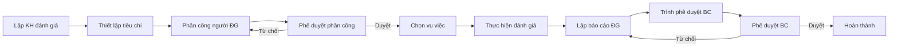
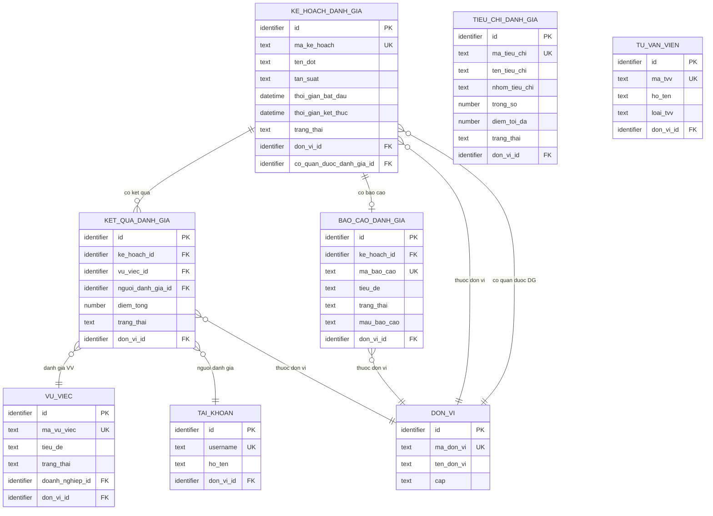
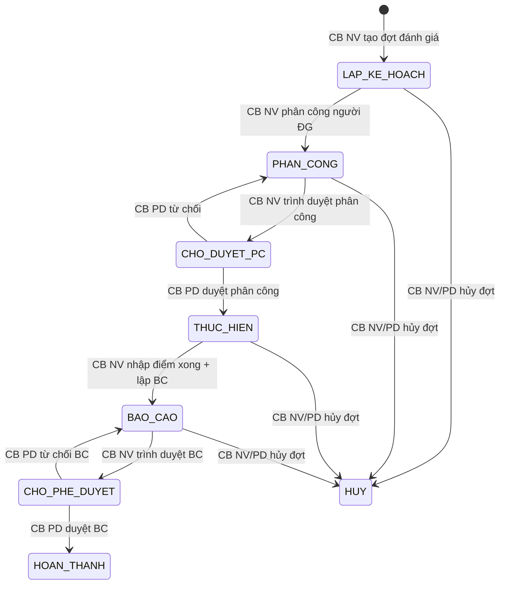

# SRS — Section 3.2.10: Theo dõi Đánh giá Hiệu quả Hỗ trợ Pháp lý

**Dự án:** Phần mềm hỗ trợ pháp lý doanh nghiệp
**Phiên bản SRS:** 3.5
**Nhóm:** VI — Theo dõi Đánh giá Hiệu quả Hỗ trợ Pháp lý
**UC range:** UC 83 – UC 91
**Số FR:** 10
**File chính:** `srs-v3.md` Section 3.2

---

## Lịch sử thay đổi

| Ngày | Tác giả | Mô tả thay đổi |
|------|---------|-----------------|
| 2026-05-06 | BA | Tạo v3.5 cherry-pick từ `srs-v3/srs-fr-08-danh-gia.md`. Apply 8 thay đổi nghiệp vụ: đổi tên module (A-ITEM-08), bổ sung trường `co_quan_duoc_danh_gia_id` (A-ITEM-08, Q-07), bổ sung FR-VI-10 nhận kết quả đánh giá (A-ITEM-08, Q-06, GAP-VI-04), bổ sung trường `file_dinh_kem` (A-ITEM-07), thống nhất 8 trạng thái + thêm HUY (B1, GAP-VI-01), đổi FK `dot_danh_gia_id` → `ke_hoach_danh_gia_id` (B1), mở rộng phạm vi BR-NOTIF-01 (B1, GAP-VI-03), đồng bộ tên SM-DANHGIA + footer (B1). Pending: 5 trường công khai chuyên trang (chờ BA xác nhận FR-08 thuộc 12 DS công khai theo CR-01). KHÔNG apply: bổ sung CB Phê duyệt vào FR-VI-02/06 (v4 sai vs CSV), mâu thuẫn Mẫu 21a/21b (BA chốt giữ nguyên hiện trạng v4). Chi tiết tham chiếu `v3.5-delta-reports/v3.5-delta-fr-08.md` và `srs-v3.5/CHANGELOG-v3-to-v3.5.md`. |

---

## Mục lục file này

- [1. Tổng quan nhóm](#1-tổng-quan-nhóm)
- [2. Yêu cầu chức năng chi tiết](#2-yêu-cầu-chức-năng-chi-tiết)
- [3. Màn hình chức năng](#3-màn-hình-chức-năng)
- [4. Entity liên quan](#4-entity-liên-quan)
- [5. State Machine liên quan](#5-state-machine-liên-quan)
- [6. Business Rules liên quan](#6-business-rules-liên-quan)

---

## 1. Tổng quan nhóm

**Mục đích:** Lập đợt đánh giá, nhập điểm, tổng hợp kết quả hiệu quả HTPLDN theo biểu mẫu TT17/2025/TT-BTP.

**Tần suất:** Sơ bộ 6 tháng + tròn năm. Không đánh giá đột xuất.

**Tác nhân chính:** Cán bộ Nghiệp vụ (TW/BN/ĐP), Cán bộ Phê duyệt (TW/BN/ĐP)

**Quy trình nghiệp vụ tổng quan:**



**State Machine — SM-DANHGIA:**

```
[*] →(CB NV tạo đợt)→ [LAP_KE_HOACH]
[LAP_KE_HOACH] →(phân công người ĐG)→ [PHAN_CONG]
[PHAN_CONG] →(trình duyệt PC)→ [CHO_DUYET_PC]
[CHO_DUYET_PC] →(CB PD duyệt)→ [THUC_HIEN]
  →(CB PD từ chối)→ [PHAN_CONG]
[THUC_HIEN] →(nhập điểm xong + lập BC)→ [BAO_CAO]
[BAO_CAO] →(trình duyệt BC)→ [CHO_PHE_DUYET]
[CHO_PHE_DUYET] →(CB PD duyệt BC)→ [HOAN_THANH]
  →(CB PD từ chối BC)→ [BAO_CAO]
[*bất kỳ*] →(hủy đợt)→ [HUY]
```

> **[GAP-VI-01]** Thống nhất SM-DANHGIA về 8 states (Section 5 là source of truth + HUY): LAP_KE_HOACH, PHAN_CONG, CHO_DUYET_PC, THUC_HIEN, BAO_CAO, CHO_PHE_DUYET, HOAN_THANH, HUY.

> **Lưu ý:** Mẫu 21a/21b TT17/2025 thuộc nhóm XI (CT HTPLDN), KHÔNG thuộc nhóm VI (Đánh giá).

---

## 2. Yêu cầu chức năng chi tiết

---

### FR-VI-01: Lập kế hoạch đánh giá (UC83)

**UC Reference:** UC 83
**Source:** TT17/2025/TT-BTP — Thiết kế cơ sở
**Priority:** Essential
**Stability:** High
**Màn hình:** SCR-VI-01 — [Theo dõi Đánh giá Hiệu quả HTPL](#scr-vi-01-theo-dõi-đánh-giá-hiệu-quả-htpl-consolidated-v21)

**Mô tả:**
Tạo đợt đánh giá hiệu quả HTPLDN với thông tin kỳ đánh giá, tần suất, đối tượng. Hệ thống tự sinh mã đợt, gán trạng thái ban đầu LAP_KE_HOACH.

**Tác nhân:** Cán bộ Nghiệp vụ (TW/BN/ĐP)

**Preconditions (Điều kiện tiên quyết):**

- User đã đăng nhập (BR-AUTH-01)
- User có quyền "Quản lý đánh giá"
- Phạm vi dữ liệu áp dụng theo đơn vị

**Inputs (Dữ liệu đầu vào):**

| # | Tên field | Kiểu logic | Bắt buộc | Ràng buộc | Mặc định | Nguồn |
|---|----------|-----------|----------|-----------|----------|-------|
| 1 | ten_dot | text | Y | Max 500 ký tự | — | Nhập tay |
| 2 | muc_tieu | text (long) | Y | — | — | Nhập tay |
| 3 | tan_suat | text | Y | SO_BO_6_THANG / TRON_NAM | Auto gợi ý theo tháng | Chọn |
| 4 | tu_ngay | date | Y | < den_ngay | — | Chọn |
| 5 | den_ngay | date | Y | > tu_ngay | — | Chọn |
| 6 | doi_tuong | text | Y | VU_VIEC / DAO_TAO / TONG_HOP | — | Chọn |
| 7 | ghi_chu | text (long) | N | Max 2000 ký tự | — | Nhập tay |

**Processing (Xử lý):**

| Bước | Mô tả xử lý | BR áp dụng |
|------|-------------|-----------|
| 1 | Xác nhận dữ liệu đầu vào theo ràng buộc bảng Inputs | — |
| 2 | Kiểm tra quyền truy cập và phạm vi đơn vị | BR-AUTH-01 |
| 3 | Tự sinh mã đợt: DG-{YYYYMMDD}-{SEQ} | BR-DATA-04 |
| 4 | Kiểm tra ngày bắt đầu phải trước ngày kết thúc | — |
| 5 | Kiểm tra tần suất hợp lệ | — |
| 6 | Gán trạng thái ban đầu LAP_KE_HOACH | SM-DANHGIA |
| 7 | Lưu bản ghi đợt đánh giá | BR-DATA-03 |
| 8 | Ghi nhật ký thao tác | BR-DATA-05 |

**Business Rules áp dụng:**
- **BR-AUTH-01**: Xác thực quyền truy cập → Xem Phụ lục B (file chính)
- **BR-DATA-03**: Quy tắc lưu dữ liệu → Xem Phụ lục B (file chính)
- **BR-DATA-04**: Quy tắc sinh mã tự động → Xem Phụ lục B (file chính)
- **SM-DANHGIA**: Máy trạng thái đánh giá → Xem Phụ lục C (file chính)

**Outputs (Dữ liệu đầu ra):**

| # | Tên | Kiểu logic | Điều kiện | Format |
|---|-----|-----------|-----------|--------|
| 1 | Đợt đánh giá mới | structured | Luôn | Bản ghi KE_HOACH_DANH_GIA |
| 2 | Mã đợt | text | Luôn | DG-{YYYYMMDD}-{SEQ} |
| 3 | Thông báo thành công | text | Khi lưu thành công | Toast |

**Postconditions (Trạng thái sau thực hiện):**

- Bản ghi KE_HOACH_DANH_GIA được tạo với trạng thái LAP_KE_HOACH
- AUDIT_LOG ghi nhận thao tác tạo

**Error Handling (Xử lý lỗi):**

| # | Điều kiện lỗi | Mã lỗi | Phản hồi hệ thống | Severity |
|---|--------------|--------|-------------------|----------|
| E1 | Thiếu trường bắt buộc | ERR-DG-KH-01 | "Vui lòng nhập đầy đủ thông tin bắt buộc" | ERROR |
| E2 | tu_ngay >= den_ngay | ERR-DG-KH-02 | "Ngày bắt đầu phải trước ngày kết thúc" | ERROR |
| E3 | Không có quyền | ERR-AUTH-01 | "Bạn không có quyền thực hiện thao tác này" | ERROR |

**Acceptance Criteria:**

- **Given** CB NV truy cập "Theo dõi đánh giá hiệu quả HTPL" **When** hiển thị **Then** danh sách KH thuộc đơn vị, phân trang
- **Given** CB NV thêm mới **When** nhập đủ trường **Then** validate + lưu, trạng thái LAP_KE_HOACH
- **Given** CB NV chỉnh sửa KH chưa duyệt **When** thay đổi **Then** validate + lưu
- **Given** CB NV xóa KH chưa duyệt **When** xác nhận **Then** soft delete

---

### FR-VI-02: Thiết lập tiêu chí đánh giá (UC84)

**UC Reference:** UC 84
**Source:** TT17/2025/TT-BTP — Thiết kế cơ sở
**Priority:** Essential
**Stability:** High
**Màn hình:** SCR-VI-01 (Tab 1 — Tiêu chí)

**Mô tả:**
Quản lý (thêm/sửa/xóa) tiêu chí đánh giá cho từng đợt. Tổng trọng số phải bằng 100% trước khi chuyển trạng thái.

**Tác nhân:** Cán bộ Nghiệp vụ (TW/BN/ĐP)

**Preconditions (Điều kiện tiên quyết):**

- Đợt đánh giá đã tạo
- User có quyền "Quản lý đánh giá"

**Inputs (Dữ liệu đầu vào):**

| # | Tên field | Kiểu logic | Bắt buộc | Ràng buộc | Mặc định | Nguồn |
|---|----------|-----------|----------|-----------|----------|-------|
| 1 | ke_hoach_danh_gia_id | identifier | Y | FK → KE_HOACH_DANH_GIA | — | Context |
| 2 | ten_tieu_chi | text | Y | Max 500 ký tự | — | Nhập tay / DM |
| 3 | mo_ta | text (long) | N | — | — | Nhập tay |
| 4 | trong_so | number | Y | 1-100, SUM = 100% | — | Nhập tay |
| 5 | diem_toi_da | number | Y | > 0, số nguyên dương | — | Nhập tay |
| 6 | thu_tu | number | Y | Số thứ tự hiển thị | = STT | Auto / Nhập tay |

**Processing (Xử lý):**

| Bước | Mô tả xử lý | BR áp dụng |
|------|-------------|-----------|
| 1 | Xác nhận dữ liệu đầu vào theo ràng buộc bảng Inputs | — |
| 2 | Kiểm tra quyền truy cập | BR-AUTH-01 |
| 3 | Thêm/sửa/xóa tiêu chí cho đợt đánh giá | — |
| 4 | Kiểm tra tổng trọng số = 100% cho toàn đợt (cảnh báo nếu khác, cho phép lưu) | BR-CALC-04 |
| 5 | Tham chiếu danh mục tiêu chí đánh giá chất lượng (UC109) nếu chọn từ DM | — |
| 6 | Ghi nhật ký thao tác | BR-DATA-05 |

**Business Rules áp dụng:**
- **BR-CALC-04**: Tổng trọng số tiêu chí = 100% → Xem Phụ lục B (file chính)

**Outputs (Dữ liệu đầu ra):**

| # | Tên | Kiểu logic | Điều kiện | Format |
|---|-----|-----------|-----------|--------|
| 1 | Danh sách tiêu chí | structured[] | Luôn | Bảng tiêu chí |
| 2 | Tổng trọng số | number | Luôn | Hiển thị realtime |

**Postconditions (Trạng thái sau thực hiện):**

- Tiêu chí được tạo/cập nhật/xóa
- AUDIT_LOG ghi nhận

**Error Handling (Xử lý lỗi):**

| # | Điều kiện lỗi | Mã lỗi | Phản hồi hệ thống | Severity |
|---|--------------|--------|-------------------|----------|
| E1 | Tổng trọng số != 100% khi chuyển trạng thái | ERR-DG-TC-01 | "Tổng trọng số phải bằng 100%" | ERROR |
| E2 | Thiếu tên tiêu chí | ERR-DG-TC-02 | "Vui lòng nhập tên tiêu chí" | ERROR |
| E3 | Điểm tối đa <= 0 | ERR-DG-TC-03 | "Điểm tối đa phải lớn hơn 0" | ERROR |

**Acceptance Criteria:**

- **Given** CB NV chọn đợt đánh giá **When** nhấn "Tiêu chí" **Then** hiển thị danh sách tiêu chí
- **Given** CB NV thêm/sửa/xóa tiêu chí **When** lưu **Then** validate trọng số tổng = 100%

---

### FR-VI-03: Phân công người đánh giá (UC85)

**UC Reference:** UC 85
**Source:** TT17/2025/TT-BTP — Thiết kế cơ sở
**Priority:** Essential
**Stability:** High
**Màn hình:** SCR-VI-01 (Tab 2 — Phân công)

**Mô tả:**
Phân công cán bộ/chuyên gia thực hiện đánh giá cho đợt, gán vai trò (đánh giá viên / trưởng nhóm), và trình phê duyệt.

**Tác nhân:** Cán bộ Nghiệp vụ (TW/BN/ĐP)

**Preconditions (Điều kiện tiên quyết):**

- Đợt đánh giá ở trạng thái PHAN_CONG
- Đã có tiêu chí (SUM trọng số = 100%)

**Inputs (Dữ liệu đầu vào):**

| # | Tên field | Kiểu logic | Bắt buộc | Ràng buộc | Mặc định | Nguồn |
|---|----------|-----------|----------|-----------|----------|-------|
| 1 | ke_hoach_danh_gia_id | identifier | Y | FK → KE_HOACH_DANH_GIA | — | Context |
| 2 | nguoi_danh_gia_id | identifier | Y | FK → NGUOI_DUNG, cùng đơn vị | — | Chọn từ DS |
| 3 | vai_tro | text | Y | DANH_GIA_VIEN / TRUONG_NHOM | — | Chọn |
| 4 | linh_vuc_phu_trach | identifier[] | N | FK → DANH_MUC (Lĩnh vực PL) | — | Multi-select |
| 5 | ghi_chu | text (long) | N | Max 500 ký tự | — | Nhập tay |

**Processing (Xử lý):**

| Bước | Mô tả xử lý | BR áp dụng |
|------|-------------|-----------|
| 1 | Xác nhận dữ liệu đầu vào theo ràng buộc bảng Inputs | — |
| 2 | Kiểm tra quyền và phạm vi đơn vị | BR-AUTH-01 |
| 3 | Kiểm tra đợt ở trạng thái PHAN_CONG | SM-DANHGIA |
| 4 | Hiển thị danh sách CB/CG đủ điều kiện tham gia (cùng đơn vị) | — |
| 5 | Lưu bản ghi phân công | — |
| 6 | Gửi thông báo người được phân công | — |
| 7 | Khi CB NV trình: chuyển đợt sang trạng thái CHO_DUYET_PC | SM-DANHGIA |
| 8 | Ghi nhật ký thao tác | BR-DATA-05 |

**Business Rules áp dụng:**
- **SM-DANHGIA**: Transition PHAN_CONG → CHO_DUYET_PC → Xem Phụ lục C (file chính)

**Outputs (Dữ liệu đầu ra):**

| # | Tên | Kiểu logic | Điều kiện | Format |
|---|-----|-----------|-----------|--------|
| 1 | Bản ghi phân công | structured | Luôn | PHAN_CONG_DANH_GIA |
| 2 | Thông báo phân công | text | Khi lưu | Gửi người được phân công |

**Postconditions (Trạng thái sau thực hiện):**

- PHAN_CONG_DANH_GIA records created
- Khi trình: đợt chuyển sang CHO_DUYET_PC
- Thông báo gửi đến người được phân công

**Error Handling (Xử lý lỗi):**

| # | Điều kiện lỗi | Mã lỗi | Phản hồi hệ thống | Severity |
|---|--------------|--------|-------------------|----------|
| E1 | Không có người đánh giá nào | ERR-DG-PC-01 | "Vui lòng phân công ít nhất 1 người" | ERROR |
| E2 | Không có TRƯỞNG NHÓM | ERR-DG-PC-02 | "Cần ít nhất 1 người vai trò Trưởng nhóm" | ERROR |
| E3 | Người trùng lặp | ERR-DG-PC-03 | "Người đánh giá đã được phân công" | ERROR |
| E4 | Đợt không ở PHAN_CONG | ERR-DG-PC-04 | "Đợt không ở trạng thái phù hợp để phân công" | ERROR |

**Acceptance Criteria:**

- **Given** CB NV chọn đợt đánh giá **When** nhấn "Phân công" **Then** hiển thị DS CB/CG đủ điều kiện tham gia
- **Given** CB NV chọn người **When** xác nhận **Then** lưu phân công, gửi thông báo
- **Given** CB NV hoàn tất **When** trình duyệt **Then** chuyển CHO_DUYET_PC

---

### FR-VI-04: Phê duyệt phân công (UC86)

**UC Reference:** UC 86
**Source:** TT17/2025/TT-BTP — Thiết kế cơ sở
**Priority:** Essential
**Stability:** High
**Màn hình:** SCR-VI-01 (Tab 2 — Action Phê duyệt PC)

**Mô tả:**
Cán bộ Phê duyệt xem danh sách phân công chờ duyệt, quyết định phê duyệt hoặc từ chối (kèm lý do).

**Tác nhân:** Cán bộ Phê duyệt (TW/BN/ĐP)

**Preconditions (Điều kiện tiên quyết):**

- Đợt ở trạng thái CHO_DUYET_PC
- User có quyền Phê duyệt

**Inputs (Dữ liệu đầu vào):**

| # | Tên field | Kiểu logic | Bắt buộc | Ràng buộc | Mặc định | Nguồn |
|---|----------|-----------|----------|-----------|----------|-------|
| 1 | ke_hoach_danh_gia_id | identifier | Y | FK → KE_HOACH_DANH_GIA | — | Context |
| 2 | quyet_dinh | text | Y | DUYET / TU_CHOI | — | Chọn |
| 3 | ly_do_tu_choi | text (long) | Conditional | Bắt buộc khi TU_CHOI, >= 10 ký tự | — | Nhập tay |

**Processing (Xử lý):**

| Bước | Mô tả xử lý | BR áp dụng |
|------|-------------|-----------|
| 1 | Xác nhận dữ liệu đầu vào theo ràng buộc bảng Inputs | — |
| 2 | Kiểm tra quyền Cán bộ Phê duyệt | BR-AUTH-01 |
| 3 | Kiểm tra đợt ở trạng thái CHO_DUYET_PC | SM-DANHGIA |
| 4 | Hiển thị thông tin đợt + danh sách người phân công | — |
| 5 | Nếu DUYỆT: chuyển trạng thái sang THUC_HIEN. Ghi người duyệt, thời gian | SM-DANHGIA |
| 6 | Nếu TỪ CHỐI: chuyển trạng thái sang PHAN_CONG + ghi lý do. Ghi người từ chối, thời gian | SM-DANHGIA |
| 7 | Gửi thông báo CB NV trình | — |
| 8 | Ghi nhật ký thao tác | BR-DATA-05 |

**Business Rules áp dụng:**
- **SM-DANHGIA**: Transition CHO_DUYET_PC → THUC_HIEN (duyệt) / PHAN_CONG (từ chối) → Xem Phụ lục C (file chính)

**Outputs (Dữ liệu đầu ra):**

| # | Tên | Kiểu logic | Điều kiện | Format |
|---|-----|-----------|-----------|--------|
| 1 | Kết quả phê duyệt | text | Luôn | DUYET / TU_CHOI |
| 2 | Trạng thái đợt mới | text | Luôn | THUC_HIEN / PHAN_CONG |

**Postconditions (Trạng thái sau thực hiện):**

- Nếu duyệt: đợt → THUC_HIEN
- Nếu từ chối: đợt → PHAN_CONG, CB NV điều chỉnh
- Thông báo gửi CB NV

**Error Handling (Xử lý lỗi):**

| # | Điều kiện lỗi | Mã lỗi | Phản hồi hệ thống | Severity |
|---|--------------|--------|-------------------|----------|
| E1 | Đợt không ở CHO_DUYET_PC | ERR-DG-PD-01 | "Đợt không ở trạng thái chờ duyệt phân công" | ERROR |
| E2 | Từ chối không có lý do | ERR-DG-PD-02 | "Vui lòng nhập lý do từ chối (tối thiểu 10 ký tự)" | ERROR |

**Acceptance Criteria:**

- **Given** CB PD xem DS phân công chờ duyệt **When** xem chi tiết **Then** hiển thị đợt + DS người
- **Given** CB PD duyệt **When** xác nhận **Then** trạng thái → THUC_HIEN
- **Given** CB PD từ chối **When** nhập lý do **Then** trả lại CB NV điều chỉnh

---

### FR-VI-05: Chọn vụ việc đánh giá (UC87)

**UC Reference:** UC 87
**Source:** TT17/2025/TT-BTP — Thiết kế cơ sở
**Priority:** Essential
**Stability:** High
**Màn hình:** SCR-VI-01 (Tab 3 — Thực hiện, section Chọn VV)

**Mô tả:**
Chọn các vụ việc đã hoàn thành trong kỳ đánh giá để đưa vào đợt đánh giá. Cảnh báo nếu VV đã thuộc đợt khác nhưng vẫn cho phép chọn lại.

**Tác nhân:** Cán bộ Nghiệp vụ (TW/BN/ĐP)

**Preconditions (Điều kiện tiên quyết):**

- Đợt đánh giá ở trạng thái THUC_HIEN

**Inputs (Dữ liệu đầu vào):**

| # | Tên field | Kiểu logic | Bắt buộc | Ràng buộc | Mặc định | Nguồn |
|---|----------|-----------|----------|-----------|----------|-------|
| 1 | ke_hoach_danh_gia_id | identifier | Y | FK → KE_HOACH_DANH_GIA | — | Context |
| 2 | vu_viec_ids | identifier[] | Y | FK → VU_VIEC, trạng thái HOAN_THANH | — | Checkbox chọn |

**Processing (Xử lý):**

| Bước | Mô tả xử lý | BR áp dụng |
|------|-------------|-----------|
| 1 | Kiểm tra quyền truy cập | BR-AUTH-01 |
| 2 | Lọc vụ việc đã hoàn thành trong kỳ đánh giá (từ ngày đến ngày) thuộc phạm vi đơn vị | — |
| 3 | Hiển thị danh sách VV hoàn thành trong kỳ | — |
| 4 | CB NV chọn/bỏ chọn VV | — |
| 5 | Cảnh báo nếu VV đã thuộc đợt khác (cho phép đánh giá lại) | — |
| 6 | Lưu danh sách VV đánh giá | — |
| 7 | Chuyển đợt sang trạng thái THUC_HIEN (nếu chưa ở THUC_HIEN) | SM-DANHGIA |
| 8 | Ghi nhật ký thao tác | BR-DATA-05 |

**Business Rules áp dụng:**
- **SM-DANHGIA**: Đợt đã ở THUC_HIEN sau khi CB PD duyệt phân công → Xem Phụ lục C (file chính)

**Outputs (Dữ liệu đầu ra):**

| # | Tên | Kiểu logic | Điều kiện | Format |
|---|-----|-----------|-----------|--------|
| 1 | Danh sách VV đánh giá | structured[] | Luôn | VU_VIEC_DANH_GIA records |

**Postconditions (Trạng thái sau thực hiện):**

- VU_VIEC_DANH_GIA records created
- Đợt giữ trạng thái THUC_HIEN

**Error Handling (Xử lý lỗi):**

| # | Điều kiện lỗi | Mã lỗi | Phản hồi hệ thống | Severity |
|---|--------------|--------|-------------------|----------|
| E1 | 0 VV hoàn thành trong kỳ | WRN-DG-VV-01 | "Không có vụ việc nào hoàn thành trong kỳ đánh giá này" | WARNING |
| E2 | Đợt không ở THUC_HIEN | ERR-DG-VV-01 | "Đợt không ở trạng thái phù hợp" | ERROR |

**Acceptance Criteria:**

- **Given** CB NV chọn đợt đã duyệt PC **When** nhấn "Chọn vụ việc" **Then** DS VV hoàn thành trong kỳ
- **Given** CB NV chọn/bỏ chọn **When** xác nhận **Then** lưu DS VV đánh giá
- **Given** VV đã thuộc đợt khác **When** chọn lại **Then** cảnh báo (vẫn cho phép)

---

### FR-VI-06: Thực hiện đánh giá (UC88)

**UC Reference:** UC 88
**Source:** TT17/2025/TT-BTP — Thiết kế cơ sở
**Priority:** Essential
**Stability:** High
**Màn hình:** SCR-VI-01 (Tab 3 — Thực hiện chấm điểm)

**Mô tả:**
Người được phân công chấm điểm từng vụ việc theo các tiêu chí đã thiết lập. Hệ thống tự tính điểm tổng hợp có trọng số và xếp loại.

**Tác nhân:** Cán bộ Nghiệp vụ (TW/BN/ĐP) / Người đánh giá được phân công

**Preconditions (Điều kiện tiên quyết):**

- Đợt ở trạng thái THUC_HIEN
- User là người được phân công

**Inputs (Dữ liệu đầu vào):**

| # | Tên field | Kiểu logic | Bắt buộc | Ràng buộc | Mặc định | Nguồn |
|---|----------|-----------|----------|-----------|----------|-------|
| 1 | vu_viec_danh_gia_id | identifier | Y | FK → VU_VIEC_DANH_GIA | — | Chọn từ dropdown |
| 2 | tieu_chi_id | identifier | Y | FK → TIEU_CHI_DANH_GIA | — | Context (bảng) |
| 3 | diem | number | Y | 0 ≤ diem ≤ diem_toi_da | — | Nhập tay |
| 4 | nhan_xet | text (long) | N | Max 1000 ký tự | — | Nhập tay |
| 5 | nhan_xet_tong_the | text (long) | N | Max 2000 ký tự | — | Nhập tay |

**Processing (Xử lý):**

| Bước | Mô tả xử lý | BR áp dụng |
|------|-------------|-----------|
| 1 | Xác nhận dữ liệu đầu vào theo ràng buộc bảng Inputs | — |
| 2 | Kiểm tra quyền: user là người được phân công | BR-AUTH-01 |
| 3 | Kiểm tra đợt ở trạng thái THUC_HIEN | SM-DANHGIA |
| 4 | Hiển thị form nhập điểm theo từng tiêu chí | — |
| 5 | Kiểm tra: 0 ≤ điểm ≤ điểm tối đa | — |
| 6 | Tính điểm tổng hợp = tổng (điểm * trọng số / 100) | — |
| 7 | Lưu kết quả đánh giá (hỗ trợ lưu nháp khi chấm một phần) | — |
| 8 | Kiểm tra: tất cả VV trong đợt đã đánh giá? Nếu có → chuyển đợt sang BAO_CAO | SM-DANHGIA |
| 9 | Ghi nhật ký thao tác | BR-DATA-05 |

**Business Rules áp dụng:**
- **SM-DANHGIA**: Transition THUC_HIEN → BAO_CAO (khi tất cả VV hoàn thành) → Xem Phụ lục C (file chính)

**Outputs (Dữ liệu đầu ra):**

| # | Tên | Kiểu logic | Điều kiện | Format |
|---|-----|-----------|-----------|--------|
| 1 | Kết quả đánh giá | structured | Luôn | KET_QUA_DANH_GIA |
| 2 | Điểm tổng hợp | number | Khi tất cả tiêu chí đã chấm | 2 số thập phân |
| 3 | Xếp loại | text | Khi tất cả tiêu chí đã chấm | Xuất sắc/Tốt/Đạt/Chưa đạt |

**Postconditions (Trạng thái sau thực hiện):**

- KET_QUA_DANH_GIA record created/updated
- Khi tất cả VV hoàn thành: đợt → BAO_CAO

**Error Handling (Xử lý lỗi):**

| # | Điều kiện lỗi | Mã lỗi | Phản hồi hệ thống | Severity |
|---|--------------|--------|-------------------|----------|
| E1 | Điểm vượt điểm tối đa | ERR-DG-DG-01 | "Điểm phải từ 0 đến {max}" | ERROR |
| E2 | Tổng trọng số lệch (tolerance ±0.01%) | ERR-DG-TC-01 | "Tổng trọng số phải bằng 100%" | ERROR |
| E3 | Sửa tiêu chí khi đang chấm điểm | ERR-DG-TC-02 | "Không thể sửa tiêu chí khi đợt đang đánh giá" | ERROR |
| E4 | 0 vụ việc trong kỳ | WRN-DG-VV-02 | "Không có VV nào trong kỳ" | WARNING |

**Acceptance Criteria:**

- **Given** Người đánh giá chọn VV **When** hiển thị **Then** form nhập điểm theo tiêu chí
- **Given** nhập điểm + nhận xét **When** lưu **Then** ghi nhận kết quả, tính điểm tổng hợp

---

### FR-VI-07: Lập báo cáo đánh giá (UC89)

**UC Reference:** UC 89
**Source:** TT17/2025/TT-BTP — Thiết kế cơ sở
**Priority:** Essential
**Stability:** High
**Màn hình:** SCR-VI-01 (Tab 4 — Báo cáo)

**Mô tả:**
Tổng hợp dữ liệu đánh giá, sinh báo cáo hiệu quả HTPLDN theo template nhóm VI với các cột số liệu từ hệ thống và nhập thủ công.

**Tác nhân:** Cán bộ Nghiệp vụ (TW/BN/ĐP)

**Preconditions (Điều kiện tiên quyết):**

- Đợt ở trạng thái BAO_CAO

**Inputs (Dữ liệu đầu vào):**

| # | Tên field | Kiểu logic | Bắt buộc | Ràng buộc | Mặc định | Nguồn |
|---|----------|-----------|----------|-----------|----------|-------|
| 1 | ke_hoach_danh_gia_id | identifier | Y | FK → KE_HOACH_DANH_GIA | — | Context |
| 2 | kp_hoat_dong_khac | money | N | >= 0 | — | Nhập thủ công |
| 3 | kp_xa_hoi_hoa | money | N | >= 0 | — | Nhập thủ công |
| 4 | nhan_xet_tong_the | text (long) | N | — | — | Rich text |
| 5 | kien_nghi | text (long) | N | — | — | Rich text |

**Processing (Xử lý):**

| Bước | Mô tả xử lý | BR áp dụng |
|------|-------------|-----------|
| 1 | Kiểm tra quyền truy cập | BR-AUTH-01 |
| 2 | Tổng hợp dữ liệu: tính điểm trung bình, đếm vụ việc, phân nhóm theo tiêu chí | — |
| 3 | Sinh báo cáo đánh giá hiệu quả theo template nhóm VI | — |
| 4 | Tự động điền các cột số liệu: số TVV, số tập huấn, số hội nghị, số VB, số hồ sơ, kinh phí | — |
| 5 | CB NV xem + chỉnh sửa/bổ sung nhận xét, kiến nghị, kinh phí thủ công | — |
| 6 | Lưu bản ghi báo cáo đánh giá | — |
| 7 | Đợt giữ trạng thái BAO_CAO (đã ở BAO_CAO từ khi hoàn tất chấm điểm) | SM-DANHGIA |
| 8 | Ghi nhật ký thao tác | BR-DATA-05 |

**Các cột chính BC đánh giá hiệu quả:**

| Cột | Tên | Nguồn dữ liệu |
|-----|-----|---------------|
| 1 | Số TVV kiện toàn/công bố | Đếm TVV đang hoạt động |
| 2 | Số cuộc tập huấn | Đếm khóa học loại tập huấn |
| 3 | Số hội nghị đối thoại | Đếm khóa học loại hội nghị |
| 4 | Số VB trả lời UBND | Đếm vụ việc loại trả lời UBND |
| 5 | Số VB TV mạng lưới TVV | Đếm vụ việc loại TV mạng lưới |
| 6 | Số HS tiếp nhận | Đếm hồ sơ chi trả (trừ từ chối) |
| 7 | Số HS giải quyết tổng | Đếm hồ sơ đã thanh toán |
| 8 | HS DN vừa | Đếm hồ sơ theo quy mô DN vừa |
| 9 | HS DN nhỏ | Đếm hồ sơ theo quy mô DN nhỏ |
| 10 | HS DN siêu nhỏ | Đếm hồ sơ theo quy mô DN siêu nhỏ |
| 11 | KP hỗ trợ chi phí TVPL (NSNN) | Tổng số tiền thực trả |
| 12 | KP chi HĐ khác (NSNN) | Nhập thủ công |
| 13 | KP xã hội hóa | Nhập thủ công |

**Business Rules áp dụng:**
- **SM-DANHGIA**: Đợt ở trạng thái BAO_CAO, CB NV lập báo cáo → Xem Phụ lục C (file chính)

**Outputs (Dữ liệu đầu ra):**

| # | Tên | Kiểu logic | Điều kiện | Format |
|---|-----|-----------|-----------|--------|
| 1 | Báo cáo đánh giá | structured | Luôn | BAO_CAO_DANH_GIA |
| 2 | File xuất | file | Khi nhấn Xuất | Excel (.xlsx) / Word (.docx) |

**Postconditions (Trạng thái sau thực hiện):**

- BAO_CAO_DANH_GIA record created
- Đợt giữ trạng thái BAO_CAO

**Error Handling (Xử lý lỗi):**

| # | Điều kiện lỗi | Mã lỗi | Phản hồi hệ thống | Severity |
|---|--------------|--------|-------------------|----------|
| E1 | Đợt không ở BAO_CAO | ERR-DG-BC-01 | "Đợt chưa hoàn thành đánh giá" | ERROR |

**Acceptance Criteria:**

- **Given** CB NV chọn đợt đã hoàn thành nhập điểm **When** nhấn "Lập BC" **Then** hệ thống tổng hợp, sinh BC đánh giá hiệu quả
- **Given** CB NV xem BC **When** chỉnh sửa/bổ sung **Then** lưu thay đổi
- **Given** CB NV xuất BC **When** nhấn "Xuất" **Then** tải file Excel/Word theo template đánh giá

---

### FR-VI-08: Trình phê duyệt báo cáo (UC90)

**UC Reference:** UC 90
**Source:** TT17/2025/TT-BTP — Thiết kế cơ sở
**Priority:** Essential
**Stability:** High
**Màn hình:** SCR-VI-01 (Tab 4 — Báo cáo)

**Mô tả:**
CB NV trình báo cáo đánh giá lên CB PD để phê duyệt. Hệ thống kiểm tra dữ liệu đầy đủ, chuyển trạng thái và gửi thông báo.

**Tác nhân:** Cán bộ Nghiệp vụ

**Preconditions (Điều kiện tiên quyết):**

- Đợt ở trạng thái BAO_CAO
- BC đã được lưu

**Inputs (Dữ liệu đầu vào):**

| # | Tên field | Kiểu logic | Bắt buộc | Ràng buộc | Mặc định | Nguồn |
|---|----------|-----------|----------|-----------|----------|-------|
| 1 | ke_hoach_danh_gia_id | identifier | Y | FK → KE_HOACH_DANH_GIA | — | Context |

**Processing (Xử lý):**

| Bước | Mô tả xử lý | BR áp dụng |
|------|-------------|-----------|
| 1 | Kiểm tra quyền truy cập | BR-AUTH-01 |
| 2 | Kiểm tra đợt ở trạng thái BAO_CAO | SM-DANHGIA |
| 3 | Kiểm tra BC đầy đủ dữ liệu (cảnh báo nếu thiếu) | — |
| 4 | Chuyển trạng thái sang CHO_PHE_DUYET | SM-DANHGIA |
| 5 | Gửi thông báo CB PD | — |
| 6 | Ghi nhật ký thao tác | BR-DATA-05 |

**Business Rules áp dụng:**
- **SM-DANHGIA**: Transition BAO_CAO → CHO_PHE_DUYET → Xem Phụ lục C (file chính)

**Outputs (Dữ liệu đầu ra):**

| # | Tên | Kiểu logic | Điều kiện | Format |
|---|-----|-----------|-----------|--------|
| 1 | Trạng thái mới | text | Luôn | CHO_PHE_DUYET |
| 2 | Thông báo CB PD | text | Luôn | Gửi CB PD |

**Postconditions (Trạng thái sau thực hiện):**

- Đợt chuyển sang CHO_PHE_DUYET
- Thông báo gửi CB PD

**Error Handling (Xử lý lỗi):**

| # | Điều kiện lỗi | Mã lỗi | Phản hồi hệ thống | Severity |
|---|--------------|--------|-------------------|----------|
| E1 | Đợt không ở BAO_CAO | ERR-DG-TR-01 | "Đợt không ở trạng thái đã lập BC" | ERROR |
| E2 | BC thiếu dữ liệu | WRN-DG-TR-01 | "Báo cáo thiếu thông tin: {danh sách trường}" | WARNING |

**Acceptance Criteria:**

- **Given** CB NV chọn BC hoàn chỉnh **When** nhấn "Trình phê duyệt" **Then** BC → CHO_PHE_DUYET, gửi thông báo CB PD
- **Given** BC thiếu dữ liệu **When** nhấn trình **Then** cảnh báo trường thiếu

---

### FR-VI-09: Phê duyệt báo cáo đánh giá (UC91)

**UC Reference:** UC 91
**Source:** TT17/2025/TT-BTP — Thiết kế cơ sở
**Priority:** Essential
**Stability:** High
**Màn hình:** SCR-VI-01 (Tab 4 — Action Phê duyệt BC)

**Mô tả:**
CB PD xem nội dung BC đánh giá, quyết định phê duyệt hoặc từ chối. Sau phê duyệt hiển thị kết quả và gửi thông báo.

**Tác nhân:** Cán bộ Phê duyệt (TW/BN/ĐP)

**Preconditions (Điều kiện tiên quyết):**

- Đợt ở trạng thái CHO_PHE_DUYET
- User có quyền Phê duyệt

**Inputs (Dữ liệu đầu vào):**

| # | Tên field | Kiểu logic | Bắt buộc | Ràng buộc | Mặc định | Nguồn |
|---|----------|-----------|----------|-----------|----------|-------|
| 1 | ke_hoach_danh_gia_id | identifier | Y | FK → KE_HOACH_DANH_GIA | — | Context |
| 2 | quyet_dinh | text | Y | DUYET / TU_CHOI | — | Chọn |
| 3 | ly_do_tu_choi | text (long) | Conditional | Bắt buộc khi TU_CHOI, >= 10 ký tự | — | Nhập tay |

**Processing (Xử lý):**

| Bước | Mô tả xử lý | BR áp dụng |
|------|-------------|-----------|
| 1 | Kiểm tra quyền Cán bộ Phê duyệt | BR-AUTH-01 |
| 2 | Kiểm tra đợt ở trạng thái CHO_PHE_DUYET | SM-DANHGIA |
| 3 | Hiển thị nội dung BC + số liệu tổng hợp | — |
| 4 | Nếu DUYỆT: chuyển trạng thái sang HOAN_THANH. Ghi người duyệt, thời gian | SM-DANHGIA |
| 5 | Nếu TỪ CHỐI: chuyển trạng thái sang BAO_CAO + ghi lý do → trả lại CB NV | SM-DANHGIA |
| 6 | Hiển thị màn hình kết quả: trạng thái mới, người duyệt, thời gian, lý do (nếu từ chối) | — |
| 7 | Gửi thông báo CB NV kết quả phê duyệt | BR-NOTIF-01 |
| 8 | Ghi nhật ký thao tác | BR-DATA-05 |

**Business Rules áp dụng:**
- **SM-DANHGIA**: Transition CHO_PHE_DUYET → HOAN_THANH (duyệt) / BAO_CAO (từ chối) → Xem Phụ lục C (file chính)
- **BR-NOTIF-01**: Gửi thông báo kết quả phê duyệt → Xem Phụ lục B (file chính)

**Outputs (Dữ liệu đầu ra):**

| # | Tên | Kiểu logic | Điều kiện | Format |
|---|-----|-----------|-----------|--------|
| 1 | Kết quả phê duyệt | text | Luôn | DUYET / TU_CHOI |
| 2 | Trạng thái đợt mới | text | Luôn | HOAN_THANH / BAO_CAO |
| 3 | Thông tin kết quả | structured | Luôn | Trạng thái, người duyệt, thời gian, lý do |

**Postconditions (Trạng thái sau thực hiện):**

- Nếu duyệt: đợt → HOAN_THANH
- Nếu từ chối: đợt → BAO_CAO, CB NV chỉnh sửa
- Thông báo gửi CB NV

**Error Handling (Xử lý lỗi):**

| # | Điều kiện lỗi | Mã lỗi | Phản hồi hệ thống | Severity |
|---|--------------|--------|-------------------|----------|
| E1 | Đợt không ở CHO_PHE_DUYET | ERR-DG-PD-03 | "Đợt không ở trạng thái chờ duyệt BC" | ERROR |
| E2 | Từ chối không có lý do | ERR-DG-PD-04 | "Vui lòng nhập lý do từ chối (tối thiểu 10 ký tự)" | ERROR |

**Guard:** Màn hình kết quả chỉ hiển thị cho CB PD thực hiện phê duyệt hoặc CB NV cùng đơn vị. Truy cập URL trực tiếp yêu cầu kiểm tra quyền.

**Acceptance Criteria:**

- **Given** CB PD xem BC chờ duyệt **When** xem chi tiết **Then** hiển thị nội dung BC + số liệu
- **Given** CB PD duyệt **When** xác nhận **Then** trạng thái → HOAN_THANH
- **Given** CB PD từ chối **When** nhập lý do **Then** → BAO_CAO, trả lại CB NV
- **Given** CB PD phê duyệt/từ chối xong **When** hệ thống xử lý **Then** hiển thị kết quả phê duyệt (trạng thái, người duyệt, thời gian, lý do nếu từ chối)

---

### FR-VI-10: Nhận kết quả đánh giá `[GAP-VI-04][CR-10][Q-06]`

**UC Reference:** (chưa có trong CSV — gắn [GAP-VI-04])
**Priority:** Essential | **Stability:** High
**Màn hình:** SCR-VI-01 (Tab Báo cáo, chế độ read-only)

**Mô tả:** CB NV thuộc cơ quan được đánh giá xem kết quả đánh giá ở chế độ read-only (Q-06). Chỉ xem khi KH ở trạng thái HOAN_THANH.

**Tác nhân:** CB NV (thuộc co_quan_duoc_danh_gia_id)

**Preconditions:**
- User đã đăng nhập, thuộc cơ quan được đánh giá
- KE_HOACH_DANH_GIA.trang_thai = HOAN_THANH

**Inputs:**
| # | Tên field | Kiểu logic | Bắt buộc | Ràng buộc |
|---|----------|-----------|----------|-----------|
| 1 | ke_hoach_id | identifier | Y | FK → KE_HOACH_DANH_GIA |

**Processing:**
| Bước | Mô tả xử lý | BR áp dụng |
|------|-------------|-----------|
| 1 | Kiểm tra user thuộc co_quan_duoc_danh_gia_id | BR-AUTH-01 |
| 2 | Kiểm tra KH ở trạng thái HOAN_THANH | — |
| 3 | Hiển thị kết quả đánh giá (read-only) | — |

**Outputs:** Toàn bộ thông tin KH đánh giá + báo cáo kết quả, chế độ read-only.

**Error Handling:**
| # | Điều kiện lỗi | Mã lỗi | Phản hồi hệ thống | Severity |
|---|--------------|--------|-------------------|----------|
| E1 | User không thuộc cơ quan được ĐG | ERR-DG-10 | "Bạn không có quyền xem kết quả đánh giá này" | ERROR |
| E2 | KH chưa hoàn thành | ERR-DG-11 | "Kết quả đánh giá chưa hoàn thành" | ERROR |

**Acceptance Criteria:**
- **Given** CB NV thuộc cơ quan được ĐG **When** truy cập KH đã hoàn thành **Then** xem được KQ read-only
- **Given** CB NV thuộc cơ quan khác **When** truy cập **Then** từ chối

---

## 3. Màn hình chức năng

> **Ghi chú v2.1:** Consolidated từ 7 màn hình riêng (MH-08.1, MH-08.1a ~ MH-08.7) xuống 1 màn hình MH-08.1 với cấu trúc: Danh sách đợt + Chi tiết đợt (4 Tabs: Tiêu chí, Phân công, Thực hiện chấm điểm, Báo cáo) + Action buttons phê duyệt. MH-08.1a (Tiêu chí) → tab trong chi tiết đợt. MH-08.2 (Phân công) → tab trong chi tiết đợt. MH-08.3 (Phê duyệt PC) → action button. MH-08.4 (Chọn VV) → section trong tab Thực hiện. MH-08.5 (Scoring) → tab Thực hiện. MH-08.6 (Lập BC) → tab Báo cáo. MH-08.7 (Phê duyệt BC) → action button.

### SCR-VI-01: Theo dõi Đánh giá Hiệu quả HTPL (CONSOLIDATED v2.1)

**Loại màn hình:** Danh sách đợt ĐG + Chi tiết đợt (4 Tabs + Action buttons phê duyệt)
**FR sử dụng:** FR-VI-01, FR-VI-02, FR-VI-03, FR-VI-04, FR-VI-05, FR-VI-06, FR-VI-07, FR-VI-08, FR-VI-09, FR-VI-10
**UX-Spec ref:** dac-ta-man-hinh-chuc-nang-v2.md — MH-08.1 (toàn bộ section 8)
**Gộp từ:** MH-08.1 (KH) + MH-08.1a (Tiêu chí) + MH-08.2 (Phân công) + MH-08.3 (PD Phân công) + MH-08.4 (Chọn VV) + MH-08.5 (Scoring) + MH-08.6 (Lập BC) + MH-08.7 (PD BC)

#### Phần A — Danh sách đợt đánh giá

| # | Vùng | Thành phần | Loại | Dữ liệu / Nội dung | Hành vi | Điều kiện hiển thị |
|---|------|-----------|------|---------------------|---------|-------------------|
| 1 | toolbar | Breadcrumb | C01 | "Trang chủ > Đánh giá > Theo dõi đánh giá hiệu quả HTPL" | navigate | Luôn |
| 2 | toolbar | Tiêu đề trang | C02 | "Theo dõi Đánh giá Hiệu quả HTPL" + [+ Tạo đợt đánh giá] [Xuất Excel] [Làm mới] | click → tương ứng | Luôn. [+ Tạo đợt] khi có quyền "Quản lý đánh giá" |
| 3 | filter-bar | Ô tìm kiếm | C09 | Từ khóa (tên đợt, mã đợt) | change → filter | Luôn |
| 4 | filter-bar | Lọc tần suất | C10 dropdown | Tất cả / SO_BO_6_THANG / TRON_NAM | change → filter | Luôn |
| 5 | filter-bar | Lọc đối tượng | C10 dropdown | Tất cả / VU_VIEC / DAO_TAO / TONG_HOP | change → filter | Luôn |
| 6 | filter-bar | Lọc trạng thái | C10 dropdown | Tất cả / LAP_KE_HOACH / PHAN_CONG / CHO_DUYET_PC / THUC_HIEN / BAO_CAO / CHO_PHE_DUYET / HOAN_THANH / HUY | change → filter | Luôn |
| 7 | filter-bar | Khoảng ngày | C11 range | Từ ngày – Đến ngày (dd/mm/yyyy) | change → filter | Luôn |
| 8 | filter-bar | Nút Tìm kiếm / Xóa bộ lọc | C08 | — | click → query / reset | Luôn |
| 9 | table | Checkbox | checkbox | Chọn hàng loạt | click → select | Luôn |
| 10 | table | Mã đợt | text (link) | DG-{YYYYMMDD}-{SEQ} | click → mở chi tiết đợt | Luôn |
| 11 | table | Tên đợt | text | Tên đợt đánh giá (cắt bớt + "...") | — | Luôn |
| 12 | table | Tần suất | text | SO_BO_6_THANG → "Sơ bộ 6 tháng", TRON_NAM → "Tròn năm" | — | Luôn |
| 13 | table | Đối tượng | text | VU_VIEC / DAO_TAO / TONG_HOP | — | Luôn |
| 14 | table | Kỳ đánh giá | text | "dd/mm/yyyy – dd/mm/yyyy" | — | Luôn |
| 15 | table | Trạng thái | C06 badge | Mã màu theo SM-DANHGIA Section 5: Xám LAP_KE_HOACH, Xanh dương PHAN_CONG, Cam CHO_DUYET_PC, Vàng THUC_HIEN, Xanh dương đậm BAO_CAO, Cam đậm CHO_PHE_DUYET, Xanh lá HOAN_THANH, Đỏ HUY | — | Luôn |
| 16 | table | Người tạo | text | Họ tên CB NV | — | Luôn |
| 17 | table | Ngày tạo | text | dd/mm/yyyy HH:mm | — | Luôn |
| 18 | table | Hành động | icon-group | Xem / Sửa (chỉ LAP_KE_HOACH/PHAN_CONG) / Xóa (chỉ LAP_KE_HOACH) | click → tương ứng | Luôn |
| 19 | action-bar | Thanh batch | buttons | "Đã chọn {N} mục" + [Xóa hàng loạt] | click → batch delete | Khi >= 1 checkbox |
| 20 | pagination | Phân trang | C05 | 20 mục/trang | click → chuyển trang | Luôn |

**Form tạo/sửa đợt đánh giá:**

| # | Vùng | Thành phần | Loại | Dữ liệu / Nội dung | Hành vi | Điều kiện hiển thị |
|---|------|-----------|------|---------------------|---------|-------------------|
| 21 | form | Tên đợt | C09 text | Bắt buộc. Max 500 ký tự | — | Khi mở form |
| 22 | form | Mục tiêu | C16 Rich Text | Bắt buộc | — | Khi mở form |
| 23 | form | Tần suất | C10 dropdown | Bắt buộc. SO_BO_6_THANG / TRON_NAM. Auto gợi ý: tháng 1-6 → Sơ bộ 6 tháng, 7-11 → Sơ bộ năm, 12-1 → Tròn năm | — | Khi mở form |
| 24 | form | Từ ngày / Đến ngày | C11 date | Bắt buộc. Validate: tu_ngay < den_ngay | — | Khi mở form |
| 25 | form | Đối tượng | C10 dropdown | Bắt buộc. VU_VIEC / DAO_TAO / TONG_HOP | — | Khi mở form |
| 26 | form | Ghi chú | C09 textarea | Max 2000 ký tự | — | Khi mở form |
| 27 | form | Thanh hành động | C22 | [Hủy] [Lưu nháp] (→ LAP_KE_HOACH) [Lưu & Chuyển tiêu chí] (→ lưu + mở Tab 1 chi tiết) | click → save | Khi mở form |

#### Phần B — Chi tiết đợt đánh giá (4 Tabs)

**Tab 1 — Tiêu chí (gộp MH-08.1a):**

| # | Vùng | Thành phần | Loại | Dữ liệu / Nội dung | Hành vi | Điều kiện hiển thị |
|---|------|-----------|------|---------------------|---------|-------------------|
| 28 | header | Thông tin đợt | Info card | Mã đợt, Tên đợt, Tần suất, Kỳ đánh giá, Đối tượng (read-only) | — | Luôn |
| 29 | table | Bảng tiêu chí (Editable) | Inline table | Cột: STT / Tên tiêu chí (C09 inline, bắt buộc, max 500) / Mô tả (C09 inline) / Trọng số % (C09 number 1-100, highlight đỏ nếu SUM != 100%) / Điểm tối đa (C09 number > 0) / Thứ tự (drag & drop) / Hành động (Sửa/Xóa C12) | inline edit | Luôn |
| 30 | summary | Tổng trọng số | Label realtime | "Tổng trọng số: {X}%" — 🟢 Xanh lá nếu = 100%, 🔴 Đỏ nếu != 100% | auto-update | Luôn |
| 31 | summary | Cảnh báo trọng số | Alert banner | WRN-TC-01 "Tổng trọng số hiện tại: {X}%. Cần đảm bảo = 100%" | — | Khi SUM != 100% |
| 32 | summary | Tham chiếu DM | Link | "Tham chiếu từ Danh mục tiêu chí hệ thống (UC109)" → popup chọn | click → popup | Luôn |
| 33 | action-bar | Nút [+ Thêm tiêu chí] / [Nhập từ danh mục] | C08 | Thêm dòng mới / mở popup multi-select từ DM UC109 | click → add | Luôn |
| 34 | action-bar | Thanh hành động | C22 | [Hủy] [Lưu] [Lưu & Quay lại KH] | click → save | Luôn |

**Tab 2 — Phân công (gộp MH-08.2 + MH-08.3):**

| # | Vùng | Thành phần | Loại | Dữ liệu / Nội dung | Hành vi | Điều kiện hiển thị |
|---|------|-----------|------|---------------------|---------|-------------------|
| 35 | header | Thông tin đợt | Info card | Mã đợt, Tên đợt, Kỳ đánh giá, Số tiêu chí, Tổng trọng số 100% (read-only) | — | Luôn |
| 36 | table | Bảng phân công (Editable) | Inline table | Cột: Người ĐG (C10 searchable, CB cùng đơn vị) / Vai trò (DANH_GIA_VIEN / TRUONG_NHOM, bắt buộc) / Lĩnh vực phụ trách (C10 multi-select từ UC99) / Ghi chú (C09 inline max 500) / Hành động (Xóa C12) | inline edit | Luôn |
| 37 | action-bar | Nút [+ Thêm người đánh giá] | C08 | Thêm dòng mới | click → add | Luôn |
| 38 | action-bar | Thanh hành động | C22 | [Hủy] [Lưu nháp] [Trình phê duyệt] (→ SET CHO_DUYET_PC + gửi TB CB PD) | click → action | Luôn |
| 39 | action-bar | Nút [Phê duyệt PC] | C08 Primary | **Quyền: CB PD.** → C12 confirm → SET THUC_HIEN. Auto-fill Common Approval Fields | click → approve | Khi TT = CHO_DUYET_PC, vai trò CB PD |
| 40 | action-bar | Nút [Từ chối PC] | C08 Danger | **Quyền: CB PD.** → modal lý do bắt buộc >=10 ký tự → SET PHAN_CONG | click → reject | Khi TT = CHO_DUYET_PC, vai trò CB PD |

**Tab 3 — Thực hiện chấm điểm (gộp MH-08.4 + MH-08.5):**

| # | Vùng | Thành phần | Loại | Dữ liệu / Nội dung | Hành vi | Điều kiện hiển thị |
|---|------|-----------|------|---------------------|---------|-------------------|
| 41 | content | Chọn VV đánh giá | C10 Multi-select | Chọn VV hoàn thành trong kỳ. Lọc: vụ việc có trạng thái Hoàn thành hoặc Đã đánh giá, trong kỳ đợt ĐG | search + multi-select | Luôn |
| 42 | table | Bảng chấm điểm | Editable table | Hàng: mỗi VV được chọn. Cột: Mã VV / Tên DN / Lĩnh vực / + 1 cột per tiêu chí (input number 0-diem_toi_da, editable inline) / Điểm tổng (tự tính = tổng điểm x trọng số / 100) / Nhận xét (textarea inline) | inline edit | Luôn |
| 43 | summary | KPI cards | C20 | Số VV đã chấm: {n}/{total}. Điểm TB: {avg}. Xếp loại: >=90% Xuất sắc / >=70% Tốt / >=50% Đạt / <50% Chưa đạt | auto-update | Luôn |
| 44 | action-bar | Nút [Lưu kết quả] | C08 Secondary | MERGE KET_QUA_DANH_GIA | click → save | Luôn |
| 45 | action-bar | Nút [Hoàn tất chấm điểm] | C08 Primary | SET BAO_CAO. Chỉ khi tất cả VV đã chấm | click → transition | Khi tất cả VV hoàn thành |

**Tab 4 — Báo cáo (gộp MH-08.6 + MH-08.7):**

| # | Vùng | Thành phần | Loại | Dữ liệu / Nội dung | Hành vi | Điều kiện hiển thị |
|---|------|-----------|------|---------------------|---------|-------------------|
| 46 | summary | KPI cards | C20 | Tổng VV đánh giá: {n}. Điểm TB tổng: {avg}. Tỷ lệ tuân thủ SLA: {%} | auto-update | Luôn |
| 47 | content | Bảng tổng hợp | C04 readonly | VV / DN / Lĩnh vực / Điểm từng tiêu chí / Điểm tổng / Xếp loại | — | Luôn |
| 48 | content | Biểu đồ | C21 | Radar chart điểm TB theo tiêu chí + Bar chart so sánh VV | — | Luôn |
| 49 | content | Nhận xét chung | C09 Textarea | Nhận xét chung của CB NV cho đợt đánh giá | input | Luôn |
| 50 | action-bar | Nút [Trình duyệt BC] | C08 Primary | SET CHO_PHE_DUYET + gửi TB CB PD | click → transition | Khi TT = BAO_CAO |
| 51 | action-bar | Nút [Phê duyệt BC] | C08 Primary | **Quyền: CB PD.** SET HOAN_THANH | click → approve | Khi TT = CHO_PHE_DUYET, vai trò CB PD |
| 52 | action-bar | Nút [Từ chối BC] | C08 Danger | **Quyền: CB PD.** Modal lý do → SET BAO_CAO | click → reject | Khi TT = CHO_PHE_DUYET, vai trò CB PD |
| 53 | action-bar | Nút [Xuất XLSX] / [Xuất DOCX] | C08 Secondary | Xuất theo mẫu TT17/2025 | click → download | Luôn |

#### Quy tắc tương tác

- Sắp xếp mặc định: ngày tạo giảm dần. Phân trang 20 mục/trang
- Toast thông báo khi lưu thành công
- Tab Tiêu chí: tổng trọng số kiểm tra realtime. Cho lưu nếu != 100% nhưng WARNING. Bắt buộc tổng = 100% khi chuyển CHO_DUYET_PC
- Tab Phân công: ít nhất 1 người, ít nhất 1 TRUONG_NHOM, không trùng lặp. Gợi ý ưu tiên theo lĩnh vực + số đợt đã tham gia
- Tab Thực hiện: lưu nháp cho chấm một phần (is_draft = 1). Khi tất cả VV hoàn thành → auto SET BAO_CAO. 0 VV hoàn thành → Empty State
- Tab Báo cáo: trình PD → gửi TB CB PD. Xuất Excel/Word theo template TT17/2025
- Phê duyệt/Từ chối (cả PC và BC) → gửi thông báo cho CB NV trình. Từ chối bắt buộc lý do >= 10 ký tự

---

## 4. Entity liên quan

> **Source of truth:** `srs-v3.md` Section 3.4.3

### Tổng quan entity

| # | Entity | Vai trò | Mô tả |
|---|--------|---------|-------|
| 1 | KE_HOACH_DANH_GIA | owned | Kế hoạch đợt đánh giá hiệu quả HTPLDN (sơ bộ 6 tháng / tròn năm) |
| 2 | KET_QUA_DANH_GIA | owned | Kết quả đánh giá chi tiết từng vụ việc trong đợt đánh giá |
| 3 | BAO_CAO_DANH_GIA | owned | Báo cáo tổng hợp kết quả đợt đánh giá (mẫu 21a/21b TT17/2025). 1:1 với KE_HOACH_DANH_GIA |
| 4 | TIEU_CHI_DANH_GIA | owned | Bộ tiêu chí đánh giá hiệu quả HTPL (UC109) |
| 5 | VU_VIEC | referenced | Vụ việc HTPL được đánh giá — xem chi tiết tại `srs-fr-05-vu-viec.md` Section 4 |
| 6 | TU_VAN_VIEN | referenced | TVV/CG/NHT trong mạng lưới tư vấn — xem chi tiết tại `srs-fr-05-vu-viec.md` Section 4 |
| 7 | TAI_KHOAN | referenced | Tài khoản đăng nhập hệ thống CMS — xem chi tiết tại `srs-fr-05-vu-viec.md` Section 4 |
| 8 | DON_VI | referenced | Cơ quan/đơn vị (cây 3 tầng TW/BN/ĐP) — xem chi tiết tại `srs-fr-05-vu-viec.md` Section 4 |

### ERD nhóm (subset)



### KE_HOACH_DANH_GIA (owned)

**Mô tả:** Kế hoạch đợt đánh giá hiệu quả HTPLDN (sơ bộ 6 tháng hoặc tròn năm).
**Module:** Nhóm VI — Theo dõi Đánh giá Hiệu quả HTPL
**Tham chiếu FR:** FR-VI-01 đến FR-VI-10

| # | Tên | Kiểu logic | Bắt buộc | Ràng buộc nghiệp vụ | Mặc định | Mô tả |
|---|-----|-----------|----------|-----------|----------|-------|
| 1 | id | identifier | Y | PK, SEQ | — | Khóa chính |
| 2 | ma_ke_hoach | text | Y | UNIQUE | Auto-gen | Mã kế hoạch |
| 3 | ten_dot | text | Y | | — | Tên đợt đánh giá |
| 4 | muc_tieu | text (long) | N | | — | Mục tiêu |
| 5 | tan_suat | text | N | CHECK IN ('SO_BO_6_THANG','TRON_NAM','DOT_XUAT') | — | Tần suất |
| 6 | thoi_gian_bat_dau | datetime | N | | — | Thời gian bắt đầu |
| 7 | thoi_gian_ket_thuc | datetime | N | | — | Thời gian kết thúc |
| 8 | trang_thai | text | Y | CHECK IN ('LAP_KE_HOACH','PHAN_CONG','CHO_DUYET_PC','THUC_HIEN','BAO_CAO','CHO_PHE_DUYET','HOAN_THANH','HUY') | 'LAP_KE_HOACH' | Trạng thái |
| 9 | don_vi_id | identifier | Y | FK → DON_VI(id) | — | Đơn vị sở hữu theo đơn vị |
| 10 | created_at | datetime | Y | DEFAULT NOW() | NOW() | Ngày tạo |
| 11 | updated_at | datetime | Y | DEFAULT NOW() | NOW() | Ngày cập nhật |
| 12 | created_by | identifier | N | FK → TAI_KHOAN(id) | — | Người tạo |
| 13 | updated_by | identifier | N | FK → TAI_KHOAN(id) | — | Người cập nhật |
| 14 | is_deleted | boolean | Y | | 0 | Soft delete flag |
| 15 | file_dinh_kem | file[] | N | PDF/DOC/DOCX/XLS/XLSX, max 20MB/file | — | File đính kèm kế hoạch đánh giá `[CR-07]` |
| 16 | co_quan_duoc_danh_gia_id | identifier | Y | FK → DON_VI(id) | — | Cơ quan được đánh giá (1:1, Q-07). Khác don_vi_id (= cơ quan thực hiện ĐG) `[CR-10]` |

**Volume:** ~100 records/năm | **Growth:** 10%/năm

### KET_QUA_DANH_GIA (owned)

**Mô tả:** Kết quả đánh giá chi tiết từng vụ việc trong đợt đánh giá.
**Module:** Nhóm VI — Theo dõi Đánh giá Hiệu quả HTPL
**Tham chiếu FR:** FR-VI-05, FR-VI-06

| # | Tên | Kiểu logic | Bắt buộc | Ràng buộc nghiệp vụ | Mặc định | Mô tả |
|---|-----|-----------|----------|-----------|----------|-------|
| 1 | id | identifier | Y | PK, SEQ | — | Khóa chính |
| 2 | ke_hoach_id | identifier | Y | FK → KE_HOACH_DANH_GIA(id) | — | Đợt đánh giá |
| 3 | vu_viec_id | identifier | Y | FK → VU_VIEC(id) | — | Vụ việc được đánh giá |
| 4 | nguoi_danh_gia_id | identifier | Y | FK → TAI_KHOAN(id) | — | Người đánh giá |
| 5 | diem_tong | number | N | CHECK BETWEEN 0 AND 100 | — | Điểm tổng |
| 6 | chi_tiet_diem | text (long) | N | | — | Chi tiết điểm theo tiêu chí (JSON) |
| 7 | nhan_xet | text | N | | — | Nhận xét |
| 8 | trang_thai | text | Y | CHECK IN ('CHUA_DANH_GIA','DA_DANH_GIA') | 'CHUA_DANH_GIA' | Trạng thái |
| 9 | don_vi_id | identifier | Y | FK → DON_VI(id) | — | Đơn vị sở hữu theo đơn vị |
| 10 | created_at | datetime | Y | DEFAULT NOW() | NOW() | Ngày tạo |
| 11 | updated_at | datetime | Y | DEFAULT NOW() | NOW() | Ngày cập nhật |
| 12 | created_by | identifier | N | FK → TAI_KHOAN(id) | — | Người tạo |
| 13 | updated_by | identifier | N | FK → TAI_KHOAN(id) | — | Người cập nhật |
| 14 | is_deleted | boolean | Y | | 0 | Soft delete flag |

**Volume:** ~2,000 records/năm | **Growth:** 15%/năm

### BAO_CAO_DANH_GIA (owned)

**Mô tả:** Báo cáo tổng hợp kết quả đợt đánh giá (mẫu 21a/21b TT17/2025). 1:1 với KE_HOACH_DANH_GIA.
**Module:** Nhóm VI — Theo dõi Đánh giá Hiệu quả HTPL
**Tham chiếu FR:** FR-VI-07, FR-VI-08, FR-VI-09

| # | Tên | Kiểu logic | Bắt buộc | Ràng buộc nghiệp vụ | Mặc định | Mô tả |
|---|-----|-----------|----------|-----------|----------|-------|
| 1 | id | identifier | Y | PK, SEQ | — | Khóa chính |
| 2 | ke_hoach_id | identifier | Y | FK → KE_HOACH_DANH_GIA(id), UNIQUE | — | KH đánh giá (1:1) |
| 3 | ma_bao_cao | text | Y | UNIQUE | Auto-gen | Mã báo cáo |
| 4 | tieu_de | text | Y | | — | Tiêu đề |
| 5 | noi_dung | text (long) | N | | — | Nội dung tổng hợp |
| 6 | so_lieu_tong_hop | text (long) | N | | — | Số liệu tổng hợp (JSON) |
| 7 | trang_thai | text | Y | CHECK IN ('DU_THAO','CHO_PHE_DUYET','DA_DUYET','TU_CHOI') | 'DU_THAO' | Trạng thái |
| 8 | mau_bao_cao | text | N | CHECK IN ('MAU_21A','MAU_21B') | — | Mẫu BC TT17/2025 |
| 9 | don_vi_id | identifier | Y | FK → DON_VI(id) | — | Đơn vị sở hữu theo đơn vị |
| 10 | created_at | datetime | Y | DEFAULT NOW() | NOW() | Ngày tạo |
| 11 | updated_at | datetime | Y | DEFAULT NOW() | NOW() | Ngày cập nhật |
| 12 | created_by | identifier | N | FK → TAI_KHOAN(id) | — | Người tạo |
| 13 | updated_by | identifier | N | FK → TAI_KHOAN(id) | — | Người cập nhật |
| 14 | is_deleted | boolean | Y | | 0 | Soft delete flag |

**Volume:** ~100 records/năm | **Growth:** 10%/năm

### TIEU_CHI_DANH_GIA (owned)

**Mô tả:** Bộ tiêu chí đánh giá hiệu quả HTPL (UC109) và đánh giá hồ sơ chi trả (UC110).
**Module:** Nhóm VIII — Quản trị hệ thống
**Tham chiếu FR:** FR-VI-02, FR-VI-06

| # | Tên | Kiểu logic | Bắt buộc | Ràng buộc nghiệp vụ | Mặc định | Mô tả |
|---|-----|-----------|----------|-----------|----------|-------|
| 1 | id | identifier | Y | PK, SEQ | — | Khóa chính |
| 2 | ma_tieu_chi | text | Y | UNIQUE | — | Mã tiêu chí |
| 3 | ten_tieu_chi | text | Y | | — | Tên tiêu chí |
| 4 | nhom_tieu_chi | text | Y | CHECK IN ('HIEU_QUA_HTPL','HO_SO_CHI_TRA','THAM_DINH_TVV') | — | Nhóm |
| 5 | trong_so | number | N | CHECK BETWEEN 0 AND 100 | — | Trọng số (%) |
| 6 | diem_toi_da | number | N | | 10 | Điểm tối đa |
| 7 | trang_thai | text | Y | CHECK IN ('KICH_HOAT','VO_HIEU_HOA') | 'KICH_HOAT' | Trạng thái |
| 8 | don_vi_id | identifier | N | FK → DON_VI(id) | — | Đơn vị (NULL=toàn HT) |
| 9 | created_at | datetime | Y | DEFAULT NOW() | NOW() | Ngày tạo |
| 10 | updated_at | datetime | Y | DEFAULT NOW() | NOW() | Ngày cập nhật |
| 11 | created_by | identifier | N | FK → TAI_KHOAN(id) | — | Người tạo |
| 12 | updated_by | identifier | N | FK → TAI_KHOAN(id) | — | Người cập nhật |
| 13 | is_deleted | boolean | Y | | 0 | Soft delete flag |

**Seed Data:** 4 nhóm tiêu chí TVV + tiêu chí chi trả (~50 records). **Volume:** Rất thấp.

### VU_VIEC (referenced)

**Mô tả:** Vụ việc HTPL cho DNNVV — xem chi tiết tại `srs-fr-05-vu-viec.md` Section 4.

### TU_VAN_VIEN (referenced)

**Mô tả:** TVV/CG/NHT trong mạng lưới tư vấn — xem chi tiết tại `srs-fr-05-vu-viec.md` Section 4.

### TAI_KHOAN (referenced)

**Mô tả:** Tài khoản đăng nhập hệ thống CMS — xem chi tiết tại `srs-fr-05-vu-viec.md` Section 4.

### DON_VI (referenced)

**Mô tả:** Cơ quan/đơn vị (cây 3 tầng TW/BN/ĐP) — xem chi tiết tại `srs-fr-05-vu-viec.md` Section 4.

---

## 5. State Machine liên quan

> **Source of truth:** `srs-v3.md` Phụ lục C.

### SM-DANHGIA: Theo dõi Đánh giá Hiệu quả

**Entity:** KE_HOACH_DANH_GIA (+ KET_QUA_DANH_GIA + BAO_CAO_DANH_GIA)
**Tham chiếu FR:** FR-VI-01 đến FR-VI-10



> **[GAP-VI-01]** Bổ sung state HUY + transitions hủy từ các trạng thái chưa hoàn thành.

**Bảng trạng thái:**

| Trạng thái | Mã | Mô tả | Màu hiển thị |
|-----------|-----|-------|-------------|
| Lập kế hoạch | LAP_KE_HOACH | CB NV đang lập kế hoạch đợt đánh giá | Xám |
| Phân công | PHAN_CONG | CB NV đang phân công người đánh giá | Xanh dương |
| Chờ duyệt phân công | CHO_DUYET_PC | CB NV trình, chờ CB PD duyệt phân công | Cam |
| Thực hiện | THUC_HIEN | CB PD đã duyệt, đang chấm điểm vụ việc | Vàng |
| Báo cáo | BAO_CAO | CB NV nhập điểm xong, đang lập báo cáo | Xanh dương đậm |
| Chờ phê duyệt | CHO_PHE_DUYET | CB NV trình báo cáo, chờ CB PD duyệt | Cam đậm |
| Hoàn thành | HOAN_THANH | CB PD đã duyệt báo cáo, đóng đợt đánh giá | Xanh lá |
| Hủy | HUY | Đợt đánh giá bị hủy | Đỏ |

**Bảng chuyển trạng thái:**

| Từ | Đến | Trigger | Guard | Action | FR Ref | BR Ref |
|----|-----|---------|-------|--------|--------|--------|
| [*] | LAP_KE_HOACH | CB NV tạo đợt | Tần suất: 6 tháng/năm | Tạo KH | FR-VI-01 | BR-LEGAL-08 |
| LAP_KE_HOACH | PHAN_CONG | CB NV phân công | Có KH | Gán CB/CG | FR-VI-03 | — |
| PHAN_CONG | CHO_DUYET_PC | CB NV trình | Có danh sách PC | TB CB PD | FR-VI-03 | BR-AUTH-05 |
| CHO_DUYET_PC | THUC_HIEN | CB PD duyệt | Cùng cấp | Audit, chọn VV | FR-VI-04/05 | — |
| CHO_DUYET_PC | PHAN_CONG | CB PD từ chối | Có lý do | TB CB NV | FR-VI-04 | BR-FLOW-04 |
| THUC_HIEN | BAO_CAO | Nhập điểm xong | Tất cả VV đã ĐG | Sinh BC TT17 | FR-VI-06/07 | BR-CALC-04 |
| BAO_CAO | CHO_PHE_DUYET | CB NV trình | BC đủ dữ liệu | TB CB PD | FR-VI-08 | — |
| CHO_PHE_DUYET | HOAN_THANH | CB PD duyệt | Cùng cấp | Audit | FR-VI-09 | BR-AUTH-05 |
| CHO_PHE_DUYET | BAO_CAO | CB PD từ chối | Có lý do | TB CB NV | FR-VI-09 | BR-FLOW-04 |
| LAP_KE_HOACH/PHAN_CONG/THUC_HIEN/BAO_CAO | HUY | CB NV/PD hủy đợt | Có lý do, chưa HOAN_THANH | Audit, soft-delete | — | — |

**Trạng thái:** CĐT xác nhận

---

## 6. Business Rules liên quan

> **Source of truth:** `srs-v3.md` Phụ lục B.

### Tổng quan BR sử dụng

| BR ID | Tên | FR áp dụng (trong nhóm này) |
|-------|-----|----------------------------|
| BR-AUTH-01 | Xác thực truy cập | FR-VI-01, 02, 03, 04, 05, 06, 07, 08, 09, 10 |
| BR-AUTH-05 | Phê duyệt cùng cấp | FR-VI-04, 09 |
| BR-DATA-03 | Common fields | FR-VI-01 |
| BR-DATA-04 | Auto-gen mã | FR-VI-01 |
| BR-DATA-05 | Audit trail | FR-VI-01, 02, 03, 04, 05, 06, 07, 08, 09, 10 |
| BR-CALC-04 | Tổng trọng số tiêu chí = 100% | FR-VI-02, 06 |
| BR-FLOW-04 | Từ chối yêu cầu lý do | FR-VI-04, 09 |
| BR-LEGAL-08 | Tần suất đánh giá hiệu quả | FR-VI-01 |
| BR-NOTIF-01 | Gửi thông báo kết quả phê duyệt | FR-VI-03, FR-VI-04, FR-VI-08, FR-VI-09 |

### BR-AUTH-01: Xác thực truy cập

Mọi user phải xác thực trước khi truy cập hệ thống.

**Applied in (nhóm VI):** FR-VI-01, FR-VI-02, FR-VI-03, FR-VI-04, FR-VI-05, FR-VI-06, FR-VI-07, FR-VI-08, FR-VI-09, FR-VI-10

### BR-AUTH-05: Phê duyệt cùng cấp

CB NV cấp nào tạo → CB PD cùng cấp duyệt. KHÔNG xuyên cấp phê duyệt.

**Applied in (nhóm VI):** FR-VI-04, FR-VI-09

### BR-DATA-03: Common fields

Mọi entity đều có 7 common fields (id, created_at, updated_at, created_by, updated_by, is_deleted, don_vi_id).

**Applied in (nhóm VI):** FR-VI-01

### BR-DATA-04: Auto-gen mã

Format: DG-{YYYYMMDD}-{SEQ}.

**Applied in (nhóm VI):** FR-VI-01

### BR-DATA-05: Audit trail

Mọi thao tác CUD + phê duyệt đều ghi vào AUDIT_LOG. Log là immutable.

**Applied in (nhóm VI):** FR-VI-01, FR-VI-02, FR-VI-03, FR-VI-04, FR-VI-05, FR-VI-06, FR-VI-07, FR-VI-08, FR-VI-09, FR-VI-10

### BR-CALC-04: Tổng trọng số tiêu chí = 100%

Tiêu chí đánh giá: tổng trọng số các tiêu chí = 100%. Điểm tổng = SUM(diem_i * trong_so_i / 100).

**Applied in (nhóm VI):** FR-VI-02, FR-VI-06

### BR-FLOW-04: Từ chối yêu cầu lý do

Mọi hành động "Từ chối" phải nhập lý do. Lý do hiển thị cho người tạo ban đầu.

**Applied in (nhóm VI):** FR-VI-04, FR-VI-09

### BR-LEGAL-08: Tần suất đánh giá hiệu quả

Đánh giá hiệu quả: tần suất sơ bộ 6 tháng + tròn năm. Không đột xuất.

**Applied in (nhóm VI):** FR-VI-01

### BR-NOTIF-01: Gửi thông báo kết quả phê duyệt

Gửi thông báo kết quả phê duyệt cho CB NV.

**Applied in (nhóm VI):** FR-VI-03, FR-VI-04, FR-VI-08, FR-VI-09

---

**--- Hết file FR Group: VI — Theo dõi Đánh giá Hiệu quả Hỗ trợ Pháp lý ---**
