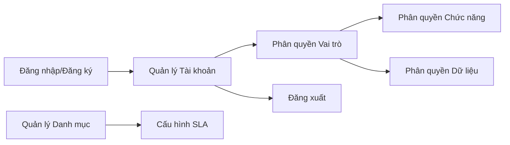
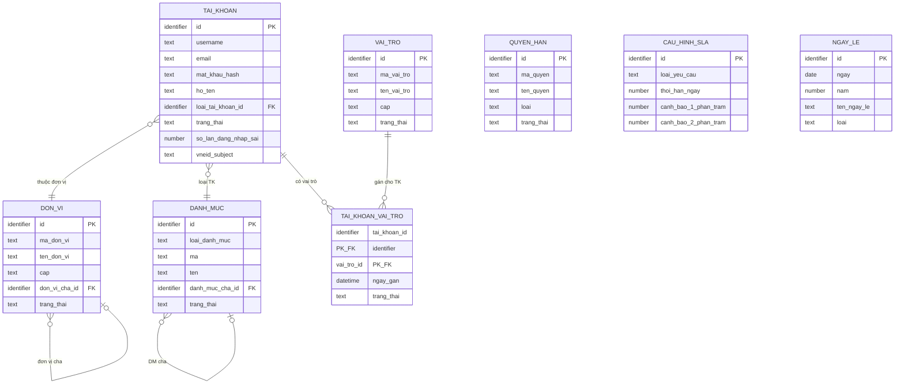
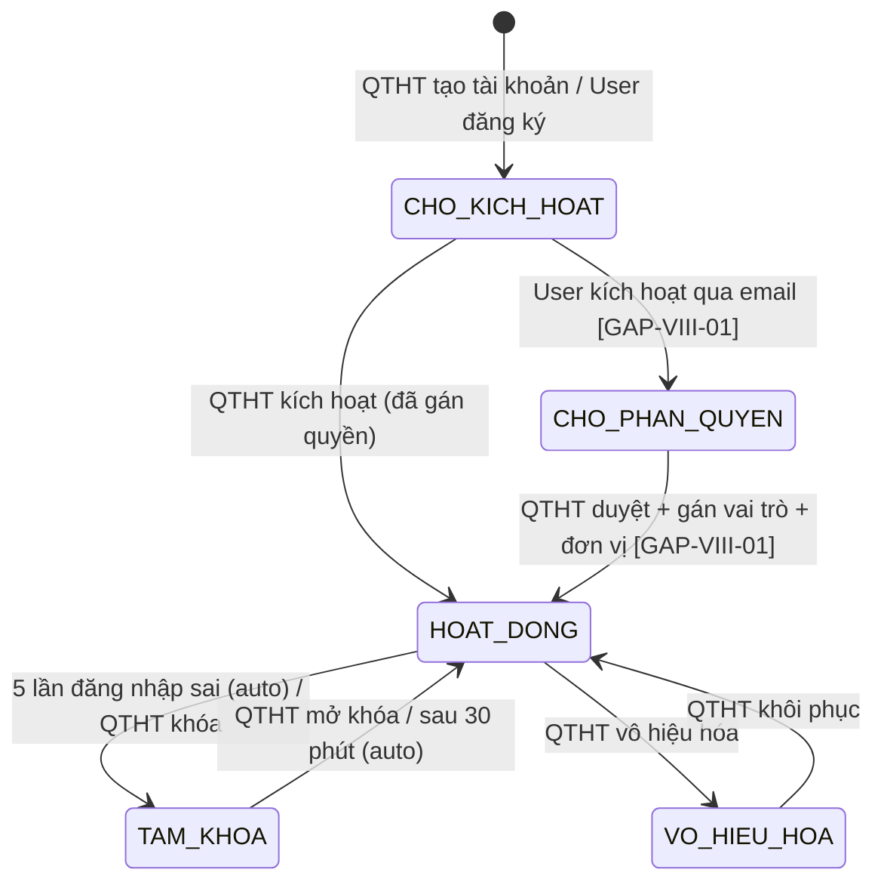

# SRS — Section 3.2.1: Quản trị Hệ thống

**Dự án:** Phần mềm hỗ trợ pháp lý doanh nghiệp
**Phiên bản SRS:** 3.0
**Nhóm:** VIII — Quản trị Hệ thống
**UC range:** UC 99 – UC 123
**Số FR:** 27 (gốc 25 + FR-VIII-28 `[GAP-VIII-02]` + FR-VIII-29 `[GAP-VIII-05]`)
**File chính:** `srs-v3.md` Section 3.2

---

## Lịch sử thay đổi

| Ngày | Tác giả | Mô tả thay đổi |
|------|---------|-----------------|
| 2026-04-03 | SRS Agent (Claude) | Tạo mới từ `srs-v3.md` theo Template v3.0 |
| 2026-04-16 | BA | Áp dụng CR đối tác: CR-02, CR-VIII-01, CR-VIII-02, CR-VIII-03, CR-VIII-04, CR-VIII-05, CR-VIII-06, CR-VIII-07, CR-VIII-08, CR-VIII-09, CR-VIII-10 |

---

## Mục lục file này

- [1. Tổng quan nhóm](#1-tổng-quan-nhóm)
- [2. Yêu cầu chức năng chi tiết](#2-yêu-cầu-chức-năng-chi-tiết)
- [3. Màn hình chức năng](#3-màn-hình-chức-năng)
- [4. Entity liên quan](#4-entity-liên-quan)
- [5. State Machine liên quan](#5-state-machine-liên-quan)
- [6. Business Rules liên quan](#6-business-rules-liên-quan)

---

## 1. Tổng quan nhóm

**Mục đích:** Quản lý danh mục hệ thống, phân quyền, tài khoản, đăng nhập — nền tảng cho toàn bộ hệ thống.

**Quy trình nghiệp vụ tổng quan:**

Nhóm VIII cung cấp nền tảng quản trị cho toàn bộ hệ thống: quản lý 14 loại danh mục dùng chung (lĩnh vực PL, loại hình HT, tình trạng vụ việc...), quản lý tài khoản người dùng theo mô hình RBAC (vai trò → quyền chức năng + quyền dữ liệu), cấu hình SLA thời hạn xử lý, và các chức năng xác thực (đăng nhập/đăng xuất, đăng ký tự phục vụ, tích hợp VNeID).

**Entity chính:** DANH_MUC, TAI_KHOAN, VAI_TRO, QUYEN_HAN, DON_VI, CAU_HINH_SLA, AUDIT_LOG

**Tác nhân chính:** Quản trị hệ thống (QTHT), ALL (đăng nhập/xuất)

---

## 2. Yêu cầu chức năng chi tiết

### SHARED TEMPLATE — CRUD Danh mục (TPL-DM-CRUD)

> Áp dụng cho: FR-VIII-01 đến FR-VIII-09, FR-VIII-11 đến FR-VIII-13, FR-VIII-18, FR-VIII-19 (15 UC danh mục)

**Preconditions chung:**

- User đã đăng nhập thành công (BR-AUTH-01)
- User có vai trò QTHT (Quản trị hệ thống)
- Session chưa hết hạn (BR-AUTH-06)

**Inputs chung (ngoài trường riêng):**

| # | Tên field | Kiểu logic | Bắt buộc | Ràng buộc | Mặc định | Nguồn |
|---|----------|-----------|----------|-----------|----------|-------|
| 1 | ma | text | Y | Duy nhất trong loại, max 20 ký tự | — | user input |
| 2 | ten | text | Y | Không trống | — | user input |
| 3 | mo_ta | text | N | — | — | user input |
| 4 | thu_tu | number | N | — | 0 | user input |
| 5 | trang_thai | boolean | Y | 1 = Hoạt động, 0 = Không hoạt động | 1 | user input |

**Processing chung — Xem danh sách (LIST):**

| Bước | Mô tả xử lý | BR áp dụng |
|------|-------------|-----------|
| 1 | Kiểm tra quyền QTHT | BR-AUTH-01, BR-AUTH-02 |
| 2 | Lấy danh sách danh mục theo loại, chỉ bản ghi chưa xóa | BR-DATA-01 |
| 3 | Áp dụng bộ lọc phân quyền theo đơn vị (QTHT bypass) | BR-AUTH-08 |
| 4 | Áp dụng phân trang (mặc định 20/trang, tối đa 100/trang) | BR-DATA-07 |
| 5 | Sắp xếp theo thu_tu tăng dần, ten tăng dần | — |
| 6 | Trả về danh sách + tổng số bản ghi | — |

**Processing chung — Thêm mới (CREATE):**

| Bước | Mô tả xử lý | BR áp dụng |
|------|-------------|-----------|
| 1 | Kiểm tra quyền QTHT | BR-AUTH-01 |
| 2 | Kiểm tra dữ liệu đầu vào: mã (unique trong loại danh mục), tên (không trống) | — |
| 3 | Kiểm tra không trùng mã trong cùng loại danh mục | — |
| 4 | Tạo bản ghi danh mục mới | BR-DATA-03 |
| 5 | Ghi nhật ký thao tác (hành động = 'CREATE') | BR-DATA-05 |
| 6 | Trả về bản ghi vừa tạo | — |

**Processing chung — Chỉnh sửa (UPDATE):**

| Bước | Mô tả xử lý | BR áp dụng |
|------|-------------|-----------|
| 1 | Kiểm tra quyền QTHT | BR-AUTH-01 |
| 2 | Kiểm tra bản ghi tồn tại và chưa bị xóa | BR-DATA-01 |
| 3 | Kiểm tra dữ liệu đầu vào tương tự CREATE | — |
| 4 | Kiểm tra không trùng mã (nếu đổi mã): loại trừ chính mình | — |
| 5 | Cập nhật bản ghi danh mục | — |
| 6 | Ghi nhật ký thao tác (hành động = 'UPDATE', giá trị cũ → mới) | BR-DATA-05 |
| 7 | Trả về bản ghi đã cập nhật | — |

**Processing chung — Xóa (soft delete):**

| Bước | Mô tả xử lý | BR áp dụng |
|------|-------------|-----------|
| 1 | Kiểm tra quyền QTHT | BR-AUTH-01 |
| 2 | Kiểm tra bản ghi tồn tại | — |
| 3 | Kiểm tra ràng buộc tham chiếu: nếu có entity khác đang tham chiếu → từ chối | — |
| 4 | Đánh dấu bản ghi là đã xóa (xóa mềm) | BR-DATA-01 |
| 5 | Ghi nhật ký thao tác (hành động = 'DELETE') | BR-DATA-05 |
| 6 | Trả về kết quả thành công | — |

**Processing chung — Tìm kiếm (SEARCH):**

| Bước | Mô tả xử lý | BR áp dụng |
|------|-------------|-----------|
| 1 | Nhận từ khóa từ đầu vào | — |
| 2 | Tìm kiếm danh mục theo loại, khớp từ khóa với mã hoặc tên, chỉ bản ghi chưa xóa | — |
| 3 | Phân trang + trả về kết quả | BR-DATA-07 |

**Outputs chung (LIST):**

| # | Tên | Kiểu logic | Điều kiện | Format |
|---|-----|-----------|-----------|--------|
| 1 | id | identifier | — | — |
| 2 | ma | text | — | — |
| 3 | ten | text | — | — |
| 4 | mo_ta | text | — | — |
| 5 | thu_tu | number | — | — |
| 6 | trang_thai | boolean | — | — |
| 7 | created_at | datetime | — | dd/mm/yyyy HH:mm |
| 8 | updated_at | datetime | — | dd/mm/yyyy HH:mm |
| 9 | total_count | number | — | — |

**Error Handling chung:**

| # | Điều kiện lỗi | Mã lỗi | Phản hồi hệ thống | Severity |
|---|--------------|--------|-------------------|----------|
| E1 | User không có quyền QTHT | ERR-AUTH-01 | "Bạn không có quyền thực hiện chức năng này" | ERROR |
| E2 | Session hết hạn | ERR-AUTH-02 | Redirect về trang đăng nhập | ERROR |
| E3 | Mã danh mục trùng | ERR-DM-01 | "Mã '{ma}' đã tồn tại trong danh mục {loai}" | ERROR |
| E4 | Tên danh mục trống | ERR-DM-02 | "Tên danh mục là bắt buộc" | ERROR |
| E5 | Bản ghi đang được tham chiếu | ERR-DM-03 | "Không thể xóa. Danh mục đang được sử dụng bởi {N} bản ghi {entity}" | ERROR |
| E6 | Bản ghi không tồn tại | ERR-DM-04 | "Bản ghi không tồn tại hoặc đã bị xóa" | ERROR |
| E7 | Mã vượt quá 20 ký tự | ERR-DM-05 | "Mã danh mục tối đa 20 ký tự" | ERROR |

**Acceptance Criteria chung:**

- **Given** QTHT đăng nhập thành công **When** truy cập danh mục {loại} **Then** hiển thị danh sách phân trang, sắp xếp theo tên
- **Given** QTHT thêm mới **When** nhập đủ trường bắt buộc (mã, tên) **Then** lưu thành công, hiển thị trong danh sách
- **Given** QTHT chỉnh sửa **When** thay đổi thông tin **Then** validate + lưu thành công
- **Given** QTHT xóa danh mục đang được tham chiếu **When** xác nhận xóa **Then** hệ thống từ chối + hiển thị cảnh báo liên kết
- **Given** QTHT tìm kiếm **When** nhập từ khóa **Then** hiển thị kết quả matching

---

### FR-VIII-01: Quản lý danh mục lĩnh vực pháp lý (UC99)

**UC Reference:** UC 99
**Source:** CĐT xác nhận
**Priority:** Essential
**Stability:** High
**Màn hình:** SCR-VIII-01 — [Quản lý Danh mục](#scr-viii-01-quản-lý-danh-mục)

**Mô tả:** Quản lý danh sách lĩnh vực pháp lý (Thuế, Lao động, Đất đai...) sử dụng thống nhất trong toàn hệ thống. Được tham chiếu bởi: HOI_DAP, VU_VIEC, TU_VAN_VIEN, BIEU_MAU, KHO_CAU_HOI, CAU_HINH_PHAN_CONG.

**Tác nhân:** Quản trị hệ thống

**Preconditions:** Theo TPL-DM-CRUD

**Inputs — trường riêng (bổ sung TPL-DM-CRUD):**

| # | Tên field | Kiểu logic | Bắt buộc | Ràng buộc | Mặc định | Nguồn |
|---|----------|-----------|----------|-----------|----------|-------|
| 1 | ma | text | Y | VD: THUE, LAO_DONG | — | user input |
| 2 | ten | text | Y | VD: "Thuế" | — | user input |
| 3 | mo_ta | text | N | — | — | user input |
| 4 | loai_danh_muc | text | Y (system) | = 'LINH_VUC_PL' | LINH_VUC_PL | system |

**Processing:** Theo TPL-DM-CRUD

**Business Rules áp dụng:**
- **BR-DATA-01**: Xóa mềm — Xem Phụ lục B (file chính)
- **BR-DATA-05**: Ghi nhật ký thao tác — Xem Phụ lục B (file chính)

**Outputs:** Theo TPL-DM-CRUD

**Postconditions:** Theo TPL-DM-CRUD

**Error Handling:** Theo TPL-DM-CRUD + ràng buộc xóa: kiểm tra tham chiếu từ HOI_DAP.linh_vuc_id, VU_VIEC.linh_vuc_id, TU_VAN_VIEN (mapping), CAU_HINH_PHAN_CONG.linh_vuc_id, KHO_CAU_HOI.linh_vuc_id

**Acceptance Criteria:** Theo TPL-DM-CRUD

**Seed Data:** Thuế, Lao động, Đất đai, Dân sự, Thương mại, Hình sự, Hành chính, Sở hữu trí tuệ, Doanh nghiệp, Đầu tư

---

### FR-VIII-02: Quản lý danh mục loại hình hỗ trợ (UC100)

**UC Reference:** UC 100
**Source:** CĐT xác nhận
**Priority:** Essential
**Stability:** High
**Màn hình:** SCR-VIII-01 — [Quản lý Danh mục](#scr-viii-01-quản-lý-danh-mục)

**Mô tả:** Quản lý danh sách loại hình hỗ trợ pháp lý.

**Tác nhân:** Quản trị hệ thống

**Template:** TPL-DM-CRUD

**Inputs — trường riêng:**

| # | Tên field | Kiểu logic | Bắt buộc | Ràng buộc | Mặc định | Nguồn |
|---|----------|-----------|----------|-----------|----------|-------|
| 1 | ma | text | Y | VD: TU_VAN, DAO_TAO | — | user input |
| 2 | ten | text | Y | — | — | user input |
| 3 | loai_danh_muc | text | Y (system) | = 'LOAI_HINH_HO_TRO' | LOAI_HINH_HO_TRO | system |

**Seed Data:** Tư vấn PL, Tham gia tố tụng, Đào tạo/bồi dưỡng, Hòa giải, Đại diện ngoài tố tụng

---

### FR-VIII-03: Quản lý danh mục chương trình hỗ trợ (UC101)

**UC Reference:** UC 101
**Source:** CĐT xác nhận
**Priority:** Essential
**Stability:** High
**Màn hình:** SCR-VIII-01 — [Quản lý Danh mục](#scr-viii-01-quản-lý-danh-mục)

**Tác nhân:** Quản trị hệ thống
**Template:** TPL-DM-CRUD

**Inputs — trường riêng:**

| # | Tên field | Kiểu logic | Bắt buộc | Ràng buộc | Mặc định | Nguồn |
|---|----------|-----------|----------|-----------|----------|-------|
| 1 | ma | text | Y | — | — | user input |
| 2 | ten | text | Y | — | — | user input |
| 3 | thoi_gian_bat_dau | date | Y | Ngày bắt đầu CT | — | user input |
| 4 | thoi_gian_ket_thuc | date | N | Ngày kết thúc CT | — | user input |
| 5 | don_vi_chu_tri | text | Y | Đơn vị chủ trì | — | user input |
| 6 | loai_danh_muc | text | Y (system) | = 'CHUONG_TRINH_HT' | CHUONG_TRINH_HT | system |

**Ràng buộc xóa:** Kiểm tra tham chiếu từ CHUONG_TRINH_HTPL (nhóm XI)

---

### FR-VIII-04: Quản lý danh mục tình trạng vụ việc (UC102)

**UC Reference:** UC 102
**Source:** CĐT xác nhận
**Priority:** Essential
**Stability:** High
**Màn hình:** SCR-VIII-01 — [Quản lý Danh mục](#scr-viii-01-quản-lý-danh-mục)

**Tác nhân:** Quản trị hệ thống
**Template:** TPL-DM-CRUD

**Inputs — trường riêng:**

| # | Tên field | Kiểu logic | Bắt buộc | Ràng buộc | Mặc định | Nguồn |
|---|----------|-----------|----------|-----------|----------|-------|
| 1 | ma | text | Y | VD: MOI, DANG_XU_LY | — | user input |
| 2 | ten | text | Y | — | — | user input |
| 3 | thu_tu | number | Y | Thứ tự hiển thị trong workflow | — | user input |
| 4 | mau_hien_thi | text | N | Mã màu HEX (VD: #FF0000) | — | user input |
| 5 | loai_danh_muc | text | Y (system) | = 'TINH_TRANG_VU_VIEC' | TINH_TRANG_VU_VIEC | system |

**Seed Data:** Mới tiếp nhận, Đang kiểm tra, Đã phân công, Đang xử lý, Chờ bổ sung, Hoàn thành, Từ chối

---

### FR-VIII-05: Quản lý danh mục cơ quan đơn vị quản lý (UC103)

**UC Reference:** UC 103
**Source:** CĐT xác nhận
**Priority:** Essential
**Stability:** High
**Màn hình:** SCR-VIII-01 — [Quản lý Danh mục](#scr-viii-01-quản-lý-danh-mục)

**Mô tả:** Quản lý đơn vị theo **mô hình 2-tier với 3 loại đơn vị** (TW, BN, ĐP). TW là parent duy nhất; BN và ĐP là 2 loại đơn vị ngang cấp song song dưới TW, không có nested depth sâu hơn (BN không có ĐP trực thuộc — theo BR-AUTH-02). Sử dụng entity DON_VI riêng (không dùng bảng DANH_MUC chung).

**Tác nhân:** Quản trị hệ thống

**Preconditions:**
- User đã đăng nhập, vai trò QTHT

**Inputs:**

| # | Tên field | Kiểu logic | Bắt buộc | Ràng buộc | Mặc định | Nguồn |
|---|----------|-----------|----------|-----------|----------|-------|
| 1 | ma_don_vi | text | Y | Unique | — | user input |
| 2 | ten_don_vi | text | Y | — | — | user input |
| 3 | cap | text | Y | TW / BN / DP | — | user input |
| 4 | don_vi_cha_id | identifier | Y (nếu BN/DP) | Tham chiếu DON_VI | — | user input |
| 5 | dia_chi | text | N | — | — | user input |
| 6 | dien_thoai | text | N | — | — | user input |
| 7 | email | text | N | — | — | user input |
| 8 | trang_thai | boolean | Y | 1 = Hoạt động | 1 | user input |

**Processing:**

| Bước | Mô tả xử lý | BR áp dụng |
|------|-------------|-----------|
| 1 | Kiểm tra quyền QTHT | BR-AUTH-01 |
| 2 | Kiểm tra dữ liệu: ma_don_vi unique, cap thuộc (TW, BN, DP) | — |
| 3 | Nếu cap = BN hoặc DP → don_vi_cha_id bắt buộc, kiểm tra đơn vị cha tồn tại VÀ **đơn vị cha phải có cap = TW** (enforce mô hình 2-tier, BR-AUTH-02) | BR-AUTH-02 |
| 4 | Kiểm tra không tạo vòng lặp trong cây đơn vị (2-tier nên chỉ có 1 cấp cha, vòng lặp không khả thi nhưng vẫn guard) | — |
| 5 | Tạo bản ghi DON_VI | BR-DATA-03 |
| 6 | Ghi nhật ký thao tác | BR-DATA-05 |

**Outputs:**

| # | Tên | Kiểu logic | Điều kiện | Format |
|---|-----|-----------|-----------|--------|
| 1 | id | identifier | — | — |
| 2 | ma_don_vi | text | — | — |
| 3 | ten_don_vi | text | — | — |
| 4 | cap | text | — | TW/BN/DP |
| 5 | don_vi_cha_id | identifier | — | — |
| 6 | ten_don_vi_cha | text | — | — |
| 7 | trang_thai | boolean | — | — |

**Postconditions:**
- Bản ghi DON_VI được tạo/cập nhật/xóa mềm
- Cây đơn vị duy trì tính toàn vẹn phân cấp

**Error Handling:**

| # | Điều kiện lỗi | Mã lỗi | Phản hồi hệ thống | Severity |
|---|--------------|--------|-------------------|----------|
| E1 | Mã đơn vị trùng | ERR-DV-01 | "Mã đơn vị '{ma}' đã tồn tại" | ERROR |
| E2 | Cấp BN/DP thiếu đơn vị cha | ERR-DV-02 | "Cấp {cap} phải có đơn vị cha" | ERROR |
| E3 | Đơn vị có tài khoản liên kết | ERR-DV-03 | "Không thể xóa. Đơn vị có {N} tài khoản liên kết" | ERROR |
| E4 | Đơn vị có dữ liệu nghiệp vụ | ERR-DV-04 | "Không thể xóa. Đơn vị có {N} bản ghi dữ liệu" | ERROR |
| E5 | Vòng lặp cây đơn vị | ERR-DV-05 | "Không thể tạo vòng lặp phân cấp" | ERROR |

**Acceptance Criteria:**
- **Given** QTHT truy cập "Cơ quan ĐV" **When** hệ thống hiển thị **Then** danh sách cơ quan theo cây đơn vị (TW → BN → ĐP), phân trang
- **Given** QTHT thêm mới **When** nhập đủ trường bắt buộc **Then** lưu thành công
- **Given** QTHT xóa cơ quan có tài khoản/dữ liệu liên kết **When** xác nhận **Then** từ chối + cảnh báo

**Seed Data:** Cục BLDS&KT (TW), 63 Sở Tư pháp (ĐP), 20+ Bộ/Ngành (BN)

---

### FR-VIII-06: Quản lý danh mục tổ chức tư vấn (UC104)

> **[ĐÃ CHUYỂN]** Quản lý Tổ chức tư vấn đã chuyển sang Nhóm IV — xem FR-IV-NEW-01. `[CR-02]`

**UC Reference:** UC 104
**Priority:** Essential | **Stability:** High
**Màn hình:** SCR-VIII-01
**Template:** TPL-DM-CRUD

**Inputs — trường riêng:**

| # | Tên field | Kiểu logic | Bắt buộc | Ràng buộc | Mặc định | Nguồn |
|---|----------|-----------|----------|-----------|----------|-------|
| 1 | ma | text | Y | — | — | user input |
| 2 | ten | text | Y | Tên tổ chức tư vấn | — | user input |
| 3 | dia_chi | text | N | — | — | user input |
| 4 | linh_vuc | text | N | Lĩnh vực hoạt động | — | user input |
| 5 | loai_danh_muc | text | Y (system) | = 'TO_CHUC_TU_VAN' | TO_CHUC_TU_VAN | system |

**Ràng buộc xóa:** Kiểm tra tham chiếu từ TU_VAN_VIEN (TVV liên kết tổ chức)

---

### FR-VIII-07: Quản lý danh mục loại doanh nghiệp (UC105)

**UC Reference:** UC 105
**Priority:** Essential | **Stability:** High
**Màn hình:** SCR-VIII-01
**Template:** TPL-DM-CRUD

**Inputs — trường riêng:**

| # | Tên field | Kiểu logic | Bắt buộc | Ràng buộc | Mặc định | Nguồn |
|---|----------|-----------|----------|-----------|----------|-------|
| 1 | ma | text | Y | VD: SIEU_NHO, NHO, VUA | — | user input |
| 2 | ten | text | Y | — | — | user input |
| 3 | tieu_chi_doanh_thu | text | N | Tiêu chí doanh thu (NĐ39/2018) | — | user input |
| 4 | tieu_chi_lao_dong | text | N | Tiêu chí số lao động | — | user input |
| 5 | loai_danh_muc | text | Y (system) | = 'LOAI_DOANH_NGHIEP' | LOAI_DOANH_NGHIEP | system |

**Seed Data:** DN siêu nhỏ, DN nhỏ, DN vừa (theo Luật DNNVV 2017 + NĐ39/2018)

---

### FR-VIII-08: Quản lý danh mục hồ sơ đề nghị hỗ trợ (UC106)

**UC Reference:** UC 106
**Priority:** Essential | **Stability:** High
**Màn hình:** SCR-VIII-01
**Template:** TPL-DM-CRUD

**Inputs — trường riêng:**

| # | Tên field | Kiểu logic | Bắt buộc | Ràng buộc | Mặc định | Nguồn |
|---|----------|-----------|----------|-----------|----------|-------|
| 1 | ma | text | Y | — | — | user input |
| 2 | ten | text | Y | — | — | user input |
| 3 | thanh_phan_bat_buoc | structured | N | Danh sách thành phần HS bắt buộc | — | user input |
| 4 | thanh_phan_tuy_chon | structured | N | Danh sách thành phần tùy chọn | — | user input |
| 5 | loai_danh_muc | text | Y (system) | = 'HO_SO_DE_NGHI_HT' | HO_SO_DE_NGHI_HT | system |

---

### FR-VIII-09: Quản lý danh mục hồ sơ đề nghị thanh toán (UC107)

**UC Reference:** UC 107
**Priority:** Essential | **Stability:** High
**Màn hình:** SCR-VIII-01
**Template:** TPL-DM-CRUD

**Inputs — trường riêng:**

| # | Tên field | Kiểu logic | Bắt buộc | Ràng buộc | Mặc định | Nguồn |
|---|----------|-----------|----------|-----------|----------|-------|
| 1 | ma | text | Y | — | — | user input |
| 2 | ten | text | Y | — | — | user input |
| 3 | thanh_phan_ho_so | structured | N | Thành phần HS | — | user input |
| 4 | loai_danh_muc | text | Y (system) | = 'HO_SO_DE_NGHI_TT' | HO_SO_DE_NGHI_TT | system |

---

### FR-VIII-10: Quản lý cấu hình thời hạn xử lý hồ sơ — SLA (UC108)

**UC Reference:** UC 108
**Source:** CĐT xác nhận
**Priority:** Essential
**Stability:** High
**Màn hình:** SCR-VIII-06 — [Cấu hình Hệ thống, Tab 1: SLA](#scr-viii-06-cấu-hình-hệ-thống-mh-107--man-hinh-moi-v21)

**Mô tả:** Cấu hình thời hạn xử lý và mức cảnh báo SLA cho từng loại yêu cầu. Sử dụng entity CAU_HINH_SLA riêng.

**Tác nhân:** Quản trị hệ thống

**Preconditions:**
- User đã đăng nhập, vai trò QTHT

**Inputs:**

| # | Tên field | Kiểu logic | Bắt buộc | Ràng buộc | Mặc định | Nguồn |
|---|----------|-----------|----------|-----------|----------|-------|
| 1 | loai_yeu_cau | text | Y | UNIQUE: HOI_DAP, VU_VIEC, HO_SO_HT, HO_SO_TT | — | system |
| 2 | ten_loai | text | Y | Tên hiển thị loại YC | — | user input |
| 3 | thoi_han_ngay | number | Y | Số ngày làm việc xử lý, > 0 | — | user input |
| 4 | canh_bao_1_phan_tram | number | Y | Mức CB1 (% thời hạn) | 50 | user input |
| 5 | canh_bao_2_phan_tram | number | Y | Mức CB2 (% thời hạn), CB1 < CB2 < 100 | 90 | user input |
| 6 | qua_han_phan_tram | number | Y | = 100% | 100 | system |
| 7 | gui_email_canh_bao | boolean | Y | Gửi email khi chuyển mức | 1 | user input |
| 8 | gui_thong_bao_app | boolean | Y | Gửi thông báo in-app | 1 | user input |

**Processing:**

| Bước | Mô tả xử lý | BR áp dụng |
|------|-------------|-----------|
| 1 | Kiểm tra quyền QTHT | BR-AUTH-01 |
| 2 | Kiểm tra dữ liệu: thoi_han_ngay > 0, canh_bao_1 < canh_bao_2 < 100 | BR-SLA-01 |
| 3 | Kiểm tra loai_yeu_cau unique | — |
| 4 | Tạo hoặc cập nhật bản ghi CAU_HINH_SLA | — |
| 5 | Ghi nhật ký thao tác | BR-DATA-05 |
| 6 | Tác vụ kiểm tra SLA sẽ sử dụng cấu hình này để tính deadline | BR-CALC-03 |

**Outputs:**

| # | Tên | Kiểu logic | Điều kiện | Format |
|---|-----|-----------|-----------|--------|
| 1 | id | identifier | — | — |
| 2 | loai_yeu_cau | text | — | — |
| 3 | ten_loai | text | — | — |
| 4 | thoi_han_ngay | number | — | — |
| 5 | canh_bao_1_phan_tram | number | — | % |
| 6 | canh_bao_2_phan_tram | number | — | % |

**Postconditions:**
- Cấu hình SLA được lưu/cập nhật
- Các hồ sơ MỚI tiếp nhận sau thời điểm cập nhật sẽ áp dụng cấu hình mới
- Hồ sơ đang xử lý giữ nguyên deadline cũ

**Error Handling:**

| # | Điều kiện lỗi | Mã lỗi | Phản hồi hệ thống | Severity |
|---|--------------|--------|-------------------|----------|
| E1 | thoi_han_ngay <= 0 | ERR-SLA-01 | "Thời hạn xử lý phải là số nguyên dương" | ERROR |
| E2 | canh_bao_1 >= canh_bao_2 | ERR-SLA-02 | "Mức cảnh báo 1 phải nhỏ hơn mức cảnh báo 2" | ERROR |
| E3 | loai_yeu_cau trùng | ERR-SLA-03 | "Loại yêu cầu đã có cấu hình SLA" | ERROR |

**Acceptance Criteria:**
- **Given** QTHT truy cập "Cấu hình SLA" **When** hệ thống hiển thị **Then** danh sách cấu hình SLA theo loại yêu cầu
- **Given** QTHT thêm mới cấu hình **When** nhập đủ trường **Then** lưu thành công
- **Given** QTHT chỉnh sửa **When** thay đổi thời hạn hoặc mức cảnh báo **Then** validate + lưu

**Seed Data:**

| Loại YC | Thời hạn (ngày LV) | CB1 (%) | CB2 (%) | Quá hạn (%) |
|---------|-------------------|---------|---------|-------------|
| VU_VIEC | 10 | 50 | 90 | 100 |
| HO_SO_HT | 15 | 50 | 90 | 100 |
| HO_SO_TT | 10 | 50 | 90 | 100 |
| HOI_DAP | 5 | 50 | 90 | 100 |

---

### FR-VIII-11: Quản lý danh mục tiêu chí đánh giá hiệu quả (UC109)

**UC Reference:** UC 109
**Priority:** Essential | **Stability:** Medium
**Màn hình:** SCR-VIII-01
**Template:** TPL-DM-CRUD (mở rộng)

**Inputs — trường riêng:**

| # | Tên field | Kiểu logic | Bắt buộc | Ràng buộc | Mặc định | Nguồn |
|---|----------|-----------|----------|-----------|----------|-------|
| 1 | ma | text | Y | — | — | user input |
| 2 | ten | text | Y | — | — | user input |
| 3 | trong_so | number | Y | 0-100%, tổng tất cả tiêu chí = 100% | — | user input |
| 4 | thang_diem_min | number | Y | VD: 1 | — | user input |
| 5 | thang_diem_max | number | Y | VD: 5 hoặc 10, phải > thang_diem_min | — | user input |
| 6 | loai_danh_muc | text | Y (system) | = 'TIEU_CHI_DG_HIEU_QUA' | TIEU_CHI_DG_HIEU_QUA | system |

**Processing bổ sung:**

| Bước | Mô tả xử lý | BR áp dụng |
|------|-------------|-----------|
| 7 | Sau mỗi tạo/cập nhật: kiểm tra tổng trọng số = 100% cho toàn bộ tiêu chí hoạt động | BR-CALC-04 |
| 8 | Nếu tổng != 100%: hiển thị cảnh báo (vẫn cho lưu) | — |

**Error Handling bổ sung:**

| # | Điều kiện lỗi | Mã lỗi | Phản hồi hệ thống | Severity |
|---|--------------|--------|-------------------|----------|
| E1 | Tổng trọng số != 100% | WRN-TC-01 | "Tổng trọng số hiện tại: {X}%. Cần đảm bảo = 100% trước khi sử dụng" | WARNING |
| E2 | thang_diem_min >= thang_diem_max | ERR-TC-01 | "Điểm tối thiểu phải nhỏ hơn điểm tối đa" | ERROR |

---

### FR-VIII-12: Quản lý danh mục tiêu chí đánh giá hỗ trợ chi phí (UC110)

**UC Reference:** UC 110
**Priority:** Essential | **Stability:** Medium
**Màn hình:** SCR-VIII-01
**Template:** TPL-DM-CRUD (mở rộng)

**Inputs — trường riêng:**

| # | Tên field | Kiểu logic | Bắt buộc | Ràng buộc | Mặc định | Nguồn |
|---|----------|-----------|----------|-----------|----------|-------|
| 1 | ma | text | Y | VD: SIEU_NHO, NHO, VUA | — | user input |
| 2 | ten | text | Y | — | — | user input |
| 3 | quy_mo_dn | text | Y | SIEU_NHO / NHO / VUA | — | user input |
| 4 | muc_ho_tro_phan_tram | number | Y | VD: 100, 30, 10 | — | user input |
| 5 | tran_ho_tro_nam | money | Y | VNĐ/năm | — | user input |
| 6 | loai_danh_muc | text | Y (system) | = 'TIEU_CHI_DG_CHI_PHI' | TIEU_CHI_DG_CHI_PHI | system |

**Seed Data (NĐ18/2026):** Siêu nhỏ: 100%, 3.000.000 VNĐ | Nhỏ: <=30%, 5.000.000 VNĐ | Vừa: <=10%, 10.000.000 VNĐ

---

### FR-VIII-13: Quản lý loại tài khoản (UC111)

**UC Reference:** UC 111
**Priority:** Essential | **Stability:** High
**Màn hình:** SCR-VIII-01
**Template:** TPL-DM-CRUD

**Inputs — trường riêng:**

| # | Tên field | Kiểu logic | Bắt buộc | Ràng buộc | Mặc định | Nguồn |
|---|----------|-----------|----------|-----------|----------|-------|
| 1 | ma | text | Y | — | — | user input |
| 2 | ten | text | Y | — | — | user input |
| 3 | loai_danh_muc | text | Y (system) | = 'LOAI_TAI_KHOAN' | LOAI_TAI_KHOAN | system |

**Seed Data:** CB NV TW, CB NV BN, CB NV ĐP, CB PD TW, CB PD BN, CB PD ĐP, TVV, CG, DN, NHT, QTHT
**Ràng buộc xóa:** Kiểm tra TAI_KHOAN.loai_tai_khoan

---

### FR-VIII-14: Quản lý vai trò (UC112)

**UC Reference:** UC 112
**Source:** CĐT xác nhận
**Priority:** Essential
**Stability:** High
**Màn hình:** SCR-VIII-02 — [Quản lý Vai trò](#scr-viii-02-quản-lý-vai-trò)

**Mô tả:** Quản lý vai trò hệ thống (CRUD). Sử dụng entity VAI_TRO riêng.

**Tác nhân:** Quản trị hệ thống

**Preconditions:**
- User đã đăng nhập, vai trò QTHT

**Inputs:**

| # | Tên field | Kiểu logic | Bắt buộc | Ràng buộc | Mặc định | Nguồn |
|---|----------|-----------|----------|-----------|----------|-------|
| 1 | ma_vai_tro | text | Y | Unique | — | user input |
| 2 | ten_vai_tro | text | Y | — | — | user input |
| 3 | mo_ta | text | N | — | — | user input |
| 4 | trang_thai | boolean | Y | 1 = Hoạt động | 1 | user input |

**Processing:**

| Bước | Mô tả xử lý | BR áp dụng |
|------|-------------|-----------|
| 1 | Kiểm tra quyền QTHT | BR-AUTH-01 |
| 2 | Kiểm tra dữ liệu: ma_vai_tro unique, ten_vai_tro không trống | — |
| 3 | Tạo / cập nhật / xóa mềm bản ghi VAI_TRO | BR-DATA-01, BR-DATA-03 |
| 4 | Ghi nhật ký thao tác | BR-DATA-05 |

**Outputs:**

| # | Tên | Kiểu logic | Điều kiện | Format |
|---|-----|-----------|-----------|--------|
| 1 | id | identifier | — | — |
| 2 | ma_vai_tro | text | — | — |
| 3 | ten_vai_tro | text | — | — |
| 4 | so_tai_khoan | number | — | Số TK đang gán |
| 5 | so_quyen | number | — | Số quyền đã gán |

**Error Handling:**

| # | Điều kiện lỗi | Mã lỗi | Phản hồi hệ thống | Severity |
|---|--------------|--------|-------------------|----------|
| E1 | Mã vai trò trùng | ERR-VT-01 | "Mã vai trò '{ma}' đã tồn tại" | ERROR |
| E2 | Vai trò đang gán cho TK | ERR-VT-02 | "Không thể xóa. Vai trò đang gán cho {N} tài khoản" | ERROR |

**Postconditions:**
- Bản ghi VAI_TRO được tạo/cập nhật/xóa mềm
- Nhật ký ghi nhận thao tác

**Acceptance Criteria:**
- **Given** QTHT truy cập "Quản lý vai trò" **When** hiển thị **Then** danh sách vai trò, phân trang
- **Given** QTHT thêm mới vai trò **When** nhập đủ trường **Then** lưu thành công
- **Given** QTHT xóa vai trò đang gán cho tài khoản **When** xác nhận **Then** từ chối + cảnh báo

---

### FR-VIII-15: Quản lý tài khoản người dùng (UC113)

**UC Reference:** UC 113
**Source:** CĐT xác nhận
**Priority:** Essential
**Stability:** High
**Màn hình:** SCR-VIII-03 — [Quản lý Tài khoản NSD](#scr-viii-03-quản-lý-tài-khoản-nsd)

**Mô tả:** Quản lý tài khoản người dùng hệ thống (CRUD + khóa/mở khóa). Quy trình tạo TK trong FR này cũng được hệ thống tự gọi từ các workflow khác — vd: FR-IV-07 (CB Phê duyệt duyệt TVV) tự gọi quy trình tạo TK với hệ thống là tác nhân thay Quản trị HT để cấp tài khoản tự động cho TVV/CG; FR-IV-NHT-01 (tạo NHT) tạo TK trực tiếp theo workflow riêng (xem note nội bộ srs-fr-04).

**Tác nhân:** Quản trị hệ thống (qua giao diện); Hệ thống (gọi tự động từ workflow khác như FR-IV-07)

**Preconditions:**
- User đã đăng nhập, vai trò QTHT

**Inputs:**

| # | Tên field | Kiểu logic | Bắt buộc | Ràng buộc | Mặc định | Nguồn |
|---|----------|-----------|----------|-----------|----------|-------|
| 1 | username | text | Y | Unique, 4-50 ký tự, không ký tự đặc biệt | — | user input |
| 2 | email | text | Y | Unique, format email hợp lệ | — | user input |
| 3 | ho_ten | text | Y | — | — | user input |
| 4 | dien_thoai | text | N | — | — | user input |
| 5 | mat_khau | text | Y (tạo mới) | Ít nhất 8 ký tự, gồm chữ hoa + chữ thường + số + ký tự đặc biệt `[GAP-VIII-04]` | — | user input |
| 6 | vai_tro_ids | identifier[] | Y | Danh sách ID vai trò | — | user input |
| 7 | don_vi_id | identifier | Y | Tham chiếu DON_VI | — | user input |
| 8 | loai_tai_khoan | text | Y | Loại TK (từ UC111) | — | user input |
| 9 | trang_thai | text | Y | CHO_KICH_HOAT / HOAT_DONG / TAM_KHOA / VO_HIEU_HOA | CHO_KICH_HOAT | system |

**Processing:**

| Bước | Mô tả xử lý | BR áp dụng |
|------|-------------|-----------|
| 1 | Kiểm tra quyền QTHT | BR-AUTH-01 |
| 2 | Kiểm tra dữ liệu: username unique, email unique, format hợp lệ | — |
| 3 | Kiểm tra mật khẩu đủ độ mạnh: >= 8 ký tự, chứa chữ hoa + chữ thường + số + ký tự đặc biệt `[GAP-VIII-04]` | — |
| 4 | Mã hóa mật khẩu (hash) | — |
| 5 | Tạo bản ghi TAI_KHOAN | BR-DATA-03 |
| 6 | Tạo liên kết tài khoản ↔ vai trò (N-N) cho mỗi vai trò được chọn | — |
| 7 | Gửi email kích hoạt (nếu tạo mới) | — |
| 8 | Ghi nhật ký thao tác | BR-DATA-05 |

**Outputs:**

| # | Tên | Kiểu logic | Điều kiện | Format |
|---|-----|-----------|-----------|--------|
| 1 | id | identifier | — | — |
| 2 | username | text | — | — |
| 3 | email | text | — | — |
| 4 | ho_ten | text | — | — |
| 5 | ten_don_vi | text | — | — |
| 6 | ten_vai_tro | text[] | — | danh sách vai trò |
| 7 | loai_tai_khoan | text | — | — |
| 8 | trang_thai | text | — | — |
| 9 | ngay_tao | datetime | — | dd/mm/yyyy HH:mm |
| 10 | lan_dang_nhap_cuoi | datetime | — | dd/mm/yyyy HH:mm |

**Error Handling:**

| # | Điều kiện lỗi | Mã lỗi | Phản hồi hệ thống | Severity |
|---|--------------|--------|-------------------|----------|
| E1 | Username trùng | ERR-TK-01 | "Username '{username}' đã tồn tại" | ERROR |
| E2 | Email trùng | ERR-TK-02 | "Email '{email}' đã được sử dụng" | ERROR |
| E3 | Mật khẩu yếu | ERR-TK-03 | "Mật khẩu phải >= 8 ký tự, chứa chữ hoa, chữ thường, số và ký tự đặc biệt" `[GAP-VIII-04]` | ERROR |
| E4 | Username chứa ký tự đặc biệt | ERR-TK-04 | "Username chỉ chấp nhận chữ cái, số và dấu gạch dưới" | ERROR |
| E5 | Đơn vị không tồn tại | ERR-TK-05 | "Đơn vị không tồn tại hoặc đã bị vô hiệu hóa" | ERROR |
| E6 | Vai trò không tồn tại | ERR-TK-06 | "Vai trò ID {id} không tồn tại" | ERROR |

**Postconditions:**
- Bản ghi TAI_KHOAN được tạo/cập nhật/khóa/mở khóa
- Liên kết tài khoản ↔ vai trò được cập nhật
- Email kích hoạt được gửi (nếu tạo mới)
- Nhật ký ghi nhận thao tác

**Acceptance Criteria:**
- **Given** QTHT truy cập "Quản lý tài khoản" **When** hiển thị **Then** danh sách TK, phân trang, lọc theo vai trò/đơn vị/trạng thái
- **Given** QTHT thêm mới TK **When** nhập đủ trường **Then** tạo TK + gửi email kích hoạt
- **Given** QTHT khóa tài khoản **When** xác nhận **Then** TK bị vô hiệu hóa
- **Given** QTHT mở khóa tài khoản **When** xác nhận **Then** TK được kích hoạt lại

---

### FR-VIII-16: Phân quyền truy cập dữ liệu (UC114)

**UC Reference:** UC 114
**Source:** CĐT xác nhận
**Priority:** Essential
**Stability:** High
**Màn hình:** SCR-VIII-05 — [Phân quyền Dữ liệu](#scr-viii-05-phân-quyền-dữ-liệu)

**Mô tả:** Phân quyền xem dữ liệu theo đơn vị cho vai trò. Quy tắc: ngang cấp KHÔNG thấy nhau, cha thấy con.

**Tác nhân:** Quản trị hệ thống

**Preconditions:**
- User đã đăng nhập, vai trò QTHT
- Vai trò đã tồn tại (UC112)
- Đơn vị đã tồn tại (UC103)

**Inputs:**

| # | Tên field | Kiểu logic | Bắt buộc | Ràng buộc | Mặc định | Nguồn |
|---|----------|-----------|----------|-----------|----------|-------|
| 1 | vai_tro_id | identifier | Y | Tham chiếu VAI_TRO | — | user input |
| 2 | don_vi_ids | identifier[] | Y | Danh sách đơn vị được phép xem | — | user input |
| 3 | entity_type | text | N | Loại entity (null = tất cả) | null | user input |

**Processing:**

| Bước | Mô tả xử lý | BR áp dụng |
|------|-------------|-----------|
| 1 | Kiểm tra quyền QTHT | BR-AUTH-01 |
| 2 | Kiểm tra vai trò tồn tại | — |
| 3 | Kiểm tra đơn vị tồn tại | — |
| 4 | Kiểm tra quy tắc: ngang cấp KHÔNG thấy nhau | BR-AUTH-03 |
| 5 | Kiểm tra quy tắc: cấp cha thấy cấp con | BR-AUTH-04 |
| 6 | Xóa toàn bộ quyền dữ liệu cũ + tạo quyền mới cho vai trò (trong 1 giao dịch) | — |
| 7 | Cập nhật bộ nhớ đệm chính sách phân quyền theo đơn vị | BR-AUTH-08 |
| 8 | Ghi nhật ký thao tác | BR-DATA-05 |

**Error Handling:**

| # | Điều kiện lỗi | Mã lỗi | Phản hồi hệ thống | Severity |
|---|--------------|--------|-------------------|----------|
| E1 | Vi phạm quy tắc ngang cấp | ERR-PQ-01 | "Không thể gán quyền xem đơn vị {A} cho vai trò thuộc đơn vị {B} (ngang cấp)" | ERROR |
| E2 | Vai trò không tồn tại | ERR-PQ-02 | "Vai trò không tồn tại" | ERROR |
| E3 | Đơn vị không tồn tại | ERR-PQ-03 | "Đơn vị ID {id} không tồn tại" | ERROR |

**Postconditions:**
- Quyền dữ liệu của vai trò được cập nhật (xóa cũ + tạo mới)
- Bộ nhớ đệm chính sách phân quyền được làm mới
- Nhật ký ghi nhận thao tác

**Acceptance Criteria:**
- **Given** QTHT truy cập "Phân quyền dữ liệu" **When** chọn vai trò X **Then** hiển thị danh sách quyền dữ liệu hiện tại
- **Given** QTHT gán quyền dữ liệu cho vai trò X tại đơn vị Y **When** lưu **Then** user thuộc vai trò X chỉ thấy dữ liệu đơn vị Y
- Quy tắc: Ngang cấp KHÔNG thấy nhau, cha thấy con

---

### FR-VIII-17: Phân quyền chức năng (UC115)

**UC Reference:** UC 115
**Source:** CĐT xác nhận
**Priority:** Essential
**Stability:** High
**Màn hình:** SCR-VIII-04 — [Phân quyền Chức năng](#scr-viii-04-phân-quyền-chức-năng)

**Mô tả:** Phân quyền truy cập menu/chức năng cho vai trò qua ma trận checkbox.

**Tác nhân:** Quản trị hệ thống

**Preconditions:**
- User đã đăng nhập, vai trò QTHT
- Vai trò đã tồn tại (UC112)

**Inputs:**

| # | Tên field | Kiểu logic | Bắt buộc | Ràng buộc | Mặc định | Nguồn |
|---|----------|-----------|----------|-----------|----------|-------|
| 1 | vai_tro_id | identifier | Y | Tham chiếu VAI_TRO | — | user input |
| 2 | quyen_ids | identifier[] | Y | Danh sách quyền chức năng bật/tắt | — | user input |

**Processing:**

| Bước | Mô tả xử lý | BR áp dụng |
|------|-------------|-----------|
| 1 | Kiểm tra quyền QTHT | BR-AUTH-01 |
| 2 | Kiểm tra vai trò tồn tại | — |
| 3 | Tải cây menu (danh sách quyền hệ thống) | — |
| 4 | Xóa toàn bộ quyền cũ + tạo quyền mới cho vai trò | — |
| 5 | Ghi nhật ký thao tác (quyền cũ → quyền mới) | BR-DATA-05 |

**Error Handling:**

| # | Điều kiện lỗi | Mã lỗi | Phản hồi hệ thống | Severity |
|---|--------------|--------|-------------------|----------|
| E1 | Vai trò không tồn tại | ERR-PQ-02 | "Vai trò không tồn tại" | ERROR |
| E2 | Quyền không tồn tại | ERR-PQ-04 | "Quyền chức năng ID {id} không tồn tại" | ERROR |

**Postconditions:**
- Quyền chức năng của vai trò được cập nhật (xóa cũ + tạo mới)
- Nhật ký ghi nhận thao tác (quyền cũ → quyền mới)

**Acceptance Criteria:**
- **Given** QTHT truy cập "Phân quyền chức năng" **When** chọn vai trò **Then** hiển thị cây menu + trạng thái bật/tắt
- **Given** QTHT gán quyền cho vai trò **When** bật toggle + lưu **Then** vai trò được phép truy cập menu tương ứng

---

### FR-VIII-18: Quản lý danh mục loại hình tiếp nhận (UC116)

**UC Reference:** UC 116
**Priority:** Essential | **Stability:** High
**Màn hình:** SCR-VIII-01
**Template:** TPL-DM-CRUD

**Inputs — trường riêng:**

| # | Tên field | Kiểu logic | Bắt buộc | Ràng buộc | Mặc định | Nguồn |
|---|----------|-----------|----------|-----------|----------|-------|
| 1 | ma | text | Y | VD: TRUC_TUYEN, TRUC_TIEP | — | user input |
| 2 | ten | text | Y | — | — | user input |
| 3 | loai_danh_muc | text | Y (system) | = 'LOAI_HINH_TIEP_NHAN' | LOAI_HINH_TIEP_NHAN | system |

**Seed Data:** Trực tuyến (DVC QG), Trực tiếp, Hệ thống khác, Bưu chính, Điện thoại

---

### FR-VIII-19: Quản lý danh mục kênh tiếp nhận (UC117)

**UC Reference:** UC 117
**Priority:** Essential | **Stability:** High
**Màn hình:** SCR-VIII-01
**Template:** TPL-DM-CRUD

**Inputs — trường riêng:**

| # | Tên field | Kiểu logic | Bắt buộc | Ràng buộc | Mặc định | Nguồn |
|---|----------|-----------|----------|-----------|----------|-------|
| 1 | ma | text | Y | — | — | user input |
| 2 | ten | text | Y | Tên kênh tiếp nhận | — | user input |
| 3 | loai_danh_muc | text | Y (system) | = 'KENH_TIEP_NHAN' | KENH_TIEP_NHAN | system |

---

### FR-VIII-20: Quản lý đăng nhập (UC118)

**UC Reference:** UC 118
**Source:** CĐT xác nhận (Tier 1)
**Priority:** Essential
**Stability:** High
**Màn hình:** SCR-VIII-07 — [Đăng nhập (MH-10.8b)](#scr-viii-07-dang-nhap)

**Mô tả:** Xác thực người dùng qua username/password + TOTP 2FA (Tier 1 — nội bộ qua mạng kín). Hỗ trợ mở rộng SSO VNeID OIDC (Tier 2 — Internet-facing cho tác nhân bên ngoài).

**Tác nhân:** ALL (mọi user)

**Preconditions:**
- User có tài khoản hợp lệ trên hệ thống
- Tài khoản ở trạng thái HOAT_DONG

**Inputs — Tier 1 (MVP):**

| # | Tên field | Kiểu logic | Bắt buộc | Ràng buộc | Mặc định | Nguồn |
|---|----------|-----------|----------|-----------|----------|-------|
| 1 | username | text | Y | Tên đăng nhập | — | user input |
| 2 | mat_khau | text | Y | Mật khẩu | — | user input |
| 3 | otp_code | text | Y (bước 2) | Mã TOTP 6 số gửi qua email, hiệu lực 5 phút | — | user input |

**Processing — Tier 1 (MVP):**

| Bước | Mô tả xử lý | BR áp dụng |
|------|-------------|-----------|
| 1 | Nhận username + password từ form | — |
| 2 | Tìm tài khoản theo username, chỉ bản ghi chưa xóa | — |
| 3 | Nếu không tìm thấy → lỗi đăng nhập | BR-AUTH-01 |
| 4 | Kiểm tra trạng thái tài khoản = HOAT_DONG. Nếu TAM_KHOA → lỗi | BR-AUTH-07 |
| 5 | So sánh mật khẩu đã mã hóa | — |
| 6 | Nếu sai: tăng số lần đăng nhập sai. Nếu >= 5 → tạm khóa tài khoản | BR-AUTH-07 |
| 7 | Nếu đúng: reset số lần đăng nhập sai = 0 | — |
| 8 | Gửi mã TOTP 6 số qua email (hiệu lực 5 phút) | BR-AUTH-01 |
| 9 | User nhập mã TOTP. Nếu sai hoặc hết hạn → lỗi | — |
| 10 | Tạo phiên làm việc (API: 15 phút, CMS: 30 phút idle timeout) | BR-AUTH-06 |
| 11 | Cập nhật thời gian đăng nhập cuối | — |
| 12 | Ghi nhật ký thao tác (hành động = 'LOGIN', IP, user agent) | BR-DATA-05 |
| 13 | Chuyển hướng về Dashboard | — |

**Outputs:**

| # | Tên | Kiểu logic | Điều kiện | Format |
|---|-----|-----------|-----------|--------|
| 1 | access_token | text | — | JWT |
| 2 | expires_in | number | — | giây |
| 3 | refresh_token | text | — | JWT (TTL 24h) |
| 4 | user_info | structured | — | id, username, ho_ten, don_vi, vai_tro[], cap |

**Postconditions:**
- Phiên làm việc được tạo
- Nhật ký ghi nhận đăng nhập thành công/thất bại

**Error Handling:**

| # | Điều kiện lỗi | Mã lỗi | Phản hồi hệ thống | Severity |
|---|--------------|--------|-------------------|----------|
| E1 | Username/password sai | ERR-DN-01 | "Đăng nhập không thành công. Vui lòng kiểm tra lại thông tin" | ERROR |
| E2 | TK bị tạm khóa | ERR-DN-02 | "Tài khoản đã bị tạm khóa. Vui lòng liên hệ QTHT" | ERROR |
| E3 | TK bị vô hiệu hóa | ERR-DN-03 | "Tài khoản đã bị vô hiệu hóa" | ERROR |
| E4 | Đăng nhập sai >= 5 lần | ERR-DN-04 | "Tài khoản đã bị tạm khóa do đăng nhập sai quá 5 lần" | ERROR |
| E5 | Session hết hạn | ERR-DN-07 | Redirect về trang đăng nhập + "Phiên làm việc hết hạn" | INFO |
| E6 | Mã TOTP sai hoặc hết hạn | ERR-DN-08 | "Mã xác thực không đúng hoặc đã hết hạn" | ERROR |

**Acceptance Criteria:**
- **Given** user nhập username/password đúng + mã TOTP đúng **When** đăng nhập **Then** xác thực thành công, tạo phiên, redirect Dashboard
- **Given** user nhập sai **When** đăng nhập **Then** hiển thị thông báo lỗi
- **Given** user đăng nhập sai quá 5 lần **When** thử lại **Then** tạm khóa TK
- **Given** session hết hạn (30 phút idle) **When** user thao tác **Then** redirect về đăng nhập

---

### FR-VIII-21: Quản lý đăng xuất (UC119)

**UC Reference:** UC 119
**Source:** CĐT xác nhận
**Priority:** Essential
**Stability:** High
**Màn hình:** SCR-VIII-09 — [Đăng xuất](#scr-viii-09-đăng-xuất)

**Mô tả:** Kết thúc phiên làm việc (chủ động hoặc tự động khi timeout).

**Tác nhân:** ALL (mọi user)

**Preconditions:**
- User đang có phiên làm việc hoạt động

**Inputs:**

| # | Tên field | Kiểu logic | Bắt buộc | Ràng buộc | Mặc định | Nguồn |
|---|----------|-----------|----------|-----------|----------|-------|
| 1 | session_token | text | Y | JWT token hiện tại | — | system |

**Processing:**

| Bước | Mô tả xử lý | BR áp dụng |
|------|-------------|-----------|
| 1 | Nhận yêu cầu đăng xuất (click "Đăng xuất" hoặc timeout 30 phút) | BR-AUTH-06 |
| 2 | Hủy hiệu lực JWT token (thêm vào danh sách đen) | — |
| 3 | Ghi nhật ký thao tác (hành động = 'LOGOUT' hoặc 'SESSION_TIMEOUT') | BR-DATA-05 |
| 4 | Xóa phiên/cookie phía client | — |
| 5 | Chuyển hướng về màn hình đăng nhập | — |

**Outputs:**

| # | Tên | Kiểu logic | Điều kiện | Format |
|---|-----|-----------|-----------|--------|
| 1 | redirect_url | text | — | URL trang đăng nhập |
| 2 | message | text | — | "Đăng xuất thành công" / "Phiên hết hạn" |

**Postconditions:**
- Phiên làm việc bị hủy
- JWT token bị vô hiệu hóa (thêm vào danh sách đen)
- Nhật ký ghi nhận đăng xuất

**Acceptance Criteria:**
- **Given** user chọn "Đăng xuất" **When** xử lý **Then** kết thúc session, ghi audit, chuyển về login
- **Given** user không thao tác quá 30 phút **When** hết timeout **Then** tự động đăng xuất

---

### FR-VIII-22: Đăng ký tài khoản doanh nghiệp — Self-registration (UC120)

**UC Reference:** UC 120
**Source:** CSV v1.1 (ghi chú thay đổi yêu cầu: chỉ DN tự đăng ký, các tác nhân khác do quy trình cấp)
**Priority:** Essential
**Stability:** Medium
**Màn hình:** SCR-VIII-08 — [Đăng ký Tài khoản DN](#scr-viii-08-đăng-ký-tài-khoản)

**Mô tả:** Doanh nghiệp tự đăng ký tài khoản qua màn hình đăng nhập (button "Đăng ký dành cho doanh nghiệp"). Form đăng ký full thông tin entity DOANH_NGHIEP (giống Inputs FR-V.III-01) + 3 trường tài khoản. Hệ thống auto-pass — không validate nội dung với cơ quan ngoài. Đồng bộ VNeID Tổ chức là bước xác thực thực sự sau khi có tài khoản (qua FR-VIII-25 / UC123). Map các chức năng nghiệp vụ qua mã số thuế (MST). Các vai trò khác (NHT/TVV/CG/CB) KHÔNG tự đăng ký — xem FR-IV-NHT-01 (NHT), FR-IV-07 (TVV/CG), FR-VIII-15 (CB).

**Tác nhân:** Doanh nghiệp chưa có TK

**Preconditions:**
- Người dùng truy cập màn hình đăng nhập (không yêu cầu đăng nhập trước)
- Mã số thuế và email đăng ký chưa tồn tại trong hệ thống

**Inputs:**

| # | Tên field | Kiểu logic | Bắt buộc | Ràng buộc | Mặc định | Nguồn |
|---|----------|-----------|----------|-----------|----------|-------|
| **Thông tin doanh nghiệp (giống Inputs FR-V.III-01)** | | | | | | |
| 1 | ten_doanh_nghiep | text | Y | Không rỗng | — | user input |
| 2 | ma_so_thue | text | Y | Unique toàn hệ thống — khóa định danh DN xuyên suốt | — | user input |
| 3 | giay_cndk | text | N | Số Giấy CN đăng ký kinh doanh | — | user input |
| 4 | dia_chi | text | Y | Không rỗng | — | user input |
| 5 | tinh_thanh_id | identifier | Y | FK → DON_VI | — | user input |
| 6 | loai_doanh_nghiep_id | identifier | Y | FK → DANH_MUC (UC105) | — | user input |
| 7 | quy_mo | text | Y | SIEU_NHO / NHO / VUA (theo NĐ 39/2018) | — | user input |
| 8 | nganh_nghe | text | Y | NONG_LAM / CONG_NGHIEP / THUONG_MAI | — | user input |
| 9 | so_lao_dong | number | N | ≥ 0 | — | user input |
| 10 | doanh_thu_nam | number | N | ≥ 0 | — | user input |
| 11 | tong_nguon_von | number | N | ≥ 0 | — | user input |
| 12 | nguoi_dai_dien | text | Y | Họ tên người đại diện pháp luật | — | user input |
| 13 | chuc_vu_dd | text | N | Chức vụ người đại diện | — | user input |
| 14 | email | text | Y | RFC 5322, unique toàn hệ thống — dùng nhận mail kích hoạt | — | user input |
| 15 | so_dien_thoai | text | Y | Số điện thoại liên hệ | — | user input |
| 16 | linh_vuc_kinh_doanh | text | N | Lĩnh vực kinh doanh chính | — | user input |
| 17 | ghi_chu | text (long) | N | — | — | user input |
| 18 | file_dinh_kem | binary[] | N | Upload nhiều file (Giấy ĐKKD, v.v.) | — | user upload |
| **Thông tin tài khoản** | | | | | | |
| 19 | username | text | Y | 4-50 ký tự, unique toàn hệ thống | — | user input |
| 20 | mat_khau | text | Y | Ít nhất 8 ký tự, gồm chữ hoa + chữ thường + số + ký tự đặc biệt | — | user input |
| 21 | mat_khau_xac_nhan | text | Y | Phải khớp mat_khau | — | user input |
| 22 | dong_y_dieu_khoan | boolean | Y | Phải tích đồng ý Điều khoản sử dụng + Chính sách quyền riêng tư | — | user input (checkbox) |

**Processing:**

| Bước | Mô tả xử lý | BR áp dụng |
|------|-------------|-----------|
| 1 | Kiểm tra mã số thuế chưa tồn tại trong hệ thống (unique) | BR-DATA-02 |
| 2 | Kiểm tra email chưa tồn tại trong hệ thống (unique) | BR-DATA-02 |
| 3 | Kiểm tra username chưa tồn tại trong hệ thống (unique) | — |
| 4 | Kiểm tra mật khẩu đủ độ mạnh + khớp xác nhận | BR-AUTH-01 |
| 5 | Kiểm tra đồng ý điều khoản | — |
| 6 | Mã hóa mật khẩu (hash 1 chiều) | — |
| 7 | Tạo bản ghi TAI_KHOAN ở trạng thái CHO_KICH_HOAT, gán vai trò "DN" sẵn (KHÔNG qua trạng thái CHO_PHAN_QUYEN — vì vai trò DN đã rõ, không cần QTHT phân quyền) | SM-TAIKHOAN |
| 8 | Tạo bản ghi DOANH_NGHIEP với toàn bộ thông tin DN khai (auto-pass — không validate nội dung với cơ quan ngoài) | — |
| 9 | Liên kết TAI_KHOAN ↔ DOANH_NGHIEP qua mã số thuế (khóa định danh chính) | — |
| 10 | Gửi mail link kích hoạt cho DN (link vĩnh viễn, 1 lần dùng) | — |
| 11 | Ghi nhật ký thao tác (hành động = 'SELF_REGISTER_DN') | BR-DATA-05 |

**Error Handling:**

| # | Điều kiện lỗi | Mã lỗi | Phản hồi hệ thống | Severity |
|---|--------------|--------|-------------------|----------|
| E1 | Mã số thuế đã tồn tại | ERR-REG-01 | "Mã số thuế này đã đăng ký trong hệ thống" | ERROR |
| E2 | Email đã tồn tại | ERR-REG-02 | "Email đã được sử dụng" | ERROR |
| E3 | Tên đăng nhập đã tồn tại | ERR-REG-03 | "Tên đăng nhập đã được sử dụng" | ERROR |
| E4 | Mật khẩu yếu | ERR-REG-04 | "Mật khẩu chưa đủ mạnh" | ERROR |
| E5 | Mật khẩu xác nhận không khớp | ERR-REG-05 | "Mật khẩu xác nhận không khớp" | ERROR |
| E6 | Chưa đồng ý điều khoản | ERR-REG-06 | "Vui lòng đồng ý Điều khoản sử dụng để tiếp tục" | ERROR |

**Postconditions:**
- Bản ghi TAI_KHOAN được tạo ở trạng thái CHO_KICH_HOAT, đã gán vai trò DN
- Bản ghi DOANH_NGHIEP được tạo với toàn bộ thông tin DN khai
- TAI_KHOAN ↔ DOANH_NGHIEP được liên kết qua mã số thuế
- Mail link kích hoạt đã gửi cho DN
- DN bấm link kích hoạt + đặt mật khẩu lần đầu (qua FR-VIII-XX Quên mật khẩu / Kích hoạt) → TAI_KHOAN chuyển HOAT_DONG → DN có thể đăng nhập + dùng đầy đủ chức năng (không hạn chế dù chưa đồng bộ VNeID Tổ chức)

**Acceptance Criteria:**
- **Given** DN truy cập màn hình đăng nhập **When** bấm button "Đăng ký (dành cho doanh nghiệp)" **Then** form đăng ký mở với 22 trường (19 trường thông tin DN + 3 trường tài khoản)
- **Given** DN điền đủ thông tin **When** submit **Then** tạo TAI_KHOAN ở CHO_KICH_HOAT + DOANH_NGHIEP + gửi mail kích hoạt
- **Given** DN bấm link kích hoạt + đặt mật khẩu **When** lưu thành công **Then** TAI_KHOAN chuyển HOAT_DONG, DN đăng nhập được
- **Given** mã số thuế hoặc email đã tồn tại **When** DN submit **Then** từ chối với ERR-REG-01 hoặc ERR-REG-02

---

### FR-VIII-23: Đăng nhập bằng VNeID (UC121)

**UC Reference:** UC 121
**Source:** CSV v1.1
**Priority:** Essential
**Stability:** Low
**Màn hình:** SCR-VIII-07 — [Đăng nhập (MH-10.8b)](#scr-viii-07-dang-nhap)

**Mô tả:** Đăng nhập qua VNeID OIDC Authorization Code flow. Chỉ áp dụng khi Tier 2 đã triển khai, cho TVV/CG/NHT.

**Tác nhân:** TVV, CG, NHT

**Preconditions:**
- Tier 2 VNeID SSO đã triển khai (feature flag bật)
- User có tài khoản VNeID hợp lệ
- Hệ thống đã được phê duyệt kết nối VNeID theo NĐ69/2024

**Inputs:**

| # | Tên field | Kiểu logic | Bắt buộc | Ràng buộc | Mặc định | Nguồn |
|---|----------|-----------|----------|-----------|----------|-------|
| 1 | vneid_auth_code | text | Y (auto) | Authorization code từ VNeID OIDC redirect | — | system |

**Processing:**

| Bước | Mô tả xử lý | BR áp dụng |
|------|-------------|-----------|
| 1 | User chọn "Đăng nhập bằng VNeID" — phân biệt 2 dạng: VNeID Tổ chức (cho DN) / VNeID Cá nhân (cho TVV/CG/NHT) | — |
| 2 | Chuyển hướng đến VNeID authorization endpoint tương ứng (OIDC Authorization Code flow, scope=openid) | BR-INTG-06 |
| 3 | User xác thực trên trang VNeID | — |
| 4 | VNeID chuyển hướng về callback URL kèm authorization code | — |
| 5 | Đổi code lấy access_token + id_token | — |
| 6 | Giải mã id_token → lấy thông tin định danh (DN: mã số thuế + người đại diện; Cá nhân: CCCD + họ tên + ngày sinh) | — |
| 7 | Tìm tài khoản đã đồng bộ với VNeID (DN: theo mã số thuế; Cá nhân: theo CCCD) | — |
| 8 | Nếu tồn tại + HOAT_DONG: tạo phiên, cập nhật thông tin từ VNeID | — |
| 9 | Nếu tồn tại + khác HOAT_DONG: từ chối, thông báo liên hệ QTHT | — |
| 10 | Nếu không tồn tại tài khoản tương ứng → **chặn**: thông báo "Tài khoản chưa được tạo hoặc chưa đồng bộ VNeID. Vui lòng đăng ký (DN) hoặc liên hệ quản trị viên (vai trò khác)" — KHÔNG tự tạo tài khoản mới qua VNeID lần đầu | — |
| 11 | Ghi nhật ký thao tác (hành động = 'LOGIN_VNEID') | BR-DATA-05 |

**Error Handling:**

| # | Điều kiện lỗi | Mã lỗi | Phản hồi hệ thống | Severity |
|---|--------------|--------|-------------------|----------|
| E1 | VNeID OIDC lỗi | ERR-VN-01 | "Đăng nhập VNeID thất bại. Vui lòng thử lại hoặc sử dụng tài khoản nội bộ" | ERROR |
| E2 | Không tìm thấy tài khoản đã đồng bộ VNeID | ERR-VN-02 | "Tài khoản chưa được tạo hoặc chưa đồng bộ VNeID. Vui lòng đăng ký (DN) hoặc liên hệ quản trị viên (vai trò khác)" | ERROR |
| E3 | Tier 2 chưa triển khai | ERR-VN-03 | Nút "Đăng nhập VNeID" ẩn (feature flag off) | — |
| E4 | CB nội bộ cố đăng nhập VNeID | ERR-VN-04 | "Tài khoản nội bộ không được phép đăng nhập qua VNeID. Vui lòng dùng tên đăng nhập + mật khẩu" | ERROR |

**Postconditions:**
- Phiên làm việc được tạo (nếu TK tồn tại + HOAT_DONG + đã đồng bộ VNeID)
- KHÔNG tự tạo TK mới qua VNeID lần đầu — DN phải đăng ký qua FR-VIII-22, các vai trò khác phải có TK do quy trình tương ứng cấp
- Nhật ký ghi nhận đăng nhập VNeID

**Acceptance Criteria:**
- **Given** DN đã đồng bộ VNeID Tổ chức **When** chọn "Đăng nhập bằng VNeID Tổ chức" **Then** session được tạo, redirect Dashboard
- **Given** TVV/CG/NHT đã đồng bộ VNeID Cá nhân **When** chọn "Đăng nhập bằng VNeID Cá nhân" **Then** session được tạo
- **Given** user chưa có TK trong hệ thống **When** đăng nhập VNeID **Then** chặn với ERR-VN-02
- **Given** CB nội bộ cố đăng nhập VNeID **When** xác thực thành công nhưng kiểm tra vai trò **Then** từ chối với ERR-VN-04

---

### FR-VIII-24: Đăng xuất VNeID (UC122)

**UC Reference:** UC 122
**Source:** CSV v1.1
**Priority:** Essential
**Stability:** Low
**Màn hình:** SCR-VIII-09 — [Đăng xuất](#scr-viii-09-đăng-xuất)

**Mô tả:** Đăng xuất khi user đã đăng nhập qua VNeID. Hủy cả phiên PM và token VNeID.

**Tác nhân:** TVV, CG, NHT (đã đăng nhập qua VNeID)

**Preconditions:**
- User đang có phiên đăng nhập qua VNeID

**Processing:**

| Bước | Mô tả xử lý | BR áp dụng |
|------|-------------|-----------|
| 1 | User chọn "Đăng xuất" | — |
| 2 | Hủy hiệu lực JWT token trên hệ thống PM | BR-AUTH-06 |
| 3 | Gọi VNeID OIDC logout endpoint để thu hồi VNeID token | BR-INTG-06 |
| 4 | Ghi nhật ký thao tác (hành động = 'LOGOUT_VNEID') | BR-DATA-05 |
| 5 | Xóa phiên/cookie phía client | — |
| 6 | Chuyển hướng về trang đăng nhập PM (không redirect về VNeID) | — |

**Acceptance Criteria:**
- **Given** user đã đăng nhập qua VNeID **When** chọn "Đăng xuất" **Then** session PM hủy + VNeID token thu hồi + redirect trang login
- **Given** VNeID logout endpoint không phản hồi **When** timeout **Then** vẫn hủy session PM, ghi warning log

**Postconditions:**
- Phiên PM bị hủy, JWT token vô hiệu hóa
- VNeID token được thu hồi (nếu endpoint phản hồi)
- Nhật ký ghi nhận đăng xuất VNeID

---

### FR-VIII-25: Đồng bộ tài khoản VNeID (UC123)

**UC Reference:** UC 123
**Source:** CSV v1.1
**Priority:** Essential
**Stability:** Low
**Màn hình:** Không có màn hình riêng (tác vụ nền + trigger thủ công từ QTHT)

**Mô tả:** User đã có tài khoản trong hệ thống (DN/NHT/TVV/CG) đồng bộ tài khoản với danh tính VNeID — đây là **bước xác thực thực sự sau đăng ký TK-first** (cho DN — qua FR-VIII-22) hoặc sau khi nhận TK do quy trình cấp (cho NHT/TVV/CG). Sau đồng bộ, user có thêm cách đăng nhập bằng VNeID (vẫn dùng được tên đăng nhập + mật khẩu, không bắt buộc bỏ). Bonus: tác vụ tự động chạy hàng ngày đồng bộ thông tin từ VNeID cho các tài khoản đã liên kết.

**Tác nhân:** DN, NHT, TVV, CG (đã có TK trong hệ thống). **KHÔNG áp dụng cho CB nội bộ (CB Nghiệp vụ / CB Phê duyệt / Quản trị HT)** — chính sách bảo mật chỉ cho CB dùng tên đăng nhập + mật khẩu + 2FA qua mạng kín.

**Preconditions:**
- Tier 2 VNeID SSO đã triển khai
- User đã có tài khoản trong hệ thống (đăng nhập bằng tên đăng nhập + mật khẩu trước khi đồng bộ)
- User có vai trò không phải CB nội bộ

**Processing:**

| Bước | Mô tả xử lý | BR áp dụng |
|------|-------------|-----------|
| 1 | **Đồng bộ lần đầu (do user trigger):** User đăng nhập bằng tên đăng nhập + mật khẩu → vào "Tài khoản của tôi" → chọn "Đồng bộ với VNeID" (Tổ chức cho DN, Cá nhân cho NHT/TVV/CG) | — |
| 2 | Hệ thống chuyển sang VNeID xác thực (OIDC) | BR-INTG-06 |
| 3 | VNeID trả thông tin định danh — hệ thống đối chiếu (DN: mã số thuế VNeID khớp với MST tài khoản; NHT/TVV/CG: CCCD VNeID khớp với CCCD hồ sơ) | — |
| 4 | Nếu khớp → liên kết TK với danh tính VNeID; lần sau user có thể đăng nhập bằng VNeID HOẶC tên/MK | — |
| 5 | Nếu không khớp → từ chối, hiển thị lý do (vd: "Mã số thuế VNeID không khớp với mã số thuế tài khoản") | — |
| 6 | **Đồng bộ tự động (scheduled job hàng ngày):** Lấy danh sách tài khoản đã liên kết VNeID → gọi VNeID UserInfo API → cập nhật thông tin nếu có thay đổi | BR-INTG-06, BR-DATA-05 |
| 7 | Nếu VNeID thu hồi (TK bị hủy bên VNeID): tạm khóa TK, thông báo QTHT | SM-TAIKHOAN |
| 8 | Ghi nhật ký thao tác (hành động = 'VNEID_SYNC') + báo cáo đồng bộ | BR-DATA-05 |

**Outputs:**

| # | Tên | Kiểu logic | Điều kiện | Format |
|---|-----|-----------|-----------|--------|
| 1 | so_tk_dong_bo | number | — | — |
| 2 | so_thay_doi | number | — | — |
| 3 | so_loi | number | — | — |
| 4 | chi_tiet_loi | structured | — | Danh sách TK lỗi + lý do |

**Acceptance Criteria:**
- **Given** scheduled job chạy **When** có TK VNeID **Then** đồng bộ thông tin mới nhất
- **Given** TK bị hủy bên VNeID **When** đồng bộ **Then** tạm khóa TK + thông báo QTHT
- **Given** QTHT trigger thủ công **When** chọn "Đồng bộ VNeID" **Then** chạy đồng bộ ngay

**Postconditions:**
- Thông tin tài khoản liên kết VNeID được cập nhật theo dữ liệu mới nhất
- TK bị hủy bên VNeID sẽ bị tạm khóa + QTHT nhận thông báo
- Báo cáo đồng bộ được ghi nhận

---

### FR-VIII-26: Quên mật khẩu / Kích hoạt tài khoản lần đầu

**UC Reference:** (mới — bổ sung do GAP: SCR đăng nhập đã có link "Quên mật khẩu" + entity TAI_KHOAN có field `token_reset_mk` + `token_het_han`, nhưng chưa có FR mô tả workflow đầy đủ)
**Source:** Bổ sung từ design-fixes 2026-05-05 — Vấn đề 3 (TVV cần cơ chế kích hoạt) + Vấn đề 6 (NHT tương tự)
**Priority:** Essential | **Stability:** High
**Màn hình:** SCR đăng nhập (link "Quên mật khẩu") + form đặt mật khẩu mới (qua link gửi mail)

**Mô tả:** User bất kỳ có email trong hệ thống tự yêu cầu reset mật khẩu hoặc đặt mật khẩu lần đầu (kích hoạt tài khoản mới do hệ thống cấp). Workflow chung cho 2 trường hợp:
- Tài khoản mới ở trạng thái CHO_KICH_HOAT (chưa có mật khẩu) — TVV/CG sau khi CB Phê duyệt duyệt; NHT sau khi CB Nghiệp vụ tạo
- Tài khoản đang HOAT_DONG nhưng user quên mật khẩu

**Tác nhân:** User bất kỳ có email trong hệ thống (DN/NHT/TVV/CG/CB)

**Preconditions:**
- Email nhập tồn tại trong hệ thống
- Tài khoản không ở trạng thái TAM_KHOA hoặc VO_HIEU_HOA

**Inputs:**

| # | Tên field | Kiểu logic | Bắt buộc | Ràng buộc | Mặc định | Nguồn |
|---|----------|-----------|----------|-----------|----------|-------|
| 1 | email | text | Y | RFC 5322 | — | user input (form "Quên mật khẩu") |
| 2 | reset_token | text | Y | Token sinh từ bước 3 Processing — gắn vào URL mail | — | system (qua URL) |
| 3 | mat_khau_moi | text | Y | Ít nhất 8 ký tự, gồm chữ hoa + chữ thường + số + ký tự đặc biệt | — | user input (form đặt mật khẩu) |
| 4 | mat_khau_xac_nhan | text | Y | Phải khớp mat_khau_moi | — | user input |

**Processing:**

| Bước | Mô tả xử lý | BR áp dụng |
|------|-------------|-----------|
| 1 | User bấm link "Quên mật khẩu" ở SCR đăng nhập → nhập email | — |
| 2 | Hệ thống kiểm tra email tồn tại + tài khoản không ở TAM_KHOA/VO_HIEU_HOA | — |
| 3 | Sinh token reset (chuỗi ngẫu nhiên), lưu vào `token_reset_mk` + `token_het_han` của TAI_KHOAN. Hạn token: **vĩnh viễn nếu là kích hoạt lần đầu** (TK ở CHO_KICH_HOAT) — phù hợp với TVV/NHT có thể chậm kích hoạt; **30 phút nếu là reset** (TK đang HOAT_DONG) | — |
| 4 | Gửi mail cho user kèm link đặt mật khẩu (URL chứa token). Note: nếu là TK do hệ thống cấp lần đầu (TVV/CG/NHT) thì mail kích hoạt được gửi tự động ngay khi tạo TK — user không cần bấm "Quên mật khẩu" trừ khi mail thất lạc | — |
| 5 | User bấm link → form đặt mật khẩu mới mở | — |
| 6 | User nhập mật khẩu mới + xác nhận → submit | — |
| 7 | Kiểm tra token còn hợp lệ (chưa hết hạn, chưa dùng) | — |
| 8 | Kiểm tra mật khẩu đủ độ mạnh + khớp xác nhận | — |
| 9 | Mã hóa mật khẩu (hash 1 chiều) → cập nhật vào TAI_KHOAN | — |
| 10 | Hủy token (token chỉ dùng 1 lần) | — |
| 11 | **Chuyển trạng thái tài khoản theo guard:** Nếu TK đang CHO_KICH_HOAT + có vai trò gán sẵn (vai_tro IS NOT NULL) → chuyển HOAT_DONG; Nếu TK đang CHO_KICH_HOAT + chưa có vai trò → chuyển CHO_PHAN_QUYEN (cho luồng self-registration cũ); Nếu TK đang HOAT_DONG → giữ nguyên | SM-TAIKHOAN |
| 12 | **Trigger cập nhật entity liên quan:** Nếu TK của TVV và TK chuyển từ CHO_KICH_HOAT → HOAT_DONG → đồng thời chuyển TU_VAN_VIEN.trang_thai từ CHO_KICH_HOAT → HOAT_DONG. Nếu TK của NHT — tương tự, chuyển NGUOI_HO_TRO.trang_thai từ CHO_KICH_HOAT → HOAT_DONG | SM-TVV, SM-NHT |
| 13 | Hiển thị thông báo "Đặt mật khẩu thành công, vui lòng đăng nhập" → redirect SCR đăng nhập | — |
| 14 | Ghi nhật ký thao tác (hành động = 'PASSWORD_RESET' hoặc 'ACCOUNT_ACTIVATE') | BR-DATA-05 |

**Error Handling:**

| # | Điều kiện lỗi | Mã lỗi | Phản hồi hệ thống | Severity |
|---|--------------|--------|-------------------|----------|
| E1 | Email không tồn tại | ERR-PWD-01 | Vẫn hiển thị thông báo trung tính "Nếu email đã đăng ký, link đặt mật khẩu sẽ được gửi đến hộp thư của bạn" (chống enumerate email) | INFO |
| E2 | Tài khoản đang TAM_KHOA hoặc VO_HIEU_HOA | ERR-PWD-02 | "Tài khoản đã bị khóa hoặc vô hiệu hóa. Liên hệ quản trị viên để được hỗ trợ" | ERROR |
| E3 | Token hết hạn (chỉ áp dụng cho reset 30 phút) | ERR-PWD-03 | "Link đặt mật khẩu đã hết hạn. Vui lòng yêu cầu link mới" | ERROR |
| E4 | Token đã sử dụng | ERR-PWD-04 | "Link đặt mật khẩu đã được sử dụng. Vui lòng yêu cầu link mới" | ERROR |
| E5 | Mật khẩu yếu | ERR-PWD-05 | "Mật khẩu chưa đủ mạnh" | ERROR |
| E6 | Mật khẩu xác nhận không khớp | ERR-PWD-06 | "Mật khẩu xác nhận không khớp" | ERROR |

**Outputs:** thông báo kết quả + redirect

**Postconditions:**
- Mật khẩu mới được lưu (đã mã hóa hash)
- Token bị hủy
- Trạng thái tài khoản chuyển theo guard
- Nếu là kích hoạt lần đầu của TVV/NHT → entity TVV/NGUOI_HO_TRO đồng thời chuyển HOAT_DONG
- Nhật ký ghi nhận

**Acceptance Criteria:**
- **Given** TVV mới được CB Phê duyệt duyệt và nhận mail kích hoạt **When** bấm link + đặt mật khẩu lần đầu **Then** TAI_KHOAN và TU_VAN_VIEN đồng thời chuyển HOAT_DONG, TVV đăng nhập được
- **Given** NHT mới được CB Nghiệp vụ tạo và nhận mail kích hoạt **When** bấm link + đặt mật khẩu lần đầu **Then** TAI_KHOAN và NGUOI_HO_TRO đồng thời chuyển HOAT_DONG, NHT đăng nhập được + xuất hiện trong UC59 phân công vụ việc
- **Given** user đang HOAT_DONG quên mật khẩu **When** nhập email + bấm "Quên mật khẩu" **Then** nhận mail link reset 30 phút, đặt mật khẩu mới thành công, đăng nhập lại được
- **Given** email không tồn tại trong hệ thống **When** user nhập **Then** vẫn hiển thị thông báo trung tính (chống enumerate email)

---

### FR-VIII-28: Nhật ký hệ thống (MH-10.10) `[GAP-VIII-02]`

**UC Reference:** —
**Source:** SCR-VIII-10 tham chiếu (phantom FR — bổ sung)
**Priority:** Essential
**Stability:** High
**Màn hình:** SCR-VIII-10 — [Nhật ký Hệ thống](#scr-viii-10-nhat-ky-he-thong-mh-1010--man-hinh-moi-v21)

**Mô tả:** Tra cứu, lọc và xuất nhật ký thao tác toàn hệ thống (audit log). Chỉ QTHT truy cập. Dữ liệu read-only, không sửa/xóa.

**Tác nhân:** Quản trị hệ thống (QTHT)

**Preconditions:**
- User đã đăng nhập, vai trò QTHT

**Inputs:**

| # | Tên field | Kiểu logic | Bắt buộc | Ràng buộc | Mặc định | Nguồn |
|---|----------|-----------|----------|-----------|----------|-------|
| 1 | thoi_gian_tu | date | N | — | ngày hiện tại - 7 | user input |
| 2 | thoi_gian_den | date | N | >= thoi_gian_tu | ngày hiện tại | user input |
| 3 | nguoi_dung | text | N | Searchable dropdown → TAI_KHOAN | — | user input |
| 4 | module | select | N | Hỏi đáp / Đào tạo / CG-TVV / Vụ việc / Chi trả / DN / Đánh giá / Biểu mẫu / Quản trị / Báo cáo / Tư vấn / CT HTPLDN | — | user input |
| 5 | hanh_dong | select | N | Tạo / Sửa / Xóa / Phê duyệt / Từ chối / Đăng nhập / Đăng xuất | — | user input |

**Processing:**

| Bước | Mô tả xử lý | BR áp dụng |
|------|-------------|-----------|
| 1 | Kiểm tra quyền QTHT | BR-AUTH-01 |
| 2 | Validate khoảng thời gian: thoi_gian_den - thoi_gian_tu <= 90 ngày | — |
| 3 | Truy vấn AUDIT_LOG theo filter: thời gian + nguoi_dung + module + hanh_dong | — |
| 4 | Sắp xếp theo thời gian giảm dần (DESC) | — |
| 5 | Phân trang (mặc định 50 dòng/trang) | — |
| 6 | Nếu QTHT nhấn "Xuất Excel": filter → export .xlsx, max 10.000 dòng | BR-DATA-06 |

**Outputs:**

| # | Tên | Kiểu logic | Điều kiện | Format |
|---|-----|-----------|-----------|--------|
| 1 | danh_sach_log[] | structured | — | thoi_gian, nguoi_dung, module, hanh_dong, chi_tiet, ip_address |
| 2 | tong_so | number | — | — |
| 3 | trang_hien_tai | number | — | — |

**Error Handling:**

| # | Điều kiện lỗi | Mã lỗi | Phản hồi hệ thống | Severity |
|---|--------------|--------|-------------------|----------|
| E1 | Không có quyền QTHT | ERR-LOG-01 | "Bạn không có quyền truy cập nhật ký hệ thống" | ERROR |
| E2 | Khoảng thời gian > 90 ngày | ERR-LOG-02 | "Khoảng thời gian tối đa là 90 ngày" | WARNING |

**Postconditions:**
- Danh sách audit log được hiển thị theo filter
- File Excel được tải về (nếu xuất)

**Acceptance Criteria:**
- **Given** QTHT truy cập nhật ký **When** lọc theo thời gian **Then** hiển thị log phân trang (50 dòng/trang)
- **Given** QTHT nhấn Xuất Excel **When** có dữ liệu **Then** tải file .xlsx (max 10.000 dòng)
- **Given** user không có quyền QTHT **When** truy cập nhật ký **Then** từ chối truy cập

---

### FR-VIII-29: Quản lý ngày lễ `[GAP-VIII-05]`

**UC Reference:** —
**Source:** Entity NGAY_LE dùng cho SLA (BR-CALC-03) nhưng thiếu FR CRUD
**Priority:** Should Have
**Stability:** High
**Màn hình:** SCR-VIII-06 hoặc màn hình riêng (danh mục con)

**Mô tả:** CRUD danh sách ngày lễ, ngày nghỉ bù quốc gia. Hệ thống dùng để tính SLA (trừ ngày lễ khi tính ngày làm việc).

**Tác nhân:** Quản trị hệ thống (QTHT)

**Preconditions:**
- User đã đăng nhập, vai trò QTHT

**Inputs:**

| # | Tên field | Kiểu logic | Bắt buộc | Ràng buộc | Mặc định | Nguồn |
|---|----------|-----------|----------|-----------|----------|-------|
| 1 | ten_ngay_le | text | Y | — | — | user input |
| 2 | ngay_bat_dau | date | Y | — | — | user input |
| 3 | ngay_ket_thuc | date | Y | >= ngay_bat_dau | = ngay_bat_dau | user input |
| 4 | mo_ta | text | N | — | — | user input |
| 5 | lap_lai_hang_nam | boolean | Y | — | true | user input |

**Processing:**

| Bước | Mô tả xử lý | BR áp dụng |
|------|-------------|-----------|
| 1 | Kiểm tra quyền QTHT | BR-AUTH-01 |
| 2 | Validate: ngay_ket_thuc >= ngay_bat_dau | — |
| 3 | Kiểm tra trùng lặp: không có ngày lễ khác overlap cùng khoảng thời gian | — |
| 4 | Tạo / Cập nhật / Xóa (soft delete) bản ghi NGAY_LE | BR-DATA-01, BR-DATA-03 |
| 5 | Ghi nhật ký thao tác | BR-DATA-05 |
| 6 | Import danh sách: cho phép QTHT upload file Excel (.xlsx) danh sách ngày lễ năm mới | — |

**Outputs:**

| # | Tên | Kiểu logic | Điều kiện | Format |
|---|-----|-----------|-----------|--------|
| 1 | danh_sach_ngay_le[] | structured | — | ten_ngay_le, ngay_bat_dau, ngay_ket_thuc, mo_ta, lap_lai_hang_nam |
| 2 | lich_ngay_le | calendar view | — | Hiển thị dạng lịch (tùy chọn) |

**Error Handling:**

| # | Điều kiện lỗi | Mã lỗi | Phản hồi hệ thống | Severity |
|---|--------------|--------|-------------------|----------|
| E1 | Không có quyền QTHT | ERR-NL-01 | "Bạn không có quyền quản lý ngày lễ" | ERROR |
| E2 | Ngày kết thúc < ngày bắt đầu | ERR-NL-02 | "Ngày kết thúc phải >= ngày bắt đầu" | ERROR |
| E3 | Trùng lặp ngày lễ | ERR-NL-03 | "Khoảng thời gian trùng với ngày lễ '{ten}'" | WARNING |

**Postconditions:**
- Bản ghi NGAY_LE được tạo/cập nhật/xóa
- Hệ thống tính SLA tự động trừ ngày lễ (BR-CALC-03)

**Acceptance Criteria:**
- **Given** QTHT thêm ngày lễ **When** lưu thành công **Then** hệ thống tính SLA trừ ngày lễ đó
- **Given** QTHT import file Excel **When** file hợp lệ **Then** danh sách ngày lễ được cập nhật hàng loạt
- **Given** QTHT xem lịch ngày lễ **When** hiển thị **Then** thấy tất cả ngày lễ trong năm dạng calendar

---

---

## 3. Màn hình chức năng

> **Thay đổi v2.1:** MH-10.6 (Cấu hình SLA) gộp vào MH-10.7 tab "SLA". MH-02.6 (Cấu hình Phân công) + MH-02.7 (Mẫu phản hồi) chuyển từ Hỏi đáp vào MH-10.7. Thêm MH-10.10 (Nhật ký hệ thống). MH-10.7 (Đăng nhập cũ) đổi số thành MH-10.8b.

### SCR-VIII-01: Quản lý Danh mục

**Loại màn hình:** Danh sách + Modal CRUD
**FR sử dụng:** FR-VIII-01 đến FR-VIII-13, FR-VIII-18, FR-VIII-19
**UX-Spec ref:** dac-ta-man-hinh-chuc-nang-v2.md — MH-10.1

#### Thành phần màn hình

| # | Vùng | Thành phần | Loại | Dữ liệu / Nội dung | Hành vi | Điều kiện hiển thị |
|---|------|-----------|------|---------------------|---------|-------------------|
| 1 | toolbar | Breadcrumb | breadcrumb | "Trang chủ > Quản trị > Danh mục" | navigate | luôn hiển thị |
| 2 | sidebar | Tab dọc bên trái (13 tab) | tab | 13 loại danh mục: Lĩnh vực PL, Loại hình HT, Chương trình HT, Tình trạng VV, Cơ quan ĐV, Loại DN, Hồ sơ đề nghị HT, Hồ sơ đề nghị TT, Tiêu chí ĐG hiệu quả, Tiêu chí ĐG chi phí, Loại TK, Loại hình tiếp nhận, Kênh tiếp nhận | click → chuyển tab | luôn hiển thị |
| 3 | toolbar | Nút thêm mới | button | [+ Thêm mới] | click → mở modal CRUD | luôn hiển thị |
| 4 | filter-bar | Ô tìm kiếm | search-box | Tìm theo mã hoặc tên | change → filter | luôn hiển thị |
| 5 | content | Cột Mã | table-column | Mã danh mục (unique, max 20 ký tự) | — | luôn hiển thị |
| 6 | content | Cột Tên | table-column | Tên hiển thị | — | luôn hiển thị |
| 7 | content | Cột Mô tả | table-column | Mô tả (truncate) | — | luôn hiển thị |
| 8 | content | Cột Thứ tự | table-column | Thứ tự hiển thị | — | luôn hiển thị |
| 9 | content | Cột Trạng thái | toggle | Hoạt động / Không | toggle → cập nhật | luôn hiển thị |
| 10 | content | Cột Hành động | button | Sửa / Xóa | click → modal sửa / xác nhận xóa | luôn hiển thị |
| 11 | modal | Mã | text-input | Bắt buộc, max 20 ký tự, validate unique | — | khi mở modal |
| 12 | modal | Tên | text-input | Bắt buộc | — | khi mở modal |
| 13 | modal | Mô tả | textarea | Không bắt buộc | — | khi mở modal |
| 14 | modal | Thứ tự | text-input | Mặc định: 0 | — | khi mở modal |
| 15 | modal | Trạng thái | toggle | Mặc định: Hoạt động | — | khi mở modal |
| 16 | modal | Nút Hủy / Lưu | button | — | click → đóng / lưu | khi mở modal |

#### Thành phần đặc biệt — DM Cơ quan Đơn vị (UC103): Tree View

| # | Vùng | Thành phần | Loại | Dữ liệu / Nội dung | Hành vi | Điều kiện hiển thị |
|---|------|-----------|------|---------------------|---------|-------------------|
| 17 | content | Cây đơn vị | tree-view | Mô hình 2-tier, 3 loại đơn vị: TW là root; BN và ĐP là 2 nhánh ngang cấp song song dưới TW (không có nested sâu hơn) | click nút → form chi tiết bên phải | tab Cơ quan ĐV |
| 18 | content | Form chi tiết | panel | Mã ĐV, Tên ĐV, Cấp, ĐV cha, Địa chỉ, ĐT, Email, Trạng thái | — | tab Cơ quan ĐV |
| 19 | content | Nút thêm con | button | [+ Thêm đơn vị con] trên mỗi nút cây | click → form tạo con | tab Cơ quan ĐV |
| 20 | content | Cảnh báo phân quyền | alert | "Thay đổi cấp/đơn vị cha sẽ cập nhật chính sách phân quyền" | — | khi thay đổi cấp/cha |

#### Thành phần đặc biệt — DM Tiêu chí ĐG Hiệu quả (UC109)

| # | Vùng | Thành phần | Loại | Dữ liệu / Nội dung | Hành vi | Điều kiện hiển thị |
|---|------|-----------|------|---------------------|---------|-------------------|
| 21 | content | Cột bổ sung | table-column | Trọng số (%), Thang điểm min, Thang điểm max | — | tab Tiêu chí ĐG HQ |
| 22 | content | Tổng trọng số | label | "Tổng: {X}%". Xanh = 100%, Đỏ != 100% | — | tab Tiêu chí ĐG HQ |

#### Thành phần đặc biệt — DM Tiêu chí ĐG Chi phí (UC110)

| # | Vùng | Thành phần | Loại | Dữ liệu / Nội dung | Hành vi | Điều kiện hiển thị |
|---|------|-----------|------|---------------------|---------|-------------------|
| 23 | content | Cột bổ sung | table-column | Quy mô DN, Mức hỗ trợ (%), Trần hỗ trợ/năm (VNĐ) | — | tab Tiêu chí ĐG CP |

#### Quy tắc tương tác
- Phân trang 20 mục/trang cho mỗi tab
- Sắp xếp mặc định theo thu_tu ASC, ten ASC

---

### SCR-VIII-02: Quản lý Vai trò

**Loại màn hình:** Danh sách + Modal CRUD
**FR sử dụng:** FR-VIII-14
**UX-Spec ref:** dac-ta-man-hinh-chuc-nang-v2.md — MH-10.2

#### Thành phần màn hình

| # | Vùng | Thành phần | Loại | Dữ liệu / Nội dung | Hành vi | Điều kiện hiển thị |
|---|------|-----------|------|---------------------|---------|-------------------|
| 1 | toolbar | Breadcrumb | breadcrumb | "Trang chủ > Quản trị > Phân quyền > Vai trò" | navigate | luôn hiển thị |
| 2 | toolbar | Tiêu đề + Nút thêm | label + button | "Quản lý Vai trò" + [+ Thêm vai trò] | click → mở modal | luôn hiển thị |
| 3 | content | Cột Mã vai trò | table-column | Unique (VD: QTHT, CB_NV_TW) | — | luôn hiển thị |
| 4 | content | Cột Tên vai trò | table-column | Tên hiển thị | — | luôn hiển thị |
| 5 | content | Cột Mô tả | table-column | Mô tả chức năng | — | luôn hiển thị |
| 6 | content | Cột Số tài khoản | table-column | Số TK đang gán | click → lọc danh sách TK | luôn hiển thị |
| 7 | content | Cột Số quyền | table-column | Số quyền đã gán | click → MH-10.4 | luôn hiển thị |
| 8 | content | Cột Trạng thái | toggle | Hoạt động / Không | toggle → cập nhật | luôn hiển thị |
| 9 | content | Cột Hành động | button | Sửa / Xóa | click → modal / xác nhận | luôn hiển thị |
| 10 | modal | Form CRUD | modal | Mã, Tên, Mô tả, Trạng thái | [Hủy] [Lưu] | khi mở modal |

---

### SCR-VIII-03: Quản lý Tài khoản NSD

**Loại màn hình:** Danh sách + Form tạo/sửa
**FR sử dụng:** FR-VIII-15
**UX-Spec ref:** dac-ta-man-hinh-chuc-nang-v2.md — MH-10.3

#### Thành phần màn hình

| # | Vùng | Thành phần | Loại | Dữ liệu / Nội dung | Hành vi | Điều kiện hiển thị |
|---|------|-----------|------|---------------------|---------|-------------------|
| 1 | toolbar | Breadcrumb | breadcrumb | "Trang chủ > Quản trị > Tài khoản" | navigate | luôn hiển thị |
| 2 | toolbar | Tiêu đề + Nút thêm | label + button | "Quản lý Tài khoản" + [+ Thêm tài khoản] | click → form tạo | luôn hiển thị |
| 3 | filter-bar | Ô tìm kiếm | search-box | username, email, họ tên | change → filter | luôn hiển thị |
| 4 | filter-bar | Lọc vai trò | select | Chọn vai trò | change → filter | luôn hiển thị |
| 5 | filter-bar | Lọc đơn vị | select (tree) | Cây đơn vị phân cấp | change → filter | luôn hiển thị |
| 6 | filter-bar | Lọc trạng thái | select | Tất cả / CHO_KICH_HOAT / HOAT_DONG / TAM_KHOA / VO_HIEU_HOA / CHO_PHAN_QUYEN | change → filter | luôn hiển thị |
| 7 | filter-bar | Lọc loại TK | select | Loại tài khoản (UC111) | change → filter | luôn hiển thị |
| 8 | content | Tab | tab | Tất cả / Hoạt động / Chờ kích hoạt / Tạm khóa / Chờ phân quyền (số đếm) | click → filter | luôn hiển thị |
| 9 | content | Checkbox chọn | checkbox | Chọn hàng loạt | — | luôn hiển thị |
| 10 | content | Cột Username | table-column | Tên đăng nhập (link chi tiết) | click → chi tiết | luôn hiển thị |
| 11 | content | Cột Họ tên | table-column | Họ và tên | — | luôn hiển thị |
| 12 | content | Cột Email | table-column | Email | — | luôn hiển thị |
| 13 | content | Cột Đơn vị | table-column | Tên đơn vị | — | luôn hiển thị |
| 14 | content | Cột Vai trò | table-column | Nhãn tag màu cho mỗi vai trò | — | luôn hiển thị |
| 15 | content | Cột Trạng thái | badge | HOAT_DONG (xanh) / CHO_KICH_HOAT (vàng) / TAM_KHOA (đỏ) / VO_HIEU_HOA (đen) / CHO_PHAN_QUYEN (xanh dương) | — | luôn hiển thị |
| 16 | content | Cột Hành động | button | Xem / Sửa / Mở khóa / Khóa / Gửi lại email / Đổi MK | click → hành động tương ứng | tùy trạng thái |

#### Form tạo/sửa TK

| # | Vùng | Thành phần | Loại | Dữ liệu / Nội dung | Hành vi | Điều kiện hiển thị |
|---|------|-----------|------|---------------------|---------|-------------------|
| 17 | form | Username | text-input | Bắt buộc, 4-50 ký tự, chữ+số+gạch dưới, unique | — | trang tạo/sửa |
| 18 | form | Email | text-input | Bắt buộc, RFC 5322, unique | — | trang tạo/sửa |
| 19 | form | Họ tên | text-input | Bắt buộc | — | trang tạo/sửa |
| 20 | form | Mật khẩu | password | Bắt buộc khi tạo mới, >= 8 ký tự, chữ hoa+thường+số | — | trang tạo |
| 21 | form | Vai trò | multi-select | Bắt buộc, chọn nhiều vai trò | — | trang tạo/sửa |
| 22 | form | Đơn vị | select (tree) | Bắt buộc, cây đơn vị phân cấp | — | trang tạo/sửa |
| 23 | form | Loại tài khoản | select | Bắt buộc | — | trang tạo/sửa |
| 24 | form | CCCD | text-input | Không bắt buộc, validate 12 chữ số | — | trang tạo/sửa |

---

### SCR-VIII-04: Phân quyền Chức năng

**Loại màn hình:** Checkbox Matrix
**FR sử dụng:** FR-VIII-17
**UX-Spec ref:** dac-ta-man-hinh-chuc-nang-v2.md — MH-10.4

#### Thành phần màn hình

| # | Vùng | Thành phần | Loại | Dữ liệu / Nội dung | Hành vi | Điều kiện hiển thị |
|---|------|-----------|------|---------------------|---------|-------------------|
| 1 | toolbar | Dropdown vai trò | select | Chọn vai trò cần phân quyền | change → load quyền hiện tại | luôn hiển thị |
| 2 | content | Cây menu (cột trái) | tree | Phân cấp module: Dashboard / Hỏi đáp / Đào tạo / ... | — | luôn hiển thị |
| 3 | content | Cột Xem | checkbox | Quyền xem danh sách | toggle | luôn hiển thị |
| 4 | content | Cột Thêm | checkbox | Quyền thêm mới | toggle | luôn hiển thị |
| 5 | content | Cột Sửa | checkbox | Quyền chỉnh sửa | toggle | luôn hiển thị |
| 6 | content | Cột Xóa | checkbox | Quyền xóa | toggle | luôn hiển thị |
| 7 | content | Cột Phê duyệt | checkbox | Quyền phê duyệt | toggle | luôn hiển thị |
| 8 | content | Cột Xuất | checkbox | Quyền xuất Excel/Word | toggle | luôn hiển thị |
| 9 | action-bar | Nút Lưu | button | [Lưu phân quyền] | click → lưu batch | luôn hiển thị |
| 10 | action-bar | Nút Reset | button | [Reset về mặc định] | click → modal xác nhận | luôn hiển thị |

#### Quy tắc tương tác
- Chọn cha → auto check/uncheck tất cả con
- Click header cột → check/uncheck tất cả dòng

---

### SCR-VIII-05: Phân quyền Dữ liệu

**Loại màn hình:** Tree Multi-select
**FR sử dụng:** FR-VIII-16
**UX-Spec ref:** dac-ta-man-hinh-chuc-nang-v2.md — MH-10.5

#### Thành phần màn hình

| # | Vùng | Thành phần | Loại | Dữ liệu / Nội dung | Hành vi | Điều kiện hiển thị |
|---|------|-----------|------|---------------------|---------|-------------------|
| 1 | toolbar | Dropdown vai trò | select | Chọn vai trò | change → load quyền | luôn hiển thị |
| 2 | content | Cây đơn vị | tree + checkbox | Mô hình 2-tier: TW là root; BN và ĐP là 2 nhánh ngang cấp song song dưới TW. Mỗi nút có checkbox | check cha (TW) → auto check con (BN và ĐP) | luôn hiển thị |
| 3 | content | Quy tắc ngang cấp | alert | Chọn 2 đơn vị ngang cấp → alert đỏ, block lưu | — | khi vi phạm |
| 4 | content | Danh sách đã chọn | tag-list | Đơn vị đã chọn dạng tag, click X để bỏ | click → bỏ chọn | luôn hiển thị |
| 5 | action-bar | Nút Lưu | button | [Lưu] | click → lưu trong 1 transaction | luôn hiển thị |

---

### SCR-VIII-06: Cấu hình Hệ thống (MH-10.7 — MAN HINH MOI v2.1)

**Loại màn hình:** Tab Page (4 tabs)
**FR sử dụng:** FR-VIII-10, FR-VIII-25, FR-II-NEW-01 (srs-fr-02-hoi-dap.md), FR-II-NEW-02 (srs-fr-02-hoi-dap.md) `[GAP-VIII-03]`
**UX-Spec ref:** dac-ta-man-hinh-chuc-nang-v2.md — MH-10.7

> **v2.1:** Gộp MH-10.6 (SLA), MH-02.6 (Phân công mặc định), MH-02.7 (Mẫu phản hồi) + Quy trình hỗ trợ vào 1 trang cấu hình. URL: `/quan-tri/cau-hinh`.
>
> **Quyền truy cập theo từng tab (tab gating — Mô hình B Hybrid 2 tầng cho Tab 3, CĐT chốt 2026-05-02):**
> - **Tab 1 (SLA), Tab 2 (Phân công), Tab 4 (Quy trình):** chỉ QTHT
> - **Tab 3 (Mẫu phản hồi):** QTHT (READ toàn quốc) + CB_NV_TW (CRUD mẫu `pham_vi=TW_QUOC_GIA` + READ toàn quốc) + CB_NV_BN (CRUD mẫu `pham_vi=BN_RIENG` của BN mình + READ mẫu TW) + CB_NV_DP (CRUD mẫu `pham_vi=DP_RIENG` của ĐP mình + READ mẫu TW) + CB_PD_{cap} (READ trong scope cấp mình)
>
> Khi user đăng nhập, hệ thống ẩn các tab user không có quyền. CB NV (không phải QTHT) vào URL chỉ thấy duy nhất Tab 3. Chi tiết phân quyền theo phạm vi: bảng action-level MAU_PHAN_HOI tại srs-v3.md §3.4.2.

#### Thanh phan man hinh

| # | Vung | Thanh phan | Loai | Du lieu / Noi dung | Hanh vi | Dieu kien hien thi |
|---|------|-----------|------|---------------------|---------|-------------------|
| 1 | toolbar | Breadcrumb | breadcrumb | "Trang chu > Quan tri he thong > Cau hinh he thong" | navigate | luon hien thi |
| 2 | toolbar | Tieu de trang | label | "Cau hinh He thong" | — | luon hien thi |
| 3 | content | Tab navigation (4 tabs) | tab | Tab 1: Thời hạn xử lý / SLA — Tab 2: Phân công mặc định — Tab 3: Mẫu phản hồi — Tab 4: Quy trình hỗ trợ. **Tab gating:** ẩn tab nếu user không có quyền (xem mục v2.1 ở trên). CB NV (không phải QTHT) chỉ thấy Tab 3. | click → chuyển tab | tab hiển thị tùy theo quyền user |

#### Tab 1 — Thoi han xu ly / SLA (gop tu MH-10.6)

| # | Vung | Thanh phan | Loai | Du lieu / Noi dung | Hanh vi | Dieu kien hien thi |
|---|------|-----------|------|---------------------|---------|-------------------|
| 4 | tab-1 | Info box | alert | 4 muc SLA (BR-SLA-02): Binh thuong (>50% con lai) / Sap het han (<50%) / Qua han (>100%) / Qua han nghiem trong (>200%) | — | tab 1 active |
| 5 | tab-1 | Cot Loai yeu cau | table-column (readonly) | HOI_DAP / VU_VIEC / HO_SO_HT / HO_SO_TT | — | tab 1 active |
| 6 | tab-1 | Cot Thoi han (ngay LV) | text-input (inline) | Bat buoc, > 0. ERR-SLA-01 | inline edit | tab 1 active |
| 7 | tab-1 | Cot CB muc 1 (%) | text-input (inline) | Mac dinh: 50 | inline edit | tab 1 active |
| 8 | tab-1 | Cot CB muc 2 (%) | text-input (inline) | Mac dinh: 90. Validate: CB1 < CB2 < 100 (ERR-SLA-02) | inline edit | tab 1 active |
| 9 | tab-1 | Cot Qua han (%) | table-column (readonly) | Luon = 100% | — | tab 1 active |
| 10 | tab-1 | Cot QH nghiem trong (%) | text-input (inline) | Mac dinh: 200 | inline edit | tab 1 active |
| 11 | tab-1 | Cot Gui email | toggle | Gui email khi chuyen muc | toggle | tab 1 active |
| 12 | tab-1 | Cot Gui TB app | toggle | Gui thong bao in-app | toggle | tab 1 active |
| 13 | tab-1 | Nut Luu | button | [Luu cau hinh] | click → luu | tab 1 active |
| 14 | tab-1 | Canh bao snapshot | alert | "Ho so MOI ap dung cau hinh moi. Ho so dang xu ly giu deadline cu (snapshot SLA)" | — | tab 1 active |

#### Tab 2 — Phan cong mac dinh (gop tu MH-02.6)

| # | Vung | Thanh phan | Loai | Du lieu / Noi dung | Hanh vi | Dieu kien hien thi |
|---|------|-----------|------|---------------------|---------|-------------------|
| 15 | tab-2 | Bang mapping | table (CRUD) | Linh vuc PL → CB/TVV phu trach. Cot: Linh vuc / CB phu trach / TVV phu trach / Muc uu tien / Hanh dong | inline edit / modal | tab 2 active |
| 16 | tab-2 | Nut them mapping | button | [+ Them mapping] | click → modal tao | tab 2 active |
| 17 | tab-2 | Nut Luu | button | [Luu cau hinh phan cong] | click → luu | tab 2 active |

#### Tab 3 — Mẫu phản hồi (gộp từ MH-02.7, áp dụng Mô hình B Hybrid 2 tầng)

> **Mô hình B (CĐT chốt 2026-05-02):** Tab 3 phục vụ 4 vai trò khác nhau (QTHT/CB_NV_TW/CB_NV_BN/CB_NV_DP) với phạm vi quyền khác nhau. UI cùng layout nhưng dữ liệu hiển thị + nút khả dụng phụ thuộc vai trò. Chi tiết permission codes: srs-v3.md §3.4.2 bảng action-level MAU_PHAN_HOI.

| # | Vùng | Thành phần | Loại | Dữ liệu / Nội dung | Hành vi | Điều kiện hiển thị |
|---|------|-----------|------|---------------------|---------|-------------------|
| 18 | tab-3 | Filter bar | toolbar | (a) Filter "Phạm vi": dropdown 3 lựa chọn — "Tất cả" / "Mẫu khung quốc gia (TW)" / "Mẫu của đơn vị tôi". Mặc định "Tất cả". (b) Filter "Lĩnh vực": dropdown FK → DANH_MUC. (c) Filter "Trạng thái": Kích hoạt / Vô hiệu hóa / Tất cả. (d) Search box: tìm theo `ten_mau` (substring, case-insensitive). | change → filter table | tab 3 active |
| 19 | tab-3 | Bảng mẫu phản hồi | table (CRUD) | Cột: **Tên mẫu** / **Lĩnh vực** / **Phạm vi** (badge: 🟦 "Khung quốc gia (TW)" / 🟩 "Chuyên ngành {tên BN}" / 🟨 "Địa phương {tên ĐP}") / **Tác giả** (resolve `don_vi_id` → tên đơn vị) / **Nội dung** (truncate 100 ký tự) / **Số lần dùng** (`so_lan_su_dung`) / **Trạng thái** (badge: Kích hoạt / Vô hiệu hóa) / **Hành động** (xem các nút bên dưới). Pagination 20/trang. Sort mặc định: `pham_vi_ap_dung` ASC (TW lên đầu) → `updated_at` DESC. **Dữ liệu hiển thị theo MPH_READ:** TW user thấy tất cả; BN user thấy mẫu TW + mẫu BN mình; ĐP user thấy mẫu TW + mẫu ĐP mình. | click row → modal xem | tab 3 active |
| 20 | tab-3 | Cột Hành động per-row | actions | (a) **Xem** (icon 👁): hiện cho mọi mẫu user thấy được — mở modal read-only. (b) **Sửa** (icon ✏️): chỉ hiện khi `record.don_vi_id = user.don_vi_id` AND `record.pham_vi_ap_dung` khớp `user.cap` (kiểm MPH_UPDATE). Click → mở modal sửa. (c) **Xóa** (icon 🗑): chỉ hiện khi đủ điều kiện như Sửa (kiểm MPH_DELETE). Nếu `record.so_lan_su_dung > 0` → xác nhận C12 "Mẫu đã được dùng {n} lần. Vẫn xóa?". | click theo nút | per row, theo permission |
| 21 | tab-3 | Nút thêm mẫu | button | `[+ Thêm mẫu phản hồi]`. **Disabled khi user không có quyền tạo mẫu nào** (ví dụ: QTHT — chỉ READ). Tooltip giải thích quyền nếu disabled. | click → modal tạo | khi user có MPH_CREATE_{cap} |
| 22 | tab-3 | Modal CRUD mẫu | modal | **Tiêu đề:** "Thêm mẫu phản hồi" hoặc "Sửa mẫu phản hồi" tùy chế độ. **Các trường:** (1) Tên mẫu * (text, bắt buộc, max 200 ký tự); (2) Lĩnh vực * (select, FK DANH_MUC); (3) **Phạm vi áp dụng** (label read-only, auto-fill theo `user.don_vi.cap`, hiển thị badge tương ứng + tooltip *"Phạm vi tự gán theo cấp đơn vị bạn ({TW/BN/ĐP}). Không thể thay đổi sau khi tạo."*); (4) **Tác giả** (label read-only, hiển thị tên đơn vị user hiện tại); (5) Mô tả (text, không bắt buộc); (6) Từ khóa (text, không bắt buộc); (7) Nội dung * (rich-text editor, sanitize XSS theo F-38, max 10.000 ký tự plain); (8) Trạng thái (toggle Kích hoạt/Vô hiệu hóa, mặc định Kích hoạt). **Nút:** `[Hủy]` `[Lưu]`. Submit → gọi API `MPH_CREATE_{cap}` hoặc `MPH_UPDATE`. Validation: ERR-MPH-01/02/03/04/05/06 (xem srs-fr-02-hoi-dap.md FR-II-NEW-02 Error Handling). | nhập + submit | khi mở modal |
| 23 | tab-3 | Modal xem read-only | modal | Hiển thị toàn bộ field dạng read-only. Không có nút Lưu, chỉ `[Đóng]`. Dùng cho user xem mẫu của đơn vị khác (ví dụ: ĐP xem mẫu của TW). | click [Đóng] → đóng modal | khi xem mẫu không có quyền sửa |
| 24 | tab-3 | Empty state | placeholder | Khi không có mẫu nào trong scope: hiển thị icon + text *"Chưa có mẫu phản hồi nào trong phạm vi của bạn. Bấm '+ Thêm mẫu phản hồi' để tạo mới."* (hoặc *"...Bạn không có quyền tạo mẫu trên trang này."* nếu user là QTHT/CB_PD chỉ READ) | — | khi bảng rỗng |

#### Tab 4 — Quy trinh ho tro (cau hinh quy trinh VV)

| # | Vung | Thanh phan | Loai | Du lieu / Noi dung | Hanh vi | Dieu kien hien thi |
|---|------|-----------|------|---------------------|---------|-------------------|
| 21 | tab-4 | Bang buoc quy trinh | table (CRUD) | Thiet lap cac buoc quy trinh HTPL linh hoat. Cot: Thu tu / Ten buoc / SLA per-step / Phan cong tu dong / Hanh dong | — | tab 4 active |
| 22 | tab-4 | Nut them buoc | button | [+ Them buoc] | click → modal tao | tab 4 active |
| 23 | tab-4 | Canh bao snapshot | alert | "Khi thay doi quy trinh, ho so dang xu ly giu nguyen quy trinh cu (snapshot). Chi ho so moi ap dung quy trinh moi" | — | tab 4 active |
| 24 | tab-4 | Nut Luu | button | [Luu cau hinh quy trinh] | click → luu | tab 4 active |

#### Quy tắc tương tác

- **URL:** `/quan-tri/cau-hinh`
- **Quyền truy cập theo từng tab (tab gating):**
  - Tab 1 (SLA), Tab 2 (Phân công mặc định), Tab 4 (Quy trình hỗ trợ): chỉ QTHT
  - Tab 3 (Mẫu phản hồi): QTHT + CB_NV_TW/BN/DP + CB_PD_TW/BN/DP (xem chi tiết phân quyền theo phạm vi tại srs-v3.md §3.4.2 bảng action-level MAU_PHAN_HOI)
- **Hiển thị tab:** hệ thống ẩn các tab user không có quyền. Trường hợp:
  - QTHT đăng nhập: thấy 4 tab
  - CB_NV_TW đăng nhập: chỉ thấy Tab 3 (CRUD mẫu TW + READ tất cả)
  - CB_NV_BN đăng nhập: chỉ thấy Tab 3 (CRUD mẫu BN mình + READ mẫu TW)
  - CB_NV_DP đăng nhập: chỉ thấy Tab 3 (CRUD mẫu ĐP mình + READ mẫu TW)
  - CB_PD_{cap} đăng nhập: chỉ thấy Tab 3 (READ trong scope cấp mình, không có nút Thêm/Sửa/Xóa)
- **Element gating bên trong Tab 3:**
  - Nút "+ Thêm mẫu phản hồi": disabled cho QTHT và CB_PD (chỉ READ)
  - Nút "Sửa" / "Xóa" per-row: chỉ hiện cho mẫu thuộc đơn vị user (`record.don_vi_id = user.don_vi_id`)
  - Field "Phạm vi áp dụng" trong modal: auto-fill + read-only, không cho user override
- **Tab 1 (SLA):** element-level tham chiếu MH-10.6 gốc
- **Tab 2 (Phân công):** element-level tham chiếu MH-02.6 gốc. Ảnh hưởng gợi ý phân công (MH-02.3, MH-05.5)
- **Tab 3 (Mẫu phản hồi):** element-level tham chiếu MH-02.7 gốc. Sử dụng khi soạn phản hồi hỏi đáp (MH-02.2). FR chính: FR-II-NEW-02 (srs-fr-02-hoi-dap.md). Áp dụng Mô hình B Hybrid 2 tầng (CĐT chốt 2026-05-02)
- **Tab 4 (Quy trình):** snapshot quy trình cũ cho hồ sơ đang xử lý

---

### SCR-VIII-07: Dang nhap

**Loai man hinh:** Form nhap lieu
**FR su dung:** FR-VIII-20, FR-VIII-23
**UX-Spec ref:** dac-ta-man-hinh-chuc-nang-v2.md — MH-10.8b

> **v2.1:** Ma man hinh doi tu MH-10.7 → MH-10.8b (tranh trung voi MH-10.7 Cau hinh moi). Trang ngoai menu sidebar.

#### Thanh phan man hinh

| # | Vung | Thanh phan | Loai | Du lieu / Noi dung | Hanh vi | Dieu kien hien thi |
|---|------|-----------|------|---------------------|---------|-------------------|
| 1 | content | Logo + Ten he thong | label | Trung tam trang. Logo chinh phu + "Phan mem Ho tro Phap ly Doanh nghiep" | — | luon hien thi |
| 2 | content | Tab Tai khoan / VNeID | tab | 2 tab | click → chuyen form | VNeID chi khi Tier 2 bat |
| 3 | content | Username | text-input | Bat buoc | — | tab Tai khoan |
| 4 | content | Mat khau | password | Bat buoc, icon an/hien | — | tab Tai khoan |
| 5 | content | Ghi nho dang nhap | checkbox | Extend session TTL | — | tab Tai khoan |
| 6 | content | Nut Dang nhap | button | Loading spinner, disabled khi rong | click → xac thuc | tab Tai khoan |
| 7 | modal | Input OTP 6 so | text-input (6 o) | Tu chuyen focus, chi nhan so, hieu luc 5 phut | — | buoc 2 xac thuc |
| 8 | modal | Nut Gui lai | button | Dem nguoc 60s | click → gui lai OTP | buoc 2 |
| 9 | content | Nut VNeID | button | "Dang nhap bang VNeID" + logo | click → redirect OIDC | tab VNeID |
| 10 | content | Quen mat khau | link | → nhap email → gui link reset (30 phut) | click → navigate | luon hien thi |
| 11 | content | Dang ky (danh cho doanh nghiep) | button | "Đăng ký (dành cho doanh nghiệp)" — chỉ DN tự đăng ký theo CSV; vai trò khác do quy trình cấp | click → SCR-VIII-08 | luon hien thi |
| 12 | modal | Session Warning | modal | "Phien sap het han trong 5 phut. [Gia han] [Dang xuat]" | — | 30 phut idle |

---

### SCR-VIII-08: Đăng ký Tài khoản Doanh nghiệp

**Loại màn hình:** Form đăng ký (chia 2 nhóm: Thông tin doanh nghiệp + Tài khoản)
**FR sử dụng:** FR-VIII-22
**UX-Spec ref:** dac-ta-man-hinh-chuc-nang-v2.md — MH-10.8

> **Lưu ý:** Form này CHỈ áp dụng cho doanh nghiệp tự đăng ký (theo CSV UC120 ghi chú thay đổi yêu cầu "chỉ DN tự đăng ký, các tác nhân khác do quy trình cấp"). Vai trò khác (NHT/TVV/CG/CB) KHÔNG có form tự đăng ký — xem các FR tương ứng ở srs-fr-04 (NHT, TVV/CG) hoặc FR-VIII-15 (CB).

#### Thành phần màn hình

| # | Vùng | Thành phần | Loại | Dữ liệu / Nội dung | Hành vi | Điều kiện hiển thị |
|---|------|-----------|------|---------------------|---------|-------------------|
| **Nhóm 1 — Thông tin doanh nghiệp (giống Inputs FR-V.III-01)** | | | | | | |
| 1 | content | Tên doanh nghiệp | text-input | Bắt buộc | — | luôn |
| 2 | content | Mã số thuế | text-input | Bắt buộc, unique toàn hệ thống — khóa định danh DN | Lỗi trùng: "Mã số thuế đã đăng ký" | luôn |
| 3 | content | Số Giấy đăng ký kinh doanh | text-input | Tùy chọn | — | luôn |
| 4 | content | Địa chỉ | text-input | Bắt buộc | — | luôn |
| 5 | content | Tỉnh / Thành phố | select (tree) | Bắt buộc, từ Danh mục cơ quan đơn vị quản lý | — | luôn |
| 6 | content | Loại hình doanh nghiệp | select | Bắt buộc, từ Danh mục loại hình DN (UC105) | — | luôn |
| 7 | content | Quy mô doanh nghiệp | select | Bắt buộc: Siêu nhỏ / Nhỏ / Vừa (theo NĐ 39/2018) | — | luôn |
| 8 | content | Ngành nghề | select | Bắt buộc: Nông Lâm / Công nghiệp / Thương mại | — | luôn |
| 9 | content | Số lao động | number | Tùy chọn, ≥ 0 | — | luôn |
| 10 | content | Doanh thu năm | number | Tùy chọn, ≥ 0 | — | luôn |
| 11 | content | Tổng nguồn vốn | number | Tùy chọn, ≥ 0 | — | luôn |
| 12 | content | Người đại diện pháp luật | text-input | Bắt buộc, họ tên | — | luôn |
| 13 | content | Chức vụ người đại diện | text-input | Tùy chọn | — | luôn |
| 14 | content | Email liên hệ | text-input | Bắt buộc, RFC 5322, unique — dùng nhận mail kích hoạt | Lỗi trùng: "Email đã được sử dụng" | luôn |
| 15 | content | Số điện thoại liên hệ | text-input | Bắt buộc | — | luôn |
| 16 | content | Lĩnh vực kinh doanh chính | text-input | Tùy chọn | — | luôn |
| 17 | content | Ghi chú | textarea | Tùy chọn | — | luôn |
| 18 | content | File đính kèm (Giấy ĐKKD, etc.) | file-upload | Tùy chọn, multi | — | luôn |
| **Nhóm 2 — Tài khoản đăng nhập** | | | | | | |
| 19 | content | Tên đăng nhập | text-input | Bắt buộc, 4-50 ký tự, unique toàn hệ thống | Lỗi trùng: "Tên đăng nhập đã được sử dụng" | luôn |
| 20 | content | Mật khẩu | password | Bắt buộc, ≥ 8 ký tự, chữ hoa + chữ thường + số + ký tự đặc biệt; có indicator độ mạnh | — | luôn |
| 21 | content | Xác nhận mật khẩu | password | Bắt buộc, phải khớp Mật khẩu | — | luôn |
| 22 | content | Đồng ý Điều khoản sử dụng + Chính sách quyền riêng tư | checkbox | Bắt buộc | — | luôn |
| **Hành động** | | | | | | |
| 23 | content | Nút "Đăng ký" | button | → tạo TAI_KHOAN (CHO_KICH_HOAT, gán vai trò DN sẵn) + tạo DOANH_NGHIEP + liên kết qua MST + gửi mail link kích hoạt vĩnh viễn 1 lần dùng | click → submit | luôn |
| 24 | content | Nút "Hủy" / Quay về đăng nhập | button | → quay về SCR-VIII-07 đăng nhập | click → navigate | luôn |

> **Auto-pass:** Hệ thống KHÔNG validate nội dung với cơ quan ngoài (Tổng cục Thuế, Bộ Công An...) — tin tưởng DN khai. Đồng bộ VNeID Tổ chức là bước xác thực thực sự sau khi có tài khoản (tùy chọn, qua FR-VIII-25). DN khai man → bỏ qua, không xử lý (BA chốt 2026-05-05).

---

### SCR-VIII-08a: QTHT Phe duyet TK Dang ky

**Loai man hinh:** Danh sach + Modal phe duyet
**FR su dung:** FR-VIII-22
**UX-Spec ref:** dac-ta-man-hinh-chuc-nang-v2.md — MH-10.8a

#### Thanh phan man hinh

| # | Vung | Thanh phan | Loai | Du lieu / Noi dung | Hanh vi | Dieu kien hien thi |
|---|------|-----------|------|---------------------|---------|-------------------|
| 1 | content | Bang TK cho phe duyet | table | Ho ten, Email, SDT, CCCD, Loai TK, Don vi khai bao, Ngay DK, Trang thai | — | luon hien thi |
| 2 | content | Cot Hanh dong | button | Duyet / Tu choi / Xem chi tiet | click → modal | luon hien thi |
| 3 | modal | Modal Phe duyet | modal | Thong tin nguoi DK (readonly) + Gan vai tro (bat buoc) + Gan don vi (bat buoc) | click Phe duyet → SET HOAT_DONG | khi duyet |
| 4 | modal | Modal Tu choi | modal | Ly do tu choi (bat buoc, >= 10 ky tu) | click Tu choi → SET VO_HIEU_HOA | khi tu choi |
| 5 | action-bar | Hanh dong hang loat | button | Duyet hang loat / Tu choi hang loat | click → modal batch | khi chon nhieu |

---

### SCR-VIII-09: Dang xuat

**Loai man hinh:** Hanh dong (khong co man hinh rieng)
**FR su dung:** FR-VIII-21, FR-VIII-24
**UX-Spec ref:** dac-ta-man-hinh-chuc-nang-v2.md — MH-10.9

#### Quy tac tuong tac
- Dang xuat chu dong: Avatar → dropdown → "Dang xuat" → Modal xac nhan → Huy JWT → Redirect MH-10.8b
- Dang xuat tu dong: 25 phut idle → Modal canh bao → 30 phut → Auto invalidate → Redirect MH-10.8b
- Dang xuat VNeID: Huy JWT PM + Goi VNeID OIDC logout endpoint → Redirect MH-10.8b (KHONG redirect ve VNeID)

---

### SCR-VIII-10: Nhat ky He thong (MH-10.10 — MAN HINH MOI v2.1)

**Loai man hinh:** Danh sach (Read-only)
**FR su dung:** FR-VIII-28
**UX-Spec ref:** dac-ta-man-hinh-chuc-nang-v2.md — MH-10.10

> **v2.1:** Man hinh moi. Sub-menu "Nhat ky he thong". Hien thi audit log toan he thong: moi thao tac CUD + phe duyet + dang nhap/xuat (nguyen tac A.3). Luu 5 nam, khong sua/xoa.

#### Thanh phan man hinh

| # | Vung | Thanh phan | Loai | Du lieu / Noi dung | Hanh vi | Dieu kien hien thi |
|---|------|-----------|------|---------------------|---------|-------------------|
| 1 | toolbar | Breadcrumb | breadcrumb | "Trang chu > Quan tri he thong > Nhat ky he thong" | navigate | luon hien thi |
| 2 | toolbar | Tieu de | label | "Nhat ky He thong" + [Xuat Excel] | — | luon hien thi |
| 3 | filter-bar | Tu ngay – Den ngay | date-picker (range) | Khoang thoi gian | change → filter | luon hien thi |
| 4 | filter-bar | Nguoi dung | select (searchable) | Dropdown searchable → TAI_KHOAN | change → filter | luon hien thi |
| 5 | filter-bar | Module | select | Hoi dap / Dao tao / CG-TVV / Vu viec / Chi tra / DN / Danh gia / Bieu mau / Quan tri / Bao cao / Tu van / CT HTPLDN | change → filter | luon hien thi |
| 6 | filter-bar | Loai thao tac | select | Tao / Sua / Xoa / Phe duyet / Tu choi / Dang nhap / Dang xuat | change → filter | luon hien thi |
| 7 | filter-bar | Entity | text-input | Ten bang hoac ma ban ghi | change → filter | luon hien thi |
| 8 | filter-bar | Nut tim kiem | button | [Tim kiem] [Xoa bo loc] | click → filter / reset | luon hien thi |
| 9 | content | Bang nhat ky | table (read-only) | Cot: Thoi gian (dd/mm/yyyy HH:mm:ss, sortable DESC) / Nguoi dung (ho_ten) / Don vi / Module / Entity / Ma ban ghi / Loai thao tac (badge mau: Tao=xanh, Sua=vang, Xoa=do, Duyet=xanh la, Tu choi=cam, Dang nhap=xam, Dang xuat=xam) / Chi tiet thay doi (JSON diff: old_value → new_value, expandable). Sticky header. Read-only — khong co nut Sua/Xoa | sort, expand | luon hien thi |
| 10 | footer | Phan trang | pagination | 50 muc/trang | click → chuyen trang | luon hien thi |
| 11 | content | Trang thai trong | empty | "Khong tim thay nhat ky phu hop." | — | khi khong co du lieu |

#### Quy tac tuong tac
- Audit log khong bao gio bi xoa (A.3). Retention: 5 nam
- Chi tiet thay doi luu dang JSON: {"field": "trang_thai", "old": "DANG_XU_LY", "new": "CHO_PHE_DUYET"}
- Export Excel: max 50.000 dong (BR-DATA-06)
- Performance: index tren (thoi_gian, module, entity_type). Partition theo thang neu can
- Quyen truy cap: chi QTHT (read-only)

---

## 4. Entity liên quan

> **Source of truth:** `srs-v3.md` Section 3.4.
> Đây là bản trích entities liên quan đến Nhóm VIII — Quản trị Hệ thống. Khi thay đổi entity, cập nhật ở `srs-v3.md` trước, sau đó sync sang file này.

### Tổng quan entity

| # | Entity | Vai trò | Mô tả |
|---|--------|---------|-------|
| 1 | TAI_KHOAN | owned | Tài khoản đăng nhập hệ thống CMS |
| 2 | DON_VI | owned | Cơ quan/đơn vị (cây phân cấp TW/BN/ĐP) |
| 3 | VAI_TRO | owned | Nhóm quyền (Role) gán cho tài khoản |
| 4 | QUYEN_HAN | owned | Quyền hạn truy cập chức năng và dữ liệu |
| 5 | DANH_MUC | owned | Danh mục dùng chung (key-value) |
| 6 | TAI_KHOAN_VAI_TRO | owned | Junction table N:M (Tài khoản x Vai trò) |
| 7 | CAU_HINH_SLA | owned | Cấu hình thời hạn xử lý + 4 mức cảnh báo |
| 8 | NGAY_LE | owned | Danh mục ngày lễ, ngày nghỉ bù quốc gia |
| 9 | TIEU_CHI_DANH_GIA | owned | Bộ tiêu chí đánh giá hiệu quả HTPL |
| 10 | CAU_HINH_PHAN_CONG | owned | Mapping lĩnh vực PL <-> CB/TVV xử lý |
| 11 | AUDIT_LOG | referenced | Nhật ký thao tác (immutable) |
| 12 | THONG_BAO | referenced | Thông báo in-app + email |

### ERD nhóm (subset)

### 3.4.3.7 TAI_KHOAN (owned)

**Mô tả:** Tài khoản đăng nhập hệ thống CMS. Entity trung tâm Nhóm VIII.
**Tham chiếu FR:** FR-VIII-15, FR-VIII-20/21

| Attribute | Kiểu logic | Bắt buộc | Ràng buộc nghiệp vụ | Mặc định | Mô tả |
|-----------|-----------|----------|------------|---------|-------|
| username | text | Y | UNIQUE, CHECK REGEXP | | Tên đăng nhập (4-50 ký tự, a-z0-9_) |
| email | text | Y | UNIQUE | | Email |
| mat_khau_hash | text | Y | | | Bcrypt hash mật khẩu |
| ho_ten | text | Y | | | Họ tên đầy đủ |
| dien_thoai | text | N | | | SĐT |
| loai_tai_khoan_id | identifier | Y | FK → DANH_MUC(id) | | Loại TK (UC111) |
| trang_thai | text | Y | CHECK IN ('CHO_KICH_HOAT','CHO_PHAN_QUYEN','HOAT_DONG','TAM_KHOA','VO_HIEU_HOA') | 'CHO_KICH_HOAT' | Trạng thái TK (SM-TAIKHOAN: 5 states) `[GAP-VIII-01]` |
| so_lan_dang_nhap_sai | number | N | | 0 | Counter đăng nhập sai (reset khi thành công) |
| lan_dang_nhap_cuoi | datetime | N | | | Thời điểm đăng nhập cuối |
| vneid_subject | text | N | UNIQUE | | VNeID subject ID (OAuth2/OIDC) |
| cccd | text | N | | | Số CCCD (từ VNeID) |
| otp_secret | text | N | | | OTP secret (2FA, nếu bật) |
| token_reset_mk | text | N | | | Token reset mật khẩu |
| token_het_han | datetime | N | | | Thời điểm hết hạn token reset |

**Volume:** ~2,000 records. Tăng trưởng chậm.

### 3.4.3.8 DON_VI (owned)

**Mô tả:** Cơ quan/đơn vị tham gia hệ thống (cấu trúc 2 tầng: TW cấp 1; BN và ĐP cấp 2 ngang cấp song song — BR-AUTH-02).
**Tham chiếu FR:** FR-VIII-05

| Attribute | Kiểu logic | Bắt buộc | Ràng buộc nghiệp vụ | Mặc định | Mô tả |
|-----------|-----------|----------|------------|---------|-------|
| ma_don_vi | text | Y | UNIQUE | | Mã cơ quan (duy nhất) |
| ten_don_vi | text | Y | | | Tên đầy đủ |
| ten_viet_tat | text | N | | | Tên viết tắt |
| cap | text | Y | CHECK IN ('TW','BN','DP') | | Cấp: Trung ương / Bộ ngành / Địa phương |
| don_vi_cha_id | identifier | N | FK → DON_VI(id); NULL khi cap=TW; = TW khi cap=BN hoặc cap=DP (2-tier, BR-AUTH-02) | | Đơn vị cha: NULL cho TW; TW cho BN; TW cho DP (không qua BN) |
| dia_chi | text | N | | | Địa chỉ |
| dien_thoai | text | N | | | SĐT |
| email | text | N | | | Email |
| tinh_thanh_id | identifier | N | FK → DANH_MUC(id) | | Tỉnh/TP (nếu ĐP) |
| thu_tu | number | N | | 0 | Thứ tự hiển thị |
| trang_thai | text | Y | CHECK IN ('HOAT_DONG','TAM_DUNG') | 'HOAT_DONG' | Trạng thái |

**Seed Data:** Cục BLDS&KT (TW), 63 Sở TP (ĐP), ~20 Bộ/Ngành (BN). ~100 records.

### 3.4.3.40 VAI_TRO (owned)

**Mô tả:** Nhóm quyền (Role) gán cho tài khoản. N:M via TAI_KHOAN_VAI_TRO.
**Module:** Nhóm VIII — Quản trị hệ thống

| # | Tên | Kiểu logic | Bắt buộc | Ràng buộc nghiệp vụ | Mặc định | Mô tả |
|---|-----|-----------|----------|-----------|----------|-------|
| 1 | id | identifier | Y | PK, SEQ | — | Khóa chính |
| 2 | ma_vai_tro | text | Y | UNIQUE | — | Mã vai trò |
| 3 | ten_vai_tro | text | Y | | — | Tên vai trò |
| 4 | mo_ta | text | N | | — | Mô tả |
| 5 | cap | text | N | CHECK IN ('TW','BN','DP','ALL') | 'ALL' | Cấp áp dụng |
| 6 | trang_thai | text | Y | CHECK IN ('KICH_HOAT','VO_HIEU_HOA') | 'KICH_HOAT' | Trạng thái |

**Seed Data:** QTHT, CB_NV_TW/BN/DP, CB_PD_TW/BN/DP, DN, NHT, TVV, CG (~11 records).

### 3.4.3.41 QUYEN_HAN (owned)

**Mô tả:** Quyền hạn truy cập chức năng (menu) và dữ liệu. Gán cho VAI_TRO qua junction table.

| # | Tên | Kiểu logic | Bắt buộc | Ràng buộc nghiệp vụ | Mặc định | Mô tả |
|---|-----|-----------|----------|-----------|----------|-------|
| 1 | id | identifier | Y | PK, SEQ | — | Khóa chính |
| 2 | ma_quyen | text | Y | UNIQUE | — | Mã quyền (HOI_DAP_XEM, VU_VIEC_TAO...) |
| 3 | ten_quyen | text | Y | | — | Tên quyền |
| 4 | mo_ta | text | N | | — | Mô tả |
| 5 | loai | text | Y | CHECK IN ('CHUC_NANG','DU_LIEU') | — | Loại quyền |
| 6 | nhom_chuc_nang | text | N | | — | Nhóm chức năng |
| 7 | trang_thai | text | Y | CHECK IN ('KICH_HOAT','VO_HIEU_HOA') | 'KICH_HOAT' | Trạng thái |

**Seed Data:** ~100 records.

### 3.4.3.39 DANH_MUC (owned)

**Mô tả:** Bảng danh mục dùng chung (key-value) cho lĩnh vực PL, loại hình HT, loại DN, tổ chức TV, kênh tiếp nhận.

| # | Tên | Kiểu logic | Bắt buộc | Ràng buộc nghiệp vụ | Mặc định | Mô tả |
|---|-----|-----------|----------|-----------|----------|-------|
| 1 | id | identifier | Y | PK, SEQ | — | Khóa chính |
| 2 | loai_danh_muc | text | Y | | — | Loại DM (LINH_VUC_PL, LOAI_DN...) |
| 3 | ma | text | Y | UNIQUE per loai_danh_muc | — | Mã danh mục |
| 4 | ten | text | Y | | — | Tên hiển thị |
| 5 | mo_ta | text | N | | — | Mô tả |
| 6 | thu_tu | number | N | | 0 | Thứ tự hiển thị |
| 7 | danh_muc_cha_id | identifier | N | FK → DANH_MUC(id) | — | DM cha (self-ref) |
| 8 | trang_thai | text | Y | CHECK IN ('KICH_HOAT','VO_HIEU_HOA') | 'KICH_HOAT' | Trạng thái |

**Seed Data:** ~500 records (UC99-UC117).

### 3.4.3.50 TAI_KHOAN_VAI_TRO (owned)

**Mô tả:** Bảng liên kết N:M giữa TAI_KHOAN và VAI_TRO. Composite PK.

| # | Tên | Kiểu logic | Bắt buộc | Ràng buộc nghiệp vụ | Mặc định | Mô tả |
|---|-----|-----------|----------|-----------|----------|-------|
| 1 | tai_khoan_id | identifier | Y | PK, FK → TAI_KHOAN(id) | — | Tài khoản |
| 2 | vai_tro_id | identifier | Y | PK, FK → VAI_TRO(id) | — | Vai trò |
| 3 | ngay_gan | datetime | Y | DEFAULT NOW() | NOW() | Ngày gán |
| 4 | nguoi_gan_id | identifier | N | FK → TAI_KHOAN(id) | — | Người gán |
| 5 | trang_thai | text | Y | CHECK IN ('KICH_HOAT','VO_HIEU_HOA') | 'KICH_HOAT' | Trạng thái |

### 3.4.3.14 CAU_HINH_SLA (owned)

**Mô tả:** Cấu hình thời hạn xử lý + 4 mức cảnh báo (BR-SLA-02) cho từng loại yêu cầu.

| Attribute | Kiểu logic | Bắt buộc | Ràng buộc nghiệp vụ | Mặc định | Mô tả |
|-----------|-----------|----------|------------|---------|-------|
| loai_yeu_cau | text | Y | UNIQUE | | Loại YC: HOI_DAP, VU_VIEC, HO_SO_CHI_TRA... |
| ten_loai | text | Y | | | Tên hiển thị |
| thoi_han_ngay | number | Y | CHECK > 0 | | Thời hạn xử lý (ngày làm việc) |
| canh_bao_1_phan_tram | number | Y | CHECK BETWEEN 0 AND 100 | 50 | % thời hạn → cảnh báo mức 1 |
| canh_bao_2_phan_tram | number | Y | CHECK BETWEEN 0 AND 100 | 90 | % thời hạn → cảnh báo mức 2 |
| qua_han_he_so | number | N | CHECK > 1 | 2.0 | Hệ số quá hạn nghiêm trọng |
| gui_email_canh_bao | boolean | N | | 1 | Có gửi email khi cảnh báo? |
| gui_thong_bao_app | boolean | N | | 1 | Có gửi thông báo in-app? |

**Seed Data:** VU_VIEC=10 ngày (NĐ55 Điều 9), HOI_DAP=5 ngày LV, HO_SO_CHI_TRA=15 ngày.

### 3.4.3.51 NGAY_LE (owned)

**Mô tả:** Danh mục ngày lễ, ngày nghỉ bù quốc gia — phục vụ tính SLA theo ngày làm việc.

| # | Tên | Kiểu logic | Bắt buộc | Ràng buộc nghiệp vụ | Mặc định | Mô tả |
|---|-----|-----------|----------|-----------|----------|-------|
| 1 | id | identifier | Y | PK, SEQ | — | Khóa chính |
| 2 | ngay | date | Y | UNIQUE per nam | — | Ngày lễ/nghỉ bù |
| 3 | nam | number | Y | CHECK >= 2024 | — | Năm |
| 4 | ten_ngay_le | text | Y | — | — | Tên ngày lễ |
| 5 | loai | text | Y | CHECK IN ('NGAY_LE','NGHI_BU','NGHI_KHAC') | 'NGAY_LE' | Loại ngày nghỉ |
| 6 | ghi_chu | text | N | — | — | Ghi chú |

**Volume:** ~15 bản ghi/năm | Ổn định.

---

## 5. State Machine liên quan

> **Source of truth:** `srs-v3.md` Phụ lục C.
> Đây là bản trích SM liên quan đến Nhóm VIII. Khi thay đổi SM, cập nhật ở `srs-v3.md` trước, sau đó sync sang file này.

### C.10 SM-TAIKHOAN: Vòng đời Tài khoản

**Entity:** TAI_KHOAN
**Tham chiếu FR:** FR-VIII-18 đến FR-VIII-21

**Bảng trạng thái:**

| Trạng thái | Mã | Mô tả |
|-----------|-----|-------|
| CHO_KICH_HOAT | pending | Tài khoản mới tạo, chưa kích hoạt |
| CHO_PHAN_QUYEN | awaiting_role | Đã kích hoạt email, chờ QTHT gán vai trò + đơn vị `[GAP-VIII-01]` |
| HOAT_DONG | active | Tài khoản đang hoạt động bình thường |
| TAM_KHOA | locked | Tài khoản bị khóa tạm thời (5 lần sai mật khẩu hoặc QTHT khóa) |
| VO_HIEU_HOA | disabled | Tài khoản bị vô hiệu hóa bởi QTHT |

**Bảng chuyển trạng thái:**

| Từ | Đến | Trigger | Guard | Action | FR Ref | BR Ref |
|----|-----|---------|-------|--------|--------|--------|
| [*] | CHO_KICH_HOAT | QTHT tạo tài khoản / User đăng ký | — | Gửi email kích hoạt | FR-VIII-18, FR-VIII-22 | — |
| CHO_KICH_HOAT | CHO_PHAN_QUYEN | User kích hoạt qua email (self-registration) | Token hợp lệ | Thông báo QTHT gán quyền `[GAP-VIII-01]` | FR-VIII-22 | — |
| CHO_PHAN_QUYEN | HOAT_DONG | QTHT duyệt + gán vai trò + đơn vị | vai_tro + don_vi đã gán | Cho phép đăng nhập `[GAP-VIII-01]` | FR-VIII-22 | — |
| CHO_KICH_HOAT | HOAT_DONG | QTHT kích hoạt (đã gán quyền trực tiếp) | Token hợp lệ | Cho phép đăng nhập | FR-VIII-18 | — |
| HOAT_DONG | TAM_KHOA | 5 lần đăng nhập sai (auto) | so_lan_sai >= 5 | Ghi AUDIT_LOG, TB QTHT | FR-VIII-20 | BR-AUTH-07 |
| HOAT_DONG | TAM_KHOA | QTHT khóa thủ công | — | Ghi AUDIT_LOG | FR-VIII-19 | — |
| TAM_KHOA | HOAT_DONG | QTHT mở khóa | — | Reset so_lan_sai = 0 | FR-VIII-19 | BR-AUTH-07 |
| TAM_KHOA | HOAT_DONG | Sau 30 phút (auto) | elapsed >= 30 phút | Reset so_lan_sai = 0 | FR-VIII-20 | BR-AUTH-07 |
| HOAT_DONG | VO_HIEU_HOA | QTHT vô hiệu hóa | — | Invalidate session, ghi AUDIT_LOG | FR-VIII-19 | — |
| VO_HIEU_HOA | HOAT_DONG | QTHT khôi phục | — | Cho phép đăng nhập lại | FR-VIII-19 | — |
| CHO_KICH_HOAT | VO_HIEU_HOA | Auto: quá 7 ngày | activation_token_expired | Ghi audit, TB QTHT | — | — |

---

## 6. Business Rules liên quan

> **Source of truth:** `srs-v3.md` Phụ lục B.
> Đây là bản trích BR liên quan đến Nhóm VIII. Khi thay đổi BR, cập nhật ở `srs-v3.md` trước, sau đó sync sang file này.

### Tổng quan BR sử dụng

| BR ID | Tên | FR áp dụng (nhóm này) |
|-------|-----|----------------------|
| BR-AUTH-01 | Xác thực trước truy cập | FR-VIII-15 đến FR-VIII-21 |
| BR-AUTH-02 | Cấu trúc 2 tầng: TW → {BN, ĐP} (ngang cấp song song) | FR-VIII-05 |
| BR-AUTH-03 | Ngang cấp KHÔNG thấy nhau | FR-VIII-14 |
| BR-AUTH-04 | Cấp cha thấy cấp con | FR-VIII-14 |
| BR-AUTH-06 | Session timeout | FR-VIII-20, FR-VIII-21 |
| BR-AUTH-07 | Khóa TK sau 5 lần sai | FR-VIII-20 |
| BR-AUTH-08 | chính sách phân quyền dữ liệu | FR-VIII-05 đến FR-VIII-21 |
| BR-AUTH-09 | Cán bộ nội bộ chỉ Tier 1, không VNeID | FR-VIII-23, FR-VIII-25 |
| BR-DATA-01 | Soft delete | FR-VIII-05 đến FR-VIII-15 |
| BR-DATA-02 | Multi-tenant scoping | FR-VIII-05 đến FR-VIII-15 |
| BR-DATA-03 | Common fields | FR-VIII-05 đến FR-VIII-15 |
| BR-DATA-05 | Audit trail | FR-VIII-05 đến FR-VIII-21 |
| BR-DATA-07 | Pagination | FR-VIII-05 đến FR-VIII-15 |
| BR-SLA-01 | SLA mặc định 10 ngày LV | FR-VIII-10 |
| BR-SLA-02 | 4 mức cảnh báo SLA | FR-VIII-10 |
| BR-SLA-04 | Ngày làm việc (trừ lễ) | FR-VIII-10 |
| BR-CALC-03 | Deadline tính theo ngày LV | FR-VIII-10 |
| BR-CALC-04 | Tiêu chí đánh giá trọng số | FR-VIII-11 |
| BR-INTG-06 | VNeID tích hợp mô hình 2-tier (nội bộ / Internet) | FR-VIII-20, FR-VIII-21 |

### BR-AUTH-01: Xác thực trước truy cập

| ID | Phát biểu quy tắc | Nguồn | Áp dụng FR (nhóm này) | Ngoại lệ | Kiểm chứng |
|----|-------------------|-------|----------------------|---------|------------|
| BR-AUTH-01 | Mọi user phải xác thực trước khi truy cập hệ thống. **Mô hình 2-tier:** Tier 1 (nội bộ qua mạng kín) = Username/password + TOTP 2FA qua email, áp cho cán bộ nội bộ. Tier 2 (Internet-facing) = SSO VNeID qua OIDC Authorization Code flow (NĐ69/2024/NĐ-CP), áp cho tác nhân bên ngoài (DN, TVV, CG, NHT). **Không có VNPT eKYC.** | PRD A6, FR-VIII-20, NĐ69/2024 | FR-VIII-15 đến FR-VIII-21 | API outbound không yêu cầu session | Test đăng nhập Tier 1 + TOTP, test SSO VNeID Tier 2 |

### BR-AUTH-02: Cấu trúc 2 tầng TW → {BN, ĐP}

| ID | Phát biểu quy tắc | Nguồn | Áp dụng FR (nhóm này) | Ngoại lệ | Kiểm chứng |
|----|-------------------|-------|----------------------|---------|------------|
| BR-AUTH-02 | Cấu trúc **2 tầng**: TW (cấp 1, Cục BLDS&KT) → {BN, ĐP} (cấp 2, ngang cấp song song). BN và ĐP là 2 loại đơn vị độc lập, KHÔNG có quan hệ cha-con giữa BN và ĐP | PRD Section 4, CĐT xác nhận 2026-04-18 | FR-VIII-05 | — | Verify cây đơn vị seed data (ĐP.don_vi_cha_id trỏ trực tiếp đến TW) |

### BR-AUTH-03: Ngang cấp KHÔNG thấy nhau

| ID | Phát biểu quy tắc | Nguồn | Áp dụng FR (nhóm này) | Ngoại lệ | Kiểm chứng |
|----|-------------------|-------|----------------------|---------|------------|
| BR-AUTH-03 | BN chỉ thấy dữ liệu BN mình. ĐP chỉ thấy dữ liệu ĐP mình. BN không thấy ĐP và ngược lại | PRD A3, CĐT xác nhận | FR-VIII-14 | QTHT thấy tất cả | Test cross-unit query = 0 rows |

### BR-AUTH-04: Cấp cha thấy cấp con

| ID | Phát biểu quy tắc | Nguồn | Áp dụng FR (nhóm này) | Ngoại lệ | Kiểm chứng |
|----|-------------------|-------|----------------------|---------|------------|
| BR-AUTH-04 | **Chỉ TW thấy cấp con.** TW thấy toàn bộ dữ liệu TW + BN + ĐP. BN không có cấp con trực thuộc (mô hình 2-tier — BN và ĐP ngang cấp song song) | PRD A3, CĐT xác nhận 2026-04-18 | FR-VIII-14 | — | Verify chính sách phân quyền |

### BR-AUTH-06: Session timeout

| ID | Phát biểu quy tắc | Nguồn | Áp dụng FR (nhóm này) | Ngoại lệ | Kiểm chứng |
|----|-------------------|-------|----------------------|---------|------------|
| BR-AUTH-06 | Session CMS: 30 phút idle timeout. API JWT: TTL 15 phút, refresh token 24 giờ | NFR-05 | FR-VIII-20, FR-VIII-21 | — | Test timeout |

### BR-AUTH-07: Khóa TK sau 5 lần sai

| ID | Phát biểu quy tắc | Nguồn | Áp dụng FR (nhóm này) | Ngoại lệ | Kiểm chứng |
|----|-------------------|-------|----------------------|---------|------------|
| BR-AUTH-07 | Khóa tài khoản sau 5 lần đăng nhập sai liên tiếp. Tự mở khóa sau 30 phút HOẶC QTHT mở khóa thủ công qua UC113 | FR-VIII-20 | FR-VIII-20 | — | Test brute-force + auto-unlock |

### BR-AUTH-08: chính sách phân quyền dữ liệu

| ID | Phát biểu quy tắc | Nguồn | Áp dụng FR (nhóm này) | Ngoại lệ | Kiểm chứng |
|----|-------------------|-------|----------------------|---------|------------|
| BR-AUTH-08 | chính sách phân quyền dữ liệu áp dụng cho MỌI bảng có cột `don_vi_id` | Architecture AD-07 | FR-VIII-05 đến FR-VIII-21 | AUDIT_LOG không có phân quyền | Verify phân quyền |

### BR-AUTH-09: Cán bộ nội bộ chỉ Tier 1, không VNeID

| ID | Phát biểu quy tắc | Nguồn | Áp dụng FR (nhóm này) | Ngoại lệ | Kiểm chứng |
|----|-------------------|-------|----------------------|---------|------------|
| BR-AUTH-09 | Cán bộ nội bộ (Cán bộ Nghiệp vụ, Cán bộ Phê duyệt, Quản trị Hệ thống) chỉ đăng nhập bằng Tier 1 (tên đăng nhập + mật khẩu + mã xác thực 2 lớp) qua mạng kín. KHÔNG đăng nhập qua VNeID, KHÔNG đồng bộ tài khoản với VNeID qua UC123 | BA chốt 2026-05-05 (design-fixes Vấn đề 2) | FR-VIII-23 (UC121 đăng nhập VNeID), FR-VIII-25 (UC123 đồng bộ VNeID) | DN/NHT/TVV/CG vẫn được dùng VNeID bình thường | Verify FR-VIII-23 từ chối CB nội bộ với ERR-VN-04; FR-VIII-25 không cho CB nội bộ tham gia đồng bộ |

### BR-DATA-01: Soft delete

| ID | Phát biểu quy tắc | Nguồn | Áp dụng FR (nhóm này) | Ngoại lệ | Kiểm chứng |
|----|-------------------|-------|----------------------|---------|------------|
| BR-DATA-01 | Mọi thao tác xóa đều là soft delete (set `is_deleted = 1`) | PRD FR-II-01, pattern IP-01 | FR-VIII-05 đến FR-VIII-15 | AUDIT_LOG: không xóa | Verify DELETE = UPDATE is_deleted |

### BR-DATA-02: Multi-tenant scoping

| ID | Phát biểu quy tắc | Nguồn | Áp dụng FR (nhóm này) | Ngoại lệ | Kiểm chứng |
|----|-------------------|-------|----------------------|---------|------------|
| BR-DATA-02 | Mọi bản ghi nghiệp vụ PHẢI có `don_vi_id` NOT NULL | Architecture AD-07 | FR-VIII-05 đến FR-VIII-15 | DANH_MUC dùng chung: NULL cho DM hệ thống | Verify NOT NULL constraint |

### BR-DATA-03: Common fields

| ID | Phát biểu quy tắc | Nguồn | Áp dụng FR (nhóm này) | Ngoại lệ | Kiểm chứng |
|----|-------------------|-------|----------------------|---------|------------|
| BR-DATA-03 | Mọi entity đều có 7 common fields (id, created_at, updated_at, created_by, updated_by, is_deleted, don_vi_id) | Section 3.4.1.1 | FR-VIII-05 đến FR-VIII-15 | AUDIT_LOG: chỉ có id, thoi_gian, entity fields | Verify DDL script |

### BR-DATA-05: Audit trail

| ID | Phát biểu quy tắc | Nguồn | Áp dụng FR (nhóm này) | Ngoại lệ | Kiểm chứng |
|----|-------------------|-------|----------------------|---------|------------|
| BR-DATA-05 | Mọi thao tác CUD + phê duyệt + đăng nhập/xuất đều ghi vào AUDIT_LOG. Immutable | NFR-06 | FR-VIII-05 đến FR-VIII-21 | — | Verify INSERT-only |

### BR-DATA-07: Pagination

| ID | Phát biểu quy tắc | Nguồn | Áp dụng FR (nhóm này) | Ngoại lệ | Kiểm chứng |
|----|-------------------|-------|----------------------|---------|------------|
| BR-DATA-07 | Default: 20 rows/page, max: 100 rows/page | UX-Spec | FR-VIII-05 đến FR-VIII-15 | Dashboard: không phân trang | Verify API response |

### BR-SLA-01: SLA mặc định vụ việc

| ID | Phát biểu quy tắc | Nguồn | Áp dụng FR (nhóm này) | Ngoại lệ | Kiểm chứng |
|----|-------------------|-------|----------------------|---------|------------|
| BR-SLA-01 | SLA mặc định vụ việc HTPL = 10 ngày làm việc (NĐ55/2019 Điều 9) | NĐ55 Điều 9 | FR-VIII-10 | Có thể cấu hình khác tại UC108 | Verify seed data |

### BR-SLA-02: 4 mức cảnh báo

| ID | Phát biểu quy tắc | Nguồn | Áp dụng FR (nhóm này) | Ngoại lệ | Kiểm chứng |
|----|-------------------|-------|----------------------|---------|------------|
| BR-SLA-02 | 4 mức (mã DB → nhãn hiển thị): `BINH_THUONG` → "Trong hạn" (>50% còn lại, xanh lá), `SAP_HET_HAN` → "Sắp hết hạn" (<50% còn lại, vàng), `QUA_HAN` → "Quá hạn" (>100%, đỏ), `QUA_HAN_NGHIEM_TRONG` → "Quá hạn nghiêm trọng" (>2x, hồng tím/đen). Đổi nhãn FE "Bình thường" → "Trong hạn" theo quyết định BA 2026-05-04. | PRD FR-VIII-10, Reference A.4 | FR-VIII-10 | — | Test 4 mức trên dữ liệu mock |

### BR-SLA-04: Ngày làm việc

| ID | Phát biểu quy tắc | Nguồn | Áp dụng FR (nhóm này) | Ngoại lệ | Kiểm chứng |
|----|-------------------|-------|----------------------|---------|------------|
| BR-SLA-04 | Thứ 2-6 (trừ ngày lễ quốc gia + ngày nghỉ bù). Danh sách ngày lễ quản lý tại entity NGAY_LE | Team design | FR-VIII-10 | — | Test SLA qua ngày lễ |

### BR-CALC-03: Deadline tính theo ngày LV

| ID | Phát biểu quy tắc | Nguồn | Áp dụng FR (nhóm này) | Ngoại lệ | Kiểm chứng |
|----|-------------------|-------|----------------------|---------|------------|
| BR-CALC-03 | Deadline = ngày tiếp nhận + N ngày làm việc. N lấy từ CAU_HINH_SLA | FR-VIII-10, NĐ55 Điều 9 | FR-VIII-10 | — | Test deadline tính đúng ngày LV |

### BR-CALC-04: Tiêu chí đánh giá trọng số

| ID | Phát biểu quy tắc | Nguồn | Áp dụng FR (nhóm này) | Ngoại lệ | Kiểm chứng |
|----|-------------------|-------|----------------------|---------|------------|
| BR-CALC-04 | Tổng trọng số các tiêu chí = 100%. Điểm tổng = SUM(diem_i * trong_so_i / 100) | FR-VIII-11 | FR-VIII-11 | — | Test SUM(trong_so) = 100 |

### BR-INTG-06: VNeID tích hợp mô hình 2-tier (nội bộ / Internet)

| ID | Phát biểu quy tắc | Nguồn | Áp dụng FR (nhóm này) | Ngoại lệ | Kiểm chứng |
|----|-------------------|-------|----------------------|---------|------------|
| BR-INTG-06 | **Mô hình 2-tier:** Tier 1 (nội bộ qua mạng kín) = username/password + TOTP 2FA. Tier 2 (Internet-facing) = SSO VNeID qua OIDC Authorization Code flow (NĐ69/2024/NĐ-CP). **Không có VNPT eKYC.** | PRD FR-VIII-20, NĐ69/2024 | FR-VIII-20, FR-VIII-21 | Tier 1 là fallback mặc định cho nội bộ | Test Tier 1 login + TOTP, test SSO VNeID Tier 2 |

---

**--- Het file FR Group: Quan tri He thong ---**
