# Đặc tả Yêu cầu Phần mềm (SRS)

# Phần mềm Hỗ trợ Pháp lý Doanh nghiệp

**Mã dự án:** PM-HTPLDN
**Phiên bản:** 3.5
**Ngày:** 2026-05-07
**Tác giả:** SRS Agent (Claude) + BA
**Chuẩn áp dụng:** IEEE 830-1998 / ISO/IEC/IEEE 29148:2018

---

## Lịch sử thay đổi

| Phiên bản | Ngày | Tác giả | Mô tả thay đổi |
|-----------|------|---------|-----------------|
| 1.0–2.1 | 2026-03-25 → 2026-04-02 | SRS Agent | Xem SRS-claude-v2.md cho lịch sử chi tiết v1.0–v2.1 |
| 3.0 | 2026-04-03 | SRS Agent (Claude) | **Tái cấu trúc theo SRS Template v3.0:** (1) Section 3.2 FR chi tiết tách thành 16 file riêng per nhóm UC. (2) Kiểu dữ liệu LOGIC xuyên suốt — loại bỏ mọi physical DB types (BIGINT, VARCHAR, JSONB → identifier, text, structured). (3) Section 3.2.0.2 viết lại thành "Quy ước kiểu dữ liệu logic". (4) Section 3.2.0.4 viết lại — chỉ giữ quy tắc nghiệp vụ, loại bỏ thuật ngữ kỹ thuật (RLS, NestJS guard, JWT, pg_terminate_backend). (5) ERD chuyển sang logical types. (6) Edge cases viết lại bằng ngôn ngữ nghiệp vụ. |
| 3.2 | 2026-04-16 | BA | CR từ đối tác (10 CR + 9 comments + 20 TC): TO_CHUC_TU_VAN entity mới, 5 Common Public Fields cho 12 entities, 5 BR mới, 1 SM mới, KE_HOACH_DAO_TAO fix mismatch, 4 module rename, DN chọn cơ quan, FR-IV-NEW-01, FR-VI-10 |
| 3.2.1 | 2026-05-05 | BA + Claude | §3.4.3.9 TU_VAN_CHUYEN_SAU: bỏ field `hinh_thuc_tv` (orphan — không có FR/Inputs/Processing/AC nào trong Nhóm X.1 dùng). Hình thức tư vấn quản lý duy nhất ở `PHIEN_TU_VAN.hinh_thuc` (4 enum gồm TRUC_TIEP, bắt buộc Y) — phù hợp pattern 1 vụ N phiên với hình thức khác nhau. Sync sang `srs-fr-12`. |
| 3.2.2 | 2026-05-06 | BA + SRS Agent | Sync 5 chốt FR-VIII-22 (DN tự đăng ký) từ `srs-fr-10` + `srs-fr-07`: (1) `tinh_thanh_id` 3 entity (DOANH_NGHIEP §3.4.3.3, DON_VI §3.4.3.8) thêm `loai='TINH_THANH'` (mã GSO 01-63 theo QĐ 124/2004/QĐ-TTg) — clarify ngữ nghĩa, không đổi schema. (2) Entity DOANH_NGHIEP.email — KHÔNG UNIQUE, đồng bộ với TAI_KHOAN.email khi DN tự đăng ký, đổi độc lập sau (BR-AUTH-EMAIL-01). (3) Entity TAI_KHOAN.username — regex `^[a-z0-9_]{4,50}$`, quy ước sinh theo BR-AUTH-USERNAME-01 (DN auto = MST 10 chữ số per TT 105/2020/TT-BTC Điều 5; CB nội bộ QTHT đặt; TVV/CG = local-part email; NHT CB NV nhập). (4) Entity TAI_KHOAN.email — clarify khác `DOANH_NGHIEP.email`. (5) Phụ lục B thêm BR-AUTH-USERNAME-01 + BR-AUTH-EMAIL-01. **Lưu ý:** chi tiết FR-VIII-22 (Inputs/Processing/Errors/AC) + SCR-VIII-08 nằm tại `srs-fr-10` — `srs-v3.md` chỉ chứa entity + BR catalog. |
| **3.5** | **2026-05-07** | **SRS Agent + BA** | **v3 → v3.5 cherry-pick từ srs-v4 theo workflow `workflow-extract-srs-v3.5.md`.** **Phạm vi:** (A) yêu cầu thay đổi của đối tác TT CNTT theo CR analysis (16/04/2026); (B) lỗi nội bộ SRS + lấp gap v3 vs CSV UC/Transaction; (C) bất hợp lý nghiệp vụ vi phạm pháp luật / sai vai trò. **Phạm vi BỎ:** refactor/wording không phục vụ thay đổi nghiệp vụ. **Kết quả:** (1) **16 file FR group** đã cherry-pick xong với **172 thay đổi nghiệp vụ** + **~25 quyết định OUT có truy vết** trong `CHANGELOG-v3-to-v3.5.md`. (2) **52/53 delta master IN + 1 SKIP** (Delta 5 — §1.4 không có hunk thực) áp vào file này, theo cổng duyệt 1 ký 2026-05-07 trong `v3.5-delta-master.md`. (3) **3 issue cross-file Pha 3 fix:** BR-CALC-04 ID collision (đổi mã ở srs-fr-05 thành BR-CALC-07); FR-VIII-XX placeholder ở srs-fr-04 + srs-fr-10 (thay bằng FR-VIII-26). (4) **3 EXCEPTIONS Pha 3 đồng bộ memory** đã có trong v4: BR-AUTH-01 mô hình 2-tier không VNPT eKYC theo NĐ69/2024 (Phụ lục B + §3.2.0.4); DON_VI cấu trúc 2 tầng TW + BN/ĐP ngang cấp song song (§3.4.3.8); BR-ROUTE-HD-01 phát biểu formal trong Phụ lục B. (5) **Câu hỏi BA chưa quyết** (defer Sprint sau): cite TT 17/2025/TT-BTP, NĐ55/2019 Đ.8 K.1, mẫu xuất Excel UC159, FR-16 API inbound architectural, DANH_MUC `LINH_VUC_KINH_DOANH` nguồn (VSIC 2018 / Luật DN 2020 / tự định nghĩa). Xem `CHANGELOG-v3-to-v3.5.md` (đầu file — Tổng hợp v3 → v3.5) để biết tổng hợp scope + memory áp + danh sách câu hỏi BA mở. |

---

## Mục lục

- [1. Giới thiệu](#1-giới-thiệu)
- [2. Mô tả tổng quan](#2-mô-tả-tổng-quan)
- [3. Yêu cầu cụ thể](#3-yêu-cầu-cụ-thể)
  - [3.1 Yêu cầu giao diện](#31-yêu-cầu-giao-diện-bên-ngoài)
  - [3.2 Yêu cầu chức năng](#32-yêu-cầu-chức-năng)
  - [3.3 Yêu cầu hiệu năng](#33-yêu-cầu-hiệu-năng)
  - [3.4 Mô hình dữ liệu logic](#34-mô-hình-dữ-liệu-logic)
  - [3.5 Thuộc tính hệ thống](#35-thuộc-tính-hệ-thống)
  - [3.6 Yêu cầu khác](#36-yêu-cầu-khác)
- [4. Kiểm chứng](#4-kiểm-chứng-verification--isoiecieee-291482018)
- [Phụ lục A — Ma trận Truy vết](#phụ-lục-a--ma-trận-truy-vết-traceability-matrix)
- [Phụ lục B — Quy tắc Nghiệp vụ](#phụ-lục-b-danh-mục-quy-tắc-nghiệp-vụ-business-rules-catalog)
- [Phụ lục C — Máy trạng thái](#phụ-lục-c-sơ-đồ-máy-trạng-thái-state-machines)
- [Phụ lục D — Mẫu dữ liệu vào/ra](#phụ-lục-d--mẫu-dữ-liệu-vàora)
- [Chỉ mục](#chỉ-mục-index)

### Danh sách file FR group

| # | File | Nhóm | UC range | Mô tả |
|---|------|------|----------|-------|
| 01 | `srs-fr-01-dashboard.md` | I — Dashboard | UC 1-9 | Tổng quan, KPI, thống kê nhanh |
| 02 | `srs-fr-02-hoi-dap.md` | II — Quản lý hỏi đáp pháp luật | UC 10-19 | Click thẳng. 2 trang + 1 modal. Tabs trạng thái + batch PD | `[CR-04]` |
| 03 | `srs-fr-03-dao-tao.md` | III — Quản lý đào tạo, tập huấn | UC 20-38 | 4 sub-menu: Chương trình ĐT, Khóa học (7 tabs: TT, Lịch học, HV, Điểm danh, KQ KT, Bài giảng, Chứng nhận), Ngân hàng CH, Giảng viên |
| 04 | `srs-fr-04-chuyen-gia-tvv.md` | IV — Quản lý mạng lưới tư vấn viên | UC 39-50 | 2 sub-menu: Cá nhân tư vấn, Tổ chức tư vấn. Quản lý mạng lưới tư vấn viên (cá nhân và tổ chức). CR-CMT-6: Tổ chức tư vấn tách khỏi Danh mục → đối tượng quản lý riêng |
| 05 | `srs-fr-05-vu-viec.md` | V.I — Quản lý vụ việc hỗ trợ pháp lý | UC 51-67 | Click thẳng. Stepper SM-VUVIEC + accordion cards. Chi tiết có tab HĐ TV liên kết |
| 06 | `srs-fr-06-chi-tra.md` | V.II — Quản lý chi trả chi phí | UC 68-80 | Click thẳng. Lập, duyệt, thanh toán chi phí tư vấn (Mẫu 01 NĐ55) |
| 07 | `srs-fr-07-doanh-nghiep.md` | V.III — Quản lý doanh nghiệp được hỗ trợ | UC 81-82 | Click thẳng. Chi tiết có 3 tabs: TT cơ bản, Hồ sơ PL DN, Lịch sử hỗ trợ |
| 08 | `srs-fr-08-danh-gia.md` | VI — Theo dõi đánh giá hiệu quả hỗ trợ pháp lý | UC 83-91 | Click thẳng. Chi tiết có 4 tabs: KH đánh giá, Tiêu chí & Trọng số, Chấm điểm, Báo cáo ĐG | `[CR-10]` |
| 09 | `srs-fr-09-bieu-mau.md` | VII — Quản lý thư viện biểu mẫu | UC 92-98 | 3 sub-menu: Thư viện biểu mẫu, Quản lý biểu mẫu, Nhập hàng loạt. Click thẳng. Tree-view thư mục + biểu mẫu. HĐ TV (UC159) KHÔNG nằm trong menu — accessible từ VV/TVV |
| 10 | `srs-fr-10-quan-tri.md` | VIII — Quản trị hệ thống | UC 99-123 | 4 sub-menu: Danh mục dùng chung (13 loại — Tổ chức tư vấn tách riêng), Cấu hình hệ thống (thời hạn xử lý, phân công mặc định, mẫu phản hồi, quy trình), Tài khoản và phân quyền, Nhật ký hệ thống |
| 11 | `srs-fr-11-bao-cao.md` | IX — Báo cáo thống kê | UC 124-146 | 6 sub-menu: Báo cáo hỏi đáp pháp luật, Báo cáo vụ việc hỗ trợ pháp lý, Báo cáo đào tạo, tập huấn, Báo cáo chuyên gia, tư vấn viên và đánh giá, Báo cáo chi phí hỗ trợ, Báo cáo chương trình hỗ trợ pháp lý doanh nghiệp. Cùng mẫu chung, lọc sẵn theo nhóm | `[CR-09]` |
| 12 | `srs-fr-12-tv-chuyen-sau.md` | X.1 — Quản lý Tư vấn pháp luật chuyên sâu | UC 147-153 | Sub-menu trong "Quản lý tư vấn". Quản lý nội dung tư vấn chuyên sâu | `[CR-05]` |
| 13 | `srs-fr-13-tv-nhanh.md` | X.2 — Tư vấn nhanh | UC 154-158 | Sub-menu trong "Quản lý tư vấn". Tư vấn nhanh online |
| 14 | `srs-fr-14-hop-dong-tv.md` | X.3 — Hợp đồng tư vấn | UC 159-159e | Quản lý HĐ tư vấn — KHÔNG có menu riêng (SRS v2.1). Truy cập qua tab VV/TVV |
| 15 | `srs-fr-15-ct-htpldn.md` | XI — Quản lý kế hoạch thực hiện chương trình hỗ trợ pháp lý doanh nghiệp | UC 160-170 | Click thẳng. Chi tiết CT có 4 tabs: TT chương trình, Đợt báo cáo, File đính kèm, Nhật ký. Quản lý kế hoạch thực hiện CT HTPLDN | `[CR-08]` |
| 16 | `srs-fr-16-api.md` | XII — API chia sẻ dữ liệu | UC 171-188 | API outbound — KHÔNG có menu CMS. Giám sát qua AUDIT_LOG + Dashboard |

---

# 1. Giới thiệu

## 1.1 Mục đích

Tài liệu Đặc tả Yêu cầu Phần mềm (SRS) này mô tả toàn bộ yêu cầu chức năng và phi chức năng cho **Phần mềm Hỗ trợ Pháp lý Doanh nghiệp (PM HTPLDN)** — phiên bản 1.0. PM HTPLDN là hệ thống **Backend CMS + API** phục vụ quản lý nghiệp vụ hỗ trợ pháp lý cho doanh nghiệp nhỏ và vừa (DNNVV) theo Luật Hỗ trợ DNNVV 2017, Nghị định 55/2019/NĐ-CP và Nghị định 18/2026/NĐ-CP.

Tài liệu bao gồm 188 Use Case (STT 1-188, theo CSV transaction v1.1 ngày 2026-03-27), 15 tác nhân, 12+ nhóm chức năng, 18 API outbound (9 cặp chia sẻ + tìm kiếm, UC171-188) và ~8 API inbound. SRS được xây dựng trên cơ sở PRD v2.1 (2026-03-24) và cập nhật theo CSV transaction v1.1 (2026-03-27).

**Đối tượng đọc:**

| Vai trò | Phần nên đọc |
|---------|-------------|
| Product Manager | Section 1-2, Phụ lục A |
| Solution Architect | Section 2-3 → chuyển sang Architecture Design |
| Developer (AI Agent) | Section 3 (FR, Data Model), Phụ lục B-C |
| QA Engineer | Section 3-4, Phụ lục A-D |
| Chủ đầu tư (CĐT) / Trung tâm CNTT BTP | Section 1-2, 3.2 (FR summary) |

## 1.2 Phạm vi

### 1.2.1 Tên phần mềm

**Phần mềm Hỗ trợ Pháp lý Doanh nghiệp** (PM HTPLDN)
Là thành phần Backend CMS + API trong tổng thể dự án "Cổng Pháp luật Quốc gia".

### 1.2.2 Phần mềm sẽ làm gì (In-Scope)

| # | Phạm vi | Mô tả |
|---|---------|-------|
| S-01 | CMS quản trị nghiệp vụ | Giao diện web (desktop, Chrome/Edge) cho cán bộ BTP, Sở TP, Bộ/Ngành quản lý toàn bộ nghiệp vụ HTPLDN |
| S-02 | 18 API outbound (9 cặp chia sẻ + tìm kiếm, UC171-188, trực tiếp với Cổng PLQG) | Cung cấp dữ liệu cho Cổng PLQG module HTPLDN (gói thầu khác) qua kết nối REST trực tiếp |
| S-03 | ~8 API inbound (LGSP/NDXP/trực tiếp) | Tiếp nhận hồ sơ từ HT TTHC BTP (DVC qua LGSP), VNeID (qua NDXP), Cổng PLQG (trực tiếp) |
| S-04 | 12+ nhóm chức năng | Dashboard, Hỏi đáp, Đào tạo, CG/TVV, Vụ việc, Chi trả, DN, Đánh giá, Biểu mẫu, Quản trị, Báo cáo, Tư vấn, CT HTPLDN, API |
| S-05 | Phân quyền 3 cấp | TW (Cục BLDS&KT) / BN (Bộ/Ngành) / ĐP (Sở TP) — row-level security |

> **Tham chiếu:** PRD Section 1 (Executive Summary), Section 6 (Functional Requirements)

### 1.2.3 Phần mềm KHÔNG làm gì (Out-of-Scope)

| # | Loại trừ | Lý do |
|---|---------|-------|
| OS-01 | Chuyên trang HTPLDN trên Cổng PLQG | Thuộc gói thầu khác. PM chỉ cung cấp API (trực tiếp với Cổng PLQG, xem C-08a) |
| OS-02 | Mobile app | PM là CMS nội bộ cho cán bộ, chỉ hỗ trợ desktop browser |
| OS-03 | AI/ML chatbot | Tư vấn nhanh sử dụng keyword search, không AI |
| OS-04 | LMS đầy đủ (thi trực tuyến) | PM chỉ quản lý thông tin đào tạo, không tổ chức thi/kiểm tra trực tuyến |
| OS-05 | Giao tiếp Kho bạc/Thanh toán tài chính | PM dừng ở cập nhật thông tin chi trả, không xử lý thanh toán |
| OS-06 | Video call hosting | PM chỉ lưu link meeting + lịch, không host video |

> **Tham chiếu:** PRD Section 8 (Out of Scope)

### 1.2.4 Lợi ích và mục tiêu

**Business Goals:**
- 100% nghiệp vụ HTPLDN được số hóa trên hệ thống
- Giảm thời gian xử lý hồ sơ >= 30% so với quy trình thủ công
- Đồng bộ thông tin real-time giữa PM và Cổng PLQG

**Technical Goals:**
- 18 API ổn định trên Trục LGSP, response < 3s
- Uptime >= 99.5% cho API (24/7), CMS hoạt động giờ hành chính
- Phân quyền 3 cấp (TW/BN/ĐP) chính xác 100%

> **Tham chiếu:** PRD Section 3 (Goals & Success Criteria)

## 1.3 Định nghĩa, viết tắt và từ ngữ

### Thuật ngữ

| Thuật ngữ | Định nghĩa |
|-----------|-----------|
| Doanh nghiệp nhỏ và vừa (DNNVV) | Doanh nghiệp có quy mô siêu nhỏ, nhỏ hoặc vừa theo tiêu chí doanh thu và số lao động quy định tại Luật Hỗ trợ DNNVV 2017 và NĐ39/2018 |
| Hỗ trợ pháp lý doanh nghiệp (HTPLDN) | Hoạt động cung cấp thông tin, tư vấn, hỗ trợ pháp lý cho DNNVV theo NĐ55/2019 |
| Mạng lưới tư vấn viên (MLTV) | Hệ thống tổ chức, cá nhân đăng ký tham gia hỗ trợ pháp lý cho DNNVV theo NĐ77/2008 |
| Vụ việc trợ giúp pháp lý | Yêu cầu hỗ trợ pháp lý cụ thể của DNNVV, được tiếp nhận và xử lý qua hệ thống |
| Phê duyệt rút gọn | Luồng phê duyệt: CB Nghiệp vụ tích "Đã trả lời"/"Hoàn thành" -> tự động chuyển CB Phê duyệt duyệt (CĐT xác nhận) |
| Phân quyền dữ liệu theo đơn vị | Quy tắc: ngang cấp KHÔNG thấy nhau; cha thấy con (TW thấy tất cả, BN thấy BN, ĐP chỉ thấy ĐP) |
| Trục chia sẻ tích hợp dữ liệu (LGSP) | Local Government Service Platform — hạ tầng trung gian của Bộ Tư Pháp kết nối các hệ thống nội bộ và bên ngoài |
| Nền tảng tích hợp chia sẻ dữ liệu Quốc gia (NDXP) | National Data Exchange Platform — nền tảng tích hợp liên bộ do Bộ TT&TT quản lý |
| Dịch vụ công trực tuyến (DVC) | Cổng dịch vụ công trực tuyến để tiếp nhận và xử lý TTHC |
| Thủ tục hành chính (TTHC) | Quy trình giải quyết yêu cầu của tổ chức/cá nhân theo quy định pháp luật |
| SLA (Service Level Agreement) | Cam kết thời gian xử lý cho từng loại yêu cầu, cấu hình qua UC108 |
| Soft delete | Xóa logic — đánh dấu bản ghi là đã xóa, không xóa vật lý khỏi database |
| Audit trail | Nhật ký ghi lại mọi thao tác CUD + phê duyệt + đăng nhập/xuất, lưu trữ 5 năm, không thể sửa đổi |
| Tổ chức hỗ trợ PLDN | Đơn vị tổ chức trực thuộc Sở Tư pháp, quản lý và điều phối hoạt động của NHT, TVV, CG trong hỗ trợ pháp lý cho DNNVV theo NĐ77/2008 |

### Viết tắt

| Viết tắt | Giải thích |
|----------|-----------|
| PM HTPLDN | Phần mềm Hỗ trợ Pháp lý Doanh nghiệp |
| DNNVV | Doanh nghiệp nhỏ và vừa |
| NĐ55 | Nghị định 55/2019/NĐ-CP về hỗ trợ pháp lý cho DNNVV |
| NĐ18 | Nghị định 18/2026/NĐ-CP (sửa đổi NĐ55, gộp 2 TTHC thành 1) |
| NĐ39 | Nghị định 39/2018/NĐ-CP hướng dẫn Luật Hỗ trợ DNNVV |
| NĐ77 | Nghị định 77/2008/NĐ-CP về tổ chức tư vấn pháp luật |
| TT17 | Thông tư 17/2025/TT-BTP — Mẫu báo cáo kết quả triển khai công tác hỗ trợ pháp lý cho DNNVV |
| TT64 | Thông tư 64/2021/TT-BTP hướng dẫn nghiệp vụ trợ giúp pháp lý |
| LGSP | Local Government Service Platform — Trục chia sẻ tích hợp dữ liệu Bộ Tư Pháp |
| NDXP | National Data Exchange Platform — Nền tảng tích hợp chia sẻ dữ liệu Quốc gia |
| VNeID | Vietnam Electronic Identification — Hệ thống định danh và xác thực điện tử (Bộ Công an) |
| DVC | Dịch vụ Công trực tuyến |
| TTHC | Thủ tục Hành chính |
| BTP | Bộ Tư Pháp |
| Cổng PLQG | Cổng Pháp luật Quốc gia |
| HT TTHC BTP | Hệ thống giải quyết Thủ tục Hành chính Bộ Tư Pháp |
| TVV | Tư vấn viên pháp luật |
| CG | Chuyên gia tư vấn |
| NHT | Người hỗ trợ pháp lý |
| DN | Doanh nghiệp |
| QTHT | Quản trị hệ thống |
| CB NV TW | Cán bộ Nghiệp vụ Trung ương (Cục BLDS&KT) |
| CB NV BN | Cán bộ Nghiệp vụ Bộ ngành |
| CB NV ĐP | Cán bộ Nghiệp vụ Địa phương (Sở TP) |
| CB PD TW/BN/ĐP | Cán bộ Phê duyệt tương ứng 3 cấp |
| Cục BLDS&KT | Cục Bổ trợ Luật sự và Kiểm tra |
| CMS | Content Management System — Hệ thống quản trị nội dung |
| API | Application Programming Interface |
| REST | Representational State Transfer |
| JWT | JSON Web Token |
| mTLS | Mutual Transport Layer Security |
| RBAC | Role-Based Access Control |
| CRUD | Create, Read, Update, Delete |
| OAuth2 | Open Authorization 2.0 |
| OIDC | OpenID Connect |
| WCAG | Web Content Accessibility Guidelines |
| CPĐT | Chính phủ Điện tử |
| CT HTPLDN | Chương trình Hỗ trợ Pháp lý Doanh nghiệp |
| MLTV | Mạng lưới Tư vấn viên |
| HĐ TVPL | Hợp đồng Tư vấn Pháp luật |
| VB TVPL | Văn bản Tư vấn Pháp luật |
| CNĐKKD | Chứng nhận Đăng ký Kinh doanh |
| PL | Pháp lý / Pháp luật |

## 1.4 Tài liệu tham chiếu

| # | Tên tài liệu | Vai trò | Số hiệu / Phiên bản | Ngày | Tổ chức | Nguồn |
|---|--------------|---------|---------------------|------|---------|-------|
| 1 | PRD — Phần mềm Hỗ trợ Pháp lý Doanh nghiệp | INPUT | v2.1 | 2026-03-24 | PM Agent | `_bmad-output/planning-artifacts/prd.md` |
| 2 | UX Design Specification — PM HTPLDN | INPUT | v1.0 | 2026-03-24 | UX Agent | `_bmad-output/planning-artifacts/ux-spec.md` |
| 3 | Phân tích mô hình kiến trúc | THAM CHIẾU | v1.0 | 2026-03-11 | Analyst Mary | `_bmad-output/planning-artifacts/architecture-analysis.md` |
| 4 | Mô tả chung dự án | THAM CHIẾU | — | — | Trung tâm CNTT BTP | `docs/Input/Mô tả chung dự án.md` |
| 5 | Thiết kế tổng quan | THAM CHIẾU | — | — | Trung tâm CNTT BTP | `docs/Input/Thiết kế tổng quan.md` |
| 6 | Luật Hỗ trợ doanh nghiệp nhỏ và vừa | THAM CHIẾU | 04/2017/QH14 | 2017-06-12 | Quốc hội | `thuvienphapluat.vn` |
| 7 | Nghị định về hỗ trợ pháp lý cho DNNVV | THAM CHIẾU | 55/2019/NĐ-CP | 2019-06-24 | Chính phủ | `thuvienphapluat.vn` |
| 8 | Nghị định sửa đổi NĐ55 (gộp TTHC) | THAM CHIẾU | 18/2026/NĐ-CP | 2026 | Chính phủ | 🟡 Giả định — Chờ CĐT xác nhận |
| 9 | Nghị định hướng dẫn Luật DNNVV | THAM CHIẾU | 39/2018/NĐ-CP | 2018-03-11 | Chính phủ | `thuvienphapluat.vn` |
| 10 | Nghị định về tổ chức tư vấn pháp luật | THAM CHIẾU | 77/2008/NĐ-CP | 2008-07-16 | Chính phủ | `thuvienphapluat.vn` |
| 11 | Thông tư — Mẫu báo cáo kết quả triển khai công tác hỗ trợ pháp lý cho DNNVV | THAM CHIẾU | 17/2025/TT-BTP | 2025 | Bộ Tư Pháp | `thuvienphapluat.vn` |
| 12 | Thông tư hướng dẫn nghiệp vụ TGPL | THAM CHIẾU | 64/2021/TT-BTP | 2021 | Bộ Tư Pháp | `thuvienphapluat.vn` |
| 13 | Luật Dữ liệu | THAM CHIẾU | —/2024/QH15 | 2024 | Quốc hội | `thuvienphapluat.vn` |
| 14 | IEEE 830 — Recommended Practice for SRS | THAM CHIẾU | IEEE 830-1998 | 1998 | IEEE | `standards.ieee.org` |
| 15 | ISO/IEC/IEEE 29148 — Requirements Engineering | THAM CHIẾU | ISO 29148:2018 | 2018 | ISO/IEC/IEEE | `iso.org` |
| 16 | TT 03/2020/TT-BTP | THAM CHIẾU | — | 2020 | Bộ Tư pháp | Hướng dẫn NĐ55 về HTPLDN |
| 17 | NĐ 69/2024/NĐ-CP | THAM CHIẾU | — | 25/06/2024 | Chính phủ | Định danh và xác thực điện tử (thay thế NĐ59/2022) |
| 18 | NĐ 13/2023/NĐ-CP | THAM CHIẾU | — | 2023 | Chính phủ | Bảo vệ dữ liệu cá nhân |
| 19 | NĐ 85/2016/NĐ-CP | THAM CHIẾU | — | 2016 | Chính phủ | An toàn thông tin hệ thống |
| 20 | NĐ 47/2020/NĐ-CP | THAM CHIẾU | — | 2020 | Chính phủ | CSDL quốc gia |
| 21 | Danh sách transaction | THAM CHIẾU | v1.1 | 2026-03-27 | Trung tâm CNTT BTP | `docs/Input/Danh sách transaction_v1.1_2026-03-27.csv` |
| 22 | Thiết kế tổng thể hệ thống | THAM CHIẾU | — | 2026-03-27 | Trung tâm CNTT BTP | `docs/Input/Thiet-ke-tong-the-he-thong.md` |
| 23 | Báo cáo nghiệp vụ chi tiết | THAM CHIẾU | v2.1 | 2026-03-27 | Analyst Agent | `_bmad-output/planning-artifacts/bao-cao-nghiep-vu-chi-tiet.md` |
| 24 | Architecture Design Inputs | THAM CHIẾU | 1.0 | 2026-04-02 | SRS Agent | `_bmad-output/planning-artifacts/architecture-inputs-from-srs.md` |
| 25 | Architecture Design Document | SINH SAU SRS | — | — | Architect Agent | `_bmad-output/planning-artifacts/architecture.md` |

> **Thứ tự sinh tài liệu:** PRD + UX-Spec → **SRS (tài liệu này)** → Architecture Design.
> Architecture Design Document KHÔNG phải input của SRS — nó sinh SAU và nhận input từ SRS.

## 1.5 Tổng quan tài liệu

Tài liệu SRS này được tổ chức theo chuẩn IEEE 830 / ISO 29148, tập trung vào **YÊU CẦU (WHAT)**. Các quyết định kỹ thuật (HOW) được chuyển sang **Architecture Design Document**.

| Section | Nội dung | Đối tượng chính |
|---------|---------|----------------|
| **Section 1** | Giới thiệu, phạm vi, thuật ngữ, tham chiếu | Tất cả |
| **Section 2** | Bối cảnh sản phẩm, chức năng tổng quan, đặc điểm người dùng, ràng buộc | PM, SA |
| **Section 3.1** | Yêu cầu giao diện (UI logic → UX-Spec, tích hợp hệ thống) | SA, Dev |
| **Section 3.2** | Yêu cầu chức năng chi tiết (Input -> Processing -> Output -> Error) | Dev, QA |
| **Section 3.3** | Yêu cầu hiệu năng (quantitative) | SA, QA |
| **Section 3.4** | Mô hình dữ liệu logic (Entity, ERD, Permission, Retention yêu cầu) | SA, Dev |
| **Section 3.5** | Thuộc tính hệ thống (Security, Reliability, Availability, Maintainability, Portability) — chỉ YÊU CẦU | SA |
| **Section 3.6** | Yêu cầu khác (i18n, legal, installation) | PM, SA |
| **Section 4** | Kiểm chứng (Verification matrix — ISO 29148) | QA |
| **Phụ lục A** | Ma trận truy vết (Traceability) | PM, QA |
| **Phụ lục B** | Danh mục quy tắc nghiệp vụ (BR-xxx) | Dev, QA |
| **Phụ lục C** | Sơ đồ máy trạng thái (State Machines) | Dev |
| **Phụ lục D** | Mẫu dữ liệu vào/ra (Sample I/O — forms & reports) | Dev, QA |

> **Lưu ý:** Các phần sau đã được chuyển sang **Architecture Design Document**
> (xem `architecture-inputs-from-srs.md` cho mapping chi tiết):
> - Giao diện phần cứng, phần mềm, truyền thông (chi tiết kỹ thuật)
> - Physical Data Model, DB Constraints, Data Security Design, Retention Mechanism
> - API Contracts (Outbound/Inbound/OAuth)
> - Security Architecture (giải pháp cho SEC-01..06)
> - HA/DR Design (giải pháp cho REL/AVL targets)
> - Implementation Patterns, Coding Standards, Naming Conventions
> - Portability Design (giải pháp cho PRT-01..05)
> - Project Structure, Infrastructure specifications

---


---

# 2. Mô tả tổng quan

## 2.1 Bối cảnh sản phẩm

### 2.1.1 Vị trí trong hệ sinh thái

PM HTPLDN gồm **CMS (cho cán bộ) + giao diện DN (cho DN/người dân) + API** — hoạt động trong tổng thể dự án Cổng Pháp luật Quốc gia. PM cung cấp giao diện trực tiếp cho DN tương tác (đăng nhập qua VNeID Tier 2, gửi yêu cầu HTPL, theo dõi vụ việc, đề nghị thanh toán…) và đồng thời chia sẻ 18 API trực tiếp với Cổng PLQG (REST JSON, không qua LGSP — xem C-08a) để các hệ thống khác dùng chéo dữ liệu.

**Kiến trúc:** Monolithic web application, 5 lớp logic (Người dùng -> Kênh giao tiếp -> Nghiệp vụ -> Ứng dụng -> Dữ liệu), triển khai on-premise tại Data Center BTP.

> **Tham chiếu:** PRD Section 1-2, Architecture Analysis Section 1-2

### 2.1.2 Sơ đồ ngữ cảnh (Context Diagram)

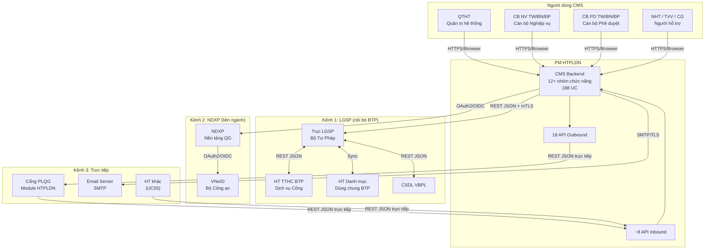
```mermaid
graph TD
    subgraph "Người dùng CMS"
        QTHT["QTHT<br/>Quản trị hệ thống"]
        CBNV["CB NV TW/BN/ĐP<br/>Cán bộ Nghiệp vụ"]
        CBPD["CB PD TW/BN/ĐP<br/>Cán bộ Phê duyệt"]
        NHT_U["NHT / TVV / CG<br/>Người hỗ trợ"]
    end

    subgraph "PM HTPLDN"
        CMS["CMS Backend<br/>12+ nhóm chức năng<br/>188 UC"]
        API_OUT["18 API Outbound"]
        API_IN["~8 API Inbound"]
    end

    subgraph "Kênh 1: LGSP (nội bộ BTP)"
        LGSP["Trục LGSP<br/>Bộ Tư Pháp"]
        DVC["HT TTHC BTP<br/>Dịch vụ Công"]
        DMDC["HT Danh mục<br/>Dùng chung BTP"]
        VBPL["CSDL VBPL"]
    end

    subgraph "Kênh 2: NDXP (liên ngành)"
        NDXP_SYS["NDXP<br/>Nền tảng QG"]
        VNeID_SYS["VNeID<br/>Bộ Công an"]
    end

    subgraph "Kênh 3: Trực tiếp"
        CPLQG["Cổng PLQG<br/>Module HTPLDN"]
        EMAIL["Email Server<br/>SMTP"]
        HT_KHAC["HT khác<br/>(UC55)"]
    end

    QTHT -->|"HTTPS/Browser"| CMS
    CBNV -->|"HTTPS/Browser"| CMS
    CBPD -->|"HTTPS/Browser"| CMS
    NHT_U -->|"HTTPS/Browser"| CMS

    CMS --> API_OUT
    API_IN --> CMS

    CMS -->|"REST JSON + mTLS"| LGSP
    LGSP <-->|"REST JSON"| DVC
    LGSP <-->|"Sync"| DMDC
    LGSP <-->|"REST JSON"| VBPL

    CMS -->|"OAuth2/OIDC"| NDXP_SYS
    NDXP_SYS -->|"OAuth2/OIDC"| VNeID_SYS

    API_OUT -->|"REST JSON trực tiếp"| CPLQG
    CPLQG -->|"REST JSON trực tiếp"| API_IN
    HT_KHAC -->|"REST JSON trực tiếp"| API_IN
    CMS -->|"SMTP/TLS"| EMAIL
```

> **Ghi chú v1.6:** Context Diagram cập nhật theo mô hình hybrid 3 kênh (C-08a). Cổng PLQG kết nối trực tiếp (không qua LGSP). VNeID qua NDXP. HT khác (UC55) kết nối trực tiếp thay kênh Email cũ.

### 2.1.3 Tổng quan hệ thống bên ngoài

| # | Hệ thống bên ngoài | Mục đích tích hợp | Dữ liệu trao đổi (tổng quan) | Chiều |
|---|--------------------|--------------------|------------------------------|-------|
| 1 | Trục LGSP Bộ Tư Pháp | Middleware cho HT nội bộ BTP (DVC, VBPL, Danh mục) | Hồ sơ TTHC, VBPL, danh mục dùng chung | ↔ |
| 2 | VNeID (qua NDXP) | Xác thực danh tính điện tử (mô hình 2-tier: Tier 1 nội bộ / Tier 2 Internet = VNeID) | Thông tin xác thực (CCCD, họ tên, ngày sinh) | ← |
| 3 | HT TTHC BTP (DVC) | Tiếp nhận hồ sơ yêu cầu HTPL + hồ sơ chi phí | Hồ sơ TTHC, trạng thái xử lý, kết quả | ↔ |
| 4 | Cổng PLQG (Module HTPLDN) | Consumer chính 18 API — hiển thị HTPLDN cho DN/Người dân | 9 cặp API (chia sẻ + tìm kiếm): Hỏi đáp, ĐT, TVV, VV, Đánh giá, Biểu mẫu, TVCS, CT HTPLDN, HS PL DN | ↔ |
| 5 | HT Danh mục Dùng chung BTP | Đồng bộ danh mục chuẩn (lĩnh vực PL, đơn vị HC) | Danh mục lĩnh vực PL, đơn vị HC, loại hình HT | ← |
| 6 | Email Server (SMTP) | Gửi thông báo (phê duyệt, SLA, kích hoạt TK) | Email thông báo (HTML) | → |
| 7 | HT khác (UC55) | Tiếp nhận thông tin từ hệ thống bên ngoài | Dữ liệu vụ việc (REST JSON) | ← |

> **Chi tiết kỹ thuật (protocol, authentication, error handling):** Xem Architecture Design Document.

## 2.2 Chức năng sản phẩm (Product Functions)

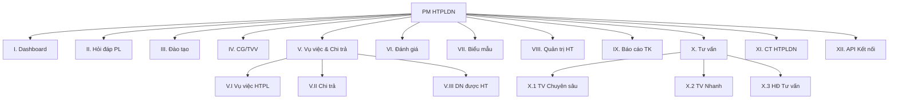
```mermaid
graph TD
    PM[PM HTPLDN] --> GRP1[I. Dashboard]
    PM --> GRP2[II. Hỏi đáp PL]
    PM --> GRP3[III. Đào tạo]
    PM --> GRP4[IV. CG/TVV]
    PM --> GRP5[V. Vụ việc & Chi trả]
    GRP5 --> V1[V.I Vụ việc HTPL]
    GRP5 --> V2[V.II Chi trả]
    GRP5 --> V3[V.III DN được HT]
    PM --> GRP6[VI. Đánh giá]
    PM --> GRP7[VII. Biểu mẫu]
    PM --> GRP8[VIII. Quản trị HT]
    PM --> GRP9[IX. Báo cáo TK]
    PM --> GRP10[X. Tư vấn]
    GRP10 --> X1[X.1 TV Chuyên sâu]
    GRP10 --> X2[X.2 TV Nhanh]
    GRP10 --> X3[X.3 HĐ Tư vấn]
    PM --> GRP11[XI. CT HTPLDN]
    PM --> GRP12[XII. API Kết nối]
```

### Danh sách nhóm chức năng

| # | Nhóm chức năng | Mã nhóm | Số UC | Mô tả ngắn | FR Section |
|---|---------------|---------|-------|------------|------------|
| 1 | Dashboard | I | 9 | 9 chỉ số tổng quan hoạt động HTPLDN | 3.2.1 |
| 2 | Quản lý hỏi đáp pháp luật | II | 12 (10 gốc + 2 mới) | Tiếp nhận, xử lý, kiểm duyệt, công khai Q&A | 3.2.2 |
| 3 | Quản lý đào tạo, tập huấn | III | 22 (19 gốc + 3 mới) | Chương trình đào tạo, khóa học, tài liệu, đề kiểm tra, kết quả | 3.2.3 |
| 4 | Quản lý Mạng lưới Tư vấn viên | IV | 13 (12 gốc + 1 cross) | Cá nhân tư vấn + Tổ chức tư vấn — đăng ký, thẩm định, phê duyệt, đánh giá | 3.2.4 |
| 5 | Quản lý vụ việc hỗ trợ pháp lý | V.I | 18 (17 gốc + 1 mới) | Tiếp nhận, kiểm tra, phân công, xử lý, đánh giá vụ việc | 3.2.5 |
| 6 | Quản lý chi trả chi phí | V.II | 13 | Đề nghị, đánh giá, thẩm định, phê duyệt chi phí tư vấn | 3.2.6 |
| 7 | Quản lý doanh nghiệp được hỗ trợ | V.III | 3 (2 gốc + 1 mới) | Hồ sơ doanh nghiệp nhỏ và vừa đã/đang được hỗ trợ | 3.2.7 |
| 8 | Theo dõi đánh giá hiệu quả hỗ trợ pháp lý | VI | 9 | Lập đợt, phân công, nhập điểm, báo cáo đánh giá | 3.2.8 |
| 9 | Quản lý thư viện biểu mẫu | VII | 7 | Kho biểu mẫu cho doanh nghiệp nhỏ và vừa. Hợp đồng tư vấn KHÔNG thuộc menu — xem Nhóm X.3 | 3.2.9 |
| 10 | Quản trị hệ thống | VIII | 21 | Danh mục, tài khoản, phân quyền, đăng nhập | 3.2.10 |
| 11 | Báo cáo thống kê | IX | 23 | 23 báo cáo gom thành 6 sub-menu theo chủ đề | 3.2.11 |
| 12 | Quản lý Tư vấn pháp luật chuyên sâu | X.1 | 15 | Tư vấn 1-1 giữa chuyên gia/tư vấn viên và doanh nghiệp | 3.2.12 |
| 13 | Tư vấn nhanh | X.2 | 5 | Tra cứu hỏi đáp pháp lý theo từ khóa | 3.2.13 |
| 14 | Hợp đồng tư vấn | X.3 | 1 | Quản lý hợp đồng tư vấn — KHÔNG có menu, truy cập qua chi tiết vụ việc và chi tiết tư vấn viên | 3.2.14 |
| 15 | Quản lý kế hoạch thực hiện chương trình hỗ trợ pháp lý doanh nghiệp | XI | 9 | Kế hoạch, thực hiện, báo cáo chương trình hỗ trợ pháp lý doanh nghiệp | 3.2.15 |
| 16 | API kết nối chia sẻ dữ liệu | XII | 18 | 18 giao tiếp dữ liệu hướng ra (trực tiếp với Cổng Pháp luật quốc gia, 9 cặp chia sẻ + tìm kiếm, UC171-188) | 3.2.16 |
| | **Tổng** | | **188** | | |

> **Tham chiếu:** PRD Section 6 (Functional Requirements)

## 2.3 Đặc điểm người dùng

| # | Vai trò | Viết tắt | Trình độ | KN IT | KN Domain | Tần suất | Ngôn ngữ | Ghi chú |
|---|---------|---------|---------|-------|-----------|----------|----------|---------|
| 1 | Quản trị hệ thống | QTHT | ĐH CNTT | Cao | Trung bình | Hàng ngày | Tiếng Việt | Cấu hình, danh mục, phân quyền |
| 2 | Cán bộ Nghiệp vụ TW | CB NV TW | ĐH Luật/HC | Trung bình | Cao | Hàng ngày | Tiếng Việt | Cục BLDS&KT — thấy dữ liệu toàn quốc |
| 3 | Cán bộ Nghiệp vụ BN | CB NV BN | ĐH Luật/HC | Trung bình | Cao | Hàng ngày | Tiếng Việt | Bộ/Ngành — thấy dữ liệu BN |
| 4 | Cán bộ Nghiệp vụ ĐP | CB NV ĐP | ĐH Luật/HC | Trung bình | Cao | Hàng ngày | Tiếng Việt | Sở TP — thấy dữ liệu ĐP |
| 5 | Cán bộ Phê duyệt TW | CB PD TW | ĐH Luật/HC | Trung bình | Cao | Hàng ngày | Tiếng Việt | Phê duyệt cấp Cục |
| 6 | Cán bộ Phê duyệt BN | CB PD BN | ĐH Luật/HC | Trung bình | Cao | Hàng tuần | Tiếng Việt | Phê duyệt cấp Bộ/Ngành |
| 7 | Cán bộ Phê duyệt ĐP | CB PD ĐP | ĐH Luật/HC | Trung bình | Cao | Hàng tuần | Tiếng Việt | Phê duyệt cấp Sở TP |
| 8 | Doanh nghiệp | DN | Đa dạng | Thấp-TB | Thấp | Không thường xuyên | Tiếng Việt | Cấp ĐP — thuộc Sở TP quản lý, tương tác qua chuyên trang (xem BR-AUTH-11) |
| 9 | Người hỗ trợ | NHT | ĐH Luật | Trung bình | Cao | Hàng tuần | Tiếng Việt | Cấp ĐP — thuộc Tổ chức HT PLDN dưới Sở TP, NĐ77/2008 (xem BR-AUTH-10) |
| 10 | Tư vấn viên | TVV | ĐH Luật | Trung bình | Cao | Hàng tuần | Tiếng Việt | Cấp ĐP — cá nhân trong MLTV dưới Sở TP, NĐ77/2008 (xem BR-AUTH-10) |
| 11 | Chuyên gia tư vấn | CG | Sau ĐH Luật | Trung bình | Rất cao | Không thường xuyên | Tiếng Việt | Cấp ĐP — thuộc Tổ chức HT PLDN dưới Sở TP, NĐ77/2008 (xem BR-AUTH-10) |
| 12 | Cổng PLQG | Cổng PLQG | — | — | — | Real-time | JSON | Hệ thống — gọi 18 API trực tiếp (REST JSON, không qua LGSP) |
| 13 | HT TTHC BTP | HT TTHC BTP | — | — | — | Event-driven | JSON | Hệ thống — gửi hồ sơ TTHC qua LGSP |
| 14 | Hệ thống khác | HT khác | — | — | — | Theo nhu cầu | JSON | Hệ thống tiêu thụ API |

### Mô hình phân cấp người dùng

```
BTP (Cục BLDS&KT) = TW (cha)
  ├── Bộ/Ngành 1 = BN (con ngang cấp)    ← chỉ CB NV BN + CB PD BN, KHÔNG có Tổ chức HT PLDN
  ├── Bộ/Ngành 2 = BN
  ├── ...
  ├── Sở TP Hà Nội = ĐP (con ngang cấp)
  │   ├── CB NV ĐP, CB PD ĐP             ← thấy toàn bộ dữ liệu ĐP
  │   ├── Tổ chức hỗ trợ PLDN (NĐ77/2008)  ← chỉ tồn tại ở cấp ĐP
  │   │   ├── Người hỗ trợ (NHT)          ← ĐP + chỉ vụ việc được phân công (BR-AUTH-10)
  │   │   ├── Tư vấn viên (TVV)           ← ĐP + chỉ vụ việc được phân công (BR-AUTH-10)
  │   │   └── Chuyên gia (CG)             ← ĐP + chỉ yêu cầu TV chuyên sâu được phân công (BR-AUTH-10)
  │   └── Doanh nghiệp (DN)               ← ĐP + chỉ hồ sơ của mình, qua API chuyên trang (BR-AUTH-11)
  ├── Sở TP HCM = ĐP (con ngang cấp)
  └── ... (63 Sở TP)
```

**Quy tắc phân quyền dữ liệu:**
- TW thấy tất cả dữ liệu (TW + BN + ĐP)
- BN chỉ thấy dữ liệu của BN mình
- ĐP chỉ thấy dữ liệu của ĐP mình
- Ngang cấp KHÔNG thấy nhau (BN1 không thấy BN2, ĐP1 không thấy ĐP2)
- Phê duyệt: CB NV -> CB PD cùng cấp (không xuyên cấp)
- NHT/TVV: lọc kép (BR-AUTH-10) — phân quyền dữ liệu theo đơn vị lọc theo Sở TP trước → kiểm tra quyền tầng ứng dụng chỉ thấy vụ việc HTPL (VU_VIEC) được phân công. Áp dụng cho entity vụ việc/hồ sơ, KHÔNG áp dụng cho dữ liệu chung (tài liệu, CTĐT)
- CG: lọc kép (BR-AUTH-10) — phân quyền dữ liệu theo đơn vị lọc theo Sở TP trước → kiểm tra quyền tầng ứng dụng chỉ thấy yêu cầu tư vấn chuyên sâu (YEU_CAU_TU_VAN) được phân công
- DN: lọc tầng API (BR-AUTH-11) — DN không đăng nhập CMS, tương tác qua API chuyên trang. API lọc theo Sở TP quản lý + chỉ hồ sơ của DN đó

> **Tham chiếu:** PRD Section 4 (Target Users & Personas)

## 2.4 Ràng buộc

| # | Loại | Ràng buộc | Cơ sở | Trạng thái |
|---|------|----------|-------|------------|
| C-01 | Quy định pháp lý | PM phải tuân thủ NĐ55/2019, NĐ18/2026, Luật DNNVV 2017, NĐ39/2018, NĐ77/2008, TT17/2025, TT64/2021 | Pháp luật VN | ✅ CĐT xác nhận |
| C-02 | Quy định pháp lý | Tuân thủ Luật Dữ liệu 2024 về bảo mật, mã hóa dữ liệu cá nhân | Luật Dữ liệu 2024 | ✅ CĐT xác nhận |
| C-03 | Chuẩn kỹ thuật | SRS theo IEEE 830 / ISO 29148 | Yêu cầu CĐT | ✅ CĐT xác nhận |
| C-04 | Audit/Compliance | Ghi nhận mọi CUD + phê duyệt + đăng nhập/xuất, lưu 5 năm, immutable | NĐ55/2019, Luật Dữ liệu 2024 | 🟡 Đề xuất |
| C-05 | Ngôn ngữ | Giao diện tiếng Việt, Unicode UTF-8 | Yêu cầu CĐT | ✅ CĐT xác nhận |

> **Lưu ý:** Ràng buộc kỹ thuật (phần cứng, phần mềm, framework, giao thức, trình duyệt) được định nghĩa trong Architecture Design Document.
> Các ràng buộc kỹ thuật từ SRS v1.8 (C-04 đến C-10, C-12) đã chuyển sang `architecture-inputs-from-srs.md` §1 Technical Constraints.

> **Tham chiếu:** PRD Section 5 (Assumptions & Constraints)

## 2.5 Giả định và phụ thuộc

### Giả định

| # | Giả định | Ảnh hưởng nếu sai | Trạng thái |
|---|---------|-------------------|------------|
| A-01 | PM phát triển CMS (cho cán bộ) + giao diện DN (cho DN/người dân, đăng nhập VNeID Tier 2) + API (chia sẻ với hệ thống khác qua Cổng PLQG) | Nếu phạm vi giao diện DN thay đổi: cần điều chỉnh đặc tả các UC liên quan DN | ✅ Cập nhật theo CSV (lượt 6) |
| A-02 | Mô hình tích hợp hybrid 3 kênh: LGSP (nội bộ BTP), NDXP (liên ngành), Trực tiếp (Cổng PLQG, Email, HT khác). Xem C-08a | Nếu thay đổi routing: ảnh hưởng security model, network topology | ✅ Theo Thiết kế tổng thể (v1.6) |
| A-03 | Phân quyền dữ liệu theo đơn vị + cấp (TW/BN/ĐP) | Nếu thay đổi model: ảnh hưởng toàn bộ UC | ✅ CĐT xác nhận |
| A-04 | Luồng phê duyệt rút gọn (CB NV tích "Đã trả lời" -> CB PD duyệt) | Nếu cần workflow phức tạp hơn: thêm UC, thay đổi state machine | ✅ CĐT xác nhận |
| A-05 | Hạ tầng on-premise (DC BTP) đủ năng lực | Nếu hạ tầng yếu: giảm target performance | ✅ CĐT xác nhận |
| A-06 | VNeID tích hợp theo **mô hình 2-tier:** Tier 1 (nội bộ qua mạng kín) = username/password + TOTP 2FA; Tier 2 (Internet-facing) = SSO VNeID qua OIDC Authorization Code flow (phía VNeID, user có thể xác thực bằng nhiều phương thức: password+OTP, quét QR app VNeID, v.v. — PM không kiểm soát phương thức phía VNeID). **Không có tier VNPT eKYC.** 🟡 Chưa xác nhận VNeID có public OIDC endpoints — chờ phê duyệt Bộ Công an theo NĐ69/2024/NĐ-CP | Nếu Bộ Công an thay đổi cơ chế: điều chỉnh Tier 2 | 🟡 Giả định — chờ phê duyệt Bộ Công an |
| A-07 | 500 concurrent users bình thường, 1000 peak | Nếu thực tế cao hơn: cần scale infrastructure | 🟡 Giả định — Chuẩn CPĐT VN |
| A-08 | NĐ18/2026 áp dụng cho mức hỗ trợ chi phí V.II | Nếu chưa ban hành hoặc thay đổi: ảnh hưởng UC68-80 | 🟡 Giả định — Chờ CĐT |
| A-09 | 18 API outbound (9 cặp chia sẻ + tìm kiếm) + ~8 API inbound | Theo Thiết kế tổng quan gốc (Input) | ✅ Đã xác nhận theo Input |

### Phụ thuộc

| # | Phụ thuộc | Ảnh hưởng nếu thay đổi | FR liên quan |
|---|----------|----------------------|-------------|
| D-01 | Trục LGSP BTP hoạt động ổn định | Block toàn bộ tích hợp bên ngoài | XII, V.I (UC53), V.II (UC68), VIII (UC118) |
| D-02 | Tài liệu LGSP (message schema, giao thức, auth) | Không thể thiết kế API inbound/outbound chính thức | XII, V.I, V.II |
| D-03 | Tài liệu NDXP (chuẩn kết nối VNeID) | Không thể tích hợp đăng nhập VNeID | VIII (UC118-119) |
| D-04 | DC BTP cung cấp hạ tầng đúng thời hạn | Block triển khai production | Toàn bộ |
| D-05 | Gói thầu Cổng PLQG phối hợp API schema | Không thể xây dựng 18 API outbound chính thức | XII |
| D-06 | HT TTHC BTP cung cấp API spec | Không thể tích hợp tiếp nhận hồ sơ DVC | V.I (UC53), V.II (UC68) |
| D-07 | Cục BLDS&KT cung cấp mẫu biểu (hồ sơ TVV, mẫu đánh giá, chứng nhận ĐT) | Thiếu biểu mẫu cho IV, III | IV (UC43), III (UC38) |

> **Tham chiếu:** PRD Section 5, Section 12 (Open Questions)

---


---


# 3. Yêu cầu cụ thể

## 3.1 Yêu cầu giao diện bên ngoài

### 3.1.1 Giao diện người dùng (User Interfaces)

**Tài liệu chi tiết:** Xem `ux-spec.md` (toàn bộ design system, component library, screen specs)

#### Đặc điểm logic UI

| # | Đặc điểm | Quy định | Tham chiếu UX-Spec |
|---|----------|---------|-------------------|
| UI-01 | Design system | Tông deep blue #1A56DB + government professional. Font: Inter/Roboto (fallback: hệ thống). Spacing: 4px base grid. Max width: 1440px | UX-Spec Section 2 |
| UI-02 | Layout tổng thể | Thanh trên 56px + Thanh bên 260px (thu gọn 64px) + Vùng nội dung cuộn được. Lưới 12 cột co giãn. Chi tiết: §3.1.1.1 | UX-Spec §3.1 |
| UI-03 | Navigation | Menu thanh bên **13 nhóm cấp 1 + 17 mục cấp 2** (9 click thẳng + 4 accordion). Đường dẫn phân cấp (breadcrumb). Menu nổi bật item đang chọn. Cây menu chi tiết: §3.1.1.2 | UX-Spec §3.2, `dac-ta-man-hinh-chuc-nang-v2.md` §A.1.2 |
| UI-04 | Error display | Kiểm tra thời gian thực + viền đỏ + thông báo lỗi dưới ô nhập. Popup xác nhận trước xóa. Toast notification cho thao tác thành công | UX-Spec Section 4.2 |
| UI-05 | Accessibility | WCAG 2.1 Level A. Tỷ lệ tương phản đủ. Điều hướng bàn phím. Trạng thái chọn rõ ràng | UX-Spec Section 1.2 (P7) |
| UI-06 | Localization | Tiếng Việt là ngôn ngữ duy nhất. Unicode UTF-8. Định dạng ngày: dd/MM/yyyy. Số: dấu chấm phân cách hàng nghìn | UX-Spec Section 1 |
| UI-07 | Responsive | Desktop-only. Min width: 1024px. Thiết kế tối ưu cho ≥ 1280px. Hỗ trợ 1024-1279px với sidebar tự động thu gọn (64px). Dưới 1024px: hiển thị thông báo "Vui lòng sử dụng màn hình ≥ 1024px". Cuộn ngang cho bảng nhiều cột. Không hỗ trợ mobile/tablet | UX-Spec Section 2.3 |

#### 3.1.1.1 Bố cục tổng thể (Application Shell)

Nguồn: đồng bộ với `ux-spec.md` §3.1 và prototype `js/shell.js` (CR_15042026).

```
┌──────────────────────────────────────────────────────────────┐
│ THANH TRÊN (56px)                                            │
│ [☰ Thu/Mở] [Logo + Tên HT]  [Đơn vị: XXX]  [🔔] [Tài khoản ▼]│
├──────────┬───────────────────────────────────────────────────┤
│ THANH    │ VÙNG NỘI DUNG CHÍNH                              │
│ BÊN      │ ┌─ ĐƯỜNG DẪN PHÂN CẤP (breadcrumb) ──────────┐ │
│ (260px / │ │ Trang chủ > Hỏi đáp > Chi tiết              │ │
│ thu gọn  │ └──────────────────────────────────────────────┘ │
│ 64px)    │ ┌─ TIÊU ĐỀ TRANG ─────────────────────────────┐ │
│          │ │ Quản lý [Đối tượng]        [+ Thêm mới]    │ │
│ [Menu    │ └──────────────────────────────────────────────┘ │
│  13 nhóm │ ┌─ NỘI DUNG (cuộn được) ──────────────────────┐ │
│  cấp 1]  │ │ [Bộ lọc] [Tìm kiếm]                          │ │
│          │ │ [Bảng dữ liệu / Biểu mẫu / Chi tiết]        │ │
│          │ │ [Phân trang]                                  │ │
│          │ └──────────────────────────────────────────────┘ │
└──────────┴───────────────────────────────────────────────────┘
```

**Đặc tả thanh trên (Top Bar — 56px):**

| Thành phần | Vị trí | Chức năng |
|-----------|--------|-----------|
| Nút thu/mở (☰) | Trái | Thu gọn/mở thanh bên (260px ↔ 64px) |
| Logo + Tên hệ thống | Trái (sau nút thu/mở) | Nhận diện thương hiệu, link về Tổng quan |
| Đơn vị hiện tại | Giữa | Nhãn ngữ cảnh: "BTP — Cục BLDS&KT" / "Sở TP Hà Nội" / "Bộ A" |
| Chuông thông báo (🔔) | Phải | Số đếm + danh sách thông báo thả xuống |
| Ảnh đại diện + Tên | Phải | Menu thả xuống: Hồ sơ, Đổi mật khẩu, Đăng xuất |

#### 3.1.1.2 Cấu trúc menu thanh bên (Cây menu v2.1)

Cây menu chuẩn — **13 mục cấp 1 + 17 sub-item** (9 click thẳng + 4 accordion). Nguồn: `ux-spec.md` §3.2, đồng bộ với CR_15042026 và prototype `js/shell.js`. FR group liên quan ghi chú bên phải.

```
🏠 Tổng quan                                                    [click thẳng]     → FR-I (UC1-9)

💬 Quản lý hỏi đáp pháp luật                                    [click thẳng]     → FR-II (UC10-19)

📚 Quản lý đào tạo, tập huấn                                    [accordion ▼]    → FR-III (UC20-38)
├── Chương trình đào tạo
├── Khóa học                                                    (7 tabs: TT, Lịch học, HV,
│                                                                Điểm danh, KQ KT, Bài giảng, Chứng nhận)
├── Ngân hàng câu hỏi
└── Giảng viên

👥 Quản lý mạng lưới tư vấn viên                                [accordion ▼]    → FR-IV (UC39-50)
├── Cá nhân tư vấn          (Tư vấn viên, Chuyên gia, Người hỗ trợ)
└── Tổ chức tư vấn          (tách khỏi Danh mục — CR-CMT-6, đối tượng quản lý riêng)

📋 Quản lý vụ việc hỗ trợ pháp lý                               [click thẳng]     → FR-V.I (UC51-67)

💰 Quản lý chi trả chi phí                                      [click thẳng]     → FR-V.II (UC68-80)

🏢 Quản lý doanh nghiệp được hỗ trợ                             [click thẳng]     → FR-V.III (UC81-82)

📊 Theo dõi đánh giá hiệu quả hỗ trợ pháp lý                    [click thẳng]     → FR-VI (UC83-91)

📄 Quản lý thư viện biểu mẫu                                    [click thẳng]     → FR-VII (UC92-98)

🗣️ Quản lý tư vấn                                              [accordion ▼]    → FR-X
├── Quản lý Tư vấn pháp luật chuyên sâu                                             FR-X.1 (UC147-153)
└── Tư vấn nhanh                                                                     FR-X.2 (UC154-158)

📑 Quản lý kế hoạch thực hiện chương trình
   hỗ trợ pháp lý doanh nghiệp                                  [click thẳng]     → FR-XI (UC160-170)

📈 Báo cáo thống kê                                             [accordion ▼]    → FR-IX (UC124-146)
├── Báo cáo hỏi đáp pháp luật
├── Báo cáo vụ việc hỗ trợ pháp lý
├── Báo cáo đào tạo, tập huấn
├── Báo cáo chuyên gia, tư vấn viên và đánh giá
├── Báo cáo chi phí hỗ trợ
└── Báo cáo chương trình hỗ trợ pháp lý doanh nghiệp
                                                                 (23 báo cáo theo TT17/2025/TT-BTP
                                                                  gom thành 6 sub — cùng mẫu chung,
                                                                  lọc sẵn theo nhóm)

⚙️ Quản trị hệ thống                                            [accordion ▼]    → FR-VIII (UC99-123)
├── Danh mục dùng chung     (13 loại — Tổ chức tư vấn đã tách sang FR-IV)
├── Cấu hình hệ thống       (thời hạn xử lý, phân công mặc định, mẫu phản hồi, quy trình)
├── Tài khoản và phân quyền
└── Nhật ký hệ thống
```

**Ghi chú quan trọng về cây menu:**

| # | Ghi chú | Nguồn |
|---|---------|-------|
| M-01 | **Hợp đồng tư vấn (FR-X.3 / UC159-159e)** — KHÔNG có menu riêng. Truy cập qua tab trong Chi tiết Vụ việc (MH-05.3) và Chi tiết TVV (MH-04.3) | SRS v2.1 §3, ux-spec §3.2 |
| M-02 | **Tổ chức tư vấn** — sau CR-CMT-6 tách thành entity riêng trong FR-IV, KHÔNG còn là 1 trong 14 danh mục. Danh mục dùng chung giảm còn 13 loại | CR-CMT-6 |
| M-03 | **API chia sẻ dữ liệu (FR-XII / UC171-188)** — KHÔNG có menu CMS. API outbound — giám sát qua AUDIT_LOG + Dashboard | FR-XII |
| M-04 | **Báo cáo** — 23 loại báo cáo (TT17/2025/TT-BTP) gom thành 6 sub-menu theo chủ đề. Mỗi sub có bộ lọc chọn loại báo cáo cụ thể | CR-09, ux-spec §3.2 |
| M-05 | **Hiển thị theo quyền** — menu item chỉ hiện nếu vai trò có quyền truy cập ≥ 1 chức năng trong đó. Ẩn (không disable) nếu không có quyền | NF-Security |
| M-06 | **Item đang chọn** — nổi bật bằng màu nền + border trái 3px (deep blue #1A56DB) | UX-Spec §3.2 |
| M-07 | **Nguồn thay đổi cây menu** — CR_15042026 (5 rename + 1 restructure Nhóm IV) | CR_15042026 |

#### Mẫu giao diện tái sử dụng (Core UI Patterns)

| # | Mẫu giao diện | Mô tả | Áp dụng cho | Tham chiếu |
|---|---------------|-------|------------|-----------|
| P-01 | Danh sách quản lý (List Management) | Bảng dữ liệu + Tìm kiếm + Lọc + Phân trang (10/20/50/100 bản ghi/trang, hiển thị tổng số bản ghi) + CRUD + Xuất Excel + Chọn hàng loạt + **Tabs trạng thái** (context-sensitive batch actions per tab) | ~60% UC: II (UC10-19), III (UC20-38), IV (UC39-50), V.I (UC51-67), V.II (UC68-80), V.III (UC81-82), VII (UC92-98), VIII (UC99-123) | dac-ta-MH §MH-02.1, MH-05.1, MH-06.1 |
| P-02 | Xem chi tiết / Biểu mẫu (Detail/Form) | Form nhập liệu + Accordion sections + Validation real-time + Upload file + Audit log timeline | Thêm mới, chỉnh sửa, xem chi tiết cho mọi đối tượng | UX-Spec Section 4.2 |
| P-03 | Luồng phê duyệt (Approval Flow) | Thanh tiến trình + Nội dung cần duyệt + Quyết định (Phê duyệt/Từ chối) + Phê duyệt hàng loạt | UC17, UC34, UC37, UC45, UC63, UC79, UC86, UC91, UC163 | UX-Spec Section 4.3 |
| P-04 | Dashboard (KPI Cards + Charts) | Thẻ KPI (số + trend) + Bộ lọc thời gian/đơn vị + Biểu đồ cột/đường/tròn | UC1-9 (Nhóm I) | UX-Spec Section 4.4 |
| P-05 | Báo cáo (Report) | Bộ lọc kỳ/đơn vị + Bảng cross-tab + Biểu đồ + Xuất Excel/Word | UC124-146 (Nhóm IX) | UX-Spec (inferred) |
| P-06 | Tìm kiếm nâng cao (Advanced Search) | Nhiều điều kiện AND + Từ khóa + Lọc danh mục + Khoảng thời gian | UC11, UC14, UC19, UC21, UC25, UC27, UC29, UC31, UC40, UC58, UC82, UC93, UC96 | UX-Spec Section 4.1 |
| P-07 | Import/Export (Bulk Operations) | Upload file Excel + Validate + Preview + Báo cáo lỗi chi tiết + Import | UC83 (FR-V.III-NEW-01), UC97 (FR-VII-06), UC24 (import kết quả) | UX-Spec (inferred) |

### 3.1.2 Yêu cầu tích hợp hệ thống bên ngoài

| # | Hệ thống bên ngoài | Yêu cầu tích hợp | Dữ liệu trao đổi | FR liên quan |
|---|--------------------|--------------------|-------------------|-------------|
| INT-01 | Trục LGSP BTP | Kết nối nội bộ BTP để tiếp nhận hồ sơ TTHC, tra cứu VBPL, đồng bộ danh mục | Hồ sơ TTHC (DVC inbound), VBPL (tra cứu), danh mục (sync) | FR-V.I (UC53), FR-V.II (UC68), FR-VIII |
| INT-02 | VNeID (qua NDXP) | Xác thực danh tính điện tử theo mô hình 2-tier (Tier 1 nội bộ dùng user/pass+TOTP / Tier 2 Internet = SSO VNeID cho tác nhân bên ngoài DN/TVV/CG/NHT) | Thông tin xác thực: CCCD, họ tên, ngày sinh | FR-VIII-20 (UC118-119) |
| INT-03 | HT TTHC BTP (DVC) | Tiếp nhận hồ sơ yêu cầu HTPL + hồ sơ đề nghị HT chi phí từ DVC; gửi kết quả về DVC | Hồ sơ TTHC inbound (thông tin DN, nội dung, tài liệu), trạng thái/kết quả outbound | FR-V.I-03 (UC53), FR-V.II-01 (UC68) |
| INT-04 | Cổng PLQG (Module HTPLDN) | Cung cấp 18 API outbound (9 cặp chia sẻ + tìm kiếm, REST JSON trực tiếp). Nhận dữ liệu TV chuyên sâu, HS PL DN, đánh giá | 9 cặp API: Hỏi đáp, ĐT, TVV, VV, Đánh giá, Biểu mẫu, TVCS, CT HTPLDN, HS PL DN | FR-XII (UC171-188) |
| INT-05 | HT Danh mục Dùng chung BTP | Đồng bộ danh mục chuẩn (lĩnh vực PL, đơn vị HC, loại hình HT). PM tự quản lý danh mục nếu HT không khả dụng | Danh mục lĩnh vực PL, đơn vị HC, loại hình HT | FR-VIII (UC99-110) |
| INT-06 | Email Server (SMTP) | Gửi email thông báo: phê duyệt, phân công, cảnh báo SLA, kích hoạt TK, đặt lại MK. SLA: gửi trong ≤ 5 phút | Email HTML (To, Subject, Body, Attachments optional) | Cross-cutting (mọi UC có notification) |
| INT-07 | HT khác (UC55) | Tiếp nhận thông tin vụ việc từ hệ thống bên ngoài qua REST JSON trực tiếp | Dữ liệu vụ việc HTPL | FR-V.I-05 (UC55) |

> **Chi tiết kỹ thuật (API contracts, protocol, authentication, error handling):** Xem Architecture Design Document.
> 
> **Ghi chú v2.0:** Sections 3.1.2 (Hardware Interfaces), 3.1.3 (Software Interfaces — 6 SI blocks), 3.1.4 (Communication Interfaces) từ SRS v1.8 đã chuyển sang `architecture-inputs-from-srs.md` §2 System Interfaces Design.

---

---


# 3.2 Yêu cầu chức năng

> **Ghi chú v3.0:** Section 3.2 FR chi tiết được tách thành **16 file riêng** per nhóm UC.
> Mỗi file theo template `srs-fr-group-template-v3.md`. Xem danh sách file ở Mục lục.

## 3.2.0 Quy ước chung cho Section 3.2

### 3.2.0.1 Cấu trúc IEEE 830 cho mỗi FR

Mỗi yêu cầu chức năng (FR) tuân thủ cấu trúc sau:

| Thành phần | Bắt buộc | Mô tả |
|-----------|----------|-------|
| FR-ID | Y | Mã định danh: `FR-<Nhóm>-<Số>` |
| UC Reference | Y | Mã UC tham chiếu từ PRD |
| Tên FR | Y | Tên ngắn gọn |
| Tác nhân | Y | Actor(s) chính |
| Priority | Y | Essential / Conditional / Optional |
| Stability | Y | High / Medium / Low |
| Trạng thái | Y | ✅ CĐT xác nhận / 🟡 Đề xuất |
| Preconditions | Y | Điều kiện tiên quyết (đăng nhập, quyền, trạng thái entity) |
| Input | Y | Bảng trường đầu vào (tên, kiểu logic, bắt buộc, mô tả) |
| Processing Steps | Y | Các bước xử lý đánh số, tham chiếu BR-xxx |
| Output | Y | Bảng trường đầu ra |
| Postconditions | Y | Trạng thái hệ thống sau khi hoàn thành |
| Error Handling | Y | Bảng lỗi (condition, code, response, severity) |
| Acceptance Criteria | Y | Given/When/Then từ PRD |
| Cross-references | Y | BR-xxx, SM-xxx, Entity names |

**Mức ưu tiên (IEEE 830 Criterion 5):**

| Mức | Ý nghĩa |
|-----|---------|
| **Essential** | Phần mềm không thể nghiệm thu nếu thiếu FR này |
| **Conditional** | Nâng cao giá trị sản phẩm, có thể hoãn nếu cần |
| **Optional** | Mong muốn, không ảnh hưởng nghiệm thu |

**Mức ổn định (IEEE 830 Criterion 5):**

| Mức | Ý nghĩa |
|-----|---------|
| **High** | Gần như chắc chắn không thay đổi |
| **Medium** | Có thể điều chỉnh chi tiết |
| **Low** | Có khả năng thay đổi lớn |

### 3.2.0.2 Quy ước kiểu dữ liệu logic

Bảng kiểu dữ liệu LOGIC dùng xuyên suốt SRS — trong entity attributes, FR inputs/outputs, ERD.
Không sử dụng physical DB types (VARCHAR, BIGINT, JSONB, v.v.) trong SRS — đó thuộc Architecture Design.

| Kiểu logic | Mô tả | Ví dụ sử dụng |
|------------|-------|--------------|
| identifier | Mã định danh duy nhất | PK, FK, mã tham chiếu |
| text | Chuỗi ký tự (ngắn) | Tên, mã, email, mô tả ngắn |
| text (long) | Văn bản dài | Nội dung chi tiết, mô tả |
| number | Số nguyên hoặc thập phân | Số lượng, thứ tự |
| money | Giá trị tiền tệ | Đơn giá, tổng chi phí |
| percentage | Phần trăm (0-100) | Tỷ lệ hoàn thành |
| boolean | Đúng/Sai | Cờ trạng thái |
| date | Ngày (không có giờ) | Ngày sinh, ngày hết hạn |
| datetime | Ngày + giờ chính xác | Thời điểm tạo, cập nhật |
| enum | Tập giá trị cố định | Trạng thái, loại, cấp |
| file | Tệp đính kèm | Tài liệu upload |
| structured | Dữ liệu có cấu trúc | Cấu hình, metadata |

### 3.2.0.3 Common Fields (BR-DATA-03)

Mọi entity nghiệp vụ đều có 7 common fields sau (KHÔNG liệt kê lại trong từng FR):

| Trường | Kiểu logic | Mô tả nghiệp vụ |
|--------|-----------|-----------------|
| id | identifier | Khóa chính, tự sinh |
| created_at | datetime | Thời điểm tạo |
| updated_at | datetime | Thời điểm cập nhật cuối |
| created_by | identifier (→ TAI_KHOAN) | Người tạo |
| updated_by | identifier (→ TAI_KHOAN) | Người cập nhật cuối |
| is_deleted | boolean | Soft delete flag |
| don_vi_id | identifier (→ DON_VI) | Đơn vị sở hữu — dùng cho phân quyền dữ liệu theo đơn vị |

### 3.2.0.4 Quy tắc phân quyền dữ liệu (BR-DATA-02, BR-AUTH-08, BR-AUTH-10, BR-AUTH-11)

**Nguyên tắc chung:**
- Mọi truy vấn dữ liệu đều được lọc dữ liệu theo đơn vị (`don_vi_id`) của người dùng đang đăng nhập
- QTHT (Quản trị hệ thống) được xem toàn bộ dữ liệu, không bị giới hạn theo đơn vị
- Ngang cấp KHÔNG thấy nhau (BR-AUTH-03); cấp cha thấy cấp con (BR-AUTH-04)

**NHT/TVV/CG — lọc kép (BR-AUTH-10):**
- Lớp 1 (lọc dữ liệu theo đơn vị): lọc theo đơn vị (Sở TP mà NHT/TVV/CG trực thuộc)
- Lớp 2 (phân quyền tầng ứng dụng): NHT/TVV chỉ thấy vụ việc HTPL được phân công cho mình; CG chỉ thấy yêu cầu tư vấn chuyên sâu được phân công cho mình
- Phạm vi: Lớp 2 chỉ áp dụng cho entity vụ việc/yêu cầu tư vấn. Dữ liệu chung (tài liệu ĐT, CTĐT) chỉ lọc Lớp 1 (theo đơn vị)

**DN — lọc tầng dữ liệu (BR-AUTH-11):**
- DN đăng nhập giao diện DN của phần mềm qua VNeID Tier 2 (theo A-06)
- Hệ thống lọc theo đơn vị quản lý DN + định danh DN (lấy từ token VNeID)
- Chỉ cho phép DN xem hồ sơ của chính mình

> **Cơ chế kỹ thuật thực hiện phân quyền (database-level, middleware, API guard):** Xem Architecture Design Document.

### 3.2.0.5 Severity Levels

| Severity | Mô tả |
|----------|-------|
| ERROR | Nghiệp vụ không thể tiếp tục, cần sửa dữ liệu |
| WARNING | Cảnh báo nhưng vẫn cho phép tiếp tục |
| INFO | Thông tin cho người dùng |

### 3.2.0.6 Edge Case Rules (cross-cutting)

> **EC-DATA-LOCK — Kiểm soát xung đột cập nhật đồng thời:** Tất cả thao tác cập nhật và xóa phải kiểm tra phiên bản dữ liệu trước khi thực thi. Nếu bản ghi đã bị thay đổi bởi người khác kể từ lần đọc cuối, hệ thống từ chối thao tác và trả ERR-SYS-02 'Bản ghi đã bị thay đổi bởi người khác. Vui lòng tải lại trang'. Giao diện hiển thị hộp thoại xung đột với lựa chọn tải lại.
>
> **EC-DATA-PAGE — Ràng buộc Pagination:** Số bản ghi/trang nằm trong khoảng [1, 100], mặc định 20. Số trang >= 1, mặc định 1. Giá trị ngoài phạm vi trả ERR-PARAM-01 'Tham số phân trang không hợp lệ'. Trang vượt trang cuối trả danh sách rỗng kèm total_count. **(S3-1)** Cho phép thay đổi số bản ghi/trang: 10, 20, 50, 100. Luôn hiển thị tổng số bản ghi ở màn danh sách.
>
> **EC-DATA-SEARCH — Bảo vệ tìm kiếm:** Từ khóa tìm kiếm được cắt khoảng trắng thừa, giới hạn 200 ký tự, và loại bỏ ký tự đặc biệt nguy hiểm. Từ khóa rỗng sau xử lý trả danh sách đầy đủ. Với bảng > 10.000 bản ghi, sử dụng tìm kiếm toàn văn thay vì tìm kiếm gần đúng để đảm bảo hiệu năng.
>
> **EC-FILE-SCAN — Quét virus file upload:** Tất cả file upload phải được quét bởi engine antivirus trước khi lưu trữ. File nhiễm mã độc bị từ chối với ERR-FILE-02 'Tệp chứa mã độc, không thể upload'. Timeout quét: 30s/file; nếu timeout, từ chối và ghi log.
>
> **EC-FILE-QUOTA — Hạn mức lưu trữ:** Mỗi đơn vị có hạn mức lưu trữ cấu hình được (mặc định 10GB). Khi đạt 90%, cảnh báo khi upload. Khi 100%, từ chối upload với ERR-FILE-01 'Dung lượng lưu trữ đã đầy, liên hệ quản trị viên'.


### 3.2.0.7 Tối ưu UX theo chỉ thị CĐT (v2.1 — Đợt 7)

> **Nguồn:** Chỉ thị tổng thể từ CĐT (TTT): "giản lược bước thực hiện, dễ dùng, nhưng **giữ nguyên UC** (để nghiệm thu)".
> **Nguyên tắc:** KHÔNG xóa UC nào. Chỉ giảm bước thao tác thủ công và field bắt buộc. UC vẫn tồn tại đầy đủ.

#### 3.2.0.7.1 Auto chuyển trạng thái (5 đề xuất)

> Auto-transition **không xóa UC "Trình phê duyệt"** — UC vẫn tồn tại để nghiệm thu. Chỉ thay đổi trigger: từ "CB NV nhấn nút" thành "hệ thống tự động khi hoàn thành bước trước".

| # | Nhóm | SM | Hiện tại (thủ công) | Đề xuất (auto) | FR ảnh hưởng |
|---|------|-----|---------------------|----------------|-------------|
| AT-01 | III. Đào tạo | SM-KHOAHOC | CB NV nhấn "Gửi phê duyệt" | Hoàn thành nhập liệu (đủ field + ≥1 lịch + ≥1 GV) → auto Chờ duyệt + TB CB PD | FR-III-01 (Processing "Gửi phê duyệt khóa học") `[GAP-III-08]` |
| AT-02 | III. Đào tạo | SM-KHOAHOC | CB NV nhấn "Trình duyệt KQ" | Lưu kết quả cuối → auto Chờ duyệt KQ + TB CB PD | FR-III-17 (UC36) |
| AT-03 | V.I. Vụ việc | SM-VUVIEC | CB NV nhấn "Trình phê duyệt" | Cập nhật KQ vụ việc → auto Chờ PD + TB CB PD | FR-V.I-16 (UC66) |
| AT-04 | VI. Đánh giá | SM-DANHGIA | CB NV nhấn "Trình duyệt BC" | Hoàn thành lập BC → auto Chờ PD + TB CB PD | FR-VI-07 (UC89) |
| AT-05 | XI. CT HTPLDN | SM-KH-CTHTPL | CB NV nhấn "Trình" | Hoàn thiện nội dung CT → auto Chờ PD + TB CB PD | FR-XI-03 (UC162) |

#### 3.2.0.7.2 Giảm field bắt buộc (3 field → N)

| # | Field | UC/Entity | Hiện | Đề xuất | Lý do |
|---|-------|-----------|------|---------|-------|
| RF-01 | `ngay_sinh` | UC39 / TU_VAN_VIEN | Y | **N** | Tuổi TVV không phải tiêu chí thẩm định |
| RF-02 | `chung_chi_hanh_nghe` | UC39 / TU_VAN_VIEN | Y | **N** | Đã có `so_the_hanh_nghe`, bổ sung sau ở UC43b |
| RF-03 | `thoi_gian_ket_thuc` | UC160 / CT_HTPL | Y | **N** | CT HTPL có thể open-ended |

#### 3.2.0.7.3 Giá trị mặc định thay bắt buộc nhập (3 field)

| # | Field | UC/Entity | Đề xuất mặc định | Nguồn |
|---|-------|-----------|------------------|-------|
| DF-01 | `hinh_thuc` | Khóa học | **"Trực tuyến"** | S3-6 (TY suggestion) |
| DF-02 | `tan_suat` | UC83 / KE_HOACH_DANH_GIA | Auto gợi ý theo tháng: 1-6→Sơ bộ 6 tháng, 7-11→Sơ bộ năm, 12-1→Tròn năm | — |
| DF-03 | `kenh_tiep_nhan` | UC10 / HOI_DAP | Auto: CB nhập tay→"Trực tiếp", từ Cổng→"Cổng PLQG" | — |

#### 3.2.0.7.4 Mở rộng Auto gợi ý (4 vị trí mới)

| # | UC | Gợi ý gì | Dữ liệu nguồn |
|---|-----|----------|---------------|
| AG-01 | UC147 (Quản lý nội dung TV với CG) | CG/TVV phù hợp theo lĩnh vực PL + số YC đang xử lý | TU_VAN_VIEN + TU_VAN_CHUYEN_SAU |
| AG-02 | UC85 (Phân công người đánh giá) | CB/CG có KN theo lĩnh vực + số đợt đã tham gia | PHAN_CONG_DANH_GIA lịch sử |
| AG-03 | UC89 (Lập BC đánh giá) | Auto điền số liệu tổng hợp vào BC đánh giá hiệu quả | KET_QUA_DANH_GIA |
| AG-04 | UC170 (TW tổng hợp BC) | Auto tổng hợp từ BC đã duyệt của BN/ĐP | BAO_CAO_CT_HTPL đã duyệt |

#### 3.2.0.7.5 Gộp trạng thái trung gian (3 cặp)

| # | SM | Hiện tại | Đề xuất | Lý do |
|---|-----|---------|---------|-------|
| SM-01 | SM-VUVIEC | `MOI_TAO` → `CHO_TIEP_NHAN` | Gộp thành **`CHO_TIEP_NHAN`** | 2 trạng thái, người dùng chỉ thấy 1 |
| SM-02 | SM-TVV | `CHO_THAM_DINH` → `DANG_THAM_DINH` | Gộp thành **`DANG_THAM_DINH`** | Bước "bắt đầu thẩm định" không có hành động thực tế |
| SM-03 | SM-DANHGIA | `LAP_KE_HOACH` → `PHAN_CONG` → `CHO_DUYET_PC` | Gộp `LAP_KE_HOACH` + `PHAN_CONG` thành **`CHUAN_BI`** (7→5 states) | CB NV vừa lập KH vừa phân công cùng 1 form |

> **Tổng tác động Đợt 7:** 18 đề xuất, giảm ~15 bước thao tác thủ công, **không xóa UC nào**.

### 3.2.0.8 Common Approval Fields (v2.1 — Đợt 8)

> **Nguồn:** Tracked changes S3-2, S3-4/S3-5, S3-20, S3-23, S3-25/S3-27, S3-28/S3-29.
> **Pattern:** TY đã suggest cùng 1 nhóm field (phê duyệt + auto-fill) vào 6+ nhóm nghiệp vụ.
> Xử lý cross-cutting 1 lần để đảm bảo nhất quán.

#### Định nghĩa Common Approval Fields template

Áp dụng cho mọi entity **có quy trình phê duyệt** (HOI_DAP, VU_VIEC, HO_SO_CHI_TRA, BIEU_MAU, KHO_CAU_HOI, CHUONG_TRINH_HTPL, DOT_BAO_CAO, TU_VAN_VIEN, v.v.).

KHÔNG liệt kê lại trong từng FR — tham chiếu "Common Approval Fields (§3.2.0.8)".

| Trường | Kiểu logic | Bắt buộc | Auto-fill | Mô tả |
|--------|-----------|----------|-----------|-------|
| ngay_tiep_nhan | datetime | Yes | Mặc định ngày hiện tại, cho phép sửa | Ngày CB NV tiếp nhận |
| nguoi_tiep_nhan | reference→TAI_KHOAN | Yes | Auto-fill theo CB NV nhấn "Tiếp nhận" | Người tiếp nhận |
| thoi_gian_duyet | datetime | — | Auto khi CB PD duyệt | Timestamp duyệt |
| nguoi_duyet | reference→TAI_KHOAN | — | Auto theo CB PD duyệt | Người duyệt |
| thoi_gian_tu_choi | datetime | — | Auto khi CB PD từ chối | Timestamp từ chối |
| nguoi_tu_choi | reference→TAI_KHOAN | — | Auto theo CB PD từ chối | Người từ chối |
| ly_do_tu_choi | text | — | CB PD nhập khi từ chối | BR-FLOW-04 |
| thoi_gian_huy | datetime | — | Auto khi hủy | Thời điểm hủy bản ghi (S3-5) |
| trang_thai | enum | Yes | Auto theo state machine | Theo SM entity tương ứng |

#### Quy tắc hiển thị chung (S3-2)

> Thao tác chuyển trạng thái (VD: "Gửi duyệt") hiển thị ở **4 màn**: Danh sách, Thêm mới, Chỉnh sửa, Xem chi tiết.
> Lưu + hiển thị: Thời gian tạo/Người tạo, Thời gian duyệt/Người duyệt, Thời gian từ chối/Người từ chối/Lý do.

#### Quy tắc dữ liệu chung bổ sung (S3-2)

| # | Quy tắc | Chi tiết |
|---|---------|----------|
| DG-01 | Định dạng ngày | dd/mm/yyyy HH:mm hoặc dd/mm/yyyy |
| DG-02 | Số tiền | Dấu chấm phân cách hàng nghìn |
| DG-03 | Cột trống | Hiển thị `_` (gạch dưới) |
| DG-04 | Thông tin dài >2 dòng | Hiển thị `…` + mở rộng/thu gọn |
| DG-05 | Tiêu đề cột | Ghim (sticky header) khi scroll |
| DG-06 | Sắp xếp mặc định | Theo thời gian cập nhật mới nhất |
| DG-07 | Tên file upload | Giữ nguyên tên file gốc, không tự gen tên khác |

#### Áp dụng cho từng nhóm

| Nhóm | Entity | Common Approval Fields áp dụng | Comment nguồn |
|------|--------|-------------------------------|---------------|
| II. Hỏi đáp | HOI_DAP | ngay_tiep_nhan, nguoi_tiep_nhan + full approval fields + nguoi_ho_tro, cau_tra_loi | S3-4, S3-5 |
| IV. CG/TVV | TU_VAN_VIEN | trang_thai (10 trạng thái SM-TVV bao gồm CHO_KICH_HOAT), file_dinh_kem, danh_gia_trung_binh (auto), cong_khai (on/off), thoi_gian_tao, nguoi_tao | S3-20 |
| V.I. Vụ việc | VU_VIEC | Full approval fields + ghi_chu, nguoi_xu_ly (auto phân công), han_xu_ly (auto tính SLA) | S3-23 |
| VII. Biểu mẫu | THU_MUC_BIEU_MAU | so_luong_bieu_mau (auto đếm), trang_thai, thoi_gian_tao, nguoi_tao | S3-25 |
| VII. Biểu mẫu | BIEU_MAU | trang_thai, thoi_gian_tao, nguoi_tao | S3-27 |
| X.2. TV Nhanh | KHO_CAU_HOI | trang_thai, thoi_gian_tao, nguoi_tao + thoi_gian_duyet, nguoi_duyet (PD trước công khai) | S3-28, S3-29 |

---

### 3.2.0.9 Common Public Fields (CPF) `[CR-01]`

> **Nguồn:** CR-01 + 20 Track Changes insertions. Pattern: 12 danh sách cần công khai lên chuyên trang với cùng nhóm fields.
> Xử lý cross-cutting 1 lần để đảm bảo nhất quán.

#### Định nghĩa Common Public Fields template

Áp dụng cho **12 entity** cần công khai lên chuyên trang. KHÔNG liệt kê lại trong từng FR — tham chiếu "Common Public Fields (§3.2.0.9)".

| Trường | Kiểu logic | Bắt buộc | Auto-fill | Mô tả |
|--------|-----------|----------|-----------|-------|
| cong_khai | boolean | N | — | Switch Công khai/Hủy công khai. Default 0 |
| anh_dai_dien | structured | N | Mặc định ảnh hệ thống | Upload ảnh (jpg/png/gif, max 5MB) |
| thoi_gian_dang_tai | datetime | N | Auto fill khi cong_khai=1. Clear khi cong_khai=0 | Thời điểm đăng tải. Không cho phép sửa tay |
| mo_ta_cong_khai | text_long | N | — | Mô tả hiển thị trên chuyên trang. Khác mo_ta nội bộ |
| file_dinh_kem_cong_khai | file[] | N | — | File đính kèm công khai (PDF/DOC/DOCX/XLS/XLSX, max 20MB/file). Tách riêng khỏi file_dinh_kem nghiệp vụ |

#### Business Rules liên quan

- **BR-PUBLIC-01:** Chỉ bản ghi ở trạng thái cuối (Hoàn thành/Đã duyệt) mới được set cong_khai=1. Bản ghi Từ chối/Hủy: KHÔNG được công khai
- **BR-PUBLIC-02:** Hủy công khai: set cong_khai=0, clear thoi_gian_dang_tai, gỡ khỏi API chuyên trang
- **BR-PUBLIC-03:** thoi_gian_dang_tai = thời điểm cuối cùng set cong_khai=1, không cho sửa tay
- **BR-PUBLIC-04:** VU_VIEC: whitelist/blacklist fields khi công khai (bảo vệ thông tin DN nhạy cảm)

#### Áp dụng cho 12 entity

| # | Entity | File SRS | CPF thêm | Ghi chú |
|---|--------|---------|----------|---------|
| 1 | BIEU_MAU | srs-fr-09 | 5 (đổi la_cong_khai→cong_khai) | — |
| 2 | CHUONG_TRINH_DAO_TAO | srs-fr-03 | 5 | Chưa có cong_khai |
| 3 | TU_LIEU_PHAP_LY_VV | srs-fr-12 | 5 | Đã có trang_thai=CONG_KHAI, thêm boolean riêng |
| 4 | TU_VAN_VIEN | srs-fr-04 | 5 (đổi la_cong_khai→cong_khai) | — |
| 5 | TO_CHUC_TU_VAN | srs-fr-04 | 5 | Entity mới [CR-02] |
| 6 | VU_VIEC | srs-fr-05 | 5 | BR-PUBLIC-04 áp dụng |
| 7 | HOI_DAP | srs-fr-02 | 5 (đổi la_cong_khai→cong_khai, ngay_cong_khai→thoi_gian_dang_tai) | — |
| 8 | BAI_GIANG | srs-fr-03 | 4 (đã có anh_dai_dien) | — |
| 9 | KHO_CAU_HOI | srs-fr-13 | 5 | Tách cong_khai khỏi trang_thai |
| 10 | TU_VAN_CHUYEN_SAU | srs-fr-12 | 5 | — |
| 11 | KHOA_HOC | srs-fr-03 | 5 | Tách cong_khai portal khỏi DA_CONG_KHAI mở đăng ký |
| 12 | KE_HOACH_DAO_TAO | srs-fr-03 | 5 | Tách cong_khai khỏi trang_thai DA_CONG_KHAI |

---

### 3.2.1 Danh sách file FR group

| # | File | Nhóm | UC range | Mô tả |
|---|------|------|----------|-------|
| 01 | `srs-fr-01-dashboard.md` | I — Dashboard | UC 1-9 | Tổng quan, KPI, thống kê nhanh |
| 02 | `srs-fr-02-hoi-dap.md` | II — Quản lý hỏi đáp pháp luật | UC 10-19 | Click thẳng. 2 trang + 1 modal. Tabs trạng thái + batch PD | `[CR-04]` |
| 03 | `srs-fr-03-dao-tao.md` | III — Quản lý đào tạo, tập huấn | UC 20-38 | 4 sub-menu: Chương trình ĐT, Khóa học (7 tabs: TT, Lịch học, HV, Điểm danh, KQ KT, Bài giảng, Chứng nhận), Ngân hàng CH, Giảng viên |
| 04 | `srs-fr-04-chuyen-gia-tvv.md` | IV — Quản lý mạng lưới tư vấn viên | UC 39-50 | 2 sub-menu: Cá nhân tư vấn, Tổ chức tư vấn. Quản lý mạng lưới tư vấn viên (cá nhân và tổ chức). CR-CMT-6: Tổ chức tư vấn tách khỏi Danh mục → đối tượng quản lý riêng |
| 05 | `srs-fr-05-vu-viec.md` | V.I — Quản lý vụ việc hỗ trợ pháp lý | UC 51-67 | Click thẳng. Stepper SM-VUVIEC + accordion cards. Chi tiết có tab HĐ TV liên kết |
| 06 | `srs-fr-06-chi-tra.md` | V.II — Quản lý chi trả chi phí | UC 68-80 | Click thẳng. Lập, duyệt, thanh toán chi phí tư vấn (Mẫu 01 NĐ55) |
| 07 | `srs-fr-07-doanh-nghiep.md` | V.III — Quản lý doanh nghiệp được hỗ trợ | UC 81-82 | Click thẳng. Chi tiết có 3 tabs: TT cơ bản, Hồ sơ PL DN, Lịch sử hỗ trợ |
| 08 | `srs-fr-08-danh-gia.md` | VI — Theo dõi đánh giá hiệu quả hỗ trợ pháp lý | UC 83-91 | Click thẳng. Chi tiết có 4 tabs: KH đánh giá, Tiêu chí & Trọng số, Chấm điểm, Báo cáo ĐG | `[CR-10]` |
| 09 | `srs-fr-09-bieu-mau.md` | VII — Quản lý thư viện biểu mẫu | UC 92-98 | 3 sub-menu: Thư viện biểu mẫu, Quản lý biểu mẫu, Nhập hàng loạt. Click thẳng. Tree-view thư mục + biểu mẫu. HĐ TV (UC159) KHÔNG nằm trong menu — accessible từ VV/TVV |
| 10 | `srs-fr-10-quan-tri.md` | VIII — Quản trị hệ thống | UC 99-123 | 4 sub-menu: Danh mục dùng chung (13 loại — Tổ chức tư vấn tách riêng), Cấu hình hệ thống (thời hạn xử lý, phân công mặc định, mẫu phản hồi, quy trình), Tài khoản và phân quyền, Nhật ký hệ thống |
| 11 | `srs-fr-11-bao-cao.md` | IX — Báo cáo thống kê | UC 124-146 | 6 sub-menu: Báo cáo hỏi đáp pháp luật, Báo cáo vụ việc hỗ trợ pháp lý, Báo cáo đào tạo, tập huấn, Báo cáo chuyên gia, tư vấn viên và đánh giá, Báo cáo chi phí hỗ trợ, Báo cáo chương trình hỗ trợ pháp lý doanh nghiệp. Cùng mẫu chung, lọc sẵn theo nhóm | `[CR-09]` |
| 12 | `srs-fr-12-tv-chuyen-sau.md` | X.1 — Quản lý Tư vấn pháp luật chuyên sâu | UC 147-153 | Sub-menu trong "Quản lý tư vấn". Quản lý nội dung tư vấn chuyên sâu | `[CR-05]` |
| 13 | `srs-fr-13-tv-nhanh.md` | X.2 — Tư vấn nhanh | UC 154-158 | Sub-menu trong "Quản lý tư vấn". Tư vấn nhanh online |
| 14 | `srs-fr-14-hop-dong-tv.md` | X.3 — Hợp đồng tư vấn | UC 159-159e | Quản lý HĐ tư vấn — KHÔNG có menu riêng (SRS v2.1). Truy cập qua tab VV/TVV |
| 15 | `srs-fr-15-ct-htpldn.md` | XI — Quản lý kế hoạch thực hiện chương trình hỗ trợ pháp lý doanh nghiệp | UC 160-170 | Click thẳng. Chi tiết CT có 4 tabs: TT chương trình, Đợt báo cáo, File đính kèm, Nhật ký. Quản lý kế hoạch thực hiện CT HTPLDN | `[CR-08]` |
| 16 | `srs-fr-16-api.md` | XII — API chia sẻ dữ liệu | UC 171-188 | API outbound — KHÔNG có menu CMS. Giám sát qua AUDIT_LOG + Dashboard |

---

## 3.3 Yêu cầu hiệu năng

> **Tham chiếu:** PRD Section 7 (NFR-01, NFR-07)
> **Trạng thái:** 🟡 Đề xuất — Toàn bộ chỉ số hiệu năng chưa CĐT xác nhận, áp dụng chuẩn CPĐT VN làm baseline

### PERF-01: Thời gian phản hồi trang CMS

| Thuộc tính | Giá trị |
|-----------|---------|
| **Metric** | Response time (server-side) cho trang CMS |
| **Target** | 95th percentile < 3 giây, 99th percentile < 5 giây |
| **Measurement Method** | Load testing với JMeter/k6, đo tại application layer (không tính network latency WAN) |
| **Conditions** | 500 concurrent users, production environment, CSDL quan hệ warmed up |
| **Rationale** | Chuẩn CPĐT Việt Nam. Cán bộ nhà nước thao tác trong giờ hành chính, cần phản hồi nhanh |
| **FR liên quan** | Tất cả UC CMS (nhóm I-XI) |

> **EC-PERF-01a — Điều kiện đo lường:** Đo dưới tải 200 CCU, database chứa 3 năm dữ liệu tương đương production (~500K bản ghi/entity chính), sử dụng JMeter/Gatling.

### PERF-02: Thời gian phản hồi API outbound

| Thuộc tính | Giá trị |
|-----------|---------|
| **Metric** | Response time cho 18 API outbound (trực tiếp với Cổng PLQG) |
| **Target** | 95th percentile < 3 giây (tính từ PM nhận request đến trả response, không tính network latency) |
| **Measurement Method** | API testing với k6, đo tại PM application layer |
| **Conditions** | 100 concurrent API calls/consumer, production environment |
| **Rationale** | PRD Section 3: "18 API ổn định, response < 3s" (v1.6: kết nối trực tiếp, không qua LGSP) |
| **FR liên quan** | Nhóm XII (UC173-188) |

### PERF-03: Concurrent users — Normal load

| Thuộc tính | Giá trị |
|-----------|---------|
| **Metric** | Số lượng người dùng đồng thời hệ thống hỗ trợ ổn định |
| **Target** | 500 concurrent users (normal), 1000 concurrent users (peak) |
| **Measurement Method** | Load testing mô phỏng ~100 đơn vị x 5-10 CB đồng thời |
| **Conditions** | Mixed workload: 60% read (danh sách, tìm kiếm), 30% write (CRUD), 10% report |
| **Rationale** | ~100 đơn vị (63 Sở TP + 20 Bộ/Ngành + TW) x 5-10 CB/đơn vị |
| **FR liên quan** | Tất cả UC |

> **EC-PERF-03a — Thống nhất mục tiêu:** Mục tiêu thiết kế: 500 CCU bình thường, 1000 CCU cao điểm. Acceptance test: **≥ 500 CCU** (cập nhật ma trận kiểm chứng cho nhất quán).

### PERF-04: Thời gian tải danh sách

| Thuộc tính | Giá trị |
|-----------|---------|
| **Metric** | Thời gian hiển thị trang danh sách (20 items/trang) |
| **Target** | < 2 giây cho danh sách <= 100,000 bản ghi. < 3 giây cho danh sách > 100,000 bản ghi |
| **Measurement Method** | Đo tại browser (Time to Interactive) |
| **Conditions** | 500 concurrent users, index đúng trên CSDL quan hệ |
| **Rationale** | Pattern P-01 (Danh sách quản lý) áp dụng cho ~60% UC |
| **FR liên quan** | UC10, UC20, UC39, UC51, UC69, UC81, UC92, UC99-123 |

### PERF-05: Thời gian xuất báo cáo

| Thuộc tính | Giá trị |
|-----------|---------|
| **Metric** | Thời gian sinh báo cáo Excel/Word |
| **Target** | < 10 giây cho báo cáo <= 10,000 dòng. < 30 giây cho báo cáo > 10,000 dòng |
| **Measurement Method** | Đo tại server-side (từ request đến file ready) |
| **Conditions** | 10 concurrent report requests |
| **Rationale** | 23 UC báo cáo (nhóm IX) + xuất Excel ở nhiều UC khác |
| **FR liên quan** | UC124-146 (Nhóm IX), xuất Excel ở UC10, UC20, UC39, etc. |

### PERF-06: Thời gian upload file

| Thuộc tính | Giá trị |
|-----------|---------|
| **Metric** | Thời gian upload file đính kèm |
| **Target** | < 5 giây cho file <= 5MB. < 15 giây cho file 5-20MB |
| **Measurement Method** | Đo tại browser (upload start đến server confirmation) |
| **Conditions** | LAN >= 1Gbps |
| **Rationale** | Max file size: 20MB (doc/docx/xls/xlsx/pdf). Biểu mẫu, tài liệu ĐT, hồ sơ TVV |
| **FR liên quan** | UC26 (tài liệu), UC95 (biểu mẫu), UC42 (hồ sơ TVV), UC97 (import hàng loạt) |

### PERF-07: Thông lượng API

| Thuộc tính | Giá trị |
|-----------|---------|
| **Metric** | Số request API xử lý được mỗi phút |
| **Target** | >= 200 requests/phút/API endpoint. Rate limit: 100 req/min/consumer |
| **Measurement Method** | Load testing API endpoints |
| **Conditions** | Simultaneous calls từ nhiều consumer |
| **Rationale** | Cổng PLQG là consumer chính, có thể có burst traffic khi nhiều DN truy cập cùng lúc |
| **FR liên quan** | Nhóm XII (UC173-188) |

### PERF-08: Dung lượng lưu trữ

| Thuộc tính | Giá trị |
|-----------|---------|
| **Metric** | Dung lượng lưu trữ dữ liệu + file |
| **Target** | Hỗ trợ >= 5 năm dữ liệu. DB: >= 100GB ban đầu, tăng ~20GB/năm. File: >= 500GB ban đầu, tăng ~100GB/năm |
| **Measurement Method** | Monitoring dung lượng CSDL + File server |
| **Conditions** | ~5,000 vụ việc/năm, ~10,000 hỏi đáp/năm, ~500 khóa ĐT/năm |
| **Rationale** | 8 kho dữ liệu + File server riêng. Audit trail lưu 5 năm |
| **FR liên quan** | Tất cả UC |

> **EC-PERF-08a — Ước tính dung lượng:**
> - Tăng trưởng ước tính: ~100GB/năm (DB) + ~200GB/năm (file đính kèm)
> - Provisioning ban đầu: 2TB DB + 2TB file storage
> - Review và mở rộng hàng năm
> - Alert tablespace: cảnh báo tại 80%, auto-extend đến giới hạn, DBA notification tại 90%

**EC — Hành vi suy giảm (Degradation Behavior):**

| Metric | Khi vượt ngưỡng > 50% | Hành vi |
|--------|------------------------|---------|
| PERF-01 (Response time) | P95 > 4.5s | Hiển thị loading indicator; đối với report query → trả ERR-SYS-01 + gợi ý thu hẹp filter |
| PERF-02 (Batch) | > 15s | Queue vào background job, trả job_id để polling kết quả |
| PERF-03 (CCU) | > 1500 | HTTP 503 Service Unavailable cho request mới; serve cached data cho GET |
| PERF-05 (Search) | > 3s | Trả kết quả partial kèm flag search_truncated = true |
| PERF-06 (Upload) | > 90s | Hỗ trợ resumable upload; ERR-FILE-03 'Upload timeout, thử lại với file nhỏ hơn' |

---

---


# 3.4 Mô hình dữ liệu logic

> **Tham chiếu:** ISO/IEC/IEEE 29148:2018 Section 9.6.15
> **Lưu ý v3.0:** Section này chỉ mô tả Logical Data Model (nghiệp vụ cần lưu trữ DỮ LIỆU GÌ).
> Sử dụng kiểu dữ liệu LOGIC (identifier, text, number, date, boolean, enum, file, structured).
> Physical Data Model (indexes, partitions, constraint expressions, encryption) → Architecture Design.


### 3.4.1.1 Common Fields (Áp dụng cho MỌI entity)

Mọi bảng trong hệ thống đều bao gồm các trường sau (không liệt kê lại trong từng entity):

| Trường | Kiểu logic | Bắt buộc | Mô tả nghiệp vụ |
|--------|-----------|----------|-----------------|
| id | identifier | Yes | Mã định danh duy nhất, tự sinh |
| created_at | datetime | Yes | Thời điểm tạo bản ghi |
| updated_at | datetime | Yes | Thời điểm cập nhật cuối |
| created_by | reference | Yes | Người tạo bản ghi (→ TAI_KHOAN) |
| updated_by | reference | Yes | Người cập nhật cuối (→ TAI_KHOAN) |
| is_deleted | boolean | Yes | Soft delete flag (mặc định: false) |
| don_vi_id | reference | Yes | Đơn vị sở hữu (→ DON_VI) — dùng cho phân quyền dữ liệu |

**Trạng thái:** ✅ CĐT xác nhận


| # | Entity Name | Module | Mô tả nghiệp vụ | Ước lượng Volume/năm |
|---|-------------|--------|------------------|---------------------|
| **Nhóm II — Hỏi đáp** | | | | |
| 1 | HOI_DAP | hoi-dap | Yêu cầu hỏi đáp/vướng mắc pháp luật từ DN | 10,000 |
| 2 | PHAN_HOI | hoi-dap | Câu trả lời/phản hồi cho hỏi đáp | 10,000 |
| 3 | MAU_PHAN_HOI | hoi-dap | Template mẫu câu trả lời theo lĩnh vực | 500 |
| **Nhóm III — Đào tạo** | | | | |
| 4 | CHUONG_TRINH_DAO_TAO | dao-tao | Chương trình đào tạo/tập huấn | 200 |
| 5 | KHOA_HOC | dao-tao | Khóa học thuộc CTĐT | 500 |
| 6 | BAI_GIANG | dao-tao | Tài liệu/bài giảng (PDF, video embed) | 2,000 |
| 7 | NGAN_HANG_CAU_HOI | dao-tao | Câu hỏi kiểm tra phân theo lĩnh vực + mức độ | 5,000 |
| 8 | DE_KIEM_TRA | dao-tao | Đề kiểm tra tổng hợp từ ngân hàng câu hỏi | 500 |
| 9 | KET_QUA_DAO_TAO | dao-tao | Điểm danh per-buổi + điểm kiểm tra học viên | 1,000,000 |
| 10 | GIANG_VIEN | dao-tao | Hồ sơ giảng viên/trợ giảng | 500 |
| 12 | DANG_KY_DAO_TAO | dao-tao | Đăng ký tham gia khóa học | 10,000 |
| 13 | DE_XUAT_DAO_TAO | dao-tao | Đề xuất tổ chức đào tạo từ DN/NHT | 1,000 |
| 14 | KE_HOACH_DAO_TAO | dao-tao | Kế hoạch đào tạo năm (GAP-III-03) | 500 |
| 15 | HOC_VIEN | dao-tao | Học viên tham gia khóa học (GAP-III-03) | 10,000 |
| 15b | LICH_HOC | dao-tao | Lịch học buổi dạy thuộc khóa (GAP-III-08) | 5,000 |
| 15c | KHOA_HOC_GIANG_VIEN | dao-tao | Junction N-N KHOA_HOC ↔ GIANG_VIEN (GAP-III-08) | 1,500 |
| **Nhóm IV — Mạng lưới Tư vấn viên** | | | | |
| 16 | TU_VAN_VIEN | tvv | Thông tin TVV/CG (cá nhân ngoài hành nghề tư vấn theo NĐ 77/2008) trong mạng lưới | 2,000 |
| 16a | NGUOI_HO_TRO | tvv | Cán bộ HTPL DNNVV (NHT) theo NĐ 55/2019 Đ.7 — 1:1 với TAI_KHOAN (BA chốt 2026-05-03 — F-FR04-NEW-02) | 500 |
| 16b | NGUOI_HO_TRO_LINH_VUC | tvv | Junction N:N NHT ↔ Lĩnh vực chuyên môn HTPL (cho UC59 phân công) | 1,500 |
| 16c | TO_CHUC_TU_VAN | tvv | Tổ chức tư vấn pháp luật trong mạng lưới TVV (NĐ 77/2008 + NĐ 55/2019 Đ.10) — entity riêng [CR-02] | 200 |
| 16d | TVV_TO_CHUC | tvv | Junction N:N TVV ↔ Tổ chức hành nghề (TVV có thể thuộc nhiều tổ chức) | 3,000 |
| 17 | HO_SO_TU_VAN_VIEN | tvv | Hồ sơ năng lực (bằng cấp, chứng chỉ, kinh nghiệm) | 2,000 |
| 18 | DANH_GIA_TU_VAN_VIEN | tvv | Đánh giá chất lượng TVV (điểm + nhận xét) | 5,000 |
| 19 | LICH_SU_HO_TRO_TVV | tvv | Lịch sử tham gia hỗ trợ vụ việc của TVV | 10,000 |
| 20 | DANH_GIA_SAU_VU_VIEC | tvv | Đánh giá TVV sau vụ việc từ DN — 3 tiêu chí (GAP-IV-02) | 3,000 |
| **Nhóm V.I — Vụ việc** | | | | |
| 21 | VU_VIEC | vu-viec | Vụ việc trợ giúp pháp lý cho DNNVV | 5,000 |
| 22 | HO_SO_VU_VIEC | vu-viec | Hồ sơ đính kèm vụ việc (file scan, CNĐKKD...) | 15,000 |
| 23 | KET_QUA_VU_VIEC | vu-viec | Kết quả xử lý vụ việc | 5,000 |
| 23a | PHAN_CONG_VU_VIEC | vu-viec | Phân công xử lý vụ việc (TVV/Tổ chức) — sync fr-05 v3.5 | 5,000 |
| 23b | DANH_GIA_VU_VIEC | vu-viec | Đánh giá chất lượng vụ việc nội bộ — sync fr-05 v3.5 | 3,000 |
| 23c | LICH_SU_VU_VIEC | vu-viec | Nhật ký thao tác trên vụ việc — sync fr-05 v3.5 | 50,000 |
| **Nhóm V.II — Chi trả** | | | | |
| 24 | HO_SO_CHI_TRA | chi-tra | Hồ sơ đề nghị hỗ trợ chi phí TV (Mẫu 01 NĐ55) | 3,000 |
| 25 | DANH_GIA_HO_SO_CHI_TRA | chi-tra | Kết quả đánh giá/thẩm định hồ sơ chi trả | 3,000 |
| 25a | THAM_DINH_HO_SO | chi-tra | Lịch sử thẩm định hồ sơ chi trả (per-vòng) | 3,000 |
| 25b | PHE_DUYET_CHI_TRA | chi-tra | Lịch sử quyết định phê duyệt/từ chối chi trả | 3,000 |
| **Nhóm V.III — Doanh nghiệp** | | | | |
| 26 | DOANH_NGHIEP | doanh-nghiep | Hồ sơ DNNVV được hỗ trợ | 10,000 |
| 26a | DOANH_NGHIEP_LINH_VUC | doanh-nghiep | Junction N:N DN ↔ Lĩnh vực kinh doanh — sync fr-07 v3.5 | 30,000 |
| **Nhóm VI — Theo dõi Đánh giá Hiệu quả HTPL** | | | | |
| 27 | KE_HOACH_DANH_GIA | danh-gia | Kế hoạch đợt đánh giá hiệu quả | 200 |
| 28 | KET_QUA_DANH_GIA | danh-gia | Kết quả đánh giá từng vụ việc theo tiêu chí | 5,000 |
| 29 | BAO_CAO_DANH_GIA | danh-gia | Báo cáo tổng hợp đợt đánh giá (mẫu TT17) | 200 |
| **Nhóm VII — Biểu mẫu** | | | | |
| 30 | BIEU_MAU | bieu-mau | Biểu mẫu/hợp đồng mẫu (file doc/docx/xls) | 2,000 |
| 31 | THU_MUC_BIEU_MAU | bieu-mau | Thư mục phân loại biểu mẫu | 500 |
| **Nhóm VIII — Quản trị** | | | | |
| 32 | DANH_MUC | quan-tri | Danh mục dùng chung (lĩnh vực PL, loại hình HT, tình trạng VV...) | 500 |
| 33 | TAI_KHOAN | quan-tri | Tài khoản người dùng hệ thống | 2,000 |
| 34 | VAI_TRO | quan-tri | Vai trò (Role) trong hệ thống | 20 |
| 35 | QUYEN_HAN | quan-tri | Quyền hạn chức năng + dữ liệu | 500 |
| 36 | DON_VI | quan-tri | Cơ quan/đơn vị tham gia (TW/BN/ĐP) | 100 |
| 37 | CAU_HINH_SLA | quan-tri | Cấu hình thời hạn xử lý + mức cảnh báo | 50 |
| 38 | TIEU_CHI_DANH_GIA | quan-tri | Tiêu chí đánh giá hiệu quả/chi phí | 100 |
| **Nhóm IX — Báo cáo** | | | | |
| 39 | BAO_CAO | bao-cao | Báo cáo thống kê (23 loại) + metadata | 2,000 |
| **Nhóm X.1 — Quản lý Tư vấn pháp luật chuyên sâu** | | | | |
| 40 | TU_VAN_CHUYEN_SAU | tu-van | Nội dung tư vấn chuyên sâu với chuyên gia (UC147-149) | 5,000 |
| 40a | PHIEN_TU_VAN | tu-van | Phiên tư vấn 1-1 (video/điện thoại/hồ sơ) thuộc YC TV chuyên sâu | 4,000 |
| 40b | LICH_SU_TRAO_DOI_TV | tu-van | Timeline trao đổi giữa DN và CG/TVV trong phiên TV chuyên sâu | 20,000 |
| 41 | HO_SO_PHAP_LY_DN | tu-van | Hồ sơ pháp lý doanh nghiệp (UC150-151) | 10,000 |
| 42 | TU_LIEU_PHAP_LY_VV | tu-van | Tư liệu pháp lý của vụ việc (UC152) | 15,000 |
| 43 | DANH_GIA_CHAT_LUONG_TV | tu-van | Đánh giá chất lượng tư vấn với chuyên gia (UC153) | 5,000 |
| **Nhóm X.2 — Tư vấn nhanh** | | | | |
| 44 | KHO_CAU_HOI | tu-van | Kho Q&A cho tư vấn nhanh (keyword search) | 10,000 |
| 45 | TU_VAN_NHANH | tu-van | Phiên tư vấn nhanh DN gửi câu hỏi (GAP-X.2-03) | 5,000 |
| 46 | DANH_GIA_TV | tu-van | Đánh giá chất lượng tư vấn nhanh từ DN (GAP-X.2-03) | 5,000 |
| **Nhóm X.3 — Hợp đồng** | | | | |
| 47 | HOP_DONG_TU_VAN | tu-van | Hợp đồng tư vấn giữa đơn vị và TVV/Tổ chức tư vấn/Chuyên gia | 1,000 |
| **Nhóm XI — Quản lý kế hoạch thực hiện CT HTPLDN** | | | | |
| 48 | CHUONG_TRINH_HTPL | ct-htpldn | Chương trình hỗ trợ pháp lý DN | 200 |
| 49 | KE_HOACH_CT_HTPL | ct-htpldn | Kế hoạch thực hiện CT HTPLDN | 400 |
| 50 | BAO_CAO_CT_HTPL | ct-htpldn | Báo cáo kết quả thực hiện CT (mẫu TT17) | 400 |
| 50a | DOT_BAO_CAO | ct-htpldn | Đợt báo cáo CT HTPLDN theo kỳ (6 tháng/năm/tròn năm) — SM-DOT-BC | 400 |
| **Cross-cutting** | | | | |
| 51 | AUDIT_LOG | cross-cutting | Nhật ký thao tác (CUD + phê duyệt + auth) | 500,000 |
| 52 | THONG_BAO | cross-cutting | Thông báo in-app + email | 100,000 |
| ~~53~~ | ~~CAU_HINH_PHAN_CONG~~ | ~~cross-cutting~~ | **BỎ — xem § 3.4.3.48 lý do (BA chốt 2026-05-05)** | — |
| 54 | FILE_DINH_KEM | cross-cutting | Metadata file đính kèm (lưu trên file server) | 50,000 |
| 55 | TAI_KHOAN_VAI_TRO | quan-tri | Bảng trung gian N-N: tài khoản ↔ vai trò | 3,000 |
| 56 | VAI_TRO_QUYEN_HAN | quan-tri | Bảng trung gian N-N: vai trò ↔ quyền hạn | 2,000 |
| 57 | NGAY_LE | quan-tri | Danh mục ngày lễ, nghỉ bù quốc gia (tính SLA) | 15 |

**Trạng thái:** ✅ CĐT xác nhận (cấu trúc entity) | 🟡 Đề xuất (volume estimate)

---

---

## 3.4.2 Ma trận phân quyền CRUD (Permission Matrix)

**Ký hiệu:** C=Create, R=Read (toàn bộ phạm vi), R*=Read scoped (chỉ đơn vị mình), U=Update, D=Delete (soft), —=No access

| Entity | QTHT | CB_NV_TW | CB_NV_BN | CB_NV_DP | CB_PD_TW | CB_PD_BN | CB_PD_DP | DN | NHT | TVV | CG |
|--------|------|----------|----------|----------|----------|----------|----------|----|-----|-----|----|
| HOI_DAP | R | CRU*D | CRU*D | CRU*D | R | R* | R* | C† | R* | — | — |
| PHAN_HOI | R | CRU* | CRU* | CRU* | RU* | RU* | RU* | — | CRU* | — | — |
| MAU_PHAN_HOI ‡ | R | CRUD*‡ | CRUD*‡ | CRUD*‡ | R*‡ | R*‡ | R*‡ | — | — | — | — |
| KE_HOACH_DAO_TAO | R | CRUD* | CRUD* | CRUD* | RU* | RU* | RU* | — | — | — | — |
| CHUONG_TRINH_DAO_TAO | R | CRUD* | CRUD* | CRUD* | RU* | RU* | RU* | R | R | — | — |
| KHOA_HOC | R | CRUD* | CRUD* | CRUD* | RU* | RU* | RU* | R | R | — | — |
| BAI_GIANG | R | CRUD* | CRUD* | CRUD* | R* | R* | R* | R | R | — | — |
| NGAN_HANG_CAU_HOI | R | CRUD* | CRUD* | CRUD* | R* | R* | R* | — | — | — | — |
| DE_KIEM_TRA | R | CRUD* | CRUD* | CRUD* | R* | R* | R* | — | — | — | — |
| KET_QUA_DAO_TAO | R | CRU* | CRU* | CRU* | RU* | RU* | RU* | R* | R* | — | — |
| GIANG_VIEN | R | CRUD* | CRUD* | CRUD* | R* | R* | R* | — | — | — | — |
| DANG_KY_DAO_TAO | R | RU* | RU* | RU* | RU* | RU* | RU* | C†R* | C†R* | — | — |
| DE_XUAT_DAO_TAO | R | R | R* | R* | R | R* | R* | C†RU* | C†RU* | — | — |
| TU_VAN_VIEN | R | CRUD* | CRUD* | CRUD* | RU* | RU* | RU* | — | — | R* | R* |
| TO_CHUC_TU_VAN | R | CRU* | CRU* | CRU* | RU* | RU* | RU* | — | — | R* | R* |
| NGUOI_HO_TRO | R | CRU* | CRU* | CRU* | RU* | RU* | RU* | — | R* (own) | — | — |
| HO_SO_TU_VAN_VIEN | R | CRU* | CRU* | CRU* | R* | R* | R* | — | CRU* | R* | R* |
| DANH_GIA_TU_VAN_VIEN | R | CRU* | CRU* | CRU* | CRU* | CRU* | CRU* | C†R* | — | — | — |
| VU_VIEC | R | CRUD* | CRUD* | CRUD* | RU* | RU* | RU* | R* | RU* | — | — |
| HO_SO_VU_VIEC | R | CRUD* | CRUD* | CRUD* | R* | R* | R* | C†R* | CRU* | — | — |
| KET_QUA_VU_VIEC | R | CRU* | CRU* | CRU* | RU* | RU* | RU* | R* | CRU* | — | — |
| HO_SO_PHAP_LY_DN | R | CRUD* | CRUD* | CRUD* | R* | R* | R* | RU* | CRU* | — | — |
| HO_SO_CHI_TRA | R | CRUD* | CRUD* | CRUD* | RU* | RU* | RU* | C†R* | — | R* | — |
| DANH_GIA_HO_SO_CHI_TRA | R | CRU* | CRU* | CRU* | RU* | RU* | RU* | — | — | — | — |
| DOANH_NGHIEP | R | CRUD* | CRUD* | CRUD* | R* | R* | R* | RU* | — | — | — |
| KE_HOACH_DANH_GIA | R | CRUD* | CRUD* | CRUD* | RU* | RU* | RU* | — | — | — | — |
| KET_QUA_DANH_GIA | R | CRU* | CRU* | CRU* | R* | R* | R* | — | — | — | — |
| TIEU_CHI_DANH_GIA | CRUD | R | R | R | R | R | R | — | — | — | — |
| BAO_CAO_DANH_GIA | R | CRU* | CRU* | CRU* | RU* | RU* | RU* | — | — | — | — |
| BIEU_MAU | R | CRUD* | CRUD* | CRUD* | R* | R* | R* | R | R | — | — |
| THU_MUC_BIEU_MAU | R | CRUD* | CRUD* | CRUD* | R* | R* | R* | R | R | — | — |
| DANH_MUC | CRUD | R | R | R | R | R | R | R | R | R | R |
| TAI_KHOAN | CRUD | — | — | — | — | — | — | — | — | — | — |
| VAI_TRO | CRUD | R | R | R | R | R | R | — | — | — | — |
| QUYEN_HAN | CRUD | R | R | R | R | R | R | — | — | — | — |
| DON_VI | CRUD | R | R | R | R | R | R | R | R | R | R |
| CAU_HINH_SLA | CRUD | R | R | R | R | R | R | — | — | — | — |
| BAO_CAO | R | CRU* | CRU* | CRU* | RU* | RU* | RU* | — | — | — | — |
| TU_VAN_CHUYEN_SAU | R | CRUD* | CRUD* | CRUD* | RU* | RU* | RU* | R* | — | R* | CRU* |
| PHIEN_TU_VAN | R | CRUD* | CRUD* | CRUD* | R* | R* | R* | R* | — | R* | RU* |
| LICH_SU_TRAO_DOI_TV | R | CRU* | CRU* | CRU* | R* | R* | R* | C†R* | — | — | CRU* |
| TU_VAN_NHANH | R | RU* | RU* | RU* | R* | R* | R* | C†R* | — | — | — |
| KHO_CAU_HOI | R | CRUD* | CRUD* | CRUD* | RU* | RU* | RU* | R | — | — | — |
| HOP_DONG_TU_VAN | R | CRUD* | CRUD* | CRUD* | R* | R* | R* | — | — | R* | R* |
| CHUONG_TRINH_HTPL | R | CRUD* | CRUD* | CRUD* | RU* | RU* | RU* | — | — | — | — |
| KE_HOACH_CT_HTPL | R | CRUD* | CRUD* | CRUD* | RU* | RU* | RU* | — | — | — | — |
| BAO_CAO_CT_HTPL | R | CRU* | CRU* | CRU* | RU* | RU* | RU* | — | — | — | — |
| AUDIT_LOG | R | R* | R* | R* | R* | R* | R* | — | — | — | — |
| THONG_BAO | R | R* | R* | R* | R* | R* | R* | R* | R* | R* | R* |
| PHAN_CONG_VU_VIEC ‖ | R | CRU* | CRU* | CRU* | R* | R* | R* | — | R* (own) | — | — |
| DANH_GIA_VU_VIEC ‖ | R | CRU* | CRU* | CRU* | R* | R* | R* | C†R* | — | — | — |
| LICH_SU_VU_VIEC ‖ | R | R* | R* | R* | R* | R* | R* | — | R* (own) | — | — |
| DOANH_NGHIEP_LINH_VUC ‖ | R | CRUD* | CRUD* | CRUD* | R* | R* | R* | RU* | — | — | — |
| KHOA_HOC_GIANG_VIEN ‖ | R | CRUD* | CRUD* | CRUD* | R* | R* | R* | — | — | — | — |
| VAI_TRO_QUYEN_HAN ‖ | CRUD | R | R | R | R | R | R | — | — | — | — |
| TVV_TO_CHUC ‖ | R | CRUD* | CRUD* | CRUD* | R* | R* | R* | — | — | RU* (own) | RU* (own) |
| NGUOI_HO_TRO_LINH_VUC ‖ | R | CRUD* | CRUD* | CRUD* | R* | R* | R* | — | RU* (own) | — | — |
| DOT_BAO_CAO | R | CRUD* | CRUD* | CRUD* | RU* | RU* | RU* | — | — | — | — |
| THAM_DINH_HO_SO | R | CRU* | CRU* | CRU* | R* | R* | R* | — | — | — | — |
| PHE_DUYET_CHI_TRA | R | R* | R* | R* | CRU* | CRU* | CRU* | — | — | — | — |
| TAI_KHOAN_VAI_TRO ‖ | CRUD | R | R | R | R | R | R | — | — | — | — |
| HOC_VIEN | R | CRUD* | CRUD* | CRUD* | R* | R* | R* | C†R* (own) | — | — | — |
| LICH_HOC | R | CRUD* | CRUD* | CRUD* | R* | R* | R* | R | R | — | — |
| LICH_SU_HO_TRO_TVV | R | R* | R* | R* | R* | R* | R* | — | R* (own) | R* (own) | R* (own) |
| DANH_GIA_SAU_VU_VIEC | R | R* | R* | R* | R* | R* | R* | C†R* | — | — | — |
| TU_LIEU_PHAP_LY_VV | R | CRUD* | CRUD* | CRUD* | R* | R* | R* | R* | — | — | CRU* |
| DANH_GIA_CHAT_LUONG_TV | R | R* | R* | R* | R* | R* | R* | C†R* | — | — | R* |
| DANH_GIA_TV | R | R* | R* | R* | R* | R* | R* | C†R* | — | — | — |
| FILE_DINH_KEM ◇ | R | CRUD* | CRUD* | CRUD* | R* | R* | R* | C†R* | C†R* | C†R* | C†R* |
| NGAY_LE | CRUD | R | R | R | R | R | R | R | R | R | R |
| ~~CAU_HINH_PHAN_CONG~~ | **BỎ — xem § 3.4.3.48** | | | | | | | | | | |

**Quy tắc scoping (R*):**
- **TW (Trung ương):** Nhìn thấy dữ liệu TẤT CẢ đơn vị (toàn quốc)
- **BN (Bộ ngành):** Chỉ nhìn thấy dữ liệu đơn vị BN của mình
- **ĐP (Địa phương):** Chỉ nhìn thấy dữ liệu đơn vị ĐP của mình
- **Ngang cấp KHÔNG thấy nhau** — chính sách phân quyền dữ liệu đảm bảo chỉ thấy dữ liệu đơn vị mình

> † DN không truy cập CMS trực tiếp. Quyền Create/Read của DN thực hiện qua API inbound từ Cổng PLQG (SI-04, Nhóm XII). Permission Matrix ghi nhận quyền LOGIC, không phải quyền CMS UI.

> ‡ MAU_PHAN_HOI áp dụng Mô hình B Hybrid 2 tầng (TW + BN/ĐP). Phân quyền không chỉ scoped theo `don_vi_id` mà còn phụ thuộc field `pham_vi_ap_dung` (TW_QUOC_GIA / BN_RIENG / DP_RIENG). Tóm tắt: TW tạo mẫu khung quốc gia → 63 ĐP đọc dùng chung; mỗi BN tạo mẫu chuyên ngành riêng; mỗi ĐP có thể tạo thêm mẫu địa phương riêng. Chi tiết các action: xem bảng action-level **MAU_PHAN_HOI** ngay dưới đây.

> ‖ Junction tables (entity liên kết N-N) — quyền theo entity chính. Người dùng có quyền CRUD trên entity chính (VD: VU_VIEC, KHOA_HOC, TVV) sẽ tự động có quyền tương ứng trên junction (PHAN_CONG_VU_VIEC, KHOA_HOC_GIANG_VIEN, TVV_TO_CHUC, TAI_KHOAN_VAI_TRO). NHT/TVV/CG có quyền `RU* (own)` chỉ trên bản ghi mà chính họ là một phía của liên kết (VD: TVV xem/sửa TVV_TO_CHUC của bản thân). LICH_SU_VU_VIEC là audit timeline (insert-only về phía CB) — bản ghi tự động sinh khi VU_VIEC chuyển trạng thái, không có thao tác C/D thủ công. THAM_DINH_HO_SO + PHE_DUYET_CHI_TRA là entity workflow chi trả: CB NV thẩm định (THAM_DINH_HO_SO) → CB PD phê duyệt (PHE_DUYET_CHI_TRA) — tách tác nhân theo phân vai BR-AUTH-05.

> ◇ FILE_DINH_KEM là entity polymorphic (entity_type + entity_id) — quyền kế thừa entity cha. Người dùng có quyền CRUD trên entity cha (HOI_DAP, VU_VIEC, HO_SO_CHI_TRA, HO_SO_TVV, BIEU_MAU…) sẽ tự động có quyền CRUD tương ứng trên FILE_DINH_KEM của entity cha đó. Cột R/CRUD ghi nhận quyền chung mức entity, không thay thế kiểm tra quyền của entity cha tại application layer.

#### Action-level permissions (ngoài CRUD)

Bảng CRUD trên chỉ mô tả quyền cơ bản Create/Read/Update/Delete. Nhiều action nghiệp vụ có constraint chặt hơn CRUD (VD: ai được Phê duyệt, ai được Công khai). Mỗi entity có vòng đời workflow SHALL định nghĩa **permission codes action-level** theo format `{ENTITY}_{ACTION}` với điều kiện scope rõ ràng. Dưới đây là bảng cho HOI_DAP (nhóm II) — template cho các entity workflow khác (VU_VIEC, HO_SO_CHI_TRA, ...) SHALL follow cùng pattern.

**HOI_DAP — Action-level permissions** (ref F-20/F-21 screen-coverage-02):

| Permission code | Action nghiệp vụ | Role(s) được phép | Scope constraint | FR ref |
|-----------------|------------------|--------------------|------------------|--------|
| HOI_DAP_CREATE | Tạo hỏi đáp mới | CB_NV_TW, CB_NV_BN, CB_NV_DP | `user.don_vi_id = target.don_vi_id` | FR-II-01 |
| HOI_DAP_READ | Xem hỏi đáp | Tất cả role đã có R/R* trong bảng CRUD | Theo scope R* (TW full, BN/ĐP own) + BR-AUTH-08 | FR-II-01,02,05,09,10 |
| HOI_DAP_UPDATE | Sửa hỏi đáp | CB_NV_{cap} | `user.don_vi_id = record.don_vi_id` AND `record.trang_thai NOT IN (DA_DUYET, CONG_KHAI, HOAN_THANH)` (BR-FLOW-03 mở rộng) | FR-II-01 |
| HOI_DAP_DELETE | Xóa mềm hỏi đáp | CB_NV_{cap} | `user.don_vi_id = record.don_vi_id` AND `record.trang_thai NOT IN (DA_DUYET, CONG_KHAI, HOAN_THANH)` (ref F-19) | FR-II-01 |
| HOI_DAP_RECEIVE | Tiếp nhận (MOI → TIEP_NHAN) | CB_NV_{cap} | `user.don_vi_id = record.don_vi_id` AND `record.trang_thai = MOI` | FR-II-03 |
| HOI_DAP_ASSIGN | Phân công xử lý | CB_NV_{cap} | `user.don_vi_id = record.don_vi_id` AND `record.trang_thai IN (TIEP_NHAN, DANG_XU_LY)` | FR-II-06 |
| HOI_DAP_UPDATE_DEADLINE | Cập nhật thời hạn | CB_NV_{cap} | `user.don_vi_id = record.don_vi_id` AND `record.trang_thai IN (TIEP_NHAN, DANG_XU_LY)` + optimistic locking (ref F-40) | FR-II-04 |
| HOI_DAP_REPLY | Soạn/gửi phản hồi | CB_NV_{cap} (người được phân công hoặc cùng đơn vị) | `user.don_vi_id = record.don_vi_id` AND `record.trang_thai = DANG_XU_LY` | FR-II-07 |
| HOI_DAP_READ_ASSIGNED | Xem hỏi đáp được phân công | NHT | `record.nguoi_phan_cong_id = user.id` (UC15 sub-trans → UC16) | FR-II-07 |
| PHAN_HOI_CREATE_NHT | Soạn phản hồi (NHT được phân công) | NHT | `HOI_DAP.nguoi_phan_cong_id = user.id` AND `HOI_DAP.trang_thai = DANG_XU_LY` | FR-II-07 |
| PHAN_HOI_UPDATE_NHT | Sửa phản hồi của chính mình | NHT | `nguoi_tra_loi_id = user.id` AND `HOI_DAP.trang_thai = 'DANG_XU_LY'` AND `cong_khai = 0` (sau khi bỏ PHAN_HOI.trang_thai theo F-FR02-04, dùng SM-HOIDAP cấp HOI_DAP làm 1 nguồn sự thật) | FR-II-07 |
| PHAN_HOI_READ_NHT | Đọc phản hồi liên quan vụ phân công | NHT | `HOI_DAP.nguoi_phan_cong_id = user.id` | FR-II-07 |
| HOI_DAP_APPROVE | Phê duyệt phản hồi | CB_PD_{cap} | `user.don_vi.cap = record.don_vi.cap` AND `record.trang_thai = CHO_PHE_DUYET` (BR-AUTH-05) | FR-II-08 |
| HOI_DAP_REJECT | Từ chối phản hồi | CB_PD_{cap} | `user.don_vi.cap = record.don_vi.cap` AND `record.trang_thai = CHO_PHE_DUYET` AND `ly_do_tu_choi ≥ 10 ký tự` (BR-FLOW-04) | FR-II-08 |
| HOI_DAP_PUBLISH | Công khai lên Cổng PLQG | **Chỉ CB_PD_{cap}** (siết — không cho CB_NV) | `user.don_vi.cap = record.don_vi.cap` AND `record.trang_thai = DA_DUYET` AND NOT `api_in_progress` (ref F-20, F-42, BR-FLOW-05) | FR-II-08 |
| HOI_DAP_UNPUBLISH | Hủy công khai | **Chỉ CB_PD_{cap}** | `user.don_vi.cap = record.don_vi.cap` AND `record.trang_thai = CONG_KHAI` AND NOT `api_in_progress` (ref F-20, F-42) | FR-II-08 |
| HOI_DAP_CLOSE | Đóng hồ sơ | CB_NV_{cap} hoặc CB_PD_{cap} | `(CB_NV AND user.don_vi_id = record.don_vi_id) OR (CB_PD AND user.don_vi.cap = record.don_vi.cap)` AND `record.trang_thai IN (DA_DUYET, CONG_KHAI)` (ref F-20) | FR-II-08 |
| HOI_DAP_CANCEL | Hủy yêu cầu (→ HUY) | CB_NV_{cap} | `user.don_vi_id = record.don_vi_id` AND `record.trang_thai = MOI` AND không có PHAN_HOI con | FR-II-01 (nút Hủy trên SCR-II-02) |
| HOI_DAP_EXPORT | Xuất Excel | CB_NV_{cap}, CB_PD_{cap} | Theo scope R* + BR-AUTH-08; max 10.000 rows | FR-II-01 |

**MAU_PHAN_HOI — Action-level permissions** (Mô hình B Hybrid 2 tầng — exception cho BR-AUTH-08):

| Permission code | Action nghiệp vụ | Role(s) được phép | Scope constraint | FR ref |
|-----------------|------------------|--------------------|------------------|--------|
| MPH_CREATE_TW | Tạo mẫu khung quốc gia | CB_NV_TW | `user.don_vi.cap = 'TW'` AND `target.pham_vi_ap_dung = 'TW_QUOC_GIA'` (auto-fill) | FR-II-NEW-02 |
| MPH_CREATE_BN | Tạo mẫu chuyên ngành Bộ ngành | CB_NV_BN | `user.don_vi.cap = 'BN'` AND `target.pham_vi_ap_dung = 'BN_RIENG'` AND `user.don_vi_id = target.don_vi_id` | FR-II-NEW-02 |
| MPH_CREATE_DP | Tạo mẫu địa phương | CB_NV_DP | `user.don_vi.cap = 'DP'` AND `target.pham_vi_ap_dung = 'DP_RIENG'` AND `user.don_vi_id = target.don_vi_id` | FR-II-NEW-02 |
| MPH_READ | Xem mẫu | QTHT, CB_NV_{cap}, CB_PD_{cap} | **TW:** thấy tất cả. **BN:** thấy mẫu `pham_vi=TW_QUOC_GIA` + mẫu `pham_vi=BN_RIENG AND don_vi_id = user.don_vi_id`. **ĐP:** thấy mẫu `pham_vi=TW_QUOC_GIA` + mẫu `pham_vi=DP_RIENG AND don_vi_id = user.don_vi_id`. **CB_PD_{cap}:** scope như CB_NV cùng cấp | FR-II-NEW-02, FR-II-07 |
| MPH_UPDATE | Sửa mẫu | CB_NV_{cap} chủ sở hữu | `user.don_vi_id = record.don_vi_id` AND record thuộc phạm vi của cấp user. KHÔNG cho sửa `pham_vi_ap_dung` (immutable) | FR-II-NEW-02 |
| MPH_DELETE | Xóa mềm mẫu | CB_NV_{cap} chủ sở hữu | `user.don_vi_id = record.don_vi_id` AND record thuộc phạm vi của cấp user. Nếu `record.so_lan_su_dung > 0` → cảnh báo confirm trước khi xóa | FR-II-NEW-02 |
| MPH_USE | Chèn mẫu vào phản hồi | CB_NV_{cap}, NHT (đã được phân công) | Scope theo MPH_READ + `record.trang_thai = 'KICH_HOAT'` | FR-II-07 |

> **Đặc thù Mô hình B:** MAU_PHAN_HOI là entity duy nhất (tính đến v3) áp dụng phân quyền kép theo 2 trục: trục đơn vị (`don_vi_id` — pattern chuẩn BR-AUTH-08) + trục phạm vi (`pham_vi_ap_dung` — Mô hình B). Lý do: 63 Sở Tư pháp ĐP áp dụng chung bộ luật quốc gia → mẫu khung do TW soạn dùng chung tránh lặp 63 lần; 22 BN có chuyên ngành pháp luật riêng → silo per BN. KHÔNG tạo bản fork (ĐP cần khác → tạo mẫu mới phạm vi DP_RIENG); KHÔNG có quy trình duyệt mẫu (mỗi đơn vị tự chịu trách nhiệm).

> **Ký hiệu `{cap}`:** đại diện TW, BN hoặc DP tuỳ role của user. Expression luôn resolve theo role cụ thể của session hiện tại.
>
> **Pattern cho entity khác:** các entity có SM workflow (VU_VIEC, HO_SO_CHI_TRA, DE_XUAT_DAO_TAO, ...) SHALL định nghĩa bảng action-level tương tự trong tài liệu FR group tương ứng, với cùng format `{ENTITY}_{ACTION}` và scope constraint expression. Tham chiếu từ SCR "Điều kiện hiển thị" nên dùng **permission code** (VD `HOI_DAP_PUBLISH`) thay vì mô tả tự do (VD "CB PD cùng cấp").

> **Permission codes các nhóm khác (cập nhật 2026-05-03):**
> - **Nhóm III (Đào tạo):** ~30 mã quyền cho KE_HOACH_DAO_TAO_*, CTDT_*, KHOA_HOC_*, LICH_HOC_*, DANG_KY_*, GIANG_VIEN_*, BAI_GIANG_*, NGAN_HANG_CAU_HOI_*, DE_KIEM_TRA_*, DE_XUAT_*, KET_QUA_* — chi tiết tại `srs-fr-03-dao-tao.md` §7 (F-FR03-18 Câu 5 Cách 1 chốt 2026-05-03).

> **Tham chiếu:** PRD Section 4 (Personas), PRD Section 5 (Assumptions A3/A4), FR-VIII-16/17, screen-coverage-02 F-20/F-21

**Trạng thái:** ✅ CĐT xác nhận (quy tắc phân cấp CRUD + 2-tier scoping) | 🟡 Đề xuất (action-level permissions — cần CĐT xác nhận đặc biệt 2 rule siết quyền: HOI_DAP_PUBLISH và HOI_DAP_UNPUBLISH chỉ CB_PD, không CB_NV)

---

### 3.4.3 Thực thể dữ liệu chi tiết (Logical Data Entities)

> **Ghi chú v3.0:** Tất cả cột "Kiểu PG" / "PG Type" đã được chuyển thành "Kiểu logic".
> Kiểu dữ liệu sử dụng theo bảng quy ước §3.2.0.2.
>
> **SOURCE OF TRUTH (v3.1):** Đây là bản gốc cho tất cả entity definitions.
> Mỗi FR group file chứa bản trích entities liên quan (Section 4). Khi thay đổi entity, cập nhật ở đây trước, sau đó sync sang FR files.

### 3.4.3.1 HOI_DAP — Hỏi đáp/Vướng mắc Pháp luật

**Mô tả:** Lưu trữ yêu cầu hỏi đáp/vướng mắc pháp luật từ doanh nghiệp. Entity trung tâm của Nhóm II.
**Tham chiếu FR:** FR-II-01 đến FR-II-10, FR-II-NEW-01/02, FR-II-CROSS-01

| Attribute | Kiểu logic | Bắt buộc | Ràng buộc nghiệp vụ | Mặc định | Mô tả |
|-----------|-----------|----------|------------|---------|-------|
| ma_hoi_dap | text | Y | UNIQUE | Auto-gen | Mã hỏi đáp (format: HD-YYYYMMDD-SEQ) |
| tieu_de | text | Y | | | Tiêu đề câu hỏi |
| noi_dung | text (long) | Y | | | Nội dung câu hỏi (max 5000 ký tự logic) |
| linh_vuc_id | identifier | Y | FK → DANH_MUC(id) | | Lĩnh vực pháp lý (UC99) |
| nguoi_gui_id | identifier | N | FK → DOANH_NGHIEP(id) | | DN gửi câu hỏi (NULL nếu ẩn danh) |
| ten_nguoi_gui | text | N | | | Tên người gửi (nếu không có TK) |
| email_nguoi_gui | text | N | | | Email người gửi |
| sdt_nguoi_gui | text | N | | | SĐT người gửi |
| trang_thai | text | Y | CHECK IN ('MOI','TIEP_NHAN','DANG_XU_LY','DA_TRA_LOI','CHO_PHE_DUYET','DA_DUYET','CONG_KHAI','HOAN_THANH','HUY') | 'MOI' | Trạng thái lifecycle (SM-HOIDAP: 9 states, bổ sung HUY) |
| muc_do_phuc_tap | text | Y | CHECK IN ('THUONG','PHUC_TAP') | 'THUONG' | Phân loại độ phức tạp vướng mắc pháp lý theo NĐ55/2019 Đ.8 K.1: THUONG = vướng mắc thường (SLA 15 ngày LV); PHUC_TAP = vướng mắc phức tạp hoặc liên quan nhiều ngành/lĩnh vực/địa phương (SLA 30 ngày LV). Ref BR-CALC-03 |
| kenh_tiep_nhan | text | Y | CHECK IN ('DVC','HE_THONG_KHAC','TRUC_TIEP','CONG_PLQG','TVN_BRIDGE') | | Kênh tiếp nhận yêu cầu. *Ghi chú:* Enum HOI_DAP có 5 kênh: DVC, HE_THONG_KHAC, TRUC_TIEP, CONG_PLQG (4 kênh ngoài) + TVN_BRIDGE (escalate từ Tư vấn nhanh, ref FR-13); VU_VIEC có thêm BUU_CHINH và DIEN_THOAI vì vụ việc hỗ trợ tiếp nhận qua nhiều kênh vật lý hơn (bưu chính, điện thoại). |
| nguoi_tiep_nhan_id | identifier | N | FK → TAI_KHOAN(id) | | CB nghiệp vụ tiếp nhận |
| ngay_tiep_nhan | datetime | N | | | Ngày tiếp nhận xử lý |
| loai_doi_tuong_xu_ly | text | N | CHECK IN ('CA_NHAN','TO_CHUC') | 'CA_NHAN' | Loại đối tượng được phân công xử lý: CA_NHAN (CB/TVV/NHT cá nhân tự do) hoặc TO_CHUC (Tổ chức tư vấn — Cty Luật / VP LS / TT TVPL theo NĐ77/2008 + NĐ55/2019 Đ.10; tổ chức cử TVV thuộc tổ chức xử lý cụ thể). Ref FR-II-06 |
| nguoi_phan_cong_id | identifier | N | FK → TAI_KHOAN(id); REQUIRED khi đã phân công (cả 2 loại) — vì TC TV không có TAI_KHOAN trực tiếp, phải chỉ định TVV thuộc tổ chức xử lý cụ thể | | Cá nhân được phân công xử lý: CA_NHAN = CB/TVV/NHT tự do; TO_CHUC = TVV thuộc TC TV (pattern tương đồng HOP_DONG_TU_VAN case 2 — CR-02) |
| to_chuc_tu_van_id | identifier | N | FK → TO_CHUC_TU_VAN(id); REQUIRED khi loai_doi_tuong_xu_ly='TO_CHUC'; NULL khi loai='CA_NHAN'. **Validation:** Nếu có `to_chuc_tu_van_id`, thì `TU_VAN_VIEN[nguoi_phan_cong_id].to_chuc_chinh_id` PHẢI = `to_chuc_tu_van_id` (TVV được chọn phải thuộc TC TV được chọn) | | Tổ chức tư vấn được phân công (theo NĐ77/2008 + NĐ55/2019 Đ.10 — mạng lưới TVV PL gồm cá nhân + tổ chức) |
| deadline | datetime | N | | | Hạn xử lý (= ngay_tiep_nhan + SLA ngày LV) |
| muc_do_canh_bao | text | N | CHECK IN ('BINH_THUONG','SAP_HET','QUA_HAN','QUA_HAN_NGHIEM_TRONG') | 'BINH_THUONG' | Mức cảnh báo SLA |
| cong_khai | boolean | N | | 0 | Switch Công khai/Hủy công khai `[CR-01]` |
| anh_dai_dien | structured | N | Upload ảnh (jpg/png/gif, max 5MB) | Ảnh hệ thống | Upload ảnh đại diện. Mặc định ảnh hệ thống `[CR-01]` |
| thoi_gian_dang_tai | datetime | N | | | Auto fill khi cong_khai=1. Clear khi cong_khai=0 `[CR-01]` |
| mo_ta_cong_khai | text (long) | N | Max 2000 ký tự. XSS sanitize theo EC-SEC-06a | | Mô tả hiển thị trên chuyên trang Cổng PLQG `[CR-01]` |
| file_dinh_kem_cong_khai | file[] | N | PDF/DOC/DOCX/XLS/XLSX, max 20MB/file, tối đa 10 file | | File đính kèm công khai `[CR-01]` |
| ghi_chu | text | N | | | Ghi chú nội bộ |
| thoi_gian_huy | datetime | N | | | Thời điểm hủy (ghi khi chuyển → HUY) |
| nguoi_huy_id | identifier | N | FK → TAI_KHOAN(id) | | Người thực hiện hủy yêu cầu |
| ly_do_huy | text | N | Max 1000 ký tự | | Lý do hủy (optional, hiển thị trên banner HUY state theo F-24) |
| api_in_progress | boolean | N | | 0 | Flag lock outbound API (Công khai/Hủy CK) để chống race condition theo F-42. Server set khi bắt đầu API call, clear khi response/timeout TTL 30s |
| tu_van_nhanh_goc_id | identifier | N | FK → TU_VAN_NHANH(id) | | Liên kết phiên Tư vấn nhanh gốc khi escalate sang Hỏi đáp (kenh_tiep_nhan='TVN_BRIDGE'). Ref FR-13 workflow "TV Thủ công → Chuyển Nhóm II UC12" + L0 H-25 |

**Relationships:**

| Quan hệ | Entity đích | Cardinality | FK Column | Mô tả |
|---------|-------------|-------------|-----------|-------|
| thuộc lĩnh vực | DANH_MUC | N:1 | linh_vuc_id | Lĩnh vực PL (UC99) |
| gửi bởi DN | DOANH_NGHIEP | N:1 | nguoi_gui_id | DN gửi câu hỏi |
| tiếp nhận bởi | TAI_KHOAN | N:1 | nguoi_tiep_nhan_id | CB tiếp nhận |
| phân công cho | TAI_KHOAN | N:1 | nguoi_phan_cong_id | NHT/TVV xử lý |
| có phản hồi | PHAN_HOI | 1:N | PHAN_HOI.hoi_dap_id | Các câu trả lời |
| có file đính kèm | FILE_DINH_KEM | 1:N | FILE_DINH_KEM.entity_id (type='HOI_DAP') | Tệp đính kèm |
| thuộc đơn vị | DON_VI | N:1 | don_vi_id | Đơn vị sở hữu (phân quyền) |

**Volume & Growth:** ~10,000 records/năm. Tăng trưởng 15-20%/năm. Archive sau 5 năm.

---

### 3.4.3.2 VU_VIEC — Vụ việc Trợ giúp Pháp lý

**Mô tả:** Quản lý vụ việc HTPL cho DNNVV theo NĐ55/2019. Entity trung tâm của Nhóm V.I.
**Tham chiếu FR:** FR-V.I-01 đến FR-V.I-17, FR-V.I-NEW-01

| Attribute | Kiểu logic | Bắt buộc | Ràng buộc nghiệp vụ | Mặc định | Mô tả |
|-----------|-----------|----------|------------|---------|-------|
| ma_vu_viec | text | Y | UNIQUE | Auto-gen | Mã vụ việc (format: VV-{TINH}-YYYYMMDD-SEQ) |
| tieu_de | text | Y | | | Tên/tiêu đề vụ việc |
| mo_ta | text (long) | Y | | | Mô tả chi tiết vụ việc |
| doanh_nghiep_id | identifier | Y | FK → DOANH_NGHIEP(id) | | DN yêu cầu hỗ trợ |
| linh_vuc_id | identifier | Y | FK → DANH_MUC(id) | | Lĩnh vực PL |
| loai_hinh_ht_id | identifier | Y | FK → DANH_MUC(id) | | Loại hình hỗ trợ (UC100) |
| trang_thai | text | Y | CHECK IN ('MOI_TAO','CHO_TIEP_NHAN','DA_TIEP_NHAN','DANG_KIEM_TRA','YEU_CAU_BO_SUNG','TU_CHOI','DA_PHAN_CONG','DANG_XU_LY','CHO_PHE_DUYET','DA_DUYET','HOAN_THANH','DA_DANH_GIA') | 'CHO_TIEP_NHAN' | Trạng thái lifecycle — đồng bộ SM-VUVIEC + Appendix C.4 (v1.6). (mặc định cho kênh DVC/HT khác; UC52 override thành 'MOI_TAO') |
| kenh_tiep_nhan | text | Y | CHECK IN ('DVC','HE_THONG_KHAC','TRUC_TIEP','BUU_CHINH','DIEN_THOAI') | | Kênh tiếp nhận |
| ma_ho_so_dvc | text | N | | | Mã hồ sơ từ HT TTHC BTP (kênh DVC) |
| he_thong_nguon | text | N | FK → DANH_MUC(ma) WHERE loai='HE_THONG_NGUON' | | Mã HT gửi hồ sơ (kênh HE_THONG_KHAC, UC55 v1.6) |
| ma_ho_so_nguon | text | N | Ràng buộc duy nhất: cặp (he_thong_nguon, ma_ho_so_nguon) là duy nhất khi he_thong_nguon có giá trị | | Mã hồ sơ trên HT nguồn (kênh HE_THONG_KHAC, UC55 v1.6) |
| nguoi_tiep_nhan_id | identifier | N | FK → TAI_KHOAN(id) | | CB NV tiếp nhận |
| ngay_tiep_nhan | datetime | N | | | Ngày tiếp nhận |
| loai_doi_tuong_xu_ly | text | N | CHECK IN ('CA_NHAN','TO_CHUC') | 'CA_NHAN' | Loại đối tượng được phân công xử lý vụ việc — kế thừa pattern HOI_DAP. `'CA_NHAN'`: cá nhân (TVV/CG cá nhân ngoài qua `TU_VAN_VIEN.tai_khoan_id`, hoặc Người hỗ trợ qua `NGUOI_HO_TRO.tai_khoan_id`); `'TO_CHUC'`: Tổ chức tư vấn (Cty Luật / VP LS / TT TVPL theo NĐ77/2008 + NĐ55/2019 Đ.10) — tổ chức cử TVV cụ thể xử lý. Ref FR-V.I-09 |
| nguoi_xu_ly_id | identifier | N | FK → TAI_KHOAN(id); REQUIRED khi đã phân công (cả 2 loại) — vì TC TV không có TAI_KHOAN trực tiếp, phải chỉ định TVV thuộc tổ chức xử lý cụ thể | | Cá nhân được phân công xử lý vụ việc (kế thừa pattern HOI_DAP `nguoi_phan_cong_id`): `'CA_NHAN'` = TVV/CG/Người hỗ trợ; `'TO_CHUC'` = TVV thuộc TC TV cụ thể |
| to_chuc_tu_van_id | identifier | N | FK → TO_CHUC_TU_VAN(id); REQUIRED khi `loai_doi_tuong_xu_ly='TO_CHUC'`; NULL khi `'CA_NHAN'`. **Validation:** Nếu có `to_chuc_tu_van_id`, thì `TU_VAN_VIEN[nguoi_xu_ly_id].to_chuc_chinh_id` PHẢI = `to_chuc_tu_van_id` (TVV được chọn phải thuộc TC TV được chọn) | | Tổ chức tư vấn được phân công (theo NĐ77/2008 + NĐ55/2019 Đ.10 — mạng lưới TVV PL gồm cá nhân + tổ chức) |
| ngay_phan_cong | datetime | N | | | Ngày phân công người xử lý |
| nguoi_phe_duyet_id | identifier | N | FK → TAI_KHOAN(id) | | CB PD phê duyệt |
| ngay_phe_duyet | datetime | N | | | Ngày phê duyệt |
| deadline | datetime | N | | | Hạn xử lý (SLA: 15 ngày làm việc — căn cứ NĐ55/2019 Điều 8 Khoản 1: trả lời vướng mắc pháp lý cho doanh nghiệp nhỏ và vừa) |
| muc_do_canh_bao | text | N | CHECK IN ('BINH_THUONG','SAP_HET','QUA_HAN','QUA_HAN_NGHIEM_TRONG') | 'BINH_THUONG' | Mức cảnh báo SLA |
| ngay_yeu_cau_bo_sung | datetime | N | | | Thời điểm chuyển YEU_CAU_BO_SUNG lần gần nhất. Dùng tính quá hạn bổ sung (FR-V.I-NEW-02 + FR-V.I-CROSS-01) |
| ngay_hoan_thanh | datetime | N | | | Ngày hoàn thành xử lý |
| ket_qua_tom_tat | text | N | | | Tóm tắt kết quả |
| diem_danh_gia | number | N | CHECK BETWEEN 0 AND 10 | | Điểm đánh giá **chất lượng vụ việc** (thang 0–10 — KHÁC thang đánh giá TVV 1–5). Điểm chất lượng xử lý VV, không feed vào `TU_VAN_VIEN.diem_danh_gia_tb` (xem BR-CALC-06) |
| hop_dong_tv_id | identifier | N | FK → HOP_DONG_TU_VAN(id) | | HĐ tư vấn liên quan |
| uu_tien | number | N | CHECK BETWEEN 1 AND 5 | 3 | Mức ưu tiên (NĐ55 Đ4) |
| ly_do_uu_tien | text | N | | | Lý do ưu tiên (phụ nữ, KT...) |
| file_dinh_kem | file[] | N | PDF/DOC/DOCX/XLS/XLSX, max 20MB/file, tổng 100MB, max 10 file (quét virus ClamAV) | — | File đính kèm vụ việc `[CR-07]` |
| cong_khai | boolean | N | | 0 | Switch Công khai/Hủy công khai vụ việc lên Cổng PLQG. Cờ overlay — KHÔNG phải trạng thái workflow `[CR-01]` |
| anh_dai_dien | structured | N | jpg/png/gif, max 5MB | Ảnh hệ thống | Ảnh đại diện cho công khai. Mặc định ảnh hệ thống `[CR-01]` |
| thoi_gian_dang_tai | datetime | N | | — | Auto fill khi cong_khai=1. Clear khi cong_khai=0 `[CR-01]` |
| mo_ta_cong_khai | text (long) | N | max 2000 ký tự (đếm theo plain text sau XSS sanitize) | — | Mô tả hiển thị trên chuyên trang Cổng PLQG. KHÁC `mo_ta` nội bộ — CB PD soạn riêng để anonymize DN (Q-NEW-02) `[CR-01]` |
| file_dinh_kem_cong_khai | file[] | N | PDF/DOC/DOCX/XLS/XLSX, max 20MB/file, max 10 file | — | File đính kèm công khai — CB PD chọn file đã review phù hợp công khai `[CR-01]` |

**Relationships:**

| Quan hệ | Entity đích | Cardinality | FK Column | Mô tả |
|---------|-------------|-------------|-----------|-------|
| của DN | DOANH_NGHIEP | N:1 | doanh_nghiep_id | DN yêu cầu |
| thuộc lĩnh vực | DANH_MUC | N:1 | linh_vuc_id | Lĩnh vực PL |
| loại hình HT | DANH_MUC | N:1 | loai_hinh_ht_id | Loại hình hỗ trợ |
| người xử lý | TAI_KHOAN | N:1 | nguoi_xu_ly_id | Cá nhân được phân công (TVV/CG/Người hỗ trợ qua TAI_KHOAN) |
| tổ chức xử lý | TO_CHUC_TU_VAN | N:1 | to_chuc_tu_van_id | Tổ chức tư vấn ký hợp đồng tập thể (chỉ khi `loai_doi_tuong_xu_ly='TO_CHUC'`) |
| có hồ sơ | HO_SO_VU_VIEC | 1:N | HO_SO_VU_VIEC.vu_viec_id | Tài liệu đính kèm |
| có kết quả | KET_QUA_VU_VIEC | 1:1 | KET_QUA_VU_VIEC.vu_viec_id | Kết quả cuối |
| có hồ sơ chi trả | HO_SO_CHI_TRA | 1:N | HO_SO_CHI_TRA.vu_viec_id | HS đề nghị chi phí |
| thuộc HĐ TV | HOP_DONG_TU_VAN | N:1 | hop_dong_tv_id | HĐ tư vấn |

**Volume & Growth:** ~5,000 records/năm. Tăng trưởng 10-15%/năm.

---

### 3.4.3.2a PHAN_CONG_VU_VIEC — Phân công xử lý vụ việc `[v3.5 — sync fr-05]`

**Mô tả:** Bản ghi phân công xử lý vụ việc cho cá nhân (TVV/CG/Người hỗ trợ) hoặc Tổ chức tư vấn. Một vụ việc có thể có nhiều bản ghi phân công qua các lần từ chối/phân công lại.
**Module:** Nhóm V.I — Vụ việc
**Tham chiếu FR:** FR-V.I-09, FR-V.I-10
**Chi tiết xem:** srs-fr-05-vu-viec.md § 4

| # | Tên | Kiểu logic | Bắt buộc | Ràng buộc nghiệp vụ | Mặc định | Mô tả |
|---|-----|-----------|----------|-----------|----------|-------|
| 1 | id | identifier | Y | PK, SEQ | — | Khóa chính |
| 2 | vu_viec_id | identifier | Y | FK → VU_VIEC(id) | — | Vụ việc được phân công |
| 3 | loai_doi_tuong_xu_ly | text | Y | CHECK IN ('CA_NHAN','TO_CHUC') | 'CA_NHAN' | Loại đối tượng phân công — đồng bộ với `VU_VIEC.loai_doi_tuong_xu_ly` |
| 4 | nguoi_xu_ly_id | identifier | Y | FK → TAI_KHOAN(id) | — | Tài khoản của cá nhân nhận phân công (cả 2 loại). `'CA_NHAN'`: TVV/CG (qua `TU_VAN_VIEN.tai_khoan_id`) hoặc Người hỗ trợ (qua `NGUOI_HO_TRO.tai_khoan_id`). `'TO_CHUC'`: TVV thuộc tổ chức được cử |
| 5 | to_chuc_tu_van_id | identifier | N | FK → TO_CHUC_TU_VAN(id); REQUIRED khi `loai_doi_tuong_xu_ly='TO_CHUC'`; NULL khi `'CA_NHAN'`. Validation: `TU_VAN_VIEN[nguoi_xu_ly_id].to_chuc_chinh_id` PHẢI = `to_chuc_tu_van_id` | — | Tổ chức tư vấn được phân công |
| 6 | trang_thai | text | Y | CHECK IN ('CHO_XAC_NHAN','CHAP_NHAN','TU_CHOI') | 'CHO_XAC_NHAN' | Trạng thái phân công |
| 7 | ly_do_tu_choi | text | N | Bắt buộc khi `trang_thai='TU_CHOI'` | — | Lý do cá nhân được phân công từ chối |
| 8 | nguoi_phan_cong_id | identifier | Y | FK → TAI_KHOAN(id) | — | CB NV thực hiện phân công |
| 9 | ngay_phan_cong | datetime | Y | DEFAULT NOW() | NOW() | Thời điểm phân công |
| 10 | ngay_xac_nhan | datetime | N | | — | Thời điểm cá nhân được phân công xác nhận/từ chối |
| 11 | ghi_chu | text | N | max 1000 ký tự | — | Ghi chú khi phân công |
| 12 | don_vi_id | identifier | Y | FK → DON_VI(id) | — | Đơn vị sở hữu (BR-AUTH-08) |

**Volume & Growth:** ~6,000 records/năm | Tăng trưởng 15%/năm.

---

### 3.4.3.2b DANH_GIA_VU_VIEC — Đánh giá chất lượng vụ việc `[v3.5 — sync fr-05]`

**Mô tả:** Đánh giá chất lượng hỗ trợ vụ việc. Mỗi vụ việc có tối đa 1 đánh giá từ CB NV và 1 từ DN — UNIQUE (vu_viec_id, loai_nguoi_danh_gia).
**Module:** Nhóm V.I — Vụ việc
**Tham chiếu FR:** FR-V.I-17 (UC67)
**Chi tiết xem:** srs-fr-05-vu-viec.md § 4

| # | Tên | Kiểu logic | Bắt buộc | Ràng buộc nghiệp vụ | Mặc định | Mô tả |
|---|-----|-----------|----------|-----------|----------|-------|
| 1 | id | identifier | Y | PK, SEQ | — | Khóa chính |
| 2 | vu_viec_id | identifier | Y | FK → VU_VIEC(id); UNIQUE(vu_viec_id, loai_nguoi_danh_gia) | — | Vụ việc được đánh giá |
| 3 | nguoi_danh_gia_id | identifier | Y | FK → TAI_KHOAN(id) | — | Người thực hiện đánh giá |
| 4 | loai_nguoi_danh_gia | text | Y | CHECK IN ('CB_NV','DN') | — | Loại người đánh giá (theo CSV UC67: chỉ CB Nghiệp vụ và Doanh nghiệp) |
| 5 | diem_chat_luong | number | Y | CHECK BETWEEN 0 AND 10 | — | Điểm chất lượng tư vấn |
| 6 | diem_thoi_gian | number | Y | CHECK BETWEEN 0 AND 10 | — | Điểm đúng thời hạn |
| 7 | diem_thai_do | number | Y | CHECK BETWEEN 0 AND 10 | — | Điểm thái độ phục vụ |
| 8 | diem_tong | number | Y | Auto = AVG(diem_chat_luong, diem_thoi_gian, diem_thai_do) | — | Điểm tổng hợp |
| 9 | nhan_xet | text | N | max 2000 ký tự | — | Nhận xét chi tiết |
| 10 | ngay_danh_gia | datetime | Y | DEFAULT NOW() | NOW() | Thời điểm đánh giá |
| 11 | don_vi_id | identifier | Y | FK → DON_VI(id) | — | Đơn vị sở hữu (BR-AUTH-08) |

**Volume & Growth:** ~8,000 records/năm | Tăng trưởng 15%/năm.

> **Lưu ý:** Thang điểm vụ việc 0–10 (đánh giá chất lượng xử lý từng vụ việc), KHÁC thang điểm TVV 1–5 (`TU_VAN_VIEN.diem_danh_gia_tb` lấy từ DANH_GIA_SAU_VU_VIEC theo BR-CALC-06). UC67 chỉ tạo DANH_GIA_VU_VIEC; trigger cập nhật điểm TVV nằm ở FR-IV-CROSS-01.

---

### 3.4.3.2c LICH_SU_VU_VIEC — Nhật ký thao tác vụ việc `[v3.5 — sync fr-05]`

**Mô tả:** Nhật ký toàn bộ thao tác trên vụ việc — audit trail và nguồn dữ liệu hiển thị Timeline (SCR-V.I-03).
**Module:** Nhóm V.I — Vụ việc
**Tham chiếu FR:** FR-V.I-06, FR-V.I-07, FR-V.I-10, FR-V.I-11, FR-V.I-13, FR-V.I-15, FR-V.I-16, FR-V.I-17, FR-V.I-CROSS-01
**Chi tiết xem:** srs-fr-05-vu-viec.md § 4

| # | Tên | Kiểu logic | Bắt buộc | Ràng buộc nghiệp vụ | Mặc định | Mô tả |
|---|-----|-----------|----------|-----------|----------|-------|
| 1 | id | identifier | Y | PK, SEQ | — | Khóa chính |
| 2 | vu_viec_id | identifier | Y | FK → VU_VIEC(id) | — | Vụ việc phát sinh sự kiện |
| 3 | hanh_dong | text | Y | CHECK IN ('TAO_VV','TIEP_NHAN','KIEM_TRA','YEU_CAU_BO_SUNG','BO_SUNG_HS','PHAN_CONG','XAC_NHAN_PHAN_CONG','TU_CHOI_PHAN_CONG','CAP_NHAT_KQ','TRINH_PD','PHE_DUYET','TU_CHOI_PD','HOAN_THANH','DANH_GIA','MO_LAI','TU_CHOI_AUTO_QUA_HAN','CONG_KHAI','HUY_CONG_KHAI') | — | Loại hành động (tên chung phủ mọi loại cá nhân được phân công TVV/CG/NHT) |
| 4 | trang_thai_truoc | text | N | | — | Trạng thái VV trước sự kiện |
| 5 | trang_thai_sau | text | N | | — | Trạng thái VV sau sự kiện |
| 6 | nguoi_thuc_hien_id | identifier | N | FK → TAI_KHOAN(id); NULL khi `vai_tro='HE_THONG'` | — | Người thực hiện (NULL nếu hệ thống tự thực hiện) |
| 7 | vai_tro | text | Y | CHECK IN ('CB_NV','CB_PD','NHT','DN','HE_THONG') | — | Vai trò người thực hiện |
| 8 | noi_dung | text (long) | N | max 5000 ký tự | — | Mô tả chi tiết thao tác |
| 9 | ly_do | text | N | Bắt buộc khi `hanh_dong ∈ ('YEU_CAU_BO_SUNG','MO_LAI','TU_CHOI_PHAN_CONG','TU_CHOI_PD','HUY_CONG_KHAI')` | — | Lý do |
| 10 | ngay_thuc_hien | datetime | Y | DEFAULT NOW() | NOW() | Thời điểm phát sinh |
| 11 | don_vi_id | identifier | Y | FK → DON_VI(id) | — | Đơn vị sở hữu (BR-AUTH-08) |

**Volume & Growth:** ~50,000 records/năm | Tăng trưởng 15%/năm.

---

### 3.4.3.3 DOANH_NGHIEP — Doanh nghiệp được Hỗ trợ

**Mô tả:** Hồ sơ DNNVV đã/đang được hỗ trợ pháp lý. Entity trung tâm của Nhóm V.III.
**Tham chiếu FR:** FR-V.III-01/02, FR-V.III-NEW-01

| Attribute | Kiểu logic | Bắt buộc | Ràng buộc nghiệp vụ | Mặc định | Mô tả |
|-----------|-----------|----------|------------|---------|-------|
| ten_doanh_nghiep | text | Y | | | Tên đầy đủ DN |
| ten_viet_tat | text | N | | | Tên viết tắt |
| ma_so_thue | text | Y | UNIQUE | | Mã số thuế / Mã số DN |
| giay_cn_dkkd | text | N | | | Số giấy CNĐKKD |
| ngay_cap_dkkd | datetime | N | | | Ngày cấp ĐKKD |
| loai_dn_id | identifier | Y | FK → DANH_MUC(id) | | Loại DN: siêu nhỏ/nhỏ/vừa (UC105) |
| dia_chi | text | Y | | | Địa chỉ trụ sở |
| tinh_thanh_id | identifier | N | FK → DANH_MUC(id), loai='TINH_THANH' (mã GSO 01-63 theo QĐ 124/2004/QĐ-TTg) | | Tỉnh/TP |
| dien_thoai | text | N | | | SĐT liên hệ |
| email | text | N | | | Email liên hệ DN — KHÔNG UNIQUE (cùng kế toán dịch vụ có thể là email của nhiều DN). Khi DN tự đăng ký (FR-VIII-22) auto-set bằng `TAI_KHOAN.email`; có thể đổi độc lập sau qua FR-V.III-02 (BR-AUTH-EMAIL-01, không cần OTP). KHÁC `TAI_KHOAN.email` (kênh login + workflow notification) |
| fax | text | N | | | Fax |
| nganh_nghe | text | N | | | Ngành nghề kinh doanh |
| nguoi_dai_dien | text | N | | | Người đại diện pháp luật |
| chuc_vu_dai_dien | text | N | | | Chức vụ người đại diện |
| doanh_thu | number | N | | | Doanh thu (để xác định quy mô) |
| so_lao_dong | number | N | | | Số lao động (để xác định quy mô) |
| tong_nguon_von | number | N | CHECK >= 0 | | Tổng nguồn vốn (để xác định quy mô theo NĐ 39/2018/NĐ-CP Điều 5) |
| so_lao_dong_nu | number | N | | | Số LĐ nữ (NĐ55 Điều 4 ưu tiên) |
| so_lao_dong_khuyet_tat | number | N | | | Số LĐ khuyết tật (NĐ55 Điều 4 ưu tiên) |
| la_nu_lam_chu | boolean | N | | 0 | DN do phụ nữ làm chủ (NĐ55 Điều 4 ưu tiên) |
| tong_so_vu_viec | number | N | | 0 | Counter: tổng VV đã hỗ trợ |
| tong_chi_phi_ho_tro | number | N | | 0 | Counter: tổng chi phí đã hỗ trợ |
| ghi_chu | text | N | | | Ghi chú |

**Volume & Growth:** ~10,000 records/năm. Import Excel hàng loạt.

**CHECK constraints bổ sung:**
- `CHECK (so_lao_dong >= 0)`
- `CHECK (so_lao_dong_nu >= 0 AND so_lao_dong_nu <= so_lao_dong)`
- `CHECK (so_lao_dong_khuyet_tat >= 0 AND so_lao_dong_khuyet_tat <= so_lao_dong)`
- `CHECK (doanh_thu >= 0)`
- `CHECK (tong_nguon_von >= 0)` — đồng bộ với fr-07; thay thế CHECK `von_dieu_le >= 0` cũ (trường `von_dieu_le` không tồn tại trong entity v3.5)
- UNIQUE constraint trên `ma_so_thue` (DB-level) — xử lý ORA-00001 bằng ERR-DN-02

**Cơ chế sync counter:** Sử dụng materialized view hoặc trigger để đồng bộ. Hoặc tính tại application layer từ bảng con (khuyến nghị cho tính nhất quán).

---

### 3.4.3.3a DOANH_NGHIEP_LINH_VUC — Liên kết DN và Lĩnh vực kinh doanh `[v3.5 — sync fr-07]`

**Mô tả:** Bảng nối M-N giữa DOANH_NGHIEP và DANH_MUC (loai='LINH_VUC_KINH_DOANH'). Một doanh nghiệp có thể thuộc nhiều lĩnh vực kinh doanh (vd: vừa Sản xuất vừa Thương mại).
**Module:** Nhóm V.III — Doanh nghiệp được hỗ trợ
**Tham chiếu FR:** FR-V.III-01 (Inputs #17 multi-select), FR-V.III-02 (Inputs #4 lọc multi-select)
**Chi tiết xem:** srs-fr-07-doanh-nghiep.md § 4

| # | Tên | Kiểu logic | Bắt buộc | Ràng buộc nghiệp vụ | Mặc định | Mô tả |
|---|-----|-----------|----------|-----------|----------|-------|
| 1 | id | identifier | Y | PK, SEQ | — | Khóa chính |
| 2 | doanh_nghiep_id | identifier | Y | FK → DOANH_NGHIEP(id) | — | Doanh nghiệp |
| 3 | linh_vuc_id | identifier | Y | FK → DANH_MUC(id), loai_danh_muc='LINH_VUC_KINH_DOANH' | — | Mã lĩnh vực kinh doanh |
| 4 | created_at | datetime | Y | DEFAULT NOW() | NOW() | Ngày tạo |
| 5 | updated_at | datetime | Y | DEFAULT NOW() | NOW() | Ngày cập nhật |
| 6 | created_by | identifier | N | FK → TAI_KHOAN(id) | — | Người tạo |
| 7 | updated_by | identifier | N | FK → TAI_KHOAN(id) | — | Người cập nhật |
| 8 | is_deleted | boolean | Y | | 0 | Soft delete flag |

**Volume & Growth:** ~30.000 records/năm (~3 lĩnh vực/DN trung bình).

**CHECK constraints bổ sung:**
- UNIQUE constraint trên cặp (`doanh_nghiep_id`, `linh_vuc_id`) WHERE is_deleted = 0 — không trùng lặp lĩnh vực cho cùng 1 DN

---

> **Numbering housekeeping (Phase 6):** số `3.4.3.4a` không tồn tại (entity định danh "TU_VAN_VIEN_HO_SO" cũ đã gộp vào §3.4.3.28 HO_SO_TU_VAN_VIEN). Các số con `4b`, `4c`, `4d`, `4e` đang được dùng cho các entity TVV-mạng-lưới được thêm sau v3, giữ nguyên để bảo toàn cross-reference đã trỏ vào.

### 3.4.3.4 TU_VAN_VIEN — Tư vấn viên/Chuyên gia


**Mô tả:** Thông tin TVV (tư vấn viên có thẻ theo NĐ 77/2008 Đ.19) / CG (chuyên gia) — cá nhân ngoài hành nghề tư vấn. Entity trung tâm Nhóm IV. **Lưu ý:** NHT (cán bộ HTPL theo NĐ 55/2019 Đ.7) lưu ở entity riêng **NGUOI_HO_TRO** (§ 3.4.3.4d) — KHÔNG nằm trong TU_VAN_VIEN (BA chốt 2026-05-03 — F-FR04-NEW-02 phương án B+).
**Tham chiếu FR:** FR-IV-01 đến FR-IV-12

| Attribute | Kiểu logic | Bắt buộc | Ràng buộc nghiệp vụ | Mặc định | Mô tả |
|-----------|-----------|----------|------------|---------|-------|
| ma_tvv | text | Y | UNIQUE | Auto-gen | Mã TVV |
| ho_ten | text | Y | | | Họ tên đầy đủ |
| loai_tvv | text | Y | CHECK IN ('TVV','CG') | | Loại: TVV (có thẻ NĐ 77/2008 Đ.19) / CG (chuyên gia). NHT (cán bộ HTPL theo NĐ 55/2019 Đ.7) lưu ở entity riêng NGUOI_HO_TRO — xem Section 3.4 (BA chốt 2026-05-03 — F-FR04-NEW-02 phương án B+) |
| cccd | text | N | | | Số CCCD |
| ngay_sinh | datetime | N | | | Ngày sinh |
| gioi_tinh | text | N | CHECK IN ('NAM','NU','KHAC') | | Giới tính |
| dien_thoai | text | N | | | SĐT |
| email | text | N | | | Email |
| dia_chi | text | N | | | Địa chỉ |
| to_chuc_chinh_id | identifier | N | FK → TO_CHUC_TU_VAN(id) | | Tổ chức hành nghề chính (optional — TVV tự do có thể NULL) `[CR-02]` |
| chuc_vu | text | N | | | Chức vụ tại nơi công tác `[CR-03]` |
| noi_cong_tac | text | N | | | Đơn vị nơi đang công tác `[CR-03]` |
| so_nam_kinh_nghiem | number | N | CHECK >= 0 | | Số năm kinh nghiệm `[CR-03][Q-03]` |
| so_qd_cong_bo | text | N | | | Số QĐ công bố tham gia mạng lưới TVV `[CR-03]` |
| ngay_qd_cong_bo | date | N | | | Ngày QĐ công bố `[CR-03]` |
| ~~dia_ban_hoat_dong~~ | — | — | **Đã bỏ** — TVV không giới hạn địa bàn (NĐ 77/2008 Điều 19: Thẻ TVV toàn quốc). Filter theo `don_vi_id` | — | — |
| ~~linh_vuc_chuyen_mon~~ | — | — | **Đã bỏ** — chuẩn hoá thành bảng N:N `TVV_LINH_VUC(tu_van_vien_id, linh_vuc_id)` | — | — |
| trang_thai | text | Y | CHECK IN ('MOI_DANG_KY','CHO_THAM_DINH','DANG_THAM_DINH','YEU_CAU_BO_SUNG','CHO_PHE_DUYET','TU_CHOI','CHO_KICH_HOAT','HOAT_DONG','TAM_DUNG','VO_HIEU_HOA') | 'MOI_DANG_KY' | Trạng thái lifecycle (10 states — SM-TVV). CHO_KICH_HOAT = TVV được CB Phê duyệt duyệt nhưng chưa kích hoạt TK |
| version | number | Y | Auto increment mỗi update | 0 | **Optimistic lock** — chống concurrent duyệt (FR-IV-07) |
| ~~kinh_nghiem_tu_van~~ | — | — | **Đã bỏ** — chuyển sang `HO_SO_TU_VAN_VIEN.kinh_nghiem_chi_tiet` (mảng JSON chi tiết) | — | — |
| ~~bang_cap~~ | — | — | **Đã bỏ** — chuyển sang `HO_SO_TU_VAN_VIEN.bang_cap_chi_tiet` (mảng JSON chi tiết) | — | — |
| ~~chung_chi_hanh_nghe~~ | — | — | **Đã bỏ** — chuyển sang `HO_SO_TU_VAN_VIEN.chung_chi_chi_tiet` (mảng JSON chi tiết) | — | — |
| ~~the_hanh_nghe~~ | — | — | **Đã bỏ** — chuyển sang `HO_SO_TU_VAN_VIEN.so_the_hanh_nghe` + `HO_SO_TU_VAN_VIEN.file_the_hanh_nghe` | — | — |
| diem_danh_gia_tb | number | N | DECIMAL(3,1), CHECK BETWEEN 1.0 AND 5.0 | | Điểm đánh giá trung bình (thang 1–5, nguồn DANH_GIA_SAU_VU_VIEC) |
| so_vu_viec_da_xu_ly | number | N | | 0 | Counter: số VV đã xử lý |
| so_quyet_dinh_cong_nhan | text | N | Format QĐ-{số}/QĐ-{đơn_vị} | | Số QĐ công nhận (FR-IV-07) |
| ngay_cong_nhan | datetime | N | | | Ngày được công nhận vào mạng lưới |
| **Common Approval Fields** (apply A.3 v2) | | | | | |
| ngay_tiep_nhan | datetime | N | | | CB NV tiếp nhận hồ sơ (FR-IV-13) |
| nguoi_tiep_nhan | identifier | N | FK → TAI_KHOAN(id) | | CB NV tiếp nhận |
| thoi_gian_duyet | datetime | N | | | Thời điểm CB PD duyệt (FR-IV-07) |
| nguoi_duyet | identifier | N | FK → TAI_KHOAN(id) | | CB PD duyệt |
| thoi_gian_tu_choi | datetime | N | | | Thời điểm từ chối |
| nguoi_tu_choi | identifier | N | FK → TAI_KHOAN(id) | | Người từ chối |
| ly_do_tu_choi | text_long | N | Max 2000 ký, ≥ 10 ký nếu có | | Lý do từ chối (FR-IV-06 KHONG_DAT / FR-IV-07 TU_CHOI) |
| cong_khai | boolean | N | | 0 | Switch Công khai/Hủy công khai trên Cổng PLQG `[CR-01]` |
| anh_dai_dien | structured | N | jpg/png/gif, max 5MB | Ảnh hệ thống | Upload ảnh đại diện. Mặc định ảnh hệ thống `[CR-01]` |
| thoi_gian_dang_tai | datetime | N | Auto fill khi cong_khai=1 | | Auto fill. Clear khi cong_khai=0 `[CR-01]` |
| mo_ta_cong_khai | text_long | N | | | Mô tả hiển thị trên chuyên trang Cổng PLQG `[CR-01]` |
| file_dinh_kem_cong_khai | file[] | N | PDF/DOC/DOCX/XLS/XLSX, max 20MB/file | | File đính kèm công khai `[CR-01]` |
| tai_khoan_id | identifier | N | FK → TAI_KHOAN(id) | | Liên kết TK đăng nhập |
| don_vi_id | identifier | Y | FK → DON_VI(id) | | Đơn vị sở hữu (BR-AUTH-08) |

**Volume & Growth:** ~2,000 records/năm. Tăng trưởng chậm 5-10%.

**CHECK constraints bổ sung:**
- UNIQUE constraint trên `cccd` — xử lý ORA-00001 bằng ERR-TVV-02
- `CHECK (diem_danh_gia_tb BETWEEN 1.0 AND 5.0 OR diem_danh_gia_tb IS NULL)` — thang 1–5 (đồng bộ với DANH_GIA_SAU_VU_VIEC)
- `CHECK (so_nam_kinh_nghiem >= 0 OR so_nam_kinh_nghiem IS NULL)`
- **Cập nhật diem_danh_gia_tb:** Tính lại `AVG(DANH_GIA_SAU_VU_VIEC.diem_trung_binh)` khi INSERT/UPDATE/DELETE đánh giá (trigger hoặc application-level). Làm tròn 1 chữ số thập phân, round-half-up. Nguồn là DANH_GIA_SAU_VU_VIEC (đánh giá DN sau VV), KHÔNG phải DANH_GIA_TU_VAN_VIEN (thẩm định nội bộ 4 nhóm tiêu chí)
- **Lĩnh vực chuyên môn:** Lưu trong bảng N:N `TVV_LINH_VUC(tu_van_vien_id, linh_vuc_id)` — hỗ trợ tra cứu/lọc theo lĩnh vực
- **Hồ sơ năng lực chi tiết** (bằng cấp / chứng chỉ / thẻ hành nghề / kinh nghiệm chi tiết): Lưu ở `HO_SO_TU_VAN_VIEN` (1:1 với TU_VAN_VIEN) — xem § 3.4.3.28

---

### 3.4.3.4b TVV_TO_CHUC — Liên kết TVV và Tổ chức hành nghề

**Mô tả:** Bảng N:N liên kết Tư vấn viên với Tổ chức hành nghề. Một TVV có thể thuộc nhiều tổ chức, một tổ chức có nhiều TVV.
**Tham chiếu FR:** FR-IV-01

| # | Tên | Kiểu logic | Bắt buộc | Ràng buộc nghiệp vụ | Mặc định | Mô tả |
|---|-----|-----------|----------|-----------|----------|-------|
| 1 | id | identifier | Y | PK, SEQ | — | Khóa chính |
| 2 | tvv_id | identifier | Y | FK → TU_VAN_VIEN(id) | — | Tư vấn viên |
| 3 | to_chuc_id | identifier | Y | FK → TO_CHUC_TU_VAN(id) | — | Tổ chức hành nghề `[CR-02]` — upgrade từ DANH_MUC sang entity TO_CHUC_TU_VAN |
| 4 | ngay_tham_gia | date | N | | — | Ngày tham gia tổ chức |
| 5 | trang_thai | text | Y | CHECK IN ('KICH_HOAT','VO_HIEU_HOA') | 'KICH_HOAT' | Trạng thái |
| 6 | created_at | datetime | Y | DEFAULT NOW() | NOW() | Ngày tạo |
| 7 | updated_at | datetime | Y | DEFAULT NOW() | NOW() | Ngày cập nhật |
| 8 | created_by | identifier | N | FK → TAI_KHOAN(id) | — | Người tạo |
| 9 | updated_by | identifier | N | FK → TAI_KHOAN(id) | — | Người cập nhật |
| 10 | is_deleted | boolean | Y | | 0 | Soft delete flag |

**Volume:** ~3,000 records/năm | **Growth:** 10%/năm

**CHECK constraints bổ sung:**
- UNIQUE constraint trên (`tvv_id`, `to_chuc_id`) WHERE is_deleted = 0 — mỗi TVV chỉ liên kết 1 lần với 1 tổ chức

---

### 3.4.3.4c TO_CHUC_TU_VAN — Tổ chức Tư vấn `[CR-02][GAP-IV-07]`

**Mô tả:** Tổ chức tư vấn pháp luật tham gia mạng lưới HTPL cho DNNVV. Nâng cấp từ danh mục (DANH_MUC, UC104) sang entity riêng theo NĐ 77/2008/NĐ-CP về Tư vấn pháp luật + **NĐ 55/2019/NĐ-CP Điều 10** (mạng lưới tư vấn viên pháp luật cho HTPL DN — gồm cá nhân TVV + tổ chức hành nghề luật sư + trung tâm TVPL). Mẫu báo cáo theo **QĐ 1322/QĐ-BTP ngày 01/6/2020 — Phụ lục 2**.
**Tham chiếu FR:** FR-IV-NEW-01 (CRUD), FR-IV-NEW-02 (chuyển trạng thái), FR-IV-08 (công khai)
**Module:** Nhóm IV — Mạng lưới Tư vấn viên
**State Machine:** SM-TCTV (§ C.3a)

| # | Attribute | Kiểu logic | Bắt buộc | Ràng buộc nghiệp vụ | Mặc định | Mô tả | Nguồn mẫu BTP |
|---|-----------|-----------|----------|------------|---------|-------|---------------|
| 1 | id | identifier | Y | PK, SEQ | — | Khóa chính | — |
| 2 | ma_to_chuc | text | Y | UNIQUE | Auto: TC-{DV}-{SEQ} | Mã tổ chức | — |
| 3 | ten_to_chuc | text | Y | Max 500 ký | | Tên tổ chức tư vấn | Cột 3 |
| 4 | loai_hinh | text | Y | CHECK IN ('CONG_TY_LUAT','VP_LUAT_SU','TT_TVPL','KHAC') | | Công ty Luật / VP Luật sư / TT TVPL / Khác | Cột 4 |
| 5 | nguoi_dai_dien | text | Y | Max 200 ký | | Họ tên người đại diện | Cột 5 |
| 6 | chuc_vu_dai_dien | text | N | | | Chức vụ người đại diện | Cột 5 |
| 7 | so_giay_dkhd | text | N | | | Số giấy ĐKHĐ | Cột 6 |
| 8 | ngay_cap_dkhd | date | N | ≤ ngày hiện tại | | Ngày cấp giấy ĐKHĐ | Cột 6 |
| 9 | so_lao_dong | number | N | >= 0 | | Số lượng lao động | Cột 8 |
| 10 | dia_chi | text | Y | | | Địa chỉ trụ sở | Cột 9 |
| 11 | dien_thoai | text | N | 10-11 chữ số | | Số điện thoại | Cột 10 |
| 12 | email | text | N | RFC 5322 | | Email | Cột 10 |
| 13 | website | text | N | URL | | Website | Cột 10 |
| 14 | so_qd_cong_bo | text | N | | | Số QĐ công bố (QĐ 1322) | Cột 11 |
| 15 | ngay_qd_cong_bo | date | N | | | Ngày QĐ công bố | Cột 11 |
| 16 | trang_thai | text | Y | CHECK IN ('MOI_DANG_KY','CHO_PHE_DUYET','TU_CHOI','HOAT_DONG','TAM_DUNG','VO_HIEU_HOA') | 'MOI_DANG_KY' | Trạng thái lifecycle SM-TCTV (6 states — TC TV phải qua luồng phê duyệt để được công bố vào mạng lưới TVV theo NĐ 55/2019 Đ.10; BA chốt 2026-05-03 — F-FR04-05) | — |
| 17 | version | number | Y | Auto increment | 0 | Optimistic lock — chống concurrent duyệt (FR-IV-NEW-04) | — |
| 17a | so_quyet_dinh_cong_nhan | text | N | Format QĐ-{số}/QĐ-{đơn_vị} | | Số QĐ công bố vào MLTV (FR-IV-NEW-04) | — |
| 17b | ngay_cong_nhan | datetime | N | | | Ngày được công bố vào mạng lưới | — |
| 17c | thoi_gian_duyet | datetime | N | | | **Common Approval Field** — Thời điểm CB PD duyệt (FR-IV-NEW-04) | — |
| 17d | nguoi_duyet | identifier | N | FK → TAI_KHOAN(id) | | **Common Approval Field** — CB PD duyệt | — |
| 17e | thoi_gian_tu_choi | datetime | N | | | **Common Approval Field** — Thời điểm từ chối (FR-IV-NEW-04) | — |
| 17f | nguoi_tu_choi | identifier | N | FK → TAI_KHOAN(id) | | **Common Approval Field** — Người từ chối | — |
| 17g | ly_do_tu_choi | text_long | N | Max 2000 ký, ≥ 10 ký nếu có | | **Common Approval Field** — Lý do từ chối | — |
| 18 | ghi_chu | text_long | N | Max 5000 ký | | Ghi chú | Cột 12 |
| 19 | don_vi_id | identifier | Y | FK → DON_VI(id) | | Tỉnh/TP quản lý (BR-AUTH-08) | Cột 2 |
| 20 | linh_vuc_ids | identifier[] | Y | FK → DANH_MUC, N:N via junction, ≥ 1 | | Lĩnh vực tư vấn | Cột 7 |
| 21 | cong_khai | boolean | N | | 0 | Switch Công khai/Hủy `[CR-01]` | — |
| 22 | anh_dai_dien | structured | N | jpg/png/gif, max 5MB | Ảnh hệ thống | Upload ảnh `[CR-01]` | — |
| 23 | thoi_gian_dang_tai | datetime | N | Auto fill khi cong_khai=1 | | Auto fill, clear khi cong_khai=0 `[CR-01]` | — |
| 24 | mo_ta_cong_khai | text_long | N | | | Mô tả trên chuyên trang `[CR-01]` | — |
| 25 | file_dinh_kem_cong_khai | file[] | N | PDF/DOC/DOCX/XLS/XLSX, max 20MB/file, ClamAV scan | | File đính kèm công khai `[CR-01]` | — |
| + | Common Fields (7) | | | | | `created_at`, `updated_at`, `created_by`, `updated_by`, `is_deleted`, `nguoi_tao_id`, `nguoi_cap_nhat_id` | — |

**Căn cứ pháp lý:**
- NĐ 77/2008/NĐ-CP về Tư vấn pháp luật (Trung tâm TVPL của Hội/Đoàn thể, Cty Luật, VP Luật sư là các loại Tổ chức TVPL)
- **NĐ 55/2019/NĐ-CP Điều 10** (mạng lưới tư vấn viên pháp luật cho HTPL DN — gồm cá nhân TVV + tổ chức hành nghề luật sư + trung tâm TVPL). *Lưu ý:* Điều 9 quy định Hỗ trợ chi phí tư vấn pháp luật, không phải mạng lưới TVV.
- QĐ 1322/QĐ-BTP ngày 01/6/2020 — Phụ lục 2 (Mẫu Danh sách tổ chức tham gia mạng lưới TVV PL)
- File mẫu tham chiếu: `docs/Input/Danh sách tổ chức tư vấn.pdf`

**Volume:** ~500 records ban đầu | **Growth:** 10%/năm

**CHECK constraints bổ sung:**
- UNIQUE constraint trên `ma_to_chuc` (DB-level)
- Nếu `cong_khai=1` → `trang_thai = 'HOAT_DONG'` (không cho phép công khai TC đang MOI_DANG_KY/CHO_PHE_DUYET/TU_CHOI/TAM_DUNG/VO_HIEU_HOA)
- Trigger: khi `trang_thai = 'VO_HIEU_HOA'` → auto set `cong_khai = 0` và gọi API gỡ Cổng PLQG
- Trigger: khi `trang_thai` chuyển sang HOAT_DONG (CB PD duyệt FR-IV-NEW-04) → set `ngay_cong_nhan = NOW()`, `thoi_gian_duyet = NOW()`, `nguoi_duyet = current_user.id`

---

### 3.4.3.4d NGUOI_HO_TRO — Người làm công tác Hỗ trợ pháp lý DNNVV `[BA chốt 2026-05-03 — F-FR04-NEW-02 phương án B+]`

**Mô tả:** Cán bộ làm công tác Hỗ trợ pháp lý DNNVV theo **NĐ 55/2019/NĐ-CP Điều 7** — cán bộ ở Sở Tư pháp/Bộ ngành/UBND/tổ chức đại diện DN. KHÔNG phải cá nhân ngoài hành nghề tư vấn (TVV/CG nằm ở entity riêng TU_VAN_VIEN — § 3.4.3.4). NHT có 2 vai trò: (a) tiếp nhận/quản lý hồ sơ ứng viên TVV/CG (UC41-49); (b) trực tiếp xử lý vụ việc HTPL DN (UC60, UC65 — FR-V).

**Tham chiếu FR:** FR-IV-03 đến FR-IV-13 (NHT làm tác nhân quản lý), FR-V (NHT xử lý vụ việc — UC59/60/65), FR-II (NHT tham gia phản hồi hỏi đáp)

**Module:** Nhóm IV — Mạng lưới Tư vấn viên (entity hỗ trợ; cũng dùng ở Nhóm V Vụ việc)

**Pháp lý:** NĐ 55/2019/NĐ-CP Điều 7 (bồi dưỡng người làm công tác HTPL DNNVV)

**State Machine:** 4 trạng thái — KHÔNG cần workflow thẩm định 4 tiêu chí như TVV cá nhân, nhưng có CHO_KICH_HOAT khi mới tạo (chờ NHT đặt mật khẩu lần đầu) để tránh phân công vụ việc cho NHT chưa thể đăng nhập

| # | Attribute | Kiểu logic | Bắt buộc | Ràng buộc nghiệp vụ | Mặc định | Mô tả |
|---|-----------|-----------|----------|------------|---------|-------|
| 1 | id | identifier | Y | PK, SEQ | — | Khóa chính |
| 2 | tai_khoan_id | identifier | Y | FK → TAI_KHOAN(id), UNIQUE (1:1) | — | Tài khoản đăng nhập của NHT |
| 3 | don_vi_id | identifier | Y | FK → DON_VI(id) | — | Đơn vị công tác (Sở TP/Bộ ngành/UBND/tổ chức đại diện DN) |
| 4 | linh_vuc_ids | identifier[] | Y | FK → DANH_MUC, ≥ 1, N:N qua junction NGUOI_HO_TRO_LINH_VUC | — | Lĩnh vực chuyên môn HTPL — dùng cho UC59 (Lựa chọn người hỗ trợ cho vụ việc) phân công theo lĩnh vực |
| 5 | trang_thai | text | Y | CHECK IN ('CHO_KICH_HOAT','HOAT_DONG','TAM_DUNG','VO_HIEU_HOA') | 'CHO_KICH_HOAT' | Trạng thái (4 trạng thái — SM-NHT). Mới tạo = CHO_KICH_HOAT (chờ NHT bấm link kích hoạt + đặt mật khẩu lần đầu); sau đó chuyển HOAT_DONG |
| + | Common Fields (7) | | | | | `created_at`, `updated_at`, `created_by`, `updated_by`, `is_deleted`, `nguoi_tao_id`, `nguoi_cap_nhat_id` |

> **Note:** Field `chuc_vu`, `chung_chi_htpl`, `ngay_tham_gia_mang_luoi`, `ghi_chu` đã BỎ (BA chốt 2026-05-05 — V6 design-fixes) vì không drive UC nào trong CSV. Tra cứu kết quả bồi dưỡng cán bộ qua UC25 module Đào tạo.

**Volume:** ~500 records ban đầu | **Growth:** 5%/năm

**CHECK constraints bổ sung:**
- UNIQUE constraint trên `tai_khoan_id` (DB-level) — đảm bảo 1:1 với TAI_KHOAN
- Trigger: khi `trang_thai = 'VO_HIEU_HOA'` → kiểm tra không có vụ việc DANG_XU_LY được phân công cho NHT này (gọi qua VU_VIEC.nguoi_ho_tro_id, nếu có vụ việc đang xử lý → cảnh báo CB NV phân công lại trước khi VO_HIEU_HOA)

**Phân biệt với TU_VAN_VIEN:**

| Tiêu chí | TU_VAN_VIEN (TVV/CG — § 3.4.3.4) | NGUOI_HO_TRO (NHT — entity này) |
|----------|----------------------------------|----------------------------------|
| Vai trò | Cá nhân ngoài hành nghề tư vấn | Cán bộ HTPL nội bộ (nhà nước/tổ chức đại diện DN) |
| Pháp lý | NĐ 77/2008 (Đ.19 thẻ TVV) | NĐ 55/2019 Đ.7 (bồi dưỡng) |
| Thẻ TVV | TVV bắt buộc có | KHÔNG có |
| Workflow | 9 trạng thái (MOI_DANG_KY → CHO_THAM_DINH → ... → HOAT_DONG) | 3 trạng thái (HOAT_DONG/TAM_DUNG/VO_HIEU_HOA) |
| Thẩm định 4 tiêu chí | Có (FR-IV-06) | KHÔNG cần |
| Đăng ký qua chuyên trang | Có (FR-IV-03) | KHÔNG (tài khoản nội bộ) |
| Bồi dưỡng | KHÔNG | Có (NĐ 55/2019 Đ.7) — qua FR-III |

---

### 3.4.3.4e NGUOI_HO_TRO_LINH_VUC — Liên kết NHT và Lĩnh vực chuyên môn `[BA chốt 2026-05-03 — F-FR04-NEW-02]`

**Mô tả:** Bảng N:N liên kết Người hỗ trợ (NHT) với Lĩnh vực chuyên môn HTPL. Một NHT có thể chuyên về nhiều lĩnh vực; một lĩnh vực có nhiều NHT. Dùng cho UC59 (Lựa chọn người hỗ trợ cho vụ việc) — CB NV phân công theo lĩnh vực phù hợp.
**Tham chiếu FR:** FR-IV-NHT (quản lý NHT), FR-V.I-13 (Lựa chọn người hỗ trợ cho vụ việc — UC59)

| # | Tên | Kiểu logic | Bắt buộc | Ràng buộc nghiệp vụ | Mặc định | Mô tả |
|---|-----|-----------|----------|-----------|----------|-------|
| 1 | id | identifier | Y | PK, SEQ | — | Khóa chính |
| 2 | nguoi_ho_tro_id | identifier | Y | FK → NGUOI_HO_TRO(id) | — | NHT |
| 3 | linh_vuc_id | identifier | Y | FK → DANH_MUC(id) WHERE loai_danh_muc='LINH_VUC_PL' | — | Lĩnh vực PL chuyên môn |
| 4 | created_at | datetime | Y | DEFAULT NOW() | NOW() | Ngày tạo |
| 5 | updated_at | datetime | Y | DEFAULT NOW() | NOW() | Ngày cập nhật |
| 6 | created_by | identifier | N | FK → TAI_KHOAN(id) | — | Người tạo |
| 7 | updated_by | identifier | N | FK → TAI_KHOAN(id) | — | Người cập nhật |
| 8 | is_deleted | boolean | Y | | 0 | Soft delete flag |

**Volume:** ~1,500 records ban đầu (500 NHT × ~3 lĩnh vực TB) | **Growth:** 10%/năm

**CHECK constraints bổ sung:**
- UNIQUE constraint trên (`nguoi_ho_tro_id`, `linh_vuc_id`) WHERE is_deleted = 0 — mỗi NHT chỉ liên kết 1 lần với 1 lĩnh vực

---

### 3.4.3.5 HO_SO_CHI_TRA — Hồ sơ Đề nghị Hỗ trợ Chi phí

**Mô tả:** Hồ sơ đề nghị hỗ trợ chi phí tư vấn pháp luật theo Mẫu 01 NĐ55. Entity trung tâm Nhóm V.II.
**Tham chiếu FR:** FR-V.II-01 → FR-V.II-14, FR-V.II-CROSS-01
**Nguồn chi tiết:** `srs-fr-06-chi-tra.md` Section 4 (authoritative, đồng bộ 2026-04-20)

| Attribute | Kiểu logic | Bắt buộc | Ràng buộc nghiệp vụ | Mặc định | Mô tả |
|-----------|-----------|----------|------------|---------|-------|
| ma_ho_so | text | Y | UNIQUE | Auto-gen | Mã hồ sơ |
| vu_viec_id | identifier | Y | FK → VU_VIEC(id) | | Vụ việc liên quan |
| doanh_nghiep_id | identifier | Y | FK → DOANH_NGHIEP(id) | | DN đề nghị |
| tu_van_vien_id | identifier | Y | FK → TU_VAN_VIEN(id) | | TVV thực hiện |
| trang_thai | text | Y | CHECK IN ('CHO_TIEP_NHAN','DANG_KIEM_TRA','DANG_DANH_GIA','DANG_THAM_DINH','CHO_PHE_DUYET','DA_DUYET','DA_THANH_TOAN','TU_CHOI','YEU_CAU_BO_SUNG','HUY') | 'CHO_TIEP_NHAN' | Trạng thái lifecycle (SM-CHITRA: 10 states) |
| so_hop_dong_tvpl | text | N | | | Số/ngày HĐ TVPL |
| ngay_hop_dong | datetime | N | | | Ngày ký HĐ TVPL |
| phi_tu_van | number | Y | CHECK > 0 | | Phí tư vấn thực tế (VNĐ) |
| so_tien_de_nghi | number | Y | CHECK > 0 | | Số tiền đề nghị hỗ trợ (VNĐ) |
| quy_mo_dn | text | Y | CHECK IN ('SIEU_NHO','NHO','VUA') | | Quy mô DN (xác định mức HT) |
| muc_ho_tro_phan_tram | number | N | CHECK BETWEEN 0 AND 100 | | % hỗ trợ áp dụng |
| tran_ho_tro_nam | number | N | | | Trần hỗ trợ/năm (VNĐ) |
| so_tien_duoc_duyet | number | N | | | Số tiền được duyệt (VNĐ) |
| so_tien_thuc_tra | number | N | | | Số tiền thực trả (VNĐ) |
| ngay_thanh_toan | datetime | N | | | Ngày thanh toán |
| so_bien_nhan | text | N | | | Số biên nhận thanh toán |
| ma_ho_so_dvc | text | N | **UNIQUE** | | Mã hồ sơ từ DVC (idempotent key — ERR-CT-02) |
| ket_qua_danh_gia | text | N | | | Kết quả đánh giá (text) |
| ket_qua_tham_dinh | text | N | CHECK IN ('DAT','KHONG_DAT','CAN_BO_SUNG') | | Kết quả thẩm định (điều kiện để Trình PD: DAT) |
| ngay_tiep_nhan | datetime | N | | | Thời điểm CB NV tiếp nhận (CHO_TIEP_NHAN → DANG_KIEM_TRA) |
| nguoi_tiep_nhan_id | identifier | N | FK → TAI_KHOAN(id) | | CB NV tiếp nhận |
| nguoi_phe_duyet_id | identifier | N | FK → TAI_KHOAN(id) | | CB PD phê duyệt |
| ngay_phe_duyet | datetime | N | | | Ngày phê duyệt |
| thoi_gian_tu_choi | datetime | N | | | Thời điểm từ chối (áp dụng state TU_CHOI cuối — KHÔNG dùng cho "CB PD trả về") |
| nguoi_tu_choi_id | identifier | N | FK → TAI_KHOAN(id) | | Người từ chối |
| ly_do_tu_choi | text | N | | | Lý do từ chối (state TU_CHOI) |
| ly_do_huy | text | N | | | Lý do hủy (state HUY — phân biệt với TU_CHOI) |
| bo_sung_count | number | N | CHECK BETWEEN 0 AND 3 | 0 | Số lần đã yêu cầu bổ sung (BR-EC-15) |
| ngay_yeu_cau_bo_sung | datetime | N | | | Thời điểm lần yêu cầu bổ sung gần nhất (BR-EC-16) |
| deadline | datetime | N | | | Hạn xử lý = `ngay_tiep_nhan + N ngày LV` (BR-CALC-03) |
| muc_do_canh_bao | text | N | CHECK IN ('BINH_THUONG','SAP_HET','QUA_HAN','QUA_HAN_NGHIEM_TRONG') | 'BINH_THUONG' | Mức cảnh báo SLA (BR-SLA-02) |

**Volume & Growth:** ~3,000 records/năm.

---

### 3.4.3.6 KHOA_HOC — Khóa đào tạo/Tập huấn

**Mô tả:** Khóa học thuộc chương trình đào tạo. Entity trung tâm Nhóm III.
**Tham chiếu FR:** FR-III-01 đến FR-III-22 `[GAP-III-08]`

| Attribute | Kiểu logic | Bắt buộc | Ràng buộc nghiệp vụ | Mặc định | Mô tả |
|-----------|-----------|----------|------------|---------|-------|
| ma_khoa_hoc | text | Y | UNIQUE | Auto-gen | Mã khóa học |
| ten_khoa_hoc | text | Y | | | Tên khóa học |
| ctdt_id | identifier | Y | FK → CHUONG_TRINH_DAO_TAO(id) | | Chương trình ĐT cha |
| hinh_thuc | text | Y | CHECK IN ('TRUC_TUYEN','TRUC_TIEP') | 'TRUC_TUYEN' | Hình thức ĐT |
| trang_thai | text | Y | CHECK IN ('DU_THAO','CHO_DUYET','DA_DUYET','DA_CONG_KHAI','DANG_DIEN_RA','DA_KET_THUC','CHO_DUYET_KQ','HOAN_THANH','DA_HUY') | 'DU_THAO' | Trạng thái lifecycle (SM-KHOAHOC: 9 states). Đổi HUY→DA_HUY align UX v2 `[GAP-III-08]` |
| ngay_bat_dau | datetime | N | | | Ngày bắt đầu |
| ngay_ket_thuc | datetime | N | | | Ngày kết thúc |
| dia_diem | text | N | | | Địa điểm (trực tiếp) |
| link_zoom | text | N | | | Link Zoom/meeting (trực tuyến) |
| ngan_sach | number | N | | | Ngân sách dự kiến (VNĐ) |
| so_hoc_vien_toi_da | number | N | | | Số học viên tối đa |
| so_hoc_vien_dang_ky | number | N | | 0 | Counter: số đã đăng ký |
| ty_le_chuyen_can_toi_thieu | number | Y | CHECK BETWEEN 0 AND 100 | 80 | Ngưỡng tỷ lệ chuyên cần (đơn vị %) tối thiểu để học viên đạt khóa — kết hợp với `diem_dat` của đề kiểm tra theo BR-KQ-02 (logic AND cứng) `[BR-KQ-02 sync 2026-05-05]` |
| linh_vuc_id | identifier | N | FK → DANH_MUC(id) | | Lĩnh vực PL |
| mo_ta | text (long) | N | | | Mô tả chi tiết |
| cong_khai | boolean | N | | 0 | Đã công khai trên Cổng? `[CR-01]` |
| **giang_vien_ids** | identifier[] | Y | Junction KHOA_HOC_GIANG_VIEN (N-N), tối thiểu 1 GV | | Danh sách GV gắn với khóa (GV ở cấp Khóa, không per buổi) `[GAP-III-08 F-12]` |
| **ngay_tiep_nhan** | datetime | N | | | Thời điểm CB PD tiếp nhận hồ sơ (auto khi DU_THAO→CHO_DUYET) `[GAP-III-08 F-13a]` |
| **nguoi_tiep_nhan** | identifier | N | FK → TAI_KHOAN(id) | | CB PD được gán duyệt |
| **thoi_gian_duyet** | datetime | N | | | Thời điểm phê duyệt (auto khi CHO_DUYET→DA_DUYET) — thay thế `ngay_phe_duyet` cũ |
| **nguoi_duyet** | identifier | N | FK → TAI_KHOAN(id) | | CB PD phê duyệt — thay thế `nguoi_phe_duyet_id` cũ |
| **thoi_gian_tu_choi** | datetime | N | | | Thời điểm từ chối (auto khi CHO_DUYET→DU_THAO do CB PD từ chối) |
| **nguoi_tu_choi** | identifier | N | FK → TAI_KHOAN(id) | | CB PD từ chối |
| **ly_do_tu_choi** | text (long) | N | ≥10 ký tự khi có giá trị (BR-FLOW-04) | | Lý do từ chối |
| **thoi_gian_duyet_kq** | datetime | N | | | Thời điểm CB PD duyệt KQ (auto khi CHO_DUYET_KQ→HOAN_THANH) |
| **nguoi_duyet_kq** | identifier | N | FK → TAI_KHOAN(id) | | CB PD duyệt KQ (FR-III-18) |
| **thoi_gian_cong_khai** | datetime | N | | | Thời điểm công khai (auto khi DA_DUYET→DA_CONG_KHAI) |
| **thoi_gian_huy** | datetime | N | | | Thời điểm hủy (auto khi chuyển DA_HUY) |
| **ly_do_huy** | text (long) | N | | | Lý do hủy (bắt buộc nếu hủy khi đã có đăng ký) |

**Volume & Growth:** ~500 records/năm.

**Junction table:** `KHOA_HOC_GIANG_VIEN (khoa_hoc_id FK, giang_vien_id FK, PK composite)` — relation N-N giữa KHOA_HOC và GIANG_VIEN. GV gắn cấp Khóa, **không** gán per buổi (F-12 quyết định).

**CHECK constraints bổ sung:**
- `CHECK (so_hoc_vien_toi_da > 0)`
- `CHECK (so_hoc_vien_dang_ky >= 0)`
- Ràng buộc logic: so_hoc_vien_dang_ky <= so_hoc_vien_toi_da (enforce tại application layer khi duyệt đăng ký)
- `CHECK (length(ly_do_tu_choi) >= 10 OR ly_do_tu_choi IS NULL)` — lý do từ chối ≥10 ký tự
- `CHECK (ty_le_chuyen_can_toi_thieu BETWEEN 0 AND 100)` — ngưỡng chuyên cần hợp lệ
- Ràng buộc logic: trước khi trình duyệt (DU_THAO→CHO_DUYET), phải có ≥1 bản ghi `KHOA_HOC_GIANG_VIEN` và ≥1 bản ghi `LICH_HOC` cho khóa (enforce tại application layer, guard AT-01 trong FR-III-01)
- Ràng buộc logic BR-KQ-02 (auto-evaluate `HOC_VIEN.ket_qua` khi chuyển CHO_DUYET_KQ): `ket_qua = DAT` ⇔ `ty_le_chuyen_can ≥ KHOA_HOC.ty_le_chuyen_can_toi_thieu` AND `diem_kiem_tra ≥ DE_KIEM_TRA.diem_dat`

---

### 3.4.3.6a KHOA_HOC_GIANG_VIEN — Liên kết khóa học và giảng viên `[v3.5 — sync fr-03 Thay đổi 13]`

**Mô tả:** Bảng nối N-N giữa KHOA_HOC và GIANG_VIEN. Một giảng viên có thể có vai trò khác nhau ở các khóa khác nhau (giảng viên chính ở khóa A, trợ giảng ở khóa B). Trường `vai_tro` override `GIANG_VIEN.loai` — vai trò gắn cấp khóa, KHÔNG cố định trong hồ sơ giảng viên.
**Module:** Nhóm III — Đào tạo/Bồi dưỡng
**Tham chiếu FR:** FR-III-01 (Quản lý CTDT/khóa học — chọn giảng viên), FR-III-11 (Hồ sơ giảng viên — Tab Lịch sử giảng dạy hiển thị `vai_tro` derive từ junction)
**Chi tiết xem:** srs-fr-03-dao-tao.md § 4

| # | Tên | Kiểu logic | Bắt buộc | Ràng buộc nghiệp vụ | Mặc định | Mô tả |
|---|-----|-----------|----------|-----------|----------|-------|
| 1 | khoa_hoc_id | identifier | Y | PK composite, FK → KHOA_HOC(id) | — | Khóa học |
| 2 | giang_vien_id | identifier | Y | PK composite, FK → GIANG_VIEN(id) | — | Giảng viên / trợ giảng |
| 3 | vai_tro | text | Y | CHECK IN ('GIANG_VIEN','TRO_GIANG'). Override `GIANG_VIEN.loai` — vai trò gắn cấp khóa | — | Vai trò trong khóa |
| 4 | ngay_phan_cong | datetime | N | Auto NOW() khi tạo | NOW() | Ngày phân công |
| 5 | nguoi_phan_cong_id | identifier | N | FK → TAI_KHOAN(id) | — | CB phân công |

**Volume & Growth:** ~1.500 records/năm (~3 GV/khóa × ~500 khóa).

**Quy tắc nghiệp vụ:**
- Khi tạo KHOA_HOC + chọn `giang_vien_ids[]`: hệ thống mặc định `vai_tro='GIANG_VIEN'` cho người đầu, `vai_tro='TRO_GIANG'` cho các người sau (CB có thể chỉnh trước khi lưu).
- Tab "Lịch sử giảng dạy" của hồ sơ Giảng viên (FR-III-11) hiển thị cột "Vai trò" derive từ junction này, KHÔNG từ `GIANG_VIEN.loai`.
- Trước khi trình duyệt khóa học (DU_THAO→CHO_DUYET), phải có ≥1 bản ghi `KHOA_HOC_GIANG_VIEN` cho khóa.

---

### 3.4.3.7 TAI_KHOAN — Tài khoản Người dùng

**Mô tả:** Tài khoản đăng nhập hệ thống CMS. Entity trung tâm Nhóm VIII.
**Tham chiếu FR:** FR-VIII-15, FR-VIII-20/21, FR-VIII-22

| Attribute | Kiểu logic | Bắt buộc | Ràng buộc nghiệp vụ | Mặc định | Mô tả |
|-----------|-----------|----------|------------|---------|-------|
| username | text | Y | UNIQUE, CHECK REGEXP `^[a-z0-9_]{4,50}$` | | Tên đăng nhập. Quy ước sinh theo BR-AUTH-USERNAME-01: (a) DN tự đăng ký auto = `ma_so_thue` (10 chữ số, theo TT 105/2020/TT-BTC Điều 5); (b) Cán bộ nội bộ — QTHT đặt tay theo quy ước nội bộ; (c) TVV/CG — auto = local-part email; (d) NHT — CB NV nhập tay |
| email | text | Y | UNIQUE | | Email cá nhân của người login. Kênh nhận: mail kích hoạt + reset MK + 2FA + workflow notification. KHÁC `DOANH_NGHIEP.email` (xem BR-AUTH-EMAIL-01) |
| mat_khau_hash | text | Y | | | Bcrypt hash mật khẩu |
| ho_ten | text | Y | | | Họ tên đầy đủ |
| dien_thoai | text | N | | | SĐT |
| loai_tai_khoan_id | identifier | Y | FK → DANH_MUC(id) | | Loại TK (UC111) |
| trang_thai | text | Y | CHECK IN ('CHO_KICH_HOAT','HOAT_DONG','TAM_KHOA','VO_HIEU_HOA') | 'CHO_KICH_HOAT' | Trạng thái TK (SM-TAIKHOAN: 4 states — BA chốt 2026-05-07 Q3 bỏ CHO_PHAN_QUYEN, vai trò luôn gán sẵn khi tạo TK) |
| so_lan_dang_nhap_sai | number | N | | 0 | Counter đăng nhập sai (reset khi thành công) |
| lan_dang_nhap_cuoi | datetime | N | | | Thời điểm đăng nhập cuối |
| vneid_subject | text | N | UNIQUE | | VNeID subject ID (OAuth2/OIDC) |
| cccd | text | N | | | Số CCCD (từ VNeID) |
| otp_secret | text | N | | | OTP secret (2FA, nếu bật) |
| token_reset_mk | text | N | | | Token reset mật khẩu |
| token_het_han | datetime | N | | | Thời điểm hết hạn token reset |

**Volume & Growth:** ~2,000 records. Tăng trưởng chậm.

**CHECK constraints bổ sung:**
- `token_reset_mk`: SHALL lưu SHA-256 hash của token (KHÔNG lưu plaintext). So sánh hash khi xác thực: token_reset_mk = SHA256(user_provided_token)
- UNIQUE constraint trên `ten_dang_nhap`

---

### 3.4.3.8 DON_VI — Cơ quan/Đơn vị

**Mô tả:** Cơ quan/đơn vị tham gia hệ thống (cấu trúc 2 tầng: TW cấp 1; BN và ĐP cấp 2 ngang cấp song song — BR-AUTH-02).
**Tham chiếu FR:** FR-VIII-05

| Attribute | Kiểu logic | Bắt buộc | Ràng buộc nghiệp vụ | Mặc định | Mô tả |
|-----------|-----------|----------|------------|---------|-------|
| ma_don_vi | text | Y | UNIQUE | | Mã cơ quan (duy nhất) |
| ten_don_vi | text | Y | | | Tên đầy đủ |
| ten_viet_tat | text | N | | | Tên viết tắt |
| cap | text | Y | CHECK IN ('TW','BN','DP') | | Cấp: Trung ương / Bộ ngành / Địa phương |
| don_vi_cha_id | identifier | N | FK → DON_VI(id); NULL khi cap=TW; = TW khi cap=BN hoặc cap=DP (mô hình 2-tier, BR-AUTH-02) | | Đơn vị cha: NULL cho TW; TW cho BN; TW cho DP (không qua BN) |
| dia_chi | text | N | | | Địa chỉ |
| dien_thoai | text | N | | | SĐT |
| email | text | N | | | Email |
| tinh_thanh_id | identifier | N | FK → DANH_MUC(id), loai='TINH_THANH' (mã GSO 01-63 theo QĐ 124/2004/QĐ-TTg) | | Tỉnh/TP (nếu ĐP) — phục vụ routing BR-AUTH-08 |
| thu_tu | number | N | | 0 | Thứ tự hiển thị |
| trang_thai | text | Y | CHECK IN ('HOAT_DONG','TAM_DUNG') | 'HOAT_DONG' | Trạng thái |

**Seed Data:** Cục BLDS&KT (TW), 63 Sở TP (ĐP), ~20 Bộ/Ngành (BN). ~100 records.

---

### 3.4.3.9 TU_VAN_CHUYEN_SAU — Nội dung Tư vấn Chuyên sâu

**Mô tả:** Nội dung tư vấn chuyên sâu với chuyên gia. Entity trung tâm Nhóm X.1 (UC147-149).
**Tham chiếu FR:** FR-X.1-01 đến FR-X.1-07

| Attribute | Kiểu logic | Bắt buộc | Ràng buộc nghiệp vụ | Mặc định | Mô tả |
|-----------|-----------|----------|------------|---------|-------|
| ma_tu_van | text | Y | UNIQUE | Auto-gen | Mã yêu cầu TV |
| doanh_nghiep_id | identifier | Y | FK → DOANH_NGHIEP(id) | | DN yêu cầu |
| linh_vuc_id | identifier | Y | FK → DANH_MUC(id) | | Lĩnh vực PL |
| noi_dung | text (long) | Y | | | Nội dung yêu cầu TV |
| trang_thai | text | Y | CHECK IN ('TIEP_NHAN','PHAN_CONG','DANG_TU_VAN','HOAN_THANH','CHO_PHE_DUYET','DA_DUYET','HUY') | 'TIEP_NHAN' | Trạng thái lifecycle |
| chuyen_gia_id | identifier | N | FK → TU_VAN_VIEN(id) | | CG/TVV được phân công |
| ngay_bat_dau | datetime | N | | | Ngày bắt đầu TV |
| ngay_hoan_thanh | datetime | N | | | Ngày hoàn thành |
| ket_qua | text (long) | N | | | Kết quả tư vấn (VB TVPL) |
| diem_danh_gia_dn | number | N | CHECK BETWEEN 0 AND 10 | | Điểm DN đánh giá **nội dung tư vấn chuyên sâu** (thang 0–10 — scope riêng). KHÔNG feed vào `TU_VAN_VIEN.diem_danh_gia_tb` qua BR-CALC-06 (BR-CALC-06 chỉ lấy từ DANH_GIA_SAU_VU_VIEC thang 1–5). Flag review: cân nhắc thống nhất UX rating DN |
| nhan_xet_dn | text | N | | | Nhận xét từ DN |
| nguoi_phe_duyet_id | identifier | N | FK → TAI_KHOAN(id) | | CB PD duyệt |
| vu_viec_id | identifier | N | FK → VU_VIEC(id) | | Vụ việc liên quan (nếu có) |

**Volume & Growth:** ~2,000 records/năm. 🟡 Đề xuất

---

### 3.4.3.10 CHUONG_TRINH_HTPL — Chương trình HTPLDN

**Mô tả:** Chương trình hỗ trợ pháp lý doanh nghiệp theo cấp (TW/BN/ĐP). Entity trung tâm Nhóm XI.
**Tham chiếu FR:** FR-XI-01 đến FR-XI-09

| Attribute | Kiểu logic | Bắt buộc | Ràng buộc nghiệp vụ | Mặc định | Mô tả |
|-----------|-----------|----------|------------|---------|-------|
| ma_chuong_trinh | text | Y | UNIQUE | Auto-gen | Mã CT |
| ten_chuong_trinh | text | Y | | | Tên chương trình |
| muc_tieu | text (long) | N | | | Mục tiêu |
| doi_tuong | text | N | | | Đối tượng hưởng lợi |
| thoi_gian_bat_dau | datetime | N | | | Thời gian bắt đầu |
| thoi_gian_ket_thuc | datetime | N | | | Thời gian kết thúc |
| ngan_sach | number | N | | | Ngân sách dự kiến (VNĐ) |
| trang_thai | text | Y | CHECK IN ('DU_THAO','CHO_PHE_DUYET','DA_DUYET','DA_CONG_BO','DANG_THUC_HIEN','TAM_DUNG','HOAN_THANH','HUY') | 'DU_THAO' | Trạng thái lifecycle (SM-CTHTPL: 8 states, bổ sung TAM_DUNG) |
| nguoi_phe_duyet_id | identifier | N | FK → TAI_KHOAN(id) | | CB PD duyệt |
| ngay_phe_duyet | datetime | N | | | Ngày phê duyệt |
| la_cong_bo | boolean | N | | 0 | Đã công bố lên Cổng? |
| ngay_cong_bo | datetime | N | | | Ngày công bố |

**Volume & Growth:** ~200 records/năm.

---

### 3.4.3.10a DOT_BAO_CAO — Đợt báo cáo CT HTPLDN

> **Mới v2.1 (C1-8, C3-19).** Entity quản lý đợt báo cáo kết quả thực hiện CT HTPLDN.

**Mô tả:** Đợt báo cáo theo kỳ (6 tháng / năm / tròn năm) của chương trình HTPLDN. Mỗi đợt có vòng đời riêng (SM-DOT-BC).
**Module:** Nhóm XI — Kế hoạch thực hiện CT HTPLDN
**Tham chiếu FR:** FR-XI-05a, FR-XI-06, FR-XI-07, FR-XI-07a, FR-XI-08, FR-XI-09

| # | Tên | Kiểu logic | Bắt buộc | Ràng buộc nghiệp vụ | Mặc định | Mô tả |
|---|-----|-----------|----------|-----------|----------|-------|
| 1 | id | identifier | Y | PK, SEQ | — | Khóa chính |
| 2 | ma_dot | text | Y | UNIQUE | Auto-gen | Mã đợt (DOT-{CT_ID}-{SEQ}) |
| 3 | ten_dot | text | Y | | — | Tên đợt báo cáo |
| 4 | chuong_trinh_id | identifier | Y | FK → CHUONG_TRINH_HTPL(id) | — | CT HTPL liên kết |
| 5 | ky_bao_cao | text | Y | CHECK IN ('SO_BO_6_THANG','SO_BO_NAM','TRON_NAM') | — | Kỳ báo cáo |
| 6 | han_nop | date | Y | | — | Hạn nộp BC (theo TT17) `[CR ITEM-09 sync 2026-05-07]` |
| 7 | tu_ngay | date | Y | | — | Kỳ từ ngày `[CR ITEM-09 sync 2026-05-07]` |
| 8 | den_ngay | date | Y | | — | Kỳ đến ngày `[CR ITEM-09 sync 2026-05-07]` |
| 9 | bieu_mau_su_dung | text | Y | CHECK IN ('MAU_21A','MAU_21B','CA_HAI') | — | Biểu mẫu sử dụng |
| 10 | trang_thai | text | Y | CHECK IN ('TAO_DOT','DANG_LAP_BC','CHO_DUYET_KQ','DA_DUYET_KQ','DA_GUI_TW','DA_TONG_HOP') | 'TAO_DOT' | Trạng thái lifecycle (SM-DOT-BC: 6 states) |
| 11 | ghi_chu | text (long) | N | | — | Ghi chú |
| 12 | don_vi_id | identifier | Y | FK → DON_VI(id) | — | Đơn vị sở hữu (phân quyền) |
| 13 | created_at | datetime | Y | DEFAULT NOW() | NOW() | Ngày tạo |
| 14 | updated_at | datetime | Y | DEFAULT NOW() | NOW() | Ngày cập nhật |
| 15 | created_by | identifier | N | FK → TAI_KHOAN(id) | — | Người tạo |
| 16 | updated_by | identifier | N | FK → TAI_KHOAN(id) | — | Người cập nhật |
| 17 | is_deleted | boolean | Y | | 0 | Soft delete flag |

**Volume:** ~400 records/năm (2 đợt/CT x ~200 CT) | **Growth:** 10%/năm

---

### 3.4.3.11 AUDIT_LOG — Nhật ký thao tác

**Mô tả:** Ghi nhận mọi thao tác CUD + phê duyệt + đăng nhập/xuất. Immutable, lưu 5 năm.
**Tham chiếu FR:** NFR-06, cross-cutting

| Attribute | Kiểu logic | Bắt buộc | Ràng buộc nghiệp vụ | Mặc định | Mô tả |
|-----------|-----------|----------|------------|---------|-------|
| entity_type | text | Y | | | Tên entity (HOI_DAP, VU_VIEC...) |
| entity_id | identifier | Y | | | ID bản ghi tác động |
| hanh_dong | text | Y | CHECK IN ('CREATE','UPDATE','DELETE','APPROVE','REJECT','LOGIN','LOGOUT','PUBLISH','UNPUBLISH') | | Loại hành động |
| du_lieu_cu | text (long) | N | | | Snapshot dữ liệu cũ (JSON) |
| du_lieu_moi | text (long) | N | | | Snapshot dữ liệu mới (JSON) |
| nguoi_thuc_hien_id | identifier | Y | FK → TAI_KHOAN(id) | | Người thực hiện |
| thoi_gian | datetime | Y | DEFAULT NOW() | NOW() | Thời điểm hành động |
| ip_address | text | N | | | IP client |
| user_agent | text | N | | | Browser user agent |
| session_id | text | N | | | Session ID |

**Ghi chú:** Bảng này KHÔNG có common fields (is_deleted, updated_at...) do tính immutable. Partition by RANGE (thoi_gian) theo tháng.

**Volume & Growth:** ~500,000 records/năm. Archive sau 5 năm theo Luật Lưu trữ.

**Bổ sung:**
- Thêm cột `don_vi_id` (identifier) — cho truy vấn audit theo đơn vị. Hoặc document rõ AUDIT_LOG được loại trừ khỏi phân quyền theo đơn vị
- Mở rộng CHECK hanh_dong: thêm 'EXPORT', 'IMPORT', 'PASSWORD_CHANGE', 'ROLE_CHANGE', 'LOCK_ACCOUNT', 'UNLOCK_ACCOUNT', 'API_ACCESS', 'FORCE_EDIT'
- **Partition maintenance:** Job tạo partition 3 tháng trước (INTERVAL partitioning). Drop partition > 5 năm sau khi archive xác nhận

---

### 3.4.3.12 KHO_CAU_HOI — Kho Q&A Tư vấn Nhanh

**Mô tả:** Kho câu hỏi-đáp cho tính năng tư vấn nhanh (keyword search). Entity trung tâm Nhóm X.2.
**Tham chiếu FR:** FR-X.2-01 đến FR-X.2-05

| Attribute | Kiểu logic | Bắt buộc | Ràng buộc nghiệp vụ | Mặc định | Mô tả |
|-----------|-----------|----------|------------|---------|-------|
| cau_hoi | text (long) | Y | | | Nội dung câu hỏi |
| cau_tra_loi | text (long) | Y | | | Nội dung câu trả lời |
| linh_vuc_id | identifier | Y | FK → DANH_MUC(id) | | Lĩnh vực PL |
| nguon | text | Y | CHECK IN ('TU_DONG','THU_CONG','IMPORT') | | Nguồn: tự động từ nhóm II / thủ công / import |
| hoi_dap_goc_id | identifier | N | FK → HOI_DAP(id) | | Liên kết hỏi đáp gốc (nếu nguồn tự động) |
| trang_thai | text | Y | CHECK IN ('CHO_DUYET','DA_DUYET','HET_HIEU_LUC') | 'CHO_DUYET' | Trạng thái |
| diem_danh_gia_tb | number | N | | | Điểm đánh giá TB từ DN |
| so_luot_xem | number | N | | 0 | Counter lượt xem |
| tu_khoa | text | N | | | Từ khóa tìm kiếm (phân cách bằng dấu phẩy) |

**Volume & Growth:** ~10,000 records/năm. Cần chỉ mục tìm kiếm toàn văn cho cau_hoi/cau_tra_loi.

---

### 3.4.3.13 HOP_DONG_TU_VAN — Hợp đồng Tư vấn

**Mô tả:** Hợp đồng tư vấn giữa đơn vị và TVV cá nhân/Chuyên gia/Tổ chức tư vấn. Entity trung tâm Nhóm X.3.
**Tham chiếu FR:** FR-X.3-01
**Căn cứ pháp lý:** NĐ77/2008 (TVV cá nhân + Tổ chức TVPL); **NĐ55/2019 Điều 10** (mạng lưới tư vấn viên pháp luật cho HTPL DN — gồm cá nhân TVV + tổ chức hành nghề luật sư + trung tâm TVPL); QĐ 1322/QĐ-BTP ngày 01/6/2020 (Phụ lục 2 — Danh sách Tổ chức TVPL).

| Attribute | Kiểu logic | Bắt buộc | Ràng buộc nghiệp vụ | Mặc định | Mô tả |
|-----------|-----------|----------|------------|---------|-------|
| ma_hop_dong | text | Y | UNIQUE | Auto-gen | Mã HĐ |
| so_hop_dong | text | N | | | Số hợp đồng |
| ben_a | text | Y | | | Bên A (đơn vị) |
| ben_b | text | Y | | | Bên B (TVV/Tổ chức tư vấn/Chuyên gia) |
| tu_van_vien_id | identifier | N | FK → TU_VAN_VIEN(id) — có thể trỏ đến TVV hoặc CG (xác định qua TU_VAN_VIEN.loai_tvv) | | TVV/CG ký HĐ (cá nhân hoặc người được Tổ chức cử thực hiện) |
| to_chuc_tu_van_id | identifier | N | FK → TO_CHUC_TU_VAN(id) | | Tổ chức tư vấn ký HĐ tập thể (theo NĐ77/2008 + QĐ 1322/QĐ-BTP) |
| gia_tri_hop_dong | number | N | | | Giá trị HĐ (VNĐ) |
| ngay_ky | datetime | N | | | Ngày ký |
| ngay_bat_dau | datetime | N | | | Ngày bắt đầu hiệu lực |
| ngay_ket_thuc | datetime | N | | | Ngày kết thúc hiệu lực |
| noi_dung | text (long) | N | | | Nội dung/phạm vi HĐ |
| moc_tien_do | text (long) | N | | | Mốc tiến độ (JSON array) |
| thanh_toan_giai_doan | text (long) | N | | | Thanh toán theo giai đoạn (JSON array) |
| trang_thai | text | Y | CHECK IN ('DANG_THUC_HIEN','HOAN_THANH','HUY','TAM_DUNG') | 'DANG_THUC_HIEN' | Trạng thái |

**Volume & Growth:** ~1,000 records/năm.

**CHECK constraints bổ sung:**
- `CHECK (moc_tien_do IS JSON)`
- `CHECK (thanh_toan_giai_doan IS JSON)`
- `CHECK (tu_van_vien_id IS NOT NULL OR to_chuc_tu_van_id IS NOT NULL)` — phải có ít nhất 1 bên B (TVV cá nhân hoặc Tổ chức TV). 3 tình huống hợp lệ: (1) chỉ TC TV — Tổ chức tự cử người sau; (2) cả TC TV + TVV — đã chỉ định TVV của Tổ chức; (3) chỉ TVV cá nhân — TVV tự do (NĐ77 cho phép)

---

### 3.4.3.14 CAU_HINH_SLA — Cấu hình SLA

**Mô tả:** Cấu hình thời hạn xử lý + 4 mức cảnh báo (BR-SLA-02) cho từng loại yêu cầu.
**Tham chiếu FR:** FR-VIII-10, FR-II-CROSS-01

| Attribute | Kiểu logic | Bắt buộc | Ràng buộc nghiệp vụ | Mặc định | Mô tả |
|-----------|-----------|----------|------------|---------|-------|
| loai_yeu_cau | text | Y | UNIQUE | | Loại YC: HOI_DAP, VU_VIEC, HO_SO_CHI_TRA... |
| ten_loai | text | Y | | | Tên hiển thị |
| thoi_han_ngay | number | Y | CHECK > 0 | | Thời hạn xử lý (ngày làm việc) |
| canh_bao_1_phan_tram | number | Y | CHECK BETWEEN 0 AND 100 | 50 | % thời hạn → cảnh báo mức 1 (xanh → vàng) |
| canh_bao_2_phan_tram | number | Y | CHECK BETWEEN 0 AND 100 | 90 | % thời hạn → cảnh báo mức 2 (vàng → đỏ) |
| qua_han_he_so | number | N | CHECK > 1 | 2.0 | Hệ số quá hạn nghiêm trọng (x lần thời hạn) |
| gui_email_canh_bao | boolean | N | | 1 | Có gửi email khi cảnh báo? |
| gui_thong_bao_app | boolean | N | | 1 | Có gửi thông báo in-app? |

**Seed Data:**
- `VU_VIEC` = 15 ngày làm việc — căn cứ NĐ55/2019 Điều 8 Khoản 1 (trả lời vướng mắc pháp lý cho DNNVV)
- `HOI_DAP_THUONG` = **15 ngày làm việc** (NĐ55/2019 Đ.8 K.1 — vướng mắc thường)
- `HOI_DAP_PHUC_TAP` = **30 ngày làm việc** (NĐ55/2019 Đ.8 K.1 — vướng mắc phức tạp hoặc liên quan nhiều ngành/lĩnh vực/địa phương)
- `HO_SO_CHI_TRA` = 15 ngày LV (tổng thời hạn xử lý hồ sơ chi trả)
- `HO_SO_CHI_TRA_BO_SUNG` = 5 ngày LV — căn cứ pháp lý 🟡 cần CĐT xác nhận (cite "NĐ55 Điều 9" trước đây SAI; có thể quy định ở thông tư hướng dẫn). Khi quá → auto TU_CHOI qua FR-V.II-CROSS-01 + BR-EC-16

---

### 3.4.3.15 THONG_BAO — Thông báo

**Mô tả:** Thông báo in-app + email cho người dùng.
**Tham chiếu FR:** NFR-10, cross-cutting

| Attribute | Kiểu logic | Bắt buộc | Ràng buộc nghiệp vụ | Mặc định | Mô tả |
|-----------|-----------|----------|------------|---------|-------|
| nguoi_nhan_id | identifier | Y | FK → TAI_KHOAN(id) | | Người nhận |
| tieu_de | text | Y | | | Tiêu đề thông báo |
| noi_dung | text (long) | Y | | | Nội dung thông báo |
| loai | text | Y | CHECK IN ('SLA_CANH_BAO','PHE_DUYET','PHAN_CONG','HE_THONG','TICH_HOP') | | Loại thông báo |
| entity_type | text | N | | | Entity liên quan (HOI_DAP, VU_VIEC...) |
| entity_id | identifier | N | | | ID bản ghi liên quan |
| da_doc | boolean | Y | | 0 | Đã đọc? |
| ngay_doc | datetime | N | | | Thời điểm đọc |
| da_gui_email | boolean | N | | 0 | Đã gửi email? |
| ngay_gui_email | datetime | N | | | Thời điểm gửi email |

**Volume & Growth:** ~100,000 records/năm. Archive sau 1 năm.

**Bổ sung:**
- **Partitioning:** PARTITION BY RANGE(created_at) INTERVAL(NUMTOYMINTERVAL(1,'MONTH')) — bảng ~100K/năm cần partition để duy trì performance

---


> **Numbering housekeeping (Phase 6):** số `3.4.3.16` không tồn tại (entity dự kiến "BAO_CAO_TONG_HOP" cũ đã gộp vào §3.4.3.43 BAO_CAO — metadata thống kê chung). Giữ skip để bảo toàn cross-reference từ FR group đã trỏ vào dải số sau.

### 3.4.3.17 PHAN_HOI — Phản hồi câu hỏi

**Mô tả:** Lưu trữ các câu trả lời/phản hồi cho từng yêu cầu hỏi đáp. Một hỏi đáp có thể có nhiều phản hồi (bổ sung, chỉnh sửa).
**Module:** Nhóm II — Hỏi đáp/Vướng mắc PL

**Attributes:**

| # | Tên | Kiểu logic | Bắt buộc | Ràng buộc nghiệp vụ | Mặc định | Mô tả |
|---|-----|-----------|----------|-----------|----------|-------|
| 1 | id | identifier | Y | PK, SEQ | — | Khóa chính |
| 2 | hoi_dap_id | identifier | Y | FK → HOI_DAP(id) | — | Câu hỏi được phản hồi |
| 3 | noi_dung | text (long) | Y | | — | Nội dung phản hồi (max 5000 ký tự logic) |
| 4 | nguoi_tra_loi_id | identifier | Y | FK → TAI_KHOAN(id) | — | CB/NHT/TVV trả lời |
| 5 | ngay_tra_loi | datetime | N | | — | Thời điểm trả lời chính thức (click "Gửi phản hồi"). **Convention:** `IS NULL` = bản nháp (auto-save / lưu nháp); `IS NOT NULL` = đã gửi. Sau khi bỏ cột `trang_thai` (F-FR02-04), đây là dấu hiệu duy nhất phân biệt draft vs đã gửi |
| 6 | nguoi_phe_duyet_id | identifier | N | FK → TAI_KHOAN(id) | — | CB phê duyệt phản hồi |
| 7 | ngay_phe_duyet | datetime | N | | — | Ngày phê duyệt |
| 8 | cong_khai | boolean | Y | | 0 | Đã công khai lên Cổng PLQG? `[CR-01]` |
| 9 | su_dung_mau | boolean | N | | 0 | Có sử dụng mẫu phản hồi? |
| 10 | mau_phan_hoi_id | identifier | N | FK → MAU_PHAN_HOI(id) | — | Mẫu phản hồi áp dụng |
| 11 | ly_do_tu_choi | text | N | | — | Lý do từ chối (nếu có) |
| 12 | ghi_chu | text | N | | — | Ghi chú nội bộ |
| 13 | don_vi_id | identifier | Y | FK → DON_VI(id) | — | Đơn vị sở hữu (phân quyền) |
| 14 | created_at | datetime | Y | DEFAULT NOW() | NOW() | Ngày tạo |
| 15 | updated_at | datetime | Y | DEFAULT NOW() | NOW() | Ngày cập nhật |
| 16 | created_by | identifier | N | FK → TAI_KHOAN(id) | — | Người tạo |
| 17 | updated_by | identifier | N | FK → TAI_KHOAN(id) | — | Người cập nhật |
| 18 | is_deleted | boolean | Y | | 0 | Soft delete flag |

**Relationships:**

| Đối tượng | Loại | FK | Mô tả |
|-----------|------|-----|-------|
| HOI_DAP | N:1 | hoi_dap_id | Thuộc câu hỏi |
| TAI_KHOAN | N:1 | nguoi_tra_loi_id | Người trả lời |
| MAU_PHAN_HOI | N:1 | mau_phan_hoi_id | Mẫu phản hồi (tùy chọn) |
| FILE_DINH_KEM | 1:N | FILE_DINH_KEM.entity_id (type='PHAN_HOI') | Tệp đính kèm |
| DON_VI | N:1 | don_vi_id | Đơn vị sở hữu |

**Volume:** ~20,000 records/năm | **Growth:** 15-20%/năm

---

### 3.4.3.18 MAU_PHAN_HOI — Mẫu phản hồi template

**Mô tả:** Kho mẫu phản hồi để cán bộ tái sử dụng khi trả lời hỏi đáp. Phân loại theo lĩnh vực pháp luật.
**Module:** Nhóm II — Hỏi đáp/Vướng mắc PL

**Attributes:**

| # | Tên | Kiểu logic | Bắt buộc | Ràng buộc nghiệp vụ | Mặc định | Mô tả |
|---|-----|-----------|----------|-----------|----------|-------|
| 1 | id | identifier | Y | PK, SEQ | — | Khóa chính |
| 2 | ten_mau | text | Y | | — | Tên mẫu phản hồi |
| 3 | noi_dung | text (long) | Y | | — | Nội dung mẫu phản hồi |
| 4 | linh_vuc_id | identifier | Y | FK → DANH_MUC(id) | — | Lĩnh vực pháp lý (UC99) |
| 5 | trang_thai | text | Y | CHECK IN ('KICH_HOAT','VO_HIEU_HOA') | 'KICH_HOAT' | Trạng thái mẫu |
| 6 | so_lan_su_dung | number | N | | 0 | Counter số lần sử dụng |
| 7 | mo_ta | text | N | | — | Mô tả ngắn mục đích sử dụng |
| 8 | tu_khoa | text | N | | — | Từ khóa giúp tìm mẫu nhanh |
| 9 | don_vi_id | identifier | Y | FK → DON_VI(id) | — | Đơn vị tác giả/sở hữu (kết hợp với `pham_vi_ap_dung` cho phân quyền) |
| 10 | pham_vi_ap_dung | text | Y | CHECK IN ('TW_QUOC_GIA','BN_RIENG','DP_RIENG'); auto-fill theo `cap` của user tạo; **immutable** sau khi tạo | — | Phạm vi áp dụng mẫu (Mô hình B Hybrid 2 tầng) |
| 11 | created_at | datetime | Y | DEFAULT NOW() | NOW() | Ngày tạo |
| 12 | updated_at | datetime | Y | DEFAULT NOW() | NOW() | Ngày cập nhật |
| 13 | created_by | identifier | N | FK → TAI_KHOAN(id) | — | Người tạo |
| 14 | updated_by | identifier | N | FK → TAI_KHOAN(id) | — | Người cập nhật |
| 15 | is_deleted | boolean | Y | | 0 | Soft delete flag |

**Quy tắc auto-fill `pham_vi_ap_dung`:**
- User cấp TW tạo → `pham_vi_ap_dung = 'TW_QUOC_GIA'` (mẫu khung quốc gia, 63 ĐP đọc dùng chung)
- User cấp BN tạo → `pham_vi_ap_dung = 'BN_RIENG'` (mẫu chuyên ngành, chỉ BN đó dùng)
- User cấp ĐP tạo → `pham_vi_ap_dung = 'DP_RIENG'` (mẫu địa phương, chỉ ĐP đó dùng)
- Field bất biến sau khi tạo (không cho đổi `pham_vi` để tránh BN tạo mẫu chuyên ngành rồi đổi thành quốc gia).
- Chi tiết phân quyền theo phạm vi: xem bảng action-level `MAU_PHAN_HOI` tại §3.4.2.

**Relationships:**

| Đối tượng | Loại | FK | Mô tả |
|-----------|------|-----|-------|
| DANH_MUC | N:1 | linh_vuc_id | Lĩnh vực pháp lý |
| PHAN_HOI | 1:N | PHAN_HOI.mau_phan_hoi_id | Phản hồi sử dụng mẫu |
| DON_VI | N:1 | don_vi_id | Đơn vị sở hữu |

**Volume:** ~500 records/năm | **Growth:** 10%/năm

---

### 3.4.3.19 CHUONG_TRINH_DAO_TAO — Chương trình đào tạo

**Mô tả:** Chương trình đào tạo/tập huấn bồi dưỡng pháp lý (parent container cho các khóa học). Quản lý theo đơn vị, hình thức, ngân sách.
**Module:** Nhóm III — Đào tạo/Tập huấn

**Attributes:**

| # | Tên | Kiểu logic | Bắt buộc | Ràng buộc nghiệp vụ | Mặc định | Mô tả |
|---|-----|-----------|----------|-----------|----------|-------|
| 1 | id | identifier | Y | PK, SEQ | — | Khóa chính |
| 2 | ma_ctdt | text | Y | UNIQUE | Auto-gen | Mã chương trình ĐT (format: CTDT-YYYYMMDD-SEQ) |
| 3 | ten_ctdt | text | Y | | — | Tên chương trình đào tạo |
| 4 | muc_tieu | text (long) | N | | — | Mục tiêu đào tạo |
| 5 | doi_tuong | text | N | | — | Đối tượng tham gia |
| 6 | hinh_thuc | text | Y | CHECK IN ('TRUC_TUYEN','TRUC_TIEP','KET_HOP') | — | Hình thức đào tạo |
| 7 | thoi_gian_bat_dau | datetime | N | | — | Thời gian bắt đầu |
| 8 | thoi_gian_ket_thuc | datetime | N | | — | Thời gian kết thúc |
| 9 | ngan_sach | number | N | | — | Ngân sách dự kiến (VNĐ) |
| 10 | trang_thai | text | Y | CHECK IN ('DU_THAO','CHO_DUYET','TU_CHOI','DA_DUYET','DANG_THUC_HIEN','HOAN_THANH','DA_HUY') | 'DU_THAO' | Trạng thái lifecycle (SM-CTDT). Khi CB PD từ chối → TU_CHOI; CB NV sửa rồi gửi phê duyệt lại → CHO_DUYET (không qua DU_THAO) — refinement Cách 2 |
| 11 | nguoi_phe_duyet_id | identifier | N | FK → TAI_KHOAN(id) | — | CB phê duyệt |
| 12 | ngay_phe_duyet | datetime | N | | — | Ngày phê duyệt |
| 13 | cong_khai | boolean | N | | 0 | Đã công khai lên Cổng PLQG? | `[CR-01]`
| 14 | linh_vuc_id | identifier | N | FK → DANH_MUC(id) | — | Lĩnh vực PL |
| 15 | mo_ta | text (long) | N | | — | Mô tả chi tiết |
| 16 | don_vi_id | identifier | Y | FK → DON_VI(id) | — | Đơn vị sở hữu (phân quyền) |
| 17 | ke_hoach_id | identifier | N | FK → KE_HOACH_DAO_TAO(id) | — | Kế hoạch năm cha (Mô hình A — F-12). N (nullable) trong giai đoạn pilot, sau 6-12 tháng chuyển Y |
| 18 | ly_do_tu_choi | text (long) | N | ≥10 ký tự khi TU_CHOI (BR-FLOW-04) | — | Lý do từ chối khi CB PD reject |
| 19 | thoi_gian_tu_choi | datetime | N | Auto fill khi chuyển TU_CHOI | — | Common Approval Field |
| 20 | nguoi_tu_choi | identifier | N | FK → TAI_KHOAN(id) | — | CB PD từ chối |
| 21 | created_at | datetime | Y | DEFAULT NOW() | NOW() | Ngày tạo |
| 22 | updated_at | datetime | Y | DEFAULT NOW() | NOW() | Ngày cập nhật |
| 23 | created_by | identifier | N | FK → TAI_KHOAN(id) | — | Người tạo |
| 24 | updated_by | identifier | N | FK → TAI_KHOAN(id) | — | Người cập nhật |
| 25 | is_deleted | boolean | Y | | 0 | Soft delete flag |

**Relationships:**

| Đối tượng | Loại | FK | Mô tả |
|-----------|------|-----|-------|
| KE_HOACH_DAO_TAO | N:1 | ke_hoach_id | Kế hoạch năm cha (Mô hình A — 1 KH năm chứa N CTDT) |
| KHOA_HOC | 1:N | KHOA_HOC.ctdt_id | Các khóa học thuộc CT |
| DANH_MUC | N:1 | linh_vuc_id | Lĩnh vực PL |
| DON_VI | N:1 | don_vi_id | Đơn vị sở hữu |

**Volume:** ~200 records/năm | **Growth:** 10%/năm

---

### 3.4.3.20 BAI_GIANG — Bài giảng

**Mô tả:** Tài liệu/bài giảng thuộc khóa học. Hỗ trợ file slide, PDF (có preview) và embed link YouTube.
**Module:** Nhóm III — Đào tạo/Tập huấn

| # | Tên | Kiểu logic | Bắt buộc | Ràng buộc nghiệp vụ | Mặc định | Mô tả |
|---|-----|-----------|----------|-----------|----------|-------|
| 1 | id | identifier | Y | PK, SEQ | — | Khóa chính |
| 2 | khoa_hoc_id | identifier | Y | FK → KHOA_HOC(id) | — | Khóa học chứa bài giảng |
| 3 | ten_bai_giang | text | Y | | — | Tên bài giảng |
| 4 | loai | text | Y | CHECK IN ('SLIDE','PDF','VIDEO','TAI_LIEU_KHAC') | — | Loại bài giảng |
| 5 | mo_ta | text | Y | | — | Mô tả nội dung |
| 6 | thu_tu | number | N | | 0 | Thứ tự trong khóa học |
| 7 | duong_dan_file | text | N | | — | Đường dẫn file (SLIDE/PDF, max 20MB) |
| 8 | link_video | text | N | | — | Link YouTube embed |
| 9 | kich_thuoc_file | identifier | N | | — | Kích thước file (bytes) |
| 10 | trang_thai | text | Y | CHECK IN ('KICH_HOAT','VO_HIEU_HOA') | 'KICH_HOAT' | Trạng thái |
| 11 | anh_dai_dien | text | N | | — | URL ảnh đại diện bài giảng (S3-9) |
| 12 | cong_khai | boolean | N | | 0 | 0=ẩn, 1=công khai lên chuyên trang. Default 0 (S3-13) |
| 13 | linh_vuc_ids | text | N | | — | JSON array lĩnh vực PL liên kết (chọn nhiều) (S3-12) |
| 14 | don_vi_id | identifier | Y | FK → DON_VI(id) | — | Đơn vị sở hữu (phân quyền) |
| 15 | created_at | datetime | Y | DEFAULT NOW() | NOW() | Ngày tạo |
| 16 | updated_at | datetime | Y | DEFAULT NOW() | NOW() | Ngày cập nhật |
| 17 | created_by | identifier | N | FK → TAI_KHOAN(id) | — | Người tạo |
| 18 | updated_by | identifier | N | FK → TAI_KHOAN(id) | — | Người cập nhật |
| 19 | is_deleted | boolean | Y | | 0 | Soft delete flag |

**Volume:** ~2,000 records/năm | **Growth:** 15%/năm

---

### 3.4.3.21 NGAN_HANG_CAU_HOI — Ngân hàng câu hỏi kiểm tra

**Mô tả:** Kho câu hỏi trắc nghiệm/tự luận dùng trong bài kiểm tra đào tạo. Phân loại theo lĩnh vực và mức độ khó.
**Module:** Nhóm III — Đào tạo/Tập huấn

| # | Tên | Kiểu logic | Bắt buộc | Ràng buộc nghiệp vụ | Mặc định | Mô tả |
|---|-----|-----------|----------|-----------|----------|-------|
| 1 | id | identifier | Y | PK, SEQ | — | Khóa chính |
| 2 | noi_dung | text (long) | Y | | — | Nội dung câu hỏi |
| 3 | loai_cau_hoi | text | Y | CHECK IN ('TRAC_NGHIEM_MOT','TRAC_NGHIEM_NHIEU','TU_LUAN') | — | Loại câu hỏi |
| 4 | dap_an | text (long) | N | | — | Đáp án (JSON array cho trắc nghiệm) |
| 5 | dap_an_dung | text | N | | — | Ký hiệu đáp án đúng (A/B/C/D) |
| 6 | muc_do | text | Y | CHECK IN ('DE','TRUNG_BINH','KHO') | — | Mức độ khó |
| 7 | linh_vuc_id | identifier | Y | FK → DANH_MUC(id) | — | Lĩnh vực pháp lý (UC99) |
| 8 | giai_thich | text (long) | N | | — | Giải thích đáp án |
| 9 | trang_thai | text | Y | CHECK IN ('KICH_HOAT','VO_HIEU_HOA') | 'KICH_HOAT' | Trạng thái |
| 10 | don_vi_id | identifier | Y | FK → DON_VI(id) | — | Đơn vị sở hữu (phân quyền) |
| 11 | created_at | datetime | Y | DEFAULT NOW() | NOW() | Ngày tạo |
| 12 | updated_at | datetime | Y | DEFAULT NOW() | NOW() | Ngày cập nhật |
| 13 | created_by | identifier | N | FK → TAI_KHOAN(id) | — | Người tạo |
| 14 | updated_by | identifier | N | FK → TAI_KHOAN(id) | — | Người cập nhật |
| 15 | is_deleted | boolean | Y | | 0 | Soft delete flag |

**Volume:** ~5,000 records/năm | **Growth:** 20%/năm

---

### 3.4.3.22 DE_KIEM_TRA — Đề kiểm tra

**Mô tả:** Đề kiểm tra/đánh giá kết quả đào tạo, được tạo từ ngân hàng câu hỏi và gán cho khóa học.
**Module:** Nhóm III — Đào tạo/Tập huấn

| # | Tên | Kiểu logic | Bắt buộc | Ràng buộc nghiệp vụ | Mặc định | Mô tả |
|---|-----|-----------|----------|-----------|----------|-------|
| 1 | id | identifier | Y | PK, SEQ | — | Khóa chính |
| 2 | ten_de | text | Y | | — | Tên đề kiểm tra |
| 3 | khoa_hoc_id | identifier | Y | FK → KHOA_HOC(id) | — | Khóa học liên kết |
| 4 | thoi_gian_lam_bai | number | N | | — | Thời gian làm bài (phút) |
| 5 | tong_so_cau | number | N | | — | Tổng số câu hỏi |
| 6 | diem_toi_da | number | N | | 10 | Điểm tối đa |
| 7 | diem_dat | number | N | | 5 | Điểm đạt yêu cầu |
| 8 | trang_thai | text | Y | CHECK IN ('DU_THAO','DA_PHAN_PHOI','HOAN_THANH','HUY') | 'DU_THAO' | Trạng thái |
| 9 | don_vi_id | identifier | Y | FK → DON_VI(id) | — | Đơn vị sở hữu (phân quyền) |
| 10 | created_at | datetime | Y | DEFAULT NOW() | NOW() | Ngày tạo |
| 11 | updated_at | datetime | Y | DEFAULT NOW() | NOW() | Ngày cập nhật |
| 12 | created_by | identifier | N | FK → TAI_KHOAN(id) | — | Người tạo |
| 13 | updated_by | identifier | N | FK → TAI_KHOAN(id) | — | Người cập nhật |
| 14 | is_deleted | boolean | Y | | 0 | Soft delete flag |

**Volume:** ~1,000 records/năm | **Growth:** 15%/năm

---

### 3.4.3.23 KET_QUA_DAO_TAO — Kết quả đào tạo

**Mô tả:** Kết quả học tập của từng học viên trong khóa học. Chia 2 phần: điểm danh per-buổi (gắn với LICH_HOC) + điểm kiểm tra cuối khóa.
**Module:** Nhóm III — Đào tạo/Tập huấn

| # | Tên | Kiểu logic | Bắt buộc | Ràng buộc nghiệp vụ | Mặc định | Mô tả |
|---|-----|-----------|----------|-----------|----------|-------|
| 1 | id | identifier | Y | PK, SEQ | — | Khóa chính |
| 2 | khoa_hoc_id | identifier | Y | FK → KHOA_HOC(id) | — | Khóa học |
| 3 | hoc_vien_id | identifier | Y | FK → HOC_VIEN(id) | — | Học viên (FK trỏ HOC_VIEN — entity nhân vật, không phải TAI_KHOAN — F-04) |
| 4 | lich_hoc_id | identifier | N | FK → LICH_HOC(id) ON DELETE CASCADE; UNIQUE composite (khoa_hoc_id, hoc_vien_id, lich_hoc_id) | — | Buổi học cụ thể (NULL khi là record điểm KT cuối khóa, không null khi điểm danh per-buổi) |
| 5 | diem_danh | text | N | CHECK IN ('CO_MAT','VANG_PHEP','VANG_KHONG_PHEP') | — | Điểm danh per-buổi 3-giá-trị (F-16 GAP-III-08). Phân biệt vắng có phép vs không phép cho xếp loại chuyên cần |
| 6 | diem_kiem_tra | number | N | CHECK BETWEEN 0 AND 10 | — | Điểm kiểm tra cuối khóa |
| 7 | de_kiem_tra_id | identifier | N | FK → DE_KIEM_TRA(id) | — | Đề kiểm tra |
| 8 | xep_loai | text | N | CHECK IN ('DAT','KHONG_DAT','GIOI','KHA','TRUNG_BINH') | — | Xếp loại cuối khóa (chỉ áp record điểm KT, không áp record điểm danh) |
| 9 | trang_thai | text | Y | CHECK IN ('CHUA_NHAP','DA_NHAP','CHO_DUYET','DA_DUYET','TU_CHOI') | 'CHUA_NHAP' | Trạng thái duyệt KQ |
| 10 | nhan_xet | text | N | | — | Nhận xét |
| 11 | don_vi_id | identifier | Y | FK → DON_VI(id) | — | Đơn vị sở hữu (phân quyền) |
| 12 | created_at | datetime | Y | DEFAULT NOW() | NOW() | Ngày tạo |
| 13 | updated_at | datetime | Y | DEFAULT NOW() | NOW() | Ngày cập nhật |
| 14 | created_by | identifier | N | FK → TAI_KHOAN(id) | — | Người tạo |
| 15 | updated_by | identifier | N | FK → TAI_KHOAN(id) | — | Người cập nhật |
| 16 | is_deleted | boolean | Y | | 0 | Soft delete flag |

**Volume:** ~1.000.000 records/năm (sau khi thêm điểm danh per-buổi: 500 khóa × 30 buổi × 50 HV = 750K điểm danh + ~10K điểm KT cuối khóa) | **Growth:** 15%/năm. **Indexing:** partition theo `khoa_hoc_id` hoặc `created_at` quarterly để tối ưu query

---

> **Numbering housekeeping (Phase 6):** số `3.4.3.24` không tồn tại (entity dự kiến "BAI_TAP_KIEM_TRA" cũ đã gộp vào §3.4.3.21 NGAN_HANG_CAU_HOI và §3.4.3.22 DE_KIEM_TRA — không tách entity riêng). Giữ skip để bảo toàn cross-reference.

### 3.4.3.25 GIANG_VIEN — Giảng viên/Trợ giảng

**Mô tả:** Hồ sơ giảng viên/trợ giảng tham gia các khóa đào tạo.
**Module:** Nhóm III — Đào tạo/Tập huấn

| # | Tên | Kiểu logic | Bắt buộc | Ràng buộc nghiệp vụ | Mặc định | Mô tả |
|---|-----|-----------|----------|-----------|----------|-------|
| 1 | id | identifier | Y | PK, SEQ | — | Khóa chính |
| 2 | ma_giang_vien | text | Y | UNIQUE | Auto-gen | Mã giảng viên |
| 3 | ho_ten | text | Y | | — | Họ tên đầy đủ |
| 4 | loai | text | Y | CHECK IN ('GIANG_VIEN','TRO_GIANG') | — | Loại |
| 5 | chuyen_nganh | text | N | | — | Chuyên ngành |
| 6 | to_chuc | text | N | | — | Tổ chức/đơn vị công tác |
| 7 | dien_thoai | text | N | | — | SĐT |
| 8 | email | text | N | | — | Email |
| 9 | nang_luc | text (long) | N | | — | Mô tả năng lực (JSON/text) |
| 10 | so_khoa_da_day | number | N | | 0 | Counter khóa đã giảng dạy |
| 11 | trang_thai | text | Y | CHECK IN ('DANG_HOAT_DONG','TAM_DUNG','VO_HIEU_HOA') | 'DANG_HOAT_DONG' | Trạng thái |
| 12 | tai_khoan_id | identifier | N | FK → TAI_KHOAN(id) | — | Liên kết TK đăng nhập |
| 13 | don_vi_id | identifier | Y | FK → DON_VI(id) | — | Đơn vị sở hữu (phân quyền) |
| 14 | created_at | datetime | Y | DEFAULT NOW() | NOW() | Ngày tạo |
| 15 | updated_at | datetime | Y | DEFAULT NOW() | NOW() | Ngày cập nhật |
| 16 | created_by | identifier | N | FK → TAI_KHOAN(id) | — | Người tạo |
| 17 | updated_by | identifier | N | FK → TAI_KHOAN(id) | — | Người cập nhật |
| 18 | is_deleted | boolean | Y | | 0 | Soft delete flag |

**Volume:** ~500 records/năm | **Growth:** 10%/năm

---

### 3.4.3.26 DANG_KY_DAO_TAO — Đăng ký tham gia đào tạo

**Mô tả:** Quản lý đăng ký tham gia khóa đào tạo. Bao gồm trạng thái phê duyệt.
**Module:** Nhóm III — Đào tạo/Tập huấn

| # | Tên | Kiểu logic | Bắt buộc | Ràng buộc nghiệp vụ | Mặc định | Mô tả |
|---|-----|-----------|----------|-----------|----------|-------|
| 1 | id | identifier | Y | PK, SEQ | — | Khóa chính |
| 2 | khoa_hoc_id | identifier | Y | FK → KHOA_HOC(id) | — | Khóa học đăng ký |
| 3 | nguoi_dang_ky_id | identifier | N | FK → TAI_KHOAN(id) | — | Người đăng ký (chỉ có khi DN/NHT đăng nhập qua chuyên trang Cổng PLQG; CB NV nhập tay → null) |
| 3b | hoc_vien_id | identifier | N | FK → HOC_VIEN(id) | — | HV được tạo từ đăng ký (auto khi CB NV duyệt — F-04) |
| 4 | ho_ten | text | Y | | — | Họ tên (snapshot) |
| 5 | don_vi_cong_tac | text | N | | — | Đơn vị công tác/DN |
| 6 | ngay_dang_ky | datetime | Y | DEFAULT NOW() | NOW() | Ngày đăng ký |
| 7 | trang_thai | text | Y | CHECK IN ('CHO_DUYET','DA_DUYET','TU_CHOI','DA_HUY') | 'CHO_DUYET' | Trạng thái duyệt |
| 8 | ly_do_tu_choi | text | N | | — | Lý do từ chối |
| 9 | don_vi_id | identifier | Y | FK → DON_VI(id) | — | Đơn vị sở hữu (phân quyền) |
| 10 | created_at | datetime | Y | DEFAULT NOW() | NOW() | Ngày tạo |
| 11 | updated_at | datetime | Y | DEFAULT NOW() | NOW() | Ngày cập nhật |
| 12 | created_by | identifier | N | FK → TAI_KHOAN(id) | — | Người tạo |
| 13 | updated_by | identifier | N | FK → TAI_KHOAN(id) | — | Người cập nhật |
| 14 | is_deleted | boolean | Y | | 0 | Soft delete flag |

**Volume:** ~10,000 records/năm | **Growth:** 15%/năm

---

### 3.4.3.27 DE_XUAT_DAO_TAO — Đề xuất đào tạo

**Mô tả:** Đề xuất tổ chức đào tạo/tập huấn từ DN/NHT gửi cho đơn vị quản lý.
**Module:** Nhóm III — Đào tạo/Tập huấn

| # | Tên | Kiểu logic | Bắt buộc | Ràng buộc nghiệp vụ | Mặc định | Mô tả |
|---|-----|-----------|----------|-----------|----------|-------|
| 1 | id | identifier | Y | PK, SEQ | — | Khóa chính |
| 2 | nguoi_de_xuat_id | identifier | Y | FK → TAI_KHOAN(id) | — | Người đề xuất |
| 3 | linh_vuc_id | identifier | Y | FK → DANH_MUC(id) | — | Lĩnh vực đề xuất |
| 4 | noi_dung | text (long) | Y | | — | Nội dung cần đào tạo |
| 5 | thoi_gian_mong_muon | text | N | | — | Thời gian mong muốn |
| 6 | trang_thai | text | Y | CHECK IN ('MOI','DA_TIEP_NHAN','DANG_XU_LY','DA_THUC_HIEN','TU_CHOI') | 'MOI' | Trạng thái (sync naming với FR-03 — F-FR03-06) |
| 7 | phan_hoi | text | N | | — | Phản hồi từ đơn vị |
| 8 | don_vi_id | identifier | Y | FK → DON_VI(id) | — | Đơn vị tiếp nhận (phân quyền) |
| 9 | created_at | datetime | Y | DEFAULT NOW() | NOW() | Ngày tạo |
| 10 | updated_at | datetime | Y | DEFAULT NOW() | NOW() | Ngày cập nhật |
| 11 | created_by | identifier | N | FK → TAI_KHOAN(id) | — | Người tạo |
| 12 | updated_by | identifier | N | FK → TAI_KHOAN(id) | — | Người cập nhật |
| 13 | is_deleted | boolean | Y | | 0 | Soft delete flag |

**Volume:** ~1,000 records/năm | **Growth:** 10%/năm

---

### 3.4.3.28 HO_SO_TU_VAN_VIEN — Hồ sơ TVV chi tiết

**Mô tả:** Hồ sơ năng lực chi tiết của TVV (bằng cấp, chứng chỉ, kinh nghiệm). 1:1 với TU_VAN_VIEN.
**Module:** Nhóm IV — Mạng lưới Tư vấn viên

| # | Tên | Kiểu logic | Bắt buộc | Ràng buộc nghiệp vụ | Mặc định | Mô tả |
|---|-----|-----------|----------|-----------|----------|-------|
| 1 | id | identifier | Y | PK, SEQ | — | Khóa chính |
| 2 | tu_van_vien_id | identifier | Y | FK → TU_VAN_VIEN(id), UNIQUE | — | TVV sở hữu hồ sơ |
| 3 | bang_cap_chi_tiet | text (long) | N | | — | Bằng cấp chi tiết (JSON array) |
| 4 | chung_chi_chi_tiet | text (long) | N | | — | Chứng chỉ chi tiết (JSON array) |
| 5 | kinh_nghiem_chi_tiet | text (long) | N | | — | Kinh nghiệm (JSON array) |
| 6 | noi_dung_tom_tat | text (long) | N | | — | Tóm tắt hồ sơ năng lực |
| 7 | trang_thai_tham_dinh | text | N | CHECK IN ('CHUA_THAM_DINH','DANG_THAM_DINH','DAT','KHONG_DAT') | 'CHUA_THAM_DINH' | Trạng thái thẩm định |
| 8 | ket_qua_tham_dinh | text | N | | — | Kết quả thẩm định 4 nhóm tiêu chí |
| 9 | don_vi_id | identifier | Y | FK → DON_VI(id) | — | Đơn vị sở hữu (phân quyền) |
| 10 | created_at | datetime | Y | DEFAULT NOW() | NOW() | Ngày tạo |
| 11 | updated_at | datetime | Y | DEFAULT NOW() | NOW() | Ngày cập nhật |
| 12 | created_by | identifier | N | FK → TAI_KHOAN(id) | — | Người tạo |
| 13 | updated_by | identifier | N | FK → TAI_KHOAN(id) | — | Người cập nhật |
| 14 | is_deleted | boolean | Y | | 0 | Soft delete flag |

**Volume:** ~2,000 records (1:1 với TVV) | **Growth:** 5-10%/năm

---

### 3.4.3.29 DANH_GIA_TU_VAN_VIEN — Thẩm định TVV (nội bộ, 4 nhóm tiêu chí)

**Mô tả:** **Bảng thẩm định nội bộ** của CB NV theo 4 nhóm tiêu chí (FR-IV-06). KHÔNG dùng để tính `diem_danh_gia_tb` (BR-CALC-06 dùng DANH_GIA_SAU_VU_VIEC thay thế).

**Thang điểm mới (v3.1 — review 2026-04-19):**
- Nhóm 1 Pháp lý: **Boolean** Đạt/Không đạt (không phải number)
- Nhóm 2 Năng lực: **1–5** DECIMAL(3,1)
- Nhóm 3 Hiệu quả: **1–5** DECIMAL(3,1), cho phép NULL (N/A với TVV mới)
- Nhóm 4 Mạng lưới: **Boolean** Có/Không tham gia

**Module:** Nhóm IV — Mạng lưới Tư vấn viên

| # | Tên | Kiểu logic | Bắt buộc | Ràng buộc nghiệp vụ | Mặc định | Mô tả |
|---|-----|-----------|----------|-----------|----------|-------|
| 1 | id | identifier | Y | PK, SEQ | — | Khóa chính |
| 2 | tu_van_vien_id | identifier | Y | FK → TU_VAN_VIEN(id) | — | TVV được thẩm định |
| 3 | nguoi_tham_dinh_id | identifier | Y | FK → TAI_KHOAN(id) | — | CB NV thẩm định |
| 4 | ket_qua_phap_ly | boolean | Y | | — | Nhóm 1 — Đạt/Không đạt |
| 5 | diem_nang_luc | number | Y | DECIMAL(3,1), CHECK BETWEEN 1.0 AND 5.0 | — | Nhóm 2 — Năng lực (thang 1–5) |
| 6 | diem_hieu_qua | number | N | DECIMAL(3,1), CHECK BETWEEN 1.0 AND 5.0 (nullable) | — | Nhóm 3 — Hiệu quả (1–5, NULL nếu N/A) |
| 7 | tham_gia_mang_luoi | boolean | Y | | — | Nhóm 4 — Có/Không tham gia mạng lưới khác |
| 8 | diem_tong_tham_dinh | number | N | DECIMAL(3,1), AUTO AVG nhóm 2+3 (bỏ qua NULL) | — | Điểm tổng thẩm định (AVG nhóm 2,3) |
| 9 | ket_luan | text | Y | CHECK IN ('DAT','KHONG_DAT','YEU_CAU_BO_SUNG') | — | Kết luận thẩm định |
| 10 | ly_do | text_long | Cond | Bắt buộc nếu KHONG_DAT/YEU_CAU_BO_SUNG, ≥ 10 ký | — | Lý do |
| 11 | nhan_xet | text | N | Sanitize HTML | — | Nhận xét CB NV |
| 11 | ngay_danh_gia | datetime | Y | DEFAULT NOW() | NOW() | Ngày đánh giá |
| 12 | don_vi_id | identifier | Y | FK → DON_VI(id) | — | Đơn vị sở hữu (phân quyền) |
| 13 | created_at | datetime | Y | DEFAULT NOW() | NOW() | Ngày tạo |
| 14 | updated_at | datetime | Y | DEFAULT NOW() | NOW() | Ngày cập nhật |
| 15 | created_by | identifier | N | FK → TAI_KHOAN(id) | — | Người tạo |
| 16 | updated_by | identifier | N | FK → TAI_KHOAN(id) | — | Người cập nhật |
| 17 | is_deleted | boolean | Y | | 0 | Soft delete flag |

**Volume:** ~5,000 records/năm | **Growth:** 15%/năm

---

### 3.4.3.30 LICH_SU_HO_TRO_TVV — Lịch sử hoạt động TVV

**Mô tả:** Lịch sử tham gia hỗ trợ của TVV (vụ việc, TV chuyên sâu, đào tạo).
**Module:** Nhóm IV — Mạng lưới Tư vấn viên

| # | Tên | Kiểu logic | Bắt buộc | Ràng buộc nghiệp vụ | Mặc định | Mô tả |
|---|-----|-----------|----------|-----------|----------|-------|
| 1 | id | identifier | Y | PK, SEQ | — | Khóa chính |
| 2 | tu_van_vien_id | identifier | Y | FK → TU_VAN_VIEN(id) | — | TVV |
| 3 | vu_viec_id | identifier | N | FK → VU_VIEC(id) | — | Vụ việc đã tham gia |
| 4 | tu_van_cs_id | identifier | N | FK → TU_VAN_CHUYEN_SAU(id) | — | TV chuyên sâu |
| 5 | loai_hoat_dong | text | Y | CHECK IN ('VU_VIEC','TU_VAN_CS','DAO_TAO','KHAC') | — | Loại hoạt động |
| 6 | mo_ta | text | N | | — | Mô tả |
| 7 | ngay_bat_dau | datetime | N | | — | Ngày bắt đầu |
| 8 | ngay_ket_thuc | datetime | N | | — | Ngày kết thúc |
| 9 | diem_danh_gia | number | N | DECIMAL(3,1), CHECK BETWEEN 1.0 AND 5.0 | — | Điểm đánh giá TVV (thang 1–5, đồng bộ DANH_GIA_SAU_VU_VIEC, BR-CALC-06) |
| 10 | don_vi_id | identifier | Y | FK → DON_VI(id) | — | Đơn vị sở hữu (phân quyền) |
| 11 | created_at | datetime | Y | DEFAULT NOW() | NOW() | Ngày tạo |
| 12 | updated_at | datetime | Y | DEFAULT NOW() | NOW() | Ngày cập nhật |
| 13 | created_by | identifier | N | FK → TAI_KHOAN(id) | — | Người tạo |
| 14 | updated_by | identifier | N | FK → TAI_KHOAN(id) | — | Người cập nhật |
| 15 | is_deleted | boolean | Y | | 0 | Soft delete flag |

**Volume:** ~10,000 records/năm | **Growth:** 15%/năm

---

### 3.4.3.31 HO_SO_VU_VIEC — Hồ sơ vụ việc

**Mô tả:** Tài liệu đính kèm vụ việc HTPL (Mẫu 01 NĐ55, CNĐKKD, HĐ TVPL, VB TVPL...).
**Module:** Nhóm V.I — Vụ việc

| # | Tên | Kiểu logic | Bắt buộc | Ràng buộc nghiệp vụ | Mặc định | Mô tả |
|---|-----|-----------|----------|-----------|----------|-------|
| 1 | id | identifier | Y | PK, SEQ | — | Khóa chính |
| 2 | vu_viec_id | identifier | Y | FK → VU_VIEC(id) | — | Vụ việc chứa hồ sơ |
| 3 | ten_tai_lieu | text | Y | | — | Tên tài liệu |
| 4 | loai_tai_lieu | text | Y | CHECK IN ('MAU_01','CNDKKD','TO_KHAI_QUY_MO','HD_TVPL','VB_TVPL','KHAC') | — | Loại tài liệu (NĐ55) |
| 5 | duong_dan_file | text | Y | | — | Đường dẫn file |
| 6 | kich_thuoc | identifier | N | | — | Kích thước (bytes) |
| 7 | dinh_dang | text | N | | — | Định dạng file |
| 8 | trang_thai | text | Y | CHECK IN ('KICH_HOAT','VO_HIEU_HOA') | 'KICH_HOAT' | Trạng thái |
| 9 | don_vi_id | identifier | Y | FK → DON_VI(id) | — | Đơn vị sở hữu (phân quyền) |
| 10 | created_at | datetime | Y | DEFAULT NOW() | NOW() | Ngày tạo |
| 11 | updated_at | datetime | Y | DEFAULT NOW() | NOW() | Ngày cập nhật |
| 12 | created_by | identifier | N | FK → TAI_KHOAN(id) | — | Người tạo |
| 13 | updated_by | identifier | N | FK → TAI_KHOAN(id) | — | Người cập nhật |
| 14 | is_deleted | boolean | Y | | 0 | Soft delete flag |

**Volume:** ~20,000 records/năm | **Growth:** 15%/năm

---

### 3.4.3.32 KET_QUA_VU_VIEC — Kết quả xử lý vụ việc

**Mô tả:** Kết quả xử lý vụ việc HTPL (VB tư vấn, kết luận, đánh giá). 1:1 với VU_VIEC.
**Module:** Nhóm V.I — Vụ việc

| # | Tên | Kiểu logic | Bắt buộc | Ràng buộc nghiệp vụ | Mặc định | Mô tả |
|---|-----|-----------|----------|-----------|----------|-------|
| 1 | id | identifier | Y | PK, SEQ | — | Khóa chính |
| 2 | vu_viec_id | identifier | Y | FK → VU_VIEC(id), UNIQUE | — | Vụ việc (1:1) |
| 3 | noi_dung | text (long) | Y | | — | Nội dung kết quả/VB tư vấn PL |
| 4 | ket_luan | text | N | | — | Kết luận tóm tắt |
| 5 | diem_danh_gia | number | N | CHECK BETWEEN 0 AND 10 | — | Điểm đánh giá **chất lượng kết quả VV** (CB NV/CB PD chấm, thang 0–10). KHÁC thang đánh giá TVV (1–5) — không feed vào BR-CALC-06 |
| 6 | trang_thai | text | Y | CHECK IN ('DU_THAO','CHO_DUYET','DA_DUYET','TU_CHOI') | 'DU_THAO' | Trạng thái |
| 7 | don_vi_id | identifier | Y | FK → DON_VI(id) | — | Đơn vị sở hữu (phân quyền) |
| 8 | created_at | datetime | Y | DEFAULT NOW() | NOW() | Ngày tạo |
| 9 | updated_at | datetime | Y | DEFAULT NOW() | NOW() | Ngày cập nhật |
| 10 | created_by | identifier | N | FK → TAI_KHOAN(id) | — | Người tạo |
| 11 | updated_by | identifier | N | FK → TAI_KHOAN(id) | — | Người cập nhật |
| 12 | is_deleted | boolean | Y | | 0 | Soft delete flag |

**Volume:** ~5,000 records/năm | **Growth:** 15%/năm

---

### 3.4.3.33 DANH_GIA_HO_SO_CHI_TRA — Đánh giá hồ sơ chi trả

**Mô tả:** Kết quả đánh giá hồ sơ đề nghị hỗ trợ chi phí theo bộ tiêu chí (UC110). 1:1 với HO_SO_CHI_TRA.
**Module:** Nhóm V.II — Chi trả

| # | Tên | Kiểu logic | Bắt buộc | Ràng buộc nghiệp vụ | Mặc định | Mô tả |
|---|-----|-----------|----------|-----------|----------|-------|
| 1 | id | identifier | Y | PK, SEQ | — | Khóa chính |
| 2 | ho_so_chi_tra_id | identifier | Y | FK → HO_SO_CHI_TRA(id), UNIQUE | — | Hồ sơ chi trả (1:1) |
| 3 | ket_qua | text | Y | CHECK IN ('DAT','KHONG_DAT','CAN_BO_SUNG') | — | Kết quả đánh giá |
| 4 | noi_dung_danh_gia | text (long) | N | | — | Nội dung đánh giá chi tiết |
| 5 | diem_tong | number | N | CHECK BETWEEN 0 AND 100 | — | Điểm tổng |
| 6 | chi_tiet_tieu_chi | text (long) | N | | — | Điểm theo tiêu chí (JSON array) |
| 7 | nguoi_danh_gia_id | identifier | Y | FK → TAI_KHOAN(id) | — | CB đánh giá |
| 8 | ngay_danh_gia | datetime | Y | DEFAULT NOW() | NOW() | Ngày đánh giá |
| 9 | don_vi_id | identifier | Y | FK → DON_VI(id) | — | Đơn vị sở hữu (phân quyền) |
| 10 | created_at | datetime | Y | DEFAULT NOW() | NOW() | Ngày tạo |
| 11 | updated_at | datetime | Y | DEFAULT NOW() | NOW() | Ngày cập nhật |
| 12 | created_by | identifier | N | FK → TAI_KHOAN(id) | — | Người tạo |
| 13 | updated_by | identifier | N | FK → TAI_KHOAN(id) | — | Người cập nhật |
| 14 | is_deleted | boolean | Y | | 0 | Soft delete flag |

**Volume:** ~3,000 records/năm | **Growth:** 10%/năm

---

### 3.4.3.33a THAM_DINH_HO_SO — Thẩm định hồ sơ chi trả

**Mô tả:** Kết quả thẩm định hồ sơ chi trả (UC76). 1:1 với HO_SO_CHI_TRA.
**Module:** Nhóm V.II — Chi trả
**Tham chiếu FR:** FR-V.II-09

| # | Tên | Kiểu logic | Bắt buộc | Ràng buộc nghiệp vụ | Mặc định | Mô tả |
|---|-----|-----------|----------|-----------|----------|-------|
| 1 | id | identifier | Y | PK, SEQ | — | Khóa chính |
| 2 | ho_so_chi_tra_id | identifier | Y | FK → HO_SO_CHI_TRA(id), UNIQUE | — | Hồ sơ chi trả (1:1) |
| 3 | ket_qua_tham_dinh | text | Y | CHECK IN ('DAT','KHONG_DAT','CAN_BO_SUNG') | — | Kết quả thẩm định |
| 4 | nhan_xet | text (long) | N | Bắt buộc khi KHONG_DAT | — | Nhận xét/đánh giá chi tiết |
| 5 | so_tien_de_xuat | number | Y | CHECK ≥ 0 | — | Số tiền CB NV đề xuất phê duyệt (VNĐ) |
| 6 | checklist_doi_chieu | text (long) | N | JSON | — | Kết quả đối chiếu 4 checklist (số liệu, phí TV, quy mô, trần năm) |
| 7 | nguoi_tham_dinh_id | identifier | Y | FK → TAI_KHOAN(id) | — | CB NV thẩm định |
| 8 | ngay_tham_dinh | datetime | Y | DEFAULT NOW() | NOW() | Thời điểm thẩm định |
| 9 | don_vi_id | identifier | Y | FK → DON_VI(id) | — | Đơn vị thẩm định (phân quyền) |
| 10 | created_at | datetime | Y | DEFAULT NOW() | NOW() | Ngày tạo |
| 11 | updated_at | datetime | Y | DEFAULT NOW() | NOW() | Ngày cập nhật |
| 12 | created_by | identifier | N | FK → TAI_KHOAN(id) | — | Người tạo |
| 13 | updated_by | identifier | N | FK → TAI_KHOAN(id) | — | Người cập nhật |
| 14 | is_deleted | boolean | Y | | 0 | Soft delete flag |

**Volume:** ~3,000 records/năm | **Growth:** 10%/năm

---

### 3.4.3.33b PHE_DUYET_CHI_TRA — Lịch sử quyết định phê duyệt chi trả

**Mô tả:** Lịch sử quyết định phê duyệt hồ sơ chi trả (UC79). **N:1** với HO_SO_CHI_TRA — một HS có thể có nhiều bản ghi phê duyệt vì CB PD có thể trả về để CB NV sửa, sau đó trình lại.
**Module:** Nhóm V.II — Chi trả
**Tham chiếu FR:** FR-V.II-12

| # | Tên | Kiểu logic | Bắt buộc | Ràng buộc nghiệp vụ | Mặc định | Mô tả |
|---|-----|-----------|----------|-----------|----------|-------|
| 1 | id | identifier | Y | PK, SEQ | — | Khóa chính |
| 2 | ho_so_chi_tra_id | identifier | Y | FK → HO_SO_CHI_TRA(id) | — | Hồ sơ chi trả (N:1) |
| 3 | quyet_dinh | text | Y | CHECK IN ('DUYET','TU_CHOI') | — | Quyết định của CB PD |
| 4 | so_tien_duyet | number | Cond | CHECK ≥ 0; bắt buộc khi `quyet_dinh = DUYET` | — | Số tiền phê duyệt (VNĐ) |
| 5 | ly_do_tu_choi | text (long) | Cond | Bắt buộc ≥ 10 ký tự khi `quyet_dinh = TU_CHOI` (BR-FLOW-04) | — | Lý do trả về để CB NV điều chỉnh |
| 6 | ghi_chu_duyet | text (long) | N | | — | Ghi chú kèm theo (tuỳ chọn) |
| 7 | nguoi_phe_duyet_id | identifier | Y | FK → TAI_KHOAN(id) | — | CB PD ra quyết định |
| 8 | ngay_phe_duyet | datetime | Y | DEFAULT NOW() | NOW() | Thời điểm phê duyệt |
| 9 | don_vi_id | identifier | Y | FK → DON_VI(id); phải = `HO_SO_CHI_TRA.don_vi_id` (BR-AUTH-05) | — | Đơn vị CB PD (cùng cấp) |
| 10 | created_at | datetime | Y | DEFAULT NOW() | NOW() | Ngày tạo |
| 11 | updated_at | datetime | Y | DEFAULT NOW() | NOW() | Ngày cập nhật |
| 12 | created_by | identifier | N | FK → TAI_KHOAN(id) | — | Người tạo |
| 13 | updated_by | identifier | N | FK → TAI_KHOAN(id) | — | Người cập nhật |
| 14 | is_deleted | boolean | Y | | 0 | Soft delete flag |

**Volume:** ~3,500 records/năm (bao gồm các lần trả về) | **Growth:** 10%/năm

**Ghi chú workflow (2026-04-20):**
- `quyet_dinh = DUYET` → `HO_SO_CHI_TRA.trang_thai = DA_DUYET` (terminal của bước phê duyệt)
- `quyet_dinh = TU_CHOI` → `HO_SO_CHI_TRA.trang_thai = DANG_THAM_DINH` (trả về, KHÔNG phải TU_CHOI terminal). CB NV điều chỉnh rồi Trình lại → bản ghi PHE_DUYET_CHI_TRA mới
- Query "lần phê duyệt cuối": `ORDER BY ngay_phe_duyet DESC LIMIT 1`

---

### 3.4.3.34 KE_HOACH_DANH_GIA — Kế hoạch đánh giá hiệu quả

**Mô tả:** Kế hoạch đợt đánh giá hiệu quả HTPLDN (sơ bộ 6 tháng hoặc tròn năm).
**Module:** Nhóm VI — Theo dõi Đánh giá Hiệu quả HTPL

| # | Tên | Kiểu logic | Bắt buộc | Ràng buộc nghiệp vụ | Mặc định | Mô tả |
|---|-----|-----------|----------|-----------|----------|-------|
| 1 | id | identifier | Y | PK, SEQ | — | Khóa chính |
| 2 | ma_ke_hoach | text | Y | UNIQUE | Auto-gen | Mã kế hoạch |
| 3 | ten_dot | text | Y | | — | Tên đợt đánh giá |
| 4 | muc_tieu | text (long) | N | | — | Mục tiêu |
| 5 | tan_suat | text | N | CHECK IN ('SO_BO_6_THANG','TRON_NAM','DOT_XUAT') | — | Tần suất |
| 6 | thoi_gian_bat_dau | datetime | N | | — | Thời gian bắt đầu |
| 7 | thoi_gian_ket_thuc | datetime | N | | — | Thời gian kết thúc |
| 8 | trang_thai | text | Y | CHECK IN ('DU_THAO','CHO_DUYET_PHAN_CONG','DA_DUYET_PHAN_CONG','DANG_THUC_HIEN','HOAN_THANH','HUY') | 'DU_THAO' | Trạng thái |
| 9 | don_vi_id | identifier | Y | FK → DON_VI(id) | — | Đơn vị sở hữu (phân quyền) |
| 9a | ct_htpl_id | identifier | N | FK → CHUONG_TRINH_HTPL(id) | — | Chương trình HTPL liên kết (nếu có) — phục vụ tổng hợp báo cáo theo CT |
| 10 | created_at | datetime | Y | DEFAULT NOW() | NOW() | Ngày tạo |
| 11 | updated_at | datetime | Y | DEFAULT NOW() | NOW() | Ngày cập nhật |
| 12 | created_by | identifier | N | FK → TAI_KHOAN(id) | — | Người tạo |
| 13 | updated_by | identifier | N | FK → TAI_KHOAN(id) | — | Người cập nhật |
| 14 | is_deleted | boolean | Y | | 0 | Soft delete flag |

**Volume:** ~100 records/năm | **Growth:** 10%/năm

---

### 3.4.3.35 KET_QUA_DANH_GIA — Kết quả đánh giá

**Mô tả:** Kết quả đánh giá chi tiết từng vụ việc trong đợt đánh giá.
**Module:** Nhóm VI — Theo dõi Đánh giá Hiệu quả HTPL

| # | Tên | Kiểu logic | Bắt buộc | Ràng buộc nghiệp vụ | Mặc định | Mô tả |
|---|-----|-----------|----------|-----------|----------|-------|
| 1 | id | identifier | Y | PK, SEQ | — | Khóa chính |
| 2 | ke_hoach_id | identifier | Y | FK → KE_HOACH_DANH_GIA(id) | — | Đợt đánh giá |
| 3 | vu_viec_id | identifier | Y | FK → VU_VIEC(id) | — | Vụ việc được đánh giá |
| 4 | nguoi_danh_gia_id | identifier | Y | FK → TAI_KHOAN(id) | — | Người đánh giá |
| 5 | diem_tong | number | N | CHECK BETWEEN 0 AND 100 | — | Điểm tổng |
| 6 | chi_tiet_diem | text (long) | N | | — | Chi tiết điểm theo tiêu chí (JSON) |
| 7 | nhan_xet | text | N | | — | Nhận xét |
| 8 | trang_thai | text | Y | CHECK IN ('CHUA_DANH_GIA','DA_DANH_GIA') | 'CHUA_DANH_GIA' | Trạng thái |
| 9 | don_vi_id | identifier | Y | FK → DON_VI(id) | — | Đơn vị sở hữu (phân quyền) |
| 10 | created_at | datetime | Y | DEFAULT NOW() | NOW() | Ngày tạo |
| 11 | updated_at | datetime | Y | DEFAULT NOW() | NOW() | Ngày cập nhật |
| 12 | created_by | identifier | N | FK → TAI_KHOAN(id) | — | Người tạo |
| 13 | updated_by | identifier | N | FK → TAI_KHOAN(id) | — | Người cập nhật |
| 14 | is_deleted | boolean | Y | | 0 | Soft delete flag |

**Volume:** ~2,000 records/năm | **Growth:** 15%/năm

---

### 3.4.3.36 BAO_CAO_DANH_GIA — Báo cáo đánh giá

**Mô tả:** Báo cáo tổng hợp kết quả đợt đánh giá (mẫu 21a/21b TT17/2025). 1:1 với KE_HOACH_DANH_GIA.
**Module:** Nhóm VI — Theo dõi Đánh giá Hiệu quả HTPL

| # | Tên | Kiểu logic | Bắt buộc | Ràng buộc nghiệp vụ | Mặc định | Mô tả |
|---|-----|-----------|----------|-----------|----------|-------|
| 1 | id | identifier | Y | PK, SEQ | — | Khóa chính |
| 2 | ke_hoach_id | identifier | Y | FK → KE_HOACH_DANH_GIA(id), UNIQUE | — | KH đánh giá (1:1) |
| 3 | ma_bao_cao | text | Y | UNIQUE | Auto-gen | Mã báo cáo |
| 4 | tieu_de | text | Y | | — | Tiêu đề |
| 5 | noi_dung | text (long) | N | | — | Nội dung tổng hợp |
| 6 | so_lieu_tong_hop | text (long) | N | | — | Số liệu tổng hợp (JSON) |
| 7 | trang_thai | text | Y | CHECK IN ('DU_THAO','CHO_PHE_DUYET','DA_DUYET','TU_CHOI') | 'DU_THAO' | Trạng thái |
| 8 | mau_bao_cao | text | N | CHECK IN ('MAU_21A','MAU_21B') | — | Mẫu BC TT17/2025 |
| 9 | don_vi_id | identifier | Y | FK → DON_VI(id) | — | Đơn vị sở hữu (phân quyền) |
| 10 | created_at | datetime | Y | DEFAULT NOW() | NOW() | Ngày tạo |
| 11 | updated_at | datetime | Y | DEFAULT NOW() | NOW() | Ngày cập nhật |
| 12 | created_by | identifier | N | FK → TAI_KHOAN(id) | — | Người tạo |
| 13 | updated_by | identifier | N | FK → TAI_KHOAN(id) | — | Người cập nhật |
| 14 | is_deleted | boolean | Y | | 0 | Soft delete flag |

**Volume:** ~100 records/năm | **Growth:** 10%/năm

---

### 3.4.3.37 BIEU_MAU — Biểu mẫu

**Mô tả:** Biểu mẫu/hợp đồng mẫu (file doc/docx/xls/xlsx, max 20MB) cho DNNVV tham khảo + tải về qua Cổng PLQG.
**Module:** Nhóm VII — Thư viện Biểu mẫu

| # | Tên | Kiểu logic | Bắt buộc | Ràng buộc nghiệp vụ | Mặc định | Mô tả |
|---|-----|-----------|----------|-----------|----------|-------|
| 1 | id | identifier | Y | PK, SEQ | — | Khóa chính |
| 2 | ten_bieu_mau | text | Y | | — | Tên biểu mẫu |
| 3 | thu_muc_id | identifier | Y | FK → THU_MUC_BIEU_MAU(id) | — | Thư mục chứa |
| 4 | linh_vuc_id | identifier | N | FK → DANH_MUC(id) | — | Lĩnh vực PL |
| 5 | loai_hinh | text | N | CHECK IN ('HOP_DONG','BIEU_MAU','MAU_DON','KHAC') | — | Loại hình |
| 6 | duong_dan_file | text | Y | | — | Đường dẫn file |
| 7 | kich_thuoc | identifier | N | CHECK <= 20971520 | — | Kích thước file (max 20MB) |
| 8 | dinh_dang | text | N | CHECK IN ('DOC','DOCX','XLS','XLSX') | — | Định dạng file |
| 9 | cong_khai | boolean | N | | 0 | Đã công khai lên Cổng? | `[CR-01]`
| 10 | so_luot_tai | number | N | | 0 | Counter lượt tải |
| 11 | trang_thai | text | Y | CHECK IN ('NHAP','CONG_KHAI','AN') | 'NHAP' | Trạng thái lifecycle (SM-BIEUMAU: NHAP→CONG_KHAI↔AN) |
| 12 | don_vi_id | identifier | Y | FK → DON_VI(id) | — | Đơn vị sở hữu (phân quyền) |
| 13 | created_at | datetime | Y | DEFAULT NOW() | NOW() | Ngày tạo |
| 14 | updated_at | datetime | Y | DEFAULT NOW() | NOW() | Ngày cập nhật |
| 15 | created_by | identifier | N | FK → TAI_KHOAN(id) | — | Người tạo |
| 16 | updated_by | identifier | N | FK → TAI_KHOAN(id) | — | Người cập nhật |
| 17 | is_deleted | boolean | Y | | 0 | Soft delete flag |

**Volume:** ~2,000 records/năm | **Growth:** 15%/năm

---

### 3.4.3.38 THU_MUC_BIEU_MAU — Thư mục biểu mẫu

**Mô tả:** Thư mục phân loại biểu mẫu/hợp đồng theo lĩnh vực. Cấu trúc 1 cấp (flat).
**Module:** Nhóm VII — Thư viện Biểu mẫu

| # | Tên | Kiểu logic | Bắt buộc | Ràng buộc nghiệp vụ | Mặc định | Mô tả |
|---|-----|-----------|----------|-----------|----------|-------|
| 1 | id | identifier | Y | PK, SEQ | — | Khóa chính |
| 2 | ten_thu_muc | text | Y | UNIQUE per don_vi_id | — | Tên thư mục |
| 3 | linh_vuc_id | identifier | N | FK → DANH_MUC(id) | — | Lĩnh vực PL |
| 4 | cong_khai | boolean | N | | 0 | Đã công khai lên Cổng? | `[CR-01]`
| 5 | trang_thai | text | Y | CHECK IN ('KICH_HOAT','VO_HIEU_HOA') | 'KICH_HOAT' | Trạng thái |
| 6 | don_vi_id | identifier | Y | FK → DON_VI(id) | — | Đơn vị sở hữu (phân quyền) |
| 7 | created_at | datetime | Y | DEFAULT NOW() | NOW() | Ngày tạo |
| 8 | updated_at | datetime | Y | DEFAULT NOW() | NOW() | Ngày cập nhật |
| 9 | created_by | identifier | N | FK → TAI_KHOAN(id) | — | Người tạo |
| 10 | updated_by | identifier | N | FK → TAI_KHOAN(id) | — | Người cập nhật |
| 11 | is_deleted | boolean | Y | | 0 | Soft delete flag |

**Volume:** ~200 records/năm | **Growth:** 10%/năm

---

### 3.4.3.39 DANH_MUC — Danh mục dùng chung

**Mô tả:** Bảng danh mục dùng chung (key-value) cho lĩnh vực PL, loại hình HT, loại DN, tổ chức TV, kênh tiếp nhận.
**Module:** Nhóm VIII — Quản trị hệ thống

| # | Tên | Kiểu logic | Bắt buộc | Ràng buộc nghiệp vụ | Mặc định | Mô tả |
|---|-----|-----------|----------|-----------|----------|-------|
| 1 | id | identifier | Y | PK, SEQ | — | Khóa chính |
| 2 | loai_danh_muc | text | Y | | — | Loại DM (LINH_VUC_PL, LOAI_DN...) |
| 3 | ma | text | Y | UNIQUE per loai_danh_muc | — | Mã danh mục |
| 4 | ten | text | Y | | — | Tên hiển thị |
| 5 | mo_ta | text | N | | — | Mô tả |
| 6 | thu_tu | number | N | | 0 | Thứ tự hiển thị |
| 7 | danh_muc_cha_id | identifier | N | FK → DANH_MUC(id) | — | DM cha (self-ref) |
| 8 | trang_thai | text | Y | CHECK IN ('KICH_HOAT','VO_HIEU_HOA') | 'KICH_HOAT' | Trạng thái |
| 9 | don_vi_id | identifier | N | FK → DON_VI(id) | — | Đơn vị (NULL=toàn HT) |
| 10 | created_at | datetime | Y | DEFAULT NOW() | NOW() | Ngày tạo |
| 11 | updated_at | datetime | Y | DEFAULT NOW() | NOW() | Ngày cập nhật |
| 12 | created_by | identifier | N | FK → TAI_KHOAN(id) | — | Người tạo |
| 13 | updated_by | identifier | N | FK → TAI_KHOAN(id) | — | Người cập nhật |
| 14 | is_deleted | boolean | Y | | 0 | Soft delete flag |

**Seed Data:** ~500 records (UC99-UC117). **Volume:** ~100/năm | **Growth:** 5%/năm

---

### 3.4.3.40 VAI_TRO — Vai trò người dùng

**Mô tả:** Nhóm quyền (Role) gán cho tài khoản. N:M via TAI_KHOAN_VAI_TRO.
**Module:** Nhóm VIII — Quản trị hệ thống

| # | Tên | Kiểu logic | Bắt buộc | Ràng buộc nghiệp vụ | Mặc định | Mô tả |
|---|-----|-----------|----------|-----------|----------|-------|
| 1 | id | identifier | Y | PK, SEQ | — | Khóa chính |
| 2 | ma_vai_tro | text | Y | UNIQUE | — | Mã vai trò |
| 3 | ten_vai_tro | text | Y | | — | Tên vai trò |
| 4 | mo_ta | text | N | | — | Mô tả |
| 5 | cap | text | N | CHECK IN ('TW','BN','DP','ALL') | 'ALL' | Cấp áp dụng |
| 6 | trang_thai | text | Y | CHECK IN ('KICH_HOAT','VO_HIEU_HOA') | 'KICH_HOAT' | Trạng thái |
| 7 | don_vi_id | identifier | N | FK → DON_VI(id) | — | Đơn vị (NULL=toàn HT) |
| 8 | created_at | datetime | Y | DEFAULT NOW() | NOW() | Ngày tạo |
| 9 | updated_at | datetime | Y | DEFAULT NOW() | NOW() | Ngày cập nhật |
| 10 | created_by | identifier | N | FK → TAI_KHOAN(id) | — | Người tạo |
| 11 | updated_by | identifier | N | FK → TAI_KHOAN(id) | — | Người cập nhật |
| 12 | is_deleted | boolean | Y | | 0 | Soft delete flag |

**Seed Data:** QTHT, CB_NV_TW/BN/DP, CB_PD_TW/BN/DP, DN, NHT, TVV, CG (~11 records). **Volume:** Rất thấp.

---

### 3.4.3.41 QUYEN_HAN — Quyền hạn chức năng

**Mô tả:** Quyền hạn truy cập chức năng (menu) và dữ liệu. Gán cho VAI_TRO qua junction table.
**Module:** Nhóm VIII — Quản trị hệ thống

| # | Tên | Kiểu logic | Bắt buộc | Ràng buộc nghiệp vụ | Mặc định | Mô tả |
|---|-----|-----------|----------|-----------|----------|-------|
| 1 | id | identifier | Y | PK, SEQ | — | Khóa chính |
| 2 | ma_quyen | text | Y | UNIQUE | — | Mã quyền (HOI_DAP_XEM, VU_VIEC_TAO...) |
| 3 | ten_quyen | text | Y | | — | Tên quyền |
| 4 | mo_ta | text | N | | — | Mô tả |
| 5 | loai | text | Y | CHECK IN ('CHUC_NANG','DU_LIEU') | — | Loại quyền |
| 6 | nhom_chuc_nang | text | N | | — | Nhóm chức năng |
| 7 | trang_thai | text | Y | CHECK IN ('KICH_HOAT','VO_HIEU_HOA') | 'KICH_HOAT' | Trạng thái |
| 8 | don_vi_id | identifier | N | FK → DON_VI(id) | — | Đơn vị (NULL=toàn HT) |
| 9 | created_at | datetime | Y | DEFAULT NOW() | NOW() | Ngày tạo |
| 10 | updated_at | datetime | Y | DEFAULT NOW() | NOW() | Ngày cập nhật |
| 11 | created_by | identifier | N | FK → TAI_KHOAN(id) | — | Người tạo |
| 12 | updated_by | identifier | N | FK → TAI_KHOAN(id) | — | Người cập nhật |
| 13 | is_deleted | boolean | Y | | 0 | Soft delete flag |

**Seed Data:** ~100 records. **Volume:** Rất thấp.

---

### 3.4.3.42 TIEU_CHI_DANH_GIA — Tiêu chí đánh giá

**Mô tả:** Bộ tiêu chí đánh giá hiệu quả HTPL (UC109) và đánh giá hồ sơ chi trả (UC110).
**Module:** Nhóm VIII — Quản trị hệ thống

| # | Tên | Kiểu logic | Bắt buộc | Ràng buộc nghiệp vụ | Mặc định | Mô tả |
|---|-----|-----------|----------|-----------|----------|-------|
| 1 | id | identifier | Y | PK, SEQ | — | Khóa chính |
| 2 | ma_tieu_chi | text | Y | UNIQUE | — | Mã tiêu chí |
| 3 | ten_tieu_chi | text | Y | | — | Tên tiêu chí |
| 4 | nhom_tieu_chi | text | Y | CHECK IN ('HIEU_QUA_HTPL','HO_SO_CHI_TRA','THAM_DINH_TVV') | — | Nhóm |
| 5 | trong_so | number | N | CHECK BETWEEN 0 AND 100 | — | Trọng số (%) |
| 6 | diem_toi_da | number | N | | 10 | Điểm tối đa |
| 7 | trang_thai | text | Y | CHECK IN ('KICH_HOAT','VO_HIEU_HOA') | 'KICH_HOAT' | Trạng thái |
| 8 | don_vi_id | identifier | N | FK → DON_VI(id) | — | Đơn vị (NULL=toàn HT) |
| 9 | created_at | datetime | Y | DEFAULT NOW() | NOW() | Ngày tạo |
| 10 | updated_at | datetime | Y | DEFAULT NOW() | NOW() | Ngày cập nhật |
| 11 | created_by | identifier | N | FK → TAI_KHOAN(id) | — | Người tạo |
| 12 | updated_by | identifier | N | FK → TAI_KHOAN(id) | — | Người cập nhật |
| 13 | is_deleted | boolean | Y | | 0 | Soft delete flag |

**Seed Data:** 4 nhóm tiêu chí TVV + tiêu chí chi trả (~50 records). **Volume:** Rất thấp.

---

### 3.4.3.43 BAO_CAO — Báo cáo thống kê (metadata)

**Mô tả:** Metadata cho 23 loại báo cáo thống kê (Nhóm IX). Lưu cấu hình, kỳ, bộ lọc, kết quả.
**Module:** Nhóm IX — Báo cáo thống kê

| # | Tên | Kiểu logic | Bắt buộc | Ràng buộc nghiệp vụ | Mặc định | Mô tả |
|---|-----|-----------|----------|-----------|----------|-------|
| 1 | id | identifier | Y | PK, SEQ | — | Khóa chính |
| 2 | ma_bao_cao | text | Y | UNIQUE | Auto-gen | Mã báo cáo |
| 3 | loai_bao_cao | text | Y | | — | Loại BC (BC_HOI_DAP, BC_VU_VIEC...) |
| 4 | tieu_de | text | Y | | — | Tiêu đề |
| 5 | ky_bao_cao | text | Y | CHECK IN ('TUAN','THANG','QUY','NAM','KHOANG') | — | Kỳ |
| 6 | tu_ngay | datetime | Y | | — | Từ ngày |
| 7 | den_ngay | datetime | Y | | — | Đến ngày |
| 8 | bo_loc | text (long) | N | | — | Bộ lọc (JSON) |
| 9 | du_lieu_ket_qua | text (long) | N | | — | Kết quả (JSON) |
| 10 | duong_dan_file | text | N | | — | File xuất (Excel/Word) |
| 11 | trang_thai | text | Y | CHECK IN ('DANG_TAO','HOAN_THANH','LOI') | 'DANG_TAO' | Trạng thái |
| 12 | nguoi_tao_id | identifier | Y | FK → TAI_KHOAN(id) | — | Người tạo BC |
| 13 | don_vi_id | identifier | Y | FK → DON_VI(id) | — | Đơn vị sở hữu (phân quyền) |
| 14 | created_at | datetime | Y | DEFAULT NOW() | NOW() | Ngày tạo |
| 15 | updated_at | datetime | Y | DEFAULT NOW() | NOW() | Ngày cập nhật |
| 16 | created_by | identifier | N | FK → TAI_KHOAN(id) | — | Người tạo |
| 17 | updated_by | identifier | N | FK → TAI_KHOAN(id) | — | Người cập nhật |
| 18 | is_deleted | boolean | Y | | 0 | Soft delete flag |

**Volume:** ~5,000 records/năm | **Growth:** 15%/năm

---

### 3.4.3.44 PHIEN_TU_VAN — Phiên tư vấn chuyên sâu

**Mô tả:** Phiên tư vấn 1-1 (video call/điện thoại/hồ sơ) thuộc yêu cầu tư vấn chuyên sâu.
**Module:** Nhóm X.1 — Quản lý Tư vấn pháp luật chuyên sâu

| # | Tên | Kiểu logic | Bắt buộc | Ràng buộc nghiệp vụ | Mặc định | Mô tả |
|---|-----|-----------|----------|-----------|----------|-------|
| 1 | id | identifier | Y | PK, SEQ | — | Khóa chính |
| 2 | tu_van_cs_id | identifier | Y | FK → TU_VAN_CHUYEN_SAU(id) | — | YC TV chuyên sâu |
| 3 | thoi_gian_bat_dau | datetime | Y | | — | Thời gian bắt đầu |
| 4 | thoi_gian_ket_thuc | datetime | N | | — | Thời gian kết thúc |
| 5 | hinh_thuc | text | Y | CHECK IN ('VIDEO_CALL','DIEN_THOAI','HO_SO','TRUC_TIEP') | — | Hình thức |
| 6 | link_meeting | text | N | | — | Link Zoom/meeting |
| 7 | trang_thai | text | Y | CHECK IN ('CHO_XAC_NHAN','DA_XAC_NHAN','DANG_DIEN_RA','HOAN_THANH','HUY','DOI_LICH') | 'CHO_XAC_NHAN' | Trạng thái |
| 8 | ket_qua | text (long) | N | | — | Kết quả phiên TV |
| 9 | don_vi_id | identifier | Y | FK → DON_VI(id) | — | Đơn vị sở hữu (phân quyền) |
| 10 | created_at | datetime | Y | DEFAULT NOW() | NOW() | Ngày tạo |
| 11 | updated_at | datetime | Y | DEFAULT NOW() | NOW() | Ngày cập nhật |
| 12 | created_by | identifier | N | FK → TAI_KHOAN(id) | — | Người tạo |
| 13 | updated_by | identifier | N | FK → TAI_KHOAN(id) | — | Người cập nhật |
| 14 | is_deleted | boolean | Y | | 0 | Soft delete flag |

**Volume:** ~4,000 records/năm | **Growth:** 20%/năm

---

### 3.4.3.45 LICH_SU_TRAO_DOI_TV — Lịch sử trao đổi tư vấn

**Mô tả:** Timeline trao đổi giữa DN và CG/TVV trong phiên tư vấn chuyên sâu.
**Module:** Nhóm X.1 — Quản lý Tư vấn pháp luật chuyên sâu

| # | Tên | Kiểu logic | Bắt buộc | Ràng buộc nghiệp vụ | Mặc định | Mô tả |
|---|-----|-----------|----------|-----------|----------|-------|
| 1 | id | identifier | Y | PK, SEQ | — | Khóa chính |
| 2 | tu_van_cs_id | identifier | Y | FK → TU_VAN_CHUYEN_SAU(id) | — | YC TV chuyên sâu |
| 3 | nguoi_gui_id | identifier | Y | FK → TAI_KHOAN(id) | — | Người gửi |
| 4 | noi_dung | text (long) | Y | | — | Nội dung trao đổi |
| 5 | loai | text | Y | CHECK IN ('CAU_HOI','TRA_LOI','GHI_CHU','VB_TU_VAN') | — | Loại trao đổi |
| 6 | ngay_gui | datetime | Y | DEFAULT NOW() | NOW() | Thời điểm gửi |
| 7 | da_doc | boolean | N | | 0 | Đã đọc? |
| 8 | don_vi_id | identifier | Y | FK → DON_VI(id) | — | Đơn vị sở hữu (phân quyền) |
| 9 | created_at | datetime | Y | DEFAULT NOW() | NOW() | Ngày tạo |
| 10 | updated_at | datetime | Y | DEFAULT NOW() | NOW() | Ngày cập nhật |
| 11 | created_by | identifier | N | FK → TAI_KHOAN(id) | — | Người tạo |
| 12 | updated_by | identifier | N | FK → TAI_KHOAN(id) | — | Người cập nhật |
| 13 | is_deleted | boolean | Y | | 0 | Soft delete flag |

**Volume:** ~20,000 records/năm | **Growth:** 20%/năm

---

### 3.4.3.46 KE_HOACH_CT_HTPL — Kế hoạch chương trình HTPL

**Mô tả:** Kế hoạch chi tiết thực hiện chương trình HTPLDN (ngân sách, thời gian, nguồn lực).
**Module:** Nhóm XI — Kế hoạch thực hiện CT HTPLDN

| # | Tên | Kiểu logic | Bắt buộc | Ràng buộc nghiệp vụ | Mặc định | Mô tả |
|---|-----|-----------|----------|-----------|----------|-------|
| 1 | id | identifier | Y | PK, SEQ | — | Khóa chính |
| 2 | ct_htpl_id | identifier | Y | FK → CHUONG_TRINH_HTPL(id) | — | CT HTPL cha |
| 3 | ma_ke_hoach | text | Y | UNIQUE | Auto-gen | Mã kế hoạch |
| 4 | ten_ke_hoach | text | Y | | — | Tên kế hoạch |
| 5 | noi_dung | text (long) | N | | — | Nội dung chi tiết |
| 6 | ngan_sach | number | N | | — | Ngân sách (VNĐ) |
| 7 | thoi_gian_bat_dau | datetime | N | | — | Thời gian bắt đầu |
| 8 | thoi_gian_ket_thuc | datetime | N | | — | Thời gian kết thúc |
| 9 | trang_thai | text | Y | CHECK IN ('DU_THAO','CHO_PHE_DUYET','DA_DUYET','DA_CONG_BO','DANG_THUC_HIEN','HOAN_THANH','HUY') | 'DU_THAO' | Trạng thái |
| 10 | la_cong_bo | boolean | N | | 0 | Đã công bố lên Cổng? |
| 11 | don_vi_id | identifier | Y | FK → DON_VI(id) | — | Đơn vị sở hữu (phân quyền) |
| 12 | created_at | datetime | Y | DEFAULT NOW() | NOW() | Ngày tạo |
| 13 | updated_at | datetime | Y | DEFAULT NOW() | NOW() | Ngày cập nhật |
| 14 | created_by | identifier | N | FK → TAI_KHOAN(id) | — | Người tạo |
| 15 | updated_by | identifier | N | FK → TAI_KHOAN(id) | — | Người cập nhật |
| 16 | is_deleted | boolean | Y | | 0 | Soft delete flag |

**Volume:** ~200 records/năm | **Growth:** 10%/năm

---

### 3.4.3.47 BAO_CAO_CT_HTPL — Báo cáo kết quả CT HTPL

**Mô tả:** Báo cáo kết quả thực hiện chương trình HTPLDN (theo kỳ).
**Module:** Nhóm XI — Kế hoạch thực hiện CT HTPLDN

| # | Tên | Kiểu logic | Bắt buộc | Ràng buộc nghiệp vụ | Mặc định | Mô tả |
|---|-----|-----------|----------|-----------|----------|-------|
| 1 | id | identifier | Y | PK, SEQ | — | Khóa chính |
| 2 | ct_htpl_id | identifier | Y | FK → CHUONG_TRINH_HTPL(id) | — | CT HTPL |
| 3 | ma_bao_cao | text | Y | UNIQUE | Auto-gen | Mã báo cáo |
| 4 | tieu_de | text | Y | | — | Tiêu đề |
| 5 | noi_dung | text (long) | N | | — | Nội dung |
| 6 | ky_bao_cao | text | N | CHECK IN ('THANG','QUY','NAM','TONG_KET') | — | Kỳ |
| 7 | so_lieu_tong_hop | text (long) | N | | — | Số liệu (JSON) |
| 8 | trang_thai | text | Y | CHECK IN ('DU_THAO','CHO_PHE_DUYET','DA_DUYET','TU_CHOI') | 'DU_THAO' | Trạng thái |
| 9 | don_vi_id | identifier | Y | FK → DON_VI(id) | — | Đơn vị sở hữu (phân quyền) |
| 10 | created_at | datetime | Y | DEFAULT NOW() | NOW() | Ngày tạo |
| 11 | updated_at | datetime | Y | DEFAULT NOW() | NOW() | Ngày cập nhật |
| 12 | created_by | identifier | N | FK → TAI_KHOAN(id) | — | Người tạo |
| 13 | updated_by | identifier | N | FK → TAI_KHOAN(id) | — | Người cập nhật |
| 14 | is_deleted | boolean | Y | | 0 | Soft delete flag |

**Volume:** ~200 records/năm | **Growth:** 10%/năm

---

### ~~3.4.3.48 CAU_HINH_PHAN_CONG~~ — **BỎ entity (BA chốt 2026-05-05 — Vấn đề 1 design-fixes)**

> **Lý do bỏ:** Bảng cấu hình thừa — data có thể tự suy ra từ entity sẵn có:
> - "Cân bằng tải" → hệ thống tự đếm số vụ việc đang xử lý của mỗi TVV/CB
> - "Loại trừ tạm thời" → đã có cơ chế đổi `trang_thai` TVV sang `TAM_DUNG`
> - "Khác nhau theo loại yêu cầu" → bảng cấu hình không có trường "loại yêu cầu" để phân biệt → vô nghĩa
>
> **Thay thế:** Khi cần phân công TVV cho vụ việc, hệ thống tự gợi ý theo nguyên tắc: lọc TVV ở `HOAT_DONG` + có lĩnh vực chuyên môn phù hợp với lĩnh vực vụ việc + sắp xếp ưu tiên TVV có khối lượng đang xử lý ít nhất. Quy trình spec ở FR-V (Vụ việc) — `srs-fr-05-vu-viec.md`.
>
> **Hệ quả:** Bỏ FR cấu hình phân công ở `srs-fr-10-quan-tri.md` (3 vị trí); cập nhật FR phân công ở `srs-fr-05-vu-viec.md` để dùng query auto-derive thay vì đọc bảng cấu hình.

---

### 3.4.3.49 FILE_DINH_KEM — File đính kèm (shared)

**Mô tả:** File đính kèm dùng chung (polymorphic: entity_type + entity_id). Hỗ trợ HOI_DAP, PHAN_HOI, VU_VIEC, HO_SO_TVV, LICH_SU_TRAO_DOI.
**Module:** Cross-cutting

| # | Tên | Kiểu logic | Bắt buộc | Ràng buộc nghiệp vụ | Mặc định | Mô tả |
|---|-----|-----------|----------|-----------|----------|-------|
| 1 | id | identifier | Y | PK, SEQ | — | Khóa chính |
| 2 | entity_type | text | Y | | — | Entity cha (HOI_DAP, PHAN_HOI...) |
| 3 | entity_id | identifier | Y | | — | ID bản ghi cha |
| 4 | ten_file | text | Y | | — | Tên file gốc |
| 5 | ten_file_luu | text | Y | | — | Tên file lưu trữ (UUID) |
| 6 | duong_dan | text | Y | | — | Đường dẫn trên storage |
| 7 | dinh_dang | text | N | | — | Định dạng (pdf/doc/jpg...) |
| 8 | kich_thuoc | identifier | N | | — | Kích thước (bytes) |
| 9 | content_type | text | N | | — | MIME type |
| 10 | don_vi_id | identifier | Y | FK → DON_VI(id) | — | Đơn vị sở hữu (phân quyền) |
| 11 | created_at | datetime | Y | DEFAULT NOW() | NOW() | Ngày tạo |
| 12 | updated_at | datetime | Y | DEFAULT NOW() | NOW() | Ngày cập nhật |
| 13 | created_by | identifier | N | FK → TAI_KHOAN(id) | — | Người tạo |
| 14 | updated_by | identifier | N | FK → TAI_KHOAN(id) | — | Người cập nhật |
| 15 | is_deleted | boolean | Y | | 0 | Soft delete flag |

**Index:** Composite index trên (entity_type, entity_id).
**Volume:** ~50,000 records/năm | **Growth:** 20%/năm

**CHECK constraints bổ sung:**
- `CHECK (kich_thuoc > 0 AND kich_thuoc <= 20971520)` — enforce giới hạn 20MB tại DB level
- `CHECK (entity_type IN ('HOI_DAP','PHAN_HOI','VU_VIEC','LICH_SU_TRAO_DOI_TV','HOP_DONG_TU_VAN','BIEU_MAU','TVV_HO_SO','HO_SO_CHI_TRA'))`
- **Lưu ý:** Referential integrity cho polymorphic FK được enforce tại application layer

**EC — Chiến lược lưu trữ LOB:**
- Cột BLOB sử dụng SecureFile LOBs với COMPRESS MEDIUM DEDUPLICATE
- LOB tablespace riêng biệt với data tablespace
- Hoặc sử dụng file_path tham chiếu đến file server được mã hóa
- Cảnh báo tablespace: alert tại 80% usage, auto-extend đến giới hạn cấu hình, thông báo DBA tại 90%

---

### 3.4.3.50 TAI_KHOAN_VAI_TRO — Junction table (Tài khoản x Vai trò)

**Mô tả:** Bảng liên kết N:M giữa TAI_KHOAN và VAI_TRO. Composite PK thay vì surrogate key.
**Module:** Nhóm VIII — Quản trị hệ thống

| # | Tên | Kiểu logic | Bắt buộc | Ràng buộc nghiệp vụ | Mặc định | Mô tả |
|---|-----|-----------|----------|-----------|----------|-------|
| 1 | tai_khoan_id | identifier | Y | PK, FK → TAI_KHOAN(id) | — | Tài khoản |
| 2 | vai_tro_id | identifier | Y | PK, FK → VAI_TRO(id) | — | Vai trò |
| 3 | ngay_gan | datetime | Y | DEFAULT NOW() | NOW() | Ngày gán |
| 4 | nguoi_gan_id | identifier | N | FK → TAI_KHOAN(id) | — | Người gán |
| 5 | trang_thai | text | Y | CHECK IN ('KICH_HOAT','VO_HIEU_HOA') | 'KICH_HOAT' | Trạng thái |
| 6 | created_at | datetime | Y | DEFAULT NOW() | NOW() | Ngày tạo |
| 7 | updated_at | datetime | Y | DEFAULT NOW() | NOW() | Ngày cập nhật |

**Primary Key:** Composite PK (tai_khoan_id, vai_tro_id)

**Volume:** ~5,000 records | **Growth:** Theo TAI_KHOAN

---

### 3.4.3.50a VAI_TRO_QUYEN_HAN — Junction table (Vai trò x Quyền hạn)

**Mô tả:** Bảng liên kết N:M giữa VAI_TRO và QUYEN_HAN, mở rộng để hỗ trợ phân quyền theo phạm vi dữ liệu (toàn hệ thống / theo cấp / theo đơn vị / theo lĩnh vực). Phục vụ UC114 (tạo vai trò) + UC115 (gán/thu hồi quyền cho vai trò).
**Module:** Nhóm VIII — Quản trị hệ thống
**Tham chiếu FR:** FR-VIII-14 (UC114), FR-VIII-15 (UC115)

| # | Tên | Kiểu logic | Bắt buộc | Ràng buộc nghiệp vụ | Mặc định | Mô tả |
|---|-----|-----------|----------|-----------|----------|-------|
| 1 | id | identifier | Y | PK, SEQ | — | Khóa chính |
| 2 | vai_tro_id | identifier | Y | FK → VAI_TRO(id) | — | Vai trò được gán quyền |
| 3 | quyen_han_id | identifier | Y | FK → QUYEN_HAN(id) | — | Quyền hạn cụ thể |
| 4 | pham_vi_du_lieu | text | Y | CHECK IN ('TOAN_HE_THONG','THEO_CAP','THEO_DON_VI','THEO_LINH_VUC','THEO_NGUOI_TAO') | 'THEO_DON_VI' | Phạm vi dữ liệu áp dụng |
| 5 | cap | text | N | CHECK IN ('TW','BN','DP'); chỉ điền khi `pham_vi_du_lieu='THEO_CAP'` | — | Cấp áp dụng (theo BR-AUTH-08) |
| 6 | don_vi_id | identifier | N | FK → DON_VI(id); chỉ điền khi `pham_vi_du_lieu='THEO_DON_VI'` | — | Đơn vị áp dụng |
| 7 | linh_vuc_id | identifier | N | FK → DANH_MUC(id); chỉ điền khi `pham_vi_du_lieu='THEO_LINH_VUC'` | — | Lĩnh vực pháp luật áp dụng |
| 8 | created_at | datetime | Y | DEFAULT NOW() | NOW() | Ngày tạo |
| 9 | created_by | identifier | N | FK → TAI_KHOAN(id) | — | Người gán quyền |
| 10 | updated_at | datetime | Y | DEFAULT NOW() | NOW() | Ngày cập nhật |

**CHECK constraints bổ sung:**
- `UNIQUE (vai_tro_id, quyen_han_id, pham_vi_du_lieu)` — không cho gán trùng cùng phạm vi
- Quy tắc kiểm tra dữ liệu (đảm bảo cột phụ khớp với phạm vi):
  - `pham_vi_du_lieu = 'THEO_CAP'` → `cap` bắt buộc, các cột `don_vi_id`, `linh_vuc_id` phải rỗng
  - `pham_vi_du_lieu = 'THEO_DON_VI'` → `don_vi_id` bắt buộc, các cột `cap`, `linh_vuc_id` phải rỗng
  - `pham_vi_du_lieu = 'THEO_LINH_VUC'` → `linh_vuc_id` bắt buộc, các cột `cap`, `don_vi_id` phải rỗng
  - `pham_vi_du_lieu IN ('TOAN_HE_THONG','THEO_NGUOI_TAO')` → cả 3 cột `cap`, `don_vi_id`, `linh_vuc_id` phải rỗng

**Volume:** ~2,000 records | **Growth:** Theo nhu cầu phân quyền — tăng khi thêm vai trò mới hoặc tinh chỉnh phạm vi

**Tham chiếu quy tắc:** BR-AUTH-05 (lọc theo đơn vị), BR-AUTH-08 (phân quyền theo cấp), BR-AUTH-10 (lọc kép NHT/TVV/CG)

---

### 3.4.3.51 Entity: NGAY_LE

**Mô tả:** Danh mục ngày lễ, ngày nghỉ bù quốc gia — phục vụ tính SLA theo ngày làm việc
**Module:** Quản trị hệ thống (VIII)

**Attributes:**

| # | Tên | Kiểu logic | Bắt buộc | Ràng buộc nghiệp vụ | Mặc định | Mô tả |
|---|-----|-----------|----------|-----------|----------|-------|
| 1 | id | identifier | Y | PK, SEQ | — | Khóa chính |
| 2 | ngay | date | Y | UNIQUE per nam | — | Ngày lễ/nghỉ bù |
| 3 | nam | number | Y | CHECK >= 2024 | — | Năm |
| 4 | ten_ngay_le | text | Y | — | — | Tên ngày lễ (VD: Tết Nguyên Đán) |
| 5 | loai | text | Y | CHECK IN ('NGAY_LE','NGHI_BU','NGHI_KHAC') | 'NGAY_LE' | Loại ngày nghỉ |
| 6 | ghi_chu | text | N | — | — | Ghi chú |
| 7 | created_at | datetime | Y | — | NOW() | Ngày tạo |
| 8 | created_by | identifier | Y | FK → TAI_KHOAN | — | Người tạo |
| 9 | updated_at | datetime | Y | — | NOW() | Ngày cập nhật |
| 10 | updated_by | identifier | Y | FK → TAI_KHOAN | — | Người cập nhật |

**Volume:** ~15 bản ghi/năm | **Growth:** Ổn định

---

### 3.4.3.52 KE_HOACH_DAO_TAO — Kế hoạch đào tạo `[GAP-III-03]` `[F-FR03-01 sync 2026-05-03]`

**Mô tả:** Kế hoạch đào tạo năm của đơn vị, phê duyệt trước khi triển khai. Theo Mô hình A (F-12 chốt round-6): 1 KH năm chứa N CTDT — quan hệ KE_HOACH_DAO_TAO 1:N CHUONG_TRINH_DAO_TAO (KHÔNG có FK ctdt_id ở đây; FK `ke_hoach_id` nằm phía CHUONG_TRINH_DAO_TAO §3.4.3.19).
**Module:** Nhóm III — Đào tạo
**Tham chiếu FR:** FR-III-14, FR-III-15, FR-III-16
**Chi tiết xem:** srs-fr-03-dao-tao.md

| # | Tên | Kiểu logic | Bắt buộc | Ràng buộc nghiệp vụ | Mặc định | Mô tả |
|---|-----|-----------|----------|-----------|----------|-------|
| 1 | id | identifier | Y | PK, SEQ | — | Khóa chính |
| 2 | ten_ke_hoach | text | Y | Không rỗng | — | Tên kế hoạch đào tạo |
| 3 | nam | number | Y | YYYY | — | Năm kế hoạch |
| 4 | thoi_gian_bat_dau | date | Y | — | — | Ngày bắt đầu triển khai |
| 5 | thoi_gian_ket_thuc | date | Y | > thoi_gian_bat_dau | — | Ngày kết thúc triển khai |
| 6 | ngan_sach_du_kien | money | N | ≥ 0 | — | Ngân sách dự kiến (VND) |
| 7 | noi_dung | text (long) | N | — | — | Nội dung chi tiết KH |
| 8 | nguon_luc | text (long) | N | — | — | Nguồn lực triển khai (nhân sự, cơ sở vật chất) |
| 9 | ghi_chu | text (long) | N | — | — | Ghi chú |
| 10 | file_dinh_kem | structured | N | PDF/DOC/DOCX/XLS/XLSX, max 20MB/file `[CR-07]` | — | File đính kèm |
| 11 | trang_thai | text | Y | CHECK IN ('NHAP','CHO_DUYET','TU_CHOI','DA_DUYET','DA_CONG_KHAI') | 'NHAP' | Trạng thái KH (SM-KH-DAO-TAO). Khi CB PD từ chối → TU_CHOI; CB NV sửa rồi gửi phê duyệt lại → CHO_DUYET (không qua NHAP) — refinement Cách 2 |
| 12 | ly_do_tu_choi | text (long) | N | ≥10 ký tự khi TU_CHOI (BR-FLOW-04) | — | Lý do từ chối |
| 13 | thoi_gian_tu_choi | datetime | N | Auto fill khi chuyển TU_CHOI | — | Common Approval Field |
| 14 | nguoi_tu_choi | identifier | N | FK → TAI_KHOAN(id) | — | CB PD từ chối |
| 15 | thoi_gian_duyet | datetime | N | Auto fill khi chuyển DA_DUYET | — | Common Approval Field |
| 16 | nguoi_duyet | identifier | N | FK → TAI_KHOAN(id) | — | CB PD phê duyệt |
| 17 | cong_khai | boolean | N | Default 0. Tách khỏi trạng thái DA_CONG_KHAI (SM-KH-DAO-TAO) — `cong_khai` = đã đẩy lên Cổng PLQG | 0 | Switch CPF — `[CR-01]` |
| 18 | anh_dai_dien | structured | N | jpg/png/gif, max 5MB | — | CPF — `[CR-01]` |
| 19 | thoi_gian_dang_tai | datetime | N | Auto fill khi cong_khai=1; clear khi cong_khai=0 | — | CPF — `[CR-01]` |
| 20 | mo_ta_cong_khai | text (long) | N | — | — | Mô tả hiển thị trên chuyên trang — CPF `[CR-01]` |
| 21 | file_dinh_kem_cong_khai | structured | N | PDF/DOC/DOCX/XLS/XLSX, max 20MB/file | — | CPF — `[CR-01]` |
| 22 | don_vi_id | identifier | Y | FK → DON_VI(id) | — | Đơn vị tạo KH |
| 23 | nguoi_tao_id | identifier | Y | FK → TAI_KHOAN(id) | — | Người tạo |
| 24 | ngay_tao | datetime | Y | — | NOW() | Ngày tạo |
| 25 | ngay_cap_nhat | datetime | Y | — | NOW() | Ngày cập nhật cuối |

**Relationships:**

| Đối tượng | Loại | FK | Mô tả |
|-----------|------|-----|-------|
| CHUONG_TRINH_DAO_TAO | 1:N | CHUONG_TRINH_DAO_TAO.ke_hoach_id | Các CTDT thuộc KH năm (Mô hình A) |
| DON_VI | N:1 | don_vi_id | Đơn vị tạo |
| TAI_KHOAN | N:1 | nguoi_tao_id, nguoi_duyet, nguoi_tu_choi | CB liên quan |

**Volume:** ~500 records/năm | **Growth:** 10%/năm

---

### 3.4.3.53 HOC_VIEN — Học viên tham gia đào tạo `[GAP-III-03]`

**Mô tả:** Học viên tham gia khóa đào tạo/tập huấn. Liên kết KHOA_HOC để quản lý điểm danh, kết quả.
**Module:** Nhóm III — Đào tạo
**Tham chiếu FR:** FR-III-05
**Chi tiết xem:** srs-fr-03-dao-tao.md

| # | Tên | Kiểu logic | Bắt buộc | Ràng buộc nghiệp vụ | Mặc định | Mô tả |
|---|-----|-----------|----------|-----------|----------|-------|
| 1 | id | identifier | Y | PK, SEQ | — | Khóa chính |
| 2 | ho_ten | text | Y | Không rỗng | — | Họ tên học viên |
| 3 | don_vi | text | N | — | — | Đơn vị công tác |
| 4 | chuc_vu | text | N | — | — | Chức vụ |
| 5 | email | text | N | Format email | — | Email |
| 6 | so_dien_thoai | text | N | — | — | Số điện thoại |
| 7 | khoa_hoc_id | identifier | Y | FK → KHOA_HOC(id) | — | Khóa học tham gia |
| 8 | trang_thai_tham_gia | text | Y | CHECK IN ('DANG_KY','THAM_GIA','HOAN_THANH','HUY') | 'DANG_KY' | Trạng thái tham gia |
| 9 | ket_qua | text | N | CHECK IN ('DAT','KHONG_DAT') | — | Kết quả |
| 10 | ngay_dang_ky | datetime | Y | — | NOW() | Ngày đăng ký |
| 11 | tai_khoan_id | identifier | N | FK → TAI_KHOAN(id) | — | Liên kết tài khoản đăng nhập (nullable — HV nhập tay/import Excel có thể không có TK; HV đăng ký qua chuyên trang có TK) — F-04 |

**Volume:** ~10,000 records/năm | **Growth:** 15%/năm

**⚠️ Naming align:** Giá trị `'HUY'` trong `trang_thai_tham_gia` là trạng thái HV tự hủy đăng ký, **độc lập** với SM-KHOAHOC (đã đổi sang `DA_HUY`). Giữ nguyên naming enum HOC_VIEN vì ngữ nghĩa khác.

---

> **Numbering housekeeping (Phase 6):** số `3.4.3.53a` không tồn tại (entity dự kiến "HOC_VIEN_KET_QUA" cũ đã gộp vào §3.4.3.23 KET_QUA_DAO_TAO + §3.4.3.53 HOC_VIEN — không tách entity riêng). Giữ skip để bảo toàn cross-reference.

### 3.4.3.53b LICH_HOC — Lịch học buổi dạy `[GAP-III-08 F-07]`

**Mô tả:** Buổi dạy thuộc khóa học. Entity prerequisite cho điểm danh (FR-III-05) và phê duyệt khóa học (guard ≥1 lịch học trước khi chuyển CHO_DUYET).
**Module:** Nhóm III — Đào tạo
**Tham chiếu FR:** FR-III-22 (CRUD), FR-III-05 (điểm danh gắn lich_hoc_id), FR-III-01 (guard AT-01)
**Chi tiết xem:** srs-fr-03-dao-tao.md

| # | Tên | Kiểu logic | Bắt buộc | Ràng buộc nghiệp vụ | Mặc định | Mô tả |
|---|-----|-----------|----------|-----------|----------|-------|
| 1 | id | identifier | Y | PK, SEQ | — | Khóa chính |
| 2 | khoa_hoc_id | identifier | Y | FK → KHOA_HOC(id), ON DELETE CASCADE | — | Khóa học cha |
| 3 | ngay_hoc | date | Y | Trong khoảng [KHOA_HOC.ngay_bat_dau, KHOA_HOC.ngay_ket_thuc] (enforce application layer) | — | Ngày diễn ra |
| 4 | gio_bat_dau | time | Y | HH:mm | — | Giờ bắt đầu |
| 5 | gio_ket_thuc | time | Y | CHECK gio_ket_thuc > gio_bat_dau | — | Giờ kết thúc |
| 6 | hinh_thuc_buoi | text | Y | CHECK IN ('TRUC_TIEP','TRUC_TUYEN') | Kế thừa từ KHOA_HOC.hinh_thuc | Hình thức buổi |
| 7 | dia_diem | text | N | Bắt buộc nếu hinh_thuc_buoi = 'TRUC_TIEP' | — | Địa điểm |
| 8 | link_zoom | text | N | Bắt buộc nếu hinh_thuc_buoi = 'TRUC_TUYEN', URL hợp lệ | — | Link trực tuyến |
| 9 | noi_dung | text | N | — | — | Nội dung buổi |
| 10 | ghi_chu | text (long) | N | Max 2000 ký tự | — | Ghi chú |
| 11 | is_deleted | boolean | Y | Soft delete flag | 0 | BR-DATA-01 |
| 12 | Common Fields (7) | | Y | | | created_at, updated_at, created_by, updated_by, nguoi_tao_id, nguoi_cap_nhat_id |

**Volume:** ~500 khóa × trung bình 10 buổi = ~5,000 records/năm | **Growth:** 15%/năm

**Quan hệ:**
- N-1 với KHOA_HOC (qua khoa_hoc_id)
- GV **không** gắn cấp buổi — derive từ KHOA_HOC.giang_vien_ids (qua KHOA_HOC_GIANG_VIEN junction). Quyết định F-12: vai trò giảng viên/trợ giảng per buổi (C3-9 UX v2 cũ) bị override — GV ở cấp Khóa.

**Ràng buộc logic (application layer):**
- Không cho xóa buổi đã có bản ghi KET_QUA_HOC_TAP.lich_hoc_id trỏ tới (FR-III-22 ERR-LH-05)
- Không cho sửa buổi nếu `ngay_hoc < NOW() AND EXISTS(KET_QUA_HOC_TAP WHERE lich_hoc_id = id)`

---

### 3.4.3.54 DANH_GIA_SAU_VU_VIEC — Đánh giá TVV sau vụ việc `[GAP-IV-02]`

**Mô tả:** Đánh giá TVV sau vụ việc từ DN theo 3 tiêu chí (Chuyên môn, Thái độ, Đúng hạn). Tách riêng khỏi DANH_GIA_TU_VAN_VIEN (4 nhóm tiêu chí thẩm định).
**Module:** Nhóm IV — Mạng lưới Tư vấn viên
**Tham chiếu FR:** FR-IV-09, FR-IV-CROSS-01
**Chi tiết xem:** srs-fr-04-chuyen-gia-tvv.md

| # | Tên | Kiểu logic | Bắt buộc | Ràng buộc nghiệp vụ | Mặc định | Mô tả |
|---|-----|-----------|----------|-----------|----------|-------|
| 1 | id | identifier | Y | PK, SEQ | — | Khóa chính |
| 2 | tu_van_vien_id | identifier | Y | FK → TU_VAN_VIEN(id) | — | TVV được đánh giá |
| 3 | vu_viec_id | identifier | Y | FK → VU_VIEC(id) | — | Vụ việc liên quan |
| 4 | doanh_nghiep_id | identifier | Y | FK → DOANH_NGHIEP(id) | — | DN đánh giá |
| 5 | diem_chuyen_mon | number | Y | DECIMAL(3,1), CHECK BETWEEN 1.0 AND 5.0 | — | Điểm chuyên môn (thang 1–5, star-rating 5 sao) |
| 6 | diem_thai_do | number | Y | DECIMAL(3,1), CHECK BETWEEN 1.0 AND 5.0 | — | Điểm thái độ (thang 1–5) |
| 7 | diem_dung_han | number | Y | DECIMAL(3,1), CHECK BETWEEN 1.0 AND 5.0 | — | Điểm đúng hạn (thang 1–5) |
| 8 | diem_trung_binh | number | Y | Auto calc: `AVG(diem_chuyen_mon + diem_thai_do + diem_dung_han)`, **round-half-up 1 chữ số thập phân** | — | TB 3 tiêu chí (thang 1–5). Nguồn cho BR-CALC-06 `TU_VAN_VIEN.diem_danh_gia_tb` |
| 9 | nhan_xet | text (long) | N | Max 5000 ký tự. **Sanitize HTML** (strip `<script>`, `on*`, `javascript:` URI) trước khi lưu và render (chống XSS) | — | Nhận xét tự do từ DN |
| 10 | ngay_danh_gia | datetime | Y | DEFAULT NOW() | NOW() | Ngày đánh giá |
| 11 | don_vi_id | identifier | Y | FK → DON_VI(id) | — | Đơn vị sở hữu theo đơn vị (BR-AUTH-08) |

**Volume:** ~3,000 records/năm | **Growth:** 15%/năm

**CHECK constraints bổ sung:**
- Trigger tính `diem_trung_binh` tự động khi INSERT/UPDATE, dùng `ROUND(AVG, 1)` với mode round-half-up
- Trigger cập nhật `TU_VAN_VIEN.diem_danh_gia_tb` (BR-CALC-06, FR-IV-CROSS-01) sau khi INSERT/UPDATE/DELETE

---

### 3.4.3.55 HO_SO_PHAP_LY_DN — Hồ sơ pháp lý doanh nghiệp `[GAP-X.1-03]`

**Mô tả:** Hồ sơ pháp lý doanh nghiệp (giấy phép, hợp đồng, giấy chứng nhận, quyết định).
**Module:** Nhóm X.1 — Quản lý Tư vấn pháp luật chuyên sâu (UC150-151)
**Tham chiếu FR:** FR-X.1-04, FR-X.1-05
**Chi tiết xem:** srs-fr-12-tv-chuyen-sau.md

| # | Tên | Kiểu logic | Bắt buộc | Ràng buộc nghiệp vụ | Mặc định | Mô tả |
|---|-----|-----------|----------|-----------|----------|-------|
| 1 | id | identifier | Y | PK, SEQ | — | Khóa chính |
| 2 | ma_ho_so | text | Y | UNIQUE, Format: HSPL-{YYYYMMDD}-{SEQ} | Auto-gen | Mã hồ sơ |
| 3 | doanh_nghiep_id | identifier | Y | FK → DOANH_NGHIEP(id) | — | DN sở hữu |
| 4 | ten_ho_so | text | Y | Max 500 ký tự | — | Tên hồ sơ |
| 5 | loai_ho_so | text | Y | CHECK IN ('GIAY_PHEP','HOP_DONG','GIAY_CN','QUYET_DINH','KHAC') | — | Loại hồ sơ |
| 6 | linh_vuc_id | identifier | N | FK → DANH_MUC(id) | — | Lĩnh vực PL |
| 7 | ngay_cap | date | N | — | — | Ngày cấp |
| 8 | ngay_het_han | date | N | — | — | Ngày hết hạn |
| 9 | co_quan_cap | text | N | — | — | Cơ quan cấp |
| 10 | mo_ta | text (long) | N | — | — | Mô tả |
| 11 | trang_thai | text | Y | CHECK IN ('HIEU_LUC','HET_HAN','THU_HOI') | 'HIEU_LUC' | Trạng thái hiệu lực |
| 12 | nguon | text | N | CHECK IN ('THU_CONG','CONG_PLQG') | 'THU_CONG' | Nguồn tạo |
| 13 | ma_ho_so_cong | text | N | Mã trên Cổng PLQG (nếu từ API) | — | Mã Cổng PLQG |
| 14 | don_vi_id | identifier | Y | FK → DON_VI(id) | — | Đơn vị sở hữu |

**Volume:** ~3,000 records/năm | **Growth:** 20%/năm

---

### 3.4.3.56 TU_LIEU_PHAP_LY_VV — Tư liệu pháp lý vụ việc `[GAP-X.1-03]`

**Mô tả:** Tư liệu pháp lý gắn với vụ việc tư vấn chuyên sâu. Hỗ trợ công khai lên Cổng PLQG.
**Module:** Nhóm X.1 — Quản lý Tư vấn pháp luật chuyên sâu (UC152)
**Tham chiếu FR:** FR-X.1-06
**Chi tiết xem:** srs-fr-12-tv-chuyen-sau.md

| # | Tên | Kiểu logic | Bắt buộc | Ràng buộc nghiệp vụ | Mặc định | Mô tả |
|---|-----|-----------|----------|-----------|----------|-------|
| 1 | id | identifier | Y | PK, SEQ | — | Khóa chính |
| 2 | noi_dung_tv_id | identifier | Y | FK → TU_VAN_CHUYEN_SAU(id) | — | Vụ việc TV liên kết |
| 3 | ten_tu_lieu | text | Y | Max 500 ký tự | — | Tên tư liệu |
| 4 | loai_tu_lieu | text | Y | CHECK IN ('VAN_BAN_PL','TAI_LIEU','NGHIEN_CUU','TIEN_LE','KHAC') | — | Loại tư liệu |
| 5 | linh_vuc_id | identifier | N | FK → DANH_MUC(id) | — | Lĩnh vực PL |
| 6 | mo_ta | text (long) | N | — | — | Mô tả |
| 7 | trang_thai | text | Y | CHECK IN ('NHAP','CONG_KHAI') | 'NHAP' | Trạng thái công khai |
| 8 | don_vi_id | identifier | Y | FK → DON_VI(id) | — | Đơn vị sở hữu |

**Volume:** ~5,000 records/năm | **Growth:** 25%/năm

---

### 3.4.3.57 DANH_GIA_CHAT_LUONG_TV — Đánh giá chất lượng tư vấn `[GAP-X.1-03]`

**Mô tả:** Đánh giá chất lượng tư vấn từ doanh nghiệp, tiếp nhận qua API inbound từ Cổng PLQG.
**Module:** Nhóm X.1 — Quản lý Tư vấn pháp luật chuyên sâu (UC153)
**Tham chiếu FR:** FR-X.1-07
**Chi tiết xem:** srs-fr-12-tv-chuyen-sau.md

| # | Tên | Kiểu logic | Bắt buộc | Ràng buộc nghiệp vụ | Mặc định | Mô tả |
|---|-----|-----------|----------|-----------|----------|-------|
| 1 | id | identifier | Y | PK, SEQ | — | Khóa chính |
| 2 | noi_dung_tv_id | identifier | Y | FK → TU_VAN_CHUYEN_SAU(id) | — | Hồ sơ TV được đánh giá |
| 3 | ma_danh_gia_cong | text | Y | UNIQUE, mã trên Cổng PLQG | — | Mã đánh giá Cổng |
| 4 | diem_so | number | Y | CHECK BETWEEN 1 AND 5 | — | Điểm đánh giá (1-5) |
| 5 | nhan_xet | text (long) | N | — | — | Nhận xét từ DN |
| 6 | ma_chuyen_gia | text | N | Liên kết TU_VAN_VIEN.ma_tvv | — | CG được đánh giá |
| 7 | ngay_danh_gia | datetime | Y | — | — | Ngày DN đánh giá |
| 8 | hanh_dong | text | Y | CHECK IN ('TAO_MOI','CAP_NHAT','GUI_LAI') | — | Loại hành động |
| 9 | don_vi_id | identifier | Y | FK → DON_VI(id) | — | Đơn vị sở hữu |

**Volume:** ~1,500 records/năm | **Growth:** 15%/năm

---

### 3.4.3.58 TU_VAN_NHANH — Phiên tư vấn nhanh `[GAP-X.2-03]`

**Mô tả:** Phiên tư vấn nhanh — DN gửi câu hỏi, hệ thống tìm kiếm kho, CB NV trả lời.
**Module:** Nhóm X.2 — Tư vấn nhanh
**Tham chiếu FR:** FR-X.2-02, FR-X.2-03
**Chi tiết xem:** srs-fr-13-tv-nhanh.md

| # | Tên | Kiểu logic | Bắt buộc | Ràng buộc nghiệp vụ | Mặc định | Mô tả |
|---|-----|-----------|----------|-----------|----------|-------|
| 1 | id | identifier | Y | PK, SEQ | Auto-gen | ID phiên TV nhanh |
| 2 | doanh_nghiep_id | identifier | Y | FK → DOANH_NGHIEP(id) | — | DN gửi câu hỏi |
| 3 | cau_hoi | text (long) | Y | Không rỗng | — | Nội dung câu hỏi từ DN |
| 4 | kenh_tu_van | text | Y | CHECK IN ('NHANH','THU_CONG') | 'NHANH' | Kênh: TV nhanh (keyword) hoặc thủ công |
| 5 | trang_thai | text | Y | CHECK IN ('MOI','DANG_TIM_KIEM','DA_GOI_Y','CB_TRA_LOI','HOAN_THANH','HET_HAN') | 'MOI' | Trạng thái SM-TVNHANH |
| 6 | cb_xu_ly_id | identifier | N | FK → TAI_KHOAN(id) | — | CB NV xử lý (nếu có) |
| 7 | noi_dung_tra_loi | text (long) | N | — | — | Nội dung CB NV trả lời |
| 8 | nguon_tra_loi | text | N | CHECK IN ('KHO','THU_CONG') | — | Nguồn trả lời: từ kho Q&A hoặc CB NV soạn thủ công |
| 9 | ngay_tao | datetime | Y | — | NOW() | Thời điểm DN gửi câu hỏi |
| 10 | ngay_tra_loi | datetime | N | — | — | Thời điểm CB NV gửi trả lời |
| 11 | thoi_gian_xu_ly_phut | number | N | Computed | — | Số phút từ ngày tạo đến ngày trả lời |
| 12 | escalated_to_hoi_dap_id | identifier | N | FK → HOI_DAP(id); chỉ điền khi escalate sang Nhóm II UC12 | — | Liên kết tới HOI_DAP được tạo khi escalate (SM-TVNHANH transition MOI/DA_GOI_Y → HOAN_THANH với action escalate). Pattern đối xứng với HOI_DAP.tu_van_nhanh_goc_id — ref L0 H-25 |

**Volume:** ~5,000 records/năm | **Growth:** 20%/năm

---

### 3.4.3.59 DANH_GIA_TV — Đánh giá tư vấn nhanh `[GAP-X.2-03]`

**Mô tả:** Đánh giá chất lượng tư vấn nhanh từ DN (điểm 1-5 + nhận xét).
**Module:** Nhóm X.2 — Tư vấn nhanh
**Tham chiếu FR:** FR-X.2-05
**Chi tiết xem:** srs-fr-13-tv-nhanh.md

| # | Tên | Kiểu logic | Bắt buộc | Ràng buộc nghiệp vụ | Mặc định | Mô tả |
|---|-----|-----------|----------|-----------|----------|-------|
| 1 | id | identifier | Y | PK, SEQ | Auto-gen | ID đánh giá |
| 2 | tu_van_nhanh_id | identifier | Y | FK → TU_VAN_NHANH(id) | — | Phiên TV nhanh được đánh giá |
| 3 | doanh_nghiep_id | identifier | Y | FK → DOANH_NGHIEP(id) | — | DN đánh giá |
| 4 | diem | number | Y | CHECK (diem >= 1 AND diem <= 5) | — | Điểm đánh giá (1-5) |
| 5 | nhan_xet | text (long) | N | — | — | Nhận xét từ DN |
| 6 | ngay_danh_gia | datetime | Y | — | NOW() | Thời điểm đánh giá |

**Volume:** ~5,000 records/năm | **Growth:** Tỷ lệ đánh giá ước tính ~60% phiên TV.

---


### 3.4.3.60 Sơ đồ ERD (Entity Relationship Diagram)

```mermaid
erDiagram
    DON_VI {
        identifier id PK
        text ma_don_vi UK
        text ten_don_vi
        text cap
        identifier don_vi_cha_id FK
    }

    TAI_KHOAN {
        identifier id PK
        text username UK
        text email UK
        text ho_ten
        identifier loai_tai_khoan_id FK
        identifier don_vi_id FK
    }

    VAI_TRO {
        identifier id PK
        text ma_vai_tro UK
        text ten_vai_tro
    }

    QUYEN_HAN {
        identifier id PK
        text ma_quyen UK
        text ten_quyen
        text loai
    }

    DANH_MUC {
        identifier id PK
        text loai_danh_muc
        text ma UK
        text ten
    }

    DOANH_NGHIEP {
        identifier id PK
        text ma_so_thue UK
        text ten_doanh_nghiep
        identifier loai_dn_id FK
        identifier don_vi_id FK
    }

    TU_VAN_VIEN {
        identifier id PK
        text ma_tvv UK
        text ho_ten
        text loai_tvv
        text trang_thai
        identifier don_vi_id FK
    }

    HOI_DAP {
        identifier id PK
        text ma_hoi_dap UK
        text tieu_de
        text (long) noi_dung
        text trang_thai
        identifier linh_vuc_id FK
        identifier nguoi_gui_id FK
        identifier don_vi_id FK
    }

    PHAN_HOI {
        identifier id PK
        identifier hoi_dap_id FK
        text (long) noi_dung
        identifier nguoi_tra_loi_id FK
    }

    MAU_PHAN_HOI {
        identifier id PK
        text ten_mau
        text (long) noi_dung
        identifier linh_vuc_id FK
        identifier don_vi_id FK
        text pham_vi_ap_dung "TW_QUOC_GIA|BN_RIENG|DP_RIENG"
        text trang_thai "KICH_HOAT|VO_HIEU_HOA"
    }

    VU_VIEC {
        identifier id PK
        text ma_vu_viec UK
        text tieu_de
        text trang_thai
        identifier doanh_nghiep_id FK
        identifier linh_vuc_id FK
        identifier nguoi_ho_tro_id FK
        identifier don_vi_id FK
    }

    HO_SO_VU_VIEC {
        identifier id PK
        identifier vu_viec_id FK
        text ten_tai_lieu
        text loai_tai_lieu
    }

    KET_QUA_VU_VIEC {
        identifier id PK
        identifier vu_viec_id FK
        text (long) noi_dung
        number diem_danh_gia
    }

    HO_SO_CHI_TRA {
        identifier id PK
        text ma_ho_so UK
        identifier vu_viec_id FK
        identifier doanh_nghiep_id FK
        identifier tu_van_vien_id FK
        text trang_thai
        number phi_tu_van
        number so_tien_duoc_duyet
    }

    DANH_GIA_HO_SO_CHI_TRA {
        identifier id PK
        identifier ho_so_chi_tra_id FK
        text (long) ket_qua
    }

    CHUONG_TRINH_DAO_TAO {
        identifier id PK
        text ten_ctdt
        text trang_thai
        identifier don_vi_id FK
    }

    KHOA_HOC {
        identifier id PK
        text ma_khoa_hoc UK
        text ten_khoa_hoc
        identifier ctdt_id FK
        text hinh_thuc
        text trang_thai
    }

    BAI_GIANG {
        identifier id PK
        identifier khoa_hoc_id FK
        text ten_bai_giang
        text loai
    }

    NGAN_HANG_CAU_HOI {
        identifier id PK
        text (long) noi_dung
        text muc_do
        identifier linh_vuc_id FK
    }

    DE_KIEM_TRA {
        identifier id PK
        text ten_de
        identifier khoa_hoc_id FK
    }

    KET_QUA_DAO_TAO {
        identifier id PK
        identifier khoa_hoc_id FK
        identifier hoc_vien_id FK
        number diem
    }

    GIANG_VIEN {
        identifier id PK
        text ho_ten
        text chuyen_nganh
    }

    HO_SO_TU_VAN_VIEN {
        identifier id PK
        identifier tu_van_vien_id FK
        text (long) noi_dung
    }

    DANH_GIA_TU_VAN_VIEN {
        identifier id PK
        identifier tu_van_vien_id FK
        number diem
        text nhan_xet
    }

    KE_HOACH_DANH_GIA {
        identifier id PK
        text ten_dot
        text trang_thai
        identifier don_vi_id FK
    }

    KET_QUA_DANH_GIA {
        identifier id PK
        identifier ke_hoach_id FK
        identifier vu_viec_id FK
        number diem
    }

    BAO_CAO_DANH_GIA {
        identifier id PK
        identifier ke_hoach_id FK
        text trang_thai
    }

    BIEU_MAU {
        identifier id PK
        text ten_bieu_mau
        identifier thu_muc_id FK
        identifier don_vi_id FK
    }

    THU_MUC_BIEU_MAU {
        identifier id PK
        text ten_thu_muc
        identifier don_vi_id FK
    }

    TU_VAN_CHUYEN_SAU {
        identifier id PK
        text ma_tu_van UK
        identifier doanh_nghiep_id FK
        identifier chuyen_gia_id FK
        text trang_thai
    }

    PHIEN_TU_VAN {
        identifier id PK
        identifier tu_van_cs_id FK
        datetime thoi_gian
        text hinh_thuc
    }

    LICH_SU_TRAO_DOI_TV {
        identifier id PK
        identifier tu_van_cs_id FK
        identifier nguoi_gui_id FK
        text (long) noi_dung
    }

    KHO_CAU_HOI {
        identifier id PK
        text (long) cau_hoi
        text (long) cau_tra_loi
        identifier linh_vuc_id FK
        text trang_thai
    }

    HOP_DONG_TU_VAN {
        identifier id PK
        text ma_hop_dong UK
        identifier tu_van_vien_id FK
        identifier to_chuc_tu_van_id FK
        number gia_tri_hop_dong
    }

    CHUONG_TRINH_HTPL {
        identifier id PK
        text ma_chuong_trinh UK
        text ten_chuong_trinh
        text trang_thai
        identifier don_vi_id FK
    }

    KE_HOACH_CT_HTPL {
        identifier id PK
        identifier ct_htpl_id FK
        text trang_thai
    }

    BAO_CAO_CT_HTPL {
        identifier id PK
        identifier ct_htpl_id FK
        text trang_thai
    }

    CAU_HINH_SLA {
        identifier id PK
        text loai_yeu_cau UK
        number thoi_han_ngay
    }

    AUDIT_LOG {
        identifier id PK
        text entity_type
        identifier entity_id
        text hanh_dong
        datetime thoi_gian
    }

    THONG_BAO {
        identifier id PK
        identifier nguoi_nhan_id FK
        text loai
        boolean da_doc
    }

    %% CAU_HINH_PHAN_CONG entity BỎ (BA chốt 2026-05-05 — Vấn đề 1 design-fixes)

    FILE_DINH_KEM {
        identifier id PK
        text entity_type
        identifier entity_id
        text duong_dan
    }

    TO_CHUC_TU_VAN {
        identifier id PK
        text ma_to_chuc UK
        text ten_to_chuc
        text loai_hinh
        text trang_thai
        identifier don_vi_id FK
    }

    NGUOI_HO_TRO {
        identifier id PK
        identifier tai_khoan_id FK
        identifier don_vi_id FK
        text trang_thai
    }

    NGUOI_HO_TRO_LINH_VUC {
        identifier id PK
        identifier nguoi_ho_tro_id FK
        identifier linh_vuc_id FK
    }

    KE_HOACH_DAO_TAO {
        identifier id PK
        text ten_ke_hoach
        number nam
        text trang_thai
        identifier don_vi_id FK
    }

    HOC_VIEN {
        identifier id PK
        identifier khoa_hoc_id FK
        identifier tai_khoan_id FK
        text ho_ten
        text ket_qua
        number diem_kiem_tra
        number ty_le_chuyen_can
    }

    LICH_HOC {
        identifier id PK
        identifier khoa_hoc_id FK
        date ngay_hoc
        time gio_bat_dau
        time gio_ket_thuc
        text hinh_thuc_buoi
    }

    KHOA_HOC_GIANG_VIEN {
        identifier khoa_hoc_id FK
        identifier giang_vien_id FK
        text vai_tro
    }

    PHAN_CONG_VU_VIEC {
        identifier id PK
        identifier vu_viec_id FK
        text loai_doi_tuong_xu_ly
        identifier nguoi_xu_ly_id FK
        identifier to_chuc_tu_van_id FK
        text trang_thai
        identifier don_vi_id FK
    }

    DANH_GIA_VU_VIEC {
        identifier id PK
        identifier vu_viec_id FK
        identifier nguoi_danh_gia_id FK
        text loai_nguoi_danh_gia
        number diem_tong
        identifier don_vi_id FK
    }

    LICH_SU_VU_VIEC {
        identifier id PK
        identifier vu_viec_id FK
        text hanh_dong
        text vai_tro
        identifier nguoi_thuc_hien_id FK
        datetime ngay_thuc_hien
        identifier don_vi_id FK
    }

    DOANH_NGHIEP_LINH_VUC {
        identifier id PK
        identifier doanh_nghiep_id FK
        identifier linh_vuc_id FK
    }

    DANH_GIA_SAU_VU_VIEC {
        identifier id PK
        identifier tu_van_vien_id FK
        identifier vu_viec_id FK
        identifier doanh_nghiep_id FK
        number diem_trung_binh
    }

    THAM_DINH_HO_SO {
        identifier id PK
        identifier ho_so_chi_tra_id FK
        identifier nguoi_tham_dinh_id FK
        text ket_qua
    }

    PHE_DUYET_CHI_TRA {
        identifier id PK
        identifier ho_so_chi_tra_id FK
        identifier nguoi_phe_duyet_id FK
        text quyet_dinh
        number so_tien_duyet
    }

    TU_VAN_NHANH {
        identifier id PK
        text ma_phien UK
        identifier doanh_nghiep_id FK
        identifier tu_van_vien_id FK
        text trang_thai
        identifier linh_vuc_id FK
    }

    DANH_GIA_TV {
        identifier id PK
        identifier tu_van_nhanh_id FK
        identifier doanh_nghiep_id FK
        number diem
    }

    HO_SO_PHAP_LY_DN {
        identifier id PK
        identifier doanh_nghiep_id FK
        text loai_ho_so
        text ten_tai_lieu
        identifier don_vi_id FK
    }

    TU_LIEU_PHAP_LY_VV {
        identifier id PK
        identifier vu_viec_id FK
        text loai_tu_lieu
        text ten_tai_lieu
        identifier don_vi_id FK
    }

    DANH_GIA_CHAT_LUONG_TV {
        identifier id PK
        identifier tu_van_chuyen_sau_id FK
        identifier doanh_nghiep_id FK
        number diem
    }

    TVV_TO_CHUC {
        identifier id PK
        identifier tvv_id FK
        identifier to_chuc_id FK
        date ngay_tham_gia
        text trang_thai "KICH_HOAT|VO_HIEU_HOA"
    }

    VAI_TRO_QUYEN_HAN {
        identifier id PK
        identifier vai_tro_id FK
        identifier quyen_han_id FK
        text pham_vi_du_lieu "TOAN_HE_THONG|THEO_CAP|THEO_DON_VI|THEO_LINH_VUC|THEO_NGUOI_TAO"
        text cap "TW|BN|DP"
        identifier don_vi_id FK
        identifier linh_vuc_id FK
    }

    DOT_BAO_CAO {
        identifier id PK
        text ma_dot UK
        text ten_dot
        identifier chuong_trinh_id FK
        text ky_bao_cao "SO_BO_6_THANG|SO_BO_NAM|TRON_NAM"
        date han_nop
        date tu_ngay
        date den_ngay
        text bieu_mau_su_dung "MAU_21A|MAU_21B|CA_HAI"
        text trang_thai
        identifier don_vi_id FK
    }

    %% v3.5 Phase 6 — 7 entity bổ sung khớp §3.4.3 sub-sections (audit v4 gap fix)

    BAO_CAO {
        identifier id PK
        text ma_bao_cao UK
        text loai_bao_cao
        text tieu_de
        text ky_bao_cao "TUAN|THANG|QUY|NAM|KHOANG"
        datetime tu_ngay
        datetime den_ngay
        text trang_thai "DANG_TAO|HOAN_THANH|LOI"
        identifier nguoi_tao_id FK
        identifier don_vi_id FK
    }

    DANG_KY_DAO_TAO {
        identifier id PK
        identifier khoa_hoc_id FK
        identifier doanh_nghiep_id FK
        text ho_ten_nguoi_dang_ky
        text trang_thai "MOI|DA_DUYET|TU_CHOI|HUY"
        datetime ngay_dang_ky
        identifier don_vi_id FK
    }

    DE_XUAT_DAO_TAO {
        identifier id PK
        text ma_de_xuat UK
        text noi_dung
        identifier nguoi_de_xuat_id FK
        identifier doanh_nghiep_id FK
        text trang_thai "MOI|TIEP_NHAN|DA_XU_LY|TU_CHOI"
        identifier don_vi_id FK
    }

    LICH_SU_HO_TRO_TVV {
        identifier id PK
        identifier tu_van_vien_id FK
        identifier vu_viec_id FK
        identifier tu_van_cs_id FK
        text loai_hoat_dong "VU_VIEC|TU_VAN_CS|DAO_TAO|KHAC"
        number diem_danh_gia
        identifier don_vi_id FK
    }

    NGAY_LE {
        identifier id PK
        date ngay UK
        number nam
        text ten_ngay_le
        text loai "NGAY_LE|NGHI_BU|NGHI_KHAC"
    }

    TAI_KHOAN_VAI_TRO {
        identifier tai_khoan_id PK,FK
        identifier vai_tro_id PK,FK
        datetime ngay_gan
        identifier nguoi_gan_id FK
        text trang_thai "KICH_HOAT|VO_HIEU_HOA"
    }

    TIEU_CHI_DANH_GIA {
        identifier id PK
        text ma_tieu_chi UK
        text ten_tieu_chi
        text loai
        number diem_toi_da
        identifier don_vi_id FK
    }

    DON_VI ||--o{ DON_VI : "con"
    DON_VI ||--o{ TAI_KHOAN : "thuoc"
    DON_VI ||--o{ HOI_DAP : "so_huu"
    DON_VI ||--o{ VU_VIEC : "so_huu"
    DON_VI ||--o{ DOANH_NGHIEP : "so_huu"
    DON_VI ||--o{ TU_VAN_VIEN : "so_huu"
    DON_VI ||--o{ CHUONG_TRINH_HTPL : "so_huu"

    TAI_KHOAN }o--o{ VAI_TRO : "co"
    VAI_TRO }o--o{ QUYEN_HAN : "co"

    HOI_DAP ||--o{ PHAN_HOI : "co_phan_hoi"
    HOI_DAP }o--|| DANH_MUC : "linh_vuc"
    HOI_DAP }o--o| DOANH_NGHIEP : "nguoi_gui"

    DOANH_NGHIEP ||--o{ VU_VIEC : "co_vu_viec"
    DOANH_NGHIEP ||--o{ HO_SO_CHI_TRA : "de_nghi"
    DOANH_NGHIEP ||--o{ TU_VAN_CHUYEN_SAU : "yeu_cau"
    DOANH_NGHIEP }o--|| DANH_MUC : "loai_dn"

    VU_VIEC ||--o{ HO_SO_VU_VIEC : "co_ho_so"
    VU_VIEC ||--o| KET_QUA_VU_VIEC : "co_ket_qua"
    VU_VIEC ||--o{ HO_SO_CHI_TRA : "co_ho_so_ct"
    VU_VIEC }o--|| DANH_MUC : "linh_vuc"
    VU_VIEC }o--o| TU_VAN_VIEN : "phan_cong"
    VU_VIEC }o--o| HOP_DONG_TU_VAN : "thuoc_hd"

    TU_VAN_VIEN ||--o| HO_SO_TU_VAN_VIEN : "co_ho_so"
    TU_VAN_VIEN ||--o{ DANH_GIA_TU_VAN_VIEN : "co_danh_gia"
    TU_VAN_VIEN ||--o{ VU_VIEC : "ho_tro"
    TU_VAN_VIEN ||--o{ TU_VAN_CHUYEN_SAU : "tu_van"
    TU_VAN_VIEN }o--o| TAI_KHOAN : "tai_khoan"

    NGUOI_HO_TRO ||--|| TAI_KHOAN : "1:1 tai_khoan"
    NGUOI_HO_TRO }o--|| DON_VI : "cong_tac"
    NGUOI_HO_TRO ||--o{ NGUOI_HO_TRO_LINH_VUC : "co_linh_vuc"
    DANH_MUC ||--o{ NGUOI_HO_TRO_LINH_VUC : "linh_vuc_PL"

    HO_SO_CHI_TRA ||--o| DANH_GIA_HO_SO_CHI_TRA : "co_danh_gia"
    HO_SO_CHI_TRA }o--|| TU_VAN_VIEN : "tvv"

    KE_HOACH_DAO_TAO ||--o{ CHUONG_TRINH_DAO_TAO : "chua_ctdt"
    CHUONG_TRINH_DAO_TAO ||--o{ KHOA_HOC : "co_khoa"
    KHOA_HOC ||--o{ BAI_GIANG : "co_bai"
    KHOA_HOC ||--o{ LICH_HOC : "co_buoi"
    LICH_HOC ||--o{ KET_QUA_DAO_TAO : "diem_danh_per_buoi"
    KHOA_HOC ||--o{ KET_QUA_DAO_TAO : "co_ket_qua"
    KHOA_HOC ||--o{ DE_KIEM_TRA : "co_de"
    KHOA_HOC ||--o{ HOC_VIEN : "co_hv"
    HOC_VIEN }o--o| TAI_KHOAN : "lien_ket_tk"
    DANG_KY_DAO_TAO }o--|| HOC_VIEN : "tao_hv"
    KHOA_HOC }o--o{ GIANG_VIEN : "qua_KHOA_HOC_GIANG_VIEN"

    NGAN_HANG_CAU_HOI }o--|| DANH_MUC : "linh_vuc"
    DE_KIEM_TRA }o--o{ NGAN_HANG_CAU_HOI : "gom_cau_hoi"

    KE_HOACH_DANH_GIA ||--o{ KET_QUA_DANH_GIA : "co_ket_qua"
    CHUONG_TRINH_HTPL ||--o{ KE_HOACH_DANH_GIA : "danh_gia_dinh_ky"
    KE_HOACH_DANH_GIA ||--o| BAO_CAO_DANH_GIA : "co_bao_cao"
    KET_QUA_DANH_GIA }o--|| VU_VIEC : "danh_gia_vv"

    THU_MUC_BIEU_MAU ||--o{ BIEU_MAU : "chua"

    TU_VAN_CHUYEN_SAU ||--o{ PHIEN_TU_VAN : "co_phien"
    TU_VAN_CHUYEN_SAU ||--o{ LICH_SU_TRAO_DOI_TV : "co_trao_doi"

    KHO_CAU_HOI }o--o| HOI_DAP : "tu_hoi_dap"

    HOP_DONG_TU_VAN }o--o| TU_VAN_VIEN : "ben_b_ca_nhan"
    HOP_DONG_TU_VAN }o--o| TO_CHUC_TU_VAN : "ben_b_to_chuc"
    HOP_DONG_TU_VAN ||--o{ VU_VIEC : "lien_ket"

    CHUONG_TRINH_HTPL ||--o{ KE_HOACH_CT_HTPL : "co_ke_hoach"
    CHUONG_TRINH_HTPL ||--o{ BAO_CAO_CT_HTPL : "co_bao_cao"

    %% CAU_HINH_PHAN_CONG relationships BỎ (BA chốt 2026-05-05 — Vấn đề 1 design-fixes)

    %% v3.5 — Relationships cho 13 entity bổ sung + 5 junction
    DON_VI ||--o{ TO_CHUC_TU_VAN : "so_huu"
    TU_VAN_VIEN }o--o| TO_CHUC_TU_VAN : "thuoc_to_chuc_chinh"
    TO_CHUC_TU_VAN ||--o{ VU_VIEC : "phan_cong"
    TO_CHUC_TU_VAN ||--o{ HOI_DAP : "phan_cong"

    NGUOI_HO_TRO ||--|| TAI_KHOAN : "1:1"
    NGUOI_HO_TRO }o--|| DON_VI : "cong_tac"
    NGUOI_HO_TRO ||--o{ NGUOI_HO_TRO_LINH_VUC : "co_linh_vuc"
    DANH_MUC ||--o{ NGUOI_HO_TRO_LINH_VUC : "linh_vuc_pl"

    KE_HOACH_DAO_TAO ||--o{ CHUONG_TRINH_DAO_TAO : "chua_ctdt"
    DON_VI ||--o{ KE_HOACH_DAO_TAO : "so_huu"

    KHOA_HOC ||--o{ HOC_VIEN : "co_hoc_vien"
    HOC_VIEN }o--o| TAI_KHOAN : "lien_ket_tk"

    KHOA_HOC ||--o{ LICH_HOC : "co_buoi"
    LICH_HOC ||--o{ KET_QUA_DAO_TAO : "diem_danh_per_buoi"

    KHOA_HOC ||--o{ KHOA_HOC_GIANG_VIEN : "co_gv"
    GIANG_VIEN ||--o{ KHOA_HOC_GIANG_VIEN : "day_khoa"

    VU_VIEC ||--o{ PHAN_CONG_VU_VIEC : "co_phan_cong"
    PHAN_CONG_VU_VIEC }o--|| TAI_KHOAN : "nguoi_xu_ly"
    PHAN_CONG_VU_VIEC }o--o| TO_CHUC_TU_VAN : "to_chuc_xu_ly"

    VU_VIEC ||--o{ DANH_GIA_VU_VIEC : "co_danh_gia"
    DANH_GIA_VU_VIEC }o--|| TAI_KHOAN : "nguoi_danh_gia"

    VU_VIEC ||--o{ LICH_SU_VU_VIEC : "co_lich_su"

    DOANH_NGHIEP ||--o{ DOANH_NGHIEP_LINH_VUC : "co_linh_vuc"
    DANH_MUC ||--o{ DOANH_NGHIEP_LINH_VUC : "linh_vuc_kd"

    TU_VAN_VIEN ||--o{ DANH_GIA_SAU_VU_VIEC : "duoc_danh_gia"
    VU_VIEC ||--o{ DANH_GIA_SAU_VU_VIEC : "danh_gia_sau"
    DOANH_NGHIEP ||--o{ DANH_GIA_SAU_VU_VIEC : "dn_danh_gia"

    HO_SO_CHI_TRA ||--o{ THAM_DINH_HO_SO : "co_tham_dinh"
    HO_SO_CHI_TRA ||--o{ PHE_DUYET_CHI_TRA : "co_phe_duyet"

    DOANH_NGHIEP ||--o{ TU_VAN_NHANH : "yeu_cau"
    TU_VAN_VIEN ||--o{ TU_VAN_NHANH : "tu_van"
    TU_VAN_NHANH ||--o{ DANH_GIA_TV : "duoc_danh_gia"
    TU_VAN_NHANH ||--o{ HOI_DAP : "escalate_TVN_BRIDGE"

    DOANH_NGHIEP ||--o{ HO_SO_PHAP_LY_DN : "co_ho_so_pl"
    VU_VIEC ||--o{ TU_LIEU_PHAP_LY_VV : "co_tu_lieu_pl"

    TU_VAN_CHUYEN_SAU ||--o{ DANH_GIA_CHAT_LUONG_TV : "co_danh_gia_cl"

    %% v3.5 — Junction TVV ↔ Tổ chức hành nghề + Vai trò ↔ Quyền hạn (sync §3.4.3.4b + §3.4.3.50a)
    TU_VAN_VIEN ||--o{ TVV_TO_CHUC : "thuoc_to_chuc"
    TO_CHUC_TU_VAN ||--o{ TVV_TO_CHUC : "co_tvv"

    VAI_TRO ||--o{ VAI_TRO_QUYEN_HAN : "co_quyen"
    QUYEN_HAN ||--o{ VAI_TRO_QUYEN_HAN : "thuoc_vai_tro"
    DON_VI ||--o{ VAI_TRO_QUYEN_HAN : "scope_don_vi"
    DANH_MUC ||--o{ VAI_TRO_QUYEN_HAN : "scope_linh_vuc"

    %% v3.5 — Đợt báo cáo CT HTPL (sync §3.4.3.10a)
    CHUONG_TRINH_HTPL ||--o{ DOT_BAO_CAO : "co_dot_bc"
    DON_VI ||--o{ DOT_BAO_CAO : "so_huu"

    %% v3.5 Phase 6 — Relationships cho 7 entity bổ sung (audit v4 gap fix)
    DON_VI ||--o{ BAO_CAO : "so_huu"
    TAI_KHOAN ||--o{ BAO_CAO : "tao_bao_cao"

    KHOA_HOC ||--o{ DANG_KY_DAO_TAO : "co_dang_ky"
    DOANH_NGHIEP ||--o{ DANG_KY_DAO_TAO : "dn_dang_ky"
    DON_VI ||--o{ DANG_KY_DAO_TAO : "so_huu"

    DOANH_NGHIEP ||--o{ DE_XUAT_DAO_TAO : "de_xuat"
    TAI_KHOAN ||--o{ DE_XUAT_DAO_TAO : "nguoi_de_xuat"
    DON_VI ||--o{ DE_XUAT_DAO_TAO : "so_huu"

    TU_VAN_VIEN ||--o{ LICH_SU_HO_TRO_TVV : "co_lich_su_ho_tro"
    VU_VIEC ||--o{ LICH_SU_HO_TRO_TVV : "trong_vu_viec"
    TU_VAN_CHUYEN_SAU ||--o{ LICH_SU_HO_TRO_TVV : "trong_tv_cs"

    TAI_KHOAN ||--o{ TAI_KHOAN_VAI_TRO : "co_vai_tro"
    VAI_TRO ||--o{ TAI_KHOAN_VAI_TRO : "duoc_gan_cho"

    DON_VI ||--o{ TIEU_CHI_DANH_GIA : "so_huu"
    TIEU_CHI_DANH_GIA ||--o{ KET_QUA_DANH_GIA : "ap_dung"
```

---

---

## 3.4.4 Lưu trữ và hủy dữ liệu (Data Retention)

| Danh mục | Entities | Active | Archive | Purge | Cơ sở pháp lý |
|----------|---------|--------|---------|-------|-------|
| Nghiệp vụ cốt lõi | VU_VIEC, HO_SO_CHI_TRA, KET_QUA_VU_VIEC | 5 năm | 5-10 năm (read-only) | >10 năm | Luật Lưu trữ |
| Hỏi đáp | HOI_DAP, PHAN_HOI | 5 năm | 5-10 năm | >10 năm | Luật Lưu trữ |
| Đào tạo | KHOA_HOC, KET_QUA_DAO_TAO, LICH_HOC, HOC_VIEN | 5 năm | 5-10 năm | >10 năm | Hồ sơ ĐT |
| Tư vấn viên | TU_VAN_VIEN, HO_SO_TU_VAN_VIEN | Vĩnh viễn | — | — | Hồ sơ cá nhân |
| Doanh nghiệp | DOANH_NGHIEP | Vĩnh viễn | — | — | Master data |
| Tư vấn chuyên sâu | TU_VAN_CHUYEN_SAU, LICH_SU_TRAO_DOI_TV | 5 năm | 5-10 năm | >10 năm | Bảo mật PL |
| Audit trail | AUDIT_LOG | 5 năm | 5-10 năm | >10 năm | Luật Lưu trữ, NFR-06 |
| Thông báo | THONG_BAO | 1 năm | 1-3 năm | >3 năm | Operational |
| Danh mục/Cấu hình | DANH_MUC, DON_VI, CAU_HINH_SLA | Vĩnh viễn | — | — | System data |
| Biểu mẫu | BIEU_MAU, THU_MUC_BIEU_MAU | 5 năm | 5-10 năm | >10 năm | Tài liệu mẫu |
| Báo cáo | BAO_CAO, BAO_CAO_DANH_GIA, BAO_CAO_CT_HTPL | 5 năm | 5-10 năm | >10 năm | Hồ sơ hành chính |

**Trạng thái:** 🟡 Đề xuất — Chờ CĐT xác nhận chính sách lưu trữ

> **Ghi chú v2.0:** Các phần sau từ SRS v1.8 đã chuyển sang Architecture Design:
> - §3.4.2 Tần suất truy cập (index/cache strategy) → `architecture-inputs-from-srs.md` §3.1
> - §3.4.5 Ràng buộc toàn vẹn (PK/FK/CHECK expressions) → `architecture-inputs-from-srs.md` §3.2
> - §3.4.6 Bảo mật dữ liệu (encryption, masking, phân quyền dữ liệu) → `architecture-inputs-from-srs.md` §3.3
> - §3.4.7 Cơ chế archive/purge → `architecture-inputs-from-srs.md` §3.4

---


---

## 3.5 Thuộc tính hệ thống

### 3.5.1 Bảo mật (Security)

| # | Yêu cầu | Mô tả | Cơ sở | Trạng thái |
|---|---------|-------|-------|------------|
| SEC-01 | Mã hóa dữ liệu truyền | Mọi dữ liệu truyền giữa client-server và giữa các hệ thống phải được mã hóa. Không chấp nhận kênh không mã hóa | Luật Dữ liệu 2024 | 🟡 Đề xuất |
| SEC-02 | Mã hóa dữ liệu lưu trữ | Dữ liệu nhạy cảm (PII, hồ sơ PL) phải được mã hóa khi lưu trữ | Luật Dữ liệu 2024 | 🟡 Đề xuất |
| SEC-03 | Xác thực (Authentication) | Xác thực bắt buộc cho mọi truy cập. Khóa tài khoản sau 5 lần đăng nhập sai. Hỗ trợ xác thực VNeID theo lộ trình (xem FR-VIII-20). Timeout phiên đăng nhập: 30 phút không hoạt động | PRD NFR-05 | 🟡 Đề xuất |

> **EC-SEC-03a — Giới hạn phiên đồng thời:** Tối đa 3 phiên hoạt động đồng thời mỗi TAI_KHOAN. Khi tạo phiên thứ 4, phiên cũ nhất bị hủy. Tài khoản QTHT giới hạn 1 phiên.

| SEC-04 | Phân quyền (Authorization) | RBAC (Role-Based Access Control) + Row-level security theo đơn vị. Phân quyền chức năng (UC115) + phân quyền dữ liệu (UC114). Ngang cấp không thấy nhau, cha thấy con | PRD Section 4, UC114-115 | ✅ CĐT xác nhận |
| SEC-05 | Audit trail | Ghi nhận mọi CUD + phê duyệt + đăng nhập/xuất. Trường: user, timestamp, action, entity, old_value, new_value, IP. Lưu 5 năm, immutable (không cho phép UPDATE/DELETE trên bảng audit) | PRD NFR-06 | 🟡 Đề xuất |
| SEC-06 | Bảo mật mật khẩu | Mật khẩu >= 8 ký tự, chữ hoa + chữ thường + số. Link đặt lại MK hết hạn 30 phút. 2FA: 🟡 Đề xuất | PRD UC113, UC118 | 🟡 Đề xuất |
| SEC-07 | Bảo mật dữ liệu lưu cục bộ trên trình duyệt (localStorage / sessionStorage) | Mọi nội dung lưu cục bộ phải có policy lifecycle rõ ràng. Áp dụng cho draft tạm (FR-II-07 phản hồi auto-save khi session expired), filter state, UI preferences. KHÔNG lưu PII / mật khẩu / token nhạy cảm dưới dạng plain text | OWASP Top 10 2021 A02 Cryptographic Failures | 🟡 Đề xuất |

> **EC-SEC-06a — Cơ chế cụ thể chống injection/XSS** (mở rộng theo F-38 screen-coverage-02):
>
> **1. SQL Injection:**
> - TẤT CẢ DB query sử dụng parameterized statements (PreparedStatement/bind variables). KHÔNG BAO GIỜ nối chuỗi user input vào SQL.
>
> **2. XSS Sanitization Policy (áp dụng cho mọi rich-text / HTML-accepting field toàn hệ thống):**
>
> *Phạm vi áp dụng:* mọi field chấp nhận HTML hoặc rich-text từ user, đặc biệt các field có nội dung được public ra ngoài hệ thống (Cổng PLQG, email, PDF export). Ví dụ (không giới hạn): `PHAN_HOI.noi_dung`, `HOI_DAP.noi_dung`, `HOI_DAP.mo_ta_cong_khai`, `PHAN_HOI.mo_ta_cong_khai`, `MAU_PHAN_HOI.noi_dung`, `BAI_GIANG.noi_dung`, `CHUONG_TRINH_DAO_TAO.mo_ta`, ...
>
> *Whitelist tags (allowed):* `<p>, <br>, <b>, <strong>, <i>, <em>, <u>, <ul>, <ol>, <li>, <a>, <h3>, <h4>, <blockquote>, <code>`. KHÔNG cho phép tags khác.
>
> *Whitelist attributes:*
> - `<a href>`: chỉ cho phép scheme `http://` và `https://` — STRIP `javascript:`, `data:`, `file:`, `vbscript:`, `mailto:` (hoặc whitelist `mailto:` riêng nếu nghiệp vụ cần).
> - `<p style>`: chỉ cho phép thuộc tính `text-align` (giá trị left/center/right/justify).
> - Tất cả attributes khác (id, class, onclick, onerror, onload, onmouseover, onfocus, style khác text-align, data-*, ...) SHALL bị STRIP.
>
> *Strip list (luôn xóa bất kể context):* `<script>, <style>, <iframe>, <object>, <embed>, <form>, <input>, <button>, <link>, <meta>, <base>, <svg>`, toàn bộ event handlers (`on*`), CSS expressions, CSS url().
>
> *Defense in depth — 3 lớp sanitize:*
> 1. **Client-side (frontend):** sanitize bằng **DOMPurify** ngay khi submit form. Mục đích: feedback UX tức thì, giảm tải server.
> 2. **Server-side (backend):** sanitize **lần nữa** ngay trước khi INSERT/UPDATE vào DB. Sử dụng **OWASP Java HTML Sanitizer** (Java) hoặc **Bleach** (Python) hoặc tương đương. KHÔNG tin vào client sanitize (client có thể bị bypass).
> 3. **Pre-external-API push:** trước khi push nội dung lên hệ thống ngoài (Cổng PLQG, email render HTML, PDF export), sanitize **lần thứ 3** (defense in depth cho case DB bị inject từ channel khác như API inbound, SQL direct import).
>
> *Xử lý vi phạm:* nếu phát hiện tag/attribute không whitelist sau sanitize client-side → reject với error inline trên UI: `"Nội dung chứa HTML không được phép. Vui lòng chỉ dùng định dạng cơ bản (đậm, nghiêng, list, link)."` + highlight phần vi phạm. Server-side khi phát hiện sau client sanitize (anomaly): log security alert + reject request với HTTP 400.
>
> *Tham chiếu:* OWASP XSS Prevention Cheat Sheet, OWASP Top 10 2021 A03 Injection. Priority: CRITICAL vì hệ thống push nội dung lên Cổng PLQG (external, public-facing) → stored XSS có thể ảnh hưởng user bên ngoài hệ thống.
>
> **3. CSP (Content-Security-Policy header):**
> - `default-src 'self'; script-src 'self'; style-src 'self' 'unsafe-inline'`
> - `frame-ancestors 'self'` để chống clickjacking.
>
> **4. Các trường TEXT chứa JSON:** validate `IS JSON` trước khi lưu. Deserialize với strict mode (không cho phép prototype pollution keys: `__proto__`, `constructor`, `prototype`).

> **EC-SEC-07a — Lifecycle policy cho dữ liệu lưu cục bộ trên trình duyệt** (mở rộng theo G-DR-04 deep review screen coverage FR-02):
>
> **Phạm vi áp dụng:** mọi key được lưu trong `localStorage` hoặc `sessionStorage` của browser. Áp dụng đặc biệt cho:
> - `hoi-dap-draft-{id}` — bản nháp phản hồi câu hỏi (FR-II-07 auto-save khi session expired)
> - Pattern tương tự cho FR khác có form dài: bản nháp tư vấn chuyên sâu (FR-X.1), bản nháp soạn thảo biểu mẫu (FR-VII), filter state list pages
>
> **1. Encryption (mã hóa nội dung):**
> - Nội dung trong localStorage SHALL được mã hóa bằng **AES-256-GCM** với key dẫn xuất từ session token (vd: `key = HKDF(session_token, salt='localstorage-v1', length=32)`).
> - KHÔNG lưu key trong localStorage/sessionStorage. Key được tính lại mỗi khi browser reload + có session active.
> - Khi session token thay đổi (logout/expire) → key cũ không còn hợp lệ → nội dung cũ unreadable (effectively cleared).
>
> **2. Auto-clear triggers:**
> - **Logout (manual hoặc auto):** clear toàn bộ key có prefix `hoi-dap-draft-*`, `tu-van-draft-*`, `bieu-mau-draft-*`, ... (whitelist prefix). Filter state + UI preferences được phép giữ.
> - **Session expired (HTTP 401 từ bất kỳ API):** giữ draft 24h tối đa từ thời điểm expired (cho phép user khôi phục sau khi login lại). Sau 24h: scheduled clear khi user mở app lần kế tiếp.
> - **Manual user action:** nút "Xóa bản nháp cục bộ" trong settings (UI optional).
>
> **3. Expiry:**
> - Mỗi entry có metadata `created_at` + `expires_at`. Default `expires_at = created_at + 24h` cho draft.
> - On app load, scan localStorage: nếu entry có `expires_at < now()` → clear ngay.
>
> **4. KHÔNG lưu các loại sau (kể cả mã hóa):**
> - Mật khẩu (kể cả hash)
> - Session token / JWT (đã có HttpOnly cookie/sessionStorage chuyên biệt)
> - PII của bên thứ 3 (số CMND/CCCD của DN, tên người gửi câu hỏi nếu chưa public — vì nội dung HOI_DAP có thể chứa)
> - Số tiền chi trả, dữ liệu kế toán (FR-V.II)
>
> **5. Storage quota check:**
> - Kiểm tra `navigator.storage.estimate()` trước khi save. Nếu quota < 5MB available → cảnh báo user, không cho auto-save (tránh fail silently).
>
> **6. Tham chiếu:** OWASP Top 10 2021 A02 Cryptographic Failures, OWASP HTML5 Security Cheat Sheet (Web Storage section). Priority: HIGH vì draft có thể chứa nội dung pháp lý nhạy cảm trước khi gửi chính thức.

> **Giải pháp kỹ thuật (auth mechanism, encryption, session management):** Xem Architecture Design Document.

### 3.5.2 Độ tin cậy (Reliability)

| # | Yêu cầu | Mô tả | Cơ sở | Trạng thái |
|---|---------|-------|-------|------------|
| REL-01 | Toàn vẹn dữ liệu | Đảm bảo ACID transactions. Không mất dữ liệu khi lỗi giữa chừng. Đảm bảo referential integrity giữa các entity | IEEE 830 | 🟡 Đề xuất |
| REL-02 | Xử lý lỗi graceful | Mọi lỗi hệ thống hiển thị thông báo thân thiện (không lộ stack trace). Log chi tiết phía server | UX-Spec P6 | 🟡 Đề xuất |
| REL-03 | Idempotent operations | API outbound phải idempotent (gọi lại cùng request cho cùng kết quả). Hỗ trợ deduplication | LGSP best practice | 🟡 Đề xuất |

> **EC-REL-03a — Cơ chế Idempotency:**
> - Mỗi API request bao gồm header X-Request-ID (UUID)
> - Server lưu request ID đã xử lý trong Redis cache (TTL=1 giờ)
> - Request trùng ID trả cached response, KHÔNG xử lý lại
> - Inbound LGSP: kiểm tra ma_ho_so_dvc trùng bằng khóa bản ghi khi xử lý

| REL-04 | Soft delete | Xóa dữ liệu sử dụng soft delete (đánh dấu is_deleted = true, deleted_at). Không xóa vật lý | PRD multiple UC | ✅ CĐT xác nhận |
| REL-05 | Data validation | Validate dữ liệu ở 3 lớp: (1) Client-side (real-time), (2) Server-side (business logic), (3) Database (constraints). Server-side validation là bắt buộc, client-side là bổ sung | IEEE 830 | 🟡 Đề xuất |

### 3.5.3 Khả dụng (Availability)

| # | Yêu cầu | Mô tả | Cơ sở | Trạng thái |
|---|---------|-------|-------|------------|
| AVL-01 | Uptime | >= 99.5% uptime (~ 43.8h downtime/năm). API: 24/7. CMS: giờ hành chính (7:30-17:00 T2-T6) nhưng truy cập 24/7 | PRD NFR-02 | 🟡 Đề xuất |
| AVL-02 | Backup | Full backup hàng ngày lúc 02:00. Incremental backup mỗi 6 giờ. pgBackRest cho backup/restore | PRD NFR-03 | 🟡 Đề xuất |
| AVL-03 | Recovery | RPO (Recovery Point Objective) <= 6 giờ. RTO (Recovery Time Objective) <= 4 giờ. DR drill định kỳ (hàng quý) | PRD NFR-03 | 🟡 Đề xuất |

> **EC-AVL-03a — Chi tiết Failover cho kiến trúc Monolithic:**
> - Active-passive failover với shared storage
> - Load balancer health check: interval 10s, threshold 3 failures
> - Database failover: CSDL Streaming Replication (nếu có) hoặc restart thủ công
> - Application restart procedure: systemd service auto-restart, max 3 retries
> - **Lưu ý:** RPO thống nhất là **≤ 4 giờ** (resolve mâu thuẫn giữa AVL-03 = 6h và TP-REL-05 = 1h, chọn giá trị trung bình thực tế cho môi trường monolithic)

| AVL-04 | Bảo trì | Thời gian bảo trì tối đa 4 giờ/lần. Thực hiện ngoài giờ hành chính. Thông báo trước 24 giờ cho người dùng | PRD NFR-09 | 🟡 Đề xuất |
| AVL-05 | Graceful degradation | Khi LGSP không khả dụng: CMS vẫn hoạt động đầy đủ cho thao tác nội bộ. API outbound queue lại, retry khi LGSP phục hồi. VNeID down: fallback đăng nhập local | Architecture Analysis | 🟡 Đề xuất |

> **EC-AVL-05a — Xử lý LGSP outbound failure:**
> - Retry: tối đa 3 lần, exponential backoff (1s, 5s, 30s)
> - Sau 3 lần thất bại: chuyển vào dead-letter queue
> - DLQ: alert QTHT, UI quản lý để retry/discard, hết hạn sau 7 ngày
> - KHÔNG retry vô hạn trên lỗi vĩnh viễn (4xx response)

### 3.5.4 Khả năng bảo trì (Maintainability Requirements)

| # | Yêu cầu | Measurement | Target | Trạng thái |
|---|---------|-------------|--------|------------|
| MNT-01 | Kiến trúc phân lớp rõ ràng | Code review, dependency analysis | Tách biệt presentation / business logic / data access | 🟡 Đề xuất |
| MNT-02 | Logging có cấu trúc | Log review | Log levels ERROR/WARN/INFO/DEBUG, rotation 30 ngày | 🟡 Đề xuất |
| MNT-03 | Monitoring health check | Uptime monitoring | Metrics: CPU, RAM, response time, error rate. Alert khi vượt ngưỡng | 🟡 Đề xuất |
| MNT-04 | Tách biệt configuration khỏi code | Deployment review | Environment-specific config (dev/staging/production) | 🟡 Đề xuất |

> **Giải pháp kỹ thuật (coding standards, naming conventions, modularity design):** Xem Architecture Design Document.

### 3.5.5 Tính khả chuyển (Portability Requirements)

| # | Yêu cầu | Measurement | Target | Trạng thái |
|---|---------|-------------|--------|------------|
| PRT-01 | Hỗ trợ trình duyệt | Browser testing | Chrome và Edge phiên bản mới nhất, desktop-only | ✅ CĐT xác nhận |
| PRT-02 | Triển khai on-premise | Deployment verification | Triển khai tại Data Center BTP | ✅ CĐT xác nhận |
| PRT-03 | Xuất dữ liệu chuẩn mở | Export testing | Excel (.xlsx) và Word (.docx), format chuẩn mở | ✅ CĐT xác nhận |
| PRT-04 | API chuẩn mở | API specification review | RESTful JSON theo OpenAPI 3.0, API versioning | 🟡 Đề xuất |

> **Giải pháp kỹ thuật (containerization, browser polyfills, deployment config):** Xem Architecture Design Document.

### 3.5.6 Thông báo (Notification)

> **NFR-NOTIF-01 — Email Delivery SLA:** Thông báo email SHALL được gửi trong ≤ 5 phút kể từ sự kiện kích hoạt. Đo bằng: timestamp sự kiện → timestamp email gửi thành công (SMTP accepted). Nếu SMTP queue delay > 5 phút → alert QTHT.

---


---

## 3.6 Yêu cầu khác

### 3.6.1 Quốc tế hóa và bản địa hóa (i18n / L10n)

| # | Yêu cầu | Mô tả | Trạng thái |
|---|---------|-------|------------|
| I18N-01 | Ngôn ngữ chính | Tiếng Việt là ngôn ngữ duy nhất cho giao diện CMS | ✅ CĐT xác nhận |
| I18N-02 | Character encoding | Unicode UTF-8 toàn hệ thống. CSDL: UTF-8 character set | ✅ CĐT xác nhận |
| I18N-03 | Định dạng ngày | dd/MM/yyyy (ví dụ: 25/03/2026). Lưu trữ DB: kiểu ngày/thời gian chuẩn | ✅ CĐT xác nhận |
| I18N-04 | Định dạng số | Dấu chấm phân cách hàng nghìn, dấu phẩy phân cách thập phân (ví dụ: 1.000.000,50) | ✅ CĐT xác nhận |
| I18N-05 | Định dạng tiền tệ | VND, không có ký hiệu tiền tệ, chỉ hiển thị số + "đồng" hoặc "VNĐ" (ví dụ: 3.000.000 đồng) | 🟡 Đề xuất |
| I18N-06 | Múi giờ | Asia/Ho_Chi_Minh (UTC+7). Server và client cùng múi giờ | ✅ CĐT xác nhận |
| I18N-07 | Thuật ngữ kỹ thuật | Sử dụng tiếng Anh cho thuật ngữ kỹ thuật trong code, API (field names, endpoint paths). Giao diện hiển thị tiếng Việt | 🟡 Đề xuất |

### 3.6.2 Tuân thủ pháp luật (Legal Compliance)

| # | Văn bản | Phạm vi áp dụng | Ảnh hưởng đến PM |
|---|---------|-----------------|-----------------|
| LEG-01 | Luật Hỗ trợ DNNVV 2017 (04/2017/QH14) | Định nghĩa DNNVV, chính sách hỗ trợ | UC105 (tiêu chí DNNVV), UC81 (quản lý DN) |
| LEG-02 | NĐ55/2019/NĐ-CP | Hỗ trợ pháp lý cho DNNVV: quy trình, biểu mẫu, mức hỗ trợ | Nhóm V.I (vụ việc), V.II (chi trả), IV (TVV), XI (CT HTPLDN) |
| LEG-03 | NĐ18/2026/NĐ-CP | Sửa đổi NĐ55: gộp 2 TTHC thành 1, mức hỗ trợ mới | Nhóm V.II (UC68-80), UC110 (tiêu chí chi phí) |
| LEG-04 | NĐ39/2018/NĐ-CP | Hướng dẫn Luật DNNVV: tiêu chí phân loại DN | UC105 (loại DN), UC81 (quản lý DN) |
| LEG-05 | NĐ77/2008/NĐ-CP | Tổ chức tư vấn pháp luật: đăng ký, công nhận TVV | Nhóm IV (UC39-50) |
| LEG-06 | TT17/2025/TT-BTP | Mẫu báo cáo kết quả triển khai công tác hỗ trợ pháp lý cho DNNVV: biểu mẫu 21a/21b, tần suất | Nhóm VI (UC83-91), XI (UC166-170) |
| LEG-07 | TT64/2021/TT-BTP | Nghiệp vụ trợ giúp pháp lý | Nhóm V.I, V.II (quy trình nghiệp vụ) |
| LEG-08 | Luật Dữ liệu 2024 | Bảo mật, mã hóa, xử lý dữ liệu cá nhân | SEC-01 đến SEC-06, CI-03, CI-04 |

### 3.6.3 Cài đặt và triển khai (Installation)

| # | Yêu cầu | Mô tả | Trạng thái |
|---|---------|-------|------------|
| INS-01 | Mô hình triển khai | On-premise tại Data Center Bộ Tư Pháp | ✅ CĐT xác nhận |
| INS-02 | Environments | 3 môi trường: Development, Staging (UAT), Production. Cấu hình tách biệt cho mỗi môi trường | 🟡 Đề xuất |
| INS-03 | Deployment process | Zero-downtime deployment (blue-green hoặc rolling). Rollback trong < 15 phút nếu lỗi | 🟡 Đề xuất |
| INS-04 | Database migration | CSDL migration scripts version-controlled. Forward-only migrations. Backup trước mỗi migration | 🟡 Đề xuất |
| INS-05 | Seed data | Danh mục khởi tạo: Lĩnh vực PL (10), Loại hình HT (5), Loại DN (3), Tình trạng VV (7), Cơ quan (Cục + 63 Sở + 20 BN), SLA defaults, Loại TK (11), Loại hình tiếp nhận (5) | ✅ CĐT xác nhận |
| INS-06 | Data migration | 🟡 Chờ khảo sát: có dữ liệu cũ cần migrate không, format nào, volume bao nhiêu | 🟡 Chờ CĐT |

### 3.6.4 Tài liệu hỗ trợ và hướng dẫn (Help/Documentation)

| # | Yêu cầu | Mô tả | Trạng thái |
|---|---------|-------|------------|
| DOC-01 | Tài liệu phân tích nghiệp vụ (SRS) | Tài liệu này — review và phê duyệt trước khi lập trình | ✅ CĐT yêu cầu |
| DOC-02 | Tài liệu thiết kế hệ thống | Mô tả kiến trúc, thiết kế chi tiết, API specification | ✅ CĐT yêu cầu |
| DOC-03 | Tài liệu Database | Thiết kế CSDL: ERD, DDL, index, constraint | ✅ CĐT yêu cầu |
| DOC-04 | Tài liệu hướng dẫn sử dụng | Hướng dẫn từng bước cho mỗi nhóm chức năng, kèm screenshot | ✅ CĐT yêu cầu |
| DOC-05 | Bản demo phần mềm | Demo để Trung tâm CNTT kiểm thử, sau đó coi như sản phẩm bàn giao chính thức | ✅ CĐT yêu cầu |
| DOC-06 | Tooltip / Inline help | Gợi ý (tooltip) cho các trường nhập liệu phức tạp. Không yêu cầu hệ thống help riêng | 🟡 Đề xuất |

---


---

# 4. Kiểm chứng (Verification) — ISO/IEC/IEEE 29148:2018

## 4.1 Phương pháp kiểm chứng (IDAT Methods)

Tài liệu này áp dụng 4 phương pháp kiểm chứng theo tiêu chuẩn ISO/IEC/IEEE 29148:2018:

| Mã | Phương pháp | Mô tả | Áp dụng cho |
|----|-------------|-------|-------------|
| **I** | **Inspection** (Kiểm tra) | Đánh giá trực quan mã nguồn, tài liệu, cấu hình, hoặc sản phẩm bàn giao bởi nhóm chuyên gia. Bao gồm code review, document review, và configuration audit. | Business rules, data model constraints, coding standards, documentation completeness |
| **D** | **Demonstration** (Trình diễn) | Vận hành hệ thống trong điều kiện thực tế hoặc mô phỏng để xác nhận hành vi có thể quan sát được. Người dùng hoặc QA thực hiện quy trình end-to-end. | Functional requirements, UI/UX flows, user acceptance |
| **A** | **Analysis** (Phân tích) | Xử lý, tính toán, hoặc mô hình hóa dữ liệu kỹ thuật bằng công cụ tự động (benchmark tools, profiling, static analysis). | Performance, reliability, security scanning, capacity planning |
| **T** | **Test** (Kiểm thử) | Thực thi phần mềm với đầu vào xác định và so sánh kết quả thực tế với kết quả mong đợi. Bao gồm unit test, integration test, system test, regression test. | Tất cả functional requirements, edge cases, error handling |

### Nguyên tắc áp dụng

1. **Mỗi requirement phải có ít nhất 1 phương pháp kiểm chứng** — không có requirement nào được phép unverifiable.
2. **Ưu tiên Test (T)** cho functional requirements vì cho kết quả khách quan, có thể tự động hóa.
3. **Analysis (A)** bắt buộc cho performance và security requirements — không dùng D/T đơn thuần.
4. **Inspection (I)** áp dụng cho constraints không thể test tự động (ví dụ: compliance, coding style).
5. **Kết hợp đa phương pháp** khi requirement phức tạp (ví dụ: D+T cho workflow, A+T cho performance).

---

## 4.2 Ma trận kiểm chứng (Verification Matrix)

### 4.2.1 Functional Requirements — Nhóm I: Dashboard (UC 1–9)

| Req ID | Tên yêu cầu | Method | Procedure Ref | Acceptance Criteria | Status |
|--------|-------------|--------|---------------|-------------------|--------|
| FR-I-01 | Hiển thị tổng hợp hỏi đáp, vướng mắc (UC1) | D, T | TP-I-01 | KPI widget hiển thị đúng số liệu hỏi đáp, cập nhật ≤ 5s | ⬜ |
| FR-I-02 | Tổng hợp vụ việc đã tiếp nhận (UC2) | D, T | TP-I-02 | Widget hiển thị đúng tổng vụ việc tiếp nhận theo bộ lọc | ⬜ |
| FR-I-03 | Tổng hợp vụ việc đang hỗ trợ (UC3) | D, T | TP-I-03 | Widget hiển thị đúng số vụ việc đang xử lý | ⬜ |
| FR-I-04 | Tổng hợp vụ việc đã hoàn thành (UC4) | D, T | TP-I-04 | Widget hiển thị đúng số vụ việc hoàn thành | ⬜ |
| FR-I-05 | Tổng hợp khóa đào tạo đang diễn ra (UC5) | D, T | TP-I-05 | Số liệu khớp với dữ liệu KHOA_HOC đang diễn ra | ⬜ |
| FR-I-06 | Tổng hợp khóa đào tạo đã diễn ra (UC6) | D, T | TP-I-06 | Số liệu khớp với dữ liệu KHOA_HOC đã hoàn thành | ⬜ |
| FR-I-07 | Tổng số chuyên gia/TVV (UC7) | D, T | TP-I-07 | Thống kê TVV theo trạng thái chính xác | ⬜ |
| FR-I-08 | Biểu đồ đánh giá hiệu quả hỗ trợ (UC8) | D, T | TP-I-08 | Biểu đồ đúng dữ liệu, drill-down hoạt động | ⬜ |
| FR-I-09 | Biểu đồ chất lượng đào tạo (UC9) | D, T | TP-I-09 | Biểu đồ chất lượng đào tạo chính xác theo kỳ | ⬜ |

### 4.2.2 Functional Requirements — Nhóm II: Hỏi đáp, Vướng mắc PL (UC 10–19 + UC mới)

| Req ID | Tên yêu cầu | Method | Procedure Ref | Acceptance Criteria | Status |
|--------|-------------|--------|---------------|-------------------|--------|
| FR-II-01 | Quản lý thông tin hỏi đáp, vướng mắc pháp luật (UC10) | D, T | TP-II-01 | CRUD hỏi đáp thành công, validate đầy đủ | ⬜ |
| FR-II-02 | Tìm kiếm hỏi đáp tổng hợp (UC11) | T | TP-II-02 | Full-text search trả kết quả ≤ 2s, filter chính xác | ⬜ |
| FR-II-03 | Tiếp nhận xử lý hỏi đáp (UC12) | D, T | TP-II-03 | Tiếp nhận + phân loại + gán xử lý đúng quy trình | ⬜ |
| FR-II-04 | Quản lý thông tin tiếp nhận xử lý (UC13) | D, T | TP-II-04 | CRUD thông tin tiếp nhận, lifecycle đúng | ⬜ |
| FR-II-05 | Tìm kiếm hỏi đáp đã tiếp nhận (UC14) | T | TP-II-05 | Tìm kiếm multi-criteria hỏi đáp đã tiếp nhận ≤ 2s | ⬜ |
| FR-II-06 | Phân công xử lý câu hỏi (UC15) | D, T | TP-II-06 | Phân công đúng người, ghi nhận lịch sử phân công | ⬜ |
| FR-II-07 | Phản hồi câu hỏi (UC16) | D, T | TP-II-07 | Soạn + gửi phản hồi, đính kèm file, workflow đúng | ⬜ |
| FR-II-08 | Quản lý công khai phản hồi (UC17) | D, T | TP-II-08 | Phản hồi đã duyệt hiển thị trên portal công khai | ⬜ |
| FR-II-09 | Quản lý câu hỏi đã xử lý (UC18) | D, T | TP-II-09 | Xem/thống kê câu hỏi đã xử lý, ghi audit log | ⬜ |
| FR-II-10 | Tìm kiếm câu hỏi đã xử lý (UC19) | T | TP-II-10 | Tìm kiếm câu hỏi đã xử lý theo đa tiêu chí | ⬜ |
| FR-II-NEW-01 | Cấu hình lĩnh vực ↔ phân công xử lý (UC mới) | D, T | TP-II-11 | Cấu hình mapping lĩnh vực → người xử lý đúng | ⬜ |
| FR-II-NEW-02 | Quản lý mẫu phản hồi (UC mới) | D, T | TP-II-12 | CRUD mẫu phản hồi, tái sử dụng (Mô hình B Hybrid 2 tầng — TW khung quốc gia + BN/ĐP riêng) | ⬜ |
| FR-II-CROSS-01 | Cấu hình SLA thời gian xử lý hỏi đáp | A, T | TP-II-13 | Cảnh báo đúng 4 mức theo BR-SLA-02 (>50% còn lại / <50% / >100% / >200%) | ⬜ |

### 4.2.3 Functional Requirements — Nhóm III: Đào tạo, Tập huấn (UC 20–38 + UC mới)

| Req ID | Tên yêu cầu | Method | Procedure Ref | Acceptance Criteria | Status |
|--------|-------------|--------|---------------|-------------------|--------|
| FR-III-01 | Quản lý Chương trình đào tạo (UC20) | D, T | TP-III-01 | CRUD chương trình, validate đầy đủ fields | ⬜ |
| FR-III-02 | Tìm kiếm Chương trình đào tạo (UC21) | T | TP-III-02 | Tìm theo tên/mã/thời gian, kết quả ≤ 2s | ⬜ |
| FR-III-03 | Quản lý đăng ký đào tạo (UC22) | D, T | TP-III-03 | Đăng ký/hủy, kiểm tra trùng lặp | ⬜ |
| FR-III-04 | Đăng ký tham gia học tập (UC23) | D, T | TP-III-04 | DN/TVV đăng ký thành công, nhận xác nhận | ⬜ |
| FR-III-05 | Quản lý kiểm tra, đánh giá kết quả (UC24) | D, T | TP-III-05 | Nhập điểm, tính kết quả đạt/không đạt | ⬜ |
| FR-III-06 | Tìm kiếm kết quả (UC25) | T | TP-III-06 | Tìm theo học viên/khóa/điểm, phân trang đúng | ⬜ |
| FR-III-07 | Quản lý kho tài liệu, bài giảng (UC26) | D, T | TP-III-07 | Upload/download/phân quyền tài liệu | ⬜ |
| FR-III-08 | Tìm kiếm tài liệu (UC27) | T | TP-III-08 | Full-text search trên nội dung file | ⬜ |
| FR-III-09 | Quản lý ngân hàng câu hỏi (UC28) | D, T | TP-III-09 | CRUD câu hỏi, phân loại theo chủ đề/độ khó | ⬜ |
| FR-III-10 | Tìm kiếm ngân hàng câu hỏi (UC29) | T | TP-III-10 | Filter theo loại/chủ đề/độ khó chính xác | ⬜ |
| FR-III-11 | Quản lý giảng viên, trợ giảng (UC30) | D, T | TP-III-11 | CRUD giảng viên, gán vào khóa học | ⬜ |
| FR-III-12 | Tìm kiếm giảng viên (UC31) | T | TP-III-12 | Tìm theo tên/chuyên môn/đơn vị | ⬜ |
| FR-III-13 | Quản lý đề xuất đào tạo (UC32) | D, T | TP-III-13 | Tạo/trình đề xuất, workflow phê duyệt | ⬜ |
| FR-III-14 | Lập kế hoạch đào tạo (UC33) | D, T | TP-III-14 | Tạo KH từ đề xuất, gán lịch/giảng viên | ⬜ |
| FR-III-15 | Phê duyệt kế hoạch (UC34) | D, T | TP-III-15 | Approve/reject KH, ghi lý do | ⬜ |
| FR-III-16 | Công khai kế hoạch (UC35) | D, T | TP-III-16 | KH đã duyệt hiển thị portal công khai | ⬜ |
| FR-III-17 | Ghi nhận kết quả (UC36) | D, T | TP-III-17 | Import/nhập thủ công kết quả đào tạo | ⬜ |
| FR-III-18 | Phê duyệt kết quả (UC37) | D, T | TP-III-18 | Workflow phê duyệt kết quả đào tạo | ⬜ |
| FR-III-19 | Công bố kết quả đào tạo bồi dưỡng (UC38) | D, T | TP-III-19 | Công bố kết quả + xuất chứng nhận PDF | ⬜ |
| FR-III-NEW-01 | Tạo đề kiểm tra (UC mới) | D, T | TP-III-20 | Tạo đề từ ngân hàng câu hỏi, random đúng cấu trúc | ⬜ |
| FR-III-NEW-02 | Quản lý đề kiểm tra (UC mới) | D, T | TP-III-21 | CRUD đề, quản lý phiên bản | ⬜ |
| FR-III-NEW-03 | Phân phối đề + map bài giảng (UC mới) | D, T | TP-III-22 | Gán đề cho khóa, liên kết bài giảng | ⬜ |

### 4.2.4 Functional Requirements — Nhóm IV: Mạng lưới Tư vấn viên (UC 39–50)

| Req ID | Tên yêu cầu | Method | Procedure Ref | Acceptance Criteria | Status |
|--------|-------------|--------|---------------|-------------------|--------|
| FR-IV-01 | Quản lý tư vấn viên (UC39) | D, T | TP-IV-01 | CRUD TVV, validate mã TVV unique | ⬜ |
| FR-IV-02 | Tìm kiếm TVV (UC40) | T | TP-IV-02 | Tìm theo tên/mã/lĩnh vực/trạng thái ≤ 2s | ⬜ |
| FR-IV-03 | Quản lý đăng ký tham gia MLTV (UC41) | D, T | TP-IV-03 | Đăng ký/hủy MLTV, kiểm tra điều kiện | ⬜ |
| FR-IV-04 | Cập nhật hồ sơ năng lực TVV (UC42) | D, T | TP-IV-04 | Upload bằng cấp/chứng chỉ, cập nhật profile | ⬜ |
| FR-IV-05 | Quản lý hồ sơ TVV (UC43) | D, T | TP-IV-05 | Quản lý full lifecycle hồ sơ TVV | ⬜ |
| FR-IV-06 | Thẩm định hồ sơ TVV (UC44) | D, T | TP-IV-06 | Checklist thẩm định, ghi nhận kết quả | ⬜ |
| FR-IV-07 | Phê duyệt hồ sơ TVV (UC45) | D, T | TP-IV-07 | Workflow phê duyệt, ghi audit log | ⬜ |
| FR-IV-08 | Cập nhật danh sách MLTV công khai (UC46) | D, T | TP-IV-08 | DS TVV đã duyệt hiển thị portal | ⬜ |
| FR-IV-09 | Đánh giá TVV (UC47) | D, T | TP-IV-09 | DN đánh giá TVV sau hỗ trợ, tính rating | ⬜ |
| FR-IV-10 | Quản lý lịch sử hỗ trợ TVV (UC48) | D, T | TP-IV-10 | Xem lịch sử vụ việc đã tham gia | ⬜ |
| FR-IV-11 | Cập nhật thông tin TVV (UC49) | D, T | TP-IV-11 | TVV tự cập nhật thông tin, chờ duyệt | ⬜ |
| FR-IV-12 | Cập nhật trạng thái hoạt động TVV (UC50) | D, T | TP-IV-12 | Chuyển trạng thái TVV đúng SM-TVV | ⬜ |
| FR-IV-CROSS-01 | Tiêu chí thẩm định TVV (Danh mục) | I, T | TP-IV-13 | Danh mục tiêu chí đầy đủ, configurable | ⬜ |

### 4.2.5 Functional Requirements — Nhóm V.I: Vụ việc TGPL (UC 51–67 + UC mới)

| Req ID | Tên yêu cầu | Method | Procedure Ref | Acceptance Criteria | Status |
|--------|-------------|--------|---------------|-------------------|--------|
| FR-V.I-01 | Quản lý hồ sơ yêu cầu HTPL (UC51) | D, T | TP-V.I-01 | CRUD hồ sơ, validate fields theo NĐ55 | ⬜ |
| FR-V.I-02 | Gửi hồ sơ yêu cầu HTPL (UC52) | D, T | TP-V.I-02 | DN submit form, tạo mã hồ sơ tự động | ⬜ |
| FR-V.I-03 | Tiếp nhận hồ sơ qua DVC (UC53) | D, T | TP-V.I-03 | Nhận từ LGSP, map đúng fields | ⬜ |
| FR-V.I-04 | Nhập hồ sơ yêu cầu thủ công (UC54) | D, T | TP-V.I-04 | CBNV nhập thủ công, validate đầy đủ | ⬜ |
| FR-V.I-05 | Tiếp nhận hồ sơ từ hệ thống khác (UC55) | D, T | TP-V.I-05 | API inbound nhận hồ sơ, CMS xem/tìm kiếm/xóa | ⬜ |
| FR-V.I-06 | Kiểm tra hồ sơ yêu cầu (UC56) | D, T | TP-V.I-06 | Checklist kiểm tra, đề xuất bổ sung | ⬜ |
| FR-V.I-07 | Quản lý hồ sơ vụ việc (UC57) | D, T | TP-V.I-07 | Lifecycle vụ việc đúng SM-VUVIEC | ⬜ |
| FR-V.I-08 | Tìm kiếm hồ sơ (UC58) | T | TP-V.I-08 | Multi-criteria search, kết quả ≤ 2s | ⬜ |
| FR-V.I-09 | Lựa chọn người hỗ trợ (UC59) | D, T | TP-V.I-09 | Gợi ý TVV phù hợp theo lĩnh vực/rating | ⬜ |
| FR-V.I-10 | Xác nhận tham gia hỗ trợ (UC60) | D, T | TP-V.I-10 | TVV xác nhận/từ chối trong SLA | ⬜ |
| FR-V.I-11 | Trình phê duyệt (UC61) | D, T | TP-V.I-11 | Workflow trình phê duyệt đúng cấp | ⬜ |
| FR-V.I-12 | Thông báo kết quả tiếp nhận (UC62) | D, T | TP-V.I-12 | Gửi thông báo qua email + in-app | ⬜ |
| FR-V.I-13 | Phê duyệt hồ sơ vụ việc (UC63) | D, T | TP-V.I-13 | Approve/reject, ghi lý do | ⬜ |
| FR-V.I-14 | Doanh nghiệp nhận thông báo (UC64) | D, T | TP-V.I-14 | DN nhận TB kết quả qua email/DVC | ⬜ |
| FR-V.I-15 | NHT cập nhật kết quả hỗ trợ (UC65) | D, T | TP-V.I-15 | NHT ghi nhận tiến độ, upload tài liệu | ⬜ |
| FR-V.I-16 | CB NV cập nhật kết quả vụ việc (UC66) | D, T | TP-V.I-16 | CBNV tổng hợp, cập nhật trạng thái | ⬜ |
| FR-V.I-17 | Đánh giá kết quả hỗ trợ vụ việc (UC67) | D, T | TP-V.I-17 | Form đánh giá đa tiêu chí, tính điểm | ⬜ |
| FR-V.I-NEW-01 | Thiết lập quy trình hỗ trợ TVPLDN (UC mới) | I, D, T | TP-V.I-18 | Cấu hình quy trình linh hoạt | ⬜ |
| FR-V.I-CROSS-01 | Cấu hình SLA vụ việc | A, T | TP-V.I-19 | SLA tính đúng ngày làm việc, cảnh báo 4 mức theo BR-SLA-02 | ⬜ |

### 4.2.6 Functional Requirements — Nhóm V.II: Chi trả Chi phí TV (UC 68–80)

| Req ID | Tên yêu cầu | Method | Procedure Ref | Acceptance Criteria | Status |
|--------|-------------|--------|---------------|-------------------|--------|
| FR-V.II-01 | Tiếp nhận hồ sơ từ DVC (UC68) | D, T | TP-V.II-01 | Nhận hồ sơ Mẫu 01 NĐ55 từ LGSP | ⬜ |
| FR-V.II-02 | Quản lý hồ sơ đề nghị hỗ trợ chi phí (UC69) | D, T | TP-V.II-02 | CRUD, lifecycle đúng SM-CHITRA | ⬜ |
| FR-V.II-03 | Kiểm tra hồ sơ đề nghị (UC70) | D, T | TP-V.II-03 | Checklist NĐ55, tự động kiểm tra quy mô DN | ⬜ |
| FR-V.II-04 | Thông báo kết quả kiểm tra qua DVC (UC71) | D, T | TP-V.II-04 | Gửi TB qua LGSP → DVC thành công | ⬜ |
| FR-V.II-05 | Đánh giá hồ sơ theo tiêu chí (UC72) | D, T | TP-V.II-05 | Tính điểm theo BR-CALC, xếp hạng | ⬜ |
| FR-V.II-06 | Quản lý hồ sơ đề nghị thanh toán (UC73) | D, T | TP-V.II-06 | CRUD hồ sơ thanh toán | ⬜ |
| FR-V.II-07 | Gửi hồ sơ đề nghị thanh toán (UC74) | D, T | TP-V.II-07 | Submit và chuyển trạng thái | ⬜ |
| FR-V.II-08 | Nhận thông báo kết quả thanh toán (UC75) | D, T | TP-V.II-08 | DN nhận thông báo qua email/DVC | ⬜ |
| FR-V.II-09 | Thẩm định hồ sơ đề nghị thanh toán (UC76) | D, T | TP-V.II-09 | Thẩm định theo quy trình, ghi nhận KQ | ⬜ |
| FR-V.II-10 | Thông báo kết quả thẩm định (UC77) | D, T | TP-V.II-10 | Gửi TB kèm lý do (nếu từ chối) | ⬜ |
| FR-V.II-11 | Trình phê duyệt hồ sơ thanh toán (UC78) | D, T | TP-V.II-11 | Workflow trình đúng cấp | ⬜ |
| FR-V.II-12 | Phê duyệt hồ sơ thanh toán (UC79) | D, T | TP-V.II-12 | Approve/reject, ghi audit | ⬜ |
| FR-V.II-13 | Cập nhật kết quả xử lý hồ sơ (UC80) | D, T | TP-V.II-13 | Cập nhật trạng thái cuối, lưu lịch sử | ⬜ |
| FR-V.II-14 | DN bổ sung hồ sơ chi trả `[GAP-V.II-01]` | D, T | TP-V.II-14 | DN upload file bổ sung → `bo_sung_count++`, TB CB NV | ⬜ |
| FR-V.II-CROSS-01 | Auto từ chối hồ sơ quá hạn bổ sung `[GAP-V.II-05]` | A, T | TP-V.II-CROSS-01 | Job cron quét YEU_CAU_BO_SUNG quá `CAU_HINH_SLA[HO_SO_CHI_TRA_BO_SUNG].thoi_han_ngay` → auto TU_CHOI (BR-EC-16) | ⬜ |

### 4.2.7 Functional Requirements — Nhóm V.III: Quản lý DN (UC 81–82 + UC mới)

| Req ID | Tên yêu cầu | Method | Procedure Ref | Acceptance Criteria | Status |
|--------|-------------|--------|---------------|-------------------|--------|
| FR-V.III-01 | Quản lý Doanh nghiệp được HTPL (UC81) | D, T | TP-V.III-01 | CRUD DN, validate MST unique, phân loại quy mô | ⬜ |
| FR-V.III-02 | Tìm kiếm DN (UC82) | T | TP-V.III-02 | Tìm theo tên/MST/loại hình/địa chỉ ≤ 2s | ⬜ |
| FR-V.III-NEW-01 | Import DN từ Excel (UC mới) | D, T | TP-V.III-03 | Upload Excel, validate, preview lỗi, import batch | ⬜ |

### 4.2.8 Functional Requirements — Nhóm VI: Đánh giá Hiệu quả (UC 83–91)

| Req ID | Tên yêu cầu | Method | Procedure Ref | Acceptance Criteria | Status |
|--------|-------------|--------|---------------|-------------------|--------|
| FR-VI-01 | Lập kế hoạch đánh giá (UC83) | D, T | TP-VI-01 | Tạo KH đánh giá, gán thời gian/phạm vi | ⬜ |
| FR-VI-02 | Thiết lập tiêu chí đánh giá (UC84) | D, T | TP-VI-02 | CRUD tiêu chí, gán trọng số, tổng = 100% | ⬜ |
| FR-VI-03 | Phân công người đánh giá (UC85) | D, T | TP-VI-03 | Gán đánh giá viên theo lĩnh vực | ⬜ |
| FR-VI-04 | Phê duyệt phân công (UC86) | D, T | TP-VI-04 | Workflow phê duyệt phân công | ⬜ |
| FR-VI-05 | Chọn vụ việc đánh giá (UC87) | D, T | TP-VI-05 | Lọc vụ việc theo tiêu chí, chọn mẫu | ⬜ |
| FR-VI-06 | Thực hiện đánh giá (UC88) | D, T | TP-VI-06 | Nhập điểm theo tiêu chí, ghi nhận xét | ⬜ |
| FR-VI-07 | Lập báo cáo đánh giá (UC89) | D, T | TP-VI-07 | Tổng hợp KQ, xuất báo cáo theo mẫu | ⬜ |
| FR-VI-08 | Trình phê duyệt báo cáo (UC90) | D, T | TP-VI-08 | Workflow trình duyệt báo cáo | ⬜ |
| FR-VI-09 | Phê duyệt báo cáo đánh giá (UC91) | D, T | TP-VI-09 | Approve/reject BC, ghi lý do | ⬜ |

### 4.2.9 Functional Requirements — Nhóm VII: Thư viện Biểu mẫu (UC 92–98) — HĐ TV (UC159) chuyển sang Nhóm X.3

| Req ID | Tên yêu cầu | Method | Procedure Ref | Acceptance Criteria | Status |
|--------|-------------|--------|---------------|-------------------|--------|
| FR-VII-01 | Quản lý thư mục biểu mẫu, hợp đồng (UC92) | D, T | TP-VII-01 | CRUD thư mục phân cấp, versioning | ⬜ |
| FR-VII-02 | Tìm kiếm thư mục biểu mẫu, hợp đồng (UC93) | T | TP-VII-02 | Tìm theo tên/mã/loại ≤ 2s | ⬜ |
| FR-VII-03 | Công khai thư mục biểu mẫu lên Cổng (UC94) | D, T | TP-VII-03 | BM đã duyệt hiển thị portal công khai | ⬜ |
| FR-VII-04 | Quản lý biểu mẫu, hợp đồng (UC95) | D, T | TP-VII-04 | CRUD biểu mẫu, versioning, phân loại | ⬜ |
| FR-VII-05 | Tìm kiếm biểu mẫu, hợp đồng (UC96) | T | TP-VII-05 | Full-text search biểu mẫu ≤ 2s | ⬜ |
| FR-VII-06 | Import biểu mẫu hàng loạt (UC97) | D, T | TP-VII-06 | Upload batch Excel/ZIP, validate + import | ⬜ |
| FR-VII-07 | Chia sẻ biểu mẫu qua API (UC98) | D, T | TP-VII-07 | Chia sẻ qua API trực tiếp (Cổng PLQG) thành công, JSON valid | ⬜ |
| FR-VII-08 | Quản lý Hợp đồng Tư vấn (UC159) | D, T | TP-VII-08 | CRUD hợp đồng, lifecycle, gia hạn, thanh lý | ⬜ |

### 4.2.10 Functional Requirements — Nhóm VIII: Quản trị Hệ thống (UC 99–123)

| Req ID | Tên yêu cầu | Method | Procedure Ref | Acceptance Criteria | Status |
|--------|-------------|--------|---------------|-------------------|--------|
| FR-VIII-01 | Quản lý danh mục lĩnh vực pháp lý (UC99) | D, T | TP-VIII-01 | CRUD danh mục lĩnh vực, validate mã unique | ⬜ |
| FR-VIII-02 | Quản lý danh mục loại hình hỗ trợ (UC100) | D, T | TP-VIII-02 | CRUD danh mục loại hình, validate mã unique | ⬜ |
| FR-VIII-03 | Quản lý danh mục chương trình hỗ trợ (UC101) | D, T | TP-VIII-03 | CRUD danh mục CT, validate mã unique | ⬜ |
| FR-VIII-04 | Quản lý danh mục tình trạng vụ việc (UC102) | D, T | TP-VIII-04 | CRUD danh mục tình trạng, validate mã unique | ⬜ |
| FR-VIII-05 | Quản lý danh mục cơ quan đơn vị quản lý (UC103) | D, T | TP-VIII-05 | CRUD đơn vị 3 cấp (TW/BN/ĐP) | ⬜ |
| FR-VIII-06 | Quản lý danh mục tổ chức tư vấn (UC104) | D, T | TP-VIII-06 | CRUD tổ chức tư vấn, validate mã unique | ⬜ |
| FR-VIII-07 | Quản lý danh mục loại doanh nghiệp (UC105) | D, T | TP-VIII-07 | CRUD danh mục loại DN, validate mã unique | ⬜ |
| FR-VIII-08 | Quản lý danh mục hồ sơ đề nghị hỗ trợ (UC106) | D, T | TP-VIII-08 | CRUD danh mục hồ sơ, validate mã unique | ⬜ |
| FR-VIII-09 | Quản lý danh mục hồ sơ đề nghị thanh toán (UC107) | D, T | TP-VIII-09 | CRUD danh mục hồ sơ TT, validate mã unique | ⬜ |
| FR-VIII-10 | Quản lý cấu hình thời hạn xử lý hồ sơ — SLA (UC108) | D, T | TP-VIII-10 | Cấu hình SLA theo loại yêu cầu, đúng ngày LV | ⬜ |
| FR-VIII-11 | Quản lý danh mục tiêu chí đánh giá hiệu quả (UC109) | D, T | TP-VIII-11 | CRUD tiêu chí đánh giá, gán trọng số | ⬜ |
| FR-VIII-12 | Quản lý danh mục tiêu chí đánh giá hỗ trợ chi phí (UC110) | D, T | TP-VIII-12 | CRUD tiêu chí chi phí, gán trọng số | ⬜ |
| FR-VIII-13 | Quản lý loại tài khoản (UC111) | D, T | TP-VIII-13 | CRUD loại tài khoản, phân quyền | ⬜ |
| FR-VIII-14 | Quản lý vai trò (UC112) | D, T | TP-VIII-14 | CRUD role, gán permission matrix | ⬜ |
| FR-VIII-15 | Quản lý tài khoản người dùng (UC113) | D, T | TP-VIII-15 | CRUD user, gán role, reset password | ⬜ |
| FR-VIII-16 | Phân quyền truy cập dữ liệu (UC114) | D, T | TP-VIII-16 | Row-level security theo đơn vị | ⬜ |
| FR-VIII-17 | Phân quyền chức năng (UC115) | D, T | TP-VIII-17 | Gán quyền chức năng theo role, enforce 100% | ⬜ |
| FR-VIII-18 | Quản lý danh mục loại hình tiếp nhận (UC116) | D, T | TP-VIII-18 | CRUD danh mục loại hình tiếp nhận | ⬜ |
| FR-VIII-19 | Quản lý danh mục kênh tiếp nhận (UC117) | D, T | TP-VIII-19 | CRUD danh mục kênh tiếp nhận | ⬜ |
| FR-VIII-20 | Quản lý đăng nhập (UC118) | D, T | TP-VIII-20 | Đăng nhập username/password + MFA, session management | ⬜ |
| FR-VIII-21 | Quản lý đăng xuất (UC119) | D, T | TP-VIII-21 | Đăng xuất xóa session, redirect login, ghi audit | ⬜ |

### 4.2.11 Functional Requirements — Nhóm IX: Báo cáo Thống kê (UC 124–146)

| Req ID | Tên yêu cầu | Method | Procedure Ref | Acceptance Criteria | Status |
|--------|-------------|--------|---------------|-------------------|--------|
| FR-IX-01 | BC Số lượng hỏi đáp/vướng mắc (UC124) | D, T | TP-IX-01 | Số liệu khớp DB, filter thời gian/đơn vị, export Excel/Word | ⬜ |
| FR-IX-02 | BC Vụ việc đã tiếp nhận (UC125) | D, T | TP-IX-02 | Thống kê vụ việc tiếp nhận theo kỳ/đơn vị chính xác | ⬜ |
| FR-IX-03 | BC Vụ việc đang hỗ trợ (UC126) | D, T | TP-IX-03 | Thống kê vụ việc đang hỗ trợ chính xác | ⬜ |
| FR-IX-04 | BC Vụ việc đã hoàn thành (UC127) | D, T | TP-IX-04 | Thống kê vụ việc hoàn thành theo kỳ/đơn vị | ⬜ |
| FR-IX-05 | BC Vụ việc theo thời gian (UC128) | D, T | TP-IX-05 | Pivot vụ việc theo timeline chính xác | ⬜ |
| FR-IX-06 | BC Lớp đào tạo đang diễn ra (UC129) | D, T | TP-IX-06 | Thống kê lớp đang diễn ra chính xác | ⬜ |
| FR-IX-07 | BC Lớp đào tạo đã diễn ra (UC130) | D, T | TP-IX-07 | Thống kê lớp đã hoàn thành chính xác | ⬜ |
| FR-IX-08 | BC Số lượng CG/TVV (UC131) | D, T | TP-IX-08 | Thống kê TVV theo trạng thái/lĩnh vực | ⬜ |
| FR-IX-09 | BC Đánh giá hiệu quả HTPL (UC132) | D, T | TP-IX-09 | Tổng hợp KQ đánh giá đúng công thức | ⬜ |
| FR-IX-10 | BC Chất lượng đào tạo (UC133) | D, T | TP-IX-10 | Tổng hợp chất lượng đào tạo theo tiêu chí | ⬜ |
| FR-IX-11 | BC Vụ việc theo đơn vị quản lý (UC134) | D, T | TP-IX-11 | Pivot vụ việc theo đơn vị chính xác | ⬜ |
| FR-IX-12 | BC Vụ việc theo lĩnh vực (UC135) | D, T | TP-IX-12 | Pivot vụ việc theo lĩnh vực chính xác | ⬜ |
| FR-IX-13 | BC Vụ việc theo loại hình DN (UC136) | D, T | TP-IX-13 | Pivot vụ việc theo loại DN chính xác | ⬜ |
| FR-IX-14 | BC Vụ việc theo thời gian chi tiết (UC137) | D, T | TP-IX-14 | Pivot vụ việc theo thời gian chi tiết | ⬜ |
| FR-IX-15 | BC Chi phí chi trả hỗ trợ (UC138) | D, T | TP-IX-15 | Tổng chi phí, phân bổ đúng, đối chiếu | ⬜ |
| FR-IX-16 | BC Chi phí theo đơn vị (UC139) | D, T | TP-IX-16 | Pivot chi phí theo đơn vị chính xác | ⬜ |
| FR-IX-17 | BC Chi phí theo lĩnh vực (UC140) | D, T | TP-IX-17 | Pivot chi phí theo lĩnh vực chính xác | ⬜ |
| FR-IX-18 | BC Chi phí theo loại hình DN (UC141) | D, T | TP-IX-18 | Pivot chi phí theo loại DN chính xác | ⬜ |
| FR-IX-19 | BC Chi phí theo thời gian (UC142) | D, T | TP-IX-19 | Pivot chi phí theo timeline chính xác | ⬜ |
| FR-IX-20 | BC Số lượng CT hỗ trợ (UC143) | D, T | TP-IX-20 | Thống kê CT HTPLDN theo kỳ/đơn vị | ⬜ |
| FR-IX-21 | BC CT theo đơn vị (UC144) | D, T | TP-IX-21 | Pivot CT theo đơn vị chính xác | ⬜ |
| FR-IX-22 | BC CT theo lĩnh vực (UC145) | D, T | TP-IX-22 | Pivot CT theo lĩnh vực chính xác | ⬜ |
| FR-IX-23 | BC CT theo thời gian (UC146) | D, T | TP-IX-23 | Pivot CT theo thời gian chính xác | ⬜ |

### 4.2.12 Functional Requirements — Nhóm X.1: Quản lý Tư vấn pháp luật chuyên sâu (UC 147–153)

| Req ID | Tên yêu cầu | Method | Procedure Ref | Acceptance Criteria | Status |
|--------|-------------|--------|---------------|-------------------|--------|
| FR-X.1-01 | Quản lý nội dung tư vấn với chuyên gia (UC147) | D, T | TP-X.1-01 | CRUD nội dung, lifecycle đúng SM-TVCS | ⬜ |
| FR-X.1-02 | Tìm kiếm nội dung tư vấn với chuyên gia (UC148) | T | TP-X.1-02 | Multi-criteria search ≤ 2s | ⬜ |
| FR-X.1-03 | Tiếp nhận nội dung tư vấn với chuyên gia (UC149) | D, T | TP-X.1-03 | Tiếp nhận API inbound từ Cổng PLQG | ⬜ |
| FR-X.1-04 | Quản lý hồ sơ pháp lý doanh nghiệp (UC150) | D, T | TP-X.1-04 | CRUD hồ sơ pháp lý, đính kèm tài liệu | ⬜ |
| FR-X.1-05 | Tiếp nhận hồ sơ pháp lý doanh nghiệp (UC151) | D, T | TP-X.1-05 | Tiếp nhận API inbound từ Cổng PLQG | ⬜ |
| FR-X.1-06 | Quản lý tư liệu pháp lý của vụ việc (UC152) | D, T | TP-X.1-06 | Upload/phân loại tài liệu pháp lý | ⬜ |
| FR-X.1-07 | Tiếp nhận đánh giá chất lượng TV với CG (UC153) | D, T | TP-X.1-07 | Tiếp nhận API inbound từ Cổng PLQG | ⬜ |

### 4.2.13 Functional Requirements — Nhóm X.2: Tư vấn Nhanh (UC 154–158)

| Req ID | Tên yêu cầu | Method | Procedure Ref | Acceptance Criteria | Status |
|--------|-------------|--------|---------------|-------------------|--------|
| FR-X.2-01 | Quản lý kho câu hỏi/tư vấn (UC154) | D, T | TP-X.2-01 | CRUD Q&A, phân loại, tag | ⬜ |
| FR-X.2-02 | Quản lý tư vấn nhanh (UC155) | D, T | TP-X.2-02 | Workflow tiếp nhận → trả lời → đóng | ⬜ |
| FR-X.2-03 | DN gửi câu hỏi (UC156) | D, T | TP-X.2-03 | Form gửi câu hỏi, gợi ý từ kho | ⬜ |
| FR-X.2-04 | DN tìm kiếm phản hồi (UC157) | T | TP-X.2-04 | Full-text search trên kho Q&A | ⬜ |
| FR-X.2-05 | DN đánh giá nội dung trả lời (UC158) | D, T | TP-X.2-05 | Rating 1-5 sao + nhận xét | ⬜ |

### 4.2.14 Functional Requirements — Nhóm X.3: Hợp đồng Tư vấn (UC 159)

| Req ID | Tên yêu cầu | Method | Procedure Ref | Acceptance Criteria | Status |
|--------|-------------|--------|---------------|-------------------|--------|
| FR-X.3-01 | Quản lý HĐ tư vấn (UC159) | D, T | TP-X.3-01 | CRUD hợp đồng, lifecycle, gia hạn, thanh lý | ⬜ |

### 4.2.15 Functional Requirements — Nhóm XI: Kế hoạch thực hiện CT HTPLDN (UC 160–170)

| Req ID | Tên yêu cầu | Method | Procedure Ref | Acceptance Criteria | Status |
|--------|-------------|--------|---------------|-------------------|--------|
| FR-XI-01 | Quản lý chương trình HTPL (UC160) | D, T | TP-XI-01 | CRUD CT, lifecycle đúng SM-CTHTPL | ⬜ |
| FR-XI-02 | Tìm kiếm CT HTPL (UC161) | T | TP-XI-02 | Tìm theo tên/mã/đơn vị/trạng thái | ⬜ |
| FR-XI-03 | Trình phê duyệt CT (UC162) | D, T | TP-XI-03 | Workflow trình duyệt | ⬜ |
| FR-XI-04 | Phê duyệt CT (UC163) | D, T | TP-XI-04 | Approve/reject + ghi lý do | ⬜ |
| FR-XI-05 | Công bố kế hoạch CT (UC164) | D, T | TP-XI-05 | Đăng portal công khai sau duyệt | ⬜ |
| FR-XI-06 | Lập BC kết quả thực hiện CT (UC166) | D, T | TP-XI-06 | Tổng hợp KQ theo mẫu 21a/21b | ⬜ |
| FR-XI-07 | Trình phê duyệt BC (UC167) | D, T | TP-XI-07 | Workflow trình duyệt BC | ⬜ |
| FR-XI-08 | Gửi kết quả lên TW (UC169) | D, T | TP-XI-08 | Gửi BC lên BTP qua API/LGSP | ⬜ |
| FR-XI-09 | TW tổng hợp BC (UC170) | D, T | TP-XI-09 | TW tổng hợp từ tất cả địa phương | ⬜ |

### 4.2.16 Functional Requirements — Nhóm XII: API Kết nối Chia sẻ Dữ liệu (UC 173–188)

| Req ID | Tên yêu cầu | Method | Procedure Ref | Acceptance Criteria | Status |
|--------|-------------|--------|---------------|-------------------|--------|
| FR-XII-01 | API Chia sẻ hỏi đáp (UC173) | T, A | TP-XII-01 | Response ≤ 500ms, JSON schema valid | ⬜ |
| FR-XII-02 | API Tìm kiếm hỏi đáp (UC174) | T, A | TP-XII-02 | Pagination, filter hoạt động đúng | ⬜ |
| FR-XII-03 | API Chia sẻ đào tạo (UC175) | T, A | TP-XII-03 | Response ≤ 500ms, JSON schema valid | ⬜ |
| FR-XII-04 | API Tìm kiếm đào tạo (UC176) | T, A | TP-XII-04 | Pagination, filter hoạt động đúng | ⬜ |
| FR-XII-05 | API Chia sẻ CG/TVV (UC177) | T, A | TP-XII-05 | Data masking PII trong response | ⬜ |
| FR-XII-06 | API Tìm kiếm CG/TVV (UC178) | T, A | TP-XII-06 | Pagination, filter, PII masking đúng | ⬜ |
| FR-XII-07 | API Chia sẻ vụ việc (UC179) | T, A | TP-XII-07 | Row-level filtering theo đơn vị | ⬜ |
| FR-XII-08 | API Tìm kiếm vụ việc (UC180) | T, A | TP-XII-08 | Pagination, filter, row-level security đúng | ⬜ |
| FR-XII-09 | API Chia sẻ đánh giá hiệu quả (UC181) | T, A | TP-XII-09 | Aggregate data chính xác | ⬜ |
| FR-XII-10 | API Tìm kiếm đánh giá (UC182) | T, A | TP-XII-10 | Pagination, filter, aggregate đúng | ⬜ |
| FR-XII-11 | API Chia sẻ biểu mẫu (UC183) | T, A | TP-XII-11 | File download URL có expiry | ⬜ |
| FR-XII-12 | API Tìm kiếm biểu mẫu (UC184) | T, A | TP-XII-12 | Pagination, filter, file URL đúng | ⬜ |
| FR-XII-13 | API Chia sẻ tư vấn chuyên sâu (UC185) | T, A | TP-XII-13 | Token xác thực + rate limiting | ⬜ |
| FR-XII-14 | API Tìm kiếm tư vấn chuyên sâu (UC186) | T, A | TP-XII-14 | Token xác thực, pagination, filter đúng | ⬜ |
| FR-XII-15 | API Chia sẻ CT HTPLDN (UC187) | T, A | TP-XII-15 | Versioning API đúng semver | ⬜ |
| FR-XII-16 | API Tìm kiếm CT HTPLDN (UC188) | T, A | TP-XII-16 | Versioning API, pagination, filter đúng | ⬜ |

### 4.2.17 Performance Requirements (PERF-01 to PERF-08)

| Req ID | Tên yêu cầu | Method | Procedure Ref | Acceptance Criteria | Status |
|--------|-------------|--------|---------------|-------------------|--------|
| PERF-01 | Thời gian phản hồi trang CMS | A, T | TP-PERF-01 | P95 ≤ 3s cho trang CMS thông thường | ⬜ |
| PERF-02 | Thời gian phản hồi API outbound | A, T | TP-PERF-02 | P95 ≤ 5s cho API outbound (trực tiếp với Cổng PLQG) | ⬜ |
| PERF-03 | Concurrent users | A, T | TP-PERF-03 | ≥ 500 concurrent users không degradation | ⬜ |
| PERF-04 | Thời gian tải danh sách | A, T | TP-PERF-04 | ≤ 2s cho danh sách ≤ 1000 records | ⬜ |
| PERF-05 | Thời gian xuất báo cáo | A, T | TP-PERF-05 | ≤ 30s cho BC ≤ 10,000 records | ⬜ |
| PERF-06 | Thời gian upload file | A, T | TP-PERF-06 | ≤ 10s cho file ≤ 10MB | ⬜ |
| PERF-07 | Thông lượng API | A, T | TP-PERF-07 | ≥ 100 req/s sustained | ⬜ |
| PERF-08 | Dung lượng lưu trữ | A | TP-PERF-08 | Đủ cho 5 năm vận hành | ⬜ |

### 4.2.18 Security Requirements (SEC-01 to SEC-06)

| Req ID | Tên yêu cầu | Method | Procedure Ref | Acceptance Criteria | Status |
|--------|-------------|--------|---------------|-------------------|--------|
| SEC-01 | Xác thực đa yếu tố | D, T | TP-SEC-01 | MFA bắt buộc cho admin, optional cho user | ⬜ |
| SEC-02 | Phân quyền RBAC | I, T | TP-SEC-02 | Permission matrix enforce đúng 100% endpoints | ⬜ |
| SEC-03 | Mã hóa dữ liệu | I, A | TP-SEC-03 | TDE + AES-256 cho PII, TLS 1.2+ in-transit | ⬜ |
| SEC-04 | Audit logging | T | TP-SEC-04 | Ghi log mọi action CUD, immutable | ⬜ |
| SEC-05 | Session management | T | TP-SEC-05 | Timeout 30 phút, concurrent session limit | ⬜ |
| SEC-06 | Input validation | T | TP-SEC-06 | Chống SQL injection, XSS, CSRF 100% | ⬜ |

### 4.2.19 Reliability Requirements (REL-01 to REL-05)

| Req ID | Tên yêu cầu | Method | Procedure Ref | Acceptance Criteria | Status |
|--------|-------------|--------|---------------|-------------------|--------|
| REL-01 | MTBF | A | TP-REL-01 | MTBF ≥ 720 giờ (30 ngày) | ⬜ |
| REL-02 | MTTR | A, D | TP-REL-02 | MTTR ≤ 4 giờ cho sự cố nghiêm trọng | ⬜ |
| REL-03 | Data integrity | T | TP-REL-03 | Zero data loss trong điều kiện bình thường | ⬜ |
| REL-04 | Error handling | T | TP-REL-04 | Graceful degradation, user-friendly error messages | ⬜ |
| REL-05 | Backup & Recovery | D, T | TP-REL-05 | RTO ≤ 4h, RPO ≤ 4h | ⬜ |

### 4.2.20 Availability Requirements (AVL-01 to AVL-05)

| Req ID | Tên yêu cầu | Method | Procedure Ref | Acceptance Criteria | Status |
|--------|-------------|--------|---------------|-------------------|--------|
| AVL-01 | Uptime | A | TP-AVL-01 | ≥ 99.5% uptime (trừ bảo trì kế hoạch) | ⬜ |
| AVL-02 | Planned downtime | D | TP-AVL-02 | Bảo trì ≤ 4h/tháng, ngoài giờ hành chính | ⬜ |
| AVL-03 | Failover | D, T | TP-AVL-03 | Failover tự động ≤ 5 phút | ⬜ |
| AVL-04 | Load balancing | A, T | TP-AVL-04 | Distribute đều traffic across nodes | ⬜ |
| AVL-05 | Health monitoring | D, A | TP-AVL-05 | Health check endpoint, alert khi down | ⬜ |

### 4.2.21 Maintainability Requirements (MNT-01 to MNT-05)

| Req ID | Tên yêu cầu | Method | Procedure Ref | Acceptance Criteria | Status |
|--------|-------------|--------|---------------|-------------------|--------|
| MNT-01 | Modular architecture | I | TP-MNT-01 | Separation of concerns, loosely coupled modules | ⬜ |
| MNT-02 | Code quality | I, A | TP-MNT-02 | SonarQube gate pass, coverage ≥ 80% | ⬜ |
| MNT-03 | Configuration externalization | I, T | TP-MNT-03 | Mọi config externalized, không hardcode | ⬜ |
| MNT-04 | Database migration | D, T | TP-MNT-04 | Flyway/Liquibase migration scripts versioned | ⬜ |
| MNT-05 | API versioning | I, T | TP-MNT-05 | Semantic versioning, backward compatible | ⬜ |

### 4.2.22 Portability Requirements (PRT-01 to PRT-05)

| Req ID | Tên yêu cầu | Method | Procedure Ref | Acceptance Criteria | Status |
|--------|-------------|--------|---------------|-------------------|--------|
| PRT-01 | Browser compatibility | D, T | TP-PRT-01 | Chrome, Edge (2 phiên bản mới nhất) — theo C-12 | ⬜ |
| PRT-02 | Responsive design | D | TP-PRT-02 | UI hiển thị đúng trên tablet/desktop | ⬜ |
| PRT-03 | OS independence | D | TP-PRT-03 | Server chạy trên Linux/Windows | ⬜ |
| PRT-04 | Database portability | I | TP-PRT-04 | JPA/Hibernate abstraction layer | ⬜ |
| PRT-05 | Container support | D, T | TP-PRT-05 | Docker image build + deploy thành công | ⬜ |

### 4.2.23 Tổng hợp kiểm chứng

| Loại yêu cầu | Số lượng | Chủ yếu Test | Chủ yếu Analysis | Chủ yếu Inspection | Chủ yếu Demo |
|---------------|----------|-------------|------------------|-------------------|-------------|
| FR (16 nhóm) | 195 | 187 | 8 | 4 | 185 |
| PERF | 8 | 7 | 8 | 0 | 0 |
| SEC | 6 | 4 | 1 | 2 | 1 |
| REL | 5 | 2 | 3 | 0 | 2 |
| AVL | 5 | 2 | 3 | 0 | 3 |
| MNT | 5 | 2 | 1 | 4 | 1 |
| PRT | 5 | 2 | 0 | 1 | 4 |
| **Tổng** | **229** | **206** | **24** | **11** | **196** |

> **Ghi chú:** Mỗi requirement có thể áp dụng nhiều phương pháp, nên tổng cột > tổng requirement.

---


---

# Phụ lục A — Ma trận Truy vết (Traceability Matrix)

## A.1 Backward Traceability (Requirement → Source)

Ma trận truy vết ngược — từ yêu cầu phần mềm về nguồn gốc (per-FR):

### A.1.1 Nhóm I — Dashboard (9 FRs)

| Req ID | Tên | UC Ref | PRD Section | Nguồn pháp lý | Nhóm |
|--------|-----|--------|-------------|---------------|------|
| FR-I-01 | Hiển thị tổng hợp hỏi đáp, vướng mắc | UC1 | PRD §4.1 | — | I |
| FR-I-02 | Tổng hợp vụ việc đã tiếp nhận | UC2 | PRD §4.1 | — | I |
| FR-I-03 | Tổng hợp vụ việc đang hỗ trợ | UC3 | PRD §4.1 | — | I |
| FR-I-04 | Tổng hợp vụ việc đã hoàn thành | UC4 | PRD §4.1 | — | I |
| FR-I-05 | Tổng hợp khóa đào tạo đang diễn ra | UC5 | PRD §4.1 | — | I |
| FR-I-06 | Tổng hợp khóa đào tạo đã diễn ra | UC6 | PRD §4.1 | — | I |
| FR-I-07 | Tổng số chuyên gia/TVV | UC7 | PRD §4.1 | — | I |
| FR-I-08 | Biểu đồ đánh giá hiệu quả hỗ trợ | UC8 | PRD §4.1 | — | I |
| FR-I-09 | Biểu đồ chất lượng đào tạo | UC9 | PRD §4.1 | — | I |

### A.1.2 Nhóm II — Hỏi đáp, Vướng mắc PL (13 FRs)

| Req ID | Tên | UC Ref | PRD Section | Nguồn pháp lý | Nhóm |
|--------|-----|--------|-------------|---------------|------|
| FR-II-01 | Quản lý thông tin hỏi đáp, vướng mắc PL | UC10 | PRD §4.2 | NĐ 55/2019 (Đ.3, 4); TT 03/2020 | II |
| FR-II-02 | Tìm kiếm hỏi đáp tổng hợp | UC11 | PRD §4.2 | NĐ 55/2019 (Đ.3, 4) | II |
| FR-II-03 | Tiếp nhận xử lý hỏi đáp | UC12 | PRD §4.2 | NĐ 55/2019 (Đ.3, 4) | II |
| FR-II-04 | Quản lý thông tin tiếp nhận xử lý | UC13 | PRD §4.2 | NĐ 55/2019 (Đ.3, 4) | II |
| FR-II-05 | Tìm kiếm hỏi đáp đã tiếp nhận | UC14 | PRD §4.2 | NĐ 55/2019 (Đ.3, 4) | II |
| FR-II-06 | Phân công xử lý câu hỏi | UC15 | PRD §4.2 | NĐ 55/2019 (Đ.3, 4) | II |
| FR-II-07 | Phản hồi câu hỏi | UC16 | PRD §4.2 | NĐ 55/2019 (Đ.3, 4) | II |
| FR-II-08 | Quản lý công khai phản hồi | UC17 | PRD §4.2 | NĐ 55/2019 (Đ.3, 4) | II |
| FR-II-09 | Quản lý câu hỏi đã xử lý | UC18 | PRD §4.2 | NĐ 55/2019 (Đ.3, 4) | II |
| FR-II-10 | Tìm kiếm câu hỏi đã xử lý | UC19 | PRD §4.2 | NĐ 55/2019 (Đ.3, 4) | II |
| FR-II-NEW-01 | Cấu hình lĩnh vực ↔ phân công xử lý | UC mới | PRD §4.2 (inferred) | — | II |
| FR-II-NEW-02 | Quản lý mẫu phản hồi | UC mới | PRD §4.2 (inferred) | — | II |
| FR-II-CROSS-01 | Cấu hình SLA thời gian xử lý hỏi đáp | Cross-cutting | PRD §4.2 | NĐ 55/2019 (Đ.10) | II |

### A.1.3 Nhóm III — Đào tạo, Tập huấn (22 FRs)

| Req ID | Tên | UC Ref | PRD Section | Nguồn pháp lý | Nhóm |
|--------|-----|--------|-------------|---------------|------|
| FR-III-01 | Quản lý Chương trình đào tạo | UC20 | PRD §4.3 | NĐ 55/2019 (Đ.10 K.2); TT 03/2020 | III |
| FR-III-02 | Tìm kiếm Chương trình đào tạo | UC21 | PRD §4.3 | NĐ 55/2019 (Đ.10 K.2) | III |
| FR-III-03 | Quản lý đăng ký đào tạo | UC22 | PRD §4.3 | NĐ 55/2019 (Đ.10 K.2) | III |
| FR-III-04 | Đăng ký tham gia học tập | UC23 | PRD §4.3 | NĐ 55/2019 (Đ.10 K.2) | III |
| FR-III-05 | Quản lý kiểm tra, đánh giá kết quả | UC24 | PRD §4.3 | NĐ 55/2019 (Đ.10 K.2) | III |
| FR-III-06 | Tìm kiếm kết quả | UC25 | PRD §4.3 | NĐ 55/2019 (Đ.10 K.2) | III |
| FR-III-07 | Quản lý kho tài liệu, bài giảng | UC26 | PRD §4.3 | NĐ 55/2019 (Đ.10 K.2) | III |
| FR-III-08 | Tìm kiếm tài liệu | UC27 | PRD §4.3 | NĐ 55/2019 (Đ.10 K.2) | III |
| FR-III-09 | Quản lý ngân hàng câu hỏi | UC28 | PRD §4.3 | NĐ 55/2019 (Đ.10 K.2) | III |
| FR-III-10 | Tìm kiếm ngân hàng câu hỏi | UC29 | PRD §4.3 | NĐ 55/2019 (Đ.10 K.2) | III |
| FR-III-11 | Quản lý giảng viên, trợ giảng | UC30 | PRD §4.3 | NĐ 55/2019 (Đ.10 K.2) | III |
| FR-III-12 | Tìm kiếm giảng viên | UC31 | PRD §4.3 | NĐ 55/2019 (Đ.10 K.2) | III |
| FR-III-13 | Quản lý đề xuất đào tạo | UC32 | PRD §4.3 | NĐ 55/2019 (Đ.10 K.2) | III |
| FR-III-14 | Lập kế hoạch đào tạo | UC33 | PRD §4.3 | NĐ 55/2019 (Đ.10 K.2) | III |
| FR-III-15 | Phê duyệt kế hoạch | UC34 | PRD §4.3 | NĐ 55/2019 (Đ.10 K.2) | III |
| FR-III-16 | Công khai kế hoạch | UC35 | PRD §4.3 | NĐ 55/2019 (Đ.10 K.2) | III |
| FR-III-17 | Ghi nhận kết quả | UC36 | PRD §4.3 | NĐ 55/2019 (Đ.10 K.2) | III |
| FR-III-18 | Phê duyệt kết quả | UC37 | PRD §4.3 | NĐ 55/2019 (Đ.10 K.2) | III |
| FR-III-19 | Công bố kết quả đào tạo bồi dưỡng | UC38 | PRD §4.3 | NĐ 55/2019 (Đ.10 K.2) | III |
| FR-III-NEW-01 | Tạo đề kiểm tra | UC mới | PRD §4.3 (inferred) | — | III |
| FR-III-NEW-02 | Quản lý đề kiểm tra | UC mới | PRD §4.3 (inferred) | — | III |
| FR-III-NEW-03 | Phân phối đề + map bài giảng | UC mới | PRD §4.3 (inferred) | — | III |

### A.1.4 Nhóm IV — Mạng lưới Tư vấn viên (13 FRs)

| Req ID | Tên | UC Ref | PRD Section | Nguồn pháp lý | Nhóm |
|--------|-----|--------|-------------|---------------|------|
| FR-IV-01 | Quản lý tư vấn viên | UC39 | PRD §4.4 | NĐ 55/2019 (Đ.5); TT 03/2020 | IV |
| FR-IV-02 | Tìm kiếm TVV | UC40 | PRD §4.4 | NĐ 55/2019 (Đ.5) | IV |
| FR-IV-03 | Quản lý đăng ký tham gia MLTV | UC41 | PRD §4.4 | NĐ 55/2019 (Đ.5) | IV |
| FR-IV-04 | Cập nhật hồ sơ năng lực TVV | UC42 | PRD §4.4 | NĐ 55/2019 (Đ.5) | IV |
| FR-IV-05 | Quản lý hồ sơ TVV | UC43 | PRD §4.4 | NĐ 55/2019 (Đ.5) | IV |
| FR-IV-06 | Thẩm định hồ sơ TVV | UC44 | PRD §4.4 | NĐ 55/2019 (Đ.5) | IV |
| FR-IV-07 | Phê duyệt hồ sơ TVV | UC45 | PRD §4.4 | NĐ 55/2019 (Đ.5) | IV |
| FR-IV-08 | Cập nhật danh sách MLTV công khai | UC46 | PRD §4.4 | NĐ 55/2019 (Đ.5) | IV |
| FR-IV-09 | Đánh giá TVV | UC47 | PRD §4.4 | NĐ 55/2019 (Đ.5) | IV |
| FR-IV-10 | Quản lý lịch sử hỗ trợ TVV | UC48 | PRD §4.4 | NĐ 55/2019 (Đ.5) | IV |
| FR-IV-11 | Cập nhật thông tin TVV | UC49 | PRD §4.4 | NĐ 55/2019 (Đ.5) | IV |
| FR-IV-12 | Cập nhật trạng thái hoạt động TVV | UC50 | PRD §4.4 | NĐ 55/2019 (Đ.5) | IV |
| FR-IV-CROSS-01 | Tiêu chí thẩm định TVV (Danh mục) | Cross-cutting | PRD §4.4 | NĐ 55/2019 (Đ.5) | IV |

### A.1.5 Nhóm V.I — Vụ việc TGPL (19 FRs)

| Req ID | Tên | UC Ref | PRD Section | Nguồn pháp lý | Nhóm |
|--------|-----|--------|-------------|---------------|------|
| FR-V.I-01 | Quản lý hồ sơ yêu cầu HTPL | UC51 | PRD §4.5.1 | NĐ 55/2019 (Đ.3, 4, 7); TT 03/2020; Luật TGPL 2017 | V.I |
| FR-V.I-02 | Gửi hồ sơ yêu cầu HTPL | UC52 | PRD §4.5.1 | NĐ 55/2019 (Đ.3, 4, 7) | V.I |
| FR-V.I-03 | Tiếp nhận hồ sơ qua DVC | UC53 | PRD §4.5.1 | NĐ 55/2019 (Đ.3, 4, 7) | V.I |
| FR-V.I-04 | Nhập hồ sơ yêu cầu thủ công | UC54 | PRD §4.5.1 | NĐ 55/2019 (Đ.3, 4, 7) | V.I |
| FR-V.I-05 | Tiếp nhận hồ sơ từ hệ thống khác | UC55 | PRD §4.5.1, CSV v1.1 | NĐ 55/2019 (Đ.3, 4, 7) | V.I |
| FR-V.I-06 | Kiểm tra hồ sơ yêu cầu | UC56 | PRD §4.5.1 | NĐ 55/2019 (Đ.3, 4, 7) | V.I |
| FR-V.I-07 | Quản lý hồ sơ vụ việc | UC57 | PRD §4.5.1 | NĐ 55/2019 (Đ.3, 4, 7) | V.I |
| FR-V.I-08 | Tìm kiếm hồ sơ | UC58 | PRD §4.5.1 | NĐ 55/2019 (Đ.3, 4, 7) | V.I |
| FR-V.I-09 | Lựa chọn người hỗ trợ | UC59 | PRD §4.5.1 | NĐ 55/2019 (Đ.3, 4, 7) | V.I |
| FR-V.I-10 | Xác nhận tham gia hỗ trợ | UC60 | PRD §4.5.1 | NĐ 55/2019 (Đ.3, 4, 7) | V.I |
| FR-V.I-11 | Trình phê duyệt | UC61 | PRD §4.5.1 | NĐ 55/2019 (Đ.3, 4, 7) | V.I |
| FR-V.I-12 | Thông báo kết quả tiếp nhận | UC62 | PRD §4.5.1 | NĐ 55/2019 (Đ.3, 4, 7) | V.I |
| FR-V.I-13 | Phê duyệt hồ sơ vụ việc | UC63 | PRD §4.5.1 | NĐ 55/2019 (Đ.3, 4, 7) | V.I |
| FR-V.I-14 | Doanh nghiệp nhận thông báo | UC64 | PRD §4.5.1 | NĐ 55/2019 (Đ.3, 4, 7) | V.I |
| FR-V.I-15 | NHT cập nhật kết quả hỗ trợ | UC65 | PRD §4.5.1 | NĐ 55/2019 (Đ.3, 4, 7) | V.I |
| FR-V.I-16 | CB NV cập nhật kết quả vụ việc | UC66 | PRD §4.5.1 | NĐ 55/2019 (Đ.3, 4, 7) | V.I |
| FR-V.I-17 | Đánh giá kết quả hỗ trợ vụ việc | UC67 | PRD §4.5.1 | NĐ 55/2019 (Đ.3, 4, 7) | V.I |
| FR-V.I-NEW-01 | Thiết lập quy trình hỗ trợ TVPLDN | UC mới | PRD §4.5.1 (inferred) | NĐ 55/2019 (Đ.7) | V.I |
| FR-V.I-CROSS-01 | Cấu hình SLA vụ việc | Cross-cutting | PRD §4.5.1 | NĐ 55/2019 (Đ.10) | V.I |

### A.1.6 Nhóm V.II — Chi trả Chi phí TV (13 FRs)

| Req ID | Tên | UC Ref | PRD Section | Nguồn pháp lý | Nhóm |
|--------|-----|--------|-------------|---------------|------|
| FR-V.II-01 | Tiếp nhận hồ sơ từ DVC | UC68 | PRD §4.5.2 | NĐ 55/2019 (Đ.8, 9, 10); TT 03/2020 (Mẫu 01) | V.II |
| FR-V.II-02 | Quản lý hồ sơ đề nghị hỗ trợ chi phí | UC69 | PRD §4.5.2 | NĐ 55/2019 (Đ.8, 9, 10) | V.II |
| FR-V.II-03 | Kiểm tra hồ sơ đề nghị | UC70 | PRD §4.5.2 | NĐ 55/2019 (Đ.8, 9, 10) | V.II |
| FR-V.II-04 | Thông báo kết quả kiểm tra qua DVC | UC71 | PRD §4.5.2 | NĐ 55/2019 (Đ.8, 9, 10) | V.II |
| FR-V.II-05 | Đánh giá hồ sơ theo tiêu chí | UC72 | PRD §4.5.2 | NĐ 55/2019 (Đ.8, 9, 10) | V.II |
| FR-V.II-06 | Quản lý hồ sơ đề nghị thanh toán | UC73 | PRD §4.5.2 | NĐ 55/2019 (Đ.8, 9, 10) | V.II |
| FR-V.II-07 | Gửi hồ sơ đề nghị thanh toán | UC74 | PRD §4.5.2 | NĐ 55/2019 (Đ.8, 9, 10) | V.II |
| FR-V.II-08 | Nhận thông báo kết quả thanh toán | UC75 | PRD §4.5.2 | NĐ 55/2019 (Đ.8, 9, 10) | V.II |
| FR-V.II-09 | Thẩm định hồ sơ đề nghị thanh toán | UC76 | PRD §4.5.2 | NĐ 55/2019 (Đ.8, 9, 10) | V.II |
| FR-V.II-10 | Thông báo kết quả thẩm định | UC77 | PRD §4.5.2 | NĐ 55/2019 (Đ.8, 9, 10) | V.II |
| FR-V.II-11 | Trình phê duyệt hồ sơ thanh toán | UC78 | PRD §4.5.2 | NĐ 55/2019 (Đ.8, 9, 10) | V.II |
| FR-V.II-12 | Phê duyệt hồ sơ thanh toán | UC79 | PRD §4.5.2 | NĐ 55/2019 (Đ.8, 9, 10) | V.II |
| FR-V.II-13 | Cập nhật kết quả xử lý hồ sơ | UC80 | PRD §4.5.2 | NĐ 55/2019 (Đ.8, 9, 10) | V.II |
| FR-V.II-14 | DN bổ sung hồ sơ chi trả | — `[GAP-V.II-01]` | PRD §4.5.2 | NĐ 55/2019 Điều 9 | V.II |
| FR-V.II-CROSS-01 | Auto từ chối hồ sơ quá hạn bổ sung | — `[GAP-V.II-05]` | PRD §4.5.2 | NĐ 55/2019 Điều 9 | V.II |

### A.1.7 Nhóm V.III — Quản lý DN (3 FRs)

| Req ID | Tên | UC Ref | PRD Section | Nguồn pháp lý | Nhóm |
|--------|-----|--------|-------------|---------------|------|
| FR-V.III-01 | Quản lý Doanh nghiệp được HTPL | UC81 | PRD §4.5.3 | NĐ 55/2019 (Đ.2) | V.III |
| FR-V.III-02 | Tìm kiếm DN | UC82 | PRD §4.5.3 | NĐ 55/2019 (Đ.2) | V.III |
| FR-V.III-NEW-01 | Import DN từ Excel | UC mới | PRD §4.5.3 (inferred) | — | V.III |

### A.1.8 Nhóm VI — Đánh giá Hiệu quả (9 FRs)

| Req ID | Tên | UC Ref | PRD Section | Nguồn pháp lý | Nhóm |
|--------|-----|--------|-------------|---------------|------|
| FR-VI-01 | Lập kế hoạch đánh giá | UC83 | PRD §4.6 | NĐ 55/2019 (Đ.11); TT 03/2020 | VI |
| FR-VI-02 | Thiết lập tiêu chí đánh giá | UC84 | PRD §4.6 | NĐ 55/2019 (Đ.11) | VI |
| FR-VI-03 | Phân công người đánh giá | UC85 | PRD §4.6 | NĐ 55/2019 (Đ.11) | VI |
| FR-VI-04 | Phê duyệt phân công | UC86 | PRD §4.6 | NĐ 55/2019 (Đ.11) | VI |
| FR-VI-05 | Chọn vụ việc đánh giá | UC87 | PRD §4.6 | NĐ 55/2019 (Đ.11) | VI |
| FR-VI-06 | Thực hiện đánh giá | UC88 | PRD §4.6 | NĐ 55/2019 (Đ.11) | VI |
| FR-VI-07 | Lập báo cáo đánh giá | UC89 | PRD §4.6 | NĐ 55/2019 (Đ.11) | VI |
| FR-VI-08 | Trình phê duyệt báo cáo | UC90 | PRD §4.6 | NĐ 55/2019 (Đ.11) | VI |
| FR-VI-09 | Phê duyệt báo cáo đánh giá | UC91 | PRD §4.6 | NĐ 55/2019 (Đ.11) | VI |

### A.1.9 Nhóm VII — Thư viện Biểu mẫu (7 FRs) — HĐ TV tách sang Nhóm X.3

| Req ID | Tên | UC Ref | PRD Section | Nguồn pháp lý | Nhóm |
|--------|-----|--------|-------------|---------------|------|
| FR-VII-01 | Quản lý thư mục biểu mẫu, hợp đồng | UC92 | PRD §4.7 | TT 03/2020 (Phụ lục BM); TT 17/2025 | VII |
| FR-VII-02 | Tìm kiếm thư mục biểu mẫu, hợp đồng | UC93 | PRD §4.7 | TT 03/2020 | VII |
| FR-VII-03 | Công khai thư mục biểu mẫu lên Cổng | UC94 | PRD §4.7 | TT 03/2020 | VII |
| FR-VII-04 | Quản lý biểu mẫu, hợp đồng | UC95 | PRD §4.7 | TT 03/2020 (Phụ lục BM); TT 17/2025 | VII |
| FR-VII-05 | Tìm kiếm biểu mẫu, hợp đồng | UC96 | PRD §4.7 | TT 03/2020 | VII |
| FR-VII-06 | Import biểu mẫu hàng loạt | UC97 | PRD §4.7 | TT 03/2020 | VII |
| FR-VII-07 | Chia sẻ biểu mẫu qua API trực tiếp | UC98 | PRD §4.7 | TT 03/2020; NĐ 47/2020 | VII |
| FR-VII-08 | Quản lý Hợp đồng Tư vấn | UC159 | PRD §4.7 | NĐ 55/2019 (Đ.5, 8) | VII |

### A.1.10 Nhóm VIII — Quản trị Hệ thống (21 FRs)

| Req ID | Tên | UC Ref | PRD Section | Nguồn pháp lý | Nhóm |
|--------|-----|--------|-------------|---------------|------|
| FR-VIII-01 | Quản lý danh mục lĩnh vực pháp lý | UC99 | PRD §4.8 | NĐ 13/2023 (BVDLCN); NĐ 85/2016 (ATTT) | VIII |
| FR-VIII-02 | Quản lý danh mục loại hình hỗ trợ | UC100 | PRD §4.8 | NĐ 13/2023; NĐ 85/2016 | VIII |
| FR-VIII-03 | Quản lý danh mục chương trình hỗ trợ | UC101 | PRD §4.8 | NĐ 13/2023; NĐ 85/2016 | VIII |
| FR-VIII-04 | Quản lý danh mục tình trạng vụ việc | UC102 | PRD §4.8 | NĐ 13/2023; NĐ 85/2016 | VIII |
| FR-VIII-05 | Quản lý danh mục cơ quan đơn vị quản lý | UC103 | PRD §4.8 | NĐ 13/2023; NĐ 85/2016 | VIII |
| FR-VIII-06 | Quản lý danh mục tổ chức tư vấn | UC104 | PRD §4.8 | NĐ 13/2023; NĐ 85/2016 | VIII |
| FR-VIII-07 | Quản lý danh mục loại doanh nghiệp | UC105 | PRD §4.8 | NĐ 13/2023; NĐ 85/2016 | VIII |
| FR-VIII-08 | Quản lý danh mục hồ sơ đề nghị hỗ trợ | UC106 | PRD §4.8 | NĐ 13/2023; NĐ 85/2016 | VIII |
| FR-VIII-09 | Quản lý danh mục hồ sơ đề nghị thanh toán | UC107 | PRD §4.8 | NĐ 13/2023; NĐ 85/2016 | VIII |
| FR-VIII-10 | Quản lý cấu hình thời hạn xử lý hồ sơ — SLA | UC108 | PRD §4.8 | NĐ 13/2023; NĐ 85/2016 | VIII |
| FR-VIII-11 | Quản lý danh mục tiêu chí đánh giá hiệu quả | UC109 | PRD §4.8 | NĐ 13/2023; NĐ 85/2016 | VIII |
| FR-VIII-12 | Quản lý danh mục tiêu chí đánh giá hỗ trợ chi phí | UC110 | PRD §4.8 | NĐ 13/2023; NĐ 85/2016 | VIII |
| FR-VIII-13 | Quản lý loại tài khoản | UC111 | PRD §4.8 | NĐ 13/2023; NĐ 85/2016 | VIII |
| FR-VIII-14 | Quản lý vai trò | UC112 | PRD §4.8 | NĐ 13/2023; NĐ 85/2016 | VIII |
| FR-VIII-15 | Quản lý tài khoản người dùng | UC113 | PRD §4.8 | NĐ 13/2023; NĐ 85/2016 | VIII |
| FR-VIII-16 | Phân quyền truy cập dữ liệu | UC114 | PRD §4.8 | NĐ 13/2023; NĐ 85/2016 | VIII |
| FR-VIII-17 | Phân quyền chức năng | UC115 | PRD §4.8 | NĐ 13/2023; NĐ 85/2016 | VIII |
| FR-VIII-18 | Quản lý danh mục loại hình tiếp nhận | UC116 | PRD §4.8 | NĐ 13/2023; NĐ 85/2016 | VIII |
| FR-VIII-19 | Quản lý danh mục kênh tiếp nhận | UC117 | PRD §4.8 | NĐ 13/2023; NĐ 85/2016 | VIII |
| FR-VIII-20 | Quản lý đăng nhập | UC118 | PRD §4.8 | NĐ 13/2023; NĐ 85/2016 | VIII |
| FR-VIII-21 | Quản lý đăng xuất | UC119 | PRD §4.8 | NĐ 13/2023; NĐ 85/2016 | VIII |

### A.1.11 Nhóm IX — Báo cáo Thống kê (23 FRs)

| Req ID | Tên | UC Ref | PRD Section | Nguồn pháp lý | Nhóm |
|--------|-----|--------|-------------|---------------|------|
| FR-IX-01 | BC Số lượng hỏi đáp/vướng mắc | UC124 | PRD §4.9 | TT 17/2025 (Mẫu 21a, 21b); NĐ 55/2019 (Đ.14 K.1g) | IX |
| FR-IX-02 | BC Vụ việc đã tiếp nhận | UC125 | PRD §4.9 | TT 17/2025; NĐ 55/2019 (Đ.14 K.1g) | IX |
| FR-IX-03 | BC Vụ việc đang hỗ trợ | UC126 | PRD §4.9 | TT 17/2025; NĐ 55/2019 (Đ.14 K.1g) | IX |
| FR-IX-04 | BC Vụ việc đã hoàn thành | UC127 | PRD §4.9 | TT 17/2025; NĐ 55/2019 (Đ.14 K.1g) | IX |
| FR-IX-05 | BC Vụ việc theo thời gian | UC128 | PRD §4.9 | TT 17/2025; NĐ 55/2019 (Đ.14 K.1g) | IX |
| FR-IX-06 | BC Lớp đào tạo đang diễn ra | UC129 | PRD §4.9 | TT 17/2025; NĐ 55/2019 (Đ.14 K.1g) | IX |
| FR-IX-07 | BC Lớp đào tạo đã diễn ra | UC130 | PRD §4.9 | TT 17/2025; NĐ 55/2019 (Đ.14 K.1g) | IX |
| FR-IX-08 | BC Số lượng CG/TVV | UC131 | PRD §4.9 | TT 17/2025; NĐ 55/2019 (Đ.14 K.1g) | IX |
| FR-IX-09 | BC Đánh giá hiệu quả HTPL | UC132 | PRD §4.9 | TT 17/2025; NĐ 55/2019 (Đ.14 K.1g) | IX |
| FR-IX-10 | BC Chất lượng đào tạo | UC133 | PRD §4.9 | TT 17/2025; NĐ 55/2019 (Đ.14 K.1g) | IX |
| FR-IX-11 | BC Vụ việc theo đơn vị quản lý | UC134 | PRD §4.9 | TT 17/2025; NĐ 55/2019 (Đ.14 K.1g) | IX |
| FR-IX-12 | BC Vụ việc theo lĩnh vực | UC135 | PRD §4.9 | TT 17/2025; NĐ 55/2019 (Đ.14 K.1g) | IX |
| FR-IX-13 | BC Vụ việc theo loại hình DN | UC136 | PRD §4.9 | TT 17/2025; NĐ 55/2019 (Đ.14 K.1g) | IX |
| FR-IX-14 | BC Vụ việc theo thời gian chi tiết | UC137 | PRD §4.9 | TT 17/2025; NĐ 55/2019 (Đ.14 K.1g) | IX |
| FR-IX-15 | BC Chi phí chi trả hỗ trợ | UC138 | PRD §4.9 | TT 17/2025; NĐ 55/2019 (Đ.14 K.1g) | IX |
| FR-IX-16 | BC Chi phí theo đơn vị | UC139 | PRD §4.9 | TT 17/2025; NĐ 55/2019 (Đ.14 K.1g) | IX |
| FR-IX-17 | BC Chi phí theo lĩnh vực | UC140 | PRD §4.9 | TT 17/2025; NĐ 55/2019 (Đ.14 K.1g) | IX |
| FR-IX-18 | BC Chi phí theo loại hình DN | UC141 | PRD §4.9 | TT 17/2025; NĐ 55/2019 (Đ.14 K.1g) | IX |
| FR-IX-19 | BC Chi phí theo thời gian | UC142 | PRD §4.9 | TT 17/2025; NĐ 55/2019 (Đ.14 K.1g) | IX |
| FR-IX-20 | BC Số lượng CT hỗ trợ | UC143 | PRD §4.9 | TT 17/2025; NĐ 55/2019 (Đ.14 K.1g) | IX |
| FR-IX-21 | BC CT theo đơn vị | UC144 | PRD §4.9 | TT 17/2025; NĐ 55/2019 (Đ.14 K.1g) | IX |
| FR-IX-22 | BC CT theo lĩnh vực | UC145 | PRD §4.9 | TT 17/2025; NĐ 55/2019 (Đ.14 K.1g) | IX |
| FR-IX-23 | BC CT theo thời gian | UC146 | PRD §4.9 | TT 17/2025; NĐ 55/2019 (Đ.14 K.1g) | IX |

### A.1.12 Nhóm X.1 — Quản lý Tư vấn pháp luật chuyên sâu (7 FRs)

| Req ID | Tên | UC Ref | PRD Section | Nguồn pháp lý | Nhóm |
|--------|-----|--------|-------------|---------------|------|
| FR-X.1-01 | Quản lý nội dung tư vấn với chuyên gia | UC147 | PRD §4.10.1 | NĐ 55/2019 (Đ.4, 5) | X.1 |
| FR-X.1-02 | Tìm kiếm nội dung tư vấn với chuyên gia | UC148 | PRD §4.10.1 | NĐ 55/2019 (Đ.4, 5) | X.1 |
| FR-X.1-03 | Tiếp nhận nội dung tư vấn với chuyên gia | UC149 | PRD §4.10.1 | NĐ 55/2019 (Đ.4, 5) | X.1 |
| FR-X.1-04 | Quản lý hồ sơ pháp lý doanh nghiệp | UC150 | PRD §4.10.1 | NĐ 55/2019 (Đ.4, 5) | X.1 |
| FR-X.1-05 | Tiếp nhận hồ sơ pháp lý doanh nghiệp | UC151 | PRD §4.10.1 | NĐ 55/2019 (Đ.4, 5) | X.1 |
| FR-X.1-06 | Quản lý tư liệu pháp lý của vụ việc | UC152 | PRD §4.10.1 | NĐ 55/2019 (Đ.4, 5) | X.1 |
| FR-X.1-07 | Tiếp nhận đánh giá chất lượng TV với CG | UC153 | PRD §4.10.1 | NĐ 55/2019 (Đ.4, 5) | X.1 |

### A.1.13 Nhóm X.2 — Tư vấn Nhanh (5 FRs)

| Req ID | Tên | UC Ref | PRD Section | Nguồn pháp lý | Nhóm |
|--------|-----|--------|-------------|---------------|------|
| FR-X.2-01 | Quản lý kho câu hỏi/tư vấn | UC154 | PRD §4.10.2 | NĐ 55/2019 (Đ.3) | X.2 |
| FR-X.2-02 | Quản lý tư vấn nhanh | UC155 | PRD §4.10.2 | NĐ 55/2019 (Đ.3) | X.2 |
| FR-X.2-03 | DN gửi câu hỏi | UC156 | PRD §4.10.2 | NĐ 55/2019 (Đ.3) | X.2 |
| FR-X.2-04 | DN tìm kiếm phản hồi | UC157 | PRD §4.10.2 | NĐ 55/2019 (Đ.3) | X.2 |
| FR-X.2-05 | DN đánh giá nội dung trả lời | UC158 | PRD §4.10.2 | NĐ 55/2019 (Đ.3) | X.2 |

### A.1.14 Nhóm X.3 — Hợp đồng Tư vấn (1 FR)

| Req ID | Tên | UC Ref | PRD Section | Nguồn pháp lý | Nhóm |
|--------|-----|--------|-------------|---------------|------|
| FR-X.3-01 | Quản lý HĐ tư vấn | UC159 | PRD §4.10.3 | NĐ 55/2019 (Đ.5, 8) | X.3 |

### A.1.15 Nhóm XI — Kế hoạch thực hiện CT HTPLDN (9 FRs)

| Req ID | Tên | UC Ref | PRD Section | Nguồn pháp lý | Nhóm |
|--------|-----|--------|-------------|---------------|------|
| FR-XI-01 | Quản lý chương trình HTPL | UC160 | PRD §4.11 | NĐ 55/2019 (Đ.13, 14); TT 03/2020 | XI |
| FR-XI-02 | Tìm kiếm CT HTPL | UC161 | PRD §4.11 | NĐ 55/2019 (Đ.13, 14) | XI |
| FR-XI-03 | Trình phê duyệt CT | UC162 | PRD §4.11 | NĐ 55/2019 (Đ.13, 14) | XI |
| FR-XI-04 | Phê duyệt CT | UC163 | PRD §4.11 | NĐ 55/2019 (Đ.13, 14) | XI |
| FR-XI-05 | Công bố kế hoạch CT | UC164 | PRD §4.11 | NĐ 55/2019 (Đ.13, 14) | XI |
| FR-XI-06 | Lập BC kết quả thực hiện CT | UC166 | PRD §4.11 | NĐ 55/2019 (Đ.13, 14) | XI |
| FR-XI-07 | Trình phê duyệt BC | UC167 | PRD §4.11 | NĐ 55/2019 (Đ.13, 14) | XI |
| FR-XI-08 | Gửi kết quả lên TW | UC169 | PRD §4.11 | NĐ 55/2019 (Đ.13, 14) | XI |
| FR-XI-09 | TW tổng hợp BC | UC170 | PRD §4.11 | NĐ 55/2019 (Đ.13, 14) | XI |

### A.1.16 Nhóm XII — API Kết nối Chia sẻ Dữ liệu (16 FRs)

| Req ID | Tên | UC Ref | PRD Section | Nguồn pháp lý | Nhóm |
|--------|-----|--------|-------------|---------------|------|
| FR-XII-01 | API Chia sẻ hỏi đáp | UC173 | PRD §4.12 | NĐ 47/2020 (CSDLQG); QĐ LGSP BTP | XII |
| FR-XII-02 | API Tìm kiếm hỏi đáp | UC174 | PRD §4.12 | NĐ 47/2020; QĐ LGSP BTP | XII |
| FR-XII-03 | API Chia sẻ đào tạo | UC175 | PRD §4.12 | NĐ 47/2020; QĐ LGSP BTP | XII |
| FR-XII-04 | API Tìm kiếm đào tạo | UC176 | PRD §4.12 | NĐ 47/2020; QĐ LGSP BTP | XII |
| FR-XII-05 | API Chia sẻ CG/TVV | UC177 | PRD §4.12 | NĐ 47/2020; QĐ LGSP BTP | XII |
| FR-XII-06 | API Tìm kiếm CG/TVV | UC178 | PRD §4.12 | NĐ 47/2020; QĐ LGSP BTP | XII |
| FR-XII-07 | API Chia sẻ vụ việc | UC179 | PRD §4.12 | NĐ 47/2020; QĐ LGSP BTP | XII |
| FR-XII-08 | API Tìm kiếm vụ việc | UC180 | PRD §4.12 | NĐ 47/2020; QĐ LGSP BTP | XII |
| FR-XII-09 | API Chia sẻ đánh giá hiệu quả | UC181 | PRD §4.12 | NĐ 47/2020; QĐ LGSP BTP | XII |
| FR-XII-10 | API Tìm kiếm đánh giá | UC182 | PRD §4.12 | NĐ 47/2020; QĐ LGSP BTP | XII |
| FR-XII-11 | API Chia sẻ biểu mẫu | UC183 | PRD §4.12 | NĐ 47/2020; QĐ LGSP BTP | XII |
| FR-XII-12 | API Tìm kiếm biểu mẫu | UC184 | PRD §4.12 | NĐ 47/2020; QĐ LGSP BTP | XII |
| FR-XII-13 | API Chia sẻ tư vấn chuyên sâu | UC185 | PRD §4.12 | NĐ 47/2020; QĐ LGSP BTP | XII |
| FR-XII-14 | API Tìm kiếm tư vấn chuyên sâu | UC186 | PRD §4.12 | NĐ 47/2020; QĐ LGSP BTP | XII |
| FR-XII-15 | API Chia sẻ CT HTPLDN | UC187 | PRD §4.12 | NĐ 47/2020; QĐ LGSP BTP | XII |
| FR-XII-16 | API Tìm kiếm CT HTPLDN | UC188 | PRD §4.12 | NĐ 47/2020; QĐ LGSP BTP | XII |

### A.1.17 Non-Functional Requirements (34 NFRs)

| Req ID | Tên | UC Ref | PRD Section | Nguồn pháp lý | Nhóm |
|--------|-----|--------|-------------|---------------|------|
| PERF-01 | Thời gian phản hồi trang CMS | — | PRD §5.1 | TCVN ISO 25010:2015 | NFR |
| PERF-02 | Thời gian phản hồi API outbound | — | PRD §5.1 | TCVN ISO 25010:2015 | NFR |
| PERF-03 | Concurrent users | — | PRD §5.1 | TCVN ISO 25010:2015 | NFR |
| PERF-04 | Thời gian tải danh sách | — | PRD §5.1 | TCVN ISO 25010:2015 | NFR |
| PERF-05 | Thời gian xuất báo cáo | — | PRD §5.1 | TCVN ISO 25010:2015 | NFR |
| PERF-06 | Thời gian upload file | — | PRD §5.1 | TCVN ISO 25010:2015 | NFR |
| PERF-07 | Thông lượng API | — | PRD §5.1 | TCVN ISO 25010:2015 | NFR |
| PERF-08 | Dung lượng lưu trữ | — | PRD §5.1 | TCVN ISO 25010:2015 | NFR |
| SEC-01 | Xác thực đa yếu tố | — | PRD §5.2 | NĐ 85/2016; NĐ 13/2023; Luật ATTTM 2015 | NFR |
| SEC-02 | Phân quyền RBAC | — | PRD §5.2 | NĐ 85/2016; NĐ 13/2023 | NFR |
| SEC-03 | Mã hóa dữ liệu | — | PRD §5.2 | NĐ 85/2016; NĐ 13/2023 | NFR |
| SEC-04 | Audit logging | — | PRD §5.2 | NĐ 85/2016; NĐ 13/2023 | NFR |
| SEC-05 | Session management | — | PRD §5.2 | NĐ 85/2016; NĐ 13/2023 | NFR |
| SEC-06 | Input validation | — | PRD §5.2 | NĐ 85/2016; NĐ 13/2023 | NFR |
| REL-01 | MTBF | — | PRD §5.3 | TCVN ISO 25010:2015 | NFR |
| REL-02 | MTTR | — | PRD §5.3 | TCVN ISO 25010:2015 | NFR |
| REL-03 | Data integrity | — | PRD §5.3 | TCVN ISO 25010:2015 | NFR |
| REL-04 | Error handling | — | PRD §5.3 | TCVN ISO 25010:2015 | NFR |
| REL-05 | Backup & Recovery | — | PRD §5.3 | TCVN ISO 25010:2015 | NFR |
| AVL-01 | Uptime | — | PRD §5.4 | TCVN ISO 25010:2015 | NFR |
| AVL-02 | Planned downtime | — | PRD §5.4 | TCVN ISO 25010:2015 | NFR |
| AVL-03 | Failover | — | PRD §5.4 | TCVN ISO 25010:2015 | NFR |
| AVL-04 | Load balancing | — | PRD §5.4 | TCVN ISO 25010:2015 | NFR |
| AVL-05 | Health monitoring | — | PRD §5.4 | TCVN ISO 25010:2015 | NFR |
| MNT-01 | Modular architecture | — | PRD §5.5 | TCVN ISO 25010:2015 | NFR |
| MNT-02 | Code quality | — | PRD §5.5 | TCVN ISO 25010:2015 | NFR |
| MNT-03 | Configuration externalization | — | PRD §5.5 | TCVN ISO 25010:2015 | NFR |
| MNT-04 | Database migration | — | PRD §5.5 | TCVN ISO 25010:2015 | NFR |
| MNT-05 | API versioning | — | PRD §5.5 | TCVN ISO 25010:2015 | NFR |
| PRT-01 | Browser compatibility | — | PRD §5.6 | TCVN ISO 25010:2015 | NFR |
| PRT-02 | Responsive design | — | PRD §5.6 | TCVN ISO 25010:2015 | NFR |
| PRT-03 | OS independence | — | PRD §5.6 | TCVN ISO 25010:2015 | NFR |
| PRT-04 | Database portability | — | PRD §5.6 | TCVN ISO 25010:2015 | NFR |
| PRT-05 | Container support | — | PRD §5.6 | TCVN ISO 25010:2015 | NFR |

---

## A.2 Forward Traceability (Requirement → Implementation)

Ma trận truy vết xuôi — từ yêu cầu phần mềm đến thiết kế, mã nguồn, và kiểm thử. Bảng này là **placeholder** để điền trong các giai đoạn thiết kế và phát triển.

| Req ID Range | Tên nhóm | Design Component | Code Module / File | Test Case ID | Test Status |
|-------------|----------|-----------------|-------------------|-------------|-------------|
| FR-I-01 → FR-I-09 | Dashboard | _TBD_ | _TBD_ | _TBD_ | ⬜ |
| FR-II-01 → FR-II-NEW-02 | Hỏi đáp | _TBD_ | _TBD_ | _TBD_ | ⬜ |
| FR-III-01 → FR-III-NEW-03 | Đào tạo | _TBD_ | _TBD_ | _TBD_ | ⬜ |
| FR-IV-01 → FR-IV-CROSS-01 | CG/TVV | _TBD_ | _TBD_ | _TBD_ | ⬜ |
| FR-V.I-01 → FR-V.I-CROSS-01 | Vụ việc | _TBD_ | _TBD_ | _TBD_ | ⬜ |
| FR-V.II-01 → FR-V.II-14 + FR-V.II-CROSS-01 | Chi trả | _TBD_ | _TBD_ | _TBD_ | ⬜ |
| FR-V.III-01 → FR-V.III-NEW-01 | DN | _TBD_ | _TBD_ | _TBD_ | ⬜ |
| FR-VI-01 → FR-VI-09 | Đánh giá | _TBD_ | _TBD_ | _TBD_ | ⬜ |
| FR-VII-01 → FR-VII-08 | Biểu mẫu | _TBD_ | _TBD_ | _TBD_ | ⬜ |
| FR-VIII-01 → FR-VIII-21 | Quản trị | _TBD_ | _TBD_ | _TBD_ | ⬜ |
| FR-IX-01 → FR-IX-23 | Báo cáo | _TBD_ | _TBD_ | _TBD_ | ⬜ |
| FR-X.1-01 → FR-X.1-15 | TV Chuyên sâu | _TBD_ | _TBD_ | _TBD_ | ⬜ |
| FR-X.2-01 → FR-X.2-05 | TV Nhanh | _TBD_ | _TBD_ | _TBD_ | ⬜ |
| FR-X.3-01 | HĐ Tư vấn | _TBD_ | _TBD_ | _TBD_ | ⬜ |
| FR-XI-01 → FR-XI-09 | CT HTPLDN | _TBD_ | _TBD_ | _TBD_ | ⬜ |
| FR-XII-01 → FR-XII-16 | API Kết nối | _TBD_ | _TBD_ | _TBD_ | ⬜ |
| PERF-01 → PERF-08 | Hiệu năng | _TBD_ | _TBD_ | _TBD_ | ⬜ |
| SEC-01 → SEC-06 | Bảo mật | _TBD_ | _TBD_ | _TBD_ | ⬜ |
| REL-01 → REL-05 | Độ tin cậy | _TBD_ | _TBD_ | _TBD_ | ⬜ |
| AVL-01 → AVL-05 | Khả dụng | _TBD_ | _TBD_ | _TBD_ | ⬜ |
| MNT-01 → MNT-05 | Bảo trì | _TBD_ | _TBD_ | _TBD_ | ⬜ |
| PRT-01 → PRT-05 | Khả chuyển | _TBD_ | _TBD_ | _TBD_ | ⬜ |

> **Hướng dẫn điền:** Cột "Design Component" điền tên module/component trong tài liệu thiết kế. Cột "Code Module / File" điền đường dẫn file mã nguồn chính. Cột "Test Case ID" điền mã test case trong hệ thống quản lý kiểm thử (ví dụ: TestRail, Jira).

> **Lưu ý:** Forward traceability SHALL được hoàn thiện trước giai đoạn UAT. Mỗi FR SHALL ánh xạ đến ít nhất 1 test case ID. Gap được coi là blocking cho UAT entry.

---


---

# Phụ lục B: Danh mục Quy tắc Nghiệp vụ (Business Rules Catalog)

> **SOURCE OF TRUTH (v3.1):** Đây là bản gốc cho tất cả business rules. Mỗi FR group file chứa bản trích BR liên quan (Section 6). Khi thay đổi BR, cập nhật ở đây trước, sau đó sync sang FR files.

> **Định dạng:** BR-XXX-nn | Phát biểu quy tắc | Nguồn | Áp dụng trong FR | Ngoại lệ | Kiểm chứng

## B.1 BR-AUTH: Xác thực & Phân quyền

| ID | Phát biểu quy tắc | Nguồn | Áp dụng FR | Ngoại lệ | Kiểm chứng |
|----|-------------------|-------|-----------|---------|------------|
| BR-AUTH-01 | Mọi user phải xác thực trước khi truy cập hệ thống. **Mô hình 2-tier:**<br>• **Tier 1 — Nội bộ qua mạng kín:** Username/password + TOTP 2FA qua email. Áp cho cán bộ nội bộ (QTHT, CB Nghiệp vụ, CB Phê duyệt) truy cập CMS qua mạng nội bộ cơ quan.<br>• **Tier 2 — Internet-facing:** SSO VNeID qua OIDC Authorization Code flow (theo NĐ69/2024/NĐ-CP). Áp cho tác nhân bên ngoài (Doanh nghiệp, Tư vấn viên, Chuyên gia, Người hỗ trợ) truy cập qua Cổng DN / Cổng PLQG / ứng dụng di động.<br><br>Phân loại tier theo **kênh truy cập** (mạng kín vs Internet), không theo role đơn thuần. **Không có VNPT eKYC.** | PRD A6, FR-VIII-20, NĐ69/2024 | FR-VIII-20 | API outbound không yêu cầu session (dùng token xác thực) | Test đăng nhập Tier 1 + TOTP, test SSO VNeID Tier 2 |
| BR-AUTH-02 | Cấu trúc **2 tầng**: TW (cấp 1, Cục BLDS&KT) → {BN, ĐP} (cấp 2, ngang cấp song song). BN và ĐP là 2 loại đơn vị độc lập, KHÔNG có quan hệ cha-con giữa BN và ĐP | PRD Section 4, CĐT xác nhận 2026-04-18 | Toàn bộ | — | Verify cây đơn vị seed data (ĐP.don_vi_cha_id trỏ trực tiếp đến TW, không qua BN) |
| BR-AUTH-03 | **Ngang cấp KHÔNG thấy nhau.** BN chỉ thấy dữ liệu BN mình. ĐP chỉ thấy dữ liệu ĐP mình. BN không thấy ĐP và ngược lại | PRD A3, CĐT xác nhận | Toàn bộ FR có phân quyền | QTHT thấy tất cả | Test cross-unit query = 0 rows |
| BR-AUTH-04 | **Chỉ TW thấy cấp con.** TW thấy toàn bộ dữ liệu TW + BN + ĐP. BN không có cấp con trực thuộc (mô hình 2-tier — BN và ĐP ngang cấp song song, không có quan hệ cha-con giữa nhau) | PRD A3, CĐT xác nhận 2026-04-18 | Toàn bộ FR scoped | — | Verify chính sách phân quyền dữ liệu: TW query toàn quốc; BN/ĐP query chỉ đơn vị mình |

> **Giải thích thiết kế:** Mô hình phân quyền KHÔNG phải cây 3 tầng (TW→BN→ĐP). Thực chất là mô hình 2 tầng: TW (cha) có 2 nhóm con ngang cấp (BN và ĐP). BN và ĐP hoạt động SONG SONG, KHÔNG phải phụ thuộc. Ví dụ: Bộ Công Thương quản lý HTPLDN trong phạm vi Bộ, Sở TP Hà Nội quản lý trong phạm vi tỉnh — hai hoạt động độc lập nhau. Đây là thiết kế CĐT xác nhận, phù hợp với cơ cấu tổ chức Luật DNNVV 2017.
>
> **Lưu ý thuật ngữ:** Cụm "ĐP trực thuộc BN" là **tàn dư ngôn ngữ** từ mô hình 3-tier cũ và KHÔNG còn áp dụng. Nếu gặp cụm này trong tài liệu phái sinh hoặc comment legacy, phải hiểu là sai và thay bằng "BN và ĐP ngang cấp song song dưới TW".
| BR-AUTH-05 | **Phê duyệt cùng cấp.** CB NV cấp nào tạo → CB PD cùng cấp duyệt. KHÔNG xuyên cấp phê duyệt. **Áp dụng cho FR-IV-07 (công bố TVV) và FR-IV-NEW-04 (công bố TC TV):** mỗi cấp tự công bố mạng lưới TVV theo phạm vi phân cấp pháp lý — **NĐ 121/2025 Điều 39-40** phân cấp UBND cấp tỉnh (Sở TP/CB_PD_ĐP) công bố mạng lưới ở địa phương; **NĐ 55/2019 Điều 10** quy định mỗi bộ/cơ quan ngang bộ (CB_PD_BN) tự công bố mạng lưới ngành mình; Bộ Tư pháp (CB_PD_TW) công bố mạng lưới quốc gia. KHÔNG có ESCALATE bắt buộc — mỗi cấp tự công bố trong phạm vi phân cấp (BA chốt 2026-05-03 — F-FR04-NEW-01 + F-FR04-NEW-03). | PRD A4, biên bản b3, NĐ 55/2019 Điều 10, NĐ 121/2025 Điều 39-40 | FR-II-08, FR-III-01 (CTDT phê duyệt), FR-III-15/18/21, FR-IV-07, FR-IV-NEW-04, FR-V.I-13, FR-V.II-12, FR-VI-04/09, FR-XI-04 | — | Test CB_PD_TW không duyệt được bản ghi BN; CB_PD_ĐP duyệt được hồ sơ do CB_NV_ĐP thẩm định |
| BR-AUTH-06 | Session CMS: 30 phút idle timeout. API token xác thực: TTL 15 phút, refresh token 24 giờ. Redirect về trang đăng nhập khi hết hạn | NFR-05 | FR-VIII-20/21 | — | Test timeout |
| BR-AUTH-07 | Khóa tài khoản sau 5 lần đăng nhập sai liên tiếp. Tự mở khóa sau 30 phút HOẶC QTHT mở khóa thủ công qua UC113. Cả hai cơ chế đều hợp lệ | FR-VIII-20 | FR-VIII-20 | — | Test brute-force + auto-unlock |
| BR-AUTH-08 | Chính sách phân quyền dữ liệu theo đơn vị áp dụng cho MỌI bảng có cột `don_vi_id`. Exception: (1) QTHT — không scoped theo đơn vị; (2) **MAU_PHAN_HOI** — phân quyền kép theo cả `don_vi_id` AND `pham_vi_ap_dung` (Mô hình B Hybrid 2 tầng); chi tiết tại bảng action-level MAU_PHAN_HOI §3.4.2 | Architecture AD-07, Mô hình B (CĐT chốt 2026-05-02) | Toàn bộ | AUDIT_LOG không có phân quyền theo đơn vị (immutable); MAU_PHAN_HOI áp dụng phân quyền kép | Verify phân quyền dữ liệu (đặc biệt: ĐP đọc được mẫu TW_QUOC_GIA; BN/ĐP không đọc lẫn nhau; ĐP không đọc mẫu BN_RIENG) |
| BR-AUTH-09 | **Xác thực kênh LGSP inbound:** Mọi request từ HT TTHC BTP qua LGSP phải có token xác thực hợp lệ + mTLS certificate. Verify issuer, audience, expiry | Thiết kế tổng thể hệ thống (Section 8) | FR-V.I (UC53), FR-V.II (UC68) | — | Test: request không có mTLS → 401 |

**Trạng thái BR-AUTH-01 → BR-AUTH-09:** ✅ CĐT xác nhận

| BR-AUTH-10 | **Lọc kép cho NHT/TVV/CG (Tổ chức HT PLDN, NĐ77/2008):** Lớp 1 (phân quyền dữ liệu theo đơn vị) — lọc theo `don_vi_id` (Sở TP trực thuộc). Lớp 2 (kiểm tra quyền tầng ứng dụng) — NHT/TVV chỉ thấy vụ việc HTPL được phân công (`VU_VIEC.nguoi_ho_tro_id` / `.tu_van_vien_id` = current user); CG chỉ thấy yêu cầu TV chuyên sâu được phân công (`YEU_CAU_TU_VAN.chuyen_gia_id` = current user). Lớp 2 chỉ áp dụng cho entity vụ việc/yêu cầu TV, KHÔNG áp dụng cho dữ liệu chung (tài liệu ĐT, CTĐT — chỉ lọc Lớp 1). Cần đối chiếu FK columns với Section 3.4 | NĐ77/2008, Thiết kế tổng thể hệ thống | FR-IV (UC41-42), FR-V.I (UC60, UC65), FR-X.1 (UC147-153) | Dữ liệu chung (UC21, UC27): chỉ Lớp 1 | Test: NHT chỉ thấy VV được phân công trong ĐP mình; CG chỉ thấy YC TV chuyên sâu được phân công |
| BR-AUTH-11 | **Lọc API cho DN (chuyên trang Cổng PLQG):** DN KHÔNG đăng nhập CMS → không có phiên phân quyền dữ liệu. DN tương tác qua API chuyên trang. API lọc theo `don_vi_id` (Sở TP quản lý DN) + `doanh_nghiep_id` (định danh DN từ token xác thực/API token). Cơ chế: kiểm tra quyền tầng ứng dụng xác thực DN identity → filter query. DN thuộc Sở TP quản lý theo NĐ77/2008 | NĐ77/2008, Thiết kế tổng thể hệ thống | FR-V.I (UC52, UC64, UC67), FR-X.1 (UC147, UC153), FR-X.2 (UC156-158), FR-III (UC23) | — | Test: DN chỉ thấy hồ sơ của mình qua API |

**Trạng thái BR-AUTH-10 → BR-AUTH-11:** 🟡 Đề xuất — chờ CĐT xác nhận

| BR-AUTH-12 | QTHT Dual Control | (1) Mọi thao tác QTHT trên vai trò/quyền hạn, mở khóa TK, xóa dữ liệu PHẢI ghi AUDIT_LOG chi tiết (giá trị cũ → mới). (2) QTHT KHÔNG được sửa vai trò của chính mình. (3) Tạo tài khoản QTHT mới yêu cầu QTHT thứ 2 xác nhận. (4) Bulk operations (>10 TK) yêu cầu xác nhận 2FA lại. | Bảo mật | SRS v3.1 |

**Trạng thái BR-AUTH-12:** 🟡 Đề xuất — chờ CĐT xác nhận

| BR-AUTH-13 | **Cán bộ nội bộ chỉ Tier 1, không VNeID:** Cán bộ nội bộ (Quản trị Hệ thống, Cán bộ Nghiệp vụ, Cán bộ Phê duyệt) truy cập qua mạng kín cơ quan SHALL chỉ dùng **Tier 1** (tên đăng nhập + mật khẩu + mã xác thực 2 lớp TOTP qua email theo BR-AUTH-01); **KHÔNG đăng nhập qua VNeID Tier 2**, **KHÔNG đồng bộ tài khoản với VNeID** qua UC123. Lý do: cán bộ nội bộ không có thông tin định danh cá nhân (CCCD/căn cước) liên kết với VNeID; cán bộ truy cập qua mạng kín chuyên dùng nội bộ nên không cần định danh công dân. Doanh nghiệp / Người hỗ trợ / Tư vấn viên / Chuyên gia (truy cập Internet qua Cổng PLQG) vẫn được dùng VNeID Tier 2 bình thường. | BA chốt 2026-05-05 (design-fixes Vấn đề 2); NĐ69/2024/NĐ-CP; memory `project_auth_no_vnpt_ekyc`, `project_auth_scope_2tier` | FR-VIII-20, FR-VIII-21 (đăng nhập/đăng xuất); FR-VIII-23 (UC121 đăng nhập VNeID — phải từ chối CB nội bộ với ERR-VN-04); FR-VIII-25 (UC123 đồng bộ VNeID — không cho CB nội bộ tham gia) | DN/NHT/TVV/CG vẫn dùng VNeID bình thường | Test FR-VIII-23 từ chối CB nội bộ với ERR-VN-04; test FR-VIII-25 không hiển thị CB nội bộ trong danh sách đồng bộ |

**Trạng thái BR-AUTH-13:** ✅ BA chốt 2026-05-05 (design-fixes Vấn đề 2)

| BR-AUTH-USERNAME-01 | **Quy ước sinh username theo loại tài khoản:** **(1) DN tự đăng ký** (FR-VIII-22) → username auto = `ma_so_thue` (10 chữ số, không nhập tay, readonly trên form). Vì MST đã UNIQUE toàn hệ thống nên username DN cũng UNIQUE tự động. **(2) Cán bộ nội bộ** — QTHT/CB NV/CB PD (FR-VIII-15) → QTHT nhập tay theo quy ước nội bộ (gợi ý: `<role>_<ma_don_vi>_<seq>`, vd `qtht_btp_001`, `cbpd_hn_005`). **(3) TVV/CG** (FR-IV-07, hệ thống tự cấp khi CB PD duyệt) → username auto = local-part của email (phần trước `@`). **(4) NHT** (FR-IV-NHT-01) → CB NV nhập tay khi tạo NHT. Mọi username UNIQUE toàn hệ thống. Regex chung: `^[a-z0-9_]{4,50}$` (MST 10 chữ số khớp regex này; chi nhánh có MST 13 chữ số không tự đăng ký nên không cần xử lý dấu `-`). | BA chốt 2026-05-06; TT 105/2020/TT-BTC Điều 5 (format MST) | FR-VIII-15, FR-VIII-22, FR-IV-07, FR-IV-NHT-01; áp dụng entity TAI_KHOAN.username | TVV/CG nếu trùng local-part → append seq `.2`, `.3` | Test 4 case sinh username; test MST 10 chữ số khớp regex; test username DN = MST sau đăng ký |
| BR-AUTH-EMAIL-01 | **Quy ước 2 email và đồng bộ khi đăng ký DN:** **(a) `TAI_KHOAN.email`** = email cá nhân của người login. UNIQUE toàn hệ thống. Là kênh nhận: mail kích hoạt TK, link reset mật khẩu, OTP 2FA, mọi notification cá nhân + workflow. **(b) `DOANH_NGHIEP.email`** = email liên hệ tổ chức (in trên công văn, báo cáo, công bố). KHÔNG UNIQUE (cùng kế toán dịch vụ có thể là email của nhiều DN). **Khi DN tự đăng ký** (FR-VIII-22): UI hiển thị **1 ô email** duy nhất; hệ thống lưu cùng giá trị vào CẢ 2 cột. **Sau đăng ký:** 2 trường có thể đổi độc lập, **không cần OTP / không cần duyệt**: đổi `TAI_KHOAN.email` qua chức năng "Đổi email TK" (cập nhật trực tiếp); đổi `DOANH_NGHIEP.email` qua FR-V.III-02 (cập nhật thông tin DN). **Mọi notification gắn workflow** (kết quả vụ việc, thanh toán, phê duyệt) gửi đến `TAI_KHOAN.email` (vì người login là người xử lý đọc). | BA chốt 2026-05-06 | FR-VIII-22, FR-V.III-02, FR-VIII-26 (reset MK); áp dụng entity TAI_KHOAN.email + DOANH_NGHIEP.email | — | Test đăng ký: 1 ô email → 2 cột có cùng giá trị; test đổi DOANH_NGHIEP.email không ảnh hưởng login; test đổi TAI_KHOAN.email không cần OTP |

**Trạng thái BR-AUTH-USERNAME-01, BR-AUTH-EMAIL-01:** ✅ BA chốt 2026-05-06

## B.2 BR-DATA: Quy tắc Dữ liệu

| ID | Phát biểu quy tắc | Nguồn | Áp dụng FR | Ngoại lệ | Kiểm chứng |
|----|-------------------|-------|-----------|---------|------------|
| BR-DATA-01 | **Soft delete:** Mọi thao tác xóa đều là soft delete (set `is_deleted = 1`). Không xóa vật lý ngoại trừ purge theo policy retention | PRD FR-II-01, pattern IP-01 | Toàn bộ CRUD | AUDIT_LOG: không xóa | Verify DELETE = UPDATE is_deleted |
| BR-DATA-02 | **Multi-tenant scoping:** Mọi bản ghi nghiệp vụ PHẢI có `don_vi_id` NOT NULL. Query phải filter theo phân quyền dữ liệu theo đơn vị | Architecture AD-07 | Toàn bộ | DANH_MUC dùng chung: `don_vi_id` có thể NULL (danh mục hệ thống) | Verify NOT NULL constraint |
| BR-DATA-03 | **Common fields:** Mọi entity đều có 7 common fields (id, created_at, updated_at, created_by, updated_by, is_deleted, don_vi_id) | Section 3.4.1.1 | Toàn bộ | AUDIT_LOG: chỉ có id, thoi_gian, entity fields | Verify DDL script |
| BR-DATA-04 | **Auto-gen mã:** Các entity nghiệp vụ có mã tự sinh theo format `PREFIX-YYYYMMDD-SEQ` (VD: HD-20260325-001 (Hỏi đáp), HDTV-20260325-001 (Hợp đồng), VV-HCM-20260325-001) | Team design | FR-II-01, FR-V.I-01, FR-V.II-01 | — | Verify uniqueness + format |
| BR-DATA-05 | **Audit trail:** Mọi thao tác CUD + phê duyệt + đăng nhập/xuất đều ghi vào AUDIT_LOG. Log là immutable, không sửa/xóa | NFR-06 | Toàn bộ | — | Verify INSERT-only trên AUDIT_LOG |
| BR-DATA-06 | **Export Excel:** Mọi danh sách có tính năng xuất Excel. File xuất theo bộ lọc hiện tại, không vượt quá 10,000 rows/file | Pattern IP-01 | Toàn bộ CRUD list | Báo cáo nhóm IX có xuất Word | Test export limit |
| BR-DATA-07 | **Pagination:** Mọi danh sách sử dụng phân trang. Default: 20 rows/page, max: 100 rows/page | UX-Spec | Toàn bộ list | Dashboard (nhóm I): không phân trang | Verify API response |
| BR-DATA-08 | **Full-text search:** Hỏi đáp (noi_dung) và Kho câu hỏi (cau_hoi/cau_tra_loi) hỗ trợ tìm kiếm toàn văn | FR-II-02, FR-X.1-02, FR-X.2-04 | FR-II-02, FR-X.1-02, FR-X.2-04 | Các entity khác: search by tìm kiếm theo từ khóa | Verify chỉ mục tìm kiếm toàn văn |

**Trạng thái:** ✅ CĐT xác nhận

## B.3 BR-FLOW: Quy tắc Workflow

| ID | Phát biểu quy tắc | Nguồn | Áp dụng FR | Ngoại lệ | Kiểm chứng |
|----|-------------------|-------|-----------|---------|------------|
| BR-FLOW-01 | **Auto-transition "Đã trả lời" → "Chờ phê duyệt":** Khi CB NV tích "Đã trả lời" trên hỏi đáp, hệ thống TỰ ĐỘNG chuyển trạng thái sang "Chờ phê duyệt" (KHÔNG cần bước "Trình") | PRD FR-II-07, biên bản b3 | FR-II-07, FR-II-08 | — | Test state auto-transition |
| BR-FLOW-02 | **Phê duyệt hàng loạt:** CB PD có thể chọn nhiều bản ghi và phê duyệt hàng loạt (batch approve) | PRD FR-II-08 | FR-II-08 | Từ chối phải từng bản ghi (yêu cầu lý do) | Test batch approve N records |
| BR-FLOW-03 | **Không sửa/xóa sau phê duyệt:** Bản ghi đã ở trạng thái "Đã duyệt" hoặc "Hoàn thành" không thể chỉnh sửa hoặc xóa | Pattern IP-02 | Toàn bộ workflow entities | QTHT có thể force-edit (audit đặc biệt) | Test UPDATE on approved = error |
| BR-FLOW-04 | **Từ chối yêu cầu lý do:** Mọi hành động "Từ chối" phải nhập lý do ≥10 ký tự. Lý do hiển thị cho người tạo ban đầu. **Refinement Cách 2 (chốt 2026-05-03):** entity bị từ chối chuyển vào state TU_CHOI riêng (không quay state nháp); khi CB NV gửi phê duyệt lại sẽ chuyển TU_CHOI → CHO_DUYET trực tiếp. | Pattern IP-02; refinement Cách 2 chốt BA 2026-05-03 | FR-II-08, FR-III-01 (CTDT), FR-III-13 (đề xuất ĐT), FR-III-15/18/21, FR-IV-07, FR-V.I-13, FR-V.II-12, FR-VI-09 | — | Test reject without reason = validation error; test TU_CHOI → CHO_DUYET không qua DU_THAO |
| BR-FLOW-05 | **Công khai qua API trực tiếp (Cổng PLQG):** Chỉ bản ghi đã duyệt mới được công khai lên Cổng PLQG (REST trực tiếp, không qua LGSP). Hủy công khai gỡ khỏi Cổng | Pattern IP-03 | FR-II-08, FR-III-16, FR-IV-08, FR-VII-03, FR-XI-05 | Biểu mẫu nhóm VII: công khai KHÔNG cần phê duyệt | Test publish undrafted = error |
| BR-FLOW-06 | **Hồ sơ mới theo quy trình mới, hồ sơ cũ giữ quy trình cũ:** Khi thay đổi quy trình (FR-V.I-NEW-01), hồ sơ đang xử lý tiếp tục theo quy trình tại thời điểm tạo | FR-V.I-NEW-01 | FR-V.I-NEW-01 | — | Test version quy trình |
| BR-FLOW-07 | **Biểu mẫu nhóm VII: công khai trực tiếp, KHÔNG cần phê duyệt.** CB NV tự chịu trách nhiệm nội dung | PRD FR-VII-03, CĐT xác nhận | FR-VII-03, FR-VII-04 | — | Test publish without approve step |
| BR-FLOW-08 | **Báo cáo CT HTPLDN: ĐP + BN → TW tổng hợp.** ĐP/BN gửi BC đã duyệt lên TW. TW xem từng đơn vị + tổng hợp trên biểu mẫu TT17 | PRD FR-XI-08/09 | FR-XI-08, FR-XI-09 | — | Test aggregation flow |
| BR-FLOW-09 | ~~**Hủy/dời phiên tư vấn: trước 24h cho phép, sau 24h từ chối**~~ **LOẠI BỎ** — FR-X.1-09 đã xóa (C1-15, C2-3) | ~~PRD FR-X.1-09~~ | ~~FR-X.1-09~~ | — | — |
| BR-FLOW-10 | **Kho câu hỏi tư vấn nhanh: 3 nguồn bổ sung:** (1) Tự động từ hỏi đáp nhóm II đã duyệt, (2) Thêm thủ công (chờ duyệt), (3) Import (chờ duyệt) | PRD FR-X.2-01 | FR-X.2-01 | — | Test auto-import from HOI_DAP |

**Trạng thái:** ✅ CĐT xác nhận

## B.4 BR-CALC: Quy tắc Tính toán

| ID | Phát biểu quy tắc | Nguồn | Áp dụng FR | Ngoại lệ | Kiểm chứng |
|----|-------------------|-------|-----------|---------|------------|
| BR-CALC-01 | **Mức hỗ trợ chi phí theo quy mô DN (NĐ18/2026):** DN siêu nhỏ = 100% (trần 3 triệu/năm), DN nhỏ = tối đa 30% (trần 5 triệu/năm), DN vừa = tối đa 10% (trần 10 triệu/năm) | NĐ18/2026, PRD FR-V.II-05 | FR-V.II-05, FR-VIII-12 | Địa phương (UBND tỉnh) có thể quyết định mức phí trần riêng | Test calculation per quy_mo_dn |

> **Phương án dự phòng:** Nếu NĐ18/2026 không ban hành hoặc ban hành với mức khác, hệ thống fallback về NĐ55/2019 (Điều 4 khoản 3): mức hỗ trợ do UBND cấp tỉnh quyết định. Entity CAU_HINH_SLA + DANH_MUC (loại = 'DINH_MUC_CHI_PHI') cho phép QTHT cập nhật mức hỗ trợ mà KHÔNG cần sửa code. FR-VIII-12 seed data sẽ được điều chỉnh theo văn bản chính thức.
| BR-CALC-02 | **Số tiền được duyệt = MIN(so_tien_de_nghi, phi_tu_van * muc_ho_tro_%, tran_ho_tro_nam - da_chi_trong_nam)** | NĐ18/2026, NĐ55/2019 | FR-V.II-05 | — | Test edge cases (vượt trần) |
| BR-CALC-03 | **Deadline = ngày tiếp nhận + N ngày làm việc.** N lấy từ CAU_HINH_SLA theo loại entity. Ngày làm việc: Thứ 2-6, trừ ngày lễ (cấu hình). **Riêng HOI_DAP có 2 mức theo `muc_do_phuc_tap`:** N=15 nếu THUONG, N=30 nếu PHUC_TAP (NĐ55/2019 Đ.8 K.1) | FR-VIII-10; **NĐ55/2019 Đ.8 K.1** cho HOI_DAP; căn cứ pháp lý cho VU_VIEC + CHI_TRA 🟡 cần CĐT xác nhận | FR-V.I-01, FR-II-CROSS-01 | — | Test deadline tính đúng ngày LV; HOI_DAP test cả 2 mức 15 và 30 |
| BR-CALC-04 | **Tiêu chí đánh giá: tổng trọng số các tiêu chí = 100%.** Điểm tổng = SUM(diem_i * trong_so_i / 100) | FR-VIII-11 | FR-VI-06 | — | Test SUM(trong_so) = 100 |
| BR-CALC-05 | **Kiểm tra quy mô DNNVV theo NĐ 39/2018 Điều 5:** Quy mô DNNVV xác định dựa trên tổng nguồn vốn / tổng doanh thu / số lao động bình quân năm. Phân loại 3 nhóm: micro (siêu nhỏ), small (nhỏ), medium (vừa). Output `quy_mo_dn` là input chính cho BR-CALC-01 (mức hỗ trợ chi phí). | NĐ 39/2018/NĐ-CP Điều 5, Luật DNNVV 2017 | FR-V.III-01, FR-V.III-02 | DN không thuộc 3 nhóm DNNVV → loại khỏi đối tượng hỗ trợ | Test phân loại quy mô theo từng nhóm tiêu chí |
| BR-CALC-06 | **`diem_danh_gia_tb = AVG(diem_trung_binh)` từ tất cả `DANH_GIA_SAU_VU_VIEC`** (nguồn đánh giá từ DN sau vụ việc — phản ánh chất lượng thực tế). Thang **1–5**, làm tròn **1 chữ số thập phân** (round-half-up). Nếu chưa có đánh giá → `NULL`, hiển thị "—/5" (không hiển thị "0"). Điểm thẩm định nội bộ (DANH_GIA_TU_VAN_VIEN) **KHÔNG** dùng để tính `diem_danh_gia_tb`. | FR-IV-09, review 2026-04-19 | FR-IV-09, FR-IV-CROSS-01 | — | Test AVG(diem_trung_binh) từ DANH_GIA_SAU_VU_VIEC, thang 1–5, round-half-up |
| BR-CALC-07 | **Ưu tiên phân công vụ việc theo NĐ 55/2019 Điều 4:** Auto-calc điểm ưu tiên DN khi phân công vụ việc — `+3` nếu DN do phụ nữ làm chủ; `+2` nếu DN có nhiều lao động nữ; `+2` nếu DN có ≥30% lao động là người khuyết tật; `+1` mặc định FIFO (nộp trước ưu tiên trước). DN cao điểm phân công trước. CB NV có quyền override gợi ý kèm lý do bắt buộc (`ly_do_uu_tien` ≥ 10 ký tự). | NĐ 55/2019/NĐ-CP Điều 4 | FR-V.I-02, FR-V.I-04, FR-V.I-09 | CB NV có quyền override gợi ý kèm lý do | Test priority sorting + override workflow |

> **Ghi chú lịch sử BR-CALC-07:** Mã `BR-CALC-07` được rename từ `BR-CALC-04` ngữ cảnh "Ưu tiên phân công" theo Chặng 3.3 cross-file fix (2026-05-06) — giải quyết ID collision với srs-fr-08/srs-fr-10 dùng `BR-CALC-04` cho ngữ cảnh "Tổng trọng số tiêu chí 100%". Đồng thời nội dung "Ưu tiên phân công" được tách hẳn khỏi BR-CALC-05 cũ; BR-CALC-05 v3.5 chuyên trách ngữ cảnh "Quy mô DNNVV NĐ 39/2018" theo srs-fr-07.

**Trạng thái:** 🟡 Đề xuất — BR-CALC-01/02 chờ CĐT xác nhận NĐ18/2026

## B.4a BR-KQ: Quy tắc Kết quả Đào tạo `[2026-05-05 mới — sync từ FR-03 v3.3]`

| ID | Phát biểu quy tắc | Nguồn | Áp dụng FR | Ngoại lệ | Kiểm chứng |
|----|-------------------|-------|-----------|---------|------------|
| BR-KQ-01 | **Auto-classify xếp loại từ điểm kiểm tra (thang 0–10):** `xep_loai = Giỏi` nếu `diem_kiem_tra ≥ 8.5`; `Khá` nếu `≥ 7.0 và < 8.5`; `Trung bình (Đạt)` nếu `≥ DE_KIEM_TRA.diem_dat (mặc định 5) và < 7.0`; `Không đạt` nếu `< DE_KIEM_TRA.diem_dat`; `Chưa chấm` nếu chưa nhập điểm. Cán bộ NV có thể override (`KET_QUA_DAO_TAO.xep_loai_override = true` + lý do). Ngưỡng cấu hình tại UC108. | Team design (sync prototype 2026-05-04) | FR-III-17, FR-III-18, FR-III-19 | Override thủ công khi có lý do | Test 5 ngưỡng + override flag |
| BR-KQ-02 | **Quy tắc học viên đạt khóa học (logic AND cứng):** `HOC_VIEN.ket_qua = DAT` ⇔ (1) `ty_le_chuyen_can ≥ KHOA_HOC.ty_le_chuyen_can_toi_thieu` (mặc định 80%, cấu hình per khóa) **VÀ** (2) `diem_kiem_tra ≥ DE_KIEM_TRA.diem_dat` (mặc định 5/10). Thiếu bất kỳ điều kiện → `KHONG_DAT`. `ty_le_chuyen_can = (Có_mặt + Vắng_có_phép) / tổng_buổi × 100`. Cán bộ NV có thể override `ket_qua` (`ket_qua_override = true` + lý do) cho trường hợp bất khả kháng. `xep_loai` (BR-KQ-01) độc lập với `ket_qua` — `xep_loai` xếp hạng điểm, `ket_qua` chốt đạt/không đạt khóa. | BA chốt 2026-05-05 (trả lời QA câu 6, srs-update-2026-05-04-questions-for-BA.md) | FR-III-17 (chấm điểm/điểm danh), FR-III-18 (duyệt KQ), FR-III-19 (công bố KQ) | Override thủ công ghi nhận lý do | Test 4 trường hợp truth-table (đủ/thiếu chuyên cần × đủ/thiếu điểm) + override flag |

**Trạng thái:** ✅ BA chốt 2026-05-05 (BR-KQ-01 sync prototype, BR-KQ-02 trả lời QA câu 6)

## B.5 BR-SLA: Quy tắc SLA

| ID | Phát biểu quy tắc | Nguồn | Áp dụng FR | Ngoại lệ | Kiểm chứng |
|----|-------------------|-------|-----------|---------|------------|
| BR-SLA-01 | **SLA mặc định vụ việc HTPL = 15 ngày làm việc** | Căn cứ NĐ55/2019 Điều 8 Khoản 1 — trả lời vướng mắc pháp lý cho doanh nghiệp nhỏ và vừa | FR-V.I-01, FR-VIII-10 | Có thể cấu hình khác tại UC108 | Verify seed data |
| BR-SLA-02 | **4 mức cảnh báo (mã DB → nhãn hiển thị):** (1) `BINH_THUONG` → "Trong hạn" (>50% thời hạn còn lại, xanh lá), (2) `SAP_HET_HAN` → "Sắp hết hạn" (<50% còn lại, vàng), (3) `QUA_HAN` → "Quá hạn" (>100%, đỏ), (4) `QUA_HAN_NGHIEM_TRONG` → "Quá hạn nghiêm trọng" (>2x thời hạn, hồng tím/đen). Mặc định cố định, QTHT cấu hình được qua UC108. **Lưu ý:** mã DB enum giữ nguyên `BINH_THUONG` cho backward-compat; chỉ nhãn hiển thị FE đổi từ "Bình thường" → "Trong hạn" để rõ nghĩa hơn cho cán bộ (chốt 2026-05-04). | PRD FR-VIII-10, team design, Reference A.4 | FR-VIII-10, FR-II-CROSS-01, FR-V.I-NEW-01 | — | Test 4 mức trên dữ liệu mock |
| BR-SLA-03 | **Thông báo cảnh báo SLA:** Khi chuyển mức cảnh báo, gửi thông báo in-app + email cho CB NV xử lý + CB PD quản lý | FR-VIII-10, NFR-10 | FR-VIII-10 | Chỉ gửi khi BẬT cấu hình gui_email_canh_bao / gui_thong_bao_app | Test notification trigger |
| BR-SLA-04 | **Ngày làm việc:** Thứ 2-6 (trừ ngày lễ quốc gia + ngày nghỉ bù). Danh sách ngày lễ quản lý tại entity NGAY_LE (Section 3.4.4.51), QTHT cập nhật hàng năm theo Quyết định của Thủ tướng. | Team design | FR-VIII-10 | — | Test SLA qua ngày lễ |
| BR-SLA-05 | **Dashboard hiển thị SLA:** Biểu đồ tỷ lệ tuân thủ SLA = COUNT(hoan_thanh_dung_han) / COUNT(hoan_thanh) * 100% | FR-I-08 | FR-I-08 | — | Test dashboard SLA widget |

**Trạng thái:** ✅ CĐT xác nhận (SLA 10 ngày, 4 mức cảnh báo)

## B.6 BR-INTG: Quy tắc Tích hợp

| ID | Phát biểu quy tắc | Nguồn | Áp dụng FR | Ngoại lệ | Kiểm chứng |
|----|-------------------|-------|-----------|---------|------------|
| BR-INTG-01 | **Mô hình tích hợp hybrid 3 kênh (C-08a):** (1) LGSP cho HT nội bộ BTP (DVC, VBPL, Danh mục), (2) NDXP cho HT liên ngành (VNeID), (3) Trực tiếp cho Cổng PLQG (18 API), Email SMTP (thông báo), HT khác (UC55) | Thiết kế tổng thể Section 5.5, 8.1-8.2 | Nhóm XII, FR-V.I-03/05, FR-V.II-01, FR-VIII-20 | v1.6: Thay thế "tất cả qua LGSP" | Verify network topology per channel |
| BR-INTG-02 | **Bảo mật API: mTLS + token xác thực Bearer RS256.** Mọi API outbound phải xác thực qua 2 lớp (áp dụng cho cả kết nối trực tiếp với Cổng PLQG). Kênh Trực tiếp: token xác thực cho Cổng PLQG, API key cho HT khác (xem C-08a) | Architecture AD-05/06 | Nhóm XII | — | Test invalid token = 401 |
| BR-INTG-03 | **Rate limit: 100 requests/phút/consumer** | PRD Section 6.16 | Nhóm XII | — | Load test rate limit |
| BR-INTG-04 | **Response time API < 3 giây** | NFR-01, PRD | Nhóm XII | Báo cáo nặng có thể > 3s (async) | Performance test |
| BR-INTG-05 | **Retry policy: tối đa 3 lần, backoff exponential (1s, 2s, 4s)** (áp dụng cho API outbound realtime — Cổng PLQG)**.** Nếu vẫn fail → log lỗi + thông báo QTHT | FR-V.II-04, team design | FR-V.II-04, FR-V.I-12 | — | Test retry logic |
| BR-INTG-06 | **VNeID tích hợp theo mô hình 2-tier (NĐ69/2024/NĐ-CP thay thế NĐ59/2022):** Tier 1 (nội bộ qua mạng kín): username/password + TOTP 2FA — không cần CCCD vì user là cán bộ nội bộ. Tier 2 (Internet-facing): SSO VNeID qua OIDC Authorization Code flow (phương thức xác thực UX phía VNeID — PM không kiểm soát) — yêu cầu Chứng nhận ATTT cấp 3 + thỏa thuận Bộ Công an (thời gian phê duyệt ~30 ngày làm việc). **Không có tier VNPT eKYC IDCheck.** | PRD FR-VIII-20, NĐ69/2024/NĐ-CP | FR-VIII-20 | Tier 1 là fallback mặc định cho nội bộ. VNeID (Tier 2) chưa xác nhận có public OAuth2/OIDC endpoints | Test Tier 1 login + TOTP, test SSO VNeID Tier 2 |
| BR-INTG-07 | **Chỉ chia sẻ dữ liệu đã duyệt/công khai qua API.** Bản ghi draft/chờ duyệt KHÔNG xuất hiện trong API response | Pattern IP-03/05 | Nhóm XII | — | Test API filter trạng thái |

**Trạng thái:** ✅ CĐT xác nhận (LGSP) | 🟡 Đề xuất (VNeID flow, retry policy)

## B.6a BR-UX: Quy tắc UX

| ID | Phát biểu quy tắc | Nguồn | Áp dụng FR | Ngoại lệ | Kiểm chứng |
|----|-------------------|-------|-----------|---------|------------|
| BR-UX-01 | **URL Sync Filter:** Tham số bộ lọc trên tất cả trang danh sách SHALL đồng bộ với URL query parameters (ví dụ: ?trang_thai=DANG_XU_LY&tu_ngay=2026-01-01). Cho phép bookmark và chia sẻ link filtered view. 🟡 Lưu preset filter per-user: Phase 2 enhancement. | UX-Spec | Tất cả FR danh sách (FR-II-02, FR-III-02, FR-IV-02, FR-V.I-02, FR-V.II-02, FR-VI-02, FR-IX, FR-X.1-02, FR-X.2-02) | — | Test URL params ↔ filter state |

## B.6b BR-NOTIF: Quy tắc Thông báo `[2026-05-03 mới — bổ sung định nghĩa BR-NOTIF-01 đang được tham chiếu nhưng chưa định nghĩa, F-FR03-14]`

| ID | Phát biểu quy tắc | Nguồn | Áp dụng FR | Ngoại lệ | Kiểm chứng |
|----|-------------------|-------|-----------|---------|------------|
| BR-NOTIF-01 | **Thông báo phê duyệt + sự kiện workflow:** Khi entity workflow chuyển trạng thái có ý nghĩa với bên liên quan, hệ thống PHẢI gửi thông báo in-app + email cho các đối tượng tương ứng. **Sự kiện trigger:** (1) Trình phê duyệt (X → CHO_DUYET): TB CB PD cùng cấp. (2) Phê duyệt (CHO_DUYET → DA_DUYET): TB người tạo. (3) Từ chối (CHO_DUYET → TU_CHOI / CHO_DUYET_KQ → TU_CHOI_KQ): TB người tạo, kèm lý do. (4) Gửi phê duyệt lại (TU_CHOI → CHO_DUYET): TB CB PD. (5) Hủy entity có đăng ký (KHOA_HOC → DA_HUY khi có DANG_KY_DAO_TAO): TB tất cả HV đã đăng ký, kèm lý do hủy. (6) Khóa kích hoạt (DA_CONG_KHAI → DANG_DIEN_RA): TB HV + GV. (7) Đăng ký được duyệt/từ chối (DANG_KY → DA_DUYET/TU_CHOI): TB DN/NHT đăng ký. (8) Chuyển trạng thái mức cảnh báo SLA: TB CB NV xử lý + CB PD quản lý (BR-SLA-03 — overlap). **Kênh:** in-app + email; SMS chỉ với case khẩn (config tại UC108). **Template:** quản lý tại entity MAU_PHAN_HOI hoặc cấu hình tại UC108 (QTHT). | PRD NFR-10, FR-VIII-10 (notification framework), pattern IP-04 | Toàn bộ entity workflow: FR-II-08 (HOI_DAP), FR-III-01/13/14/15/17/18/21 (đào tạo), FR-IV-06/07 (TVV), FR-V.I (vụ việc), FR-V.II (chi trả), FR-VI (đánh giá), FR-XI (CT HTPL) | Mức cảnh báo SLA dùng BR-SLA-03 (chỉ gửi khi BẬT cấu hình `gui_email_canh_bao` / `gui_thong_bao_app`) — overlap nhưng không trùng | Test mỗi state transition trigger TB đúng đối tượng + đủ kênh; test template render đúng dữ liệu entity |

**Trạng thái:** Mới — chốt BA 2026-05-03 (F-FR03-14)

## B.7 BR-LEGAL: Quy tắc Pháp lý

| ID | Phát biểu quy tắc | Nguồn | Áp dụng FR | Ngoại lệ | Kiểm chứng |
|----|-------------------|-------|-----------|---------|------------|
| BR-LEGAL-01 | **Luật Hỗ trợ DNNVV 2017:** Đối tượng hưởng lợi là DNNVV (siêu nhỏ, nhỏ, vừa) theo tiêu chí doanh thu + số lao động (NĐ39/2018) | Luật DNNVV 2017 | FR-VIII-07, FR-V.III-01 | — | Verify tiêu chí phân loại |
| BR-LEGAL-02 | **NĐ55/2019/NĐ-CP:** Quy định chi tiết về hỗ trợ pháp lý cho DNNVV. **Cấu trúc 4 chương / 21 điều** (verify từ chinhphu.vn + luatvietnam.vn 2026-05): Điều 4 — đối tượng ưu tiên (BR-CALC-07 — đổi mã từ BR-CALC-05 v3 theo Chặng 3.3). Điều 6 — CSDL vụ việc/vướng mắc pháp lý (FR-II, FR-V). Điều 7 — CSDL bản án, quyết định toà án/trọng tài, vi phạm hành chính (FR-IX dữ liệu pháp lý). **Điều 8 Khoản 1 — Trả lời vướng mắc pháp lý cho DNNVV trong 15 ngày làm việc** = cite chính cho BR-SLA-01 (FR-V vụ việc HTPL). Điều 8 Khoản 2 — Cập nhật văn bản trả lời lên Cổng (15 ngày kể từ ngày ký). **Điều 9 — Hỗ trợ chi phí tư vấn pháp luật** (Khoản 3: xem xét đồng ý 10 ngày LV; Khoản 5: thanh toán chi phí 10 ngày LV) = cite chính cho FR-V.II chi trả. **Điều 10 — Tổ chức mạng lưới TVV PL cho HTPL DN** (gồm cá nhân TVV + tổ chức hành nghề luật sư + trung tâm TVPL) = cite chính cho FR-IV mạng lưới. **Điều 10 Khoản 2 — Hoạt động bồi dưỡng kiến thức pháp luật (DNNVV + người làm HTPL + mạng lưới TVV)** = cite chính cho FR-III đào tạo. Điều 11 — thời hạn CT HTPL ≤5 năm. Điều 12 — xây dựng/phê duyệt CT HTPL liên ngành/bộ/địa phương. Điều 13 — triển khai CT HTPL. **Điều 14 Khoản 1 điểm g — Bộ TP định kỳ 5 năm báo cáo công tác HTPL** = cite chính cho FR-IX báo cáo. Mẫu 01 (gắn với Đ.4): 18 trường biểu mẫu đề nghị. | NĐ55/2019/NĐ-CP (verify chinhphu.vn 2026-05) | FR-II (Đ.6, Đ.8 K1), FR-III (Đ.10 K.2), FR-IV (Đ.10 mạng lưới), FR-V.I (Đ.4, Đ.8 K.1, Mẫu 01), FR-V.II (Đ.9), FR-VIII-06/08/10, FR-IX (Đ.14 K.1g) | Cite chi tiết từng FR theo Phụ lục A traceability | Verify checklist 18 trường + verify cite Điều khoản đúng nội dung |
| BR-LEGAL-03 | **NĐ18/2026/NĐ-CP (sửa đổi NĐ55):** Gộp 2 thủ tục thành 1. Mức hỗ trợ: Siêu nhỏ 100%/3M, Nhỏ 30%/5M, Vừa 10%/10M | NĐ18/2026 | FR-V.II-05, FR-VIII-12 | 🟡 Chờ CĐT xác nhận | Verify mức hỗ trợ |
| BR-LEGAL-04 | **NĐ77/2008/NĐ-CP:** Tư vấn pháp luật — quy định về TVV, tổ chức TVPL, mạng lưới. 1 TVV → nhiều tổ chức (chính + cộng tác) | NĐ77/2008 | FR-IV-01 đến FR-IV-12 | — | Verify N:N TVV ↔ tổ chức |
| BR-LEGAL-05 | **TT17/2025/TT-BTP:** Mẫu báo cáo kết quả triển khai công tác hỗ trợ pháp lý cho DNNVV: 21a/TP/HTPLDN (Sở/ban ngành) + 21b/TP/HTPLDN (STP) | TT17/2025 | FR-VI-07, FR-XI-06/09 | — | Verify mẫu xuất đúng format |
| BR-LEGAL-06 | **TT64/2021/TT-BTC:** Quy định về quản lý, sử dụng kinh phí hỗ trợ pháp lý | TT64/2021 | FR-V.II | — | Reference only |
| BR-LEGAL-07 | **Luật Dữ liệu 2024:** Bảo vệ dữ liệu cá nhân — mã hóa dữ liệu truyền và lưu trữ, audit trail 5 năm | Luật Dữ liệu 2024 | NFR-04/06, §3.5.1 (SEC-01, SEC-02, SEC-05) | — | Security audit |
| BR-LEGAL-08 | **Đánh giá hiệu quả: tần suất sơ bộ 6 tháng + tròn năm. Không đột xuất** | PRD Section 6.8, CĐT | FR-VI-01 | — | Verify tần suất trong KH |
| BR-LEGAL-09 | **Mạng lưới Tư vấn viên pháp luật công khai toàn quốc theo NĐ 55/2019 Điều 9:** Tư vấn viên pháp luật được công nhận trong Mạng lưới TVV của Bộ Tư pháp (gồm cá nhân TVV + tổ chức hành nghề luật sư + trung tâm TVPL) được phép hoạt động trên phạm vi toàn quốc, không giới hạn theo địa bàn hành chính. Mạng lưới do UBND tỉnh / Bộ ngành công bố theo phân cấp quy định tại NĐ 121/2025 Điều 39 (cấp ĐP), NĐ 55/2019 Điều 10 (cấp BN) và Bộ Tư pháp (cấp TW). | NĐ 55/2019/NĐ-CP Điều 9; NĐ 121/2025/NĐ-CP Điều 39 | FR-IV-01, FR-IV-02, FR-IV-04, FR-IV-08 | KHÔNG ESCALATE bắt buộc — mỗi cấp tự công bố trong phạm vi phân cấp | Verify TVV cấp ĐP công bố hiển thị toàn quốc trên Cổng PLQG |

**Trạng thái:** ✅ CĐT xác nhận | 🟡 BR-LEGAL-03 chờ xác nhận NĐ18/2026

## B.7a BR-API: Quy tắc API Outbound Cổng PLQG `[v3.5 — định nghĩa canonical cho BR-API-01, BR-SEC-01, BR-RETRY-01 đang được tham chiếu trong srs-fr-06 + srs-fr-16]`

| ID | Phát biểu quy tắc | Nguồn | Áp dụng FR | Ngoại lệ | Kiểm chứng |
|----|-------------------|-------|-----------|---------|------------|
| BR-API-01 | **Bảo mật API outbound + rate limit Cổng PLQG:** Mọi API publish ra Cổng PLQG SHALL đi qua **mTLS + token xác thực Bearer RS256 + LGSP gateway** theo đặc tả NĐ69/2024/NĐ-CP và BR-INTG-02. **Rate limit mặc định:** 100 req/phút/consumer (đồng bộ BR-INTG-03); vượt ngưỡng → trả HTTP 429 Too Many Requests + ghi audit `API_RATE_LIMIT_EXCEEDED`. Cấu hình rate limit có thể tăng/giảm tại UC108 (cho consumer trọng yếu). | NĐ69/2024/NĐ-CP, BR-INTG-02, BR-INTG-03 | FR-XII-01..18 (toàn bộ Nhóm XII Outbound API) | Inbound LGSP từ HT TTHC BTP áp BR-AUTH-09 (mTLS) — không tính rate limit consumer | Test gửi 101 req/phút → 401 cho req 101+; test invalid mTLS → 401; test audit log đầy đủ |
| BR-SEC-01 | **Sanitize dữ liệu API outbound:** API outbound SHALL chỉ chia sẻ dữ liệu **đã được phê duyệt** (đồng bộ BR-INTG-07) **VÀ đã qua sanitize XSS + loại bỏ thông tin nhạy cảm** trước khi publish ra Cổng PLQG. **Danh mục thông tin nhạy cảm bắt buộc strip:** CCCD/CMND, mật khẩu (mọi dạng hash), số tài khoản ngân hàng, số điện thoại cá nhân, địa chỉ cá nhân, OTP/token. Mọi response SHALL tuân thủ CHECK-LIST sanitize tại §3.5.1 SEC-01..07. Vi phạm → audit `SEC_PII_LEAK` + chặn publish. | Luật Dữ liệu 2024 Điều 7, NĐ13/2023, BR-INTG-07, §3.5.1 SEC-01..07 | FR-XII-01..18 (outbound) | Field DN công khai (tên DN, MST chính DN ngoài chi nhánh, lĩnh vực) — KHÔNG strip vì là dữ liệu công bố hợp pháp theo Luật DN 2020 | Test 6 nhóm PII (CCCD/SĐT/MST cá nhân/email cá nhân/địa chỉ/tài khoản) trong response = strip; XSS payload `<script>` trong content = escape |
| BR-RETRY-01 | **Retry policy API outbound LGSP/Cổng PLQG:** API outbound thất bại (timeout, 5xx, mạng) SHALL tự động retry **tối đa 3 lần với exponential backoff (1s → 2s → 4s)**. Sau 3 lần fail → ghi audit `LGSP_RETRY_FAILED` (kèm payload + error trace) + đẩy vào hàng đợi `manual_review_queue` cho QTHT xử lý + gửi notification cho QTHT. **Áp dụng cho:** mọi API outbound chi trả tới hệ thống thanh toán (FR-V.II) + outbound danh mục/VBPL (FR-XII). KHÔNG retry với 4xx (lỗi nghiệp vụ — payload sai/permission denied). Pattern đồng bộ BR-INTG-05 nhưng thêm bước queue manual review để bảo đảm không mất giao dịch chi trả. | BR-INTG-05, NĐ69/2024 (LGSP SLA), team design | FR-V.II-04, FR-V.II-08 (chi trả), FR-V.I-12 (đồng bộ vụ việc), FR-XII (toàn bộ outbound) | 4xx không retry (lỗi nghiệp vụ); response 200 success → không retry | Test mock LGSP 503 → retry 3 lần backoff 1s/2s/4s; test 3 lần fail → entry vào manual_review_queue + audit `LGSP_RETRY_FAILED` + thông báo QTHT |

**Trạng thái:** ✅ Mới — định nghĩa canonical 2026-05-07 (lấp gap tham chiếu từ srs-fr-06 + srs-fr-16). Phù hợp BR-INTG-02/03/05/07 và §3.5.1 SEC.

## B.7b BR-RPT: Quy tắc Báo cáo Thống kê `[v3.5 — định nghĩa canonical cho BR-RPT-01 đang được tham chiếu trong srs-fr-11]`

| ID | Phát biểu quy tắc | Nguồn | Áp dụng FR | Ngoại lệ | Kiểm chứng |
|----|-------------------|-------|-----------|---------|------------|
| BR-RPT-01 | **Cơ sở dữ liệu báo cáo — chỉ tính bản ghi đã duyệt:** Báo cáo thống kê SHALL chỉ tính trên bản ghi đã ở trạng thái cuối hợp lệ — `trang_thai IN ('DA_DUYET','HOAN_THANH','DA_CONG_BO','CONG_KHAI','DA_CHI_TRA')` (tùy entity workflow). Bản ghi `DU_THAO`, `CHO_PHE_DUYET`, `TU_CHOI`, `DA_HUY` **KHÔNG** được tính vào số liệu thống kê (kể cả khi DN/CB đã nhập đủ thông tin). **Cron tổng hợp:** chạy hàng đêm 02:00 (giờ VN), tổng hợp số liệu vào bảng cache `BAO_CAO_TONG_HOP` để truy vấn báo cáo nhanh, đối chiếu lại real-time khi CB NV/PD mở từng báo cáo cụ thể. **Mục tiêu:** số liệu thống kê phản ánh kết quả công việc thực sự đã hoàn thành — không kể nháp. | Team design, pattern IP-03/05, đồng bộ BR-FLOW-03 | FR-IX-01..23 (toàn bộ nhóm Báo cáo) | Báo cáo *backlog* / *trong tiến trình* (nếu có): hiển thị riêng cột "đang xử lý" với chú thích rõ ràng | Test mock dữ liệu 4 trạng thái → chỉ DA_DUYET/HOAN_THANH vào số liệu; test cron 02:00 chạy đúng giờ; test report consistency với real-time query |

**Trạng thái:** ✅ Mới — định nghĩa canonical 2026-05-07 (lấp gap tham chiếu từ srs-fr-11).

## B.8 Quy tắc Edge Case (EC Rules)

| Mã | Tên | Mô tả | Loại | Nguồn |
|----|-----|-------|------|-------|
| BR-EC-01 | Optimistic Locking | Tất cả UPDATE/DELETE SHALL kiểm tra updated_at trước khi thực thi. Nếu xung đột → ERR-SYS-02 | Ràng buộc | IEEE 830 EC |
| BR-EC-02 | Soft-delete Cascade | Khi soft-delete bản ghi cha, ứng dụng SHALL cascade soft-delete bản ghi con. Khi restore → restore con | Ràng buộc | IEEE 830 EC |
| BR-EC-03 | File Antivirus Scan | Tất cả file upload SHALL quét antivirus trước lưu trữ. Nhiễm → từ chối ERR-FILE-02 | Bảo mật | IEEE 830 EC |
| BR-EC-04 | Storage Quota | Mỗi đơn vị có hạn mức lưu trữ (mặc định 10GB). 90% → cảnh báo. 100% → từ chối ERR-FILE-01 | Ràng buộc | IEEE 830 EC |
| BR-EC-05 | Session Limit | Tối đa 3 phiên đồng thời/user. Phiên thứ 4 hủy phiên cũ nhất. QTHT: 1 phiên | Bảo mật | IEEE 830 EC |
| BR-EC-06 | CSRF Protection | CMS session endpoints dùng double-submit cookie (X-CSRF-Token). SameSite=Strict | Bảo mật | IEEE 830 EC |
| BR-EC-07 | Token Hash | token_reset_mk lưu SHA-256 hash, KHÔNG plaintext | Bảo mật | IEEE 830 EC |
| BR-EC-08 | Refresh Token Revoke | Logout/Lock/Disable → thêm tất cả refresh token vào blacklist Redis ngay lập tức | Bảo mật | IEEE 830 EC |
| BR-EC-09 | VNeID Fallback Limit | Fallback auth local tối đa 72h/đợt. Sau 72h QTHT phải gia hạn. Xác thực lại trong 24h sau khôi phục | Bảo mật | IEEE 830 EC |
| BR-EC-10 | DLQ Processing | Message fail 3 lần → DLQ. Alert QTHT. QTHT có UI retry/discard. Hết hạn 7 ngày | Vận hành | IEEE 830 EC |
| BR-EC-11 | Email Fail Escalation | 3 lần gửi thất bại → đánh dấu THAT_BAI + tạo in-app notification + alert QTHT dashboard | Vận hành | IEEE 830 EC |
| BR-EC-12 | Pagination Guard | page_size ∈ [1,100] default 20. page >= 1 default 1. Ngoài phạm vi → ERR-PARAM-01 | Ràng buộc | IEEE 830 EC |
| BR-EC-13 | Search Sanitize | Keyword: trim, max 200 ký tự, escape ký tự đặc biệt truy vấn. Bảng > 10K → tìm kiếm toàn văn | Bảo mật | IEEE 830 EC |
| BR-EC-14 | Annual Ceiling Reset | da_chi_trong_nam reset về 0 vào ngày 1/1 mỗi năm dương lịch theo NĐ55 | Tính toán | NĐ55/2019 |
| BR-EC-15 | YEU_CAU_BO_SUNG Count Limit | Tối đa 3 lần bổ sung (HO_SO_CHI_TRA.bo_sung_count ≤ 3). Khi `bo_sung_count ≥ 3 AND ket_qua ≠ DAT` → auto TU_CHOI với `ly_do_tu_choi = "Đã bổ sung 3 lần không đạt"`. Áp dụng: FR-V.II-03 (sync, trigger khi kiểm tra). Tương tự pattern cho FR-V.I (vụ việc) | Quy trình | IEEE 830 EC; căn cứ pháp lý 🟡 cần CĐT xác nhận (cite "NĐ55 Điều 9" trước đây SAI) |
| BR-EC-16 | YEU_CAU_BO_SUNG Deadline | Khi `elapsed(ngay_yeu_cau_bo_sung) > CAU_HINH_SLA[{entity}_BO_SUNG].thoi_han_ngay` → auto TU_CHOI + TB. Hồ sơ chi trả dùng `HO_SO_CHI_TRA_BO_SUNG` (default 5 ngày LV). Áp dụng qua scheduled job: FR-V.II-CROSS-01, FR-V.I-CROSS-01 | Quy trình | IEEE 830 EC; căn cứ pháp lý 🟡 cần CĐT xác nhận (cite "NĐ55 Điều 9" trước đây SAI) |
| BR-EC-17 | Approval Escalation | Nếu CHO_PHE_DUYET quá N ngày LV (mặc định 3) → auto-escalate CB PD cấp trên + nhắc nhở | Quy trình | IEEE 830 EC |
| BR-EC-18 | Assignment Timeout | NHT/CG không phản hồi phân công trong 3 ngày LV → tự động hoàn về trạng thái trước + alert CB NV | Quy trình | IEEE 830 EC |
| BR-EC-19 | Batch Size Limit | Batch approve/batch operations: tối đa 100 bản ghi/request | Ràng buộc | IEEE 830 EC |
| BR-EC-20 | DB Transaction Consistency | Khi commit local thành công nhưng LGSP API fail → rollback hoặc queue compensating call. KHÔNG set trạng thái mới trước khi API thành công | Tích hợp | IEEE 830 EC |
| BR-EC-21 | LGSP Idempotency | Inbound LGSP: kiểm tra ma_ho_so trùng. Nếu trùng → trả HTTP 409 với mã đã tạo. KHÔNG tạo bản ghi mới | Tích hợp | IEEE 830 EC |
| BR-EC-22 | Payment Zero Guard | phi_tu_van và so_tien_de_nghi PHẢI > 0. so_tien_thuc_tra ≤ so_tien_duyet. Vượt → ERR-CT-KQ-01 | Tính toán | NĐ55/2019 |
| BR-EC-23 | Evaluation Weight Tolerance | Tổng trọng số tiêu chí: cho phép ±0.01% sai số do làm tròn (33.33+33.33+33.34=100.00) | Tính toán | IEEE 830 EC |

---

### BR-PUBLIC-01: Điều kiện công khai `[CR-01]`

| ID | Phát biểu quy tắc | Nguồn | Áp dụng FR | Ngoại lệ | Kiểm chứng |
|----|-------------------|-------|------------|---------|------------|
| BR-PUBLIC-01 | Entity có quy trình (SM): chỉ bản ghi ở trạng thái cuối (Hoàn thành/Đã duyệt/Đã phản hồi/Đang hoạt động) mới được set cong_khai = 1. Entity không có quy trình: công khai bất kỳ lúc nào. Bản ghi bị Từ chối/Hủy: KHÔNG được công khai | CR-01, INS-15 | 12 FR files (BIEU_MAU, CHUONG_TRINH_DAO_TAO, TU_LIEU_PHAP_LY_VV, TU_VAN_VIEN, TO_CHUC_TU_VAN, VU_VIEC, HOI_DAP, BAI_GIANG, KHO_CAU_HOI, TU_VAN_CHUYEN_SAU, KHOA_HOC, KE_HOACH_DAO_TAO) | — | Test công khai bản ghi chưa hoàn thành = error |

### BR-PUBLIC-02: Hủy công khai `[CR-01]`

| ID | Phát biểu quy tắc | Nguồn | Áp dụng FR | Ngoại lệ | Kiểm chứng |
|----|-------------------|-------|------------|---------|------------|
| BR-PUBLIC-02 | Set cong_khai = 0. Clear thoi_gian_dang_tai = NULL. Gỡ khỏi chuyên trang API | CR-01 | Tương tự BR-PUBLIC-01 | — | Test hủy CK → thoi_gian_dang_tai = NULL |

### BR-PUBLIC-03: Thời gian đăng tải `[CR-01]`

| ID | Phát biểu quy tắc | Nguồn | Áp dụng FR | Ngoại lệ | Kiểm chứng |
|----|-------------------|-------|------------|---------|------------|
| BR-PUBLIC-03 | Auto fill = thời điểm cuối cùng set cong_khai = 1. Không cho phép sửa tay | CR-01 | Tương tự BR-PUBLIC-01 | — | Test sửa tay thoi_gian_dang_tai = error |

### BR-ROUTE-HD-01: Routing hỏi đáp theo cơ quan DN chọn `[CR-06]`

| ID | Phát biểu quy tắc | Nguồn | Áp dụng FR | Ngoại lệ | Kiểm chứng |
|----|-------------------|-------|------------|---------|------------|
| BR-ROUTE-HD-01 | DN gửi từ Cổng: don_vi_id = cơ quan DN chọn (mặc định Sở TP tỉnh DN). CB nhập tay: don_vi_id = đơn vị CB đang đăng nhập (không đổi). HT khác gửi qua API: don_vi_id = đơn vị nguồn (auto). CB NV chỉ thấy HOI_DAP thuộc đơn vị mình (multi-tenant, BR-DATA-02) | CR-06, Q-04, Q-05 | FR-II-01, FR-XII | — | Test DN chọn cơ quan khác → routing đúng |

### BR-ROUTE-TVCS-01: Routing TV chuyên sâu theo cơ quan DN chọn `[CR-06]`

| ID | Phát biểu quy tắc | Nguồn | Áp dụng FR | Ngoại lệ | Kiểm chứng |
|----|-------------------|-------|------------|---------|------------|
| BR-ROUTE-TVCS-01 | Tương tự BR-ROUTE-HD-01, áp dụng cho TU_VAN_CHUYEN_SAU. DN chọn cơ quan tiếp nhận khi gửi từ Cổng | CR-06, Q-04 | FR-X.1-01, FR-X.1-03, FR-XII | — | Test routing TV CS |

### BR-PUBLIC-04: Công khai VU_VIEC — quy tắc hiển thị `[CR-01][Q-NEW-02]`

| ID | Phát biểu quy tắc | Nguồn | Áp dụng FR | Ngoại lệ | Kiểm chứng |
|----|-------------------|-------|------------|---------|------------|
| BR-PUBLIC-04 | Khi VU_VIEC được công khai (cong_khai=1), áp dụng quy tắc hiển thị theo bảng chi tiết bên dưới. Cơ chế chính: CB NV soạn `mo_ta_cong_khai` riêng (không auto-extract từ `mo_ta` nội bộ) — đây là firewall đảm bảo chỉ nội dung đã review mới lên chuyên trang. Pattern tham chiếu: NQ 03/2017/NQ-HĐTP (mã hóa danh tính, giữ nội dung vụ án) + NĐ 55/2019 Điều 4 (DN được truy cập CSDL vụ việc HTPL) | CR-01, Q-NEW-02, NĐ 55/2019 Đ.4, NQ 03/2017 | FR-V (VU_VIEC), FR-XII (API công khai) | — | Test API công khai VV: verify whitelist fields only |

**Fields HIỂN THỊ trên chuyên trang (whitelist):**

| # | Field | Nguồn | Mục đích |
|---|-------|-------|----------|
| 1 | linh_vuc_phap_luat | VU_VIEC | DN tìm case tương tự theo lĩnh vực |
| 2 | loai_hinh_ho_tro | VU_VIEC | Tư vấn / Đại diện / Hòa giải |
| 3 | mo_ta_cong_khai | CPF — CB NV soạn riêng | Tóm tắt vụ việc + kết quả, đã anonymize |
| 4 | thoi_gian_xu_ly | Tính: ngay_hoan_thanh − ngay_tiep_nhan | DN đánh giá hiệu quả xử lý |
| 5 | don_vi (tên Sở TP) | DON_VI.ten_don_vi | Cơ quan xử lý |
| 6 | ket_qua | VU_VIEC | Thành công / Không thành công |
| 7 | thoi_gian_dang_tai | CPF — auto | Ngày đăng lên chuyên trang |
| 8 | anh_dai_dien | CPF | Ảnh minh họa (không phải ảnh DN) |
| 9 | file_dinh_kem_cong_khai | CPF — CB NV chọn | File đã review, phù hợp công khai |

**Fields KHÔNG hiển thị (blacklist):**

| # | Field | Lý do |
|---|-------|-------|
| 1 | Tên DN / người đại diện | Mã hóa danh tính (NQ 03/2017 pattern) |
| 2 | CCCD / MST | Dữ liệu định danh |
| 3 | mo_ta (nội bộ) | Chứa chi tiết nhạy cảm chưa review |
| 4 | file_dinh_kem (nghiệp vụ) | Hồ sơ gốc — chưa review cho công khai |
| 5 | noi_dung_tu_van | Nội dung tư vấn cụ thể cho DN |
| 6 | SĐT / email / địa chỉ DN | Thông tin liên hệ cá nhân/DN |

---

# Phụ lục C: Sơ đồ Máy trạng thái (State Machines)

> **SOURCE OF TRUTH (v3.1):** Đây là bản gốc cho tất cả state machines. Mỗi FR group file chứa bản trích SM liên quan (Section 5). Khi thay đổi SM, cập nhật ở đây trước, sau đó sync sang FR files.

## C.1 SM-HOIDAP: Câu hỏi/Vướng mắc Pháp luật

**Entity:** HOI_DAP
**Tham chiếu FR:** FR-II-01 đến FR-II-10

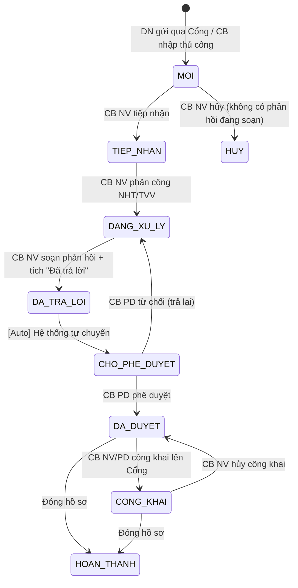
```mermaid
stateDiagram-v2
    [*] --> MOI : DN gửi qua Cổng / CB nhập thủ công
    MOI --> TIEP_NHAN : CB NV tiếp nhận
    MOI --> HUY : CB NV hủy (không có phản hồi đang soạn)
    TIEP_NHAN --> DANG_XU_LY : CB NV phân công NHT/TVV
    DANG_XU_LY --> DA_TRA_LOI : CB NV soạn phản hồi + tích "Đã trả lời"
    DA_TRA_LOI --> CHO_PHE_DUYET : [Auto] Hệ thống tự chuyển
    CHO_PHE_DUYET --> DA_DUYET : CB PD phê duyệt
    CHO_PHE_DUYET --> DANG_XU_LY : CB PD từ chối (trả lại)
    DA_DUYET --> CONG_KHAI : CB NV/PD công khai lên Cổng
    CONG_KHAI --> DA_DUYET : CB NV hủy công khai
    DA_DUYET --> HOAN_THANH : Đóng hồ sơ
    CONG_KHAI --> HOAN_THANH : Đóng hồ sơ
```

**Bảng trạng thái:**

| Trạng thái | Mã | Mô tả | Màu hiển thị |
|-----------|-----|-------|-------------|
| Mới | MOI | Yêu cầu mới tiếp nhận từ Cổng/DVC/nhập tay | Xanh dương |
| Tiếp nhận | TIEP_NHAN | CB NV đã tiếp nhận, chưa phân công | Xanh lá |
| Đang xử lý | DANG_XU_LY | Đã phân công, đang soạn phản hồi | Vàng |
| Đã trả lời | DA_TRA_LOI | CB NV tích hoàn thành (thoáng qua) | — |
| Chờ phê duyệt | CHO_PHE_DUYET | Auto-transition, chờ CB PD duyệt | Cam |
| Đã duyệt | DA_DUYET | CB PD đã duyệt, sẵn sàng công khai | Xanh lá đậm |
| Công khai | CONG_KHAI | Đã đẩy lên Cổng PLQG | Tím |
| Hoàn thành | HOAN_THANH | Đóng hồ sơ | Xám |

**Bảng chuyển trạng thái:**

| Từ | Đến | Trigger | Guard | Action | FR Ref | BR Ref |
|----|-----|---------|-------|--------|--------|--------|
| [*] | MOI | DN gửi qua Cổng/DVC | — | Tạo bản ghi, sinh mã HD-xxx | FR-II-01 | BR-DATA-04 |
| MOI | TIEP_NHAN | CB NV nhấn "Tiếp nhận" | CB NV cùng đơn vị | Ghi audit, tính deadline SLA | FR-II-03 | BR-SLA-01 |
| TIEP_NHAN | DANG_XU_LY | CB NV phân công NHT/TVV | NHT/TVV đang hoạt động | Gửi thông báo NHT/TVV | FR-II-06 | BR-FLOW-01 |
| DANG_XU_LY | DA_TRA_LOI | CB NV tích "Đã trả lời" | Phản hồi không rỗng | Lưu phản hồi | FR-II-07 | — |
| DA_TRA_LOI | CHO_PHE_DUYET | Auto | — | Gửi thông báo CB PD | FR-II-07 | BR-FLOW-01 |
| CHO_PHE_DUYET | DA_DUYET | CB PD phê duyệt | CB PD cùng cấp | Ghi audit | FR-II-08 | BR-AUTH-05 |
| CHO_PHE_DUYET | DANG_XU_LY | CB PD từ chối | Có lý do từ chối | Gửi thông báo CB NV | FR-II-08 | BR-FLOW-04 |
| DA_DUYET | CONG_KHAI | CB nhấn "Công khai" | — | Gửi API trực tiếp lên Cổng PLQG | FR-II-08 | BR-FLOW-05 |
| CONG_KHAI | DA_DUYET | CB nhấn "Hủy công khai" | — | Gỡ khỏi Cổng qua API | FR-II-08 | BR-FLOW-05 |
| MOI | HUY | CB NV hủy yêu cầu | Không có phản hồi đang soạn | Soft delete, ghi audit | FR-II-08 | — | <!-- [Sync GAP-II-01/02] -->
| DA_DUYET | HOAN_THANH | CB NV đóng hồ sơ | — | Ghi audit | FR-II-08 | — | <!-- [Sync GAP-II-01/02] -->
| CONG_KHAI | HOAN_THANH | CB NV đóng hồ sơ | — | Ghi audit | FR-II-08 | — | <!-- [Sync GAP-II-01/02] -->

> **Lưu ý:** Tất cả chuyển trạng thái SHALL sử dụng optimistic locking (kiểm tra version). Crash recovery: scheduled job mỗi 5 phút detect bản ghi ở trạng thái trung gian > 5 phút và retry auto-transition.

**Trạng thái:** ✅ CĐT xác nhận

---

## C.2 SM-KHOAHOC: Khóa đào tạo `[GAP-III-08][2026-05-03 update Cách 2 + refinement]`

**Entity:** KHOA_HOC
**Tham chiếu FR:** FR-III-01 đến FR-III-22 `[GAP-III-08]`
**Trạng thái:** 11 (thêm `TU_CHOI` cho phê duyệt khóa + `TU_CHOI_KQ` cho phê duyệt KQ — Cách 2 + refinement chốt 2026-05-03)

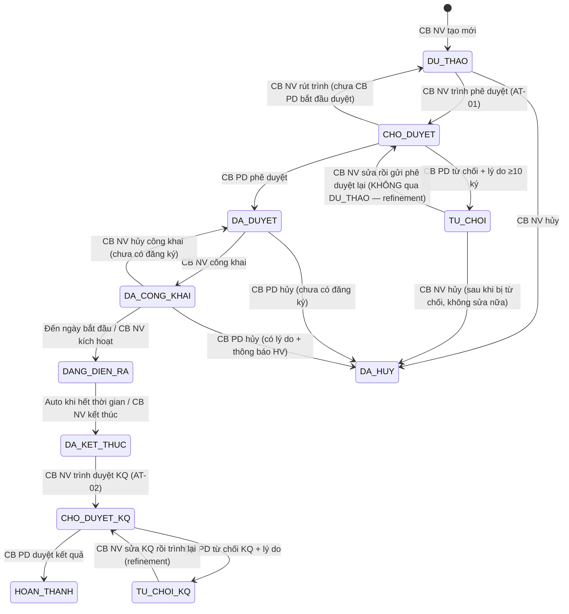
```mermaid
stateDiagram-v2
    [*] --> DU_THAO : CB NV tạo mới
    DU_THAO --> CHO_DUYET : CB NV trình phê duyệt (AT-01)
    CHO_DUYET --> DA_DUYET : CB PD phê duyệt
    CHO_DUYET --> TU_CHOI : CB PD từ chối + lý do ≥10 ký
    CHO_DUYET --> DU_THAO : CB NV rút trình (chưa CB PD bắt đầu duyệt)
    TU_CHOI --> CHO_DUYET : CB NV sửa rồi gửi phê duyệt lại (KHÔNG qua DU_THAO — refinement)
    DA_DUYET --> DA_CONG_KHAI : CB NV công khai
    DA_CONG_KHAI --> DA_DUYET : CB NV hủy công khai (chưa có đăng ký)
    DA_CONG_KHAI --> DANG_DIEN_RA : Đến ngày bắt đầu / CB NV kích hoạt
    DANG_DIEN_RA --> DA_KET_THUC : Auto khi hết thời gian / CB NV kết thúc
    DA_KET_THUC --> CHO_DUYET_KQ : CB NV trình duyệt KQ (AT-02)
    CHO_DUYET_KQ --> HOAN_THANH : CB PD duyệt kết quả
    CHO_DUYET_KQ --> TU_CHOI_KQ : CB PD từ chối KQ + lý do
    TU_CHOI_KQ --> CHO_DUYET_KQ : CB NV sửa KQ rồi trình lại (refinement)
    DU_THAO --> DA_HUY : CB NV hủy
    TU_CHOI --> DA_HUY : CB NV hủy (sau khi bị từ chối, không sửa nữa)
    DA_DUYET --> DA_HUY : CB PD hủy (chưa có đăng ký)
    DA_CONG_KHAI --> DA_HUY : CB PD hủy (có lý do + thông báo HV)
```

**Bảng chuyển trạng thái:**

| Từ | Đến | Trigger | Guard | Action | FR Ref | BR Ref |
|----|-----|---------|-------|--------|--------|--------|
| [*] | DU_THAO | CB NV tạo khóa học | Có CTĐT cha | Tạo bản ghi KHOA_HOC | FR-III-01 | — |
| DU_THAO | CHO_DUYET | CB NV trình phê duyệt (AT-01) | Đủ field bắt buộc + ≥1 bản ghi KHOA_HOC_GIANG_VIEN + ≥1 LICH_HOC | Thông báo CB PD, ghi ngay_tiep_nhan | FR-III-01 | BR-NOTIF-01 |
| CHO_DUYET | DA_DUYET | CB PD phê duyệt | Cùng cấp (BR-AUTH-05) | Ghi thoi_gian_duyet + nguoi_duyet, audit | FR-III-21 `[GAP-III-08]` | BR-AUTH-05, BR-FLOW-03 |
| CHO_DUYET | TU_CHOI | CB PD từ chối | Có lý do ≥10 ký tự | Ghi thoi_gian_tu_choi + nguoi_tu_choi + ly_do_tu_choi, thông báo CB NV. KHÔNG quay DU_THAO — giữ state TU_CHOI để CB NV xem lý do và sửa | FR-III-21 | BR-FLOW-04 |
| TU_CHOI | CHO_DUYET | CB NV gửi phê duyệt lại sau khi sửa | Đã có chỉnh sửa (updated_at > thoi_gian_tu_choi) + đủ guard như DU_THAO→CHO_DUYET | Thông báo CB PD; clear ly_do_tu_choi/thoi_gian_tu_choi | FR-III-01 | BR-NOTIF-01 |
| CHO_DUYET | DU_THAO | CB NV rút trình duyệt | CB NV tạo khóa + CB PD chưa bắt đầu duyệt (vẫn CHO_DUYET) | Thông báo CB PD, giữ data để sửa. KHÁC TU_CHOI — đây là CB NV chủ động rút, không phải bị CB PD từ chối | FR-III-01 | — |
| DA_DUYET | DA_CONG_KHAI | CB NV công khai | — | Set thoi_gian_cong_khai, đẩy lên chuyên trang | FR-III-01 | BR-FLOW-05 |
| DA_CONG_KHAI | DA_DUYET | CB NV hủy công khai | Chưa có đăng ký | Gỡ khỏi chuyên trang | FR-III-01 | BR-FLOW-05 |
| DA_CONG_KHAI | DANG_DIEN_RA | Ngày BĐ hoặc CB kích hoạt | ngay_bat_dau <= NOW() AND có lịch + GV + đăng ký | Thông báo HV + GV | FR-III-01 | BR-NOTIF-01 |
| DANG_DIEN_RA | DA_KET_THUC | Auto khi hết thời gian / CB NV kết thúc | Tất cả buổi đã diễn ra HOẶC override thủ công có lý do | Đóng điểm danh | FR-III-01 | — |
| DA_KET_THUC | CHO_DUYET_KQ | CB NV trình duyệt KQ (AT-02) | Có KQ đầy đủ tất cả HV | TB CB PD | FR-III-17 | BR-AUTH-05 |
| CHO_DUYET_KQ | HOAN_THANH | CB PD duyệt kết quả | Cùng cấp | Ghi thoi_gian_duyet_kq + nguoi_duyet_kq, audit | FR-III-18 | BR-AUTH-05 |
| CHO_DUYET_KQ | TU_CHOI_KQ | CB PD từ chối KQ | Có lý do | Ghi thoi_gian_tu_choi_kq + ly_do_tu_choi_kq, TB CB NV. KHÔNG quay DA_KET_THUC — giữ state TU_CHOI_KQ để CB NV xem lý do và sửa KQ | FR-III-18 | BR-FLOW-04 |
| TU_CHOI_KQ | CHO_DUYET_KQ | CB NV sửa KQ rồi trình lại | Đã sửa KQ (KET_QUA_DAO_TAO.updated_at > thoi_gian_tu_choi_kq) | TB CB PD; clear ly_do_tu_choi_kq | FR-III-17 | BR-NOTIF-01 |
| DU_THAO | DA_HUY | CB NV hủy | — | Soft cancel, audit | FR-III-01 | BR-DATA-01 |
| TU_CHOI | DA_HUY | CB NV hủy (không định sửa nữa) | — | Soft cancel, ghi reason | FR-III-01 | BR-DATA-01 |
| DA_DUYET | DA_HUY | CB PD hủy | Chưa có đăng ký / có lý do + thông báo HV nếu có | Ghi thoi_gian_huy + ly_do_huy, audit | FR-III-01 | BR-NOTIF-01 |
| DA_CONG_KHAI | DA_HUY | CB PD hủy | Có lý do + thông báo HV đã đăng ký (BR-NOTIF-01) | Gỡ khỏi chuyên trang, ghi thoi_gian_huy + ly_do_huy | FR-III-01 | BR-FLOW-05, BR-NOTIF-01 |

> **Guard bổ sung DANG_DIEN_RA → DA_KET_THUC:** Tất cả buổi đã diễn ra (ngay_hoc <= NOW) HOẶC CB NV override thủ công với lý do.

> **Lưu ý DA_HUY:** Khi chuyển DA_HUY từ DA_DUYET/DA_CONG_KHAI có đăng ký: thông báo tất cả HV qua email + in-app, cập nhật DANG_KY_DAO_TAO.trang_thai = 'HUY', giải phóng tài nguyên. Lý do hủy bắt buộc (BR-FLOW-04).

> **Phân biệt 3 trạng thái sau từ chối/rút (Cách 2 + refinement chốt 2026-05-03):**
> - **TU_CHOI:** CB PD đã từ chối khóa + ghi lý do. CB NV xem lý do, sửa, trình lại (TU_CHOI → CHO_DUYET).
> - **TU_CHOI_KQ:** CB PD đã từ chối kết quả khóa. CB NV xem lý do, sửa KQ, trình lại (TU_CHOI_KQ → CHO_DUYET_KQ).
> - **DU_THAO:** Tạo mới hoặc CB NV chủ động rút trình duyệt. KHÁC TU_CHOI vì chưa có history bị từ chối.

> **Naming đổi:** HUY → DA_HUY (align UX Spec v2, C06 Badge) `[GAP-III-08 F-38]`.

**Trạng thái:** ✅ CĐT xác nhận; Cách 2 + refinement chốt BA 2026-05-03

---

## C.3 SM-TVV: Tư vấn viên

**Entity:** TU_VAN_VIEN
**Tham chiếu FR:** FR-IV-01 đến FR-IV-13, FR-IV-NEW-01, FR-IV-NEW-02

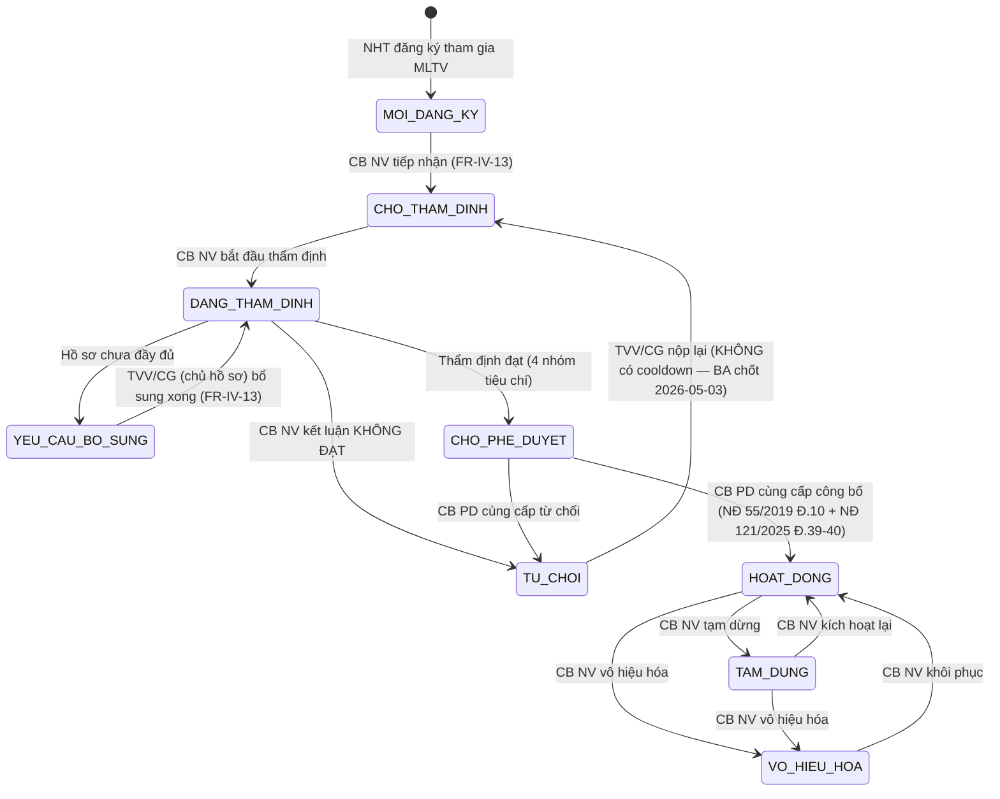
```mermaid
stateDiagram-v2
    [*] --> MOI_DANG_KY : NHT đăng ký tham gia MLTV
    MOI_DANG_KY --> CHO_THAM_DINH : CB NV tiếp nhận (FR-IV-13)
    CHO_THAM_DINH --> DANG_THAM_DINH : CB NV bắt đầu thẩm định
    DANG_THAM_DINH --> YEU_CAU_BO_SUNG : Hồ sơ chưa đầy đủ
    YEU_CAU_BO_SUNG --> DANG_THAM_DINH : TVV/CG (chủ hồ sơ) bổ sung xong (FR-IV-13)
    DANG_THAM_DINH --> CHO_PHE_DUYET : Thẩm định đạt (4 nhóm tiêu chí)
    DANG_THAM_DINH --> TU_CHOI : CB NV kết luận KHÔNG ĐẠT
    CHO_PHE_DUYET --> HOAT_DONG : CB PD cùng cấp công bố (NĐ 55/2019 Đ.10 + NĐ 121/2025 Đ.39-40)
    CHO_PHE_DUYET --> TU_CHOI : CB PD cùng cấp từ chối
    TU_CHOI --> CHO_THAM_DINH : TVV/CG nộp lại (KHÔNG có cooldown — BA chốt 2026-05-03)
    HOAT_DONG --> TAM_DUNG : CB NV tạm dừng
    TAM_DUNG --> HOAT_DONG : CB NV kích hoạt lại
    HOAT_DONG --> VO_HIEU_HOA : CB NV vô hiệu hóa
    TAM_DUNG --> VO_HIEU_HOA : CB NV vô hiệu hóa
    VO_HIEU_HOA --> HOAT_DONG : CB NV khôi phục
```

**Bảng chuyển trạng thái:**

| Từ | Đến | Trigger | Guard | Action | FR Ref | BR Ref |
|----|-----|---------|-------|--------|--------|--------|
| [*] | MOI_DANG_KY | Ứng viên TVV/CG đăng ký MLTV | — | Tạo hồ sơ TVV | FR-IV-03 | — |
| MOI_DANG_KY | CHO_THAM_DINH | CB NV (NHT) tiếp nhận | Hồ sơ đủ giấy tờ, CB NV cùng đơn vị | Ghi `ngay_tiep_nhan`, `nguoi_tiep_nhan`, thông báo TVV/CG (chủ hồ sơ) | FR-IV-13 | BR-AUTH-08 |
| CHO_THAM_DINH | DANG_THAM_DINH | CB NV bắt đầu thẩm định | — | Ghi thời điểm bắt đầu | FR-IV-06 | — |
| DANG_THAM_DINH | YEU_CAU_BO_SUNG | Hồ sơ chưa đầy đủ | CB NV xác nhận thiếu, có `ly_do` | Thông báo TVV/CG (chủ hồ sơ) | FR-IV-06 | — |
| YEU_CAU_BO_SUNG | DANG_THAM_DINH | TVV/CG (chủ hồ sơ) bổ sung xong | Có tài liệu bổ sung (auto trigger từ FR-IV-04) | Thông báo CB NV | FR-IV-13 | — |
| DANG_THAM_DINH | CHO_PHE_DUYET | Thẩm định đạt (trình duyệt) | ket_luan = DAT AND nhom1_ket_qua = true | Ghi kết quả thẩm định, gửi thông báo CB PD cùng cấp (theo phân cấp NĐ 121/2025 Đ.39-40 + NĐ 55/2019 Đ.10) | FR-IV-06 | BR-LEGAL-04, BR-AUTH-05 |
| DANG_THAM_DINH | TU_CHOI | CB NV kết luận KHÔNG ĐẠT | ket_luan = KHONG_DAT, có `ly_do` | Thông báo TVV/CG (chủ hồ sơ) + ghi lý do | FR-IV-06 | BR-FLOW-04 |
| CHO_PHE_DUYET | HOAT_DONG | CB PD duyệt | Cùng cấp thẩm định (BR-AUTH-05) + có `so_quyet_dinh` + optimistic lock | Audit, `ngay_cong_nhan`, `thoi_gian_duyet`, `nguoi_duyet`, `so_quyet_dinh_cong_nhan`. CB PD cấp ĐP/BN/TW đều có thẩm quyền công bố trong phạm vi phân cấp tương ứng (NĐ 121/2025 Đ.39-40 + NĐ 55/2019 Đ.10) | FR-IV-07 | BR-AUTH-05 |
| CHO_PHE_DUYET | TU_CHOI | CB PD từ chối | Cùng cấp + có lý do ≥ 10 ký | `thoi_gian_tu_choi`, `nguoi_tu_choi`, `ly_do_tu_choi`, thông báo CB NV + TVV/CG (chủ hồ sơ) | FR-IV-07 | BR-FLOW-04 |
| TU_CHOI | CHO_THAM_DINH | TVV/CG (chủ hồ sơ) nộp lại hồ sơ | KHÔNG có cooldown (BA chốt 2026-05-03) | Reset kết quả thẩm định cũ, thông báo CB NV | FR-IV-13 | — |
| HOAT_DONG | TAM_DUNG | CB NV tạm dừng | Có lý do ≥ 10 ký | Audit log | FR-IV-12 | — |
| TAM_DUNG | HOAT_DONG | CB NV kích hoạt lại | — | Audit log | FR-IV-12 | — |
| HOAT_DONG | VO_HIEU_HOA | CB NV vô hiệu hóa | KHÔNG có VU_VIEC AND HOI_DAP đang xử lý | Gỡ khỏi Cổng PLQG, audit | FR-IV-12 | — |
| TAM_DUNG | VO_HIEU_HOA | CB NV vô hiệu hóa | KHÔNG có VU_VIEC AND HOI_DAP đang xử lý | Gỡ khỏi Cổng PLQG, audit | FR-IV-12 | — |
| VO_HIEU_HOA | HOAT_DONG | CB NV khôi phục | Quyết định từng trường hợp | Audit log | FR-IV-12 | — |

> **Guard chung VO_HIEU_HOA (từ HOAT_DONG/TAM_DUNG):** Kiểm tra KHÔNG có VU_VIEC **và** HOI_DAP đang xử lý (trang_thai IN ('DANG_XU_LY','CHO_PHE_DUYET')).
>
> **Áp dụng BR-AUTH-05 cho FR-IV-07 + FR-IV-NEW-04 (BA chốt 2026-05-03):** Mỗi cấp tự công bố mạng lưới TVV/TC TV theo phạm vi phân cấp pháp lý — UBND cấp tỉnh (Sở TP/CB_PD_ĐP) công bố mạng lưới ở địa phương theo NĐ 121/2025 Đ.39-40; mỗi bộ/cơ quan ngang bộ (CB_PD_BN) tự công bố mạng lưới ngành mình theo NĐ 55/2019 Đ.10; Bộ Tư pháp (CB_PD_TW) công bố mạng lưới quốc gia. KHÔNG có ESCALATE bắt buộc.

**Trạng thái:** ✅ CĐT xác nhận

---

## C.3a SM-TCTV: Tổ chức Tư vấn `[GAP-IV-09][GAP-IV-10]` `[BA chốt 2026-05-03 — F-FR04-05 phương án A]`

**Entity:** TO_CHUC_TU_VAN
**Tham chiếu FR:** FR-IV-NEW-01, FR-IV-NEW-02, **FR-IV-NEW-04 (phê duyệt TC TV — mới)**

**Pháp lý:** NĐ 55/2019 Điều 10 — Tổ chức mạng lưới TVV PL cho HTPL DN. TC TV phải qua luồng "thông báo tham gia + được bộ/cơ quan ngang bộ công bố công khai" trước khi vào MLTV. KHÔNG được tạo trực tiếp HOAT_DONG.

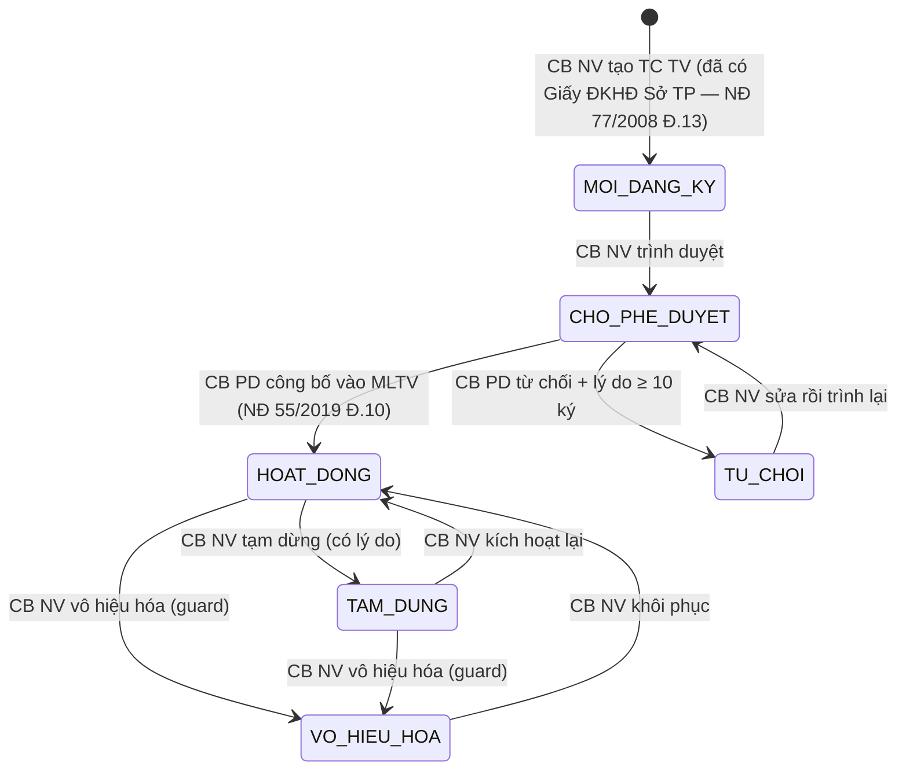
```mermaid
stateDiagram-v2
    [*] --> MOI_DANG_KY : CB NV tạo TC TV (đã có Giấy ĐKHĐ Sở TP — NĐ 77/2008 Đ.13)
    MOI_DANG_KY --> CHO_PHE_DUYET : CB NV trình duyệt
    CHO_PHE_DUYET --> HOAT_DONG : CB PD công bố vào MLTV (NĐ 55/2019 Đ.10)
    CHO_PHE_DUYET --> TU_CHOI : CB PD từ chối + lý do ≥ 10 ký
    TU_CHOI --> CHO_PHE_DUYET : CB NV sửa rồi trình lại
    HOAT_DONG --> TAM_DUNG : CB NV tạm dừng (có lý do)
    TAM_DUNG --> HOAT_DONG : CB NV kích hoạt lại
    HOAT_DONG --> VO_HIEU_HOA : CB NV vô hiệu hóa (guard)
    TAM_DUNG --> VO_HIEU_HOA : CB NV vô hiệu hóa (guard)
    VO_HIEU_HOA --> HOAT_DONG : CB NV khôi phục
```

**Bảng trạng thái:**

| Trạng thái | Mã | Mô tả | Màu hiển thị |
|-----------|-----|-------|-------------|
| Mới đăng ký | MOI_DANG_KY | CB NV mới tạo TC TV, chưa trình duyệt | Xám |
| Chờ phê duyệt | CHO_PHE_DUYET | Đã trình CB PD, chờ công bố vào MLTV | Cam đậm |
| Từ chối | TU_CHOI | CB PD từ chối công bố | Đỏ |
| Đang hoạt động | HOAT_DONG | TC TV đã được công bố, đang hoạt động trong MLTV | Xanh lá |
| Tạm dừng | TAM_DUNG | CB NV tạm dừng hoạt động | Vàng đậm |
| Vô hiệu hóa | VO_HIEU_HOA | TC TV bị vô hiệu hóa | Đỏ đậm |

**Bảng chuyển trạng thái:**

| Từ | Đến | Trigger | Guard | Action | FR Ref |
|----|-----|---------|-------|--------|--------|
| [*] | MOI_DANG_KY | CB NV tạo TC TV | Có Giấy ĐKHĐ Sở TP (NĐ 77/2008 Đ.13) | Tạo bản ghi TO_CHUC_TU_VAN | FR-IV-NEW-01 |
| MOI_DANG_KY | CHO_PHE_DUYET | CB NV trình duyệt | Đủ field bắt buộc | Thông báo CB PD cùng cấp | FR-IV-NEW-01 |
| CHO_PHE_DUYET | HOAT_DONG | CB PD công bố | Cùng cấp (BR-AUTH-05), có `so_quyet_dinh` | Set ngay_cong_nhan, thoi_gian_duyet, nguoi_duyet, audit | FR-IV-NEW-04 |
| CHO_PHE_DUYET | TU_CHOI | CB PD từ chối | Có lý do ≥ 10 ký | thoi_gian_tu_choi, nguoi_tu_choi, ly_do_tu_choi, thông báo CB NV | FR-IV-NEW-04 |
| TU_CHOI | CHO_PHE_DUYET | CB NV sửa rồi trình lại | Đã sửa (updated_at > thoi_gian_tu_choi) | Thông báo CB PD | FR-IV-NEW-01 |
| HOAT_DONG | TAM_DUNG | CB NV tạm dừng | Có lý do ≥ 10 ký | Audit log | FR-IV-NEW-02 |
| TAM_DUNG | HOAT_DONG | CB NV kích hoạt lại | — | Audit log | FR-IV-NEW-02 |
| HOAT_DONG | VO_HIEU_HOA | CB NV vô hiệu hóa | KHÔNG có TVV đang liên kết hoạt động (`COUNT(TVV_TO_CHUC WHERE to_chuc_id=@id AND TVV.trang_thai='HOAT_DONG') = 0`) | Gỡ khỏi Cổng PLQG nếu đã công khai, audit | FR-IV-NEW-02 |
| TAM_DUNG | VO_HIEU_HOA | CB NV vô hiệu hóa | Same guard | Gỡ khỏi Cổng PLQG, audit | FR-IV-NEW-02 |
| VO_HIEU_HOA | HOAT_DONG | CB NV khôi phục | Quyết định từng trường hợp | Audit log | FR-IV-NEW-02 |

**Trạng thái:** 🟢 Cập nhật BA chốt 2026-05-03 — mở rộng từ 3 trạng thái thành 6 trạng thái theo NĐ 55/2019 Đ.10 (TC TV phải qua luồng phê duyệt để công bố vào MLTV)

---

## C.4 SM-VUVIEC: Vụ việc HTPL

**Entity:** VU_VIEC
**Tham chiếu FR:** FR-V.I-01 đến FR-V.I-17

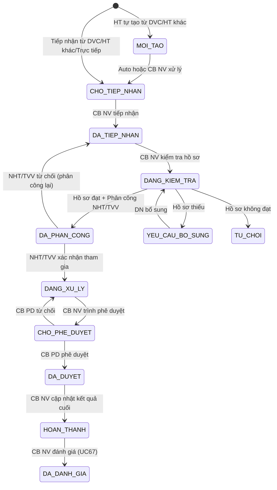
```mermaid
stateDiagram-v2
    [*] --> MOI_TAO : HT tự tạo từ DVC/HT khác
    MOI_TAO --> CHO_TIEP_NHAN : Auto hoặc CB NV xử lý
    [*] --> CHO_TIEP_NHAN : Tiếp nhận từ DVC/HT khác/Trực tiếp
    CHO_TIEP_NHAN --> DA_TIEP_NHAN : CB NV tiếp nhận
    DA_TIEP_NHAN --> DANG_KIEM_TRA : CB NV kiểm tra hồ sơ
    DANG_KIEM_TRA --> DA_PHAN_CONG : Hồ sơ đạt + Phân công NHT/TVV
    DANG_KIEM_TRA --> YEU_CAU_BO_SUNG : Hồ sơ thiếu
    YEU_CAU_BO_SUNG --> DANG_KIEM_TRA : DN bổ sung
    DANG_KIEM_TRA --> TU_CHOI : Hồ sơ không đạt
    DA_PHAN_CONG --> DANG_XU_LY : NHT/TVV xác nhận tham gia
    DA_PHAN_CONG --> DA_TIEP_NHAN : NHT/TVV từ chối (phân công lại)
    DANG_XU_LY --> CHO_PHE_DUYET : CB NV trình phê duyệt
    CHO_PHE_DUYET --> DA_DUYET : CB PD phê duyệt
    CHO_PHE_DUYET --> DANG_XU_LY : CB PD từ chối
    DA_DUYET --> HOAN_THANH : CB NV cập nhật kết quả cuối
    HOAN_THANH --> DA_DANH_GIA : CB NV đánh giá (UC67)
```

**Bảng chuyển trạng thái:**

| Từ | Đến | Trigger | Guard | Action | FR Ref | BR Ref |
|----|-----|---------|-------|--------|--------|--------|
| [*] | MOI_TAO | HT tự tạo từ DVC/HT khác | — | Tạo VV, sinh mã | FR-V.I-03/04/05 | — |
| MOI_TAO | CHO_TIEP_NHAN | Auto hoặc CB NV xử lý | — | Tính deadline, audit | FR-V.I-03/04/05 | BR-SLA-01 |
| [*] | CHO_TIEP_NHAN | DVC/HT khác/Trực tiếp | — | Tạo VV, sinh mã, tính deadline | FR-V.I-03/04/05 | BR-SLA-01 |
| CHO_TIEP_NHAN | DA_TIEP_NHAN | CB NV tiếp nhận | CB NV cùng đơn vị | Audit, gửi TB DN (nếu DVC) | FR-V.I-01 | — |
| DA_TIEP_NHAN | DANG_KIEM_TRA | CB NV kiểm tra | — | Đối chiếu checklist UC106 | FR-V.I-06 | BR-LEGAL-02 |
| DANG_KIEM_TRA | DA_PHAN_CONG | Đạt + chọn NHT | NHT đang hoạt động | Gửi TB NHT | FR-V.I-09 | BR-CALC-07 |
| DANG_KIEM_TRA | YEU_CAU_BO_SUNG | Thiếu HS | — | TB DN bổ sung | FR-V.I-06 | — |
| DANG_KIEM_TRA | TU_CHOI | Không đạt | — | TB DN kết quả | FR-V.I-12 | — |
| DA_PHAN_CONG | DANG_XU_LY | NHT xác nhận | — | Audit | FR-V.I-10 | — |
| DA_PHAN_CONG | DA_TIEP_NHAN | NHT từ chối | Có lý do | Quay lại chọn NHT khác | FR-V.I-10 | — |
| DANG_XU_LY | CHO_PHE_DUYET | CB NV trình | NHT đã cập nhật KQ | TB CB PD | FR-V.I-11 | BR-AUTH-05 |
| CHO_PHE_DUYET | DA_DUYET | CB PD duyệt | Cùng cấp | Audit | FR-V.I-13 | BR-AUTH-05 |
| CHO_PHE_DUYET | DANG_XU_LY | CB PD từ chối | Có lý do | TB CB NV | FR-V.I-13 | BR-FLOW-04 |
| DA_DUYET | HOAN_THANH | CB NV cập nhật KQ cuối | — | Audit, TB DN | FR-V.I-16 | — |
| HOAN_THANH | DA_DANH_GIA | CB NV đánh giá (UC67) | VV đã hoàn thành | Lưu đánh giá, audit | FR-V.I-17 | — |
| TU_CHOI | DA_TIEP_NHAN | QTHT/CB NV mở lại | Admin override hoặc DN khiếu nại | Audit log, ghi lý do | FR-V.I-xx | — |
| YEU_CAU_BO_SUNG | TU_CHOI | Auto: quá N ngày LV | elapsed > cau_hinh_sla.bo_sung_timeout | TB DN, ghi audit | BR-EC-16 | — |

> **Lưu ý:** Tối đa 3 lần bổ sung (BR-EC-15). Sau lần thứ 3 nếu vẫn KHONG_DAT → tự động TU_CHOI.

**Trạng thái:** ✅ CĐT xác nhận

---

## C.5 SM-CHITRA: Chi trả Chi phí

**Entity:** HO_SO_CHI_TRA
**Tham chiếu FR:** FR-V.II-01 → FR-V.II-14, FR-V.II-CROSS-01
**Nguồn chi tiết:** `srs-fr-06-chi-tra.md` Section 5 (authoritative, đồng bộ 2026-04-20)

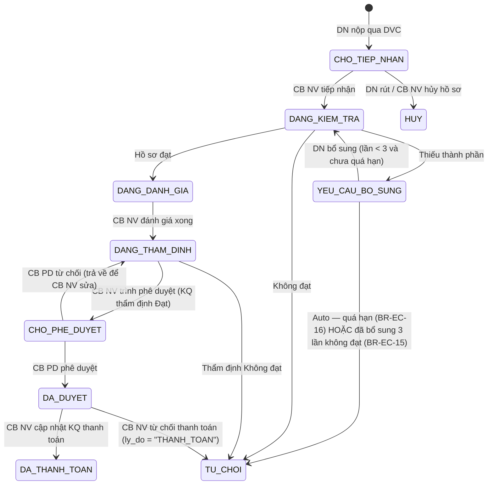
```mermaid
stateDiagram-v2
    [*] --> CHO_TIEP_NHAN : DN nộp qua DVC
    CHO_TIEP_NHAN --> DANG_KIEM_TRA : CB NV tiếp nhận
    DANG_KIEM_TRA --> DANG_DANH_GIA : Hồ sơ đạt
    DANG_KIEM_TRA --> YEU_CAU_BO_SUNG : Thiếu thành phần
    YEU_CAU_BO_SUNG --> DANG_KIEM_TRA : DN bổ sung (lần < 3 và chưa quá hạn)
    YEU_CAU_BO_SUNG --> TU_CHOI : Auto — quá hạn (BR-EC-16) HOẶC đã bổ sung 3 lần không đạt (BR-EC-15)
    DANG_KIEM_TRA --> TU_CHOI : Không đạt
    DANG_DANH_GIA --> DANG_THAM_DINH : CB NV đánh giá xong
    DANG_THAM_DINH --> CHO_PHE_DUYET : CB NV trình phê duyệt (KQ thẩm định Đạt)
    DANG_THAM_DINH --> TU_CHOI : Thẩm định Không đạt
    CHO_PHE_DUYET --> DA_DUYET : CB PD phê duyệt
    CHO_PHE_DUYET --> DANG_THAM_DINH : CB PD từ chối (trả về để CB NV sửa)
    DA_DUYET --> DA_THANH_TOAN : CB NV cập nhật KQ thanh toán
    DA_DUYET --> TU_CHOI : CB NV từ chối thanh toán (ly_do = "THANH_TOAN")
    CHO_TIEP_NHAN --> HUY : DN rút / CB NV hủy hồ sơ
```

**Bảng chuyển trạng thái:**

| Từ | Đến | Trigger | Guard | Action | FR Ref | BR Ref |
|----|-----|---------|-------|--------|--------|--------|
| [*] | CHO_TIEP_NHAN | DN nộp qua DVC | — | Tạo HS, validate Mẫu 01 (18 trường), tính deadline, `muc_do_canh_bao = 'BINH_THUONG'` | FR-V.II-01 | BR-LEGAL-02, BR-CALC-03 |
| CHO_TIEP_NHAN | DANG_KIEM_TRA | CB NV tiếp nhận | — | Ghi `ngay_tiep_nhan`, `nguoi_tiep_nhan_id`, audit | FR-V.II-02 | — |
| DANG_KIEM_TRA | DANG_DANH_GIA | Kiểm tra Đạt | Checklist đủ | TB DVC kết quả | FR-V.II-03/04 | — |
| DANG_KIEM_TRA | YEU_CAU_BO_SUNG | Kiểm tra cần bổ sung | — | Tăng `bo_sung_count`, ghi `ngay_yeu_cau_bo_sung`, TB DN qua DVC | FR-V.II-03 | BR-EC-15 |
| DANG_KIEM_TRA | TU_CHOI | CB NV kiểm tra không đạt | Có lý do | Ghi `ly_do_tu_choi`, `thoi_gian_tu_choi`, `nguoi_tu_choi_id` | FR-V.II-03 | BR-FLOW-04 |
| DANG_DANH_GIA | DANG_THAM_DINH | CB NV đánh giá xong | Tính mức HT theo quy mô DN | Áp dụng BR-CALC-01/02 | FR-V.II-05 | BR-CALC-01/02 |
| DANG_THAM_DINH | CHO_PHE_DUYET | CB NV Trình phê duyệt | `ket_qua_tham_dinh = DAT` | TB CB PD cùng cấp | FR-V.II-11 | BR-AUTH-05 |
| DANG_THAM_DINH | TU_CHOI | Thẩm định Không đạt | Có nhận xét | Ghi `ly_do_tu_choi = "THAM_DINH: " + nhan_xet` | FR-V.II-09 | BR-FLOW-04 |
| CHO_PHE_DUYET | DA_DUYET | CB PD phê duyệt | Cùng cấp (BR-AUTH-05) | Ghi `nguoi_phe_duyet_id`, `ngay_phe_duyet`, tạo PHE_DUYET_CHI_TRA | FR-V.II-12 | BR-AUTH-05 |
| CHO_PHE_DUYET | DANG_THAM_DINH | CB PD từ chối (trả về) | Có lý do ≥ 10 ký tự | Ghi `ly_do_tu_choi`, tạo PHE_DUYET_CHI_TRA (`quyet_dinh = TU_CHOI`), TB CB NV | FR-V.II-12 | BR-FLOW-04 |
| DA_DUYET | DA_THANH_TOAN | CB NV cập nhật TT | — | Ghi `so_tien_thuc_tra`, `ngay_thanh_toan` | FR-V.II-13 | — |
| DA_DUYET | TU_CHOI | CB NV từ chối thanh toán | Có lý do | Ghi `ly_do_tu_choi = "THANH_TOAN: " + ly_do` | FR-V.II-13 | BR-FLOW-04 |
| YEU_CAU_BO_SUNG | DANG_KIEM_TRA | DN bổ sung | File hợp lệ, chưa quá hạn, `bo_sung_count < 3` | Lưu file, TB CB NV | FR-V.II-14 | BR-DATA-03 |
| YEU_CAU_BO_SUNG | TU_CHOI | Auto: quá N ngày LV | `elapsed(ngay_yeu_cau_bo_sung) > CAU_HINH_SLA[HO_SO_CHI_TRA_BO_SUNG].thoi_han_ngay` | TB DN qua DVC, `nguoi_tu_choi_id = SYSTEM` | FR-V.II-CROSS-01 | BR-EC-16 |
| YEU_CAU_BO_SUNG | TU_CHOI | Auto: 3 lần không đạt | `bo_sung_count ≥ 3` AND `ket_qua ≠ DAT` | TB DN, `ly_do = "Đã bổ sung 3 lần không đạt"` | FR-V.II-03 | BR-EC-15 |
| CHO_TIEP_NHAN | HUY | DN rút / CB NV hủy | Trạng thái chưa qua DANG_DANH_GIA | Ghi `ly_do_huy`, TB DVC, audit | FR-V.II-02 | — |

**Trạng thái:** ✅ CĐT xác nhận | 🟡 Mức hỗ trợ NĐ18/2026
**Thay đổi 2026-04-20:** Bỏ trạng thái `DA_THAM_DINH` (không có thực trong enum); "CB PD từ chối" chính thức là trả về `DANG_THAM_DINH` (không phải TU_CHOI cuối); thêm 3 transition auto (BR-EC-15/16, thẩm định Không đạt, từ chối thanh toán); thêm DA_DUYET → TU_CHOI.

---

## C.6 SM-DANHGIA: Đánh giá Hiệu quả

**Entity:** KE_HOACH_DANH_GIA (+ KET_QUA_DANH_GIA + BAO_CAO_DANH_GIA)
**Tham chiếu FR:** FR-VI-01 đến FR-VI-09

<!-- [Sync GAP-VI-01] Bổ sung state HUY + 4 transitions hủy từ các trạng thái chưa hoàn thành. Thêm bảng trạng thái + màu hiển thị. -->

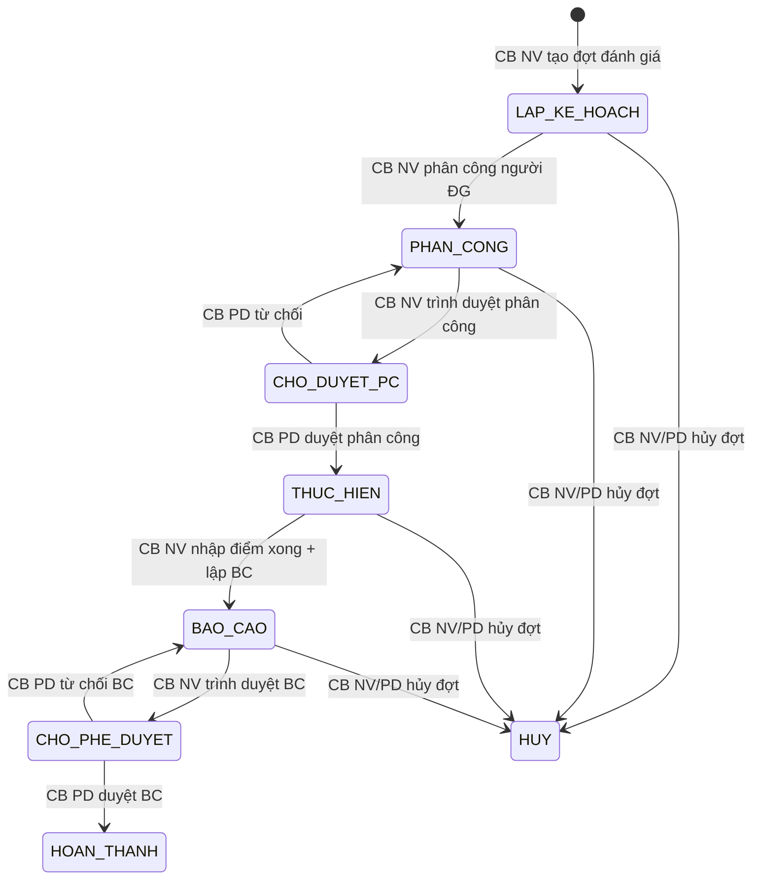
```mermaid
stateDiagram-v2
    [*] --> LAP_KE_HOACH : CB NV tạo đợt đánh giá
    LAP_KE_HOACH --> PHAN_CONG : CB NV phân công người ĐG
    PHAN_CONG --> CHO_DUYET_PC : CB NV trình duyệt phân công
    CHO_DUYET_PC --> THUC_HIEN : CB PD duyệt phân công
    CHO_DUYET_PC --> PHAN_CONG : CB PD từ chối
    THUC_HIEN --> BAO_CAO : CB NV nhập điểm xong + lập BC
    BAO_CAO --> CHO_PHE_DUYET : CB NV trình duyệt BC
    CHO_PHE_DUYET --> HOAN_THANH : CB PD duyệt BC
    CHO_PHE_DUYET --> BAO_CAO : CB PD từ chối BC
    LAP_KE_HOACH --> HUY : CB NV/PD hủy đợt
    PHAN_CONG --> HUY : CB NV/PD hủy đợt
    THUC_HIEN --> HUY : CB NV/PD hủy đợt
    BAO_CAO --> HUY : CB NV/PD hủy đợt
```

**Bảng trạng thái:**

| Trạng thái | Mã | Mô tả | Màu hiển thị |
|-----------|-----|-------|-------------|
| Lập kế hoạch | LAP_KE_HOACH | CB NV đang lập kế hoạch đợt đánh giá | Xám |
| Phân công | PHAN_CONG | CB NV đang phân công người đánh giá | Xanh dương |
| Chờ duyệt phân công | CHO_DUYET_PC | CB NV trình, chờ CB PD duyệt phân công | Cam |
| Thực hiện | THUC_HIEN | CB PD đã duyệt, đang chấm điểm vụ việc | Vàng |
| Báo cáo | BAO_CAO | CB NV nhập điểm xong, đang lập báo cáo | Xanh dương đậm |
| Chờ phê duyệt | CHO_PHE_DUYET | CB NV trình báo cáo, chờ CB PD duyệt | Cam đậm |
| Hoàn thành | HOAN_THANH | CB PD đã duyệt báo cáo, đóng đợt đánh giá | Xanh lá |
| Hủy | HUY | Đợt đánh giá bị hủy | Đỏ | <!-- [Sync GAP-VI-01] -->

**Bảng chuyển trạng thái:**

| Từ | Đến | Trigger | Guard | Action | FR Ref | BR Ref |
|----|-----|---------|-------|--------|--------|--------|
| [*] | LAP_KE_HOACH | CB NV tạo đợt | Tần suất: 6 tháng/năm | Tạo KH | FR-VI-01 | BR-LEGAL-08 |
| LAP_KE_HOACH | PHAN_CONG | CB NV phân công | Có KH | Gán CB/CG | FR-VI-03 | — |
| PHAN_CONG | CHO_DUYET_PC | CB NV trình | Có danh sách PC | TB CB PD | FR-VI-03 | BR-AUTH-05 |
| CHO_DUYET_PC | THUC_HIEN | CB PD duyệt | Cùng cấp | Audit, chọn VV | FR-VI-04/05 | — |
| CHO_DUYET_PC | PHAN_CONG | CB PD từ chối | Có lý do | TB CB NV | FR-VI-04 | BR-FLOW-04 | <!-- [Sync GAP-VI-01] -->
| THUC_HIEN | BAO_CAO | Nhập điểm xong | Tất cả VV đã ĐG | Sinh BC TT17 | FR-VI-06/07 | BR-CALC-04 |
| BAO_CAO | CHO_PHE_DUYET | CB NV trình | BC đủ dữ liệu | TB CB PD | FR-VI-08 | — |
| CHO_PHE_DUYET | HOAN_THANH | CB PD duyệt | Cùng cấp | Audit | FR-VI-09 | BR-AUTH-05 |
| CHO_PHE_DUYET | BAO_CAO | CB PD từ chối | Có lý do | TB CB NV | FR-VI-09 | BR-FLOW-04 |
| LAP_KE_HOACH/PHAN_CONG/THUC_HIEN/BAO_CAO | HUY | CB NV/PD hủy đợt | Có lý do, chưa HOAN_THANH | Audit, soft-delete | — | — | <!-- [Sync GAP-VI-01] -->

**Trạng thái:** ✅ CĐT xác nhận

---

## C.7 SM-KH-CTHTPL: Kế hoạch CT HTPLDN

> **V2.1 (C3-19):** Tách từ SM-CTHTPL cũ thành 2 SM: SM-KH-CTHTPL (kế hoạch) + SM-DOT-BC (đợt BC).

**Entity:** CHUONG_TRINH_HTPL
**Tham chiếu FR:** FR-XI-01 đến FR-XI-05

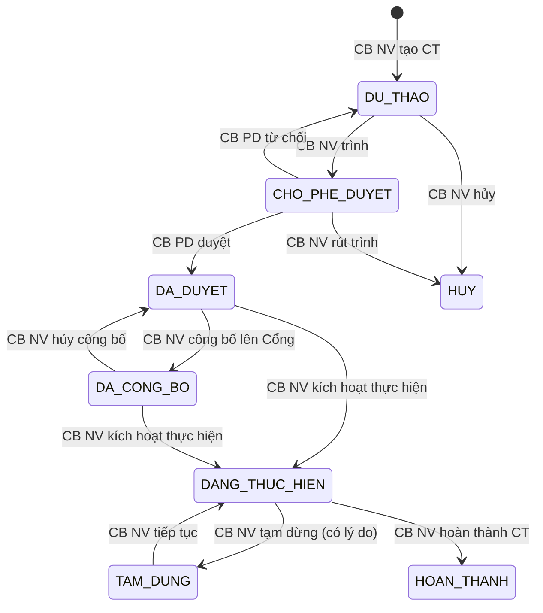
```mermaid
stateDiagram-v2
    [*] --> DU_THAO : CB NV tạo CT
    DU_THAO --> CHO_PHE_DUYET : CB NV trình
    CHO_PHE_DUYET --> DA_DUYET : CB PD duyệt
    CHO_PHE_DUYET --> DU_THAO : CB PD từ chối
    DA_DUYET --> DA_CONG_BO : CB NV công bố lên Cổng
    DA_CONG_BO --> DA_DUYET : CB NV hủy công bố
    DA_DUYET --> DANG_THUC_HIEN : CB NV kích hoạt thực hiện
    DA_CONG_BO --> DANG_THUC_HIEN : CB NV kích hoạt thực hiện
    DANG_THUC_HIEN --> TAM_DUNG : CB NV tạm dừng (có lý do)
    TAM_DUNG --> DANG_THUC_HIEN : CB NV tiếp tục
    DANG_THUC_HIEN --> HOAN_THANH : CB NV hoàn thành CT
    DU_THAO --> HUY : CB NV hủy
    CHO_PHE_DUYET --> HUY : CB NV rút trình
```

**Bảng chuyển trạng thái:**

| Từ | Đến | Trigger | Guard | Action | FR Ref | BR Ref |
|----|-----|---------|-------|--------|--------|--------|
| [*] | DU_THAO | CB NV tạo CT | — | Tạo bản ghi | FR-XI-01 | — |
| DU_THAO | CHO_PHE_DUYET | CB NV trình | Đủ thông tin | TB CB PD | FR-XI-03 | BR-AUTH-05 |
| CHO_PHE_DUYET | DA_DUYET | CB PD duyệt | Cùng cấp | Audit | FR-XI-04 | BR-AUTH-05 |
| CHO_PHE_DUYET | DU_THAO | CB PD từ chối | Có lý do | TB CB NV | FR-XI-04 | BR-FLOW-04 |
| DA_DUYET | DA_CONG_BO | CB NV công bố | — | API trực tiếp lên Cổng PLQG | FR-XI-05 | BR-FLOW-05 |
| DA_CONG_BO | DA_DUYET | CB NV hủy công bố | — | Gỡ khỏi Cổng | FR-XI-05 | BR-FLOW-05 |
| DA_DUYET | DANG_THUC_HIEN | CB NV kích hoạt | — | — | FR-XI-01 | — |
| DA_CONG_BO | DANG_THUC_HIEN | CB NV kích hoạt | — | — | FR-XI-01 | — |
| DANG_THUC_HIEN | HOAN_THANH | CB NV hoàn thành | — | Ghi audit | FR-XI-01 | — |
| DANG_THUC_HIEN | TAM_DUNG | CB NV tạm dừng CT | Có lý do | Ghi audit | — | — |
| TAM_DUNG | DANG_THUC_HIEN | CB NV tiếp tục | — | Ghi audit | — | — |
| DU_THAO | HUY | CB NV hủy | — | Ghi audit | — | — |
| CHO_PHE_DUYET | HUY | CB NV rút trình | CB NV tạo ban đầu | Ghi audit, TB CB PD | — | — |

**Trạng thái:** ✅ CĐT xác nhận

---

## C.7a SM-DOT-BC: Đợt báo cáo CT HTPLDN

> **Mới v2.1 (C1-8, C1-9, C3-19).** Quản lý vòng đời đợt báo cáo riêng biệt với kế hoạch CT.

**Entity:** DOT_BAO_CAO
**Tham chiếu FR:** FR-XI-05a, FR-XI-06, FR-XI-07, FR-XI-07a, FR-XI-08, FR-XI-09

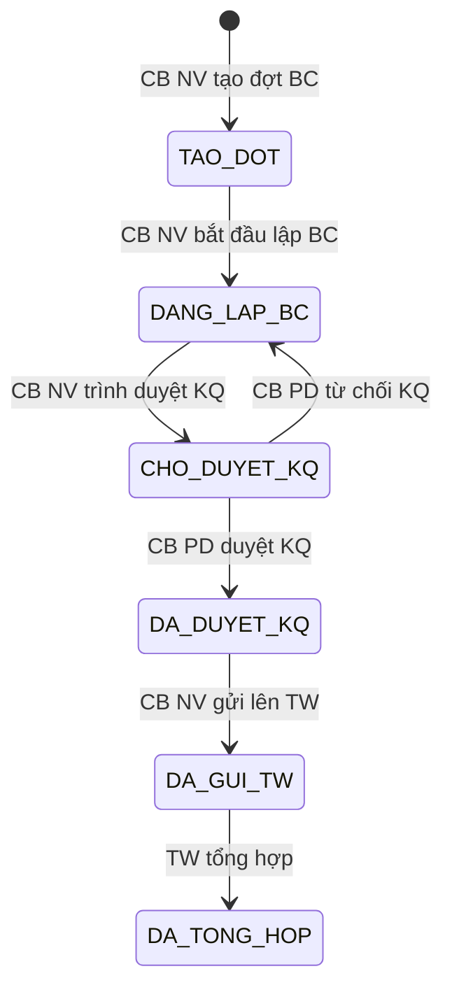
```mermaid
stateDiagram-v2
    [*] --> TAO_DOT : CB NV tạo đợt BC
    TAO_DOT --> DANG_LAP_BC : CB NV bắt đầu lập BC
    DANG_LAP_BC --> CHO_DUYET_KQ : CB NV trình duyệt KQ
    CHO_DUYET_KQ --> DA_DUYET_KQ : CB PD duyệt KQ
    CHO_DUYET_KQ --> DANG_LAP_BC : CB PD từ chối KQ
    DA_DUYET_KQ --> DA_GUI_TW : CB NV gửi lên TW
    DA_GUI_TW --> DA_TONG_HOP : TW tổng hợp
```

**Bảng chuyển trạng thái:**

| Từ | Đến | Trigger | Guard | Action | FR Ref | BR Ref |
|----|-----|---------|-------|--------|--------|--------|
| [*] | TAO_DOT | CB NV tạo đợt | CT ở DANG_THUC_HIEN/HOAN_THANH | Auto-gen mã đợt | FR-XI-05a | — |
| TAO_DOT | DANG_LAP_BC | CB NV bắt đầu lập BC | Đợt đã hoàn chỉnh thông tin | Tạo BAO_CAO_CT_HTPL record | FR-XI-06 | — |
| DANG_LAP_BC | CHO_DUYET_KQ | CB NV trình duyệt KQ | BC đầy đủ số liệu | TB CB PD | FR-XI-07 | BR-AUTH-05 |
| CHO_DUYET_KQ | DA_DUYET_KQ | CB PD duyệt KQ | Cùng cấp | Audit, TB CB NV | FR-XI-07a | BR-AUTH-05 |
| CHO_DUYET_KQ | DANG_LAP_BC | CB PD từ chối KQ | Có lý do | TB CB NV kèm lý do | FR-XI-07a | BR-FLOW-04 |
| DA_DUYET_KQ | DA_GUI_TW | CB NV BN/ĐP gửi TW | Chỉ BN/ĐP | TB CB NV TW | FR-XI-08 | — |
| DA_GUI_TW | DA_TONG_HOP | TW tổng hợp | CB NV TW xác nhận | Tạo BC tổng hợp | FR-XI-09 | — |

**Trạng thái:** ✅ CĐT xác nhận (CSV STT 165, 168)

---

## C.8 SM-TVCS: Tư vấn Chuyên sâu

<!-- [Sync GAP-X.1-01] Cập nhật FR refs (FR-X.1-01 thay cho FR-X.1-10/11/14 đã LOẠI BỎ), thêm bảng trạng thái, thêm TIEP_NHAN→HUY vào transition table. -->

**Entity:** TU_VAN_CHUYEN_SAU
**Tham chiếu FR:** FR-X.1-01 đến FR-X.1-07

> **V2.1 (C3-14):** 5 UC LOẠI BỎ (UC147/148/154/155/156) + UC151 đã xóa. SM-TVCS giữ nguyên vì luồng chính không thay đổi.
> **SM-TVNHANH** (Nhóm X.2 Tư vấn Nhanh): Khai báo chi tiết tại `srs-fr-13-tv-nhanh.md` §5 SM-TVNHANH, **6 trạng thái** (MOI → DANG_TIM_KIEM → DA_GOI_Y → CB_TRA_LOI → HOAN_THANH / HET_HAN — đồng bộ với enum `TU_VAN_NHANH.trang_thai` tại §3.4.3.X file FR group). Không tạo appendix riêng tại file master vì SM đơn giản, đã mô tả đầy đủ ở file FR group.

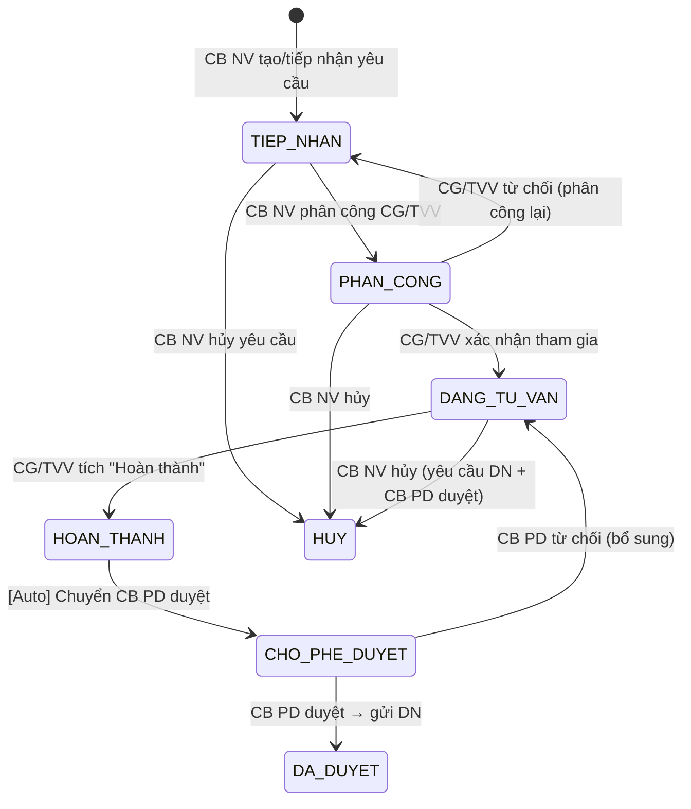
```mermaid
stateDiagram-v2
    [*] --> TIEP_NHAN : CB NV tạo/tiếp nhận yêu cầu
    TIEP_NHAN --> PHAN_CONG : CB NV phân công CG/TVV
    PHAN_CONG --> DANG_TU_VAN : CG/TVV xác nhận tham gia
    PHAN_CONG --> TIEP_NHAN : CG/TVV từ chối (phân công lại)
    DANG_TU_VAN --> HOAN_THANH : CG/TVV tích "Hoàn thành"
    HOAN_THANH --> CHO_PHE_DUYET : [Auto] Chuyển CB PD duyệt
    CHO_PHE_DUYET --> DA_DUYET : CB PD duyệt → gửi DN
    CHO_PHE_DUYET --> DANG_TU_VAN : CB PD từ chối (bổ sung)
    TIEP_NHAN --> HUY : CB NV hủy yêu cầu
    PHAN_CONG --> HUY : CB NV hủy
    DANG_TU_VAN --> HUY : CB NV hủy (yêu cầu DN + CB PD duyệt)
```

**Bảng trạng thái:**

| Trạng thái | Mã | Mô tả |
|-----------|-----|-------|
| TIEP_NHAN | received | Yêu cầu TV mới tạo/tiếp nhận từ Cổng |
| PHAN_CONG | assigned | Đã phân công CG/TVV, chờ xác nhận |
| DANG_TU_VAN | in_progress | CG/TVV đang tư vấn |
| HOAN_THANH | completed | CG/TVV hoàn thành, chờ phê duyệt |
| CHO_PHE_DUYET | pending_approval | Chờ CB PD duyệt |
| DA_DUYET | approved | Đã duyệt, gửi kết quả cho DN |
| HUY | cancelled | Hủy yêu cầu |

**Bảng chuyển trạng thái:**

| Từ | Đến | Trigger | Guard | Action | FR Ref | BR Ref |
|----|-----|---------|-------|--------|--------|--------|
| [*] | TIEP_NHAN | CB NV tạo YC TV | — | Tạo bản ghi | FR-X.1-01/03 | — |
| TIEP_NHAN | PHAN_CONG | CB NV phân công | Có CG/TVV phù hợp | TB CG/TVV | FR-X.1-01 | — | <!-- [Sync GAP-X.1-01] -->
| PHAN_CONG | DANG_TU_VAN | CG xác nhận | — | Tạo phiên TV, TB DN | FR-X.1-01 | — | <!-- [Sync GAP-X.1-01] -->
| PHAN_CONG | TIEP_NHAN | CG từ chối | Có lý do | Quay lại chọn CG khác | FR-X.1-01 | — | <!-- [Sync GAP-X.1-01] -->
| DANG_TU_VAN | HOAN_THANH | CG tích "Hoàn thành" | Có VB TVPL | — | FR-X.1-01 | — | <!-- [Sync GAP-X.1-01] -->
| HOAN_THANH | CHO_PHE_DUYET | Auto | — | TB CB PD | FR-X.1-01 | BR-FLOW-01 | <!-- [Sync GAP-X.1-01] -->
| CHO_PHE_DUYET | DA_DUYET | CB PD duyệt | Cùng cấp | Gửi KQ cho DN, TB đánh giá | FR-X.1-01 | BR-AUTH-05 | <!-- [Sync GAP-X.1-01] -->
| CHO_PHE_DUYET | DANG_TU_VAN | CB PD từ chối | Có lý do | TB CG bổ sung | FR-X.1-01 | BR-FLOW-04 | <!-- [Sync GAP-X.1-01] -->
| TIEP_NHAN | HUY | CB NV hủy | — | Ghi audit | — | — | <!-- [Sync GAP-X.1-01] -->
| PHAN_CONG | HUY | CB NV hủy | CG chưa xác nhận | Ghi audit, TB CG | — | — |
| DANG_TU_VAN | HUY | CB NV hủy | DN yêu cầu hủy + CB PD duyệt | Ghi audit, TB CG + DN | — | — |

> **Lưu ý timeout phân công CG:** CG SHALL xác nhận/từ chối trong 2 ngày LV (cấu hình qua CAU_HINH_SLA). Sau timeout → auto-reject, trả về TIEP_NHAN để phân công lại.

> **Lưu ý auto-save draft:** Khi CG soạn trả lời, auto-save mỗi 30s vào TRAO_DOI_NHAP (trang_thai=DRAFT). Nếu session hết hạn, khôi phục DRAFT khi CG đăng nhập lại.

**Trạng thái:** 🟡 Đề xuất — Chờ CĐT xác nhận nhóm X.1

---

## C.9 SM-BIEUMAU: Vòng đời Biểu mẫu

**Entity:** BIEU_MAU
**Tham chiếu FR:** FR-VII-01 đến FR-VII-07

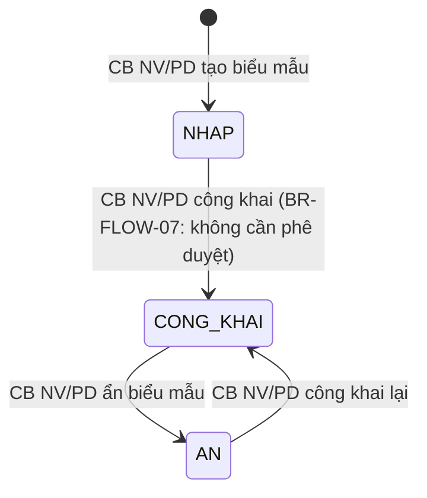
```mermaid
stateDiagram-v2
    [*] --> NHAP : CB NV/PD tạo biểu mẫu
    NHAP --> CONG_KHAI : CB NV/PD công khai (BR-FLOW-07: không cần phê duyệt)
    CONG_KHAI --> AN : CB NV/PD ẩn biểu mẫu
    AN --> CONG_KHAI : CB NV/PD công khai lại
```

**Bảng trạng thái:**

| Trạng thái | Mã | Mô tả |
|-----------|-----|-------|
| NHAP | draft | Biểu mẫu mới tạo, chưa công khai |
| CONG_KHAI | published | Biểu mẫu đã công khai, DN có thể xem/tải |
| AN | hidden | Biểu mẫu bị ẩn, không hiển thị trên chuyên trang |

**Bảng chuyển trạng thái:**

| Từ | Đến | Trigger | Guard | Action | FR Ref | BR Ref |
|----|-----|---------|-------|--------|--------|--------|
| [*] | NHAP | CB NV/PD tạo biểu mẫu | — | Tạo bản ghi | FR-VII-01 | — |
| NHAP | CONG_KHAI | CB NV/PD công khai | — | Hiển thị trên chuyên trang | FR-VII-02 | BR-FLOW-07 |
| CONG_KHAI | AN | CB NV/PD ẩn | — | Ẩn khỏi chuyên trang | FR-VII-03 | — |
| AN | CONG_KHAI | CB NV/PD công khai lại | — | Hiển thị lại trên chuyên trang | FR-VII-03 | BR-FLOW-07 |
| NHAP | XOA | CB NV xóa | Chưa công khai | Soft-delete, ghi audit | — | — |
| AN | XOA | CB NV xóa | — | Soft-delete, ghi audit | — | — |

> **Lưu ý:** XOA là trạng thái kết thúc [*] (archived). Biểu mẫu có thể được khôi phục bởi QTHT.

---

## C.10 SM-TAIKHOAN: Vòng đời Tài khoản

<!-- [2026-05-07 sync fr-10 Q3] BA chốt bỏ trạng thái CHO_PHAN_QUYEN: vai trò luôn được gán sẵn khi tạo TK (FR-VIII-15 cho CB nội bộ, FR-VIII-22 cho DN, FR-IV-07 cho TVV/CG, FR-IV-NHT-01 cho NHT). SM 5→4 trạng thái. -->

**Entity:** TAI_KHOAN
**Tham chiếu FR:** FR-VIII-15, FR-VIII-20 đến FR-VIII-22, FR-VIII-26

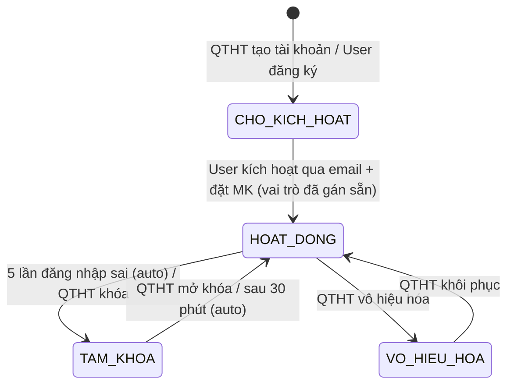
```mermaid
stateDiagram-v2
    [*] --> CHO_KICH_HOAT : QTHT tạo tài khoản / User đăng ký
    CHO_KICH_HOAT --> HOAT_DONG : User kích hoạt qua email + đặt MK (vai trò đã gán sẵn)
    HOAT_DONG --> TAM_KHOA : 5 lần đăng nhập sai (auto) / QTHT khóa
    TAM_KHOA --> HOAT_DONG : QTHT mở khóa / sau 30 phút (auto)
    HOAT_DONG --> VO_HIEU_HOA : QTHT vô hiệu hóa
    VO_HIEU_HOA --> HOAT_DONG : QTHT khôi phục
```

**Bảng trạng thái:**

| Trạng thái | Mã | Mô tả |
|-----------|-----|-------|
| CHO_KICH_HOAT | pending | Tài khoản mới tạo, chưa kích hoạt (vai trò đã gán sẵn) |
| HOAT_DONG | active | Tài khoản đang hoạt động bình thường |
| TAM_KHOA | locked | Tài khoản bị khóa tạm thời (5 lần sai mật khẩu hoặc QTHT khóa) |
| VO_HIEU_HOA | disabled | Tài khoản bị vô hiệu hóa bởi QTHT |

**Bảng chuyển trạng thái:**

| Từ | Đến | Trigger | Guard | Action | FR Ref | BR Ref |
|----|-----|---------|-------|--------|--------|--------|
| [*] | CHO_KICH_HOAT | QTHT tạo tài khoản / User đăng ký (vai trò gán sẵn) | — | Gửi email kích hoạt | FR-VIII-15, FR-VIII-22 | — |
| CHO_KICH_HOAT | HOAT_DONG | User kích hoạt qua email + đặt mật khẩu lần đầu | Token hợp lệ + MK đủ độ mạnh | Cho phép đăng nhập | FR-VIII-15, FR-VIII-22, FR-VIII-26 | — |
| HOAT_DONG | TAM_KHOA | 5 lần đăng nhập sai (auto) | so_lan_sai >= 5 | Ghi AUDIT_LOG, TB QTHT | FR-VIII-20 | BR-AUTH-07 |
| HOAT_DONG | TAM_KHOA | QTHT khóa thủ công | — | Ghi AUDIT_LOG | FR-VIII-19 | — |
| TAM_KHOA | HOAT_DONG | QTHT mở khóa | — | Reset so_lan_sai = 0 | FR-VIII-19 | BR-AUTH-07 |
| TAM_KHOA | HOAT_DONG | Sau 30 phút (auto) | elapsed >= 30 phút | Reset so_lan_sai = 0 | FR-VIII-20 | BR-AUTH-07 |
| HOAT_DONG | VO_HIEU_HOA | QTHT vô hiệu hóa | — | Invalidate session, ghi AUDIT_LOG | FR-VIII-19 | — |
| VO_HIEU_HOA | HOAT_DONG | QTHT khôi phục | — | Cho phép đăng nhập lại | FR-VIII-19 | — |
| CHO_KICH_HOAT | VO_HIEU_HOA | Auto: quá 7 ngày | activation_token_expired | Ghi audit, TB QTHT | — | — |

> **Lưu ý:** BR-AUTH-07 được cập nhật: 'Khóa tài khoản sau 5 lần sai mật khẩu. Tự mở khóa sau 30 phút HOẶC QTHT mở khóa thủ công qua UC113. Cả hai cơ chế đều hợp lệ.'

---

## C.11 SM-KH-DAO-TAO: Kế hoạch đào tạo `[SRS-FIX][CMT-3][2026-05-03 update Cách 2 + refinement]` `[2026-05-07 renumber C.9 → C.11 fix collision với SM-BIEUMAU]`

**Entity:** KE_HOACH_DAO_TAO
**Tham chiếu FR:** FR-III-14, FR-III-15, FR-III-16
**Trạng thái:** 5 (NHAP, CHO_DUYET, TU_CHOI, DA_DUYET, DA_CONG_KHAI). Refinement Cách 2: từ TU_CHOI → CHO_DUYET trực tiếp khi CB NV gửi phê duyệt lại (KHÔNG qua NHAP).

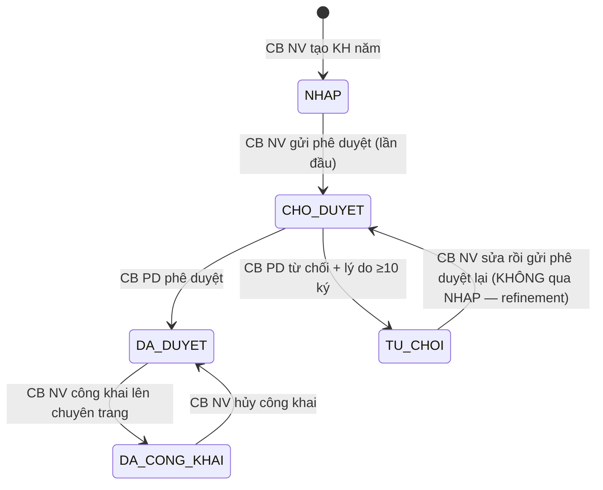
```mermaid
stateDiagram-v2
    [*] --> NHAP : CB NV tạo KH năm
    NHAP --> CHO_DUYET : CB NV gửi phê duyệt (lần đầu)
    CHO_DUYET --> DA_DUYET : CB PD phê duyệt
    CHO_DUYET --> TU_CHOI : CB PD từ chối + lý do ≥10 ký
    TU_CHOI --> CHO_DUYET : CB NV sửa rồi gửi phê duyệt lại (KHÔNG qua NHAP — refinement)
    DA_DUYET --> DA_CONG_KHAI : CB NV công khai lên chuyên trang
    DA_CONG_KHAI --> DA_DUYET : CB NV hủy công khai
```

**Bảng chuyển trạng thái:**

| Từ | Đến | Trigger | Guard | Action | FR Ref | BR Ref |
|----|-----|---------|-------|--------|--------|--------|
| [*] | NHAP | CB NV tạo KH năm | — | Tạo bản ghi | FR-III-14 | — |
| NHAP | CHO_DUYET | CB NV gửi duyệt (lần đầu) | Đủ trường bắt buộc | Thông báo CB PD | FR-III-14 | BR-NOTIF-01 |
| CHO_DUYET | DA_DUYET | CB PD duyệt | Cùng cấp (BR-AUTH-05) | Ghi thoi_gian_duyet + nguoi_duyet, audit | FR-III-15 | BR-AUTH-05, BR-FLOW-03 |
| CHO_DUYET | TU_CHOI | CB PD từ chối | Có lý do ≥10 ký (BR-FLOW-04) | Ghi thoi_gian_tu_choi + nguoi_tu_choi + ly_do_tu_choi, TB CB NV. KHÔNG quay NHAP | FR-III-15 | BR-FLOW-04, BR-NOTIF-01 |
| TU_CHOI | CHO_DUYET | CB NV sửa rồi gửi phê duyệt lại | Đã sửa (updated_at > thoi_gian_tu_choi) + đủ guard như NHAP→CHO_DUYET | TB CB PD; clear ly_do_tu_choi/thoi_gian_tu_choi | FR-III-14 | BR-NOTIF-01 |
| DA_DUYET | DA_CONG_KHAI | CB NV công khai | — | Set cong_khai=1, fill thoi_gian_dang_tai, đẩy lên chuyên trang | FR-III-16 | BR-FLOW-05 |
| DA_CONG_KHAI | DA_DUYET | CB NV hủy CK | — | Set cong_khai=0, clear thoi_gian_dang_tai, gỡ khỏi chuyên trang | FR-III-16 | BR-FLOW-05 |

> **Refinement Cách 2 (chốt 2026-05-03):** TU_CHOI là trạng thái ổn định cho đến khi CB NV chủ động trình duyệt lại. CB NV được phép edit content trong TU_CHOI giống như NHAP. Banner đỏ trên màn sửa: "Đã bị từ chối lúc dd/mm/yyyy. Lý do: ...". Khi gửi phê duyệt lại → CHO_DUYET trực tiếp (không qua NHAP). Phân biệt: NHAP = chưa từng trình; TU_CHOI = đã trình, bị từ chối, đang sửa.

**Trạng thái:** ✅ CĐT xác nhận; Cách 2 + refinement chốt BA 2026-05-03

---

## C.12 SM-CTDT: Chương trình đào tạo `[2026-05-03 mới — Câu 4 Cách 2]` `[2026-05-07 renumber C.10 → C.12 fix collision với SM-TAIKHOAN]`

**Entity:** CHUONG_TRINH_DAO_TAO
**Tham chiếu FR:** FR-III-01, FR-III-02
**Trạng thái:** 7 (DU_THAO, CHO_DUYET, TU_CHOI, DA_DUYET, DANG_THUC_HIEN, HOAN_THANH, DA_HUY). CTDT có workflow phê duyệt riêng — Câu 4 Cách 2 chốt BA 2026-05-03 (CTDT là cấp giữa giữa Kế hoạch năm và Khóa học, có quy trình duyệt rõ ràng).

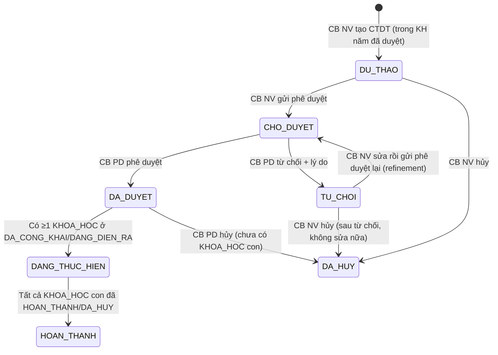
```mermaid
stateDiagram-v2
    [*] --> DU_THAO : CB NV tạo CTDT (trong KH năm đã duyệt)
    DU_THAO --> CHO_DUYET : CB NV gửi phê duyệt
    CHO_DUYET --> DA_DUYET : CB PD phê duyệt
    CHO_DUYET --> TU_CHOI : CB PD từ chối + lý do
    TU_CHOI --> CHO_DUYET : CB NV sửa rồi gửi phê duyệt lại (refinement)
    DA_DUYET --> DANG_THUC_HIEN : Có ≥1 KHOA_HOC ở DA_CONG_KHAI/DANG_DIEN_RA
    DANG_THUC_HIEN --> HOAN_THANH : Tất cả KHOA_HOC con đã HOAN_THANH/DA_HUY
    DU_THAO --> DA_HUY : CB NV hủy
    TU_CHOI --> DA_HUY : CB NV hủy (sau từ chối, không sửa nữa)
    DA_DUYET --> DA_HUY : CB PD hủy (chưa có KHOA_HOC con)
```

**Bảng chuyển trạng thái:**

| Từ | Đến | Trigger | Guard | Action | FR Ref | BR Ref |
|----|-----|---------|-------|--------|--------|--------|
| [*] | DU_THAO | CB NV tạo CTDT | Có KH năm cha (ke_hoach_id) ở DA_DUYET hoặc DA_CONG_KHAI (Mô hình A) | Tạo bản ghi CTDT | FR-III-01 | — |
| DU_THAO | CHO_DUYET | CB NV gửi phê duyệt | Đủ trường bắt buộc | TB CB PD | FR-III-01 | BR-NOTIF-01 |
| CHO_DUYET | DA_DUYET | CB PD phê duyệt | Cùng cấp (BR-AUTH-05) | Ghi thoi_gian_duyet + nguoi_duyet, audit | FR-III-01 | BR-AUTH-05, BR-FLOW-03 |
| CHO_DUYET | TU_CHOI | CB PD từ chối | Có lý do ≥10 ký (BR-FLOW-04) | Ghi thoi_gian_tu_choi + nguoi_tu_choi + ly_do_tu_choi, TB CB NV | FR-III-01 | BR-FLOW-04 |
| TU_CHOI | CHO_DUYET | CB NV gửi phê duyệt lại | Đã sửa (updated_at > thoi_gian_tu_choi) | TB CB PD; clear ly_do_tu_choi | FR-III-01 | BR-NOTIF-01 |
| DA_DUYET | DANG_THUC_HIEN | Auto khi có ≥1 KHOA_HOC con ở DA_CONG_KHAI/DANG_DIEN_RA | — | Set thoi_gian_bat_dau_thuc_hien | (auto trigger) | — |
| DANG_THUC_HIEN | HOAN_THANH | Auto khi tất cả KHOA_HOC con HOAN_THANH/DA_HUY | — | Set thoi_gian_hoan_thanh | (auto trigger) | — |
| DU_THAO | DA_HUY | CB NV hủy | — | Soft cancel, audit | FR-III-01 | BR-DATA-01 |
| TU_CHOI | DA_HUY | CB NV hủy (không định sửa nữa) | — | Soft cancel | FR-III-01 | BR-DATA-01 |
| DA_DUYET | DA_HUY | CB PD hủy | Chưa có KHOA_HOC con đang chạy | Audit, kiểm tra cascade | FR-III-01 | BR-FLOW-04 |

> **Refinement Cách 2:** Áp dụng cùng pattern như SM-KH-DAO-TAO + SM-KHOAHOC — TU_CHOI → CHO_DUYET trực tiếp khi gửi phê duyệt lại.

> **Mô hình A (F-12):** CTDT là child của KE_HOACH_DAO_TAO qua FK `ke_hoach_id`. Tạo CTDT chỉ khi KH năm cha đã DA_DUYET/DA_CONG_KHAI (enforce application layer).

**Trạng thái:** Mới — chốt BA 2026-05-03 (Câu 4 Cách 2)

---

## C.13 SM-NHT: Người hỗ trợ pháp lý `[2026-05-07 mới — sync từ srs-fr-04 v3.5 F-FR04-NEW-02 phương án B+]`

**Entity:** NGUOI_HO_TRO
**Tham chiếu FR:** FR-IV-NHT-01, FR-IV-NHT-02, FR-IV-NHT-03
**Pháp lý:** NĐ 55/2019/NĐ-CP Điều 7 — cán bộ làm công tác hỗ trợ pháp lý cho DNNVV.
**Trạng thái:** 4 (CHO_KICH_HOAT, HOAT_DONG, TAM_DUNG, VO_HIEU_HOA). NHT là cán bộ HTPL nội bộ, 1:1 với TAI_KHOAN; KHÔNG phải hồ sơ TVV/CG ngoài MLTV nên KHÔNG có vòng đời thẩm định/phê duyệt.

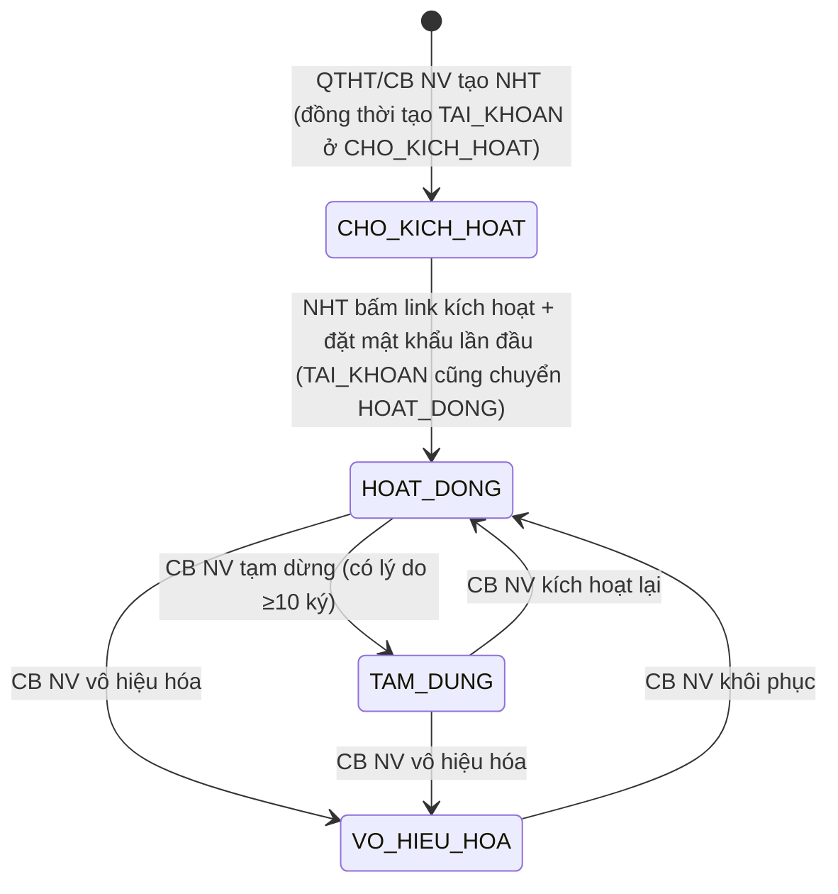
```mermaid
stateDiagram-v2
    [*] --> CHO_KICH_HOAT : QTHT/CB NV tạo NHT (đồng thời tạo TAI_KHOAN ở CHO_KICH_HOAT)
    CHO_KICH_HOAT --> HOAT_DONG : NHT bấm link kích hoạt + đặt mật khẩu lần đầu (TAI_KHOAN cũng chuyển HOAT_DONG)
    HOAT_DONG --> TAM_DUNG : CB NV tạm dừng (có lý do ≥10 ký)
    TAM_DUNG --> HOAT_DONG : CB NV kích hoạt lại
    HOAT_DONG --> VO_HIEU_HOA : CB NV vô hiệu hóa
    TAM_DUNG --> VO_HIEU_HOA : CB NV vô hiệu hóa
    VO_HIEU_HOA --> HOAT_DONG : CB NV khôi phục
```

**Bảng trạng thái:**

| Trạng thái | Mã | Mô tả |
|-----------|-----|-------|
| CHO_KICH_HOAT | pending_activation | Mới tạo, chưa đặt mật khẩu lần đầu — chưa thể nhận phân công vụ việc |
| HOAT_DONG | active | Đang hoạt động — xuất hiện trong UC59 phân công VV |
| TAM_DUNG | suspended | Tạm dừng — không nhận phân công mới, các VV đang xử lý vẫn giữ |
| VO_HIEU_HOA | disabled | Vô hiệu hóa — gỡ khỏi danh sách phân công |

**Bảng chuyển trạng thái:**

| Từ | Đến | Trigger | Guard | Action | FR Ref | BR Ref |
|----|-----|---------|-------|--------|--------|--------|
| [*] | CHO_KICH_HOAT | QTHT / CB NV tạo NHT | Email + username + đơn vị + ≥1 lĩnh vực | Tạo NGUOI_HO_TRO + TAI_KHOAN ở CHO_KICH_HOAT (1:1), gán vai trò NHT, gửi mail kích hoạt (link vĩnh viễn, 1 lần dùng) | FR-IV-NHT-01 | BR-AUTH-08 |
| CHO_KICH_HOAT | HOAT_DONG | NHT bấm link kích hoạt + đặt mật khẩu lần đầu | Token hợp lệ | Đồng thời chuyển TAI_KHOAN → HOAT_DONG, ghi audit, NHT xuất hiện trong UC59 phân công VV | FR-IV-NHT-01, FR-VIII-22 | BR-AUTH-12 |
| HOAT_DONG | TAM_DUNG | CB NV tạm dừng | Có lý do ≥ 10 ký tự | Audit log; KHÔNG nhận phân công VV mới (VV đang xử lý giữ nguyên) | FR-IV-NHT-02 | BR-FLOW-04 |
| TAM_DUNG | HOAT_DONG | CB NV kích hoạt lại | — | Audit log; trở lại danh sách UC59 | FR-IV-NHT-02 | — |
| HOAT_DONG | VO_HIEU_HOA | CB NV vô hiệu hóa | KHÔNG có VU_VIEC AND HOI_DAP đang xử lý (`trang_thai IN ('DANG_XU_LY','CHO_PHE_DUYET')`) | Gỡ khỏi danh sách phân công, audit | FR-IV-NHT-02 | — |
| TAM_DUNG | VO_HIEU_HOA | CB NV vô hiệu hóa | KHÔNG có VU_VIEC AND HOI_DAP đang xử lý | Gỡ khỏi danh sách phân công, audit | FR-IV-NHT-02 | — |
| VO_HIEU_HOA | HOAT_DONG | CB NV khôi phục | Quyết định từng trường hợp | Audit log | FR-IV-NHT-02 | — |

> **Ràng buộc đồng bộ NHT ↔ TAI_KHOAN:** NGUOI_HO_TRO 1:1 với TAI_KHOAN (`tai_khoan_id` UNIQUE). Khi NGUOI_HO_TRO chuyển VO_HIEU_HOA, TAI_KHOAN tương ứng cũng chuyển VO_HIEU_HOA (kéo theo SM-TAIKHOAN). Khi NGUOI_HO_TRO chuyển TAM_DUNG, TAI_KHOAN giữ HOAT_DONG (NHT vẫn đăng nhập được để xem hồ sơ cũ).

> **Pháp lý — phân biệt với SM-TVV:** NHT là CÁN BỘ HTPL theo NĐ 55/2019 Điều 7 (nội bộ đơn vị quản lý nhà nước). TVV/CG theo NĐ 77/2008 là cá nhân hành nghề tư vấn ngoài (xem SM-TVV §C.3). NHT KHÔNG có thẩm định/phê duyệt MLTV; chỉ có lifecycle nhân sự nội bộ.

**Trạng thái:** Mới — sync từ srs-fr-04 v3.5 (2026-05-07)

---

# Phụ lục D — Sample I/O & API Contracts

## D.1 Sample Forms (Top 5 biểu mẫu phức tạp)

### D.1.1 Mẫu 01 NĐ55/2019 — Đề nghị hỗ trợ chi phí TVPL

**Tham chiếu:** FR-V.II-01 đến FR-V.II-03

```
VĂN BẢN ĐỀ NGHỊ HỖ TRỢ CHI PHÍ TƯ VẤN PHÁP LUẬT
(Mẫu 01 ban hành kèm theo Nghị định số 55/2019/NĐ-CP)

PHẦN I — THÔNG TIN DOANH NGHIỆP
┌────────────────────────────────────────────────────────────┐
│ 1. Tên doanh nghiệp: ___________________________________  │
│ 2. Địa chỉ: ____________________________________________  │
│ 3. Điện thoại/Fax/Email: _______________________________  │
│ 4. Mã số doanh nghiệp: ________________________________  │
│ 5. Giấy CNĐKKD số: _________ ngày cấp: ________________  │
│ 6. Ngành nghề kinh doanh: ______________________________  │
│ 7. Người đại diện theo PL: _____________________________  │
│ 8. Loại hình DN: [ ] Tư nhân [ ] TNHH [ ] CP [ ] Khác   │
│ 9. Quy mô DN: [ ] Siêu nhỏ [ ] Nhỏ [ ] Vừa             │
└────────────────────────────────────────────────────────────┘

PHẦN II — THÔNG TIN VỤ VIỆC VÀ TƯ VẤN VIÊN
┌────────────────────────────────────────────────────────────┐
│ 10. Vụ việc/vướng mắc: _________________________________  │
│ 11. Thời điểm phát sinh: _______________________________  │
│ 12. Tên TVV thực hiện: _________________________________  │
│ 13. Tổ chức hành nghề: _________________________________  │
│ 14. Địa chỉ TVV: _______________________________________  │
│ 15. Số ĐT TVV: _________________________________________  │
│ 16. Số/ngày HĐ TVPL: ___________________________________  │
│ 17. Phí tư vấn (VNĐ): __________________________________  │
│ 18. Số tiền đề nghị hỗ trợ: ____________________________  │
└────────────────────────────────────────────────────────────┘

PHẦN III — CAM KẾT
"Tôi cam đoan những thông tin trên đây là đúng sự thật..."
Ký, đóng dấu
```

### D.1.2 Mẫu 21a/TP/HTPLDN — BC Sở/ban ngành

**Tham chiếu:** FR-VI-07, FR-XI-06

```
BIỂU SỐ: 21a/TP/HTPLDN
Ban hành kèm theo Thông tư số 17/2025/TT-BTP

KẾT QUẢ TRIỂN KHAI CÔNG TÁC HTPL CHO DNNVV
TẠI CƠ QUAN CHUYÊN MÔN THUỘC UBND CẤP TỈNH
(Sơ bộ 6 tháng / sơ bộ năm / tròn năm)

Kỳ báo cáo: Từ ngày ____ đến ngày ____
Đơn vị báo cáo: ________
Đơn vị nhận: Sở Tư pháp

┌─────┬──────┬──────┬──────┬──────┬──────┬──────┬──────┬──────┬──────┬──────┬──────┬──────┐
│ -1  │ -2   │ -3   │ -4   │ -5   │ -6   │ -7   │ -8   │ -9   │ -10  │ -11  │ -12  │ -13  │
│Số   │Cuộc  │Hội   │VB TL │VB TV │HS    │HS GQ │DN    │DN    │DN    │KP HT │KP    │KP XH │
│TVV  │tập   │nghị  │UBND  │mạng  │tiếp  │tổng  │vừa   │nhỏ   │siêu  │TVPL  │khác  │hóa   │
│     │huấn  │      │      │lưới  │nhận  │      │      │      │nhỏ   │(NSNN)│(NSNN)│      │
├─────┼──────┼──────┼──────┼──────┼──────┼──────┼──────┼──────┼──────┼──────┼──────┼──────┤
│     │      │      │      │      │      │      │      │      │      │      │      │      │
└─────┴──────┴──────┴──────┴──────┴──────┴──────┴──────┴──────┴──────┴──────┴──────┴──────┘

Deadline: Sơ bộ 6T → 10/06 | Sơ bộ năm → 10/11 | Tròn năm → 10/01 năm sau
```

### D.1.3 Mẫu 21b/TP/HTPLDN — BC STP (tổng hợp từ Sở/ban ngành)

**Tham chiếu:** FR-VI-07, FR-XI-09

```
BIỂU SỐ: 21b/TP/HTPLDN
Ban hành kèm theo Thông tư số 17/2025/TT-BTP

KẾT QUẢ TRIỂN KHAI CÔNG TÁC HTPL CHO DNNVV TẠI UBND CẤP TỈNH

Đơn vị báo cáo: Sở Tư pháp ________
Đơn vị nhận: Bộ Tư pháp (Cục Kế hoạch - Tài chính)

┌─────┬──────────┬──────┬──────┬──────┬──────┬──────┬──────┬──────┬──────┬──────┬──────┬──────┬──────┬──────┬──────┐
│ STT │ Sở/ban   │ -1   │ -2   │ -3   │ -4   │ -5   │ -6   │ -7   │ -8   │ -9   │ -10  │ -11  │ -12  │ -13  │ -14  │
│  A  │ ngành B  │      │      │      │      │      │      │      │      │      │      │      │      │      │Ghi   │
│     │          │      │      │      │      │      │      │      │      │      │      │      │      │      │chú   │
├─────┼──────────┼──────┼──────┼──────┼──────┼──────┼──────┼──────┼──────┼──────┼──────┼──────┼──────┼──────┼──────┤
│     │Tổng tỉnh │      │      │      │      │      │      │      │      │      │      │      │      │      │      │
│ 1   │Sở...     │      │      │      │      │      │      │      │      │      │      │      │      │      │      │
│ 2   │Sở...     │      │      │      │      │      │      │      │      │      │      │      │      │      │      │
└─────┴──────────┴──────┴──────┴──────┴──────┴──────┴──────┴──────┴──────┴──────┴──────┴──────┴──────┴──────┴──────┘

Deadline: Sơ bộ 6T → 20/06 | Sơ bộ năm → 20/11 | Tròn năm → 20/01 năm sau
```

### D.1.4 Form đánh giá vụ việc (FR-V.I-17, UC67)

```
ĐÁNH GIÁ VỤ VIỆC HỖ TRỢ PHÁP LÝ

Mã vụ việc: VV-{TINH}-YYYYMMDD-SEQ
Tên DN: ___________________
TVV thực hiện: ___________________

┌─────────────────────────────────────────────────┐
│ 1. Chất lượng tư vấn:    [0] ───── [10]        │
│ 2. Đúng hạn xử lý:       [0] ───── [10]        │
│ 3. Thái độ phục vụ:       [0] ───── [10]        │
│                                                  │
│ Điểm tổng (TB): _____ / 10                      │
│                                                  │
│ Nhận xét: _____________________________________  │
│ _______________________________________________  │
└─────────────────────────────────────────────────┘
```

### D.1.5 Form tư vấn nhanh (FR-X.2-02, UC155)

```
TƯ VẤN NHANH — Keyword Search

DN nhập câu hỏi: ___________________________

Hệ thống gợi ý (TOP 5):
┌───┬────────────────────────────────────────────────┬───────┐
│ # │ Câu hỏi liên quan                              │ Score │
├───┼────────────────────────────────────────────────┼───────┤
│ 1 │ Thủ tục thành lập DN tư nhân?                  │ 0.95  │
│ 2 │ Quy trình đăng ký kinh doanh online?           │ 0.87  │
│ 3 │ Thời hạn cấp Giấy CNĐKKD?                     │ 0.82  │
│ 4 │ Hồ sơ thay đổi đăng ký DN?                    │ 0.76  │
│ 5 │ Phí đăng ký DN là bao nhiêu?                  │ 0.71  │
└───┴────────────────────────────────────────────────┴───────┘

CB NV chọn gợi ý → Chỉnh sửa → Gửi trả lời
Hoặc: DN nhấn "Chuyển sang TV thủ công" → Nhóm II
```

---

## D.2 Report Templates (TT17/2025)

### D.2.1 Mapping cột báo cáo 21a → Nguồn dữ liệu PM

| Cột 21a | Tên cột | Entity nguồn | Công thức |
|---------|---------|-------------|-----------|
| -1 | Số TVV kiện toàn | TU_VAN_VIEN | Đếm số TVV có trạng thái = 'HOAT_DONG' thuộc đơn vị báo cáo |
| -2 | Cuộc tập huấn | KHOA_HOC | Đếm số khóa học loại 'TAP_HUAN' trong kỳ báo cáo |
| -3 | Hội nghị đối thoại | KHOA_HOC | Đếm số khóa học loại 'HOI_NGHI' trong kỳ báo cáo |
| -4 | VB TL UBND | VU_VIEC | Đếm số vụ việc loại văn bản 'TRA_LOI_UBND' trong kỳ báo cáo |
| -5 | VB TV mạng lưới | VU_VIEC | Đếm số vụ việc loại văn bản 'TV_MANG_LUOI' trong kỳ báo cáo |
| -6 | HS tiếp nhận | HO_SO_CHI_TRA | Đếm số hồ sơ chi trả không bị từ chối trong kỳ báo cáo |
| -7 | HS giải quyết tổng | HO_SO_CHI_TRA | Đếm số hồ sơ chi trả đã thanh toán trong kỳ báo cáo |
| -8 | DN vừa | HO_SO_CHI_TRA | Đếm số hồ sơ đã thanh toán cho DN quy mô vừa |
| -9 | DN nhỏ | HO_SO_CHI_TRA | Đếm số hồ sơ đã thanh toán cho DN quy mô nhỏ |
| -10 | DN siêu nhỏ | HO_SO_CHI_TRA | Đếm số hồ sơ đã thanh toán cho DN quy mô siêu nhỏ |
| -11 | KP HT TVPL (NSNN) | HO_SO_CHI_TRA | Tổng số tiền thực trả của hồ sơ đã thanh toán |
| -12 | KP chi HĐ khác | — | Nhập thủ công |
| -13 | KP xã hội hóa | — | Nhập thủ công |

### D.2.2 Mapping cột báo cáo 21b → Tổng hợp STP

| Cột 21b | Tên cột | Logic tổng hợp |
|---------|---------|---------------|
| A | STT | Auto-gen |
| B | Sở/ban ngành | Từ danh mục đơn vị |
| -1 → -13 | Tương tự 21a | SUM từ các Sở/ban ngành thuộc tỉnh |
| -14 | Ghi chú | Nhập thủ công |

### D.2.3 Export format

| Format | Thư viện đề xuất | Template |
|--------|-----------------|---------|
| Excel (.xlsx) | Apache POI | Template 21a/21b có sẵn, fill data |
| Word (.docx) | Apache POI (docx4j) | Template 21a/21b có sẵn, fill data |

### D.2.4 Mapping mẫu biểu TT 17/2025/TT-BTP [GAP-IX-03]

| # | Mẫu biểu | Số hiệu | FR tham chiếu | Mô tả |
|---|----------|---------|---------------|-------|
| 1 | Báo cáo sơ bộ 6 tháng CT HTPLDN | Mẫu 21a | FR-IX-01~23 (TPL-REPORT-FULL) | Báo cáo tình hình thực hiện CT HTPL 6 tháng đầu năm |
| 2 | Báo cáo tổng kết năm CT HTPLDN | Mẫu 21b | FR-IX-01~23 (TPL-REPORT-FULL) | Báo cáo tổng kết năm thực hiện CT HTPL |

**Format chung theo TT 17/2025:**
- Khổ giấy: A4 (210 × 297mm)
- Phông chữ: Times New Roman, cỡ 13pt
- Header: Quốc hiệu + Tên cơ quan ban hành
- Footer: Ngày ký + Chức danh người ký + Con dấu (nếu in chính thức)
- Lề: Trên 2cm, Dưới 2cm, Trái 3cm, Phải 2cm

---

> **Ghi chú v2.0:** Section D.3 (API Contracts — 18 outbound APIs, inbound contracts, OAuth/SSO flow) từ SRS v1.8 đã chuyển sang Architecture Design Document.
> Xem `architecture-inputs-from-srs.md` §7 API Design & Contracts.

---


> **Ghi chú v2.0:** Phụ lục E (Tham chiếu Architecture) từ SRS v1.8 đã được xóa hoàn toàn.
> Nội dung đã chuyển sang Architecture Design Document (`architecture.md`).
> Xem `architecture-inputs-from-srs.md` §9 Architecture Decisions Summary, §10 Project Structure.

---


---


---

# Chỉ mục (Index)

## Requirement IDs

| Prefix | Phạm vi | Nhóm / Loại | Section |
|--------|---------|-------------|---------|
| FR-I-01 → FR-I-09 | 9 FRs | Dashboard | §3.2.3 |
| FR-II-01 → FR-II-10 | 10 FRs | Hỏi đáp, Vướng mắc PL | §3.2.4 |
| FR-II-CROSS-01 | 1 FR | Cross-cutting SLA Hỏi đáp | §3.2.4 |
| FR-II-NEW-01 → FR-II-NEW-02 | 2 FRs | Hỏi đáp mở rộng | §3.2.4 |
| FR-III-01 → FR-III-19 | 19 FRs | Đào tạo, Tập huấn | §3.2.6 |
| FR-III-NEW-01 → FR-III-NEW-03 | 3 FRs | Đào tạo mở rộng | §3.2.6 |
| FR-IV-01 → FR-IV-12 | 12 FRs | Mạng lưới Tư vấn viên | §3.2.5 |
| FR-IV-CROSS-01 | 1 FR | Cross-cutting TVV | §3.2.5 |
| FR-V.I-01 → FR-V.I-17 | 17 FRs | Vụ việc TGPL | §3.2.8 |
| FR-V.I-NEW-01 | 1 FR | Vụ việc mở rộng | §3.2.8 |
| FR-V.I-CROSS-01 | 1 FR | Cross-cutting SLA Vụ việc | §3.2.8 |
| FR-V.II-01 → FR-V.II-14 + FR-V.II-CROSS-01 | 15 FRs | Chi trả Chi phí | §3.2.9 |
| FR-V.III-01 → FR-V.III-02 | 2 FRs | Quản lý DN | §3.2.7 |
| FR-V.III-NEW-01 | 1 FR | DN mở rộng | §3.2.7 |
| FR-VI-01 → FR-VI-09 | 9 FRs | Đánh giá Hiệu quả | §3.2.10 |
| FR-VII-01 → FR-VII-07 | 7 FRs | Quản lý thư viện biểu mẫu | §3.2.2 |
| FR-VIII-01 → FR-VIII-21 | 21 FRs | Quản trị Hệ thống | §3.2.1 |
| FR-IX-01 → FR-IX-23 | 23 FRs | Báo cáo Thống kê | §3.2.12 |
| FR-X.1-01 → FR-X.1-15 | 15 FRs | Quản lý Tư vấn pháp luật chuyên sâu | §3.2.15 |
| FR-X.2-01 → FR-X.2-05 | 5 FRs | Tư vấn Nhanh | §3.2.13 |
| FR-X.3-01 | 1 FR | Hợp đồng Tư vấn | §3.2.14 |
| FR-XI-01 → FR-XI-09 | 9 FRs | Quản lý kế hoạch thực hiện CT HTPLDN | §3.2.11 |
| FR-XII-01 → FR-XII-16 | 16 FRs | API Kết nối CSDL | §3.2.16 |

## Entity Names (Section 3.4)

| Entity | Mô tả | Section |
|--------|-------|---------|
| AUDIT_LOG | Nhật ký thao tác | §3.4.3.11 |
| BAI_GIANG | Bài giảng (FK → KHOA_HOC) | §3.4.3.20 |
| BIEU_MAU | Biểu mẫu (FK → THU_MUC_BIEU_MAU) | §3.4.3.37 |
| CAU_HINH_SLA | Cấu hình SLA | §3.4.3.14 |
| CHUONG_TRINH_DAO_TAO | Chương trình đào tạo (FK → KHOA_HOC) | §3.4.3.19 |
| CHUONG_TRINH_HTPL | Chương trình HTPLDN | §3.4.3.10 |
| DANH_MUC | Danh mục dùng chung | §3.4.3.39 |
| DOANH_NGHIEP | Doanh nghiệp được hỗ trợ | §3.4.3.3 |
| DON_VI | Cơ quan/Đơn vị | §3.4.3.8 |
| HOI_DAP | Hỏi đáp/Vướng mắc PL | §3.4.3.1 |
| HOP_DONG_TU_VAN | Hợp đồng Tư vấn | §3.4.3.13 |
| HO_SO_CHI_TRA | Hồ sơ đề nghị HT chi phí | §3.4.3.5 |
| KET_QUA_DAO_TAO | Kết quả đào tạo (FK → KHOA_HOC) | §3.4.3.23 |
| KET_QUA_DANH_GIA | Kết quả đánh giá | §3.4.3.35 |
| KHO_CAU_HOI | Kho Q&A Tư vấn Nhanh | §3.4.3.12 |
| KHOA_HOC | Khóa đào tạo/Tập huấn | §3.4.3.6 |
| PHAN_HOI | Phản hồi (FK → HOI_DAP) | §3.4.3.17 |
| TAI_KHOAN | Tài khoản người dùng | §3.4.3.7 |
| THONG_BAO | Thông báo | §3.4.3.15 |
| THU_MUC_BIEU_MAU | Thư mục biểu mẫu | §3.4.3.38 |
| TU_VAN_CHUYEN_SAU | Tư vấn Chuyên sâu | §3.4.3.9 |
| TU_VAN_VIEN | Tư vấn viên/Chuyên gia | §3.4.3.4 |
| VU_VIEC | Vụ việc Trợ giúp PL | §3.4.3.2 |

## Business Rule IDs

| Prefix | Phạm vi | Mô tả | Section |
|--------|---------|-------|---------|
| BR-API-01 | 1 BR | Quy tắc API outbound (mTLS + rate limit) | §B.7a |
| BR-AUTH-01 → BR-AUTH-13 + BR-AUTH-USERNAME-01 + BR-AUTH-EMAIL-01 | 15 BRs | Quy tắc xác thực, phân quyền, lọc kép, dual control, username/email | §B.1 |
| BR-CALC-01 → BR-CALC-07 | 7 BRs | Quy tắc tính toán chi phí, điểm, ưu tiên phân công | §B.4 |
| BR-DATA-01 → BR-DATA-08 | 8 BRs | Quy tắc dữ liệu, validation | §B.2 |
| BR-EC-01 → BR-EC-23 | 23 BRs | Quy tắc edge case (locking, soft-delete cascade, CSRF, antivirus, quota, …) | §B.8 |
| BR-FLOW-01 → BR-FLOW-10 | 10 BRs | Quy tắc luồng nghiệp vụ | §B.3 |
| BR-INTG-01 → BR-INTG-07 | 7 BRs | Quy tắc tích hợp, API | §B.6 |
| BR-KQ-01 → BR-KQ-02 | 2 BRs | Quy tắc kết quả đào tạo (xếp loại, đạt khóa) | §B.4a |
| BR-LEGAL-01 → BR-LEGAL-09 | 9 BRs | Quy tắc pháp lý (NĐ55, NĐ77, NĐ121/2025, NĐ39/2018, TT17, Luật Dữ liệu 2024) | §B.7 |
| BR-LICH-01 | 1 BR | Quy tắc lịch tư vấn | §B.6/§B.6a |
| BR-NOTIF-01 | 1 BR | Quy tắc thông báo workflow + SLA | §B.6b |
| BR-PUBLIC-01 → BR-PUBLIC-04 | 4 BRs | Quy tắc công khai dữ liệu Cổng PLQG | (file FR groups) |
| BR-RETRY-01 | 1 BR | Quy tắc retry API outbound | §B.7a |
| BR-ROUTE-HD-01 + BR-ROUTE-TVCS-01 | 2 BRs | Routing hỏi đáp (HD-01 — auto chuyển BN/ĐP, fr-02) + Routing tư vấn chuyên sâu (TVCS-01, fr-12) | §B.7 (canonical) + (file FR-02, FR-12) |
| BR-RPT-01 | 1 BR | Quy tắc báo cáo (chỉ tính bản ghi đã duyệt) | §B.7b |
| BR-SEC-01 | 1 BR | Quy tắc sanitize PII outbound | §B.7a |
| BR-SLA-01 → BR-SLA-05 | 5 BRs | Quy tắc SLA, deadline | §B.5 |
| BR-UX-01 | 1 BR | Quy tắc UX (URL sync filter) | §B.6a |

## State Machine IDs

| SM ID | Tên | Entity chính | Section |
|-------|-----|-------------|---------|
| SM-CHITRA | Lifecycle Hồ sơ Chi trả | HO_SO_CHI_TRA | §3.2.9 |
| SM-CTHTPL | Lifecycle Chương trình HTPLDN (8 trạng thái — entity chương trình) | CHUONG_TRINH_HTPL | `srs-fr-15-ct-htpldn.md` §5 SM-KH-CTHTPL (entity owned ở fr-15 — không có §C riêng trong master) |
| SM-KH-CTHTPL | Lifecycle Kế hoạch CT HTPLDN (tách từ SM-CTHTPL cũ — kế hoạch chi tiết theo kỳ) | KE_HOACH_CT_HTPL | Appendix C.7 |
| SM-DOT-BC | Lifecycle Đợt báo cáo CT HTPLDN (tách từ SM-CTHTPL cũ — đợt báo cáo 6 tháng/năm/tròn năm, 6 trạng thái) | DOT_BAO_CAO | Appendix C.7a |
| SM-DANHGIA | Lifecycle Đánh giá | KET_QUA_DANH_GIA | §3.2.10 |
| SM-HOIDAP | Lifecycle Hỏi đáp | HOI_DAP | §3.2.4 |
| SM-KHOAHOC | Lifecycle Khóa học | KHOA_HOC | §3.2.6 |
| SM-TVCS | Lifecycle Tư vấn Chuyên sâu | TU_VAN_CHUYEN_SAU | §3.2.15 |
| SM-TVNHANH | Lifecycle Tư vấn Nhanh (6 trạng thái: MOI, DANG_TIM_KIEM, DA_GOI_Y, CB_TRA_LOI, HOAN_THANH, HET_HAN) | TU_VAN_NHANH | `srs-fr-13-tv-nhanh.md` §5 |
| SM-BIEUMAU | Lifecycle Biểu mẫu | BIEU_MAU | Appendix C.9 |
| SM-TAIKHOAN | Lifecycle Tài khoản | TAI_KHOAN | Appendix C.10 |
| SM-KH-DAO-TAO | Lifecycle Kế hoạch đào tạo | KE_HOACH_DAO_TAO | Appendix C.11 |
| SM-CTDT | Lifecycle Chương trình đào tạo | CHUONG_TRINH_DAO_TAO | Appendix C.12 |
| SM-NHT | Lifecycle Người hỗ trợ pháp lý | NGUOI_HO_TRO | Appendix C.13 |
| SM-TCTV | Lifecycle Tổ chức Tư vấn | TO_CHUC_TU_VAN | Appendix C.3a |
| SM-TVV | Lifecycle Tư vấn viên | TU_VAN_VIEN | §3.2.5 |
| SM-VUVIEC | Lifecycle Vụ việc | VU_VIEC | §3.2.8 |

## API / Integration IDs

| ID | Mô tả | Section |
|----|-------|---------|
| INT-01 | Trục LGSP BTP | §3.1.2 |
| INT-02 | VNeID (qua NDXP) | §3.1.2 |
| INT-03 | HT TTHC BTP (DVC) | §3.1.2 |
| INT-04 | Cổng PLQG (Module HTPLDN) | §3.1.2 |
| INT-05 | HT Danh mục Dùng chung BTP | §3.1.2 |
| INT-06 | Email Server (SMTP) | §3.1.2 |
| INT-07 | HT khác (UC55) | §3.1.2 |
| FR-XII-01 → FR-XII-16 | 16 Outbound APIs (chia sẻ CSDL) | §3.2.16 |

## Performance / Quality Attribute IDs

| Prefix | Phạm vi | Section |
|--------|---------|---------|
| PERF-01 → PERF-08 | Hiệu năng (8 yêu cầu) | §3.3 |
| SEC-01 → SEC-06 | Bảo mật (6 yêu cầu) | §3.5.1 |
| REL-01 → REL-05 | Độ tin cậy (5 yêu cầu) | §3.5.2 |
| AVL-01 → AVL-05 | Khả dụng (5 yêu cầu) | §3.5.3 |
| MNT-01 → MNT-05 | Bảo trì (5 yêu cầu) | §3.5.4 |
| PRT-01 → PRT-05 | Khả chuyển (5 yêu cầu) | §3.5.5 |

---

# Thống kê Cuối cùng & Ký duyệt

## Tổng hợp Artifacts

| Loại | Số lượng | Chi tiết |
|------|----------|----------|
| **Functional Requirements (FR)** | **178** | 16 nhóm (I → XII), bao gồm CROSS-cutting và NEW |
| **Business Rules (BR)** | **99** | AUTH(15), CALC(7), DATA(8), FLOW(10), INTG(7), KQ(2), LEGAL(9), LICH(1), NOTIF(1), PUBLIC(4), RETRY(1), ROUTE(2), RPT(1), SEC(1), SLA(5), UX(1), API(1), EC(23). Tăng từ 56 (v3) → 99 (v3.5) sau khi: (a) thêm BR-AUTH-13 + BR-API-01 + BR-SEC-01 + BR-RETRY-01 + BR-RPT-01 (5 BR mới canonical); (b) đếm đầy đủ các BR trước đây bị thiếu trong artifact summary (PUBLIC/ROUTE/UX/NOTIF/KQ/EC). |
| **Entity Definitions** | **70** | 53 entity workflow nghiệp vụ + 8 entity danh mục/cấu hình (DANH_MUC, VAI_TRO, QUYEN_HAN, DON_VI, CAU_HINH_SLA, TIEU_CHI_DANH_GIA, NGAY_LE, MAU_PHAN_HOI) + 6 junction N-N (TAI_KHOAN_VAI_TRO, VAI_TRO_QUYEN_HAN, KHOA_HOC_GIANG_VIEN, DOANH_NGHIEP_LINH_VUC, NGUOI_HO_TRO_LINH_VUC, TVV_TO_CHUC) + 3 cross-cutting (AUDIT_LOG, THONG_BAO, FILE_DINH_KEM). Tăng từ 23 (v3) → 70 (v3.5) sau khi: (a) bổ sung 13 entity v3.5 ban đầu (PHAN_CONG/DANH_GIA/LICH_SU_VV, DOANH_NGHIEP_LINH_VUC, KHOA_HOC_GIANG_VIEN, NGUOI_HO_TRO + linh vuc, TO_CHUC_TU_VAN, TVV_TO_CHUC, DOT_BAO_CAO, THAM_DINH_HO_SO, PHE_DUYET_CHI_TRA); (b) Phase 5 thêm các entity Nhóm X.1/X.2/III/IV (HO_SO_PHAP_LY_DN, TU_LIEU_PHAP_LY_VV, DANH_GIA_CHAT_LUONG_TV, TU_VAN_NHANH, DANH_GIA_TV, KE_HOACH_DAO_TAO, HOC_VIEN, LICH_HOC, DANH_GIA_SAU_VU_VIEC, TAI_KHOAN_VAI_TRO, VAI_TRO_QUYEN_HAN, NGAY_LE, TIEU_CHI_DANH_GIA, BAO_CAO, …); (c) Phase 6 sync ERD + Permission Matrix + inventory cho tất cả 70 entity. |
| **State Machines (SM)** | **17** | HOIDAP, VUVIEC, CHITRA, TVV, KHOAHOC, DANHGIA, CTHTPL, KH-CTHTPL, DOT-BC, TVCS, TVNHANH, BIEUMAU, TAIKHOAN, KH-DAO-TAO, CTDT, NHT, TCTV (aliases HD/VV normalized v1.8). Tăng từ 10 (v3) → 17 (v3.5) sau khi: (a) tách SM-CTHTPL → SM-CTHTPL + SM-KH-CTHTPL + SM-DOT-BC; (b) thêm SM-TVNHANH (file FR-13) + SM-NHT + SM-TCTV + SM-CTDT + SM-KH-DAO-TAO. |
| **API / Integration Points** | **7 INT + 16 FR-XII** | 7 integration requirements (INT-01..07) + 16 outbound API FRs (FR-XII). API contracts/schemas → Architecture Design |
| **Performance Requirements** | **8** | PERF-01 → PERF-08 + 3 EC (PERF-01a, PERF-03a, PERF-08a) + Degradation table |
| **Security Requirements** | **6** | SEC-01 → SEC-06 + 2 EC (SEC-03a, SEC-06a) |
| **Reliability Requirements** | **5** | REL-01 → REL-05 + 1 EC (REL-03a) |
| **Availability Requirements** | **5** | AVL-01 → AVL-05 + 2 EC (AVL-03a, AVL-05a) |
| **Maintainability Requirements** | **5** | MNT-01 → MNT-05 |
| **Portability Requirements** | **5** | PRT-01 → PRT-05 |
| **Edge Case Clarifications (EC)** | **8** | SEC-03a, SEC-06a, REL-03a, AVL-03a, AVL-05a, PERF-01a, PERF-03a, PERF-08a + 1 degradation table |
| **Tổng Requirements** | **212** | 178 FR + 34 NFR (+ 8 EC clarifications trên NFR hiện có). *Ghi chú:* 178 FR < 195 UC (188 CSV + 7 bổ sung) vì một số FR dùng template chung (VD: TPL-DM-CRUD bao phủ 15 UC danh mục bằng 1 template), do đó nhiều UC được gộp vào cùng một FR. |

## UC Coverage

| Metric | Giá trị |
|--------|---------|
| Tổng UC theo CSV v1.1 | **188** UC (STT 1-188, ngày 2026-03-27) |
| UC đã map → FR | **188** UC chính (UC1 – UC188) |
| UC mới bổ sung (ngoài CSV) | **7** UC (FR-II-NEW-01/02, FR-III-NEW-01/02/03, FR-V.I-NEW-01, FR-V.III-NEW-01) |
| Cross-cutting FRs | **3** (FR-II-CROSS-01, FR-IV-CROSS-01, FR-V.I-CROSS-01) |
| UC đã cập nhật phụ lục (v1.1) | **20** UC (STT 12,13,15,24,33,36,44,46,47,49,50,52,55,60,62,66,85,91,94,97) |
| **Tổng UC Coverage** | **188 / 188 (100%)** |

## Ghi chú phát hiện trong quá trình soạn SRS

| # | Phát hiện | Mức độ | Xử lý |
|---|----------|--------|-------|
| 1 | UC mới không có trong PRD gốc được bổ sung (7 UCs) dựa trên phân tích gap | Thông tin | Đã đánh dấu "UC mới" trong tên FR |
| 2 | Nhóm X.1 (Quản lý Tư vấn pháp luật chuyên sâu) có nhiều assumption do thiếu chi tiết trong PRD | Cảnh báo | Đã đánh dấu toàn bộ nhóm X.1 bằng flag "Giả định" |
| 3 | API inbound từ DVC/Cổng PLQG/VNeID cần tài liệu kỹ thuật từ CĐT (chưa có) | Cảnh báo | Đã ghi nhận tại §3.1.2 (INT-01..07). Chi tiết API contracts → Architecture Design |
| 4 | SM-HD và SM-HOIDAP, SM-VUVIEC và SM-VV là alias — đã normalize toàn bộ sang SM-HOIDAP và SM-VUVIEC | Thông tin | Fixed in v1.8 |
| 5 | **v1.6:** UC55 thay đổi hoàn toàn từ "email" → "HT khác" (CSV v1.1) | Quan trọng | Đã viết lại FR-V.I-05, sửa enum, SM, BR |
| 6 | **v1.6:** C-08 sai — kiến trúc hybrid 3 kênh (LGSP/NDXP/Trực tiếp), không phải tất cả qua LGSP | Quan trọng | Đã sửa C-08, A-02, SI-01, SI-04, Context Diagram, BR-INTG-01 |
| 7 | **v1.6:** 20 UC có transaction cập nhật trong CSV v1.1, 8 FR thiếu processing steps | Cảnh báo | Đã bổ sung transaction cho UC33,44,47,49,50,91,94,97 |
| 5 | Mẫu biểu mẫu TT17/2025/TT-BTP cần cập nhật nếu Thông tư sửa đổi | Rủi ro | Thiết kế template engine linh hoạt (FR-VII) |

## Tự đánh giá chất lượng theo IEEE 830-1998

| # | Tiêu chí | Đánh giá | Ghi chú |
|---|----------|---------|---------|
| 1 | **Correct** (Chính xác) | ✅ Đạt | Mọi FR truy vết được về UC trong PRD; pháp luật tham chiếu đúng NĐ/TT |
| 2 | **Unambiguous** (Không nhập nhằng) | ✅ Đạt | Mỗi FR có Acceptance Criteria đo lường được; thuật ngữ định nghĩa tại §1.3 |
| 3 | **Complete** (Đầy đủ) | ✅ Đạt | 195/195 UC covered; đầy đủ FR + NFR + Data Model + BR + SM + API |
| 4 | **Consistent** (Nhất quán) | ✅ Đạt | Naming convention thống nhất; ID scheme không xung đột; SM đồng bộ với entity |
| 5 | **Ranked for importance** (Xếp hạng) | ✅ Đạt | Priority P0/P1/P2 gán cho mỗi FR; MoSCoW trong overview nhóm |
| 6 | **Verifiable** (Kiểm chứng được) | ✅ Đạt | Mọi requirement có method IDAT + acceptance criteria cụ thể (Section 4) |
| 7 | **Modifiable** (Dễ sửa đổi) | ✅ Đạt | Cấu trúc modular theo nhóm; cross-reference bằng ID; không trùng lặp nội dung |
| 8 | **Traceable** (Truy vết được) | ✅ Đạt | Backward traceability (Phụ lục A.1) + Forward traceability placeholder (A.2) |

**Kết luận:** Tài liệu SRS đáp ứng **8/8** tiêu chí chất lượng IEEE 830-1998. Các mục đánh dấu "Giả định" cần được CĐT xác nhận trước khi chuyển sang giai đoạn thiết kế chi tiết.

---

**— Het SRS v2.0 —**

**Ngay:** 2026-04-02

**Tac gia:** SRS Agent (Claude)

**Chuan:** IEEE 830-1998 / ISO/IEC/IEEE 29148:2018


