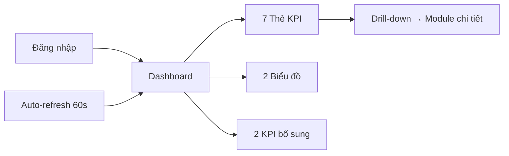
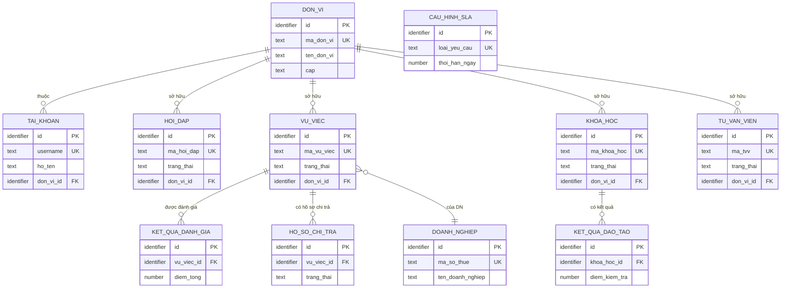

# SRS — Section 3.2.3: Dashboard

**Dự án:** Phần mềm hỗ trợ pháp lý doanh nghiệp
**Phiên bản SRS:** 3.0
**Nhóm:** I — Dashboard
**UC range:** UC 1 – UC 9
**Số FR:** 11 (FR-I-01 đến FR-I-09, KPI bổ sung, Auto-refresh)
**File chính:** `srs-v3.md` Section 3.2

---

## Mục lục file này

- [1. Tổng quan nhóm](#1-tổng-quan-nhóm)
- [2. Yêu cầu chức năng chi tiết](#2-yêu-cầu-chức-năng-chi-tiết)
- [3. Màn hình chức năng](#3-màn-hình-chức-năng)
- [4. Entity liên quan](#4-entity-liên-quan)
- [5. State Machine liên quan](#5-state-machine-liên-quan)
- [6. Business Rules liên quan](#6-business-rules-liên-quan)

---

## 1. Tổng quan nhóm

**Mục đích:** Hiển thị 9 chỉ số tổng quan (KPI) hoạt động HTPLDN trên trang chủ CMS.

**Quy trình nghiệp vụ tổng quan:**

Nhóm I là trang chủ sau đăng nhập. Chỉ read-only, không có thao tác CUD. Dữ liệu tự lọc theo đơn vị đăng nhập (phân quyền theo đơn vị). Tự động làm mới mỗi 60 giây. Click vào thẻ KPI → drill-down đến danh sách chi tiết module tương ứng.

**Đặc thù:**
- Read-only — không có thao tác CUD
- Scoped by đơn vị (phân quyền theo đơn vị)
- Auto-refresh mỗi 60 giây
- Click → drill-down đến danh sách chi tiết nhóm tương ứng
- Bộ lọc: Thời gian (từ-đến), năm, cấp đơn vị

**Entity nguồn:** HOI_DAP, VU_VIEC, KHOA_HOC, TU_VAN_VIEN, KET_QUA_DANH_GIA, KET_QUA_DAO_TAO, CAU_HINH_SLA

**Tác nhân:** Cán bộ Nghiệp vụ (TW/BN/ĐP), Cán bộ Phê duyệt (TW/BN/ĐP)

---

## 2. Yêu cầu chức năng chi tiết

### SHARED TEMPLATE — Dashboard KPI Widget (TPL-DASH-KPI)

> Áp dụng cho FR-I-01 đến FR-I-07 (7 UC KPI đơn giản)

**Preconditions chung:**
- User đã đăng nhập (BR-AUTH-01)
- User có quyền truy cập Dashboard

**Inputs chung:**

| # | Tên field | Kiểu logic | Bắt buộc | Ràng buộc | Mặc định | Nguồn |
|---|----------|-----------|----------|-----------|----------|-------|
| 1 | tu_ngay | date | N | — | đầu năm hiện tại | filter |
| 2 | den_ngay | date | N | — | hôm nay | filter |
| 3 | nam | number | N | — | năm hiện tại | filter |
| 4 | don_vi_id | identifier | N | TW: cho phép chọn, BN/ĐP: tự động | — | filter |

**Processing chung:**

| Bước | Mô tả xử lý | BR áp dụng |
|------|-------------|-----------|
| 1 | Kiểm tra quyền + phạm vi phân quyền theo đơn vị | BR-AUTH-01, BR-AUTH-08 |
| 2 | Xác định phạm vi đơn vị: TW → toàn quốc, BN → chỉ BN, ĐP → chỉ ĐP | BR-AUTH-03, BR-AUTH-04 |
| 3 | Áp dụng bộ lọc thời gian | — |
| 4 | Thực hiện truy vấn tổng hợp (đếm/tổng/trung bình) | — |
| 5 | Trả về giá trị KPI | — |

**Outputs chung:**

| # | Tên | Kiểu logic | Điều kiện | Format |
|---|-----|-----------|-----------|--------|
| 1 | gia_tri | number | — | số |
| 2 | nhan | text | — | — |
| 3 | don_vi_tinh | text | — | VD: "yêu cầu", "vụ việc" |
| 4 | drill_down_url | text | — | URL |
| 5 | tu_ngay | date | — | dd/mm/yyyy |
| 6 | den_ngay | date | — | dd/mm/yyyy |

**Postconditions chung:** Không thay đổi dữ liệu (read-only)

**Error Handling chung:**

| # | Điều kiện lỗi | Mã lỗi | Phản hồi hệ thống | Severity |
|---|--------------|--------|-------------------|----------|
| E1 | Không có dữ liệu | INFO-DASH-01 | Hiển thị "0" cho KPI + "Chưa có dữ liệu" | INFO |
| E2 | tu_ngay > den_ngay | ERR-DASH-01 | "Ngày bắt đầu phải trước ngày kết thúc" | ERROR |
| E3 | Lỗi truy vấn | ERR-DASH-02 | "Lỗi tải dữ liệu. Vui lòng thử lại" | ERROR |

---

### FR-I-01: Hiển thị tổng hợp hỏi đáp, vướng mắc (UC1)

**UC Reference:** UC 1
**Source:** CĐT xác nhận
**Priority:** Essential
**Stability:** High
**Màn hình:** SCR-I-01 — [Dashboard](#scr-i-01-tổng-quan-hệ-thống-dashboard)

**Mô tả:** Hiển thị tổng số hỏi đáp mới trong kỳ trên thẻ KPI.

**Tác nhân:** CB Nghiệp vụ (TW/BN/ĐP), CB Phê duyệt (TW/BN/ĐP)
**Template:** TPL-DASH-KPI

**Processing đặc thù:**

| Bước | Mô tả xử lý | BR áp dụng |
|------|-------------|-----------|
| 4 | Đếm số bản ghi HOI_DAP chưa xóa, trong phạm vi đơn vị, tạo trong khoảng thời gian lọc | — |

**Drill-down:** Click → chuyển đến FR-II-01 (Danh sách hỏi đáp) với filter tương ứng
**Nguồn dữ liệu:** Entity HOI_DAP (Nhóm II)

**Acceptance Criteria:**
- **Given** CB đăng nhập thành công **When** truy cập Dashboard **Then** hiển thị số liệu tổng hợp hỏi đáp theo phạm vi đơn vị
- **Given** CB thuộc ĐP **When** xem dashboard **Then** chỉ hiển thị dữ liệu của ĐP đó
- **Given** CB thuộc TW **When** xem dashboard **Then** hiển thị dữ liệu toàn quốc
- **Given** CB chọn bộ lọc thời gian **When** áp dụng **Then** dữ liệu cập nhật theo khoảng thời gian đã chọn

---

### FR-I-02: Tổng hợp vụ việc đã tiếp nhận (UC2)

**UC Reference:** UC 2
**Priority:** Essential | **Stability:** High
**Màn hình:** SCR-I-01
**Template:** TPL-DASH-KPI

**Processing đặc thù:**

| Bước | Mô tả xử lý | BR áp dụng |
|------|-------------|-----------|
| 4 | Đếm số bản ghi VU_VIEC chưa xóa, trong phạm vi đơn vị, ngày tiếp nhận trong khoảng thời gian lọc | — |

**Drill-down:** Click → chuyển đến Nhóm V.I (Danh sách vụ việc)

**Acceptance Criteria:**
- **Given** CB đăng nhập **When** xem Dashboard **Then** hiển thị tổng số vụ việc đã tiếp nhận theo đơn vị

---

### FR-I-03: Tổng hợp vụ việc đang hỗ trợ (UC3)

**UC Reference:** UC 3
**Priority:** Essential | **Stability:** High
**Màn hình:** SCR-I-01
**Template:** TPL-DASH-KPI

**Processing đặc thù:**

| Bước | Mô tả xử lý | BR áp dụng |
|------|-------------|-----------|
| 4 | Đếm số bản ghi VU_VIEC chưa xóa, trong phạm vi đơn vị, trạng thái thuộc nhóm đang xử lý (đã tiếp nhận, đang xử lý, đã phân công) | — |

**Drill-down:** Click → chuyển đến Nhóm V.I (lọc trạng thái "Đang xử lý")

**Acceptance Criteria:**
- **Given** CB đăng nhập **When** xem Dashboard **Then** hiển thị số vụ việc đang xử lý theo đơn vị

---

### FR-I-04: Tổng hợp vụ việc đã hoàn thành (UC4)

**UC Reference:** UC 4
**Priority:** Essential | **Stability:** High
**Màn hình:** SCR-I-01
**Template:** TPL-DASH-KPI

**Processing đặc thù:**

| Bước | Mô tả xử lý | BR áp dụng |
|------|-------------|-----------|
| 4 | Đếm số bản ghi VU_VIEC chưa xóa, trong phạm vi đơn vị, trạng thái = HOAN_THANH, ngày hoàn thành trong khoảng thời gian lọc | — |

**Drill-down:** Click → chuyển đến Nhóm V.I (lọc "Hoàn thành")

**Acceptance Criteria:**
- **Given** CB đăng nhập **When** xem Dashboard **Then** hiển thị tổng vụ việc trạng thái "Hoàn thành"
- **Given** CB lọc theo thời gian **When** áp dụng **Then** chỉ tính vụ việc hoàn thành trong khoảng thời gian

---

### FR-I-05: Tổng hợp khóa đào tạo đang diễn ra (UC5)

**UC Reference:** UC 5
**Priority:** Essential | **Stability:** High
**Màn hình:** SCR-I-01
**Template:** TPL-DASH-KPI

**Processing đặc thù:**

| Bước | Mô tả xử lý | BR áp dụng |
|------|-------------|-----------|
| 4 | Đếm số bản ghi KHOA_HOC chưa xóa, kết hợp thông tin chương trình đào tạo, đơn vị trong phạm vi phân quyền, trạng thái = DANG_DIEN_RA | — |

**Drill-down:** Click → chuyển đến Nhóm III (danh sách khóa học)

**Acceptance Criteria:**
- **Given** CB đăng nhập **When** xem Dashboard **Then** hiển thị số khóa ĐT "Đang diễn ra" thuộc đơn vị
- **Given** CB click vào chỉ số **When** hệ thống xử lý **Then** điều hướng đến danh sách chi tiết nhóm III

---

### FR-I-06: Tổng hợp khóa đào tạo đã diễn ra (UC6)

**UC Reference:** UC 6
**Priority:** Essential | **Stability:** High
**Màn hình:** SCR-I-01
**Template:** TPL-DASH-KPI

**Processing đặc thù:**

| Bước | Mô tả xử lý | BR áp dụng |
|------|-------------|-----------|
| 4 | Đếm số bản ghi KHOA_HOC chưa xóa, kết hợp thông tin chương trình đào tạo, đơn vị trong phạm vi phân quyền, trạng thái = KET_THUC, ngày kết thúc trong khoảng thời gian lọc | — |

**Acceptance Criteria:**
- **Given** CB đăng nhập **When** xem Dashboard **Then** hiển thị số khóa ĐT "Đã hoàn thành" theo đơn vị

---

### FR-I-07: Tổng số chuyên gia/TVV (UC7)

**UC Reference:** UC 7
**Priority:** Essential | **Stability:** High
**Màn hình:** SCR-I-01
**Template:** TPL-DASH-KPI

**Processing đặc thù:**

| Bước | Mô tả xử lý | BR áp dụng |
|------|-------------|-----------|
| 4 | Đếm số bản ghi TU_VAN_VIEN chưa xóa, trong phạm vi đơn vị, trạng thái = DANG_HOAT_DONG | — |

**Drill-down:** Click → chuyển đến Nhóm IV (danh sách CG/TVV)

**Acceptance Criteria:**
- **Given** CB đăng nhập **When** xem Dashboard **Then** hiển thị tổng số CG/TVV "Đang hoạt động" thuộc phạm vi
- **Given** CB TW **When** xem Dashboard **Then** hiển thị tổng CG/TVV toàn quốc

---

### FR-I-08: Biểu đồ đánh giá hiệu quả hỗ trợ (UC8)

**UC Reference:** UC 8
**Source:** Đề xuất — công thức tính chờ CĐT review
**Priority:** Essential
**Stability:** Medium
**Màn hình:** SCR-I-01 — [Dashboard](#scr-i-01-tổng-quan-hệ-thống-dashboard)

**Mô tả:** Biểu đồ kết hợp cột + đường: điểm hài lòng trung bình (cột, thang 1-5) và tỷ lệ tuân thủ SLA (đường, %).

**Tác nhân:** CB Nghiệp vụ (TW/BN/ĐP), CB Phê duyệt (TW/BN/ĐP)

**Preconditions:**
- User đã đăng nhập, có quyền Dashboard
- Có dữ liệu đánh giá trong kỳ (Nhóm VI)

**Inputs:**

| # | Tên field | Kiểu logic | Bắt buộc | Ràng buộc | Mặc định | Nguồn |
|---|----------|-----------|----------|-----------|----------|-------|
| 1 | tu_ngay | date | N | — | đầu năm | filter |
| 2 | den_ngay | date | N | — | hôm nay | filter |
| 3 | don_vi_id | identifier | N | — | — | filter |

**Processing:**

| Bước | Mô tả xử lý | BR áp dụng |
|------|-------------|-----------|
| 1 | Kiểm tra quyền + phạm vi phân quyền | BR-AUTH-01 |
| 2 | Tính điểm hài lòng trung bình từ kết quả đánh giá | — |
| 3 | Tính tỷ lệ tuân thủ SLA: số hoàn thành đúng hạn / tổng hoàn thành × 100 | BR-SLA-05 |
| 4 | Định dạng dữ liệu cho biểu đồ | — |
| 5 | Trả về dữ liệu biểu đồ | — |

**Outputs:**

| # | Tên | Kiểu logic | Điều kiện | Format |
|---|-----|-----------|-----------|--------|
| 1 | diem_hai_long_tb | number | — | thang 1-5 |
| 2 | ty_le_tuan_thu_sla | number | — | % |
| 3 | ty_le_ho_so_bo_sung | number | — | % (KPI-03) |
| 4 | thoi_gian_xu_ly_tb | number | — | ngày LV (KPI-04) |
| 5 | chart_data | structured | — | labels, datasets |

**Error Handling:**

| # | Điều kiện lỗi | Mã lỗi | Phản hồi hệ thống | Severity |
|---|--------------|--------|-------------------|----------|
| E1 | Không có dữ liệu đánh giá | INFO-DASH-02 | Biểu đồ trống + "Chưa có dữ liệu đánh giá trong kỳ" | INFO |

**Acceptance Criteria:**
- **Given** CB đăng nhập **When** xem Dashboard **Then** hiển thị biểu đồ điểm hài lòng + tỷ lệ tuân thủ SLA
- **Given** CB lọc theo thời gian **When** áp dụng **Then** biểu đồ cập nhật

---

### FR-I-09: Biểu đồ chất lượng đào tạo (UC9)

**UC Reference:** UC 9
**Source:** Đề xuất — công thức tính chờ CĐT review
**Priority:** Essential
**Stability:** Medium
**Màn hình:** SCR-I-01 — [Dashboard](#scr-i-01-tổng-quan-hệ-thống-dashboard)

**Mô tả:** Biểu đồ tròn: tỷ lệ đạt chứng nhận (%) + điểm trung bình.

**Tác nhân:** CB Nghiệp vụ (TW/BN/ĐP), CB Phê duyệt (TW/BN/ĐP)

**Preconditions:**
- User đã đăng nhập, có quyền Dashboard
- Có dữ liệu đào tạo trong kỳ (Nhóm III)

**Processing:**

| Bước | Mô tả xử lý | BR áp dụng |
|------|-------------|-----------|
| 1 | Kiểm tra quyền + phạm vi phân quyền | BR-AUTH-01 |
| 2 | Tính tỷ lệ đạt: số học viên đạt chứng nhận / tổng học viên × 100 | — |
| 3 | Tính điểm trung bình từ kết quả đào tạo | — |
| 4 | Định dạng dữ liệu biểu đồ | — |
| 5 | Trả về | — |

**Outputs:**

| # | Tên | Kiểu logic | Điều kiện | Format |
|---|-----|-----------|-----------|--------|
| 1 | ty_le_dat | number | — | % |
| 2 | diem_tb | number | — | thang điểm |
| 3 | chart_data | structured | — | labels, datasets |

**Acceptance Criteria:**
- **Given** CB đăng nhập **When** xem Dashboard **Then** hiển thị biểu đồ tỷ lệ đạt + điểm TB
- **Given** CB lọc theo thời gian **When** áp dụng **Then** biểu đồ cập nhật

---

### KPI bổ sung Dashboard (S3-3)

**UC Reference:** UC1-9 (bổ sung)
**Priority:** Essential | **Stability:** Medium
**Màn hình:** SCR-I-01

| KPI | Tên | Công thức | Ghi chú |
|-----|-----|-----------|---------|
| KPI-03 | Tỷ lệ hồ sơ phải bổ sung | Số VV đã từng qua trạng thái 'Yêu cầu bổ sung' / Tổng VV hoàn thành × 100% | 1 VV bổ sung 2 lần chỉ đếm 1 |
| KPI-04 | Thời gian xử lý trung bình | Trung bình (Ngày hoàn thành − Ngày tiếp nhận) / n | Tính theo ngày làm việc (Thứ 2-6, trừ lễ) theo BR-CALC-03 |

---

### FR-I-CROSS-02: Auto-refresh Dashboard

**UC Reference:** UC1-9 (cross-cutting)
**Priority:** Medium | **Stability:** High
**Màn hình:** SCR-I-01

**Mô tả:** Dashboard tự động làm mới dữ liệu KPI mỗi 60 giây.

**Processing:**

| Bước | Mô tả xử lý | BR áp dụng |
|------|-------------|-----------|
| 1 | Thiết lập timer 60 giây, gọi AJAX reload tất cả KPI + biểu đồ | — |
| 2 | Sử dụng Page Visibility API: nếu tab ẩn → tạm dừng timer | — |
| 3 | Tab active trở lại → refresh ngay + reset timer | — |
| 4 | Nếu AJAX fail → hiển thị toast cảnh báo, không dừng timer, retry lần tiếp | — |

**Acceptance Criteria:**
- **Given** CB đang xem Dashboard **When** 60 giây trôi qua **Then** dữ liệu tự động cập nhật
- **Given** CB chuyển sang tab khác **When** Dashboard bị ẩn **Then** tạm dừng auto-refresh
- **Given** CB quay lại tab Dashboard **When** tab active **Then** refresh ngay lập tức

---

## 3. Màn hình chức năng

### SCR-I-01: Tổng quan hệ thống (Dashboard)

**Loại màn hình:** Dashboard
**FR sử dụng:** FR-I-01 đến FR-I-09, FR-I-CROSS-02, KPI-03, KPI-04
**UX-Spec ref:** dac-ta-man-hinh-chuc-nang-v2.md — MH-01

#### Layout tổng quan

Dashboard chia thành 5 vùng từ trên xuống dưới:
1. Breadcrumb & Tiêu đề + Nút làm mới + Nhãn cập nhật
2. Bộ lọc thời gian & đơn vị
3. Hàng thẻ KPI 1 (4 thẻ: UC1-UC4)
4. Hàng thẻ KPI 2 (3 thẻ: UC5-UC7) + Hàng thẻ KPI bổ sung (2 thẻ: KPI-03, KPI-04)
5. 2 Biểu đồ cạnh nhau (UC8 trái, UC9 phải)

#### Thành phần màn hình

| # | Vùng | Thành phần | Loại | Dữ liệu / Nội dung | Hành vi | Điều kiện hiển thị |
|---|------|-----------|------|--------------------| --------|-------------------|
| 1 | toolbar | Breadcrumb | breadcrumb | "Trang chủ > Tổng quan" | — | luôn hiển thị |
| 2 | toolbar | Tiêu đề | label | "Tổng quan hệ thống" | — | luôn hiển thị |
| 3 | toolbar | Nút Làm mới | button | Icon + "Làm mới". Disabled + xoay khi đang tải | click → AJAX reload tất cả KPI + biểu đồ | luôn hiển thị |
| 4 | toolbar | Nhãn cập nhật | label | "Cập nhật lúc HH:mm" | auto cập nhật | luôn hiển thị |
| 5 | filter-bar | Dropdown Năm | select | 2020 đến năm hiện tại. Mặc định: 2026 | change → set tu_ngay/den_ngay | luôn hiển thị |
| 6 | filter-bar | DatePicker Từ ngày | date-picker | dd/mm/yyyy. Mặc định: 01/01/{năm} | change → filter | luôn hiển thị |
| 7 | filter-bar | DatePicker Đến ngày | date-picker | dd/mm/yyyy. Mặc định: hôm nay | change → filter | luôn hiển thị |
| 8 | filter-bar | Dropdown Đơn vị | select | TW: chọn bất kỳ hoặc "Tất cả". BN/ĐP: read-only | change → filter | TW: hiển thị. BN/ĐP: ẩn hoặc read-only |
| 9 | filter-bar | Nút Áp dụng | button | "Áp dụng" | click → reload tất cả | luôn hiển thị |
| 10 | filter-bar | Nút Xóa bộ lọc | button | "Xóa bộ lọc" | click → reset mặc định | luôn hiển thị |
| 11 | content | Thẻ KPI-01: Hỏi đáp mới | card (KPI) | Đếm số hỏi đáp mới trong kỳ + xu hướng so kỳ trước | click → drill-down /hoi-dap/danh-sach?trang_thai=MOI | luôn hiển thị |
| 12 | content | Thẻ KPI-02: VV tiếp nhận | card (KPI) | Đếm số vụ việc tiếp nhận trong kỳ | click → drill-down /vu-viec/danh-sach | luôn hiển thị |
| 13 | content | Thẻ KPI-03: VV đang xử lý | card (KPI) | Đếm số vụ việc đang xử lý (trạng thái: tiếp nhận, đang xử lý, đã phân công) | click → drill-down /vu-viec/danh-sach?trang_thai=DANG_XU_LY | luôn hiển thị |
| 14 | content | Thẻ KPI-04: VV hoàn thành | card (KPI) | Đếm số vụ việc hoàn thành trong kỳ | click → drill-down /vu-viec/danh-sach?trang_thai=HOAN_THANH | luôn hiển thị |
| 15 | content | Thẻ KPI-05: ĐT đang diễn ra | card (KPI) | Đếm số khóa đào tạo đang diễn ra | click → drill-down /dao-tao/khoa-hoc?trang_thai=DANG_DIEN_RA | luôn hiển thị |
| 16 | content | Thẻ KPI-06: ĐT hoàn thành | card (KPI) | Đếm số khóa đào tạo kết thúc trong kỳ | click → drill-down /dao-tao/khoa-hoc?trang_thai=KET_THUC | luôn hiển thị |
| 17 | content | Thẻ KPI-07: Tổng CG/TVV | card (KPI) | Đếm số CG/TVV đang hoạt động | click → drill-down /chuyen-gia-tvv/danh-sach | luôn hiển thị |
| 18 | content | Thẻ KPI bổ sung 1: Tỷ lệ HS bổ sung | card (KPI) | Số VV từng qua trạng thái bổ sung / Tổng VV hoàn thành × 100% | không drill-down | luôn hiển thị |
| 19 | content | Thẻ KPI bổ sung 2: Thời gian xử lý TB | card (KPI) | Trung bình ngày làm việc từ tiếp nhận đến hoàn thành | không drill-down | luôn hiển thị |
| 20 | content | Biểu đồ Đánh giá hiệu quả (UC8) | chart (bar + line) | Trục X: đơn vị/kỳ. Trục Y trái: điểm hài lòng TB. Trục Y phải: tỷ lệ tuân thủ SLA (%) | hover → tooltip | luôn hiển thị |
| 21 | content | Biểu đồ Chất lượng ĐT (UC9) | chart (donut) | Tỷ lệ đạt chứng nhận (%) + Điểm TB | hover → tooltip | luôn hiển thị |
| 22 | content | Skeleton loading | skeleton | Hiện khi đang refresh từng thẻ/biểu đồ | — | khi đang tải |
| 23 | content | Trạng thái trống | label | "Chưa có dữ liệu" cho KPI = 0 / biểu đồ trống | — | khi không có dữ liệu |

#### Quy tắc tương tác
- Auto-refresh mỗi 60 giây (sử dụng Page Visibility API — KHÔNG refresh khi tab ẩn)
- KPI hiển thị xu hướng: so sánh kỳ hiện tại với kỳ trước, tăng = xanh lá, giảm = đỏ
- Bộ lọc thời gian đồng bộ URL
- Co giãn: 4 cột → 2 cột trên viewport 1024-1279px
- Khi AJAX fail → toast cảnh báo "Lỗi tải dữ liệu", không dừng timer

---

## 4. Entity liên quan

> **Source of truth:** `srs-v3.md` Section 3.4. Nội dung dưới đây được trích để agent có đủ context.

### Tổng quan entity

| # | Entity | Vai trò | Mô tả |
|---|--------|---------|-------|
| 1 | HOI_DAP | referenced | Câu hỏi/vướng mắc pháp lý — nguồn dữ liệu KPI-01 |
| 2 | VU_VIEC | referenced | Vụ việc trợ giúp pháp lý — nguồn dữ liệu KPI-02/03/04 |
| 3 | KHOA_HOC | referenced | Khóa đào tạo — nguồn dữ liệu KPI-05/06 |
| 4 | TU_VAN_VIEN | referenced | Tư vấn viên/chuyên gia — nguồn dữ liệu KPI-07 |
| 5 | KET_QUA_DANH_GIA | referenced | Kết quả đánh giá — nguồn biểu đồ UC8 |
| 6 | KET_QUA_DAO_TAO | referenced | Kết quả đào tạo — nguồn biểu đồ UC9 |
| 7 | CAU_HINH_SLA | referenced | Cấu hình SLA — tính tỷ lệ tuân thủ |
| 8 | DON_VI | referenced | Đơn vị — phân quyền theo đơn vị |
| 9 | TAI_KHOAN | referenced | Tài khoản — xác thực người dùng |
| 10 | DOANH_NGHIEP | referenced | Doanh nghiệp — liên kết vụ việc |
| 11 | HO_SO_CHI_TRA | referenced | Hồ sơ chi trả — KPI bổ sung |

### ERD nhóm (subset)

### HOI_DAP (referenced)

**Mô tả:** Lưu trữ yêu cầu hỏi đáp/vướng mắc pháp lý từ doanh nghiệp. Entity trung tâm của Nhóm II.
**Tham chiếu FR:** FR-II-01 đến FR-II-10, FR-II-NEW-01/02, FR-II-CROSS-01

| Attribute | Kiểu logic | Bắt buộc | Ràng buộc nghiệp vụ | Mặc định | Mô tả |
|-----------|-----------|----------|------------|---------|-------|
| ma_hoi_dap | text | Y | UNIQUE | Auto-gen | Mã hỏi đáp (format: HD-YYYYMMDD-SEQ) |
| tieu_de | text | Y | | | Tiêu đề câu hỏi |
| noi_dung | text (long) | Y | | | Nội dung câu hỏi (max 5000 ký tự logic) |
| linh_vuc_id | identifier | Y | FK → DANH_MUC(id) | | Lĩnh vực pháp lý (UC99) |
| trang_thai | text | Y | CHECK IN ('MOI','TIEP_NHAN','DANG_XU_LY','DA_TRA_LOI','CHO_PHE_DUYET','DA_DUYET','CONG_KHAI','HOAN_THANH','HUY') | 'MOI' | Trạng thái lifecycle (SM-HOIDAP) |
| don_vi_id | identifier | Y | FK → DON_VI(id) | | Đơn vị sở hữu theo đơn vị |

**Dashboard sử dụng:** COUNT(*) WHERE trang_thai = 'MOI' AND is_deleted = 0 → KPI-01

**Volume & Growth:** ~10,000 records/năm.

### VU_VIEC (referenced)

**Mô tả:** Quản lý vụ việc HTPL cho DNNVV theo NĐ55/2019. Entity trung tâm của Nhóm V.I.

| Attribute | Kiểu logic | Bắt buộc | Ràng buộc nghiệp vụ | Mặc định | Mô tả |
|-----------|-----------|----------|------------|---------|-------|
| ma_vu_viec | text | Y | UNIQUE | Auto-gen | Mã vụ việc (format: VV-{TINH}-YYYYMMDD-SEQ) |
| trang_thai | text | Y | CHECK IN ('MOI_TAO','CHO_TIEP_NHAN','DA_TIEP_NHAN',...,'HOAN_THANH','DA_DANH_GIA') | 'CHO_TIEP_NHAN' | Trạng thái lifecycle (SM-VUVIEC) |
| ngay_tiep_nhan | datetime | N | | | Ngày tiếp nhận |
| ngay_hoan_thanh | datetime | N | | | Ngày hoàn thành xử lý |
| don_vi_id | identifier | Y | FK → DON_VI(id) | | Đơn vị sở hữu theo đơn vị |

**Dashboard sử dụng:** COUNT(*) theo trang_thai → KPI-02/03/04; AVG(ngay_hoan_thanh - ngay_tiep_nhan) → KPI-04 (thời gian xử lý TB)

**Volume & Growth:** ~5,000 records/năm.

### KHOA_HOC (referenced)

**Mô tả:** Khóa học thuộc chương trình đào tạo. Entity trung tâm Nhóm III.

| Attribute | Kiểu logic | Bắt buộc | Ràng buộc nghiệp vụ | Mặc định | Mô tả |
|-----------|-----------|----------|------------|---------|-------|
| ma_khoa_hoc | text | Y | UNIQUE | Auto-gen | Mã khóa học |
| ten_khoa_hoc | text | Y | | | Tên khóa học |
| trang_thai | text | Y | CHECK IN ('DU_THAO','CHO_DUYET','DA_DUYET','DANG_DIEN_RA','DA_KET_THUC','CHO_DUYET_KQ','DA_CONG_KHAI','HOAN_THANH','HUY') | 'DU_THAO' | Trạng thái lifecycle (SM-KHOAHOC) |
| don_vi_id | identifier | Y | FK → DON_VI(id) | | Đơn vị sở hữu theo đơn vị |

**Dashboard sử dụng:** COUNT(*) WHERE trang_thai = 'DANG_DIEN_RA' → KPI-05; COUNT(*) WHERE trang_thai = 'KET_THUC' → KPI-06

**Volume & Growth:** ~500 records/năm.

### TU_VAN_VIEN (referenced)

**Mô tả:** Thông tin TVV/CG/NHT trong mạng lưới tư vấn. Entity trung tâm Nhóm IV.

| Attribute | Kiểu logic | Bắt buộc | Ràng buộc nghiệp vụ | Mặc định | Mô tả |
|-----------|-----------|----------|------------|---------|-------|
| ma_tvv | text | Y | UNIQUE | Auto-gen | Mã TVV |
| ho_ten | text | Y | | | Họ tên đầy đủ |
| trang_thai | text | Y | CHECK IN ('MOI_DANG_KY',...,'DANG_HOAT_DONG','TAM_DUNG','VO_HIEU_HOA') | 'MOI_DANG_KY' | Trạng thái lifecycle (SM-TVV) |
| don_vi_id | identifier | Y | FK → DON_VI(id) | | Đơn vị sở hữu theo đơn vị |

**Dashboard sử dụng:** COUNT(*) WHERE trang_thai = 'DANG_HOAT_DONG' → KPI-07

**Volume & Growth:** ~2,000 records/năm.

### KET_QUA_DANH_GIA (referenced)

**Mô tả:** Kết quả đánh giá chi tiết từng vụ việc trong đợt đánh giá. Nhóm VI.

| Attribute | Kiểu logic | Bắt buộc | Ràng buộc nghiệp vụ | Mặc định | Mô tả |
|-----------|-----------|----------|------------|---------|-------|
| ke_hoach_id | identifier | Y | FK → KE_HOACH_DANH_GIA(id) | | Đợt đánh giá |
| vu_viec_id | identifier | Y | FK → VU_VIEC(id) | | Vụ việc được đánh giá |
| diem_tong | number | N | CHECK BETWEEN 0 AND 100 | | Điểm tổng |
| don_vi_id | identifier | Y | FK → DON_VI(id) | | Đơn vị sở hữu theo đơn vị |

**Dashboard sử dụng:** AVG(diem_tong) → biểu đồ UC8 (điểm hài lòng TB)

### KET_QUA_DAO_TAO (referenced)

**Mô tả:** Kết quả học tập (điểm danh, điểm kiểm tra, xếp loại) của từng học viên. Nhóm III.

| Attribute | Kiểu logic | Bắt buộc | Ràng buộc nghiệp vụ | Mặc định | Mô tả |
|-----------|-----------|----------|------------|---------|-------|
| khoa_hoc_id | identifier | Y | FK → KHOA_HOC(id) | | Khóa học |
| hoc_vien_id | identifier | Y | FK → TAI_KHOAN(id) | | Học viên |
| diem_kiem_tra | number | N | CHECK BETWEEN 0 AND 10 | | Điểm kiểm tra |
| xep_loai | text | N | CHECK IN ('DAT','KHONG_DAT','GIOI','KHA','TRUNG_BINH') | | Xếp loại |

**Dashboard sử dụng:** COUNT(xep_loai='DAT') / COUNT(*) → biểu đồ UC9 (tỷ lệ đạt); AVG(diem_kiem_tra) → điểm TB

### CAU_HINH_SLA (referenced)

**Mô tả:** Cấu hình thời hạn xử lý + 4 mức cảnh báo cho từng loại yêu cầu.

| Attribute | Kiểu logic | Bắt buộc | Ràng buộc nghiệp vụ | Mặc định | Mô tả |
|-----------|-----------|----------|------------|---------|-------|
| loai_yeu_cau | text | Y | UNIQUE | | Loại YC: HOI_DAP, VU_VIEC, HO_SO_CHI_TRA... |
| thoi_han_ngay | number | Y | CHECK > 0 | | Thời hạn xử lý (ngày làm việc) |
| canh_bao_1_phan_tram | number | Y | CHECK BETWEEN 0 AND 100 | 50 | % thời hạn → cảnh báo mức 1 |
| canh_bao_2_phan_tram | number | Y | CHECK BETWEEN 0 AND 100 | 90 | % thời hạn → cảnh báo mức 2 |

**Dashboard sử dụng:** Tính tỷ lệ tuân thủ SLA cho biểu đồ UC8

---

## 5. State Machine liên quan

> **Source of truth:** `srs-v3.md` Phụ lục C.

Dashboard là module read-only, không thực hiện chuyển trạng thái. Tuy nhiên, dashboard đọc và tổng hợp dữ liệu từ các entity có state machine sau:

- **SM-HOIDAP** (HOI_DAP): 9 trạng thái — đếm theo trạng thái cho KPI-01
- **SM-VUVIEC** (VU_VIEC): 12 trạng thái — đếm theo nhóm trạng thái cho KPI-02/03/04
- **SM-KHOAHOC** (KHOA_HOC): 9 trạng thái — đếm DANG_DIEN_RA, DA_KET_THUC cho KPI-05/06
- **SM-TVV** (TU_VAN_VIEN): 9 trạng thái — đếm DANG_HOAT_DONG cho KPI-07

Không có state machine owned bởi nhóm I.

---

## 6. Business Rules liên quan

> **Source of truth:** `srs-v3.md` Phụ lục B.

### Tổng quan BR sử dụng

| BR ID | Tên | FR áp dụng (trong nhóm này) |
|-------|-----|---------------------------|
| BR-AUTH-01 | Xác thực bắt buộc | FR-I-01 đến FR-I-09, FR-I-CROSS-02 |
| BR-AUTH-03 | Ngang cấp không thấy nhau | FR-I-01 đến FR-I-09 |
| BR-AUTH-04 | Cấp cha thấy cấp con | FR-I-01 đến FR-I-09 |
| BR-AUTH-08 | phân quyền dữ liệu theo đơn vị | FR-I-01 đến FR-I-09 |
| BR-SLA-05 | Dashboard hiển thị SLA | FR-I-08 |
| BR-CALC-03 | Deadline ngày làm việc | KPI-04 |

### BR-AUTH-01: Xác thực bắt buộc

| ID | Phát biểu quy tắc | Nguồn | Áp dụng FR (nhóm I) | Ngoại lệ | Kiểm chứng |
|----|-------------------|-------|---------------------|---------|------------|
| BR-AUTH-01 | Mọi user phải xác thực trước khi truy cập hệ thống. Tier 1 (MVP): Username/password + TOTP 2FA qua email. Tier 2: VNPT eKYC xác thực CCCD. Tier 3: SSO VNeID OIDC Authorization Code flow (khi được phê duyệt theo NĐ69/2024). | PRD A6, FR-VIII-20 | FR-I-01 đến FR-I-09 | API outbound không yêu cầu session | Test đăng nhập Tier 1 + TOTP |

### BR-AUTH-03: Ngang cấp không thấy nhau

| ID | Phát biểu quy tắc | Nguồn | Áp dụng FR (nhóm I) | Ngoại lệ | Kiểm chứng |
|----|-------------------|-------|---------------------|---------|------------|
| BR-AUTH-03 | BN chỉ thấy dữ liệu BN mình. ĐP chỉ thấy dữ liệu ĐP mình. BN không thấy ĐP và ngược lại | PRD A3, CĐT xác nhận | FR-I-01 đến FR-I-09 | QTHT thấy tất cả | Test cross-unit query = 0 rows |

### BR-AUTH-04: Cấp cha thấy cấp con

| ID | Phát biểu quy tắc | Nguồn | Áp dụng FR (nhóm I) | Ngoại lệ | Kiểm chứng |
|----|-------------------|-------|---------------------|---------|------------|
| BR-AUTH-04 | TW thấy toàn bộ dữ liệu TW + BN + ĐP. BN chỉ thấy BN mình (không thấy ĐP trực thuộc BN) | PRD A3, CĐT xác nhận | FR-I-01 đến FR-I-09 | BN KHÔNG thấy ĐP | Verify chính sách phân quyền |

### BR-AUTH-08: phân quyền dữ liệu theo đơn vị

| ID | Phát biểu quy tắc | Nguồn | Áp dụng FR (nhóm I) | Ngoại lệ | Kiểm chứng |
|----|-------------------|-------|---------------------|---------|------------|
| BR-AUTH-08 | Chính sách phân quyền dữ liệu áp dụng cho MỌI bảng có cột `don_vi_id`. Không có exception ngoại trừ QTHT | Architecture AD-07 | FR-I-01 đến FR-I-09 | AUDIT_LOG không có phân quyền | Verify phân quyền |

### BR-SLA-05: Dashboard hiển thị SLA

| ID | Phát biểu quy tắc | Nguồn | Áp dụng FR (nhóm I) | Ngoại lệ | Kiểm chứng |
|----|-------------------|-------|---------------------|---------|------------|
| BR-SLA-05 | Biểu đồ tỷ lệ tuân thủ SLA = COUNT(hoan_thanh_dung_han) / COUNT(hoan_thanh) * 100% | FR-I-08 | FR-I-08 | — | Test dashboard SLA widget |

### BR-CALC-03: Deadline ngày làm việc

| ID | Phát biểu quy tắc | Nguồn | Áp dụng FR (nhóm I) | Ngoại lệ | Kiểm chứng |
|----|-------------------|-------|---------------------|---------|------------|
| BR-CALC-03 | Deadline = ngày tiếp nhận + N ngày làm việc. N lấy từ CAU_HINH_SLA. Ngày làm việc: Thứ 2-6, trừ ngày lễ (cấu hình) | FR-VIII-10, NĐ55 Điều 9 | KPI-04 (thời gian xử lý TB) | — | Test deadline tính đúng ngày LV |

---

**--- Het file FR Group: Dashboard ---**
