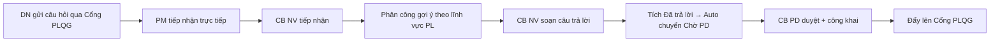
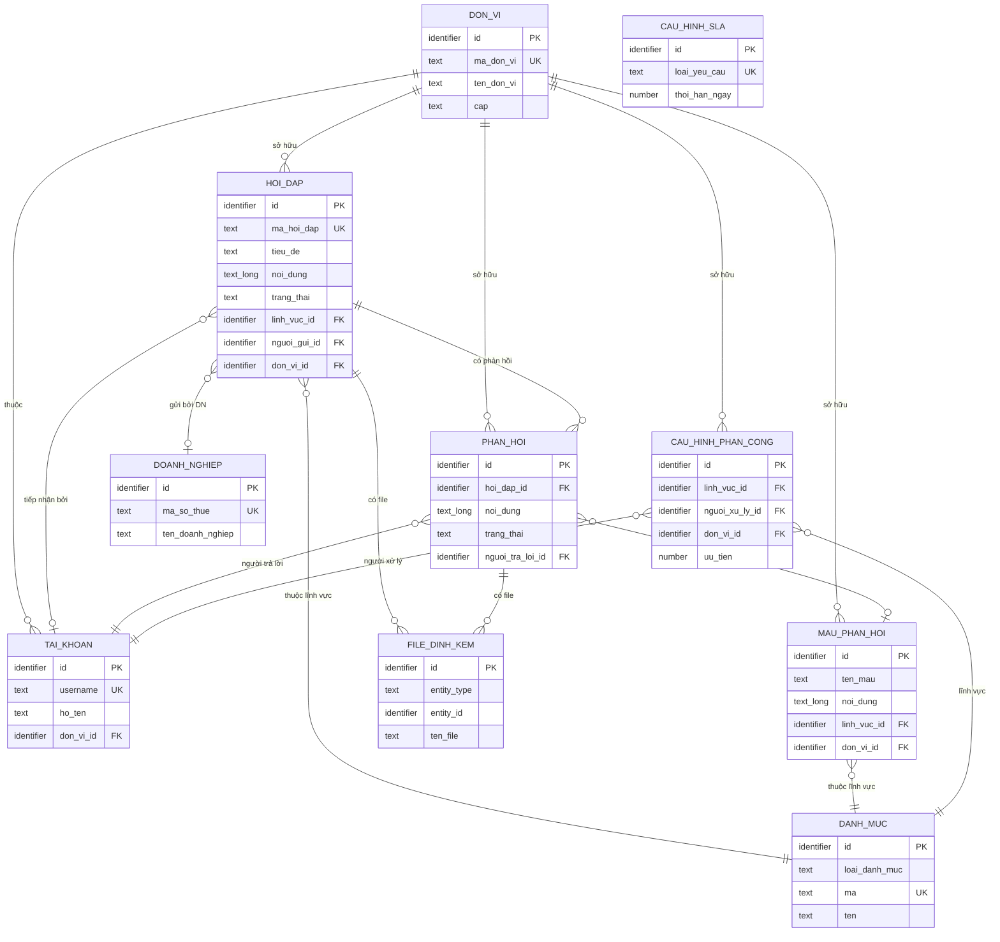
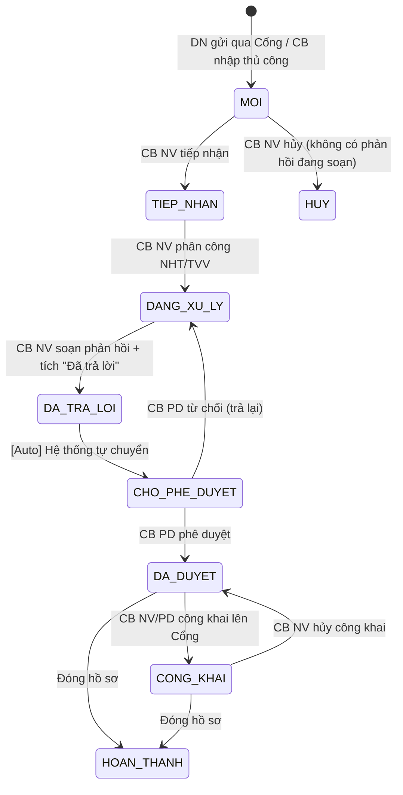

# SRS — Section 3.2.4: Quản lý Hỏi đáp, Vướng mắc Pháp lý

**Dự án:** Phần mềm hỗ trợ pháp lý doanh nghiệp
**Phiên bản SRS:** 3.0
**Nhóm:** II — Quản lý Hỏi đáp, Vướng mắc Pháp lý
**UC range:** UC 10 – UC 19
**Số FR:** 13 (FR-II-01 đến FR-II-10, FR-II-NEW-01, FR-II-NEW-02, FR-II-CROSS-01)
**File chính:** `srs-v3.md` Section 3.2

---

## Mục lục file này

- [1. Tổng quan nhóm](#1-tổng-quan-nhóm)
- [2. Yêu cầu chức năng chi tiết](#2-yêu-cầu-chức-năng-chi-tiết)
- [3. Màn hình chức năng](#3-màn-hình-chức-năng)
- [4. Entity liên quan](#4-entity-liên-quan)
- [5. State Machine liên quan](#5-state-machine-liên-quan)
- [6. Business Rules liên quan](#6-business-rules-liên-quan)

---

## 1. Tổng quan nhóm

**Mục đích:** Tiếp nhận, xử lý, kiểm duyệt và công khai câu hỏi/phản hồi pháp lý từ doanh nghiệp.

**Quy trình nghiệp vụ tổng quan:**



**Máy trạng thái SM-HOIDAP:**
```
MOI → TIEP_NHAN → DANG_XU_LY → DA_TRA_LOI (thoáng qua) → CHO_PHE_DUYET → DA_DUYET → CONG_KHAI → HOAN_THANH
CHO_PHE_DUYET → DANG_XU_LY (từ chối, trả lại CB NV)
DA_DUYET → CONG_KHAI (công khai lên Cổng PLQG)
CONG_KHAI → DA_DUYET (hủy công khai)
DA_DUYET / CONG_KHAI → HOAN_THANH (đóng hồ sơ)
MOI → HUY (hủy yêu cầu)
```

**Entity chính:** HOI_DAP, PHAN_HOI, CAU_HINH_PHAN_CONG, MAU_PHAN_HOI, AUDIT_LOG, THONG_BAO

**Tác nhân chính:** Cán bộ Nghiệp vụ (TW/BN/ĐP), Cán bộ Phê duyệt (TW/BN/ĐP), QTHT

---

## 2. Yêu cầu chức năng chi tiết

### FR-II-01: Quản lý thông tin hỏi đáp, vướng mắc pháp lý (UC10)

**UC Reference:** UC 10
**Source:** CĐT xác nhận
**Priority:** Essential
**Stability:** High
**Màn hình:** SCR-II-01 — [Danh sách Hỏi đáp](#scr-ii-01-danh-sách-hỏi-đáp)

**Mô tả:** Quản lý toàn bộ danh sách hỏi đáp pháp lý: xem, thêm mới, sửa, xóa, xuất Excel, làm mới dữ liệu.

**Tác nhân:** Cán bộ Nghiệp vụ (TW/BN/ĐP)

**Preconditions:**
- User đã đăng nhập (BR-AUTH-01)
- User có quyền "Quản lý hỏi đáp" (UC115)
- Phạm vi phân quyền theo đơn vị áp dụng

**Inputs:**

| # | Tên field | Kiểu logic | Bắt buộc | Ràng buộc | Mặc định | Nguồn |
|---|----------|-----------|----------|-----------|----------|-------|
| 1 | ma_hoi_dap | text | Y (auto) | Auto-gen: HD-YYYYMMDD-SEQ | — | system |
| 2 | noi_dung | text (long) | Y | Max 5000 ký tự | — | user input |
| 3 | linh_vuc_id | identifier | Y | Lĩnh vực PL (từ UC99) | — | user input |
| 4 | ten_nguoi_gui | text | N | — | — | user input |
| 5 | email_nguoi_gui | text | N | — | — | user input |
| 6 | sdt_nguoi_gui | text | N | — | — | user input |
| 7 | doanh_nghiep_id | identifier | N | DN liên kết | — | user input |
| 8 | kenh_tiep_nhan | text | Y | DVC / CONG_PLQG / TRUC_TIEP / HE_THONG_KHAC | — | user input |
| 9 | file_dinh_kem | binary[] | N | File đính kèm | — | user upload |

**Processing — Thêm mới:**

| Bước | Mô tả xử lý | BR áp dụng |
|------|-------------|-----------|
| 1 | Kiểm tra quyền | BR-AUTH-01 |
| 2 | Tự sinh mã hỏi đáp: HD-{YYYYMMDD}-{SEQ} | BR-DATA-04 |
| 3 | Kiểm tra dữ liệu: nội dung không trống, <= 5000 ký tự | — |
| 4 | Kiểm tra lĩnh vực tồn tại | — |
| 5 | Đặt trạng thái = MOI | SM-HOIDAP |
| 6 | Nếu nguồn từ Cổng PLQG: ghi nhận từ API inbound | — |
| 7 | Tạo bản ghi HOI_DAP | BR-DATA-03 |
| 8 | Nếu có file: tạo bản ghi FILE_DINH_KEM | — |
| 9 | Tính deadline SLA từ cấu hình SLA (loại = 'HOI_DAP') | BR-CALC-03 |
| 10 | Ghi nhật ký thao tác | BR-DATA-05 |

**Processing — Chỉnh sửa:**

| Bước | Mô tả xử lý | BR áp dụng |
|------|-------------|-----------|
| 1 | Kiểm tra trạng thái không phải DA_DUYET hoặc HOAN_THANH | BR-FLOW-03 |
| 2 | Kiểm tra dữ liệu đầu vào | — |
| 3 | Cập nhật bản ghi HOI_DAP | — |
| 4 | Ghi nhật ký thao tác (giá trị cũ → mới) | BR-DATA-05 |

**Processing — Xóa (soft delete):**

| Bước | Mô tả xử lý | BR áp dụng |
|------|-------------|-----------|
| 1 | Kiểm tra trạng thái không phải DA_DUYET | BR-FLOW-03 |
| 2 | Đánh dấu bản ghi là đã xóa | BR-DATA-01 |
| 3 | Ghi nhật ký thao tác | BR-DATA-05 |

**Processing — Xuất Excel:**

| Bước | Mô tả xử lý | BR áp dụng |
|------|-------------|-----------|
| 1 | Truy vấn danh sách theo bộ lọc hiện tại, tối đa 10.000 dòng | BR-DATA-06 |
| 2 | Tạo file Excel (.xlsx) | — |
| 3 | Trả về file tải về | — |

**Outputs:**

| # | Tên | Kiểu logic | Điều kiện | Format |
|---|-----|-----------|-----------|--------|
| 1 | id | identifier | — | — |
| 2 | ma_hoi_dap | text | — | HD-YYYYMMDD-SEQ |
| 3 | noi_dung | text (long) | truncate 200 ký tự | — |
| 4 | ten_linh_vuc | text | — | — |
| 5 | ten_nguoi_gui | text | — | — |
| 6 | kenh_tiep_nhan | text | — | — |
| 7 | trang_thai | text | — | SM-HOIDAP |
| 8 | ngay_tao | datetime | — | dd/mm/yyyy HH:mm |
| 9 | deadline_sla | date | — | dd/mm/yyyy |
| 10 | muc_canh_bao_sla | text | — | BINH_THUONG / SAP_HET / QUA_HAN |
| 11 | total_count | number | — | — |

**Error Handling:**

| # | Điều kiện lỗi | Mã lỗi | Phản hồi hệ thống | Severity |
|---|--------------|--------|-------------------|----------|
| E1 | Nội dung câu hỏi trống | ERR-HD-01 | "Nội dung câu hỏi là bắt buộc" | ERROR |
| E2 | Nội dung vượt 5000 ký tự | ERR-HD-02 | "Nội dung câu hỏi tối đa 5000 ký tự" | ERROR |
| E3 | Lĩnh vực không tồn tại | ERR-HD-03 | "Lĩnh vực PL không tồn tại" | ERROR |
| E4 | Sửa/xóa bản ghi đã duyệt | ERR-HD-04 | "Không thể sửa/xóa bản ghi đã phê duyệt" | ERROR |
| E5 | Export vượt 10.000 rows | WRN-HD-01 | "Hệ thống sẽ xuất 10.000 dòng đầu tiên" | WARNING |

**Postconditions:**
- Bản ghi HOI_DAP được tạo/cập nhật/xóa mềm
- Nhật ký thao tác ghi nhận
- Deadline SLA được tính tự động khi tạo mới

**Acceptance Criteria:**
- **Given** CB NV đăng nhập **When** truy cập "Quản lý hỏi đáp" **Then** hiển thị danh sách thuộc đơn vị, phân trang
- **Given** CB NV xem chi tiết **When** chọn hỏi đáp **Then** hiển thị đầy đủ: nội dung, người gửi, lĩnh vực, thời gian, trạng thái
- **Given** CB NV thêm mới **When** nhập đủ trường bắt buộc + Lưu **Then** validate và lưu
- **Given** CB NV chỉnh sửa **When** cập nhật và nhấn Lưu **Then** validate và lưu thay đổi
- **Given** CB NV xóa **When** xác nhận **Then** soft delete
- **Given** CB NV xuất danh sách **When** nhấn "Xuất Excel" **Then** tạo file Excel theo filter hiện tại
- **Given** CB NV nhấn "Làm mới" **When** xử lý **Then** reload dữ liệu mới nhất (AJAX, giữ filter/scroll)

---

### FR-II-02: Tìm kiếm hỏi đáp tổng hợp (UC11)

**UC Reference:** UC 11
**Priority:** Essential | **Stability:** High
**Màn hình:** SCR-II-01

**Inputs:**

| # | Tên field | Kiểu logic | Bắt buộc | Ràng buộc | Mặc định | Nguồn |
|---|----------|-----------|----------|-----------|----------|-------|
| 1 | keyword | text | N | Full-text search trên nội dung | — | user input |
| 2 | linh_vuc_id | identifier | N | — | — | user input |
| 3 | tu_ngay | date | N | — | — | user input |
| 4 | den_ngay | date | N | — | — | user input |
| 5 | trang_thai | text | N | — | — | user input |
| 6 | kenh_tiep_nhan | text | N | — | — | user input |

**Processing:**

| Bước | Mô tả xử lý | BR áp dụng |
|------|-------------|-----------|
| 1 | Kiểm tra quyền + phạm vi phân quyền | BR-AUTH-01 |
| 2 | Nếu keyword: tìm kiếm toàn văn trên nội dung | BR-DATA-08 |
| 3 | Áp dụng tất cả bộ lọc (AND logic) | — |
| 4 | Phân trang + trả về | BR-DATA-07 |

**Outputs:**

| # | Tên | Kiểu logic | Điều kiện | Format |
|---|-----|-----------|-----------|--------|
| 1 | id | identifier | — | — |
| 2 | ma_hoi_dap | text | — | HD-YYYYMMDD-SEQ |
| 3 | noi_dung | text (long) | truncate 200 ký tự | — |
| 4 | ten_linh_vuc | text | — | — |
| 5 | ten_nguoi_gui | text | — | — |
| 6 | kenh_tiep_nhan | text | — | — |
| 7 | trang_thai | text | — | SM-HOIDAP |
| 8 | ngay_tao | datetime | — | dd/mm/yyyy HH:mm |
| 9 | deadline_sla | date | — | dd/mm/yyyy |
| 10 | muc_canh_bao_sla | text | — | BINH_THUONG / SAP_HET / QUA_HAN |
| 11 | total_count | number | — | — |

**Postconditions:** Read-only, không thay đổi dữ liệu.

**Error Handling:**

| # | Điều kiện lỗi | Mã lỗi | Phản hồi hệ thống | Severity |
|---|--------------|--------|-------------------|----------|
| E1 | Không có kết quả | INF-HD-TK-01 | "Không tìm thấy hỏi đáp phù hợp" | INFO |
| E2 | tu_ngay > den_ngay | ERR-HD-TK-01 | "Ngày bắt đầu phải trước ngày kết thúc" | ERROR |

**Acceptance Criteria:**
- **Given** CB NV nhập từ khóa **When** tìm kiếm **Then** kết quả matching, phân trang
- **Given** CB NV lọc theo thời gian + lĩnh vực **When** áp dụng **Then** kết quả lọc theo cả 2 điều kiện
- **Given** CB NV kết hợp nhiều điều kiện **When** tìm kiếm **Then** kết quả AND logic
- **Given** không có kết quả **When** tìm kiếm **Then** hiển thị "Không tìm thấy"

---

### FR-II-03: Tiếp nhận xử lý hỏi đáp (UC12)

**UC Reference:** UC 12
**Priority:** Essential | **Stability:** High
**Màn hình:** SCR-II-02 — [Chi tiết & Soạn Phản hồi](#scr-ii-02-chi-tiết--soạn-phản-hồi)

**Tác nhân:** Cán bộ Nghiệp vụ (TW/BN/ĐP)

**Preconditions:**
- User đã đăng nhập, có quyền
- HOI_DAP.trang_thai = MOI

**Inputs:**

| # | Tên field | Kiểu logic | Bắt buộc | Ràng buộc | Mặc định | Nguồn |
|---|----------|-----------|----------|-----------|----------|-------|
| 1 | hoi_dap_id | identifier | Y | ID hỏi đáp | — | system |
| 2 | ghi_chu_tiep_nhan | text | N | — | — | user input |

**Processing:**

| Bước | Mô tả xử lý | BR áp dụng |
|------|-------------|-----------|
| 1 | Kiểm tra quyền + phạm vi phân quyền | BR-AUTH-01 |
| 2 | Kiểm tra trạng thái = MOI | SM-HOIDAP |
| 3 | Cập nhật trạng thái = TIEP_NHAN, người tiếp nhận = user hiện tại | — |
| 4 | Tính deadline SLA (nếu chưa tính): ngày tiếp nhận + N ngày làm việc | BR-CALC-03, BR-SLA-01 |
| 5 | Ghi nhật ký thao tác (hành động = 'TIEP_NHAN') | BR-DATA-05 |

**Error Handling:**

| # | Điều kiện lỗi | Mã lỗi | Phản hồi hệ thống | Severity |
|---|--------------|--------|-------------------|----------|
| E1 | Trạng thái không phải MOI | ERR-TN-01 | "Hỏi đáp đã được tiếp nhận bởi {người khác}" | ERROR |
| E2 | Bản ghi không tồn tại | ERR-TN-02 | "Hỏi đáp không tồn tại hoặc đã bị xóa" | ERROR |

**Outputs:**

| # | Tên | Kiểu logic | Điều kiện | Format |
|---|-----|-----------|-----------|--------|
| 1 | hoi_dap_id | identifier | — | — |
| 2 | trang_thai | text | — | 'TIEP_NHAN' |
| 3 | nguoi_tiep_nhan | text | — | Tên CB tiếp nhận |
| 4 | deadline_sla | date | — | dd/mm/yyyy |

**Postconditions:**
- Trạng thái chuyển từ MOI → TIEP_NHAN
- SLA deadline được tính
- Nhật ký thao tác ghi nhận

**Acceptance Criteria:**
- **Given** có yêu cầu mới **When** CB NV xem danh sách tiếp nhận **Then** hiển thị danh sách chờ tiếp nhận
- **Given** CB NV tiếp nhận **When** nhấn Tiếp nhận **Then** trạng thái → TIEP_NHAN, ghi audit

**Edge Cases:**

| EC | Điều kiện | Xử lý |
|----|-----------|-------|
| EC-01 | 2 CB NV tiếp nhận cùng HOI_DAP đồng thời | Dùng khóa bản ghi để tránh xung đột. Người thứ 2 nhận ERR-TN-03 'Bản ghi đã được tiếp nhận bởi người khác' |
| EC-02 | Xóa mềm HOI_DAP có PHAN_HOI con | Xóa mềm đồng thời các PHAN_HOI liên kết |
| EC-03 | Excel export đúng 10.000 dòng | 10.000 → xuất tất cả. 10.001 → xuất 10.000 + cảnh báo |

---

### FR-II-04: Quản lý thông tin tiếp nhận xử lý (UC13)

**UC Reference:** UC 13
**Priority:** Essential | **Stability:** High
**Màn hình:** SCR-II-02

**Mô tả:** Xem danh sách hỏi đáp đang xử lý, cập nhật thời hạn, xem lịch sử phân công/trạng thái/thời hạn, xem kết quả xử lý.

**Inputs:** Filter cứng: trang_thai IN (TIEP_NHAN, DA_PHAN_CONG, DANG_XU_LY). Lọc bổ sung: keyword, linh_vuc_id, tu_ngay, den_ngay.

**Processing — Cập nhật thời hạn xử lý:**

| Bước | Mô tả xử lý | BR áp dụng |
|------|-------------|-----------|
| 1 | Kiểm tra quyền + trạng thái hợp lệ | BR-AUTH-01 |
| 2 | CB NV nhập thời hạn mới + lý do thay đổi | — |
| 3 | Cập nhật thời hạn xử lý | — |
| 4 | Ghi nhật ký thao tác (thời hạn cũ → mới, lý do) | BR-DATA-05 |
| 5 | Thông báo người được phân công nếu có | — |

**Processing — Xem lịch sử:**

| Bước | Mô tả xử lý | BR áp dụng |
|------|-------------|-----------|
| 1 | Kiểm tra quyền | BR-AUTH-01 |
| 2 | Truy vấn nhật ký thao tác theo hỏi đáp | — |
| 3 | Trả về timeline: thời gian, người, hành động, giá trị cũ→mới | — |

**Outputs:**

| # | Tên | Kiểu logic | Điều kiện | Format |
|---|-----|-----------|-----------|--------|
| 1 | id | identifier | — | — |
| 2 | ma_hoi_dap | text | — | HD-YYYYMMDD-SEQ |
| 3 | noi_dung | text (long) | truncate 200 ký tự | — |
| 4 | ten_linh_vuc | text | — | — |
| 5 | trang_thai | text | — | SM-HOIDAP |
| 6 | ngay_tao | datetime | — | dd/mm/yyyy HH:mm |
| 7 | deadline_sla | date | — | dd/mm/yyyy |
| 8 | muc_canh_bao_sla | text | — | BINH_THUONG / SAP_HET / QUA_HAN |
| 9 | nguoi_phan_cong | text | — | Tên người được phân công |
| 10 | thoi_han | date | — | Thời hạn xử lý |
| 11 | trang_thai_luan_chuyen | text | — | Trạng thái luân chuyển |
| 12 | total_count | number | — | — |

**Postconditions:**
- Thời hạn xử lý được cập nhật (nếu thay đổi)
- Nhật ký thao tác ghi nhận (giá trị cũ → mới, lý do)

**Acceptance Criteria:**
- **Given** CB NV truy cập danh sách đang xử lý **When** hiển thị **Then** gồm: người phân công, thời hạn, trạng thái luân chuyển
- **Given** CB NV chọn "Cập nhật thời hạn" **When** nhập thời hạn mới + lý do **Then** cập nhật, ghi audit
- **Given** CB NV chọn "Xem lịch sử" **When** hiển thị **Then** timeline đầy đủ: phân công, trạng thái, thời hạn
- **Given** CB NV chọn "Xem kết quả xử lý" **When** hiển thị **Then** trạng thái, người xử lý, phản hồi, thời gian

---

### FR-II-05: Tìm kiếm hỏi đáp đã tiếp nhận (UC14)

**UC Reference:** UC 14
**Priority:** Essential | **Stability:** High
**Màn hình:** SCR-II-02

**Inputs:** Giống FR-II-02 + filter cứng: trang_thai IN (TIEP_NHAN, DA_PHAN_CONG, DANG_XU_LY).

**Outputs:**

| # | Tên | Kiểu logic | Điều kiện | Format |
|---|-----|-----------|-----------|--------|
| 1 | id | identifier | — | — |
| 2 | ma_hoi_dap | text | — | HD-YYYYMMDD-SEQ |
| 3 | noi_dung | text (long) | truncate 200 ký tự | — |
| 4 | ten_linh_vuc | text | — | — |
| 5 | nguoi_phan_cong | text | — | Người được phân công |
| 6 | trang_thai | text | — | SM-HOIDAP |
| 7 | ngay_tao | datetime | — | dd/mm/yyyy HH:mm |
| 8 | deadline_sla | date | — | dd/mm/yyyy |
| 9 | total_count | number | — | — |

**Postconditions:** Read-only.

**Error Handling:**

| # | Điều kiện lỗi | Mã lỗi | Phản hồi hệ thống | Severity |
|---|--------------|--------|-------------------|----------|
| E1 | Không có kết quả | INF-HD-TK-02 | "Không tìm thấy hỏi đáp đã tiếp nhận phù hợp" | INFO |

**Acceptance Criteria:**
- **Given** CB nhập từ khóa/lọc thời gian/lĩnh vực **When** tìm kiếm **Then** kết quả matching, phân trang
- **Given** CB kết hợp nhiều điều kiện **When** tìm kiếm **Then** kết quả AND logic

---

### FR-II-06: Phân công xử lý câu hỏi (UC15)

**UC Reference:** UC 15
**Source:** CĐT xác nhận
**Priority:** Essential
**Stability:** High
**Màn hình:** SCR-II-03 — [Phân công xử lý](#scr-ii-03-phân-công-xử-lý)

**Mô tả:** Phân công câu hỏi cho NHT/TVV/CB. Gợi ý tự động theo cấu hình lĩnh vực ↔ CB, hiển thị workload hiện tại.

**Tác nhân:** Cán bộ Nghiệp vụ (TW/BN/ĐP)

**Preconditions:**
- User đã đăng nhập, có quyền "Phân công"
- HOI_DAP.trang_thai IN (TIEP_NHAN, DA_PHAN_CONG)
- Cấu hình lĩnh vực ↔ CB đã thiết lập (FR-II-NEW-01)

**Inputs:**

| # | Tên field | Kiểu logic | Bắt buộc | Ràng buộc | Mặc định | Nguồn |
|---|----------|-----------|----------|-----------|----------|-------|
| 1 | hoi_dap_id | identifier | Y | — | — | system |
| 2 | nguoi_xu_ly_id | identifier | Y | CB/TVV/NHT được phân công | — | user input |
| 3 | ghi_chu | text | N | — | — | user input |
| 4 | thoi_han | date | N | Nếu khác SLA mặc định | deadline SLA | user input |

**Processing:**

| Bước | Mô tả xử lý | BR áp dụng |
|------|-------------|-----------|
| 1 | Kiểm tra quyền + phạm vi phân quyền | BR-AUTH-01 |
| 2 | Kiểm tra trạng thái hợp lệ | SM-HOIDAP |
| 3 | Tải danh sách gợi ý phân công: lấy CB/TVV đã cấu hình khớp lĩnh vực câu hỏi | — |
| 4 | Kiểm tra người được chọn có trạng thái hoạt động (không cho chọn TK đã khóa) | — |
| 5 | Tính workload hiện tại: đếm số hỏi đáp đang xử lý của người được chọn | — |
| 6 | Nếu workload vượt ngưỡng → hiển thị cảnh báo (không block) | — |
| 7 | Cập nhật HOI_DAP: người xử lý, trạng thái = DA_PHAN_CONG | SM-HOIDAP |
| 8 | Gửi thông báo (in-app + email) cho người được phân công | — |
| 9 | Ghi nhật ký thao tác (hành động = 'PHAN_CONG') | BR-DATA-05 |

**Error Handling:**

| # | Điều kiện lỗi | Mã lỗi | Phản hồi hệ thống | Severity |
|---|--------------|--------|-------------------|----------|
| E1 | NHT/TVV không còn hoạt động | ERR-PC-01 | "Người được chọn đã bị vô hiệu hóa" | ERROR |
| E2 | Workload vượt ngưỡng | WRN-PC-01 | "CB {tên} đang xử lý {N} yêu cầu. Xác nhận phân công?" | WARNING |
| E3 | Trạng thái không hợp lệ | ERR-PC-02 | "Hỏi đáp ở trạng thái '{tt}' không thể phân công" | ERROR |

**Outputs:**

| # | Tên | Kiểu logic | Điều kiện | Format |
|---|-----|-----------|-----------|--------|
| 1 | hoi_dap_id | identifier | — | — |
| 2 | nguoi_xu_ly | text | — | Tên người được phân công |
| 3 | trang_thai | text | — | 'DA_PHAN_CONG' |
| 4 | goi_y_list | structured | — | [{id, ho_ten, linh_vuc, workload}] |

**Postconditions:**
- HOI_DAP.trang_thai = 'DA_PHAN_CONG'
- HOI_DAP.nguoi_xu_ly_id được cập nhật
- Thông báo gửi đến người được phân công (in-app + email)

**Acceptance Criteria:**
- **Given** CB NV chọn phân công **When** hiển thị **Then** danh sách gợi ý theo lĩnh vực PL (gợi ý từ cấu hình mapping)
- **Given** CB NV chọn NHT/TVV **When** xác nhận **Then** chuyển trạng thái, gửi thông báo
- NHT/TVV không còn hoạt động → hệ thống cảnh báo, không cho phép chọn
- Vượt workload → gợi ý cảnh báo (không block)

---

### FR-II-07: Phản hồi câu hỏi (UC16)

**UC Reference:** UC 16
**Source:** CĐT xác nhận
**Priority:** Essential
**Stability:** High
**Màn hình:** SCR-II-02 — [Chi tiết & Soạn Phản hồi](#scr-ii-02-chi-tiết--soạn-phản-hồi)

**Mô tả:** CB NV soạn phản hồi cho câu hỏi. Tích "Đã trả lời" → tự động chuyển trạng thái sang CHO_PHE_DUYET.

**Tác nhân:** Cán bộ Nghiệp vụ (TW/BN/ĐP)

**Preconditions:**
- User đã đăng nhập, là người được phân công hoặc CB NV cùng đơn vị
- HOI_DAP.trang_thai IN (DA_PHAN_CONG, DANG_XU_LY)

**Inputs:**

| # | Tên field | Kiểu logic | Bắt buộc | Ràng buộc | Mặc định | Nguồn |
|---|----------|-----------|----------|-----------|----------|-------|
| 1 | hoi_dap_id | identifier | Y | — | — | system |
| 2 | noi_dung_phan_hoi | text (long) | Y | Nội dung phản hồi | — | user input |
| 3 | van_ban_phap_luat | text | N | Trích dẫn VBPL liên quan | — | user input |
| 4 | goi_y | text | N | Gợi ý cho DN | — | user input |
| 5 | da_tra_loi | boolean | N | 1 = tích "Đã trả lời" → trigger auto-transition | false | user input |
| 6 | mau_phan_hoi_id | identifier | N | ID mẫu phản hồi (nếu chèn từ mẫu) | — | user input |
| 7 | file_dinh_kem | binary[] | N | File đính kèm | — | user upload |

**Processing:**

| Bước | Mô tả xử lý | BR áp dụng |
|------|-------------|-----------|
| 1 | Kiểm tra quyền + phạm vi phân quyền | BR-AUTH-01 |
| 2 | Kiểm tra trạng thái hợp lệ | SM-HOIDAP |
| 3 | Nếu có mẫu: tải nội dung mẫu → điền sẵn form | — |
| 4 | Kiểm tra dữ liệu: nội dung phản hồi không trống | — |
| 5 | Tạo bản ghi PHAN_HOI | BR-DATA-03 |
| 6 | Nếu có file: tạo bản ghi FILE_DINH_KEM | — |
| 7 | Cập nhật trạng thái = DANG_XU_LY (nếu chưa) | SM-HOIDAP |
| 8 | **Nếu da_tra_loi = 1:** TỰ ĐỘNG cập nhật trạng thái = CHO_PHE_DUYET | **BR-FLOW-01** |
| 9 | Nếu bước 8: gửi thông báo cho CB PD cùng cấp | BR-AUTH-05 |
| 10 | Ghi nhật ký thao tác | BR-DATA-05 |

**Error Handling:**

| # | Điều kiện lỗi | Mã lỗi | Phản hồi hệ thống | Severity |
|---|--------------|--------|-------------------|----------|
| E1 | Nội dung phản hồi trống | ERR-PH-01 | "Nội dung phản hồi là bắt buộc" | ERROR |
| E2 | Trạng thái không cho phản hồi | ERR-PH-02 | "Hỏi đáp ở trạng thái '{tt}' không thể phản hồi" | ERROR |
| E3 | Không phải người được phân công | WRN-PH-01 | "Bạn không phải người được phân công. Vẫn muốn phản hồi?" | WARNING |

**Outputs:**

| # | Tên | Kiểu logic | Điều kiện | Format |
|---|-----|-----------|-----------|--------|
| 1 | phan_hoi_id | identifier | — | — |
| 2 | hoi_dap_id | identifier | — | — |
| 3 | trang_thai_hoi_dap | text | — | Trạng thái sau cập nhật |
| 4 | noi_dung_phan_hoi | text (long) | — | — |

**Postconditions:**
- Phản hồi được lưu
- Nếu "Đã trả lời": trạng thái TỰ ĐỘNG chuyển CHO_PHE_DUYET (BR-FLOW-01)
- CB PD cùng cấp nhận thông báo

**Acceptance Criteria:**
- **Given** CB NV chọn phản hồi **When** hiển thị **Then** form phản hồi kèm thông tin câu hỏi gốc
- **Given** CB NV nhập phản hồi + Lưu **When** validate **Then** lưu phản hồi
- **Given** CB NV tích "Đã trả lời" **When** xác nhận **Then** trạng thái TỰ ĐỘNG chuyển CHO_PHE_DUYET

---

### FR-II-08: Quản lý công khai phản hồi (UC17)

**UC Reference:** UC 17
**Source:** CĐT xác nhận
**Priority:** Essential
**Stability:** High
**Màn hình:** SCR-II-01 (tab "Chờ phê duyệt" — batch approve) + SCR-II-02 (nút Phê duyệt/Từ chối/Công khai/Hủy CK/Đóng hồ sơ)

**Mô tả:** CB Phê duyệt duyệt/từ chối phản hồi, hỗ trợ batch approve, công khai lên Cổng PLQG.

**Tác nhân:** Cán bộ Phê duyệt (TW/BN/ĐP)

**Preconditions:**
- User đã đăng nhập, vai trò CB Phê duyệt
- HOI_DAP.trang_thai = CHO_PHE_DUYET
- CB PD cùng cấp với đơn vị tạo HOI_DAP (BR-AUTH-05)

**Processing — Phê duyệt:**

| Bước | Mô tả xử lý | BR áp dụng |
|------|-------------|-----------|
| 1 | Kiểm tra quyền CB PD + phạm vi phân quyền | BR-AUTH-01, BR-AUTH-05 |
| 2 | Kiểm tra trạng thái = CHO_PHE_DUYET | SM-HOIDAP |
| 3 | Kiểm tra CB PD cùng cấp với đơn vị tạo | BR-AUTH-05 |
| 4 | Cập nhật trạng thái = DA_DUYET, người duyệt, ngày duyệt | — |
| 5 | Ghi nhật ký thao tác | BR-DATA-05 |

**Processing — Công khai:**

| Bước | Mô tả xử lý | BR áp dụng |
|------|-------------|-----------|
| 1 | Kiểm tra trạng thái = DA_DUYET | SM-HOIDAP |
| 2 | Cập nhật trạng thái = CONG_KHAI | — |
| 3 | Gọi API trực tiếp → Cổng PLQG: đẩy hỏi đáp + phản hồi | BR-FLOW-05 |
| 4 | Ghi nhật ký thao tác | BR-DATA-05 |

**Processing — Từ chối:**

| Bước | Mô tả xử lý | BR áp dụng |
|------|-------------|-----------|
| 1 | Kiểm tra dữ liệu: lý do từ chối không trống | BR-FLOW-04 |
| 2 | Cập nhật trạng thái = DANG_XU_LY (trả lại CB NV) | SM-HOIDAP |
| 3 | Gửi thông báo cho CB NV kèm lý do | — |
| 4 | Ghi nhật ký thao tác | BR-DATA-05 |

**Processing — Phê duyệt hàng loạt:**

| Bước | Mô tả xử lý | BR áp dụng |
|------|-------------|-----------|
| 1 | Với mỗi hoi_dap_id: thực hiện quy trình phê duyệt đơn | BR-FLOW-02 |
| 2 | Nếu lỗi 1 bản ghi: ghi lỗi, tiếp tục các bản ghi khác | — |
| 3 | Trả về kết quả tổng hợp | — |

**Error Handling:**

| # | Điều kiện lỗi | Mã lỗi | Phản hồi hệ thống | Severity |
|---|--------------|--------|-------------------|----------|
| E1 | CB PD khác cấp | ERR-PD-01 | "Bạn không có quyền phê duyệt bản ghi thuộc đơn vị khác cấp" | ERROR |
| E2 | Từ chối thiếu lý do | ERR-PD-02 | "Vui lòng nhập lý do từ chối" | ERROR |
| E3 | Trạng thái không hợp lệ | ERR-PD-03 | "Hỏi đáp không ở trạng thái chờ phê duyệt" | ERROR |
| E4 | API Cổng PLQG lỗi | ERR-PD-04 | "Lỗi kết nối Cổng PLQG. Vui lòng thử công khai lại" | ERROR |
| E5 | Batch: 1+ lỗi | WRN-PD-01 | "{N} duyệt thành công, {M} lỗi" | WARNING |

**Outputs:**

| # | Tên | Kiểu logic | Điều kiện | Format |
|---|-----|-----------|-----------|--------|
| 1 | hoi_dap_id | identifier | — | — |
| 2 | trang_thai | text | — | Trạng thái mới |
| 3 | nguoi_duyet | text | — | Tên CB PD |
| 4 | ngay_duyet | datetime | — | dd/mm/yyyy HH:mm |
| 5 | batch_result | structured | Khi batch | [{id, thanh_cong, ly_do_loi}] |

**Postconditions:**
- Phê duyệt: trạng thái → DA_DUYET
- Công khai: trạng thái → CONG_KHAI, phản hồi đẩy lên Cổng PLQG
- Từ chối: trạng thái quay về DANG_XU_LY, CB NV nhận lý do
- Hủy công khai: trạng thái → DA_DUYET, gỡ khỏi Cổng

**Acceptance Criteria:**
- **Given** có phản hồi trạng thái "Chờ phê duyệt" **When** CB PD xem danh sách **Then** hiển thị danh sách chờ duyệt
- **Given** CB PD phê duyệt **When** xác nhận **Then** trạng thái → DA_DUYET
- **Given** CB PD công khai **When** xác nhận **Then** phản hồi gửi qua API lên Cổng PLQG
- **Given** CB PD hủy công khai **When** xác nhận **Then** phản hồi bị gỡ khỏi Cổng
- **Given** CB PD chọn nhiều bản ghi **When** phê duyệt hàng loạt **Then** tất cả được duyệt
- **Given** CB PD từ chối **When** nhập lý do **Then** trả lại CB NV kèm lý do

**Edge Cases:**

| EC | Điều kiện | Xử lý |
|----|-----------|-------|
| EC-01 | CHO_PHE_DUYET quá N ngày không xử lý | Tự động nhắc nhở CB PD + escalate lên cấp trên (N cấu hình, mặc định 3 ngày LV) |
| EC-02 | Batch approve: mảng hoi_dap_ids quá lớn | Tối đa 100 bản ghi/batch. ERR-PD-05 nếu vượt |
| EC-03 | Batch approve: một số thành công, một số lỗi | Xử lý per-record (không all-or-nothing). Trả batch_result chi tiết |
| EC-04 | Công khai: API Cổng PLQG fail nhưng DB đã cập nhật | KHÔNG set CONG_KHAI trước khi API thành công. Giữ DA_DUYET nếu API fail |

---

### FR-II-09: Quản lý câu hỏi đã xử lý (UC18)

**UC Reference:** UC 18
**Priority:** Essential | **Stability:** High
**Màn hình:** SCR-II-01 (tab "Hoàn thành") + SCR-II-02 (Timeline lịch sử)

**Mô tả:** Danh sách read-only hỏi đáp đã hoàn tất quy trình, kèm lịch sử xử lý đầy đủ.

**Inputs:** Filter cứng: trang_thai IN (DA_DUYET, CONG_KHAI, HOAN_THANH). Lọc: keyword, linh_vuc_id, tu_ngay, den_ngay.

**Processing:**

| Bước | Mô tả xử lý | BR áp dụng |
|------|-------------|-----------|
| 1 | Truy vấn HOI_DAP theo trạng thái đã hoàn tất + phạm vi phân quyền | BR-AUTH-08 |
| 2 | Kết hợp thông tin PHAN_HOI để lấy lịch sử phản hồi | — |
| 3 | Phân trang | BR-DATA-07 |

**Outputs:**

| # | Tên | Kiểu logic | Điều kiện | Format |
|---|-----|-----------|-----------|--------|
| 1 | id | identifier | — | — |
| 2 | ma_hoi_dap | text | — | HD-YYYYMMDD-SEQ |
| 3 | noi_dung | text (long) | truncate 200 ký tự | — |
| 4 | ten_linh_vuc | text | — | — |
| 5 | trang_thai | text | — | SM-HOIDAP |
| 6 | noi_dung_phan_hoi | text (long) | — | Nội dung phản hồi cuối |
| 7 | nguoi_duyet | text | — | Tên CB duyệt |
| 8 | ngay_duyet | datetime | — | dd/mm/yyyy HH:mm |
| 9 | lich_su | structured | — | Lịch sử xử lý (timeline) |

**Postconditions:** Read-only.

**Acceptance Criteria:**
- **Given** CB NV truy cập "Đã xử lý" **When** hiển thị **Then** danh sách hỏi đáp hoàn thành, phân trang
- **Given** CB NV xem chi tiết **When** chọn bản ghi **Then** hiển thị toàn bộ lịch sử xử lý

---

### FR-II-10: Tìm kiếm câu hỏi đã xử lý (UC19)

**UC Reference:** UC 19
**Priority:** Essential | **Stability:** High
**Màn hình:** SCR-II-01 (tab "Hoàn thành")

**Inputs:** Giống FR-II-02 + filter cứng: trang_thai IN (DA_DUYET, CONG_KHAI, HOAN_THANH).

**Outputs:**

| # | Tên | Kiểu logic | Điều kiện | Format |
|---|-----|-----------|-----------|--------|
| 1 | id | identifier | — | — |
| 2 | ma_hoi_dap | text | — | HD-YYYYMMDD-SEQ |
| 3 | noi_dung | text (long) | truncate 200 ký tự | — |
| 4 | ten_linh_vuc | text | — | — |
| 5 | trang_thai | text | — | SM-HOIDAP |
| 6 | nguoi_duyet | text | — | Tên CB duyệt |
| 7 | ngay_duyet | datetime | — | dd/mm/yyyy HH:mm |
| 8 | total_count | number | — | — |

**Postconditions:** Read-only.

**Acceptance Criteria:**
- **Given** CB nhập từ khóa/lọc **When** tìm kiếm **Then** kết quả matching trong kho đã xử lý, phân trang

---

### FR-II-NEW-01: Cấu hình lĩnh vực ↔ phân công xử lý (UC mới)

**UC Reference:** UC mới — CĐT feedback Q46
**Source:** CĐT xác nhận (Team chủ động thiết kế)
**Priority:** Essential
**Stability:** High
**Màn hình:** ~~SCR-II-06~~ → Chuyển sang Quản trị hệ thống MH-10.7 (Cấu hình hệ thống > Tab "Phân công mặc định")

**Mô tả:** Cấu hình mapping giữa lĩnh vực PL và CB/TVV phụ trách. Khi phân công (FR-II-06), hệ thống gợi ý CB/TVV đã map.

**Tác nhân:** QTHT / Cán bộ Nghiệp vụ TW/BN/ĐP

**Preconditions:**
- User đã đăng nhập, vai trò QTHT hoặc CB NV
- Lĩnh vực PL đã tồn tại (UC99)
- CB/TVV đã có tài khoản (UC113)

**Inputs:**

| # | Tên field | Kiểu logic | Bắt buộc | Ràng buộc | Mặc định | Nguồn |
|---|----------|-----------|----------|-----------|----------|-------|
| 1 | linh_vuc_id | identifier | Y | Lĩnh vực PL | — | user input |
| 2 | nguoi_xu_ly_id | identifier | Y | CB/TVV phụ trách | — | user input |
| 3 | don_vi_id | identifier | Y theo đơn vị | Đơn vị áp dụng | auto-fill | system |
| 4 | uu_tien | number | N | 1 = cao nhất | 99 | user input |

**Processing:**

| Bước | Mô tả xử lý | BR áp dụng |
|------|-------------|-----------|
| 1 | Kiểm tra quyền | BR-AUTH-01 |
| 2 | Kiểm tra lĩnh vực + người xử lý tồn tại | — |
| 3 | Kiểm tra mapping chưa tồn tại (UNIQUE: linh_vuc_id + nguoi_xu_ly_id + don_vi_id) | — |
| 4 | Tạo bản ghi CAU_HINH_PHAN_CONG | BR-DATA-03 |
| 5 | Ghi nhật ký thao tác | BR-DATA-05 |

**Error Handling:**

| # | Điều kiện lỗi | Mã lỗi | Phản hồi hệ thống | Severity |
|---|--------------|--------|-------------------|----------|
| E1 | Mapping đã tồn tại | ERR-CH-01 | "Cấu hình lĩnh vực '{lv}' ↔ CB '{cb}' đã tồn tại" | ERROR |
| E2 | CB/TVV không hoạt động | ERR-CH-02 | "CB/TVV đã bị vô hiệu hóa" | ERROR |

**Outputs:**

| # | Tên | Kiểu logic | Điều kiện | Format |
|---|-----|-----------|-----------|--------|
| 1 | id | identifier | — | — |
| 2 | ten_linh_vuc | text | — | — |
| 3 | ten_nguoi_xu_ly | text | — | — |
| 4 | uu_tien | number | — | — |

**Postconditions:**
- Mapping lĩnh vực <-> CB/TVV được lưu
- Khi phân công (FR-II-06): hệ thống gợi ý CB/TVV đã map với lĩnh vực tương ứng

**Acceptance Criteria:**
- **Given** QTHT truy cập cấu hình **When** chọn lĩnh vực PL **Then** hiển thị danh sách CB/TVV đã map
- **Given** QTHT thêm mapping **When** chọn lĩnh vực + CB/TVV **Then** lưu mapping mới
- **Given** CB NV phân công câu hỏi lĩnh vực X **When** gợi ý **Then** ưu tiên CB/TVV đã map

---

### FR-II-NEW-02: Quản lý mẫu câu hỏi/phản hồi (UC mới)

**UC Reference:** UC mới — CĐT feedback Q48
**Source:** Đề xuất
**Priority:** Conditional
**Stability:** Medium
**Màn hình:** ~~SCR-II-07~~ → Chuyển sang Quản trị hệ thống MH-10.7 (Cấu hình hệ thống > Tab "Mẫu phản hồi")

**Mô tả:** Quản lý kho mẫu phản hồi theo lĩnh vực. Khi soạn phản hồi (FR-II-07), CB NV chọn mẫu → nội dung chèn vào editor.

**Tác nhân:** Cán bộ Nghiệp vụ (TW/BN/ĐP)

**Inputs:**

| # | Tên field | Kiểu logic | Bắt buộc | Ràng buộc | Mặc định | Nguồn |
|---|----------|-----------|----------|-----------|----------|-------|
| 1 | ten_mau | text | Y | — | — | user input |
| 2 | linh_vuc_id | identifier | Y | Lĩnh vực áp dụng | — | user input |
| 3 | noi_dung_mau | text (long) | Y | — | — | user input |
| 4 | loai | text | Y | MAU_CAU_HOI / MAU_PHAN_HOI | — | user input |

**Processing:**

| Bước | Mô tả xử lý | BR áp dụng |
|------|-------------|-----------|
| 1 | Kiểm tra quyền + phạm vi phân quyền | BR-AUTH-01 |
| 2 | Kiểm tra dữ liệu: tên mẫu + nội dung không trống | — |
| 3 | Tạo bản ghi MAU_PHAN_HOI | BR-DATA-03 |
| 4 | Ghi nhật ký thao tác | BR-DATA-05 |

**Error Handling:**

| # | Điều kiện lỗi | Mã lỗi | Phản hồi hệ thống | Severity |
|---|--------------|--------|-------------------|----------|
| E1 | Tên mẫu trống | ERR-MPH-01 | "Tên mẫu là bắt buộc" | ERROR |
| E2 | Nội dung trống | ERR-MPH-02 | "Nội dung mẫu là bắt buộc" | ERROR |

**Outputs:**

| # | Tên | Kiểu logic | Điều kiện | Format |
|---|-----|-----------|-----------|--------|
| 1 | id | identifier | — | — |
| 2 | ten_mau | text | — | — |
| 3 | ten_linh_vuc | text | — | — |
| 4 | noi_dung_mau | text (long) | truncate | — |
| 5 | loai | text | — | MAU_CAU_HOI / MAU_PHAN_HOI |

**Postconditions:**
- Mẫu được lưu, khả dụng cho CB cùng đơn vị
- Khi soạn phản hồi (FR-II-07): hỗ trợ chèn mẫu vào form

**Acceptance Criteria:**
- **Given** CB NV truy cập "Mẫu phản hồi" **When** hiển thị **Then** danh sách mẫu theo lĩnh vực
- **Given** CB NV soạn phản hồi (UC16) **When** chọn "Chèn mẫu" **Then** nội dung mẫu được chèn vào form
- **Given** CB NV tạo mẫu mới **When** nhập nội dung + Lưu **Then** mẫu khả dụng cho CB cùng đơn vị

---

### FR-II-CROSS-01: Cấu hình SLA thời gian xử lý hỏi đáp

**UC Reference:** FR-VIII-10 (UC108) → áp dụng cho nhóm II
**Priority:** Essential | **Stability:** High
**Màn hình:** Không có màn hình riêng (tác vụ nền)

**Mô tả:** Tính năng cross-cutting áp dụng SLA từ UC108 cho quy trình hỏi đáp. Tác vụ tự động chạy mỗi 30 phút kiểm tra mức cảnh báo SLA.

**Processing (tác vụ tự động):**

| Bước | Mô tả xử lý | BR áp dụng |
|------|-------------|-----------|
| 1 | Tác vụ tự động chạy mỗi 30 phút | — |
| 2 | Truy vấn tất cả HOI_DAP đang xử lý (trạng thái: TIEP_NHAN, DA_PHAN_CONG, DANG_XU_LY) | — |
| 3 | Tính % thời gian đã dùng: (thời điểm hiện tại − ngày tiếp nhận) / deadline × 100 | BR-CALC-03, BR-SLA-04 |
| 4 | So sánh với cấu hình mức cảnh báo (từ CAU_HINH_SLA) | BR-SLA-02 |
| 5 | Nếu chuyển mức: cập nhật mức cảnh báo trên HOI_DAP | — |
| 6 | Nếu cấu hình gửi email: gửi email cho CB NV + CB PD | BR-SLA-03 |
| 7 | Nếu cấu hình gửi thông báo app: tạo thông báo in-app | BR-SLA-03 |

**4 mức cảnh báo (BR-SLA-02):**

| Mức | Điều kiện | Màu | Hành động |
|-----|----------|-----|----------|
| BINH_THUONG | > 50% thời hạn còn lại | Xanh | Không |
| SAP_HET_HAN | <= 50% còn lại | Vàng | Thông báo CB NV |
| QUA_HAN | > 100% thời hạn | Đỏ | Thông báo CB NV + CB PD |
| QUA_HAN_NGHIEM_TRONG | > 200% thời hạn | Đen | Thông báo CB NV + CB PD + escalate |

**Acceptance Criteria:**
- **Given** QTHT cấu hình SLA cho "Hỏi đáp" = N ngày **When** CB NV tiếp nhận câu hỏi **Then** deadline = ngày tiếp nhận + N ngày làm việc
- **Given** deadline sắp hết **When** đạt ngưỡng **Then** gửi cảnh báo in-app + email

---

---

## 3. Màn hình chức năng

> **v2.1 Consolidation:** Nhom II gop tu 7 xuong 3 man hinh chinh. MH-02.4 (Phe duyet) → gop vao MH-02.1 tabs + MH-02.2 action buttons. MH-02.5 (Da xu ly) → gop vao MH-02.1 tab "Hoan thanh". MH-02.6 (Cau hinh Phan cong) → chuyen sang MH-10.7 Quan tri he thong. MH-02.7 (Mau phan hoi) → chuyen sang MH-10.7 Quan tri he thong.

### SCR-II-01: Danh sach Hoi dap (trang chinh)

**Loai man hinh:** Danh sach da tab + Form them moi (Drawer/Modal) + Hanh dong hang loat (phe duyet, cong khai, xoa)
**FR su dung:** FR-II-01, FR-II-02, FR-II-08 (batch approve/cong khai — gop MH-02.4), FR-II-09, FR-II-10 (da xu ly — gop MH-02.5)
**UX-Spec ref:** dac-ta-man-hinh-chuc-nang-v2.md — MH-02.1

#### Thanh phan man hinh

| # | Vung | Thanh phan | Loai | Du lieu / Noi dung | Hanh vi | Dieu kien hien thi |
|---|------|-----------|------|--------------------| --------|-------------------|
| 1 | toolbar | Breadcrumb | breadcrumb | "Trang chu > Hoi dap > Quan ly hoi dap" | navigate | luon hien thi |
| 2 | toolbar | Nut Them moi | button | "+ Them moi" — mo drawer/modal (Thanh phan 6) | click → mo drawer ben phai hoac modal | co quyen tao |
| 3 | toolbar | Nut Xuat Excel | button | "Xuat Excel" (max 10.000 rows, WRN-HD-01) | click → tai file .xlsx theo filter hien tai | luon hien thi |
| 4 | toolbar | Nut Lam moi | button | "Lam moi" — AJAX reload, giu filter/scroll/trang hien tai | click → AJAX reload | luon hien thi |
| 5 | content | Tab "Tat ca" | tab | Toan bo HOI_DAP (is_deleted=0, phân quyền). So dem "(N)". Mac dinh active | click → filter | luon hien thi |
| 6 | content | Tab "Moi" | tab | trang_thai = 'MOI'. Badge do neu co yeu cau moi trong 24h | click → filter | luon hien thi |
| 7 | content | Tab "Dang xu ly" | tab | trang_thai IN ('TIEP_NHAN','DANG_XU_LY') | click → filter | luon hien thi |
| 8 | content | Tab "Cho phe duyet" | tab | trang_thai = 'CHO_PHE_DUYET'. CB PD thao tac chinh: duyet don/hang loat, tu choi. Badge do = so cho duyet | click → filter | luon hien thi |
| 9 | content | Tab "Da duyet" | tab | trang_thai = 'DA_DUYET'. San sang cong khai. Nut "Cong khai" don/hang loat | click → filter | luon hien thi |
| 10 | content | Tab "Cong khai" | tab | trang_thai = 'CONG_KHAI'. Da day len Cong PLQG. Nut "Huy cong khai" | click → filter | luon hien thi |
| 11 | content | Tab "Hoan thanh" | tab | trang_thai IN ('HOAN_THANH','HUY'). Read-only, tra cuu lich su (gop MH-02.5) | click → filter | luon hien thi |
| 12 | filter-bar | O tim kiem tu khoa | search-box | Full-text search (tsvector) tren noi_dung, ma_hoi_dap, nguoi_gui | enter/click → search | luon hien thi |
| 13 | filter-bar | Loc Linh vuc PL | select (searchable) | Danh muc Linh vuc phap luat (UC99) | change → filter | luon hien thi |
| 14 | filter-bar | Loc Trang thai | select | Tat ca + 9 trang thai SM-HOIDAP. Nhan hien thi tieng Viet + badge mau | change → filter | luon hien thi |
| 15 | filter-bar | Loc Kenh tiep nhan | select | DVC / CONG_PLQG / TRUC_TIEP / HE_THONG_KHAC | change → filter | luon hien thi |
| 16 | filter-bar | DatePicker Tu/Den ngay | date-picker | dd/mm/yyyy. Validation: tu_ngay <= den_ngay | change → filter | luon hien thi |
| 17 | filter-bar | Nut Tim kiem | button | "Tim kiem" — AND logic, dong bo URL | click → query | luon hien thi |
| 18 | filter-bar | Nut Xoa bo loc | button | "Xoa bo loc" — reset tat ca | click → reset | luon hien thi |
| 19 | content | Checkbox chon dong | checkbox | Chon nhieu dong → kich hoat thanh hanh dong hang loat | — | luon hien thi |
| 20 | content | Cot Ma HD | table-column | ma_hoi_dap (link). Click → SCR-II-02 chi tiet | click → navigate | luon hien thi |
| 21 | content | Cot Noi dung | table-column | Truncate 200 ky tu + "...". Hover → tooltip (500 ky tu) | hover → tooltip | luon hien thi |
| 22 | content | Cot Linh vuc | table-column | Ten linh vuc (tra cuu tu Danh muc) | — | luon hien thi |
| 23 | content | Cot Nguoi gui | table-column | ten_nguoi_gui. Neu NULL → "—" | — | luon hien thi |
| 24 | content | Cot Kenh tiep nhan | badge | DVC (xanh), CONG_PLQG (tim), TRUC_TIEP (cam), HE_THONG_KHAC (xam) | — | luon hien thi |
| 25 | content | Cot Trang thai | badge | Badge mau theo SM-HOIDAP | — | luon hien thi |
| 26 | content | Cot Thoi han | badge | 4 muc: BINH_THUONG / SAP_HET_HAN / QUA_HAN / QUA_HAN_NGHIEM_TRONG | — | khi co deadline |
| 27 | content | Cot Ngay tao | table-column | dd/mm/yyyy HH:mm. Sortable, mac dinh DESC | — | luon hien thi |
| 28 | content | Cot Han xu ly | table-column | dd/mm/yyyy. Neu NULL → "—" | — | luon hien thi |
| 29 | content | Cot Hanh dong | icon-buttons | Xem (→ SCR-II-02) / Sua (chi khi trang_thai != DA_DUYET && != HOAN_THANH) / Xoa (soft delete, chi khi trang_thai != DA_DUYET) | click → hanh dong | luon hien thi |
| 30 | content | Trang thai trong | label | "Chua co hoi dap nao. [+ Them moi]" | — | khi khong co du lieu |
| 31 | action-bar | Checkbox Chon tat ca | checkbox | Chon/bo chon tat ca dong trang hien tai | — | luon hien thi |
| 32 | action-bar | Label da chon | text | "Da chon N ban ghi" | — | khi N >= 1 |
| 33 | action-bar | Nut Xoa hang loat | button (danger) | Tab: Tat ca, Moi, Dang xu ly. Soft delete chi ban ghi NOT IN (DA_DUYET, CONG_KHAI, HOAN_THANH) | click → xac nhan | khi chon >= 1, tab tuong ung |
| 34 | action-bar | Nut Phe duyet hang loat | button (primary) | Tab: Cho phe duyet. Quyen: CB PD cung cap. Max 100/batch (BR-EC-19). Per-record. Trigger thong bao in-app cho CB NV | click → xac nhan | khi chon >= 1, tab Cho PD |
| 35 | action-bar | Nut Cong khai hang loat | button (primary) | Tab: Da duyet. Goi API truc tiep per-record. KHONG set CONG_KHAI truoc khi API thanh cong (EC-04) | click → xac nhan | khi chon >= 1, tab Da duyet |
| 36 | content | Phan trang | pagination | 20 muc/trang. "Hien thi 1-20 / {total_count} ket qua" | — | luon hien thi |

#### Form Them moi / Chinh sua (Drawer/Modal — Thanh phan 6)

| # | Vung | Thanh phan | Loai | Du lieu / Noi dung | Hanh vi | Dieu kien hien thi |
|---|------|-----------|------|--------------------| --------|-------------------|
| 37 | form | Ma hoi dap | text-input (readonly) | Auto-gen HD-{YYYYMMDD}-{SEQ}. Read-only | — | luon hien thi |
| 38 | form | Noi dung cau hoi * | textarea | Bat buoc, max 5.000 ky tu, counter "{n}/5000". ERR-HD-01, ERR-HD-02 | — | luon hien thi |
| 39 | form | Linh vuc PL * | select (searchable) | Bat buoc, chon tu Danh muc Linh vuc phap luat. ERR-HD-03 | — | luon hien thi |
| 40 | form | Ten nguoi gui | text-input | Khong bat buoc | — | luon hien thi |
| 41 | form | Email nguoi gui | text-input (email) | Khong bat buoc, validation format email | — | luon hien thi |
| 42 | form | SDT nguoi gui | text-input | Khong bat buoc, chi so, 10-11 ky tu | — | luon hien thi |
| 43 | form | Doanh nghiep | select (searchable) | Khong bat buoc, tim theo ten/MST. FK DOANH_NGHIEP | — | luon hien thi |
| 44 | form | Kenh tiep nhan * | select | Bat buoc. DVC/CONG_PLQG/TRUC_TIEP/HE_THONG_KHAC. Auto-fill neu tu API | — | luon hien thi |
| 45 | form | File dinh kem | file-upload | Max 20MB/file. doc/docx/xls/xlsx/pdf. Quet virus ClamAV | — | luon hien thi |
| 46 | form | Nut Huy | button (secondary) | Dong drawer/modal. Xac nhan neu co thay doi chua luu | — | luon hien thi |
| 47 | form | Nut Luu | button (primary) | Them moi: INSERT, SET MOI, tinh deadline SLA. Sua: UPDATE (chi khi trang_thai != DA_DUYET && != HOAN_THANH) | click → xu ly | luon hien thi |

#### Quy tac tuong tac
- Tab "Cho phe duyet" mac dinh active cho vai tro CB PD (gop MH-02.4)
- Tab "Hoan thanh" hien thi du lieu read-only voi filter cung trang_thai IN (HOAN_THANH, HUY) (gop MH-02.5)
- Xoa la soft delete (UPDATE is_deleted=1, BR-DATA-01). Audit log ghi nhan (BR-DATA-05)
- phân quyền theo đơn vị tu dong theo don vi dang nhap (BR-AUTH-08)
- Nut "Lam moi": AJAX reload khong reload trang, giu nguyen scroll/filter/trang
- Phe duyet hang loat: moi ban ghi trigger thong bao rieng. Khong ho tro "Tu choi hang loat" — chi tu choi don
- Cong khai: KHONG set CONG_KHAI truoc khi API Cong PLQG thanh cong (EC-04, BR-EC-20)

---

### SCR-II-02: Chi tiet & Soan Phan hoi (toan bo workflow)

**Loai man hinh:** Chi tiet + Form soan phan hoi + Action buttons phe duyet/cong khai/dong ho so (gop MH-02.2 + MH-02.4 actions + MH-02.5 timeline)
**FR su dung:** FR-II-03, FR-II-04, FR-II-07, FR-II-08 (nut PD/Tu choi/Cong khai/Huy CK/Dong HS — gop MH-02.4), FR-II-09/10 (Timeline lich su — gop MH-02.5)
**UX-Spec ref:** dac-ta-man-hinh-chuc-nang-v2.md — MH-02.2

#### Thanh phan man hinh

| # | Vung | Thanh phan | Loai | Du lieu / Noi dung | Hanh vi | Dieu kien hien thi |
|---|------|-----------|------|--------------------| --------|-------------------|
| 1 | toolbar | Breadcrumb | breadcrumb | "Trang chu > Hoi dap > Quan ly hoi dap > Chi tiet #{ma_hoi_dap}" | navigate | luon hien thi |
| 2 | toolbar | Nut Quay lai | button (ghost) | "← Quay lai danh sach" — giu nguyen filter truoc do | click → navigate SCR-II-01 | luon hien thi |
| 3 | toolbar | Tieu de | label | "Chi tiet Hoi dap #{ma_hoi_dap}" | — | luon hien thi |
| 4 | toolbar | Badge trang thai | badge | Trang thai hien tai SM-HOIDAP ben phai tieu de | — | luon hien thi |
| 5 | toolbar | Nhan SLA | badge | Nhan canh bao SLA ben canh badge trang thai | — | khi co deadline |
| 6 | content | Stepper SM-HOIDAP | stepper | 6 buoc: Moi → Tiep nhan → Dang xu ly → Cho duyet → Da duyet → Cong khai/Hoan thanh. DA_TRA_LOI khong hien thi | — | luon hien thi |
| 7 | content | Khoi thong tin cau hoi (Accordion) | accordion | Ma HD, noi dung day du, linh vuc, nguoi gui (ten/email/sdt), DN, kenh, ngay tao, file dinh kem | — | mac dinh mo |
| 8 | content | Khoi Common Approval Fields (Accordion) | accordion | Ngay/nguoi tiep nhan, nguoi phan cong, deadline SLA (+ C07), nguoi/ngay duyet, nguoi/ngay tu choi, ly do tu choi (highlight do), thoi gian huy | — | mac dinh mo |
| 9 | action-bar | Nut "Tiep nhan" | button (primary) | → SET TIEP_NHAN, nguoi_tiep_nhan=@user, tinh deadline SLA. Concurrency: khoa ban ghi (optimistic locking) → ERR-TN-01 | click → cap nhat | chi khi trang_thai = MOI |
| 10 | action-bar | Nut "Phan cong" | button (primary) | → Mo modal phan cong (SCR-II-03) | click → mo modal | khi TIEP_NHAN/DANG_XU_LY, CB NV |
| 11 | action-bar | Nut "Soan phan hoi" | button (primary) | → Cuon den form phan hoi. WRN-PH-01 neu khong phai nguoi phan cong | click → scroll | khi DANG_XU_LY |
| 12 | action-bar | Nut "Huy yeu cau" | button (danger) | → SET HUY, thoi_gian_huy=NOW(). C12 xac nhan | click → xac nhan | khi MOI, khong co PHAN_HOI con |
| 13 | action-bar | Nut "Cap nhat thoi han" | button (secondary) | → Modal: nhap thoi han moi (C11) + ly do (C09). Luu → UPDATE + ghi AUDIT_LOG | click → mo modal | khi TIEP_NHAN/DANG_XU_LY, CB NV |
| 14 | action-bar | Nut "Phe duyet" | button (success) | → C12 xac nhan → SET DA_DUYET, nguoi_duyet=@user, ngay_duyet=NOW(). Gui TB in-app CB NV. Khac cap → ERR-PD-01 | click → xac nhan | khi CHO_PHE_DUYET, CB PD cung cap |
| 15 | action-bar | Nut "Tu choi" | button (danger) | → Modal tu choi: ly do bat buoc >= 10 ky tu (ERR-PD-02). SET DANG_XU_LY. Gui TB in-app + email CB NV | click → mo modal | khi CHO_PHE_DUYET, CB PD cung cap |
| 16 | action-bar | Nut "Cong khai" | button (primary) | → C12 → Goi API truc tiep Cong PLQG. KHONG set CONG_KHAI truoc API OK (EC-04). API fail → ERR-PD-04 | click → xac nhan | khi DA_DUYET |
| 17 | action-bar | Nut "Huy cong khai" | button (warning) | → C12 → Goi API go → SET DA_DUYET | click → xac nhan | khi CONG_KHAI |
| 18 | action-bar | Nut "Dong ho so" | button (secondary) | → C12 "Dong ho so? Ho so se khong the chinh sua." → SET HOAN_THANH | click → xac nhan | khi DA_DUYET/CONG_KHAI |
| 19 | content | Dropdown chen mau | select (searchable) | MAU_PHAN_HOI theo linh_vuc_id + don_vi_id theo đơn vị. Chon → prefill noi_dung_mau vao editor | change → prefill | khi soan phan hoi, DANG_XU_LY |
| 20 | content | Noi dung phan hoi * | rich-text-editor | Bat buoc khi gui. WYSIWYG, max 5.000 ky tu. ERR-PH-01 | — | khi soan phan hoi |
| 21 | content | Van ban phap luat | textarea | Trich dan VBPL lien quan. Khong bat buoc | — | khi soan phan hoi |
| 22 | content | Goi y cho DN | textarea | Goi y cho doanh nghiep. Khong bat buoc | — | khi soan phan hoi |
| 23 | content | File dinh kem phan hoi | file-upload | Max 20MB/file. doc/docx/xls/xlsx/pdf | — | khi soan phan hoi |
| 24 | content | Checkbox "Da tra loi" | checkbox | Tick → auto-transition DA_TRA_LOI → CHO_PHE_DUYET (BR-FLOW-01). Canh bao truoc khi tick | tick → canh bao + auto | khi soan phan hoi |
| 25 | content | Nut Luu nhap | button (secondary) | Luu/cap nhat phan hoi, giu trang thai DANG_XU_LY. Khong trigger auto-transition | click → luu | khi soan phan hoi |
| 26 | content | Nut Gui phan hoi | button (primary) | Validate noi_dung not blank → INSERT PHAN_HOI. Neu "Da tra loi" = true: AUTO SET CHO_PHE_DUYET + gui TB CB PD | click → gui | khi soan phan hoi |
| 27 | content | Lich su xu ly (Accordion) | accordion | Mac dinh thu gon. Timeline doc tu AUDIT_LOG: thoi gian, nguoi, hanh dong, gia tri cu→moi. Tu cuon den entry moi nhat | — | luon hien thi |
| 28 | content | Danh sach phan hoi cu | card-list | Neu co nhieu PHAN_HOI (do bi tu choi va soan lai): hien thi tat ca, danh so thu tu. Moi nhat tren cung | — | khi co nhieu phan hoi |

#### Quy tac tuong tac
- Toan bo workflow tren 1 trang: tiep nhan → phan cong → soan phan hoi → phe duyet → cong khai → dong ho so
- Tat ca chuyen trang thai su dung optimistic locking (kiem tra version)
- Concurrency: 2 CB NV tiep nhan cung luc → khoa ban ghi (optimistic locking), nguoi thu 2 nhan ERR-TN-03
- CB PD chi duyet duoc ban ghi cung cap (BR-AUTH-05). Khac cap → ERR-PD-01
- Cong khai: KHONG set CONG_KHAI truoc khi API Cong PLQG thanh cong (EC-04, BR-EC-20)

---

### SCR-II-03: Phan cong xu ly (Modal)

**Loai man hinh:** Modal overlay tren SCR-II-02
**FR su dung:** FR-II-06, FR-II-NEW-01 (goi y tu CAU_HINH_PHAN_CONG)
**UX-Spec ref:** dac-ta-man-hinh-chuc-nang-v2.md — MH-02.3

#### Thanh phan man hinh

| # | Vung | Thanh phan | Loai | Du lieu / Noi dung | Hanh vi | Dieu kien hien thi |
|---|------|-----------|------|--------------------| --------|-------------------|
| 1 | modal | Tieu de modal | text (H2) | "Phan cong xu ly — #{ma_hoi_dap}" | — | luon hien thi |
| 2 | modal | Thong tin tom tat | label (read-only) | Linh vuc PL, noi dung (100 ky tu), trang thai hien tai, deadline SLA | — | luon hien thi |
| 3 | modal | Nut dong | icon-button | Icon X goc tren phai → dong modal | click → dong | luon hien thi |
| 4 | modal | Bang goi y phan cong | table (compact) | CB/TVV khop linh vuc: Radio chon, Ho ten, Don vi, Linh vuc chuyen mon, Workload hien tai, Muc uu tien (tu CAU_HINH_PHAN_CONG.uu_tien). Sap xep: uu_tien ASC → workload ASC | click radio → auto-fill dropdown | luon hien thi |
| 5 | modal | Nhan workload canh bao | badge (do) | "Qua tai ({N} yeu cau)" — KHONG block phan cong (WRN-PC-01, chi canh bao) | — | khi workload vuot nguong |
| 6 | modal | Hang TK bi vo hieu | text (mo) | Dong mo, disabled, tooltip "Tai khoan da bi vo hieu hoa" (ERR-PC-01) | — | khi tk.trang_thai != HOAT_DONG |
| 7 | modal | Dropdown Nguoi xu ly * | select (searchable) | Bat buoc. nguoi_xu_ly_id FK TAI_KHOAN. Tim theo ten. Auto-fill neu da chon tu bang goi y. Validation: trang_thai = HOAT_DONG | — | luon hien thi |
| 8 | modal | Ghi chu phan cong | textarea | Khong bat buoc. Placeholder "Ghi chu cho nguoi duoc phan cong..." | — | luon hien thi |
| 9 | modal | Thoi han xu ly | date-picker | Khong bat buoc. Mac dinh: deadline SLA cua HOI_DAP. Cho phep ghi de | — | luon hien thi |
| 10 | modal | Nut Huy | button (secondary) | Dong modal, khong thay doi du lieu | click → dong | luon hien thi |
| 11 | modal | Nut Phan cong | button (primary) | Validate → UPDATE HOI_DAP SET nguoi_xu_ly_id, trang_thai=DANG_XU_LY. Neu workload vuot nguong → C12 xac nhan. Thanh cong → toast + dong modal + refresh SCR-II-02 | click → xu ly | luon hien thi |

#### Quy tac tuong tac
- Chuyen trang thai: TIEP_NHAN → DANG_XU_LY (khi phan cong). Neu da DANG_XU_LY: giu DANG_XU_LY, chi doi nguoi_xu_ly_id
- Goi y phan cong chi hoat dong khi da co cau hinh linh vuc ↔ CB (FR-II-NEW-01, MH-10.7). Neu chua cau hinh → bang goi y trong, chi dung dropdown
- Cho phep phan cong lai (reassign) khi dang o DANG_XU_LY
- Phan cong thanh cong → Gui THONG_BAO in-app + email cho nguoi duoc phan cong + ghi AUDIT_LOG

---

## 4. Entity liên quan

> **Source of truth:** `srs-v3.md` Section 3.4. Nội dung dưới đây được trích để agent có đủ context.

### Tổng quan entity

| # | Entity | Vai trò | Mô tả |
|---|--------|---------|-------|
| 1 | HOI_DAP | owned | Câu hỏi/vướng mắc pháp lý |
| 2 | PHAN_HOI | owned | Phản hồi câu hỏi |
| 3 | MAU_PHAN_HOI | owned | Mẫu phản hồi template |
| 4 | CAU_HINH_PHAN_CONG | owned | Cấu hình phân công lĩnh vực ↔ CB |
| 5 | TAI_KHOAN | referenced | Tài khoản người dùng |
| 6 | DON_VI | referenced | Đơn vị theo đơn vị |
| 7 | DANH_MUC | referenced | Danh mục dùng chung (lĩnh vực PL) |
| 8 | CAU_HINH_SLA | referenced | Cấu hình SLA |
| 9 | DOANH_NGHIEP | referenced | Doanh nghiệp gửi câu hỏi |
| 10 | FILE_DINH_KEM | referenced | File đính kèm (shared) |

### ERD nhóm (subset)



### HOI_DAP (owned)

**Mô tả:** Lưu trữ yêu cầu hỏi đáp/vướng mắc pháp lý từ doanh nghiệp. Entity trung tâm của Nhóm II.
**Tham chiếu FR:** FR-II-01 đến FR-II-10, FR-II-NEW-01/02, FR-II-CROSS-01

| Attribute | Kiểu logic | Bắt buộc | Ràng buộc nghiệp vụ | Mặc định | Mô tả |
|-----------|-----------|----------|------------|---------|-------|
| ma_hoi_dap | text | Y | UNIQUE | Auto-gen | Mã hỏi đáp (format: HD-YYYYMMDD-SEQ) |
| tieu_de | text | Y | | | Tiêu đề câu hỏi |
| noi_dung | text (long) | Y | | | Nội dung câu hỏi (max 5000 ký tự logic) |
| linh_vuc_id | identifier | Y | FK → DANH_MUC(id) | | Lĩnh vực pháp lý (UC99) |
| nguoi_gui_id | identifier | N | FK → DOANH_NGHIEP(id) | | DN gửi câu hỏi (NULL nếu ẩn danh) |
| ten_nguoi_gui | text | N | | | Tên người gửi (nếu không có TK) |
| email_nguoi_gui | text | N | | | Email người gửi |
| sdt_nguoi_gui | text | N | | | SĐT người gửi |
| trang_thai | text | Y | CHECK IN ('MOI','TIEP_NHAN','DANG_XU_LY','DA_TRA_LOI','CHO_PHE_DUYET','DA_DUYET','CONG_KHAI','HOAN_THANH','HUY') | 'MOI' | Trạng thái lifecycle (SM-HOIDAP: 9 states, bổ sung HUY) |
| kenh_tiep_nhan | text | Y | CHECK IN ('DVC','HE_THONG_KHAC','TRUC_TIEP','CONG_PLQG') | | Kênh tiếp nhận yêu cầu |
| nguoi_tiep_nhan_id | identifier | N | FK → TAI_KHOAN(id) | | CB nghiệp vụ tiếp nhận |
| ngay_tiep_nhan | datetime | N | | | Ngày tiếp nhận xử lý |
| nguoi_phan_cong_id | identifier | N | FK → TAI_KHOAN(id) | | NHT/TVV được phân công trả lời |
| deadline | datetime | N | | | Hạn xử lý (= ngay_tiep_nhan + SLA ngày LV) |
| muc_do_canh_bao | text | N | CHECK IN ('BINH_THUONG','SAP_HET','QUA_HAN','QUA_HAN_NGHIEM_TRONG') | 'BINH_THUONG' | Mức cảnh báo SLA |
| la_cong_khai | boolean | Y | | 0 | Đã công khai lên Cổng PLQG? |
| ngay_cong_khai | datetime | N | | | Ngày công khai |
| ghi_chu | text | N | | | Ghi chú nội bộ |

**Relationships:**

| Quan hệ | Entity đích | Cardinality | FK Column | Mô tả |
|---------|-------------|-------------|-----------|-------|
| thuộc lĩnh vực | DANH_MUC | N:1 | linh_vuc_id | Lĩnh vực PL (UC99) |
| gửi bởi DN | DOANH_NGHIEP | N:1 | nguoi_gui_id | DN gửi câu hỏi |
| tiếp nhận bởi | TAI_KHOAN | N:1 | nguoi_tiep_nhan_id | CB tiếp nhận |
| phân công cho | TAI_KHOAN | N:1 | nguoi_phan_cong_id | NHT/TVV xử lý |
| có phản hồi | PHAN_HOI | 1:N | PHAN_HOI.hoi_dap_id | Các câu trả lời |
| có file đính kèm | FILE_DINH_KEM | 1:N | FILE_DINH_KEM.entity_id (type='HOI_DAP') | Tệp đính kèm |
| thuộc đơn vị | DON_VI | N:1 | don_vi_id | Đơn vị sở hữu theo đơn vị |

**Volume & Growth:** ~10,000 records/năm. Tăng trưởng 15-20%/năm. Archive sau 5 năm.

### PHAN_HOI (owned)

**Mô tả:** Lưu trữ các câu trả lời/phản hồi cho từng yêu cầu hỏi đáp. Một hỏi đáp có thể có nhiều phản hồi (bổ sung, chỉnh sửa).

| # | Tên | Kiểu logic | Bắt buộc | Ràng buộc nghiệp vụ | Mặc định | Mô tả |
|---|-----|-----------|----------|-----------|----------|-------|
| 1 | id | identifier | Y | PK, SEQ | — | Khóa chính |
| 2 | hoi_dap_id | identifier | Y | FK → HOI_DAP(id) | — | Câu hỏi được phản hồi |
| 3 | noi_dung | text (long) | Y | | — | Nội dung phản hồi (max 5000 ký tự logic) |
| 4 | trang_thai | text | Y | CHECK IN ('DU_THAO','DA_GUI','CHO_PHE_DUYET','DA_DUYET','TU_CHOI') | 'DU_THAO' | Trạng thái phản hồi |
| 5 | nguoi_tra_loi_id | identifier | Y | FK → TAI_KHOAN(id) | — | CB/NHT/TVV trả lời |
| 6 | ngay_tra_loi | datetime | N | | — | Thời điểm trả lời |
| 7 | nguoi_phe_duyet_id | identifier | N | FK → TAI_KHOAN(id) | — | CB phê duyệt phản hồi |
| 8 | la_cong_khai | boolean | Y | | 0 | Đã công khai lên Cổng PLQG? |
| 9 | su_dung_mau | boolean | N | | 0 | Có sử dụng mẫu phản hồi? |
| 10 | mau_phan_hoi_id | identifier | N | FK → MAU_PHAN_HOI(id) | — | Mẫu phản hồi áp dụng |
| 11 | ly_do_tu_choi | text | N | | — | Lý do từ chối (nếu có) |
| 12 | don_vi_id | identifier | Y | FK → DON_VI(id) | — | Đơn vị sở hữu theo đơn vị |

**Volume:** ~20,000 records/năm | **Growth:** 15-20%/năm

### MAU_PHAN_HOI (owned)

**Mô tả:** Kho mẫu phản hồi để cán bộ tái sử dụng khi trả lời hỏi đáp. Phân loại theo lĩnh vực pháp lý.

| # | Tên | Kiểu logic | Bắt buộc | Ràng buộc nghiệp vụ | Mặc định | Mô tả |
|---|-----|-----------|----------|-----------|----------|-------|
| 1 | id | identifier | Y | PK, SEQ | — | Khóa chính |
| 2 | ten_mau | text | Y | | — | Tên mẫu phản hồi |
| 3 | noi_dung | text (long) | Y | | — | Nội dung mẫu phản hồi |
| 4 | linh_vuc_id | identifier | Y | FK → DANH_MUC(id) | — | Lĩnh vực pháp lý (UC99) |
| 5 | trang_thai | text | Y | CHECK IN ('KICH_HOAT','VO_HIEU_HOA') | 'KICH_HOAT' | Trạng thái mẫu |
| 6 | so_lan_su_dung | number | N | | 0 | Counter số lần sử dụng |
| 7 | don_vi_id | identifier | Y | FK → DON_VI(id) | — | Đơn vị sở hữu theo đơn vị |

**Volume:** ~500 records/năm | **Growth:** 10%/năm

### CAU_HINH_PHAN_CONG (owned)

**Mô tả:** Mapping lĩnh vực PL <-> CB/TVV xử lý. Gợi ý phân công tự động.

| # | Tên | Kiểu logic | Bắt buộc | Ràng buộc nghiệp vụ | Mặc định | Mô tả |
|---|-----|-----------|----------|-----------|----------|-------|
| 1 | id | identifier | Y | PK, SEQ | — | Khóa chính |
| 2 | linh_vuc_id | identifier | Y | FK → DANH_MUC(id) | — | Lĩnh vực PL |
| 3 | nguoi_xu_ly_id | identifier | Y | FK → TAI_KHOAN(id) | — | CB/TVV xử lý |
| 4 | loai_yeu_cau | text | N | CHECK IN ('HOI_DAP','VU_VIEC','TU_VAN_CS','TAT_CA') | 'TAT_CA' | Loại YC áp dụng |
| 5 | uu_tien | number | N | | 1 | Mức ưu tiên |
| 6 | trang_thai | text | Y | CHECK IN ('KICH_HOAT','VO_HIEU_HOA') | 'KICH_HOAT' | Trạng thái |
| 7 | don_vi_id | identifier | Y | FK → DON_VI(id) | — | Đơn vị sở hữu theo đơn vị |

**Volume:** ~500 records | **Growth:** 5%/năm

### TAI_KHOAN (referenced)

**Mô tả:** Tài khoản đăng nhập hệ thống CMS. Entity trung tâm Nhóm VIII.

| Attribute | Kiểu logic | Bắt buộc | Ràng buộc nghiệp vụ | Mặc định | Mô tả |
|-----------|-----------|----------|------------|---------|-------|
| username | text | Y | UNIQUE | | Tên đăng nhập |
| email | text | Y | UNIQUE | | Email |
| ho_ten | text | Y | | | Họ tên đầy đủ |
| trang_thai | text | Y | CHECK IN ('CHO_KICH_HOAT','HOAT_DONG','TAM_KHOA','VO_HIEU_HOA') | 'CHO_KICH_HOAT' | Trạng thái TK |

### DON_VI (referenced)

**Mô tả:** Cơ quan/đơn vị tham gia hệ thống (cây phân cấp 3 tầng TW/BN/ĐP).

| Attribute | Kiểu logic | Bắt buộc | Ràng buộc nghiệp vụ | Mặc định | Mô tả |
|-----------|-----------|----------|------------|---------|-------|
| ma_don_vi | text | Y | UNIQUE | | Mã cơ quan |
| ten_don_vi | text | Y | | | Tên đầy đủ |
| cap | text | Y | CHECK IN ('TW','BN','DP') | | Cấp: TW / BN / ĐP |
| don_vi_cha_id | identifier | N | FK → DON_VI(id) | | Đơn vị cha |

### DANH_MUC (referenced)

**Mô tả:** Bảng danh mục dùng chung (key-value) cho lĩnh vực PL, loại hình HT, loại DN...

| Attribute | Kiểu logic | Bắt buộc | Ràng buộc nghiệp vụ | Mặc định | Mô tả |
|-----------|-----------|----------|------------|---------|-------|
| loai_danh_muc | text | Y | | | Loại DM (LINH_VUC_PL, LOAI_DN...) |
| ma | text | Y | UNIQUE per loai_danh_muc | | Mã danh mục |
| ten | text | Y | | | Tên hiển thị |

---

## 5. State Machine liên quan

> **Source of truth:** `srs-v3.md` Phụ lục C.

### SM-HOIDAP: Vòng đời Hỏi đáp

**Entity:** HOI_DAP
**Tham chiếu FR:** FR-II-01 đến FR-II-10



**Bảng trạng thái:**

| Trạng thái | Mã | Mô tả | Màu hiển thị |
|-----------|-----|-------|-------------|
| Mới | MOI | Yêu cầu mới tiếp nhận từ Cổng/DVC/nhập tay | Xanh dương |
| Tiếp nhận | TIEP_NHAN | CB NV đã tiếp nhận, chưa phân công | Xanh lá |
| Đang xử lý | DANG_XU_LY | Đã phân công, đang soạn phản hồi | Vàng |
| Đã trả lời | DA_TRA_LOI | CB NV tích hoàn thành (thoáng qua) | — |
| Chờ phê duyệt | CHO_PHE_DUYET | Auto-transition, chờ CB PD duyệt | Cam |
| Đã duyệt | DA_DUYET | CB PD đã duyệt, sẵn sàng công khai | Xanh lá đậm |
| Công khai | CONG_KHAI | Đã đẩy lên Cổng PLQG | Tím |
| Hoàn thành | HOAN_THANH | Đóng hồ sơ | Xám |

**Bảng chuyển trạng thái:**

| Từ | Đến | Trigger | Guard | Action | FR Ref | BR Ref |
|----|-----|---------|-------|--------|--------|--------|
| [*] | MOI | DN gửi qua Cổng/DVC | — | Tạo bản ghi, sinh mã HD-xxx | FR-II-01 | BR-DATA-04 |
| MOI | TIEP_NHAN | CB NV nhấn "Tiếp nhận" | CB NV cùng đơn vị | Ghi audit, tính deadline SLA | FR-II-03 | BR-SLA-01 |
| TIEP_NHAN | DANG_XU_LY | CB NV phân công NHT/TVV | NHT/TVV đang hoạt động | Gửi thông báo NHT/TVV | FR-II-06 | BR-FLOW-01 |
| DANG_XU_LY | DA_TRA_LOI | CB NV tích "Đã trả lời" | Phản hồi không rỗng | Lưu phản hồi | FR-II-07 | — |
| DA_TRA_LOI | CHO_PHE_DUYET | Auto | — | Gửi thông báo CB PD | FR-II-07 | BR-FLOW-01 |
| CHO_PHE_DUYET | DA_DUYET | CB PD phê duyệt | CB PD cùng cấp | Ghi audit | FR-II-08 | BR-AUTH-05 |
| CHO_PHE_DUYET | DANG_XU_LY | CB PD từ chối | Có lý do từ chối | Gửi thông báo CB NV | FR-II-08 | BR-FLOW-04 |
| DA_DUYET | CONG_KHAI | CB nhấn "Công khai" | — | Gửi API trực tiếp lên Cổng PLQG | FR-II-08 | BR-FLOW-05 |
| CONG_KHAI | DA_DUYET | CB nhấn "Hủy công khai" | — | Gỡ khỏi Cổng qua API | FR-II-08 | BR-FLOW-05 |
| MOI | HUY | CB NV hủy yêu cầu | Không có phản hồi đang soạn | Soft delete, ghi audit | FR-II-xx | — |
| DA_DUYET | HOAN_THANH | CB NV đóng hồ sơ | — | Ghi audit | FR-II-xx | — |
| CONG_KHAI | HOAN_THANH | CB NV đóng hồ sơ | — | Ghi audit | FR-II-xx | — |

> **Lưu ý:** Tất cả chuyển trạng thái SHALL sử dụng optimistic locking (kiểm tra version). Crash recovery: scheduled job mỗi 5 phút detect bản ghi ở trạng thái trung gian > 5 phút và retry auto-transition.

---

## 6. Business Rules liên quan

> **Source of truth:** `srs-v3.md` Phụ lục B.

### Tổng quan BR sử dụng

| BR ID | Tên | FR áp dụng (trong nhóm này) |
|-------|-----|---------------------------|
| BR-AUTH-01 | Xác thực bắt buộc | FR-II-01 đến FR-II-10, FR-II-NEW-01/02, FR-II-CROSS-01 |
| BR-AUTH-05 | Phê duyệt cùng cấp | FR-II-07, FR-II-08 |
| BR-AUTH-08 | phân quyền dữ liệu theo đơn vị | FR-II-01, FR-II-09 |
| BR-DATA-01 | Soft delete | FR-II-01 |
| BR-DATA-03 | Common fields | FR-II-01, FR-II-07, FR-II-NEW-01, FR-II-NEW-02 |
| BR-DATA-04 | Auto-gen mã | FR-II-01 |
| BR-DATA-05 | Audit trail | FR-II-01 đến FR-II-08, FR-II-NEW-01/02 |
| BR-DATA-06 | Export Excel | FR-II-01 |
| BR-DATA-07 | Pagination | FR-II-02, FR-II-09 |
| BR-DATA-08 | Full-text search | FR-II-02 |
| BR-FLOW-01 | Auto-transition Đã trả lời → Chờ PD | FR-II-07 |
| BR-FLOW-02 | Phê duyệt hàng loạt | FR-II-08 |
| BR-FLOW-03 | Không sửa/xóa sau phê duyệt | FR-II-01 |
| BR-FLOW-04 | Từ chối yêu cầu lý do | FR-II-08 |
| BR-FLOW-05 | Công khai qua API Cổng PLQG | FR-II-08 |
| BR-CALC-03 | Deadline ngày làm việc | FR-II-01, FR-II-03, FR-II-CROSS-01 |
| BR-SLA-01 | SLA mặc định | FR-II-03 |
| BR-SLA-02 | 4 mức cảnh báo | FR-II-CROSS-01 |
| BR-SLA-03 | Thông báo cảnh báo SLA | FR-II-CROSS-01 |
| BR-SLA-04 | Ngày làm việc | FR-II-CROSS-01 |

### BR-AUTH-01: Xác thực bắt buộc

| ID | Phát biểu quy tắc | Nguồn | Áp dụng FR (nhóm II) | Ngoại lệ | Kiểm chứng |
|----|-------------------|-------|---------------------|---------|------------|
| BR-AUTH-01 | Mọi user phải xác thực trước khi truy cập hệ thống. Tier 1 (MVP): Username/password + TOTP 2FA qua email. | PRD A6, FR-VIII-20 | Toàn bộ FR nhóm II | API outbound không yêu cầu session | Test đăng nhập Tier 1 + TOTP |

### BR-AUTH-05: Phê duyệt cùng cấp

| ID | Phát biểu quy tắc | Nguồn | Áp dụng FR (nhóm II) | Ngoại lệ | Kiểm chứng |
|----|-------------------|-------|---------------------|---------|------------|
| BR-AUTH-05 | CB NV cấp nào tạo → CB PD cùng cấp duyệt. KHÔNG xuyên cấp phê duyệt | PRD A4 | FR-II-07, FR-II-08 | — | Test CB_PD_TW không duyệt được bản ghi ĐP |

### BR-DATA-01: Soft delete

| ID | Phát biểu quy tắc | Nguồn | Áp dụng FR (nhóm II) | Ngoại lệ | Kiểm chứng |
|----|-------------------|-------|---------------------|---------|------------|
| BR-DATA-01 | Mọi thao tác xóa đều là soft delete (set `is_deleted = 1`). Không xóa vật lý | PRD FR-II-01 | FR-II-01 | AUDIT_LOG: không xóa | Verify DELETE = UPDATE is_deleted |

### BR-DATA-04: Auto-gen mã

| ID | Phát biểu quy tắc | Nguồn | Áp dụng FR (nhóm II) | Ngoại lệ | Kiểm chứng |
|----|-------------------|-------|---------------------|---------|------------|
| BR-DATA-04 | Các entity nghiệp vụ có mã tự sinh theo format `PREFIX-YYYYMMDD-SEQ` (VD: HD-20260325-001) | Team design | FR-II-01 | — | Verify uniqueness + format |

### BR-DATA-05: Audit trail

| ID | Phát biểu quy tắc | Nguồn | Áp dụng FR (nhóm II) | Ngoại lệ | Kiểm chứng |
|----|-------------------|-------|---------------------|---------|------------|
| BR-DATA-05 | Mọi thao tác CUD + phê duyệt + đăng nhập/xuất đều ghi vào AUDIT_LOG. Log là immutable, không sửa/xóa | NFR-06 | Toàn bộ FR nhóm II | — | Verify INSERT-only trên AUDIT_LOG |

### BR-FLOW-01: Auto-transition Đã trả lời → Chờ PD

| ID | Phát biểu quy tắc | Nguồn | Áp dụng FR (nhóm II) | Ngoại lệ | Kiểm chứng |
|----|-------------------|-------|---------------------|---------|------------|
| BR-FLOW-01 | Khi CB NV tích "Đã trả lời" trên hỏi đáp, hệ thống TỰ ĐỘNG chuyển trạng thái sang "Chờ phê duyệt" (KHÔNG cần bước "Trình") | PRD FR-II-07, biên bản b3 | FR-II-07 | — | Test state auto-transition |

### BR-FLOW-02: Phê duyệt hàng loạt

| ID | Phát biểu quy tắc | Nguồn | Áp dụng FR (nhóm II) | Ngoại lệ | Kiểm chứng |
|----|-------------------|-------|---------------------|---------|------------|
| BR-FLOW-02 | CB PD có thể chọn nhiều bản ghi và phê duyệt hàng loạt (batch approve) | PRD FR-II-08 | FR-II-08 | Từ chối phải từng bản ghi (yêu cầu lý do) | Test batch approve N records |

### BR-FLOW-03: Không sửa/xóa sau phê duyệt

| ID | Phát biểu quy tắc | Nguồn | Áp dụng FR (nhóm II) | Ngoại lệ | Kiểm chứng |
|----|-------------------|-------|---------------------|---------|------------|
| BR-FLOW-03 | Bản ghi đã ở trạng thái "Đã duyệt" hoặc "Hoàn thành" không thể chỉnh sửa hoặc xóa | Pattern IP-02 | FR-II-01 | QTHT có thể force-edit (audit đặc biệt) | Test UPDATE on approved = error |

### BR-FLOW-04: Từ chối yêu cầu lý do

| ID | Phát biểu quy tắc | Nguồn | Áp dụng FR (nhóm II) | Ngoại lệ | Kiểm chứng |
|----|-------------------|-------|---------------------|---------|------------|
| BR-FLOW-04 | Mọi hành động "Từ chối" phải nhập lý do. Lý do hiển thị cho người tạo ban đầu | Pattern IP-02 | FR-II-08 | — | Test reject without reason = validation error |

### BR-FLOW-05: Công khai qua API Cổng PLQG

| ID | Phát biểu quy tắc | Nguồn | Áp dụng FR (nhóm II) | Ngoại lệ | Kiểm chứng |
|----|-------------------|-------|---------------------|---------|------------|
| BR-FLOW-05 | Chỉ bản ghi đã duyệt mới được công khai lên Cổng PLQG (REST trực tiếp, không qua LGSP). Hủy công khai gỡ khỏi Cổng | Pattern IP-03 | FR-II-08 | — | Test publish undrafted = error |

### BR-CALC-03: Deadline ngày làm việc

| ID | Phát biểu quy tắc | Nguồn | Áp dụng FR (nhóm II) | Ngoại lệ | Kiểm chứng |
|----|-------------------|-------|---------------------|---------|------------|
| BR-CALC-03 | Deadline = ngày tiếp nhận + N ngày làm việc. N lấy từ CAU_HINH_SLA. Ngày làm việc: Thứ 2-6, trừ ngày lễ | FR-VIII-10, NĐ55 Điều 9 | FR-II-01, FR-II-03, FR-II-CROSS-01 | — | Test deadline tính đúng ngày LV |

### BR-SLA-02: 4 mức cảnh báo

| ID | Phát biểu quy tắc | Nguồn | Áp dụng FR (nhóm II) | Ngoại lệ | Kiểm chứng |
|----|-------------------|-------|---------------------|---------|------------|
| BR-SLA-02 | 4 mức: (1) Bình thường (>50% còn lại), (2) Sắp hết hạn (<50%, vàng), (3) Quá hạn (>100%, đỏ), (4) Quá hạn nghiêm trọng (>2x, đen). QTHT cấu hình được qua UC108 | PRD FR-VIII-10 | FR-II-CROSS-01 | — | Test 4 mức trên dữ liệu mock |

### BR-SLA-03: Thông báo cảnh báo SLA

| ID | Phát biểu quy tắc | Nguồn | Áp dụng FR (nhóm II) | Ngoại lệ | Kiểm chứng |
|----|-------------------|-------|---------------------|---------|------------|
| BR-SLA-03 | Khi chuyển mức cảnh báo, gửi thông báo in-app + email cho CB NV xử lý + CB PD quản lý | FR-VIII-10, NFR-10 | FR-II-CROSS-01 | Chỉ gửi khi BẬT cấu hình | Test notification trigger |

---

**--- Het file FR Group: Quan ly Hoi dap, Vuong mac Phap ly ---**
