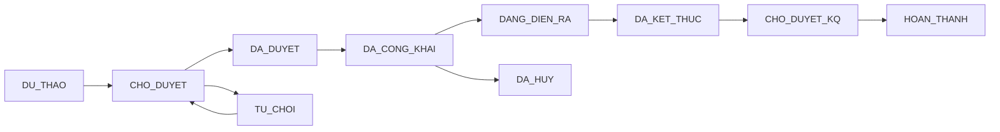
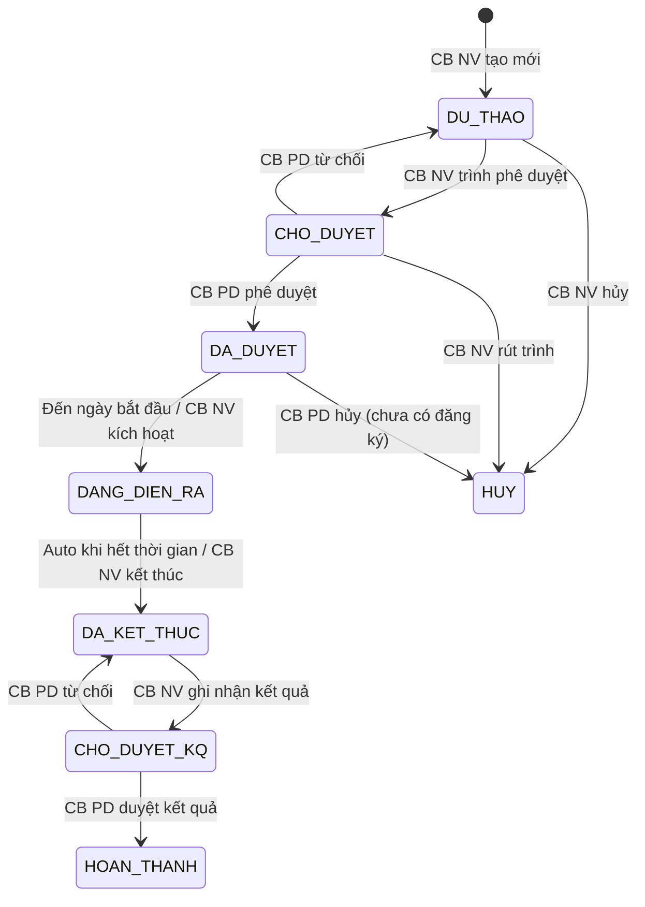

# SRS — Section 3.2.6: Quản lý Đào tạo, Tập huấn

**Dự án:** Phần mềm hỗ trợ pháp lý doanh nghiệp
**Phiên bản SRS:** 3.0
**Nhóm:** III — Quản lý Đào tạo, Tập huấn
**UC range:** UC 20 – UC 38 + UC mới
**Số FR:** 22
**File chính:** `srs-v3.md` Section 3.2

---

## Mục lục file này

- [1. Tổng quan nhóm](#1-tổng-quan-nhóm)
- [2. Yêu cầu chức năng chi tiết](#2-yêu-cầu-chức-năng-chi-tiết)
- [3. Màn hình chức năng](#3-màn-hình-chức-năng)
- [4. Entity liên quan](#4-entity-liên-quan)
- [5. State Machine liên quan](#5-state-machine-liên-quan)
- [6. Business Rules liên quan](#6-business-rules-liên-quan)

---

## 1. Tổng quan nhóm

**Mục đích:** Quản lý THÔNG TIN chương trình đào tạo, tập huấn bồi dưỡng kiến thức pháp luật cho DNNVV — KHÔNG phải LMS đầy đủ (Out-of-Scope OS-04).

**Entity chính:** CHUONG_TRINH_DAO_TAO (CTDT), KHOA_HOC, BAI_GIANG, NGAN_HANG_CAU_HOI, GIANG_VIEN, HOC_VIEN, DANG_KY_DAO_TAO, KET_QUA_HOC_TAP, KE_HOACH_DAO_TAO, DE_XUAT_DAO_TAO, DE_KIEM_TRA, CHUNG_NHAN

**Tác nhân chính:** CB NV, CB PD, DN (chuyên trang), NHT (chuyên trang)

**Cấu trúc 2 cấp:**
```
Chương trình đào tạo (CTDT)
└── Khóa học
    ├── Bài giảng (N-N, quản lý riêng)
    ├── Danh sách học viên
    ├── Điểm danh
    └── Kết quả kiểm tra
```

**2 hình thức:** Trực tuyến và Trực tiếp — tương đương nhau về quy trình.

**Luồng phê duyệt:** CB NV cùng cấp tạo → CB PD cùng cấp duyệt (BR-FLOW-03)

**State Machine — SM-KHOAHOC:**



**Auto-transition:**
- AT-01: CB NV nhấn "Gửi phê duyệt" → DU_THAO → CHO_DUYET
- AT-02: CB NV nhấn "Trình duyệt KQ" → DA_KET_THUC → CHO_DUYET_KQ

---

## 2. Yêu cầu chức năng chi tiết

---

### FR-III-01: Quản lý Chương trình đào tạo (UC20)

**UC Reference:** UC 20 | **Priority:** Essential | **Stability:** High
**Màn hình:** SCR-III-01

**Mô tả:** CRUD chương trình đào tạo (entity cha). Bao gồm quản lý khóa học (entity con) với đầy đủ trạng thái SM-KHOAHOC.

**Tác nhân:** CB NV (TW/BN/ĐP)

**Preconditions:**

| # | Điều kiện |
|---|----------|
| PRE-01 | User đã đăng nhập (BR-AUTH-01) |
| PRE-02 | User có quyền "Quản lý đào tạo" (UC115) |
| PRE-03 | Phân quyền theo đơn vị theo đơn vị |

**Inputs — CTDT:**

| # | Tên field | Kiểu logic | Bắt buộc | Ràng buộc | Mặc định |
|---|----------|-----------|----------|-----------|----------|
| 1 | ma_ctdt | text | Y (auto) | CTDT-{DON_VI}-{YYYY}-{SEQ} | — |
| 2 | ten_chuong_trinh | text | Y | Không rỗng | — |
| 3 | mo_ta | text (long) | N | — | — |
| 4 | linh_vuc_id | identifier | Y | FK → DANH_MUC | — |
| 5 | ngan_sach_du_kien | money | N | ≥ 0 | — |
| 6 | so_luong_khoa | number | N | ≥ 0 | — |
| 7 | muc_tieu | text (long) | N | — | — |
| 8 | file_dinh_kem | structured | N | Upload nhiều file | — |

**Inputs — Khóa học (entity con):**

| # | Tên field | Kiểu logic | Bắt buộc | Ràng buộc | Mặc định |
|---|----------|-----------|----------|-----------|----------|
| 1 | ma_khoa_hoc | text | Y (auto) | KH-{YYYYMMDD}-{SEQ} | — |
| 2 | ten_khoa_hoc | text | Y | — | — |
| 3 | ctdt_id | identifier | Y | FK → CTDT | — |
| 4 | hinh_thuc | text | Y | TRUC_TUYEN / TRUC_TIEP | TRUC_TUYEN |
| 5 | ngay_bat_dau | date | Y | — | — |
| 6 | ngay_ket_thuc | date | Y | > ngay_bat_dau | — |
| 7 | doi_tuong | text | N | — | — |
| 8 | dia_diem | text | N | — | — |
| 9 | so_luong_toi_da | number | N | ≥ 1 | — |
| 10 | bai_giang_ids | identifier[] | N | FK → BAI_GIANG (N-N) | — |

**Processing — Xem danh sách:**

| Bước | Mô tả xử lý | BR áp dụng |
|------|-------------|-----------|
| 1 | Kiểm tra quyền và phân quyền theo đơn vị | BR-AUTH-01, BR-AUTH-08 |
| 2 | Lấy danh sách CHUONG_TRINH_DAO_TAO chưa xóa, trong phạm vi đơn vị | BR-DATA-02 |
| 3 | Phân trang (mặc định 20/trang) | BR-DATA-07 |

**Processing — Thêm mới CTDT:**

| Bước | Mô tả xử lý | BR áp dụng |
|------|-------------|-----------|
| 1 | Kiểm tra quyền | BR-AUTH-01 |
| 2 | Tự động sinh mã CTDT | BR-DATA-04 |
| 3 | Xác nhận tên chương trình không rỗng | — |
| 4 | Đặt trạng thái = NHAP | — |
| 5 | Tạo bản ghi CHUONG_TRINH_DAO_TAO | BR-DATA-03 |
| 6 | Ghi nhật ký thao tác | BR-DATA-05 |

**Processing — Chỉnh sửa:**

| Bước | Mô tả xử lý | BR áp dụng |
|------|-------------|-----------|
| 1 | Kiểm tra trạng thái = NHAP (chỉ sửa khi chưa duyệt) | — |
| 2 | Xác nhận dữ liệu đầu vào | — |
| 3 | Cập nhật CHUONG_TRINH_DAO_TAO | — |
| 4 | Ghi nhật ký thao tác (giá trị cũ → mới) | BR-DATA-05 |

**Processing — Xóa (xóa mềm):**

| Bước | Mô tả xử lý | BR áp dụng |
|------|-------------|-----------|
| 1 | Kiểm tra CTDT không có khóa học liên kết | — |
| 2 | Nếu có khóa học: từ chối xóa + cảnh báo | — |
| 3 | Đánh dấu xóa mềm | BR-DATA-01 |
| 4 | Ghi nhật ký thao tác | BR-DATA-05 |

**Processing — Xuất Excel:**

| Bước | Mô tả xử lý | BR áp dụng |
|------|-------------|-----------|
| 1 | Lấy danh sách theo filter, tối đa 10.000 dòng | BR-DATA-06 |
| 2 | Tạo file Excel + trả về download | — |

**Outputs — Danh sách:**

| # | Tên field | Kiểu logic | Mô tả |
|---|----------|-----------|-------|
| 1 | id | identifier | ID CTĐT |
| 2 | ma_ctdt | text | Mã CTĐT |
| 3 | ten_chuong_trinh | text | Tên |
| 4 | hinh_thuc | text | Hình thức |
| 5 | linh_vuc | text | Lĩnh vực |
| 6 | ngay_bat_dau | date | Ngày bắt đầu |
| 7 | ngay_ket_thuc | date | Ngày kết thúc |
| 8 | so_khoa_hoc | number | Số khóa học con |
| 9 | trang_thai | text | Trạng thái |
| 10 | total_count | number | Tổng bản ghi |

**Postconditions:**
- Bản ghi CHUONG_TRINH_DAO_TAO được tạo/cập nhật/xóa mềm
- AUDIT_LOG ghi nhận thao tác

**Error Handling:**

| # | Điều kiện lỗi | Mã lỗi | Phản hồi hệ thống | Severity |
|---|--------------|--------|-------------------|----------|
| E1 | Tên chương trình trống | ERR-CTDT-01 | "Tên chương trình là bắt buộc" | ERROR |
| E2 | Ngày kết thúc ≤ ngày bắt đầu | ERR-CTDT-02 | "Ngày kết thúc phải sau ngày bắt đầu" | ERROR |
| E3 | Xóa CTDT có khóa học | ERR-CTDT-03 | "Không thể xóa chương trình đã có khóa học" | ERROR |
| E4 | Sửa CTDT đã duyệt | ERR-CTDT-04 | "Không thể sửa chương trình đã được duyệt" | ERROR |

**Acceptance Criteria:**
- **Given** CB NV truy cập CTDT **When** hiển thị **Then** danh sách CTDT thuộc đơn vị, phân trang
- **Given** CB NV thêm mới **When** nhập đủ trường **Then** lưu CTDT mới
- **Given** CB NV TW **When** xem danh sách **Then** chỉ thấy CTDT thuộc TW
- **Given** CB NV xóa CTDT có khóa học **When** xác nhận **Then** từ chối + cảnh báo

**Cross-ref:** BR-DATA-01 đến BR-DATA-08, Entity CHUONG_TRINH_DAO_TAO, KHOA_HOC

---

### FR-III-02: Tìm kiếm CTDT (UC21)

**UC Reference:** UC 21 | **Priority:** Essential | **Stability:** High
**Màn hình:** SCR-III-01

**Mô tả:** Tìm kiếm CTDT theo từ khóa, lĩnh vực, hình thức, thời gian, trạng thái.

**Tác nhân:** CB NV / CB PD / DN / NHT

**Preconditions:**

| # | Điều kiện |
|---|----------|
| PRE-01 | User đã đăng nhập |

**Inputs — Bộ lọc:**

| # | Tên field | Kiểu logic | Bắt buộc | Ràng buộc |
|---|----------|-----------|----------|-----------|
| 1 | tu_khoa | text | N | Tìm theo tên/mã CTDT |
| 2 | linh_vuc_id | identifier | N | Lĩnh vực PL |
| 3 | hinh_thuc | text | N | TRUC_TUYEN / TRUC_TIEP |
| 4 | tu_ngay | date | N | Từ ngày |
| 5 | den_ngay | date | N | Đến ngày |
| 6 | trang_thai | text | N | Trạng thái |

**Processing:**

| Bước | Mô tả xử lý | BR áp dụng |
|------|-------------|-----------|
| 1 | Kiểm tra quyền và phân quyền | BR-AUTH-01, BR-AUTH-08 |
| 2 | Kết hợp tất cả điều kiện lọc (AND) | — |
| 3 | Phân trang (20/trang) | BR-DATA-07 |

**Outputs — Danh sách phân trang:**

| # | Tên field | Kiểu logic | Mô tả |
|---|----------|-----------|-------|
| 1 | id | identifier | ID CTĐT |
| 2 | ma_ctdt | text | Mã CTĐT |
| 3 | ten_chuong_trinh | text | Tên |
| 4 | hinh_thuc | text | Hình thức |
| 5 | linh_vuc | text | Lĩnh vực |
| 6 | ngay_bat_dau | date | Ngày bắt đầu |
| 7 | ngay_ket_thuc | date | Ngày kết thúc |
| 8 | so_khoa_hoc | number | Số khóa học con |
| 9 | trang_thai | text | Trạng thái |
| 10 | total_count | number | Tổng bản ghi |

**Postconditions:** Không thay đổi dữ liệu (read-only).

**Error Handling:**

| # | Điều kiện lỗi | Mã lỗi | Phản hồi hệ thống | Severity |
|---|--------------|--------|-------------------|----------|
| E1 | Không có kết quả | INF-CTDT-01 | "Không tìm thấy chương trình phù hợp" | INFO |

**Acceptance Criteria:**
- **Given** user nhập từ khóa **When** tìm kiếm **Then** hiển thị CTDT phù hợp, phân trang
- **Given** user lọc theo thời gian **When** chọn khoảng ngày **Then** hiển thị CTDT trong khoảng
- **Given** user lọc theo lĩnh vực **When** chọn lĩnh vực **Then** hiển thị CTDT thuộc lĩnh vực
- **Given** user kết hợp nhiều điều kiện **When** tìm kiếm **Then** áp dụng AND

**Cross-ref:** BR-AUTH-01, BR-DATA-07, Entity CHUONG_TRINH_DAO_TAO

---

### FR-III-03: Quản lý đăng ký đào tạo (UC22)

**UC Reference:** UC 22 | **Priority:** Essential | **Stability:** High
**Màn hình:** SCR-III-01

**Mô tả:** CB NV xem và duyệt/từ chối đăng ký tham gia khóa học.

**Tác nhân:** CB NV / CB PD

**Preconditions:**

| # | Điều kiện |
|---|----------|
| PRE-01 | User đã đăng nhập, có quyền "Quản lý đăng ký ĐT" |
| PRE-02 | Khóa học tồn tại, đang mở đăng ký |

**Inputs — Xem/Duyệt đăng ký:**

| # | Tên field | Kiểu logic | Bắt buộc | Ràng buộc |
|---|----------|-----------|----------|-----------|
| 1 | khoa_hoc_id | identifier | Y | Khóa học lọc |
| 2 | quyet_dinh | text | Y | DUYET / TU_CHOI |
| 3 | ly_do_tu_choi | text | Cond | Bắt buộc nếu TU_CHOI |

**Processing:**

| Bước | Mô tả xử lý | BR áp dụng |
|------|-------------|-----------|
| 1 | Kiểm tra quyền và phân quyền | BR-AUTH-01, BR-AUTH-08 |
| 2 | Lấy danh sách DANG_KY_DAO_TAO theo khóa học | — |
| 3 | Hiển thị: tên, đơn vị, khóa học, ngày đăng ký, trạng thái | — |
| 4 | Duyệt: cập nhật trạng thái = DA_DUYET, ghi nhật ký | — |
| 5 | Từ chối: cập nhật trạng thái = TU_CHOI + lý do, ghi nhật ký | — |
| 6 | Gửi thông báo người đăng ký | — |

**Outputs:**

| # | Tên field | Kiểu logic | Mô tả |
|---|----------|-----------|-------|
| 1 | id | identifier | ID đăng ký |
| 2 | ten_hoc_vien | text | Tên người đăng ký |
| 3 | don_vi | text | Đơn vị |
| 4 | khoa_hoc | text | Tên khóa học |
| 5 | ngay_dang_ky | datetime | Ngày đăng ký |
| 6 | trang_thai | text | CHO_DUYET / DA_DUYET / TU_CHOI |

**Postconditions:**
- Đăng ký được duyệt/từ chối
- Người đăng ký nhận thông báo
- Nhật ký thao tác ghi nhận

**Error Handling:**

| # | Điều kiện lỗi | Mã lỗi | Phản hồi hệ thống | Severity |
|---|--------------|--------|-------------------|----------|
| E1 | Khóa học đã đóng đăng ký | ERR-DKDT-01 | "Khóa học đã đóng đăng ký" | ERROR |
| E2 | Từ chối không có lý do | ERR-DKDT-02 | "Lý do từ chối là bắt buộc" | ERROR |

**Acceptance Criteria:**
- **Given** CB NV truy cập "Đăng ký Đào tạo" **When** hiển thị **Then** danh sách người đăng ký thuộc đơn vị, phân trang
- **Given** CB NV phê duyệt đăng ký **When** xác nhận **Then** trạng thái → DA_DUYET, ghi nhật ký
- **Given** CB NV từ chối **When** nhập lý do **Then** trạng thái → TU_CHOI

**Cross-ref:** BR-FLOW-03, Entity DANG_KY_DAO_TAO, KHOA_HOC

---

### FR-III-04: Đăng ký tham gia học tập (UC23)

**UC Reference:** UC 23 | **Priority:** Essential | **Stability:** High
**Màn hình:** (chuyên trang)

**Mô tả:** DN/NHT đăng ký tham gia khóa học qua chuyên trang. 3 cách: chuyên trang, nhập tay, import Excel.

**Tác nhân:** DN / NHT

**Preconditions:**

| # | Điều kiện |
|---|----------|
| PRE-01 | DN/NHT đã đăng nhập trên chuyên trang |
| PRE-02 | Khóa học đang mở đăng ký (trạng thái DA_CONG_KHAI) |

**Inputs:**

| # | Tên field | Kiểu logic | Bắt buộc | Ràng buộc |
|---|----------|-----------|----------|-----------|
| 1 | khoa_hoc_id | identifier | Y | Khóa học đăng ký |
| 2 | ho_ten | text | Y | Họ tên |
| 3 | don_vi | text | N | Đơn vị công tác |
| 4 | email | text | Y | Email |
| 5 | so_dien_thoai | text | Y | SĐT |
| 6 | ghi_chu | text | N | Ghi chú |
| 7 | nguon_dang_ky | text | Y | CHUYEN_TRANG / NHAP_TAY / IMPORT_EXCEL |

**Processing:**

| Bước | Mô tả xử lý | BR áp dụng |
|------|-------------|-----------|
| 1 | Kiểm tra khóa học đang mở (DA_CONG_KHAI) | SM-KHOAHOC |
| 2 | Kiểm tra chưa đăng ký trùng | — |
| 3 | Xác nhận dữ liệu đầu vào | — |
| 4 | Tạo bản ghi DANG_KY_DAO_TAO, trạng thái = CHO_DUYET | — |
| 5 | Gửi thông báo CB NV đơn vị quản lý khóa học | — |
| 6 | Nếu import Excel: validate template, import từng dòng, báo cáo KQ | — |

**Outputs:**

| # | Tên field | Kiểu logic | Mô tả |
|---|----------|-----------|-------|
| 1 | id | identifier | ID đăng ký |
| 2 | ho_ten | text | Họ tên |
| 3 | khoa_hoc | text | Tên khóa học |
| 4 | ngay_dang_ky | datetime | Ngày đăng ký |
| 5 | trang_thai | text | CHO_DUYET |
| 6 | ket_qua_import | structured | Số thành công / lỗi (nếu import Excel) |

**Postconditions:**
- Đăng ký được tạo, chờ CB NV duyệt
- CB NV nhận thông báo

**Error Handling:**

| # | Điều kiện lỗi | Mã lỗi | Phản hồi hệ thống | Severity |
|---|--------------|--------|-------------------|----------|
| E1 | Khóa học không mở | ERR-DK-DT-01 | "Khóa học chưa/đã đóng đăng ký" | ERROR |
| E2 | Đã đăng ký | ERR-DK-DT-02 | "Bạn đã đăng ký khóa học này" | ERROR |
| E3 | Lớp đầy | ERR-DK-DT-03 | "Lớp đã đủ số lượng" | ERROR |

**Acceptance Criteria:**
- **Given** DN/NHT xem khóa học đang mở **When** chọn đăng ký **Then** hiển thị form đăng ký
- **Given** DN/NHT nhập đủ thông tin **When** gửi **Then** đăng ký thành công, chờ duyệt
- **Given** DN/NHT đã đăng ký **When** đăng ký lại **Then** hệ thống từ chối

**Edge Cases:**

| EC | Điều kiện | Xử lý |
|----|-----------|-------|
| EC-01 | Đăng ký vượt sức chứa lớp học | Kiểm tra số đăng ký (trừ từ chối) < số lượng tối đa. Nếu đầy → ERR-DK-DT-03 |
| EC-02 | Hủy khóa học không thông báo học viên | Khi hủy khóa học, bắt buộc gửi thông báo cho tất cả học viên đã duyệt |
| EC-03 | Import kết quả đào tạo đồng thời bởi 2 CB NV | Sử dụng khóa hàng trên KHOA_HOC. CB thứ 2 nhận ERR-DK-DT-04 "Khóa học đang được cập nhật bởi người khác" |
| EC-04 | CTDT bị từ chối nhưng không cho sửa lại | Khi từ chối → cho phép CB NV chỉnh sửa và gửi lại phê duyệt |

**Cross-ref:** SM-KHOAHOC, Entity DANG_KY_DAO_TAO, KHOA_HOC

---

### FR-III-05: Quản lý kiểm tra, đánh giá kết quả (UC24)

**UC Reference:** UC 24 | **Priority:** Essential | **Stability:** High
**Màn hình:** SCR-III-02 (chi tiet Khoa hoc — Tab 3 "Lich hoc & Diem danh" + Tab 4 "Ket qua kiem tra")

**Mô tả:** Nhập kết quả đào tạo (điểm danh + kiểm tra). 2 tab: Điểm danh và Kiểm tra. Hỗ trợ nhập thủ công + import Excel.

**Tác nhân:** CB NV / CB PD

**Preconditions:**

| # | Điều kiện |
|---|----------|
| PRE-01 | User đã đăng nhập, có quyền "Quản lý kết quả ĐT" |
| PRE-02 | Khóa học tồn tại |

**Inputs — Nhập kết quả (2 tabs: Điểm danh + Kiểm tra):**

| # | Tên field | Kiểu logic | Bắt buộc | Ràng buộc |
|---|----------|-----------|----------|-----------|
| 1 | khoa_hoc_id | identifier | Y | Khóa học |
| 2 | hoc_vien_id | identifier | Y | Học viên |
| 3 | diem_danh | boolean | Y | Có mặt / Vắng |
| 4 | ngay_diem_danh | date | Y | Ngày điểm danh |
| 5 | diem_kiem_tra | number | N | 0-10 |
| 6 | ghi_chu | text | N | Ghi chú |

**Processing — Nhập thủ công:**

| Bước | Mô tả xử lý | BR áp dụng |
|------|-------------|-----------|
| 1 | Kiểm tra quyền | BR-AUTH-01 |
| 2 | Xác nhận điểm kiểm tra 0-10 | — |
| 3 | Tạo/cập nhật KET_QUA_HOC_TAP | — |
| 4 | Ghi nhật ký thao tác | BR-DATA-05 |

**Processing — Import Excel:**

| Bước | Mô tả xử lý | BR áp dụng |
|------|-------------|-----------|
| 1 | Upload file Excel (.xlsx) | — |
| 2 | Xác nhận format: cột bắt buộc | — |
| 3 | Xác nhận dữ liệu từng dòng | — |
| 4 | Hiển thị bản review (thành công / lỗi) | — |
| 5 | Nếu xác nhận: merge kết quả | — |
| 6 | Trả về báo cáo import | — |

**Processing — Xuất Excel:**

| Bước | Mô tả xử lý | BR áp dụng |
|------|-------------|-----------|
| 1 | Lấy KET_QUA_HOC_TAP theo khóa học | — |
| 2 | Tạo file Excel (.xlsx) + download | — |

**Outputs:**

| # | Tên field | Kiểu logic | Mô tả |
|---|----------|-----------|-------|
| 1 | hoc_vien_id | identifier | ID học viên |
| 2 | ho_ten | text | Họ tên |
| 3 | so_buoi_co_mat | number | Số buổi có mặt |
| 4 | tong_buoi | number | Tổng số buổi |
| 5 | ty_le_chuyen_can | number | % chuyên cần |
| 6 | diem_kiem_tra | number | Điểm kiểm tra |
| 7 | ket_qua | text | DAT / KHONG_DAT |

**Postconditions:**
- Kết quả học tập được ghi nhận
- Nhật ký thao tác ghi nhận

**Error Handling:**

| # | Điều kiện lỗi | Mã lỗi | Phản hồi hệ thống | Severity |
|---|--------------|--------|-------------------|----------|
| E1 | Điểm ngoài 0-10 | ERR-KQ-01 | "Điểm kiểm tra phải từ 0 đến 10" | ERROR |
| E2 | File format lỗi | ERR-KQ-02 | "File không đúng định dạng mẫu" | ERROR |
| E3 | Mã HV không tồn tại | ERR-KQ-03 | "Mã học viên dòng {N} không tồn tại" | ERROR |

**Acceptance Criteria:**
- **Given** CB NV truy cập "Kết quả" **When** chọn khóa học **Then** hiển thị danh sách học viên + kết quả
- **Given** CB NV nhập kết quả thủ công **When** lưu **Then** validate + ghi nhận
- **Given** CB NV import Excel **When** upload file **Then** validate + import + báo cáo lỗi
- **Given** CB NV xuất kết quả **When** nhấn "Xuất Excel" **Then** tải file Excel

**Cross-ref:** Entity KET_QUA_HOC_TAP, KHOA_HOC, HOC_VIEN

---

### FR-III-06: Tìm kiếm kết quả (UC25)

**UC Reference:** UC 25 | **Priority:** Essential | **Stability:** High
**Màn hình:** SCR-III-02 (chi tiet Khoa hoc — Tab 3 "Lich hoc & Diem danh" + Tab 4 "Ket qua kiem tra")

**Mô tả:** Tìm kiếm kết quả đào tạo theo tên học viên, khóa học, kết quả.

**Tác nhân:** CB NV / CB PD

**Preconditions:**

| # | Điều kiện |
|---|----------|
| PRE-01 | User đã đăng nhập |

**Inputs — Bộ lọc:**

| # | Tên field | Kiểu logic | Bắt buộc | Ràng buộc |
|---|----------|-----------|----------|-----------|
| 1 | tu_khoa | text | N | Tìm theo tên học viên |
| 2 | khoa_hoc_id | identifier | N | Khóa học |
| 3 | ket_qua | text | N | DAT / KHONG_DAT |

**Processing:**

| Bước | Mô tả xử lý | BR áp dụng |
|------|-------------|-----------|
| 1 | Kiểm tra quyền | BR-AUTH-01, BR-AUTH-08 |
| 2 | Lấy KET_QUA_HOC_TAP kết hợp HOC_VIEN, KHOA_HOC theo điều kiện | — |
| 3 | Phân trang | BR-DATA-07 |

**Outputs — Danh sách phân trang:**

| # | Tên field | Kiểu logic | Mô tả |
|---|----------|-----------|-------|
| 1 | hoc_vien_id | identifier | ID học viên |
| 2 | ho_ten | text | Họ tên |
| 3 | ten_khoa_hoc | text | Tên khóa học |
| 4 | so_buoi_co_mat | number | Số buổi có mặt |
| 5 | tong_buoi | number | Tổng số buổi |
| 6 | ty_le_chuyen_can | number | % chuyên cần |
| 7 | diem_kiem_tra | number | Điểm kiểm tra |
| 8 | ket_qua | text | DAT / KHONG_DAT |
| 9 | total_count | number | Tổng bản ghi |

**Postconditions:** Không thay đổi dữ liệu (read-only).

**Acceptance Criteria:**
- **Given** CB NV nhập từ khóa **When** tìm kiếm **Then** hiển thị kết quả phù hợp, phân trang
- **Given** CB NV lọc theo học viên **When** chọn **Then** hiển thị tất cả kết quả của học viên
- **Given** CB NV lọc theo khóa học **When** chọn **Then** hiển thị kết quả khóa đó

**Cross-ref:** Entity KET_QUA_HOC_TAP, HOC_VIEN, KHOA_HOC

---

### FR-III-07: Quản lý kho tài liệu, bài giảng (UC26)

**UC Reference:** UC 26 | **Priority:** Essential | **Stability:** High
**Màn hình:** SCR-III-03

**Mô tả:** Quản lý tài liệu/bài giảng dùng chung. 3 loại: Slide (PPTX), PDF, Video (YouTube embed). Preview inline. Switch công khai lên chuyên trang.

**Tác nhân:** CB NV / CB PD

**Preconditions:**

| # | Điều kiện |
|---|----------|
| PRE-01 | User đã đăng nhập, có quyền "Quản lý tài liệu ĐT" |

**Inputs:**

| # | Tên field | Kiểu logic | Bắt buộc | Ràng buộc |
|---|----------|-----------|----------|-----------|
| 1 | ten_bai_giang | text | Y | — |
| 2 | mo_ta | text (long) | Y | — |
| 3 | loai_tai_lieu | text | Y | SLIDE / PDF / VIDEO |
| 4 | file_bai_giang | structured | Cond | Max 20MB, .pptx/.pdf (bắt buộc nếu SLIDE/PDF) |
| 5 | url_youtube | text | Cond | URL YouTube (bắt buộc nếu VIDEO) |
| 6 | linh_vuc_ids | identifier[] | N | Chọn nhiều lĩnh vực |
| 7 | anh_dai_dien | structured | N | Ảnh đại diện |
| 8 | cong_khai | boolean | N | Công khai lên chuyên trang | N (mặc định off) |

**Processing — Thêm mới:**

| Bước | Mô tả xử lý | BR áp dụng |
|------|-------------|-----------|
| 1 | Kiểm tra quyền | BR-AUTH-01 |
| 2 | Xác nhận tên bài giảng không rỗng | — |
| 3 | Nếu Slide/PDF: kiểm tra file ≤ 20MB, đúng định dạng | — |
| 4 | Nếu VIDEO: kiểm tra URL YouTube hợp lệ | — |
| 5 | Tạo bản ghi BAI_GIANG | BR-DATA-03 |
| 6 | Upload file → storage | — |
| 7 | Ghi nhật ký thao tác | BR-DATA-05 |

**Outputs:**

| # | Tên field | Kiểu logic | Mô tả |
|---|----------|-----------|-------|
| 1 | id | identifier | ID bài giảng |
| 2 | ten_bai_giang | text | Tên |
| 3 | loai_tai_lieu | text | Slide / PDF / VIDEO |
| 4 | khoa_hoc | text | Khóa học liên kết |
| 5 | file_url | text | URL file/YouTube |
| 6 | dung_luong | number | Dung lượng file (bytes) |
| 7 | ngay_tao | datetime | Ngày tạo |

**Postconditions:**
- Tài liệu/bài giảng được lưu trữ
- File Slide/PDF được upload vào storage

**Error Handling:**

| # | Điều kiện lỗi | Mã lỗi | Phản hồi hệ thống | Severity |
|---|--------------|--------|-------------------|----------|
| E1 | File vượt 20MB | ERR-BG-01 | "File tối đa 20MB" | ERROR |
| E2 | File sai định dạng | ERR-BG-02 | "Chỉ chấp nhận file Slide hoặc PDF" | ERROR |
| E3 | URL YouTube không hợp lệ | ERR-BG-03 | "URL YouTube không hợp lệ" | ERROR |

**Acceptance Criteria:**
- **Given** CB NV truy cập "Kho tài liệu" **When** hiển thị **Then** danh sách tài liệu, phân trang
- **Given** CB NV thêm bài giảng Slide/PDF **When** upload file ≤ 20MB **Then** lưu thành công + preview được
- **Given** CB NV thêm video **When** nhập URL YouTube **Then** embed + lưu thành công
- **Given** CB NV xem file **When** chọn preview **Then** hiển thị nội dung trên trình duyệt

**Cross-ref:** Entity BAI_GIANG, KHOA_HOC

---

### FR-III-08: Tìm kiếm tài liệu (UC27)

**UC Reference:** UC 27 | **Priority:** Essential | **Stability:** High
**Màn hình:** SCR-III-03

**Mô tả:** Tìm kiếm tài liệu/bài giảng theo từ khóa, loại, khoảng ngày.

**Tác nhân:** CB NV / CB PD

**Preconditions:**

| # | Điều kiện |
|---|----------|
| PRE-01 | User đã đăng nhập |

**Inputs — Bộ lọc:**

| # | Tên field | Kiểu logic | Bắt buộc | Ràng buộc |
|---|----------|-----------|----------|-----------|
| 1 | tu_khoa | text | N | Tìm theo tên |
| 2 | loai_tai_lieu | text | N | PDF / VIDEO |
| 3 | tu_ngay | date | N | Từ ngày tạo |
| 4 | den_ngay | date | N | Đến ngày tạo |

**Processing:**

| Bước | Mô tả xử lý | BR áp dụng |
|------|-------------|-----------|
| 1 | Kiểm tra quyền | BR-AUTH-01, BR-AUTH-08 |
| 2 | Lấy BAI_GIANG theo điều kiện lọc | — |
| 3 | Phân trang | BR-DATA-07 |

**Outputs — Danh sách phân trang:**

| # | Tên field | Kiểu logic | Mô tả |
|---|----------|-----------|-------|
| 1 | id | identifier | ID tài liệu |
| 2 | ten_bai_giang | text | Tên bài giảng |
| 3 | loai_tai_lieu | text | SLIDE / PDF / VIDEO |
| 4 | ten_khoa_hoc | text | Khóa học liên kết |
| 5 | kich_thuoc | number | Kích thước file (bytes) |
| 6 | ngay_tao | datetime | Ngày tạo |
| 7 | total_count | number | Tổng bản ghi |

**Postconditions:** Không thay đổi dữ liệu (read-only).

**Acceptance Criteria:**
- **Given** CB NV nhập từ khóa **When** tìm kiếm **Then** hiển thị tài liệu phù hợp, phân trang
- **Given** CB NV lọc theo loại (PDF/Video) **When** chọn **Then** hiển thị tương ứng
- **Given** CB NV kết hợp nhiều điều kiện **When** tìm kiếm **Then** áp dụng AND

**Cross-ref:** Entity BAI_GIANG

---

### FR-III-09: Quản lý ngân hàng câu hỏi (UC28)

**UC Reference:** UC 28 | **Priority:** Essential | **Stability:** High
**Màn hình:** SCR-III-04

**Mô tả:** CRUD câu hỏi trắc nghiệm/tự luận. 3 loại: TRAC_NGHIEM_MOT, TRAC_NGHIEM_NHIEU, TU_LUAN.

**Tác nhân:** CB NV / CB PD

**Preconditions:**

| # | Điều kiện |
|---|----------|
| PRE-01 | User đã đăng nhập, có quyền "Quản lý ngân hàng câu hỏi" |

**Inputs:**

| # | Tên field | Kiểu logic | Bắt buộc | Ràng buộc |
|---|----------|-----------|----------|-----------|
| 1 | noi_dung | text (long) | Y | Rich text |
| 2 | linh_vuc_id | identifier | Y | — |
| 3 | muc_do | text | Y | DE / TRUNG_BINH / KHO |
| 4 | loai_cau_hoi | text | Y | TRAC_NGHIEM_MOT / TRAC_NGHIEM_NHIEU / TU_LUAN |
| 5 | cac_lua_chon | structured | Cond | ≥ 2 lựa chọn (nếu trắc nghiệm) |
| 6 | dap_an_dung | text | Cond | 1 giá trị (SINGLE) hoặc array ≥ 2 (MULTI) |
| 7 | trang_thai | text | Y | NHAP / CONG_KHAI / AN |

**Processing:**

| Bước | Mô tả xử lý | BR áp dụng |
|------|-------------|-----------|
| 1 | Kiểm tra quyền | BR-AUTH-01 |
| 2 | Xác nhận dữ liệu | — |
| 3 | Nếu trắc nghiệm: kiểm tra ≥ 2 lựa chọn, đáp án đúng hợp lệ | — |
| 4 | Tạo/cập nhật NGAN_HANG_CAU_HOI | BR-DATA-03 |
| 5 | Ghi nhật ký thao tác | BR-DATA-05 |

**Processing — Xóa:**

| Bước | Mô tả xử lý | BR áp dụng |
|------|-------------|-----------|
| 1 | Kiểm tra câu hỏi có đang dùng trong đề kiểm tra | — |
| 2 | Nếu đang dùng: cảnh báo liên kết, xác nhận | — |
| 3 | Xóa mềm | BR-DATA-01 |

**Outputs:**

| # | Tên field | Kiểu logic | Mô tả |
|---|----------|-----------|-------|
| 1 | id | identifier | ID câu hỏi |
| 2 | noi_dung | text | Nội dung tóm tắt (200 ký tự) |
| 3 | linh_vuc | text | Lĩnh vực |
| 4 | muc_do | text | Mức độ khó |
| 5 | loai_cau_hoi | text | Loại |
| 6 | so_de_su_dung | number | Số đề đang sử dụng |

**Postconditions:**
- Câu hỏi được tạo/cập nhật/xóa mềm
- Nhật ký thao tác ghi nhận

**Error Handling:**

| # | Điều kiện lỗi | Mã lỗi | Phản hồi hệ thống | Severity |
|---|--------------|--------|-------------------|----------|
| E1 | Nội dung trống | ERR-NHCH-01 | "Nội dung câu hỏi là bắt buộc" | ERROR |
| E2 | < 2 lựa chọn | ERR-NHCH-02 | "Câu trắc nghiệm phải có ≥ 2 lựa chọn" | ERROR |
| E3 | Xóa câu hỏi đang dùng | WRN-NHCH-01 | "Câu hỏi đang dùng trong {N} đề kiểm tra" | WARNING |

**Acceptance Criteria:**
- **Given** CB NV truy cập "Ngân hàng câu hỏi" **When** hiển thị **Then** danh sách câu hỏi, phân trang
- **Given** CB NV thêm mới **When** nhập nội dung + phân loại **Then** validate + lưu
- **Given** CB NV xóa câu hỏi đang dùng **When** xác nhận **Then** cảnh báo liên kết

**Cross-ref:** Entity NGAN_HANG_CAU_HOI, DE_KIEM_TRA

---

### FR-III-10: Tìm kiếm ngân hàng câu hỏi (UC29)

**UC Reference:** UC 29 | **Priority:** Essential | **Stability:** High
**Màn hình:** SCR-III-04

**Mô tả:** Tìm kiếm câu hỏi theo từ khóa, lĩnh vực, mức độ, loại.

**Tác nhân:** CB NV / CB PD

**Preconditions:**

| # | Điều kiện |
|---|----------|
| PRE-01 | User đã đăng nhập |

**Inputs — Bộ lọc:**

| # | Tên field | Kiểu logic | Bắt buộc | Ràng buộc |
|---|----------|-----------|----------|-----------|
| 1 | tu_khoa | text | N | Từ khóa |
| 2 | linh_vuc_id | identifier | N | Lĩnh vực PL |
| 3 | muc_do | text | N | DE / TRUNG_BINH / KHO |
| 4 | loai_cau_hoi | text | N | TRAC_NGHIEM / TU_LUAN |

**Processing:**

| Bước | Mô tả xử lý | BR áp dụng |
|------|-------------|-----------|
| 1 | Kiểm tra quyền | BR-AUTH-01 |
| 2 | Lấy NGAN_HANG_CAU_HOI theo điều kiện lọc | — |
| 3 | Phân trang | BR-DATA-07 |

**Outputs — Danh sách phân trang:**

| # | Tên field | Kiểu logic | Mô tả |
|---|----------|-----------|-------|
| 1 | id | identifier | ID câu hỏi |
| 2 | noi_dung | text | Nội dung tóm tắt |
| 3 | linh_vuc | text | Lĩnh vực |
| 4 | muc_do | text | Mức độ |
| 5 | loai_cau_hoi | text | Loại |
| 6 | total_count | number | Tổng bản ghi |

**Postconditions:** Không thay đổi dữ liệu (read-only).

**Acceptance Criteria:**
- **Given** CB NV nhập từ khóa **When** tìm kiếm **Then** hiển thị câu hỏi phù hợp
- **Given** CB NV lọc theo lĩnh vực **When** chọn **Then** hiển thị câu hỏi thuộc lĩnh vực
- **Given** CB NV lọc theo mức độ khó **When** chọn **Then** hiển thị tương ứng

**Cross-ref:** Entity NGAN_HANG_CAU_HOI

---

### FR-III-11: Quản lý giảng viên, trợ giảng (UC30)

**UC Reference:** UC 30 | **Priority:** Essential | **Stability:** High
**Màn hình:** SCR-III-05

**Mô tả:** CRUD giảng viên/trợ giảng. Chi tiết 2 tab: Thông tin + Lịch sử giảng dạy.

**Tác nhân:** CB NV / CB PD

**Preconditions:** User đã đăng nhập, có quyền "Quản lý giảng viên".

**Inputs:** ho_ten (text, Y), chuyen_nganh (text, Y), trinh_do (text, Y), don_vi (text, N), email (text, N), so_dien_thoai (text, N), linh_vuc_ids (identifier[], Y), mo_ta_nang_luc (text long, N), trang_thai (text, Y: DANG_GIANG_DAY / TAM_DUNG), file_dinh_kem (structured, N).

**Processing:** Kiểm tra quyền → Xác nhận dữ liệu → Tạo/cập nhật GIANG_VIEN → Ghi nhật ký. Xóa: kiểm tra phân công → cảnh báo nếu đang dạy → xóa mềm.

**Outputs:** id, ho_ten, chuyen_nganh, vai_tro, so_khoa_da_day, linh_vuc. Tab Lịch sử: khoa_hoc_id, ten_khoa_hoc, thoi_gian, vai_tro (từ LICH_HOC), trang_thai_khoa.

**Postconditions:** GV được tạo/cập nhật/xóa mềm. Nhật ký ghi nhận.

**Error Handling:** ERR-GV-01 "Họ tên là bắt buộc" (ERROR). WRN-GV-01 "GV đang phân công dạy {N} khóa" (WARNING).

**Acceptance Criteria:**
- **Given** CB NV truy cập "Giảng viên" **When** hiển thị **Then** danh sách GV thuộc đơn vị
- **Given** CB NV xem chi tiết **When** chọn tab "Lịch sử giảng dạy" **Then** hiển thị DS khóa đã dạy, vai trò

---

### FR-III-12: Tìm kiếm giảng viên (UC31)

**UC Reference:** UC 31 | **Priority:** Essential | **Stability:** High
**Màn hình:** SCR-III-05

**Mô tả:** Tìm kiếm GV theo từ khóa, lĩnh vực.

**Tác nhân:** CB NV / CB PD

**Preconditions:** User đã đăng nhập.

**Inputs:** tu_khoa (text, N), linh_vuc_id (identifier, N), vai_tro (text, N: GIANG_VIEN / TRO_GIANG).

**Processing:** Kiểm tra quyền → Lấy GIANG_VIEN theo điều kiện → Phân trang.

**Outputs:** id, ho_ten, chuyen_nganh, linh_vuc, trang_thai, total_count.

**Postconditions:** Read-only.

**Acceptance Criteria:**
- **Given** CB NV nhập từ khóa **When** tìm kiếm **Then** hiển thị GV phù hợp, phân trang
- **Given** CB NV lọc theo lĩnh vực **When** chọn **Then** hiển thị GV thuộc lĩnh vực

---

### FR-III-13: Quản lý đề xuất đào tạo (UC32)

**UC Reference:** UC 32 | **Priority:** Essential | **Stability:** High
**Màn hình:** SCR-III-01 (tab "De xuat")

**Mô tả:** DN/NHT gửi đề xuất đào tạo. CB NV tiếp nhận. Sửa/xóa khi chưa tiếp nhận.

**Tác nhân:** DN / NHT

**Preconditions:** DN/NHT đã đăng nhập.

**Inputs:** linh_vuc_id (identifier, Y), noi_dung (text long, Y), thoi_gian_mong_muon (text, N), dia_diem_mong_muon (text, N), so_luong_du_kien (number, N).

**Processing:** Validate → Tạo DE_XUAT_DAO_TAO (MOI) → Thông báo CB NV → Ghi nhật ký. Sửa: chỉ khi MOI. Xóa: chỉ khi MOI, xóa mềm.

**Outputs:** id, linh_vuc, noi_dung (truncate), trang_thai (MOI/DA_TIEP_NHAN/DA_THUC_HIEN), ngay_tao.

**Postconditions:** Đề xuất được tạo/cập nhật/xóa mềm. CB NV nhận thông báo.

**Error Handling:** ERR-DX-01 "Nội dung đề xuất là bắt buộc". ERR-DX-02 "Không thể sửa đề xuất đã tiếp nhận". ERR-DX-03 "Đề xuất đã tiếp nhận không thể xóa".

**Acceptance Criteria:**
- **Given** DN/NHT thêm mới **When** nhập nội dung + lĩnh vực **Then** gửi cho đơn vị quản lý
- **Given** CB NV xóa đề xuất **When** đề xuất chưa tiếp nhận **Then** xóa mềm

---

### FR-III-14: Lập kế hoạch đào tạo (UC33)

**UC Reference:** UC 33 | **Priority:** Essential | **Stability:** High
**Màn hình:** SCR-III-01 (workflow actions)

**Mô tả:** Lập kế hoạch đào tạo liên kết với CTDT. Hỗ trợ gửi phê duyệt và xuất Excel.

**Tác nhân:** CB NV / CB PD

**Preconditions:** User đã đăng nhập, có quyền "Lập kế hoạch ĐT".

**Inputs:** ten_ke_hoach (text, Y), ctdt_id (identifier, Y), thoi_gian_bat_dau (date, Y), thoi_gian_ket_thuc (date, Y), ngan_sach_du_kien (money, N), nguon_luc (text long, N), ghi_chu (text long, N).

**Processing:** Kiểm tra quyền → Validate → Tạo KE_HOACH_DAO_TAO (NHAP) → Ghi nhật ký. Gửi phê duyệt: NHAP → CHO_DUYET, thông báo CB PD (SM-KHOAHOC).

**Outputs:** id, ten_ke_hoach, ctdt_ten, thoi_gian, ngan_sach, trang_thai.

**Postconditions:** KH được tạo. Khi gửi phê duyệt: CB PD nhận thông báo.

**Error Handling:** ERR-KH-01 "Tên kế hoạch là bắt buộc". ERR-KH-02 "Không thể sửa KH đã duyệt". ERR-KH-03 "KH đã ở trạng thái chờ duyệt".

**Acceptance Criteria:**
- **Given** CB NV thêm mới **When** nhập đủ trường **Then** validate + lưu
- **Given** CB NV nhấn "Gửi phê duyệt" **When** KH đầy đủ **Then** KH → CHO_DUYET + thông báo CB PD

---

### FR-III-15: Phê duyệt kế hoạch (UC34)

**UC Reference:** UC 34 | **Priority:** Essential | **Stability:** High
**Màn hình:** SCR-III-01 (workflow actions)

**Mô tả:** CB PD phê duyệt hoặc từ chối kế hoạch đào tạo.

**Tác nhân:** CB PD (cùng cấp, BR-FLOW-03)

**Preconditions:** CB PD đã đăng nhập, KH ở CHO_DUYET, CB PD cùng cấp.

**Inputs:** ke_hoach_id (identifier, Y), quyet_dinh (text, Y: PHE_DUYET/TU_CHOI), ly_do (text, Cond: bắt buộc nếu TU_CHOI).

**Processing:** Kiểm tra quyền + cùng cấp → Duyệt/Từ chối → Thông báo CB NV → Ghi nhật ký.

**Outputs:** ke_hoach_id, trang_thai (DA_DUYET/TU_CHOI), ly_do.

**Postconditions:** KH được duyệt/từ chối. CB NV nhận thông báo.

**Acceptance Criteria:**
- **Given** CB PD phê duyệt **When** xác nhận **Then** trạng thái → DA_DUYET
- **Given** CB PD từ chối **When** nhập lý do **Then** trạng thái → TU_CHOI

---

### FR-III-16: Công khai kế hoạch (UC35)

**UC Reference:** UC 35 | **Priority:** Essential | **Stability:** High
**Màn hình:** SCR-III-01 (workflow actions)

**Mô tả:** Công khai/hủy công khai kế hoạch đào tạo lên Cổng PLQG qua API trực tiếp.

**Tác nhân:** CB NV

**Preconditions:** User đã đăng nhập. KH ở DA_DUYET hoặc DA_CONG_KHAI.

**Inputs:** ke_hoach_id (identifier, Y), hanh_dong (text, Y: CONG_KHAI/HUY_CONG_KHAI).

**Processing:** Kiểm tra trạng thái → Gọi API Cổng PLQG → Cập nhật trạng thái → Ghi nhật ký.

**Outputs:** ke_hoach_id, trang_thai (DA_CONG_KHAI/DA_DUYET), api_response.

**Postconditions:** KH được công khai/gỡ khỏi Cổng PLQG.

**Acceptance Criteria:**
- **Given** CB NV chọn KH đã duyệt **When** nhấn "Công khai" **Then** trạng thái → DA_CONG_KHAI
- **Given** CB NV chọn KH đã công khai **When** nhấn "Hủy công khai" **Then** gỡ khỏi chuyên trang

---

### FR-III-17: Ghi nhận kết quả (UC36)

**UC Reference:** UC 36 | **Priority:** Essential | **Stability:** High
**Màn hình:** SCR-III-02 (Tab Kết quả)

**Mô tả:** CB NV ghi nhận kết quả đào tạo cho khóa học đã kết thúc. Trình duyệt kết quả (AT-02).

**Tác nhân:** CB NV

**Preconditions:** User đã đăng nhập. Khóa học ở DA_KET_THUC.

**Inputs:** khoa_hoc_id (identifier, Y), ket_qua_data (structured, Y: array kết quả từng HV).

**Processing:** Kiểm tra khóa học DA_KET_THUC → Validate → Merge KET_QUA_HOC_TAP → Chuyển CHO_DUYET_KQ → Ghi nhật ký.

**Outputs:** khoa_hoc_id, trang_thai (CHO_DUYET_KQ), so_hv_da_nhap.

**Postconditions:** Kết quả ghi nhận. Khóa học → CHO_DUYET_KQ. CB PD nhận thông báo.

**Acceptance Criteria:**
- **Given** CB NV chọn khóa đã kết thúc **When** nhập kết quả **Then** validate + ghi nhận, khóa → CHO_DUYET_KQ

---

### FR-III-18: Phê duyệt kết quả (UC37)

**UC Reference:** UC 37 | **Priority:** Essential | **Stability:** High
**Màn hình:** SCR-III-02 (Tab Kết quả — action buttons)

**Mô tả:** CB PD phê duyệt kết quả đào tạo. Nếu từ chối → khóa học quay lại DA_KET_THUC.

**Tác nhân:** CB PD (cùng cấp, BR-FLOW-03)

**Preconditions:** CB PD đã đăng nhập. Khóa học ở CHO_DUYET_KQ. CB PD cùng cấp.

**Inputs:** khoa_hoc_id (identifier, Y), quyet_dinh (text, Y: PHE_DUYET/TU_CHOI), ly_do (text, Cond).

**Processing:** Kiểm tra quyền + cùng cấp → Duyệt: HOAN_THANH / Từ chối: DA_KET_THUC → Thông báo CB NV → Ghi nhật ký.

**Outputs:** khoa_hoc_id, trang_thai (HOAN_THANH/DA_KET_THUC), ly_do.

**Postconditions:** Khóa học HOAN_THANH (duyệt) hoặc DA_KET_THUC (từ chối). CB NV nhận thông báo.

**Acceptance Criteria:**
- **Given** CB PD phê duyệt **When** xác nhận **Then** khóa học → HOAN_THANH
- **Given** CB PD từ chối **When** nhập lý do **Then** khóa học → DA_KET_THUC

---

### FR-III-19: Công bố kết quả đào tạo bồi dưỡng (UC38)

**UC Reference:** UC 38 | **Priority:** Essential | **Stability:** Medium
**Màn hình:** SCR-III-02 (Tab Chứng nhận)

**Mô tả:** Sinh chứng nhận điện tử (PDF) cho HV đạt yêu cầu. Hỗ trợ tạo hàng loạt.

**Tác nhân:** CB NV

**Preconditions:** User đã đăng nhập. Khóa học ở HOAN_THANH. Kết quả đã duyệt.

**Inputs:** khoa_hoc_id (identifier, Y), hoc_vien_ids (identifier[], Y), so_chung_nhan (text, Y auto: CN-{YYYY}-{SEQ}), ngay_cap (date, Y).

**Processing:** Kiểm tra HV có KQ DAT → Sinh số CN → Tạo CHUNG_NHAN → Sinh PDF → Ghi nhật ký.

**Outputs:** chung_nhan_id, so_chung_nhan, ho_ten_hv, ngay_cap, file_pdf.

**Postconditions:** Chứng nhận được tạo. File PDF sẵn sàng.

**Acceptance Criteria:**
- **Given** HV hoàn thành khóa + KQ đã duyệt **When** CB NV công bố **Then** tạo chứng nhận điện tử

---

### FR-III-20: Xuất file docx/PDF ký số cho CTDT (UC mới)

**UC Reference:** UC mới | **Priority:** Essential | **Stability:** Medium

**Mô tả:** Xuất thông tin CTDT ra file docx hoặc PDF cho mục đích in/phê duyệt.

**Tác nhân:** CB NV

**Preconditions:** User đã đăng nhập. CTDT ở DA_DUYET/DA_CONG_KHAI/HOAN_THANH.

**Inputs:** ctdt_id (identifier, Y), dinh_dang (text, Y: DOCX/PDF).

**Processing:** Chọn CTDT → Chọn định dạng → Sinh file từ template → Trả file download.

**Outputs:** File .docx hoặc .pdf.

**Postconditions:** File được sinh ra thành công.

**Acceptance Criteria:**
- **Given** CB NV chọn CTDT đã duyệt **When** nhấn "Xuất docx" **Then** tạo file docx đầy đủ
- **Given** CB NV chọn "Xuất PDF" **When** xử lý **Then** tạo file PDF sẵn sàng in/ký

---

### FR-III-NEW-01: Tạo đề kiểm tra (UC mới)

**UC Reference:** UC mới | **Priority:** Essential | **Stability:** High
**Màn hình:** SCR-III-04 (tab "De kiem tra")

**Mô tả:** Tạo đề kiểm tra từ ngân hàng câu hỏi. 2 phương thức: ngẫu nhiên theo quy tắc, chọn thủ công.

**Tác nhân:** CB NV

**Preconditions:** User đã đăng nhập, có quyền "Quản lý đề kiểm tra". Ngân hàng câu hỏi có đủ câu hỏi.

**Inputs:** ten_de (text, Y), khoa_hoc_id (identifier, N), cach_tao (text, Y: NGAU_NHIEN/THU_CONG), so_cau_hoi (number, Cond), cau_hoi_ids (identifier[], Cond), random_config (structured, Cond), thoi_gian_lam_bai (number, N), diem_dat (number, N, default 5).

**Processing:** Kiểm tra quyền → Ngẫu nhiên: random từ ngân hàng / Thủ công: validate DS câu hỏi → Tạo DE_KIEM_TRA (NHAP) → Tạo DE_CAU_HOI → Ghi nhật ký.

**Outputs:** de_kiem_tra_id, ten_de, so_cau_hoi, trang_thai (NHAP).

**Postconditions:** Đề kiểm tra được tạo. Liên kết đề-câu hỏi thiết lập.

**Acceptance Criteria:**
- **Given** CB NV chọn "Ngẫu nhiên" **When** nhập số lượng + điều kiện **Then** hệ thống random đủ câu hỏi
- **Given** CB NV chọn "Thủ công" **When** chọn từng câu hỏi **Then** thêm vào đề

---

### FR-III-NEW-02: Quản lý đề kiểm tra (UC mới)

**UC Reference:** UC mới | **Priority:** Essential | **Stability:** High
**Màn hình:** SCR-III-04 (tab "De kiem tra")

**Mô tả:** Xem, chỉnh sửa (chỉ khi NHAP), xóa (chỉ khi chưa sử dụng) đề kiểm tra.

**Tác nhân:** CB NV / CB PD

**Preconditions:** User đã đăng nhập.

**Processing:** Xem danh sách → Xem chi tiết → Chỉnh sửa (NHAP) → Xóa (chưa sử dụng, xóa mềm).

**Outputs:** de_kiem_tra_id, ten_de, so_cau, khoa_hoc, trang_thai.

**Postconditions:** Đề được cập nhật/xóa mềm khi đủ điều kiện.

**Acceptance Criteria:**
- **Given** CB NV chỉnh sửa đề chưa phân phối **When** thay đổi **Then** validate + lưu
- **Given** CB NV xóa đề chưa sử dụng **When** xác nhận **Then** xóa thành công

---

### FR-III-NEW-03: Phân phối đề + map bài giảng (UC mới)

**UC Reference:** UC mới | **Priority:** Essential | **Stability:** High
**Màn hình:** SCR-III-04 (tab "De kiem tra")

**Mô tả:** Gán đề kiểm tra cho khóa học và mapping bài giảng.

**Tác nhân:** CB NV / CB PD

**Preconditions:** User đã đăng nhập. Đề kiểm tra ở NHAP. Khóa học tồn tại.

**Inputs:** de_kiem_tra_id (identifier, Y), khoa_hoc_id (identifier, Y), bai_giang_ids (identifier[], N).

**Processing:** Kiểm tra quyền → Tạo liên kết đề ↔ khóa → Tạo liên kết đề ↔ bài giảng → Đề → DA_PHAN_PHOI → Ghi nhật ký.

**Outputs:** de_kiem_tra_id, khoa_hoc_id, trang_thai (DA_PHAN_PHOI).

**Postconditions:** Đề được gán cho khóa học. Liên kết đề-bài giảng thiết lập. Đề → DA_PHAN_PHOI.

**Acceptance Criteria:**
- **Given** CB NV chọn đề **When** nhấn "Phân phối" + chọn khóa **Then** đề được gán
- **Given** CB NV mapping bài giảng **When** chọn bài giảng **Then** lưu mapping

---

**--- Hết Section 2: Yêu cầu chức năng chi tiết ---**

## 3. Màn hình chức năng

> **v2.1 Consolidation:** Nhom III gop tu 12 xuong 5 man hinh chinh. MH-03.5 (De KT) → tab trong MH-03.4. MH-03.7 (De xuat DT) → tab "De xuat" trong MH-03.1. MH-03.8 (KH & Phe duyet) → workflow actions trong MH-03.1. MH-03.9 (Ket qua DT) → tab trong chi tiet Khoa hoc (MH-03.2). MH-03.10 (Phe duyet Khoa) → action buttons trong MH-03.2 cho CB PD. MH-03.11 (Phe duyet KQ) → action buttons trong tab KQ cua MH-03.2. MH-03.12 (Chung nhan) → tab trong chi tiet Khoa hoc (MH-03.2).

### SCR-III-01: Chuong trinh Dao tao (trang chinh sub-menu 1)

**Loai man hinh:** Danh sach expandable rows + Form CRUD + Tab "De xuat" (gop MH-03.7) + Workflow gui duyet/phe duyet/cong khai (gop MH-03.8)
**FR su dung:** FR-III-01, FR-III-02, FR-III-03, FR-III-04, FR-III-13 (de xuat — gop MH-03.7), FR-III-14, FR-III-15, FR-III-16 (KH & phe duyet — gop MH-03.8)
**UX-Spec ref:** dac-ta-man-hinh-chuc-nang-v2.md — MH-03.1

> **Note:** Chi tiet thanh phan man hinh — xem file goc `srs-fr-03-dao-tao-v2.md` hoac ban sao luu truoc rebuild.

---

### SCR-III-02: Chi tiet Khoa hoc (drill-down tu SCR-III-01)

**Loai man hinh:** Chi tiet voi 6 tabs: Thong tin, Hoc vien, Lich hoc & Diem danh, Ket qua kiem tra, Chung nhan, Bai giang da gan
**FR su dung:** FR-III-01, FR-III-05, FR-III-06, FR-III-17, FR-III-18, FR-III-19
**UX-Spec ref:** dac-ta-man-hinh-chuc-nang-v2.md — MH-03.2

---

### SCR-III-03: Kho Tai lieu / Bai giang (sub-menu 2)

**Loai man hinh:** Danh sach + Preview panel. 3 loai: Slide (PPTX), PDF, Video (YouTube). Switch cong khai
**FR su dung:** FR-III-07, FR-III-08
**UX-Spec ref:** dac-ta-man-hinh-chuc-nang-v2.md — MH-03.3

---

### SCR-III-04: Ngan hang Cau hoi & De Kiem tra (sub-menu 3)

**Loai man hinh:** 2 tabs: Tab 1 — Cau hoi. Tab 2 — De kiem tra
**FR su dung:** FR-III-09, FR-III-10, FR-III-NEW-01, FR-III-NEW-02, FR-III-NEW-03
**UX-Spec ref:** dac-ta-man-hinh-chuc-nang-v2.md — MH-03.4

---

### SCR-III-05: Giang vien / Tro giang (sub-menu 4)

**Loai man hinh:** Danh sach + Chi tiet (2 tab: Thong tin + Lich su giang day)
**FR su dung:** FR-III-11, FR-III-12
**UX-Spec ref:** dac-ta-man-hinh-chuc-nang-v2.md — MH-03.6

---

## 4. Entity liên quan

> **Source of truth:** `srs-v3.md` Section 3.4. Chi tiet cac entity — xem file goc hoac `srs-v3.md`.

### Tổng quan entity

| # | Entity | Vai trò | Mô tả |
|---|--------|---------|-------|
| 1 | CHUONG_TRINH_DAO_TAO | owned | Chương trình đào tạo (parent container) |
| 2 | KHOA_HOC | owned | Khóa đào tạo/tập huấn |
| 3 | BAI_GIANG | owned | Tài liệu/bài giảng |
| 4 | NGAN_HANG_CAU_HOI | owned | Ngân hàng câu hỏi kiểm tra |
| 5 | DE_KIEM_TRA | owned | Đề kiểm tra |
| 6 | KET_QUA_DAO_TAO | owned | Kết quả đào tạo (điểm, xếp loại) |
| 7 | CHUNG_NHAN | owned | Chứng nhận đào tạo |
| 8 | GIANG_VIEN | owned | Giảng viên/trợ giảng |
| 9 | DANG_KY_DAO_TAO | owned | Đăng ký tham gia khóa học |
| 10 | DE_XUAT_DAO_TAO | owned | Đề xuất đào tạo từ DN/NHT |
| 11 | TAI_KHOAN | referenced | Tài khoản người dùng |
| 12 | DON_VI | referenced | Đơn vị theo đơn vị |
| 13 | DANH_MUC | referenced | Danh mục dùng chung (lĩnh vực PL) |

---

## 5. State Machine liên quan

> **Source of truth:** `srs-v3.md` Phụ lục C.

### SM-KHOAHOC: Khóa đào tạo

**Entity:** KHOA_HOC
**Tham chiếu FR:** FR-III-01 đến FR-III-19



---

## 6. Business Rules liên quan

> **Source of truth:** `srs-v3.md` Phụ lục B.

### Tổng quan BR sử dụng

| BR ID | Tên | FR áp dụng (trong nhóm này) |
|-------|-----|---------------------------|
| BR-AUTH-01 | Xác thực bắt buộc | Toàn bộ FR nhóm III |
| BR-AUTH-05 | Phê duyệt cùng cấp | FR-III-15, FR-III-18 |
| BR-AUTH-08 | phân quyền dữ liệu theo đơn vị | FR-III-01, FR-III-02, FR-III-06 |
| BR-DATA-01 | Soft delete | FR-III-01, FR-III-09, FR-III-NEW-02 |
| BR-DATA-02 | Multi-tenant scoping | FR-III-01 |
| BR-DATA-03 | Common fields | FR-III-01, FR-III-07, FR-III-09 |
| BR-DATA-04 | Auto-gen mã | FR-III-01, FR-III-19 |
| BR-DATA-05 | Audit trail | Toàn bộ FR nhóm III (CUD) |
| BR-DATA-06 | Export Excel | FR-III-01 |
| BR-DATA-07 | Pagination | FR-III-01, FR-III-02, FR-III-06 |
| BR-FLOW-03 | Không sửa/xóa sau phê duyệt | FR-III-01, FR-III-15, FR-III-18 |
| BR-FLOW-04 | Từ chối yêu cầu lý do | FR-III-15, FR-III-18 |
| BR-FLOW-05 | Công khai qua API Cổng PLQG | FR-III-16 |
| BR-NOTIF-01 | Thông báo phê duyệt | FR-III-14 |

---

**--- Het file FR Group: Quan ly Dao tao, Tap huan ---**

