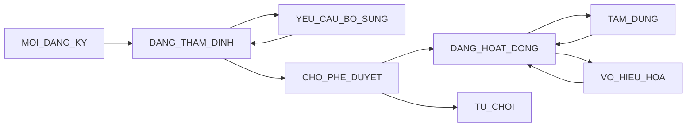
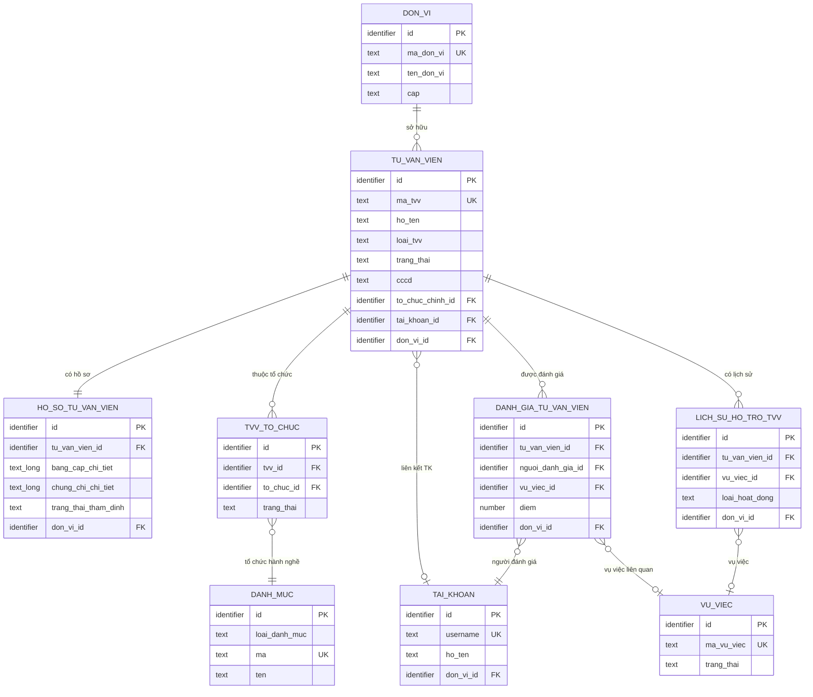
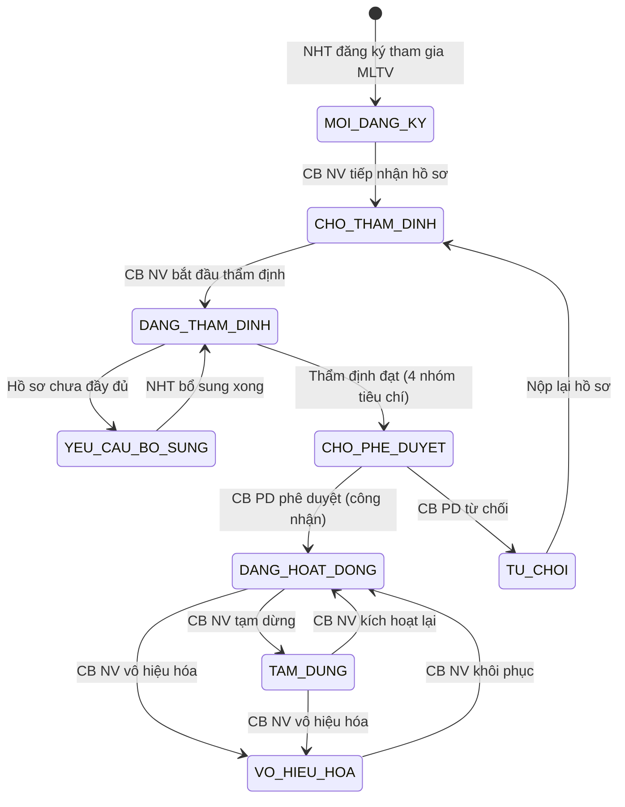

# SRS — Section 3.2.5: Quản lý Chuyên gia, Tư vấn viên

**Dự án:** Phần mềm hỗ trợ pháp lý doanh nghiệp
**Phiên bản SRS:** 3.0
**Nhóm:** IV — Quản lý Chuyên gia, Tư vấn viên
**UC range:** UC 39 – UC 50
**Số FR:** 13
**File chính:** `srs-v3.md` Section 3.2

---

## Mục lục file này

- [1. Tổng quan nhóm](#1-tổng-quan-nhóm)
- [2. Yêu cầu chức năng chi tiết](#2-yêu-cầu-chức-năng-chi-tiết)
- [3. Màn hình chức năng](#3-màn-hình-chức-năng)
- [4. Entity liên quan](#4-entity-liên-quan)
- [5. State Machine liên quan](#5-state-machine-liên-quan)
- [6. Business Rules liên quan](#6-business-rules-liên-quan)

---

## 1. Tổng quan nhóm

**Mục đích:** Quản lý hồ sơ, thẩm định, phê duyệt và đánh giá chuyên gia / tư vấn viên (TVV) tham gia mạng lưới hỗ trợ pháp lý cho DNNVV.

**Entity chính:** TU_VAN_VIEN, TVV_LINH_VUC, TVV_DIA_BAN, TVV_TO_CHUC, HO_SO_TVV, THAM_DINH_TVV, DANH_GIA_TVV, TO_CHUC_TU_VAN

**Tác nhân chính:** Cán bộ Nghiệp vụ (CB NV), Cán bộ Phê duyệt (CB PD), Người hỗ trợ (NHT), Doanh nghiệp (DN)

**Khung pháp lý:** Luật DNNVV 2017, NĐ55/2019, NĐ77/2008

**State Machine — SM-TVV:**



**Tiêu chí thẩm định 4 nhóm:** (1) Pháp lý, (2) Năng lực chuyên môn, (3) Hiệu quả & uy tín, (4) Mạng lưới

**Quy trình nghiệp vụ tổng quan:**

```
NHT đăng ký → CB NV thẩm định (4 tiêu chí) → Trình CB PD
→ CB PD phê duyệt → DANG_HOAT_DONG → Công khai lên Cổng PLQG
→ Phân công VV → Đánh giá định kỳ → Cập nhật trạng thái
```

**Luồng phê duyệt:** CB NV cùng cấp thẩm định → CB PD cùng cấp phê duyệt (BR-FLOW-03 — KHÔNG xuyên cấp)

**UC Coverage:**

| UC | Tên | FR-ID | Priority |
|----|-----|-------|----------|
| UC39 | Quản lý TVV | FR-IV-01 | Essential |
| UC40 | Tìm kiếm TVV | FR-IV-02 | Essential |
| UC41 | Đăng ký tham gia mạng lưới | FR-IV-03 | Essential |
| UC42 | Cập nhật năng lực | FR-IV-04 | Essential |
| UC43 | Xem chi tiết TVV | FR-IV-05 | Essential |
| UC44 | Thẩm định hồ sơ TVV | FR-IV-06 | Essential |
| UC45 | Phê duyệt TVV | FR-IV-07 | Essential |
| UC46 | Công khai mạng lưới TVV | FR-IV-08 | Essential |
| UC47 | Đánh giá TVV | FR-IV-09 | Essential |
| UC48 | Xem lịch sử hỗ trợ | FR-IV-10 | Essential |
| UC49 | NHT cập nhật hồ sơ | FR-IV-11 | Essential |
| UC50 | Cập nhật trạng thái TVV | FR-IV-12 | Essential |
| Cross | Tổng hợp điểm đánh giá | FR-IV-CROSS-01 | Essential |

---

## 2. Yêu cầu chức năng chi tiết

---

### FR-IV-01: Quản lý TVV (UC39)

**UC Reference:** UC 39
**Source:** NĐ55/2019, NĐ77/2008
**Priority:** Essential
**Stability:** High
**Màn hình:** SCR-IV-01, SCR-IV-02

**Mô tả:** CRUD tư vấn viên / chuyên gia trong mạng lưới hỗ trợ pháp lý.

**Tác nhân:** Cán bộ Nghiệp vụ (TW/BN/ĐP)

**Preconditions (Điều kiện tiên quyết):**
- User đã đăng nhập, có quyền "Quản lý TVV"
- Phân quyền theo đơn vị áp dụng

**Inputs (Dữ liệu đầu vào):**

| # | Tên field | Kiểu logic | Bắt buộc | Ràng buộc | Mặc định | Nguồn |
|---|----------|-----------|----------|-----------|----------|-------|
| 1 | ma_tvv | text | Y (auto) | TVV-{DON_VI_CODE}-{SEQ} | — | Hệ thống |
| 2 | anh_chan_dung | structured | N | Max 5MB, .jpg/.png | Ảnh hệ thống | Người dùng |
| 3 | ho_ten | text | Y | Max 200 ký | — | Người dùng |
| 4 | ngay_sinh | date | Y | ≤ ngày hiện tại | — | Người dùng |
| 5 | gioi_tinh | text | Y | NAM / NU | — | Người dùng |
| 6 | cmnd_cccd | text | Y | Max 12, unique toàn hệ thống | — | Người dùng |
| 7 | email | text | Y | RFC 5322 | — | Người dùng |
| 8 | so_dien_thoai | text | Y | 10-11 chữ số | — | Người dùng |
| 9 | dia_chi | text | Y | — | — | Người dùng |
| 10 | trinh_do | text | Y | Cử nhân/Thạc sĩ/Tiến sĩ/Khác | — | Người dùng |
| 11 | chung_chi | text | N | — | — | Người dùng |
| 12 | so_the | text | N | — | — | Người dùng |
| 13 | kinh_nghiem | text (long) | N | Max 5000 ký | — | Người dùng |
| 14 | to_chuc_chinh_id | identifier | Y | FK → TO_CHUC_TU_VAN | — | Người dùng |
| 15 | to_chuc_doi_tac_ids | identifier[] | N | FK → TO_CHUC_TU_VAN (N:N) | — | Người dùng |
| 16 | linh_vuc_ids | identifier[] | Y | FK → DANH_MUC, ≥ 1 | — | Người dùng |
| 17 | dia_ban_ids | identifier[] | Y | FK → DON_VI (tỉnh/TP) | — | Người dùng |
| 18 | file_bang_cap | structured | Cond | Max 10MB/file, PDF | — | Người dùng |
| 19 | ghi_chu | text (long) | N | Max 5000 ký | — | Người dùng |

**Processing (Xử lý):**

**Thêm mới:**

| Bước | Mô tả xử lý | BR áp dụng |
|------|-------------|-----------|
| 1 | Kiểm tra quyền và phân quyền theo đơn vị | BR-AUTH-01, BR-AUTH-08 |
| 2 | Xác nhận dữ liệu đầu vào theo ràng buộc | — |
| 3 | Kiểm tra CMND/CCCD duy nhất toàn hệ thống | — |
| 4 | Kiểm tra tổ chức tư vấn chính tồn tại | — |
| 5 | Tạo bản ghi TU_VAN_VIEN + TVV_TO_CHUC + TVV_LINH_VUC | BR-DATA-03 |
| 6 | Đặt trạng thái = MOI_DANG_KY | SM-TVV |
| 7 | Ghi nhật ký thao tác | BR-DATA-05 |

**Xóa (xóa mềm):**

| Bước | Mô tả xử lý | BR áp dụng |
|------|-------------|-----------|
| 1 | Kiểm tra TVV không có vụ việc đang xử lý | — |
| 2 | Đánh dấu xóa mềm | BR-DATA-01 |
| 3 | Ghi nhật ký thao tác | BR-DATA-05 |

**Outputs (Dữ liệu đầu ra):**

| # | Tên | Kiểu logic | Điều kiện | Format |
|---|-----|-----------|-----------|--------|
| 1 | id | identifier | Luôn có | — |
| 2 | ma_tvv | text | Luôn có | TVV-{CODE}-{SEQ} |
| 3 | ho_ten | text | Luôn có | — |
| 4 | linh_vuc | text | Luôn có | Tags |
| 5 | trang_thai | text | Luôn có | SM-TVV |
| 6 | diem_danh_gia_tb | number | Khi có đánh giá | 0-10 |

**Postconditions:** Bản ghi TVV được tạo/cập nhật/xóa mềm, nhật ký ghi nhận.

**Error Handling:**

| # | Điều kiện lỗi | Mã lỗi | Phản hồi hệ thống | Severity |
|---|--------------|--------|-------------------|----------|
| E1 | Họ tên trống | ERR-TVV-01 | "Họ tên là bắt buộc" | ERROR |
| E2 | CMND/CCCD trùng | ERR-TVV-02 | "Số CMND/CCCD đã tồn tại" | ERROR |
| E3 | Email không hợp lệ | ERR-TVV-03 | "Email không hợp lệ" | ERROR |
| E4 | Tổ chức không tồn tại | ERR-TVV-04 | "Tổ chức tư vấn không tồn tại" | ERROR |
| E5 | Xóa TVV có VV đang xử lý | ERR-TVV-05 | "TVV đang có vụ việc chưa hoàn thành" | ERROR |

**Acceptance Criteria:**
- **Given** CB NV truy cập "Quản lý TVV" **When** hiển thị **Then** danh sách TVV thuộc đơn vị, 3 tab trạng thái
- **Given** CB NV thêm TVV **When** nhập đủ trường bắt buộc **Then** tạo TVV mới, trạng thái MOI_DANG_KY
- **Given** CB NV xóa TVV có VV đang xử lý **When** xác nhận **Then** từ chối + cảnh báo

---

### FR-IV-02: Tìm kiếm TVV (UC40)

**UC Reference:** UC 40
**Priority:** Essential | **Stability:** High
**Màn hình:** SCR-IV-01

**Mô tả:** Tìm kiếm TVV theo nhiều tiêu chí: từ khóa, lĩnh vực, địa bàn, tổ chức, trạng thái, ngày công nhận.

**Tác nhân:** CB NV / CB PD

**Preconditions:** User đã đăng nhập.

**Inputs:**

| # | Tên field | Kiểu logic | Bắt buộc | Ràng buộc |
|---|----------|-----------|----------|-----------|
| 1 | tu_khoa | text | N | Tên, mã TVV, CMND/CCCD |
| 2 | linh_vuc_ids | identifier[] | N | Chọn nhiều lĩnh vực |
| 3 | dia_ban_id | identifier | N | Tỉnh/TP |
| 4 | to_chuc_id | identifier | N | Tổ chức tư vấn |
| 5 | trang_thai | text | N | SM-TVV |
| 6 | tu_ngay / den_ngay | date | N | Ngày công nhận |

**Processing:**

| Bước | Mô tả xử lý | BR áp dụng |
|------|-------------|-----------|
| 1 | Kiểm tra quyền và phân quyền theo đơn vị | BR-AUTH-01, BR-AUTH-08 |
| 2 | Kết hợp tất cả điều kiện lọc có giá trị (AND) | — |
| 3 | Phân trang (mặc định 20/trang) | BR-DATA-07 |

**Outputs:**

| # | Tên | Kiểu logic | Điều kiện | Format |
|---|-----|-----------|-----------|--------|
| 1 | id | identifier | — | — |
| 2 | ma_tvv | text | — | TVV-{CODE}-{SEQ} |
| 3 | ho_ten | text | — | — |
| 4 | loai | text | — | TVV / CG / NHT |
| 5 | ten_to_chuc | text | — | — |
| 6 | linh_vuc_text | text | — | Danh sách lĩnh vực (join) |
| 7 | trang_thai | text | — | SM-TVV |
| 8 | ngay_cong_nhan | date | Khi có | dd/mm/yyyy |
| 9 | diem_danh_gia_tb | number | Khi có đánh giá | 0-10 |
| 10 | total_count | number | — | — |

**Postconditions:** Read-only, không thay đổi dữ liệu.

**Error Handling:**

| # | Điều kiện lỗi | Mã lỗi | Phản hồi hệ thống | Severity |
|---|--------------|--------|-------------------|----------|
| E1 | Không có kết quả | INF-TVV-01 | "Không tìm thấy TVV phù hợp" | INFO |

**Acceptance Criteria:**
- **Given** user nhập từ khóa **When** tìm kiếm **Then** hiển thị TVV phù hợp, phân trang
- **Given** user lọc theo lĩnh vực + địa bàn **When** tìm **Then** kết quả AND
- **Given** user lọc theo nhiều điều kiện **When** tìm kiếm **Then** áp dụng AND tất cả

---

### FR-IV-03: Đăng ký tham gia mạng lưới (UC41)

**UC Reference:** UC 41
**Priority:** Essential | **Stability:** High
**Màn hình:** SCR-IV-02 (chuyên trang)

**Mô tả:** NHT đăng ký tham gia mạng lưới tư vấn viên hỗ trợ pháp lý qua chuyên trang.

**Tác nhân:** Người hỗ trợ (NHT)

**Preconditions:** NHT đã đăng nhập trên chuyên trang.

**Inputs:**

| # | Tên field | Kiểu logic | Bắt buộc | Ràng buộc | Mặc định | Nguồn |
|---|----------|-----------|----------|-----------|----------|-------|
| 1 | ho_ten | text | Y | Max 200 ký tự | — | user input |
| 2 | cmnd_cccd | text | Y | Max 12, unique | — | user input |
| 3 | email | text | Y | RFC 5322 | — | user input |
| 4 | so_dien_thoai | text | Y | 10-11 chữ số | — | user input |
| 5 | dia_chi | text | Y | — | — | user input |
| 6 | trinh_do | text | Y | — | — | user input |
| 7 | chuyen_nganh | text | Y | — | — | user input |
| 8 | kinh_nghiem | text (long) | Y | Mô tả kinh nghiệm | — | user input |
| 9 | linh_vuc_ids | identifier[] | Y | Lĩnh vực PL đăng ký | — | user input |
| 10 | to_chuc_id | identifier | N | Tổ chức hành nghề | — | user input |
| 11 | file_bang_cap | binary[] | Y | PDF, max 10MB/file | — | user upload |
| 12 | file_the_hanh_nghe | binary | N | PDF, max 10MB | — | user upload |

**Processing:**

| Bước | Mô tả xử lý | BR áp dụng |
|------|-------------|-----------|
| 1 | Kiểm tra NHT chưa có hồ sơ đang chờ xử lý | — |
| 2 | Xác nhận dữ liệu đầu vào | — |
| 3 | Kiểm tra CMND/CCCD duy nhất | — |
| 4 | Tạo bản ghi TU_VAN_VIEN, trạng thái = MOI_DANG_KY | SM-TVV |
| 5 | Gửi thông báo cho CB NV cùng đơn vị | — |
| 6 | Ghi nhật ký thao tác | BR-DATA-05 |

**Error Handling:**

| # | Điều kiện lỗi | Mã lỗi | Phản hồi hệ thống | Severity |
|---|--------------|--------|-------------------|----------|
| E1 | Đã có hồ sơ đang chờ | ERR-DK-01 | "Bạn đã có hồ sơ đang chờ xử lý" | ERROR |
| E2 | File vượt 10MB | ERR-DK-02 | "File tải lên tối đa 10MB" | ERROR |
| E3 | Thiếu file bằng cấp | ERR-DK-03 | "Bằng cấp/chứng chỉ là bắt buộc" | ERROR |

**Outputs:**

| # | Tên | Kiểu logic | Điều kiện | Format |
|---|-----|-----------|-----------|--------|
| 1 | ma_tvv | text | — | TVV-{CODE}-{SEQ} (auto-gen) |
| 2 | trang_thai | text | — | MOI_DANG_KY |
| 3 | ngay_dang_ky | datetime | — | dd/mm/yyyy HH:mm |
| 4 | thong_bao | text | — | "Đăng ký thành công, chờ thẩm định" |

**Postconditions:**
- Hồ sơ TVV được tạo với trạng thái MOI_DANG_KY
- CB NV đơn vị nhận thông báo hồ sơ mới
- NHT theo dõi được trạng thái

**Acceptance Criteria:**
- **Given** NHT truy cập chuyên trang **When** chọn "Đăng ký TVV" **Then** form đăng ký
- **Given** NHT nhập đủ + upload file **When** gửi **Then** tạo hồ sơ, trạng thái = MOI_DANG_KY, CB NV nhận thông báo
- **Given** NHT đã có hồ sơ chờ **When** đăng ký lại **Then** hệ thống từ chối

---

### FR-IV-04: Cập nhật năng lực (UC42)

**UC Reference:** UC 42
**Priority:** Essential | **Stability:** High
**Màn hình:** SCR-IV-03 (Tab Năng lực)

**Mô tả:** NHT hoặc CB NV cập nhật thông tin năng lực, bằng cấp, chứng chỉ của TVV.

**Tác nhân:** NHT (sở hữu hồ sơ) / CB NV

**Preconditions:** TVV tồn tại, NHT sở hữu hoặc CB NV có quyền.

**Inputs:**

| # | Tên field | Kiểu logic | Bắt buộc | Ràng buộc | Mặc định | Nguồn |
|---|----------|-----------|----------|-----------|----------|-------|
| 1 | kinh_nghiem | text (long) | N | Mô tả kinh nghiệm cập nhật | — | user input |
| 2 | chuyen_nganh | text | N | — | — | user input |
| 3 | chung_chi_moi | binary[] | N | PDF, max 10MB | — | user upload |
| 4 | linh_vuc_ids | identifier[] | N | Cập nhật lĩnh vực PL | — | user input |
| 5 | ghi_chu_cap_nhat | text | N | — | — | user input |

**Processing:**

| Bước | Mô tả xử lý | BR áp dụng |
|------|-------------|-----------|
| 1 | Kiểm tra quyền sở hữu hồ sơ hoặc quyền CB NV | BR-AUTH-01 |
| 2 | Xác nhận dữ liệu đầu vào | — |
| 3 | Cập nhật thông tin năng lực trong HO_SO_TVV | — |
| 4 | Nếu có file mới: tạo bản ghi FILE_DINH_KEM | — |
| 5 | Nếu thay đổi lĩnh vực: cập nhật TVV_LINH_VUC | — |
| 6 | Ghi nhật ký thao tác (giá trị cũ → mới) | BR-DATA-05 |

**Outputs:**

| # | Tên | Kiểu logic | Điều kiện | Format |
|---|-----|-----------|-----------|--------|
| 1 | success | boolean | — | — |
| 2 | updated_at | datetime | — | dd/mm/yyyy HH:mm |

**Postconditions:**
- Hồ sơ năng lực được cập nhật
- Nhật ký thao tác ghi nhận thay đổi

**Error Handling:**

| # | Điều kiện lỗi | Mã lỗi | Phản hồi hệ thống | Severity |
|---|--------------|--------|-------------------|----------|
| E1 | Không phải chủ hồ sơ | ERR-NL-01 | "Bạn không có quyền cập nhật hồ sơ này" | ERROR |
| E2 | File vượt 10MB | ERR-NL-02 | "File tải lên tối đa 10MB" | ERROR |

**Acceptance Criteria:**
- **Given** NHT xem hồ sơ của mình **When** nhấn "Cập nhật năng lực" **Then** form inline edit
- **Given** NHT cập nhật thông tin/chứng chỉ + upload file **When** lưu **Then** validate và lưu thành công
- **Given** CB NV xem chi tiết TVV **When** cập nhật năng lực **Then** validate + lưu

---

### FR-IV-05: Xem chi tiết TVV (UC43)

**UC Reference:** UC 43
**Priority:** Essential | **Stability:** High
**Màn hình:** SCR-IV-03

**Mô tả:** Xem chi tiết hồ sơ TVV gồm 4 tab: Hồ sơ, Năng lực, Lịch sử hỗ trợ, Đánh giá.

**Tác nhân:** CB NV, CB PD, NHT (xem hồ sơ của mình)

**Processing:**

| Bước | Mô tả xử lý | BR áp dụng |
|------|-------------|-----------|
| 1 | Kiểm tra quyền | BR-AUTH-01 |
| 2 | Lấy thông tin TVV đầy đủ | — |
| 3 | Tab Lịch sử: lấy danh sách VU_VIEC liên kết + thống kê | — |
| 4 | Tab Đánh giá: lấy danh sách DANH_GIA_TVV + tính điểm TB | — |

**Outputs:**

| # | Tên | Kiểu logic | Điều kiện | Format |
|---|-----|-----------|-----------|--------|
| 1 | ho_ten | text | Tab Hồ sơ | — |
| 2 | ngay_sinh | date | Tab Hồ sơ | dd/mm/yyyy |
| 3 | cmnd_cccd | text | Tab Hồ sơ | — |
| 4 | trinh_do | text | Tab Hồ sơ | — |
| 5 | chung_chi | text | Tab Hồ sơ | — |
| 6 | so_the_hanh_nghe | text | Tab Hồ sơ | — |
| 7 | files | binary[] | Tab Hồ sơ | Danh sách file đính kèm |

**Postconditions:** Read-only, không thay đổi dữ liệu.

**Error Handling:**

| # | Điều kiện lỗi | Mã lỗi | Phản hồi hệ thống | Severity |
|---|--------------|--------|-------------------|----------|
| E1 | TVV không tồn tại | ERR-HS-01 | "Hồ sơ TVV không tồn tại" | ERROR |

**Acceptance Criteria:**
- **Given** user chọn TVV **When** xem chi tiết **Then** hiển thị 4 tab đầy đủ
- **Given** user xem tab Lịch sử **When** có VV **Then** hiển thị danh sách + timeline + thống kê
- **Given** CB NV tìm kiếm **When** nhập từ khóa **Then** hiển thị kết quả phù hợp

---

### FR-IV-06: Thẩm định hồ sơ TVV (UC44)

**UC Reference:** UC 44
**Priority:** Essential | **Stability:** High
**Màn hình:** SCR-IV-03 (tab "Tham dinh" — gop MH-04.4)

**Mô tả:** CB NV thẩm định hồ sơ TVV theo 4 nhóm tiêu chí. Kết luận: ĐẠT / KHÔNG ĐẠT / YÊU CẦU BỔ SUNG.

**Tác nhân:** Cán bộ Nghiệp vụ

**Preconditions:** TVV ở trạng thái MOI_DANG_KY hoặc DANG_THAM_DINH.

**Inputs:**

| # | Tên field | Kiểu logic | Bắt buộc | Ràng buộc |
|---|----------|-----------|----------|-----------|
| 1 | nhom1_ket_qua | boolean | Y | Đạt/Không đạt (Pháp lý) |
| 2 | nhom2_diem | number | Y | 0-100 (Năng lực) |
| 3 | nhom3_diem | number | N | 0-100 hoặc N/A (Hiệu quả) |
| 4 | nhom4_tham_gia | boolean | Y | Có/Không (Mạng lưới) |
| 5 | ket_luan | text | Y | DAT / KHONG_DAT / YEU_CAU_BO_SUNG |
| 6 | ly_do | text | Cond | Bắt buộc nếu YEU_CAU_BO_SUNG |

**Processing:**

| Bước | Mô tả xử lý | BR áp dụng |
|------|-------------|-----------|
| 1 | Chuyển trạng thái TVV sang DANG_THAM_DINH (nếu chưa) | SM-TVV |
| 2 | Xác nhận dữ liệu 4 nhóm tiêu chí | — |
| 3 | Kiểm tra: DAT chỉ khi nhóm Pháp lý = Đạt | — |
| 4 | Nếu DAT + Trình duyệt: chuyển trạng thái CHO_PHE_DUYET, gửi thông báo CB PD | SM-TVV, BR-FLOW-03 |
| 5 | Nếu YEU_CAU_BO_SUNG: chuyển trạng thái, gửi thông báo NHT | SM-TVV |
| 6 | Nếu KHONG_DAT: chuyển trạng thái TU_CHOI, gửi thông báo NHT | SM-TVV |
| 7 | Tạo bản ghi THAM_DINH_TVV | — |
| 8 | Ghi nhật ký thao tác | BR-DATA-05 |

**Error Handling:**

| # | Điều kiện lỗi | Mã lỗi | Phản hồi hệ thống | Severity |
|---|--------------|--------|-------------------|----------|
| E1 | Kết luận ĐẠT nhưng nhóm Pháp lý không đạt | ERR-TD-02 | "Không thể kết luận ĐẠT khi nhóm Pháp lý chưa đạt" | ERROR |
| E2 | Thiếu lý do bổ sung | ERR-TD-03 | "Lý do yêu cầu bổ sung là bắt buộc" | ERROR |
| E3 | Trình duyệt khi kết luận khác DAT | ERR-TD-04 | "Chỉ trình duyệt khi kết luận ĐẠT" | ERROR |

**Postconditions:**
- Kết quả thẩm định được ghi nhận
- Trạng thái TVV chuyển theo SM-TVV
- NHT nhận thông báo (nếu cần bổ sung hoặc từ chối)

**Acceptance Criteria:**
- **Given** CB NV chọn TVV chờ thẩm định **When** đánh giá 4 nhóm **Then** form thẩm định đầy đủ
- **Given** Nhóm Pháp lý không đạt **When** kết luận ĐẠT **Then** hệ thống từ chối
- **Given** CB NV kết luận ĐẠT **When** nhấn "Trình duyệt" **Then** TVV → CHO_PHE_DUYET, CB PD nhận thông báo
- **Given** hồ sơ chưa đủ **When** CB NV gửi yêu cầu bổ sung **Then** cập nhật trạng thái + thông báo NHT

---

### FR-IV-07: Phê duyệt TVV (UC45)

**UC Reference:** UC 45
**Priority:** Essential | **Stability:** High
**Màn hình:** SCR-IV-03 (action buttons Phe duyet/Tu choi — gop MH-04.5)

**Mô tả:** CB PD phê duyệt hồ sơ TVV đã qua thẩm định.

**Tác nhân:** Cán bộ Phê duyệt (cùng cấp, BR-FLOW-03)

**Preconditions:** TVV ở CHO_PHE_DUYET, CB PD cùng cấp.

**Inputs:**

| # | Tên field | Kiểu logic | Bắt buộc | Ràng buộc | Mặc định | Nguồn |
|---|----------|-----------|----------|-----------|----------|-------|
| 1 | tvv_id | identifier | Y | — | — | system |
| 2 | quyet_dinh | text | Y | PHE_DUYET / TU_CHOI | — | user input |
| 3 | ly_do_tu_choi | text | Cond | Bắt buộc nếu TU_CHOI | — | user input |
| 4 | so_quyet_dinh | text | N | Số QĐ công nhận | — | user input |

**Processing:**

| Bước | Mô tả xử lý | BR áp dụng |
|------|-------------|-----------|
| 1 | Kiểm tra quyền + cùng cấp | BR-AUTH-01, BR-FLOW-03 |
| 2 | Nếu PHE_DUYET: chuyển trạng thái DANG_HOAT_DONG, ghi ngày công nhận | SM-TVV |
| 3 | Nếu TU_CHOI: chuyển trạng thái TU_CHOI | SM-TVV |
| 4 | Gửi thông báo NHT | — |
| 5 | Ghi nhật ký thao tác | BR-DATA-05 |

**Error Handling:**

| # | Điều kiện lỗi | Mã lỗi | Phản hồi hệ thống | Severity |
|---|--------------|--------|-------------------|----------|
| E1 | CB PD khác cấp | ERR-PD-02 | "Chỉ phê duyệt hồ sơ cùng cấp" | ERROR |
| E2 | Từ chối không có lý do | ERR-PD-03 | "Lý do từ chối là bắt buộc (≥10 ký tự)" | ERROR |

**Postconditions:**
- TVV được công nhận hoặc từ chối
- NHT nhận thông báo kết quả
- Nếu công nhận: TVV được phép tham gia hỗ trợ vụ việc

**Acceptance Criteria:**
- **Given** CB PD xem hồ sơ chờ duyệt **When** xem chi tiết **Then** hiển thị kết quả thẩm định 4 nhóm tiêu chí
- **Given** CB PD phê duyệt **When** xác nhận **Then** TVV → DANG_HOAT_DONG, ghi audit log, NHT nhận thông báo
- **Given** CB PD từ chối **When** nhập lý do **Then** TVV → TU_CHOI, gửi thông báo NHT

---

### FR-IV-08: Công khai mạng lưới TVV (UC46)

**UC Reference:** UC 46
**Priority:** Essential | **Stability:** High
**Màn hình:** SCR-IV-01 (batch action "Cong khai") + SCR-IV-03 (action button "Cong khai len Cong PLQG") — gop MH-04.8

**Mô tả:** Đẩy/gỡ TVV đã duyệt lên Cổng PLQG qua API outbound trực tiếp.

**Tác nhân:** CB NV (có quyền "Công khai MLTV")

**Inputs:**

| # | Tên field | Kiểu logic | Bắt buộc | Ràng buộc | Mặc định | Nguồn |
|---|----------|-----------|----------|-----------|----------|-------|
| 1 | tvv_id | identifier | Y | — | — | system |
| 2 | hanh_dong | text | Y | CONG_KHAI / HUY_CONG_KHAI | — | user input |

**Processing:**

| Bước | Mô tả xử lý | BR áp dụng |
|------|-------------|-----------|
| 1 | Kiểm tra TVV ở trạng thái DANG_HOAT_DONG | SM-TVV |
| 2 | Công khai: đặt da_cong_khai = 1, gọi API Cổng PLQG | — |
| 3 | Hủy công khai: đặt da_cong_khai = 0, gọi API gỡ khỏi Cổng | — |
| 4 | Hỗ trợ thao tác hàng loạt | — |
| 5 | Ghi nhật ký thao tác | BR-DATA-05 |

**Error Handling:**

| # | Điều kiện lỗi | Mã lỗi | Phản hồi hệ thống | Severity |
|---|--------------|--------|-------------------|----------|
| E1 | TVV không DANG_HOAT_DONG | ERR-CK-01 | "Chỉ TVV đang hoạt động mới được công khai" | ERROR |
| E2 | API Cổng PLQG lỗi | WRN-CK-01 | "Cập nhật Cổng thất bại, sẽ thử lại" | WARNING |

**Postconditions:**
- TVV hiển thị/ẩn trên Cổng PLQG
- API outbound gửi trạng thái

**Acceptance Criteria:**
- **Given** CB NV chọn TVV đang hoạt động **When** nhấn "Công khai" **Then** đẩy lên Cổng PLQG
- **Given** CB NV hủy công khai **When** xác nhận **Then** TVV bị gỡ khỏi Cổng
- **Given** API lỗi **When** gọi API **Then** retry 3 lần, ghi log, cảnh báo

---

### FR-IV-09: Đánh giá TVV (UC47)

**UC Reference:** UC 47
**Priority:** Essential | **Stability:** High
**Màn hình:** SCR-IV-03 (tab "Danh gia" — gop MH-04.6)

**Mô tả:** Đánh giá TVV theo 3 tiêu chí: Chuyên môn, Thái độ, Đúng hạn (thang 0-10).

**Tác nhân:** CB NV, CB PD, DN

**Inputs:**

| # | Tên field | Kiểu logic | Bắt buộc | Ràng buộc | Mặc định | Nguồn |
|---|----------|-----------|----------|-----------|----------|-------|
| 1 | tvv_id | identifier | Y | — | — | system |
| 2 | vu_viec_id | identifier | N | Vụ việc liên kết | — | user input |
| 3 | diem_chuyen_mon | number | Y | 0-10 | — | user input |
| 4 | diem_thai_do | number | Y | 0-10 | — | user input |
| 5 | diem_thoi_gian | number | Y | 0-10 | — | user input |
| 6 | diem_tong | number | Y (auto) | Trung bình 3 điểm | — | system |
| 7 | nhan_xet | text (long) | N | — | — | user input |

**Processing:**

| Bước | Mô tả xử lý | BR áp dụng |
|------|-------------|-----------|
| 1 | Kiểm tra quyền | BR-AUTH-01 |
| 2 | Xác nhận điểm 0-10 cho 3 tiêu chí | — |
| 3 | Tính điểm tổng = trung bình 3 điểm | — |
| 4 | Tạo bản ghi DANH_GIA_TVV | — |
| 5 | Cập nhật điểm đánh giá trung bình của TVV | — |
| 6 | Ghi nhật ký thao tác | BR-DATA-05 |

**Outputs:**

| # | Tên | Kiểu logic | Điều kiện | Format |
|---|-----|-----------|-----------|--------|
| 1 | id | identifier | — | — |
| 2 | diem_tong | number | — | 0-10 |
| 3 | diem_danh_gia_tb | number | — | Điểm TB mới của TVV |
| 4 | so_luong_danh_gia | number | — | Tổng số đánh giá |

**Postconditions:**
- Đánh giá được ghi nhận
- Điểm trung bình TVV được cập nhật tự động

**Error Handling:**

| # | Điều kiện lỗi | Mã lỗi | Phản hồi hệ thống | Severity |
|---|--------------|--------|-------------------|----------|
| E1 | Điểm ngoài khoảng 0-10 | ERR-DG-01 | "Điểm đánh giá phải từ 0 đến 10" | ERROR |
| E2 | TVV không tồn tại | ERR-DG-02 | "TVV không tồn tại" | ERROR |

**Acceptance Criteria:**
- **Given** CB/DN chọn đánh giá TVV **When** nhập 3 điểm + nhận xét **Then** lưu, cập nhật điểm TB TVV
- **Given** điểm ngoài khoảng 0-10 **When** lưu **Then** báo lỗi
- **Given** nhiều người đánh giá **When** xem tổng hợp **Then** hiển thị điểm trung bình + danh sách đánh giá

---

### FR-IV-10: Xem lịch sử hỗ trợ (UC48)

**UC Reference:** UC 48
**Priority:** Essential | **Stability:** High
**Màn hình:** SCR-IV-03 (Tab Lịch sử)

**Mô tả:** Xem danh sách vụ việc TVV đã tham gia hỗ trợ, kèm thống kê và timeline.

**Tác nhân:** CB NV, CB PD, NHT (xem của mình)

**Inputs:**

| # | Tên field | Kiểu logic | Bắt buộc | Ràng buộc | Mặc định | Nguồn |
|---|----------|-----------|----------|-----------|----------|-------|
| 1 | tvv_id | identifier | Y | — | — | system |
| 2 | tu_ngay | date | N | Lọc từ ngày | — | user input |
| 3 | den_ngay | date | N | Lọc đến ngày | — | user input |
| 4 | trang_thai_vv | text | N | Lọc trạng thái vụ việc | — | user input |

**Processing:**

| Bước | Mô tả xử lý | BR áp dụng |
|------|-------------|-----------|
| 1 | Lấy danh sách VU_VIEC liên kết qua PHAN_CONG_VU_VIEC | — |
| 2 | Tính thống kê: tổng VV, hoàn thành, điểm TB | — |
| 3 | Hiển thị timeline tổng hợp | — |
| 4 | Phân trang 20/trang | BR-DATA-07 |

**Outputs:**

| # | Tên | Kiểu logic | Điều kiện | Format |
|---|-----|-----------|-----------|--------|
| 1 | vu_viec_id | identifier | — | — |
| 2 | ma_vu_viec | text | — | — |
| 3 | ten_doanh_nghiep | text | — | — |
| 4 | linh_vuc | text | — | — |
| 5 | trang_thai | text | — | Trạng thái vụ việc |
| 6 | ngay_phan_cong | date | — | dd/mm/yyyy |
| 7 | ngay_hoan_thanh | date | Khi có | dd/mm/yyyy |
| 8 | diem_danh_gia | number | Khi có | 0-10 |
| 9 | tong_vu_viec | number | — | Thống kê tổng |
| 10 | tong_hoan_thanh | number | — | Thống kê hoàn thành |

**Postconditions:** Read-only, không thay đổi dữ liệu.

**Error Handling:**

| # | Điều kiện lỗi | Mã lỗi | Phản hồi hệ thống | Severity |
|---|--------------|--------|-------------------|----------|
| E1 | TVV không tồn tại | ERR-LS-01 | "TVV không tồn tại" | ERROR |

**Acceptance Criteria:**
- **Given** user xem chi tiết TVV **When** chọn tab "Lịch sử" **Then** danh sách VV + thống kê + timeline
- **Given** CB NV xem chi tiết vụ việc **When** chọn vụ việc **Then** hiển thị thông tin + kết quả + đánh giá
- **Given** CB NV tìm kiếm lịch sử **When** lọc thời gian **Then** hiển thị kết quả phù hợp

---

### FR-IV-11: NHT cập nhật hồ sơ (UC49)

**UC Reference:** UC 49
**Priority:** Essential | **Stability:** High
**Màn hình:** SCR-IV-02 (chuyên trang)

**Mô tả:** NHT cập nhật thông tin hồ sơ cá nhân của mình.

**Tác nhân:** Người hỗ trợ (NHT)

**Inputs:**

| # | Tên field | Kiểu logic | Bắt buộc | Ràng buộc | Mặc định | Nguồn |
|---|----------|-----------|----------|-----------|----------|-------|
| 1 | dia_chi | text | N | — | — | user input |
| 2 | so_dien_thoai | text | N | 10-11 chữ số | — | user input |
| 3 | email | text | N | RFC 5322 | — | user input |
| 4 | linh_vuc_ids | identifier[] | N | Lĩnh vực chuyên môn | — | user input |

**Processing:**

| Bước | Mô tả xử lý | BR áp dụng |
|------|-------------|-----------|
| 1 | Kiểm tra NHT sở hữu hồ sơ | BR-AUTH-01 |
| 2 | Xác nhận dữ liệu đầu vào (email format, SĐT format) | — |
| 3 | Cập nhật TU_VAN_VIEN | — |
| 4 | Nếu thay đổi lĩnh vực: cập nhật TVV_LINH_VUC | — |
| 5 | Ghi nhật ký thao tác (giá trị cũ → mới) | BR-DATA-05 |

**Outputs:**

| # | Tên | Kiểu logic | Điều kiện | Format |
|---|-----|-----------|-----------|--------|
| 1 | success | boolean | — | — |
| 2 | updated_at | datetime | — | dd/mm/yyyy HH:mm |

**Postconditions:**
- Thông tin TVV được cập nhật
- Nhật ký thao tác ghi nhận

**Error Handling:**

| # | Điều kiện lỗi | Mã lỗi | Phản hồi hệ thống | Severity |
|---|--------------|--------|-------------------|----------|
| E1 | Email không hợp lệ | ERR-CN-01 | "Định dạng email không hợp lệ" | ERROR |
| E2 | Không sở hữu hồ sơ | ERR-CN-02 | "Bạn không có quyền cập nhật hồ sơ này" | ERROR |

**Acceptance Criteria:**
- **Given** NHT truy cập "Thông tin cá nhân" **When** chọn chỉnh sửa **Then** hiển thị form cập nhật
- **Given** NHT thay đổi thông tin **When** lưu **Then** validate + cập nhật thành công, ghi audit log
- **Given** NHT lưu thành công **When** hệ thống xử lý xong **Then** hiển thị thông tin đã cập nhật ở chế độ readonly để xác nhận

---

### FR-IV-12: Cập nhật trạng thái TVV (UC50)

**UC Reference:** UC 50
**Priority:** Essential | **Stability:** High
**Màn hình:** SCR-IV-03 (action button "Cap nhat trang thai" — modal, gop MH-04.7)

**Mô tả:** CB NV chuyển trạng thái hoạt động TVV: DANG_HOAT_DONG ⟷ TAM_DUNG, DANG_HOAT_DONG → VO_HIEU_HOA, VO_HIEU_HOA → DANG_HOAT_DONG.

**Tác nhân:** CB NV

**Inputs:**

| # | Tên field | Kiểu logic | Bắt buộc | Ràng buộc |
|---|----------|-----------|----------|-----------|
| 1 | trang_thai_moi | text | Y | Chỉ transition hợp lệ SM-TVV |
| 2 | ly_do | text (long) | Y | Min 10 ký tự |

**Processing:**

| Bước | Mô tả xử lý | BR áp dụng |
|------|-------------|-----------|
| 1 | Kiểm tra transition hợp lệ theo SM-TVV | SM-TVV |
| 2 | Nếu VO_HIEU_HOA: kiểm tra không có VV đang xử lý | — |
| 3 | Cập nhật trạng thái TVV | — |
| 4 | Nếu VO_HIEU_HOA và đã công khai: tự động gỡ khỏi Cổng PLQG | — |
| 5 | Gửi thông báo NHT | — |
| 6 | Ghi nhật ký thao tác | BR-DATA-05 |

**Error Handling:**

| # | Điều kiện lỗi | Mã lỗi | Phản hồi hệ thống | Severity |
|---|--------------|--------|-------------------|----------|
| E1 | Transition không hợp lệ | ERR-TT-01 | "Không thể chuyển từ {old} sang {new}" | ERROR |
| E2 | Vô hiệu hóa có VV đang xử lý | ERR-TT-02 | "TVV đang có {N} VV chưa hoàn thành" | ERROR |
| E3 | Thiếu lý do | ERR-TT-03 | "Lý do thay đổi là bắt buộc" | ERROR |

**Postconditions:**
- Trạng thái TVV được cập nhật theo SM-TVV
- TVV bị vô hiệu hóa không thể được phân công vụ việc mới
- Tự động gỡ Cổng PLQG nếu vô hiệu hóa

**Acceptance Criteria:**
- **Given** CB NV chọn cập nhật trạng thái **When** chọn TAM_DUNG + lý do **Then** TVV → TAM_DUNG
- **Given** CB NV chọn VO_HIEU_HOA **When** TVV có VV đang xử lý **Then** từ chối + cảnh báo
- **Given** TVV đã công khai bị vô hiệu hóa **When** xác nhận **Then** tự động gỡ Cổng PLQG
- **Given** CB NV cập nhật thành công **When** hệ thống xử lý xong **Then** hiển thị trạng thái mới (badge + timestamp)

---

### FR-IV-CROSS-01: Tổng hợp điểm đánh giá TVV

**Priority:** Essential | **Stability:** High

**Mô tả:** Cross-cutting — Tự động cập nhật điểm đánh giá trung bình của TVV sau mỗi lần đánh giá mới.

**Processing:**

| Bước | Mô tả xử lý | BR áp dụng |
|------|-------------|-----------|
| 1 | Trigger sau khi tạo DANH_GIA_TVV mới | — |
| 2 | Tính trung bình tất cả điểm tổng của TVV | — |
| 3 | Cập nhật diem_danh_gia_tb trong TU_VAN_VIEN | — |

**Acceptance Criteria:**
- **Given** đánh giá mới được ghi nhận **When** xử lý **Then** điểm TB TVV được cập nhật tự động

---

**— Hết file FR Group: Quản lý Chuyên gia, Tư vấn viên —**

## 3. Màn hình chức năng

> **v2.1 Consolidation:** Nhom IV gop tu 8 xuong 3 man hinh chinh. MH-04.4 (Tham dinh) → tab trong MH-04.3. MH-04.5 (Phe duyet) → action buttons trong MH-04.3. MH-04.6 (Danh gia) → tab trong MH-04.3. MH-04.7 (Cap nhat TT) → action button modal trong MH-04.1/MH-04.3. MH-04.8 (Cong khai MLTV) → batch action trong MH-04.1 + action button trong MH-04.3.

### SCR-IV-01: Danh sach Tu van vien (trang chinh)

**Loai man hinh:** Danh sach 5 tab + Batch actions (cong khai — gop MH-04.8)
**FR su dung:** FR-IV-01, FR-IV-02, FR-IV-08 (cong khai MLTV — gop MH-04.8), FR-IV-12 (cap nhat TT — gop MH-04.7)
**UX-Spec ref:** dac-ta-man-hinh-chuc-nang-v2.md — MH-04.1

#### Thanh phan man hinh

| # | Vung | Thanh phan | Loai | Du lieu / Noi dung | Hanh vi | Dieu kien hien thi |
|---|------|-----------|------|--------------------| --------|-------------------|
| 1 | toolbar | Breadcrumb | breadcrumb | "Trang chu > Chuyen gia/TVV > Quan ly tu van vien" | navigate | Luon |
| 2 | toolbar | Tieu de + Nut Them TVV + Xuat Excel | label + buttons | "Quan ly Tu van vien" + [+ Them TVV] [Xuat Excel] | click → tuong ung | Luon |
| 3 | tab | Tab "Dang hoat dong" | tab | trang_thai = 'DANG_HOAT_DONG'. So dem ({count}). Mac dinh active | click → filter | Luon |
| 4 | tab | Tab "Tam dung" | tab | trang_thai = 'TAM_DUNG'. So dem | click → filter | Luon |
| 5 | tab | Tab "Moi dang ky" | tab | trang_thai IN ('MOI_DANG_KY','YEU_CAU_BO_SUNG'). Badge do neu > 0 | click → filter | Luon |
| 6 | tab | Tab "Cho tham dinh" | tab | trang_thai = 'DANG_THAM_DINH'. CB NV thao tac tham dinh 4 tieu chi | click → filter | Luon |
| 7 | tab | Tab "Cho phe duyet" | tab | trang_thai = 'CHO_PHE_DUYET'. CB PD thao tac phe duyet/tu choi. Batch approve | click → filter | Luon |
| 8 | filter-bar | Tu khoa | search-box | "Tim theo ten, ma TVV hoac CMND/CCCD". LIKE tren ho_ten, ma_tvv, cmnd_cccd | change → filter | Luon |
| 9 | filter-bar | Linh vuc | multi-select | Danh muc Linh vuc phap luat. Loc theo linh vuc cua TVV | change → filter | Luon |
| 10 | filter-bar | Dia ban | select (searchable) | Danh sach don vi cap Tinh/TP | change → filter | Luon |
| 11 | filter-bar | To chuc | select (searchable) | Danh sach to chuc tu van dang hoat dong | change → filter | Luon |
| 12 | filter-bar | Trang thai | select | Tat ca gia tri SM-TVV. An neu dang o tab cu the | change → filter | Luon |
| 13 | filter-bar | Ngay cong nhan tu/den | date-picker | — | change → filter | Luon |
| 14 | filter-bar | Nut Tim kiem / Xoa bo loc | button | AND logic + phân quyền dữ liệu | click → query/reset | Luon |
| 15 | table | Checkbox | checkbox | Chon hang loat | — | Luon |
| 16 | table | Anh | image (40x40, bo tron) | anh_chan_dung. Mac dinh: avatar placeholder | — | Luon |
| 17 | table | Ma TVV | table-column | Auto-gen: TVV-{DON_VI_CODE}-{SEQ} | — | Luon |
| 18 | table | Ho ten (link) | table-column (bold) | Click → SCR-IV-03 (Ho so chi tiet) | click → navigate | Luon |
| 19 | table | Loai | badge | TVV=xanh duong, CG=tim, NHT=xanh la | — | Luon |
| 20 | table | Linh vuc | tags | Ten linh vuc cua TVV (tra cuu tu Danh muc). Max 3 tag + "+N" | — | Luon |
| 21 | table | To chuc | table-column | Ten to chuc tu van. Cat 30 ky | — | Luon |
| 22 | table | Diem DG | number + stars | diem_danh_gia_tb. "8.5" + sao. Neu chua danh gia → "—" | — | Luon |
| 23 | table | Trang thai | badge | SM-TVV. Mau: MOI_DANG_KY=xam, DANG_THAM_DINH=vang nhat, YEU_CAU_BO_SUNG=cam, CHO_PHE_DUYET=vang, DANG_HOAT_DONG=xanh la, TAM_DUNG=xam, VO_HIEU_HOA=den, TU_CHOI=do | — | Luon |
| 24 | table | Ngay cong nhan | table-column (date) | dd/mm/yyyy. Neu null → "—" | — | Luon |
| 25 | table | Hanh dong | icon-buttons | Xem (→ SCR-IV-03), Sua (→ SCR-IV-02, chi khi NOT VO_HIEU_HOA), Xoa (chi khi khong co VV dang xu ly) | click → tuong ung | Luon |
| 26 | pagination | Phan trang | pagination | 20 muc/trang. Hien thi tong moi tab | — | Luon |

#### Quy tac tuong tac
- Xuat Excel: max 10.000 dong (WRN-TVV-01)
- Xoa mem: kiem tra khong co vu viec dang xu ly (ERR-TVV-05)
- 3 vai tro KHAC NHAU: NHT, TVV, CG
- Batch cong khai (gop MH-04.8): tren tab "Dang hoat dong", chon nhieu TVV → nut "Cong khai len Cong PLQG" → goi API per-record. Chi TVV DANG_HOAT_DONG duoc cong khai (ERR-CK-01). API loi → retry 3 lan (WRN-CK-01)
- Batch huy cong khai: tren tab "Dang hoat dong", chon TVV da cong khai → nut "Huy cong khai" → goi API go

---

### SCR-IV-02: Them moi / Chinh sua TVV

**Loai man hinh:** Form nhap lieu (Accordion 5 muc) — du day du field SRS
**FR su dung:** FR-IV-01, FR-IV-03 (dang ky UC41), FR-IV-04 (cap nhat nang luc UC42)
**UX-Spec ref:** dac-ta-man-hinh-chuc-nang-v2.md — MH-04.2

#### Thanh phan man hinh

| # | Vung | Thanh phan | Loai | Du lieu / Noi dung | Hanh vi | Dieu kien hien thi |
|---|------|-----------|------|--------------------| --------|-------------------|
| 1 | toolbar | Breadcrumb | breadcrumb | "Trang chu > Chuyen gia/TVV > Them moi TVV" hoac "... > Chinh sua [Ten TVV]" | navigate | Luon |
| 2 | accordion-1 | Thong tin ca nhan | accordion | Ma TVV (readonly, auto-gen chi hien khi edit), Anh chan dung (max 5MB, .jpg/.png, preview 120x160), Ho ten * (max 200 ky, ERR-TVV-01), Ngay sinh * (<=hom nay), Gioi tinh * (NAM/NU), So CMND/CCCD * (max 12, UNIQUE toan he thong, ERR-TVV-02), Email * (RFC 5322, ERR-TVV-03), SDT * (10-11 chu so), Dia chi * | — | Luon |
| 3 | accordion-2 | Thong tin nghe nghiep | accordion | Trinh do * (Cu nhan/Thac si/Tien si/Khac), Chung chi hanh nghe, So the hanh nghe, Kinh nghiem tu van (max 5000 ky) | — | Luon |
| 4 | accordion-3 | To chuc & Mang luoi | accordion | To chuc chinh * (searchable, FK TO_CHUC_TU_VAN, ERR-TVV-04), To chuc doi tac (multi-select, N:N qua TVV_TO_CHUC), Linh vuc PL * (multi-select, >= 1), Dia ban hoat dong * (multi-select, DON_VI tinh/TP) | — | Luon |
| 5 | accordion-4 | File dinh kem | accordion | Bang cap/Chung chi * (bat buoc khi dang ky UC41, multi-file, max 10MB/file, tong 50MB, PDF only, ERR-DK-02/03), The hanh nghe (max 10MB, PDF). Danh sach file: ten + kich thuoc + nut xoa/xem | upload | Luon |
| 6 | accordion-5 | Ghi chu | accordion | Max 5000 ky. Khong bat buoc | — | Luon |
| 7 | action-bar | Huy / Luu | button | Huy: quay lai, confirm neu unsaved. Luu: tao moi hoac cap nhat TVV + lien ket to chuc + linh vuc. Tao moi: SET MOI_DANG_KY. Ghi audit log | click → tuong ung | Luon |

#### Quy tac tuong tac
- Chi sua khi NOT VO_HIEU_HOA
- CMND/CCCD unique toan he thong
- UC41 (NHT dang ky): kiem tra chua co ho so dang cho (ERR-DK-01)
- UC42/UC49 (NHT cap nhat): kiem tra so huu ho so (ERR-NL-01, ERR-CN-02)
- Tao moi → gui TB CB NV cung don vi: "Ho so TVV moi dang ky: [ten]"

---

### SCR-IV-03: Ho so Chi tiet TVV (toan bo workflow)

**Loai man hinh:** Chi tiet 5 tab: Ho so, Tham dinh (gop MH-04.4), Nang luc, Lich su ho tro, Danh gia (gop MH-04.6). Action buttons: Phe duyet/Tu choi (gop MH-04.5), Cap nhat TT (gop MH-04.7), Cong khai (gop MH-04.8)
**FR su dung:** FR-IV-05, FR-IV-04, FR-IV-06 (tham dinh — gop MH-04.4), FR-IV-07 (phe duyet — gop MH-04.5), FR-IV-08 (cong khai — gop MH-04.8), FR-IV-09 (danh gia — gop MH-04.6), FR-IV-10, FR-IV-12 (cap nhat TT — gop MH-04.7)
**UX-Spec ref:** dac-ta-man-hinh-chuc-nang-v2.md — MH-04.3

#### Thanh phan man hinh — Header + Action buttons

| # | Vung | Thanh phan | Loai | Du lieu / Noi dung | Hanh vi | Dieu kien hien thi |
|---|------|-----------|------|--------------------| --------|-------------------|
| 1 | toolbar | Breadcrumb | breadcrumb | "Trang chu > Chuyen gia/TVV > [Ten TVV]" | navigate | Luon |
| 2 | toolbar | Nut Quay lai | button (ghost) | "← Quay lai danh sach" | click → navigate SCR-IV-01 | Luon |
| 3 | header | Header info | card | Anh chan dung (80x100), Ten TVV (bold 20px), Ma TVV, Trang thai (badge lon), Diem danh gia TB (sao), Ngay cong nhan | — | Luon |
| 4 | header | Nut Sua | button (secondary) | "Sua ho so" → SCR-IV-02. An neu VO_HIEU_HOA | click → navigate | NOT VO_HIEU_HOA |
| 5 | header | Nut Cap nhat TT (gop MH-04.7) | button (secondary) | "Cap nhat trang thai" → modal: chon TT moi (Tam dung/Khoi phuc/Vo hieu hoa) + ly do (bat buoc, min 10 ky tu). Validate: vo hieu hoa chi khi khong co VV dang XL (ERR-TVV-VH-01 kiem tra ca VU_VIEC va HOI_DAP). Khi vo hieu hoa → auto go Cong PLQG | click → mo modal | Chi CB NV |
| 6 | header | Nut Phe duyet (gop MH-04.5) | button (primary) | "Phe duyet" → C12 confirm → SET DANG_HOAT_DONG, ngay_cong_nhan=NOW(). Gui TB NHT | click → chuyen TT | Khi CHO_PHE_DUYET, CB PD cung cap |
| 7 | header | Nut Tu choi (gop MH-04.5) | button (danger) | "Tu choi" → modal ly do bat buoc >= 10 ky tu (ERR-PD-03). SET TU_CHOI. Gui TB NHT | click → mo modal | Khi CHO_PHE_DUYET, CB PD |
| 8 | header | Nut Cong khai (gop MH-04.8) | button (primary) | "Cong khai len Cong PLQG" → goi API Cong PLQG | click → API call | Khi DANG_HOAT_DONG AND cong_khai=false |

#### 5 Tabs

| # | Vung | Thanh phan | Loai | Du lieu / Noi dung | Hanh vi | Dieu kien hien thi |
|---|------|-----------|------|--------------------| --------|-------------------|
| 9 | tab-1 | Tab Ho so | tab | 5 accordion read-only: Thong tin ca nhan (ho ten, ngay sinh, gioi tinh, CMND, email, SDT, dia chi), Nghe nghiep (trinh do, chung chi, so the, kinh nghiem), To chuc (to chuc chinh link, doi tac tags), Mang luoi (linh vuc tags, dia ban tags), File dinh kem (ten + kich thuoc + nut xem/tai) | — | Luon |
| 10 | tab-2 | Tab Tham dinh (gop MH-04.4) | tab | Form cham diem 4 nhom tieu chi. Chi hien khi TT in {DANG_THAM_DINH, CHO_PHE_DUYET} | — | Khi DANG_THAM_DINH/CHO_PHE_DUYET |
| 11 | tab-2 | Nhom 1 — Phap ly (bat buoc) | scoring-section | Checklist: Bang cap hop le, Chung chi hanh nghe, The hanh nghe con hieu luc, Khong vi pham. Ket luan: Dat/Khong dat. Neu Khong dat → toan bo = Khong dat | — | Tab Tham dinh |
| 12 | tab-2 | Nhom 2 — Nang luc chuyen mon | scoring-section | Diem (0-10) + slider + nhan xet | — | Tab Tham dinh |
| 13 | tab-2 | Nhom 3 — Hieu qua & uy tin | scoring-section | Diem (0-10) + nhan xet. N/A checkbox neu TVV moi | — | Tab Tham dinh |
| 14 | tab-2 | Nhom 4 — Mang luoi | scoring-section | Diem (0-10) + nhan xet | — | Tab Tham dinh |
| 15 | tab-2 | Ket luan tham dinh | radio | DAT / KHONG_DAT / YEU_CAU_BO_SUNG. DAT chi khi nhom 1 = Dat. ERR-TD-02 | — | Tab Tham dinh |
| 16 | tab-2 | Ly do yeu cau bo sung | textarea | Bat buoc khi ket_luan = YEU_CAU_BO_SUNG. ERR-TD-03 | — | Khi YEU_CAU_BO_SUNG |
| 17 | tab-2 | Action: Huy / Luu nhap / Gui KQ / Trinh duyet | button | Gui KQ → INSERT THAM_DINH_TVV → chuyen TT. Trinh duyet (chi khi DAT) → SET CHO_PHE_DUYET + gui TB CB PD. ERR-TD-04 neu ket_luan != DAT | click → tuong ung | Tab Tham dinh |
| 18 | tab-3 | Tab Nang luc (UC42) | tab | Bang cap chi tiet, Chung chi chi tiet, Kinh nghiem chi tiet, Tom tat ho so nang luc. Nut "Cap nhat nang luc" (UC42) — chi NHT so huu hoac CB NV → form inline edit | — | Luon |
| 19 | tab-4 | Tab Lich su ho tro (UC48) | tab | Filter thoi gian + trang thai. Bang: Ma VV (link), Ten VV, DN, Linh vuc, Vai tro (NHT/TVV), Ngay phan cong, Ngay hoan thanh, Ket qua, Danh gia (sao). Phan trang 20/trang. Thong ke mini: Tong VV, Hoan thanh, Diem TB. Timeline tong hop | — | Luon |
| 20 | tab-5 | Tab Danh gia (gop MH-04.6, UC47) | tab | Diem tong hop: so lon (vd: 8.5/10) + sao + "(N danh gia)". 3 progress bar: Chuyen mon, Thai do, Dung han (avg/10 moi loai). Danh sach danh gia: Nguoi DG, Vu viec, Ngay, 3 diem thanh phan, Nhan xet. Phan trang 10/trang | — | Luon |
| 21 | tab-5 | Form danh gia moi (gop MH-04.6) | form | Chon TVV * (auto-fill), Vu viec lien ket, 3 star-rating (0-10): Chuyen mon, Thai do, Dung han. Diem tong auto AVG. Nhan xet (max 5000 ky). Nut "Gui danh gia" → INSERT + UPDATE diem_danh_gia_tb | — | Khi co quyen danh gia |

#### Quy tac tuong tac
- Toan bo workflow tren 1 trang: xem ho so → tham dinh → trinh duyet → phe duyet → cong khai → cap nhat TT
- Tham dinh: MOI_DANG_KY → DANG_THAM_DINH (lan dau). YEU_CAU_BO_SUNG → goi TB NHT. DAT + "Trinh duyet" → CHO_PHE_DUYET + TB CB PD. KHONG_DAT → TU_CHOI + TB NHT
- Phe duyet: CHO_PHE_DUYET → DANG_HOAT_DONG (SET ngay_cong_nhan). Tu choi → TU_CHOI
- Cap nhat TT: DANG_HOAT_DONG ⟷ TAM_DUNG, DANG_HOAT_DONG → VO_HIEU_HOA (kiem tra VV), VO_HIEU_HOA → DANG_HOAT_DONG
- CB PD chi duyet ho so cung cap (BR-FLOW-03)
- Sau DANG_HOAT_DONG: TVV duoc phep tham gia ho tro vu viec + co the cong khai len Cong PLQG

---

## 4. Entity liên quan

> **Source of truth:** `srs-v3.md` Section 3.4. Nội dung dưới đây được trích để agent có đủ context.

### Tổng quan entity

| # | Entity | Vai trò | Mô tả |
|---|--------|---------|-------|
| 1 | TU_VAN_VIEN | owned | Thông tin TVV/CG/NHT trong mạng lưới |
| 2 | HO_SO_TU_VAN_VIEN | owned | Hồ sơ năng lực chi tiết (1:1 với TVV) |
| 3 | TVV_TO_CHUC | owned | Liên kết TVV ↔ Tổ chức hành nghề (N:N) |
| 4 | DANH_GIA_TU_VAN_VIEN | owned | Đánh giá TVV theo 4 nhóm tiêu chí |
| 5 | LICH_SU_HO_TRO_TVV | owned | Lịch sử tham gia hỗ trợ của TVV |
| 6 | TAI_KHOAN | referenced | Tài khoản người dùng |
| 7 | DON_VI | referenced | Đơn vị theo đơn vị |
| 8 | DANH_MUC | referenced | Danh mục dùng chung (lĩnh vực PL, tổ chức) |
| 9 | VU_VIEC | referenced | Vụ việc liên kết đánh giá/lịch sử |

### ERD nhóm (subset)



### TU_VAN_VIEN (owned)

**Mô tả:** Thông tin TVV/CG/NHT trong mạng lưới tư vấn. Entity trung tâm Nhóm IV.
**Tham chiếu FR:** FR-IV-01 đến FR-IV-12

| Attribute | Kiểu logic | Bắt buộc | Ràng buộc nghiệp vụ | Mặc định | Mô tả |
|-----------|-----------|----------|------------|---------|-------|
| ma_tvv | text | Y | UNIQUE | Auto-gen | Mã TVV |
| ho_ten | text | Y | | | Họ tên đầy đủ |
| loai_tvv | text | Y | CHECK IN ('TVV','CG','NHT') | | Loại: TVV / CG / NHT |
| cccd | text | N | | | Số CCCD |
| ngay_sinh | datetime | N | | | Ngày sinh |
| gioi_tinh | text | N | CHECK IN ('NAM','NU','KHAC') | | Giới tính |
| dien_thoai | text | N | | | SĐT |
| email | text | N | | | Email |
| dia_chi | text | N | | | Địa chỉ |
| to_chuc_chinh_id | identifier | N | FK → DANH_MUC(id) | | Tổ chức hành nghề chính |
| trang_thai | text | Y | CHECK IN ('MOI_DANG_KY','CHO_THAM_DINH','DANG_THAM_DINH','YEU_CAU_BO_SUNG','CHO_PHE_DUYET','TU_CHOI','DANG_HOAT_DONG','TAM_DUNG','VO_HIEU_HOA') | 'MOI_DANG_KY' | Trạng thái lifecycle (SM-TVV) |
| diem_danh_gia_tb | number | N | CHECK BETWEEN 0 AND 10 | | Điểm đánh giá trung bình |
| so_vu_viec_da_xu_ly | number | N | | 0 | Counter: số VV đã xử lý |
| ngay_cong_nhan | datetime | N | | | Ngày được công nhận vào mạng lưới |
| la_cong_khai | boolean | N | | 0 | Đã công khai trên Cổng PLQG? |
| tai_khoan_id | identifier | N | FK → TAI_KHOAN(id) | | Liên kết TK đăng nhập |
| don_vi_id | identifier | Y | FK → DON_VI(id) | | Đơn vị sở hữu theo đơn vị |

**Volume & Growth:** ~2,000 records/năm. Tăng trưởng 5-10%.

### HO_SO_TU_VAN_VIEN (owned)

**Mô tả:** Hồ sơ năng lực chi tiết của TVV (bằng cấp, chứng chỉ, kinh nghiệm). 1:1 với TU_VAN_VIEN.
**Tham chiếu FR:** FR-IV-04, FR-IV-06

| # | Tên | Kiểu logic | Bắt buộc | Ràng buộc nghiệp vụ | Mặc định | Mô tả |
|---|-----|-----------|----------|-----------|----------|-------|
| 1 | id | identifier | Y | PK, SEQ | — | Khóa chính |
| 2 | tu_van_vien_id | identifier | Y | FK → TU_VAN_VIEN(id), UNIQUE | — | TVV sở hữu hồ sơ |
| 3 | bang_cap_chi_tiet | text (long) | N | | — | Bằng cấp chi tiết (JSON array) |
| 4 | chung_chi_chi_tiet | text (long) | N | | — | Chứng chỉ chi tiết (JSON array) |
| 5 | kinh_nghiem_chi_tiet | text (long) | N | | — | Kinh nghiệm (JSON array) |
| 6 | trang_thai_tham_dinh | text | N | CHECK IN ('CHUA_THAM_DINH','DANG_THAM_DINH','DAT','KHONG_DAT') | 'CHUA_THAM_DINH' | Trạng thái thẩm định |
| 7 | ket_qua_tham_dinh | text | N | | — | Kết quả thẩm định 4 nhóm tiêu chí |
| 8 | don_vi_id | identifier | Y | FK → DON_VI(id) | — | Đơn vị sở hữu theo đơn vị |

**Volume:** ~2,000 records (1:1 với TVV) | **Growth:** 5-10%/năm

### TVV_TO_CHUC (owned)

**Mô tả:** Bảng N:N liên kết Tư vấn viên với Tổ chức hành nghề. Một TVV có thể thuộc nhiều tổ chức.
**Tham chiếu FR:** FR-IV-01

| # | Tên | Kiểu logic | Bắt buộc | Ràng buộc nghiệp vụ | Mặc định | Mô tả |
|---|-----|-----------|----------|-----------|----------|-------|
| 1 | id | identifier | Y | PK, SEQ | — | Khóa chính |
| 2 | tvv_id | identifier | Y | FK → TU_VAN_VIEN(id) | — | Tư vấn viên |
| 3 | to_chuc_id | identifier | Y | FK → DANH_MUC(id) | — | Tổ chức hành nghề |
| 4 | ngay_tham_gia | date | N | | — | Ngày tham gia tổ chức |
| 5 | trang_thai | text | Y | CHECK IN ('KICH_HOAT','VO_HIEU_HOA') | 'KICH_HOAT' | Trạng thái |

**Volume:** ~3,000 records/năm | **Growth:** 10%/năm

### DANH_GIA_TU_VAN_VIEN (owned)

**Mô tả:** Đánh giá (rating + nhận xét) về TVV từ CB/DN theo 4 nhóm tiêu chí.
**Tham chiếu FR:** FR-IV-09, FR-IV-CROSS-01

| # | Tên | Kiểu logic | Bắt buộc | Ràng buộc nghiệp vụ | Mặc định | Mô tả |
|---|-----|-----------|----------|-----------|----------|-------|
| 1 | id | identifier | Y | PK, SEQ | — | Khóa chính |
| 2 | tu_van_vien_id | identifier | Y | FK → TU_VAN_VIEN(id) | — | TVV được đánh giá |
| 3 | nguoi_danh_gia_id | identifier | Y | FK → TAI_KHOAN(id) | — | Người đánh giá |
| 4 | vu_viec_id | identifier | N | FK → VU_VIEC(id) | — | Vụ việc liên quan |
| 5 | diem | number | Y | CHECK BETWEEN 0 AND 10 | — | Điểm tổng |
| 6 | diem_phap_ly | number | N | CHECK BETWEEN 0 AND 10 | — | Điểm Pháp lý |
| 7 | diem_nang_luc | number | N | CHECK BETWEEN 0 AND 10 | — | Điểm Năng lực |
| 8 | diem_hieu_qua | number | N | CHECK BETWEEN 0 AND 10 | — | Điểm Hiệu quả |
| 9 | diem_mang_luoi | number | N | CHECK BETWEEN 0 AND 10 | — | Điểm Mạng lưới |
| 10 | nhan_xet | text | N | | — | Nhận xét |
| 11 | ngay_danh_gia | datetime | Y | DEFAULT NOW() | NOW() | Ngày đánh giá |
| 12 | don_vi_id | identifier | Y | FK → DON_VI(id) | — | Đơn vị sở hữu theo đơn vị |

**Volume:** ~5,000 records/năm | **Growth:** 15%/năm

### LICH_SU_HO_TRO_TVV (owned)

**Mô tả:** Lịch sử tham gia hỗ trợ của TVV (vụ việc, TV chuyên sâu, đào tạo).
**Tham chiếu FR:** FR-IV-10

| # | Tên | Kiểu logic | Bắt buộc | Ràng buộc nghiệp vụ | Mặc định | Mô tả |
|---|-----|-----------|----------|-----------|----------|-------|
| 1 | id | identifier | Y | PK, SEQ | — | Khóa chính |
| 2 | tu_van_vien_id | identifier | Y | FK → TU_VAN_VIEN(id) | — | TVV |
| 3 | vu_viec_id | identifier | N | FK → VU_VIEC(id) | — | Vụ việc đã tham gia |
| 4 | loai_hoat_dong | text | Y | CHECK IN ('VU_VIEC','TU_VAN_CS','DAO_TAO','KHAC') | — | Loại hoạt động |
| 5 | mo_ta | text | N | | — | Mô tả |
| 6 | ngay_bat_dau | datetime | N | | — | Ngày bắt đầu |
| 7 | ngay_ket_thuc | datetime | N | | — | Ngày kết thúc |
| 8 | diem_danh_gia | number | N | CHECK BETWEEN 0 AND 10 | — | Điểm đánh giá |
| 9 | don_vi_id | identifier | Y | FK → DON_VI(id) | — | Đơn vị sở hữu theo đơn vị |

**Volume:** ~10,000 records/năm | **Growth:** 15%/năm

### TAI_KHOAN (referenced)

**Mô tả:** Tài khoản đăng nhập hệ thống CMS. Entity trung tâm Nhóm VIII.

| Attribute | Kiểu logic | Bắt buộc | Ràng buộc nghiệp vụ | Mặc định | Mô tả |
|-----------|-----------|----------|------------|---------|-------|
| username | text | Y | UNIQUE | | Tên đăng nhập |
| email | text | Y | UNIQUE | | Email |
| ho_ten | text | Y | | | Họ tên đầy đủ |
| trang_thai | text | Y | CHECK IN ('CHO_KICH_HOAT','HOAT_DONG','TAM_KHOA','VO_HIEU_HOA') | 'CHO_KICH_HOAT' | Trạng thái TK |

### DON_VI (referenced)

**Mô tả:** Cơ quan/đơn vị tham gia hệ thống (cây phân cấp 3 tầng TW/BN/ĐP).

| Attribute | Kiểu logic | Bắt buộc | Ràng buộc nghiệp vụ | Mặc định | Mô tả |
|-----------|-----------|----------|------------|---------|-------|
| ma_don_vi | text | Y | UNIQUE | | Mã cơ quan |
| ten_don_vi | text | Y | | | Tên đầy đủ |
| cap | text | Y | CHECK IN ('TW','BN','DP') | | Cấp: TW / BN / ĐP |

### DANH_MUC (referenced)

**Mô tả:** Bảng danh mục dùng chung (key-value) cho lĩnh vực PL, tổ chức hành nghề...

| Attribute | Kiểu logic | Bắt buộc | Ràng buộc nghiệp vụ | Mặc định | Mô tả |
|-----------|-----------|----------|------------|---------|-------|
| loai_danh_muc | text | Y | | | Loại DM (LINH_VUC_PL, TO_CHUC_TV...) |
| ma | text | Y | UNIQUE per loai_danh_muc | | Mã danh mục |
| ten | text | Y | | | Tên hiển thị |

---

## 5. State Machine liên quan

> **Source of truth:** `srs-v3.md` Phụ lục C.

### SM-TVV: Tư vấn viên

**Entity:** TU_VAN_VIEN
**Tham chiếu FR:** FR-IV-01 đến FR-IV-12



**Bảng trạng thái:**

| Trạng thái | Mã | Mô tả | Màu hiển thị |
|-----------|-----|-------|-------------|
| Mới đăng ký | MOI_DANG_KY | NHT vừa đăng ký tham gia MLTV | Xanh dương |
| Chờ thẩm định | CHO_THAM_DINH | CB NV tiếp nhận hồ sơ, chưa bắt đầu thẩm định | Xám |
| Đang thẩm định | DANG_THAM_DINH | CB NV đang thẩm định 4 nhóm tiêu chí | Vàng |
| Yêu cầu bổ sung | YEU_CAU_BO_SUNG | Hồ sơ thiếu, chờ NHT bổ sung | Cam |
| Chờ phê duyệt | CHO_PHE_DUYET | Thẩm định đạt, chờ CB PD phê duyệt | Cam đậm |
| Từ chối | TU_CHOI | CB PD từ chối công nhận | Đỏ |
| Đang hoạt động | DANG_HOAT_DONG | TVV đã được công nhận, đang hoạt động | Xanh lá |
| Tạm dừng | TAM_DUNG | CB NV tạm dừng hoạt động TVV | Vàng đậm |
| Vô hiệu hóa | VO_HIEU_HOA | TVV bị vô hiệu hóa | Đỏ đậm |

**Bảng chuyển trạng thái:**

| Từ | Đến | Trigger | Guard | Action | FR Ref | BR Ref |
|----|-----|---------|-------|--------|--------|--------|
| [*] | MOI_DANG_KY | NHT đăng ký MLTV | — | Tạo hồ sơ TVV | FR-IV-03 | — |
| MOI_DANG_KY | CHO_THAM_DINH | CB NV tiếp nhận | Hồ sơ đủ giấy tờ | — | FR-IV-06 | — |
| CHO_THAM_DINH | DANG_THAM_DINH | CB NV bắt đầu thẩm định | — | Ghi thời điểm bắt đầu | FR-IV-06 | — |
| DANG_THAM_DINH | YEU_CAU_BO_SUNG | Hồ sơ chưa đầy đủ | CB NV xác nhận thiếu | Thông báo NHT | FR-IV-06 | — |
| YEU_CAU_BO_SUNG | DANG_THAM_DINH | NHT bổ sung xong | Có tài liệu bổ sung | — | FR-IV-06 | — |
| DANG_THAM_DINH | CHO_PHE_DUYET | Thẩm định đạt | 4 nhóm tiêu chí đạt | Ghi kết quả thẩm định | FR-IV-06 | BR-LEGAL-04 |
| CHO_PHE_DUYET | DANG_HOAT_DONG | CB PD duyệt | Cùng cấp | Audit, ngay_cong_nhan | FR-IV-07 | BR-AUTH-05 |
| CHO_PHE_DUYET | TU_CHOI | CB PD từ chối | Có lý do | Thông báo CB NV + NHT | FR-IV-07 | BR-FLOW-04 |
| TU_CHOI | CHO_THAM_DINH | Nộp lại hồ sơ | NHT cập nhật hồ sơ | Reset thẩm định | FR-IV-06 | — |
| DANG_HOAT_DONG | TAM_DUNG | CB NV quyết định | Không theo điều kiện tự động | Audit log | FR-IV-12 | — |
| TAM_DUNG | DANG_HOAT_DONG | CB NV kích hoạt lại | — | Audit log | FR-IV-12 | — |
| DANG_HOAT_DONG | VO_HIEU_HOA | CB NV vô hiệu hóa | Không có VV đang xử lý | Gỡ khỏi Cổng, audit | FR-IV-12 | — |
| TAM_DUNG | VO_HIEU_HOA | CB NV vô hiệu hóa | Không có VV đang xử lý | Gỡ khỏi Cổng, audit | FR-IV-12 | — |
| VO_HIEU_HOA | DANG_HOAT_DONG | CB NV khôi phục | Quyết định từng trường hợp | Audit log | FR-IV-12 | — |

> **Guard bổ sung TAM_DUNG → VO_HIEU_HOA:** Kiểm tra KHÔNG có VU_VIEC và HOI_DAP đang xử lý.

---

## 6. Business Rules liên quan

> **Source of truth:** `srs-v3.md` Phụ lục B.

### Tổng quan BR sử dụng

| BR ID | Tên | FR áp dụng (trong nhóm này) |
|-------|-----|---------------------------|
| BR-AUTH-01 | Xác thực bắt buộc | Toàn bộ FR nhóm IV |
| BR-AUTH-05 | Phê duyệt cùng cấp | FR-IV-07 |
| BR-AUTH-08 | phân quyền dữ liệu theo đơn vị | FR-IV-01, FR-IV-02 |
| BR-DATA-01 | Soft delete | FR-IV-01 |
| BR-DATA-03 | Common fields | FR-IV-01 |
| BR-DATA-05 | Audit trail | Toàn bộ FR nhóm IV (CUD) |
| BR-DATA-07 | Pagination | FR-IV-02, FR-IV-10 |
| BR-FLOW-03 | Không sửa/xóa sau phê duyệt | FR-IV-06 |
| BR-FLOW-04 | Từ chối yêu cầu lý do | FR-IV-07 |
| BR-LEGAL-04 | NĐ77/2008 — Tư vấn pháp luật | FR-IV-01 đến FR-IV-12 |
| BR-CALC-06 | Điểm đánh giá TB TVV | FR-IV-09, FR-IV-CROSS-01 |

### BR-AUTH-01: Xác thực bắt buộc

| ID | Phát biểu quy tắc | Nguồn | Áp dụng FR (nhóm IV) | Ngoại lệ | Kiểm chứng |
|----|-------------------|-------|---------------------|---------|------------|
| BR-AUTH-01 | Mọi user phải xác thực trước khi truy cập hệ thống. Tier 1 (MVP): Username/password + TOTP 2FA qua email. | PRD A6, FR-VIII-20 | Toàn bộ FR nhóm IV | API outbound không yêu cầu session | Test đăng nhập Tier 1 + TOTP |

### BR-AUTH-05: Phê duyệt cùng cấp

| ID | Phát biểu quy tắc | Nguồn | Áp dụng FR (nhóm IV) | Ngoại lệ | Kiểm chứng |
|----|-------------------|-------|---------------------|---------|------------|
| BR-AUTH-05 | CB NV cấp nào tạo → CB PD cùng cấp duyệt. KHÔNG xuyên cấp phê duyệt | PRD A4 | FR-IV-07 | — | Test CB_PD_TW không duyệt được bản ghi ĐP |

### BR-DATA-01: Soft delete

| ID | Phát biểu quy tắc | Nguồn | Áp dụng FR (nhóm IV) | Ngoại lệ | Kiểm chứng |
|----|-------------------|-------|---------------------|---------|------------|
| BR-DATA-01 | Mọi thao tác xóa đều là soft delete (set `is_deleted = 1`). Không xóa vật lý | PRD | FR-IV-01 | AUDIT_LOG: không xóa | Verify DELETE = UPDATE is_deleted |

### BR-DATA-05: Audit trail

| ID | Phát biểu quy tắc | Nguồn | Áp dụng FR (nhóm IV) | Ngoại lệ | Kiểm chứng |
|----|-------------------|-------|---------------------|---------|------------|
| BR-DATA-05 | Mọi thao tác CUD + phê duyệt + đăng nhập/xuất đều ghi vào AUDIT_LOG. Log là immutable, không sửa/xóa | NFR-06 | Toàn bộ FR nhóm IV | — | Verify INSERT-only trên AUDIT_LOG |

### BR-FLOW-03: Không sửa/xóa sau phê duyệt

| ID | Phát biểu quy tắc | Nguồn | Áp dụng FR (nhóm IV) | Ngoại lệ | Kiểm chứng |
|----|-------------------|-------|---------------------|---------|------------|
| BR-FLOW-03 | Bản ghi đã ở trạng thái "Đã duyệt" hoặc "Hoàn thành" không thể chỉnh sửa hoặc xóa | Pattern IP-02 | FR-IV-06 | QTHT có thể force-edit | Test UPDATE on approved = error |

### BR-FLOW-04: Từ chối yêu cầu lý do

| ID | Phát biểu quy tắc | Nguồn | Áp dụng FR (nhóm IV) | Ngoại lệ | Kiểm chứng |
|----|-------------------|-------|---------------------|---------|------------|
| BR-FLOW-04 | Mọi hành động "Từ chối" phải nhập lý do. Lý do hiển thị cho người tạo ban đầu | Pattern IP-02 | FR-IV-07 | — | Test reject without reason = validation error |

### BR-LEGAL-04: NĐ77/2008 — Tư vấn pháp luật

| ID | Phát biểu quy tắc | Nguồn | Áp dụng FR (nhóm IV) | Ngoại lệ | Kiểm chứng |
|----|-------------------|-------|---------------------|---------|------------|
| BR-LEGAL-04 | NĐ77/2008/NĐ-CP: Tư vấn pháp luật — quy định về TVV, tổ chức TVPL, mạng lưới. 1 TVV → nhiều tổ chức (chính + cộng tác) | NĐ77/2008 | FR-IV-01 đến FR-IV-12 | — | Verify N:N TVV ↔ tổ chức |

### BR-CALC-06: Điểm đánh giá TB TVV

| ID | Phát biểu quy tắc | Nguồn | Áp dụng FR (nhóm IV) | Ngoại lệ | Kiểm chứng |
|----|-------------------|-------|---------------------|---------|------------|
| BR-CALC-06 | Điểm đánh giá TB TVV = AVG(diem) từ tất cả DANH_GIA_TU_VAN_VIEN | FR-IV-09 | FR-IV-09, FR-IV-CROSS-01 | — | Test AVG calculation |

---

**--- Het file FR Group: Quan ly Chuyen gia, Tu van vien ---**
