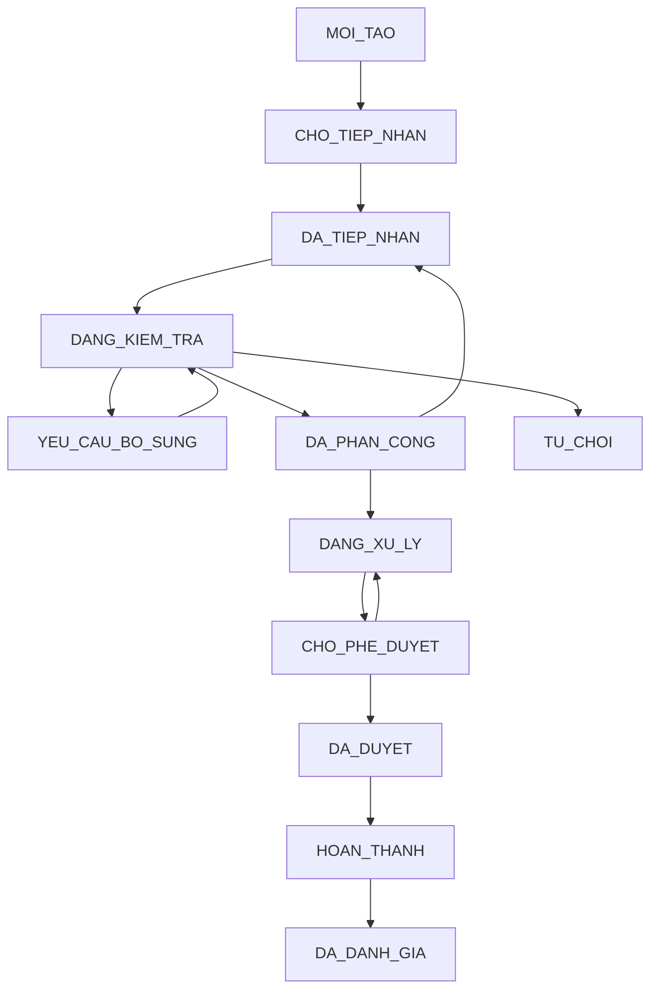
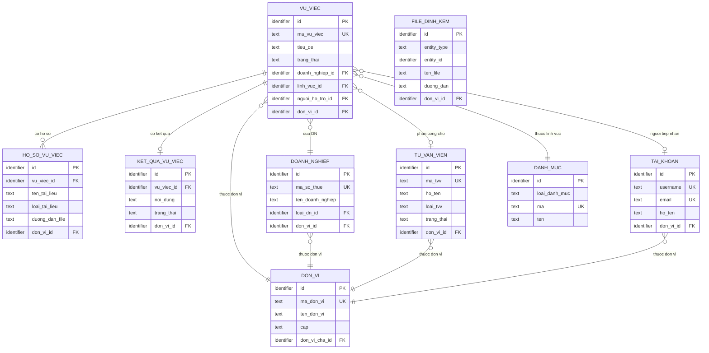
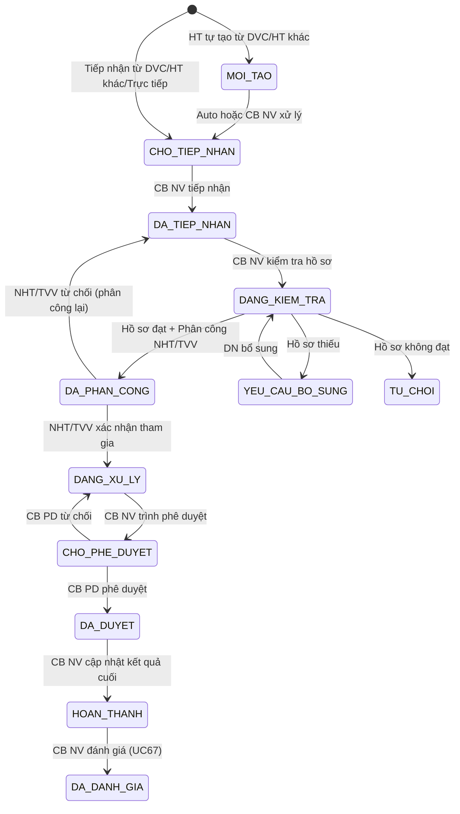

# SRS — Section 3.2.8: Quản lý Vụ việc Trợ giúp Pháp lý

**Dự án:** Phần mềm hỗ trợ pháp lý doanh nghiệp
**Phiên bản SRS:** 3.0
**Nhóm:** V.I — Quản lý Vụ việc Trợ giúp Pháp lý
**UC range:** UC 51 – UC 67 + UC mới
**Số FR:** 19
**File chính:** `srs-v3.md` Section 3.2

---

## Mục lục file này

- [1. Tổng quan nhóm](#1-tổng-quan-nhóm)
- [2. Yêu cầu chức năng chi tiết](#2-yêu-cầu-chức-năng-chi-tiết)
- [3. Màn hình chức năng](#3-màn-hình-chức-năng)
- [4. Entity liên quan](#4-entity-liên-quan)
- [5. State Machine liên quan](#5-state-machine-liên-quan)
- [6. Business Rules liên quan](#6-business-rules-liên-quan)

---

## 1. Tổng quan nhóm

**Mục đích:** Tiếp nhận, kiểm tra, phân công, xử lý và đánh giá vụ việc hỗ trợ pháp lý cho DNNVV theo NĐ55/2019/NĐ-CP.

**Entity chính:** VU_VIEC, HO_SO_YEU_CAU, TAI_LIEU_VU_VIEC, PHAN_CONG_VU_VIEC, KET_QUA_VU_VIEC, DANH_GIA_VU_VIEC, LICH_SU_VU_VIEC, THONG_BAO

**Tác nhân chính:** CB NV, CB PD, NHT, DN, HT TTHC BTP (Hệ thống)

**Kênh tiếp nhận:** DVC (qua LGSP), Hệ thống khác (REST API trực tiếp), Trực tiếp nhập trên PM

**SLA:** 10 ngày làm việc (NĐ55/2019 Điều 9) — BR-SLA-01

**State Machine — SM-VUVIEC (12 trạng thái):**

**Tiêu chí phân công NHT/TVV (BR-CALC-04 — NĐ55 Điều 4):**
1. Ưu tiên DN do phụ nữ làm chủ (+3 điểm)
2. Ưu tiên DN sử dụng nhiều lao động nữ (+2 điểm)
3. Ưu tiên DN sử dụng ≥30% lao động khuyết tật (+2 điểm)
4. Ưu tiên FIFO (+1 điểm)
5. Kết hợp: lĩnh vực + địa bàn + workload cân bằng

**Auto-transition AT-03:** CB NV nhấn "Trình phê duyệt" → auto CHO_PHE_DUYET + thông báo CB PD

---

## 2. Yêu cầu chức năng chi tiết

---

### FR-V.I-01: Quản lý hồ sơ yêu cầu HTPL (UC51)

**UC Reference:** UC 51 | **Priority:** Essential | **Stability:** High
**Màn hình:** SCR-V.I-01

**Mô tả:** Quản lý danh sách hồ sơ yêu cầu HTPL. Hỗ trợ tìm kiếm, lọc theo trạng thái, lĩnh vực, kênh tiếp nhận, mức SLA.

**Tác nhân:** CB NV (TW/BN/ĐP)

**Preconditions:**

| # | Điều kiện |
|---|----------|
| PRE-01 | User đã đăng nhập (BR-AUTH-01) |
| PRE-02 | User có quyền "Quản lý vụ việc" (UC115) |
| PRE-03 | phân quyền theo đơn vị áp dụng |

**Inputs:**

| # | Tên field | Kiểu logic | Bắt buộc | Ràng buộc |
|---|----------|-----------|----------|-----------|
| 1 | tu_khoa | text | N | Tìm theo mã HS/tên DN |
| 2 | trang_thai | text | N | Lọc theo trạng thái SM-VUVIEC |
| 3 | linh_vuc_id | identifier | N | Lĩnh vực PL |
| 4 | kenh_tiep_nhan | text | N | DVC / HE_THONG_KHAC / TRUC_TIEP / BUU_CHINH / DIEN_THOAI |
| 5 | tu_ngay | date | N | Từ ngày |
| 6 | den_ngay | date | N | Đến ngày |
| 7 | muc_sla | text | N | BINH_THUONG / SAP_HET / QUA_HAN |

**Processing:**

| Bước | Mô tả xử lý | BR áp dụng |
|------|-------------|-----------|
| 1 | Kiểm tra quyền và phân quyền theo đơn vị | BR-AUTH-01, BR-AUTH-08 |
| 2 | Lấy danh sách VU_VIEC chưa xóa, trong phạm vi đơn vị | BR-DATA-02 |
| 3 | Kết hợp thông tin DOANH_NGHIEP, DANH_MUC | — |
| 4 | Tính mức SLA thời gian thực | BR-SLA-01 |
| 5 | Phân trang (mặc định 20/trang) | BR-DATA-07 |

**Outputs:**

| # | Tên field | Kiểu logic | Mô tả |
|---|----------|-----------|-------|
| 1 | id | identifier | ID vụ việc |
| 2 | ma_vu_viec | text | Mã hồ sơ |
| 3 | ten_doanh_nghiep | text | Tên DN |
| 4 | linh_vuc | text | Lĩnh vực PL |
| 5 | kenh_tiep_nhan | text | Kênh tiếp nhận |
| 6 | trang_thai | text | Trạng thái SM-VUVIEC |
| 7 | nguoi_ho_tro | text | TVV phân công (nếu có) |
| 8 | ngay_tiep_nhan | datetime | Ngày tiếp nhận |
| 9 | deadline_sla | date | Deadline SLA |
| 10 | muc_sla | text | Mức cảnh báo SLA |
| 11 | total_count | number | Tổng bản ghi |

**Postconditions:** Read-only (quản lý danh sách).

**Error Handling:**

| # | Điều kiện lỗi | Mã lỗi | Phản hồi hệ thống | Severity |
|---|--------------|--------|-------------------|----------|
| E1 | Không có kết quả | INF-VV-01 | "Không tìm thấy hồ sơ phù hợp" | INFO |

**Acceptance Criteria:**
- **Given** CB NV truy cập "Hồ sơ yêu cầu HTPL" **When** hiển thị **Then** danh sách HS thuộc đơn vị, phân trang, phân quyền TW/BN/ĐP
- **Given** CB NV xem chi tiết **When** chọn HS **Then** hiển thị đầy đủ + tài liệu đính kèm
- **Given** CB NV lọc theo trạng thái/lĩnh vực/thời gian **When** áp dụng **Then** kết quả AND

**Cross-ref:** SM-VUVIEC, BR-SLA-01, BR-AUTH-01, Entity VU_VIEC, DOANH_NGHIEP

---

### FR-V.I-02: Gửi hồ sơ yêu cầu HTPL (UC52)

**UC Reference:** UC 52 | **Priority:** Essential | **Stability:** High
**Màn hình:** SCR-V.I-02 (chuyên trang)

**Mô tả:** DN gửi hồ sơ yêu cầu HTPL qua chuyên trang.

**Tác nhân:** Doanh nghiệp

**Preconditions:**

| # | Điều kiện |
|---|----------|
| PRE-01 | DN đã đăng nhập trên chuyên trang |

**Inputs:**

| # | Tên field | Kiểu logic | Bắt buộc | Ràng buộc |
|---|----------|-----------|----------|-----------|
| 1 | ten_doanh_nghiep | text | Y | Tên DN |
| 2 | ma_so_thue | text | Y | MST |
| 3 | dia_chi | text | Y | Địa chỉ |
| 4 | nguoi_dai_dien | text | Y | Người đại diện |
| 5 | noi_dung_yeu_cau | text (long) | Y | Nội dung yêu cầu HTPL |
| 6 | linh_vuc_id | identifier | Y | Lĩnh vực PL (FK → DANH_MUC) |
| 7 | file_dinh_kem | FILE[] | N | Tài liệu đính kèm |

**Processing:**

| Bước | Mô tả xử lý | BR áp dụng |
|------|-------------|-----------|
| 1 | Xác nhận dữ liệu đầu vào | — |
| 2 | Tự động sinh mã: VV-{TINH}-{YYYYMMDD}-{SEQ} | BR-DATA-04 |
| 3 | Tạo bản ghi VU_VIEC, trạng thái = MOI_TAO | SM-VUVIEC |
| 4 | Lưu tài liệu đính kèm | — |
| 5 | Gửi thông báo cho CB NV Sở TP | — |
| 6 | Ghi nhật ký thao tác | BR-DATA-05 |

**Outputs:** Không có output trực tiếp (xác nhận gửi thành công).

**Postconditions:**
- Hồ sơ yêu cầu được tạo, chờ tiếp nhận
- CB NV nhận thông báo

**Error Handling:**

| # | Điều kiện lỗi | Mã lỗi | Phản hồi hệ thống | Severity |
|---|--------------|--------|-------------------|----------|
| E1 | Nội dung yêu cầu trống | ERR-GHS-01 | "Nội dung yêu cầu là bắt buộc" | ERROR |
| E2 | MST không hợp lệ | ERR-GHS-02 | "Mã số thuế không hợp lệ" | ERROR |

**Acceptance Criteria:**
- **Given** DN truy cập chuyên trang **When** chọn "Gửi yêu cầu HTPL" **Then** form nhập
- **Given** DN nhập đủ + upload tài liệu **When** gửi **Then** tạo HS mới + thông báo thành công

**Cross-ref:** SM-VUVIEC, Entity VU_VIEC, TAI_LIEU_VU_VIEC

---

### FR-V.I-03: Tiếp nhận hồ sơ qua DVC (UC53)

**UC Reference:** UC 53 | **Priority:** Essential | **Stability:** Medium

**Mô tả:** Tiếp nhận HS từ HT TTHC BTP qua LGSP. Tự động tạo VU_VIEC.

**Tác nhân:** Hệ thống TTHC BTP (qua LGSP)

**Preconditions:**

| # | Điều kiện |
|---|----------|
| PRE-01 | API inbound từ HT TTHC BTP hoạt động |
| PRE-02 | Kết nối LGSP sẵn sàng |

**Inputs:**

| # | Tên field | Kiểu logic | Bắt buộc | Ràng buộc |
|---|----------|-----------|----------|-----------|
| 1 | ma_ho_so_dvc | text | Y | Mã hồ sơ từ DVC |
| 2 | ten_doanh_nghiep | text | Y | Tên DN |
| 3 | ma_so_thue | text | Y | MST |
| 4 | dia_chi | text | Y | Địa chỉ |
| 5 | nguoi_dai_dien | text | Y | Người đại diện |
| 6 | noi_dung | text (long) | Y | Nội dung yêu cầu |
| 7 | linh_vuc | text | Y | Mã lĩnh vực |
| 8 | tai_lieu | FILE[] | N | Danh sách file (base64 hoặc URL) |

**Processing:**

| Bước | Mô tả xử lý | BR áp dụng |
|------|-------------|-----------|
| 1 | Nhận request qua API LGSP | — |
| 2 | Xác nhận cấu trúc JSON | — |
| 3 | Kiểm tra mã hồ sơ DVC chưa tồn tại (idempotent) | — |
| 4 | Mapping lĩnh vực → danh mục hệ thống | — |
| 5 | Tự động sinh mã vụ việc | BR-DATA-04 |
| 6 | Tạo VU_VIEC, trạng thái = CHO_TIEP_NHAN, kênh = DVC | SM-VUVIEC |
| 7 | Lưu tài liệu đính kèm | — |
| 8 | Phản hồi về HT TTHC BTP | — |
| 9 | Gửi thông báo CB NV | — |
| 10 | Ghi nhật ký thao tác | BR-DATA-05 |

**Outputs:**

| # | Tên field | Kiểu logic | Mô tả |
|---|----------|-----------|-------|
| 1 | success | boolean | true/false |
| 2 | ma_vu_viec | text | Mã VV trong PM |
| 3 | trang_thai | text | CHO_TIEP_NHAN |
| 4 | error_code | text | Mã lỗi (nếu failed) |
| 5 | error_message | text | Mô tả lỗi |

**Postconditions:**
- Hồ sơ từ DVC được tạo tự động
- CB NV nhận thông báo
- Trạng thái phản hồi về HT TTHC BTP

**Error Handling:**

| # | Điều kiện lỗi | Mã lỗi | Phản hồi hệ thống | Severity |
|---|--------------|--------|-------------------|----------|
| E1 | JSON không hợp lệ | ERR-DVC-01 | "Cấu trúc dữ liệu không hợp lệ" | ERROR |
| E2 | Mã HS DVC trùng | ERR-DVC-02 | "Hồ sơ đã tiếp nhận trước đó" | ERROR |
| E3 | Lĩnh vực không mapping | ERR-DVC-03 | "Mã lĩnh vực không tồn tại" | ERROR |

**Acceptance Criteria:**
- **Given** HT TTHC BTP gửi HS qua LGSP **When** PM nhận **Then** kiểm tra cấu trúc, tạo HS mới, sinh mã
- **Given** tiếp nhận thành công **When** xử lý **Then** phản hồi trạng thái về HT TTHC BTP
- **Given** dữ liệu không hợp lệ **When** validate **Then** trả mã lỗi + mô tả

**Cross-ref:** API LGSP inbound, SM-VUVIEC, Entity VU_VIEC

---

### FR-V.I-04: Nhập hồ sơ yêu cầu thủ công (UC54)

**UC Reference:** UC 54 | **Priority:** Essential | **Stability:** High
**Màn hình:** SCR-V.I-02

**Mô tả:** CB NV nhập hồ sơ thủ công (trực tiếp/điện thoại). Trạng thái bắt đầu = DA_TIEP_NHAN (bỏ qua MOI_TAO, CHO_TIEP_NHAN).

**Preconditions:**

| # | Điều kiện |
|---|----------|
| PRE-01 | User đã đăng nhập, có quyền "Nhập hồ sơ VV" |

**Inputs:**

| # | Tên field | Kiểu logic | Bắt buộc | Ràng buộc |
|---|----------|-----------|----------|-----------|
| 1 | ten_doanh_nghiep | text | Y | Tên DN |
| 2 | ma_so_thue | text | Y | MST |
| 3 | dia_chi | text | Y | Địa chỉ |
| 4 | nguoi_dai_dien | text | Y | Người đại diện |
| 5 | noi_dung_yeu_cau | text (long) | Y | Nội dung yêu cầu |
| 6 | linh_vuc_id | identifier | Y | Lĩnh vực PL (FK → DANH_MUC) |
| 7 | kenh_tiep_nhan | text | Y | TRUC_TIEP / DIEN_THOAI |
| 8 | file_scan | FILE[] | N | File scan hồ sơ giấy (nếu có) |

**Processing:**

| Bước | Mô tả xử lý | BR áp dụng |
|------|-------------|-----------|
| 1 | Kiểm tra quyền | BR-AUTH-01 |
| 2 | Xác nhận dữ liệu đầu vào | — |
| 3 | Tự động sinh mã vụ việc | BR-DATA-04 |
| 4 | Kiểm tra/tạo DOANH_NGHIEP nếu MST chưa tồn tại | — |
| 5 | Tạo VU_VIEC, trạng thái = DA_TIEP_NHAN | SM-VUVIEC |
| 6 | Tính deadline SLA: ngày tiếp nhận + 10 ngày làm việc | BR-SLA-01 |
| 7 | Lưu tài liệu đính kèm | — |
| 8 | Ghi nhật ký thao tác | BR-DATA-05 |

**Outputs:** Không có output trực tiếp (xác nhận lưu thành công, redirect chi tiết VV).

**Postconditions:**
- Hồ sơ được tạo với trạng thái DA_TIEP_NHAN
- Deadline SLA được tính tự động
- DN mới được tạo nếu chưa tồn tại

**Error Handling:**

| # | Điều kiện lỗi | Mã lỗi | Phản hồi hệ thống | Severity |
|---|--------------|--------|-------------------|----------|
| E1 | Nội dung trống | ERR-NH-01 | "Nội dung yêu cầu là bắt buộc" | ERROR |
| E2 | MST format lỗi | ERR-NH-02 | "Mã số thuế không hợp lệ" | ERROR |

**Acceptance Criteria:**
- **Given** CB NV chọn "Nhập hồ sơ thủ công" **When** form hiển thị **Then** nhập thông tin DN + nội dung
- **Given** CB NV nhập đủ **When** lưu **Then** tạo HS + sinh mã + ghi nguồn "Trực tiếp/Điện thoại"

**Cross-ref:** SM-VUVIEC, BR-SLA-01, Entity VU_VIEC, DOANH_NGHIEP

---

### FR-V.I-05: Tiếp nhận hồ sơ từ hệ thống khác (UC55)

**UC Reference:** UC 55 | **Priority:** Essential | **Stability:** High

**Mô tả:** Tiếp nhận HS từ hệ thống bên ngoài qua REST API trực tiếp (không qua LGSP). CB NV quản lý danh sách, chi tiết, tìm kiếm, xóa.

**Tác nhân:** Hệ thống bên ngoài (API Inbound), CB NV (CMS)

**Preconditions:**

| # | Điều kiện |
|---|----------|
| PRE-01 | (API Inbound) Hệ thống nguồn đã đăng ký, có API key hợp lệ (kết nối REST trực tiếp, không qua LGSP/NDXP) |
| PRE-02 | (CMS) User đã đăng nhập, có quyền "Quản lý hồ sơ VV" |

**Inputs (API Inbound):**

| # | Tên field | Kiểu logic | Bắt buộc | Ràng buộc |
|---|----------|-----------|----------|-----------|
| 1 | he_thong_nguon | text | Y | Mã định danh hệ thống gửi (đã đăng ký trực tiếp với PM) |
| 2 | ma_ho_so_nguon | text | Y | Mã hồ sơ trên hệ thống nguồn (dùng để check trùng + đối chiếu) |
| 3 | thong_tin_dn | text (JSON) | Y | Thông tin DN: {ten, ma_so_thue, dia_chi, nguoi_dai_dien, sdt, email} |
| 4 | noi_dung_yeu_cau | text (long) | Y | Nội dung yêu cầu hỗ trợ pháp lý |
| 5 | linh_vuc_id | identifier | N | FK → DANH_MUC (lĩnh vực PL), nếu HT nguồn cung cấp |
| 6 | file_dinh_kem | FILE[] | N | Danh sách tệp đính kèm (base64) |

**Inputs (CMS):**

| # | Tên field | Kiểu logic | Bắt buộc | Ràng buộc |
|---|----------|-----------|----------|-----------|
| 1 | keyword | text | N | Từ khóa tìm kiếm (mã hồ sơ, tên DN, HT nguồn) |
| 2 | he_thong_nguon_filter | text | N | Lọc theo hệ thống nguồn |
| 3 | tu_ngay / den_ngay | date | N | Lọc theo khoảng thời gian tiếp nhận |
| 4 | page / page_size | number | N | Phân trang (default 1/20) |

**Processing (API Inbound):**

| Bước | Mô tả xử lý | BR áp dụng |
|------|-------------|-----------|
| 1 | Xác thực API key + HTTPS TLS 1.2+ (kết nối trực tiếp) | BR-AUTH-01 |
| 2 | Xác nhận JSON schema: kiểm tra trường bắt buộc, format | — |
| 3 | Kiểm tra hệ thống nguồn đã đăng ký trong DANH_MUC (loai = 'HE_THONG_NGUON', trang_thai = 1) | — |
| 4 | Kiểm tra trùng: đếm số VV có cùng hệ thống nguồn + mã hồ sơ nguồn + chưa xóa | — |
| 5 | Tạo/liên kết DOANH_NGHIEP theo mã số thuế (UPSERT) | BR-DATA-03 |
| 6 | Tạo VU_VIEC: kênh = HE_THONG_KHAC, trạng thái = CHO_TIEP_NHAN | SM-VUVIEC |
| 7 | Lưu file đính kèm (decode base64, quét virus) | BR-DATA-06 |
| 8 | Ghi nhật ký thao tác (action = 'TIEP_NHAN_TU_HT_KHAC') | BR-DATA-05 |
| 9 | Gửi thông báo CB NV phụ trách (in-app + email) | BR-NOTIF-01 |
| 10 | Trả response: {ma_vu_viec, trang_thai, ngay_tiep_nhan} | — |

**Processing (CMS):**

| Bước | Mô tả xử lý | BR áp dụng |
|------|-------------|-----------|
| 1 | Kiểm tra quyền + phân quyền theo đơn vị | BR-AUTH-01, BR-AUTH-08 |
| 2 | Xem danh sách: lấy VV kênh HE_THONG_KHAC chưa xóa, áp dụng filter + phân trang | BR-DATA-07 |
| 3 | Xem chi tiết: lấy VV kèm thông tin DN + file đính kèm | — |
| 4 | Tìm kiếm theo keyword (mã hồ sơ, tên DN, HT nguồn) + bộ lọc thời gian | — |
| 5 | Xóa mềm VV chưa tiếp nhận (chỉ trạng thái CHO_TIEP_NHAN) | BR-DATA-01 |
| 6 | Ghi nhật ký thao tác cho mọi thao tác | BR-DATA-05 |

**Outputs (API Inbound):**

| # | Tên field | Kiểu logic | Mô tả |
|---|----------|-----------|-------|
| 1 | ma_vu_viec | text | Mã vụ việc (auto-gen: VV-{TINH}-YYYYMMDD-SEQ) |
| 2 | trang_thai | text | 'CHO_TIEP_NHAN' |
| 3 | ngay_tiep_nhan | datetime | Thời điểm hệ thống ghi nhận |

**Outputs (CMS — Danh sách):**

| # | Tên field | Kiểu logic | Mô tả |
|---|----------|-----------|-------|
| 1 | id | identifier | ID bản ghi |
| 2 | ma_vu_viec | text | Mã vụ việc |
| 3 | he_thong_nguon | text | Tên hệ thống gửi |
| 4 | ma_ho_so_nguon | text | Mã hồ sơ trên HT nguồn |
| 5 | ten_doanh_nghiep | text | Tên DN |
| 6 | noi_dung_yeu_cau | text (long) | Nội dung yêu cầu (rút gọn) |
| 7 | trang_thai | text | Trạng thái vụ việc |
| 8 | ngay_tiep_nhan | datetime | Ngày tiếp nhận |
| 9 | total_count | number | Tổng số bản ghi (phân trang) |

**Postconditions:**

| Thao tác | Postcondition |
|----------|--------------|
| API Inbound | VU_VIEC mới với trang_thai = 'CHO_TIEP_NHAN', AUDIT_LOG ghi nhận, THONG_BAO gửi CB NV |
| CMS Xóa | VU_VIEC.is_deleted = 1 (chỉ khi trang_thai = 'CHO_TIEP_NHAN'), AUDIT_LOG ghi nhận |

**Error Handling:**

| # | Điều kiện lỗi | Mã lỗi | Phản hồi hệ thống | Severity |
|---|--------------|--------|-------------------|----------|
| E1 | HT nguồn chưa đăng ký | ERR-INTG-01 | "Hệ thống chưa được đăng ký" | ERROR |
| E2 | Hồ sơ trùng (ma_ho_so_nguon + he_thong_nguon) | ERR-INTG-02 | "Hồ sơ đã tồn tại" | ERROR |
| E3 | JSON schema không hợp lệ | ERR-INTG-03 | "Dữ liệu không hợp lệ" | ERROR |
| E4 | File đính kèm vượt 20MB | ERR-FILE-01 | "Tệp vượt quá 20MB" | ERROR |
| E5 | File chứa mã độc | ERR-FILE-02 | "Tệp chứa mã độc, không thể tiếp nhận" | ERROR |
| E6 | User không có quyền (CMS) | ERR-AUTH-01 | "Bạn không có quyền thực hiện chức năng này" | ERROR |
| E7 | Xóa hồ sơ đã tiếp nhận | ERR-VV-01 | "Không thể xóa hồ sơ đã được tiếp nhận" | ERROR |

**Edge Cases:**

| EC | Điều kiện | Xử lý |
|----|-----------|-------|
| EC-V.I-05-01 | thong_tin_dn nested fields validation | ma_so_thue: REGEX ^[0-9]{10,13}$; ten: max 500 chars; email: RFC 5322; sdt: max 15 digits. Trả ERR-INTG-03 với chi tiết trường lỗi |
| EC-V.I-05-02 | noi_dung_yeu_cau TEXT unbounded | Max 50KB (51200 bytes). Vượt quá → ERR-INTG-05 |
| EC-V.I-05-03 | Concurrent DOANH_NGHIEP UPSERT on same ma_so_thue | Tạo hoặc cập nhật nguyên tử (nếu đã tồn tại thì cập nhật). Đảm bảo tuần tự cho thao tác này |
| EC-V.I-05-04 | Idempotency on retry | Nếu ma_ho_so_nguon + he_thong_nguon đã tồn tại → trả HTTP 200 với bản ghi hiện có (KHÔNG trả error). Chỉ trả ERR-INTG-02 nếu dữ liệu khác nhau |
| EC-V.I-05-05 | Rate limiting inbound API | 50 req/min/he_thong_nguon (sliding window). Vượt quá → HTTP 429 + Retry-After |
| EC-V.I-05-06 | File count + total size | Max 10 files/request, max 100MB tổng. Vượt quá → ERR-FILE-03 |
| EC-V.I-05-07 | HTTP request body size | Max 150MB (bao gồm base64 overhead). Server reject trước JSON parse → HTTP 413 |
| EC-V.I-05-08 | don_vi_id assignment | Resolve don_vi_id từ DANH_MUC 'HE_THONG_NGUON'.don_vi_mac_dinh_id. Nếu không có mapping → gán don_vi_id = TW + cảnh báo QTHT |
| EC-V.I-05-09 | SLA clock start | deadline tính từ thời điểm CB NV chuyển CHO_TIEP_NHAN → DA_TIEP_NHAN (KHÔNG từ API receipt) |
| EC-V.I-05-10 | IP whitelist cho HT khác | Mỗi he_thong_nguon có trường ip_whitelist. Request từ IP ngoài whitelist → ERR-AUTH-11 |
| EC-V.I-05-11 | Partial failure on virus scan | Transaction scope: steps 5-7 trong cùng DB transaction. Nếu bất kỳ file nào fail virus scan → rollback toàn bộ |
| EC-V.I-05-12 | Invalid linh_vuc_id FK | Nếu linh_vuc_id provided và không tồn tại trong DANH_MUC → ERR-INTG-04 |
| EC-V.I-05-13 | phân quyền theo đơn vị on CMS DELETE | Xóa mềm phải kiểm tra phân quyền dữ liệu cho mọi thao tác CMS, không chỉ LIST |

**Acceptance Criteria:**
- **Given** HT bên ngoài gửi hồ sơ qua API trực tiếp (REST JSON, HTTPS) **When** dữ liệu hợp lệ **Then** tạo VU_VIEC + thông báo CB NV
- **Given** HT bên ngoài gửi hồ sơ trùng **When** kiểm tra ma_ho_so_nguon **Then** trả lỗi ERR-INTG-02
- **Given** CB NV mở danh sách hồ sơ từ HT khác **When** có dữ liệu **Then** hiển thị danh sách + lọc + phân trang
- **Given** CB NV tìm kiếm **When** nhập keyword **Then** hiển thị kết quả theo mã hồ sơ, tên DN, HT nguồn

**Cross-ref:** SM-VUVIEC, BR-SLA-01, Entity VU_VIEC, DOANH_NGHIEP, FILE_DINH_KEM

---

### FR-V.I-06: Kiểm tra hồ sơ yêu cầu (UC56)

**UC Reference:** UC 56 | **Priority:** Essential | **Stability:** High
**Màn hình:** SCR-V.I-03 (Accordion 4 — Kết quả Kiểm tra)

**Mô tả:** CB NV kiểm tra tính đầy đủ và hợp lệ của HS theo checklist UC106 (6 hạng mục Mẫu 01 NĐ55).

**Preconditions:**

| # | Điều kiện |
|---|----------|
| PRE-01 | User đã đăng nhập |
| PRE-02 | VV ở trạng thái DA_TIEP_NHAN hoặc DANG_KIEM_TRA |

**Inputs:**

| # | Tên field | Kiểu logic | Bắt buộc | Ràng buộc |
|---|----------|-----------|----------|-----------|
| 1 | vu_viec_id | identifier | Y | Vụ việc kiểm tra |
| 2 | checklist | text (JSON) | Y | Array: [{hang_muc_id, dat: 0/1, ghi_chu}] |
| 3 | ket_luan | text | Y | DAT / KHONG_DAT / YEU_CAU_BO_SUNG |
| 4 | ly_do | text | Cond | Bắt buộc nếu KHONG_DAT hoặc YEU_CAU_BO_SUNG |

**Hạng mục kiểm tra (UC106):**
1. Văn bản đề nghị hỗ trợ (Mẫu 01 NĐ55)
2. Bản chụp Giấy CNĐKKD
3. Tờ khai xác định quy mô DN (NĐ39/2018)
4. Hợp đồng dịch vụ TVPL
5. Văn bản TVPL (bản đầy đủ)
6. Văn bản TVPL (bản loại bỏ bí mật KD)

**Processing:**

| Bước | Mô tả xử lý | BR áp dụng |
|------|-------------|-----------|
| 1 | Kiểm tra quyền + phân quyền theo đơn vị | BR-AUTH-01 |
| 2 | Chuyển trạng thái DANG_KIEM_TRA (nếu chưa) | SM-VUVIEC |
| 3 | Tải checklist từ cấu hình UC106 | — |
| 4 | CB NV đánh dấu từng hạng mục | — |
| 5 | Nếu DAT: chuyển trạng thái DA_PHAN_CONG | SM-VUVIEC |
| 6 | Nếu YEU_CAU_BO_SUNG: chuyển trạng thái, gửi thông báo DN | SM-VUVIEC |
| 7 | Nếu KHONG_DAT: chuyển trạng thái TU_CHOI, gửi thông báo DN | SM-VUVIEC |
| 8 | Ghi lịch sử xử lý | — |
| 9 | Ghi nhật ký thao tác | BR-DATA-05 |

**Outputs:** Không có output riêng (trạng thái VV được cập nhật, thông báo gửi nếu cần).

**Postconditions:**
- Kết quả kiểm tra được ghi nhận
- Trạng thái VV chuyển theo SM-VUVIEC
- DN nhận thông báo nếu cần bổ sung hoặc từ chối

**Error Handling:**

| # | Điều kiện lỗi | Mã lỗi | Phản hồi hệ thống | Severity |
|---|--------------|--------|-------------------|----------|
| E1 | VV không ở trạng thái hợp lệ | ERR-KT-01 | "Vụ việc không ở trạng thái cho phép kiểm tra" | ERROR |
| E2 | Thiếu lý do bổ sung/từ chối | ERR-KT-02 | "Lý do là bắt buộc" | ERROR |

**Acceptance Criteria:**
- **Given** CB NV xem HS chờ kiểm tra **When** đánh giá **Then** checklist theo UC106
- **Given** HS chưa đủ **When** CB NV gửi yêu cầu bổ sung **Then** trạng thái → YEU_CAU_BO_SUNG + thông báo DN
- **Given** CB NV kiểm tra xong **When** kết luận Đạt **Then** trạng thái → DA_PHAN_CONG

**Cross-ref:** SM-VUVIEC, UC106, Entity VU_VIEC, LICH_SU_VU_VIEC

---

### FR-V.I-07: Quản lý hồ sơ vụ việc (UC57)

**UC Reference:** UC 57 | **Priority:** Essential | **Stability:** High
**Màn hình:** SCR-V.I-03

**Mô tả:** Xem chi tiết, chỉnh sửa, upload tài liệu bổ sung cho vụ việc.

**Preconditions:**

| # | Điều kiện |
|---|----------|
| PRE-01 | User đã đăng nhập |
| PRE-02 | VV tồn tại trong hệ thống |

**Inputs:**

| # | Tên field | Kiểu logic | Bắt buộc | Ràng buộc |
|---|----------|-----------|----------|-----------|
| 1 | vu_viec_id | identifier | Y | VV cần chỉnh sửa |
| 2 | noi_dung_yeu_cau | text (long) | N | Cập nhật nội dung |
| 3 | file_bo_sung | FILE[] | N | Upload tài liệu bổ sung |
| 4 | ghi_chu | text (long) | N | Ghi chú |

**Processing:**

| Bước | Mô tả xử lý | BR áp dụng |
|------|-------------|-----------|
| 1 | Kiểm tra quyền + phân quyền theo đơn vị | BR-AUTH-01 |
| 2 | Kiểm tra trạng thái cho phép sửa (NOT HOAN_THANH, DA_DANH_GIA) | SM-VUVIEC |
| 3 | Cập nhật VU_VIEC | — |
| 4 | Lưu tài liệu bổ sung | — |
| 5 | Ghi lịch sử thay đổi | — |
| 6 | Ghi nhật ký thao tác | BR-DATA-05 |

**Outputs:**

| # | Tên field | Kiểu logic | Mô tả |
|---|----------|-----------|-------|
| 1 | ma_vu_viec | text | Mã VV |
| 2 | ten_doanh_nghiep | text | Tên DN |
| 3 | noi_dung_yeu_cau | text (long) | Nội dung |
| 4 | linh_vuc | text | Lĩnh vực |
| 5 | trang_thai | text | Trạng thái hiện tại |
| 6 | nguoi_ho_tro | text | TVV phân công |
| 7 | lich_su | text (JSON) | Danh sách lịch sử xử lý |
| 8 | tai_lieu | FILE[] | Danh sách tài liệu |

**Postconditions:**
- VV được cập nhật thành công
- Lịch sử thay đổi được ghi nhận

**Error Handling:**

| # | Điều kiện lỗi | Mã lỗi | Phản hồi hệ thống | Severity |
|---|--------------|--------|-------------------|----------|
| E1 | VV ở trạng thái không cho phép sửa | ERR-VV-02 | "Không thể chỉnh sửa vụ việc đã hoàn thành" | ERROR |

**Acceptance Criteria:**
- **Given** CB NV truy cập "Hồ sơ vụ việc" **When** hiển thị **Then** danh sách VV thuộc đơn vị
- **Given** CB NV xem chi tiết **When** chọn VV **Then** hiển thị thông tin + trạng thái + lịch sử xử lý
- **Given** CB NV chỉnh sửa **When** upload tài liệu bổ sung **Then** validate + lưu, ghi audit

**Cross-ref:** SM-VUVIEC, Entity VU_VIEC, TAI_LIEU_VU_VIEC, LICH_SU_VU_VIEC

---

### FR-V.I-08: Tìm kiếm hồ sơ (UC58)

**UC Reference:** UC 58 | **Priority:** Essential | **Stability:** High
**Màn hình:** SCR-V.I-01

**Mô tả:** Tìm kiếm VV theo từ khóa, lĩnh vực, trạng thái, kênh tiếp nhận, thời gian.

**Preconditions:**

| # | Điều kiện |
|---|----------|
| PRE-01 | User đã đăng nhập |

**Inputs:**

| # | Tên field | Kiểu logic | Bắt buộc | Ràng buộc |
|---|----------|-----------|----------|-----------|
| 1 | tu_khoa | text | N | Tìm theo mã VV/tên DN |
| 2 | linh_vuc_id | identifier | N | Lĩnh vực PL |
| 3 | trang_thai | text | N | Trạng thái vụ việc |
| 4 | kenh_tiep_nhan | text | N | DVC / HE_THONG_KHAC / TRUC_TIEP / BUU_CHINH / DIEN_THOAI |
| 5 | tu_ngay | date | N | Từ ngày tiếp nhận |
| 6 | den_ngay | date | N | Đến ngày |

**Processing:**

| Bước | Mô tả xử lý | BR áp dụng |
|------|-------------|-----------|
| 1 | Kiểm tra quyền và phân quyền | BR-AUTH-01, BR-AUTH-08 |
| 2 | Kết hợp tất cả điều kiện lọc (AND) | — |
| 3 | Tìm từ khóa trên mã VV, tên DN | — |
| 4 | Phân trang (20/trang) | BR-DATA-07 |

**Outputs:**

| # | Tên field | Kiểu logic | Mô tả |
|---|----------|-----------|-------|
| 1 | id | identifier | ID vụ việc |
| 2 | ma_vu_viec | text | Mã vụ việc |
| 3 | ten_doanh_nghiep | text | Tên DN |
| 4 | ten_linh_vuc | text | Lĩnh vực PL |
| 5 | kenh_tiep_nhan | text | Kênh tiếp nhận |
| 6 | trang_thai | text | Trạng thái |
| 7 | ngay_tiep_nhan | date | Ngày tiếp nhận |
| 8 | deadline_sla | date | Deadline SLA |
| 9 | nguoi_ho_tro | text | Tên NHT (nếu đã phân công) |
| 10 | total_count | number | Tổng bản ghi |

**Postconditions:** Read-only.

**Error Handling:**

| # | Điều kiện lỗi | Mã lỗi | Phản hồi hệ thống | Severity |
|---|--------------|--------|-------------------|----------|
| E1 | Không có kết quả | INF-VV-TK-01 | "Không tìm thấy hồ sơ phù hợp" | INFO |
| E2 | tu_ngay > den_ngay | ERR-VV-TK-01 | "Ngày bắt đầu phải trước ngày kết thúc" | ERROR |

**Acceptance Criteria:**
- **Given** CB NV nhập từ khóa (mã HS/tên DN) **When** tìm kiếm **Then** hiển thị kết quả, phân trang
- **Given** CB NV lọc theo lĩnh vực/trạng thái/thời gian **When** áp dụng **Then** kết quả lọc
- **Given** CB NV kết hợp nhiều điều kiện **When** tìm kiếm **Then** áp dụng AND

**Cross-ref:** Entity VU_VIEC, DOANH_NGHIEP

---

### FR-V.I-09: Lựa chọn người hỗ trợ (UC59)

**UC Reference:** UC 59 | **Priority:** Essential | **Stability:** Medium
**Màn hình:** SCR-V.I-03 (Modal Phân công NHT/TVV)

**Mô tả:** CB NV phân công NHT/TVV cho vụ việc, với gợi ý tự động theo tiêu chí NĐ55 Điều 4.

**Preconditions:**

| # | Điều kiện |
|---|----------|
| PRE-01 | User đã đăng nhập |
| PRE-02 | VV ở trạng thái DA_PHAN_CONG |

**Inputs:**

| # | Tên field | Kiểu logic | Bắt buộc | Ràng buộc |
|---|----------|-----------|----------|-----------|
| 1 | vu_viec_id | identifier | Y | Vụ việc cần phân công |
| 2 | tvv_id | identifier | Y | TVV được chọn (FK → TU_VAN_VIEN) |

**Processing (Gợi ý TVV — BR-CALC-04):**

| Bước | Mô tả xử lý | BR áp dụng |
|------|-------------|-----------|
| 1 | Lấy TVV đang hoạt động, đã công khai | SM-TVV |
| 2 | Lọc theo lĩnh vực phù hợp với VV | — |
| 3 | Lọc theo địa bàn phù hợp | — |
| 4 | Tính điểm ưu tiên DN: +3 phụ nữ làm chủ, +2 nhiều LĐ nữ, +2 ≥30% LĐ KT, +1 FIFO | BR-CALC-04 |
| 5 | Tính workload TVV: số VV đang xử lý | — |
| 6 | Sắp xếp: ưu tiên DN giảm dần, workload tăng dần, điểm ĐG giảm dần | — |
| 7 | Hiển thị danh sách gợi ý TVV | — |

**Processing (Phân công):**

| Bước | Mô tả xử lý | BR áp dụng |
|------|-------------|-----------|
| 1 | CB NV chọn TVV từ danh sách gợi ý | — |
| 2 | Tạo bản ghi PHAN_CONG_VU_VIEC | — |
| 3 | Cập nhật VV: trạng thái = DA_PHAN_CONG, nguoi_ho_tro_id = TVV được chọn | SM-VUVIEC |
| 4 | Gửi thông báo NHT | — |
| 5 | Ghi lịch sử | — |
| 6 | Ghi nhật ký thao tác | BR-DATA-05 |

**Outputs:**

| # | Tên field | Kiểu logic | Mô tả |
|---|----------|-----------|-------|
| 1 | tvv_id | identifier | ID TVV |
| 2 | ho_ten | text | Họ tên TVV |
| 3 | linh_vuc | text | Lĩnh vực chuyên môn |
| 4 | dia_ban | text | Địa bàn |
| 5 | workload | number | Số VV đang xử lý |
| 6 | diem_danh_gia | number | Điểm đánh giá TB |
| 7 | diem_uu_tien | number | Điểm ưu tiên tính toán |

**Postconditions:**
- TVV được phân công cho VV
- NHT nhận thông báo
- VV chuyển trạng thái DA_PHAN_CONG

**Error Handling:**

| # | Điều kiện lỗi | Mã lỗi | Phản hồi hệ thống | Severity |
|---|--------------|--------|-------------------|----------|
| E1 | VV không ở trạng thái hợp lệ | ERR-PC-01 | "Vụ việc không ở trạng thái cho phép phân công" | ERROR |
| E2 | TVV bị vô hiệu hóa | ERR-PC-02 | "TVV đã bị vô hiệu hóa" | ERROR |
| E3 | Không có TVV phù hợp | WRN-PC-01 | "Không tìm thấy TVV phù hợp lĩnh vực + địa bàn" | WARNING |

**Acceptance Criteria:**
- **Given** CB NV chọn phân công **When** hiển thị **Then** danh sách TVV gợi ý (lĩnh vực + địa bàn + workload)
- **Given** CB NV chọn TVV **When** xác nhận **Then** VV được gán, gửi thông báo NHT
- **Given** không có TVV phù hợp **When** hiển thị **Then** cảnh báo + cho phép tìm thủ công

**Cross-ref:** SM-VUVIEC, BR-CALC-04, NĐ55/2019 Điều 4, Entity VU_VIEC, TU_VAN_VIEN, PHAN_CONG_VU_VIEC

---

### FR-V.I-10: Xác nhận tham gia hỗ trợ (UC60)

**UC Reference:** UC 60 | **Priority:** Essential | **Stability:** High
**Màn hình:** SCR-V.I-03 (Action Xác nhận tham gia)

**Mô tả:** NHT xác nhận hoặc từ chối tham gia hỗ trợ VV.

**Preconditions:**

| # | Điều kiện |
|---|----------|
| PRE-01 | NHT đã đăng nhập |
| PRE-02 | VV ở trạng thái DA_PHAN_CONG, NHT được phân công |

**Inputs:**

| # | Tên field | Kiểu logic | Bắt buộc | Ràng buộc |
|---|----------|-----------|----------|-----------|
| 1 | vu_viec_id | identifier | Y | Vụ việc |
| 2 | quyet_dinh | text | Y | CHAP_NHAN / TU_CHOI |
| 3 | ly_do_tu_choi | text | Cond | Bắt buộc nếu TU_CHOI |

**Processing:**

| Bước | Mô tả xử lý | BR áp dụng |
|------|-------------|-----------|
| 1 | Kiểm tra NHT là người được phân công | BR-AUTH-01 |
| 2 | Nếu CHAP_NHAN: chuyển VV → DANG_XU_LY | SM-VUVIEC |
| 3 | Nếu TU_CHOI: chuyển VV → DA_TIEP_NHAN (phân công lại) | SM-VUVIEC |
| 4 | Cập nhật PHAN_CONG_VU_VIEC | — |
| 5 | Gửi thông báo CB NV | — |
| 6 | Ghi lịch sử | — |
| 7 | Ghi nhật ký thao tác | BR-DATA-05 |

**Outputs:** Không có output riêng (trạng thái VV được cập nhật).

**Postconditions:**
- Nếu chấp nhận: VV chuyển sang DANG_XU_LY
- Nếu từ chối: VV quay lại DA_TIEP_NHAN để chọn NHT khác
- CB NV nhận thông báo

**Error Handling:**

| # | Điều kiện lỗi | Mã lỗi | Phản hồi hệ thống | Severity |
|---|--------------|--------|-------------------|----------|
| E1 | NHT không phải người được phân công | ERR-XN-01 | "Bạn không được phân công cho vụ việc này" | ERROR |
| E2 | VV không ở trạng thái DA_PHAN_CONG | ERR-XN-02 | "Vụ việc không ở trạng thái chờ xác nhận" | ERROR |

**Acceptance Criteria:**
- **Given** NHT nhận thông báo phân công **When** xem chi tiết **Then** hiển thị thông tin VV + DN
- **Given** NHT xác nhận **When** chấp nhận **Then** VV → DANG_XU_LY
- **Given** NHT từ chối **When** nhập lý do **Then** VV quay lại DA_TIEP_NHAN để chọn NHT khác

**Cross-ref:** SM-VUVIEC, Entity VU_VIEC, PHAN_CONG_VU_VIEC

---

### FR-V.I-11: Trình phê duyệt (UC61)

**UC Reference:** UC 61 | **Priority:** Essential | **Stability:** High

**Mô tả:** CB NV trình VV cho CB PD phê duyệt. AT-03 auto-transition.

**Preconditions:**

| # | Điều kiện |
|---|----------|
| PRE-01 | User đã đăng nhập |
| PRE-02 | VV đã kiểm tra đạt + đã phân công NHT |

**Inputs:**

| # | Tên field | Kiểu logic | Bắt buộc | Ràng buộc |
|---|----------|-----------|----------|-----------|
| 1 | vu_viec_id | identifier | Y | VV cần trình duyệt |
| 2 | ghi_chu_trinh | text | N | Ghi chú khi trình |

**Processing:**

| Bước | Mô tả xử lý | BR áp dụng |
|------|-------------|-----------|
| 1 | Kiểm tra VV đủ điều kiện: đã kiểm tra + đã phân công | — |
| 2 | Chuyển VV → CHO_PHE_DUYET | SM-VUVIEC |
| 3 | Gửi thông báo CB PD cùng cấp | BR-FLOW-03 |
| 4 | Ghi lịch sử | — |
| 5 | Ghi nhật ký thao tác | BR-DATA-05 |

**Outputs:** Không có output riêng (trạng thái VV được cập nhật, thông báo gửi CB PD).

**Postconditions:**
- VV chuyển trạng thái CHO_PHE_DUYET
- CB PD cùng cấp nhận thông báo

**Error Handling:**

| # | Điều kiện lỗi | Mã lỗi | Phản hồi hệ thống | Severity |
|---|--------------|--------|-------------------|----------|
| E1 | VV chưa kiểm tra | ERR-TR-01 | "Hồ sơ chưa kiểm tra đạt" | ERROR |
| E2 | Chưa phân công NHT | ERR-TR-02 | "Chưa phân công người hỗ trợ" | ERROR |

**Acceptance Criteria:**
- **Given** CB NV chọn VV đã kiểm tra + phân công **When** nhấn "Trình Phê duyệt" **Then** VV → CHO_PHE_DUYET
- **Given** VV chưa đủ điều kiện **When** nhấn trình **Then** hệ thống cảnh báo

**Cross-ref:** SM-VUVIEC, BR-FLOW-03, Entity VU_VIEC

---

### FR-V.I-12: Thông báo kết quả tiếp nhận (UC62)

**UC Reference:** UC 62 | **Priority:** Essential | **Stability:** High
**Màn hình:** SCR-V.I-03 (Auto action — Thông báo KQ)

**Mô tả:** Gửi thông báo kết quả cho DN (in-app + email). Nếu HS qua DVC → đồng thời gửi trạng thái về HT TTHC BTP qua LGSP.

**Preconditions:**

| # | Điều kiện |
|---|----------|
| PRE-01 | User đã đăng nhập |
| PRE-02 | VV đã hoàn tất kiểm tra (DA_PHAN_CONG hoặc TU_CHOI) |

**Inputs:**

| # | Tên field | Kiểu logic | Bắt buộc | Ràng buộc |
|---|----------|-----------|----------|-----------|
| 1 | vu_viec_id | identifier | Y | Vụ việc |
| 2 | noi_dung_thong_bao | text (long) | Y | Nội dung thông báo cho DN |

**Processing:**

| Bước | Mô tả xử lý | BR áp dụng |
|------|-------------|-----------|
| 1 | Tạo thông báo in-app cho DN | — |
| 2 | Gửi email thông báo | — |
| 3 | Nếu HS qua DVC: gửi trạng thái về LGSP | — |
| 4 | Ghi lịch sử | — |
| 5 | Ghi nhật ký thao tác | BR-DATA-05 |

**Outputs:** Không có output riêng (thông báo được gửi, trạng thái đồng bộ nếu DVC).

**Postconditions:**
- DN nhận thông báo in-app + email
- Nếu kênh DVC: trạng thái phản hồi về HT TTHC BTP qua LGSP

**Error Handling:**

| # | Điều kiện lỗi | Mã lỗi | Phản hồi hệ thống | Severity |
|---|--------------|--------|-------------------|----------|
| E1 | Gửi email thất bại | WRN-TB-01 | "Gửi email thất bại, thử lại sau" | WARNING |
| E2 | LGSP không phản hồi | WRN-TB-02 | "Không thể đồng bộ với HT TTHC BTP" | WARNING |

**Acceptance Criteria:**
- **Given** CB NV hoàn tất kiểm tra **When** nhấn "Gửi Thông báo" **Then** gửi kết quả (Đạt/Không đạt) qua in-app + email
- **Given** HS qua DVC **When** gửi **Then** đồng thời gửi trạng thái về HT TTHC BTP qua LGSP

**Cross-ref:** API LGSP outbound, Entity THONG_BAO, VU_VIEC

---

### FR-V.I-13: Phê duyệt hồ sơ vụ việc (UC63)

**UC Reference:** UC 63 | **Priority:** Essential | **Stability:** High
**Màn hình:** SCR-V.I-03 (Action Phê duyệt) + SCR-V.I-01 (Batch PD)

**Mô tả:** CB PD phê duyệt hoặc từ chối VV. Hỗ trợ phê duyệt hàng loạt.

**Tác nhân:** CB PD (cùng cấp, BR-FLOW-03)

**Preconditions:**

| # | Điều kiện |
|---|----------|
| PRE-01 | CB PD đã đăng nhập |
| PRE-02 | VV ở trạng thái CHO_PHE_DUYET |
| PRE-03 | CB PD cùng cấp (BR-FLOW-03) |

**Inputs:**

| # | Tên field | Kiểu logic | Bắt buộc | Ràng buộc |
|---|----------|-----------|----------|-----------|
| 1 | vu_viec_id | identifier | Y | VV cần duyệt |
| 2 | quyet_dinh | text | Y | PHE_DUYET / TU_CHOI |
| 3 | ly_do | text | Cond | Bắt buộc nếu TU_CHOI |

**Processing:**

| Bước | Mô tả xử lý | BR áp dụng |
|------|-------------|-----------|
| 1 | Kiểm tra quyền + cùng cấp | BR-AUTH-01, BR-FLOW-03 |
| 2 | Nếu PHE_DUYET: chuyển trạng thái DA_DUYET | SM-VUVIEC |
| 3 | Nếu TU_CHOI: chuyển trạng thái TU_CHOI | SM-VUVIEC |
| 4 | Gửi thông báo CB NV | — |
| 5 | Ghi lịch sử | — |
| 6 | Ghi nhật ký thao tác | BR-DATA-05 |

**Outputs:** Không có output riêng (trạng thái VV được cập nhật).

**Postconditions:**
- Nếu phê duyệt: VV chuyển DA_DUYET
- Nếu từ chối: VV chuyển TU_CHOI
- CB NV nhận thông báo kết quả

**Error Handling:**

| # | Điều kiện lỗi | Mã lỗi | Phản hồi hệ thống | Severity |
|---|--------------|--------|-------------------|----------|
| E1 | VV không ở CHO_PHE_DUYET | ERR-PD-01 | "Vụ việc không ở trạng thái chờ phê duyệt" | ERROR |
| E2 | CB PD không cùng cấp | ERR-PD-02 | "Bạn không có quyền phê duyệt vụ việc này" | ERROR |
| E3 | Thiếu lý do từ chối | ERR-PD-03 | "Lý do từ chối là bắt buộc" | ERROR |

**Acceptance Criteria:**
- **Given** CB PD xem HS chờ duyệt **When** xem chi tiết **Then** hiển thị đầy đủ + kết quả kiểm tra + NHT
- **Given** CB PD phê duyệt **When** xác nhận **Then** ghi audit log
- **Given** CB PD từ chối **When** nhập lý do **Then** trạng thái → TU_CHOI, thông báo CB NV

**Cross-ref:** SM-VUVIEC, BR-FLOW-03, Entity VU_VIEC

---

### FR-V.I-14: DN nhận thông báo (UC64)

**UC Reference:** UC 64 | **Priority:** Essential | **Stability:** High

**Mô tả:** DN xem danh sách thông báo trên chuyên trang.

**Preconditions:**

| # | Điều kiện |
|---|----------|
| PRE-01 | DN đã đăng nhập trên chuyên trang |

**Inputs:** Không có input (tự động lấy theo DN đăng nhập).

**Processing:**

| Bước | Mô tả xử lý | BR áp dụng |
|------|-------------|-----------|
| 1 | Lấy danh sách THONG_BAO của DN | — |
| 2 | Phân trang, sắp xếp mới nhất trước | — |
| 3 | DN xem chi tiết → đánh dấu đã đọc | — |

**Outputs:**

| # | Tên field | Kiểu logic | Mô tả |
|---|----------|-----------|-------|
| 1 | id | identifier | ID thông báo |
| 2 | tieu_de | text | Tiêu đề thông báo |
| 3 | noi_dung | text (long) | Nội dung thông báo |
| 4 | ngay_tao | datetime | Ngày tạo |
| 5 | da_doc | boolean | Trạng thái đã đọc |
| 6 | loai_thong_bao | text | Loại thông báo |

**Postconditions:**
- Thông báo được đánh dấu đã đọc khi DN xem chi tiết

**Error Handling:**

| # | Điều kiện lỗi | Mã lỗi | Phản hồi hệ thống | Severity |
|---|--------------|--------|-------------------|----------|
| E1 | Không có thông báo | INF-TB-01 | "Không có thông báo mới" | INFO |

**Acceptance Criteria:**
- **Given** DN truy cập chuyên trang **When** xem "Thông báo" **Then** danh sách thông báo, phân trang
- **Given** DN chọn thông báo **When** xem chi tiết **Then** hiển thị kết quả + hướng dẫn tiếp theo

**Cross-ref:** Entity THONG_BAO

---

### FR-V.I-15: NHT cập nhật kết quả hỗ trợ (UC65)

**UC Reference:** UC 65 | **Priority:** Essential | **Stability:** High
**Màn hình:** SCR-V.I-03 (Accordion 6 — Kết quả Hỗ trợ, phần NHT)

**Mô tả:** NHT cập nhật kết quả hỗ trợ: nội dung kết quả, file văn bản tư vấn, báo cáo.

**Preconditions:**

| # | Điều kiện |
|---|----------|
| PRE-01 | NHT đã đăng nhập |
| PRE-02 | VV ở trạng thái DANG_XU_LY, NHT được phân công |

**Inputs:**

| # | Tên field | Kiểu logic | Bắt buộc | Ràng buộc |
|---|----------|-----------|----------|-----------|
| 1 | vu_viec_id | identifier | Y | Vụ việc |
| 2 | noi_dung_ket_qua | text (long) | Y | Nội dung kết quả hỗ trợ |
| 3 | file_ket_qua | FILE[] | N | Tài liệu kết quả (văn bản TV, báo cáo) |
| 4 | ghi_chu | text (long) | N | Ghi chú |

**Processing:**

| Bước | Mô tả xử lý | BR áp dụng |
|------|-------------|-----------|
| 1 | Kiểm tra NHT là người được phân công | BR-AUTH-01 |
| 2 | Xác nhận dữ liệu đầu vào | — |
| 3 | Tạo/cập nhật KET_QUA_VU_VIEC | — |
| 4 | Lưu tài liệu kết quả | — |
| 5 | Gửi thông báo CB NV | — |
| 6 | Ghi lịch sử | — |
| 7 | Ghi nhật ký thao tác | BR-DATA-05 |

**Outputs:** Không có output riêng (KET_QUA_VU_VIEC được cập nhật, thông báo gửi CB NV).

**Postconditions:**
- Kết quả hỗ trợ được ghi nhận
- CB NV nhận thông báo để review

**Error Handling:**

| # | Điều kiện lỗi | Mã lỗi | Phản hồi hệ thống | Severity |
|---|--------------|--------|-------------------|----------|
| E1 | NHT không phải người được phân công | ERR-KQ-01 | "Bạn không được phân công cho vụ việc này" | ERROR |
| E2 | VV không ở trạng thái DANG_XU_LY | ERR-KQ-02 | "Vụ việc không ở trạng thái đang xử lý" | ERROR |

**Acceptance Criteria:**
- **Given** NHT chọn VV đang hỗ trợ **When** nhấn "Cập nhật kết quả" **Then** form nhập
- **Given** NHT nhập nội dung + upload tài liệu **When** lưu **Then** cập nhật, thông báo CB NV

**Cross-ref:** SM-VUVIEC, Entity KET_QUA_VU_VIEC, TAI_LIEU_VU_VIEC

---

### FR-V.I-16: CB NV cập nhật kết quả VV (UC66)

**UC Reference:** UC 66 | **Priority:** Essential | **Stability:** High
**Màn hình:** SCR-V.I-03 (Accordion 6 — Kết quả Hỗ trợ, phần CB NV)

**Mô tả:** CB NV cập nhật kết luận cuối cùng, hoàn thành VV.

**Preconditions:**

| # | Điều kiện |
|---|----------|
| PRE-01 | User đã đăng nhập |
| PRE-02 | VV có kết quả từ NHT (UC65) |

**Inputs:**

| # | Tên field | Kiểu logic | Bắt buộc | Ràng buộc |
|---|----------|-----------|----------|-----------|
| 1 | vu_viec_id | identifier | Y | Vụ việc |
| 2 | ket_luan_cuoi | text (long) | Y | Kết luận cuối cùng |
| 3 | trang_thai_moi | text | Y | HOAN_THANH |

**Processing:**

| Bước | Mô tả xử lý | BR áp dụng |
|------|-------------|-----------|
| 1 | Kiểm tra quyền + phân quyền theo đơn vị | BR-AUTH-01 |
| 2 | Chuyển VV → HOAN_THANH, ghi ngày hoàn thành | SM-VUVIEC |
| 3 | Gửi thông báo DN | — |
| 4 | Ghi lịch sử | — |
| 5 | Ghi nhật ký thao tác | BR-DATA-05 |

**Outputs:** Không có output riêng (trạng thái VV được cập nhật, thông báo gửi DN).

**Postconditions:**
- VV chuyển trạng thái HOAN_THANH
- Ngày hoàn thành được ghi nhận
- DN nhận thông báo kết quả

**Error Handling:**

| # | Điều kiện lỗi | Mã lỗi | Phản hồi hệ thống | Severity |
|---|--------------|--------|-------------------|----------|
| E1 | VV chưa có kết quả NHT | ERR-KQ-03 | "Vụ việc chưa có kết quả hỗ trợ từ NHT" | ERROR |
| E2 | VV không ở trạng thái hợp lệ | ERR-KQ-04 | "Vụ việc không ở trạng thái cho phép cập nhật" | ERROR |

**Acceptance Criteria:**
- **Given** CB NV chọn VV có kết quả NHT **When** nhấn "Cập nhật kết quả cuối" **Then** VV → HOAN_THANH
- **Given** VV hoàn thành **When** xử lý **Then** ghi audit + thông báo DN

**Cross-ref:** SM-VUVIEC, Entity VU_VIEC, LICH_SU_VU_VIEC

---

### FR-V.I-17: Đánh giá kết quả hỗ trợ vụ việc (UC67)

**UC Reference:** UC 67 | **Priority:** Essential | **Stability:** High
**Màn hình:** SCR-V.I-03 (Accordion 8 — Đánh giá)

**Mô tả:** CB NV hoặc DN đánh giá chất lượng hỗ trợ VV theo 3 tiêu chí (0-10).

**Preconditions:**

| # | Điều kiện |
|---|----------|
| PRE-01 | User đã đăng nhập |
| PRE-02 | VV ở trạng thái HOAN_THANH |

**Inputs:**

| # | Tên field | Kiểu logic | Bắt buộc | Ràng buộc |
|---|----------|-----------|----------|-----------|
| 1 | vu_viec_id | identifier | Y | Vụ việc được đánh giá (FK → VU_VIEC) |
| 2 | diem_chat_luong | number | Y | 0-10 |
| 3 | diem_thoi_gian | number | Y | 0-10 |
| 4 | diem_thai_do | number | Y | 0-10 |
| 5 | diem_tong | number | Y (auto) | AVG(3 điểm) |
| 6 | nhan_xet | text (long) | N | — |

**Processing:**

| Bước | Mô tả xử lý | BR áp dụng |
|------|-------------|-----------|
| 1 | Kiểm tra quyền | BR-AUTH-01 |
| 2 | Kiểm tra VV ở HOAN_THANH | SM-VUVIEC |
| 3 | Xác nhận điểm 0-10 | — |
| 4 | Tính điểm tổng = trung bình 3 điểm | — |
| 5 | Tạo bản ghi DANH_GIA_VU_VIEC | — |
| 6 | Chuyển VV → DA_DANH_GIA | SM-VUVIEC |
| 7 | Cập nhật điểm đánh giá TVV | — |
| 8 | Ghi nhật ký thao tác | BR-DATA-05 |

> UC67 đánh giá từng VV cụ thể, KHÔNG tự tổng hợp lên nhóm VI.

**Outputs:** Không có output riêng (đánh giá được lưu, trạng thái VV cập nhật).

**Postconditions:**
- Đánh giá VV được ghi nhận
- VV chuyển trạng thái DA_DANH_GIA
- Điểm TVV được cập nhật

**Error Handling:**

| # | Điều kiện lỗi | Mã lỗi | Phản hồi hệ thống | Severity |
|---|--------------|--------|-------------------|----------|
| E1 | VV chưa hoàn thành | ERR-DG-VV-01 | "Vụ việc chưa hoàn thành" | ERROR |
| E2 | Điểm ngoài khoảng | ERR-DG-VV-02 | "Điểm phải từ 0 đến 10" | ERROR |

**Acceptance Criteria:**
- **Given** CB NV/DN đánh giá VV **When** nhập điểm + nhận xét **Then** lưu đánh giá, VV → DA_DANH_GIA
- **Given** UC67 **When** xem kết quả **Then** chỉ đánh giá từng VV, KHÔNG tổng hợp lên nhóm VI

**Cross-ref:** SM-VUVIEC, Entity DANH_GIA_VU_VIEC, VU_VIEC, TU_VAN_VIEN

---

### FR-V.I-NEW-01: Thiết lập quy trình hỗ trợ TVPLDN (UC mới)

**UC Reference:** UC mới | **Priority:** Essential | **Stability:** High

**Mô tả:** QTHT cấu hình các bước quy trình hỗ trợ TVPLDN. HS mới áp dụng quy trình mới, HS cũ giữ quy trình cũ (versioning).

**Tác nhân:** Quản trị hệ thống (QTHT)

**Preconditions:**

| # | Điều kiện |
|---|----------|
| PRE-01 | QTHT đã đăng nhập |
| PRE-02 | User có quyền QTHT |

**Inputs:**

| # | Tên field | Kiểu logic | Bắt buộc | Ràng buộc |
|---|----------|-----------|----------|-----------|
| 1 | ten_buoc | text | Y | Tên bước quy trình |
| 2 | thu_tu | number | Y | Thứ tự bước |
| 3 | sla_ngay | number | N | SLA (ngày làm việc) |
| 4 | dieu_kien_chuyen | text (long) | N | Điều kiện chuyển trạng thái |
| 5 | mo_ta | text (long) | N | Mô tả bước |

**Processing:**

| Bước | Mô tả xử lý | BR áp dụng |
|------|-------------|-----------|
| 1 | Kiểm tra quyền QTHT | BR-AUTH-01 |
| 2 | CRUD bước quy trình: tên, thứ tự, SLA, điều kiện chuyển | — |
| 3 | Hồ sơ mới: áp dụng quy trình mới | — |
| 4 | Hồ sơ cũ: giữ quy trình cũ (versioning) | — |
| 5 | Ghi nhật ký thao tác | BR-DATA-05 |

**Outputs:** Không có output riêng (cấu hình quy trình được cập nhật).

**Postconditions:**
- Quy trình mới được lưu
- HS mới áp dụng quy trình mới, HS cũ giữ nguyên

**Error Handling:**

| # | Điều kiện lỗi | Mã lỗi | Phản hồi hệ thống | Severity |
|---|--------------|--------|-------------------|----------|
| E1 | Thứ tự trùng lặp | ERR-QT-01 | "Thứ tự bước đã tồn tại" | ERROR |
| E2 | Tên bước trống | ERR-QT-02 | "Tên bước quy trình là bắt buộc" | ERROR |

**Acceptance Criteria:**
- **Given** QTHT truy cập "Cấu hình quy trình" **When** hiển thị **Then** danh sách bước quy trình hiện tại
- **Given** QTHT thêm/sửa bước **When** nhập thông tin **Then** validate + lưu
- **Given** quy trình thay đổi **When** áp dụng **Then** HS mới theo quy trình mới, HS cũ giữ quy trình cũ

**Cross-ref:** SM-VUVIEC, Entity CAU_HINH_QUY_TRINH

---

### FR-V.I-CROSS-01: Cấu hình SLA vụ việc

**Mô tả:** Cross-cutting — SLA 10 ngày làm việc (NĐ55/2019 Điều 9). Scheduled job chạy mỗi 30 phút kiểm tra và cập nhật mức cảnh báo.

**Tác nhân:** QTHT (cấu hình) + Hệ thống (tự động kiểm tra)

**Inputs:** Không có input trực tiếp (scheduled job tự động).

**Processing:**

| Bước | Mô tả xử lý | BR áp dụng |
|------|-------------|-----------|
| 1 | Scheduled job chạy mỗi 30 phút | — |
| 2 | Lấy danh sách VV đang hoạt động (DA_TIEP_NHAN, DANG_KIEM_TRA, DA_PHAN_CONG, DANG_XU_LY, CHO_PHE_DUYET) | — |
| 3 | Tính % thời gian đã dùng: (thời điểm hiện tại - ngày tiếp nhận) / deadline * 100 | BR-CALC-03, BR-SLA-01 |
| 4 | So sánh với mức cảnh báo (từ CAU_HINH_SLA) | BR-SLA-02 |
| 5 | Nếu chuyển mức: cập nhật mức cảnh báo VV | — |
| 6 | Gửi email + in-app nếu cấu hình | BR-SLA-03 |

**Outputs:** Không có output riêng (mức cảnh báo VV được cập nhật, thông báo gửi nếu cần).

**4 mức cảnh báo (BR-SLA-02):**

| Mức | Điều kiện | Hành động |
|-----|----------|----------|
| BINH_THUONG | > 50% thời hạn còn lại | Không |
| SAP_HET_HAN | ≤ 50% còn lại | Thông báo CB NV |
| QUA_HAN | > 100% thời hạn | Thông báo CB NV + CB PD |
| QUA_HAN_NGHIEM_TRONG | > 200% thời hạn | Thông báo + escalate |

**Postconditions:**
- Mức cảnh báo SLA của các VV được cập nhật realtime
- Thông báo gửi theo mức cảnh báo

**Error Handling:**

| # | Điều kiện lỗi | Mã lỗi | Phản hồi hệ thống | Severity |
|---|--------------|--------|-------------------|----------|
| E1 | Job thất bại | ERR-SLA-01 | Ghi log lỗi, retry lần chạy tiếp theo | ERROR |

**Acceptance Criteria:**
- **Given** QTHT cấu hình SLA = 10 ngày LV **When** VV được tiếp nhận **Then** hệ thống tính deadline
- **Given** deadline sắp hết **When** ngưỡng cảnh báo **Then** gửi cảnh báo in-app + email

**Cross-ref:** BR-SLA-01 đến BR-SLA-05, NĐ55/2019 Điều 9, FR-VIII-10, Entity CAU_HINH_SLA, VU_VIEC, THONG_BAO

---

## 3. Màn hình chức năng

> **Ghi chú v2.1:** Consolidated từ 10 màn hình (MH-05.1 ~ MH-05.10) xuống 3 màn hình chính. MH-05.4 (Kiểm tra HS) → section trong MH-05.3. MH-05.5 (Phân công) → modal trong MH-05.3. MH-05.6 (Xác nhận) → modal/action trong MH-05.3. MH-05.7 (Cập nhật KQ) → section trong MH-05.3. MH-05.8 (Phê duyệt) → action buttons trong MH-05.3 + batch trong MH-05.1. MH-05.9 (Đánh giá) → tab trong MH-05.3. MH-05.10 (Thông báo KQ) → auto action.

### SCR-V.I-01: Danh sách Hồ sơ Vụ việc

**Loại màn hình:** Danh sách (6 tab trạng thái + batch actions)
**FR sử dụng:** FR-V.I-01, FR-V.I-08, FR-V.I-13 (batch PD)
**UX-Spec ref:** dac-ta-man-hinh-chuc-nang-v2.md — MH-05.1

#### Thành phần màn hình

| # | Vùng | Thành phần | Loại | Dữ liệu / Nội dung | Hành vi | Điều kiện hiển thị |
|---|------|-----------|------|---------------------|---------|-------------------|
| 1 | breadcrumb | Breadcrumb | C01 | "Trang chủ > Vụ việc > Danh sách hồ sơ" | navigate | Luôn |
| 2 | toolbar | Tiêu đề trang | C02 | "Quản lý Vụ việc HTPL" + [+ Thêm mới] [+ Nhập thủ công] [Xuất Excel] [Làm mới] | click → MH-05.2 / export / reload | Luôn |
| 3 | tab | 6 tab phân loại trạng thái | C19 | Tất cả / Chờ tiếp nhận (CHO_TIEP_NHAN) / Đang xử lý (DA_TIEP_NHAN → DANG_XU_LY) / Chờ PD (CHO_PHE_DUYET) / Hoàn thành (DA_DUYET + HOAN_THANH + DA_DANH_GIA) / Từ chối (TU_CHOI). Mỗi tab hiển thị số đếm realtime | click → filter | Luôn |
| 4 | filter-bar | Ô tìm kiếm | C09 | Từ khóa (mã VV / tên DN) | change → filter | Luôn |
| 5 | filter-bar | Lĩnh vực PL | C10 dropdown | FK → DANH_MUC | change → filter | Luôn |
| 6 | filter-bar | Trạng thái | C10 dropdown | 12 trạng thái SM-VUVIEC | change → filter | Luôn |
| 7 | filter-bar | Kênh tiếp nhận | C10 dropdown | DVC / HE_THONG_KHAC / TRUC_TIEP / BUU_CHINH / DIEN_THOAI | change → filter | Luôn |
| 8 | filter-bar | Mức SLA | C10 dropdown | BINH_THUONG / SAP_HET / QUA_HAN / QUA_HAN_NGHIEM_TRONG | change → filter | Luôn |
| 9 | filter-bar | Bộ chọn ngày | C11 range | Từ ngày – đến ngày | change → filter | Luôn |
| 10 | filter-bar | Nút Tìm kiếm / Xóa bộ lọc | C08 | — | click → query / reset | Luôn |
| 11 | table | Checkbox | checkbox | Chọn dòng | click → select | Luôn |
| 12 | table | Mã VV | text (link) | VV-{TINH}-YYYYMMDD-SEQ (160px) | click → MH-05.3 | Luôn |
| 13 | table | Tên DN | text | ten_doanh_nghiep (200px, cắt 40 ký tự) | — | Luôn |
| 14 | table | Lĩnh vực PL | text | Tên lĩnh vực (tra cứu từ Danh mục) (150px) | — | Luôn |
| 15 | table | Kênh tiếp nhận | badge | DVC / HE_THONG_KHAC / TRUC_TIEP / BUU_CHINH / DIEN_THOAI (120px) | — | Luôn |
| 16 | table | Trạng thái | C06 badge | 12 trạng thái SM-VUVIEC với màu tương ứng (140px) | — | Luôn |
| 17 | table | NHT/TVV | text | ho_ten TVV đã phân công, "—" nếu chưa (150px) | — | Luôn |
| 18 | table | Ngày tiếp nhận | date | dd/mm/yyyy (110px) | — | Luôn |
| 19 | table | Deadline SLA | date | dd/mm/yyyy (110px) | — | Luôn |
| 20 | table | Cảnh báo SLA | C07 | 4 mức màu: 🟢 BINH_THUONG / 🟡 SAP_HET / 🔴 QUA_HAN / ⚫ QUA_HAN_NGHIEM_TRONG (80px) | — | Luôn |
| 21 | table | Hành động | icon buttons | 👁 Xem → MH-05.3 / ✏ Sửa → MH-05.2 / 🗑 Xóa (C12 confirm) (100px) | click → tương ứng | Luôn |
| 22 | action-bar | Thanh hành động hàng loạt | buttons | ☐ Chọn tất cả + [Trình PD hàng loạt] [Xóa hàng loạt]. Trình PD chỉ áp dụng VV ở DANG_XU_LY | click → batch | Khi >= 1 checkbox |
| 23 | pagination | Phân trang | C05 | "Hiển thị 1-20 / N kết quả". Mặc định 20/trang | click → chuyển trang | Luôn |

#### Quy tắc tương tác

- Phân quyền: TW → toàn quốc, BN → chỉ BN, ĐP → chỉ ĐP. Ngang cấp KHÔNG thấy nhau
- SLA cảnh báo tính realtime: >50% thời hạn còn lại = 🟢, ≤50% = 🟡, >100% quá hạn = 🔴, >200% = ⚫. Ngưỡng cấu hình qua MH-10.7 tab SLA (UC108)
- Sắp xếp mặc định: ngày cập nhật DESC. Hỗ trợ sort theo từng cột
- Nút [+ Thêm mới] → MH-05.2 (UC52). Nút [+ Nhập thủ công] → MH-05.2 chế độ nhập thủ công (UC54)

---

### SCR-V.I-02: Thêm mới / Nhập thủ công Hồ sơ

**Loại màn hình:** Form (4 Accordion nhóm)
**FR sử dụng:** FR-V.I-02, FR-V.I-04
**UX-Spec ref:** dac-ta-man-hinh-chuc-nang-v2.md — MH-05.2

#### Thành phần màn hình

| # | Vùng | Thành phần | Loại | Dữ liệu / Nội dung | Hành vi | Điều kiện hiển thị |
|---|------|-----------|------|---------------------|---------|-------------------|
| 1 | breadcrumb | Breadcrumb | C01 | "Trang chủ > Vụ việc > Thêm mới hồ sơ" | navigate | Luôn |
| 2 | header | Tiêu đề trang | C02 | "Thêm mới Hồ sơ Vụ việc" | — | Luôn |
| 3 | accordion-1 | Thông tin Doanh nghiệp | C23 | Mở rộng mặc định | — | Luôn |
| 4 | accordion-1 | Nút [Tìm DN] | C08 Secondary | Mở modal tìm DN theo MST/tên. Nếu DN đã tồn tại → auto-fill các trường bên dưới | click → modal search | Luôn |
| 5 | accordion-1 | ten_doanh_nghiep | C09 Text | Bắt buộc | — | Luôn |
| 6 | accordion-1 | ma_so_thue | C09 Text | Bắt buộc. Validate format (10 hoặc 13 ký số). Kiểm tra unique | — | Luôn |
| 7 | accordion-1 | dia_chi | C09 Text | Bắt buộc | — | Luôn |
| 8 | accordion-1 | tinh_thanh_id | C10 Dropdown | Bắt buộc. FK → DON_VI. Auto-filter theo phân quyền | — | Luôn |
| 9 | accordion-1 | loai_doanh_nghiep_id | C10 Dropdown | Bắt buộc. FK → DANH_MUC (UC105) | — | Luôn |
| 10 | accordion-1 | quy_mo | C10 Dropdown | Bắt buộc. SIEU_NHO / NHO / VUA. Auto-suggest theo NĐ39/2018 | — | Luôn |
| 11 | accordion-1 | nganh_nghe | C10 Dropdown | Bắt buộc. NONG_LAM / CONG_NGHIEP / THUONG_MAI | — | Luôn |
| 12 | accordion-1 | so_lao_dong | C09 Number | Không bắt buộc. Kiểm tra quy_mo phù hợp | — | Luôn |
| 13 | accordion-1 | doanh_thu_nam | C09 Number | Không bắt buộc. Dấu chấm phân cách hàng nghìn | — | Luôn |
| 14 | accordion-1 | nguoi_dai_dien | C09 Text | Bắt buộc | — | Luôn |
| 15 | accordion-1 | chuc_vu_dd, email, so_dien_thoai | C09 Text/Email | Không bắt buộc | — | Luôn |
| 16 | accordion-1 | la_nu_lam_chu | Checkbox | Không bắt buộc. DN do phụ nữ làm chủ (NĐ55 Điều 4 ưu tiên) | — | Luôn |
| 17 | accordion-1 | so_lao_dong_nu, so_lao_dong_khuyet_tat | C09 Number | Không bắt buộc. NĐ55 Điều 4 ưu tiên | — | Luôn |
| 18 | accordion-2 | Nội dung Yêu cầu | C23 | Mở rộng mặc định | — | Luôn |
| 19 | accordion-2 | tieu_de | C09 Text | Bắt buộc. Tiêu đề/tóm tắt vụ việc | — | Luôn |
| 20 | accordion-2 | noi_dung_yeu_cau | C16 Rich Text | Bắt buộc. Tối đa 10.000 ký tự | — | Luôn |
| 21 | accordion-2 | linh_vuc_id | C10 Dropdown | Bắt buộc. FK → DANH_MUC (UC105) | — | Luôn |
| 22 | accordion-2 | loai_hinh_ht_id | C10 Dropdown | Bắt buộc. Tư vấn / Đại diện / Hỗ trợ khác (UC100) | — | Luôn |
| 23 | accordion-2 | vu_viec_vuong_mac | C16 Rich Text | Không bắt buộc | — | Luôn |
| 24 | accordion-2 | ghi_chu | C09 Textarea | Không bắt buộc | — | Luôn |
| 25 | accordion-3 | Tài liệu Đính kèm | C23 | Mở rộng mặc định | — | Luôn |
| 26 | accordion-3 | file_dinh_kem | C15 File Upload | Kéo thả hoặc click chọn. Tối đa 20MB/file. doc/docx/xls/xlsx/pdf. Nhiều file | upload + quét virus ClamAV | Luôn |
| 27 | accordion-3 | Danh sách file đã upload | Table nhỏ | Tên file, Kích thước, Ngày upload, Nút [Xóa] | — | Khi có file |
| 28 | accordion-4 | Thông tin Tiếp nhận | C23 | Mở rộng mặc định | — | Luôn |
| 29 | accordion-4 | kenh_tiep_nhan | C10 Dropdown | Bắt buộc. DVC / HE_THONG_KHAC / TRUC_TIEP / BUU_CHINH / DIEN_THOAI. Mặc định: TRUC_TIEP | — | Luôn |
| 30 | accordion-4 | ngay_tiep_nhan | C11 DatePicker | Bắt buộc. Mặc định: ngày hiện tại. Common Approval Fields §3.2.0.8 | — | Luôn |
| 31 | accordion-4 | nguoi_tiep_nhan | Text (auto) | Bắt buộc. Auto-fill theo user đang nhập. Common Approval Fields §3.2.0.8 | — | Luôn |
| 32 | accordion-4 | ma_ho_so_dvc | C09 Text | Bắt buộc nếu kênh = DVC. Mã hồ sơ phía DVC | — | Khi kênh = DVC |
| 33 | accordion-4 | he_thong_nguon | C10 Dropdown | Bắt buộc nếu kênh = HE_THONG_KHAC | — | Khi kênh = HE_THONG_KHAC |
| 34 | action-bar | Thanh hành động cố định | C22 | [Hủy] [Lưu nháp] (→ MOI_TAO) [Lưu & Gửi duyệt] (→ CHO_TIEP_NHAN) | click → tương ứng | Luôn |

#### Quy tắc tương tác

- Mã VV auto-gen: VV-{TINH}-{YYYYMMDD}-{SEQ} (BR-DATA-04)
- Nhập thủ công (UC54): trang_thai mặc định = DA_TIEP_NHAN (bỏ qua MOI_TAO và CHO_TIEP_NHAN)
- Từ chuyên trang (UC52): trang_thai = MOI_TAO
- Validate quy_mo DN: warning WRN-DN-01 nếu quy_mo không khớp so_lao_dong/doanh_thu (NĐ39/2018). Vẫn cho phép lưu
- Nút [Tìm DN] mở modal: nhập MST hoặc tên DN → kết quả từ DOANH_NGHIEP. Chọn → auto-fill. Không tìm thấy → nhập mới

---

### SCR-V.I-03: Chi tiết Vụ việc (CONSOLIDATED v2.1)

**Loại màn hình:** Chi tiết (Stepper + 8 Accordion + Timeline + Action buttons context-sensitive)
**FR sử dụng:** FR-V.I-06, FR-V.I-07, FR-V.I-09, FR-V.I-10, FR-V.I-13, FR-V.I-15, FR-V.I-16, FR-V.I-17
**UX-Spec ref:** dac-ta-man-hinh-chuc-nang-v2.md — MH-05.3
**Gộp từ:** MH-05.3 + MH-05.4 (Kiểm tra HS) + MH-05.5 (Phân công, modal) + MH-05.6 (Xác nhận, action) + MH-05.7 (Cập nhật KQ) + MH-05.8 (Phê duyệt, action) + MH-05.9 (Đánh giá, tab) + MH-05.10 (Thông báo KQ, auto)

#### Thành phần màn hình

| # | Vùng | Thành phần | Loại | Dữ liệu / Nội dung | Hành vi | Điều kiện hiển thị |
|---|------|-----------|------|---------------------|---------|-------------------|
| 1 | breadcrumb | Breadcrumb | C01 | "Trang chủ > Vụ việc > Chi tiết > {ma_vu_viec}" | navigate | Luôn |
| 2 | header | Tiêu đề trang | C02 | "{ma_vu_viec} — {tieu_de}" + Badge trạng thái (C06) + Badge SLA (C07) | — | Luôn |
| 3 | header | Thanh tiến trình (Stepper) | C17 | 10 bước SM-VUVIEC: MOI_TAO → CHO_TIEP_NHAN → DA_TIEP_NHAN → DANG_KIEM_TRA → DA_PHAN_CONG → DANG_XU_LY → CHO_PHE_DUYET → DA_DUYET → HOAN_THANH → DA_DANH_GIA. Bước hiện tại nổi bật, hoàn thành có dấu ✓. TU_CHOI hiển thị nhãn đỏ tách riêng | — | Luôn |
| 4 | content | Accordion 1 — Thông tin DN | C23 (read-only) | ten_doanh_nghiep, ma_so_thue, dia_chi, tinh_thanh, loai_dn, quy_mo, nguoi_dai_dien, email, SDT. Link sang chi tiết DN (MH-07.2) | — | Luôn |
| 5 | content | Accordion 2 — Nội dung Yêu cầu | C23 | Mở rộng mặc định. tieu_de, noi_dung_yeu_cau, linh_vuc, loai_hinh_ho_tro, vu_viec_vuong_mac, ghi_chu | — | Luôn |
| 6 | content | Accordion 3 — Tài liệu Đính kèm | C23 | Danh sách file: tên file, loại, kích thước, ngày upload, nút [Xem] [Tải]. Nút [+ Thêm tài liệu] | — | Luôn. [+ Thêm] chỉ khi trạng thái cho phép sửa |
| 7 | content | Accordion 4 — Kết quả Kiểm tra (gộp MH-05.4) | C23 | Checklist 6 hạng mục (ĐẠT/KHÔNG_ĐẠT) từ UC106 + kết luận + lý do + người kiểm tra + ngày. "Lần bổ sung: {n}/3" (highlight đỏ khi n>=2) | CB NV nhập trực tiếp khi kiểm tra | Khi VV đã qua DANG_KIEM_TRA |
| 8 | content | Accordion 5 — Phân công NHT/TVV (gộp MH-05.5) | C23 | ho_ten TVV, lĩnh vực chuyên môn, địa bàn, ngày phân công, trạng thái xác nhận (CHAP_NHAN/TU_CHOI). Warning khi gần hết hạn 3 ngày LV (D3) | — | Khi VV đã qua DA_PHAN_CONG |
| 9 | content | Accordion 6 — Kết quả Hỗ trợ (gộp MH-05.7) | C23 | noi_dung_ket_qua (NHT), file_ket_qua, ket_luan_cuoi (CB NV), ngay_hoan_thanh | NHT/CB NV cập nhật trực tiếp | Khi VV đã qua DANG_XU_LY |
| 10 | content | Accordion 7 — Phê duyệt (gộp MH-05.8) | C23 | Common Approval Fields: thoi_gian_duyet, nguoi_duyet, quyết định (PHE_DUYET/TU_CHOI), ly_do_tu_choi | — | Khi VV đã qua CHO_PHE_DUYET |
| 11 | content | Accordion 8 — Đánh giá (gộp MH-05.9) | C23 | diem_chat_luong (0-10), diem_thoi_gian (0-10), diem_thai_do (0-10), diem_tong (AVG auto), nhan_xet | CB NV/DN nhập trực tiếp | Khi VV ở HOAN_THANH hoặc DA_DANH_GIA |
| 12 | sidebar | Dòng thời gian (Timeline) | C18 | Lịch sử xử lý từ LICH_SU_VU_VIEC: "dd/mm HH:mm — {ho_ten} {hanh_dong}". Tự động cuộn đến mục mới nhất | — | Luôn |
| 13 | action-bar | Thanh hành động cố định (context-sensitive) | C22 | Hiển thị nút theo trạng thái hiện tại — xem bảng bên dưới | click → tương ứng | Theo trạng thái + vai trò |

**Bảng nút hành động theo trạng thái (#13):**

| Trạng thái hiện tại | Nút hiển thị | Tác nhân | Hành động |
|---------------------|-------------|----------|-----------|
| CHO_TIEP_NHAN | [Tiếp nhận] | CB NV | → DA_TIEP_NHAN. Auto-fill ngay_tiep_nhan, nguoi_tiep_nhan |
| DA_TIEP_NHAN | [Kiểm tra Hồ sơ] | CB NV | → DANG_KIEM_TRA. Mở Accordion 4 |
| DANG_KIEM_TRA | [Hoàn tất Kiểm tra] | CB NV | Kết luận: Đạt → DA_PHAN_CONG / YCBS → YEU_CAU_BO_SUNG (counter++) / Không đạt → TU_CHOI |
| DA_PHAN_CONG | [Phân công NHT] (modal, gộp MH-05.5) | CB NV | Mở modal gợi ý TVV theo BR-CALC-04 (NĐ55 Đ4). Phân công → gửi TB NHT |
| DA_PHAN_CONG | [Chấp nhận] [Từ chối] (gộp MH-05.6) | NHT | Chấp nhận → DANG_XU_LY / Từ chối → DA_TIEP_NHAN (phân công lại) |
| DANG_XU_LY | [Cập nhật Kết quả] | NHT/CB NV | Mở Accordion 6 để cập nhật |
| DANG_XU_LY | [Trình Phê duyệt] | CB NV | → CHO_PHE_DUYET (AT-03 auto-transition) |
| CHO_PHE_DUYET | [Phê duyệt] [Từ chối] (gộp MH-05.8) | CB PD | Phê duyệt → DA_DUYET / Từ chối → DANG_XU_LY (modal lý do bắt buộc >=10 ký tự) |
| DA_DUYET | [Cập nhật KQ cuối] | CB NV | → HOAN_THANH + ngay_hoan_thanh |
| HOAN_THANH | [Đánh giá] (gộp MH-05.9) | CB NV/DN | Mở Accordion 8. Gửi → DA_DANH_GIA |
| TU_CHOI | [Mở lại hồ sơ] | QTHT/CB NV | → DA_TIEP_NHAN. Bắt buộc lý do. Ghi AUDIT_LOG action='MO_LAI' |

**Quy tắc nghiệp vụ bổ sung (v2.1):**

| Quy tắc | Mô tả |
|---------|-------|
| Bổ sung tối đa 3 lần (D2) | Counter bo_sung_count. Khi counter = 3 và vẫn không đạt → tự động TU_CHOI + gửi TB DN |
| Auto-return NHT không phản hồi (D3) | VV ở DA_PHAN_CONG > 3 ngày LV mà NHT chưa xác nhận → tự động hoàn trả (DA_TIEP_NHAN) + gửi TB CB NV |
| Quá hạn bổ sung auto-reject (A.7) | VV ở YEU_CAU_BO_SUNG quá N ngày LV (cấu hình SLA) → tự động TU_CHOI + gửi TB DN |
| Thông báo KQ tự động (gộp MH-05.10) | Thông báo kết quả = auto trigger khi chuyển trạng thái. Gửi tự động qua Cổng PLQG + in-app. Nếu kênh = DVC → đồng thời gửi trạng thái về HT TTHC BTP qua LGSP |

---

## 4. Entity liên quan

> **Source of truth:** `srs-v3.md` Section 3.4.3

### Tổng quan entity

| # | Entity | Vai trò | Mô tả |
|---|--------|---------|-------|
| 1 | VU_VIEC | owned | Vụ việc Trợ giúp Pháp lý — entity trung tâm nhóm V.I |
| 2 | HO_SO_VU_VIEC | owned | Tài liệu đính kèm vụ việc (Mẫu 01 NĐ55, CNĐKKD...) |
| 3 | KET_QUA_VU_VIEC | owned | Kết quả xử lý vụ việc (VB tư vấn, kết luận). 1:1 với VU_VIEC |
| 4 | DOANH_NGHIEP | referenced | DN nhỏ và vừa đã/đang được hỗ trợ pháp lý |
| 5 | TU_VAN_VIEN | referenced | TVV/CG/NHT trong mạng lưới tư vấn |
| 6 | TAI_KHOAN | referenced | Tài khoản đăng nhập hệ thống CMS |
| 7 | DON_VI | referenced | Cơ quan/đơn vị (cây 3 tầng TW/BN/ĐP) |
| 8 | DANH_MUC | referenced | Danh mục dùng chung (lĩnh vực PL, loại hình HT...) |
| 9 | FILE_DINH_KEM | referenced | File đính kèm dùng chung (polymorphic) |

### ERD nhóm (subset)

### VU_VIEC (owned)

**Mô tả:** Quản lý vụ việc HTPL cho DNNVV theo NĐ55/2019. Entity trung tâm của Nhóm V.I.
**Tham chiếu FR:** FR-V.I-01 đến FR-V.I-17, FR-V.I-NEW-01

| Attribute | Kiểu logic | Bắt buộc | Ràng buộc nghiệp vụ | Mặc định | Mô tả |
|-----------|-----------|----------|------------|---------|-------|
| ma_vu_viec | text | Y | UNIQUE | Auto-gen | Mã vụ việc (format: VV-{TINH}-YYYYMMDD-SEQ) |
| tieu_de | text | Y | | | Tên/tiêu đề vụ việc |
| mo_ta | text (long) | Y | | | Mô tả chi tiết vụ việc |
| doanh_nghiep_id | identifier | Y | FK → DOANH_NGHIEP(id) | | DN yêu cầu hỗ trợ |
| linh_vuc_id | identifier | Y | FK → DANH_MUC(id) | | Lĩnh vực PL |
| loai_hinh_ht_id | identifier | Y | FK → DANH_MUC(id) | | Loại hình hỗ trợ (UC100) |
| trang_thai | text | Y | CHECK IN ('MOI_TAO','CHO_TIEP_NHAN','DA_TIEP_NHAN','DANG_KIEM_TRA','YEU_CAU_BO_SUNG','TU_CHOI','DA_PHAN_CONG','DANG_XU_LY','CHO_PHE_DUYET','DA_DUYET','HOAN_THANH','DA_DANH_GIA') | 'CHO_TIEP_NHAN' | Trạng thái lifecycle — SM-VUVIEC |
| kenh_tiep_nhan | text | Y | CHECK IN ('DVC','HE_THONG_KHAC','TRUC_TIEP','BUU_CHINH','DIEN_THOAI') | | Kênh tiếp nhận |
| ma_ho_so_dvc | text | N | | | Mã hồ sơ từ HT TTHC BTP (kênh DVC) |
| he_thong_nguon | text | N | FK → DANH_MUC(ma) WHERE loai='HE_THONG_NGUON' | | Mã HT gửi hồ sơ (kênh HE_THONG_KHAC) |
| ma_ho_so_nguon | text | N | UNIQUE cùng he_thong_nguon | | Mã hồ sơ trên HT nguồn |
| nguoi_tiep_nhan_id | identifier | N | FK → TAI_KHOAN(id) | | CB NV tiếp nhận |
| ngay_tiep_nhan | datetime | N | | | Ngày tiếp nhận |
| nguoi_ho_tro_id | identifier | N | FK → TU_VAN_VIEN(id) | | NHT/TVV được phân công |
| ngay_phan_cong | datetime | N | | | Ngày phân công NHT |
| nguoi_phe_duyet_id | identifier | N | FK → TAI_KHOAN(id) | | CB PD phê duyệt |
| ngay_phe_duyet | datetime | N | | | Ngày phê duyệt |
| deadline | datetime | N | | | Hạn xử lý (SLA: 10 ngày LV) |
| muc_do_canh_bao | text | N | CHECK IN ('BINH_THUONG','SAP_HET','QUA_HAN','QUA_HAN_NGHIEM_TRONG') | 'BINH_THUONG' | Mức cảnh báo SLA |
| ngay_hoan_thanh | datetime | N | | | Ngày hoàn thành xử lý |
| ket_qua_tom_tat | text | N | | | Tóm tắt kết quả |
| diem_danh_gia | number | N | CHECK BETWEEN 0 AND 10 | | Điểm đánh giá chất lượng |
| hop_dong_tv_id | identifier | N | FK → HOP_DONG_TU_VAN(id) | | HĐ tư vấn liên quan |
| uu_tien | number | N | CHECK BETWEEN 1 AND 5 | 3 | Mức ưu tiên (NĐ55 Đ4) |
| ly_do_uu_tien | text | N | | | Lý do ưu tiên |

**Volume & Growth:** ~5,000 records/năm. Tăng trưởng 10-15%/năm.

### HO_SO_VU_VIEC (owned)

**Mô tả:** Tài liệu đính kèm vụ việc HTPL (Mẫu 01 NĐ55, CNĐKKD, HĐ TVPL, VB TVPL...).
**Module:** Nhóm V.I — Vụ việc

| # | Tên | Kiểu logic | Bắt buộc | Ràng buộc nghiệp vụ | Mặc định | Mô tả |
|---|-----|-----------|----------|-----------|----------|-------|
| 1 | id | identifier | Y | PK, SEQ | — | Khóa chính |
| 2 | vu_viec_id | identifier | Y | FK → VU_VIEC(id) | — | Vụ việc chứa hồ sơ |
| 3 | ten_tai_lieu | text | Y | | — | Tên tài liệu |
| 4 | loai_tai_lieu | text | Y | CHECK IN ('MAU_01','CNDKKD','TO_KHAI_QUY_MO','HD_TVPL','VB_TVPL','KHAC') | — | Loại tài liệu (NĐ55) |
| 5 | duong_dan_file | text | Y | | — | Đường dẫn file |
| 6 | kich_thuoc | identifier | N | | — | Kích thước (bytes) |
| 7 | dinh_dang | text | N | | — | Định dạng file |
| 8 | trang_thai | text | Y | CHECK IN ('KICH_HOAT','VO_HIEU_HOA') | 'KICH_HOAT' | Trạng thái |
| 9 | don_vi_id | identifier | Y | FK → DON_VI(id) | — | Đơn vị sở hữu theo đơn vị |

**Volume:** ~20,000 records/năm | **Growth:** 15%/năm

### KET_QUA_VU_VIEC (owned)

**Mô tả:** Kết quả xử lý vụ việc HTPL (VB tư vấn, kết luận, đánh giá). 1:1 với VU_VIEC.
**Module:** Nhóm V.I — Vụ việc

| # | Tên | Kiểu logic | Bắt buộc | Ràng buộc nghiệp vụ | Mặc định | Mô tả |
|---|-----|-----------|----------|-----------|----------|-------|
| 1 | id | identifier | Y | PK, SEQ | — | Khóa chính |
| 2 | vu_viec_id | identifier | Y | FK → VU_VIEC(id), UNIQUE | — | Vụ việc (1:1) |
| 3 | noi_dung | text (long) | Y | | — | Nội dung kết quả/VB tư vấn PL |
| 4 | ket_luan | text | N | | — | Kết luận tóm tắt |
| 5 | diem_danh_gia | number | N | CHECK BETWEEN 0 AND 10 | — | Điểm đánh giá chất lượng |
| 6 | trang_thai | text | Y | CHECK IN ('DU_THAO','CHO_DUYET','DA_DUYET','TU_CHOI') | 'DU_THAO' | Trạng thái |
| 7 | don_vi_id | identifier | Y | FK → DON_VI(id) | — | Đơn vị sở hữu theo đơn vị |

**Volume:** ~5,000 records/năm | **Growth:** 15%/năm

### DOANH_NGHIEP (referenced)

**Mô tả:** Hồ sơ DNNVV đã/đang được hỗ trợ pháp lý. Entity trung tâm của Nhóm V.III.

| Attribute | Kiểu logic | Bắt buộc | Ràng buộc nghiệp vụ | Mặc định | Mô tả |
|-----------|-----------|----------|------------|---------|-------|
| ten_doanh_nghiep | text | Y | | | Tên đầy đủ DN |
| ma_so_thue | text | Y | UNIQUE | | Mã số thuế / Mã số DN |
| loai_dn_id | identifier | Y | FK → DANH_MUC(id) | | Loại DN (UC105) |
| dia_chi | text | Y | | | Địa chỉ trụ sở |
| nguoi_dai_dien | text | N | | | Người đại diện pháp luật |
| la_nu_lam_chu | boolean | N | | 0 | DN do phụ nữ làm chủ (NĐ55 Đ4) |
| so_lao_dong_nu | number | N | | | Số LĐ nữ (NĐ55 Đ4 ưu tiên) |
| so_lao_dong_khuyet_tat | number | N | | | Số LĐ khuyết tật (NĐ55 Đ4 ưu tiên) |

**Volume & Growth:** ~10,000 records/năm.

### TU_VAN_VIEN (referenced)

**Mô tả:** Thông tin TVV/CG/NHT trong mạng lưới tư vấn. Entity trung tâm Nhóm IV.

| Attribute | Kiểu logic | Bắt buộc | Ràng buộc nghiệp vụ | Mặc định | Mô tả |
|-----------|-----------|----------|------------|---------|-------|
| ma_tvv | text | Y | UNIQUE | Auto-gen | Mã TVV |
| ho_ten | text | Y | | | Họ tên đầy đủ |
| loai_tvv | text | Y | CHECK IN ('TVV','CG','NHT') | | Loại |
| trang_thai | text | Y | CHECK IN (9 states SM-TVV) | 'MOI_DANG_KY' | Trạng thái lifecycle |
| linh_vuc_chuyen_mon | text | N | | | Lĩnh vực chuyên môn |
| dia_ban_hoat_dong | text | N | | | Địa bàn hoạt động |
| diem_danh_gia_tb | number | N | CHECK BETWEEN 0 AND 10 | | Điểm đánh giá TB |

**Volume & Growth:** ~2,000 records/năm.

### TAI_KHOAN (referenced)

**Mô tả:** Tài khoản đăng nhập hệ thống CMS. Entity trung tâm Nhóm VIII.

| Attribute | Kiểu logic | Bắt buộc | Ràng buộc nghiệp vụ | Mặc định | Mô tả |
|-----------|-----------|----------|------------|---------|-------|
| username | text | Y | UNIQUE | | Tên đăng nhập |
| email | text | Y | UNIQUE | | Email |
| ho_ten | text | Y | | | Họ tên đầy đủ |
| loai_tai_khoan_id | identifier | Y | FK → DANH_MUC(id) | | Loại TK |
| trang_thai | text | Y | CHECK IN ('CHO_KICH_HOAT','HOAT_DONG','TAM_KHOA','VO_HIEU_HOA') | 'CHO_KICH_HOAT' | Trạng thái |

### DON_VI (referenced)

**Mô tả:** Cơ quan/đơn vị tham gia hệ thống (cây phân cấp 3 tầng TW/BN/ĐP).

| Attribute | Kiểu logic | Bắt buộc | Ràng buộc nghiệp vụ | Mặc định | Mô tả |
|-----------|-----------|----------|------------|---------|-------|
| ma_don_vi | text | Y | UNIQUE | | Mã cơ quan |
| ten_don_vi | text | Y | | | Tên đầy đủ |
| cap | text | Y | CHECK IN ('TW','BN','DP') | | Cấp |
| don_vi_cha_id | identifier | N | FK → DON_VI(id) | | Đơn vị cha |

### DANH_MUC (referenced)

**Mô tả:** Bảng danh mục dùng chung (key-value) cho lĩnh vực PL, loại hình HT, loại DN, tổ chức TV, kênh tiếp nhận.

| # | Tên | Kiểu logic | Bắt buộc | Ràng buộc nghiệp vụ | Mặc định | Mô tả |
|---|-----|-----------|----------|-----------|----------|-------|
| 1 | id | identifier | Y | PK, SEQ | — | Khóa chính |
| 2 | loai_danh_muc | text | Y | | — | Loại DM |
| 3 | ma | text | Y | UNIQUE per loai_danh_muc | — | Mã danh mục |
| 4 | ten | text | Y | | — | Tên hiển thị |

### FILE_DINH_KEM (referenced)

**Mô tả:** File đính kèm dùng chung (polymorphic: entity_type + entity_id). Hỗ trợ HOI_DAP, PHAN_HOI, VU_VIEC, HO_SO_TVV, LICH_SU_TRAO_DOI.

| # | Tên | Kiểu logic | Bắt buộc | Ràng buộc nghiệp vụ | Mặc định | Mô tả |
|---|-----|-----------|----------|-----------|----------|-------|
| 1 | id | identifier | Y | PK, SEQ | — | Khóa chính |
| 2 | entity_type | text | Y | | — | Entity cha (VU_VIEC...) |
| 3 | entity_id | identifier | Y | | — | ID bản ghi cha |
| 4 | ten_file | text | Y | | — | Tên file gốc |
| 5 | duong_dan | text | Y | | — | Đường dẫn trên storage |
| 6 | kich_thuoc | identifier | N | CHECK <= 20971520 | — | Kích thước (max 20MB) |

---

## 5. State Machine liên quan

> **Source of truth:** `srs-v3.md` Phụ lục C.

### SM-VUVIEC: Vụ việc HTPL

**Entity:** VU_VIEC
**Tham chiếu FR:** FR-V.I-01 đến FR-V.I-17

**Bảng trạng thái:**

| Trạng thái | Mã | Mô tả | Màu hiển thị |
|-----------|-----|-------|-------------|
| Mới tạo | MOI_TAO | HT tự tạo từ DVC/HT khác (trạng thái thoáng qua) | Xám nhạt |
| Chờ tiếp nhận | CHO_TIEP_NHAN | Vụ việc chờ CB NV tiếp nhận | Xanh dương |
| Đã tiếp nhận | DA_TIEP_NHAN | CB NV đã tiếp nhận, chưa kiểm tra | Xanh lá |
| Đang kiểm tra | DANG_KIEM_TRA | CB NV đang kiểm tra hồ sơ | Vàng |
| Yêu cầu bổ sung | YEU_CAU_BO_SUNG | Hồ sơ thiếu, chờ DN bổ sung | Cam |
| Từ chối | TU_CHOI | Hồ sơ không đạt điều kiện | Đỏ |
| Đã phân công | DA_PHAN_CONG | Đã phân công NHT/TVV, chờ xác nhận | Xanh dương đậm |
| Đang xử lý | DANG_XU_LY | NHT/TVV đang tư vấn, xử lý vụ việc | Vàng đậm |
| Chờ phê duyệt | CHO_PHE_DUYET | CB NV trình kết quả, chờ CB PD duyệt | Cam đậm |
| Đã duyệt | DA_DUYET | CB PD đã phê duyệt kết quả | Xanh lá đậm |
| Hoàn thành | HOAN_THANH | Vụ việc hoàn thành, đóng hồ sơ | Xám |
| Đã đánh giá | DA_DANH_GIA | CB NV đã đánh giá chất lượng HTPL | Tím |

**Bảng chuyển trạng thái:**

| Từ | Đến | Trigger | Guard | Action | FR Ref | BR Ref |
|----|-----|---------|-------|--------|--------|--------|
| [*] | MOI_TAO | HT tự tạo từ DVC/HT khác | — | Tạo VV, sinh mã | FR-V.I-03/04/05 | — |
| MOI_TAO | CHO_TIEP_NHAN | Auto hoặc CB NV xử lý | — | Tính deadline, audit | FR-V.I-03/04/05 | BR-SLA-01 |
| [*] | CHO_TIEP_NHAN | DVC/HT khác/Trực tiếp | — | Tạo VV, sinh mã, tính deadline | FR-V.I-03/04/05 | BR-SLA-01 |
| CHO_TIEP_NHAN | DA_TIEP_NHAN | CB NV tiếp nhận | CB NV cùng đơn vị | Audit, gửi TB DN (nếu DVC) | FR-V.I-01 | — |
| DA_TIEP_NHAN | DANG_KIEM_TRA | CB NV kiểm tra | — | Đối chiếu checklist UC106 | FR-V.I-06 | BR-LEGAL-02 |
| DANG_KIEM_TRA | DA_PHAN_CONG | Đạt + chọn NHT | NHT đang hoạt động | Gửi TB NHT | FR-V.I-09 | BR-CALC-05 |
| DANG_KIEM_TRA | YEU_CAU_BO_SUNG | Thiếu HS | — | TB DN bổ sung | FR-V.I-06 | — |
| DANG_KIEM_TRA | TU_CHOI | Không đạt | — | TB DN kết quả | FR-V.I-12 | — |
| DA_PHAN_CONG | DANG_XU_LY | NHT xác nhận | — | Audit | FR-V.I-10 | — |
| DA_PHAN_CONG | DA_TIEP_NHAN | NHT từ chối | Có lý do | Quay lại chọn NHT khác | FR-V.I-10 | — |
| DANG_XU_LY | CHO_PHE_DUYET | CB NV trình | NHT đã cập nhật KQ | TB CB PD | FR-V.I-11 | BR-AUTH-05 |
| CHO_PHE_DUYET | DA_DUYET | CB PD duyệt | Cùng cấp | Audit | FR-V.I-13 | BR-AUTH-05 |
| CHO_PHE_DUYET | DANG_XU_LY | CB PD từ chối | Có lý do | TB CB NV | FR-V.I-13 | BR-FLOW-04 |
| DA_DUYET | HOAN_THANH | CB NV cập nhật KQ cuối | — | Audit, TB DN | FR-V.I-16 | — |
| HOAN_THANH | DA_DANH_GIA | CB NV đánh giá (UC67) | VV đã hoàn thành | Lưu đánh giá, audit | FR-V.I-17 | — |
| TU_CHOI | DA_TIEP_NHAN | QTHT/CB NV mở lại | Admin override | Audit log, ghi lý do | FR-V.I-xx | — |
| YEU_CAU_BO_SUNG | TU_CHOI | Auto: quá N ngày LV | elapsed > cau_hinh_sla.bo_sung_timeout | TB DN, ghi audit | BR-EC-16 | — |

> **Lưu ý:** Tối đa 3 lần bổ sung (BR-EC-15). Sau lần thứ 3 nếu vẫn KHONG_DAT → tự động TU_CHOI. Tất cả chuyển trạng thái SHALL sử dụng optimistic locking.

---

## 6. Business Rules liên quan

> **Source of truth:** `srs-v3.md` Phụ lục B.

### Tổng quan BR sử dụng

| BR ID | Tên | FR áp dụng (trong nhóm này) |
|-------|-----|----------------------------|
| BR-AUTH-01 | Xác thực truy cập | FR-V.I-01, 04, 05, 06, 07, 08, 09, 10, 11, 13, 15, 16, NEW-01 |
| BR-AUTH-05 | Phê duyệt cùng cấp | FR-V.I-11, 13 |
| BR-AUTH-08 | Phân quyền theo đơn vị | FR-V.I-01, 08 |
| BR-DATA-01 | Soft delete | FR-V.I-05 |
| BR-DATA-02 | Multi-tenant scoping | FR-V.I-01 |
| BR-DATA-03 | Common fields | FR-V.I-05 |
| BR-DATA-04 | Auto-gen mã | FR-V.I-02, 03, 04, 05 |
| BR-DATA-05 | Audit trail | FR-V.I-02, 04, NEW-01 |
| BR-DATA-07 | Pagination | FR-V.I-01, 05, 08 |
| BR-FLOW-03 | Không sửa/xóa sau PD | FR-V.I-11 |
| BR-FLOW-04 | Từ chối yêu cầu lý do | FR-V.I-13 |
| BR-CALC-04 | Ưu tiên phân công NĐ55 | FR-V.I-09 |
| BR-SLA-01 | SLA 10 ngày làm việc | FR-V.I-01, 04, CROSS-01 |
| BR-SLA-02 | 4 mức cảnh báo SLA | FR-V.I-CROSS-01 |

### BR-AUTH-01: Xác thực truy cập

Mọi user phải xác thực trước khi truy cập hệ thống. Tier 1 (MVP): Username/password + TOTP 2FA qua email. Tier 2: VNPT eKYC. Tier 3: SSO VNeID OIDC.

**Applied in (nhóm V.I):** FR-V.I-01, FR-V.I-04, FR-V.I-05, FR-V.I-06, FR-V.I-07, FR-V.I-08, FR-V.I-09, FR-V.I-10, FR-V.I-11, FR-V.I-13, FR-V.I-15, FR-V.I-16, FR-V.I-NEW-01

### BR-AUTH-05: Phê duyệt cùng cấp

CB NV cấp nào tạo → CB PD cùng cấp duyệt. KHÔNG xuyên cấp phê duyệt.

**Applied in (nhóm V.I):** FR-V.I-11, FR-V.I-13

### BR-AUTH-08: Phân quyền theo đơn vị

Chính sách phân quyền dữ liệu áp dụng cho MỌI bảng có cột `don_vi_id`. Không có exception ngoại trừ QTHT.

**Applied in (nhóm V.I):** FR-V.I-01, FR-V.I-08

### BR-DATA-01: Soft delete

Mọi thao tác xóa đều là soft delete (set `is_deleted = 1`). Không xóa vật lý ngoại trừ purge theo policy retention.

**Applied in (nhóm V.I):** FR-V.I-05

### BR-DATA-02: Multi-tenant scoping

Mọi bản ghi nghiệp vụ PHẢI có `don_vi_id` NOT NULL. Query phải filter theo phân quyền đơn vị.

**Applied in (nhóm V.I):** FR-V.I-01

### BR-DATA-03: Common fields

Mọi entity đều có 7 common fields (id, created_at, updated_at, created_by, updated_by, is_deleted, don_vi_id).

**Applied in (nhóm V.I):** FR-V.I-05

### BR-DATA-04: Auto-gen mã

Các entity nghiệp vụ có mã tự sinh theo format `PREFIX-YYYYMMDD-SEQ` (VD: VV-HCM-20260325-001).

**Applied in (nhóm V.I):** FR-V.I-02, FR-V.I-03, FR-V.I-04, FR-V.I-05

### BR-DATA-05: Audit trail

Mọi thao tác CUD + phê duyệt + đăng nhập/xuất đều ghi vào AUDIT_LOG. Log là immutable, không sửa/xóa.

**Applied in (nhóm V.I):** FR-V.I-02, FR-V.I-04, FR-V.I-NEW-01

### BR-DATA-07: Pagination

Mọi danh sách sử dụng phân trang. Default: 20 rows/page, max: 100 rows/page.

**Applied in (nhóm V.I):** FR-V.I-01, FR-V.I-05, FR-V.I-08

### BR-FLOW-03: Không sửa/xóa sau phê duyệt

Bản ghi đã ở trạng thái "Đã duyệt" hoặc "Hoàn thành" không thể chỉnh sửa hoặc xóa. QTHT có thể force-edit (audit đặc biệt).

**Applied in (nhóm V.I):** FR-V.I-11

### BR-FLOW-04: Từ chối yêu cầu lý do

Mọi hành động "Từ chối" phải nhập lý do. Lý do hiển thị cho người tạo ban đầu.

**Applied in (nhóm V.I):** FR-V.I-13

### BR-CALC-04: Ưu tiên phân công (NĐ55 Điều 4)

(1) DN phụ nữ làm chủ +3, (2) DN nhiều LĐ nữ +2, (3) DN ≥30% LĐ khuyết tật +2, (4) FIFO +1. CB NV có quyền override gợi ý.

**Applied in (nhóm V.I):** FR-V.I-09

### BR-SLA-01: SLA mặc định vụ việc HTPL

SLA mặc định = 10 ngày làm việc (NĐ55/2019 Điều 9). Có thể cấu hình khác tại UC108.

**Applied in (nhóm V.I):** FR-V.I-01, FR-V.I-04, FR-V.I-CROSS-01

### BR-SLA-02: 4 mức cảnh báo

(1) Bình thường (>50% thời hạn còn lại), (2) Sắp hết hạn (<50%), (3) Quá hạn (>100%), (4) Quá hạn nghiêm trọng (>2x thời hạn).

**Applied in (nhóm V.I):** FR-V.I-CROSS-01

---

**— Hết file FR Group: Quản lý Vụ việc Trợ giúp Pháp lý —**
