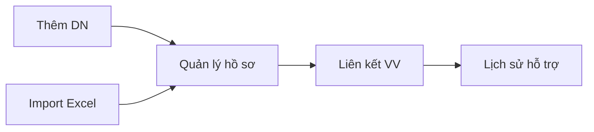
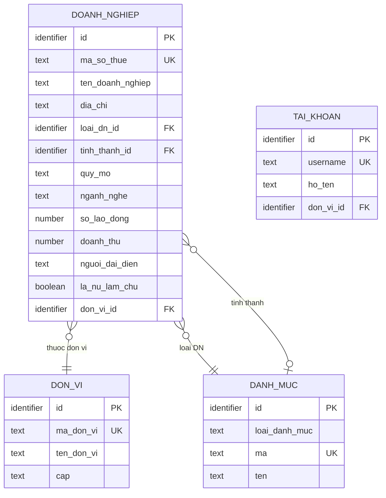

# SRS — Section 3.2.7: Quản lý DN được Hỗ trợ

**Dự án:** Phần mềm hỗ trợ pháp lý doanh nghiệp
**Phiên bản SRS:** 3.0
**Nhóm:** V.III — Quản lý DN được Hỗ trợ
**UC range:** UC 81 – UC 82 + UC mới
**Số FR:** 3
**File chính:** `srs-v3.md` Section 3.2

---

## Mục lục file này

- [1. Tổng quan nhóm](#1-tổng-quan-nhóm)
- [2. Yêu cầu chức năng chi tiết](#2-yêu-cầu-chức-năng-chi-tiết)
- [3. Màn hình chức năng](#3-màn-hình-chức-năng)
- [4. Entity liên quan](#4-entity-liên-quan)
- [5. State Machine liên quan](#5-state-machine-liên-quan)
- [6. Business Rules liên quan](#6-business-rules-liên-quan)

---

## 1. Tổng quan nhóm

**Mục đích:** Quản lý hồ sơ doanh nghiệp nhỏ và vừa (DNNVV) đã/đang được hỗ trợ pháp lý.

**Entity chính:** DOANH_NGHIEP, DOANH_NGHIEP_LINH_VUC, VU_VIEC (liên kết)

**Tác nhân chính:** Cán bộ Nghiệp vụ (CB NV), Cán bộ Phê duyệt (CB PD)

**Tiêu chí DNNVV (Luật DNNVV 2017, NĐ39/2018/NĐ-CP):**

| Quy mô | Lao động | Doanh thu/năm | Tổng nguồn vốn |
|--------|---------|---------------|-----------------|
| Siêu nhỏ | ≤ 10 người | ≤ 3 tỷ VND | ≤ 3 tỷ VND |
| Nhỏ | ≤ 50 người | ≤ 50 tỷ VND | ≤ 20 tỷ VND |
| Vừa | ≤ 200 người | ≤ 200 tỷ VND | ≤ 100 tỷ VND |

Tiêu chí phân loại theo ngành: Nông/Lâm/Thủy sản + Công nghiệp/Xây dựng + Thương mại/Dịch vụ (cấu hình tại UC105).

**Liên kết:** 1 DN → nhiều vụ việc. Hiển thị lịch sử hỗ trợ (danh sách VV, tổng số lần, tổng chi phí).

**Quy trình nghiệp vụ tổng quan:**

**UC Coverage:**

| UC | Tên | FR-ID | Priority |
|----|-----|-------|----------|
| UC81 | Quản lý DN được HTPL | FR-V.III-01 | Essential |
| UC82 | Tìm kiếm DN | FR-V.III-02 | Essential |
| Mới | Import DN từ Excel | FR-V.III-NEW-01 | Essential |

---

## 2. Yêu cầu chức năng chi tiết

---

### FR-V.III-01: Quản lý Doanh nghiệp được HTPL (UC81)

**UC Reference:** UC 81
**Source:** NĐ55/2019, Luật DNNVV 2017
**Priority:** Essential
**Stability:** High
**Màn hình:** SCR-V.III-01 — [Danh sách Doanh nghiệp](#scr-v-iii-01-danh-sách-doanh-nghiệp), SCR-V.III-02 — [Thêm / Chi tiết DN](#scr-v-iii-02-thêm--chi-tiết-dn)

**Mô tả:**
Quản lý hồ sơ doanh nghiệp nhỏ và vừa đã/đang được hỗ trợ pháp lý. Hỗ trợ CRUD, xem lịch sử hỗ trợ, xuất Excel.

**Tác nhân:** Cán bộ Nghiệp vụ (TW/BN/ĐP)

**Preconditions (Điều kiện tiên quyết):**

- User đã đăng nhập (BR-AUTH-01)
- User có quyền "Quản lý DN" (UC115)
- Phân quyền theo đơn vị áp dụng

**Inputs (Dữ liệu đầu vào):**

| # | Tên field | Kiểu logic | Bắt buộc | Ràng buộc | Mặc định | Nguồn |
|---|----------|-----------|----------|-----------|----------|-------|
| 1 | ma_doanh_nghiep | text | Y (auto) | Auto-gen: DN-{TINH}-{SEQ} | — | Hệ thống |
| 2 | ten_doanh_nghiep | text | Y | Không rỗng | — | Người dùng |
| 3 | ma_so_thue | text | Y | Unique toàn hệ thống | — | Người dùng |
| 4 | giay_cndk | text | N | — | — | Người dùng |
| 5 | dia_chi | text | Y | Không rỗng | — | Người dùng |
| 6 | tinh_thanh_id | identifier | Y | FK → DON_VI | — | Người dùng |
| 7 | loai_doanh_nghiep_id | identifier | Y | FK → DANH_MUC (UC105) | — | Người dùng |
| 8 | quy_mo | text | Y | SIEU_NHO / NHO / VUA | — | Người dùng |
| 9 | nganh_nghe | text | Y | NONG_LAM / CONG_NGHIEP / THUONG_MAI | — | Người dùng |
| 10 | so_lao_dong | number | N | ≥ 0 | — | Người dùng |
| 11 | doanh_thu_nam | number | N | ≥ 0 | — | Người dùng |
| 12 | tong_nguon_von | number | N | ≥ 0 | — | Người dùng |
| 13 | nguoi_dai_dien | text | Y | Không rỗng | — | Người dùng |
| 14 | chuc_vu_dd | text | N | — | — | Người dùng |
| 15 | email | text | N | Format email hợp lệ | — | Người dùng |
| 16 | so_dien_thoai | text | N | — | — | Người dùng |
| 17 | linh_vuc_kinh_doanh | text | N | — | — | Người dùng |
| 18 | ghi_chu | text (long) | N | — | — | Người dùng |
| 19 | file_dinh_kem | structured | N | Upload nhiều file | — | Người dùng |

**Processing (Xử lý):**

**Xem danh sách:**

| Bước | Mô tả xử lý | BR áp dụng |
|------|-------------|-----------|
| 1 | Kiểm tra quyền và phân quyền theo đơn vị | BR-AUTH-01, BR-AUTH-08 |
| 2 | Lấy danh sách DOANH_NGHIEP chưa bị xóa, trong phạm vi đơn vị người dùng | BR-DATA-02 |
| 3 | Kết hợp thông tin VU_VIEC để hiển thị tổng số lần hỗ trợ | — |
| 4 | Phân trang (mặc định 20 bản ghi/trang) | BR-DATA-07 |

**Thêm mới:**

| Bước | Mô tả xử lý | BR áp dụng |
|------|-------------|-----------|
| 1 | Kiểm tra quyền | BR-AUTH-01 |
| 2 | Tự động sinh mã doanh nghiệp | BR-DATA-04 |
| 3 | Xác nhận tên doanh nghiệp và mã số thuế không rỗng | — |
| 4 | Kiểm tra mã số thuế duy nhất trong toàn hệ thống | — |
| 5 | Kiểm tra quy mô phù hợp với số lao động/doanh thu theo NĐ39/2018 | BR-CALC-05 |
| 6 | Tạo bản ghi DOANH_NGHIEP | BR-DATA-03 |
| 7 | Ghi nhật ký thao tác | BR-DATA-05 |

**Chỉnh sửa:**

| Bước | Mô tả xử lý | BR áp dụng |
|------|-------------|-----------|
| 1 | Xác nhận dữ liệu đầu vào | — |
| 2 | Cập nhật DOANH_NGHIEP | — |
| 3 | Ghi nhật ký thao tác (giá trị cũ → giá trị mới) | BR-DATA-05 |

**Xóa (xóa mềm):**

| Bước | Mô tả xử lý | BR áp dụng |
|------|-------------|-----------|
| 1 | Kiểm tra DN không có vụ việc đang xử lý | — |
| 2 | Đánh dấu xóa mềm bản ghi | BR-DATA-01 |
| 3 | Ghi nhật ký thao tác | BR-DATA-05 |

**Xem lịch sử hỗ trợ:**

| Bước | Mô tả xử lý | BR áp dụng |
|------|-------------|-----------|
| 1 | Lấy danh sách VU_VIEC thuộc DN | — |
| 2 | Tính tổng: tổng vụ việc, tổng chi phí, số VV hoàn thành | — |
| 3 | Hiển thị danh sách VV kèm thống kê | — |

**Business Rules áp dụng:**
- **BR-AUTH-01**: Kiểm tra quyền truy cập
- **BR-AUTH-08**: Phân quyền theo đơn vị
- **BR-DATA-01**: Xóa mềm (is_deleted)
- **BR-DATA-04**: Tự động sinh mã
- **BR-DATA-05**: Ghi nhật ký thao tác
- **BR-CALC-05**: Kiểm tra quy mô DNNVV theo NĐ39/2018

**Outputs (Dữ liệu đầu ra):**

| # | Tên | Kiểu logic | Điều kiện | Format |
|---|-----|-----------|-----------|--------|
| 1 | id | identifier | Luôn có | — |
| 2 | ma_doanh_nghiep | text | Luôn có | DN-{TINH}-{SEQ} |
| 3 | ten_doanh_nghiep | text | Luôn có | — |
| 4 | ma_so_thue | text | Luôn có | — |
| 5 | quy_mo | text | Luôn có | Siêu nhỏ/Nhỏ/Vừa |
| 6 | dia_chi | text | Luôn có | — |
| 7 | so_lan_ho_tro | number | Luôn có | — |
| 8 | tong_chi_phi | money | Luôn có | VND, dấu chấm phân cách |
| 9 | total_count | number | Luôn có | — |

**Postconditions (Trạng thái sau thực hiện):**

- Bản ghi DOANH_NGHIEP được tạo/cập nhật/xóa mềm
- Nhật ký thao tác ghi nhận
- Liên kết DN ↔ VU_VIEC bảo toàn

**Error Handling (Xử lý lỗi):**

| # | Điều kiện lỗi | Mã lỗi | Phản hồi hệ thống | Severity |
|---|--------------|--------|-------------------|----------|
| E1 | Tên DN trống | ERR-DN-01 | "Tên doanh nghiệp là bắt buộc" | ERROR |
| E2 | MST trùng | ERR-DN-02 | "Mã số thuế đã tồn tại" | ERROR |
| E3 | Quy mô không phù hợp | WRN-DN-01 | "Quy mô {X} không khớp với số liệu lao động/doanh thu. Vẫn lưu?" | WARNING |
| E4 | Xóa DN có VV đang xử lý | ERR-DN-03 | "Không thể xóa DN đang có vụ việc xử lý" | ERROR |

**Acceptance Criteria:**

- **Given** CB NV truy cập "Quản lý DN" **When** hệ thống hiển thị **Then** danh sách DN thuộc đơn vị, phân trang
- **Given** CB NV thêm DN **When** nhập đủ trường bắt buộc **Then** kiểm tra quy mô DNNVV + lưu
- **Given** CB NV xem chi tiết DN **When** chọn DN **Then** hiển thị hồ sơ + lịch sử hỗ trợ (danh sách VV, tổng số lần, tổng chi phí)
- **Given** CB NV nhập MST trùng **When** lưu **Then** hệ thống báo lỗi

---

### FR-V.III-02: Tìm kiếm DN (UC82)

**UC Reference:** UC 82
**Source:** NĐ55/2019
**Priority:** Essential
**Stability:** High
**Màn hình:** SCR-V.III-01 — [Danh sách Doanh nghiệp](#scr-v-iii-01-danh-sách-doanh-nghiệp)

**Mô tả:**
Tìm kiếm doanh nghiệp theo nhiều tiêu chí: từ khóa (tên/MST), quy mô, tỉnh thành, lĩnh vực KD, thời gian hỗ trợ.

**Tác nhân:** Cán bộ Nghiệp vụ / Cán bộ Phê duyệt (TW/BN/ĐP)

**Preconditions (Điều kiện tiên quyết):**

- User đã đăng nhập

**Inputs (Dữ liệu đầu vào):**

| # | Tên field | Kiểu logic | Bắt buộc | Ràng buộc | Mặc định | Nguồn |
|---|----------|-----------|----------|-----------|----------|-------|
| 1 | tu_khoa | text | N | Tìm theo tên/MST | — | Người dùng |
| 2 | quy_mo | text | N | SIEU_NHO / NHO / VUA | — | Người dùng |
| 3 | tinh_thanh_id | identifier | N | FK → DON_VI | — | Người dùng |
| 4 | linh_vuc_kd | text | N | Lĩnh vực kinh doanh | — | Người dùng |
| 5 | tu_ngay | date | N | Thời gian hỗ trợ từ | — | Người dùng |
| 6 | den_ngay | date | N | Thời gian hỗ trợ đến | — | Người dùng |

**Processing (Xử lý):**

| Bước | Mô tả xử lý | BR áp dụng |
|------|-------------|-----------|
| 1 | Kiểm tra quyền và phân quyền theo đơn vị | BR-AUTH-01, BR-AUTH-08 |
| 2 | Kết hợp tất cả điều kiện lọc có giá trị (AND) | — |
| 3 | Tìm từ khóa trên tên doanh nghiệp và mã số thuế | — |
| 4 | Phân trang (mặc định 20 bản ghi/trang) | BR-DATA-07 |

**Outputs (Dữ liệu đầu ra):**

| # | Tên | Kiểu logic | Điều kiện | Format |
|---|-----|-----------|-----------|--------|
| 1 | id | identifier | Luôn có | — |
| 2 | ma_doanh_nghiep | text | Luôn có | DN-{TINH}-{SEQ} |
| 3 | ten_doanh_nghiep | text | Luôn có | — |
| 4 | ma_so_thue | text | Luôn có | — |
| 5 | quy_mo | text | Luôn có | Siêu nhỏ/Nhỏ/Vừa |
| 6 | dia_chi | text | Luôn có | — |
| 7 | so_lan_ho_tro | number | Luôn có | — |
| 8 | tong_chi_phi | money | Luôn có | VND |
| 9 | total_count | number | Luôn có | — |

**Postconditions (Trạng thái sau thực hiện):**

- Không thay đổi dữ liệu (read-only)

**Error Handling (Xử lý lỗi):**

| # | Điều kiện lỗi | Mã lỗi | Phản hồi hệ thống | Severity |
|---|--------------|--------|-------------------|----------|
| E1 | Không có kết quả | INF-DN-TK-01 | "Không tìm thấy doanh nghiệp phù hợp" | INFO |

**Acceptance Criteria:**

- **Given** CB NV nhập từ khóa **When** tìm kiếm **Then** hiển thị DN phù hợp (tên, MST), phân trang
- **Given** CB NV lọc theo lĩnh vực KD **When** chọn **Then** hiển thị DN thuộc lĩnh vực
- **Given** CB NV lọc theo thời gian hỗ trợ **When** chọn khoảng ngày **Then** hiển thị DN được hỗ trợ trong khoảng
- **Given** CB NV kết hợp nhiều điều kiện **When** tìm kiếm **Then** áp dụng AND

---

### FR-V.III-NEW-01: Import DN từ Excel (UC mới)

**UC Reference:** UC mới
**Source:** Yêu cầu CĐT bổ sung
**Priority:** Essential
**Stability:** High
**Màn hình:** SCR-V.III-03 — [Import DN từ Excel](#scr-v-iii-03-import-dn-từ-excel)

**Mô tả:**
Import hàng loạt doanh nghiệp từ file Excel (.xlsx), với quy trình: upload → validate → preview → xác nhận → báo cáo kết quả.

**Tác nhân:** Cán bộ Nghiệp vụ (TW/BN/ĐP)

**Preconditions (Điều kiện tiên quyết):**

- User đã đăng nhập, có quyền "Quản lý DN"

**Inputs (Dữ liệu đầu vào):**

| # | Tên field | Kiểu logic | Bắt buộc | Ràng buộc | Mặc định | Nguồn |
|---|----------|-----------|----------|-----------|----------|-------|
| 1 | file_excel | structured | Y | File .xlsx, max 5MB, max 1.000 dòng | — | Người dùng |

**Cột bắt buộc trong Excel:**

| Cột | Map trường | Bắt buộc | Validate |
|-----|-----------|----------|----------|
| Tên DN | ten_doanh_nghiep | Y | Không rỗng |
| Mã số thuế | ma_so_thue | Y | Format 10/13 số, unique |
| Địa chỉ | dia_chi | Y | Không rỗng |
| Loại DN | loai_doanh_nghiep | Y | Mapping UC105 |
| Quy mô | quy_mo | Y | SIEU_NHO / NHO / VUA |
| Người đại diện | nguoi_dai_dien | N | — |
| SĐT | so_dien_thoai | N | Format số |
| Email | email | N | Format email |

**Processing (Xử lý):**

| Bước | Mô tả xử lý | BR áp dụng |
|------|-------------|-----------|
| 1 | Kiểm tra quyền và phân quyền theo đơn vị | BR-AUTH-01 |
| 2 | Kiểm tra file: đúng định dạng .xlsx, không vượt 5MB | — |
| 3 | Phân tích file Excel: kiểm tra cột bắt buộc | — |
| 4 | Kiểm tra từng dòng: trường bắt buộc, format MST | — |
| 5 | Kiểm tra MST trùng trong hệ thống | — |
| 6 | Hiển thị bản review: tổng dòng, hợp lệ, lỗi, trùng | — |
| 7 | Nếu xác nhận: tạo bản ghi DOANH_NGHIEP cho dòng hợp lệ, bỏ qua trùng MST | — |
| 8 | Trả về báo cáo import chi tiết | — |
| 9 | Ghi nhật ký thao tác | BR-DATA-05 |

**Outputs (Dữ liệu đầu ra):**

| # | Tên | Kiểu logic | Điều kiện | Format |
|---|-----|-----------|-----------|--------|
| 1 | tong_dong | number | Luôn có | — |
| 2 | thanh_cong | number | Luôn có | — |
| 3 | trung_mst | number | Luôn có | — |
| 4 | loi | number | Luôn có | — |
| 5 | chi_tiet_loi | structured | Khi có lỗi | [{dong, cot, ly_do}] |

**Postconditions (Trạng thái sau thực hiện):**

- DN mới được tạo từ file Excel
- Bản ghi trùng MST được bỏ qua
- Báo cáo import hiển thị cho user
- Nhật ký thao tác ghi nhận

**Error Handling (Xử lý lỗi):**

| # | Điều kiện lỗi | Mã lỗi | Phản hồi hệ thống | Severity |
|---|--------------|--------|-------------------|----------|
| E1 | File không phải .xlsx | ERR-IMP-DN-01 | "Chỉ chấp nhận file Excel (.xlsx)" | ERROR |
| E2 | File vượt 5MB | ERR-IMP-DN-02 | "File tối đa 5MB" | ERROR |
| E3 | Thiếu cột bắt buộc | ERR-IMP-DN-03 | "File thiếu cột: {tên cột}" | ERROR |
| E4 | Dòng lỗi dữ liệu | ERR-IMP-DN-04 | "Dòng {N}, cột {X}: {lý do}" | ERROR |
| E5 | Trùng MST | INF-IMP-DN-01 | "Dòng {N}: MST {X} đã tồn tại, bỏ qua" | INFO |

**Acceptance Criteria:**

- **Given** CB NV chọn "Import Excel" **When** upload file **Then** validate format + hiển thị bản review
- **Given** dữ liệu hợp lệ **When** xác nhận import **Then** tạo DN mới, bỏ qua trùng MST
- **Given** file có lỗi **When** validate **Then** hiển thị báo cáo lỗi chi tiết (dòng + cột + lý do)

---

---

## 3. Màn hình chức năng

### SCR-V.III-01: Danh sách Doanh nghiệp

**Loại màn hình:** Danh sách
**FR sử dụng:** FR-V.III-01, FR-V.III-02
**UX-Spec ref:** dac-ta-man-hinh-chuc-nang-v2.md — MH-07.1

#### Thành phần màn hình

| # | Vùng | Thành phần | Loại | Dữ liệu / Nội dung | Hành vi | Điều kiện hiển thị |
|---|------|-----------|------|--------------------| --------|-------------------|
| 1 | breadcrumb | Breadcrumb | breadcrumb | "Trang chủ > Doanh nghiệp > Danh sách" | navigate | Luôn hiển thị |
| 2 | toolbar | Tiêu đề trang | label | "Quản lý Doanh nghiệp" | — | Luôn hiển thị |
| 3 | toolbar | Nút Thêm mới | button | "+ Thêm mới" | click → SCR-V.III-02 (tạo mới) | Có quyền CRUD |
| 4 | toolbar | Nút Import Excel | button | "Import Excel" | click → SCR-V.III-03 | Có quyền CRUD |
| 5 | toolbar | Nút Xuất Excel | button | "Xuất Excel" | click → export danh sách | Luôn hiển thị |
| 6 | toolbar | Nút Làm mới | button | "Làm mới" | click → reload danh sách | Luôn hiển thị |
| 7 | filter-bar | Từ khóa | search-box | Tìm theo tên DN / MST | change → filter | Luôn hiển thị |
| 8 | filter-bar | Quy mô | select | SIEU_NHO / NHO / VUA | change → filter | Luôn hiển thị |
| 9 | filter-bar | Tỉnh thành | select | Danh mục tỉnh/TP | change → filter | Luôn hiển thị |
| 10 | filter-bar | Lĩnh vực KD | select | Lĩnh vực kinh doanh | change → filter | Luôn hiển thị |
| 11 | filter-bar | Từ ngày | date-picker | Thời gian hỗ trợ từ | change → filter | Luôn hiển thị |
| 12 | filter-bar | Đến ngày | date-picker | Thời gian hỗ trợ đến | change → filter | Luôn hiển thị |
| 13 | filter-bar | Nút Tìm kiếm | button | "Tìm kiếm" | click → query | Luôn hiển thị |
| 14 | filter-bar | Nút Xóa bộ lọc | button | "Xóa bộ lọc" | click → reset filters | Luôn hiển thị |
| 15 | table | Checkbox | checkbox | Chọn dòng | click → select | Luôn hiển thị |
| 16 | table | Mã DN | table-column | DN-{TINH}-{SEQ} | click → SCR-V.III-02 (chi tiết) | Luôn hiển thị |
| 17 | table | Tên DN | table-column | ten_doanh_nghiep | — | Luôn hiển thị |
| 18 | table | MST | table-column | ma_so_thue | — | Luôn hiển thị |
| 19 | table | Quy mô | badge | SIEU_NHO / NHO / VUA | — | Luôn hiển thị |
| 20 | table | Địa chỉ | table-column | dia_chi (cắt 30 ký tự) | — | Luôn hiển thị |
| 21 | table | Số lần hỗ trợ | table-column | Đếm số vụ việc của DN | — | Luôn hiển thị |
| 22 | table | Tổng chi phí | table-column | SUM chi phí (VND) | — | Luôn hiển thị |
| 23 | table | Hành động | icon | Xem / Sửa / Xóa | click → tương ứng | Luôn hiển thị |
| 24 | pagination | Phân trang | pagination | 20 mục/trang | click → chuyển trang | Luôn hiển thị |

#### Quy tắc tương tác

- Sắp xếp mặc định: ngày cập nhật mới nhất trước
- Xóa mềm: chỉ khi DN không có VV đang xử lý
- Quy mô auto-suggest khi nhập số lao động và doanh thu

---

### SCR-V.III-02: Thêm / Chi tiết Doanh nghiệp

**Loại màn hình:** Form nhập liệu / Chi tiết
**FR sử dụng:** FR-V.III-01
**UX-Spec ref:** dac-ta-man-hinh-chuc-nang-v2.md — MH-07.2

#### Thành phần màn hình

| # | Vùng | Thành phần | Loại | Dữ liệu / Nội dung | Hành vi | Điều kiện hiển thị |
|---|------|-----------|------|--------------------| --------|-------------------|
| 1 | tab | Tab Thông tin cơ bản | tab | Form thông tin DN | — | Luôn hiển thị |
| 2 | tab | Tab Hồ sơ PL doanh nghiệp (MỚI v2.1) | tab | CRUD hồ sơ pháp lý DN: GIAY_PHEP / HOP_DONG / GIAY_CN / QUYET_DINH / KHAC. Trạng thái: HIEU_LUC / HET_HAN / THU_HOI. Gộp từ MH-12.3 (Tư vấn CS) | — | Chỉ khi xem chi tiết |
| 3 | tab | Tab Lịch sử Hỗ trợ | tab | Danh sách VV liên kết + thống kê (3 KPI: Tổng VV, VV hoàn thành, Tổng chi phí) | — | Chỉ khi xem chi tiết |
| 4 | tab | Tab Hồ sơ Chi trả | tab | Danh sách HS chi trả liên kết | — | Chỉ khi xem chi tiết |
| 5 | content | Mã DN | text-input (readonly) | Auto-gen: DN-{TINH}-{SEQ} | — | Chỉ khi xem chi tiết |
| 6 | content | Tên DN | text-input | ten_doanh_nghiep | — | Luôn hiển thị |
| 7 | content | Mã số thuế | text-input | ma_so_thue (unique) | — | Luôn hiển thị |
| 8 | content | Giấy CNĐKKD | text-input | giay_cndk | — | Luôn hiển thị |
| 9 | content | Ngày cấp ĐKKD | date-picker | ngay_cap_dkkd | — | Luôn hiển thị |
| 10 | content | Địa chỉ | text-input | dia_chi | — | Luôn hiển thị |
| 11 | content | Tỉnh thành | select | FK → DON_VI | — | Luôn hiển thị |
| 12 | content | Loại DN | select | FK → DANH_MUC (UC105) | — | Luôn hiển thị |
| 13 | content | Quy mô | select | SIEU_NHO / NHO / VUA | auto-suggest | Luôn hiển thị |
| 14 | content | Ngành nghề | select | NONG_LAM / CONG_NGHIEP / THUONG_MAI | — | Luôn hiển thị |
| 15 | content | Số lao động | text-input | so_lao_dong | change → auto-calc quy mô | Luôn hiển thị |
| 16 | content | Doanh thu năm | text-input | doanh_thu_nam (VND) | change → auto-calc quy mô | Luôn hiển thị |
| 17 | content | Tổng nguồn vốn | text-input | tong_nguon_von (VND) | — | Luôn hiển thị |
| 18 | content | Người đại diện | text-input | nguoi_dai_dien | — | Luôn hiển thị |
| 19 | content | Chức vụ ĐD | text-input | chuc_vu_dd | — | Luôn hiển thị |
| 20 | content | Email | text-input | email | — | Luôn hiển thị |
| 21 | content | SĐT | text-input | so_dien_thoai | — | Luôn hiển thị |
| 22 | content | Fax | text-input | fax | — | Luôn hiển thị |
| 23 | content | Phụ nữ làm chủ | checkbox | la_nu_lam_chu (NĐ55 Điều 4) | — | Luôn hiển thị |
| 24 | content | Số LĐ nữ | text-input | so_lao_dong_nu | — | Luôn hiển thị |
| 25 | content | Số LĐ khuyết tật | text-input | so_lao_dong_khuyet_tat | — | Luôn hiển thị |
| 26 | content | Lĩnh vực KD | textarea | linh_vuc_kinh_doanh | — | Luôn hiển thị |
| 27 | content | Ghi chú | textarea | ghi_chu | — | Luôn hiển thị |
| 28 | content | File đính kèm | file-upload | file_dinh_kem | upload nhiều file | Luôn hiển thị |
| 29 | action-bar | Hủy | button | — | click → quay lại | Luôn hiển thị |
| 30 | action-bar | Lưu | button | — | click → validate + lưu | Luôn hiển thị |

#### Quy tắc tương tác

- Auto-suggest quy mô: khi nhập số lao động và doanh thu, hệ thống gợi ý quy mô theo NĐ39/2018
- Nếu 2 tiêu chí cho kết quả khác nhau → lấy mức cao hơn và hiển thị warning
- Tab Hồ sơ PL DN (MỚI v2.1, gộp MH-12.3): CRUD hồ sơ pháp lý DN, phân loại: GIAY_PHEP/HOP_DONG/GIAY_CN/QUYET_DINH/KHAC. Trạng thái: HIEU_LUC/HET_HAN/THU_HOI
- Tab Lịch sử Hỗ trợ hiển thị 3 KPI: Tổng VV, VV hoàn thành, Tổng chi phí
- Tab Hồ sơ Chi trả hiển thị danh sách HS chi trả liên kết

---

### SCR-V.III-03: Import DN từ Excel

**Loại màn hình:** Wizard (3 bước)
**FR sử dụng:** FR-V.III-NEW-01
**UX-Spec ref:** dac-ta-man-hinh-chuc-nang-v2.md — MH-07.3

#### Thành phần màn hình

| # | Vùng | Thành phần | Loại | Dữ liệu / Nội dung | Hành vi | Điều kiện hiển thị |
|---|------|-----------|------|--------------------| --------|-------------------|
| 1 | stepper | Thanh tiến trình | stepper | 3 bước: Upload → Kiểm tra → Kết quả | — | Luôn hiển thị |
| 2 | content | Vùng kéo thả file | file-upload | .xlsx, tối đa 5MB | upload file | Bước 1 |
| 3 | content | Nút Tải mẫu Excel | button | Download file mẫu | click → download | Bước 1 |
| 4 | content | Thống kê tóm tắt | label | Tổng dòng / Hợp lệ / Lỗi / Trùng MST | — | Bước 2 |
| 5 | content | Bảng preview | table | Từng dòng: tên DN, MST, trạng thái | — | Bước 2 |
| 6 | content | Lọc trạng thái | tab | Tất cả / Hợp lệ / Lỗi / Trùng | click → filter | Bước 2 |
| 7 | content | Báo cáo import | label | Tổng / Thành công / Trùng (bỏ qua) / Lỗi | — | Bước 3 |
| 8 | content | Chi tiết lỗi | table | Dòng / Cột / Lý do lỗi | — | Bước 3 (nếu có lỗi) |
| 9 | content | Nút Tải báo cáo | button | Download báo cáo dạng Excel | click → download | Bước 3 |
| 10 | action-bar | Hủy / Quay lại | button | — | click → quay lại | Luôn hiển thị |
| 11 | action-bar | Upload / Xác nhận Import / Về danh sách | button | — | click → tiếp tục | Luôn hiển thị |

#### Quy tắc tương tác

- File mẫu Excel có sẵn header và 1 dòng ví dụ
- Import sử dụng MERGE: chỉ INSERT dòng mới, bỏ qua dòng trùng MST
- Giới hạn: tối đa 1.000 dòng/file

---

## 4. Entity liên quan

> **Source of truth:** `srs-v3.md` Section 3.4.3

### Tổng quan entity

| # | Entity | Vai trò | Mô tả |
|---|--------|---------|-------|
| 1 | DOANH_NGHIEP | owned | Hồ sơ DNNVV đã/đang được hỗ trợ pháp lý |
| 2 | TAI_KHOAN | referenced | Tài khoản người dùng CMS |
| 3 | DON_VI | referenced | Cơ quan/đơn vị (cây 3 tầng TW/BN/ĐP) |
| 4 | DANH_MUC | referenced | Danh mục dùng chung (loại DN, tỉnh/TP...) |

### ERD nhóm (subset)

### DOANH_NGHIEP (owned)

**Mô tả:** Hồ sơ DNNVV đã/đang được hỗ trợ pháp lý. Entity trung tâm của Nhóm V.III.
**Tham chiếu FR:** FR-V.III-01/02, FR-V.III-NEW-01

| Attribute | Kiểu logic | Bắt buộc | Ràng buộc nghiệp vụ | Mặc định | Mô tả |
|-----------|-----------|----------|------------|---------|-------|
| ten_doanh_nghiep | text | Y | | | Tên đầy đủ DN |
| ten_viet_tat | text | N | | | Tên viết tắt |
| ma_so_thue | text | Y | UNIQUE | | Mã số thuế / Mã số DN |
| giay_cn_dkkd | text | N | | | Số giấy CNĐKKD |
| ngay_cap_dkkd | datetime | N | | | Ngày cấp ĐKKD |
| loai_dn_id | identifier | Y | FK → DANH_MUC(id) | | Loại DN: siêu nhỏ/nhỏ/vừa (UC105) |
| dia_chi | text | Y | | | Địa chỉ trụ sở |
| tinh_thanh_id | identifier | N | FK → DANH_MUC(id) | | Tỉnh/TP |
| dien_thoai | text | N | | | SĐT liên hệ |
| email | text | N | | | Email liên hệ |
| fax | text | N | | | Fax |
| nganh_nghe | text | N | | | Ngành nghề kinh doanh |
| nguoi_dai_dien | text | N | | | Người đại diện pháp luật |
| chuc_vu_dai_dien | text | N | | | Chức vụ người đại diện |
| doanh_thu | number | N | | | Doanh thu (để xác định quy mô) |
| so_lao_dong | number | N | | | Số lao động (để xác định quy mô) |
| so_lao_dong_nu | number | N | | | Số LĐ nữ (NĐ55 Điều 4 ưu tiên) |
| so_lao_dong_khuyet_tat | number | N | | | Số LĐ khuyết tật (NĐ55 Điều 4 ưu tiên) |
| la_nu_lam_chu | boolean | N | | 0 | DN do phụ nữ làm chủ (NĐ55 Điều 4 ưu tiên) |
| tong_so_vu_viec | number | N | | 0 | Counter: tổng VV đã hỗ trợ |
| tong_chi_phi_ho_tro | number | N | | 0 | Counter: tổng chi phí đã hỗ trợ |
| ghi_chu | text | N | | | Ghi chú |

**CHECK constraints bổ sung:**
- `CHECK (so_lao_dong >= 0)`
- `CHECK (so_lao_dong_nu >= 0 AND so_lao_dong_nu <= so_lao_dong)`
- `CHECK (so_lao_dong_khuyet_tat >= 0 AND so_lao_dong_khuyet_tat <= so_lao_dong)`
- `CHECK (doanh_thu >= 0)`
- UNIQUE constraint trên `ma_so_thue` (DB-level)

**Volume & Growth:** ~10,000 records/năm. Import Excel hàng loạt.

### TAI_KHOAN (referenced)

**Mô tả:** Tài khoản đăng nhập hệ thống CMS — xem chi tiết tại `srs-fr-05-vu-viec.md` Section 4.

### DON_VI (referenced)

**Mô tả:** Cơ quan/đơn vị (cây 3 tầng TW/BN/ĐP) — xem chi tiết tại `srs-fr-05-vu-viec.md` Section 4.

### DANH_MUC (referenced)

**Mô tả:** Bảng danh mục dùng chung (key-value) — xem chi tiết tại `srs-fr-05-vu-viec.md` Section 4.

---

## 5. State Machine liên quan

> **Source of truth:** `srs-v3.md` Phụ lục C.

Nhóm này không có state machine. Entity DOANH_NGHIEP không có vòng đời trạng thái (lifecycle) trong SRS. Bản ghi DN được tạo/sửa/xóa mềm trực tiếp.

---

## 6. Business Rules liên quan

> **Source of truth:** `srs-v3.md` Phụ lục B.

### Tổng quan BR sử dụng

| BR ID | Tên | FR áp dụng (trong nhóm này) |
|-------|-----|----------------------------|
| BR-AUTH-01 | Xác thực truy cập | FR-V.III-01, 02, NEW-01 |
| BR-AUTH-08 | Phân quyền theo đơn vị | FR-V.III-01, 02 |
| BR-DATA-01 | Soft delete | FR-V.III-01 |
| BR-DATA-02 | Multi-tenant scoping | FR-V.III-01 |
| BR-DATA-03 | Common fields | FR-V.III-01 |
| BR-DATA-04 | Auto-gen mã | FR-V.III-01 |
| BR-DATA-05 | Audit trail | FR-V.III-01, NEW-01 |
| BR-DATA-07 | Pagination | FR-V.III-01, 02 |
| BR-CALC-05 | Kiểm tra quy mô DNNVV NĐ39/2018 | FR-V.III-01 |

### BR-AUTH-01: Xác thực truy cập

Mọi user phải xác thực trước khi truy cập hệ thống.

**Applied in (nhóm V.III):** FR-V.III-01, FR-V.III-02, FR-V.III-NEW-01

### BR-AUTH-08: Phân quyền theo đơn vị

chính sách phân quyền dữ liệu áp dụng cho MỌI bảng có cột `don_vi_id`.

**Applied in (nhóm V.III):** FR-V.III-01, FR-V.III-02

### BR-DATA-01: Soft delete

Mọi thao tác xóa đều là soft delete (set `is_deleted = 1`).

**Applied in (nhóm V.III):** FR-V.III-01

### BR-DATA-02: Multi-tenant scoping

Mọi bản ghi nghiệp vụ PHẢI có `don_vi_id` NOT NULL.

**Applied in (nhóm V.III):** FR-V.III-01

### BR-DATA-03: Common fields

Mọi entity đều có 7 common fields (id, created_at, updated_at, created_by, updated_by, is_deleted, don_vi_id).

**Applied in (nhóm V.III):** FR-V.III-01

### BR-DATA-04: Auto-gen mã

Format: DN-{TINH}-{SEQ}.

**Applied in (nhóm V.III):** FR-V.III-01

### BR-DATA-05: Audit trail

Mọi thao tác CUD + phê duyệt đều ghi vào AUDIT_LOG. Log là immutable.

**Applied in (nhóm V.III):** FR-V.III-01, FR-V.III-NEW-01

### BR-DATA-07: Pagination

Default: 20 rows/page, max: 100 rows/page.

**Applied in (nhóm V.III):** FR-V.III-01, FR-V.III-02

### BR-CALC-05: Kiểm tra quy mô DNNVV (NĐ39/2018)

Ưu tiên phân công: (1) DN phụ nữ làm chủ, (2) DN nhiều LĐ nữ, (3) DN ≥30% LĐ khuyết tật, (4) FIFO. Trong nhóm V.III, rule này dùng để kiểm tra quy mô DN phù hợp với số lao động/doanh thu khi thêm mới.

**Applied in (nhóm V.III):** FR-V.III-01

---

**— Hết file FR Group: Quản lý DN được Hỗ trợ —**
