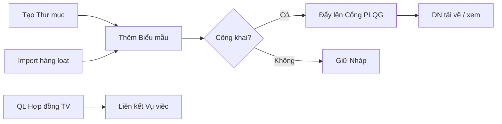
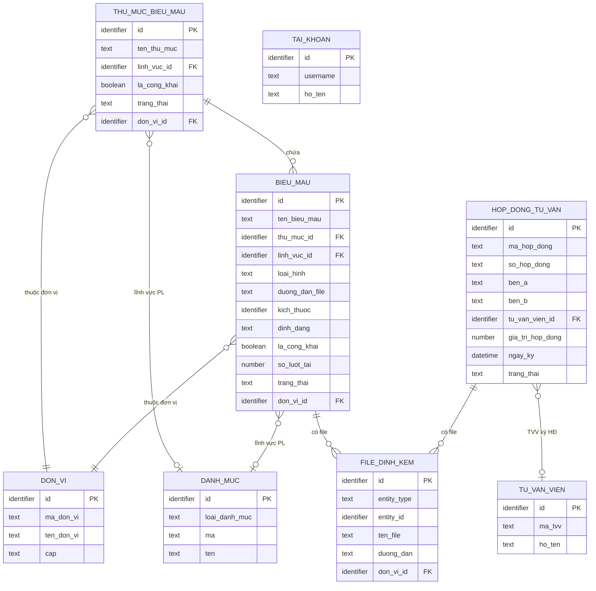
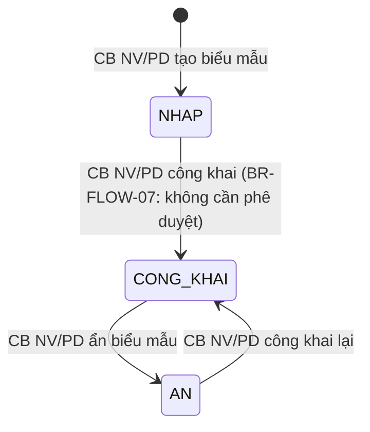

# SRS — Section 3.2.2: Thư viện Biểu mẫu, Hợp đồng

**Dự án:** Phần mềm hỗ trợ pháp lý doanh nghiệp
**Phiên bản SRS:** 3.0
**Nhóm:** VII — Thư viện Biểu mẫu, Hợp đồng
**UC range:** UC 92 – UC 98, UC 163
**Số FR:** 8
**File chính:** `srs-v3.md` Section 3.2

---

## Mục lục file này

- [1. Tổng quan nhóm](#1-tổng-quan-nhóm)
- [2. Yêu cầu chức năng chi tiết](#2-yêu-cầu-chức-năng-chi-tiết)
- [3. Màn hình chức năng](#3-màn-hình-chức-năng)
- [4. Entity liên quan](#4-entity-liên-quan)
- [5. State Machine liên quan](#5-state-machine-liên-quan)
- [6. Business Rules liên quan](#6-business-rules-liên-quan)

---

## 1. Tổng quan nhóm

**Mục đích:** Quản lý kho biểu mẫu/hợp đồng mẫu (HĐ lao động, HĐ chuyển nhượng, HĐ DV Marketing...) cho DNNVV tham khảo + tải về qua Cổng PLQG.

**Quy trình nghiệp vụ tổng quan:**



Nhóm VII quản lý thư viện biểu mẫu theo cấu trúc 2 cấp (Thư mục → Biểu mẫu). File chấp nhận doc/docx/xls/xlsx (max 20MB). Công khai trực tiếp lên Cổng PLQG mà KHÔNG cần phê duyệt (BR-FLOW-07). Ưu tiên xem trực tuyến (preview) trước khi tải về.

**Entity chính:** THU_MUC_BIEU_MAU, BIEU_MAU, FILE_DINH_KEM, HOP_DONG_TU_VAN

**Tác nhân chính:** Cán bộ Nghiệp vụ (TW/BN/ĐP), HT khác (Cổng PLQG)

**Máy trạng thái SM-BIEUMAU:**
```
NHAP → CONG_KHAI ⟷ AN
NHAP / AN → XOA
```

---

## 2. Yêu cầu chức năng chi tiết

### FR-VII-01: Quản lý thư mục biểu mẫu, hợp đồng (UC92)

**UC Reference:** UC 92
**Source:** CĐT xác nhận
**Priority:** Essential
**Stability:** High
**Màn hình:** SCR-VII-01 — [Quản lý Thư mục Biểu mẫu](#scr-vii-01-quản-lý-thư-mục-biểu-mẫu)

**Mô tả:** Quản lý thư mục chứa biểu mẫu/hợp đồng. Cấu trúc 2 cấp: Thư mục → Biểu mẫu.

**Tác nhân:** Cán bộ Nghiệp vụ (TW/BN/ĐP)

**Preconditions:**
- User đã đăng nhập (BR-AUTH-01)
- User có quyền truy cập chức năng "Thư viện biểu mẫu" (UC115)
- User thuộc đơn vị có quyền (phạm vi phân quyền theo đơn vị)

**Inputs:**

| # | Tên field | Kiểu logic | Bắt buộc | Ràng buộc | Mặc định | Nguồn |
|---|----------|-----------|----------|-----------|----------|-------|
| 1 | ten_thu_muc | text | Y | Max 500 ký tự, unique trong cùng đơn vị | — | user input |
| 2 | linh_vuc_id | identifier | Y | Lĩnh vực PL (từ UC99) | — | user input |
| 3 | mo_ta | text | N | — | — | user input |
| 4 | trang_thai | text | Y | NHAP / CONG_KHAI | NHAP | user input |
| 5 | thu_tu_hien_thi | number | N | 1-20, sắp xếp tăng dần | — | user input |

**Processing — Tạo/Cập nhật:**

| Bước | Mô tả xử lý | BR áp dụng |
|------|-------------|-----------|
| 1 | Kiểm tra quyền + phạm vi phân quyền theo đơn vị | BR-AUTH-01, BR-AUTH-08 |
| 2 | Kiểm tra dữ liệu: ten_thu_muc không trống, <= 500 ký tự | — |
| 3 | Kiểm tra trùng tên thư mục trong cùng đơn vị | — |
| 4 | Kiểm tra linh_vuc_id tồn tại trong danh mục Lĩnh vực PL | — |
| 5 | Tạo hoặc cập nhật bản ghi THU_MUC_BIEU_MAU | BR-DATA-03 |
| 6 | Ghi nhật ký thao tác | BR-DATA-05 |
| 7 | Trả về bản ghi | — |

**Processing — Xóa thư mục:**

| Bước | Mô tả xử lý | BR áp dụng |
|------|-------------|-----------|
| 1 | Kiểm tra thư mục rỗng: đếm số biểu mẫu chưa xóa trong thư mục | — |
| 2 | Nếu có biểu mẫu → từ chối xóa | — |
| 3 | Nếu rỗng → xóa mềm | BR-DATA-01 |
| 4 | Ghi nhật ký thao tác | BR-DATA-05 |

**Outputs:**

| # | Tên | Kiểu logic | Điều kiện | Format |
|---|-----|-----------|-----------|--------|
| 1 | id | identifier | — | — |
| 2 | ten_thu_muc | text | — | — |
| 3 | ten_linh_vuc | text | — | — |
| 4 | so_bieu_mau | number | — | auto đếm |
| 5 | trang_thai | text | — | NHAP / CONG_KHAI |
| 6 | ngay_tao | datetime | — | dd/mm/yyyy HH:mm |
| 7 | nguoi_tao | text | — | — |

**Error Handling:**

| # | Điều kiện lỗi | Mã lỗi | Phản hồi hệ thống | Severity |
|---|--------------|--------|-------------------|----------|
| E1 | Tên thư mục trùng trong đơn vị | ERR-TM-01 | "Thư mục '{tên}' đã tồn tại trong đơn vị" | ERROR |
| E2 | Thư mục chứa biểu mẫu | ERR-TM-02 | "Thư mục chứa {N} biểu mẫu, không thể xóa" | ERROR |
| E3 | Tên vượt 500 ký tự | ERR-TM-03 | "Tên thư mục tối đa 500 ký tự" | ERROR |
| E4 | Lĩnh vực không tồn tại | ERR-TM-04 | "Lĩnh vực PL không tồn tại" | ERROR |

**Postconditions:**
- Thư mục được tạo/cập nhật/xóa mềm
- Phạm vi phân quyền áp dụng (chỉ xem thư mục thuộc đơn vị mình)

**Acceptance Criteria:**
- **Given** CB NV truy cập "Thư viện biểu mẫu" **When** hiển thị **Then** danh sách thư mục thuộc đơn vị, phân trang
- **Given** CB NV xem chi tiết thư mục **When** chọn thư mục **Then** hiển thị thông tin + danh sách biểu mẫu bên trong
- **Given** CB NV thêm mới thư mục **When** nhập tên + lĩnh vực + Lưu **Then** validate và lưu
- **Given** CB NV xóa thư mục rỗng **When** xác nhận **Then** xóa thành công
- **Given** CB NV xóa thư mục có biểu mẫu **When** xác nhận **Then** từ chối + cảnh báo
- **Given** CB NV xuất danh sách **When** nhấn "Xuất Excel" **Then** tạo file Excel chứa danh sách thư mục
- **Given** CB NV nhấn "Làm mới" **When** hệ thống xử lý **Then** danh sách reload dữ liệu mới nhất

---

### FR-VII-02: Tìm kiếm thư mục biểu mẫu, hợp đồng (UC93)

**UC Reference:** UC 93
**Priority:** Essential | **Stability:** High
**Màn hình:** SCR-VII-01

**Tác nhân:** Cán bộ Nghiệp vụ / Cán bộ Phê duyệt (TW/BN/ĐP)

**Inputs:**

| # | Tên field | Kiểu logic | Bắt buộc | Ràng buộc | Mặc định | Nguồn |
|---|----------|-----------|----------|-----------|----------|-------|
| 1 | keyword | text | N | Từ khóa tìm kiếm | — | user input |
| 2 | linh_vuc_id | identifier | N | Lọc theo lĩnh vực PL | — | user input |
| 3 | tu_ngay | date | N | Từ ngày tạo | — | user input |
| 4 | den_ngay | date | N | Đến ngày tạo | — | user input |
| 5 | trang_thai | text | N | NHAP / CONG_KHAI | — | user input |

**Processing:**

| Bước | Mô tả xử lý | BR áp dụng |
|------|-------------|-----------|
| 1 | Kiểm tra quyền + phạm vi phân quyền theo đơn vị | BR-AUTH-01, BR-AUTH-08 |
| 2 | Xây dựng điều kiện lọc: chỉ bản ghi chưa xóa | — |
| 3 | Nếu có keyword: khớp với tên thư mục hoặc mô tả | — |
| 4 | Nếu có linh_vuc_id / tu_ngay / den_ngay / trang_thai: thêm điều kiện | — |
| 5 | Áp dụng logic AND cho tất cả điều kiện | — |
| 6 | Phân trang + trả về | BR-DATA-07 |

**Outputs:**

| # | Tên | Kiểu logic | Điều kiện | Format |
|---|-----|-----------|-----------|--------|
| 1 | id | identifier | — | — |
| 2 | ten_thu_muc | text | — | — |
| 3 | ten_linh_vuc | text | — | — |
| 4 | so_bieu_mau | number | — | auto đếm |
| 5 | trang_thai | text | — | NHAP / CONG_KHAI |
| 6 | ngay_tao | datetime | — | dd/mm/yyyy HH:mm |
| 7 | nguoi_tao | text | — | — |
| 8 | total_count | number | — | Tổng bản ghi |

**Postconditions:** Read-only.

**Error Handling:**

| # | Điều kiện lỗi | Mã lỗi | Phản hồi hệ thống | Severity |
|---|--------------|--------|-------------------|----------|
| E1 | tu_ngay > den_ngay | ERR-TK-01 | "Ngày bắt đầu phải trước ngày kết thúc" | ERROR |
| E2 | Không có kết quả | INF-TM-TK-01 | "Không tìm thấy thư mục phù hợp" | INFO |

**Acceptance Criteria:**
- **Given** CB nhập từ khóa **When** tìm kiếm **Then** kết quả matching trong phạm vi đơn vị
- **Given** CB lọc theo thời gian + lĩnh vực **When** áp dụng **Then** kết quả lọc theo cả 2 điều kiện
- **Given** CB kết hợp nhiều điều kiện **When** tìm kiếm **Then** kết quả AND logic

---

### FR-VII-03: Công khai thư mục biểu mẫu lên Cổng (UC94)

**UC Reference:** UC 94
**Priority:** Essential | **Stability:** High
**Màn hình:** SCR-VII-01

**Mô tả:** Đẩy hoặc gỡ thư mục + biểu mẫu lên/khỏi Cổng PLQG. KHÔNG cần phê duyệt — CB NV tự chịu trách nhiệm.

**Tác nhân:** Cán bộ Nghiệp vụ (TW/BN/ĐP)

**Preconditions:**
- User đã đăng nhập, có quyền "Công khai biểu mẫu"
- Thư mục tồn tại, không rỗng (có >= 1 biểu mẫu)

**Inputs:**

| # | Tên field | Kiểu logic | Bắt buộc | Ràng buộc | Mặc định | Nguồn |
|---|----------|-----------|----------|-----------|----------|-------|
| 1 | thu_muc_id | identifier | Y | ID thư mục | — | user input |
| 2 | hanh_dong | text | Y | CONG_KHAI / HUY_CONG_KHAI | — | user input |

**Processing — Công khai:**

| Bước | Mô tả xử lý | BR áp dụng |
|------|-------------|-----------|
| 1 | Kiểm tra quyền + phạm vi phân quyền | BR-AUTH-01 |
| 2 | Kiểm tra thư mục không rỗng (có >= 1 biểu mẫu) | — |
| 3 | Cập nhật trạng thái thư mục = CONG_KHAI | — |
| 4 | Gọi API trực tiếp → Cổng PLQG: đẩy thư mục + biểu mẫu | BR-FLOW-07 |
| 5 | Ghi nhật ký thao tác (hành động = 'PUBLISH') | BR-DATA-05 |

**Processing — Ẩn (hủy công khai):**

| Bước | Mô tả xử lý | BR áp dụng |
|------|-------------|-----------|
| 1 | Kiểm tra quyền | — |
| 2 | Cập nhật trạng thái thư mục = AN | — |
| 3 | Gọi API trực tiếp → Cổng PLQG: gỡ thư mục | BR-FLOW-07 |
| 4 | Ghi nhật ký thao tác (hành động = 'UNPUBLISH') | BR-DATA-05 |

**Error Handling:**

| # | Điều kiện lỗi | Mã lỗi | Phản hồi hệ thống | Severity |
|---|--------------|--------|-------------------|----------|
| E1 | Thư mục rỗng | ERR-CK-01 | "Thư mục chưa có biểu mẫu, không thể công khai" | ERROR |
| E2 | API Cổng PLQG lỗi | ERR-CK-02 | "Lỗi kết nối Cổng PLQG. Vui lòng thử lại sau" | ERROR |
| E3 | Thư mục đã công khai | WRN-CK-01 | "Thư mục đã ở trạng thái công khai" | WARNING |

**Outputs:**

| # | Tên | Kiểu logic | Điều kiện | Format |
|---|-----|-----------|-----------|--------|
| 1 | thu_muc_id | identifier | — | — |
| 2 | trang_thai | text | — | CONG_KHAI / AN |
| 3 | api_response | structured | — | Response từ API Cổng PLQG |

**Postconditions:**
- Thư mục + biểu mẫu hiển thị/gỡ khỏi Cổng PLQG
- KHÔNG cần phê duyệt — CB NV tự chịu trách nhiệm (BR-FLOW-07)

**Acceptance Criteria:**
- **Given** CB NV chọn thư mục **When** nhấn "Công khai" **Then** thư mục + biểu mẫu gửi qua API lên Cổng PLQG
- **Given** CB NV hủy công khai **When** xác nhận **Then** thư mục bị gỡ khỏi Cổng
- **Given** thư mục rỗng **When** CB NV công khai **Then** cảnh báo
- **Given** CB NV mở "Danh sách đã công khai" **When** có thư mục đã công khai **Then** hiển thị danh sách thư mục trạng thái CONG_KHAI

---

### FR-VII-04: Quản lý biểu mẫu, hợp đồng (UC95)

**UC Reference:** UC 95
**Priority:** Essential | **Stability:** High
**Màn hình:** SCR-VII-02 — [Quản lý Biểu mẫu](#scr-vii-02-quản-lý-biểu-mẫu)

**Mô tả:** CRUD biểu mẫu/hợp đồng + upload file + xem trực tuyến + tải về.

**Tác nhân:** Cán bộ Nghiệp vụ (TW/BN/ĐP)

**Preconditions:**
- User đã đăng nhập, có quyền "Quản lý biểu mẫu"
- Thư mục đích tồn tại (UC92)

**Inputs:**

| # | Tên field | Kiểu logic | Bắt buộc | Ràng buộc | Mặc định | Nguồn |
|---|----------|-----------|----------|-----------|----------|-------|
| 1 | thu_muc_id | identifier | Y | Thư mục chứa biểu mẫu | — | user input |
| 2 | ten_bieu_mau | text | Y | Max 500 ký tự | — | user input |
| 3 | linh_vuc_id | identifier | N | Lĩnh vực PL | — | user input |
| 4 | loai_hinh | text | N | VD: HĐ lao động | — | user input |
| 5 | mo_ta | text (long) | N | Mô tả biểu mẫu | — | user input |
| 6 | file | binary | Y | File đính kèm | — | user upload |
| 7 | file_dinh_dang | text | Y | doc/docx/xls/xlsx | — | system |
| 8 | file_kich_thuoc | number | Y | Max 20MB | — | system |
| 9 | thu_tu_hien_thi | number | N | 1-20 | — | user input |

**Processing — Thêm mới:**

| Bước | Mô tả xử lý | BR áp dụng |
|------|-------------|-----------|
| 1 | Kiểm tra quyền + phạm vi phân quyền | BR-AUTH-01 |
| 2 | Kiểm tra dữ liệu: ten_bieu_mau không trống, <= 500 ký tự | — |
| 3 | Kiểm tra file: định dạng thuộc (doc, docx, xls, xlsx) | — |
| 4 | Kiểm tra file: kích thước <= 20MB | — |
| 5 | Quét virus file đính kèm | — |
| 6 | Lưu file vào storage (mã hóa AES-256 at-rest) | — |
| 7 | Tạo bản ghi BIEU_MAU + FILE_DINH_KEM | BR-DATA-03 |
| 8 | Ghi nhật ký thao tác | BR-DATA-05 |

**Processing — Xem trực tuyến (preview):**

| Bước | Mô tả xử lý | BR áp dụng |
|------|-------------|-----------|
| 1 | User chọn biểu mẫu từ danh sách | — |
| 2 | Nếu doc/docx: chuyển đổi sang PDF preview | — |
| 3 | Nếu xls/xlsx: hiển thị preview dạng bảng (read-only) | — |
| 4 | Nếu không hỗ trợ preview: thông báo + chuyển sang tải về | — |

**Processing — Tải về:**

| Bước | Mô tả xử lý | BR áp dụng |
|------|-------------|-----------|
| 1 | User nhấn nút "Tải về" | — |
| 2 | Kiểm tra quyền + phạm vi phân quyền | BR-AUTH-01, BR-AUTH-08 |
| 3 | Truyền file gốc về máy người dùng (giữ nguyên tên file gốc) | — |
| 4 | Ghi nhật ký thao tác (hành động = 'TAI_BIEU_MAU') | BR-DATA-05 |

**Error Handling:**

| # | Điều kiện lỗi | Mã lỗi | Phản hồi hệ thống | Severity |
|---|--------------|--------|-------------------|----------|
| E1 | File format không hợp lệ | ERR-BM-01 | "Chỉ chấp nhận file doc, docx, xls, xlsx" | ERROR |
| E2 | File quá 20MB | ERR-BM-02 | "File vượt quá giới hạn 20MB. Kích thước: {size}MB" | ERROR |
| E3 | Tên biểu mẫu trống | ERR-BM-03 | "Tên biểu mẫu là bắt buộc" | ERROR |
| E4 | File bị lỗi/corrupt | ERR-BM-04 | "File không hợp lệ hoặc bị hỏng" | ERROR |
| E5 | Thư mục không tồn tại | ERR-BM-05 | "Thư mục đích không tồn tại" | ERROR |

**Outputs:**

| # | Tên | Kiểu logic | Điều kiện | Format |
|---|-----|-----------|-----------|--------|
| 1 | id | identifier | — | — |
| 2 | ten_bieu_mau | text | — | — |
| 3 | ten_linh_vuc | text | — | — |
| 4 | loai_hinh | text | — | — |
| 5 | file_ten | text | — | Tên file gốc |
| 6 | file_kich_thuoc | number | — | Kích thước (byte) |
| 7 | preview_url | text | — | URL xem trước file |
| 8 | download_url | text | — | URL tải file |
| 9 | ngay_tao | datetime | — | dd/mm/yyyy HH:mm |

**Postconditions:**
- Biểu mẫu được lưu kèm file đính kèm
- File mã hóa AES-256 at-rest trên storage
- Nếu thư mục đã công khai → biểu mẫu mới tự động hiển thị trên Cổng (qua API sync)

**Acceptance Criteria:**
- **Given** CB NV truy cập thư mục **When** hiển thị **Then** danh sách biểu mẫu thuộc thư mục, phân trang
- **Given** CB NV xem chi tiết **When** chọn biểu mẫu **Then** hiển thị: tên, lĩnh vực, loại hình, file đính kèm
- **Given** CB NV thêm mới **When** upload file (doc/docx/xls/xlsx, max 20MB) **Then** validate và lưu
- **Given** CB NV xem file trực tuyến **When** chọn "Xem trước" **Then** hiển thị preview
- **Given** CB NV chỉnh sửa **When** cập nhật + upload lại file (nếu cần) **Then** validate và lưu
- **Given** CB NV xóa biểu mẫu **When** xác nhận **Then** soft delete

**Edge Cases:**

| EC | Điều kiện | Xử lý |
|----|-----------|-------|
| EC-01 | Upload bị ngắt giữa chừng (mất mạng) | Dọn blob mồ côi trong storage. ERR-BM-06 'Upload bị gián đoạn, vui lòng thử lại' |
| EC-02 | File chứa macro virus (doc/docx) | Quét antivirus trước lưu trữ → ERR-BM-07 nếu phát hiện mã độc |
| EC-03 | Thêm biểu mẫu vào thư mục đã công khai nhưng sync Cổng PLQG fail | Set sync_status = 'PENDING', queue retry. Hiển thị sync status trên danh sách |
| EC-04 | Xóa biểu mẫu đã công khai trên Cổng PLQG | Gọi API Cổng PLQG gỡ trước khi soft-delete. Nếu API fail → giữ nguyên, thông báo CB NV |

---

### FR-VII-05: Tìm kiếm biểu mẫu, hợp đồng (UC96)

**UC Reference:** UC 96
**Priority:** Essential | **Stability:** High
**Màn hình:** SCR-VII-02

**Tác nhân:** Cán bộ Nghiệp vụ / Cán bộ Phê duyệt (TW/BN/ĐP)

**Inputs:**

| # | Tên field | Kiểu logic | Bắt buộc | Ràng buộc | Mặc định | Nguồn |
|---|----------|-----------|----------|-----------|----------|-------|
| 1 | keyword | text | N | Từ khóa (tên, mô tả) | — | user input |
| 2 | linh_vuc_id | identifier | N | Lọc lĩnh vực | — | user input |
| 3 | loai_hinh | text | N | Lọc loại hình | — | user input |
| 4 | thu_muc_id | identifier | N | Lọc theo thư mục | — | user input |

**Processing:**

| Bước | Mô tả xử lý | BR áp dụng |
|------|-------------|-----------|
| 1 | Kiểm tra quyền + phạm vi phân quyền | BR-AUTH-01, BR-AUTH-08 |
| 2 | Xây dựng điều kiện lọc: chỉ bản ghi chưa xóa | — |
| 3 | Nếu keyword: khớp với tên biểu mẫu hoặc mô tả | — |
| 4 | Áp dụng tất cả bộ lọc bổ sung (AND logic) | — |
| 5 | Kết hợp thông tin thư mục | — |
| 6 | Phân trang + trả về | BR-DATA-07 |

**Outputs:**

| # | Tên | Kiểu logic | Điều kiện | Format |
|---|-----|-----------|-----------|--------|
| 1 | id | identifier | — | — |
| 2 | ten_bieu_mau | text | — | — |
| 3 | ten_thu_muc | text | — | — |
| 4 | loai_hinh | text | — | — |
| 5 | ten_linh_vuc | text | — | — |
| 6 | dinh_dang | text | — | Định dạng file |
| 7 | kich_thuoc | number | — | Kích thước (bytes) |
| 8 | ngay_tao | datetime | — | dd/mm/yyyy HH:mm |
| 9 | total_count | number | — | Tổng bản ghi |

**Postconditions:** Read-only.

**Error Handling:**

| # | Điều kiện lỗi | Mã lỗi | Phản hồi hệ thống | Severity |
|---|--------------|--------|-------------------|----------|
| E1 | Không có kết quả | INF-BM-TK-01 | "Không tìm thấy biểu mẫu phù hợp" | INFO |

**Acceptance Criteria:**
- **Given** CB nhập từ khóa **When** tìm kiếm **Then** kết quả matching, phân trang
- **Given** CB lọc theo lĩnh vực + loại hình **When** áp dụng **Then** kết quả lọc theo điều kiện
- **Given** CB kết hợp nhiều điều kiện **When** tìm kiếm **Then** kết quả AND logic

---

### FR-VII-06: Import biểu mẫu hàng loạt (UC97)

**UC Reference:** UC 97
**Priority:** Conditional | **Stability:** Medium
**Màn hình:** SCR-VII-03 — [Nhập Biểu mẫu Hàng loạt](#scr-vii-03-nhập-biểu-mẫu-hàng-loạt)

**Tác nhân:** Cán bộ Nghiệp vụ (TW/BN/ĐP)

**Preconditions:**
- User đã đăng nhập, có quyền
- Thư mục đích tồn tại

**Inputs:**

| # | Tên field | Kiểu logic | Bắt buộc | Ràng buộc | Mặc định | Nguồn |
|---|----------|-----------|----------|-----------|----------|-------|
| 1 | thu_muc_id | identifier | Y | Thư mục đích | — | user input |
| 2 | files | binary[] | Y | Max 50 file, mỗi file max 20MB, tổng max 500MB | — | user upload |

**Processing:**

| Bước | Mô tả xử lý | BR áp dụng |
|------|-------------|-----------|
| 1 | Kiểm tra quyền + phạm vi phân quyền | BR-AUTH-01 |
| 2 | Kiểm tra từng file: định dạng + kích thước | — |
| 3 | Với mỗi file hợp lệ: tạo bản ghi BIEU_MAU + FILE_DINH_KEM | BR-DATA-03 |
| 4 | Với mỗi file lỗi: ghi vào báo cáo lỗi | — |
| 5 | Trả về tổng hợp: N thành công, M lỗi | — |
| 6 | Ghi nhật ký thao tác (hành động = 'BULK_IMPORT', count = N) | BR-DATA-05 |

**Error Handling:**

| # | Điều kiện lỗi | Mã lỗi | Phản hồi hệ thống | Severity |
|---|--------------|--------|-------------------|----------|
| E1 | Tất cả file lỗi | ERR-IMP-01 | "Không có file nào hợp lệ để import" | ERROR |
| E2 | Một số file lỗi | WRN-IMP-01 | "Import thành công {N} file. {M} file lỗi: xem chi tiết" | WARNING |
| E3 | Vượt 50 file | ERR-IMP-02 | "Tối đa 50 file mỗi lần import" | ERROR |
| E4 | Tổng vượt 500MB | ERR-IMP-03 | "Tổng dung lượng tối đa 500MB" | ERROR |

**Outputs:**

| # | Tên | Kiểu logic | Điều kiện | Format |
|---|-----|-----------|-----------|--------|
| 1 | thanh_cong | number | — | Số file import thành công |
| 2 | that_bai | number | — | Số file lỗi |
| 3 | chi_tiet_loi | structured | Khi có lỗi | [{file_ten, ly_do}] |

**Postconditions:**
- Các file hợp lệ được tạo thành biểu mẫu tương ứng
- File lỗi được ghi vào báo cáo chi tiết
- Nhật ký thao tác ghi nhận (hành động BULK_IMPORT, count = N)

**Acceptance Criteria:**
- **Given** CB NV chọn thư mục đích **When** upload nhiều file **Then** validate từng file và tạo biểu mẫu
- **Given** 1+ file lỗi **When** import **Then** báo cáo lỗi chi tiết, import các file hợp lệ còn lại
- **Given** import thành công **When** hoàn tất **Then** hiển thị tổng hợp: N file thành công, M file lỗi

**Edge Cases:**

| EC | Điều kiện | Xử lý |
|----|-----------|-------|
| EC-01 | Import > 50 file hoặc tổng > 500MB | ERR-IMP-02 'Tối đa 50 file mỗi lần import'. ERR-IMP-03 'Tổng dung lượng tối đa 500MB' |

---

### FR-VII-07: Chia sẻ biểu mẫu qua API trực tiếp (UC98)

**UC Reference:** UC 98
**Priority:** Essential | **Stability:** High
**Màn hình:** Không có màn hình (API endpoint)

**Mô tả:** API RESTful cho Cổng PLQG lấy danh sách và tải biểu mẫu đã công khai.

**Tác nhân:** HT khác (Cổng PLQG)

**Preconditions:**
- Consumer đã xác thực qua mTLS + JWT (kết nối trực tiếp)
- API đã đăng ký trên PM

**Inputs:**

| # | Tên field | Kiểu logic | Bắt buộc | Ràng buộc | Mặc định | Nguồn |
|---|----------|-----------|----------|-----------|----------|-------|
| 1 | linh_vuc | text | N | Filter lĩnh vực | — | API param |
| 2 | keyword | text | N | Từ khóa tìm kiếm | — | API param |
| 3 | page | number | N | Trang | 1 | API param |
| 4 | page_size | number | N | Số bản ghi/trang | 20 | API param |

**Processing:**

| Bước | Mô tả xử lý | BR áp dụng |
|------|-------------|-----------|
| 1 | Xác thực JWT Bearer token | — |
| 2 | Lấy danh sách biểu mẫu đã công khai, kết hợp thông tin thư mục, chỉ bản ghi chưa xóa | BR-FLOW-05 |
| 3 | Áp dụng filter nếu có | — |
| 4 | Trả về JSON response (metadata + download URL) | — |

**API Spec:** GET /api/v1/bieu-mau | Auth: mTLS + JWT Bearer | Response time: < 3s

**Error Handling:**

| # | Điều kiện lỗi | Mã lỗi | Phản hồi hệ thống | Severity |
|---|--------------|--------|-------------------|----------|
| E1 | JWT invalid/expired | 401 | {"error": "Unauthorized"} | ERROR |
| E2 | Rate limit exceeded | 429 | {"error": "Too many requests"} | ERROR |
| E3 | Internal error | 500 | {"error": "Internal server error"} | ERROR |

**Outputs:**

| # | Tên | Kiểu logic | Điều kiện | Format |
|---|-----|-----------|-----------|--------|
| 1 | items | structured[] | — | [{id, ten, linh_vuc, loai_hinh, file_url, file_size, ngay_cap_nhat}] |
| 2 | total | number | — | Tổng số bản ghi |
| 3 | page | number | — | Trang hiện tại |

**Postconditions:** Read-only. Chỉ trả về biểu mẫu đã công khai.

**Acceptance Criteria:**
- **Given** Cổng PLQG gọi API lấy danh sách **When** PM xử lý **Then** trả về biểu mẫu đã công khai (JSON)
- **Given** Cổng PLQG gọi API lấy chi tiết **When** PM xử lý **Then** trả về metadata + URL download
- **Given** Cổng PLQG gọi API tìm kiếm **When** PM xử lý **Then** trả về kết quả matching

---

### FR-VII-08: Quản lý Hợp đồng Tư vấn (UC163)

**UC Reference:** UC 163
**Priority:** Essential | **Stability:** Medium
**Màn hình:** Không có SCR riêng trong spec v2 (màn hình CRUD riêng)

**Mô tả:** Quản lý hợp đồng tư vấn giữa đơn vị và TVV/Tổ chức tư vấn. Không có phê duyệt — chỉ CRUD. 1 HĐ có thể liên kết nhiều vụ việc.

**Tác nhân:** Cán bộ Nghiệp vụ (TW/BN/ĐP)

**Preconditions:**
- User đã đăng nhập, có quyền "Quản lý HĐ tư vấn"
- TVV/Tổ chức tư vấn đã tồn tại (UC104, Nhóm IV)

**Inputs:**

| # | Tên field | Kiểu logic | Bắt buộc | Ràng buộc | Mặc định | Nguồn |
|---|----------|-----------|----------|-----------|----------|-------|
| 1 | ma_hop_dong | text | Y (auto) | Auto-gen: HDTV-YYYYMMDD-SEQ | — | system |
| 2 | ten_hop_dong | text | Y | — | — | user input |
| 3 | tu_van_vien_id | identifier | Y | TVV/Tổ chức bên B | — | user input |
| 4 | ngay_ky | date | Y | — | — | user input |
| 5 | ngay_het_han | date | N | Phải >= ngay_ky | — | user input |
| 6 | gia_tri_hop_dong | money | N | VNĐ | — | user input |
| 7 | noi_dung | text (long) | N | Nội dung tóm tắt HĐ | — | user input |
| 8 | file_hop_dong | binary | N | File HĐ đính kèm | — | user upload |
| 9 | trang_thai | text | Y | NHAP / HIEU_LUC / HET_HAN / HUY | NHAP | user input |

**Processing:**

| Bước | Mô tả xử lý | BR áp dụng |
|------|-------------|-----------|
| 1 | Kiểm tra quyền + phạm vi phân quyền | BR-AUTH-01 |
| 2 | Tự sinh mã hợp đồng: HDTV-{YYYYMMDD}-{SEQ} | BR-DATA-04 |
| 3 | Kiểm tra TVV/tổ chức tồn tại | — |
| 4 | Kiểm tra: ngay_ky <= ngay_het_han (nếu có) | — |
| 5 | Tạo bản ghi HOP_DONG_TU_VAN | BR-DATA-03 |
| 6 | Nếu có file: lưu FILE_DINH_KEM | — |
| 7 | Ghi nhật ký thao tác | BR-DATA-05 |

**Error Handling:**

| # | Điều kiện lỗi | Mã lỗi | Phản hồi hệ thống | Severity |
|---|--------------|--------|-------------------|----------|
| E1 | TVV không tồn tại | ERR-HD-01 | "TVV/Tổ chức tư vấn không tồn tại" | ERROR |
| E2 | Ngày ký sau ngày hết hạn | ERR-HD-02 | "Ngày ký phải trước ngày hết hạn" | ERROR |
| E3 | HĐ đã liên kết VV | ERR-HD-03 | "HĐ đang liên kết {N} vụ việc, không thể xóa" | ERROR |

**Outputs:**

| # | Tên | Kiểu logic | Điều kiện | Format |
|---|-----|-----------|-----------|--------|
| 1 | id | identifier | — | — |
| 2 | ma_hop_dong | text | — | HDTV-YYYYMMDD-SEQ |
| 3 | ten_hop_dong | text | — | — |
| 4 | ten_tvv | text | — | Tên TVV/Tổ chức bên B |
| 5 | ngay_ky | date | — | dd/mm/yyyy |
| 6 | gia_tri_hop_dong | money | — | VNĐ |
| 7 | so_vu_viec | number | — | Số vụ việc liên kết |
| 8 | trang_thai | text | — | NHAP / HIEU_LUC / HET_HAN / HUY |

**Postconditions:**
- HĐ được tạo/cập nhật (KHÔNG có phê duyệt — chỉ CRUD)
- Có thể liên kết 1 HĐ → nhiều vụ việc (V.I)
- Theo dõi mốc tiến độ, thanh toán theo giai đoạn

**Acceptance Criteria:**
- **Given** CB NV truy cập "Quản lý HĐ tư vấn" **When** hiển thị **Then** danh sách HĐ thuộc đơn vị, phân trang
- **Given** CB NV thêm mới HĐ **When** nhập đủ trường + Lưu **Then** validate + lưu
- **Given** CB NV chỉnh sửa/xóa **When** thao tác **Then** validate + xử lý
- Quan hệ: 1 HĐ → 1+ vụ việc (V.I)

---

---

## 3. Màn hình chức năng

### SCR-VII-01: Quản lý Thư mục Biểu mẫu

**Loại màn hình:** Danh sách (Expandable Tree) + Form
**FR sử dụng:** FR-VII-01, FR-VII-02, FR-VII-03
**UX-Spec ref:** dac-ta-man-hinh-chuc-nang-v2.md — MH-09.1, MH-09.4

#### Thành phần màn hình

| # | Vùng | Thành phần | Loại | Dữ liệu / Nội dung | Hành vi | Điều kiện hiển thị |
|---|------|-----------|------|--------------------| --------|-------------------|
| 1 | toolbar | Breadcrumb | breadcrumb | "Trang chủ > Biểu mẫu > Thư viện biểu mẫu" | navigate | luôn hiển thị |
| 2 | toolbar | Tiêu đề + Nút | label + button | "Thư viện Biểu mẫu" + [+ Thêm thư mục] [Xuất Excel] [Làm mới] | click → hành động | luôn hiển thị |
| 3 | filter-bar | Ô tìm kiếm | search-box | Từ khóa (tên thư mục, mô tả). Full-text search | change → filter | luôn hiển thị |
| 4 | filter-bar | Lọc lĩnh vực | select | Lĩnh vực PL (từ UC99). Mặc định: "Tất cả" | change → filter | luôn hiển thị |
| 5 | filter-bar | Lọc trạng thái | select | Tất cả / NHAP / CONG_KHAI / AN | change → filter | luôn hiển thị |
| 6 | filter-bar | Khoảng ngày | date-picker (range) | Từ ngày – Đến ngày (ngày tạo) | change → filter | luôn hiển thị |
| 7 | content | Tab phân loại | tab | Tất cả / Đã công khai / Nháp / Đã ẩn (số đếm) | click → filter | luôn hiển thị |
| 8 | content | Checkbox | checkbox | Chọn hàng loạt | — | luôn hiển thị |
| 9 | content | Cột Tên thư mục | table-column | Tên (<=500 ký tự). Icon mở rộng → biểu mẫu bên trong | click → expand | luôn hiển thị |
| 10 | content | Cột Lĩnh vực | table-column | Tên lĩnh vực PL | — | luôn hiển thị |
| 11 | content | Cột Số biểu mẫu | table-column | Auto đếm | — | luôn hiển thị |
| 12 | content | Cột Trạng thái | badge | NHAP (xanh dương) / CONG_KHAI (xanh lá) / AN (đen) | — | luôn hiển thị |
| 13 | content | Cột Hành động | button | Công khai (khi NHAP/AN, có BM) / Ẩn (khi CONG_KHAI) / Sửa / Xóa (khi NHAP/AN, rỗng) | click → hành động | luôn hiển thị |
| 14 | action-bar | Hành động hàng loạt | button | [Công khai hàng loạt] [Ẩn hàng loạt] [Xóa hàng loạt] | click → batch | khi chọn nhiều |
| 15 | form | Tên thư mục | text-input | Bắt buộc, max 500 ký tự, unique trong đơn vị | — | khi tạo/sửa |
| 16 | form | Lĩnh vực | select | Bắt buộc, từ UC99 | — | khi tạo/sửa |
| 17 | form | Mô tả | textarea | Không bắt buộc, max 2000 ký tự | — | khi tạo/sửa |
| 18 | form | Thứ tự hiển thị | text-input | 1-20 | — | khi tạo/sửa |

#### Quy tắc tương tác
- Phân trang 20 mục/trang
- Công khai: KHÔNG cần phê duyệt — CB NV tự chịu trách nhiệm

---

### SCR-VII-02: Quản lý Biểu mẫu

**Loại màn hình:** Danh sách + Form tạo/sửa
**FR sử dụng:** FR-VII-04, FR-VII-05
**UX-Spec ref:** dac-ta-man-hinh-chuc-nang-v2.md — MH-09.2

#### Thành phần màn hình

| # | Vùng | Thành phần | Loại | Dữ liệu / Nội dung | Hành vi | Điều kiện hiển thị |
|---|------|-----------|------|--------------------| --------|-------------------|
| 1 | toolbar | Tiêu đề + Nút | label + button | "Quản lý Biểu mẫu" + [+ Thêm biểu mẫu] [Nhập hàng loạt] | click → hành động | luôn hiển thị |
| 2 | filter-bar | Ô tìm kiếm | search-box | Từ khóa (tên, mô tả). Full-text | change → filter | luôn hiển thị |
| 3 | filter-bar | Lọc lĩnh vực / loại hình / thư mục / định dạng | select | Các bộ lọc | change → filter | luôn hiển thị |
| 4 | content | Cột Mã BM | table-column | Mã auto | — | luôn hiển thị |
| 5 | content | Cột Tên BM | table-column | Tên (<=500 ký tự) | — | luôn hiển thị |
| 6 | content | Cột Loại tài liệu | table-column | Icon doc/xls | — | luôn hiển thị |
| 7 | content | Cột Thư mục | table-column | Tên thư mục (link) | click → navigate | luôn hiển thị |
| 8 | content | Cột Kích thước | table-column | Format: "1.5 MB" | — | luôn hiển thị |
| 9 | content | Cột Trạng thái | badge | NHAP / CONG_KHAI / AN | — | luôn hiển thị |
| 10 | content | Cột Sync Cổng | badge | Đã đồng bộ / Chờ / Lỗi | — | luôn hiển thị |
| 11 | content | Cột Hành động | button | Xem trước (mặc định) / Tải về / Sửa / Xóa | click → hành động | luôn hiển thị |
| 12 | form | Thư mục | select | Bắt buộc | — | khi tạo/sửa |
| 13 | form | Tên biểu mẫu | text-input | Bắt buộc, max 500 ký tự | — | khi tạo/sửa |
| 14 | form | File đính kèm | file-upload | Bắt buộc. doc/docx/xls/xlsx. Max 20MB. Quét virus | — | khi tạo/sửa |

---

### SCR-VII-03: Nhập Biểu mẫu Hàng loạt

**Loại màn hình:** Wizard
**FR sử dụng:** FR-VII-06
**UX-Spec ref:** dac-ta-man-hinh-chuc-nang-v2.md — MH-09.3

#### Thành phần màn hình

| # | Vùng | Thành phần | Loại | Dữ liệu / Nội dung | Hành vi | Điều kiện hiển thị |
|---|------|-----------|------|--------------------| --------|-------------------|
| 1 | content | Thư mục đích | select | Bắt buộc | — | luôn hiển thị |
| 2 | content | Tải file Excel metadata | file-upload | .xlsx (max 5MB), Template: [Tải mẫu Excel] | — | luôn hiển thị |
| 3 | content | Tải nhiều file nội dung | file-upload (multi) | Kéo thả. Max 50 file, mỗi file max 20MB | — | luôn hiển thị |
| 4 | content | Bảng kiểm tra | table | STT, Tên file, Định dạng, Kích thước, Trạng thái (Hợp lệ/Lỗi) | — | sau upload |
| 5 | content | Thống kê | label | "Tổng: {N} file. Hợp lệ: {X}. Lỗi: {Y}" | — | sau upload |
| 6 | action-bar | Nút xác nhận | button | [Xác nhận nhập {X} file hợp lệ] | click → import | sau upload |

---

## 4. Entity liên quan

> **Source of truth:** `srs-v3.md` Section 3.4.
> Đây là bản trích entities liên quan đến Nhóm VII — Thư viện Biểu mẫu, Hợp đồng. Khi thay đổi entity, cập nhật ở `srs-v3.md` trước, sau đó sync sang file này.

### Tổng quan entity

| # | Entity | Vai trò | Mô tả |
|---|--------|---------|-------|
| 1 | BIEU_MAU | owned | Biểu mẫu/hợp đồng mẫu cho DNNVV tham khảo + tải về |
| 2 | THU_MUC_BIEU_MAU | owned | Thư mục phân loại biểu mẫu theo lĩnh vực (1 cấp flat) |
| 3 | HOP_DONG_TU_VAN | owned | Hợp đồng tư vấn giữa đơn vị và TVV/tổ chức tư vấn |
| 4 | TAI_KHOAN | referenced | Tài khoản người dùng (created_by, updated_by) |
| 5 | DON_VI | referenced | Cơ quan/đơn vị sở hữu (phân quyền theo đơn vị) |
| 6 | FILE_DINH_KEM | referenced | File đính kèm dùng chung (polymorphic) |
| 7 | DANH_MUC | referenced | Danh mục dùng chung (lĩnh vực PL) |
| 8 | TU_VAN_VIEN | referenced | Tư vấn viên (liên kết HĐ tư vấn) |

### ERD nhóm (subset)



### 3.4.3.37 BIEU_MAU (owned)

**Mô tả:** Biểu mẫu/hợp đồng mẫu (file doc/docx/xls/xlsx, max 20MB) cho DNNVV tham khảo + tải về qua Cổng PLQG.
**Module:** Nhóm VII — Thư viện Biểu mẫu

| # | Tên | Kiểu logic | Bắt buộc | Ràng buộc nghiệp vụ | Mặc định | Mô tả |
|---|-----|-----------|----------|-----------|----------|-------|
| 1 | id | identifier | Y | PK, SEQ | — | Khóa chính |
| 2 | ten_bieu_mau | text | Y | | — | Tên biểu mẫu |
| 3 | thu_muc_id | identifier | Y | FK → THU_MUC_BIEU_MAU(id) | — | Thư mục chứa |
| 4 | linh_vuc_id | identifier | N | FK → DANH_MUC(id) | — | Lĩnh vực PL |
| 5 | loai_hinh | text | N | CHECK IN ('HOP_DONG','BIEU_MAU','MAU_DON','KHAC') | — | Loại hình |
| 6 | duong_dan_file | text | Y | | — | Đường dẫn file |
| 7 | kich_thuoc | identifier | N | CHECK <= 20971520 | — | Kích thước file (max 20MB) |
| 8 | dinh_dang | text | N | CHECK IN ('DOC','DOCX','XLS','XLSX') | — | Định dạng file |
| 9 | la_cong_khai | boolean | N | | 0 | Đã công khai lên Cổng? |
| 10 | so_luot_tai | number | N | | 0 | Counter lượt tải |
| 11 | trang_thai | text | Y | CHECK IN ('NHAP','CONG_KHAI','AN') | 'NHAP' | Trạng thái lifecycle (SM-BIEUMAU: NHAP→CONG_KHAI↔AN) |
| 12 | don_vi_id | identifier | Y | FK → DON_VI(id) | — | Đơn vị sở hữu theo đơn vị |
| 13 | created_at | datetime | Y | DEFAULT NOW() | NOW() | Ngày tạo |
| 14 | updated_at | datetime | Y | DEFAULT NOW() | NOW() | Ngày cập nhật |
| 15 | created_by | identifier | N | FK → TAI_KHOAN(id) | — | Người tạo |
| 16 | updated_by | identifier | N | FK → TAI_KHOAN(id) | — | Người cập nhật |
| 17 | is_deleted | boolean | Y | | 0 | Soft delete flag |

**Volume:** ~2,000 records/năm | **Growth:** 15%/năm

### 3.4.3.38 THU_MUC_BIEU_MAU (owned)

**Mô tả:** Thư mục phân loại biểu mẫu/hợp đồng theo lĩnh vực. Cấu trúc 1 cấp (flat).
**Module:** Nhóm VII — Thư viện Biểu mẫu

| # | Tên | Kiểu logic | Bắt buộc | Ràng buộc nghiệp vụ | Mặc định | Mô tả |
|---|-----|-----------|----------|-----------|----------|-------|
| 1 | id | identifier | Y | PK, SEQ | — | Khóa chính |
| 2 | ten_thu_muc | text | Y | UNIQUE per don_vi_id | — | Tên thư mục |
| 3 | linh_vuc_id | identifier | N | FK → DANH_MUC(id) | — | Lĩnh vực PL |
| 4 | la_cong_khai | boolean | N | | 0 | Đã công khai lên Cổng? |
| 5 | trang_thai | text | Y | CHECK IN ('KICH_HOAT','VO_HIEU_HOA') | 'KICH_HOAT' | Trạng thái |
| 6 | don_vi_id | identifier | Y | FK → DON_VI(id) | — | Đơn vị sở hữu theo đơn vị |
| 7 | created_at | datetime | Y | DEFAULT NOW() | NOW() | Ngày tạo |
| 8 | updated_at | datetime | Y | DEFAULT NOW() | NOW() | Ngày cập nhật |
| 9 | created_by | identifier | N | FK → TAI_KHOAN(id) | — | Người tạo |
| 10 | updated_by | identifier | N | FK → TAI_KHOAN(id) | — | Người cập nhật |
| 11 | is_deleted | boolean | Y | | 0 | Soft delete flag |

**Volume:** ~200 records/năm | **Growth:** 10%/năm

### 3.4.3.13 HOP_DONG_TU_VAN (owned)

**Mô tả:** Hợp đồng tư vấn giữa đơn vị và TVV/tổ chức tư vấn. Entity trung tâm Nhóm X.3.

| Attribute | Kiểu logic | Bắt buộc | Ràng buộc nghiệp vụ | Mặc định | Mô tả |
|-----------|-----------|----------|------------|---------|-------|
| ma_hop_dong | text | Y | UNIQUE | Auto-gen | Mã HĐ |
| so_hop_dong | text | N | | | Số hợp đồng |
| ben_a | text | Y | | | Bên A (đơn vị) |
| ben_b | text | Y | | | Bên B (TVV/tổ chức TV) |
| tu_van_vien_id | identifier | N | FK → TU_VAN_VIEN(id) | | TVV ký HĐ |
| gia_tri_hop_dong | number | N | | | Giá trị HĐ (VNĐ) |
| ngay_ky | datetime | N | | | Ngày ký |
| ngay_bat_dau | datetime | N | | | Ngày bắt đầu hiệu lực |
| ngay_ket_thuc | datetime | N | | | Ngày kết thúc hiệu lực |
| noi_dung | text (long) | N | | | Nội dung/phạm vi HĐ |
| moc_tien_do | text (long) | N | | | Mốc tiến độ (JSON array) |
| thanh_toan_giai_doan | text (long) | N | | | Thanh toán theo giai đoạn (JSON array) |
| trang_thai | text | Y | CHECK IN ('DANG_THUC_HIEN','HOAN_THANH','HUY','TAM_DUNG') | 'DANG_THUC_HIEN' | Trạng thái |

**Volume:** ~1,000 records/năm.

---

## 5. State Machine liên quan

> **Source of truth:** `srs-v3.md` Phụ lục C.
> Đây là bản trích SM liên quan đến Nhóm VII. Khi thay đổi SM, cập nhật ở `srs-v3.md` trước, sau đó sync sang file này.

### C.9 SM-BIEUMAU: Vòng đời Biểu mẫu

**Entity:** BIEU_MAU
**Tham chiếu FR:** FR-VII-01 đến FR-VII-07



**Bảng trạng thái:**

| Trạng thái | Mã | Mô tả |
|-----------|-----|-------|
| NHAP | draft | Biểu mẫu mới tạo, chưa công khai |
| CONG_KHAI | published | Biểu mẫu đã công khai, DN có thể xem/tải |
| AN | hidden | Biểu mẫu bị ẩn, không hiển thị trên chuyên trang |

**Bảng chuyển trạng thái:**

| Từ | Đến | Trigger | Guard | Action | FR Ref | BR Ref |
|----|-----|---------|-------|--------|--------|--------|
| [*] | NHAP | CB NV/PD tạo biểu mẫu | — | Tạo bản ghi | FR-VII-01 | — |
| NHAP | CONG_KHAI | CB NV/PD công khai | — | Hiển thị trên chuyên trang | FR-VII-02 | BR-FLOW-07 |
| CONG_KHAI | AN | CB NV/PD ẩn | — | Ẩn khỏi chuyên trang | FR-VII-03 | — |
| AN | CONG_KHAI | CB NV/PD công khai lại | — | Hiển thị lại trên chuyên trang | FR-VII-03 | BR-FLOW-07 |
| NHAP | XOA | CB NV xóa | Chưa công khai | Soft-delete, ghi audit | — | — |
| AN | XOA | CB NV xóa | — | Soft-delete, ghi audit | — | — |

> **Lưu ý:** XOA là trạng thái kết thúc (archived). Biểu mẫu có thể được khôi phục bởi QTHT.

---

## 6. Business Rules liên quan

> **Source of truth:** `srs-v3.md` Phụ lục B.
> Đây là bản trích BR liên quan đến Nhóm VII. Khi thay đổi BR, cập nhật ở `srs-v3.md` trước, sau đó sync sang file này.

### Tổng quan BR sử dụng

| BR ID | Tên | FR áp dụng (nhóm này) |
|-------|-----|----------------------|
| BR-AUTH-01 | Xác thực trước truy cập | FR-VII-01 đến FR-VII-07 |
| BR-AUTH-08 | chính sách phân quyền dữ liệu | FR-VII-01, FR-VII-02, FR-VII-04, FR-VII-05 |
| BR-DATA-01 | Soft delete | FR-VII-01, FR-VII-06 |
| BR-DATA-03 | Common fields | FR-VII-01, FR-VII-04, FR-VII-06 |
| BR-DATA-04 | Auto-gen mã | FR-VII-06 (HĐ tư vấn) |
| BR-DATA-05 | Audit trail | FR-VII-01 đến FR-VII-07 |
| BR-DATA-07 | Pagination | FR-VII-02, FR-VII-05 |
| BR-FLOW-05 | Công khai qua API trực tiếp | FR-VII-03 |
| BR-FLOW-07 | Biểu mẫu công khai không cần phê duyệt | FR-VII-02, FR-VII-03 |

### BR-AUTH-01: Xác thực trước truy cập

| ID | Phát biểu quy tắc | Nguồn | Áp dụng FR (nhóm này) | Ngoại lệ | Kiểm chứng |
|----|-------------------|-------|----------------------|---------|------------|
| BR-AUTH-01 | Mọi user phải xác thực trước khi truy cập hệ thống. Tier 1 (MVP): Username/password + TOTP 2FA qua email. Tier 2: VNPT eKYC xác thực CCCD. Tier 3: SSO VNeID OIDC Authorization Code flow | PRD A6, FR-VIII-20, NĐ69/2024 | FR-VII-01 đến FR-VII-07 | API outbound không yêu cầu session (dùng JWT) | Test đăng nhập Tier 1 + TOTP |

### BR-AUTH-08: chính sách phân quyền dữ liệu

| ID | Phát biểu quy tắc | Nguồn | Áp dụng FR (nhóm này) | Ngoại lệ | Kiểm chứng |
|----|-------------------|-------|----------------------|---------|------------|
| BR-AUTH-08 | Chính sách phân quyền dữ liệu áp dụng cho MỌI bảng có cột `don_vi_id`. Không có exception ngoại trừ QTHT | Architecture AD-07 | FR-VII-01, FR-VII-02, FR-VII-04, FR-VII-05 | AUDIT_LOG không có phân quyền (immutable) | Verify phân quyền |

### BR-DATA-01: Soft delete

| ID | Phát biểu quy tắc | Nguồn | Áp dụng FR (nhóm này) | Ngoại lệ | Kiểm chứng |
|----|-------------------|-------|----------------------|---------|------------|
| BR-DATA-01 | Mọi thao tác xóa đều là soft delete (set `is_deleted = 1`). Không xóa vật lý ngoại trừ purge theo policy retention | PRD FR-II-01, pattern IP-01 | FR-VII-01, FR-VII-06 | AUDIT_LOG: không xóa | Verify DELETE = UPDATE is_deleted |

### BR-DATA-03: Common fields

| ID | Phát biểu quy tắc | Nguồn | Áp dụng FR (nhóm này) | Ngoại lệ | Kiểm chứng |
|----|-------------------|-------|----------------------|---------|------------|
| BR-DATA-03 | Mọi entity đều có 7 common fields (id, created_at, updated_at, created_by, updated_by, is_deleted, don_vi_id) | Section 3.4.1.1 | FR-VII-01, FR-VII-04, FR-VII-06 | AUDIT_LOG: chỉ có id, thoi_gian, entity fields | Verify DDL script |

### BR-DATA-04: Auto-gen mã

| ID | Phát biểu quy tắc | Nguồn | Áp dụng FR (nhóm này) | Ngoại lệ | Kiểm chứng |
|----|-------------------|-------|----------------------|---------|------------|
| BR-DATA-04 | Các entity nghiệp vụ có mã tự sinh theo format `PREFIX-YYYYMMDD-SEQ` (VD: HDTV-20260325-001) | Team design | FR-VII-06 (HĐ tư vấn) | — | Verify uniqueness + format |

### BR-DATA-05: Audit trail

| ID | Phát biểu quy tắc | Nguồn | Áp dụng FR (nhóm này) | Ngoại lệ | Kiểm chứng |
|----|-------------------|-------|----------------------|---------|------------|
| BR-DATA-05 | Mọi thao tác CUD + phê duyệt + đăng nhập/xuất đều ghi vào AUDIT_LOG. Log là immutable, không sửa/xóa | NFR-06 | FR-VII-01 đến FR-VII-07 | — | Verify INSERT-only trên AUDIT_LOG |

### BR-DATA-07: Pagination

| ID | Phát biểu quy tắc | Nguồn | Áp dụng FR (nhóm này) | Ngoại lệ | Kiểm chứng |
|----|-------------------|-------|----------------------|---------|------------|
| BR-DATA-07 | Mọi danh sách sử dụng phân trang. Default: 20 rows/page, max: 100 rows/page | UX-Spec | FR-VII-02, FR-VII-05 | Dashboard: không phân trang | Verify API response |

### BR-FLOW-05: Công khai qua API trực tiếp

| ID | Phát biểu quy tắc | Nguồn | Áp dụng FR (nhóm này) | Ngoại lệ | Kiểm chứng |
|----|-------------------|-------|----------------------|---------|------------|
| BR-FLOW-05 | Chỉ bản ghi đã duyệt mới được công khai lên Cổng PLQG (REST trực tiếp, không qua LGSP). Hủy công khai gỡ khỏi Cổng | Pattern IP-03 | FR-VII-03 | Biểu mẫu nhóm VII: công khai KHÔNG cần phê duyệt | Test publish undrafted = error |

### BR-FLOW-07: Biểu mẫu công khai không cần phê duyệt

| ID | Phát biểu quy tắc | Nguồn | Áp dụng FR (nhóm này) | Ngoại lệ | Kiểm chứng |
|----|-------------------|-------|----------------------|---------|------------|
| BR-FLOW-07 | Biểu mẫu nhóm VII: công khai trực tiếp, KHÔNG cần phê duyệt. CB NV tự chịu trách nhiệm nội dung | PRD FR-VII-03, CĐT xác nhận | FR-VII-02, FR-VII-03 | — | Test publish without approve step |

---

**--- Het file FR Group: Thu vien Bieu mau, Hop dong ---**
