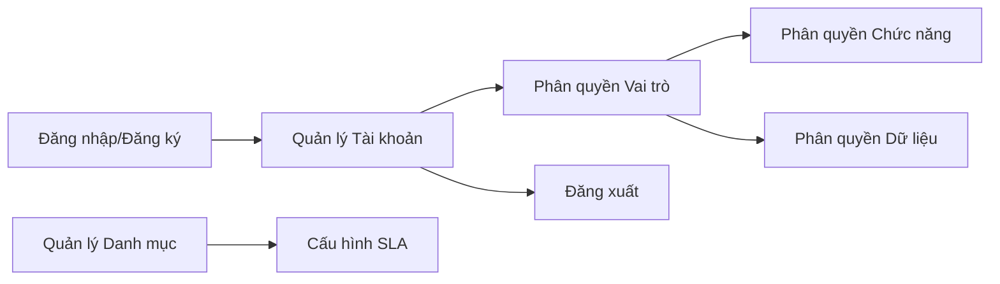
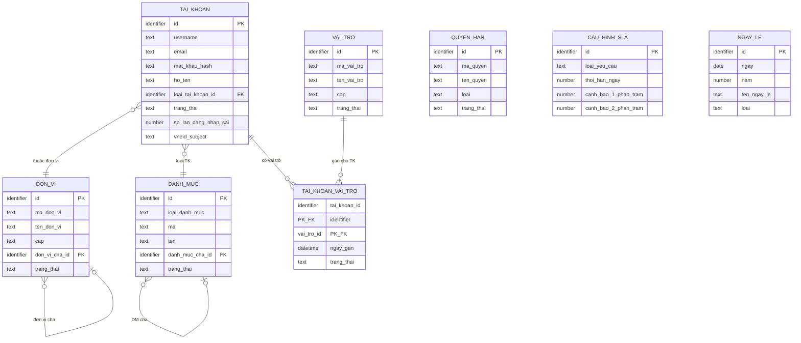
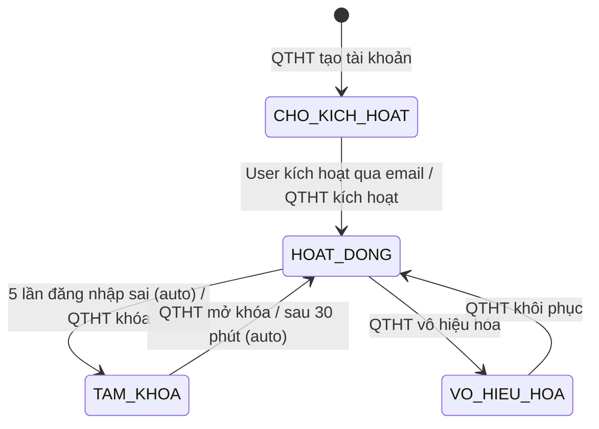

# SRS — Section 3.2.1: Quản trị Hệ thống

**Dự án:** Phần mềm hỗ trợ pháp lý doanh nghiệp
**Phiên bản SRS:** 3.0
**Nhóm:** VIII — Quản trị Hệ thống
**UC range:** UC 99 – UC 119, UC 191 – UC 194
**Số FR:** 25
**File chính:** `srs-v3.md` Section 3.2

---

## Mục lục file này

- [1. Tổng quan nhóm](#1-tổng-quan-nhóm)
- [2. Yêu cầu chức năng chi tiết](#2-yêu-cầu-chức-năng-chi-tiết)
- [3. Màn hình chức năng](#3-màn-hình-chức-năng)
- [4. Entity liên quan](#4-entity-liên-quan)
- [5. State Machine liên quan](#5-state-machine-liên-quan)
- [6. Business Rules liên quan](#6-business-rules-liên-quan)

---

## 1. Tổng quan nhóm

**Mục đích:** Quản lý danh mục hệ thống, phân quyền, tài khoản, đăng nhập — nền tảng cho toàn bộ hệ thống.

**Quy trình nghiệp vụ tổng quan:**

Nhóm VIII cung cấp nền tảng quản trị cho toàn bộ hệ thống: quản lý 15 loại danh mục dùng chung (lĩnh vực PL, loại hình HT, tình trạng vụ việc...), quản lý tài khoản người dùng theo mô hình RBAC (vai trò → quyền chức năng + quyền dữ liệu), cấu hình SLA thời hạn xử lý, và các chức năng xác thực (đăng nhập/đăng xuất, đăng ký tự phục vụ, tích hợp VNeID).

**Entity chính:** DANH_MUC, TAI_KHOAN, VAI_TRO, QUYEN_HAN, DON_VI, CAU_HINH_SLA, AUDIT_LOG

**Tác nhân chính:** Quản trị hệ thống (QTHT), ALL (đăng nhập/xuất)

---

## 2. Yêu cầu chức năng chi tiết

### SHARED TEMPLATE — CRUD Danh mục (TPL-DM-CRUD)

> Áp dụng cho: FR-VIII-01 đến FR-VIII-09, FR-VIII-11 đến FR-VIII-13, FR-VIII-18, FR-VIII-19 (15 UC danh mục)

**Preconditions chung:**

- User đã đăng nhập thành công (BR-AUTH-01)
- User có vai trò QTHT (Quản trị hệ thống)
- Session chưa hết hạn (BR-AUTH-06)

**Inputs chung (ngoài trường riêng):**

| # | Tên field | Kiểu logic | Bắt buộc | Ràng buộc | Mặc định | Nguồn |
|---|----------|-----------|----------|-----------|----------|-------|
| 1 | ma | text | Y | Duy nhất trong loại, max 20 ký tự | — | user input |
| 2 | ten | text | Y | Không trống | — | user input |
| 3 | mo_ta | text | N | — | — | user input |
| 4 | thu_tu | number | N | — | 0 | user input |
| 5 | trang_thai | boolean | Y | 1 = Hoạt động, 0 = Không hoạt động | 1 | user input |

**Processing chung — Xem danh sách (LIST):**

| Bước | Mô tả xử lý | BR áp dụng |
|------|-------------|-----------|
| 1 | Kiểm tra quyền QTHT | BR-AUTH-01, BR-AUTH-02 |
| 2 | Lấy danh sách danh mục theo loại, chỉ bản ghi chưa xóa | BR-DATA-01 |
| 3 | Áp dụng bộ lọc phân quyền theo đơn vị (QTHT bypass) | BR-AUTH-08 |
| 4 | Áp dụng phân trang (mặc định 20/trang, tối đa 100/trang) | BR-DATA-07 |
| 5 | Sắp xếp theo thu_tu tăng dần, ten tăng dần | — |
| 6 | Trả về danh sách + tổng số bản ghi | — |

**Processing chung — Thêm mới (CREATE):**

| Bước | Mô tả xử lý | BR áp dụng |
|------|-------------|-----------|
| 1 | Kiểm tra quyền QTHT | BR-AUTH-01 |
| 2 | Kiểm tra dữ liệu đầu vào: mã (unique trong loại danh mục), tên (không trống) | — |
| 3 | Kiểm tra không trùng mã trong cùng loại danh mục | — |
| 4 | Tạo bản ghi danh mục mới | BR-DATA-03 |
| 5 | Ghi nhật ký thao tác (hành động = 'CREATE') | BR-DATA-05 |
| 6 | Trả về bản ghi vừa tạo | — |

**Processing chung — Chỉnh sửa (UPDATE):**

| Bước | Mô tả xử lý | BR áp dụng |
|------|-------------|-----------|
| 1 | Kiểm tra quyền QTHT | BR-AUTH-01 |
| 2 | Kiểm tra bản ghi tồn tại và chưa bị xóa | BR-DATA-01 |
| 3 | Kiểm tra dữ liệu đầu vào tương tự CREATE | — |
| 4 | Kiểm tra không trùng mã (nếu đổi mã): loại trừ chính mình | — |
| 5 | Cập nhật bản ghi danh mục | — |
| 6 | Ghi nhật ký thao tác (hành động = 'UPDATE', giá trị cũ → mới) | BR-DATA-05 |
| 7 | Trả về bản ghi đã cập nhật | — |

**Processing chung — Xóa (soft delete):**

| Bước | Mô tả xử lý | BR áp dụng |
|------|-------------|-----------|
| 1 | Kiểm tra quyền QTHT | BR-AUTH-01 |
| 2 | Kiểm tra bản ghi tồn tại | — |
| 3 | Kiểm tra ràng buộc tham chiếu: nếu có entity khác đang tham chiếu → từ chối | — |
| 4 | Đánh dấu bản ghi là đã xóa (xóa mềm) | BR-DATA-01 |
| 5 | Ghi nhật ký thao tác (hành động = 'DELETE') | BR-DATA-05 |
| 6 | Trả về kết quả thành công | — |

**Processing chung — Tìm kiếm (SEARCH):**

| Bước | Mô tả xử lý | BR áp dụng |
|------|-------------|-----------|
| 1 | Nhận từ khóa từ đầu vào | — |
| 2 | Tìm kiếm danh mục theo loại, khớp từ khóa với mã hoặc tên, chỉ bản ghi chưa xóa | — |
| 3 | Phân trang + trả về kết quả | BR-DATA-07 |

**Outputs chung (LIST):**

| # | Tên | Kiểu logic | Điều kiện | Format |
|---|-----|-----------|-----------|--------|
| 1 | id | identifier | — | — |
| 2 | ma | text | — | — |
| 3 | ten | text | — | — |
| 4 | mo_ta | text | — | — |
| 5 | thu_tu | number | — | — |
| 6 | trang_thai | boolean | — | — |
| 7 | created_at | datetime | — | dd/mm/yyyy HH:mm |
| 8 | updated_at | datetime | — | dd/mm/yyyy HH:mm |
| 9 | total_count | number | — | — |

**Error Handling chung:**

| # | Điều kiện lỗi | Mã lỗi | Phản hồi hệ thống | Severity |
|---|--------------|--------|-------------------|----------|
| E1 | User không có quyền QTHT | ERR-AUTH-01 | "Bạn không có quyền thực hiện chức năng này" | ERROR |
| E2 | Session hết hạn | ERR-AUTH-02 | Redirect về trang đăng nhập | ERROR |
| E3 | Mã danh mục trùng | ERR-DM-01 | "Mã '{ma}' đã tồn tại trong danh mục {loai}" | ERROR |
| E4 | Tên danh mục trống | ERR-DM-02 | "Tên danh mục là bắt buộc" | ERROR |
| E5 | Bản ghi đang được tham chiếu | ERR-DM-03 | "Không thể xóa. Danh mục đang được sử dụng bởi {N} bản ghi {entity}" | ERROR |
| E6 | Bản ghi không tồn tại | ERR-DM-04 | "Bản ghi không tồn tại hoặc đã bị xóa" | ERROR |
| E7 | Mã vượt quá 20 ký tự | ERR-DM-05 | "Mã danh mục tối đa 20 ký tự" | ERROR |

**Acceptance Criteria chung:**

- **Given** QTHT đăng nhập thành công **When** truy cập danh mục {loại} **Then** hiển thị danh sách phân trang, sắp xếp theo tên
- **Given** QTHT thêm mới **When** nhập đủ trường bắt buộc (mã, tên) **Then** lưu thành công, hiển thị trong danh sách
- **Given** QTHT chỉnh sửa **When** thay đổi thông tin **Then** validate + lưu thành công
- **Given** QTHT xóa danh mục đang được tham chiếu **When** xác nhận xóa **Then** hệ thống từ chối + hiển thị cảnh báo liên kết
- **Given** QTHT tìm kiếm **When** nhập từ khóa **Then** hiển thị kết quả matching

---

### FR-VIII-01: Quản lý danh mục lĩnh vực pháp lý (UC99)

**UC Reference:** UC 99
**Source:** CĐT xác nhận
**Priority:** Essential
**Stability:** High
**Màn hình:** SCR-VIII-01 — [Quản lý Danh mục](#scr-viii-01-quản-lý-danh-mục)

**Mô tả:** Quản lý danh sách lĩnh vực pháp lý (Thuế, Lao động, Đất đai...) sử dụng thống nhất trong toàn hệ thống. Được tham chiếu bởi: HOI_DAP, VU_VIEC, TU_VAN_VIEN, BIEU_MAU, KHO_CAU_HOI, CAU_HINH_PHAN_CONG.

**Tác nhân:** Quản trị hệ thống

**Preconditions:** Theo TPL-DM-CRUD

**Inputs — trường riêng (bổ sung TPL-DM-CRUD):**

| # | Tên field | Kiểu logic | Bắt buộc | Ràng buộc | Mặc định | Nguồn |
|---|----------|-----------|----------|-----------|----------|-------|
| 1 | ma | text | Y | VD: THUE, LAO_DONG | — | user input |
| 2 | ten | text | Y | VD: "Thuế" | — | user input |
| 3 | mo_ta | text | N | — | — | user input |
| 4 | loai_danh_muc | text | Y (system) | = 'LINH_VUC_PL' | LINH_VUC_PL | system |

**Processing:** Theo TPL-DM-CRUD

**Business Rules áp dụng:**
- **BR-DATA-01**: Xóa mềm — Xem Phụ lục B (file chính)
- **BR-DATA-05**: Ghi nhật ký thao tác — Xem Phụ lục B (file chính)

**Outputs:** Theo TPL-DM-CRUD

**Postconditions:** Theo TPL-DM-CRUD

**Error Handling:** Theo TPL-DM-CRUD + ràng buộc xóa: kiểm tra tham chiếu từ HOI_DAP.linh_vuc_id, VU_VIEC.linh_vuc_id, TU_VAN_VIEN (mapping), CAU_HINH_PHAN_CONG.linh_vuc_id, KHO_CAU_HOI.linh_vuc_id

**Acceptance Criteria:** Theo TPL-DM-CRUD

**Seed Data:** Thuế, Lao động, Đất đai, Dân sự, Thương mại, Hình sự, Hành chính, Sở hữu trí tuệ, Doanh nghiệp, Đầu tư

---

### FR-VIII-02: Quản lý danh mục loại hình hỗ trợ (UC100)

**UC Reference:** UC 100
**Source:** CĐT xác nhận
**Priority:** Essential
**Stability:** High
**Màn hình:** SCR-VIII-01 — [Quản lý Danh mục](#scr-viii-01-quản-lý-danh-mục)

**Mô tả:** Quản lý danh sách loại hình hỗ trợ pháp lý.

**Tác nhân:** Quản trị hệ thống

**Template:** TPL-DM-CRUD

**Inputs — trường riêng:**

| # | Tên field | Kiểu logic | Bắt buộc | Ràng buộc | Mặc định | Nguồn |
|---|----------|-----------|----------|-----------|----------|-------|
| 1 | ma | text | Y | VD: TU_VAN, DAO_TAO | — | user input |
| 2 | ten | text | Y | — | — | user input |
| 3 | loai_danh_muc | text | Y (system) | = 'LOAI_HINH_HO_TRO' | LOAI_HINH_HO_TRO | system |

**Seed Data:** Tư vấn PL, Tham gia tố tụng, Đào tạo/bồi dưỡng, Hòa giải, Đại diện ngoài tố tụng

---

### FR-VIII-03: Quản lý danh mục chương trình hỗ trợ (UC101)

**UC Reference:** UC 101
**Source:** CĐT xác nhận
**Priority:** Essential
**Stability:** High
**Màn hình:** SCR-VIII-01 — [Quản lý Danh mục](#scr-viii-01-quản-lý-danh-mục)

**Tác nhân:** Quản trị hệ thống
**Template:** TPL-DM-CRUD

**Inputs — trường riêng:**

| # | Tên field | Kiểu logic | Bắt buộc | Ràng buộc | Mặc định | Nguồn |
|---|----------|-----------|----------|-----------|----------|-------|
| 1 | ma | text | Y | — | — | user input |
| 2 | ten | text | Y | — | — | user input |
| 3 | thoi_gian_bat_dau | date | Y | Ngày bắt đầu CT | — | user input |
| 4 | thoi_gian_ket_thuc | date | N | Ngày kết thúc CT | — | user input |
| 5 | don_vi_chu_tri | text | Y | Đơn vị chủ trì | — | user input |
| 6 | loai_danh_muc | text | Y (system) | = 'CHUONG_TRINH_HT' | CHUONG_TRINH_HT | system |

**Ràng buộc xóa:** Kiểm tra tham chiếu từ CHUONG_TRINH_HTPL (nhóm XI)

---

### FR-VIII-04: Quản lý danh mục tình trạng vụ việc (UC102)

**UC Reference:** UC 102
**Source:** CĐT xác nhận
**Priority:** Essential
**Stability:** High
**Màn hình:** SCR-VIII-01 — [Quản lý Danh mục](#scr-viii-01-quản-lý-danh-mục)

**Tác nhân:** Quản trị hệ thống
**Template:** TPL-DM-CRUD

**Inputs — trường riêng:**

| # | Tên field | Kiểu logic | Bắt buộc | Ràng buộc | Mặc định | Nguồn |
|---|----------|-----------|----------|-----------|----------|-------|
| 1 | ma | text | Y | VD: MOI, DANG_XU_LY | — | user input |
| 2 | ten | text | Y | — | — | user input |
| 3 | thu_tu | number | Y | Thứ tự hiển thị trong workflow | — | user input |
| 4 | mau_hien_thi | text | N | Mã màu HEX (VD: #FF0000) | — | user input |
| 5 | loai_danh_muc | text | Y (system) | = 'TINH_TRANG_VU_VIEC' | TINH_TRANG_VU_VIEC | system |

**Seed Data:** Mới tiếp nhận, Đang kiểm tra, Đã phân công, Đang xử lý, Chờ bổ sung, Hoàn thành, Từ chối

---

### FR-VIII-05: Quản lý danh mục cơ quan đơn vị quản lý (UC103)

**UC Reference:** UC 103
**Source:** CĐT xác nhận
**Priority:** Essential
**Stability:** High
**Màn hình:** SCR-VIII-01 — [Quản lý Danh mục](#scr-viii-01-quản-lý-danh-mục)

**Mô tả:** Quản lý đơn vị theo cấu trúc cây phân cấp 3 cấp (TW → BN → ĐP). Sử dụng entity DON_VI riêng (không dùng bảng DANH_MUC chung).

**Tác nhân:** Quản trị hệ thống

**Preconditions:**
- User đã đăng nhập, vai trò QTHT

**Inputs:**

| # | Tên field | Kiểu logic | Bắt buộc | Ràng buộc | Mặc định | Nguồn |
|---|----------|-----------|----------|-----------|----------|-------|
| 1 | ma_don_vi | text | Y | Unique | — | user input |
| 2 | ten_don_vi | text | Y | — | — | user input |
| 3 | cap | text | Y | TW / BN / DP | — | user input |
| 4 | don_vi_cha_id | identifier | Y (nếu BN/DP) | Tham chiếu DON_VI | — | user input |
| 5 | dia_chi | text | N | — | — | user input |
| 6 | dien_thoai | text | N | — | — | user input |
| 7 | email | text | N | — | — | user input |
| 8 | trang_thai | boolean | Y | 1 = Hoạt động | 1 | user input |

**Processing:**

| Bước | Mô tả xử lý | BR áp dụng |
|------|-------------|-----------|
| 1 | Kiểm tra quyền QTHT | BR-AUTH-01 |
| 2 | Kiểm tra dữ liệu: ma_don_vi unique, cap thuộc (TW, BN, DP) | — |
| 3 | Nếu cap = BN hoặc DP → don_vi_cha_id bắt buộc, kiểm tra đơn vị cha tồn tại | BR-AUTH-02 |
| 4 | Kiểm tra không tạo vòng lặp trong cây đơn vị | — |
| 5 | Tạo bản ghi DON_VI | BR-DATA-03 |
| 6 | Ghi nhật ký thao tác | BR-DATA-05 |

**Outputs:**

| # | Tên | Kiểu logic | Điều kiện | Format |
|---|-----|-----------|-----------|--------|
| 1 | id | identifier | — | — |
| 2 | ma_don_vi | text | — | — |
| 3 | ten_don_vi | text | — | — |
| 4 | cap | text | — | TW/BN/DP |
| 5 | don_vi_cha_id | identifier | — | — |
| 6 | ten_don_vi_cha | text | — | — |
| 7 | trang_thai | boolean | — | — |

**Postconditions:**
- Bản ghi DON_VI được tạo/cập nhật/xóa mềm
- Cây đơn vị duy trì tính toàn vẹn phân cấp

**Error Handling:**

| # | Điều kiện lỗi | Mã lỗi | Phản hồi hệ thống | Severity |
|---|--------------|--------|-------------------|----------|
| E1 | Mã đơn vị trùng | ERR-DV-01 | "Mã đơn vị '{ma}' đã tồn tại" | ERROR |
| E2 | Cấp BN/DP thiếu đơn vị cha | ERR-DV-02 | "Cấp {cap} phải có đơn vị cha" | ERROR |
| E3 | Đơn vị có tài khoản liên kết | ERR-DV-03 | "Không thể xóa. Đơn vị có {N} tài khoản liên kết" | ERROR |
| E4 | Đơn vị có dữ liệu nghiệp vụ | ERR-DV-04 | "Không thể xóa. Đơn vị có {N} bản ghi dữ liệu" | ERROR |
| E5 | Vòng lặp cây đơn vị | ERR-DV-05 | "Không thể tạo vòng lặp phân cấp" | ERROR |

**Acceptance Criteria:**
- **Given** QTHT truy cập "Cơ quan ĐV" **When** hệ thống hiển thị **Then** danh sách cơ quan theo cây đơn vị (TW → BN → ĐP), phân trang
- **Given** QTHT thêm mới **When** nhập đủ trường bắt buộc **Then** lưu thành công
- **Given** QTHT xóa cơ quan có tài khoản/dữ liệu liên kết **When** xác nhận **Then** từ chối + cảnh báo

**Seed Data:** Cục BLDS&KT (TW), 63 Sở Tư pháp (ĐP), 20+ Bộ/Ngành (BN)

---

### FR-VIII-06: Quản lý danh mục tổ chức tư vấn (UC104)

**UC Reference:** UC 104
**Priority:** Essential | **Stability:** High
**Màn hình:** SCR-VIII-01
**Template:** TPL-DM-CRUD

**Inputs — trường riêng:**

| # | Tên field | Kiểu logic | Bắt buộc | Ràng buộc | Mặc định | Nguồn |
|---|----------|-----------|----------|-----------|----------|-------|
| 1 | ma | text | Y | — | — | user input |
| 2 | ten | text | Y | Tên tổ chức tư vấn | — | user input |
| 3 | dia_chi | text | N | — | — | user input |
| 4 | linh_vuc | text | N | Lĩnh vực hoạt động | — | user input |
| 5 | loai_danh_muc | text | Y (system) | = 'TO_CHUC_TU_VAN' | TO_CHUC_TU_VAN | system |

**Ràng buộc xóa:** Kiểm tra tham chiếu từ TU_VAN_VIEN (TVV liên kết tổ chức)

---

### FR-VIII-07: Quản lý danh mục loại doanh nghiệp (UC105)

**UC Reference:** UC 105
**Priority:** Essential | **Stability:** High
**Màn hình:** SCR-VIII-01
**Template:** TPL-DM-CRUD

**Inputs — trường riêng:**

| # | Tên field | Kiểu logic | Bắt buộc | Ràng buộc | Mặc định | Nguồn |
|---|----------|-----------|----------|-----------|----------|-------|
| 1 | ma | text | Y | VD: SIEU_NHO, NHO, VUA | — | user input |
| 2 | ten | text | Y | — | — | user input |
| 3 | tieu_chi_doanh_thu | text | N | Tiêu chí doanh thu (NĐ39/2018) | — | user input |
| 4 | tieu_chi_lao_dong | text | N | Tiêu chí số lao động | — | user input |
| 5 | loai_danh_muc | text | Y (system) | = 'LOAI_DOANH_NGHIEP' | LOAI_DOANH_NGHIEP | system |

**Seed Data:** DN siêu nhỏ, DN nhỏ, DN vừa (theo Luật DNNVV 2017 + NĐ39/2018)

---

### FR-VIII-08: Quản lý danh mục hồ sơ đề nghị hỗ trợ (UC106)

**UC Reference:** UC 106
**Priority:** Essential | **Stability:** High
**Màn hình:** SCR-VIII-01
**Template:** TPL-DM-CRUD

**Inputs — trường riêng:**

| # | Tên field | Kiểu logic | Bắt buộc | Ràng buộc | Mặc định | Nguồn |
|---|----------|-----------|----------|-----------|----------|-------|
| 1 | ma | text | Y | — | — | user input |
| 2 | ten | text | Y | — | — | user input |
| 3 | thanh_phan_bat_buoc | structured | N | Danh sách thành phần HS bắt buộc | — | user input |
| 4 | thanh_phan_tuy_chon | structured | N | Danh sách thành phần tùy chọn | — | user input |
| 5 | loai_danh_muc | text | Y (system) | = 'HO_SO_DE_NGHI_HT' | HO_SO_DE_NGHI_HT | system |

---

### FR-VIII-09: Quản lý danh mục hồ sơ đề nghị thanh toán (UC107)

**UC Reference:** UC 107
**Priority:** Essential | **Stability:** High
**Màn hình:** SCR-VIII-01
**Template:** TPL-DM-CRUD

**Inputs — trường riêng:**

| # | Tên field | Kiểu logic | Bắt buộc | Ràng buộc | Mặc định | Nguồn |
|---|----------|-----------|----------|-----------|----------|-------|
| 1 | ma | text | Y | — | — | user input |
| 2 | ten | text | Y | — | — | user input |
| 3 | thanh_phan_ho_so | structured | N | Thành phần HS | — | user input |
| 4 | loai_danh_muc | text | Y (system) | = 'HO_SO_DE_NGHI_TT' | HO_SO_DE_NGHI_TT | system |

---

### FR-VIII-10: Quản lý cấu hình thời hạn xử lý hồ sơ — SLA (UC108)

**UC Reference:** UC 108
**Source:** CĐT xác nhận
**Priority:** Essential
**Stability:** High
**Màn hình:** SCR-VIII-06 — [Cấu hình Hệ thống, Tab 1: SLA](#scr-viii-06-cấu-hình-hệ-thống-mh-107--man-hinh-moi-v21)

**Mô tả:** Cấu hình thời hạn xử lý và mức cảnh báo SLA cho từng loại yêu cầu. Sử dụng entity CAU_HINH_SLA riêng.

**Tác nhân:** Quản trị hệ thống

**Preconditions:**
- User đã đăng nhập, vai trò QTHT

**Inputs:**

| # | Tên field | Kiểu logic | Bắt buộc | Ràng buộc | Mặc định | Nguồn |
|---|----------|-----------|----------|-----------|----------|-------|
| 1 | loai_yeu_cau | text | Y | UNIQUE: HOI_DAP, VU_VIEC, HO_SO_HT, HO_SO_TT | — | system |
| 2 | ten_loai | text | Y | Tên hiển thị loại YC | — | user input |
| 3 | thoi_han_ngay | number | Y | Số ngày làm việc xử lý, > 0 | — | user input |
| 4 | canh_bao_1_phan_tram | number | Y | Mức CB1 (% thời hạn) | 50 | user input |
| 5 | canh_bao_2_phan_tram | number | Y | Mức CB2 (% thời hạn), CB1 < CB2 < 100 | 90 | user input |
| 6 | qua_han_phan_tram | number | Y | = 100% | 100 | system |
| 7 | gui_email_canh_bao | boolean | Y | Gửi email khi chuyển mức | 1 | user input |
| 8 | gui_thong_bao_app | boolean | Y | Gửi thông báo in-app | 1 | user input |

**Processing:**

| Bước | Mô tả xử lý | BR áp dụng |
|------|-------------|-----------|
| 1 | Kiểm tra quyền QTHT | BR-AUTH-01 |
| 2 | Kiểm tra dữ liệu: thoi_han_ngay > 0, canh_bao_1 < canh_bao_2 < 100 | BR-SLA-01 |
| 3 | Kiểm tra loai_yeu_cau unique | — |
| 4 | Tạo hoặc cập nhật bản ghi CAU_HINH_SLA | — |
| 5 | Ghi nhật ký thao tác | BR-DATA-05 |
| 6 | Tác vụ kiểm tra SLA sẽ sử dụng cấu hình này để tính deadline | BR-CALC-03 |

**Outputs:**

| # | Tên | Kiểu logic | Điều kiện | Format |
|---|-----|-----------|-----------|--------|
| 1 | id | identifier | — | — |
| 2 | loai_yeu_cau | text | — | — |
| 3 | ten_loai | text | — | — |
| 4 | thoi_han_ngay | number | — | — |
| 5 | canh_bao_1_phan_tram | number | — | % |
| 6 | canh_bao_2_phan_tram | number | — | % |

**Postconditions:**
- Cấu hình SLA được lưu/cập nhật
- Các hồ sơ MỚI tiếp nhận sau thời điểm cập nhật sẽ áp dụng cấu hình mới
- Hồ sơ đang xử lý giữ nguyên deadline cũ

**Error Handling:**

| # | Điều kiện lỗi | Mã lỗi | Phản hồi hệ thống | Severity |
|---|--------------|--------|-------------------|----------|
| E1 | thoi_han_ngay <= 0 | ERR-SLA-01 | "Thời hạn xử lý phải là số nguyên dương" | ERROR |
| E2 | canh_bao_1 >= canh_bao_2 | ERR-SLA-02 | "Mức cảnh báo 1 phải nhỏ hơn mức cảnh báo 2" | ERROR |
| E3 | loai_yeu_cau trùng | ERR-SLA-03 | "Loại yêu cầu đã có cấu hình SLA" | ERROR |

**Acceptance Criteria:**
- **Given** QTHT truy cập "Cấu hình SLA" **When** hệ thống hiển thị **Then** danh sách cấu hình SLA theo loại yêu cầu
- **Given** QTHT thêm mới cấu hình **When** nhập đủ trường **Then** lưu thành công
- **Given** QTHT chỉnh sửa **When** thay đổi thời hạn hoặc mức cảnh báo **Then** validate + lưu

**Seed Data:**

| Loại YC | Thời hạn (ngày LV) | CB1 (%) | CB2 (%) | Quá hạn (%) |
|---------|-------------------|---------|---------|-------------|
| VU_VIEC | 10 | 50 | 90 | 100 |
| HO_SO_HT | 15 | 50 | 90 | 100 |
| HO_SO_TT | 10 | 50 | 90 | 100 |
| HOI_DAP | 5 | 50 | 90 | 100 |

---

### FR-VIII-11: Quản lý danh mục tiêu chí đánh giá hiệu quả (UC109)

**UC Reference:** UC 109
**Priority:** Essential | **Stability:** Medium
**Màn hình:** SCR-VIII-01
**Template:** TPL-DM-CRUD (mở rộng)

**Inputs — trường riêng:**

| # | Tên field | Kiểu logic | Bắt buộc | Ràng buộc | Mặc định | Nguồn |
|---|----------|-----------|----------|-----------|----------|-------|
| 1 | ma | text | Y | — | — | user input |
| 2 | ten | text | Y | — | — | user input |
| 3 | trong_so | number | Y | 0-100%, tổng tất cả tiêu chí = 100% | — | user input |
| 4 | thang_diem_min | number | Y | VD: 1 | — | user input |
| 5 | thang_diem_max | number | Y | VD: 5 hoặc 10, phải > thang_diem_min | — | user input |
| 6 | loai_danh_muc | text | Y (system) | = 'TIEU_CHI_DG_HIEU_QUA' | TIEU_CHI_DG_HIEU_QUA | system |

**Processing bổ sung:**

| Bước | Mô tả xử lý | BR áp dụng |
|------|-------------|-----------|
| 7 | Sau mỗi tạo/cập nhật: kiểm tra tổng trọng số = 100% cho toàn bộ tiêu chí hoạt động | BR-CALC-04 |
| 8 | Nếu tổng != 100%: hiển thị cảnh báo (vẫn cho lưu) | — |

**Error Handling bổ sung:**

| # | Điều kiện lỗi | Mã lỗi | Phản hồi hệ thống | Severity |
|---|--------------|--------|-------------------|----------|
| E1 | Tổng trọng số != 100% | WRN-TC-01 | "Tổng trọng số hiện tại: {X}%. Cần đảm bảo = 100% trước khi sử dụng" | WARNING |
| E2 | thang_diem_min >= thang_diem_max | ERR-TC-01 | "Điểm tối thiểu phải nhỏ hơn điểm tối đa" | ERROR |

---

### FR-VIII-12: Quản lý danh mục tiêu chí đánh giá hỗ trợ chi phí (UC110)

**UC Reference:** UC 110
**Priority:** Essential | **Stability:** Medium
**Màn hình:** SCR-VIII-01
**Template:** TPL-DM-CRUD (mở rộng)

**Inputs — trường riêng:**

| # | Tên field | Kiểu logic | Bắt buộc | Ràng buộc | Mặc định | Nguồn |
|---|----------|-----------|----------|-----------|----------|-------|
| 1 | ma | text | Y | VD: SIEU_NHO, NHO, VUA | — | user input |
| 2 | ten | text | Y | — | — | user input |
| 3 | quy_mo_dn | text | Y | SIEU_NHO / NHO / VUA | — | user input |
| 4 | muc_ho_tro_phan_tram | number | Y | VD: 100, 30, 10 | — | user input |
| 5 | tran_ho_tro_nam | money | Y | VNĐ/năm | — | user input |
| 6 | loai_danh_muc | text | Y (system) | = 'TIEU_CHI_DG_CHI_PHI' | TIEU_CHI_DG_CHI_PHI | system |

**Seed Data (NĐ18/2026):** Siêu nhỏ: 100%, 3.000.000 VNĐ | Nhỏ: <=30%, 5.000.000 VNĐ | Vừa: <=10%, 10.000.000 VNĐ

---

### FR-VIII-13: Quản lý loại tài khoản (UC111)

**UC Reference:** UC 111
**Priority:** Essential | **Stability:** High
**Màn hình:** SCR-VIII-01
**Template:** TPL-DM-CRUD

**Inputs — trường riêng:**

| # | Tên field | Kiểu logic | Bắt buộc | Ràng buộc | Mặc định | Nguồn |
|---|----------|-----------|----------|-----------|----------|-------|
| 1 | ma | text | Y | — | — | user input |
| 2 | ten | text | Y | — | — | user input |
| 3 | loai_danh_muc | text | Y (system) | = 'LOAI_TAI_KHOAN' | LOAI_TAI_KHOAN | system |

**Seed Data:** CB NV TW, CB NV BN, CB NV ĐP, CB PD TW, CB PD BN, CB PD ĐP, TVV, CG, DN, NHT, QTHT
**Ràng buộc xóa:** Kiểm tra TAI_KHOAN.loai_tai_khoan

---

### FR-VIII-14: Quản lý vai trò (UC112)

**UC Reference:** UC 112
**Source:** CĐT xác nhận
**Priority:** Essential
**Stability:** High
**Màn hình:** SCR-VIII-02 — [Quản lý Vai trò](#scr-viii-02-quản-lý-vai-trò)

**Mô tả:** Quản lý vai trò hệ thống (CRUD). Sử dụng entity VAI_TRO riêng.

**Tác nhân:** Quản trị hệ thống

**Preconditions:**
- User đã đăng nhập, vai trò QTHT

**Inputs:**

| # | Tên field | Kiểu logic | Bắt buộc | Ràng buộc | Mặc định | Nguồn |
|---|----------|-----------|----------|-----------|----------|-------|
| 1 | ma_vai_tro | text | Y | Unique | — | user input |
| 2 | ten_vai_tro | text | Y | — | — | user input |
| 3 | mo_ta | text | N | — | — | user input |
| 4 | trang_thai | boolean | Y | 1 = Hoạt động | 1 | user input |

**Processing:**

| Bước | Mô tả xử lý | BR áp dụng |
|------|-------------|-----------|
| 1 | Kiểm tra quyền QTHT | BR-AUTH-01 |
| 2 | Kiểm tra dữ liệu: ma_vai_tro unique, ten_vai_tro không trống | — |
| 3 | Tạo / cập nhật / xóa mềm bản ghi VAI_TRO | BR-DATA-01, BR-DATA-03 |
| 4 | Ghi nhật ký thao tác | BR-DATA-05 |

**Outputs:**

| # | Tên | Kiểu logic | Điều kiện | Format |
|---|-----|-----------|-----------|--------|
| 1 | id | identifier | — | — |
| 2 | ma_vai_tro | text | — | — |
| 3 | ten_vai_tro | text | — | — |
| 4 | so_tai_khoan | number | — | Số TK đang gán |
| 5 | so_quyen | number | — | Số quyền đã gán |

**Error Handling:**

| # | Điều kiện lỗi | Mã lỗi | Phản hồi hệ thống | Severity |
|---|--------------|--------|-------------------|----------|
| E1 | Mã vai trò trùng | ERR-VT-01 | "Mã vai trò '{ma}' đã tồn tại" | ERROR |
| E2 | Vai trò đang gán cho TK | ERR-VT-02 | "Không thể xóa. Vai trò đang gán cho {N} tài khoản" | ERROR |

**Postconditions:**
- Bản ghi VAI_TRO được tạo/cập nhật/xóa mềm
- Nhật ký ghi nhận thao tác

**Acceptance Criteria:**
- **Given** QTHT truy cập "Quản lý vai trò" **When** hiển thị **Then** danh sách vai trò, phân trang
- **Given** QTHT thêm mới vai trò **When** nhập đủ trường **Then** lưu thành công
- **Given** QTHT xóa vai trò đang gán cho tài khoản **When** xác nhận **Then** từ chối + cảnh báo

---

### FR-VIII-15: Quản lý tài khoản người dùng (UC113)

**UC Reference:** UC 113
**Source:** CĐT xác nhận
**Priority:** Essential
**Stability:** High
**Màn hình:** SCR-VIII-03 — [Quản lý Tài khoản NSD](#scr-viii-03-quản-lý-tài-khoản-nsd)

**Mô tả:** Quản lý tài khoản người dùng hệ thống (CRUD + khóa/mở khóa).

**Tác nhân:** Quản trị hệ thống

**Preconditions:**
- User đã đăng nhập, vai trò QTHT

**Inputs:**

| # | Tên field | Kiểu logic | Bắt buộc | Ràng buộc | Mặc định | Nguồn |
|---|----------|-----------|----------|-----------|----------|-------|
| 1 | username | text | Y | Unique, 4-50 ký tự, không ký tự đặc biệt | — | user input |
| 2 | email | text | Y | Unique, format email hợp lệ | — | user input |
| 3 | ho_ten | text | Y | — | — | user input |
| 4 | dien_thoai | text | N | — | — | user input |
| 5 | mat_khau | text | Y (tạo mới) | >= 8 ký tự, chữ hoa + thường + số | — | user input |
| 6 | vai_tro_ids | identifier[] | Y | Danh sách ID vai trò | — | user input |
| 7 | don_vi_id | identifier | Y | Tham chiếu DON_VI | — | user input |
| 8 | loai_tai_khoan | text | Y | Loại TK (từ UC111) | — | user input |
| 9 | trang_thai | text | Y | CHO_KICH_HOAT / HOAT_DONG / TAM_KHOA / VO_HIEU_HOA | CHO_KICH_HOAT | system |

**Processing:**

| Bước | Mô tả xử lý | BR áp dụng |
|------|-------------|-----------|
| 1 | Kiểm tra quyền QTHT | BR-AUTH-01 |
| 2 | Kiểm tra dữ liệu: username unique, email unique, format hợp lệ | — |
| 3 | Kiểm tra mật khẩu đủ độ mạnh: >= 8 ký tự, chứa chữ hoa + chữ thường + số | — |
| 4 | Mã hóa mật khẩu (hash) | — |
| 5 | Tạo bản ghi TAI_KHOAN | BR-DATA-03 |
| 6 | Tạo liên kết tài khoản ↔ vai trò (N-N) cho mỗi vai trò được chọn | — |
| 7 | Gửi email kích hoạt (nếu tạo mới) | — |
| 8 | Ghi nhật ký thao tác | BR-DATA-05 |

**Outputs:**

| # | Tên | Kiểu logic | Điều kiện | Format |
|---|-----|-----------|-----------|--------|
| 1 | id | identifier | — | — |
| 2 | username | text | — | — |
| 3 | email | text | — | — |
| 4 | ho_ten | text | — | — |
| 5 | ten_don_vi | text | — | — |
| 6 | ten_vai_tro | text[] | — | danh sách vai trò |
| 7 | loai_tai_khoan | text | — | — |
| 8 | trang_thai | text | — | — |
| 9 | ngay_tao | datetime | — | dd/mm/yyyy HH:mm |
| 10 | lan_dang_nhap_cuoi | datetime | — | dd/mm/yyyy HH:mm |

**Error Handling:**

| # | Điều kiện lỗi | Mã lỗi | Phản hồi hệ thống | Severity |
|---|--------------|--------|-------------------|----------|
| E1 | Username trùng | ERR-TK-01 | "Username '{username}' đã tồn tại" | ERROR |
| E2 | Email trùng | ERR-TK-02 | "Email '{email}' đã được sử dụng" | ERROR |
| E3 | Mật khẩu yếu | ERR-TK-03 | "Mật khẩu phải >= 8 ký tự, chứa chữ hoa, chữ thường và số" | ERROR |
| E4 | Username chứa ký tự đặc biệt | ERR-TK-04 | "Username chỉ chấp nhận chữ cái, số và dấu gạch dưới" | ERROR |
| E5 | Đơn vị không tồn tại | ERR-TK-05 | "Đơn vị không tồn tại hoặc đã bị vô hiệu hóa" | ERROR |
| E6 | Vai trò không tồn tại | ERR-TK-06 | "Vai trò ID {id} không tồn tại" | ERROR |

**Postconditions:**
- Bản ghi TAI_KHOAN được tạo/cập nhật/khóa/mở khóa
- Liên kết tài khoản ↔ vai trò được cập nhật
- Email kích hoạt được gửi (nếu tạo mới)
- Nhật ký ghi nhận thao tác

**Acceptance Criteria:**
- **Given** QTHT truy cập "Quản lý tài khoản" **When** hiển thị **Then** danh sách TK, phân trang, lọc theo vai trò/đơn vị/trạng thái
- **Given** QTHT thêm mới TK **When** nhập đủ trường **Then** tạo TK + gửi email kích hoạt
- **Given** QTHT khóa tài khoản **When** xác nhận **Then** TK bị vô hiệu hóa
- **Given** QTHT mở khóa tài khoản **When** xác nhận **Then** TK được kích hoạt lại

---

### FR-VIII-16: Phân quyền truy cập dữ liệu (UC114)

**UC Reference:** UC 114
**Source:** CĐT xác nhận
**Priority:** Essential
**Stability:** High
**Màn hình:** SCR-VIII-05 — [Phân quyền Dữ liệu](#scr-viii-05-phân-quyền-dữ-liệu)

**Mô tả:** Phân quyền xem dữ liệu theo đơn vị cho vai trò. Quy tắc: ngang cấp KHÔNG thấy nhau, cha thấy con.

**Tác nhân:** Quản trị hệ thống

**Preconditions:**
- User đã đăng nhập, vai trò QTHT
- Vai trò đã tồn tại (UC112)
- Đơn vị đã tồn tại (UC103)

**Inputs:**

| # | Tên field | Kiểu logic | Bắt buộc | Ràng buộc | Mặc định | Nguồn |
|---|----------|-----------|----------|-----------|----------|-------|
| 1 | vai_tro_id | identifier | Y | Tham chiếu VAI_TRO | — | user input |
| 2 | don_vi_ids | identifier[] | Y | Danh sách đơn vị được phép xem | — | user input |
| 3 | entity_type | text | N | Loại entity (null = tất cả) | null | user input |

**Processing:**

| Bước | Mô tả xử lý | BR áp dụng |
|------|-------------|-----------|
| 1 | Kiểm tra quyền QTHT | BR-AUTH-01 |
| 2 | Kiểm tra vai trò tồn tại | — |
| 3 | Kiểm tra đơn vị tồn tại | — |
| 4 | Kiểm tra quy tắc: ngang cấp KHÔNG thấy nhau | BR-AUTH-03 |
| 5 | Kiểm tra quy tắc: cấp cha thấy cấp con | BR-AUTH-04 |
| 6 | Xóa toàn bộ quyền dữ liệu cũ + tạo quyền mới cho vai trò (trong 1 giao dịch) | — |
| 7 | Cập nhật bộ nhớ đệm chính sách phân quyền theo đơn vị | BR-AUTH-08 |
| 8 | Ghi nhật ký thao tác | BR-DATA-05 |

**Error Handling:**

| # | Điều kiện lỗi | Mã lỗi | Phản hồi hệ thống | Severity |
|---|--------------|--------|-------------------|----------|
| E1 | Vi phạm quy tắc ngang cấp | ERR-PQ-01 | "Không thể gán quyền xem đơn vị {A} cho vai trò thuộc đơn vị {B} (ngang cấp)" | ERROR |
| E2 | Vai trò không tồn tại | ERR-PQ-02 | "Vai trò không tồn tại" | ERROR |
| E3 | Đơn vị không tồn tại | ERR-PQ-03 | "Đơn vị ID {id} không tồn tại" | ERROR |

**Postconditions:**
- Quyền dữ liệu của vai trò được cập nhật (xóa cũ + tạo mới)
- Bộ nhớ đệm chính sách phân quyền được làm mới
- Nhật ký ghi nhận thao tác

**Acceptance Criteria:**
- **Given** QTHT truy cập "Phân quyền dữ liệu" **When** chọn vai trò X **Then** hiển thị danh sách quyền dữ liệu hiện tại
- **Given** QTHT gán quyền dữ liệu cho vai trò X tại đơn vị Y **When** lưu **Then** user thuộc vai trò X chỉ thấy dữ liệu đơn vị Y
- Quy tắc: Ngang cấp KHÔNG thấy nhau, cha thấy con

---

### FR-VIII-17: Phân quyền chức năng (UC115)

**UC Reference:** UC 115
**Source:** CĐT xác nhận
**Priority:** Essential
**Stability:** High
**Màn hình:** SCR-VIII-04 — [Phân quyền Chức năng](#scr-viii-04-phân-quyền-chức-năng)

**Mô tả:** Phân quyền truy cập menu/chức năng cho vai trò qua ma trận checkbox.

**Tác nhân:** Quản trị hệ thống

**Preconditions:**
- User đã đăng nhập, vai trò QTHT
- Vai trò đã tồn tại (UC112)

**Inputs:**

| # | Tên field | Kiểu logic | Bắt buộc | Ràng buộc | Mặc định | Nguồn |
|---|----------|-----------|----------|-----------|----------|-------|
| 1 | vai_tro_id | identifier | Y | Tham chiếu VAI_TRO | — | user input |
| 2 | quyen_ids | identifier[] | Y | Danh sách quyền chức năng bật/tắt | — | user input |

**Processing:**

| Bước | Mô tả xử lý | BR áp dụng |
|------|-------------|-----------|
| 1 | Kiểm tra quyền QTHT | BR-AUTH-01 |
| 2 | Kiểm tra vai trò tồn tại | — |
| 3 | Tải cây menu (danh sách quyền hệ thống) | — |
| 4 | Xóa toàn bộ quyền cũ + tạo quyền mới cho vai trò | — |
| 5 | Ghi nhật ký thao tác (quyền cũ → quyền mới) | BR-DATA-05 |

**Error Handling:**

| # | Điều kiện lỗi | Mã lỗi | Phản hồi hệ thống | Severity |
|---|--------------|--------|-------------------|----------|
| E1 | Vai trò không tồn tại | ERR-PQ-02 | "Vai trò không tồn tại" | ERROR |
| E2 | Quyền không tồn tại | ERR-PQ-04 | "Quyền chức năng ID {id} không tồn tại" | ERROR |

**Postconditions:**
- Quyền chức năng của vai trò được cập nhật (xóa cũ + tạo mới)
- Nhật ký ghi nhận thao tác (quyền cũ → quyền mới)

**Acceptance Criteria:**
- **Given** QTHT truy cập "Phân quyền chức năng" **When** chọn vai trò **Then** hiển thị cây menu + trạng thái bật/tắt
- **Given** QTHT gán quyền cho vai trò **When** bật toggle + lưu **Then** vai trò được phép truy cập menu tương ứng

---

### FR-VIII-18: Quản lý danh mục loại hình tiếp nhận (UC116)

**UC Reference:** UC 116
**Priority:** Essential | **Stability:** High
**Màn hình:** SCR-VIII-01
**Template:** TPL-DM-CRUD

**Inputs — trường riêng:**

| # | Tên field | Kiểu logic | Bắt buộc | Ràng buộc | Mặc định | Nguồn |
|---|----------|-----------|----------|-----------|----------|-------|
| 1 | ma | text | Y | VD: TRUC_TUYEN, TRUC_TIEP | — | user input |
| 2 | ten | text | Y | — | — | user input |
| 3 | loai_danh_muc | text | Y (system) | = 'LOAI_HINH_TIEP_NHAN' | LOAI_HINH_TIEP_NHAN | system |

**Seed Data:** Trực tuyến (DVC QG), Trực tiếp, Hệ thống khác, Bưu chính, Điện thoại

---

### FR-VIII-19: Quản lý danh mục kênh tiếp nhận (UC117)

**UC Reference:** UC 117
**Priority:** Essential | **Stability:** High
**Màn hình:** SCR-VIII-01
**Template:** TPL-DM-CRUD

**Inputs — trường riêng:**

| # | Tên field | Kiểu logic | Bắt buộc | Ràng buộc | Mặc định | Nguồn |
|---|----------|-----------|----------|-----------|----------|-------|
| 1 | ma | text | Y | — | — | user input |
| 2 | ten | text | Y | Tên kênh tiếp nhận | — | user input |
| 3 | loai_danh_muc | text | Y (system) | = 'KENH_TIEP_NHAN' | KENH_TIEP_NHAN | system |

---

### FR-VIII-20: Quản lý đăng nhập (UC118)

**UC Reference:** UC 118
**Source:** CĐT xác nhận (Tier 1)
**Priority:** Essential
**Stability:** High
**Màn hình:** SCR-VIII-07 — [Đăng nhập (MH-10.8b)](#scr-viii-07-dang-nhap)

**Mô tả:** Xác thực người dùng qua username/password + TOTP 2FA (Tier 1 MVP). Hỗ trợ mở rộng VNeID OIDC (Tier 3).

**Tác nhân:** ALL (mọi user)

**Preconditions:**
- User có tài khoản hợp lệ trên hệ thống
- Tài khoản ở trạng thái HOAT_DONG

**Inputs — Tier 1 (MVP):**

| # | Tên field | Kiểu logic | Bắt buộc | Ràng buộc | Mặc định | Nguồn |
|---|----------|-----------|----------|-----------|----------|-------|
| 1 | username | text | Y | Tên đăng nhập | — | user input |
| 2 | mat_khau | text | Y | Mật khẩu | — | user input |
| 3 | otp_code | text | Y (bước 2) | Mã TOTP 6 số gửi qua email, hiệu lực 5 phút | — | user input |

**Processing — Tier 1 (MVP):**

| Bước | Mô tả xử lý | BR áp dụng |
|------|-------------|-----------|
| 1 | Nhận username + password từ form | — |
| 2 | Tìm tài khoản theo username, chỉ bản ghi chưa xóa | — |
| 3 | Nếu không tìm thấy → lỗi đăng nhập | BR-AUTH-01 |
| 4 | Kiểm tra trạng thái tài khoản = HOAT_DONG. Nếu TAM_KHOA → lỗi | BR-AUTH-07 |
| 5 | So sánh mật khẩu đã mã hóa | — |
| 6 | Nếu sai: tăng số lần đăng nhập sai. Nếu >= 5 → tạm khóa tài khoản | BR-AUTH-07 |
| 7 | Nếu đúng: reset số lần đăng nhập sai = 0 | — |
| 8 | Gửi mã TOTP 6 số qua email (hiệu lực 5 phút) | BR-AUTH-01 |
| 9 | User nhập mã TOTP. Nếu sai hoặc hết hạn → lỗi | — |
| 10 | Tạo phiên làm việc (API: 15 phút, CMS: 30 phút idle timeout) | BR-AUTH-06 |
| 11 | Cập nhật thời gian đăng nhập cuối | — |
| 12 | Ghi nhật ký thao tác (hành động = 'LOGIN', IP, user agent) | BR-DATA-05 |
| 13 | Chuyển hướng về Dashboard | — |

**Outputs:**

| # | Tên | Kiểu logic | Điều kiện | Format |
|---|-----|-----------|-----------|--------|
| 1 | access_token | text | — | JWT |
| 2 | expires_in | number | — | giây |
| 3 | refresh_token | text | — | JWT (TTL 24h) |
| 4 | user_info | structured | — | id, username, ho_ten, don_vi, vai_tro[], cap |

**Postconditions:**
- Phiên làm việc được tạo
- Nhật ký ghi nhận đăng nhập thành công/thất bại

**Error Handling:**

| # | Điều kiện lỗi | Mã lỗi | Phản hồi hệ thống | Severity |
|---|--------------|--------|-------------------|----------|
| E1 | Username/password sai | ERR-DN-01 | "Đăng nhập không thành công. Vui lòng kiểm tra lại thông tin" | ERROR |
| E2 | TK bị tạm khóa | ERR-DN-02 | "Tài khoản đã bị tạm khóa. Vui lòng liên hệ QTHT" | ERROR |
| E3 | TK bị vô hiệu hóa | ERR-DN-03 | "Tài khoản đã bị vô hiệu hóa" | ERROR |
| E4 | Đăng nhập sai >= 5 lần | ERR-DN-04 | "Tài khoản đã bị tạm khóa do đăng nhập sai quá 5 lần" | ERROR |
| E5 | Session hết hạn | ERR-DN-07 | Redirect về trang đăng nhập + "Phiên làm việc hết hạn" | INFO |
| E6 | Mã TOTP sai hoặc hết hạn | ERR-DN-08 | "Mã xác thực không đúng hoặc đã hết hạn" | ERROR |

**Acceptance Criteria:**
- **Given** user nhập username/password đúng + mã TOTP đúng **When** đăng nhập **Then** xác thực thành công, tạo phiên, redirect Dashboard
- **Given** user nhập sai **When** đăng nhập **Then** hiển thị thông báo lỗi
- **Given** user đăng nhập sai quá 5 lần **When** thử lại **Then** tạm khóa TK
- **Given** session hết hạn (30 phút idle) **When** user thao tác **Then** redirect về đăng nhập

---

### FR-VIII-21: Quản lý đăng xuất (UC119)

**UC Reference:** UC 119
**Source:** CĐT xác nhận
**Priority:** Essential
**Stability:** High
**Màn hình:** SCR-VIII-09 — [Đăng xuất](#scr-viii-09-đăng-xuất)

**Mô tả:** Kết thúc phiên làm việc (chủ động hoặc tự động khi timeout).

**Tác nhân:** ALL (mọi user)

**Preconditions:**
- User đang có phiên làm việc hoạt động

**Inputs:**

| # | Tên field | Kiểu logic | Bắt buộc | Ràng buộc | Mặc định | Nguồn |
|---|----------|-----------|----------|-----------|----------|-------|
| 1 | session_token | text | Y | JWT token hiện tại | — | system |

**Processing:**

| Bước | Mô tả xử lý | BR áp dụng |
|------|-------------|-----------|
| 1 | Nhận yêu cầu đăng xuất (click "Đăng xuất" hoặc timeout 30 phút) | BR-AUTH-06 |
| 2 | Hủy hiệu lực JWT token (thêm vào danh sách đen) | — |
| 3 | Ghi nhật ký thao tác (hành động = 'LOGOUT' hoặc 'SESSION_TIMEOUT') | BR-DATA-05 |
| 4 | Xóa phiên/cookie phía client | — |
| 5 | Chuyển hướng về màn hình đăng nhập | — |

**Outputs:**

| # | Tên | Kiểu logic | Điều kiện | Format |
|---|-----|-----------|-----------|--------|
| 1 | redirect_url | text | — | URL trang đăng nhập |
| 2 | message | text | — | "Đăng xuất thành công" / "Phiên hết hạn" |

**Postconditions:**
- Phiên làm việc bị hủy
- JWT token bị vô hiệu hóa (thêm vào danh sách đen)
- Nhật ký ghi nhận đăng xuất

**Acceptance Criteria:**
- **Given** user chọn "Đăng xuất" **When** xử lý **Then** kết thúc session, ghi audit, chuyển về login
- **Given** user không thao tác quá 30 phút **When** hết timeout **Then** tự động đăng xuất

---

### FR-VIII-22: Đăng ký tài khoản — Self-registration (UC191)

**UC Reference:** UC 191
**Source:** CSV v1.1
**Priority:** Essential
**Stability:** Medium
**Màn hình:** SCR-VIII-08, SCR-VIII-08a — [Đăng ký Tài khoản](#scr-viii-08-đăng-ký-tài-khoản)

**Mô tả:** Người dùng bên ngoài (NHT/TVV/CG) tự đăng ký tài khoản qua chuyên trang. Sau xác nhận email → QTHT duyệt → kích hoạt.

**Tác nhân:** Người dùng chưa có TK (NHT/TVV/CG)

**Preconditions:**
- Người dùng truy cập chuyên trang (không yêu cầu đăng nhập)
- Email đăng ký chưa tồn tại trong hệ thống

**Inputs:**

| # | Tên field | Kiểu logic | Bắt buộc | Ràng buộc | Mặc định | Nguồn |
|---|----------|-----------|----------|-----------|----------|-------|
| 1 | ho_ten | text | Y | Họ và tên đầy đủ | — | user input |
| 2 | email | text | Y | Unique, dùng làm username | — | user input |
| 3 | so_dien_thoai | text | Y | Số điện thoại liên hệ | — | user input |
| 4 | cccd | text | N | Số CCCD 12 chữ số | — | user input |
| 5 | loai_tai_khoan | text | Y | NHT / TVV / CG | — | user input |
| 6 | don_vi | text | N | Tên tổ chức/đơn vị | — | user input |
| 7 | mat_khau | text | Y | Min 8 ký tự, chữ hoa + số + đặc biệt | — | user input |
| 8 | mat_khau_xac_nhan | text | Y | Phải khớp mat_khau | — | user input |
| 9 | captcha | text | Y | CAPTCHA chống bot | — | user input |

**Processing:**

| Bước | Mô tả xử lý | BR áp dụng |
|------|-------------|-----------|
| 1 | Kiểm tra CAPTCHA | — |
| 2 | Kiểm tra email chưa tồn tại (ràng buộc unique) | BR-DATA-02 |
| 3 | Kiểm tra mật khẩu đủ độ mạnh | BR-AUTH-01 |
| 4 | Mã hóa mật khẩu (hash) | — |
| 5 | Tạo bản ghi TAI_KHOAN với trạng thái = CHO_KICH_HOAT | SM-TAIKHOAN |
| 6 | Gửi email xác nhận (link kích hoạt, hiệu lực 24 giờ) | — |
| 7 | User click link → chuyển trạng thái = CHO_PHAN_QUYEN | SM-TAIKHOAN |
| 8 | Thông báo QTHT: có tài khoản mới chờ gán vai trò + đơn vị | — |
| 9 | QTHT duyệt → chuyển trạng thái = HOAT_DONG, gán vai trò + đơn vị | SM-TAIKHOAN |
| 10 | Ghi nhật ký thao tác (hành động = 'SELF_REGISTER') | BR-DATA-05 |

**Error Handling:**

| # | Điều kiện lỗi | Mã lỗi | Phản hồi hệ thống | Severity |
|---|--------------|--------|-------------------|----------|
| E1 | Email đã tồn tại | ERR-REG-01 | "Email đã được sử dụng" | ERROR |
| E2 | Mật khẩu yếu | ERR-REG-02 | "Mật khẩu chưa đủ mạnh" | ERROR |
| E3 | CAPTCHA sai | ERR-REG-03 | "Vui lòng xác minh lại" | ERROR |
| E4 | Link kích hoạt hết hạn | ERR-REG-04 | "Link kích hoạt đã hết hạn. Vui lòng đăng ký lại" | ERROR |

**Postconditions:**
- Bản ghi TAI_KHOAN được tạo với trạng thái CHO_KICH_HOAT
- Email xác nhận kích hoạt được gửi
- Sau kích hoạt: trạng thái chuyển CHO_PHAN_QUYEN, QTHT nhận thông báo

**Acceptance Criteria:**
- **Given** NHT/TVV/CG truy cập form đăng ký **When** điền đủ thông tin + submit **Then** TK được tạo (CHO_KICH_HOAT), email xác nhận được gửi
- **Given** user click link activation **When** link còn hạn **Then** TK chuyển CHO_PHAN_QUYEN, QTHT nhận thông báo
- **Given** QTHT duyệt TK **When** gán vai trò + đơn vị **Then** TK chuyển HOAT_DONG, user có thể đăng nhập

---

### FR-VIII-23: Đăng nhập bằng VNeID (UC192)

**UC Reference:** UC 192
**Source:** CSV v1.1
**Priority:** Essential
**Stability:** Low
**Màn hình:** SCR-VIII-07 — [Đăng nhập (MH-10.8b)](#scr-viii-07-dang-nhap)

**Mô tả:** Đăng nhập qua VNeID OIDC Authorization Code flow. Chỉ áp dụng khi Tier 3 đã triển khai, cho TVV/CG/NHT.

**Tác nhân:** TVV, CG, NHT

**Preconditions:**
- Tier 3 VNeID SSO đã triển khai (feature flag bật)
- User có tài khoản VNeID hợp lệ
- Hệ thống đã được phê duyệt kết nối VNeID theo NĐ69/2024

**Inputs:**

| # | Tên field | Kiểu logic | Bắt buộc | Ràng buộc | Mặc định | Nguồn |
|---|----------|-----------|----------|-----------|----------|-------|
| 1 | vneid_auth_code | text | Y (auto) | Authorization code từ VNeID OIDC redirect | — | system |

**Processing:**

| Bước | Mô tả xử lý | BR áp dụng |
|------|-------------|-----------|
| 1 | User chọn "Đăng nhập bằng VNeID" | — |
| 2 | Chuyển hướng đến VNeID authorization endpoint (OIDC Authorization Code flow, scope=openid) | BR-INTG-06 |
| 3 | User xác thực trên trang VNeID | — |
| 4 | VNeID chuyển hướng về callback URL kèm authorization code | — |
| 5 | Đổi code lấy access_token + id_token | — |
| 6 | Giải mã id_token → lấy CCCD, họ tên, ngày sinh | — |
| 7 | Tìm tài khoản theo CCCD | — |
| 8 | Nếu tồn tại + HOAT_DONG: tạo phiên, cập nhật thông tin từ VNeID | — |
| 9 | Nếu tồn tại + khác HOAT_DONG: từ chối, thông báo liên hệ QTHT | — |
| 10 | Nếu không tồn tại: tạo TK mới (CHO_PHAN_QUYEN), thông báo QTHT | SM-TAIKHOAN |
| 11 | Ghi nhật ký thao tác (hành động = 'LOGIN_VNEID') | BR-DATA-05 |

**Error Handling:**

| # | Điều kiện lỗi | Mã lỗi | Phản hồi hệ thống | Severity |
|---|--------------|--------|-------------------|----------|
| E1 | VNeID OIDC lỗi | ERR-VN-01 | "Đăng nhập VNeID thất bại. Vui lòng thử lại hoặc sử dụng tài khoản nội bộ" | ERROR |
| E2 | CCCD không có TK | ERR-VN-02 | "Chưa có tài khoản trên hệ thống. Vui lòng liên hệ QTHT" | ERROR |
| E3 | Tier 3 chưa triển khai | ERR-VN-03 | Nút "Đăng nhập VNeID" ẩn (feature flag off) | — |

**Postconditions:**
- Phiên làm việc được tạo (nếu TK tồn tại + HOAT_DONG)
- TK mới được tạo (CHO_PHAN_QUYEN) nếu CCCD chưa có trong hệ thống
- Nhật ký ghi nhận đăng nhập VNeID

**Acceptance Criteria:**
- **Given** Tier 3 đã triển khai, user TVV/CG/NHT chọn "Đăng nhập bằng VNeID" **When** xác thực OIDC thành công **Then** session được tạo, redirect Dashboard
- **Given** CCCD từ VNeID không có TK **When** đăng nhập **Then** tạo TK CHO_PHAN_QUYEN, thông báo QTHT

---

### FR-VIII-24: Đăng xuất VNeID (UC193)

**UC Reference:** UC 193
**Source:** CSV v1.1
**Priority:** Essential
**Stability:** Low
**Màn hình:** SCR-VIII-09 — [Đăng xuất](#scr-viii-09-đăng-xuất)

**Mô tả:** Đăng xuất khi user đã đăng nhập qua VNeID. Hủy cả phiên PM và token VNeID.

**Tác nhân:** TVV, CG, NHT (đã đăng nhập qua VNeID)

**Preconditions:**
- User đang có phiên đăng nhập qua VNeID

**Processing:**

| Bước | Mô tả xử lý | BR áp dụng |
|------|-------------|-----------|
| 1 | User chọn "Đăng xuất" | — |
| 2 | Hủy hiệu lực JWT token trên hệ thống PM | BR-AUTH-06 |
| 3 | Gọi VNeID OIDC logout endpoint để thu hồi VNeID token | BR-INTG-06 |
| 4 | Ghi nhật ký thao tác (hành động = 'LOGOUT_VNEID') | BR-DATA-05 |
| 5 | Xóa phiên/cookie phía client | — |
| 6 | Chuyển hướng về trang đăng nhập PM (không redirect về VNeID) | — |

**Acceptance Criteria:**
- **Given** user đã đăng nhập qua VNeID **When** chọn "Đăng xuất" **Then** session PM hủy + VNeID token thu hồi + redirect trang login
- **Given** VNeID logout endpoint không phản hồi **When** timeout **Then** vẫn hủy session PM, ghi warning log

**Postconditions:**
- Phiên PM bị hủy, JWT token vô hiệu hóa
- VNeID token được thu hồi (nếu endpoint phản hồi)
- Nhật ký ghi nhận đăng xuất VNeID

---

### FR-VIII-25: Đồng bộ tài khoản VNeID (UC194)

**UC Reference:** UC 194
**Source:** CSV v1.1
**Priority:** Essential
**Stability:** Low
**Màn hình:** Không có màn hình riêng (tác vụ nền + trigger thủ công từ QTHT)

**Mô tả:** Tác vụ tự động chạy hàng ngày đồng bộ thông tin tài khoản từ VNeID. QTHT có thể trigger thủ công.

**Tác nhân:** Hệ thống (scheduled job) + QTHT (trigger thủ công)

**Preconditions:**
- Tier 3 VNeID SSO đã triển khai
- Có ít nhất 1 tài khoản đã liên kết VNeID

**Processing:**

| Bước | Mô tả xử lý | BR áp dụng |
|------|-------------|-----------|
| 1 | Tác vụ tự động chạy hàng ngày (02:00 AM) hoặc QTHT trigger thủ công | — |
| 2 | Lấy danh sách tài khoản đã liên kết VNeID | — |
| 3 | Với mỗi TK: gọi VNeID UserInfo API | BR-INTG-06 |
| 4 | So sánh thông tin VNeID (họ tên, ngày sinh, nơi thường trú) với tài khoản hiện tại | — |
| 5 | Nếu có thay đổi: cập nhật tài khoản, ghi nhật ký (hành động = 'VNEID_SYNC') | BR-DATA-05 |
| 6 | Nếu VNeID thu hồi (TK bị hủy bên VNeID): tạm khóa TK, thông báo QTHT | SM-TAIKHOAN |
| 7 | Ghi báo cáo đồng bộ: số TK đồng bộ, số thay đổi, số lỗi | — |

**Outputs:**

| # | Tên | Kiểu logic | Điều kiện | Format |
|---|-----|-----------|-----------|--------|
| 1 | so_tk_dong_bo | number | — | — |
| 2 | so_thay_doi | number | — | — |
| 3 | so_loi | number | — | — |
| 4 | chi_tiet_loi | structured | — | Danh sách TK lỗi + lý do |

**Acceptance Criteria:**
- **Given** scheduled job chạy **When** có TK VNeID **Then** đồng bộ thông tin mới nhất
- **Given** TK bị hủy bên VNeID **When** đồng bộ **Then** tạm khóa TK + thông báo QTHT
- **Given** QTHT trigger thủ công **When** chọn "Đồng bộ VNeID" **Then** chạy đồng bộ ngay

**Postconditions:**
- Thông tin tài khoản liên kết VNeID được cập nhật theo dữ liệu mới nhất
- TK bị hủy bên VNeID sẽ bị tạm khóa + QTHT nhận thông báo
- Báo cáo đồng bộ được ghi nhận

---

---

## 3. Màn hình chức năng

> **Thay đổi v2.1:** MH-10.6 (Cấu hình SLA) gộp vào MH-10.7 tab "SLA". MH-02.6 (Cấu hình Phân công) + MH-02.7 (Mẫu phản hồi) chuyển từ Hỏi đáp vào MH-10.7. Thêm MH-10.10 (Nhật ký hệ thống). MH-10.7 (Đăng nhập cũ) đổi số thành MH-10.8b.

### SCR-VIII-01: Quản lý Danh mục

**Loại màn hình:** Danh sách + Modal CRUD
**FR sử dụng:** FR-VIII-01 đến FR-VIII-13, FR-VIII-18, FR-VIII-19
**UX-Spec ref:** dac-ta-man-hinh-chuc-nang-v2.md — MH-10.1

#### Thành phần màn hình

| # | Vùng | Thành phần | Loại | Dữ liệu / Nội dung | Hành vi | Điều kiện hiển thị |
|---|------|-----------|------|---------------------|---------|-------------------|
| 1 | toolbar | Breadcrumb | breadcrumb | "Trang chủ > Quản trị > Danh mục" | navigate | luôn hiển thị |
| 2 | sidebar | Tab dọc bên trái (14 tab) | tab | 14 loại danh mục: Lĩnh vực PL, Loại hình HT, Chương trình HT, Tình trạng VV, Cơ quan ĐV, Tổ chức tư vấn, Loại DN, Hồ sơ đề nghị HT, Hồ sơ đề nghị TT, Tiêu chí ĐG hiệu quả, Tiêu chí ĐG chi phí, Loại TK, Loại hình tiếp nhận, Kênh tiếp nhận | click → chuyển tab | luôn hiển thị |
| 3 | toolbar | Nút thêm mới | button | [+ Thêm mới] | click → mở modal CRUD | luôn hiển thị |
| 4 | filter-bar | Ô tìm kiếm | search-box | Tìm theo mã hoặc tên | change → filter | luôn hiển thị |
| 5 | content | Cột Mã | table-column | Mã danh mục (unique, max 20 ký tự) | — | luôn hiển thị |
| 6 | content | Cột Tên | table-column | Tên hiển thị | — | luôn hiển thị |
| 7 | content | Cột Mô tả | table-column | Mô tả (truncate) | — | luôn hiển thị |
| 8 | content | Cột Thứ tự | table-column | Thứ tự hiển thị | — | luôn hiển thị |
| 9 | content | Cột Trạng thái | toggle | Hoạt động / Không | toggle → cập nhật | luôn hiển thị |
| 10 | content | Cột Hành động | button | Sửa / Xóa | click → modal sửa / xác nhận xóa | luôn hiển thị |
| 11 | modal | Mã | text-input | Bắt buộc, max 20 ký tự, validate unique | — | khi mở modal |
| 12 | modal | Tên | text-input | Bắt buộc | — | khi mở modal |
| 13 | modal | Mô tả | textarea | Không bắt buộc | — | khi mở modal |
| 14 | modal | Thứ tự | text-input | Mặc định: 0 | — | khi mở modal |
| 15 | modal | Trạng thái | toggle | Mặc định: Hoạt động | — | khi mở modal |
| 16 | modal | Nút Hủy / Lưu | button | — | click → đóng / lưu | khi mở modal |

#### Thành phần đặc biệt — DM Cơ quan Đơn vị (UC103): Tree View

| # | Vùng | Thành phần | Loại | Dữ liệu / Nội dung | Hành vi | Điều kiện hiển thị |
|---|------|-----------|------|---------------------|---------|-------------------|
| 17 | content | Cây đơn vị | tree-view | Phân cấp 3 cấp: TW → BN → ĐP | click nút → form chi tiết bên phải | tab Cơ quan ĐV |
| 18 | content | Form chi tiết | panel | Mã ĐV, Tên ĐV, Cấp, ĐV cha, Địa chỉ, ĐT, Email, Trạng thái | — | tab Cơ quan ĐV |
| 19 | content | Nút thêm con | button | [+ Thêm đơn vị con] trên mỗi nút cây | click → form tạo con | tab Cơ quan ĐV |
| 20 | content | Cảnh báo phân quyền | alert | "Thay đổi cấp/đơn vị cha sẽ cập nhật chính sách phân quyền" | — | khi thay đổi cấp/cha |

#### Thành phần đặc biệt — DM Tiêu chí ĐG Hiệu quả (UC109)

| # | Vùng | Thành phần | Loại | Dữ liệu / Nội dung | Hành vi | Điều kiện hiển thị |
|---|------|-----------|------|---------------------|---------|-------------------|
| 21 | content | Cột bổ sung | table-column | Trọng số (%), Thang điểm min, Thang điểm max | — | tab Tiêu chí ĐG HQ |
| 22 | content | Tổng trọng số | label | "Tổng: {X}%". Xanh = 100%, Đỏ != 100% | — | tab Tiêu chí ĐG HQ |

#### Thành phần đặc biệt — DM Tiêu chí ĐG Chi phí (UC110)

| # | Vùng | Thành phần | Loại | Dữ liệu / Nội dung | Hành vi | Điều kiện hiển thị |
|---|------|-----------|------|---------------------|---------|-------------------|
| 23 | content | Cột bổ sung | table-column | Quy mô DN, Mức hỗ trợ (%), Trần hỗ trợ/năm (VNĐ) | — | tab Tiêu chí ĐG CP |

#### Quy tắc tương tác
- Phân trang 20 mục/trang cho mỗi tab
- Sắp xếp mặc định theo thu_tu ASC, ten ASC

---

### SCR-VIII-02: Quản lý Vai trò

**Loại màn hình:** Danh sách + Modal CRUD
**FR sử dụng:** FR-VIII-14
**UX-Spec ref:** dac-ta-man-hinh-chuc-nang-v2.md — MH-10.2

#### Thành phần màn hình

| # | Vùng | Thành phần | Loại | Dữ liệu / Nội dung | Hành vi | Điều kiện hiển thị |
|---|------|-----------|------|---------------------|---------|-------------------|
| 1 | toolbar | Breadcrumb | breadcrumb | "Trang chủ > Quản trị > Phân quyền > Vai trò" | navigate | luôn hiển thị |
| 2 | toolbar | Tiêu đề + Nút thêm | label + button | "Quản lý Vai trò" + [+ Thêm vai trò] | click → mở modal | luôn hiển thị |
| 3 | content | Cột Mã vai trò | table-column | Unique (VD: QTHT, CB_NV_TW) | — | luôn hiển thị |
| 4 | content | Cột Tên vai trò | table-column | Tên hiển thị | — | luôn hiển thị |
| 5 | content | Cột Mô tả | table-column | Mô tả chức năng | — | luôn hiển thị |
| 6 | content | Cột Số tài khoản | table-column | Số TK đang gán | click → lọc danh sách TK | luôn hiển thị |
| 7 | content | Cột Số quyền | table-column | Số quyền đã gán | click → MH-10.4 | luôn hiển thị |
| 8 | content | Cột Trạng thái | toggle | Hoạt động / Không | toggle → cập nhật | luôn hiển thị |
| 9 | content | Cột Hành động | button | Sửa / Xóa | click → modal / xác nhận | luôn hiển thị |
| 10 | modal | Form CRUD | modal | Mã, Tên, Mô tả, Trạng thái | [Hủy] [Lưu] | khi mở modal |

---

### SCR-VIII-03: Quản lý Tài khoản NSD

**Loại màn hình:** Danh sách + Form tạo/sửa
**FR sử dụng:** FR-VIII-15
**UX-Spec ref:** dac-ta-man-hinh-chuc-nang-v2.md — MH-10.3

#### Thành phần màn hình

| # | Vùng | Thành phần | Loại | Dữ liệu / Nội dung | Hành vi | Điều kiện hiển thị |
|---|------|-----------|------|---------------------|---------|-------------------|
| 1 | toolbar | Breadcrumb | breadcrumb | "Trang chủ > Quản trị > Tài khoản" | navigate | luôn hiển thị |
| 2 | toolbar | Tiêu đề + Nút thêm | label + button | "Quản lý Tài khoản" + [+ Thêm tài khoản] | click → form tạo | luôn hiển thị |
| 3 | filter-bar | Ô tìm kiếm | search-box | username, email, họ tên | change → filter | luôn hiển thị |
| 4 | filter-bar | Lọc vai trò | select | Chọn vai trò | change → filter | luôn hiển thị |
| 5 | filter-bar | Lọc đơn vị | select (tree) | Cây đơn vị phân cấp | change → filter | luôn hiển thị |
| 6 | filter-bar | Lọc trạng thái | select | Tất cả / CHO_KICH_HOAT / HOAT_DONG / TAM_KHOA / VO_HIEU_HOA / CHO_PHAN_QUYEN | change → filter | luôn hiển thị |
| 7 | filter-bar | Lọc loại TK | select | Loại tài khoản (UC111) | change → filter | luôn hiển thị |
| 8 | content | Tab | tab | Tất cả / Hoạt động / Chờ kích hoạt / Tạm khóa / Chờ phân quyền (số đếm) | click → filter | luôn hiển thị |
| 9 | content | Checkbox chọn | checkbox | Chọn hàng loạt | — | luôn hiển thị |
| 10 | content | Cột Username | table-column | Tên đăng nhập (link chi tiết) | click → chi tiết | luôn hiển thị |
| 11 | content | Cột Họ tên | table-column | Họ và tên | — | luôn hiển thị |
| 12 | content | Cột Email | table-column | Email | — | luôn hiển thị |
| 13 | content | Cột Đơn vị | table-column | Tên đơn vị | — | luôn hiển thị |
| 14 | content | Cột Vai trò | table-column | Nhãn tag màu cho mỗi vai trò | — | luôn hiển thị |
| 15 | content | Cột Trạng thái | badge | HOAT_DONG (xanh) / CHO_KICH_HOAT (vàng) / TAM_KHOA (đỏ) / VO_HIEU_HOA (đen) / CHO_PHAN_QUYEN (xanh dương) | — | luôn hiển thị |
| 16 | content | Cột Hành động | button | Xem / Sửa / Mở khóa / Khóa / Gửi lại email / Đổi MK | click → hành động tương ứng | tùy trạng thái |

#### Form tạo/sửa TK

| # | Vùng | Thành phần | Loại | Dữ liệu / Nội dung | Hành vi | Điều kiện hiển thị |
|---|------|-----------|------|---------------------|---------|-------------------|
| 17 | form | Username | text-input | Bắt buộc, 4-50 ký tự, chữ+số+gạch dưới, unique | — | trang tạo/sửa |
| 18 | form | Email | text-input | Bắt buộc, RFC 5322, unique | — | trang tạo/sửa |
| 19 | form | Họ tên | text-input | Bắt buộc | — | trang tạo/sửa |
| 20 | form | Mật khẩu | password | Bắt buộc khi tạo mới, >= 8 ký tự, chữ hoa+thường+số | — | trang tạo |
| 21 | form | Vai trò | multi-select | Bắt buộc, chọn nhiều vai trò | — | trang tạo/sửa |
| 22 | form | Đơn vị | select (tree) | Bắt buộc, cây đơn vị phân cấp | — | trang tạo/sửa |
| 23 | form | Loại tài khoản | select | Bắt buộc | — | trang tạo/sửa |
| 24 | form | CCCD | text-input | Không bắt buộc, validate 12 chữ số | — | trang tạo/sửa |

---

### SCR-VIII-04: Phân quyền Chức năng

**Loại màn hình:** Checkbox Matrix
**FR sử dụng:** FR-VIII-17
**UX-Spec ref:** dac-ta-man-hinh-chuc-nang-v2.md — MH-10.4

#### Thành phần màn hình

| # | Vùng | Thành phần | Loại | Dữ liệu / Nội dung | Hành vi | Điều kiện hiển thị |
|---|------|-----------|------|---------------------|---------|-------------------|
| 1 | toolbar | Dropdown vai trò | select | Chọn vai trò cần phân quyền | change → load quyền hiện tại | luôn hiển thị |
| 2 | content | Cây menu (cột trái) | tree | Phân cấp module: Dashboard / Hỏi đáp / Đào tạo / ... | — | luôn hiển thị |
| 3 | content | Cột Xem | checkbox | Quyền xem danh sách | toggle | luôn hiển thị |
| 4 | content | Cột Thêm | checkbox | Quyền thêm mới | toggle | luôn hiển thị |
| 5 | content | Cột Sửa | checkbox | Quyền chỉnh sửa | toggle | luôn hiển thị |
| 6 | content | Cột Xóa | checkbox | Quyền xóa | toggle | luôn hiển thị |
| 7 | content | Cột Phê duyệt | checkbox | Quyền phê duyệt | toggle | luôn hiển thị |
| 8 | content | Cột Xuất | checkbox | Quyền xuất Excel/Word | toggle | luôn hiển thị |
| 9 | action-bar | Nút Lưu | button | [Lưu phân quyền] | click → lưu batch | luôn hiển thị |
| 10 | action-bar | Nút Reset | button | [Reset về mặc định] | click → modal xác nhận | luôn hiển thị |

#### Quy tắc tương tác
- Chọn cha → auto check/uncheck tất cả con
- Click header cột → check/uncheck tất cả dòng

---

### SCR-VIII-05: Phân quyền Dữ liệu

**Loại màn hình:** Tree Multi-select
**FR sử dụng:** FR-VIII-16
**UX-Spec ref:** dac-ta-man-hinh-chuc-nang-v2.md — MH-10.5

#### Thành phần màn hình

| # | Vùng | Thành phần | Loại | Dữ liệu / Nội dung | Hành vi | Điều kiện hiển thị |
|---|------|-----------|------|---------------------|---------|-------------------|
| 1 | toolbar | Dropdown vai trò | select | Chọn vai trò | change → load quyền | luôn hiển thị |
| 2 | content | Cây đơn vị | tree + checkbox | Phân cấp 3 cấp TW → BN → ĐP, mỗi nút có checkbox | check cha → auto check con | luôn hiển thị |
| 3 | content | Quy tắc ngang cấp | alert | Chọn 2 đơn vị ngang cấp → alert đỏ, block lưu | — | khi vi phạm |
| 4 | content | Danh sách đã chọn | tag-list | Đơn vị đã chọn dạng tag, click X để bỏ | click → bỏ chọn | luôn hiển thị |
| 5 | action-bar | Nút Lưu | button | [Lưu] | click → lưu trong 1 transaction | luôn hiển thị |

---

### SCR-VIII-06: Cấu hình Hệ thống (MH-10.7 — MAN HINH MOI v2.1)

**Loại màn hình:** Tab Page (4 tabs)
**FR sử dụng:** FR-VIII-10, FR-VIII-25, FR-VIII-26, FR-VIII-27
**UX-Spec ref:** dac-ta-man-hinh-chuc-nang-v2.md — MH-10.7

> **v2.1:** Gop MH-10.6 (SLA), MH-02.6 (Phan cong mac dinh), MH-02.7 (Mau phan hoi) + Quy trinh ho tro vao 1 trang cau hinh. URL: /quan-tri/cau-hinh. Quyen truy cap: QTHT.

#### Thanh phan man hinh

| # | Vung | Thanh phan | Loai | Du lieu / Noi dung | Hanh vi | Dieu kien hien thi |
|---|------|-----------|------|---------------------|---------|-------------------|
| 1 | toolbar | Breadcrumb | breadcrumb | "Trang chu > Quan tri he thong > Cau hinh he thong" | navigate | luon hien thi |
| 2 | toolbar | Tieu de trang | label | "Cau hinh He thong" | — | luon hien thi |
| 3 | content | Tab navigation (4 tabs) | tab | Tab 1: Thoi han xu ly / SLA — Tab 2: Phan cong mac dinh — Tab 3: Mau phan hoi — Tab 4: Quy trinh ho tro | click → chuyen tab | luon hien thi |

#### Tab 1 — Thoi han xu ly / SLA (gop tu MH-10.6)

| # | Vung | Thanh phan | Loai | Du lieu / Noi dung | Hanh vi | Dieu kien hien thi |
|---|------|-----------|------|---------------------|---------|-------------------|
| 4 | tab-1 | Info box | alert | 4 muc SLA (BR-SLA-02): Binh thuong (>50% con lai) / Sap het han (<50%) / Qua han (>100%) / Qua han nghiem trong (>200%) | — | tab 1 active |
| 5 | tab-1 | Cot Loai yeu cau | table-column (readonly) | HOI_DAP / VU_VIEC / HO_SO_HT / HO_SO_TT | — | tab 1 active |
| 6 | tab-1 | Cot Thoi han (ngay LV) | text-input (inline) | Bat buoc, > 0. ERR-SLA-01 | inline edit | tab 1 active |
| 7 | tab-1 | Cot CB muc 1 (%) | text-input (inline) | Mac dinh: 50 | inline edit | tab 1 active |
| 8 | tab-1 | Cot CB muc 2 (%) | text-input (inline) | Mac dinh: 90. Validate: CB1 < CB2 < 100 (ERR-SLA-02) | inline edit | tab 1 active |
| 9 | tab-1 | Cot Qua han (%) | table-column (readonly) | Luon = 100% | — | tab 1 active |
| 10 | tab-1 | Cot QH nghiem trong (%) | text-input (inline) | Mac dinh: 200 | inline edit | tab 1 active |
| 11 | tab-1 | Cot Gui email | toggle | Gui email khi chuyen muc | toggle | tab 1 active |
| 12 | tab-1 | Cot Gui TB app | toggle | Gui thong bao in-app | toggle | tab 1 active |
| 13 | tab-1 | Nut Luu | button | [Luu cau hinh] | click → luu | tab 1 active |
| 14 | tab-1 | Canh bao snapshot | alert | "Ho so MOI ap dung cau hinh moi. Ho so dang xu ly giu deadline cu (snapshot SLA)" | — | tab 1 active |

#### Tab 2 — Phan cong mac dinh (gop tu MH-02.6)

| # | Vung | Thanh phan | Loai | Du lieu / Noi dung | Hanh vi | Dieu kien hien thi |
|---|------|-----------|------|---------------------|---------|-------------------|
| 15 | tab-2 | Bang mapping | table (CRUD) | Linh vuc PL → CB/TVV phu trach. Cot: Linh vuc / CB phu trach / TVV phu trach / Muc uu tien / Hanh dong | inline edit / modal | tab 2 active |
| 16 | tab-2 | Nut them mapping | button | [+ Them mapping] | click → modal tao | tab 2 active |
| 17 | tab-2 | Nut Luu | button | [Luu cau hinh phan cong] | click → luu | tab 2 active |

#### Tab 3 — Mau phan hoi (gop tu MH-02.7)

| # | Vung | Thanh phan | Loai | Du lieu / Noi dung | Hanh vi | Dieu kien hien thi |
|---|------|-----------|------|---------------------|---------|-------------------|
| 18 | tab-3 | Bang mau phan hoi | table (CRUD) | Kho mau cau hoi/phan hoi theo linh vuc PL. Cot: Ten mau / Linh vuc / Noi dung mau / Trang thai / Hanh dong | — | tab 3 active |
| 19 | tab-3 | Nut them mau | button | [+ Them mau phan hoi] | click → modal tao | tab 3 active |
| 20 | tab-3 | Modal CRUD mau | modal | Ten mau (bat buoc) / Linh vuc (bat buoc) / Noi dung (Rich Text) / Trang thai | [Huy] [Luu] | khi mo modal |

#### Tab 4 — Quy trinh ho tro (cau hinh quy trinh VV)

| # | Vung | Thanh phan | Loai | Du lieu / Noi dung | Hanh vi | Dieu kien hien thi |
|---|------|-----------|------|---------------------|---------|-------------------|
| 21 | tab-4 | Bang buoc quy trinh | table (CRUD) | Thiet lap cac buoc quy trinh HTPL linh hoat. Cot: Thu tu / Ten buoc / SLA per-step / Phan cong tu dong / Hanh dong | — | tab 4 active |
| 22 | tab-4 | Nut them buoc | button | [+ Them buoc] | click → modal tao | tab 4 active |
| 23 | tab-4 | Canh bao snapshot | alert | "Khi thay doi quy trinh, ho so dang xu ly giu nguyen quy trinh cu (snapshot). Chi ho so moi ap dung quy trinh moi" | — | tab 4 active |
| 24 | tab-4 | Nut Luu | button | [Luu cau hinh quy trinh] | click → luu | tab 4 active |

#### Quy tac tuong tac
- URL: /quan-tri/cau-hinh
- Quyen truy cap: chi QTHT
- Tab 1 (SLA): element-level tham chieu MH-10.6 goc
- Tab 2 (Phan cong): element-level tham chieu MH-02.6 goc. Anh huong goi y phan cong (MH-02.3, MH-05.5)
- Tab 3 (Mau phan hoi): element-level tham chieu MH-02.7 goc. Su dung khi soan phan hoi hoi dap (MH-02.2)
- Tab 4 (Quy trinh): snapshot quy trinh cu cho ho so dang xu ly

---

### SCR-VIII-07: Dang nhap

**Loai man hinh:** Form nhap lieu
**FR su dung:** FR-VIII-20, FR-VIII-23
**UX-Spec ref:** dac-ta-man-hinh-chuc-nang-v2.md — MH-10.8b

> **v2.1:** Ma man hinh doi tu MH-10.7 → MH-10.8b (tranh trung voi MH-10.7 Cau hinh moi). Trang ngoai menu sidebar.

#### Thanh phan man hinh

| # | Vung | Thanh phan | Loai | Du lieu / Noi dung | Hanh vi | Dieu kien hien thi |
|---|------|-----------|------|---------------------|---------|-------------------|
| 1 | content | Logo + Ten he thong | label | Trung tam trang. Logo chinh phu + "Phan mem Ho tro Phap ly Doanh nghiep" | — | luon hien thi |
| 2 | content | Tab Tai khoan / VNeID | tab | 2 tab | click → chuyen form | VNeID chi khi Tier 3 bat |
| 3 | content | Username | text-input | Bat buoc | — | tab Tai khoan |
| 4 | content | Mat khau | password | Bat buoc, icon an/hien | — | tab Tai khoan |
| 5 | content | Ghi nho dang nhap | checkbox | Extend session TTL | — | tab Tai khoan |
| 6 | content | Nut Dang nhap | button | Loading spinner, disabled khi rong | click → xac thuc | tab Tai khoan |
| 7 | modal | Input OTP 6 so | text-input (6 o) | Tu chuyen focus, chi nhan so, hieu luc 5 phut | — | buoc 2 xac thuc |
| 8 | modal | Nut Gui lai | button | Dem nguoc 60s | click → gui lai OTP | buoc 2 |
| 9 | content | Nut VNeID | button | "Dang nhap bang VNeID" + logo | click → redirect OIDC | tab VNeID |
| 10 | content | Quen mat khau | link | → nhap email → gui link reset (30 phut) | click → navigate | luon hien thi |
| 11 | content | Dang ky tai khoan | link | → MH-10.8 | click → navigate | luon hien thi |
| 12 | modal | Session Warning | modal | "Phien sap het han trong 5 phut. [Gia han] [Dang xuat]" | — | 30 phut idle |

---

### SCR-VIII-08: Dang ky Tai khoan

**Loai man hinh:** Form nhap lieu
**FR su dung:** FR-VIII-22
**UX-Spec ref:** dac-ta-man-hinh-chuc-nang-v2.md — MH-10.8

#### Thanh phan man hinh

| # | Vung | Thanh phan | Loai | Du lieu / Noi dung | Hanh vi | Dieu kien hien thi |
|---|------|-----------|------|---------------------|---------|-------------------|
| 1 | content | Ho ten | text-input | Bat buoc | — | luon hien thi |
| 2 | content | Email | text-input | Bat buoc, unique, dung lam username | — | luon hien thi |
| 3 | content | So dien thoai | text-input | Bat buoc, validate SDT | — | luon hien thi |
| 4 | content | CCCD | text-input | Khong bat buoc, 12 chu so | — | luon hien thi |
| 5 | content | Loai tai khoan | select | Bat buoc: NHT / TVV / CG | — | luon hien thi |
| 6 | content | Don vi | text-input | Khong bat buoc | — | luon hien thi |
| 7 | content | Mat khau | password | Bat buoc, >= 8 ky tu, indicator do manh | — | luon hien thi |
| 8 | content | Xac nhan MK | password | Bat buoc, phai khop | — | luon hien thi |
| 9 | content | CAPTCHA | widget | Bat buoc | — | luon hien thi |
| 10 | content | Nut Dang ky | button | → tao TK (CHO_KICH_HOAT) + gui email xac nhan (24h) | click → submit | luon hien thi |

---

### SCR-VIII-08a: QTHT Phe duyet TK Dang ky

**Loai man hinh:** Danh sach + Modal phe duyet
**FR su dung:** FR-VIII-22
**UX-Spec ref:** dac-ta-man-hinh-chuc-nang-v2.md — MH-10.8a

#### Thanh phan man hinh

| # | Vung | Thanh phan | Loai | Du lieu / Noi dung | Hanh vi | Dieu kien hien thi |
|---|------|-----------|------|---------------------|---------|-------------------|
| 1 | content | Bang TK cho phe duyet | table | Ho ten, Email, SDT, CCCD, Loai TK, Don vi khai bao, Ngay DK, Trang thai | — | luon hien thi |
| 2 | content | Cot Hanh dong | button | Duyet / Tu choi / Xem chi tiet | click → modal | luon hien thi |
| 3 | modal | Modal Phe duyet | modal | Thong tin nguoi DK (readonly) + Gan vai tro (bat buoc) + Gan don vi (bat buoc) | click Phe duyet → SET HOAT_DONG | khi duyet |
| 4 | modal | Modal Tu choi | modal | Ly do tu choi (bat buoc, >= 10 ky tu) | click Tu choi → SET VO_HIEU_HOA | khi tu choi |
| 5 | action-bar | Hanh dong hang loat | button | Duyet hang loat / Tu choi hang loat | click → modal batch | khi chon nhieu |

---

### SCR-VIII-09: Dang xuat

**Loai man hinh:** Hanh dong (khong co man hinh rieng)
**FR su dung:** FR-VIII-21, FR-VIII-24
**UX-Spec ref:** dac-ta-man-hinh-chuc-nang-v2.md — MH-10.9

#### Quy tac tuong tac
- Dang xuat chu dong: Avatar → dropdown → "Dang xuat" → Modal xac nhan → Huy JWT → Redirect MH-10.8b
- Dang xuat tu dong: 25 phut idle → Modal canh bao → 30 phut → Auto invalidate → Redirect MH-10.8b
- Dang xuat VNeID: Huy JWT PM + Goi VNeID OIDC logout endpoint → Redirect MH-10.8b (KHONG redirect ve VNeID)

---

### SCR-VIII-10: Nhat ky He thong (MH-10.10 — MAN HINH MOI v2.1)

**Loai man hinh:** Danh sach (Read-only)
**FR su dung:** FR-VIII-28
**UX-Spec ref:** dac-ta-man-hinh-chuc-nang-v2.md — MH-10.10

> **v2.1:** Man hinh moi. Sub-menu "Nhat ky he thong". Hien thi audit log toan he thong: moi thao tac CUD + phe duyet + dang nhap/xuat (nguyen tac A.3). Luu 5 nam, khong sua/xoa.

#### Thanh phan man hinh

| # | Vung | Thanh phan | Loai | Du lieu / Noi dung | Hanh vi | Dieu kien hien thi |
|---|------|-----------|------|---------------------|---------|-------------------|
| 1 | toolbar | Breadcrumb | breadcrumb | "Trang chu > Quan tri he thong > Nhat ky he thong" | navigate | luon hien thi |
| 2 | toolbar | Tieu de | label | "Nhat ky He thong" + [Xuat Excel] | — | luon hien thi |
| 3 | filter-bar | Tu ngay – Den ngay | date-picker (range) | Khoang thoi gian | change → filter | luon hien thi |
| 4 | filter-bar | Nguoi dung | select (searchable) | Dropdown searchable → TAI_KHOAN | change → filter | luon hien thi |
| 5 | filter-bar | Module | select | Hoi dap / Dao tao / CG-TVV / Vu viec / Chi tra / DN / Danh gia / Bieu mau / Quan tri / Bao cao / Tu van / CT HTPLDN | change → filter | luon hien thi |
| 6 | filter-bar | Loai thao tac | select | Tao / Sua / Xoa / Phe duyet / Tu choi / Dang nhap / Dang xuat | change → filter | luon hien thi |
| 7 | filter-bar | Entity | text-input | Ten bang hoac ma ban ghi | change → filter | luon hien thi |
| 8 | filter-bar | Nut tim kiem | button | [Tim kiem] [Xoa bo loc] | click → filter / reset | luon hien thi |
| 9 | content | Bang nhat ky | table (read-only) | Cot: Thoi gian (dd/mm/yyyy HH:mm:ss, sortable DESC) / Nguoi dung (ho_ten) / Don vi / Module / Entity / Ma ban ghi / Loai thao tac (badge mau: Tao=xanh, Sua=vang, Xoa=do, Duyet=xanh la, Tu choi=cam, Dang nhap=xam, Dang xuat=xam) / Chi tiet thay doi (JSON diff: old_value → new_value, expandable). Sticky header. Read-only — khong co nut Sua/Xoa | sort, expand | luon hien thi |
| 10 | footer | Phan trang | pagination | 50 muc/trang | click → chuyen trang | luon hien thi |
| 11 | content | Trang thai trong | empty | "Khong tim thay nhat ky phu hop." | — | khi khong co du lieu |

#### Quy tac tuong tac
- Audit log khong bao gio bi xoa (A.3). Retention: 5 nam
- Chi tiet thay doi luu dang JSON: {"field": "trang_thai", "old": "DANG_XU_LY", "new": "CHO_PHE_DUYET"}
- Export Excel: max 50.000 dong (BR-DATA-06)
- Performance: index tren (thoi_gian, module, entity_type). Partition theo thang neu can
- Quyen truy cap: chi QTHT (read-only)

---

## 4. Entity liên quan

> **Source of truth:** `srs-v3.md` Section 3.4.
> Đây là bản trích entities liên quan đến Nhóm VIII — Quản trị Hệ thống. Khi thay đổi entity, cập nhật ở `srs-v3.md` trước, sau đó sync sang file này.

### Tổng quan entity

| # | Entity | Vai trò | Mô tả |
|---|--------|---------|-------|
| 1 | TAI_KHOAN | owned | Tài khoản đăng nhập hệ thống CMS |
| 2 | DON_VI | owned | Cơ quan/đơn vị (cây phân cấp TW/BN/ĐP) |
| 3 | VAI_TRO | owned | Nhóm quyền (Role) gán cho tài khoản |
| 4 | QUYEN_HAN | owned | Quyền hạn truy cập chức năng và dữ liệu |
| 5 | DANH_MUC | owned | Danh mục dùng chung (key-value) |
| 6 | TAI_KHOAN_VAI_TRO | owned | Junction table N:M (Tài khoản x Vai trò) |
| 7 | CAU_HINH_SLA | owned | Cấu hình thời hạn xử lý + 4 mức cảnh báo |
| 8 | NGAY_LE | owned | Danh mục ngày lễ, ngày nghỉ bù quốc gia |
| 9 | TIEU_CHI_DANH_GIA | owned | Bộ tiêu chí đánh giá hiệu quả HTPL |
| 10 | CAU_HINH_PHAN_CONG | owned | Mapping lĩnh vực PL <-> CB/TVV xử lý |
| 11 | AUDIT_LOG | referenced | Nhật ký thao tác (immutable) |
| 12 | THONG_BAO | referenced | Thông báo in-app + email |

### ERD nhóm (subset)

### 3.4.3.7 TAI_KHOAN (owned)

**Mô tả:** Tài khoản đăng nhập hệ thống CMS. Entity trung tâm Nhóm VIII.
**Tham chiếu FR:** FR-VIII-15, FR-VIII-20/21

| Attribute | Kiểu logic | Bắt buộc | Ràng buộc nghiệp vụ | Mặc định | Mô tả |
|-----------|-----------|----------|------------|---------|-------|
| username | text | Y | UNIQUE, CHECK REGEXP | | Tên đăng nhập (4-50 ký tự, a-z0-9_) |
| email | text | Y | UNIQUE | | Email |
| mat_khau_hash | text | Y | | | Bcrypt hash mật khẩu |
| ho_ten | text | Y | | | Họ tên đầy đủ |
| dien_thoai | text | N | | | SĐT |
| loai_tai_khoan_id | identifier | Y | FK → DANH_MUC(id) | | Loại TK (UC111) |
| trang_thai | text | Y | CHECK IN ('CHO_KICH_HOAT','HOAT_DONG','TAM_KHOA','VO_HIEU_HOA') | 'CHO_KICH_HOAT' | Trạng thái TK (SM-TAIKHOAN: 4 states) |
| so_lan_dang_nhap_sai | number | N | | 0 | Counter đăng nhập sai (reset khi thành công) |
| lan_dang_nhap_cuoi | datetime | N | | | Thời điểm đăng nhập cuối |
| vneid_subject | text | N | UNIQUE | | VNeID subject ID (OAuth2/OIDC) |
| cccd | text | N | | | Số CCCD (từ VNeID) |
| otp_secret | text | N | | | OTP secret (2FA, nếu bật) |
| token_reset_mk | text | N | | | Token reset mật khẩu |
| token_het_han | datetime | N | | | Thời điểm hết hạn token reset |

**Volume:** ~2,000 records. Tăng trưởng chậm.

### 3.4.3.8 DON_VI (owned)

**Mô tả:** Cơ quan/đơn vị tham gia hệ thống (cây phân cấp 3 tầng TW/BN/ĐP).
**Tham chiếu FR:** FR-VIII-05

| Attribute | Kiểu logic | Bắt buộc | Ràng buộc nghiệp vụ | Mặc định | Mô tả |
|-----------|-----------|----------|------------|---------|-------|
| ma_don_vi | text | Y | UNIQUE | | Mã cơ quan (duy nhất) |
| ten_don_vi | text | Y | | | Tên đầy đủ |
| ten_viet_tat | text | N | | | Tên viết tắt |
| cap | text | Y | CHECK IN ('TW','BN','DP') | | Cấp: Trung ương / Bộ ngành / Địa phương |
| don_vi_cha_id | identifier | N | FK → DON_VI(id) | | Đơn vị cha |
| dia_chi | text | N | | | Địa chỉ |
| dien_thoai | text | N | | | SĐT |
| email | text | N | | | Email |
| tinh_thanh_id | identifier | N | FK → DANH_MUC(id) | | Tỉnh/TP (nếu ĐP) |
| thu_tu | number | N | | 0 | Thứ tự hiển thị |
| trang_thai | text | Y | CHECK IN ('HOAT_DONG','TAM_DUNG') | 'HOAT_DONG' | Trạng thái |

**Seed Data:** Cục BLDS&KT (TW), 63 Sở TP (ĐP), ~20 Bộ/Ngành (BN). ~100 records.

### 3.4.3.40 VAI_TRO (owned)

**Mô tả:** Nhóm quyền (Role) gán cho tài khoản. N:M via TAI_KHOAN_VAI_TRO.
**Module:** Nhóm VIII — Quản trị hệ thống

| # | Tên | Kiểu logic | Bắt buộc | Ràng buộc nghiệp vụ | Mặc định | Mô tả |
|---|-----|-----------|----------|-----------|----------|-------|
| 1 | id | identifier | Y | PK, SEQ | — | Khóa chính |
| 2 | ma_vai_tro | text | Y | UNIQUE | — | Mã vai trò |
| 3 | ten_vai_tro | text | Y | | — | Tên vai trò |
| 4 | mo_ta | text | N | | — | Mô tả |
| 5 | cap | text | N | CHECK IN ('TW','BN','DP','ALL') | 'ALL' | Cấp áp dụng |
| 6 | trang_thai | text | Y | CHECK IN ('KICH_HOAT','VO_HIEU_HOA') | 'KICH_HOAT' | Trạng thái |

**Seed Data:** QTHT, CB_NV_TW/BN/DP, CB_PD_TW/BN/DP, DN, NHT, TVV, CG (~11 records).

### 3.4.3.41 QUYEN_HAN (owned)

**Mô tả:** Quyền hạn truy cập chức năng (menu) và dữ liệu. Gán cho VAI_TRO qua junction table.

| # | Tên | Kiểu logic | Bắt buộc | Ràng buộc nghiệp vụ | Mặc định | Mô tả |
|---|-----|-----------|----------|-----------|----------|-------|
| 1 | id | identifier | Y | PK, SEQ | — | Khóa chính |
| 2 | ma_quyen | text | Y | UNIQUE | — | Mã quyền (HOI_DAP_XEM, VU_VIEC_TAO...) |
| 3 | ten_quyen | text | Y | | — | Tên quyền |
| 4 | mo_ta | text | N | | — | Mô tả |
| 5 | loai | text | Y | CHECK IN ('CHUC_NANG','DU_LIEU') | — | Loại quyền |
| 6 | nhom_chuc_nang | text | N | | — | Nhóm chức năng |
| 7 | trang_thai | text | Y | CHECK IN ('KICH_HOAT','VO_HIEU_HOA') | 'KICH_HOAT' | Trạng thái |

**Seed Data:** ~100 records.

### 3.4.3.39 DANH_MUC (owned)

**Mô tả:** Bảng danh mục dùng chung (key-value) cho lĩnh vực PL, loại hình HT, loại DN, tổ chức TV, kênh tiếp nhận.

| # | Tên | Kiểu logic | Bắt buộc | Ràng buộc nghiệp vụ | Mặc định | Mô tả |
|---|-----|-----------|----------|-----------|----------|-------|
| 1 | id | identifier | Y | PK, SEQ | — | Khóa chính |
| 2 | loai_danh_muc | text | Y | | — | Loại DM (LINH_VUC_PL, LOAI_DN...) |
| 3 | ma | text | Y | UNIQUE per loai_danh_muc | — | Mã danh mục |
| 4 | ten | text | Y | | — | Tên hiển thị |
| 5 | mo_ta | text | N | | — | Mô tả |
| 6 | thu_tu | number | N | | 0 | Thứ tự hiển thị |
| 7 | danh_muc_cha_id | identifier | N | FK → DANH_MUC(id) | — | DM cha (self-ref) |
| 8 | trang_thai | text | Y | CHECK IN ('KICH_HOAT','VO_HIEU_HOA') | 'KICH_HOAT' | Trạng thái |

**Seed Data:** ~500 records (UC99-UC117).

### 3.4.3.50 TAI_KHOAN_VAI_TRO (owned)

**Mô tả:** Bảng liên kết N:M giữa TAI_KHOAN và VAI_TRO. Composite PK.

| # | Tên | Kiểu logic | Bắt buộc | Ràng buộc nghiệp vụ | Mặc định | Mô tả |
|---|-----|-----------|----------|-----------|----------|-------|
| 1 | tai_khoan_id | identifier | Y | PK, FK → TAI_KHOAN(id) | — | Tài khoản |
| 2 | vai_tro_id | identifier | Y | PK, FK → VAI_TRO(id) | — | Vai trò |
| 3 | ngay_gan | datetime | Y | DEFAULT NOW() | NOW() | Ngày gán |
| 4 | nguoi_gan_id | identifier | N | FK → TAI_KHOAN(id) | — | Người gán |
| 5 | trang_thai | text | Y | CHECK IN ('KICH_HOAT','VO_HIEU_HOA') | 'KICH_HOAT' | Trạng thái |

### 3.4.3.14 CAU_HINH_SLA (owned)

**Mô tả:** Cấu hình thời hạn xử lý + 4 mức cảnh báo (BR-SLA-02) cho từng loại yêu cầu.

| Attribute | Kiểu logic | Bắt buộc | Ràng buộc nghiệp vụ | Mặc định | Mô tả |
|-----------|-----------|----------|------------|---------|-------|
| loai_yeu_cau | text | Y | UNIQUE | | Loại YC: HOI_DAP, VU_VIEC, HO_SO_CHI_TRA... |
| ten_loai | text | Y | | | Tên hiển thị |
| thoi_han_ngay | number | Y | CHECK > 0 | | Thời hạn xử lý (ngày làm việc) |
| canh_bao_1_phan_tram | number | Y | CHECK BETWEEN 0 AND 100 | 50 | % thời hạn → cảnh báo mức 1 |
| canh_bao_2_phan_tram | number | Y | CHECK BETWEEN 0 AND 100 | 90 | % thời hạn → cảnh báo mức 2 |
| qua_han_he_so | number | N | CHECK > 1 | 2.0 | Hệ số quá hạn nghiêm trọng |
| gui_email_canh_bao | boolean | N | | 1 | Có gửi email khi cảnh báo? |
| gui_thong_bao_app | boolean | N | | 1 | Có gửi thông báo in-app? |

**Seed Data:** VU_VIEC=10 ngày (NĐ55 Điều 9), HOI_DAP=5 ngày LV, HO_SO_CHI_TRA=15 ngày.

### 3.4.3.51 NGAY_LE (owned)

**Mô tả:** Danh mục ngày lễ, ngày nghỉ bù quốc gia — phục vụ tính SLA theo ngày làm việc.

| # | Tên | Kiểu logic | Bắt buộc | Ràng buộc nghiệp vụ | Mặc định | Mô tả |
|---|-----|-----------|----------|-----------|----------|-------|
| 1 | id | identifier | Y | PK, SEQ | — | Khóa chính |
| 2 | ngay | date | Y | UNIQUE per nam | — | Ngày lễ/nghỉ bù |
| 3 | nam | number | Y | CHECK >= 2024 | — | Năm |
| 4 | ten_ngay_le | text | Y | — | — | Tên ngày lễ |
| 5 | loai | text | Y | CHECK IN ('NGAY_LE','NGHI_BU','NGHI_KHAC') | 'NGAY_LE' | Loại ngày nghỉ |
| 6 | ghi_chu | text | N | — | — | Ghi chú |

**Volume:** ~15 bản ghi/năm | Ổn định.

---

## 5. State Machine liên quan

> **Source of truth:** `srs-v3.md` Phụ lục C.
> Đây là bản trích SM liên quan đến Nhóm VIII. Khi thay đổi SM, cập nhật ở `srs-v3.md` trước, sau đó sync sang file này.

### C.10 SM-TAIKHOAN: Vòng đời Tài khoản

**Entity:** TAI_KHOAN
**Tham chiếu FR:** FR-VIII-18 đến FR-VIII-21

**Bảng trạng thái:**

| Trạng thái | Mã | Mô tả |
|-----------|-----|-------|
| CHO_KICH_HOAT | pending | Tài khoản mới tạo, chưa kích hoạt |
| HOAT_DONG | active | Tài khoản đang hoạt động bình thường |
| TAM_KHOA | locked | Tài khoản bị khóa tạm thời (5 lần sai mật khẩu hoặc QTHT khóa) |
| VO_HIEU_HOA | disabled | Tài khoản bị vô hiệu hóa bởi QTHT |

**Bảng chuyển trạng thái:**

| Từ | Đến | Trigger | Guard | Action | FR Ref | BR Ref |
|----|-----|---------|-------|--------|--------|--------|
| [*] | CHO_KICH_HOAT | QTHT tạo tài khoản | — | Gửi email kích hoạt | FR-VIII-18 | — |
| CHO_KICH_HOAT | HOAT_DONG | User kích hoạt qua email / QTHT kích hoạt | Token hợp lệ | Cho phép đăng nhập | FR-VIII-18 | — |
| HOAT_DONG | TAM_KHOA | 5 lần đăng nhập sai (auto) | so_lan_sai >= 5 | Ghi AUDIT_LOG, TB QTHT | FR-VIII-20 | BR-AUTH-07 |
| HOAT_DONG | TAM_KHOA | QTHT khóa thủ công | — | Ghi AUDIT_LOG | FR-VIII-19 | — |
| TAM_KHOA | HOAT_DONG | QTHT mở khóa | — | Reset so_lan_sai = 0 | FR-VIII-19 | BR-AUTH-07 |
| TAM_KHOA | HOAT_DONG | Sau 30 phút (auto) | elapsed >= 30 phút | Reset so_lan_sai = 0 | FR-VIII-20 | BR-AUTH-07 |
| HOAT_DONG | VO_HIEU_HOA | QTHT vô hiệu hóa | — | Invalidate session, ghi AUDIT_LOG | FR-VIII-19 | — |
| VO_HIEU_HOA | HOAT_DONG | QTHT khôi phục | — | Cho phép đăng nhập lại | FR-VIII-19 | — |
| CHO_KICH_HOAT | VO_HIEU_HOA | Auto: quá 7 ngày | activation_token_expired | Ghi audit, TB QTHT | — | — |

---

## 6. Business Rules liên quan

> **Source of truth:** `srs-v3.md` Phụ lục B.
> Đây là bản trích BR liên quan đến Nhóm VIII. Khi thay đổi BR, cập nhật ở `srs-v3.md` trước, sau đó sync sang file này.

### Tổng quan BR sử dụng

| BR ID | Tên | FR áp dụng (nhóm này) |
|-------|-----|----------------------|
| BR-AUTH-01 | Xác thực trước truy cập | FR-VIII-15 đến FR-VIII-21 |
| BR-AUTH-02 | Phân cấp 3 tầng TW/BN/ĐP | FR-VIII-05 |
| BR-AUTH-03 | Ngang cấp KHÔNG thấy nhau | FR-VIII-14 |
| BR-AUTH-04 | Cấp cha thấy cấp con | FR-VIII-14 |
| BR-AUTH-06 | Session timeout | FR-VIII-20, FR-VIII-21 |
| BR-AUTH-07 | Khóa TK sau 5 lần sai | FR-VIII-20 |
| BR-AUTH-08 | chính sách phân quyền dữ liệu | FR-VIII-05 đến FR-VIII-21 |
| BR-DATA-01 | Soft delete | FR-VIII-05 đến FR-VIII-15 |
| BR-DATA-02 | Multi-tenant scoping | FR-VIII-05 đến FR-VIII-15 |
| BR-DATA-03 | Common fields | FR-VIII-05 đến FR-VIII-15 |
| BR-DATA-05 | Audit trail | FR-VIII-05 đến FR-VIII-21 |
| BR-DATA-07 | Pagination | FR-VIII-05 đến FR-VIII-15 |
| BR-SLA-01 | SLA mặc định 10 ngày LV | FR-VIII-10 |
| BR-SLA-02 | 4 mức cảnh báo SLA | FR-VIII-10 |
| BR-SLA-04 | Ngày làm việc (trừ lễ) | FR-VIII-10 |
| BR-CALC-03 | Deadline tính theo ngày LV | FR-VIII-10 |
| BR-CALC-04 | Tiêu chí đánh giá trọng số | FR-VIII-11 |
| BR-INTG-06 | VNeID tích hợp 3 Tier | FR-VIII-20, FR-VIII-21 |

### BR-AUTH-01: Xác thực trước truy cập

| ID | Phát biểu quy tắc | Nguồn | Áp dụng FR (nhóm này) | Ngoại lệ | Kiểm chứng |
|----|-------------------|-------|----------------------|---------|------------|
| BR-AUTH-01 | Mọi user phải xác thực trước khi truy cập hệ thống. Tier 1 (MVP): Username/password + TOTP 2FA qua email. Tier 2: VNPT eKYC. Tier 3: SSO VNeID OIDC | PRD A6, FR-VIII-20, NĐ69/2024 | FR-VIII-15 đến FR-VIII-21 | API outbound không yêu cầu session | Test đăng nhập Tier 1 + TOTP |

### BR-AUTH-02: Phân cấp 3 tầng

| ID | Phát biểu quy tắc | Nguồn | Áp dụng FR (nhóm này) | Ngoại lệ | Kiểm chứng |
|----|-------------------|-------|----------------------|---------|------------|
| BR-AUTH-02 | Phân cấp 3 tầng: TW → BN / ĐP. TW là cấp cao nhất (Cục BLDS&KT) | PRD Section 4, CĐT xác nhận | FR-VIII-05 | — | Verify cây đơn vị seed data |

### BR-AUTH-03: Ngang cấp KHÔNG thấy nhau

| ID | Phát biểu quy tắc | Nguồn | Áp dụng FR (nhóm này) | Ngoại lệ | Kiểm chứng |
|----|-------------------|-------|----------------------|---------|------------|
| BR-AUTH-03 | BN chỉ thấy dữ liệu BN mình. ĐP chỉ thấy dữ liệu ĐP mình. BN không thấy ĐP và ngược lại | PRD A3, CĐT xác nhận | FR-VIII-14 | QTHT thấy tất cả | Test cross-unit query = 0 rows |

### BR-AUTH-04: Cấp cha thấy cấp con

| ID | Phát biểu quy tắc | Nguồn | Áp dụng FR (nhóm này) | Ngoại lệ | Kiểm chứng |
|----|-------------------|-------|----------------------|---------|------------|
| BR-AUTH-04 | TW thấy toàn bộ dữ liệu TW + BN + ĐP. BN chỉ thấy BN mình (không thấy ĐP trực thuộc BN) | PRD A3, CĐT xác nhận | FR-VIII-14 | BN KHÔNG thấy ĐP | Verify chính sách phân quyền |

### BR-AUTH-06: Session timeout

| ID | Phát biểu quy tắc | Nguồn | Áp dụng FR (nhóm này) | Ngoại lệ | Kiểm chứng |
|----|-------------------|-------|----------------------|---------|------------|
| BR-AUTH-06 | Session CMS: 30 phút idle timeout. API JWT: TTL 15 phút, refresh token 24 giờ | NFR-05 | FR-VIII-20, FR-VIII-21 | — | Test timeout |

### BR-AUTH-07: Khóa TK sau 5 lần sai

| ID | Phát biểu quy tắc | Nguồn | Áp dụng FR (nhóm này) | Ngoại lệ | Kiểm chứng |
|----|-------------------|-------|----------------------|---------|------------|
| BR-AUTH-07 | Khóa tài khoản sau 5 lần đăng nhập sai liên tiếp. Tự mở khóa sau 30 phút HOẶC QTHT mở khóa thủ công qua UC113 | FR-VIII-20 | FR-VIII-20 | — | Test brute-force + auto-unlock |

### BR-AUTH-08: chính sách phân quyền dữ liệu

| ID | Phát biểu quy tắc | Nguồn | Áp dụng FR (nhóm này) | Ngoại lệ | Kiểm chứng |
|----|-------------------|-------|----------------------|---------|------------|
| BR-AUTH-08 | chính sách phân quyền dữ liệu áp dụng cho MỌI bảng có cột `don_vi_id` | Architecture AD-07 | FR-VIII-05 đến FR-VIII-21 | AUDIT_LOG không có phân quyền | Verify phân quyền |

### BR-DATA-01: Soft delete

| ID | Phát biểu quy tắc | Nguồn | Áp dụng FR (nhóm này) | Ngoại lệ | Kiểm chứng |
|----|-------------------|-------|----------------------|---------|------------|
| BR-DATA-01 | Mọi thao tác xóa đều là soft delete (set `is_deleted = 1`) | PRD FR-II-01, pattern IP-01 | FR-VIII-05 đến FR-VIII-15 | AUDIT_LOG: không xóa | Verify DELETE = UPDATE is_deleted |

### BR-DATA-02: Multi-tenant scoping

| ID | Phát biểu quy tắc | Nguồn | Áp dụng FR (nhóm này) | Ngoại lệ | Kiểm chứng |
|----|-------------------|-------|----------------------|---------|------------|
| BR-DATA-02 | Mọi bản ghi nghiệp vụ PHẢI có `don_vi_id` NOT NULL | Architecture AD-07 | FR-VIII-05 đến FR-VIII-15 | DANH_MUC dùng chung: NULL cho DM hệ thống | Verify NOT NULL constraint |

### BR-DATA-03: Common fields

| ID | Phát biểu quy tắc | Nguồn | Áp dụng FR (nhóm này) | Ngoại lệ | Kiểm chứng |
|----|-------------------|-------|----------------------|---------|------------|
| BR-DATA-03 | Mọi entity đều có 7 common fields (id, created_at, updated_at, created_by, updated_by, is_deleted, don_vi_id) | Section 3.4.1.1 | FR-VIII-05 đến FR-VIII-15 | AUDIT_LOG: chỉ có id, thoi_gian, entity fields | Verify DDL script |

### BR-DATA-05: Audit trail

| ID | Phát biểu quy tắc | Nguồn | Áp dụng FR (nhóm này) | Ngoại lệ | Kiểm chứng |
|----|-------------------|-------|----------------------|---------|------------|
| BR-DATA-05 | Mọi thao tác CUD + phê duyệt + đăng nhập/xuất đều ghi vào AUDIT_LOG. Immutable | NFR-06 | FR-VIII-05 đến FR-VIII-21 | — | Verify INSERT-only |

### BR-DATA-07: Pagination

| ID | Phát biểu quy tắc | Nguồn | Áp dụng FR (nhóm này) | Ngoại lệ | Kiểm chứng |
|----|-------------------|-------|----------------------|---------|------------|
| BR-DATA-07 | Default: 20 rows/page, max: 100 rows/page | UX-Spec | FR-VIII-05 đến FR-VIII-15 | Dashboard: không phân trang | Verify API response |

### BR-SLA-01: SLA mặc định vụ việc

| ID | Phát biểu quy tắc | Nguồn | Áp dụng FR (nhóm này) | Ngoại lệ | Kiểm chứng |
|----|-------------------|-------|----------------------|---------|------------|
| BR-SLA-01 | SLA mặc định vụ việc HTPL = 10 ngày làm việc (NĐ55/2019 Điều 9) | NĐ55 Điều 9 | FR-VIII-10 | Có thể cấu hình khác tại UC108 | Verify seed data |

### BR-SLA-02: 4 mức cảnh báo

| ID | Phát biểu quy tắc | Nguồn | Áp dụng FR (nhóm này) | Ngoại lệ | Kiểm chứng |
|----|-------------------|-------|----------------------|---------|------------|
| BR-SLA-02 | 4 mức: Bình thường (>50%), Sắp hết hạn (<50%, vàng), Quá hạn (>100%, đỏ), Quá hạn nghiêm trọng (>2x, đen) | PRD FR-VIII-10, Reference A.4 | FR-VIII-10 | — | Test 4 mức trên dữ liệu mock |

### BR-SLA-04: Ngày làm việc

| ID | Phát biểu quy tắc | Nguồn | Áp dụng FR (nhóm này) | Ngoại lệ | Kiểm chứng |
|----|-------------------|-------|----------------------|---------|------------|
| BR-SLA-04 | Thứ 2-6 (trừ ngày lễ quốc gia + ngày nghỉ bù). Danh sách ngày lễ quản lý tại entity NGAY_LE | Team design | FR-VIII-10 | — | Test SLA qua ngày lễ |

### BR-CALC-03: Deadline tính theo ngày LV

| ID | Phát biểu quy tắc | Nguồn | Áp dụng FR (nhóm này) | Ngoại lệ | Kiểm chứng |
|----|-------------------|-------|----------------------|---------|------------|
| BR-CALC-03 | Deadline = ngày tiếp nhận + N ngày làm việc. N lấy từ CAU_HINH_SLA | FR-VIII-10, NĐ55 Điều 9 | FR-VIII-10 | — | Test deadline tính đúng ngày LV |

### BR-CALC-04: Tiêu chí đánh giá trọng số

| ID | Phát biểu quy tắc | Nguồn | Áp dụng FR (nhóm này) | Ngoại lệ | Kiểm chứng |
|----|-------------------|-------|----------------------|---------|------------|
| BR-CALC-04 | Tổng trọng số các tiêu chí = 100%. Điểm tổng = SUM(diem_i * trong_so_i / 100) | FR-VIII-11 | FR-VIII-11 | — | Test SUM(trong_so) = 100 |

### BR-INTG-06: VNeID tích hợp 3 Tier

| ID | Phát biểu quy tắc | Nguồn | Áp dụng FR (nhóm này) | Ngoại lệ | Kiểm chứng |
|----|-------------------|-------|----------------------|---------|------------|
| BR-INTG-06 | Tier 1 (MVP): username/password + TOTP 2FA. Tier 2: VNPT eKYC. Tier 3: SSO VNeID OIDC Authorization Code flow | PRD FR-VIII-20, NĐ69/2024 | FR-VIII-20, FR-VIII-21 | Tier 1 là fallback mặc định | Test Tier 1 login + TOTP |

---

**--- Het file FR Group: Quan tri He thong ---**
